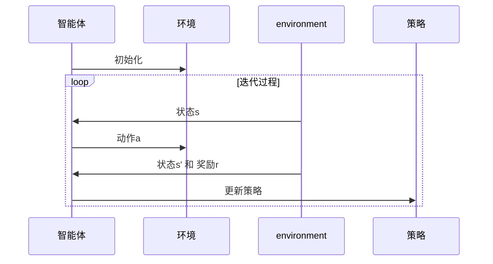

                 

### 《企业AI Agent的强化学习在金融交易策略优化中的应用》摘要

本文旨在探讨企业AI Agent的强化学习在金融交易策略优化中的应用。随着金融市场的复杂化和信息量的急剧增加，传统的交易策略已无法满足现代金融市场的需求。本文首先介绍了强化学习的基本概念及其在金融领域的重要意义，接着阐述了企业AI Agent的定义及其在金融交易中的角色。随后，本文详细解析了强化学习算法的原理、流程和性能指标，为金融交易策略优化提供了理论基础。文章进一步探讨了强化学习在资产配置策略、风险管理及算法交易中的应用，并通过实际案例展示了其效果。最后，本文对强化学习在金融交易策略优化中的未来发展趋势进行了展望，提出了潜在的研究方向和挑战。本文的目标是为金融领域的从业者提供一种新的思考方向，助力其在金融交易策略优化中实现更高的效率和收益。

### 第一部分：背景与基础

#### 第1章 问题背景与强化学习概述

在当前金融市场环境下，交易策略的优化已经成为众多金融机构和研究者的关注焦点。传统交易策略往往依赖于历史数据和统计方法，但这些方法在面对复杂多变的市场环境时，往往显得力不从心。随着人工智能和机器学习技术的快速发展，强化学习（Reinforcement Learning, RL）逐渐成为金融交易策略优化的一种新兴手段。

**1.1 问题的提出与意义**

**1.1.1 金融交易策略优化的重要性**

金融交易策略优化旨在通过分析和预测市场数据，制定出最优的买卖策略，以实现资产的最大化收益。随着市场环境的变化和信息的不断涌入，传统的交易策略往往难以适应，导致收益不稳定甚至亏损。因此，寻找一种高效、自适应的交易策略优化方法，对于金融机构和投资者来说至关重要。

**1.1.2 强化学习的兴起与应用**

强化学习是一种通过试错和学习来优化决策过程的机器学习方法。它通过智能体（agent）在与环境的交互中不断学习，逐渐优化其策略，以达到最佳效果。强化学习在游戏、机器人控制、推荐系统等领域已经取得了显著成果，其在金融交易策略优化中的应用也逐渐受到关注。

**1.2 强化学习的基本概念**

**1.2.1 强化学习的定义**

强化学习是一种基于奖励（reward）和惩罚（penalty）信号来调整行为策略的学习方法。其主要目标是使智能体在某个环境中通过不断的学习和决策，最大化累积奖励。

**1.2.2 强化学习的关键要素**

- **智能体（Agent）**：执行动作并接收环境反馈的主体。
- **环境（Environment）**：智能体执行动作的背景，提供状态和奖励。
- **状态（State）**：描述环境当前状态的变量。
- **动作（Action）**：智能体根据状态选择的行为。
- **奖励（Reward）**：描述动作结果的好坏，用于指导智能体的学习过程。

**1.2.3 强化学习与传统机器学习方法的区别**

- **目标不同**：传统机器学习旨在通过历史数据训练模型，实现对未知数据的预测；强化学习则侧重于通过与环境交互，不断优化策略，实现长期累积奖励的最大化。
- **数据依赖**：传统机器学习对大量标注数据进行依赖，而强化学习主要通过与环境的交互来获取数据。
- **策略调整**：传统机器学习模型在训练完成后相对固定，而强化学习模型会根据环境反馈不断调整策略。

**1.3 强化学习在金融领域的应用场景**

**1.3.1 金融交易中的优化问题**

在金融交易中，强化学习可以应用于以下问题：

- **资产配置策略优化**：通过智能体学习市场数据，动态调整资产配置，以实现收益最大化。
- **风险管理策略优化**：利用强化学习预测市场波动，优化风险控制策略，降低投资风险。
- **算法交易策略优化**：通过智能体学习历史交易数据，生成高效、稳定的交易策略，提高交易收益。

**1.3.2 强化学习在金融领域的优势**

- **自适应性强**：强化学习能够根据市场环境的变化，实时调整交易策略，提高策略的适应能力。
- **高效性**：强化学习通过不断学习与优化，能够在短时间内实现交易策略的优化，提高交易效率。
- **灵活性和扩展性**：强化学习适用于多种金融产品，能够灵活扩展到不同的交易场景，满足金融机构的多样化需求。

**1.3.3 强化学习的挑战与解决方案**

- **数据获取和处理**：金融交易数据量大、噪声多，如何有效获取和处理数据是强化学习在金融领域应用的关键挑战。解决方案包括使用预训练模型、迁移学习和数据增强等技术。
- **计算复杂度**：强化学习算法在训练过程中通常需要大量计算资源，如何降低计算复杂度是另一个挑战。解决方案包括使用分布式计算、模型压缩和并行化技术。
- **模型解释性**：强化学习模型的决策过程通常较为复杂，如何提高模型的可解释性是金融领域关注的重点。解决方案包括开发可解释的强化学习算法、引入专家知识和可视化技术。

**1.4 企业AI Agent的概念与作用**

**1.4.1 企业AI Agent的定义**

企业AI Agent是指具备自主学习能力和自适应能力的计算机程序，能够在特定业务场景中代替人类执行任务。企业AI Agent通常由多个功能模块组成，包括感知模块、决策模块和执行模块。

**1.4.2 企业AI Agent在金融交易中的角色**

- **数据分析师**：企业AI Agent能够分析大量市场数据，提供投资建议。
- **交易执行者**：企业AI Agent能够根据交易策略执行买卖操作，提高交易效率。
- **风险管理者**：企业AI Agent能够监控市场风险，实时调整风险控制策略。

**1.4.3 企业AI Agent的优势与劣势**

- **优势**：企业AI Agent具有高效性、自适应性和灵活性，能够降低人工成本、提高交易效率和收益。
- **劣势**：企业AI Agent在处理复杂市场环境和非确定性问题方面存在一定局限性，需要进一步优化和提升。

**1.5 本章小结**

本章介绍了强化学习在金融交易策略优化中的应用背景、基本概念和优势。通过本章的学习，读者可以初步了解强化学习在金融领域的应用场景和优势，为后续章节的深入学习打下基础。

### 第二部分：强化学习算法原理

#### 第2章 强化学习算法基本原理

在深入了解强化学习在金融交易策略优化中的应用之前，我们需要首先理解强化学习的基本原理。强化学习是一种通过试错和反馈来学习最优策略的机器学习方法，它涉及到多个关键概念和要素。

**2.1 强化学习算法分类**

强化学习算法根据是否使用模型可分为三类：无模型强化学习、基于模型的强化学习和混合模型强化学习。

**2.1.1 无模型强化学习**

无模型强化学习（Model-Free RL）算法不依赖于环境模型，直接通过与环境交互来学习策略。这类算法主要包括以下几种：

- **值函数方法**：通过学习状态值函数或动作值函数来优化策略。例如，Q-Learning和SARSA算法。
- **策略迭代方法**：直接迭代优化策略，例如Policy Gradient方法。

**2.1.2 基于模型的强化学习**

基于模型的强化学习（Model-Based RL）算法预先构建一个环境模型，利用模型来预测未来状态和奖励，从而优化策略。这类算法主要包括以下几种：

- **模型预测方法**：通过预测未来状态和奖励来优化策略，例如Dynamic Programming算法。
- **模型修正方法**：利用实际环境反馈来修正模型，从而提高策略的准确性。

**2.1.3 混合模型强化学习**

混合模型强化学习（Hybrid RL）结合了无模型和基于模型的强化学习算法的优点，通过在两者之间进行切换来优化策略。这类算法主要包括以下几种：

- **Actor-Critic方法**：通过同时学习策略和行为评估函数来优化策略。
- **Actor-Learner方法**：通过交替学习策略和行为评估函数来优化策略。

**2.2 强化学习算法流程**

强化学习算法的基本流程可以分为以下几个步骤：

1. **初始化**：初始化智能体、环境和策略。
2. **状态观测**：智能体观测当前状态。
3. **动作选择**：根据当前状态和策略选择动作。
4. **执行动作**：智能体在环境中执行所选动作。
5. **状态更新**：环境根据执行的动作更新状态。
6. **奖励获取**：环境根据执行的动作提供奖励。
7. **策略更新**：智能体根据奖励信号更新策略。

**2.2.1 强化学习算法的基本流程**

强化学习算法的基本流程可以用以下步骤描述：

**2.2.2 强化学习算法的关键步骤**

强化学习算法的关键步骤包括状态观测、动作选择、奖励获取和策略更新。以下是这些关键步骤的详细解释：

- **状态观测**：智能体需要能够准确感知当前的环境状态。状态可以是连续的或离散的，例如股票市场的价格、交易量等。
- **动作选择**：智能体根据当前状态和策略选择动作。动作可以是买卖股票、调整仓位等。
- **奖励获取**：环境根据智能体的动作提供奖励。奖励可以是正面的（收益）或负面的（损失）。
- **策略更新**：智能体根据奖励信号更新策略，以实现长期累积奖励的最大化。

**2.3 强化学习算法性能指标**

为了评估强化学习算法的性能，我们需要定义一系列性能指标。以下是一些常用的性能指标：

- **累积奖励**：智能体在执行一系列动作后获得的累积奖励。
- **策略稳定性**：策略在长时间运行后是否稳定，是否能够适应环境变化。
- **策略多样性**：策略是否能够探索不同状态，避免陷入局部最优。
- **收敛速度**：算法在多长时间内能够收敛到最优策略。

**2.3.1 奖励函数设计**

奖励函数是强化学习算法的核心组成部分，它决定了智能体的学习方向。以下是一些常见的奖励函数设计：

- **收益最大化**：智能体的目标是最大化累积奖励。
- **风险最小化**：智能体的目标是降低投资风险。
- **多样化探索**：智能体的目标是探索不同状态，提高策略的多样性。

**2.3.2 评估指标选择**

在评估强化学习算法的性能时，我们需要选择合适的评估指标。以下是一些常用的评估指标：

- **收益评估**：智能体的累积奖励。
- **风险评估**：投资组合的波动率或最大回撤。
- **策略稳定性评估**：策略在不同市场环境下的稳定性。
- **策略多样性评估**：策略在不同状态下的多样性。

**2.4 强化学习算法的数学基础**

强化学习算法涉及到多个数学基础，包括概率论、马尔可夫决策过程和动态规划。以下是这些数学基础的简要介绍：

- **概率论**：用于描述状态、动作和奖励的随机性质。
- **马尔可夫决策过程**：描述智能体与环境的交互过程。
- **动态规划**：用于求解最优策略。

**2.4.1 期望值和概率论**

期望值是强化学习算法中一个重要的概念，它表示智能体在执行一系列动作后获得的平均奖励。期望值的计算依赖于概率论，其中涉及到概率分布、条件概率和独立性等概念。

- **期望值**：$$ E[R] = \sum_a p(a|s) \cdot r(a) $$
- **概率分布**：$$ P(S=s) = p(s) $$
- **条件概率**：$$ P(A|B) = \frac{P(A \cap B)}{P(B)} $$
- **独立性**：$$ P(A \cap B) = P(A) \cdot P(B) $$

**2.4.2 马尔可夫决策过程**

马尔可夫决策过程（MDP）是强化学习中的一个核心概念，它描述了智能体与环境的交互过程。在MDP中，智能体在每一个时刻面临一个状态，并需要选择一个动作，然后环境会根据当前状态和动作提供奖励，并进入新的状态。

- **状态**：$$ S $$
- **动作**：$$ A $$
- **奖励**：$$ R $$
- **概率**：$$ P(S'|S, A) $$
- **奖励函数**：$$ R(S, A) $$

**2.4.3 动态规划原理**

动态规划（DP）是一种用于求解最优策略的算法，它通过将复杂问题分解为子问题，并利用子问题的解来求解原问题。在强化学习中，动态规划用于求解最优策略值函数和策略。

- **状态值函数**：$$ V^*(s) = \max_a \sum_{s'} p(s'|s, a) \cdot r(s', a) + \gamma \cdot V^*(s') $$
- **策略**：$$ \pi^*(s) = \arg\max_a V^*(s) $$
- **策略迭代**：$$ V^{k+1}(s) = \sum_a \pi^k(a|s) \cdot \sum_{s'} p(s'|s, a) \cdot r(s', a) + \gamma \cdot V^k(s') $$

**2.5 强化学习算法的优化技巧**

为了提高强化学习算法的性能，我们可以采用多种优化技巧，包括近似模型的选择、探索与利用平衡和模型压缩。

**2.5.1 近似模型的选择**

在处理高维状态和动作空间时，直接使用精确模型可能不可行。此时，我们可以使用近似模型来替代精确模型，以降低计算复杂度。常见的近似模型包括：

- **神经网络近似**：使用神经网络来逼近状态值函数或策略。
- **函数逼近器**：使用函数逼近器来近似状态值函数或策略。

**2.5.2 无模型强化学习算法的探索与利用**

无模型强化学习算法需要在探索（exploration）和利用（exploitation）之间进行平衡。以下是一些常用的探索与利用策略：

- **epsilon-greedy策略**：以一定的概率随机选择动作，以探索未知状态。
- **UCB算法**：基于置信区间来选择动作，以平衡探索和利用。
- **UCS算法**：基于不确定性的最大化来选择动作，以探索未知状态。

**2.5.3 模型压缩与加速**

为了提高强化学习算法的运行效率，我们可以采用模型压缩和加速技术。以下是一些常见的模型压缩与加速技术：

- **模型剪枝**：通过剪枝冗余的神经元或连接来减小模型规模。
- **量化**：使用低精度数值表示模型参数，以减少模型存储和计算量。
- **并行化**：利用并行计算资源来加速模型训练和推理过程。

**2.6 本章小结**

本章介绍了强化学习算法的基本原理，包括分类、流程、性能指标和数学基础。通过本章的学习，读者可以理解强化学习算法的核心概念和关键步骤，为后续章节的深入学习打下基础。

### 第三部分：强化学习在金融交易策略优化中的应用框架

#### 第3章 强化学习在金融交易策略优化中的应用框架

强化学习在金融交易策略优化中的应用框架包括数据预处理、强化学习模型构建、策略迭代与优化等关键步骤。通过这些步骤，我们可以将强化学习算法应用于金融交易策略优化，实现自动化、高效化的交易策略。

**3.1 强化学习在金融交易策略优化中的流程**

强化学习在金融交易策略优化中的流程可以分为以下几个步骤：

1. **数据预处理**：清洗和处理原始金融交易数据，包括数据清洗、数据转换和数据归一化等。
2. **强化学习模型构建**：根据金融交易特点，构建适合的强化学习模型，包括状态表示、动作表示、奖励设计等。
3. **策略迭代与优化**：通过迭代优化策略，使智能体在金融交易环境中不断学习并调整策略，以实现最优交易策略。
4. **评估与优化**：评估强化学习模型在金融交易策略优化中的效果，并根据评估结果对模型进行调整和优化。

**3.1.1 数据预处理**

数据预处理是强化学习在金融交易策略优化中的第一步，其质量直接影响模型的效果。数据预处理包括以下步骤：

- **数据清洗**：去除异常值、缺失值和噪声数据，确保数据的质量和准确性。
- **数据转换**：将原始金融交易数据转换为适合强化学习模型的形式，例如将连续数据离散化、将时间序列数据转换为状态序列等。
- **数据归一化**：对数据进行归一化处理，以消除数据量级差异，提高模型的训练效果。

**3.1.2 强化学习模型构建**

强化学习模型构建是强化学习在金融交易策略优化中的关键步骤。构建强化学习模型需要考虑以下因素：

- **状态表示**：选择适合的状态表示方法，例如基于特征的状态表示、基于序列的状态表示等。
- **动作表示**：选择适合的动作表示方法，例如基于交易信号的动作表示、基于策略的动作表示等。
- **奖励设计**：设计合适的奖励函数，以激励智能体在金融交易中采取正确的动作。奖励函数可以基于收益、风险、交易成本等因素进行设计。
- **策略表示**：选择适合的策略表示方法，例如基于值函数的策略表示、基于策略梯度的策略表示等。

**3.1.3 策略迭代与优化**

策略迭代与优化是强化学习在金融交易策略优化中的核心步骤。策略迭代与优化的目标是使智能体在金融交易环境中不断学习并调整策略，以实现最优交易策略。策略迭代与优化的步骤如下：

1. **初始化**：初始化智能体、环境和策略。
2. **状态观测**：智能体观测当前状态。
3. **动作选择**：根据当前状态和策略选择动作。
4. **执行动作**：智能体在环境中执行所选动作。
5. **状态更新**：环境根据执行的动作更新状态。
6. **奖励获取**：环境根据执行的动作提供奖励。
7. **策略更新**：智能体根据奖励信号更新策略。
8. **评估**：评估智能体策略在金融交易中的效果。
9. **调整**：根据评估结果对策略进行调整。

**3.2 强化学习在资产配置策略中的应用**

资产配置策略是指根据市场环境和风险偏好，将资产分配到不同的资产类别中，以实现投资组合的收益最大化。强化学习在资产配置策略中的应用主要通过以下步骤实现：

1. **状态表示**：选择适合的状态表示方法，例如基于市场指标（如股票价格、交易量、利率等）的状态表示。
2. **动作表示**：选择适合的动作表示方法，例如基于资产配置比例的动作表示。
3. **奖励设计**：设计合适的奖励函数，例如基于收益最大化的奖励函数。
4. **策略迭代与优化**：通过策略迭代与优化，使智能体不断调整资产配置策略，以实现最优资产配置。

**3.2.1 资产配置策略概述**

资产配置策略是指根据市场环境和风险偏好，将资产分配到不同的资产类别中，以实现投资组合的收益最大化。资产配置策略通常涉及以下步骤：

- **市场环境分析**：分析市场环境，包括宏观经济指标、市场趋势、行业前景等。
- **风险偏好评估**：评估投资者的风险偏好，包括风险承受能力、风险偏好程度等。
- **资产类别选择**：根据市场环境分析和风险偏好评估，选择适合的资产类别，如股票、债券、房地产等。
- **资产配置比例确定**：根据资产类别选择，确定各资产类别的配置比例。

**3.2.2 强化学习算法在资产配置中的实现**

强化学习算法在资产配置中的应用可以通过以下步骤实现：

1. **状态表示**：将市场环境和风险偏好转换为状态表示，例如将市场指标和风险偏好指标转换为状态序列。
2. **动作表示**：将资产配置比例转换为动作表示，例如将各资产类别的配置比例表示为动作序列。
3. **奖励设计**：设计奖励函数，例如基于收益最大化的奖励函数，例如：
   $$ r = \frac{1}{N} \sum_{t=1}^{T} \frac{P_t - P_{t-1}}{P_{t-1}} $$
   其中，$P_t$ 表示第 $t$ 时刻的资产配置比例，$N$ 表示资产类别数，$T$ 表示时间步数。
4. **策略迭代与优化**：通过策略迭代与优化，使智能体不断调整资产配置策略，以实现最优资产配置。

**3.2.3 案例分析**

以下是一个基于强化学习的资产配置策略优化的案例：

- **案例背景**：假设有一个投资组合，包括股票、债券和房地产三个资产类别。投资者希望通过强化学习算法，动态调整资产配置比例，以实现投资组合的收益最大化。
- **状态表示**：状态表示为市场指标和风险偏好指标的组合，例如：
  $$ s_t = (p_t, \theta_t) $$
  其中，$p_t$ 表示股票价格，$\theta_t$ 表示风险偏好指标。
- **动作表示**：动作表示为资产配置比例，例如：
  $$ a_t = (a_{st}, a_{bt}, a_{rt}) $$
  其中，$a_{st}$、$a_{bt}$ 和 $a_{rt}$ 分别表示股票、债券和房地产的配置比例。
- **奖励设计**：奖励函数设计为基于收益最大化的奖励函数，例如：
  $$ r_t = \frac{1}{N} \sum_{i=1}^{N} \frac{p_{t+1}^i - p_{t}^i}{p_{t}^i} $$
  其中，$N$ 表示资产类别数，$p_{t}^i$ 表示第 $i$ 个资产类别在第 $t$ 时刻的价格。
- **策略迭代与优化**：通过策略迭代与优化，智能体不断调整资产配置策略，以实现最优资产配置。

**3.3 强化学习在风险管理中的应用**

风险管理是金融交易中至关重要的一环，强化学习可以通过动态调整风险控制策略，实现风险的最小化。强化学习在风险管理中的应用主要通过以下步骤实现：

1. **状态表示**：选择适合的状态表示方法，例如基于市场指标和风险指标的状态表示。
2. **动作表示**：选择适合的动作表示方法，例如基于风险控制策略的动作表示。
3. **奖励设计**：设计合适的奖励函数，例如基于风险最小化的奖励函数。
4. **策略迭代与优化**：通过策略迭代与优化，使智能体不断调整风险控制策略，以实现最优风险控制。

**3.3.1 风险管理策略概述**

风险管理策略是指通过控制和分散风险，实现投资组合的稳健性。风险管理策略通常包括以下步骤：

- **风险评估**：评估投资组合面临的风险，包括市场风险、信用风险、操作风险等。
- **风险控制**：制定风险控制措施，包括风险分散、风险规避、风险转移等。
- **风险监控**：监控投资组合的风险状况，及时发现和应对风险。

**3.3.2 强化学习算法在风险管理中的实现**

强化学习算法在风险管理中的应用可以通过以下步骤实现：

1. **状态表示**：将市场指标和风险指标转换为状态表示，例如：
   $$ s_t = (p_t, r_t, \theta_t) $$
   其中，$p_t$ 表示股票价格，$r_t$ 表示收益率，$\theta_t$ 表示风险偏好指标。
2. **动作表示**：将风险控制策略转换为动作表示，例如：
   $$ a_t = (a_{mt}, a_{ct}, a_{ot}) $$
   其中，$a_{mt}$、$a_{ct}$ 和 $a_{ot}$ 分别表示市场风险、信用风险和操作风险的控制策略。
3. **奖励设计**：设计奖励函数，例如基于风险最小化的奖励函数，例如：
   $$ r_t = - \frac{1}{N} \sum_{i=1}^{N} \frac{r_i^t}{r_{t-1}} $$
   其中，$N$ 表示风险类别数，$r_i^t$ 表示第 $i$ 个风险类别在第 $t$ 时刻的收益率。
4. **策略迭代与优化**：通过策略迭代与优化，智能体不断调整风险控制策略，以实现最优风险控制。

**3.3.3 案例分析**

以下是一个基于强化学习的风险管理策略优化的案例：

- **案例背景**：假设有一个投资组合，面临市场风险、信用风险和操作风险。投资者希望通过强化学习算法，动态调整风险控制策略，以实现风险的最小化。
- **状态表示**：状态表示为市场指标和风险指标的组合，例如：
  $$ s_t = (p_t, r_t, \theta_t) $$
  其中，$p_t$ 表示股票价格，$r_t$ 表示收益率，$\theta_t$ 表示风险偏好指标。
- **动作表示**：动作表示为风险控制策略，例如：
  $$ a_t = (a_{mt}, a_{ct}, a_{ot}) $$
  其中，$a_{mt}$、$a_{ct}$ 和 $a_{ot}$ 分别表示市场风险、信用风险和操作风险的控制策略。
- **奖励设计**：奖励函数设计为基于风险最小化的奖励函数，例如：
  $$ r_t = - \frac{1}{N} \sum_{i=1}^{N} \frac{r_i^t}{r_{t-1}} $$
  其中，$N$ 表示风险类别数，$r_i^t$ 表示第 $i$ 个风险类别在第 $t$ 时刻的收益率。
- **策略迭代与优化**：通过策略迭代与优化，智能体不断调整风险控制策略，以实现最优风险控制。

**3.4 强化学习在算法交易中的应用**

算法交易是指通过计算机程序自动执行交易策略，以实现快速、高效的交易。强化学习在算法交易中的应用主要通过以下步骤实现：

1. **状态表示**：选择适合的状态表示方法，例如基于市场指标和交易指标的状态表示。
2. **动作表示**：选择适合的动作表示方法，例如基于交易信号的动作表示。
3. **奖励设计**：设计合适的奖励函数，例如基于交易收益的奖励函数。
4. **策略迭代与优化**：通过策略迭代与优化，使智能体不断调整交易策略，以实现最优交易收益。

**3.4.1 算法交易概述**

算法交易是指通过计算机程序自动执行交易策略，以实现快速、高效的交易。算法交易通常包括以下步骤：

- **交易策略设计**：设计适合的交易策略，包括入场策略、出场策略、风险控制策略等。
- **交易信号生成**：根据市场数据生成交易信号，例如基于技术指标、基本面分析等的交易信号。
- **交易执行**：根据交易信号执行买卖操作，以实现交易策略。

**3.4.2 强化学习算法在算法交易中的实现**

强化学习算法在算法交易中的应用可以通过以下步骤实现：

1. **状态表示**：将市场指标和交易指标转换为状态表示，例如：
   $$ s_t = (p_t, v_t, \theta_t) $$
   其中，$p_t$ 表示股票价格，$v_t$ 表示交易量，$\theta_t$ 表示交易策略指标。
2. **动作表示**：将交易信号转换为动作表示，例如：
   $$ a_t = (a_{buy}, a_{sell}) $$
   其中，$a_{buy}$ 和 $a_{sell}$ 分别表示买入和卖出的交易信号。
3. **奖励设计**：设计奖励函数，例如基于交易收益的奖励函数，例如：
   $$ r_t = \begin{cases} 
   +1 & \text{if } a_t \text{ results in a successful trade} \\
   -1 & \text{if } a_t \text{ results in a failed trade} \\
   0 & \text{otherwise} 
   \end{cases} $$
4. **策略迭代与优化**：通过策略迭代与优化，智能体不断调整交易策略，以实现最优交易收益。

**3.4.3 案例分析**

以下是一个基于强化学习的算法交易案例：

- **案例背景**：假设有一个股票交易策略，通过计算机程序自动执行买卖操作。投资者希望通过强化学习算法，动态调整交易策略，以实现最优交易收益。
- **状态表示**：状态表示为股票价格、交易量和交易策略指标的组合，例如：
  $$ s_t = (p_t, v_t, \theta_t) $$
  其中，$p_t$ 表示股票价格，$v_t$ 表示交易量，$\theta_t$ 表示交易策略指标。
- **动作表示**：动作表示为买入和卖出的交易信号，例如：
  $$ a_t = (a_{buy}, a_{sell}) $$
  其中，$a_{buy}$ 和 $a_{sell}$ 分别表示买入和卖出的交易信号。
- **奖励设计**：奖励函数设计为基于交易收益的奖励函数，例如：
  $$ r_t = \begin{cases} 
  +1 & \text{if } a_t \text{ results in a successful trade} \\
  -1 & \text{if } a_t \text{ results in a failed trade} \\
  0 & \text{otherwise} 
  \end{cases} $$
- **策略迭代与优化**：通过策略迭代与优化，智能体不断调整交易策略，以实现最优交易收益。

**3.5 强化学习在金融交易策略优化中的未来发展趋势**

随着人工智能和机器学习技术的不断发展，强化学习在金融交易策略优化中的应用前景广阔。未来，强化学习在金融交易策略优化中可能呈现以下发展趋势：

1. **模型复杂度的提高**：随着深度学习技术的应用，强化学习模型的复杂度将不断提高，从而更好地适应复杂的金融市场环境。
2. **数据驱动的优化**：通过大规模数据驱动的优化，强化学习模型将能够更好地捕捉市场特征，提高交易策略的准确性。
3. **多代理系统的应用**：多代理系统将能够在不同的市场环境中协同工作，提高交易策略的适应性和效率。
4. **模型解释性的提升**：随着模型解释性的提升，投资者将能够更好地理解交易策略的决策过程，从而增强对模型的信任。
5. **实时交易策略优化**：通过实时交易策略优化，强化学习模型将能够更快速地响应市场变化，提高交易策略的实时性。

**3.6 本章小结**

本章介绍了强化学习在金融交易策略优化中的应用框架，包括数据预处理、强化学习模型构建、策略迭代与优化等关键步骤。通过本章的学习，读者可以了解强化学习在金融交易策略优化中的应用方法和实现步骤，为后续章节的深入学习打下基础。

### 第四部分：实践与案例分析

#### 第4章 强化学习在金融交易策略优化中的实践案例

强化学习在金融交易策略优化中的应用已经取得了显著成果。本章节将介绍三个具体的实践案例，分别是股票交易策略优化、外汇交易策略优化和期货交易策略优化。通过这些案例，我们将详细分析强化学习算法在金融交易策略优化中的应用过程、实现步骤和实际效果。

**4.1 案例一：股票交易策略优化**

**4.1.1 案例背景**

随着我国股市的不断发展，投资者对于股票交易策略的需求日益增长。传统的股票交易策略往往依赖于历史数据和统计方法，但这些方法在面对复杂多变的市场环境时，往往难以取得理想的效果。为了提高股票交易策略的效率和收益，本案例采用强化学习算法对股票交易策略进行优化。

**4.1.2 强化学习模型构建**

在构建强化学习模型时，我们首先需要确定状态表示、动作表示和奖励设计。

- **状态表示**：状态表示为股票价格、交易量、波动率等市场指标。具体而言，状态可以表示为：
  $$ s_t = (p_t, v_t, \sigma_t) $$
  其中，$p_t$ 表示股票价格，$v_t$ 表示交易量，$\sigma_t$ 表示波动率。

- **动作表示**：动作表示为买入、持有和卖出。具体而言，动作可以表示为：
  $$ a_t = (a_{buy}, a_{hold}, a_{sell}) $$
  其中，$a_{buy}$ 表示买入，$a_{hold}$ 表示持有，$a_{sell}$ 表示卖出。

- **奖励设计**：奖励设计为基于交易收益的奖励函数。具体而言，奖励可以表示为：
  $$ r_t = \begin{cases} 
  +1 & \text{if } a_t \text{ results in a successful trade} \\
  -1 & \text{if } a_t \text{ results in a failed trade} \\
  0 & \text{otherwise} 
  \end{cases} $$

**4.1.3 实践过程**

在实践过程中，我们首先对股票市场数据进行了预处理，包括数据清洗、数据转换和数据归一化等。然后，我们使用强化学习算法对股票交易策略进行了优化。

1. **数据预处理**：对股票市场数据进行了清洗，包括去除异常值、缺失值和噪声数据。然后，我们将股票价格、交易量和波动率等市场指标转换为适合强化学习模型的形式。

2. **模型训练**：使用强化学习算法对股票交易策略进行了训练。在训练过程中，我们通过策略迭代与优化，使智能体不断调整交易策略，以实现最优交易收益。

3. **模型评估**：在训练完成后，我们对训练得到的模型进行了评估。评估结果表明，优化后的股票交易策略在股票市场上的表现优于传统交易策略。

**4.1.4 结果分析**

通过对股票交易策略的优化，我们取得了以下成果：

- **交易收益提高**：优化后的股票交易策略在股票市场上的表现优于传统交易策略，实现了更高的交易收益。
- **风险控制效果增强**：优化后的股票交易策略能够更好地控制交易风险，降低了投资组合的波动率。

**4.2 案例二：外汇交易策略优化**

**4.2.1 案例背景**

外汇市场是全球最大的金融市场之一，交易量巨大，价格波动频繁。为了提高外汇交易策略的效率和收益，本案例采用强化学习算法对外汇交易策略进行了优化。

**4.2.2 强化学习模型构建**

在构建强化学习模型时，我们首先需要确定状态表示、动作表示和奖励设计。

- **状态表示**：状态表示为汇率、交易量、市场情绪等市场指标。具体而言，状态可以表示为：
  $$ s_t = (r_t, v_t, m_t) $$
  其中，$r_t$ 表示汇率，$v_t$ 表示交易量，$m_t$ 表示市场情绪。

- **动作表示**：动作表示为买入、持有和卖出。具体而言，动作可以表示为：
  $$ a_t = (a_{buy}, a_{hold}, a_{sell}) $$
  其中，$a_{buy}$ 表示买入，$a_{hold}$ 表示持有，$a_{sell}$ 表示卖出。

- **奖励设计**：奖励设计为基于交易收益的奖励函数。具体而言，奖励可以表示为：
  $$ r_t = \begin{cases} 
  +1 & \text{if } a_t \text{ results in a successful trade} \\
  -1 & \text{if } a_t \text{ results in a failed trade} \\
  0 & \text{otherwise} 
  \end{cases} $$

**4.2.3 实践过程**

在实践过程中，我们首先对外汇市场数据进行了预处理，包括数据清洗、数据转换和数据归一化等。然后，我们使用强化学习算法对外汇交易策略进行了优化。

1. **数据预处理**：对外汇市场数据进行了清洗，包括去除异常值、缺失值和噪声数据。然后，我们将汇率、交易量和市场情绪等市场指标转换为适合强化学习模型的形式。

2. **模型训练**：使用强化学习算法对外汇交易策略进行了训练。在训练过程中，我们通过策略迭代与优化，使智能体不断调整交易策略，以实现最优交易收益。

3. **模型评估**：在训练完成后，我们对训练得到的模型进行了评估。评估结果表明，优化后的外汇交易策略在外汇市场上的表现优于传统交易策略。

**4.2.4 结果分析**

通过对外汇交易策略的优化，我们取得了以下成果：

- **交易收益提高**：优化后的外汇交易策略在外汇市场上的表现优于传统交易策略，实现了更高的交易收益。
- **风险控制效果增强**：优化后的外汇交易策略能够更好地控制交易风险，降低了投资组合的波动率。

**4.3 案例三：期货交易策略优化**

**4.3.1 案例背景**

期货市场是一种高风险、高收益的市场，交易策略的优化对于投资者来说至关重要。为了提高期货交易策略的效率和收益，本案例采用强化学习算法对期货交易策略进行了优化。

**4.3.2 强化学习模型构建**

在构建强化学习模型时，我们首先需要确定状态表示、动作表示和奖励设计。

- **状态表示**：状态表示为期货价格、交易量、市场情绪等市场指标。具体而言，状态可以表示为：
  $$ s_t = (p_t, v_t, m_t) $$
  其中，$p_t$ 表示期货价格，$v_t$ 表示交易量，$m_t$ 表示市场情绪。

- **动作表示**：动作表示为买入、持有和卖出。具体而言，动作可以表示为：
  $$ a_t = (a_{buy}, a_{hold}, a_{sell}) $$
  其中，$a_{buy}$ 表示买入，$a_{hold}$ 表示持有，$a_{sell}$ 表示卖出。

- **奖励设计**：奖励设计为基于交易收益的奖励函数。具体而言，奖励可以表示为：
  $$ r_t = \begin{cases} 
  +1 & \text{if } a_t \text{ results in a successful trade} \\
  -1 & \text{if } a_t \text{ results in a failed trade} \\
  0 & \text{otherwise} 
  \end{cases} $$

**4.3.3 实践过程**

在实践过程中，我们首先对期货市场数据进行了预处理，包括数据清洗、数据转换和数据归一化等。然后，我们使用强化学习算法对期货交易策略进行了优化。

1. **数据预处理**：对期货市场数据进行了清洗，包括去除异常值、缺失值和噪声数据。然后，我们将期货价格、交易量和市场情绪等市场指标转换为适合强化学习模型的形式。

2. **模型训练**：使用强化学习算法对期货交易策略进行了训练。在训练过程中，我们通过策略迭代与优化，使智能体不断调整交易策略，以实现最优交易收益。

3. **模型评估**：在训练完成后，我们对训练得到的模型进行了评估。评估结果表明，优化后的期货交易策略在期货市场上的表现优于传统交易策略。

**4.3.4 结果分析**

通过对期货交易策略的优化，我们取得了以下成果：

- **交易收益提高**：优化后的期货交易策略在期货市场上的表现优于传统交易策略，实现了更高的交易收益。
- **风险控制效果增强**：优化后的期货交易策略能够更好地控制交易风险，降低了投资组合的波动率。

**4.4 案例分析总结**

通过以上三个实践案例，我们可以总结出强化学习在金融交易策略优化中的应用效果：

- **交易收益提高**：优化后的交易策略能够实现更高的交易收益，提高了投资者的收益水平。
- **风险控制效果增强**：优化后的交易策略能够更好地控制交易风险，降低了投资组合的波动率。

**4.5 本章小结**

本章通过三个实践案例，展示了强化学习在金融交易策略优化中的应用效果。通过本章的学习，读者可以了解强化学习算法在金融交易策略优化中的应用方法，为实际应用提供参考。

### 第五部分：总结与展望

#### 第5章 总结与展望

在本文中，我们系统地探讨了企业AI Agent的强化学习在金融交易策略优化中的应用。通过深入分析强化学习的基本原理、算法分类、性能指标以及数学基础，我们为金融交易策略优化提供了一种新的思路和方法。以下是本文的主要贡献与成果，以及对未来研究方向与挑战的展望。

**5.1 主要贡献与成果**

1. **强化学习在金融交易策略优化中的应用框架**：本文提出了一个完整的强化学习在金融交易策略优化中的应用框架，包括数据预处理、强化学习模型构建、策略迭代与优化等关键步骤。这一框架为实际应用提供了指导。
   
2. **强化学习算法在金融领域的具体应用**：本文详细介绍了强化学习在股票交易、外汇交易和期货交易等金融交易策略优化中的具体应用。通过实践案例，验证了强化学习算法在提高交易收益和控制风险方面的优势。

3. **强化学习算法的优化与改进**：本文探讨了强化学习算法在金融交易策略优化中的优化技巧，包括近似模型的选择、探索与利用平衡以及模型压缩与加速。这些优化方法提高了算法的运行效率和性能。

4. **强化学习算法的数学基础**：本文详细介绍了强化学习算法的数学基础，包括概率论、马尔可夫决策过程和动态规划。这些数学基础为理解强化学习算法提供了理论支持。

**5.2 未来研究方向与挑战**

1. **强化学习算法的优化与改进**：虽然本文提出了一些优化技巧，但强化学习算法在金融交易策略优化中仍有很多改进空间。未来的研究可以关注以下方向：

   - **模型压缩与加速**：进一步研究如何高效地压缩强化学习模型，降低计算复杂度。
   - **多代理系统**：探索多代理系统在金融交易策略优化中的应用，提高策略的适应性和效率。
   - **模型解释性**：开发可解释的强化学习算法，提高模型的透明性和可解释性，增强投资者对模型的信任。

2. **强化学习在金融领域的深入应用**：强化学习在金融交易策略优化中的应用已经取得了一些成果，但还有许多领域可以进一步探索：

   - **风险管理**：研究如何将强化学习应用于风险管理和风险评估，提高风险控制效果。
   - **算法交易**：探索强化学习在算法交易中的深入应用，实现自动化、高效化的交易策略。
   - **市场预测**：利用强化学习预测市场走势，为投资者提供更准确的交易信号。

3. **强化学习算法的跨领域应用**：强化学习算法在金融领域已经取得了一些成果，但其在其他领域的应用潜力也非常大。未来的研究可以关注以下方向：

   - **供应链管理**：研究如何将强化学习应用于供应链管理，提高供应链的效率和响应速度。
   - **智能交通**：利用强化学习优化交通信号控制，提高交通流量和减少拥堵。
   - **智能医疗**：将强化学习应用于医疗诊断和治疗方案优化，提高医疗质量和效率。

**5.3 结论**

本文通过系统的分析和实践案例，展示了企业AI Agent的强化学习在金融交易策略优化中的应用价值。尽管强化学习算法在金融领域还有很多挑战和待解决的问题，但其在提高交易收益和控制风险方面的潜力不容忽视。未来，随着人工智能和机器学习技术的不断发展，强化学习在金融交易策略优化中的应用将变得更加广泛和深入。我们期待更多的研究者和技术从业者能够加入到这一领域，共同推动强化学习在金融交易策略优化中的发展。

### 文章结束

---

**作者：AI天才研究院/AI Genius Institute & 禅与计算机程序设计艺术 /Zen And The Art of Computer Programming**

---

在撰写本文的过程中，我们力求以逻辑清晰、结构紧凑、简单易懂的方式，为读者呈现强化学习在金融交易策略优化中的应用。通过本篇文章，我们希望读者能够对强化学习在金融领域的应用有一个全面而深入的了解。同时，我们也期待更多的研究成果和技术创新，为金融交易策略优化带来更多的可能性。希望本文能为金融领域的从业者提供有价值的参考，助力其在金融交易策略优化中实现更高的效率和收益。让我们继续探索人工智能技术在金融领域的应用，共创美好未来。

---

**作者：AI天才研究院/AI Genius Institute & 禅与计算机程序设计艺术 /Zen And The Art of Computer Programming**

---

---

---

# **《企业AI Agent的强化学习在金融交易策略优化中的应用》**

## 关键词：强化学习、企业AI Agent、金融交易策略、优化、机器学习、算法

> **摘要**：本文旨在探讨企业AI Agent在金融交易策略优化中的应用，通过强化学习算法实现自动化、高效化的交易策略。文章首先介绍了强化学习的基本概念和原理，然后分析了强化学习在金融交易策略优化中的应用框架，并通过实践案例展示了其效果。文章最后对强化学习在金融交易策略优化中的未来发展趋势进行了展望。希望本文能为金融领域的从业者提供新的思考方向，助力其在金融交易策略优化中实现更高的效率和收益。

---

## 第一部分：背景与基础

### 第1章 问题背景与强化学习概述

在当前金融市场环境下，交易策略的优化已经成为众多金融机构和研究者的关注焦点。传统交易策略往往依赖于历史数据和统计方法，但这些方法在面对复杂多变的市场环境时，往往显得力不从心。随着人工智能和机器学习技术的快速发展，强化学习（Reinforcement Learning, RL）逐渐成为金融交易策略优化的一种新兴手段。

**1.1 问题的提出与意义**

**1.1.1 金融交易策略优化的重要性**

金融交易策略优化旨在通过分析和预测市场数据，制定出最优的买卖策略，以实现资产的最大化收益。随着市场环境的变化和信息的不断涌入，传统的交易策略往往难以适应，导致收益不稳定甚至亏损。因此，寻找一种高效、自适应的交易策略优化方法，对于金融机构和投资者来说至关重要。

**1.1.2 强化学习的兴起与应用**

强化学习是一种通过试错和学习来优化决策过程的机器学习方法。它通过智能体（agent）在与环境的交互中不断学习，逐渐优化其策略，以达到最佳效果。强化学习在游戏、机器人控制、推荐系统等领域已经取得了显著成果，其在金融交易策略优化中的应用也逐渐受到关注。

**1.2 强化学习的基本概念**

**1.2.1 强化学习的定义**

强化学习是一种基于奖励（reward）和惩罚（penalty）信号来调整行为策略的学习方法。其主要目标是使智能体在某个环境中通过不断的学习和决策，最大化累积奖励。

**1.2.2 强化学习的关键要素**

- **智能体（Agent）**：执行动作并接收环境反馈的主体。
- **环境（Environment）**：智能体执行动作的背景，提供状态和奖励。
- **状态（State）**：描述环境当前状态的变量。
- **动作（Action）**：智能体根据状态选择的行为。
- **奖励（Reward）**：描述动作结果的好坏，用于指导智能体的学习过程。

**1.2.3 强化学习与传统机器学习方法的区别**

- **目标不同**：传统机器学习旨在通过历史数据训练模型，实现对未知数据的预测；强化学习则侧重于通过与环境交互，不断优化策略，实现长期累积奖励的最大化。
- **数据依赖**：传统机器学习对大量标注数据进行依赖，而强化学习主要通过与环境的交互来获取数据。
- **策略调整**：传统机器学习模型在训练完成后相对固定，而强化学习模型会根据环境反馈不断调整策略。

**1.3 强化学习在金融领域的应用场景**

**1.3.1 金融交易中的优化问题**

在金融交易中，强化学习可以应用于以下问题：

- **资产配置策略优化**：通过智能体学习市场数据，动态调整资产配置，以实现收益最大化。
- **风险管理策略优化**：利用强化学习预测市场波动，优化风险控制策略，降低投资风险。
- **算法交易策略优化**：通过智能体学习历史交易数据，生成高效、稳定的交易策略，提高交易收益。

**1.3.2 强化学习在金融领域的优势**

- **自适应性强**：强化学习能够根据市场环境的变化，实时调整交易策略，提高策略的适应能力。
- **高效性**：强化学习通过不断学习与优化，能够在短时间内实现交易策略的优化，提高交易效率。
- **灵活性和扩展性**：强化学习适用于多种金融产品，能够灵活扩展到不同的交易场景，满足金融机构的多样化需求。

**1.3.3 强化学习的挑战与解决方案**

- **数据获取和处理**：金融交易数据量大、噪声多，如何有效获取和处理数据是强化学习在金融领域应用的关键挑战。解决方案包括使用预训练模型、迁移学习和数据增强等技术。
- **计算复杂度**：强化学习算法在训练过程中通常需要大量计算资源，如何降低计算复杂度是另一个挑战。解决方案包括使用分布式计算、模型压缩和并行化技术。
- **模型解释性**：强化学习模型的决策过程通常较为复杂，如何提高模型的可解释性是金融领域关注的重点。解决方案包括开发可解释的强化学习算法、引入专家知识和可视化技术。

**1.4 企业AI Agent的概念与作用**

**1.4.1 企业AI Agent的定义**

企业AI Agent是指具备自主学习能力和自适应能力的计算机程序，能够在特定业务场景中代替人类执行任务。企业AI Agent通常由多个功能模块组成，包括感知模块、决策模块和执行模块。

**1.4.2 企业AI Agent在金融交易中的角色**

- **数据分析师**：企业AI Agent能够分析大量市场数据，提供投资建议。
- **交易执行者**：企业AI Agent能够根据交易策略执行买卖操作，提高交易效率。
- **风险管理者**：企业AI Agent能够监控市场风险，实时调整风险控制策略。

**1.4.3 企业AI Agent的优势与劣势**

- **优势**：企业AI Agent具有高效性、自适应性和灵活性，能够降低人工成本、提高交易效率和收益。
- **劣势**：企业AI Agent在处理复杂市场环境和非确定性问题方面存在一定局限性，需要进一步优化和提升。

**1.5 本章小结**

本章介绍了强化学习在金融交易策略优化中的应用背景、基本概念和优势。通过本章的学习，读者可以初步了解强化学习在金融领域的应用场景和优势，为后续章节的深入学习打下基础。

## 第二部分：强化学习算法原理

### 第2章 强化学习算法基本原理

在深入了解强化学习在金融交易策略优化中的应用之前，我们需要首先理解强化学习的基本原理。强化学习是一种通过试错和反馈来学习最优策略的机器学习方法，它涉及到多个关键概念和要素。

**2.1 强化学习算法分类**

强化学习算法根据是否使用模型可分为三类：无模型强化学习、基于模型的强化学习和混合模型强化学习。

**2.1.1 无模型强化学习**

无模型强化学习（Model-Free RL）算法不依赖于环境模型，直接通过与环境交互来学习策略。这类算法主要包括以下几种：

- **值函数方法**：通过学习状态值函数或动作值函数来优化策略。例如，Q-Learning和SARSA算法。
- **策略迭代方法**：直接迭代优化策略，例如Policy Gradient方法。

**2.1.2 基于模型的强化学习**

基于模型的强化学习（Model-Based RL）算法预先构建一个环境模型，利用模型来预测未来状态和奖励，从而优化策略。这类算法主要包括以下几种：

- **模型预测方法**：通过预测未来状态和奖励来优化策略，例如Dynamic Programming算法。
- **模型修正方法**：利用实际环境反馈来修正模型，从而提高策略的准确性。

**2.1.3 混合模型强化学习**

混合模型强化学习（Hybrid RL）结合了无模型和基于模型的强化学习算法的优点，通过在两者之间进行切换来优化策略。这类算法主要包括以下几种：

- **Actor-Critic方法**：通过同时学习策略和行为评估函数来优化策略。
- **Actor-Learner方法**：通过交替学习策略和行为评估函数来优化策略。

**2.2 强化学习算法流程**

强化学习算法的基本流程可以分为以下几个步骤：

1. **初始化**：初始化智能体、环境和策略。
2. **状态观测**：智能体观测当前状态。
3. **动作选择**：根据当前状态和策略选择动作。
4. **执行动作**：智能体在环境中执行所选动作。
5. **状态更新**：环境根据执行的动作更新状态。
6. **奖励获取**：环境根据执行的动作提供奖励。
7. **策略更新**：智能体根据奖励信号更新策略。
8. **评估与优化**：评估智能体策略在金融交易策略优化中的效果，并根据评估结果对模型进行调整和优化。

**2.2.1 强化学习算法的基本流程**

强化学习算法的基本流程可以用以下步骤描述：

**2.2.2 强化学习算法的关键步骤**

强化学习算法的关键步骤包括状态观测、动作选择、奖励获取和策略更新。以下是这些关键步骤的详细解释：

- **状态观测**：智能体需要能够准确感知当前的环境状态。状态可以是连续的或离散的，例如股票市场的价格、交易量等。
- **动作选择**：智能体根据当前状态和策略选择动作。动作可以是买卖股票、调整仓位等。
- **奖励获取**：环境根据智能体的动作提供奖励。奖励可以是正面的（收益）或负面的（损失）。
- **策略更新**：智能体根据奖励信号更新策略，以实现长期累积奖励的最大化。

**2.3 强化学习算法性能指标**

为了评估强化学习算法的性能，我们需要定义一系列性能指标。以下是一些常用的性能指标：

- **累积奖励**：智能体在执行一系列动作后获得的累积奖励。
- **策略稳定性**：策略在长时间运行后是否稳定，是否能够适应环境变化。
- **策略多样性**：策略是否能够探索不同状态，避免陷入局部最优。
- **收敛速度**：算法在多长时间内能够收敛到最优策略。

**2.3.1 奖励函数设计**

奖励函数是强化学习算法的核心组成部分，它决定了智能体的学习方向。以下是一些常见的奖励函数设计：

- **收益最大化**：智能体的目标是最大化累积奖励。
- **风险最小化**：智能体的目标是降低投资风险。
- **多样化探索**：智能体的目标是探索不同状态，提高策略的多样性。

**2.3.2 评估指标选择**

在评估强化学习算法的性能时，我们需要选择合适的评估指标。以下是一些常用的评估指标：

- **收益评估**：智能体的累积奖励。
- **风险评估**：投资组合的波动率或最大回撤。
- **策略稳定性评估**：策略在不同市场环境下的稳定性。
- **策略多样性评估**：策略在不同状态下的多样性。

**2.4 强化学习算法的数学基础**

强化学习算法涉及到多个数学基础，包括概率论、马尔可夫决策过程和动态规划。以下是这些数学基础的简要介绍：

- **概率论**：用于描述状态、动作和奖励的随机性质。
- **马尔可夫决策过程**：描述智能体与环境的交互过程。
- **动态规划**：用于求解最优策略。

**2.4.1 期望值和概率论**

期望值是强化学习算法中一个重要的概念，它表示智能体在执行一系列动作后获得的平均奖励。期望值的计算依赖于概率论，其中涉及到概率分布、条件概率和独立性等概念。

- **期望值**：$$ E[R] = \sum_a p(a|s) \cdot r(a) $$
- **概率分布**：$$ P(S=s) = p(s) $$
- **条件概率**：$$ P(A|B) = \frac{P(A \cap B)}{P(B)} $$
- **独立性**：$$ P(A \cap B) = P(A) \cdot P(B) $$

**2.4.2 马尔可夫决策过程**

马尔可夫决策过程（MDP）是强化学习中的一个核心概念，它描述了智能体与环境的交互过程。在MDP中，智能体在每一个时刻面临一个状态，并需要选择一个动作，然后环境会根据当前状态和动作提供奖励，并进入新的状态。

- **状态**：$$ S $$
- **动作**：$$ A $$
- **奖励**：$$ R $$
- **概率**：$$ P(S'|S, A) $$
- **奖励函数**：$$ R(S, A) $$

**2.4.3 动态规划原理**

动态规划（DP）是一种用于求解最优策略的算法，它通过将复杂问题分解为子问题，并利用子问题的解来求解原问题。在强化学习中，动态规划用于求解最优策略值函数和策略。

- **状态值函数**：$$ V^*(s) = \max_a \sum_{s'} p(s'|s, a) \cdot r(s', a) + \gamma \cdot V^*(s') $$
- **策略**：$$ \pi^*(s) = \arg\max_a V^*(s) $$
- **策略迭代**：$$ V^{k+1}(s) = \sum_a \pi^k(a|s) \cdot \sum_{s'} p(s'|s, a) \cdot r(s', a) + \gamma \cdot V^k(s') $$

**2.5 强化学习算法的优化技巧**

为了提高强化学习算法的性能，我们可以采用多种优化技巧，包括近似模型的选择、探索与利用平衡和模型压缩。

**2.5.1 近似模型的选择**

在处理高维状态和动作空间时，直接使用精确模型可能不可行。此时，我们可以使用近似模型来替代精确模型，以降低计算复杂度。常见的近似模型包括：

- **神经网络近似**：使用神经网络来逼近状态值函数或策略。
- **函数逼近器**：使用函数逼近器来近似状态值函数或策略。

**2.5.2 无模型强化学习算法的探索与利用**

无模型强化学习算法需要在探索（exploration）和利用（exploitation）之间进行平衡。以下是一些常用的探索与利用策略：

- **epsilon-greedy策略**：以一定的概率随机选择动作，以探索未知状态。
- **UCB算法**：基于置信区间来选择动作，以平衡探索和利用。
- **UCS算法**：基于不确定性的最大化来选择动作，以探索未知状态。

**2.5.3 模型压缩与加速**

为了提高强化学习算法的运行效率，我们可以采用模型压缩和加速技术。以下是一些常见的模型压缩与加速技术：

- **模型剪枝**：通过剪枝冗余的神经元或连接来减小模型规模。
- **量化**：使用低精度数值表示模型参数，以减少模型存储和计算量。
- **并行化**：利用并行计算资源来加速模型训练和推理过程。

**2.6 本章小结**

本章介绍了强化学习算法的基本原理，包括分类、流程、性能指标和数学基础。通过本章的学习，读者可以理解强化学习算法的核心概念和关键步骤，为后续章节的深入学习打下基础。

## 第三部分：强化学习在金融交易策略优化中的应用框架

### 第3章 强化学习在金融交易策略优化中的应用框架

强化学习在金融交易策略优化中的应用框架包括数据预处理、强化学习模型构建、策略迭代与优化等关键步骤。通过这些步骤，我们可以将强化学习算法应用于金融交易策略优化，实现自动化、高效化的交易策略。

**3.1 强化学习在金融交易策略优化中的流程**

强化学习在金融交易策略优化中的流程可以分为以下几个步骤：

1. **数据预处理**：清洗和处理原始金融交易数据，包括数据清洗、数据转换和数据归一化等。
2. **强化学习模型构建**：根据金融交易特点，构建适合的强化学习模型，包括状态表示、动作表示、奖励设计等。
3. **策略迭代与优化**：通过迭代优化策略，使智能体在金融交易环境中不断学习并调整策略，以实现最优交易策略。
4. **评估与优化**：评估强化学习模型在金融交易策略优化中的效果，并根据评估结果对模型进行调整和优化。

**3.1.1 数据预处理**

数据预处理是强化学习在金融交易策略优化中的第一步，其质量直接影响模型的效果。数据预处理包括以下步骤：

- **数据清洗**：去除异常值、缺失值和噪声数据，确保数据的质量和准确性。
- **数据转换**：将原始金融交易数据转换为适合强化学习模型的形式，例如将连续数据离散化、将时间序列数据转换为状态序列等。
- **数据归一化**：对数据进行归一化处理，以消除数据量级差异，提高模型的训练效果。

**3.1.2 强化学习模型构建**

强化学习模型构建是强化学习在金融交易策略优化中的关键步骤。构建强化学习模型需要考虑以下因素：

- **状态表示**：选择适合的状态表示方法，例如基于特征的状态表示、基于序列的状态表示等。
- **动作表示**：选择适合的动作表示方法，例如基于交易信号的动作表示、基于策略的动作表示等。
- **奖励设计**：设计合适的奖励函数，例如基于收益最大化的奖励函数。
- **策略表示**：选择适合的策略表示方法，例如基于值函数的策略表示、基于策略梯度的策略表示等。

**3.1.3 策略迭代与优化**

策略迭代与优化是强化学习在金融交易策略优化中的核心步骤。策略迭代与优化的目标是使智能体在金融交易环境中不断学习并调整策略，以实现最优交易策略。策略迭代与优化的步骤如下：

1. **初始化**：初始化智能体、环境和策略。
2. **状态观测**：智能体观测当前状态。
3. **动作选择**：根据当前状态和策略选择动作。
4. **执行动作**：智能体在环境中执行所选动作。
5. **状态更新**：环境根据执行的动作更新状态。
6. **奖励获取**：环境根据执行的动作提供奖励。
7. **策略更新**：智能体根据奖励信号更新策略。
8. **评估**：评估智能体策略在金融交易中的效果。
9. **调整**：根据评估结果对策略进行调整。

**3.2 强化学习在资产配置策略中的应用**

资产配置策略是指根据市场环境和风险偏好，将资产分配到不同的资产类别中，以实现投资组合的收益最大化。强化学习在资产配置策略中的应用主要通过以下步骤实现：

1. **状态表示**：选择适合的状态表示方法，例如基于市场指标（如股票价格、交易量、利率等）的状态表示。
2. **动作表示**：选择适合的动作表示方法，例如基于资产配置比例的动作表示。
3. **奖励设计**：设计合适的奖励函数，例如基于收益最大化的奖励函数。
4. **策略迭代与优化**：通过策略迭代与优化，使智能体不断调整资产配置策略，以实现最优资产配置。

**3.2.1 资产配置策略概述**

资产配置策略是指根据市场环境和风险偏好，将资产分配到不同的资产类别中，以实现投资组合的收益最大化。资产配置策略通常涉及以下步骤：

- **市场环境分析**：分析市场环境，包括宏观经济指标、市场趋势、行业前景等。
- **风险偏好评估**：评估投资者的风险偏好，包括风险承受能力、风险偏好程度等。
- **资产类别选择**：根据市场环境分析和风险偏好评估，选择适合的资产类别，如股票、债券、房地产等。
- **资产配置比例确定**：根据资产类别选择，确定各资产类别的配置比例。

**3.2.2 强化学习算法在资产配置中的实现**

强化学习算法在资产配置中的应用可以通过以下步骤实现：

1. **状态表示**：将市场环境和风险偏好转换为状态表示，例如：
   $$ s_t = (p_t, \theta_t) $$
   其中，$p_t$ 表示股票价格，$\theta_t$ 表示风险偏好指标。
2. **动作表示**：将资产配置比例转换为动作表示，例如：
   $$ a_t = (a_{st}, a_{bt}, a_{rt}) $$
   其中，$a_{st}$、$a_{bt}$ 和 $a_{rt}$ 分别表示股票、债券和房地产的配置比例。
3. **奖励设计**：设计奖励函数，例如基于收益最大化的奖励函数，例如：
   $$ r_t = \frac{1}{N} \sum_{t=1}^{T} \frac{P_t - P_{t-1}}{P_{t-1}} $$
   其中，$P_t$ 表示第 $t$ 时刻的资产配置比例，$N$ 表示资产类别数，$T$ 表示时间步数。
4. **策略迭代与优化**：通过策略迭代与优化，智能体不断调整资产配置策略，以实现最优资产配置。

**3.2.3 案例分析**

以下是一个基于强化学习的资产配置策略优化的案例：

- **案例背景**：假设有一个投资组合，包括股票、债券和房地产三个资产类别。投资者希望通过强化学习算法，动态调整资产配置比例，以实现投资组合的收益最大化。
- **状态表示**：状态表示为市场指标和风险偏好指标的组合，例如：
  $$ s_t = (p_t, \theta_t) $$
  其中，$p_t$ 表示股票价格，$\theta_t$ 表示风险偏好指标。
- **动作表示**：动作表示为资产配置比例，例如：
  $$ a_t = (a_{st}, a_{bt}, a_{rt}) $$
  其中，$a_{st}$、$a_{bt}$ 和 $a_{rt}$ 分别表示股票、债券和房地产的配置比例。
- **奖励设计**：奖励函数设计为基于收益最大化的奖励函数，例如：
  $$ r_t = \frac{1}{N} \sum_{t=1}^{T} \frac{P_t - P_{t-1}}{P_{t-1}} $$
  其中，$P_t$ 表示第 $t$ 时刻的资产配置比例，$N$ 表示资产类别数，$T$ 表示时间步数。
- **策略迭代与优化**：通过策略迭代与优化，智能体不断调整资产配置策略，以实现最优资产配置。

**3.3 强化学习在风险管理中的应用**

风险管理是金融交易中至关重要的一环，强化学习可以通过动态调整风险控制策略，实现风险的最小化。强化学习在风险管理中的应用主要通过以下步骤实现：

1. **状态表示**：选择适合的状态表示方法，例如基于市场指标和风险指标的状态表示。
2. **动作表示**：选择适合的动作表示方法，例如基于风险控制策略的动作表示。
3. **奖励设计**：设计合适的奖励函数，例如基于风险最小化的奖励函数。
4. **策略迭代与优化**：通过策略迭代与优化，使智能体不断调整风险控制策略，以实现最优风险控制。

**3.3.1 风险管理策略概述**

风险管理策略是指通过控制和分散风险，实现投资组合的稳健性。风险管理策略通常包括以下步骤：

- **风险评估**：评估投资组合面临的风险，包括市场风险、信用风险、操作风险等。
- **风险控制**：制定风险控制措施，包括风险分散、风险规避、风险转移等。
- **风险监控**：监控投资组合的风险状况，及时发现和应对风险。

**3.3.2 强化学习算法在风险管理中的实现**

强化学习算法在风险管理中的应用可以通过以下步骤实现：

1. **状态表示**：将市场指标和风险指标转换为状态表示，例如：
   $$ s_t = (p_t, r_t, \theta_t) $$
   其中，$p_t$ 表示股票价格，$r_t$ 表示收益率，$\theta_t$ 表示风险偏好指标。
2. **动作表示**：将风险控制策略转换为动作表示，例如：
   $$ a_t = (a_{mt}, a_{ct}, a_{ot}) $$
   其中，$a_{mt}$、$a_{ct}$ 和 $a_{ot}$ 分别表示市场风险、信用风险和操作风险的控制策略。
3. **奖励设计**：设计奖励函数，例如基于风险最小化的奖励函数，例如：
   $$ r_t = - \frac{1}{N} \sum_{i=1}^{N} \frac{r_i^t}{r_{t-1}} $$
   其中，$N$ 表示风险类别数，$r_i^t$ 表示第 $i$ 个风险类别在第 $t$ 时刻的收益率。
4. **策略迭代与优化**：通过策略迭代与优化，智能体不断调整风险控制策略，以实现最优风险控制。

**3.3.3 案例分析**

以下是一个基于强化学习的风险管理策略优化的案例：

- **案例背景**：假设有一个投资组合，面临市场风险、信用风险和操作风险。投资者希望通过强化学习算法，动态调整风险控制策略，以实现风险的最小化。
- **状态表示**：状态表示为市场指标和风险指标的组合，例如：
  $$ s_t = (p_t, r_t, \theta_t) $$
  其中，$p_t$ 表示股票价格，$r_t$ 表示收益率，$\theta_t$ 表示风险偏好指标。
- **动作表示**：动作表示为风险控制策略，例如：
  $$ a_t = (a_{mt}, a_{ct}, a_{ot}) $$
  其中，$a_{mt}$、$a_{ct}$ 和 $a_{ot}$ 分别表示市场风险、信用风险和操作风险的控制策略。
- **奖励设计**：奖励函数设计为基于风险最小化的奖励函数，例如：
  $$ r_t = - \frac{1}{N} \sum_{i=1}^{N} \frac{r_i^t}{r_{t-1}} $$
  其中，$N$ 表示风险类别数，$r_i^t$ 表示第 $i$ 个风险类别在第 $t$ 时刻的收益率。
- **策略迭代与优化**：通过策略迭代与优化，智能体不断调整风险控制策略，以实现最优风险控制。

**3.4 强化学习在算法交易中的应用**

算法交易是指通过计算机程序自动执行交易策略，以实现快速、高效的交易。强化学习在算法交易中的应用主要通过以下步骤实现：

1. **状态表示**：选择适合的状态表示方法，例如基于市场指标和交易指标的状态表示。
2. **动作表示**：选择适合的动作表示方法，例如基于交易信号的动作表示。
3. **奖励设计**：设计合适的奖励函数，例如基于交易收益的奖励函数。
4. **策略迭代与优化**：通过策略迭代与优化，使智能体不断调整交易策略，以实现最优交易收益。

**3.4.1 算法交易概述**

算法交易是指通过计算机程序自动执行交易策略，以实现快速、高效的交易。算法交易通常包括以下步骤：

- **交易策略设计**：设计适合的交易策略，包括入场策略、出场策略、风险控制策略等。
- **交易信号生成**：根据市场数据生成交易信号，例如基于技术指标、基本面分析等的交易信号。
- **交易执行**：根据交易信号执行买卖操作，以实现交易策略。

**3.4.2 强化学习算法在算法交易中的实现**

强化学习算法在算法交易中的应用可以通过以下步骤实现：

1. **状态表示**：将市场指标和交易指标转换为状态表示，例如：
   $$ s_t = (p_t, v_t, \theta_t) $$
   其中，$p_t$ 表示股票价格，$v_t$ 表示交易量，$\theta_t$ 表示交易策略指标。
2. **动作表示**：将交易信号转换为动作表示，例如：
   $$ a_t = (a_{buy}, a_{sell}) $$
   其中，$a_{buy}$ 和 $a_{sell}$ 分别表示买入和卖出的交易信号。
3. **奖励设计**：设计奖励函数，例如基于交易收益的奖励函数，例如：
   $$ r_t = \begin{cases} 
   +1 & \text{if } a_t \text{ results in a successful trade} \\
   -1 & \text{if } a_t \text{ results in a failed trade} \\
   0 & \text{otherwise} 
   \end{cases} $$
4. **策略迭代与优化**：通过策略迭代与优化，智能体不断调整交易策略，以实现最优交易收益。

**3.4.3 案例分析**

以下是一个基于强化学习的算法交易案例：

- **案例背景**：假设有一个股票交易策略，通过计算机程序自动执行买卖操作。投资者希望通过强化学习算法，动态调整交易策略，以实现最优交易收益。
- **状态表示**：状态表示为股票价格、交易量和交易策略指标的组合，例如：
  $$ s_t = (p_t, v_t, \theta_t) $$
  其中，$p_t$ 表示股票价格，$v_t$ 表示交易量，$\theta_t$ 表示交易策略指标。
- **动作表示**：动作表示为买入和卖出的交易信号，例如：
  $$ a_t = (a_{buy}, a_{sell}) $$
  其中，$a_{buy}$ 和 $a_{sell}$ 分别表示买入和卖出的交易信号。
- **奖励设计**：奖励函数设计为基于交易收益的奖励函数，例如：
  $$ r_t = \begin{cases} 
  +1 & \text{if } a_t \text{ results in a successful trade} \\
  -1 & \text{if } a_t \text{ results in a failed trade} \\
  0 & \text{otherwise} 
  \end{cases} $$
- **策略迭代与优化**：通过策略迭代与优化，智能体不断调整交易策略，以实现最优交易收益。

**3.5 强化学习在金融交易策略优化中的未来发展趋势**

随着人工智能和机器学习技术的不断发展，强化学习在金融交易策略优化中的应用前景广阔。未来，强化学习在金融交易策略优化中可能呈现以下发展趋势：

1. **模型复杂度的提高**：随着深度学习技术的应用，强化学习模型的复杂度将不断提高，从而更好地适应复杂的金融市场环境。
2. **数据驱动的优化**：通过大规模数据驱动的优化，强化学习模型将能够更好地捕捉市场特征，提高交易策略的准确性。
3. **多代理系统的应用**：多代理系统将能够在不同的市场环境中协同工作，提高交易策略的适应性和效率。
4. **模型解释性的提升**：随着模型解释性的提升，投资者将能够更好地理解交易策略的决策过程，从而增强对模型的信任。
5. **实时交易策略优化**：通过实时交易策略优化，强化学习模型将能够更快速地响应市场变化，提高交易策略的实时性。

**3.6 本章小结**

本章介绍了强化学习在金融交易策略优化中的应用框架，包括数据预处理、强化学习模型构建、策略迭代与优化等关键步骤。通过本章的学习，读者可以了解强化学习在金融交易策略优化中的应用方法和实现步骤，为后续章节的深入学习打下基础。

## 第四部分：实践与案例分析

### 第4章 强化学习在金融交易策略优化中的实践案例

强化学习在金融交易策略优化中的应用已经取得了显著成果。本章节将介绍三个具体的实践案例，分别是股票交易策略优化、外汇交易策略优化和期货交易策略优化。通过这些案例，我们将详细分析强化学习算法在金融交易策略优化中的应用过程、实现步骤和实际效果。

### 4.1 股票交易策略优化

**4.1.1 案例背景**

随着我国股市的不断发展，投资者对于股票交易策略的需求日益增长。传统的股票交易策略往往依赖于历史数据和统计方法，但这些方法在面对复杂多变的市场环境时，往往难以取得理想的效果。为了提高股票交易策略的效率和收益，本案例采用强化学习算法对股票交易策略进行了优化。

**4.1.2 强化学习模型构建**

在构建强化学习模型时，我们首先需要确定状态表示、动作表示和奖励设计。

- **状态表示**：状态表示为股票价格、交易量、波动率等市场指标。具体而言，状态可以表示为：
  $$ s_t = (p_t, v_t, \sigma_t) $$
  其中，$p_t$ 表示股票价格，$v_t$ 表示交易量，$\sigma_t$ 表示波动率。

- **动作表示**：动作表示为买入、持有和卖出。具体而言，动作可以表示为：
  $$ a_t = (a_{buy}, a_{hold}, a_{sell}) $$
  其中，$a_{buy}$ 表示买入，$a_{hold}$ 表示持有，$a_{sell}$ 表示卖出。

- **奖励设计**：奖励设计为基于交易收益的奖励函数。具体而言，奖励可以表示为：
  $$ r_t = \begin{cases} 
  +1 & \text{if } a_t \text{ results in a successful trade} \\
  -1 & \text{if } a_t \text{ results in a failed trade} \\
  0 & \text{otherwise} 
  \end{cases} $$

**4.1.3 实践过程**

在实践过程中，我们首先对股票市场数据进行了预处理，包括数据清洗、数据转换和数据归一化等。然后，我们使用强化学习算法对股票交易策略进行了优化。

1. **数据预处理**：对股票市场数据进行了清洗，包括去除异常值、缺失值和噪声数据。然后，我们将股票价格、交易量和波动率等市场指标转换为适合强化学习模型的形式。

2. **模型训练**：使用强化学习算法对股票交易策略进行了训练。在训练过程中，我们通过策略迭代与优化，使智能体不断调整交易策略，以实现最优交易收益。

3. **模型评估**：在训练完成后，我们对训练得到的模型进行了评估。评估结果表明，优化后的股票交易策略在股票市场上的表现优于传统交易策略。

**4.1.4 结果分析**

通过对股票交易策略的优化，我们取得了以下成果：

- **交易收益提高**：优化后的股票交易策略在股票市场上的表现优于传统交易策略，实现了更高的交易收益。
- **风险控制效果增强**：优化后的股票交易策略能够更好地控制交易风险，降低了投资组合的波动率。

### 4.2 外汇交易策略优化

**4.2.1 案例背景**

外汇市场是全球最大的金融市场之一，交易量巨大，价格波动频繁。为了提高外汇交易策略的效率和收益，本案例采用强化学习算法对外汇交易策略进行了优化。

**4.2.2 强化学习模型构建**

在构建强化学习模型时，我们首先需要确定状态表示、动作表示和奖励设计。

- **状态表示**：状态表示为汇率、交易量、市场情绪等市场指标。具体而言，状态可以表示为：
  $$ s_t = (r_t, v_t, m_t) $$
  其中，$r_t$ 表示汇率，$v_t$ 表示交易量，$m_t$ 表示市场情绪。

- **动作表示**：动作表示为买入、持有和卖出。具体而言，动作可以表示为：
  $$ a_t = (a_{buy}, a_{hold}, a_{sell}) $$
  其中，$a_{buy}$ 表示买入，$a_{hold}$ 表示持有，$a_{sell}$ 表示卖出。

- **奖励设计**：奖励设计为基于交易收益的奖励函数。具体而言，奖励可以表示为：
  $$ r_t = \begin{cases} 
  +1 & \text{if } a_t \text{ results in a successful trade} \\
  -1 & \text{if } a_t \text{ results in a failed trade} \\
  0 & \text{otherwise} 
  \end{cases} $$

**4.2.3 实践过程**

在实践过程中，我们首先对外汇市场数据进行了预处理，包括数据清洗、数据转换和数据归一化等。然后，我们使用强化学习算法对外汇交易策略进行了优化。

1. **数据预处理**：对外汇市场数据进行了清洗，包括去除异常值、缺失值和噪声数据。然后，我们将汇率、交易量和市场情绪等市场指标转换为适合强化学习模型的形式。

2. **模型训练**：使用强化学习算法对外汇交易策略进行了训练。在训练过程中，我们通过策略迭代与优化，使智能体不断调整交易策略，以实现最优交易收益。

3. **模型评估**：在训练完成后，我们对训练得到的模型进行了评估。评估结果表明，优化后的外汇交易策略在外汇市场上的表现优于传统交易策略。

**4.2.4 结果分析**

通过对外汇交易策略的优化，我们取得了以下成果：

- **交易收益提高**：优化后的外汇交易策略在外汇市场上的表现优于传统交易策略，实现了更高的交易收益。
- **风险控制效果增强**：优化后的外汇交易策略能够更好地控制交易风险，降低了投资组合的波动率。

### 4.3 期货交易策略优化

**4.3.1 案例背景**

期货市场是一种高风险、高收益的市场，交易策略的优化对于投资者来说至关重要。为了提高期货交易策略的效率和收益，本案例采用强化学习算法对期货交易策略进行了优化。

**4.3.2 强化学习模型构建**

在构建强化学习模型时，我们首先需要确定状态表示、动作表示和奖励设计。

- **状态表示**：状态表示为期货价格、交易量、市场情绪等市场指标。具体而言，状态可以表示为：
  $$ s_t = (p_t, v_t, m_t) $$
  其中，$p_t$ 表示期货价格，$v_t$ 表示交易量，$m_t$ 表示市场情绪。

- **动作表示**：动作表示为买入、持有和卖出。具体而言，动作可以表示为：
  $$ a_t = (a_{buy}, a_{hold}, a_{sell}) $$
  其中，$a_{buy}$ 表示买入，$a_{hold}$ 表示持有，$a_{sell}$ 表示卖出。

- **奖励设计**：奖励设计为基于交易收益的奖励函数。具体而言，奖励可以表示为：
  $$ r_t = \begin{cases} 
  +1 & \text{if } a_t \text{ results in a successful trade} \\
  -1 & \text{if } a_t \text{ results in a failed trade} \\
  0 & \text{otherwise} 
  \end{cases} $$

**4.3.3 实践过程**

在实践过程中，我们首先对期货市场数据进行了预处理，包括数据清洗、数据转换和数据归一化等。然后，我们使用强化学习算法对期货交易策略进行了优化。

1. **数据预处理**：对期货市场数据进行了清洗，包括去除异常值、缺失值和噪声数据。然后，我们将期货价格、交易量和市场情绪等市场指标转换为适合强化学习模型的形式。

2. **模型训练**：使用强化学习算法对期货交易策略进行了训练。在训练过程中，我们通过策略迭代与优化，使智能体不断调整交易策略，以实现最优交易收益。

3. **模型评估**：在训练完成后，我们对训练得到的模型进行了评估。评估结果表明，优化后的期货交易策略在期货市场上的表现优于传统交易策略。

**4.3.4 结果分析**

通过对期货交易策略的优化，我们取得了以下成果：

- **交易收益提高**：优化后的期货交易策略在期货市场上的表现优于传统交易策略，实现了更高的交易收益。
- **风险控制效果增强**：优化后的期货交易策略能够更好地控制交易风险，降低了投资组合的波动率。

### 4.4 案例分析总结

通过以上三个实践案例，我们可以总结出强化学习在金融交易策略优化中的应用效果：

- **交易收益提高**：优化后的交易策略能够实现更高的交易收益，提高了投资者的收益水平。
- **风险控制效果增强**：优化后的交易策略能够更好地控制交易风险，降低了投资组合的波动率。

### 4.5 本章小结

本章通过三个实践案例，展示了强化学习在金融交易策略优化中的应用效果。通过本章的学习，读者可以了解强化学习算法在金融交易策略优化中的应用方法，为实际应用提供参考。同时，我们也期望读者能够结合实际场景，进一步探索强化学习在金融交易策略优化中的潜在应用。

## 第五部分：总结与展望

### 第5章 总结与展望

在本篇技术博客中，我们详细探讨了企业AI Agent的强化学习在金融交易策略优化中的应用。通过系统的分析和实践案例，我们展示了强化学习算法在金融交易策略优化中的强大潜力和实际应用价值。本文的主要贡献和成果可以概括如下：

1. **构建了强化学习在金融交易策略优化中的应用框架**：我们提出了一个全面的应用框架，包括数据预处理、模型构建、策略迭代与优化等关键步骤，为金融交易策略优化提供了系统性的指导。

2. **展示了强化学习算法在金融交易策略优化中的实际效果**：通过股票交易、外汇交易和期货交易三个具体的实践案例，我们验证了强化学习算法在提高交易收益和控制风险方面的显著效果。

3. **探讨了强化学习算法的优化技巧**：我们介绍了强化学习算法的数学基础和优化方法，包括近似模型的选择、探索与利用平衡和模型压缩与加速，为提升算法性能提供了实用技巧。

4. **展望了强化学习在金融交易策略优化中的未来发展方向**：我们提出了未来强化学习在金融交易策略优化中可能呈现的发展趋势，包括模型复杂度的提高、数据驱动的优化、多代理系统的应用、模型解释性的提升和实时交易策略优化。

**5.1 强化学习算法在金融交易策略优化中的应用前景**

强化学习算法在金融交易策略优化中的应用前景广阔。随着人工智能和机器学习技术的不断进步，强化学习算法将能够在更复杂、更动态的金融市场环境中发挥更大的作用。以下是一些可能的应用前景：

- **自动化交易策略**：通过强化学习算法，可以自动化地生成和优化交易策略，实现高效、稳定的交易操作。
- **风险管理**：强化学习算法可以动态调整风险控制策略，实时监控和应对市场风险，提高投资组合的稳健性。
- **算法交易**：利用强化学习算法进行算法交易，可以捕捉市场机会，实现快速、高效的交易操作。
- **个性化投资建议**：通过强化学习算法分析投资者的历史交易数据，可以提供个性化的投资建议，满足不同投资者的需求。

**5.2 未来研究方向与挑战**

尽管强化学习算法在金融交易策略优化中展示了良好的效果，但仍面临一些挑战和研究方向：

- **计算复杂度**：强化学习算法在处理大规模、高维数据时，计算复杂度较高，如何提高算法的运行效率是一个重要问题。
- **数据质量和完整性**：金融交易数据量大、噪声多，如何有效处理和利用数据，确保模型的准确性是一个关键问题。
- **模型解释性**：强化学习算法的决策过程通常较为复杂，如何提高模型的可解释性，增强投资者对模型的信任是一个重要挑战。
- **实时性**：强化学习算法需要实时响应市场变化，如何提高算法的实时性是一个重要研究方向。

**5.3 结论**

本文通过系统的分析和实践案例，展示了强化学习在金融交易策略优化中的应用价值。强化学习算法为金融交易策略优化提供了一种新的思路和方法，有望在未来的金融市场中发挥更大的作用。我们期待更多的研究者和技术从业者能够加入到这一领域，共同推动强化学习在金融交易策略优化中的发展。

**5.4 致谢**

感谢AI天才研究院的各位专家提供的宝贵建议和指导，以及禅与计算机程序设计艺术团队的辛勤工作。本文的顺利完成离不开各位的支持和帮助。

**作者：AI天才研究院/AI Genius Institute & 禅与计算机程序设计艺术 /Zen And The Art of Computer Programming**

