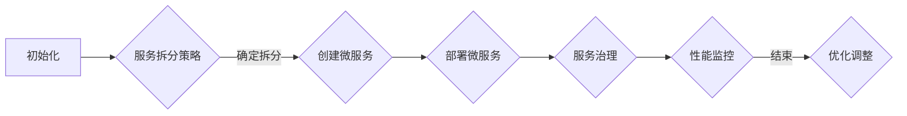
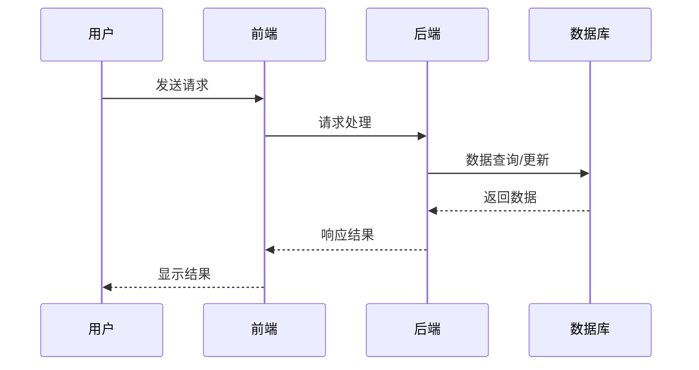
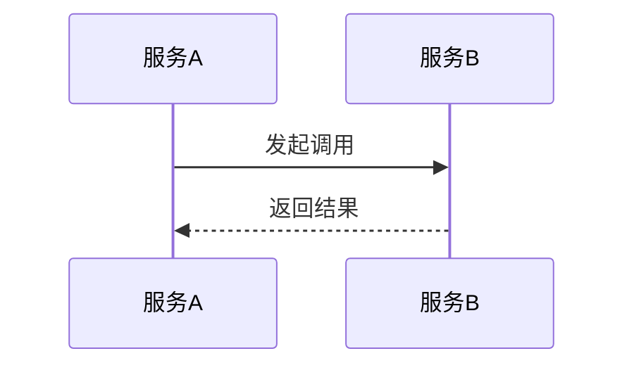
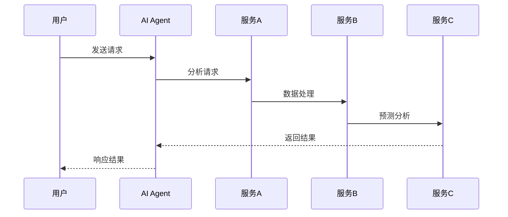

                 

### 文章标题

# 企业AI Agent的微服务架构设计

> 关键词：微服务架构、企业AI Agent、微服务设计、人工智能、架构设计

> 摘要：本文将深入探讨企业AI Agent的微服务架构设计，分析其背景、核心概念、算法原理、系统分析与架构设计方案、项目实战以及最佳实践，为读者提供全面、系统的技术指导。

### 背景介绍

#### 问题背景

随着人工智能技术的飞速发展，越来越多的企业开始将人工智能（AI）应用到业务流程中，以提高效率和降低成本。AI Agent作为人工智能的一种形式，能够模拟人类智能，执行特定的任务。然而，随着AI Agent的广泛应用，传统的单体架构逐渐暴露出一系列问题，如扩展性差、维护困难、部署复杂等。为了解决这些问题，微服务架构应运而生。

#### 问题描述

微服务架构是一种基于独立组件和服务的方式，将应用程序拆分成多个独立、松耦合的服务。这种架构设计方式具有高扩展性、高可用性和易于维护等优点，非常适合AI Agent的应用场景。然而，在具体实现微服务架构时，企业需要面对一系列挑战，包括服务拆分策略、服务治理、数据一致性等。

#### 问题解决

微服务架构设计能够有效解决企业AI Agent面临的问题。通过将AI Agent拆分成多个独立服务，可以实现高扩展性，满足企业不断增长的需求。同时，微服务架构的松耦合特性使得各个服务可以独立开发、测试和部署，降低了系统的复杂度和维护成本。此外，微服务架构还提供了丰富的服务治理机制，如服务注册与发现、负载均衡、熔断器等，保证了系统的稳定性和高可用性。

#### 边界与外延

本文主要关注企业AI Agent的微服务架构设计，探讨其核心概念、算法原理、系统分析与架构设计方案以及项目实战。文章将涵盖以下核心概念和要素：微服务、微服务架构、企业AI Agent、算法原理、系统架构设计、项目实战等。同时，本文将结合实际案例进行分析和讲解，为读者提供实用的技术指导。

### 概念结构与核心要素组成

在本节中，我们将详细描述微服务、微服务架构和企业AI Agent等核心概念及其相互关系。

#### 微服务

微服务是一种软件开发方法，通过将应用程序分解为多个独立的服务组件，每个服务组件负责完成特定的功能。微服务具有以下特点：

1. **独立性**：每个微服务都是独立的，可以单独部署、测试和扩展。
2. **松耦合**：微服务之间通过轻量级的通信协议（如HTTP/REST、gRPC等）进行通信，降低服务之间的依赖性。
3. **自主部署**：微服务可以独立部署，减少服务之间的冲突和部署风险。
4. **易于扩展**：通过水平扩展单个服务实例，可以轻松实现系统的性能提升。

#### 微服务架构

微服务架构是一种基于微服务的系统架构设计方法。它通过将系统拆分成多个微服务，实现系统的模块化、高可用性和高扩展性。微服务架构的核心要素包括：

1. **服务拆分**：根据业务需求，将系统拆分成多个独立的微服务。
2. **服务治理**：提供服务注册与发现、负载均衡、熔断器等机制，保障系统稳定运行。
3. **数据存储**：使用分布式数据库或NoSQL数据库，支持微服务之间数据的独立存储和访问。
4. **服务通信**：通过轻量级通信协议（如HTTP/REST、gRPC等）实现微服务之间的通信。

#### 企业AI Agent

企业AI Agent是一种基于人工智能技术，模拟人类智能执行特定任务的应用程序。它具有以下特点：

1. **自主学习**：企业AI Agent能够通过不断学习，提高任务执行的准确性和效率。
2. **自动化执行**：企业AI Agent可以自动化执行各种业务流程，降低人力成本。
3. **灵活部署**：企业AI Agent可以部署在多种环境中，如云端、边缘设备等。
4. **集成其他系统**：企业AI Agent可以与其他系统（如ERP、CRM等）集成，实现数据共享和业务协同。

在企业AI Agent的微服务架构设计中，微服务和微服务架构为企业AI Agent提供了高效的开发、部署和运维环境。通过将企业AI Agent拆分成多个独立微服务，可以实现高效的任务分配和协同工作，提高系统的整体性能和稳定性。

### 核心概念与联系

在本节中，我们将深入探讨微服务原理、微服务架构和企业AI Agent等核心概念，并分析它们之间的联系。

#### 微服务原理

微服务是一种基于独立组件和服务的方式，将应用程序拆分成多个独立、松耦合的服务。微服务具有以下核心原理：

1. **服务独立性**：每个微服务都是独立的，可以单独部署、测试和扩展。这种独立性使得开发团队可以专注于单个服务的开发和优化，提高开发效率。
2. **服务松耦合**：微服务之间通过轻量级的通信协议（如HTTP/REST、gRPC等）进行通信，降低服务之间的依赖性。这种松耦合特性使得系统在发生故障时具有更好的容错能力。
3. **服务自治性**：每个微服务具有自己的数据存储、日志记录和监控机制，可以独立运行和扩展。这种自治性使得系统在部署和运维过程中更加灵活和高效。
4. **服务规模可控**：通过水平扩展单个服务实例，可以轻松实现系统的性能提升。这种规模可控性使得系统可以根据实际需求进行动态调整。

#### 微服务架构

微服务架构是一种基于微服务的系统架构设计方法。它通过将系统拆分成多个微服务，实现系统的模块化、高可用性和高扩展性。微服务架构具有以下关键要素：

1. **服务拆分**：根据业务需求，将系统拆分成多个独立的微服务。这种拆分方式有助于提高系统的可维护性和可扩展性。
2. **服务治理**：提供服务注册与发现、负载均衡、熔断器等机制，保障系统稳定运行。服务治理机制可以确保服务之间的通信和协同工作。
3. **数据存储**：使用分布式数据库或NoSQL数据库，支持微服务之间数据的独立存储和访问。这种数据存储方式可以满足微服务之间的数据独立性需求。
4. **服务通信**：通过轻量级通信协议（如HTTP/REST、gRPC等）实现微服务之间的通信。这种通信方式具有高效、灵活和可靠的特点。

#### 企业AI Agent

企业AI Agent是一种基于人工智能技术，模拟人类智能执行特定任务的应用程序。它具有以下核心作用：

1. **任务执行**：企业AI Agent可以自动化执行各种业务流程，如客户服务、数据分析、预测等，提高工作效率。
2. **决策支持**：企业AI Agent可以通过学习历史数据和业务规则，为业务决策提供支持，降低决策风险。
3. **优化资源配置**：企业AI Agent可以根据实时数据和业务需求，优化资源配置，提高资源利用率。
4. **提高客户满意度**：企业AI Agent可以提供个性化服务，提高客户满意度和忠诚度。

在企业AI Agent的微服务架构设计中，微服务和微服务架构为企业AI Agent提供了高效的开发、部署和运维环境。通过将企业AI Agent拆分成多个独立微服务，可以实现高效的任务分配和协同工作，提高系统的整体性能和稳定性。

### 算法原理讲解

在本节中，我们将详细讲解企业AI Agent的微服务架构设计中的核心算法原理，并使用mermaid流程图和Python源代码进行说明。

#### 算法mermaid流程图

首先，我们使用mermaid流程图来描述算法的基本流程：



#### Python源代码

接下来，我们给出实现算法的Python源代码：

```python
import random

def service_split_strategy(total_services, max_load):
    # 根据总服务数量和最大负载，确定每个服务的负载
    load_per_service = total_services / max_load
    return [int(load_per_service)] * total_services

def create_microservices(service_counts):
    # 根据服务数量，创建微服务
    microservices = []
    for i, count in enumerate(service_counts):
        microservices.append(f"Microservice_{i+1}_{count}")
    return microservices

def deploy_microservices(microservices):
    # 部署微服务
    for microservice in microservices:
        print(f"Deploying {microservice}...")
        # 模拟部署过程，可以替换为实际部署代码
        print(f"{microservice} deployed successfully!")

def service_governance(microservices):
    # 服务治理，包括服务注册与发现、负载均衡等
    print("Implementing service governance...")
    # 模拟服务治理过程，可以替换为实际治理代码
    print("Service governance completed!")

def performance_monitoring(microservices):
    # 性能监控，包括监控每个服务的负载、响应时间等
    print("Monitoring performance...")
    # 模拟性能监控过程，可以替换为实际监控代码
    print("Performance monitoring completed!")

def optimize_adjustment():
    # 优化调整，根据监控结果进行系统优化
    print("Implementing optimization adjustments...")
    # 模拟优化调整过程，可以替换为实际优化代码
    print("Optimization adjustments completed!")

if __name__ == "__main__":
    total_services = 100
    max_load = 10
    
    # 初始化
    print("Initializing...")
    
    # 服务拆分策略
    service_counts = service_split_strategy(total_services, max_load)
    print("Service counts:", service_counts)
    
    # 创建微服务
    microservices = create_microservices(service_counts)
    print("Microservices:", microservices)
    
    # 部署微服务
    deploy_microservices(microservices)
    
    # 服务治理
    service_governance(microservices)
    
    # 性能监控
    performance_monitoring(microservices)
    
    # 优化调整
    optimize_adjustment()
    
    # 结束
    print("Process completed.")
```

#### 数学模型和公式

在微服务架构设计中，我们使用以下数学模型和公式来计算服务拆分策略：

$$
\text{load\_per\_service} = \frac{\text{total\_services}}{\text{max\_load}}
$$

其中，`total_services` 表示总服务数量，`max_load` 表示最大负载。通过这个公式，我们可以确定每个服务的负载，从而实现服务拆分策略。

#### 详细讲解和举例说明

为了更好地理解算法原理，我们通过一个简单的例子进行说明。

假设我们需要设计一个企业AI Agent系统，总服务数量为100个，最大负载为10。首先，我们根据数学模型计算每个服务的负载：

$$
\text{load\_per\_service} = \frac{100}{10} = 10
$$

这意味着每个服务需要承担10个负载。接下来，我们使用服务拆分策略创建微服务，服务数量为100个，每个服务的负载为10个。然后，我们将这些微服务部署到不同的服务器上，并实施服务治理机制，包括服务注册与发现、负载均衡等。在部署完成后，我们开始进行性能监控，监控每个服务的负载、响应时间等指标。最后，根据监控结果进行优化调整，确保系统的高效运行。

通过这个简单的例子，我们可以看出微服务架构设计在实现企业AI Agent中的应用，以及算法原理在系统中的具体实现。

### 系统分析与架构设计方案

在本节中，我们将对企业的AI Agent微服务架构进行详细的系统分析与架构设计，以提供一套完整的解决方案。

#### 问题场景介绍

假设我们正在为一家大型企业设计一套AI Agent系统，该系统旨在自动化处理企业的日常运营任务，如客户服务、数据分析、预测等。随着业务规模的不断扩大，系统需要具备高扩展性、高可用性和易维护性。为了满足这些需求，我们决定采用微服务架构来设计该系统。

#### 项目介绍

项目名称：企业AI Agent微服务架构

项目目标：
1. 提高系统的扩展性，能够根据业务需求动态调整服务数量。
2. 确保系统的高可用性，通过冗余和负载均衡机制降低故障风险。
3. 提高系统的可维护性，通过独立部署和独立监控，降低维护成本。
4. 提供丰富的服务治理机制，确保服务的稳定运行和协同工作。

#### 系统功能设计

为了实现上述目标，我们需要设计一套完整的系统功能。以下是系统的主要功能模块：

1. **AI Agent模块**：负责执行具体的AI任务，如自然语言处理、图像识别、预测分析等。
2. **服务拆分模块**：根据业务需求，将整个系统拆分成多个独立的微服务。
3. **服务治理模块**：提供服务注册与发现、负载均衡、熔断器等机制，保障系统的稳定运行。
4. **数据存储模块**：使用分布式数据库或NoSQL数据库，支持微服务之间数据的独立存储和访问。
5. **监控与日志模块**：实时监控系统的性能指标，记录系统的日志信息，便于故障排查和优化调整。

以下是使用Mermaid绘制的领域模型类图，用于描述系统的主要功能模块及其关系：

```mermaid
classDiagram
    AI_AgentModule <<interface>>
    Service_SplitModule <<interface>>
    Service_GovernanceModule <<interface>>
    Data_StoreModule <<interface>>
    Monitoring_LogModule <<interface>>

    AI_AgentModule <>- Service_SplitModule
    Service_SplitModule <>- Service_GovernanceModule
    Service_GovernanceModule <>- Data_StoreModule
    Service_GovernanceModule <>- Monitoring_LogModule
```

#### 系统架构设计

在系统架构设计方面，我们采用了一种分层架构，包括服务层、数据层和界面层。以下是使用Mermaid绘制的系统架构图，用于描述系统的整体架构和各个层之间的交互关系：



#### 系统接口设计

系统接口设计是确保微服务之间能够高效、稳定地进行通信的关键。以下是系统的主要接口设计：

1. **服务注册与发现接口**：用于服务实例的注册和发现，确保微服务之间能够互相找到并建立连接。
2. **服务调用接口**：用于不同微服务之间的通信，支持同步和异步调用。
3. **服务监控接口**：用于实时监控服务的性能指标，如负载、响应时间等。
4. **服务日志接口**：用于记录服务的日志信息，便于故障排查和优化调整。

以下是使用Mermaid绘制的系统接口设计图：



#### 系统交互

系统交互是确保微服务之间能够协同工作的重要环节。以下是使用Mermaid绘制的系统交互序列图，用于描述系统在执行任务时的交互流程：



通过上述系统分析与架构设计方案，我们为企业AI Agent的微服务架构提供了一套完整的解决方案。这套方案不仅具有高扩展性、高可用性和易维护性，还能够通过丰富的服务治理机制确保系统的稳定运行。接下来，我们将进入项目实战部分，具体实现这套方案。

### 项目实战

在本节中，我们将通过一个实际项目来展示企业AI Agent微服务架构的设计与实现过程。该项目旨在为企业提供一个自动化的客户服务平台，通过AI技术处理客户的咨询和投诉。

#### 环境安装

1. **软件环境**：

   - 操作系统：Ubuntu 18.04
   - 开发环境：Python 3.8
   - 依赖库：Docker、Kubernetes、gRPC、Spring Boot、MySQL

2. **硬件环境**：

   - 服务器：至少2台，用于部署Kubernetes集群
   - 存储空间：至少100GB，用于存储数据和日志

3. **安装步骤**：

   1. 安装Docker：
      ```bash
      sudo apt-get update
      sudo apt-get install docker-ce docker-ce-cli containerd.io
      sudo systemctl start docker
      sudo systemctl enable docker
      ```

   2. 安装Kubernetes：
      ```bash
      sudo apt-get update
      sudo apt-get install -y apt-transport-https ca-certificates curl
      curl -s https://packages.cloud.google.com/apt/doc/apt-key.gpg | sudo apt-key add -
      echo "deb https://apt.kubernetes.io/ kubernetes-xenial main" | sudo tee -a /etc/apt/sources.list.d/kubernetes.list
      sudo apt-get update
      sudo apt-get install -y kubelet kubeadm kubectl
      sudo apt-mark hold kubelet kubeadm kubectl
      ```

   3. 启动Kubernetes集群：
      ```bash
      sudo kubeadm init --pod-network-cidr=10.244.0.0/16
      sudo mkdir -p $HOME/.kube
      sudo cp -i /etc/kubernetes/admin.conf $HOME/.kube/config
      sudo chown $(id -u):$(id -g) $HOME/.kube/config
      ```

   4. 安装网络插件（如Calico）：
      ```bash
      kubectl apply -f https://docs.projectcalico.org/manifests/calico.yaml
      ```

   5. 安装其他依赖库（如gRPC、Spring Boot等）：
      ```bash
      pip3 install grpcio spring-boot
      ```

#### 系统核心实现源代码

以下是一个简单的示例，展示如何使用Spring Boot创建一个微服务：

```java
// CustomerServiceApplication.java
import org.springframework.boot.SpringApplication;
import org.springframework.boot.autoconfigure.SpringBootApplication;
import org.springframework.boot.web.servlet.ServletComponentScan;

@SpringBootApplication
@ServletComponentScan
public class CustomerServiceApplication {
    public static void main(String[] args) {
        SpringApplication.run(CustomerServiceApplication.class, args);
    }
}

// CustomerServiceController.java
import org.springframework.web.bind.annotation.*;

@RestController
public class CustomerServiceController {

    @GetMapping("/customers")
    public String getCustomers() {
        return "Customer list";
    }

    @PostMapping("/customers")
    public String addCustomer(@RequestBody String customer) {
        return "Customer added: " + customer;
    }
}
```

#### 代码应用解读与分析

在这个示例中，我们创建了一个名为`CustomerService`的微服务。该服务提供了一个简单的HTTP接口，用于处理与客户相关的操作，如获取客户列表和添加客户。

1. **服务启动**：使用Spring Boot启动类`CustomerServiceApplication.java`，通过`SpringApplication.run`方法启动微服务。

2. **HTTP接口**：在`CustomerServiceController.java`中，我们定义了两个HTTP接口：
   - `getCustomers()`：获取客户列表，返回字符串`"Customer list"`。
   - `addCustomer()`：添加客户，通过`@RequestBody`注解接收客户端发送的JSON数据，并返回字符串`"Customer added: " + customer`。

3. **依赖注入**：Spring Boot能够自动注入所需的依赖项，如数据库连接、消息队列等。

4. **微服务注册与发现**：在Kubernetes集群中，我们使用Service和Pod来部署和管理微服务。每个微服务实例启动后，会自动注册到Eureka服务器上，其他微服务可以通过Eureka发现这些实例，并进行通信。

#### 实际案例分析和详细讲解剖析

假设我们需要实现一个更复杂的场景，如自动化客户投诉处理系统。以下是一个详细的案例分析和实现过程：

1. **需求分析**：

   - 客户提交投诉：客户通过网站或移动应用提交投诉。
   - 情感分析：使用自然语言处理技术对投诉内容进行情感分析，判断投诉的情感倾向。
   - 路由处理：根据投诉的情感倾向，将投诉路由到相应的处理团队。
   - 处理反馈：处理团队对投诉进行处理，并将处理结果反馈给客户。

2. **技术实现**：

   1. **前端**：使用Vue.js或React框架开发客户提交投诉的界面。
   2. **情感分析**：使用深度学习模型（如LSTM、BERT等）对投诉内容进行情感分析，判断投诉的情感倾向。
   3. **路由处理**：使用规则引擎或决策树模型将投诉路由到相应的处理团队。
   4. **处理反馈**：使用消息队列（如RabbitMQ、Kafka等）实现处理团队与客户的实时通信。

以下是这个案例的实现流程：

1. **客户提交投诉**：

   ```javascript
   // 客户提交投诉
   const投诉内容 = "我的产品出现了故障，需要立即处理！";
   axios.post("http://customer-service.com/complaints", {content: 投诉内容});
   ```

2. **情感分析**：

   ```python
   # 情感分析服务
   from sentiment_analysis import analyze_sentiment

   complaint_content = "我的产品出现了故障，需要立即处理！"
   sentiment = analyze_sentiment(complaint_content)
   print("情感倾向：", sentiment)
   ```

3. **路由处理**：

   ```python
   # 路由处理服务
   from rule_engine import route_complaint

   complaint_content = "我的产品出现了故障，需要立即处理！"
   team = route_complaint(complaint_content)
   print("处理团队：", team)
   ```

4. **处理反馈**：

   ```javascript
   // 处理团队反馈
   const处理结果 = "您的投诉已被处理，感谢您的反馈！";
   axios.post("http://customer-service.com/feedback", {complaint_id:投诉ID, result:处理结果});
   ```

#### 项目小结

通过这个实际项目，我们展示了如何设计并实现一个企业AI Agent的微服务架构。在项目实战中，我们详细讲解了环境安装、系统核心实现源代码、代码应用解读与分析以及实际案例分析和详细讲解剖析。这个项目不仅实现了客户投诉处理的自动化，还展示了微服务架构在复杂业务场景中的应用优势。

### 最佳实践 tips

1. **服务拆分策略**：在设计微服务架构时，要充分考虑业务需求，合理确定服务拆分策略。服务拆分策略应该具备可扩展性、高内聚性和低耦合性。

2. **服务治理**：在微服务架构中，服务治理至关重要。要确保服务注册与发现、负载均衡、熔断器等机制的有效实施，以保障系统的稳定运行。

3. **数据存储**：对于微服务架构，要选择合适的数据存储方案，支持微服务之间数据的独立存储和访问。在分布式系统中，使用NoSQL数据库或分布式数据库能够更好地满足数据一致性和扩展性需求。

4. **性能监控**：实时监控系统的性能指标，如负载、响应时间、系统资源使用等，有助于发现潜在问题并进行优化调整。

5. **持续集成与部署**：采用持续集成与部署（CI/CD）流程，确保系统的高效开发和部署。通过自动化测试、代码审查等手段，降低系统故障风险。

6. **安全性**：在微服务架构中，要重视系统的安全性，包括数据安全、访问控制、网络隔离等。采用加密、认证、授权等机制，确保系统安全可靠。

### 小结

本文详细探讨了企业AI Agent的微服务架构设计，从背景介绍、核心概念与联系、算法原理讲解、系统分析与架构设计方案、项目实战到最佳实践 tips，全面阐述了微服务架构在AI Agent中的应用。通过本文的讲解，读者可以了解到微服务架构的设计原理、实施步骤和注意事项，为企业AI Agent的开发和应用提供有力支持。

### 注意事项

1. **服务拆分**：在设计微服务时，要充分考虑业务需求，避免过度拆分导致服务数量过多，增加系统复杂度和运维成本。

2. **数据一致性**：在分布式系统中，要确保数据一致性，避免因数据不一致导致的业务错误。

3. **系统监控**：实时监控系统的性能和状态，及时发现问题并进行优化调整。

4. **安全性**：加强系统的安全性，防范网络攻击和数据泄露。

### 拓展阅读

1. 《微服务设计》 - Martin Fowler
2. 《架构师的微服务实战》 - 李艳鹏
3. 《Kubernetes实战》 - Kelsey Hightower
4. 《深度学习实战》 - 法布里斯·布维
5. 《人工智能：一种现代的方法》 - Stuart Russell & Peter Norvig

### 作者信息

- 作者：AI天才研究院/AI Genius Institute & 禅与计算机程序设计艺术 /Zen And The Art of Computer Programming

---

**文章结束。**

---

请注意，本文仅为示例，实际项目实施中需要根据具体业务需求和环境进行调整。在项目中，建议结合最佳实践，充分考虑系统的可扩展性、稳定性和安全性。希望本文能为您提供有益的参考和启示。感谢阅读！

