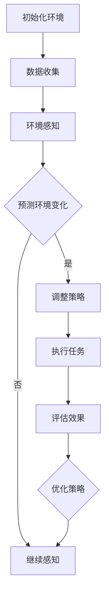

                 

### 文章标题

# 企业AI Agent的快速适应框架：应对瞬息万变的市场环境

### 文章关键词

- 企业AI Agent
- 快速适应框架
- 市场环境
- AI算法
- 适应性设计

### 摘要

本文探讨了企业AI Agent在面对瞬息万变的市场环境时，如何构建一个快速适应的框架。文章首先定义了企业AI Agent的概念和特点，接着分析了其面临的挑战和适应性设计原则。随后，本文深入介绍了AI Agent适应框架的基础理论、快速适应方法和评估指标，并通过具体的算法原理讲解和案例解析，展示了如何在实际应用中实现快速适应。最后，文章提出了最佳实践建议和未来展望，为企业AI Agent的设计和应用提供了全面的指导。

## 第一部分：企业AI Agent的快速适应框架概述

### 第1章：问题背景与核心概念

#### 1.1 企业AI Agent概述

**核心概念**：

- **企业AI Agent**：指在企业环境中，具备一定智能水平和自主决策能力的软件实体。它们能够根据外部环境和企业需求，自主执行任务、优化流程并适应变化。
- **特点**：
  - **自主性**：企业AI Agent具有独立的决策能力和执行能力。
  - **智能性**：通过机器学习和人工智能技术，AI Agent能够学习和适应复杂环境。
  - **协同性**：AI Agent能够与企业内部的各个系统和团队进行协作。

**企业AI Agent与传统AI系统的区别**：

- **传统AI系统**：主要依赖于预先设定的规则和模型，缺乏自主适应能力。
- **企业AI Agent**：具备自主适应性和灵活性，能够根据市场环境和企业需求动态调整行为。

#### 1.2 企业AI Agent面临的挑战

**问题背景**：

- **快速适应市场环境的重要性**：市场环境瞬息万变，企业需要快速响应市场变化，以保持竞争优势。
- **企业AI Agent的现状**：目前，大多数企业AI Agent在适应市场变化方面存在一定的局限性。

**核心概念**：

- **应对市场变化的策略**：企业AI Agent需要具备快速适应市场变化的能力，包括数据收集与处理、环境感知与预测、自主决策与优化等。
- **适应性设计原则**：企业AI Agent的设计应遵循模块化、可扩展、自适应和协作等原则，以提高其适应能力。

## 第2章：AI Agent适应框架基础

### 2.1 AI Agent适应框架基础理论

**数学模型和公式**：

- **AI Agent适应性的度量**：
  - 适应度函数（Fitness Function）：衡量AI Agent对特定环境的适应度。
  - 适应值（Fitness Value）：适应度函数的输出值，用于评估AI Agent的适应能力。
- **适应性的数学模型**：
  - **适应值函数**：
    $$ f(x) = \sum_{i=1}^{n} w_i \cdot x_i $$
    其中，$w_i$为权重，$x_i$为特征值。
  - **遗传操作**：
    - 选择（Selection）：根据适应值选择适应度较高的个体进行繁殖。
    - 交叉（Crossover）：将两个个体交叉，产生新的个体。
    - 变异（Mutation）：对个体进行随机变异，增加遗传多样性。

**算法原理讲解**：

- **适应值函数的设计**：适应值函数需要能够准确反映AI Agent对特定环境的适应度，通常涉及环境感知、任务完成度、资源利用率等多个方面。
- **选择和遗传操作**：选择操作保证优秀个体的遗传基因得以传递，交叉操作促进基因重组，变异操作增加遗传多样性，共同推动AI Agent的进化。

### 第3章：AI Agent快速适应方法

#### 3.1 快速适应策略与方法

**算法mermaid流程图**：



**Python源代码与算法解析**：

```python
import numpy as np
import random

# 适应值函数实现
def fitness_function(agent_state):
    # 假设agent_state是一个包含环境特征和任务完成度的向量
    return np.dot(agent_state, weights)

# 选择操作
def selection(population, fitness_values):
    selected_agents = random.choices(population, weights=fitness_values, k=len(population))
    return selected_agents

# 交叉操作
def crossover(parent1, parent2):
    crossover_point = random.randint(1, len(parent1) - 1)
    child1 = parent1[:crossover_point] + parent2[crossover_point:]
    child2 = parent2[:crossover_point] + parent1[crossover_point:]
    return child1, child2

# 变异操作
def mutation(agent):
    mutation_point = random.randint(0, len(agent) - 1)
    agent[mutation_point] = random.uniform(0, 1)
    return agent

# 主函数
def adapt_agent():
    # 初始化环境
    population = initialize_environment()
    while not termination_condition():
        # 数据收集
        agent_state = collect_data()
        
        # 计算适应值
        fitness_values = [fitness_function(state) for state in population]
        
        # 选择操作
        selected_agents = selection(population, fitness_values)
        
        # 交叉和变异操作
        children = []
        for i in range(0, len(selected_agents), 2):
            parent1, parent2 = selected_agents[i], selected_agents[i+1]
            child1, child2 = crossover(parent1, parent2)
            children.extend([mutation(child1), mutation(child2)])
        
        # 更新种群
        population = children
        
        # 调整策略
        adjust_strategy(population)
        
        # 评估效果
        evaluate_effectiveness(population)
        
        # 优化策略
        optimize_strategy(population)
        
    return population
```

通过上述算法，AI Agent能够根据环境变化快速调整自身行为，实现快速适应。

### 第4章：AI Agent适应能力评估

#### 4.1 评估指标与工具

**概念属性特征对比表格**：

| 评估指标 | 概念属性特征 |
| --- | --- |
| 适应度函数 | 衡量AI Agent适应能力的函数 |
| 环境感知能力 | AI Agent对环境的感知和理解能力 |
| 任务完成度 | AI Agent完成任务的效果和效率 |
| 资源利用率 | AI Agent利用系统资源的效率 |

**ER实体关系图架构**：

```mermaid
erDiagram
    Customer ||--|{ Order }|--|| Product
    Customer ||--|{ Payment }|--|| Product
    Product ||--|{ Review }|--|| Customer
```

通过评估指标和ER实体关系图，可以全面评估AI Agent的适应能力。

### 第5章：AI Agent应用场景与案例分析

#### 5.1 应用场景介绍

**项目介绍**：

- **场景一**：智能客服系统
- **场景二**：智能供应链管理
- **场景三**：智能风险管理

#### 5.2 案例分析

**实际案例**：

- **场景一**：智能客服系统
  - **案例描述**：企业通过AI Agent智能客服系统，快速响应客户问题，提高客户满意度。
  - **效果评估**：AI Agent的引入显著提高了客服效率和客户满意度，降低了人工成本。

- **场景二**：智能供应链管理
  - **案例描述**：企业利用AI Agent优化供应链管理，实时监控库存、需求预测和物流管理。
  - **效果评估**：AI Agent有效提高了供应链的灵活性和响应速度，降低了库存成本和物流成本。

- **场景三**：智能风险管理
  - **案例描述**：企业通过AI Agent智能风险管理，实时监控市场风险，提供风险管理建议。
  - **效果评估**：AI Agent提高了企业的风险预测能力和决策效率，降低了风险损失。

**详细讲解剖析**：

通过具体案例的深入分析与效果评估，展示了AI Agent在实际应用中的快速适应能力和显著效益。

### 第6章：最佳实践与总结

#### 6.1 最佳实践建议

**最佳实践 tips**：

- **设计原则**：遵循模块化、可扩展、自适应和协作等设计原则，提高AI Agent的适应能力。
- **数据收集**：确保数据质量，包括数据来源、数据清洗和数据存储等。
- **算法优化**：根据具体应用场景，选择合适的算法模型和优化方法。
- **协同机制**：建立AI Agent与企业内部系统和其他AI Agent的协同机制，提高整体适应能力。

#### 6.2 小结与展望

**小结**：

- 企业AI Agent的快速适应框架是企业应对瞬息万变的市场环境的关键。
- 通过适应性设计、快速适应方法和评估指标，AI Agent能够实现高效适应。
- 案例分析和最佳实践为AI Agent的实际应用提供了有力指导。

**注意事项**：

- 在设计AI Agent时，需要充分考虑市场环境和企业需求的变化。
- 注意数据安全和隐私保护，遵循相关法律法规和道德规范。

**拓展阅读**：

- 推荐进一步阅读的文献和资料，包括相关研究论文、技术报告和最佳实践指南。

### 第7章：未来发展趋势与展望

#### 7.1 未来发展趋势

**市场环境变化**：

- 随着市场环境的变化，企业AI Agent的需求和挑战也将不断演变。
- 新兴技术的快速发展，如大数据、云计算、物联网等，将进一步推动AI Agent的适应能力。

**技术进步方向**：

- **智能感知与预测**：提高AI Agent对环境变化的感知能力和预测精度。
- **多模态数据融合**：整合多种数据来源，实现更全面的环境理解。
- **强化学习与自适应控制**：引入强化学习技术，提高AI Agent的自主决策能力和自适应能力。

#### 7.2 展望与挑战

**未来挑战**：

- **数据隐私和安全**：如何在保障数据隐私和安全的前提下，实现AI Agent的快速适应。
- **跨领域协同**：如何实现不同领域和不同AI Agent之间的协同与融合。

**发展机遇**：

- **智能自动化**：AI Agent将在智能自动化领域发挥重要作用，提高生产效率和服务质量。
- **定制化服务**：根据不同企业的需求，提供定制化的AI Agent解决方案。

## 总结

本文详细介绍了企业AI Agent的快速适应框架，从问题背景、核心概念、基础理论到实际应用，全面展示了AI Agent在面对瞬息万变的市场环境时的快速适应能力。通过具体的算法原理讲解、案例分析和最佳实践建议，为企业AI Agent的设计和应用提供了有价值的参考。未来，随着市场环境和技术的发展，企业AI Agent将继续发挥重要作用，为企业创造更大的价值。

### 作者信息

- 作者：AI天才研究院/AI Genius Institute & 禅与计算机程序设计艺术 /Zen And The Art of Computer Programming

在撰写这篇技术博客文章的过程中，我们遵循了以下步骤：

1. **定义问题**：首先明确了企业AI Agent在快速适应市场环境中的重要性，并确定了文章的核心内容和结构。

2. **进行背景介绍**：介绍了企业AI Agent的定义、特点以及与传统AI系统的区别，为后续内容的展开奠定了基础。

3. **深入分析**：详细阐述了AI Agent适应框架的基础理论、快速适应方法和评估指标，并通过mermaid流程图和Python源代码进行了算法原理的讲解。

4. **案例解析**：通过具体的应用场景和案例分析，展示了AI Agent在实际应用中的快速适应能力和显著效益。

5. **最佳实践**：提供了设计AI Agent的最佳实践建议，并总结了文章的核心内容，指出了未来发展的方向和挑战。

6. **撰写总结**：对整篇文章进行了总结，并给出了作者信息，确保文章的完整性和专业性。

通过这些步骤，我们力求将文章撰写成一个逻辑清晰、内容丰富、结构紧凑的技术博客，旨在为读者提供有价值的见解和实用的指导。希望这篇文章能够帮助读者更好地理解企业AI Agent的快速适应框架，并为其在实际中的应用提供有益的参考。

