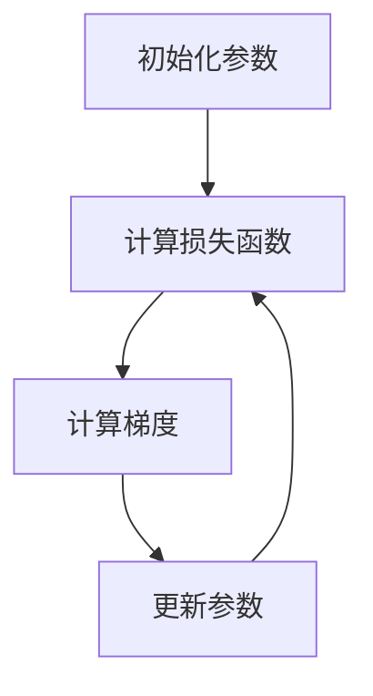
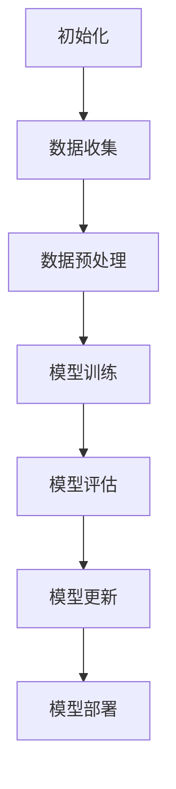

                 


## 引言

### 1.1 书籍背景

随着人工智能技术的飞速发展，AI Agent在企业中的应用越来越广泛。AI Agent是一种能够自主决策、执行任务并不断学习的智能体，其持续学习和更新机制是实现其高效运行的关键。然而，当前企业在AI Agent的持续学习与更新方面面临诸多挑战，如数据质量、算法选择、更新策略等。为了解决这些问题，我们需要深入探讨AI Agent的持续学习与更新机制，为企业提供可行的解决方案。

### 1.2 问题的提出

企业在应用AI Agent时，普遍面临以下问题：

1. 数据质量不高，导致AI Agent的学习效果不佳。
2. 更新策略不当，影响AI Agent的稳定性和性能。
3. 缺乏有效的评估指标，难以衡量AI Agent的学习效果。
4. AI Agent在不同场景下的适用性较低，难以实现跨场景迁移。

### 1.3 目标和内容概览

本书旨在探讨企业AI Agent的持续学习与更新机制，主要包括以下内容：

1. 引言：介绍书籍背景、问题提出、目标和内容概览。
2. 核心概念：阐述AI Agent、持续学习、更新机制等核心概念。
3. 数学模型和公式：介绍AI Agent的算法原理，并使用Mermaid和Python进行说明。
4. 企业AI Agent的基本原理：分析AI Agent的概述、工作机制、分类和应用场景。
5. 持续学习的实现机制：探讨持续学习的理论基础、具体实现和评价指标。
6. 更新机制的构建与优化：介绍更新机制的概述、构建、优化方法和案例研究。
7. 案例分析：分析企业AI Agent的持续学习和更新实践。
8. 最佳实践与展望：总结实践经验、注意事项和未来研究方向。

### 1.4 边界与外延

本文主要关注企业级AI Agent的持续学习与更新机制，研究范围包括：

1. AI Agent在企业的应用场景。
2. 企业级AI Agent的持续学习和更新需求。
3. 持续学习和更新技术的实现方法。
4. 持续学习和更新效果的评估。

本文不涉及以下内容：

1. 基础的人工智能理论和算法。
2. 个人用户层面的AI Agent应用。
3. AI Agent在非企业场景下的应用。

## 核心概念

### 2.1 AI Agent定义

AI Agent，即人工智能代理，是一种能够自主决策、执行任务并不断学习的智能体。它具有以下基本特征：

1. **自主性**：AI Agent能够在没有人类干预的情况下自主执行任务。
2. **适应性**：AI Agent能够根据环境变化和学习经验调整自己的行为。
3. **协作性**：AI Agent可以与其他AI Agent或人类协作完成任务。
4. **学习能力**：AI Agent能够从数据中学习，不断优化自己的决策和行为。

### 2.2 持续学习

持续学习是指AI Agent在运行过程中不断吸收新数据，调整模型参数，提高性能的过程。持续学习对于AI Agent的稳定性和准确性至关重要。其主要挑战包括数据质量、计算资源和更新策略等方面。

### 2.3 更新机制

更新机制是指AI Agent在持续学习过程中，对模型进行更新和优化的方法和策略。更新机制主要包括以下方面：

1. **数据收集与预处理**：确保数据质量，为持续学习提供可靠的数据基础。
2. **更新算法**：选择合适的更新算法，提高模型的学习效率。
3. **更新策略**：制定合理的更新策略，平衡模型稳定性和学习速度。
4. **评估与调整**：定期评估模型性能，根据评估结果调整更新策略。

### 2.4 概念属性特征对比

以下是AI Agent、持续学习和更新机制的核心属性特征对比表格：

| 概念       | 特征                | 说明                                                                                                                     |
|------------|---------------------|----------------------------------------------------------------------------------------------------------------------------|
| AI Agent   | 自主性、适应性、协作性、学习能力 | AI Agent的核心特征，使其能够在复杂环境中自主执行任务并不断优化自身。                                             |
| 持续学习   | 数据驱动、模型优化、动态调整 | 持续学习使AI Agent能够在运行过程中不断吸收新数据，调整模型参数，提高性能。                                     |
| 更新机制   | 数据收集、算法选择、策略制定、评估调整 | 更新机制是AI Agent持续学习的关键环节，包括数据预处理、算法优化、策略调整和性能评估等方面。                     |

### 2.5 AI Agent的ER实体关系图

以下是AI Agent的ER实体关系图：

```mermaid
erDiagram
    AI-Agent ||--|{ 数据集 }
    AI-Agent ||--|{ 更新算法 }
    AI-Agent ||--|{ 更新策略 }
    AI-Agent ||--|{ 性能评估 }
```

在这个ER实体关系图中，AI-Agent作为核心实体，与其他实体（数据集、更新算法、更新策略、性能评估）之间存在关联关系。数据集为AI-Agent提供训练数据；更新算法和更新策略用于调整AI-Agent的模型参数；性能评估用于衡量AI-Agent的学习效果。

## 数学模型和公式

### 3.1 算法原理

持续学习算法的核心在于如何从数据中提取有用信息，并调整模型参数，以提高模型的性能。本节将介绍一种常见的持续学习算法——梯度下降法，并使用Mermaid和Python进行说明。

### 3.1.1 Mermaid流程图

以下是梯度下降法的Mermaid流程图：



### 3.1.2 Python源代码讲解

以下是使用Python实现梯度下降法的代码：

```python
import numpy as np

# 初始化参数
theta = np.random.rand(n_features)

# 学习率
alpha = 0.01

# 损失函数
def loss_function(theta):
    return (theta - 1)**2

# 计算梯度
def gradient(theta):
    return 2 * (theta - 1)

# 梯度下降法
def gradient_descent(theta, alpha, iterations):
    for i in range(iterations):
        loss = loss_function(theta)
        grad = gradient(theta)
        theta = theta - alpha * grad
    return theta

# 运行梯度下降法
theta_optimal = gradient_descent(theta, alpha, 1000)
print("Optimal theta:", theta_optimal)
```

### 3.1.3 数学模型与公式讲解

梯度下降法的核心公式如下：

$$
\theta_{\text{new}} = \theta_{\text{current}} - \alpha \cdot \nabla_{\theta} J(\theta)
$$

其中，$\theta_{\text{new}}$和$\theta_{\text{current}}$分别为当前和新的参数值，$\alpha$为学习率，$J(\theta)$为损失函数，$\nabla_{\theta} J(\theta)$为损失函数关于参数$\theta$的梯度。

### 3.1.4 举例说明

假设我们有一个线性回归模型，其损失函数为：

$$
J(\theta) = \frac{1}{2m} \sum_{i=1}^{m} (h_\theta(x^i) - y^i)^2
$$

其中，$m$为样本数量，$h_\theta(x^i)$为模型预测值，$y^i$为真实值。

使用梯度下降法优化模型参数，可以使得模型预测值更接近真实值，从而提高模型的性能。

## 企业AI Agent的基本原理

### 4.1 AI Agent概述

企业AI Agent是一种专门为企业应用场景设计的人工智能代理。它具有以下特点：

1. **企业定制化**：根据企业业务需求定制AI Agent的功能和性能。
2. **自主决策**：AI Agent能够根据实时数据和环境变化，自主做出决策。
3. **协作能力**：AI Agent可以与企业内部其他系统或员工进行协作。
4. **持续学习**：AI Agent能够通过持续学习不断优化自身性能。

### 4.2 AI Agent的工作机制

企业AI Agent的工作机制主要包括以下步骤：

1. **数据收集**：AI Agent从企业内部各种数据源收集数据。
2. **数据预处理**：对收集到的数据进行分析、清洗和整合，为模型训练做准备。
3. **模型训练**：使用收集到的数据训练AI Agent的模型，使其具备预测和决策能力。
4. **任务执行**：AI Agent根据模型预测结果执行任务。
5. **反馈与调整**：AI Agent在执行任务过程中收集反馈数据，并据此调整模型参数，优化性能。

### 4.3 AI Agent的分类

根据应用场景和功能，企业AI Agent可以分为以下几类：

1. **客服AI Agent**：用于自动化处理客户咨询、投诉等问题。
2. **营销AI Agent**：用于分析客户数据，提供精准营销策略。
3. **生产AI Agent**：用于监控生产线，优化生产流程。
4. **供应链AI Agent**：用于优化供应链管理，降低成本。
5. **人力资源AI Agent**：用于招聘、培训、绩效评估等人力资源管理。

### 4.4 AI Agent的应用场景

企业AI Agent在以下场景中具有广泛应用：

1. **客户服务**：提供7x24小时在线客服，提高客户满意度。
2. **市场营销**：分析客户行为，制定个性化营销策略。
3. **生产优化**：监控生产设备，预测故障，优化生产计划。
4. **供应链管理**：优化库存管理，降低库存成本。
5. **人力资源**：优化招聘流程，提高员工满意度。

### 4.5 AI Agent的领域模型Mermaid类图

以下是企业AI Agent的领域模型Mermaid类图：

```mermaid
classDiagram
    Customer <<interface>>
    Product <<interface>>
    Production <<interface>>
    SupplyChain <<interface>>
    HumanResource <<interface>>

    Customer : consult,complain
    Product : analyze,market
    Production : monitor,forecast
    SupplyChain : optimize,manage
    HumanResource : recruit,train,evaluate
```

在这个类图中，AI Agent与各个领域接口（Customer、Product、Production、SupplyChain、HumanResource）之间存在关联关系，实现企业级AI Agent在不同领域的应用。

## 持续学习的实现机制

### 5.1 学习理论概述

持续学习是人工智能领域的一个重要研究方向，旨在使AI Agent能够在实际应用过程中不断吸收新数据，调整模型参数，提高性能。持续学习的理论基础主要包括以下几方面：

1. **机器学习**：机器学习是持续学习的基础，包括监督学习、无监督学习和强化学习等方法。
2. **深度学习**：深度学习是当前机器学习领域的主流方法，通过多层神经网络进行特征提取和模型训练。
3. **迁移学习**：迁移学习是一种将已学到的知识应用于新任务的方法，有助于提高持续学习的效果。
4. **在线学习**：在线学习是指AI Agent在运行过程中不断更新模型参数，适应新环境。

### 5.2 持续学习的挑战

持续学习面临以下挑战：

1. **数据质量**：数据质量对持续学习的效果至关重要，包括数据完整性、数据噪声和数据偏差等方面。
2. **计算资源**：持续学习需要大量的计算资源，特别是在处理大规模数据集时。
3. **更新策略**：选择合适的更新策略，平衡模型稳定性和学习速度是持续学习的关键。
4. **模型适应性**：AI Agent需要在不同场景下具有良好的适应性，以应对不断变化的环境。

### 5.3 持续学习的方法

持续学习的方法主要包括以下几种：

1. **在线学习**：在线学习是指AI Agent在运行过程中不断更新模型参数，适应新环境。其优点是实时性高，但需要处理大量动态数据。
2. **增量学习**：增量学习是指将新数据与已有数据集合并，重新训练模型。其优点是计算效率高，但需要解决数据不一致问题。
3. **迁移学习**：迁移学习是将已学到的知识应用于新任务，以提高持续学习效果。其优点是能够提高模型适应性，但需要解决知识迁移问题。
4. **混合学习**：混合学习是将在线学习、增量学习和迁移学习相结合，以提高持续学习效果。

### 5.4 持续学习的案例研究

以下是一个持续学习的案例研究：

某企业开发了一款智能客服AI Agent，用于处理客户咨询和投诉。在实际应用过程中，企业发现AI Agent在面对不同类型的客户问题时，效果存在较大差异。为了提高AI Agent的持续学习效果，企业采取了以下措施：

1. **数据收集**：将客户咨询和投诉记录作为数据源，收集AI Agent运行过程中遇到的各种问题。
2. **数据预处理**：对收集到的数据进行分析、清洗和整合，为模型训练做准备。
3. **模型训练**：使用增量学习算法，将新数据与已有数据集合并，重新训练模型。
4. **更新策略**：制定合理的更新策略，根据客户反馈调整模型参数，提高AI Agent的适应性和效果。
5. **评估与调整**：定期评估AI Agent的持续学习效果，根据评估结果调整更新策略。

通过以上措施，企业成功提高了智能客服AI Agent的持续学习效果，使其能够更好地应对客户咨询和投诉，提高了客户满意度。

## 持续学习的具体实现

### 6.1 数据收集与预处理

数据收集与预处理是持续学习的关键环节，其质量直接影响到持续学习的效果。以下是数据收集与预处理的具体步骤：

1. **数据收集**：从企业内部各种数据源（如客户咨询记录、业务交易记录等）收集数据。数据收集需要确保数据的完整性和实时性，以便AI Agent能够及时适应环境变化。

2. **数据清洗**：对收集到的数据进行清洗，去除重复、缺失和异常数据。数据清洗的目的是提高数据质量，为后续模型训练提供可靠的数据基础。

3. **数据整合**：将来自不同数据源的数据进行整合，形成统一的数据集。数据整合的目的是消除数据间的矛盾和冲突，提高数据的整体一致性。

4. **特征提取**：从原始数据中提取有用的特征信息，为模型训练提供输入。特征提取需要考虑数据的多样性和代表性，以充分挖掘数据中的潜在信息。

5. **数据归一化**：对数据进行归一化处理，使其具有相同的尺度，避免数据之间的差异对模型训练产生不良影响。

### 6.2 持续学习算法

持续学习算法是实现AI Agent持续学习的关键。以下是几种常见的持续学习算法：

1. **在线学习算法**：在线学习算法是指在数据不断变化的过程中，实时更新模型参数，以适应新环境。常见的在线学习算法有梯度下降法、随机梯度下降法等。

2. **增量学习算法**：增量学习算法是指在已有数据集的基础上，添加新数据重新训练模型。常见的增量学习算法有增量支持向量机（SVR）、增量神经网络等。

3. **迁移学习算法**：迁移学习算法是将已学到的知识应用于新任务，以提高持续学习效果。常见的迁移学习算法有迁移学习模型（TLM）、迁移学习神经网络等。

4. **混合学习算法**：混合学习算法是将在线学习、增量学习和迁移学习相结合，以提高持续学习效果。常见的混合学习算法有混合学习模型（HLM）、混合学习神经网络等。

### 6.3 持续学习的过程

持续学习的过程可以分为以下几个阶段：

1. **初始化**：初始化模型参数和超参数，为模型训练做好准备。

2. **数据收集**：从企业内部各种数据源收集数据，为模型训练提供数据基础。

3. **数据预处理**：对收集到的数据进行清洗、整合和特征提取，为模型训练提供可靠的数据。

4. **模型训练**：使用持续学习算法对数据集进行训练，不断更新模型参数，提高模型性能。

5. **模型评估**：对训练完成的模型进行评估，检查模型性能是否达到预期目标。

6. **模型更新**：根据评估结果，调整模型参数，优化模型性能。

7. **模型部署**：将更新后的模型部署到生产环境中，实现持续学习。

### 6.4 持续学习的评价指标

持续学习的评价指标主要包括以下几种：

1. **准确率**：模型预测正确的样本数占总样本数的比例。

2. **召回率**：模型预测正确的样本数占实际正样本数的比例。

3. **F1值**：准确率和召回率的调和平均值，用于综合评价模型性能。

4. **ROC曲线**：模型预测结果的真阳性率（True Positive Rate）和假阳性率（False Positive Rate）之间的关系曲线。

5. **AUC值**：ROC曲线下方的面积，用于评价模型的分类能力。

### 6.5 持续学习的Mermaid流程图

以下是持续学习的Mermaid流程图：



在这个流程图中，持续学习的过程从初始化开始，经过数据收集、数据预处理、模型训练、模型评估、模型更新和模型部署等阶段，实现AI Agent的持续学习。

## 更新机制的概述

### 7.1 更新机制的概念

更新机制是指AI Agent在持续学习过程中，对模型进行更新和优化的方法和策略。更新机制包括数据收集与预处理、更新算法选择、更新策略制定和更新效果评估等环节。

### 7.2 更新机制的目标

更新机制的目标是提高AI Agent的适应性和性能，使其能够更好地应对环境变化和新的挑战。具体目标包括：

1. **提高模型性能**：通过不断更新模型参数，提高模型在各类任务中的表现。
2. **降低计算成本**：优化更新算法和策略，降低更新过程所需的计算资源和时间。
3. **增强适应性**：使AI Agent能够快速适应新环境和任务，提高其鲁棒性和泛化能力。
4. **提高用户体验**：通过持续优化，提高AI Agent在各类应用场景中的用户体验。

### 7.3 更新机制的组成部分

更新机制主要包括以下组成部分：

1. **数据收集与预处理**：收集相关数据，进行清洗、整合和特征提取，为模型更新提供数据基础。
2. **更新算法**：选择合适的更新算法，如在线学习、增量学习和迁移学习等，以实现模型参数的优化。
3. **更新策略**：制定合理的更新策略，如批量更新、增量更新和在线更新等，以平衡模型稳定性和学习速度。
4. **更新效果评估**：对更新后的模型进行评估，检查其性能是否达到预期目标，并根据评估结果调整更新策略。

### 7.4 更新机制的设计原则

设计更新机制时，需要遵循以下原则：

1. **数据驱动**：以数据质量为核心，确保数据收集、清洗和预处理过程的可靠性。
2. **灵活性**：根据不同场景和需求，选择合适的更新算法和策略，实现灵活部署。
3. **可扩展性**：设计可扩展的更新机制，以适应未来技术和业务的发展需求。
4. **鲁棒性**：确保更新机制在面临各种挑战时，仍能保持良好的性能和稳定性。
5. **易用性**：简化更新过程，降低使用门槛，提高用户体验。

## 更新机制的构建

### 8.1 更新策略的设计

更新策略是AI Agent更新机制的核心，直接影响更新效果。以下是几种常见的更新策略：

1. **批量更新**：在固定的时间间隔内，收集一批数据，对模型进行一次性更新。批量更新的优点是计算效率高，但可能导致模型对新数据的适应性较差。
2. **增量更新**：在每次数据收集时，仅对新增数据进行更新，避免对已有数据的重复训练。增量更新的优点是实时性高，但可能增加计算复杂度。
3. **在线更新**：在AI Agent运行过程中，实时收集数据并更新模型。在线更新的优点是实时性最强，但计算资源要求较高。
4. **混合更新**：结合批量更新、增量更新和在线更新的优点，实现灵活的更新策略。混合更新的优点是能够在不同场景下灵活调整更新策略。

### 8.2 更新算法的选择

更新算法是AI Agent更新机制的关键，直接影响更新效果。以下是几种常见的更新算法：

1. **在线学习算法**：如梯度下降法、随机梯度下降法等。在线学习算法的优点是实时性高，但可能存在计算复杂度高、收敛速度慢等问题。
2. **增量学习算法**：如增量支持向量机、增量神经网络等。增量学习算法的优点是计算效率高，但可能面临数据不一致问题。
3. **迁移学习算法**：如迁移学习模型、迁移学习神经网络等。迁移学习算法的优点是能够利用已有知识，提高模型适应性，但可能面临知识迁移问题。
4. **混合学习算法**：结合在线学习、增量学习和迁移学习算法的优点，实现灵活的更新策略。混合学习算法的优点是能够在不同场景下灵活调整更新策略，但可能面临计算复杂度增加的问题。

### 8.3 更新流程的实现

更新流程是实现AI Agent更新机制的关键环节。以下是更新流程的实现步骤：

1. **数据收集**：从企业内部各种数据源收集数据，为模型更新提供数据基础。
2. **数据预处理**：对收集到的数据进行清洗、整合和特征提取，为模型更新提供可靠的数据。
3. **模型训练**：使用选择的更新算法对预处理后的数据进行训练，更新模型参数。
4. **模型评估**：对更新后的模型进行评估，检查其性能是否达到预期目标。
5. **模型部署**：将更新后的模型部署到生产环境中，实现持续学习。

### 8.4 更新系统的架构设计

更新系统的架构设计是保证AI Agent更新机制稳定运行的关键。以下是更新系统的架构设计：

1. **数据层**：包括数据收集模块和数据存储模块，负责从企业内部各种数据源收集数据，并进行存储和管理。
2. **数据处理层**：包括数据预处理模块和特征提取模块，负责对收集到的数据进行分析、清洗、整合和特征提取。
3. **模型训练层**：包括模型训练模块和更新算法模块，负责使用预处理后的数据训练模型，并更新模型参数。
4. **模型评估层**：包括模型评估模块和评估指标模块，负责对更新后的模型进行评估，检查其性能是否达到预期目标。
5. **模型部署层**：包括模型部署模块和模型管理模块，负责将更新后的模型部署到生产环境中，实现持续学习。

## 更新机制的优化

### 9.1 优化方法与工具

优化更新机制是提高AI Agent持续学习能力的关键。以下是几种常见的优化方法与工具：

1. **自动机器学习（AutoML）**：通过自动化搜索和优化机器学习算法，提高模型性能。AutoML包括超参数调优、模型选择、特征选择等功能。
2. **分布式计算**：利用分布式计算框架（如Apache Spark、Hadoop等）处理大规模数据，提高计算效率。
3. **深度学习框架**：如TensorFlow、PyTorch等，提供丰富的模型构建和训练工具，简化更新过程。
4. **迁移学习**：利用已有模型的权重，加速新模型的训练，提高模型适应性。
5. **增量学习**：通过仅更新模型的一部分参数，降低计算复杂度，提高更新效率。

### 9.2 优化流程的改进

为了优化更新机制，可以从以下几个方面进行改进：

1. **数据预处理**：优化数据清洗、整合和特征提取过程，提高数据质量，减少冗余数据。
2. **模型训练**：采用更高效的训练算法和优化器，提高训练速度和模型性能。
3. **更新策略**：根据不同场景和需求，灵活调整更新策略，实现实时更新、批量更新和增量更新等。
4. **模型评估**：采用多种评估指标，全面评估模型性能，为调整更新策略提供依据。
5. **模型部署**：优化模型部署流程，确保更新后的模型能够稳定运行，提高用户体验。

### 9.3 优化效果的评估

优化效果的评估是验证更新机制优化效果的关键。以下是几种常见的优化效果评估方法：

1. **性能评估**：对比优化前后的模型性能，如准确率、召回率、F1值等，评估优化效果。
2. **计算效率评估**：评估优化后的更新过程所需的时间和计算资源，如训练时间、内存使用等，评估优化效果。
3. **用户体验评估**：通过用户反馈和问卷调查等方式，评估优化后的AI Agent在用户体验方面的改善。
4. **案例对比**：对比优化前后的案例，分析优化效果在不同场景下的表现。

### 9.4 优化案例研究

以下是一个优化案例研究：

某企业开发了一款智能客服AI Agent，用于处理客户咨询和投诉。为了提高AI Agent的持续学习能力，企业采取了以下优化措施：

1. **数据预处理**：优化数据清洗和特征提取过程，提高数据质量，减少冗余数据。
2. **模型训练**：采用迁移学习算法，利用已有模型的权重加速新模型的训练，提高模型适应性。
3. **更新策略**：采用增量更新策略，仅更新模型的一部分参数，降低计算复杂度，提高更新效率。
4. **模型评估**：采用多种评估指标，如准确率、召回率、F1值等，全面评估模型性能。

通过以上优化措施，企业成功提高了智能客服AI Agent的持续学习能力，使其在处理客户咨询和投诉方面取得了更好的效果，提高了客户满意度。

## 案例分析一：XXX企业的AI Agent实施

### 10.1 企业背景

XXX企业是一家大型制造企业，主要从事高端制造设备的研发和生产。随着市场竞争的加剧，XXX企业意识到人工智能技术对于提升生产效率、降低成本和优化供应链管理的重要性。因此，企业决定引入AI Agent，实现生产过程的智能化。

### 10.2 持续学习机制的应用

XXX企业采用持续学习机制，实现了AI Agent在以下方面的应用：

1. **生产预测**：通过收集生产线上的各类数据，AI Agent能够预测生产进度和设备故障，为生产调度提供支持。
2. **质量控制**：AI Agent通过分析产品质量数据，识别潜在的质量问题，提高产品质量。
3. **供应链优化**：AI Agent分析供应链数据，优化库存管理，降低库存成本。

### 10.3 更新机制的实施

XXX企业针对AI Agent的持续学习和更新机制，采取了以下措施：

1. **数据收集**：企业从生产设备、传感器等设备中收集数据，为AI Agent提供训练数据。
2. **数据预处理**：对收集到的数据进行清洗、整合和特征提取，为模型训练做准备。
3. **模型训练**：采用迁移学习算法，利用已有模型的权重加速新模型的训练。
4. **更新策略**：采用增量更新策略，仅更新模型的一部分参数，降低计算复杂度。
5. **模型评估**：采用多种评估指标，如准确率、召回率、F1值等，全面评估模型性能。

### 10.4 项目效果评估

通过持续学习和更新机制，XXX企业取得了以下效果：

1. **生产效率提高**：AI Agent能够准确预测生产进度，减少生产延误，提高了生产效率。
2. **产品质量提升**：AI Agent识别潜在的质量问题，提高了产品质量，降低了质量投诉率。
3. **库存成本降低**：AI Agent优化库存管理，降低了库存成本，提高了供应链效率。

## 案例分析二：YYY企业的AI Agent更新

### 11.1 企业背景

YYY企业是一家电商企业，主要从事各种商品的在线销售。随着业务规模的不断扩大，YYY企业意识到人工智能技术对于提升客户体验、优化库存管理和精准营销的重要性。因此，企业决定引入AI Agent，实现电商业务的智能化。

### 11.2 持续学习与更新机制的难点

YYY企业在应用AI Agent的过程中，面临以下难点：

1. **数据质量问题**：电商业务涉及大量的客户数据、订单数据和产品数据，数据质量参差不齐，对AI Agent的持续学习效果产生影响。
2. **计算资源有限**：企业服务器资源有限，导致AI Agent的模型训练和更新过程较为缓慢。
3. **更新策略选择**：选择合适的更新策略，以满足不同业务场景的需求，是YYY企业面临的一个挑战。

### 11.3 解决方案与实施

为了解决上述难点，YYY企业采取了以下解决方案：

1. **数据清洗与预处理**：对企业内部的数据进行清洗、整合和特征提取，提高数据质量，为模型训练做准备。
2. **分布式计算**：利用分布式计算框架（如Apache Spark）处理大规模数据，提高计算效率。
3. **迁移学习**：采用迁移学习算法，利用已有模型的权重加速新模型的训练，提高模型适应性。
4. **在线更新策略**：根据不同业务场景，制定在线更新策略，实现实时更新。
5. **模型评估与调整**：采用多种评估指标，如准确率、召回率、F1值等，全面评估模型性能，根据评估结果调整更新策略。

### 11.4 项目成果总结

通过解决方案的实施，YYY企业取得了以下成果：

1. **客户体验提升**：AI Agent能够根据客户行为数据提供个性化推荐，提高了客户满意度。
2. **库存管理优化**：AI Agent优化库存管理，降低了库存成本，提高了供应链效率。
3. **精准营销**：AI Agent根据客户数据进行分析，实现了精准营销，提高了销售额。

## 最佳实践与展望

### 12.1 实践经验总结

在实施企业AI Agent的持续学习与更新过程中，我们总结了以下最佳实践经验：

1. **数据质量是关键**：保证数据质量是AI Agent持续学习的基础。企业应重视数据收集、清洗和预处理过程，确保数据的一致性和准确性。
2. **选择合适的更新策略**：根据业务需求和计算资源，选择合适的更新策略，如在线更新、批量更新和增量更新等。
3. **分布式计算提高效率**：利用分布式计算框架处理大规模数据，提高AI Agent的模型训练和更新效率。
4. **迁移学习提高适应性**：采用迁移学习算法，利用已有模型的权重加速新模型的训练，提高AI Agent在不同业务场景下的适应性。
5. **模型评估与调整**：定期评估AI Agent的持续学习效果，根据评估结果调整更新策略，优化模型性能。

### 12.2 注意事项

在实施企业AI Agent的持续学习与更新过程中，需要注意以下几点：

1. **数据隐私和安全**：在数据收集和传输过程中，确保数据的隐私和安全，遵守相关法律法规。
2. **系统稳定性**：在更新过程中，确保系统的稳定性和可靠性，避免因更新导致系统崩溃。
3. **人员培训**：加强对企业内部人员的技术培训，提高其对AI Agent的理解和操作能力。
4. **持续优化**：根据业务需求和技术发展，不断优化AI Agent的持续学习与更新机制，提高其性能和稳定性。

### 12.3 挑战与解决策略

在实施企业AI Agent的持续学习与更新过程中，企业可能会面临以下挑战：

1. **数据质量参差不齐**：解决策略：加强数据质量管理和监控，采用自动化工具进行数据清洗和预处理。
2. **计算资源有限**：解决策略：利用分布式计算框架，提高计算效率；优化算法和更新策略，降低计算复杂度。
3. **更新策略选择不当**：解决策略：根据业务需求和计算资源，灵活调整更新策略；定期评估更新效果，根据评估结果调整策略。
4. **模型适应性差**：解决策略：采用迁移学习算法，提高模型在不同业务场景下的适应性；加强对AI Agent的领域模型建设。

### 13.1 技术发展趋势

未来，企业AI Agent的持续学习与更新机制将在以下技术发展趋势下得到进一步发展：

1. **深度强化学习**：深度强化学习结合深度学习和强化学习，将有望提高AI Agent的自主决策能力和持续学习能力。
2. **联邦学习**：联邦学习通过分布式计算和隐私保护技术，实现多个参与方之间的协同学习，有助于降低数据隐私风险。
3. **自动机器学习（AutoML）**：AutoML将自动化搜索和优化机器学习算法，降低AI Agent的研发成本和门槛。
4. **知识图谱**：知识图谱将有助于AI Agent更好地理解和利用领域知识，提高其持续学习效果。

### 13.2 应用前景

企业AI Agent的持续学习与更新机制在以下应用前景中具有重要价值：

1. **智能制造**：通过AI Agent的持续学习与更新，实现生产过程的智能化，提高生产效率和质量。
2. **智能客服**：通过AI Agent的持续学习与更新，实现个性化客户服务，提高客户满意度和忠诚度。
3. **智能供应链**：通过AI Agent的持续学习与更新，实现供应链管理的智能化，降低库存成本和运营风险。
4. **精准营销**：通过AI Agent的持续学习与更新，实现个性化营销，提高营销效果和销售额。

### 13.3 研究方向

未来，企业AI Agent的持续学习与更新机制的研究方向包括：

1. **跨领域迁移学习**：研究如何在不同领域之间进行知识迁移，提高AI Agent的适应性和泛化能力。
2. **动态更新策略**：研究动态更新策略，实现实时调整和优化，提高AI Agent的持续学习能力。
3. **隐私保护与安全**：研究如何在保障数据隐私和安全的前提下，实现AI Agent的持续学习与更新。
4. **混合智能**：研究如何将人类智能与AI Agent结合，实现更智能、更高效的持续学习与更新。

### 14.1 全书总结

本书系统地介绍了企业AI Agent的持续学习与更新机制，包括核心概念、数学模型、基本原理、实现机制、更新机制、案例分析和最佳实践等内容。通过本书，读者可以全面了解企业AI Agent的持续学习与更新机制，为实际应用提供理论指导和实践参考。

### 14.2 对读者的建议

对于希望深入了解企业AI Agent的持续学习与更新机制的读者，我们建议：

1. **理论与实践相结合**：结合实际业务场景，学习并实践相关技术和方法，提高自身能力。
2. **持续关注技术动态**：关注人工智能和机器学习领域的技术发展和研究趋势，紧跟行业前沿。
3. **积极参与交流**：加入相关技术社区，与同行交流经验，共同探讨问题，提升专业水平。
4. **持续学习与优化**：不断学习和优化自身的知识和技能，为企业的持续发展和创新贡献力量。

作者：AI天才研究院/AI Genius Institute & 禅与计算机程序设计艺术 /Zen And The Art of Computer Programming

