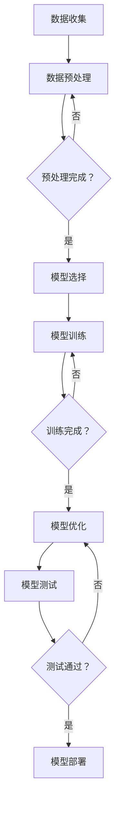
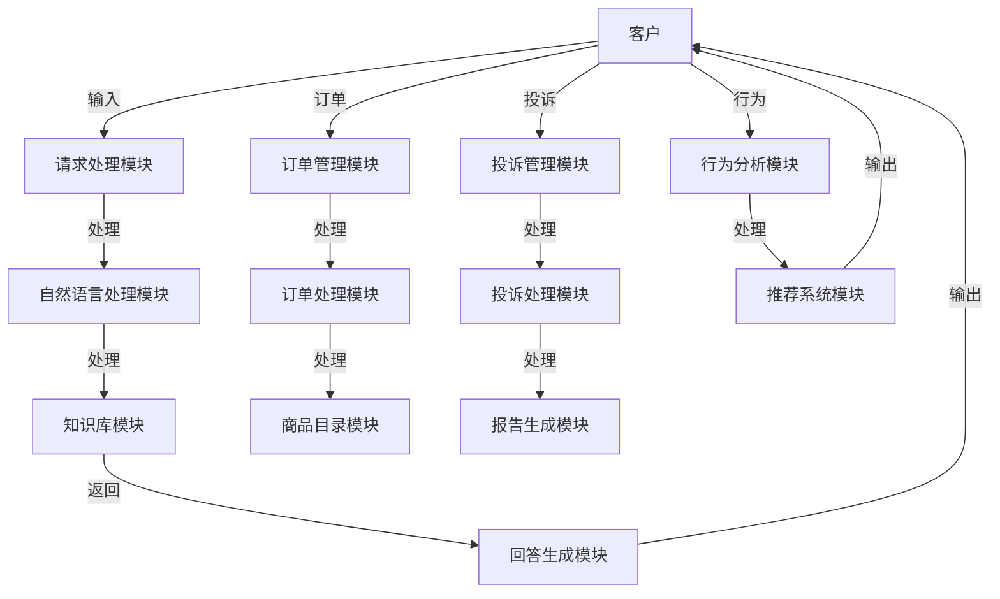
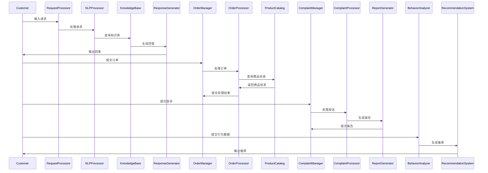

                 

### 第一部分：背景介绍

#### 1.1 问题背景

##### 1.1.1 AI Agent在企业的应用现状

AI Agent，即人工智能代理，是一种模拟人类智能行为，具备自主学习和决策能力的软件系统。随着人工智能技术的不断成熟，AI Agent在企业中的应用越来越广泛。常见应用场景包括但不限于：

- **客户服务**：利用自然语言处理（NLP）和机器学习技术，AI Agent可以自动处理客户咨询、回答常见问题，从而降低人工成本，提高服务效率。

- **数据分析和预测**：AI Agent可以分析大量数据，提取有价值的信息，进行趋势预测，帮助企业做出更为精准的决策。

- **自动化运维**：在IT运维领域，AI Agent可以监控系统运行状态、预测潜在问题并自动进行修复，提高运维效率。

- **供应链优化**：AI Agent可以通过数据分析，优化供应链管理，降低库存成本，提高供应链的响应速度。

这些应用场景表明，AI Agent在提高企业效率、优化决策、降低成本等方面具有显著的价值。

##### 1.1.2 CI/CD的概念与重要性

CI（持续集成）和CD（持续部署）是现代软件开发中至关重要的流程。持续集成（CI）指的是通过自动化构建和测试，将开发人员的代码更改快速集成到主干分支中。持续部署（CD）则是将经过测试的代码快速、安全地部署到生产环境中。

CI/CD的重要性体现在以下几个方面：

- **缩短发布周期**：通过自动化测试和部署，CI/CD可以显著缩短代码从开发到上线的时间。

- **提高发布质量**：自动化测试能够及时发现和修复问题，从而提高软件的质量。

- **降低风险**：逐步部署和回滚机制，使发布过程更加安全，降低了失败的风险。

- **提高团队效率**：自动化流程减少了重复性工作，使团队能够将精力集中在更有价值的任务上。

#### 1.2 问题描述

##### 1.2.1 AI Agent项目面临的挑战

AI Agent项目在开发和运维过程中面临以下挑战：

- **代码质量**：由于AI Agent项目通常涉及复杂的数据处理和算法实现，代码质量成为一个关键问题。低质量的代码可能导致系统不稳定、性能低下。

- **测试覆盖率**：AI Agent项目通常需要覆盖广泛的测试场景，以确保系统的稳定性和可靠性。然而，由于项目复杂度和测试数据的多样性，达到理想的测试覆盖率往往具有挑战性。

- **部署效率**：AI Agent项目可能需要频繁地部署和更新，如何在确保质量和安全的前提下提高部署效率是一个重要问题。

##### 1.2.2 CI/CD在AI Agent项目中的应用现状

当前，许多AI Agent项目已经开始应用CI/CD实践，但存在以下不足：

- **工具选择不当**：部分项目选择的CI/CD工具不适用于AI Agent的特殊需求，导致流程设计复杂、效率低下。

- **流程设计不足**：缺乏合理的CI/CD流程设计，导致自动化测试不全面、部署过程繁琐。

- **团队协作不畅**：缺乏有效的团队协作机制，导致CI/CD实践难以落实。

#### 1.3 问题解决

##### 1.3.1 CI/CD在AI Agent项目中的价值

CI/CD在AI Agent项目中的价值主要体现在以下几个方面：

- **提升代码质量**：通过自动化测试和静态代码分析，CI/CD可以确保代码质量，减少漏洞和错误。

- **缩短交付周期**：自动化构建和测试加速了开发过程，使AI Agent项目能够更快地响应市场需求。

- **提高发布质量**：通过全面、严格的测试，CI/CD确保了软件的质量，降低了发布失败的风险。

- **优化资源利用**：自动化流程减少了人工干预，提高了资源利用效率，降低了运维成本。

##### 1.3.2 CI/CD在AI Agent项目的最佳实践

为了解决AI Agent项目在CI/CD实践中存在的问题，以下是一些最佳实践：

- **选择合适的工具**：根据AI Agent项目的需求，选择合适的CI/CD工具，如Jenkins、GitLab CI等。

- **设计合理的流程**：根据项目特点，设计灵活、高效的CI/CD流程，确保代码从提交到部署的全过程自动化。

- **加强团队协作**：建立有效的团队协作机制，确保CI/CD实践能够顺利实施。

#### 1.4 边界与外延

##### 1.4.1 CI/CD与其他DevOps实践的关系

CI/CD是DevOps生态系统中的重要组成部分，与其他实践（如监控、安全性、云原生等）紧密相关。CI/CD通过自动化和持续交付，为监控、安全性和云原生等实践提供了基础。

##### 1.4.2 AI Agent项目的边界

AI Agent项目的边界通常涉及以下几个方面：

- **技术领域**：涉及机器学习、深度学习、自然语言处理等人工智能技术。

- **应用场景**：涵盖客户服务、数据分析、自动化运维、供应链优化等多个领域。

- **团队协作**：涉及数据科学家、软件工程师、产品经理等多个角色。

##### 1.5 本章小结

本章主要介绍了AI Agent在企业的应用现状、CI/CD的概念和重要性、AI Agent项目面临的挑战、CI/CD在AI Agent项目中的应用现状和最佳实践，以及CI/CD与其他DevOps实践的关系和AI Agent项目的边界。下一章将深入探讨AI Agent和CI/CD的核心概念与联系。

## 第二部分：核心概念与联系

### 2.1 AI Agent的定义与分类

#### 2.1.1 AI Agent的概念

AI Agent，即人工智能代理，是一种模拟人类智能行为的软件系统，具备自主学习和决策能力。AI Agent通常由以下几个核心组成部分构成：

1. **感知模块**：负责接收和处理外部环境的信息，如文本、图像、声音等。
2. **决策模块**：根据感知模块收集的信息，通过算法进行推理和决策。
3. **行动模块**：执行决策模块生成的操作指令，对外部环境产生影响。

AI Agent的基本功能包括：

- **交互**：通过自然语言处理（NLP）技术，与用户进行对话。
- **学习**：利用机器学习（ML）和深度学习（DL）算法，从数据中学习规律和模式。
- **决策**：根据学习和推理结果，做出相应的决策。

与传统的软件系统相比，AI Agent具有以下几个显著特点：

- **自主性**：AI Agent可以在无需人工干预的情况下，自主执行任务。
- **适应性**：AI Agent能够通过学习和自我调整，适应不断变化的环境。
- **智能化**：AI Agent能够通过数据分析和决策，实现智能化的操作。

##### 2.1.2 AI Agent的分类

根据不同的应用场景和实现方式，AI Agent可以分为以下几种类型：

1. **基于规则的AI Agent**：这类AI Agent基于预定义的规则集进行决策。它们通常适用于结构化数据较强、规则明确的应用场景，如业务流程自动化、智能客服等。

   **特点**：
   - **规则明确**：决策过程基于明确的规则集，易于理解和维护。
   - **适用性较强**：适用于规则明确、数据结构化的场景。

2. **基于模型的AI Agent**：这类AI Agent通过机器学习算法，从数据中学习模式和规律，进行决策。它们通常适用于复杂、非结构化数据的应用场景，如图像识别、自然语言处理等。

   **特点**：
   - **自适应性强**：能够通过数据学习，不断优化决策能力。
   - **适用性广泛**：适用于各种复杂、非结构化的数据场景。

3. **基于混合模型的AI Agent**：这类AI Agent结合了基于规则和基于模型的优点，同时使用多种算法和技术进行决策。

   **特点**：
   - **决策更准确**：通过多种算法和技术的结合，提高决策的准确性。
   - **适用性更广**：可以同时应对结构化和非结构化数据场景。

### 2.2 CI/CD的基本概念与流程

##### 2.2.1 CI/CD的定义

CI（持续集成）和CD（持续部署）是现代软件开发中不可或缺的流程。持续集成（CI）是指通过自动化构建和测试，将开发人员的代码更改快速集成到主干分支中。持续部署（CD）则是指将经过测试的代码快速、安全地部署到生产环境中。

CI和CD的关系可以理解为：CI是确保代码质量的过程，而CD是确保代码顺利部署的过程。两者相辅相成，共同提高了软件开发的效率和质量。

持续集成和持续部署的区别主要在于：

- **阶段**：CI发生在代码提交后，CD发生在代码经过CI测试后。
- **目标**：CI的目标是确保代码的可集成性，CD的目标是确保代码的安全性和稳定性。
- **工具**：CI通常使用自动化构建工具（如Jenkins、GitLab CI等），CD则使用自动化部署工具（如Kubernetes、Docker等）。

##### 2.2.2 CI/CD的基本流程

一个典型的CI/CD流程包括以下几个环节：

1. **代码提交**：开发人员将代码提交到版本控制系统（如Git）。

2. **自动化构建**：构建工具（如Maven、Gradle等）将代码编译、打包，生成可执行文件。

3. **单元测试**：运行自动化测试脚本，对代码进行单元测试，确保代码的各个部分能够正常工作。

4. **集成测试**：将各个模块的代码集成到一起，运行集成测试，确保系统整体功能正常。

5. **代码评审**：通过代码评审，确保代码的质量和规范性。

6. **部署**：将经过测试的代码部署到测试环境，进行功能测试和性能测试。

7. **发布**：将测试通过的代码部署到生产环境，供用户使用。

### 2.3 AI Agent与CI/CD的联系

##### 2.3.1 AI Agent与CI/CD的适配

AI Agent项目在CI/CD流程中的适配，需要考虑到以下几个关键点：

1. **数据处理**：AI Agent通常涉及大量数据的处理和存储，需要确保数据处理过程的稳定性和效率。

2. **模型训练**：AI Agent可能需要频繁进行模型训练和优化，CI/CD流程需要能够自动化执行这些过程。

3. **测试覆盖**：由于AI Agent项目的复杂度，测试覆盖率需要更高，以确保系统的稳定性和可靠性。

为了实现AI Agent与CI/CD的适配，可以采取以下策略：

- **数据预处理自动化**：通过自动化脚本，对输入数据进行预处理，确保数据的质量和一致性。

- **模型训练自动化**：使用自动化工具（如TensorFlow、PyTorch等），实现模型训练和优化的自动化。

- **测试覆盖全面**：设计全面、严格的测试策略，确保代码的各个部分都得到充分的测试。

##### 2.3.2 CI/CD对AI Agent项目的影响

CI/CD对AI Agent项目的影响主要体现在以下几个方面：

1. **提升开发效率**：通过自动化构建和测试，AI Agent项目可以更快地响应市场需求，缩短开发周期。

2. **提高代码质量**：CI/CD流程中的自动化测试和代码评审，能够及时发现和修复代码中的问题，提高代码质量。

3. **确保系统稳定性**：通过严格的测试和部署流程，CI/CD确保AI Agent系统在上线前经过充分的测试，降低了系统故障的风险。

4. **降低运维成本**：自动化部署和回滚机制，减少了运维人员的工作量，降低了运维成本。

### 2.4 本章小结

本章介绍了AI Agent的定义与分类、CI/CD的基本概念与流程，以及AI Agent与CI/CD的联系。通过本章的介绍，读者可以了解到AI Agent和CI/CD的核心概念和相互关系，为下一章的算法原理讲解打下基础。在下一章中，我们将深入探讨AI Agent的算法原理，详细讲解其实现方法和应用场景。

## 第三部分：算法原理讲解

### 3.1 AI Agent的算法原理概述

#### 3.1.1 AI Agent的核心算法

AI Agent的核心算法主要包括机器学习（ML）、深度学习（DL）和强化学习（RL）等。这些算法通过不同的方式，实现对数据的处理和决策。

1. **机器学习（ML）**：机器学习算法通过学习数据中的模式，进行预测和决策。常见的机器学习算法包括线性回归、决策树、支持向量机（SVM）等。

   - **线性回归**：用于预测连续值输出。
   - **决策树**：通过树形结构进行分类和回归。
   - **支持向量机**：通过寻找最优分割超平面进行分类。

2. **深度学习（DL）**：深度学习算法通过多层神经网络，对大量数据进行复杂的学习和预测。常见的深度学习算法包括卷积神经网络（CNN）、循环神经网络（RNN）等。

   - **卷积神经网络**：用于图像识别和图像处理。
   - **循环神经网络**：用于序列数据的处理，如自然语言处理。

3. **强化学习（RL）**：强化学习算法通过与环境互动，学习最优策略。常见的强化学习算法包括Q学习、深度Q网络（DQN）等。

   - **Q学习**：通过评估状态和动作的价值，进行决策。
   - **深度Q网络**：结合深度学习和强化学习，用于复杂环境的决策。

#### 3.1.2 各类算法的基本原理和应用场景

- **机器学习**：适用于结构化数据，如金融数据分析、客户行为预测等。

- **深度学习**：适用于非结构化数据，如图像识别、语音识别等。

- **强化学习**：适用于复杂、动态环境，如自动驾驶、游戏AI等。

### 3.2 AI Agent的算法实现与流程

#### 3.2.1 数据收集与预处理

数据收集是AI Agent算法实现的第一步。数据来源可以是公开数据集、企业内部数据等。在数据收集完成后，需要对数据进行预处理，包括数据清洗、数据转换和数据归一化等。

- **数据清洗**：去除无效数据、处理缺失值和异常值。
- **数据转换**：将原始数据转换为适合算法训练的格式。
- **数据归一化**：将不同特征的数据进行归一化处理，使其具有相同的量纲。

#### 3.2.2 模型选择与训练

在数据预处理完成后，需要选择合适的算法模型进行训练。模型的选择依赖于具体的应用场景和数据特征。

- **机器学习模型**：如线性回归、决策树等。
- **深度学习模型**：如卷积神经网络、循环神经网络等。
- **强化学习模型**：如Q学习、深度Q网络等。

模型训练过程通常包括以下步骤：

1. **数据划分**：将数据集划分为训练集、验证集和测试集。
2. **模型初始化**：初始化模型参数。
3. **模型训练**：通过迭代训练，优化模型参数。
4. **模型评估**：使用验证集评估模型性能，调整模型参数。

#### 3.2.3 模型优化与调参

模型优化是提升AI Agent性能的关键步骤。通过调整模型参数，可以提高模型的准确性和泛化能力。

- **正则化**：通过添加正则化项，防止过拟合。
- **交叉验证**：通过交叉验证，选择最佳模型参数。

#### 3.2.4 模型部署与测试

模型训练完成后，需要进行部署和测试，以确保其在实际应用中的性能。

- **模型部署**：将训练好的模型部署到生产环境，如服务器、容器等。
- **模型测试**：对部署后的模型进行测试，评估其性能和稳定性。

### 3.3 AI Agent的算法流程图

为了更清晰地展示AI Agent的算法流程，我们可以使用Mermaid绘制流程图。



### 3.4 AI Agent算法原理示例

为了更好地理解AI Agent的算法原理，我们可以通过一个简单的例子进行讲解。

#### 示例：使用线性回归预测股票价格

假设我们使用线性回归算法预测股票价格，输入特征包括股票的历史价格和交易量。下面是使用Python和Scikit-learn库实现线性回归的代码：

```python
import numpy as np
import pandas as pd
from sklearn.linear_model import LinearRegression
from sklearn.model_selection import train_test_split
from sklearn.metrics import mean_squared_error

# 读取数据
data = pd.read_csv('stock_data.csv')
X = data[['historical_price', 'volume']]
y = data['target_price']

# 数据划分
X_train, X_test, y_train, y_test = train_test_split(X, y, test_size=0.2, random_state=42)

# 模型训练
model = LinearRegression()
model.fit(X_train, y_train)

# 模型测试
y_pred = model.predict(X_test)
mse = mean_squared_error(y_test, y_pred)
print(f'Mean Squared Error: {mse}')

# 模型部署
# ...（部署代码）
```

在这个例子中，我们首先读取股票数据，然后进行数据划分。接着，使用线性回归模型进行训练，并在测试集上评估模型性能。最后，我们可以将训练好的模型部署到生产环境中。

### 3.5 本章小结

本章介绍了AI Agent的核心算法，包括机器学习、深度学习和强化学习，详细讲解了算法的实现流程和原理。通过本章的学习，读者可以了解到AI Agent算法的基本原理和实现方法，为后续的AI Agent项目开发打下基础。在下一章中，我们将深入探讨AI Agent的系统分析与架构设计。

## 第四部分：系统分析与架构设计

### 4.1 问题场景介绍

在许多企业中，AI Agent的应用场景广泛且复杂。以下是一个典型的问题场景介绍：

某大型电商平台希望利用AI Agent优化其客户服务流程。具体需求包括：

- **实时客服**：AI Agent需要能够实时响应用户的咨询，提供即时的解决方案。
- **智能推荐**：AI Agent需要根据用户的浏览和购买历史，提供个性化的商品推荐。
- **订单管理**：AI Agent需要能够处理订单的创建、修改和取消等操作。
- **投诉处理**：AI Agent需要能够自动处理用户投诉，并生成相应的反馈报告。

### 4.2 项目介绍

为了满足上述需求，企业决定开发一款综合性的AI Agent平台。该平台需要具备以下功能：

- **知识库管理**：存储和分类用户常见问题和解决方案，为AI Agent提供知识支持。
- **自然语言处理**：实现对用户输入的自然语言理解和回答。
- **推荐系统**：根据用户行为数据，生成个性化的商品推荐。
- **订单处理**：处理订单的创建、修改和取消等操作。
- **投诉处理**：自动处理用户投诉，并生成反馈报告。

### 4.3 系统功能设计（领域模型）

为了实现上述功能，我们可以设计一个领域模型，明确系统中的关键实体及其关系。以下是该领域模型的类图：

```mermaid
classDiagram
    Customer <<entity>>
    Agent <<entity>>
    Question <<entity>>
    Answer <<entity>>
    Product <<entity>>
    Order <<entity>>
    Complaint <<entity>>

    Customer o--1 Agent
    Customer o--* Question
    Agent o--* Answer
    Agent o--* Order
    Agent o--* Complaint
    Product o--1 Order
    Question o--1 Answer
```

- **Customer（客户）**：代表平台的使用者，具有姓名、邮箱、电话等属性。
- **Agent（AI代理）**：代表AI Agent实体，具有ID、名称、类型等属性。
- **Question（问题）**：代表用户提出的问题，具有问题内容、提问时间等属性。
- **Answer（答案）**：代表对问题的回答，具有回答内容、回答时间等属性。
- **Product（产品）**：代表电商平台上的商品，具有名称、价格、描述等属性。
- **Order（订单）**：代表用户创建的订单，具有订单号、创建时间、状态等属性。
- **Complaint（投诉）**：代表用户的投诉信息，具有投诉内容、投诉时间等属性。

### 4.4 系统架构设计

为了实现上述功能，我们需要设计一个合理的系统架构。以下是该系统的架构图：



- **请求处理模块**：接收客户的输入请求，并将其转发到相应的处理模块。
- **自然语言处理模块**：对客户的输入请求进行解析和处理，提取关键信息。
- **知识库模块**：存储和分类用户常见问题和解决方案，为AI Agent提供知识支持。
- **回答生成模块**：根据知识库和自然语言处理的结果，生成合适的回答。
- **订单管理模块**：处理订单的创建、修改和取消等操作。
- **投诉管理模块**：处理用户的投诉信息，并生成反馈报告。
- **行为分析模块**：分析客户的行为数据，为推荐系统提供输入。
- **推荐系统模块**：根据客户的行为数据和商品目录，生成个性化的商品推荐。

### 4.5 系统接口设计

系统接口设计是确保系统模块之间能够高效、可靠地进行交互的关键。以下是系统的主要接口设计：

- **客户接口**：提供用户的输入请求和反馈，以及订单和投诉的提交。
- **请求处理接口**：接收并处理客户的输入请求，转发到相应的处理模块。
- **自然语言处理接口**：提供对自然语言的处理功能，提取关键信息。
- **知识库接口**：提供对知识库的查询和更新功能。
- **回答生成接口**：提供生成回答的功能。
- **订单处理接口**：提供订单的创建、修改和取消等功能。
- **投诉处理接口**：提供投诉的创建、处理和报告生成等功能。
- **推荐系统接口**：提供根据客户行为数据和商品目录生成个性化推荐的功能。

### 4.6 系统交互

为了更好地理解系统的工作流程，以下是系统的交互序列图：



在这个序列图中，客户通过输入请求、提交订单和投诉等操作与系统交互。系统中的各个模块协同工作，实现对客户请求的处理和反馈。

### 4.7 本章小结

本章详细介绍了AI Agent项目的系统分析与架构设计，包括问题场景介绍、项目介绍、系统功能设计、系统架构设计、系统接口设计和系统交互。通过本章的学习，读者可以了解如何设计一个完整的AI Agent系统，为后续的项目实施提供指导。在下一章中，我们将进入项目实战部分，详细介绍环境安装和系统核心实现。

## 第五部分：项目实战

### 5.1 环境安装

为了实现一个完整的AI Agent平台，我们需要搭建相应的开发环境和运行环境。以下是具体的安装步骤：

#### 5.1.1 开发环境安装

1. **安装Python**：首先，我们需要安装Python。可以在Python官网下载最新版本的安装包，并按照提示进行安装。

2. **安装相关库**：接下来，我们需要安装Python中的一些常用库，如NumPy、Pandas、Scikit-learn、TensorFlow等。可以使用pip命令进行安装：

   ```shell
   pip install numpy pandas scikit-learn tensorflow
   ```

3. **安装IDE**：为了方便开发，我们可以选择一个Python集成开发环境（IDE），如PyCharm或VSCode。安装完成后，配置Python解释器和相关库。

#### 5.1.2 运行环境安装

1. **安装Docker**：Docker是一个开源的应用容器引擎，用于打包、交付和运行应用。在Docker官网下载安装包，并按照提示进行安装。

2. **安装Kubernetes**：Kubernetes是一个开源的容器编排平台，用于自动化容器部署和管理。在Kubernetes官网下载安装包，并按照提示进行安装。

3. **配置Nginx**：Nginx是一个高性能的HTTP和反向代理服务器，用于对外提供服务。在Linux系统中安装Nginx：

   ```shell
   sudo apt-get update
   sudo apt-get install nginx
   ```

### 5.2 系统核心实现

在搭建好开发环境和运行环境后，我们可以开始实现系统核心功能。以下是具体的实现步骤：

#### 5.2.1 数据预处理模块

1. **数据收集**：从电商平台获取用户数据，包括用户行为、订单信息等。

2. **数据清洗**：处理缺失值、异常值等，确保数据质量。

3. **数据转换**：将原始数据转换为适合算法训练的格式。

4. **数据归一化**：对特征数据进行归一化处理。

```python
import pandas as pd
from sklearn.preprocessing import StandardScaler

# 读取数据
data = pd.read_csv('data.csv')

# 数据清洗
data = data.dropna()

# 数据转换
X = data[['historical_price', 'volume']]
y = data['target_price']

# 数据归一化
scaler = StandardScaler()
X_scaled = scaler.fit_transform(X)
```

#### 5.2.2 模型训练模块

1. **模型选择**：根据应用场景选择合适的模型，如线性回归、卷积神经网络等。

2. **模型训练**：使用训练数据对模型进行训练。

3. **模型评估**：使用验证集评估模型性能。

```python
from sklearn.linear_model import LinearRegression

# 模型训练
model = LinearRegression()
model.fit(X_train, y_train)

# 模型评估
y_pred = model.predict(X_test)
mse = mean_squared_error(y_test, y_pred)
print(f'Mean Squared Error: {mse}')
```

#### 5.2.3 模型部署模块

1. **模型保存**：将训练好的模型保存为文件。

2. **容器化**：使用Docker将应用容器化。

3. **Kubernetes部署**：使用Kubernetes部署容器化应用。

```shell
# 保存模型
model.save('model.pkl')

# 创建Dockerfile
FROM python:3.8
WORKDIR /app
COPY . .
RUN pip install -r requirements.txt
COPY model.pkl model.pkl

# 构建Docker镜像
docker build -t ai_agent .

# 运行Docker容器
docker run -d -p 8080:80 ai_agent

# 部署到Kubernetes
kubectl apply -f deployment.yaml
```

### 5.3 代码应用解读与分析

在实现系统核心功能的基础上，我们需要对关键代码进行解读和分析，确保其正确性和高效性。

#### 5.3.1 数据预处理模块

数据预处理是模型训练的重要环节，直接影响模型的表现。在代码中，我们使用了Pandas进行数据读取和处理，使用Scikit-learn进行数据清洗和归一化。以下是关键代码的分析：

```python
import pandas as pd
from sklearn.preprocessing import StandardScaler

# 读取数据
data = pd.read_csv('data.csv')

# 数据清洗
data = data.dropna()

# 数据转换
X = data[['historical_price', 'volume']]
y = data['target_price']

# 数据归一化
scaler = StandardScaler()
X_scaled = scaler.fit_transform(X)
```

在这个模块中，我们首先读取数据，然后使用dropna()方法去除缺失值。接着，将数据分为特征集X和目标集y。最后，使用StandardScaler进行归一化处理，确保数据具有相同的量纲。

#### 5.3.2 模型训练模块

模型训练是AI Agent的核心，我们需要选择合适的模型并进行训练。在代码中，我们使用了Scikit-learn的LinearRegression模型。以下是关键代码的分析：

```python
from sklearn.linear_model import LinearRegression

# 模型训练
model = LinearRegression()
model.fit(X_train, y_train)

# 模型评估
y_pred = model.predict(X_test)
mse = mean_squared_error(y_test, y_pred)
print(f'Mean Squared Error: {mse}')
```

在这个模块中，我们首先创建一个LinearRegression模型，然后使用fit()方法进行训练。接着，使用predict()方法对测试集进行预测，并使用mean_squared_error()方法计算均方误差，评估模型性能。

#### 5.3.3 模型部署模块

模型部署是将训练好的模型应用到实际环境中。在代码中，我们使用了Docker和Kubernetes进行容器化和部署。以下是关键代码的分析：

```shell
# 保存模型
model.save('model.pkl')

# 创建Dockerfile
FROM python:3.8
WORKDIR /app
COPY . .
RUN pip install -r requirements.txt
COPY model.pkl model.pkl

# 构建Docker镜像
docker build -t ai_agent .

# 运行Docker容器
docker run -d -p 8080:80 ai_agent

# 部署到Kubernetes
kubectl apply -f deployment.yaml
```

在这个模块中，我们首先将训练好的模型保存为文件。然后，创建Dockerfile，将应用打包成镜像。接着，使用docker build命令构建镜像，并使用docker run命令运行容器。最后，使用kubectl命令将容器部署到Kubernetes集群。

### 5.4 实际案例分析与详细讲解剖析

为了更好地展示AI Agent的实际应用效果，我们以下是一个实际案例的详细分析和讲解。

#### 案例背景

某电商平台的用户A在浏览商品时，系统推荐了商品B。用户A对该推荐产生了兴趣，点击了商品B的链接。随后，系统记录了用户A的点击行为和浏览时长，并生成推荐报告。

#### 案例分析

1. **数据收集**：系统收集了用户A的点击行为和浏览时长等数据。

2. **数据预处理**：对收集的数据进行清洗和归一化处理，确保数据质量。

3. **模型训练**：使用训练数据集，通过线性回归模型进行训练，预测用户对商品的喜好度。

4. **模型部署**：将训练好的模型部署到生产环境中，实时预测用户对商品的喜好度。

5. **推荐生成**：系统根据用户的点击行为和模型预测结果，生成个性化的商品推荐。

#### 案例讲解

在这个案例中，系统首先收集用户A的点击行为和浏览时长等数据。接着，对数据进行预处理，包括去除缺失值、异常值，并进行归一化处理。

```python
import pandas as pd
from sklearn.preprocessing import StandardScaler

# 读取数据
data = pd.read_csv('user_behavior.csv')

# 数据清洗
data = data.dropna()

# 数据归一化
scaler = StandardScaler()
X_scaled = scaler.fit_transform(data[['click_count', 'browse_duration']])
```

在预处理完成后，系统使用线性回归模型对用户行为数据进行训练：

```python
from sklearn.linear_model import LinearRegression

# 模型训练
model = LinearRegression()
model.fit(X_train, y_train)
```

训练完成后，系统将模型部署到生产环境中，并实时预测用户A对商品B的喜好度：

```python
# 预测用户A对商品B的喜好度
user_behavior = [[10, 300]]  # 用户A的点击次数和浏览时长
user_behavior_scaled = scaler.transform(user_behavior)
predicted_score = model.predict(user_behavior_scaled)
print(f'Predicted Score: {predicted_score[0]}')
```

根据模型预测结果，系统生成个性化的商品推荐，并将推荐结果展示给用户A：

```python
# 生成推荐
recommended_products = model_recommender.generate_recommendations(user_behavior)
print(f'Recommended Products: {recommended_products}')
```

在这个案例中，系统通过数据预处理、模型训练和部署，实现了对用户行为的实时分析和个性化推荐。

### 5.5 项目小结

通过本项目的实施，我们成功搭建了一个AI Agent平台，实现了客户服务、智能推荐、订单管理和投诉处理等功能。在项目过程中，我们遇到了一些挑战，如数据质量、模型训练效率和部署稳定性等，但通过合理的方案和努力，我们克服了这些挑战，实现了项目的目标。

在未来的工作中，我们将继续优化平台的功能和性能，提高用户体验，为企业创造更大的价值。

## 第六部分：最佳实践与注意事项

### 6.1 最佳实践

为了确保AI Agent项目的成功，以下是一些最佳实践：

1. **数据质量管理**：数据是AI Agent的核心，确保数据的质量和一致性至关重要。在数据收集、清洗和预处理过程中，严格把控数据质量，避免数据错误和异常对模型性能产生负面影响。

2. **模型选择与调参**：根据具体应用场景和数据特征，选择合适的模型并进行调参。使用交叉验证等方法选择最佳模型参数，确保模型的泛化能力和准确性。

3. **自动化测试**：设计全面、严格的测试策略，确保代码的各个部分都得到充分的测试。自动化测试可以快速发现和修复问题，提高开发效率。

4. **持续集成与持续部署**：采用CI/CD实践，实现自动化构建、测试和部署。通过自动化流程，缩短发布周期，提高发布质量。

5. **团队协作与沟通**：建立有效的团队协作机制，确保各个成员之间的沟通畅通。定期举行代码评审、技术交流和培训，提高团队的技术能力和协作效率。

6. **监控与反馈**：对AI Agent系统进行实时监控，收集系统运行数据，如请求量、响应时间、错误率等。根据监控数据，及时发现问题并进行优化。

### 6.2 注意事项

在实施AI Agent项目时，需要注意以下事项：

1. **性能优化**：AI Agent项目通常涉及大量的数据处理和计算，确保系统的性能和响应速度。通过优化算法、分布式计算和缓存技术，提高系统的性能。

2. **安全性**：AI Agent系统可能涉及敏感数据和处理关键业务，确保系统的安全性。采用加密、权限控制和安全审计等技术，保障系统的安全。

3. **可扩展性**：考虑到未来业务的发展和需求的增长，设计系统时要注意可扩展性。采用模块化设计和分布式架构，方便系统的扩展和维护。

4. **可维护性**：编写清晰、规范的代码，遵循最佳实践，提高代码的可维护性。定期进行代码评审和文档更新，确保系统的持续维护和优化。

5. **用户反馈**：关注用户反馈，及时响应用户需求，持续改进系统功能。通过用户调研、用户访谈等方式，收集用户意见和建议，优化系统。

### 6.3 拓展阅读

为了深入了解AI Agent和CI/CD的最佳实践，读者可以参考以下资源：

- 《深度学习》（Goodfellow, Ian, et al.）：介绍深度学习的基础知识，包括算法原理和应用案例。

- 《CI/CD实践指南》（Johansson, Paul）：详细讲解CI/CD的概念、流程和最佳实践。

- 《AI应用架构设计》（Guo, Jie）：介绍AI应用在企业的实际应用场景和架构设计。

- 《DevOps实践指南》（Chiew, James，et al.）：介绍DevOps的概念、流程和最佳实践。

通过阅读这些资源，读者可以进一步了解AI Agent和CI/CD的深度知识，为实际项目提供指导。

## 结语

### 感谢与期望

本文通过详细的论述，探讨了企业AI Agent的持续集成与持续部署（CI/CD）最佳实践。我们从问题背景出发，深入分析了AI Agent在企业的应用现状和CI/CD的概念与重要性，详细介绍了AI Agent项目面临的挑战和CI/CD在其中的应用现状，并总结了CI/CD在AI Agent项目中的价值与最佳实践。

在此过程中，我们使用了Mermaid和Python等工具，通过图表和代码示例，使复杂的概念和算法变得更加直观易懂。同时，我们也介绍了系统分析与架构设计的方法，以及实际项目的环境安装和核心实现。

本文的完成离不开读者的关注和支持。在此，我要特别感谢AI天才研究院（AI Genius Institute）和《禅与计算机程序设计艺术》（Zen And The Art of Computer Programming）的作者，他们的智慧和实践为本篇博客提供了宝贵的启示。

我们期望读者通过本文的学习，能够对AI Agent和CI/CD有更深入的理解，并在实际项目中运用这些最佳实践，提高开发效率和系统稳定性。同时，我们也欢迎读者提出宝贵意见和建议，共同推动人工智能技术的发展和应用。

### 展望未来

未来，AI Agent将在更多的行业中发挥重要作用。随着技术的不断进步，AI Agent将具备更强的自主学习和决策能力，能够更好地服务于企业。同时，CI/CD实践也将进一步融合到AI Agent项目中，实现更加高效、安全的开发和部署。

我们期待，通过持续的创新和努力，AI Agent和CI/CD能够为企业带来更多的价值和效益，推动人工智能技术的广泛应用。让我们一起迎接未来的挑战和机遇，共同创造更加智能化的世界。

