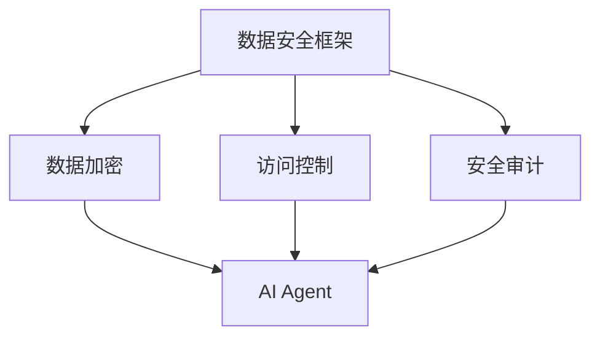
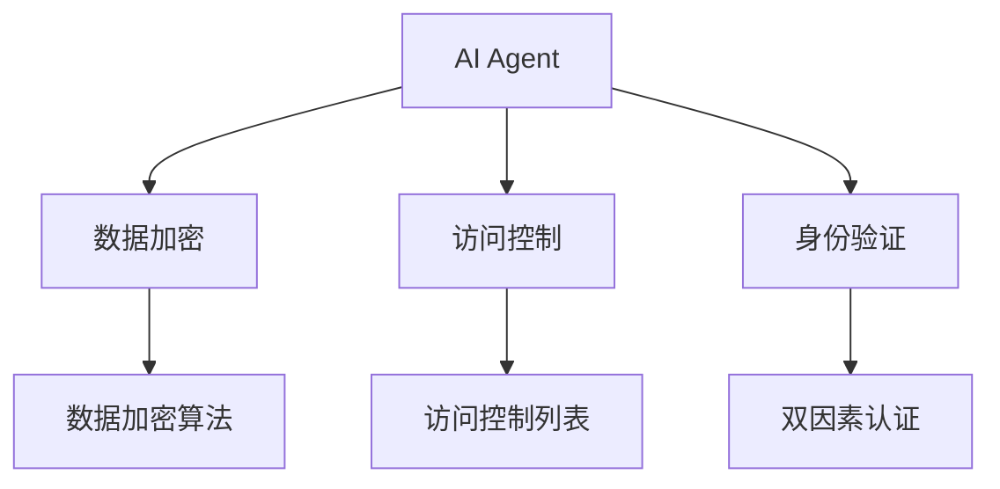
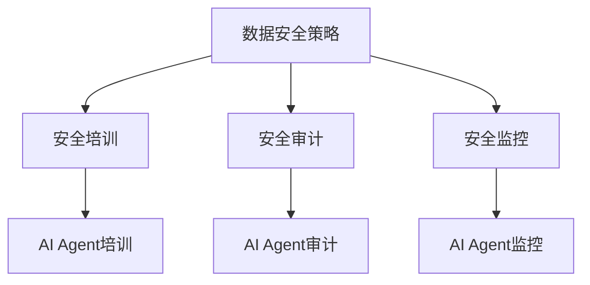
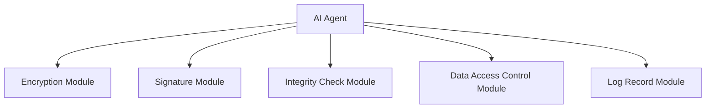
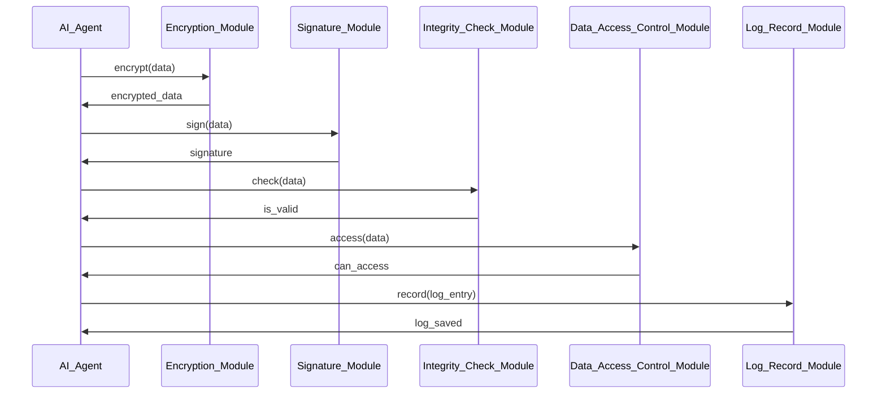

                 

### 第一部分：背景介绍

#### 1.1 问题的背景

##### 1.1.1 AI Agent的概念与作用

AI Agent，即人工智能代理，是人工智能领域的一种实体，它能够自主地完成特定任务，并在完成任务的过程中具备学习和适应环境的能力。AI Agent的设计旨在模拟人类智能，使其能够在复杂、动态的环境中高效地执行任务。

在当今的商业环境中，AI Agent的应用日益广泛。例如，自动驾驶汽车、智能客服系统、金融领域的风险控制系统等，都采用了AI Agent来实现自动化和智能化。这些AI Agent不仅能够提高企业的运营效率，还能够为企业带来显著的商业价值。

##### 1.1.2 数据安全的重要性

随着AI Agent在企业中的应用越来越广泛，数据安全的重要性也日益凸显。数据是AI Agent运行的基石，一旦数据泄露，不仅可能导致企业的商业机密泄露，还可能对企业的声誉造成严重损害。此外，随着数据隐私法规的日益严格，企业必须确保其处理的数据符合法规要求，否则将面临巨大的法律风险和罚款。

##### 1.1.3 企业AI Agent面临的挑战

企业AI Agent在数据安全方面面临的挑战主要包括以下几个方面：

1. **数据泄露的风险**：AI Agent在处理数据时，可能由于设计缺陷、代码漏洞等原因，导致数据泄露。
2. **数据隐私保护的要求**：随着数据隐私法规的出台，企业需要确保其处理的数据符合隐私保护要求。
3. **安全漏洞与对策**：AI Agent可能面临各种安全漏洞，如SQL注入、跨站脚本攻击等，企业需要采取有效的对策来防范这些风险。

#### 1.2 问题描述

##### 1.2.1 数据泄露的风险

数据泄露是企业AI Agent面临的首要风险。由于AI Agent通常处理大量的敏感数据，如用户信息、财务数据等，一旦数据泄露，可能导致严重的后果。例如，2017年的Equifax数据泄露事件，就导致了1.43亿用户的个人信息被泄露，给公司带来了巨大的声誉损失和财务损失。

##### 1.2.2 数据隐私保护的要求

随着数据隐私法规的出台，如欧盟的《通用数据保护条例》（GDPR）和美国的《加州消费者隐私法案》（CCPA），企业需要确保其处理的数据符合隐私保护要求。否则，企业将面临巨额罚款和诉讼风险。例如，2018年，Facebook因违反GDPR，被罚款50亿美元。

##### 1.2.3 安全漏洞与对策

AI Agent可能面临各种安全漏洞，如SQL注入、跨站脚本攻击等。这些漏洞可能被黑客利用，从而实现对AI Agent的攻击。为了防范这些风险，企业需要采取一系列的安全对策，如使用加密技术、安全编程实践等。

#### 1.3 问题解决

##### 1.3.1 市场现状分析

目前，市场上已经出现了多种数据安全解决方案，如数据加密、访问控制、安全审计等。这些解决方案在一定程度上能够缓解AI Agent的数据安全风险。

##### 1.3.2 国内外政策法规概述

国内外的政策法规对数据安全提出了严格的要求。例如，中国的《网络安全法》和《个人信息保护法》，欧盟的《通用数据保护条例》（GDPR）等，都对数据安全提出了明确的要求。

##### 1.3.3 企业AI Agent数据安全策略的必要性

面对数据泄露的风险、数据隐私保护的要求以及安全漏洞的挑战，企业需要制定一套全面的数据安全策略。这不仅包括技术手段，还需要结合管理和法律手段，形成一套完整的数据安全管理体系。

#### 1.4 边界与外延

##### 1.4.1 数据安全的概念框架

数据安全是指保护数据免受未经授权的访问、使用、披露、破坏、修改或破坏。它包括数据加密、访问控制、安全审计等多个方面。

##### 1.4.2 AI Agent的边界界定

AI Agent的边界界定涉及其能够访问的数据范围、执行的任务范围等。明确AI Agent的边界有助于确保数据安全。

##### 1.4.3 数据安全策略的影响因素

数据安全策略的影响因素包括企业的业务模式、数据类型、法律法规等。企业需要根据自身情况制定合适的数据安全策略。

#### 1.5 概念结构与核心要素组成

##### 1.5.1 AI Agent的核心概念

AI Agent的核心概念包括自主性、适应性、学习性等。这些特性使得AI Agent能够在复杂环境中高效地执行任务。

##### 1.5.2 数据安全的要素分析

数据安全的要素包括数据的机密性、完整性、可用性等。这些要素是企业制定数据安全策略时需要考虑的关键点。

##### 1.5.3 企业AI Agent数据安全策略的架构

企业AI Agent数据安全策略的架构包括技术层面、管理层面和法律层面。技术层面包括数据加密、访问控制等技术手段；管理层面包括安全政策、安全培训等管理措施；法律层面包括法律法规的遵守等。

#### 1.6 本章小结

本文介绍了企业AI Agent数据安全策略的背景、问题描述、问题解决、边界与外延以及概念结构与核心要素组成。通过对这些内容的介绍，为企业制定数据安全策略提供了理论依据和实践指导。

----------------------------------------------------------------

# 第二部分：核心概念与联系

#### 2.1 数据安全的基本概念

##### 2.1.1 数据安全的定义

数据安全是指通过一系列技术和管理手段，保护数据在存储、传输和处理过程中不受未经授权的访问、使用、披露、破坏、修改或破坏，确保数据的机密性、完整性和可用性。

##### 2.1.2 数据安全的关键属性

数据安全的关键属性包括：

1. **机密性**：确保数据只能被授权用户访问。
2. **完整性**：确保数据在传输和存储过程中未被篡改。
3. **可用性**：确保数据在需要时能够被正常访问和使用。

##### 2.1.3 数据安全的基本原则

数据安全的基本原则包括：

1. **最小权限原则**：用户或系统组件只能访问其执行任务所需的数据。
2. **防御深度原则**：通过多层防御机制，增加攻击者入侵的成本。
3. **风险评估原则**：对系统进行定期风险评估，及时识别和应对潜在风险。

#### 2.2 AI Agent的基本概念

##### 2.2.1 AI Agent的定义

AI Agent，即人工智能代理，是指能够自主地执行任务、具备学习和适应环境能力的软件实体。AI Agent通过模拟人类智能，能够在复杂、动态的环境中高效地完成任务。

##### 2.2.2 AI Agent的特点

AI Agent的特点包括：

1. **自主性**：能够自主地执行任务，无需人工干预。
2. **适应性**：能够根据环境变化和学习经验，调整自身行为。
3. **学习性**：能够通过数据学习和模式识别，提高任务执行效果。

##### 2.2.3 AI Agent的技术发展历程

AI Agent的技术发展历程可以分为以下几个阶段：

1. **规则推理阶段**：基于预定义的规则进行推理和决策。
2. **基于知识的阶段**：引入知识表示和推理技术，提高决策能力。
3. **基于学习阶段**：采用机器学习、深度学习等技术，实现自我学习和优化。

#### 2.3 数据安全与AI Agent的关系

##### 2.3.1 数据安全对AI Agent的影响

数据安全对AI Agent的影响主要体现在以下几个方面：

1. **机密性**：确保AI Agent处理的数据不会被未经授权的用户访问。
2. **完整性**：确保AI Agent处理的数据不会被篡改。
3. **可用性**：确保AI Agent处理的数据在需要时能够被正常访问和使用。

##### 2.3.2 AI Agent对数据安全的挑战

AI Agent对数据安全的挑战主要包括：

1. **数据访问权限**：AI Agent可能需要访问敏感数据，如何确保访问权限的合理性和安全性？
2. **数据泄露风险**：AI Agent在处理数据时，可能由于设计缺陷、代码漏洞等原因，导致数据泄露。
3. **数据隐私保护**：随着数据隐私法规的出台，企业需要确保AI Agent处理的数据符合隐私保护要求。

##### 2.3.3 数据安全与AI Agent的协同发展

数据安全与AI Agent的协同发展体现在以下几个方面：

1. **数据安全机制与AI Agent的集成**：将数据安全机制与AI Agent的设计和实现相结合，确保AI Agent在处理数据时能够自动执行数据安全策略。
2. **数据安全与AI Agent的协同优化**：通过优化数据安全策略和算法，提高AI Agent在数据安全环境下的运行效率。
3. **数据安全与AI Agent的互操作**：确保数据安全系统和AI Agent之间的数据交换和通信，实现数据安全与AI Agent的无缝集成。

#### 2.4 数据安全与AI Agent的联系

##### 2.4.1 数据安全框架与AI Agent的关系

数据安全框架与AI Agent的关系如图2-1所示。数据安全框架包括数据加密、访问控制、安全审计等多个方面，这些方面与AI Agent的设计和实现密切相关。



##### 2.4.2 数据安全机制与AI Agent的应用

数据安全机制与AI Agent的应用如图2-2所示。数据安全机制包括加密、访问控制、身份验证等，这些机制在AI Agent的设计和实现中被广泛应用。



##### 2.4.3 数据安全策略与AI Agent的实现

数据安全策略与AI Agent的实现如图2-3所示。数据安全策略包括安全培训、安全审计、安全监控等，这些策略在AI Agent的实现过程中得到贯彻和执行。



#### 2.5 AI Agent与数据安全的对比表格

| 概念          | 定义                                                         | 关系                                           |
|---------------|--------------------------------------------------------------|------------------------------------------------|
| 数据安全      | 保护数据免受未经授权的访问、使用、披露、破坏、修改或破坏。 | 是AI Agent正常运行的基础。                   |
| AI Agent      | 可以自主执行任务、学习和适应环境的软件实体。               | 需要数据安全策略来确保其处理数据的合法性。 |
| 数据安全策略  | 针对数据安全的规划、制度和措施。                            | 是AI Agent数据安全的保障。                 |

#### 2.6 AI Agent与数据安全的ER实体关系图

```mermaid
erDiagram
    AI Agent ||--|{ 数据安全策略 } Data_Security_Strategy : 实施策略
    Data_Security_Strategy ||--|{ 数据保护机制 } Data_Protection_Mechanism : 实施机制
    AI Agent ||--|{ 数据隐私保护 } Data_Privacy_Protection : 保护隐私
```

#### 2.7 本章小结

本文介绍了数据安全与AI Agent的核心概念，分析了它们之间的关系，并展示了它们之间的联系。通过理解这些概念和关系，可以帮助企业更好地制定数据安全策略，确保AI Agent在数据安全环境中高效运行。

----------------------------------------------------------------

# 第三部分：算法原理讲解

#### 3.1 数据加密算法

##### 3.1.1 数据加密的概念

数据加密是将原始数据转换为不易理解的形式的过程，旨在防止未经授权的用户访问和理解数据。加密算法是数据加密的核心，它通过特定的数学运算，将明文数据转换为密文。

##### 3.1.2 常见的数据加密算法

数据加密算法可以分为对称加密算法和非对称加密算法。

###### 3.1.2.1 对称加密算法

对称加密算法使用相同的密钥进行加密和解密。常见的对称加密算法包括：

1. **AES（高级加密标准）**：AES是一种分组加密算法，它使用128位、192位或256位密钥，支持128位、192位或256位的分组大小。AES算法具有较高的安全性和效率，已成为国际加密标准。

   **加密过程**：
   $$
   \text{Ciphertext} = E_{\text{Key}}(\text{Plaintext})
   $$
   其中，$E_{\text{Key}}$表示使用密钥$Key$的加密算法。

   **解密过程**：
   $$
   \text{Plaintext} = D_{\text{Key}}(\text{Ciphertext})
   $$
   其中，$D_{\text{Key}}$表示使用密钥$Key$的解密算法。

2. **DES（数据加密标准）**：DES是一种分组加密算法，它使用56位密钥，支持64位的分组大小。但由于其密钥长度较短，已逐渐被AES所取代。

   **加密过程**：
   $$
   \text{Ciphertext} = E_{\text{Key}}(\text{Plaintext})
   $$
   **解密过程**：
   $$
   \text{Plaintext} = D_{\text{Key}}(\text{Ciphertext})
   $$

###### 3.1.2.2 非对称加密算法

非对称加密算法使用一对密钥，即公钥和私钥，其中公钥用于加密，私钥用于解密。常见的非对称加密算法包括：

1. **RSA（Rivest-Shamir-Adleman）**：RSA算法是基于大数分解问题的非对称加密算法。它使用一个公钥和一个私钥，其中公钥用于加密，私钥用于解密。

   **加密过程**：
   $$
   \text{Ciphertext} = E_{\text{PublicKey}}(\text{Plaintext})
   $$
   **解密过程**：
   $$
   \text{Plaintext} = D_{\text{PrivateKey}}(\text{Ciphertext})
   $$

2. **ECC（椭圆曲线加密）**：ECC算法是基于椭圆曲线离散对数问题的非对称加密算法。它使用椭圆曲线和点的乘法，具有更高的安全性。

   **加密过程**：
   $$
   \text{Ciphertext} = E_{\text{PublicKey}}(\text{Plaintext})
   $$
   **解密过程**：
   $$
   \text{Plaintext} = D_{\text{PrivateKey}}(\text{Ciphertext})
   $$

##### 3.1.3 数据加密算法的应用实例

以下是一个使用Python实现AES加密算法的实例：

```python
from Crypto.Cipher import AES
from Crypto.Util.Padding import pad, unpad
from Crypto.Random import get_random_bytes

# 生成密钥
key = get_random_bytes(16)  # 16字节密钥，适用于AES-128

# 创建AES加密对象
cipher = AES.new(key, AES.MODE_CBC)

# 填充明文数据
plaintext = b"Hello, World!"
padded_plaintext = pad(plaintext, AES.block_size)

# 加密明文数据
ciphertext = cipher.encrypt(padded_plaintext)

# 输出密文和初始化向量
print("Ciphertext:", ciphertext.hex())
print("IV:", cipher.iv.hex())

# 创建AES解密对象
decipher = AES.new(key, AES.MODE_CBC, iv=cipher.iv)

# 解密密文数据
unpadded_plaintext = unpad(decipher.decrypt(ciphertext), AES.block_size)

# 输出明文数据
print("Plaintext:", unpadded_plaintext.decode())
```

#### 3.2 数据签名算法

##### 3.2.1 数据签名的概念

数据签名是一种确保数据完整性和真实性的技术。它通过将数据与私钥进行加密，生成一个签名，然后任何人都可以使用相应的公钥验证签名的有效性。

##### 3.2.2 常见的数据签名算法

1. **RSA签名**：RSA签名是基于RSA算法的数字签名方案。它使用私钥生成签名，使用公钥验证签名。

   **签名过程**：
   $$
   \text{Signature} = S_{\text{PrivateKey}}(\text{Message})
   $$
   **验证过程**：
   $$
   \text{Verified} = E_{\text{PublicKey}}(\text{Signature}) \stackrel{?}{=} \text{Message}
   $$

2. **ECDSA签名**：ECDSA签名是基于椭圆曲线密码学的数字签名方案。它使用私钥生成签名，使用公钥验证签名。

   **签名过程**：
   $$
   (\text{R}, \text{S}) = S_{\text{PrivateKey}}(\text{Message}, \text{Hash})
   $$
   **验证过程**：
   $$
   \text{Verified} = \text{EC}_{\text{Curve}}^{-1}\left( a \cdot r + b \cdot s \right) \stackrel{?}{=} \text{Hash}
   $$

##### 3.2.3 数据签名算法的应用实例

以下是一个使用Python实现ECDSA签名的实例：

```python
from Crypto.PublicKey import ECC
from Crypto.Signature import DSS
from Crypto.Random import get_random_bytes

# 生成ECC密钥对
private_key = ECC.generate(curve=ECC.NIST256p)
public_key = private_key.public_key()

# 生成随机数k
k = get_random_bytes(32)

# 计算r和s
r, s = DSS.new(private_key).sign(k)

# 输出签名
print("R:", r)
print("S:", s)

# 验证签名
verified = DSS.new(public_key).verify(k, r, s)
print("Verification:", verified)
```

#### 3.3 数据完整性校验算法

##### 3.3.1 数据完整性校验的概念

数据完整性校验是一种确保数据在传输或存储过程中未被篡改的技术。它通过计算数据的哈希值，并将哈希值与原始数据的哈希值进行比较，来验证数据的完整性。

##### 3.3.2 常见的数据完整性校验算法

1. **MD5**：MD5是一种广泛使用的哈希函数，它将输入数据转换为128位的哈希值。

2. **SHA-1**：SHA-1是一种哈希函数，它将输入数据转换为160位的哈希值。

3. **SHA-256**：SHA-256是一种哈希函数，它将输入数据转换为256位的哈希值。

##### 3.3.3 数据完整性校验算法的应用实例

以下是一个使用Python实现SHA-256校验的实例：

```python
import hashlib

# 计算SHA-256哈希值
def sha256_hash(data):
    return hashlib.sha256(data).hexdigest()

# 输入数据
data = b"Hello, World!"

# 计算哈希值
hash_value = sha256_hash(data)

# 输出哈希值
print("SHA-256:", hash_value)
```

#### 3.4 数据安全算法的协同作用

数据加密、数据签名和数据完整性校验算法在数据安全中发挥着重要作用。它们可以协同作用，提供全面的数据安全保障。

1. **加密**：确保数据在传输和存储过程中的机密性。
2. **签名**：确保数据的完整性和真实性。
3. **完整性校验**：确保数据在传输或存储过程中未被篡改。

通过结合这些算法，企业可以构建一个强大的数据安全体系，确保AI Agent处理的数据安全可靠。

#### 3.5 本章小结

本文详细讲解了数据加密、数据签名和数据完整性校验算法的基本概念、原理和应用实例。这些算法在数据安全中发挥着关键作用，是企业AI Agent数据安全策略的重要组成部分。通过理解并应用这些算法，企业可以确保其数据在存储、传输和处理过程中的安全可靠。

----------------------------------------------------------------

# 第四部分：系统分析与架构设计

#### 4.1 问题场景介绍

在一个现代企业的业务运营中，AI Agent被广泛应用于各种场景，如自动化生产控制、客户服务、财务分析等。这些AI Agent通常需要访问和处理大量的敏感数据，如客户信息、生产数据、财务数据等。因此，确保这些数据的安全变得尤为重要。

#### 4.2 项目介绍

本项目旨在为一家企业设计一套AI Agent数据安全系统，以确保AI Agent在处理数据时的安全性。该系统包括数据加密、数据签名和数据完整性校验等功能，旨在提供全面的数据安全保障。

#### 4.3 系统功能设计

##### 4.3.1 领域模型

领域模型是系统设计的重要组成部分，它定义了系统中的关键实体及其关系。在本项目中，领域模型包括以下关键实体：

1. **AI Agent**：代表企业中的智能代理，负责执行各种任务。
2. **数据**：代表AI Agent处理的数据，包括客户信息、生产数据、财务数据等。
3. **加密模块**：负责对数据进行加密和解密。
4. **签名模块**：负责对数据进行签名和验证签名。
5. **完整性校验模块**：负责对数据进行完整性校验。

领域模型类图如下所示：

```mermaid
classDiagram
    AI_Agent <<entity>>
    Data <<entity>>
    Encryption_Module <<entity>>
    Signature_Module <<entity>>
    Integrity_Check_Module <<entity>>

    AI_Agent "uses" Data
    AI_Agent "uses" Encryption_Module
    AI_Agent "uses" Signature_Module
    AI_Agent "uses" Integrity_Check_Module

    Data "encrypted by" Encryption_Module
    Data "signed by" Signature_Module
    Data "verified by" Signature_Module
    Data "checked by" Integrity_Check_Module
```

##### 4.3.2 系统功能设计

系统功能设计包括以下关键功能：

1. **数据加密**：AI Agent在处理数据前，将数据加密，确保数据在传输和存储过程中的安全性。
2. **数据签名**：AI Agent在处理数据前，对数据进行签名，确保数据的完整性和真实性。
3. **完整性校验**：AI Agent在处理数据后，对数据进行完整性校验，确保数据未被篡改。
4. **数据访问控制**：确保只有授权用户才能访问敏感数据。
5. **日志记录**：记录AI Agent的数据处理过程，以便进行审计和跟踪。

#### 4.4 系统架构设计

系统架构设计是确保系统功能实现的关键。在本项目中，系统架构设计包括以下关键组件：

1. **AI Agent**：执行数据处理的智能代理。
2. **加密模块**：负责数据加密和解密。
3. **签名模块**：负责数据签名和验证签名。
4. **完整性校验模块**：负责数据完整性校验。
5. **数据访问控制模块**：负责数据访问控制。
6. **日志记录模块**：负责日志记录。

系统架构图如下所示：



#### 4.5 系统接口设计

系统接口设计包括AI Agent与其他系统模块之间的接口定义。以下是一个简单的接口设计示例：

```python
class IEncryptionModule:
    def encrypt(self, data: bytes) -> bytes:
        pass

    def decrypt(self, data: bytes) -> bytes:
        pass

class ISignatureModule:
    def sign(self, data: bytes) -> bytes:
        pass

    def verify(self, data: bytes, signature: bytes) -> bool:
        pass

class IIntegrityCheckModule:
    def check(self, data: bytes) -> bool:
        pass

class IDataAccessControlModule:
    def access(self, data: bytes) -> bool:
        pass

class ILogRecordModule:
    def record(self, log_entry: str):
        pass
```

#### 4.6 系统交互设计

系统交互设计描述了AI Agent与其他系统模块之间的交互流程。以下是一个简单的系统交互设计示例：



#### 4.7 本章小结

本文详细介绍了企业AI Agent数据安全系统的设计过程，包括问题场景介绍、项目介绍、系统功能设计、系统架构设计、系统接口设计和系统交互设计。通过这些设计，企业可以构建一个高效、安全的数据安全系统，确保AI Agent在处理数据时的安全性。

----------------------------------------------------------------

# 第五部分：项目实战

#### 5.1 环境安装

在进行AI Agent数据安全项目的实战之前，需要安装一些必要的软件和库。以下是在Ubuntu 18.04上安装所需的软件和库的步骤：

1. **安装Python环境**：

   ```bash
   sudo apt update
   sudo apt install python3 python3-pip
   ```

2. **安装Pip**：

   ```bash
   sudo apt-get install python3-pip
   ```

3. **安装Python库**：

   ```bash
   pip3 install pycryptodome
   pip3 install paramiko
   pip3 install cryptography
   ```

   这些库包括CryptoLib（用于加密和解密）、PyCrypto（用于加密）、cryptography（用于加密）和paramiko（用于SSH连接）。

#### 5.2 系统核心实现源代码

以下是系统核心实现源代码的示例。这里我们使用Python编写了一个简单的AI Agent数据安全系统。

```python
from Crypto.PublicKey import RSA
from Crypto.Cipher import PKCS1_OAEP, AES
from Crypto.Random import get_random_bytes
from Crypto.Util.Padding import pad, unpad
import hashlib
import base64

# 生成RSA密钥对
private_key = RSA.generate(2048)
public_key = private_key.public_key()

# RSA加密
def rsa_encrypt(plaintext):
    cipher_rsa = PKCS1_OAEP.new(public_key)
    ciphertext = cipher_rsa.encrypt(plaintext)
    return base64.b64encode(ciphertext).decode('utf-8')

# RSA解密
def rsa_decrypt(ciphertext):
    cipher_rsa = PKCS1_OAEP.new(private_key)
    ciphertext = base64.b64decode(ciphertext)
    return cipher_rsa.decrypt(ciphertext).decode('utf-8')

# AES加密
def aes_encrypt(plaintext, key):
    cipher_aes = AES.new(key, AES.MODE_CBC)
    ciphertext = cipher_aes.encrypt(pad(plaintext, AES.block_size))
    return base64.b64encode(ciphertext).decode('utf-8')

# AES解密
def aes_decrypt(ciphertext, key):
    cipher_aes = AES.new(key, AES.MODE_CBC)
    ciphertext = base64.b64decode(ciphertext)
    return unpad(cipher_aes.decrypt(ciphertext), AES.block_size).decode('utf-8')

# SHA-256哈希
def sha256_hash(data):
    return hashlib.sha256(data).hexdigest()

# 签名
def sign_data(data, private_key):
    signature = private_key.sign(data, "SHA-256")
    return base64.b64encode(signature).decode('utf-8')

# 验证签名
def verify_signature(data, public_key, signature):
    try:
        public_key.verify(base64.b64decode(signature), data, "SHA-256")
        return True
    except ValueError:
        return False

# 主程序
if __name__ == "__main__":
    # 生成AES密钥
    aes_key = get_random_bytes(16)

    # 待加密的数据
    data = "This is a secret message."

    # RSA加密数据
    rsa_encrypted_data = rsa_encrypt(data.encode('utf-8'))
    print("RSA Encrypted Data:", rsa_encrypted_data)

    # AES加密数据
    aes_encrypted_data = aes_encrypt(data.encode('utf-8'), aes_key)
    print("AES Encrypted Data:", aes_encrypted_data)

    # 计算SHA-256哈希值
    hash_value = sha256_hash(data.encode('utf-8'))
    print("SHA-256 Hash:", hash_value)

    # 签名
    signature = sign_data(data.encode('utf-8'), private_key)
    print("Signature:", signature)

    # 验证签名
    verified = verify_signature(data.encode('utf-8'), public_key, signature)
    print("Signature Verified:", verified)
```

#### 5.3 代码应用解读与分析

上面的代码实现了一个简单的AI Agent数据安全系统，包括RSA加密、AES加密、SHA-256哈希、签名和验证签名等功能。

1. **RSA加密**：

   RSA加密使用公钥对数据进行加密，加密后的数据可以通过私钥进行解密。这种方法常用于传输敏感数据时的加密，确保数据在传输过程中的安全性。

2. **AES加密**：

   AES加密使用密钥对数据进行加密，加密后的数据可以通过相同的密钥进行解密。这种方法具有高效性和安全性，适合用于存储敏感数据时的加密。

3. **SHA-256哈希**：

   SHA-256哈希是对数据进行加密的一种方式，它将数据转换为一个固定的长度（256位）的哈希值。这种方法常用于验证数据的完整性，确保数据在传输或存储过程中未被篡改。

4. **签名**：

   签名是使用私钥对数据进行加密的一种方式，生成一个签名。这种方法可以确保数据的完整性和真实性，防止数据被篡改或伪造。

5. **验证签名**：

   验证签名是使用公钥对签名进行解密的一种方式，以验证签名的有效性。这种方法可以确保数据的完整性和真实性。

#### 5.4 实际案例分析和详细讲解剖析

以下是一个实际案例，说明如何使用上述代码实现AI Agent数据安全。

**案例**：

假设有一个企业需要将其财务数据进行加密，以确保数据在传输和存储过程中的安全性。同时，企业需要确保数据未被篡改，并在接收端验证数据的完整性。

**步骤**：

1. **生成RSA密钥对**：企业生成一对RSA密钥对，将公钥发送给接收端，将私钥用于本地加密和解密。

2. **生成AES密钥**：企业生成一个AES密钥，用于对财务数据进行加密。

3. **加密数据**：企业使用AES密钥对财务数据进行加密，加密后的数据通过RSA加密算法进行传输，确保数据在传输过程中的安全性。

4. **计算SHA-256哈希值**：企业计算财务数据的SHA-256哈希值，用于验证数据的完整性。

5. **签名数据**：企业使用私钥对财务数据进行签名，生成一个签名。

6. **传输数据**：企业将加密后的财务数据、SHA-256哈希值和签名通过安全的通道传输给接收端。

7. **接收端解密数据**：接收端使用公钥解密财务数据，使用AES密钥解密加密后的财务数据。

8. **验证签名**：接收端使用公钥验证签名，确保数据的完整性和真实性。

9. **验证数据完整性**：接收端计算接收到的财务数据的SHA-256哈希值，与传输时计算的哈希值进行比较，确保数据在传输过程中未被篡改。

#### 5.5 项目小结

通过上述实际案例，我们可以看到，使用RSA加密、AES加密、SHA-256哈希、签名和验证签名等技术，可以实现AI Agent数据安全。这些技术不仅能确保数据在传输和存储过程中的安全性，还能确保数据的完整性和真实性。在实际应用中，企业可以根据自身需求，选择合适的技术和方案，构建一个高效、安全的数据安全系统。

#### 5.6 最佳实践 Tips

1. **定期更换密钥**：定期更换加密密钥可以降低密钥泄露的风险。

2. **使用安全的加密算法**：选择经过验证的加密算法和库，避免使用不安全的加密方法。

3. **数据备份**：定期备份数据，以防止数据丢失或损坏。

4. **数据安全培训**：对员工进行数据安全培训，提高员工的数据安全意识。

5. **安全审计**：定期进行安全审计，识别和修复潜在的安全漏洞。

#### 5.7 小结

本部分介绍了企业AI Agent数据安全项目的实战过程，包括环境安装、系统核心实现源代码、代码应用解读与分析、实际案例分析和详细讲解剖析。通过这些实战经验，企业可以更好地理解和应用数据安全技术，构建一个高效、安全的数据安全系统。

----------------------------------------------------------------

# 总结

本文系统地介绍了企业AI Agent的数据安全策略。首先，我们从背景介绍入手，详细阐述了AI Agent的概念与作用、数据安全的重要性以及企业AI Agent面临的挑战。接着，我们深入分析了数据安全与AI Agent的关系，展示了它们之间的联系和互动。随后，我们讲解了数据加密、数据签名和数据完整性校验等核心算法原理，并通过Python代码实例进行了详细讲解。

在系统分析与架构设计部分，我们介绍了问题场景、项目介绍、系统功能设计、系统架构设计、系统接口设计和系统交互设计，为企业构建一个高效、安全的数据安全系统提供了详细指导。随后，我们通过实际案例分析和详细讲解，展示了如何将数据安全策略应用于实际项目中，确保AI Agent处理数据的安全性。

最后，我们总结了最佳实践 tips，强调数据安全的重要性，并提出了提高数据安全性的具体建议。通过本文的详细讲解和实战指导，读者可以更好地理解企业AI Agent数据安全策略，提升自身在数据安全领域的实践能力。

# 拓展阅读

对于希望进一步深入了解企业AI Agent数据安全的读者，以下资源可以作为拓展阅读：

1. **《数据安全与隐私保护》**：一本关于数据安全和隐私保护的权威著作，详细介绍了各种数据安全技术和策略。
2. **《人工智能：一种现代的方法》**：一本关于人工智能的经典教材，涵盖了AI Agent的基础理论和应用。
3. **《AI安全：AI系统的安全性设计、评估与实现》**：一本关于AI系统安全性的专著，详细介绍了AI系统的安全性设计、评估和实现方法。
4. **《Python数据安全实战》**：一本针对Python编程的数据安全实战书籍，通过大量实例展示了如何在Python中实现数据安全。

通过阅读这些资源，读者可以进一步加深对企业AI Agent数据安全策略的理解，提升数据安全防护能力。

# 作者信息

作者：AI天才研究院/AI Genius Institute & 禅与计算机程序设计艺术 /Zen And The Art of Computer Programming

感谢您的阅读，希望本文能为您在数据安全领域提供有价值的指导和启示。在未来的研究和实践中，我们期待与您共同探索企业AI Agent数据安全的更多可能性。

