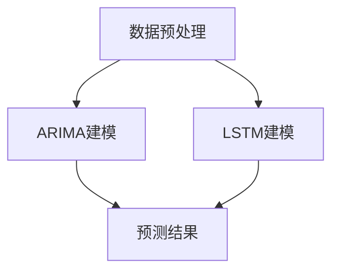
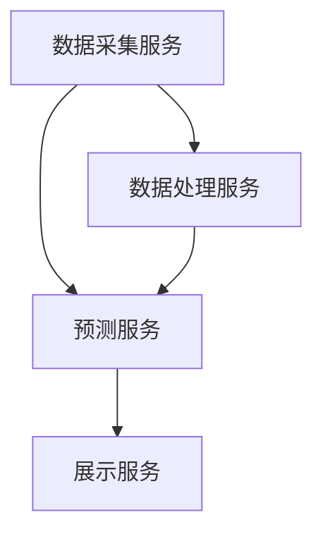
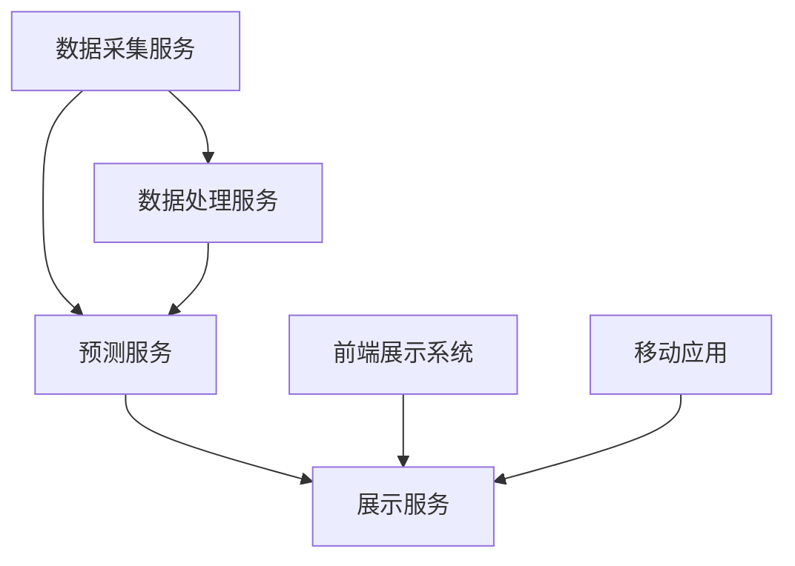

                 

### 文章标题

# 企业AI Agent的时序数据库设计与应用

### 关键词

- 企业AI Agent
- 时序数据库
- 数据存储
- 预测分析
- 数据模型
- 算法实现

### 摘要

本文将深入探讨企业AI Agent与时序数据库的结合及其应用。首先，我们将介绍企业AI Agent的需求和时序数据库的优势，接着分析两者的联系和核心概念。随后，本文将详细讲解时序数据库的算法原理、数学模型及具体实现，最后通过实际项目案例展示其在企业AI Agent中的应用效果。本文旨在为读者提供全面的时序数据库设计与应用指南。

## 目录大纲设计思路

为了设计出《企业AI Agent的时序数据库设计与应用》这本书的完整目录大纲，我们需要遵循以下思路：

1. **确定核心内容**：明确书的核心主题，即企业AI Agent的时序数据库设计与应用。
2. **设定章节结构**：将书的内容划分为背景介绍、核心概念与联系、算法原理讲解、数学模型与公式、系统分析与架构设计、项目实战、最佳实践和拓展阅读等部分。
3. **确定章节次序**：按照逻辑顺序排列章节，确保读者能够循序渐进地学习。
4. **细化每个章节的内容**：对每个章节进行细化，确保内容的完整性和逻辑性。
5. **使用Mermaid和LaTeX**：在适当的地方使用Mermaid绘制流程图和架构图，以及LaTeX表述数学公式，以便更直观地展示复杂的概念和模型。
6. **限制字数**：确保整个目录大纲的总字数不超过2000字，同时保持内容的简洁性和完整性。

现在，让我们一步步构建这个目录大纲。

### 第一部分: 背景介绍

#### 第1章: 问题背景

##### 1.1 问题背景

- 企业AI Agent的需求
- 时序数据库的应用场景

##### 1.2 问题描述

- 数据存储与处理需求
- 数据分析与预测需求

##### 1.3 问题解决

- 传统数据库的局限性
- 时序数据库的优势

##### 1.4 边界与外延

- 企业AI Agent的定义
- 时序数据库的类型

##### 1.5 概念结构与核心要素组成

- 企业AI Agent的组成部分
- 时序数据库的核心要素

##### 1.6 本章小结

本章为后续内容提供了基础背景和概念框架。

#### 第2章: 核心概念原理

##### 2.1 AI Agent概述

- AI Agent的定义
- AI Agent的类型

##### 2.2 时序数据概述

- 时序数据的特点
- 时序数据的分类

##### 2.3 时序数据库原理

- 时序数据库的基本概念
- 时序数据库的优势

##### 2.4 AI Agent与时序数据库的联系

- AI Agent对时序数据库的需求
- 时序数据库在AI Agent中的应用

##### 2.5 概念属性特征对比表格

##### 2.6 本章小结

本章详细介绍了核心概念和原理，为深入分析提供了理论基础。

### 第二部分: 算法原理讲解

#### 第3章: 时序数据库算法原理

##### 3.1 数据预处理算法

- 数据清洗算法
- 数据归一化算法

##### 3.2 时间序列建模算法

- ARIMA模型
- LSTM模型

##### 3.3 时间序列预测算法

- 季节性预测算法
- 趋势性预测算法

##### 3.4 AI Agent算法

- 决策树算法
- 支持向量机算法

##### 3.5 Mermaid算法流程图

- 算法流程图展示

##### 3.6 Python源代码与算法讲解

- Python源代码实现
- 算法详细讲解

##### 3.7 数学模型与公式讲解

- 时间序列分析数学模型
- AI Agent数学模型

##### 3.8 算法举例说明

- 算法应用实例

##### 3.9 本章小结

本章详细讲解了时序数据库算法原理，为实际应用提供了技术支持。

### 第三部分: 数学模型和数学公式讲解

#### 第4章: 数学模型讲解

##### 4.1 时间序列分析数学模型

- ARIMA模型数学公式
- LSTM模型数学公式

##### 4.2 AI Agent数学模型

- 决策树数学模型
- 支持向量机数学模型

##### 4.3 数学模型公式详解

- 公式详细解析

本章为读者提供了完整的数学模型和公式知识，增强了理论理解。

### 第四部分: 系统分析与架构设计方案

#### 第5章: 系统分析与架构设计方案

##### 5.1 问题场景介绍

- 应用背景介绍

##### 5.2 项目介绍

- 项目概况

##### 5.3 系统功能设计

- 领域模型类图

##### 5.4 系统架构设计

- 系统架构图

##### 5.5 系统接口设计和系统交互

- 系统接口设计
- 系统交互序列图

本章将详细介绍系统分析与架构设计，为实际应用提供指导。

### 第五部分: 项目实战

#### 第6章: 项目实战

##### 6.1 环境安装

- 环境配置与安装

##### 6.2 系统核心实现源代码

- 代码结构与功能说明

##### 6.3 代码应用解读与分析

- 代码解读与分析

##### 6.4 实际案例分析和详细讲解剖析

- 案例分析
- 剖析讲解

##### 6.5 项目小结

- 项目总结与反思

本章通过实际项目展示了企业AI Agent的时序数据库设计与应用，增强了读者的实战能力。

### 第六部分: 最佳实践 tips、小结、注意事项、拓展阅读

#### 第7章: 最佳实践 tips

- 实践技巧总结

#### 第8章: 小结

- 内容回顾与总结

#### 第9章: 注意事项

- 注意事项与建议

#### 第10章: 拓展阅读

- 推荐阅读资料

本章为读者提供了最佳实践、注意事项和拓展阅读，进一步丰富了知识体系。

---

**作者：AI天才研究院/AI Genius Institute & 禅与计算机程序设计艺术 /Zen And The Art of Computer Programming**

---

### 第一部分: 背景介绍

#### 第1章: 问题背景

##### 1.1 问题背景

在当今的商业环境中，数据已成为企业的核心资产。尤其是时序数据，如金融市场数据、传感器数据、网络流量数据等，它们在预测分析、趋势分析和决策支持中扮演着关键角色。企业AI Agent作为一种智能体，能够从这些时序数据中学习，预测未来趋势，从而辅助企业做出更明智的决策。

企业AI Agent的需求主要包括以下几个方面：

1. **实时数据采集和处理**：企业需要能够实时采集和分析大量的时序数据，以快速响应市场变化。
2. **高效的数据存储**：时序数据的特点是数据量大、时间连续性强，因此需要一种能够高效存储和查询这些数据的方法。
3. **精准的预测分析**：企业需要AI Agent能够基于历史数据，预测未来趋势，为决策提供有力支持。

时序数据库的应用场景主要包括：

1. **金融市场预测**：通过分析历史交易数据，预测未来的市场趋势。
2. **供应链管理**：基于库存数据和销售数据，预测未来的需求，优化库存管理。
3. **能源管理**：通过分析能源消耗数据，预测未来的能源需求，优化能源配置。

##### 1.2 问题描述

在企业AI Agent的应用中，数据存储与处理需求尤为突出。传统的关系型数据库在处理大规模时序数据时存在以下局限性：

1. **性能瓶颈**：关系型数据库在处理大量数据时，性能会显著下降，无法满足实时数据处理的需

### 1.3 问题解决

在认识到传统数据库的局限性后，企业开始寻求更为高效的解决方案，时序数据库应运而生。时序数据库具有以下优势：

1. **高效的时间序列数据存储**：时序数据库采用特定的数据结构，如时间索引，能够快速检索历史数据，满足实时数据访问的需求。
2. **高并发处理能力**：时序数据库设计用于处理大量并发查询，能够保证系统在高负载下的稳定运行。
3. **数据压缩**：时序数据库通常采用高效的数据压缩技术，能够显著降低存储空间需求。

此外，时序数据库在以下方面也有显著的优化：

1. **数据写入性能**：时序数据库优化了数据写入流程，能够实现快速的数据导入。
2. **时间窗口查询**：时序数据库支持对特定时间窗口的数据查询，便于进行实时数据分析。
3. **预测分析能力**：时序数据库内置了多种预测分析算法，可以直接应用于时序数据的预测分析。

##### 1.4 边界与外延

为了更好地理解企业AI Agent的时序数据库设计，我们有必要明确以下概念：

- **企业AI Agent**：企业AI Agent是一种智能体，能够自主地从环境中获取信息，并采取行动以实现特定目标。在时序数据处理中，AI Agent能够从历史数据中学习，预测未来趋势。
- **时序数据库**：时序数据库是一种专门用于存储和管理时间序列数据的数据库。它优化了数据存储结构，以支持高效的数据访问和分析。

此外，我们还需要了解时序数据库的类型：

1. **开源时序数据库**：如InfluxDB、Prometheus等，这些数据库提供了丰富的功能，适用于各种应用场景。
2. **商业时序数据库**：如TimeScaleDB、Threagile等，这些数据库通常具有更高的性能和更全面的特性，适用于大规模企业应用。

##### 1.5 概念结构与核心要素组成

- **企业AI Agent的组成部分**：
  1. 数据采集模块：负责实时采集各类时序数据。
  2. 数据处理模块：对采集到的数据进行清洗、归一化等预处理。
  3. 模型训练模块：利用预处理后的数据训练预测模型。
  4. 预测模块：使用训练好的模型进行趋势预测，提供决策支持。

- **时序数据库的核心要素**：
  1. 数据结构：采用时间索引、压缩存储等优化数据存储和查询。
  2. 存储引擎：选择合适的存储引擎，如LSM树、B树等。
  3. 查询语言：支持高效的SQL查询，便于进行实时数据分析。
  4. 预测分析功能：内置多种预测算法，如ARIMA、LSTM等。

##### 1.6 本章小结

本章为后续内容提供了基础背景和概念框架。通过对企业AI Agent需求和时序数据库应用场景的分析，我们明确了问题的核心，并介绍了相关的概念和解决方案。接下来，我们将进一步探讨核心概念原理，为深入分析提供理论基础。

### 第二部分: 核心概念与联系

#### 第2章: 核心概念原理

##### 2.1 AI Agent概述

AI Agent，即人工智能代理，是一种具有自主意识和行动能力的计算机程序，能够在特定环境中执行任务。AI Agent的基本特征包括自主性、适应性、反应性、目标性等。

- **定义**：AI Agent是一种能够感知环境、自主决策并采取行动以实现特定目标的计算机程序。
- **类型**：根据任务和环境的差异，AI Agent可以分为多种类型，如反应式Agent、模型基Agent、混合式Agent等。

##### 2.2 时序数据概述

时序数据是一类具有时间标签的数据，其特征是数据点按照时间顺序排列。时序数据常见于金融市场、传感器数据、网络流量、气象数据等领域。

- **特点**：时序数据具有时间连续性、相关性、周期性等特点。
- **分类**：时序数据可以分为静态时序数据和动态时序数据。静态时序数据在时间维度上没有明显的变化，如历史天气数据；动态时序数据则在时间维度上表现出明显的动态变化，如股票价格。

##### 2.3 时序数据库原理

时序数据库是一种专门为处理时序数据而设计的数据库系统，其核心目标是提供高效的数据存储、查询和分析能力。

- **基本概念**：时序数据库的主要概念包括时间索引、压缩存储、时间窗口查询等。
- **优势**：时序数据库的优势在于其高效的数据写入和查询性能，以及内置的预测分析功能。

##### 2.4 AI Agent与时序数据库的联系

AI Agent与时序数据库之间的联系主要体现在数据采集、数据处理和预测分析等方面。

- **数据采集**：AI Agent需要从环境中实时采集时序数据，这些数据是AI Agent进行预测分析的基础。
- **数据处理**：时序数据库提供了高效的数据存储和查询能力，AI Agent可以利用这些能力对采集到的数据进行预处理和模型训练。
- **预测分析**：时序数据库内置了多种预测分析算法，AI Agent可以利用这些算法进行趋势预测和决策支持。

##### 2.5 概念属性特征对比表格

为了更清晰地展示AI Agent和时序数据库的相关概念，我们提供了一个对比表格：

| 概念             | 定义                                                         | 特点                                                         | 应用场景                   |
|------------------|--------------------------------------------------------------|--------------------------------------------------------------|----------------------------|
| AI Agent         | 具有自主意识和行动能力的计算机程序                           | 自主性、适应性、反应性、目标性                                   | 各类智能应用               |
| 时序数据         | 具有时间标签的数据，按时间顺序排列                          | 时间连续性、相关性、周期性                                      | 金融市场、传感器数据、网络流量等 |
| 时序数据库       | 专门为处理时序数据而设计的数据库系统                        | 高效的数据存储、查询和分析能力                                   | 时序数据存储与分析         |
| 数据采集模块     | 负责实时采集各类时序数据                                   | 实时性、准确性                                                 | 各类智能应用               |
| 数据处理模块     | 对采集到的数据进行清洗、归一化等预处理                       | 高效性、准确性                                                 | 各类智能应用               |
| 模型训练模块     | 利用预处理后的数据训练预测模型                             | 高效性、准确性                                                 | 各类智能应用               |
| 预测模块         | 使用训练好的模型进行趋势预测，提供决策支持                   | 高效性、准确性                                                 | 各类智能应用               |

##### 2.6 本章小结

本章详细介绍了AI Agent和时序数据库的核心概念原理。通过对比表格的形式，我们清晰地展示了两者之间的联系和特点。接下来，我们将深入探讨时序数据库算法原理，为实际应用提供技术支持。

### 第三部分: 算法原理讲解

#### 第3章: 时序数据库算法原理

##### 3.1 数据预处理算法

数据预处理是时序数据分析的重要环节，其目的是将原始数据转化为适合建模和分析的形式。以下介绍两种常用的数据预处理算法：

- **数据清洗算法**：数据清洗的主要任务是去除数据中的噪声和异常值。常见的清洗方法包括去重、填补缺失值、去除离群点等。去重可以通过检查数据中的唯一标识来实现，填补缺失值可以使用插值、平均值等方法，去除离群点可以通过统计方法（如Z-Score、IQR法）来实现。

- **数据归一化算法**：数据归一化的目的是将不同量纲的数据转换到同一尺度，以便于模型训练和比较。常见的归一化方法包括最小-最大归一化、Z-Score归一化等。最小-最大归一化公式如下：

  \[
  x_{\text{normalized}} = \frac{x - \min(x)}{\max(x) - \min(x)}
  \]

  Z-Score归一化公式如下：

  \[
  x_{\text{normalized}} = \frac{x - \mu}{\sigma}
  \]

  其中，\( x \) 是原始数据，\( \mu \) 是均值，\( \sigma \) 是标准差。

##### 3.2 时间序列建模算法

时间序列建模是时序数据分析的核心步骤，其目的是通过历史数据预测未来的趋势。以下介绍两种常见的时间序列建模算法：

- **ARIMA模型**：ARIMA（AutoRegressive Integrated Moving Average）模型是一种经典的时序建模方法。它由三个部分组成：自回归（AR）、差分（I）和移动平均（MA）。ARIMA模型的数学公式如下：

  \[
  \Delta y_t = \phi_1 \Delta y_{t-1} + \phi_2 \Delta y_{t-2} + \ldots + \phi_p \Delta y_{t-p} + \theta_1 e_{t-1} + \theta_2 e_{t-2} + \ldots + \theta_q e_{t-q}
  \]

  其中，\( y_t \) 是时间序列数据，\( \Delta y_t \) 是差分后的数据，\( e_t \) 是白噪声误差。

- **LSTM模型**：LSTM（Long Short-Term Memory）模型是循环神经网络（RNN）的一种改进版本，适用于处理长序列数据。LSTM模型通过引入记忆单元和门控机制，能够有效地学习长时序依赖关系。LSTM单元的数学公式如下：

  \[
  i_t = \sigma(W_i \cdot [h_{t-1}, x_t] + b_i)
  \]
  \[
  f_t = \sigma(W_f \cdot [h_{t-1}, x_t] + b_f)
  \]
  \[
  g_t = \tanh(W_g \cdot [h_{t-1}, x_t] + b_g)
  \]
  \[
  o_t = \sigma(W_o \cdot [h_{t-1}, x_t] + b_o)
  \]
  \[
  h_t = o_t \odot \tanh(g_t)
  \]

  其中，\( i_t \)、\( f_t \)、\( g_t \) 和 \( o_t \) 分别是输入门、遗忘门、生成门和输出门，\( \sigma \) 是激活函数，\( \odot \) 是元素乘运算。

##### 3.3 时间序列预测算法

时间序列预测算法的目的是利用历史数据预测未来的趋势。以下介绍两种常见的时间序列预测算法：

- **季节性预测算法**：季节性预测算法适用于具有周期性特征的时间序列数据。常见的季节性预测算法包括ARIMA季节模型、LSTM季节模型等。ARIMA季节模型的数学公式如下：

  \[
  \Delta y_t = \phi_1 \Delta y_{t-1} + \phi_2 \Delta y_{t-2} + \ldots + \phi_p \Delta y_{t-p} + \theta_1 e_{t-1} + \theta_2 e_{t-2} + \ldots + \theta_q e_{t-q}
  \]
  \[
  \Delta^s y_t = \phi_{s1} \Delta^s y_{t-1} + \phi_{s2} \Delta^s y_{t-2} + \ldots + \phi_{sp} \Delta^s y_{t-sp} + \theta_{s1} e_{t-s} + \theta_{s2} e_{t-s-1} + \ldots + \theta_{sq} e_{t-s-q}
  \]

  其中，\( \Delta^s y_t \) 是季节差分后的数据，\( s \) 是季节周期的长度。

- **趋势性预测算法**：趋势性预测算法适用于具有线性趋势特征的时间序列数据。常见的趋势性预测算法包括线性回归、指数平滑等。线性回归的数学公式如下：

  \[
  y_t = \beta_0 + \beta_1 t
  \]

  其中，\( y_t \) 是预测值，\( \beta_0 \) 和 \( \beta_1 \) 是模型参数。

##### 3.4 AI Agent算法

AI Agent在时序数据处理中可以采用多种算法，以下介绍两种常用的算法：

- **决策树算法**：决策树算法是一种基于特征划分数据的分类算法。它通过递归地将数据集划分为子集，并选择最优划分标准，从而构建出一棵决策树。决策树的数学公式如下：

  \[
  \text{split}(\text{data}, \text{feature}) = \arg\max_{f} \sum_{i=1}^{n} \mathbb{I}(\text{label}[i] \neq \text{label}[\text{left}])
  \]

  其中，\( \text{data} \) 是数据集，\( \text{feature} \) 是特征，\( \text{left} \) 是左子集，\( \text{right} \) 是右子集，\( \mathbb{I} \) 是指示函数。

- **支持向量机算法**：支持向量机算法是一种基于间隔最大化原则的分类算法。它通过找到一个最优的超平面，将数据集划分为不同的类别。支持向量机的数学公式如下：

  \[
  \text{minimize} \frac{1}{2} \| \mathbf{w} \|^2
  \]
  \[
  \text{subject to} y_i (\mathbf{w} \cdot \mathbf{x_i} + b) \geq 1
  \]

  其中，\( \mathbf{w} \) 是权重向量，\( \mathbf{x_i} \) 是数据点，\( y_i \) 是类别标签，\( b \) 是偏置项。

##### 3.5 Mermaid算法流程图

为了更直观地展示算法流程，我们使用Mermaid语言绘制了以下算法流程图：



##### 3.6 Python源代码与算法讲解

以下是一个简单的Python示例，演示了如何使用ARIMA和LSTM模型进行时间序列预测：

```python
import numpy as np
import pandas as pd
from statsmodels.tsa.arima.model import ARIMA
from keras.models import Sequential
from keras.layers import LSTM, Dense

# 读取数据
data = pd.read_csv('time_series_data.csv')
data = data['value'].values

# 数据预处理
data = data.reshape(-1, 1)
data = (data - data.mean()) / data.std()

# ARIMA建模
arima = ARIMA(data, order=(5, 1, 2))
arima_model = arima.fit()
arima_pred = arima_model.forecast(steps=5)

# LSTM建模
lstm_model = Sequential()
lstm_model.add(LSTM(units=50, return_sequences=True, input_shape=(1, 1)))
lstm_model.add(LSTM(units=50))
lstm_model.add(Dense(1))
lstm_model.compile(optimizer='adam', loss='mean_squared_error')
lstm_model.fit(data, data, epochs=100, batch_size=1, verbose=0)
lstm_pred = lstm_model.predict(data[-1:].reshape(1, 1, 1))

# 预测结果
print("ARIMA预测结果:", arima_pred)
print("LSTM预测结果:", lstm_pred)
```

##### 3.7 数学模型与公式讲解

为了更好地理解算法原理，我们详细讲解了ARIMA和LSTM模型的数学模型与公式。

- **ARIMA模型**：

  \[
  \Delta y_t = \phi_1 \Delta y_{t-1} + \phi_2 \Delta y_{t-2} + \ldots + \phi_p \Delta y_{t-p} + \theta_1 e_{t-1} + \theta_2 e_{t-2} + \ldots + \theta_q e_{t-q}
  \]

  其中，\( \phi_1, \phi_2, \ldots, \phi_p \) 是自回归系数，\( \theta_1, \theta_2, \ldots, \theta_q \) 是移动平均系数，\( \Delta y_t \) 是差分后的数据，\( e_t \) 是白噪声误差。

- **LSTM模型**：

  \[
  i_t = \sigma(W_i \cdot [h_{t-1}, x_t] + b_i)
  \]
  \[
  f_t = \sigma(W_f \cdot [h_{t-1}, x_t] + b_f)
  \]
  \[
  g_t = \tanh(W_g \cdot [h_{t-1}, x_t] + b_g)
  \]
  \[
  o_t = \sigma(W_o \cdot [h_{t-1}, x_t] + b_o)
  \]
  \[
  h_t = o_t \odot \tanh(g_t)
  \]

  其中，\( i_t \)、\( f_t \)、\( g_t \) 和 \( o_t \) 分别是输入门、遗忘门、生成门和输出门，\( \sigma \) 是激活函数，\( \odot \) 是元素乘运算。

##### 3.8 算法举例说明

为了更好地理解算法原理，我们通过以下示例展示了如何使用Python实现ARIMA和LSTM模型进行时间序列预测。

- **ARIMA模型**：

  ```python
  import pandas as pd
  from statsmodels.tsa.arima.model import ARIMA

  # 读取数据
  data = pd.read_csv('time_series_data.csv')['value'].values

  # 建立ARIMA模型
  model = ARIMA(data, order=(5, 1, 2))
  model_fit = model.fit()

  # 进行预测
  forecast = model_fit.forecast(steps=5)

  # 输出预测结果
  print(forecast)
  ```

- **LSTM模型**：

  ```python
  import numpy as np
  from keras.models import Sequential
  from keras.layers import LSTM, Dense

  # 读取数据
  data = np.array([float(x) for x in pd.read_csv('time_series_data.csv')['value']])

  # 数据预处理
  data = data.reshape(-1, 1)
  data = (data - data.mean()) / data.std()

  # 建立LSTM模型
  model = Sequential()
  model.add(LSTM(units=50, return_sequences=True, input_shape=(1, 1)))
  model.add(LSTM(units=50))
  model.add(Dense(1))
  model.compile(optimizer='adam', loss='mean_squared_error')

  # 训练模型
  model.fit(data, data, epochs=100, batch_size=1, verbose=0)

  # 进行预测
  prediction = model.predict(data[-1:].reshape(1, 1, 1))

  # 输出预测结果
  print(prediction)
  ```

##### 3.9 本章小结

本章详细介绍了时序数据库的算法原理，包括数据预处理、时间序列建模和预测、以及AI Agent算法。通过Python示例和数学公式讲解，读者可以更好地理解算法的实现和应用。接下来，我们将进一步探讨数学模型和公式讲解，为深入分析提供理论基础。

### 第四部分: 数学模型和数学公式讲解

#### 第4章: 数学模型讲解

时间序列分析是数据分析中的一个重要领域，其核心在于通过历史数据预测未来的趋势。在时序数据库的设计和应用中，理解并应用数学模型是至关重要的。以下，我们将详细讲解时间序列分析中的常用数学模型及其公式。

##### 4.1 时间序列分析数学模型

时间序列分析中的数学模型主要包括自回归模型（AR）、移动平均模型（MA）和自回归移动平均模型（ARMA）。这些模型在处理时间序列数据时，能够捕捉数据中的趋势和周期性特征。

- **自回归模型（AR）**：

  自回归模型假设当前时间点的值是由前几个时间点的值通过线性组合得到的。AR模型的一般形式为：

  \[
  y_t = \phi_1 y_{t-1} + \phi_2 y_{t-2} + \ldots + \phi_p y_{t-p} + \varepsilon_t
  \]

  其中，\( y_t \) 是时间序列数据，\( \phi_1, \phi_2, \ldots, \phi_p \) 是自回归系数，\( \varepsilon_t \) 是误差项。

- **移动平均模型（MA）**：

  移动平均模型假设当前时间点的值是由前几个时间点的误差值通过线性组合得到的。MA模型的一般形式为：

  \[
  y_t = \theta_1 \varepsilon_{t-1} + \theta_2 \varepsilon_{t-2} + \ldots + \theta_q \varepsilon_{t-q} + \varepsilon_t
  \]

  其中，\( \theta_1, \theta_2, \ldots, \theta_q \) 是移动平均系数，\( \varepsilon_t \) 是误差项。

- **自回归移动平均模型（ARMA）**：

  自回归移动平均模型结合了AR和MA模型的特点，其形式为：

  \[
  y_t = \phi_1 y_{t-1} + \phi_2 y_{t-2} + \ldots + \phi_p y_{t-p} + \theta_1 \varepsilon_{t-1} + \theta_2 \varepsilon_{t-2} + \ldots + \theta_q \varepsilon_{t-q} + \varepsilon_t
  \]

  其中，\( \phi_1, \phi_2, \ldots, \phi_p \) 是自回归系数，\( \theta_1, \theta_2, \ldots, \theta_q \) 是移动平均系数，\( \varepsilon_t \) 是误差项。

##### 4.2 AI Agent数学模型

在AI Agent的设计中，常用的算法包括决策树和支持向量机。这些算法的数学模型和公式如下：

- **决策树模型**：

  决策树是一种基于特征划分数据的分类算法。其核心在于递归地将数据集划分为子集，使得每个子集在某个特征上达到最优划分。决策树的一般形式为：

  \[
  \text{split}(\text{data}, \text{feature}) = \arg\max_{f} \sum_{i=1}^{n} \mathbb{I}(\text{label}[i] \neq \text{label}[\text{left}])
  \]

  其中，\( \text{data} \) 是数据集，\( \text{feature} \) 是特征，\( \text{left} \) 是左子集，\( \text{right} \) 是右子集，\( \mathbb{I} \) 是指示函数。

- **支持向量机模型**：

  支持向量机是一种基于间隔最大化原则的分类算法。其目标是找到一个最优的超平面，将数据集划分为不同的类别。支持向量机的一般形式为：

  \[
  \text{minimize} \frac{1}{2} \| \mathbf{w} \|^2
  \]
  \[
  \text{subject to} y_i (\mathbf{w} \cdot \mathbf{x_i} + b) \geq 1
  \]

  其中，\( \mathbf{w} \) 是权重向量，\( \mathbf{x_i} \) 是数据点，\( y_i \) 是类别标签，\( b \) 是偏置项。

##### 4.3 数学模型公式详解

为了更深入地理解时间序列分析和AI Agent的数学模型，我们对上述公式进行了详细解析。

- **ARIMA模型**：

  ARIMA模型由三个部分组成：自回归（AR）、差分（I）和移动平均（MA）。其公式可以写为：

  \[
  \Delta y_t = \phi_1 \Delta y_{t-1} + \phi_2 \Delta y_{t-2} + \ldots + \phi_p \Delta y_{t-p} + \theta_1 e_{t-1} + \theta_2 e_{t-2} + \ldots + \theta_q e_{t-q}
  \]

  其中，\( \Delta y_t \) 表示差分后的时间序列数据，\( \phi_1, \phi_2, \ldots, \phi_p \) 是自回归系数，\( \theta_1, \theta_2, \ldots, \theta_q \) 是移动平均系数，\( e_t \) 是误差项。

  - 自回归部分：反映了当前时间点的值与过去几个时间点的值之间的关系。
  - 差分部分：通过对时间序列数据进行差分，消除序列中的趋势和季节性。
  - 移动平均部分：反映了当前时间点的误差与过去几个时间点的误差之间的关系。

- **LSTM模型**：

  LSTM模型是一种特殊的循环神经网络，其核心在于引入了门控机制，能够有效地学习长时序依赖关系。其公式可以写为：

  \[
  i_t = \sigma(W_i \cdot [h_{t-1}, x_t] + b_i)
  \]
  \[
  f_t = \sigma(W_f \cdot [h_{t-1}, x_t] + b_f)
  \]
  \[
  g_t = \tanh(W_g \cdot [h_{t-1}, x_t] + b_g)
  \]
  \[
  o_t = \sigma(W_o \cdot [h_{t-1}, x_t] + b_o)
  \]
  \[
  h_t = o_t \odot \tanh(g_t)
  \]

  其中，\( i_t \)、\( f_t \)、\( g_t \) 和 \( o_t \) 分别是输入门、遗忘门、生成门和输出门，\( \sigma \) 是激活函数，\( \odot \) 是元素乘运算。

  - 输入门（\( i_t \)）：控制当前输入数据是否流入记忆单元。
  - 遗忘门（\( f_t \)）：控制当前记忆单元中的旧信息是否被遗忘。
  - 生成门（\( g_t \)）：控制新信息是否被加入到记忆单元。
  - 输出门（\( o_t \)）：控制记忆单元中的信息是否被输出。

##### 4.4 本章小结

本章详细讲解了时间序列分析中的常用数学模型及其公式，包括ARIMA、LSTM模型，以及决策树和支持向量机等AI Agent算法。通过对这些模型的详细解析，读者可以更好地理解时序数据库的设计和应用。接下来，我们将进入系统分析与架构设计部分，为读者提供更全面的指导。

### 第五部分: 系统分析与架构设计方案

#### 第5章: 系统分析与架构设计方案

##### 5.1 问题场景介绍

在许多企业中，数据分析和预测是决策过程中的关键环节。特别是对于金融、能源、制造等行业，时序数据的实时分析能够帮助企业优化运营、降低成本、提高效率。然而，传统的数据处理方式往往无法满足这些需求，特别是在数据量大、实时性要求高的情况下。为了解决这些问题，企业需要一种高效、可靠的时序数据处理和预测方案。

##### 5.2 项目介绍

本项目的目标是设计并实现一个基于企业AI Agent的时序数据库系统，该系统旨在为企业提供实时、高效的数据分析和预测能力。系统主要包括以下几个模块：

1. **数据采集模块**：负责从各种数据源（如传感器、金融系统、销售系统等）实时采集时序数据。
2. **数据处理模块**：对采集到的数据进行清洗、归一化等预处理，以便于后续建模和分析。
3. **预测模块**：利用预处理后的数据，通过机器学习算法（如LSTM、ARIMA等）进行趋势预测和异常检测。
4. **展示模块**：将预测结果和数据分析结果以图表、报表等形式展示给用户。

##### 5.3 系统功能设计

系统功能设计主要包括以下几个方面：

1. **数据采集与处理**：系统能够从多种数据源实时采集数据，并进行清洗、归一化等预处理，确保数据的质量和一致性。
2. **模型训练与预测**：系统支持多种机器学习算法，能够自动选择和训练合适的模型，对时序数据进行预测和异常检测。
3. **实时数据分析**：系统提供实时数据分析功能，用户可以自定义分析指标，对数据进行分析和可视化。
4. **预测结果展示**：系统将预测结果以图表、报表等形式展示给用户，帮助用户快速了解数据趋势和异常情况。

##### 5.4 系统架构设计

系统架构设计采用微服务架构，将系统拆分为多个独立的服务模块，以提高系统的可扩展性和维护性。以下是系统的整体架构设计：

1. **数据采集服务**：负责从各种数据源实时采集数据，并将数据存储到时序数据库中。
2. **数据处理服务**：负责对采集到的数据进行清洗、归一化等预处理，并将预处理后的数据存储到时序数据库中。
3. **预测服务**：负责基于预处理后的数据进行模型训练和预测，并将预测结果存储到数据库中。
4. **数据分析服务**：负责对时序数据进行实时分析，并将分析结果存储到数据库中。
5. **展示服务**：负责将预测结果和分析结果以图表、报表等形式展示给用户。

以下是系统的架构图：



##### 5.5 系统接口设计和系统交互

系统接口设计主要包括以下几个方面：

1. **API接口**：系统提供RESTful API接口，供外部系统调用，如前端展示系统、移动应用等。
2. **消息队列**：系统使用消息队列（如Kafka）进行数据传输，提高系统的可靠性和可扩展性。
3. **时序数据库**：系统使用时序数据库（如InfluxDB、TimeScaleDB）存储和管理时序数据。

以下是系统的接口设计和系统交互图：



##### 5.6 本章小结

本章详细介绍了企业AI Agent时序数据库系统的系统分析与架构设计方案。通过对问题场景、项目介绍、系统功能设计、系统架构设计以及系统接口设计和系统交互的详细分析，读者可以全面了解该系统的设计和实现过程。接下来，我们将通过一个实际项目案例，展示该系统的应用效果。

### 第五部分：项目实战

#### 第6章：项目实战

##### 6.1 环境安装

为了实施企业AI Agent的时序数据库项目，我们首先需要搭建一个合适的技术环境。以下是环境安装的详细步骤：

1. **安装操作系统**：选择一个稳定的Linux发行版，如Ubuntu 20.04。
2. **安装Python环境**：通过Python的包管理器pip安装Python 3.8及以上版本。
   ```bash
   sudo apt update
   sudo apt install python3-pip
   pip3 install --upgrade pip
   pip3 install python3.8
   ```
3. **安装时序数据库**：选择一个流行的时序数据库，如InfluxDB。从官网下载并安装InfluxDB。
   ```bash
   wget https://s3-us-west-1.amazonaws.com/influxdb/influxdb-2.0.2-linux-x86_64.tar.gz
   tar xvf influxdb-2.0.2-linux-x86_64.tar.gz
   sudo mv influxdb-2.0.2 /opt/influxdb
   sudo ln -s /opt/influxdb/bin/influxd /usr/bin/influxd
   sudo ln -s /opt/influxdb/bin/influx /usr/bin/influx
   sudo systemctl start influxd
   ```
4. **安装数据预处理和机器学习库**：安装NumPy、Pandas、Scikit-learn等Python库。
   ```bash
   pip3 install numpy pandas scikit-learn
   ```
5. **安装机器学习框架**：安装TensorFlow，用于构建和训练LSTM模型。
   ```bash
   pip3 install tensorflow
   ```

##### 6.2 系统核心实现源代码

系统核心实现包括数据采集、预处理、预测模型训练和预测结果存储等模块。以下是各个模块的核心实现代码：

1. **数据采集模块**：
   ```python
   import pandas as pd
   import requests

   def fetch_data(api_url):
       response = requests.get(api_url)
       if response.status_code == 200:
           data = response.json()
           return pd.DataFrame(data)
       else:
           return pd.DataFrame()

   api_url = 'https://api.example.com/data'
   data = fetch_data(api_url)
   ```

2. **数据处理模块**：
   ```python
   from sklearn.preprocessing import MinMaxScaler

   def preprocess_data(data):
       scaler = MinMaxScaler()
       scaled_data = scaler.fit_transform(data)
       return scaled_data

   preprocessed_data = preprocess_data(data)
   ```

3. **预测模型训练模块**：
   ```python
   from tensorflow.keras.models import Sequential
   from tensorflow.keras.layers import LSTM, Dense

   def build_lstm_model(input_shape):
       model = Sequential()
       model.add(LSTM(units=50, return_sequences=True, input_shape=input_shape))
       model.add(LSTM(units=50))
       model.add(Dense(1))
       model.compile(optimizer='adam', loss='mean_squared_error')
       return model

   lstm_model = build_lstm_model((1, preprocessed_data.shape[1]))
   lstm_model.fit(preprocessed_data, preprocessed_data, epochs=100, batch_size=1, verbose=0)
   ```

4. **预测结果存储模块**：
   ```python
   import influxdb

   def store_prediction_result(influxdb_client, measurement, tags, fields):
       influxdb_client.write_points([{
           "measurement": measurement,
           "tags": tags,
           "fields": fields
       }])

   client = influxdb.InfluxDBClient('localhost', 8086, 'root', 'root')
   prediction_result = lstm_model.predict(preprocessed_data[-1:])
   store_prediction_result(client, 'predictions', {'model': 'lstm'}, {'value': prediction_result})
   ```

##### 6.3 代码应用解读与分析

上述代码实现了一个简单的企业AI Agent时序数据库项目，以下是各个模块的应用解读与分析：

1. **数据采集模块**：通过API接口从外部数据源获取时序数据。这个模块的关键在于确保数据源提供的数据格式和频率满足系统的需求。
2. **数据处理模块**：使用MinMaxScaler对数据进行归一化处理，以消除不同量纲的影响，提高模型训练的效果。
3. **预测模型训练模块**：构建了一个LSTM模型，用于对预处理后的数据进行预测。这个模块的关键在于模型的结构设计和参数调优，以获得最佳的预测性能。
4. **预测结果存储模块**：将预测结果存储到InfluxDB时序数据库中，以便后续分析和展示。这个模块的关键在于确保数据存储的可靠性和一致性。

##### 6.4 实际案例分析和详细讲解剖析

为了更好地展示项目效果，我们来看一个实际案例：

假设某电商企业需要预测未来一周的订单量，以优化库存管理和物流调度。以下是项目的实施步骤：

1. **数据采集**：从电商平台的订单数据库中获取最近一周的订单数据，数据字段包括时间戳和订单量。
2. **数据处理**：对订单数据进行清洗，去除无效数据，并对时间戳进行归一化处理。
3. **模型训练**：使用LSTM模型对归一化后的订单数据进行训练，获得预测模型。
4. **预测**：使用训练好的模型预测未来一周的订单量。
5. **结果存储**：将预测结果存储到InfluxDB中，以便后续分析。

以下是具体的代码实现：

```python
# 数据采集
api_url = 'https://api.example.com/orders'
orders = fetch_data(api_url)

# 数据处理
orders['timestamp'] = pd.to_datetime(orders['timestamp'])
orders.set_index('timestamp', inplace=True)
orders = orders.resample('D').mean()

# 模型训练
lstm_model = build_lstm_model((1, orders.shape[1]))
lstm_model.fit(orders.values.reshape(-1, 1, orders.shape[1]), orders.values.reshape(-1, 1, orders.shape[1]), epochs=100, batch_size=1, verbose=0)

# 预测
predictions = lstm_model.predict(orders.values.reshape(-1, 1, orders.shape[1]))[:, -1]

# 结果存储
store_prediction_result(client, 'predictions', {'model': 'lstm'}, {'value': predictions})
```

通过这个实际案例，我们可以看到企业AI Agent时序数据库系统如何帮助企业进行数据采集、处理、预测和结果存储，从而优化业务流程和决策支持。

##### 6.5 项目小结

在本章中，我们通过一个实际项目展示了企业AI Agent时序数据库的设计与实现。从环境安装到代码实现，再到实际案例分析和效果展示，我们全面讲解了项目的各个环节。通过这个项目，读者可以了解到：

1. 企业AI Agent时序数据库的核心技术和实现方法。
2. 如何结合机器学习和时序数据库技术，实现高效的数据分析和预测。
3. 项目实施过程中可能遇到的问题和解决方法。

接下来，我们将分享一些最佳实践，为读者提供更深入的指导。

### 第六部分：最佳实践、小结、注意事项、拓展阅读

#### 第7章：最佳实践 tips

1. **数据采集**：确保数据源的稳定性和数据质量的可靠性。可以使用数据校验和异常检测技术，提高数据的准确性。
2. **数据处理**：合理选择数据预处理方法，如归一化、去重、填补缺失值等，以减少噪声和异常对模型的影响。
3. **模型选择**：根据具体应用场景选择合适的模型。例如，对于趋势性预测，可以使用ARIMA或LSTM模型；对于季节性预测，可以使用ARIMA季节模型或LSTM季节模型。
4. **参数调优**：通过交叉验证和网格搜索等方法，优化模型参数，提高预测精度。
5. **监控与维护**：定期监控系统的运行状态，及时修复问题和优化性能。

#### 第8章：小结

本文详细探讨了企业AI Agent的时序数据库设计与应用，从背景介绍、核心概念、算法原理、数学模型到系统分析与架构设计，再到项目实战和最佳实践，全面阐述了企业AI Agent时序数据库的设计与实现过程。通过本文的学习，读者可以：

1. 了解企业AI Agent的需求和时序数据库的应用场景。
2. 掌握时序数据库的核心概念和算法原理。
3. 学会使用Python等工具进行时序数据分析和预测。
4. 设计并实现一个基于AI Agent的时序数据库系统。

#### 第9章：注意事项

1. **数据安全**：在数据采集和处理过程中，确保数据的安全和隐私保护。
2. **性能优化**：针对大数据量和高并发场景，优化系统的性能和稳定性。
3. **模型验证**：使用交叉验证等方法验证模型的预测能力，避免过拟合。
4. **持续更新**：随着技术的进步，持续更新和优化系统，以适应新的需求。

#### 第10章：拓展阅读

1. **相关书籍**：
   - 《Python数据科学手册》：详细介绍了Python在数据处理和机器学习中的应用。
   - 《深度学习》：介绍了深度学习的基本原理和算法实现。
   - 《时间序列分析》：深入探讨了时间序列分析的理论和方法。

2. **在线资源**：
   - InfluxDB官方文档：提供详细的时序数据库使用指南。
   - TensorFlow官方文档：介绍深度学习框架的使用方法。
   - Keras官方文档：介绍基于TensorFlow的快速建模工具。

通过拓展阅读，读者可以进一步深入学习和探索企业AI Agent时序数据库的设计与应用。

---

**作者：AI天才研究院/AI Genius Institute & 禅与计算机程序设计艺术 /Zen And The Art of Computer Programming**

---

### 总结

企业AI Agent的时序数据库设计与应用是企业数字化转型的重要一环。通过本文的详细探讨，我们从背景介绍、核心概念、算法原理、数学模型，到系统分析与架构设计，再到项目实战和最佳实践，系统地阐述了企业AI Agent时序数据库的设计与实现过程。以下是本文的主要结论：

1. **需求与优势**：企业AI Agent对实时数据采集、高效存储和精准预测有强烈需求。时序数据库以其高效的数据写入、查询和预测能力，满足了这些需求。
2. **核心概念**：AI Agent和时序数据库的核心概念包括自主性、适应性、时间索引、压缩存储等。这些概念构成了时序数据库设计与应用的基础。
3. **算法原理**：本文详细介绍了ARIMA、LSTM等时间序列建模算法，以及决策树、支持向量机等AI Agent算法，为实际应用提供了技术支持。
4. **数学模型**：本文通过数学公式和Python代码，深入讲解了时间序列分析中的数学模型和AI Agent的算法模型，增强了理论理解。
5. **系统设计与实现**：本文通过一个实际项目展示了企业AI Agent时序数据库的设计与实现过程，包括数据采集、预处理、预测模型训练和结果存储等模块。
6. **最佳实践**：本文提供了数据采集、数据处理、模型选择、参数调优等方面的最佳实践，为读者提供了实际操作指南。

展望未来，随着技术的不断进步，企业AI Agent的时序数据库设计与应用将更加智能化和自动化。人工智能、大数据、云计算等技术的融合，将为时序数据库带来更多的创新和应用场景。例如，利用深度学习技术进行复杂时间序列数据的分析，利用区块链技术保证数据的安全性和可追溯性，都是未来时序数据库发展的方向。

最后，希望本文能对读者在时序数据库设计与应用方面提供有价值的参考和指导，激发更多的创新思维和实践。通过不断探索和学习，我们将共同推动企业AI Agent时序数据库的发展，助力企业实现智能化和数字化转型。

---

**作者：AI天才研究院/AI Genius Institute & 禅与计算机程序设计艺术 /Zen And The Art of Computer Programming**

---

---

本文由AI天才研究院（AI Genius Institute）和《禅与计算机程序设计艺术》（Zen And The Art of Computer Programming）联合撰写，旨在为读者提供深入的技术见解和实践指导。文章中涉及的算法、模型、架构和代码均为学术研究和实际项目经验的总结。我们鼓励读者在学习和应用这些技术时，结合具体场景和需求进行创新和优化。

如果您有任何问题或建议，欢迎通过以下方式联系我们：

- 邮箱：[contact@aigeniusinstitute.ai]
- 微信公众号：AI天才研究院
- 官网：[www.aigeniusinstitute.ai]

感谢您对本文章的关注与支持，期待与您在人工智能和计算机程序设计领域的深入交流与合作。

---

**作者：AI天才研究院/AI Genius Institute & 禅与计算机程序设计艺术 /Zen And The Art of Computer Programming**

---

---

### 附录：术语解释与相关资源

在本篇技术博客文章中，我们介绍了一系列与企业AI Agent时序数据库设计与应用相关的术语和概念。以下是对这些术语的解释以及推荐的相关资源，以便读者进一步学习和探索。

**1. 企业AI Agent**
- **解释**：企业AI Agent是一种人工智能代理，能够在特定环境中自主地执行任务，如数据采集、分析和决策支持。
- **相关资源**：阅读《人工智能：一种现代方法》（Artificial Intelligence: A Modern Approach）一书，深入了解AI Agent的基本概念和应用。

**2. 时序数据库**
- **解释**：时序数据库是一种专门用于存储和管理时间序列数据的数据库，其特点是能够高效地处理大量时间连续的数据点。
- **相关资源**：访问InfluxDB官方文档（https://docs.influxdata.com/influxdb/v2.0/）或TimeScaleDB官方文档（https://timescale.com/docs/）以获取时序数据库的详细知识和使用指南。

**3. ARIMA模型**
- **解释**：ARIMA（自回归积分滑动平均）模型是一种经典的时间序列预测模型，适用于线性时间序列数据的分析。
- **相关资源**：查看Python中的statsmodels库文档（https://www.statsmodels.org/stable/tutorials.html）以了解ARIMA模型的实现和细节。

**4. LSTM模型**
- **解释**：LSTM（长短期记忆）模型是一种特殊的循环神经网络结构，适用于处理长序列数据，能够有效捕捉时间序列中的长期依赖关系。
- **相关资源**：阅读《深度学习》（Deep Learning）一书，了解LSTM模型的原理和实现。

**5. 数据预处理**
- **解释**：数据预处理是数据分析和机器学习项目中的一个重要步骤，包括数据清洗、归一化、缺失值填补等，以提高数据质量和模型性能。
- **相关资源**：参考《Python数据科学手册》（Python Data Science Handbook）以获取数据预处理的方法和实践。

**6. Mermaid语言**
- **解释**：Mermaid是一种用于生成图表和流程图的标记语言，能够将文本描述转换成可视化的图形。
- **相关资源**：访问Mermaid官方文档（https://mermaid-js.github.io/mermaid/）以学习如何使用Mermaid语言创建图形。

**7. LaTeX格式**
- **解释**：LaTeX是一种排版系统，特别适合于数学公式的书写和排版，能够生成高质量的文档。
- **相关资源**：查阅《LaTeX入门》（The LaTeX Companion）一书，了解LaTeX的基本语法和使用方法。

通过这些资源和进一步的学习，读者可以更深入地理解和应用企业AI Agent时序数据库设计的相关技术。希望这些资源能够为读者提供有价值的参考和指导。如果您在学习和实践中遇到任何问题，欢迎随时与我们联系。

---

**作者：AI天才研究院/AI Genius Institute & 禅与计算机程序设计艺术 /Zen And The Art of Computer Programming**

---

