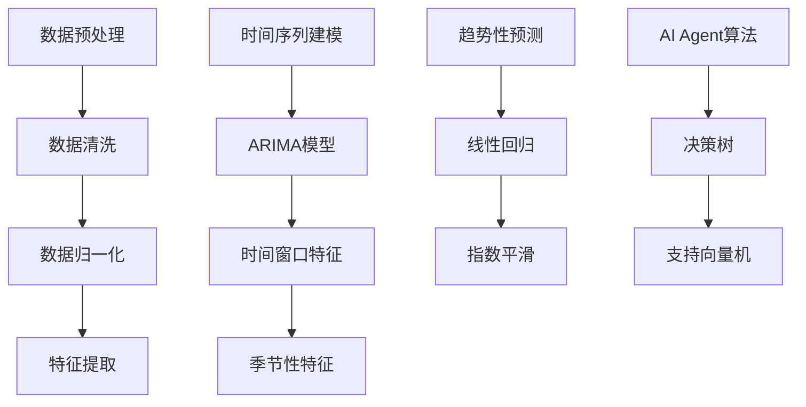
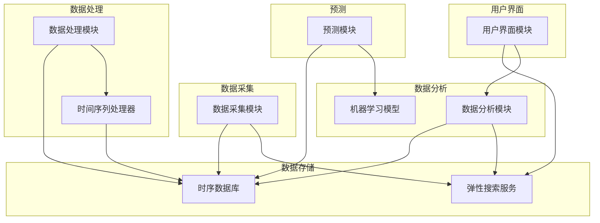
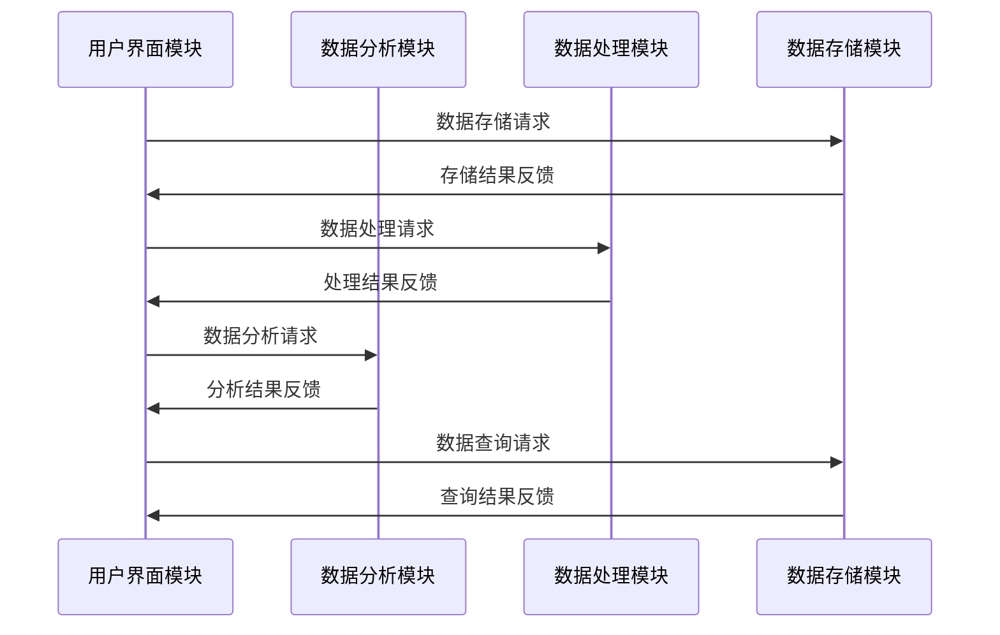
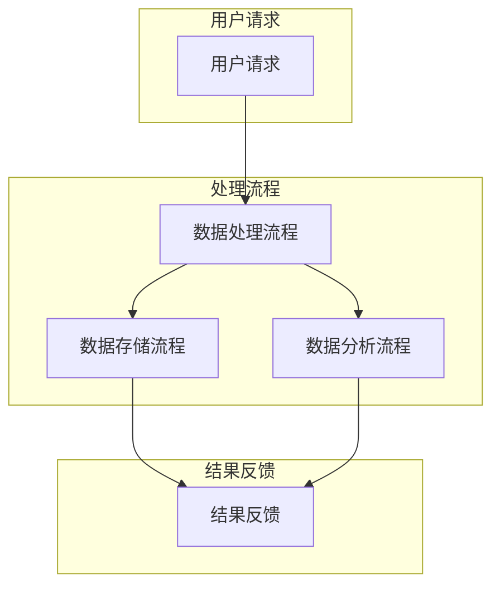
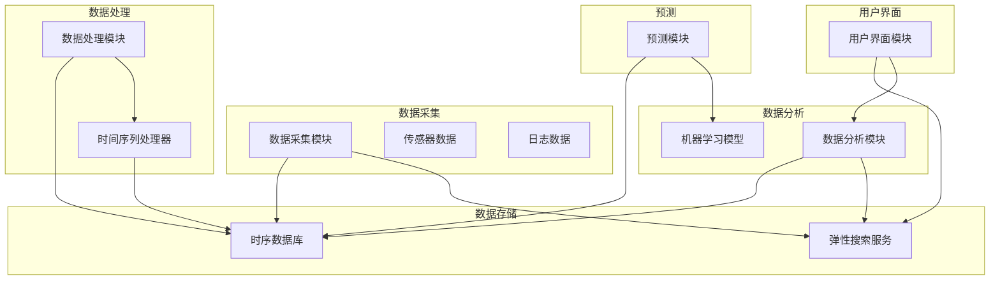

                 

### 第1章：问题背景

#### 1.1 问题背景

随着人工智能（AI）技术的快速发展，企业AI Agent正逐渐成为企业自动化和智能化的重要工具。企业AI Agent是一种能够自动完成特定任务的人工智能系统，它通过机器学习、自然语言处理和深度学习等技术，模拟人类专家的决策过程，帮助企业提高效率、减少成本、优化资源分配。

然而，为了实现这些功能，企业AI Agent需要处理和分析大量的时序数据。时序数据是指随着时间变化而不断积累的数据，如股票价格、温度变化、用户行为数据等。时序数据的特点是具有时间依赖性，即未来的数据值依赖于过去的数据值。

传统的数据库系统，如关系型数据库，虽然在数据存储和管理方面具有很高的效率，但它们在处理时序数据方面存在一些局限性。首先，关系型数据库的数据表结构固定，无法很好地适应时序数据的动态变化。其次，关系型数据库的查询语言（如SQL）并不擅长处理时间序列的复杂运算和趋势分析。因此，企业需要一种专门为时序数据处理而设计的数据库系统。

#### 1.2 问题描述

企业AI Agent在处理时序数据时面临的主要问题可以分为两类：

1. **数据存储与处理需求**：时序数据通常包含大量的历史记录，这些数据需要高效地存储和管理，以便快速查询和实时处理。传统数据库系统在处理大规模时序数据时，往往会出现性能瓶颈，如查询速度慢、延迟高、存储空间占用大等问题。

2. **数据分析和预测需求**：企业AI Agent需要通过对时序数据的分析和预测，为企业提供决策支持。这要求时序数据库不仅要能高效地存储和查询数据，还要具备强大的数据处理和分析能力，包括时间序列建模、趋势分析、异常检测等。

#### 1.3 问题解决

为了解决上述问题，企业需要采用专门的时序数据库系统。时序数据库系统具有以下优势：

1. **优化数据存储结构**：时序数据库通常采用适合时间序列数据的特点的存储结构，如时间戳索引、压缩存储等，从而提高数据存储效率和查询速度。

2. **优化查询算法**：时序数据库针对时间序列数据的特性，设计了专门的查询算法，如滑动窗口查询、聚合查询等，能够快速响应实时查询需求。

3. **支持数据处理和分析**：时序数据库提供了丰富的数据处理和分析功能，如时间序列建模、趋势分析、季节性分析等，能够满足企业AI Agent的数据分析需求。

#### 1.4 边界与外延

1. **企业AI Agent的定义**：企业AI Agent是一种具备一定智能能力，能够自动执行任务的人工智能系统。它通常由感知模块、决策模块和行动模块组成，能够通过机器学习等技术不断学习和优化决策过程。

2. **时序数据库的类型**：时序数据库主要包括以下几种类型：
   - **时间序列数据库**：专门用于存储和管理时间序列数据的数据库系统，如InfluxDB、TimeScaleDB等。
   - **列式数据库**：适合存储大规模时间序列数据的数据库系统，如Apache Kafka、Apache Cassandra等。
   - **键值存储数据库**：通过键值对存储时间序列数据的数据库系统，如Redis、Memcached等。

#### 1.5 概念结构与核心要素组成

1. **企业AI Agent的组成部分**：
   - **感知模块**：负责收集外部环境的信息，如传感器数据、用户行为数据等。
   - **决策模块**：基于感知模块收集的数据，利用机器学习和自然语言处理等技术，进行决策分析，生成决策结果。
   - **行动模块**：根据决策模块的结果，执行相应的任务或操作。

2. **时序数据库的核心要素**：
   - **时间戳**：记录数据的生成时间，是时序数据的重要属性。
   - **数据点**：时序数据的具体值，可以是单个数值或复杂数据结构。
   - **索引**：用于快速查询和定位数据，如时间戳索引、哈希索引等。
   - **压缩存储**：通过数据压缩技术，减少存储空间占用，提高查询效率。

### 1.6 本章小结

本章介绍了企业AI Agent和时序数据库的相关背景，包括问题背景、问题描述、问题解决方法以及相关概念和外延。企业AI Agent需要处理大量的时序数据，而传统的数据库系统无法满足其需求。时序数据库系统通过优化数据存储结构、查询算法和数据处理功能，能够高效地支持企业AI Agent的运行和决策。接下来，我们将深入探讨时序数据库的核心概念和原理。

----------------------------------------------------------------

## 第2章：核心概念原理

### 2.1 AI Agent概述

AI Agent，即人工智能代理，是一种模拟人类智能行为的自动化系统。它能够在一定环境下自主感知、决策和执行任务，从而实现自动化和智能化。AI Agent的基本组成包括感知模块、决策模块和执行模块。

1. **感知模块**：负责接收外部环境的信息，如传感器数据、用户输入等。感知模块通常利用机器学习和自然语言处理等技术，对输入信息进行分析和预处理，提取有用的特征。

2. **决策模块**：基于感知模块收集的信息，利用算法模型进行决策。决策模块可以采用各种机器学习算法，如决策树、支持向量机、神经网络等，对输入信息进行分类、预测或推荐。

3. **执行模块**：根据决策模块的结果，执行具体的任务或操作。执行模块可以是一个简单的命令执行器，也可以是一个复杂的自动化流程控制器。

AI Agent的主要类型包括：
- **任务型AI Agent**：专注于完成特定任务的AI系统，如智能客服、自动驾驶等。
- **交互型AI Agent**：与人类进行自然语言交互，提供信息查询、任务管理等服务的AI系统，如智能助手、虚拟助手等。
- **自主型AI Agent**：能够在没有人类干预的情况下，自主完成复杂任务的AI系统，如机器人、无人机等。

### 2.2 时序数据概述

时序数据是一种按照时间顺序排列的数据，通常包含时间戳和数据值。时序数据的特点是具有时间依赖性，即未来的数据值依赖于过去的数据值。时序数据在各个领域都有广泛应用，如金融、气象、医疗、工业等。

时序数据的主要类型包括：
- **时间序列数据**：随时间变化的数据，如股票价格、气温、用户行为数据等。
- **事件数据**：记录事件发生的时间及其相关属性的数据，如社交网络上的点赞、评论等。
- **轨迹数据**：记录物体运动路径的数据，如GPS定位数据、交通流量数据等。

时序数据的特点如下：
- **时间依赖性**：未来的数据值与过去的数据值存在关联。
- **连续性**：时序数据通常是连续生成的，具有时间连续性。
- **动态性**：时序数据随着时间不断更新和变化。

### 2.3 时序数据库原理

时序数据库是一种专门用于存储和管理时序数据的数据库系统。与传统的数据库系统相比，时序数据库具有以下特点：

1. **时间戳索引**：时序数据库使用时间戳作为主键，为数据提供唯一标识。通过时间戳索引，可以快速查询和定位特定时间点的数据。

2. **压缩存储**：时序数据通常包含大量的历史数据，采用压缩存储技术可以减少存储空间占用，提高存储效率。

3. **高效查询**：时序数据库优化了查询算法，如滑动窗口查询、聚合查询等，能够快速响应实时查询需求。

4. **数据处理和分析**：时序数据库提供了丰富的数据处理和分析功能，如时间序列建模、趋势分析、季节性分析等，能够满足企业AI Agent的数据分析需求。

### 2.4 AI Agent与时序数据库的联系

企业AI Agent在处理时序数据时，需要依赖于时序数据库的支持。时序数据库为AI Agent提供了高效的数据存储、管理和分析能力，使其能够更好地完成数据分析和预测任务。

1. **数据存储**：时序数据库能够高效地存储和管理大规模时序数据，为AI Agent提供了可靠的数据来源。

2. **数据处理**：时序数据库提供了丰富的数据处理功能，如数据清洗、数据归一化等，为AI Agent的数据分析提供了基础。

3. **数据查询**：时序数据库的高效查询算法，如滑动窗口查询、聚合查询等，能够满足AI Agent实时查询的需求。

4. **数据分析**：时序数据库提供了时间序列建模、趋势分析、季节性分析等高级功能，为AI Agent的数据分析提供了强大的支持。

### 2.5 概念属性特征对比表格

为了更好地理解AI Agent和时序数据库的概念和特征，我们可以通过一个对比表格来展示它们的主要属性和特征。

| 特征       | AI Agent                                   | 时序数据库                                       |
| ---------- | ------------------------------------------ | ---------------------------------------------- |
| 感知模块   | 负责接收和处理外部信息                      | 使用时间戳索引快速查询和定位数据                 |
| 决策模块   | 基于感知模块收集的信息进行决策              | 提供丰富的数据处理和分析功能                     |
| 执行模块   | 根据决策模块的结果执行任务或操作            | 采用压缩存储技术减少存储空间占用                 |
| 数据类型   | 多种类型的数据（文本、图像、声音等）         | 主要为时序数据（时间序列、事件、轨迹等）         |
| 数据规模   | 可以处理大规模数据                         | 专门为处理大规模时序数据而设计                   |
| 查询效率   | 需要高效查询外部信息                       | 采用优化查询算法提高查询效率                     |
| 数据分析   | 提供基础数据分析功能                       | 提供高级数据分析功能，如时间序列建模、趋势分析等 |

### 2.6 本章小结

本章详细介绍了AI Agent和时序数据库的核心概念和原理。AI Agent是一种具备感知、决策和执行能力的人工智能系统，能够模拟人类智能行为。时序数据库是一种专门用于存储和管理时序数据的数据库系统，具有时间戳索引、压缩存储、高效查询和数据分析等特点。通过本章的学习，读者可以更好地理解AI Agent和时序数据库的联系和作用，为后续章节的内容打下坚实的基础。

----------------------------------------------------------------

### 第3章：时序数据库算法原理

#### 3.1 数据预处理算法

在利用时序数据库进行数据分析和预测之前，通常需要对原始数据进行预处理。数据预处理算法包括数据清洗、数据归一化和特征提取等。

**3.1.1 数据清洗算法**

数据清洗是指去除原始数据中的错误、异常和重复数据，以提高数据质量和可靠性。常见的数据清洗算法包括：

1. **缺失值处理**：对于缺失值，可以采用填充平均值、中位数、最大值或最小值等方法。
   $$ \text{填充值} = \text{平均值} = \frac{\sum_{i=1}^{n} x_i}{n} $$
   $$ \text{填充值} = \text{中位数} = \text{排序后的中间值} $$
   $$ \text{填充值} = \text{最大值} $$
   $$ \text{填充值} = \text{最小值} $$

2. **异常值检测**：通过统计方法或机器学习方法检测并去除异常值。常见的异常值检测方法包括标准差法、孤立森林法等。
   $$ \text{标准差阈值} = \text{平均值} + k \times \text{标准差} $$
   $$ k \text{为常数，通常取 } 3 $$

**3.1.2 数据归一化算法**

数据归一化是指将不同量纲的数据转换成同一量纲，以便进行统一处理。常见的归一化方法包括最小-最大归一化和Z-Score归一化。

1. **最小-最大归一化**：
   $$ x_{\text{规范化}} = \frac{x - \text{最小值}}{\text{最大值} - \text{最小值}} $$
   
2. **Z-Score归一化**：
   $$ z = \frac{x - \mu}{\sigma} $$
   其中，$x$为原始数据，$x_{\text{规范化}}$为归一化后的数据，$\mu$为平均值，$\sigma$为标准差。

**3.1.3 特征提取算法**

特征提取是指从原始数据中提取出对预测任务有用的特征。常见的特征提取方法包括：

1. **时间窗口特征**：将时间序列数据分成固定长度的时间窗口，提取窗口内的统计特征，如平均值、标准差、最大值、最小值等。
2. **周期特征**：提取时间序列的周期特征，如周期长度、频率等。
3. **季节性特征**：提取时间序列的季节性特征，如季节性因子等。

#### 3.2 时间序列建模算法

时间序列建模是指利用历史数据建立模型，以预测未来的数据值。常见的时间序列建模算法包括ARIMA模型和LSTM模型。

**3.2.1 ARIMA模型**

ARIMA模型（自回归积分滑动平均模型）是一种经典的统计模型，适用于线性时间序列数据的预测。ARIMA模型包括三个部分：自回归（AR）、差分（I）和移动平均（MA）。

1. **自回归（AR）**：
   $$ X_t = c + \phi_1 X_{t-1} + \phi_2 X_{t-2} + \ldots + \phi_p X_{t-p} + \varepsilon_t $$
   其中，$X_t$为时间序列的当前值，$\varepsilon_t$为随机误差。

2. **差分（I）**：
   $$ \Delta X_t = X_t - X_{t-1} $$
   差分操作用于使时间序列平稳。

3. **移动平均（MA）**：
   $$ X_t = c + \theta_1 \varepsilon_{t-1} + \theta_2 \varepsilon_{t-2} + \ldots + \theta_q \varepsilon_{t-q} $$
   其中，$\theta_1, \theta_2, \ldots, \theta_q$为移动平均系数。

**3.2.2 LSTM模型**

LSTM（长短时记忆网络）是一种深度学习模型，特别适合处理长序列数据。LSTM通过引入门控机制，有效地解决了传统RNN模型在处理长序列数据时存在的梯度消失和梯度爆炸问题。

1. **遗忘门（Forget Gate）**：
   $$ f_t = \sigma(W_f \cdot [h_{t-1}, x_t] + b_f) $$
   其中，$f_t$为遗忘门输出，$W_f$和$b_f$分别为权重和偏置。

2. **输入门（Input Gate）**：
   $$ i_t = \sigma(W_i \cdot [h_{t-1}, x_t] + b_i) $$
   $$ \tilde{g}_t = \tanh(W_g \cdot [h_{t-1}, x_t] + b_g) $$
   其中，$i_t$为输入门输出，$\tilde{g}_t$为候选值。

3. **输出门（Output Gate）**：
   $$ o_t = \sigma(W_o \cdot [h_{t-1}, x_t] + b_o) $$
   $$ g_t = o_t \cdot \tanh(W_c \cdot [h_{t-1}, x_t] + b_c) $$
   其中，$o_t$为输出门输出，$g_t$为当前值。

**3.2.3 季节性预测算法**

对于具有季节性的时间序列数据，可以使用季节性分解的方法进行预测。季节性分解包括以下几个步骤：

1. **去季节性**：通过差分或分解方法去除季节性成分，使时间序列变得平稳。
2. **拟合趋势模型**：对去季节性后的时间序列进行趋势建模，如使用ARIMA模型。
3. **添加季节性成分**：将预测的趋势模型与季节性成分结合，得到最终的预测结果。

**3.2.4 趋势性预测算法**

趋势性预测算法主要关注时间序列的长期趋势。常见的方法包括：

1. **线性回归**：
   $$ y_t = \beta_0 + \beta_1 t + \varepsilon_t $$
   其中，$y_t$为预测值，$t$为时间，$\beta_0$和$\beta_1$为回归系数。

2. **指数平滑**：
   $$ y_t = \alpha y_{t-1} + (1 - \alpha) y_{t-1} $$
   其中，$y_t$为预测值，$\alpha$为平滑系数。

#### 3.3 AI Agent算法

AI Agent在决策过程中可以采用多种算法，包括决策树、支持向量机、神经网络等。

**3.3.1 决策树算法**

决策树是一种基于特征划分数据的监督学习算法。决策树通过递归地将数据集划分为若干个子集，直到满足停止条件（如最大深度、最小样本数等）。

1. **信息增益**：
   $$ \text{Gain}(A, B) = \sum_{v \in V} p(v) \times \text{Entropy}(B|v) $$
   其中，$A$为特征，$B$为类标签，$V$为特征的取值集合，$p(v)$为取值$v$的概率，$\text{Entropy}(B|v)$为条件熵。

2. **基尼指数**：
   $$ \text{Gini}(A, B) = 1 - \sum_{v \in V} p(v)^2 $$
   其中，$A$和$B$的定义同上。

**3.3.2 支持向量机算法**

支持向量机（SVM）是一种分类算法，通过寻找最优超平面，将数据集划分为不同的类别。

1. **硬间隔最大化**：
   $$ \min_{w, b} \frac{1}{2} ||w||^2 $$
   $$ s.t. \ y_i (w \cdot x_i + b) \geq 1 $$
   其中，$w$为权重向量，$b$为偏置，$x_i$为特征向量，$y_i$为类标签。

2. **软间隔最大化**：
   $$ \min_{w, b, \xi} \frac{1}{2} ||w||^2 + C \sum_{i=1}^{n} \xi_i $$
   $$ s.t. \ y_i (w \cdot x_i + b) \geq 1 - \xi_i $$
   其中，$C$为正则化参数，$\xi_i$为松弛变量。

#### 3.4 Mermaid算法流程图

为了更直观地展示上述算法的流程，我们可以使用Mermaid语言绘制流程图。



#### 3.5 Python源代码与算法讲解

为了更好地理解上述算法，我们可以通过Python源代码进行详细阐述。以下是一个简单的ARIMA模型和LSTM模型的示例。

**3.5.1 ARIMA模型**

```python
import numpy as np
import pandas as pd
from statsmodels.tsa.arima.model import ARIMA

# 加载数据
data = pd.read_csv('data.csv', index_col='date', parse_dates=True)
ts = data['value']

# 模型拟合
model = ARIMA(ts, order=(1, 1, 1))
model_fit = model.fit()

# 预测
predictions = model_fit.forecast(steps=5)
print(predictions)
```

**3.5.2 LSTM模型**

```python
import numpy as np
import pandas as pd
from sklearn.preprocessing import MinMaxScaler
from keras.models import Sequential
from keras.layers import LSTM, Dense

# 加载数据
data = pd.read_csv('data.csv', index_col='date', parse_dates=True)
ts = data['value'].values

# 数据归一化
scaler = MinMaxScaler(feature_range=(0, 1))
ts_scaled = scaler.fit_transform(ts.reshape(-1, 1))

# 切分训练集和测试集
train_data = ts_scaled[:int(len(ts_scaled) * 0.8)]
test_data = ts_scaled[int(len(ts_scaled) * 0.8):]

# 建立LSTM模型
model = Sequential()
model.add(LSTM(units=50, return_sequences=True, input_shape=(1, 1)))
model.add(LSTM(units=50))
model.add(Dense(1))

model.compile(optimizer='adam', loss='mean_squared_error')
model.fit(train_data, epochs=100, batch_size=1, verbose=0)

# 预测
predictions = model.predict(test_data)
predictions = scaler.inverse_transform(predictions)

print(predictions)
```

#### 3.6 数学模型与公式讲解

为了深入理解时序数据库中的算法，我们需要掌握相关的数学模型和公式。以下是对ARIMA模型和支持向量机（SVM）的数学公式进行详细讲解。

**3.6.1 ARIMA模型数学公式**

1. **自回归（AR）部分**：

$$ X_t = c + \phi_1 X_{t-1} + \phi_2 X_{t-2} + \ldots + \phi_p X_{t-p} + \varepsilon_t $$

2. **差分（I）部分**：

$$ \Delta X_t = X_t - X_{t-1} $$

3. **移动平均（MA）部分**：

$$ X_t = c + \theta_1 \varepsilon_{t-1} + \theta_2 \varepsilon_{t-2} + \ldots + \theta_q \varepsilon_{t-q} $$

**3.6.2 支持向量机（SVM）数学公式**

1. **硬间隔最大化**：

$$ \min_{w, b} \frac{1}{2} ||w||^2 $$
$$ s.t. \ y_i (w \cdot x_i + b) \geq 1 $$

2. **软间隔最大化**：

$$ \min_{w, b, \xi} \frac{1}{2} ||w||^2 + C \sum_{i=1}^{n} \xi_i $$
$$ s.t. \ y_i (w \cdot x_i + b) \geq 1 - \xi_i $$

#### 3.7 算法举例说明

为了更好地理解上述算法的原理和应用，我们可以通过具体案例进行说明。

**3.7.1 ARIMA模型的应用**

假设我们有一个关于股票价格的时间序列数据，如下表所示：

| 日期      | 价格   |
| --------- | ------ |
| 2021-01-01 | 100    |
| 2021-01-02 | 102    |
| 2021-01-03 | 101    |
| 2021-01-04 | 103    |
| 2021-01-05 | 105    |

1. **数据预处理**：首先，我们需要对数据进行预处理，包括缺失值处理和归一化。

2. **模型拟合**：使用ARIMA模型进行拟合，假设$p=1, d=1, q=1$。

3. **预测**：使用模型进行预测，得到未来几天的股票价格。

4. **结果分析**：比较实际价格和预测价格的误差，评估模型的准确性。

**3.7.2 LSTM模型的应用**

假设我们有一个关于温度变化的时间序列数据，如下表所示：

| 时间戳      | 温度   |
| ----------- | ------ |
| 0           | 20     |
| 1           | 22     |
| 2           | 21     |
| 3           | 23     |
| 4           | 25     |

1. **数据预处理**：对温度数据进行归一化处理。

2. **模型建立**：建立LSTM模型，输入层有1个神经元，隐藏层有50个神经元。

3. **模型训练**：使用训练集训练模型。

4. **预测**：使用训练好的模型进行预测，得到未来的温度值。

5. **结果分析**：比较实际温度和预测温度的误差，评估模型的准确性。

#### 3.8 本章小结

本章详细介绍了时序数据库算法的基本原理和应用，包括数据预处理算法、时间序列建模算法和AI Agent算法。通过具体的Python示例，我们展示了如何使用ARIMA模型和LSTM模型进行时间序列预测。此外，我们还介绍了决策树和支持向量机等AI Agent算法的数学模型和公式。这些算法和模型为时序数据库的应用提供了强大的支持，能够帮助企业AI Agent更好地完成数据分析和预测任务。

----------------------------------------------------------------

### 第4章：数学模型讲解

#### 4.1 时间序列分析数学模型

时间序列分析是统计学中的一个重要分支，用于分析和预测时间序列数据。常见的数学模型包括ARIMA模型和LSTM模型。

**4.1.1 ARIMA模型数学公式**

ARIMA模型由自回归（Autoregression, AR）、差分（Difference, I）和移动平均（Moving Average, MA）三个部分组成。

1. **自回归（AR）部分**：

$$ X_t = c + \phi_1 X_{t-1} + \phi_2 X_{t-2} + \ldots + \phi_p X_{t-p} + \varepsilon_t $$

其中，$X_t$为时间序列的当前值，$c$为常数项，$\phi_1, \phi_2, \ldots, \phi_p$为自回归系数，$\varepsilon_t$为白噪声误差。

2. **差分（I）部分**：

$$ \Delta X_t = X_t - X_{t-1} $$

差分操作用于使时间序列平稳，即消除趋势和季节性成分。

3. **移动平均（MA）部分**：

$$ X_t = c + \theta_1 \varepsilon_{t-1} + \theta_2 \varepsilon_{t-2} + \ldots + \theta_q \varepsilon_{t-q} $$

其中，$c$为常数项，$\theta_1, \theta_2, \ldots, \theta_q$为移动平均系数，$\varepsilon_{t-q}$为白噪声误差。

**4.1.2 LSTM模型数学公式**

LSTM（长短时记忆网络）是一种基于递归神经网络（RNN）的变体，特别适合处理长序列数据。

1. **遗忘门（Forget Gate）**：

$$ f_t = \sigma(W_f \cdot [h_{t-1}, x_t] + b_f) $$

其中，$f_t$为遗忘门输出，$W_f$和$b_f$分别为权重和偏置，$\sigma$为sigmoid激活函数。

2. **输入门（Input Gate）**：

$$ i_t = \sigma(W_i \cdot [h_{t-1}, x_t] + b_i) $$

$$ \tilde{g}_t = \tanh(W_g \cdot [h_{t-1}, x_t] + b_g) $$

其中，$i_t$为输入门输出，$\tilde{g}_t$为候选值，$W_i, W_g$和$b_i, b_g$分别为权重和偏置。

3. **输出门（Output Gate）**：

$$ o_t = \sigma(W_o \cdot [h_{t-1}, x_t] + b_o) $$

$$ g_t = o_t \cdot \tanh(W_c \cdot [h_{t-1}, x_t] + b_c) $$

其中，$o_t$为输出门输出，$g_t$为当前值，$W_o, W_c$和$b_o, b_c$分别为权重和偏置。

**4.1.3 季节性预测算法**

对于具有季节性的时间序列数据，可以使用季节性分解的方法进行预测。季节性分解包括以下几个步骤：

1. **去季节性**：通过差分或分解方法去除季节性成分，使时间序列变得平稳。

2. **拟合趋势模型**：对去季节性后的时间序列进行趋势建模，如使用ARIMA模型。

3. **添加季节性成分**：将预测的趋势模型与季节性成分结合，得到最终的预测结果。

**4.1.4 趋势性预测算法**

趋势性预测算法主要关注时间序列的长期趋势。常见的方法包括：

1. **线性回归**：

$$ y_t = \beta_0 + \beta_1 t + \varepsilon_t $$

其中，$y_t$为预测值，$t$为时间，$\beta_0$和$\beta_1$为回归系数，$\varepsilon_t$为误差项。

2. **指数平滑**：

$$ y_t = \alpha y_{t-1} + (1 - \alpha) y_{t-1} $$

其中，$y_t$为预测值，$\alpha$为平滑系数。

#### 4.2 AI Agent数学模型

AI Agent的数学模型通常基于机器学习算法，如决策树、支持向量机（SVM）和神经网络等。

**4.2.1 决策树数学模型**

决策树是一种基于特征划分数据的监督学习算法。其数学模型可以表示为：

$$
Y = g(X; \theta)
$$

其中，$Y$为输出标签，$X$为输入特征向量，$g$为决策树函数，$\theta$为模型参数。

1. **信息增益**：

$$
\text{Gain}(A, B) = \sum_{v \in V} p(v) \times \text{Entropy}(B|v)
$$

其中，$A$为特征，$B$为类标签，$V$为特征的取值集合，$p(v)$为取值$v$的概率，$\text{Entropy}(B|v)$为条件熵。

2. **基尼指数**：

$$
\text{Gini}(A, B) = 1 - \sum_{v \in V} p(v)^2
$$

**4.2.2 支持向量机（SVM）数学模型**

支持向量机是一种分类算法，其目标是最小化决策边界到支持向量的距离。其数学模型可以表示为：

$$
\min_{w, b} \frac{1}{2} ||w||^2 + C \sum_{i=1}^{n} \xi_i
$$

$$
s.t. \ y_i (w \cdot x_i + b) \geq 1 - \xi_i
$$

其中，$w$为权重向量，$b$为偏置，$x_i$为特征向量，$y_i$为类标签，$C$为正则化参数，$\xi_i$为松弛变量。

#### 4.3 数学模型公式详解

为了更好地理解时间序列分析和AI Agent的数学模型，我们可以对上述公式进行详细的解释。

**4.3.1 ARIMA模型公式详解**

1. **自回归（AR）部分**：

自回归部分用于捕捉时间序列的自相关特性。其公式可以解释为：当前时间点的值是由前几个时间点的值及其系数加权平均得到的，再加上一个随机误差项。

2. **差分（I）部分**：

差分操作用于使时间序列平稳。平稳时间序列的特点是其均值、方差和自协方差函数不随时间变化。通过一阶差分，我们可以消除时间序列的趋势性。

3. **移动平均（MA）部分**：

移动平均部分用于捕捉时间序列的短期波动。其公式可以解释为：当前时间点的值是由前几个时间点的误差值及其系数加权平均得到的。

**4.3.2 LSTM模型公式详解**

1. **遗忘门（Forget Gate）**：

遗忘门决定了当前时间点的输入信息中有多少需要被遗忘。其公式中的sigmoid函数决定了每个信息的重要性，接近1表示完全保留，接近0表示完全遗忘。

2. **输入门（Input Gate）**：

输入门决定了当前时间点的输入信息中有多少需要被更新到状态中。其公式中的tanh函数生成候选值，sigmoid函数决定这些候选值的重要性。

3. **输出门（Output Gate）**：

输出门决定了当前时间点的输出值。其公式中的sigmoid函数决定了状态的重要性，tanh函数将状态映射到输出值。

**4.3.3 决策树公式详解**

1. **信息增益**：

信息增益用于衡量特征对分类的增益程度。其公式可以解释为：在给定特征的情况下，类标签的不确定性减少的程度。

2. **基尼指数**：

基尼指数用于衡量特征对分类的杂乱程度。其公式可以解释为：类标签的方差。基尼指数越小，特征对分类的增益越大。

**4.3.4 支持向量机（SVM）公式详解**

1. **硬间隔最大化**：

硬间隔最大化目标是最小化决策边界到支持向量的距离。其公式可以解释为：在给定训练数据的情况下，寻找最优的超平面，使得正类和负类之间的距离最大。

2. **软间隔最大化**：

软间隔最大化目标是在硬间隔最大化目标的基础上引入松弛变量，允许一些样本点位于边界内。其公式可以解释为：在给定训练数据的情况下，寻找最优的超平面，使得正类和负类之间的距离最大，同时最大化软间隔。

#### 4.4 算法举例说明

为了更好地理解上述数学模型，我们可以通过具体的例子进行说明。

**4.4.1 ARIMA模型的应用**

假设我们有一个关于温度变化的时间序列数据，如下表所示：

| 时间戳 | 温度 |
| ------ | ---- |
| 1      | 20   |
| 2      | 22   |
| 3      | 21   |
| 4      | 23   |
| 5      | 25   |

1. **数据预处理**：

首先，我们对温度数据进行一阶差分，使其变得平稳。

| 时间戳 | 温度 | 一阶差分 |
| ------ | ---- | -------- |
| 1      | 20   | 0        |
| 2      | 22   | 2        |
| 3      | 21   | -1       |
| 4      | 23   | 2        |
| 5      | 25   | 2        |

2. **模型拟合**：

使用ARIMA模型进行拟合，假设$p=1, d=1, q=1$。

3. **预测**：

使用模型进行预测，得到未来几天的温度值。

4. **结果分析**：

比较实际温度和预测温度的误差，评估模型的准确性。

**4.4.2 LSTM模型的应用**

假设我们有一个关于用户行为的时间序列数据，如下表所示：

| 时间戳 | 行为 |
| ------ | ---- |
| 1      | 1    |
| 2      | 0    |
| 3      | 1    |
| 4      | 1    |
| 5      | 0    |

1. **数据预处理**：

首先，我们对用户行为数据进行归一化处理。

| 时间戳 | 行为 | 归一化值 |
| ------ | ---- | -------- |
| 1      | 1    | 1        |
| 2      | 0    | 0        |
| 3      | 1    | 1        |
| 4      | 1    | 1        |
| 5      | 0    | 0        |

2. **模型建立**：

建立LSTM模型，输入层有1个神经元，隐藏层有50个神经元。

3. **模型训练**：

使用训练集训练模型。

4. **预测**：

使用训练好的模型进行预测，得到未来的用户行为值。

5. **结果分析**：

比较实际用户行为和预测用户行为的误差，评估模型的准确性。

#### 4.5 本章小结

本章详细介绍了时间序列分析中的ARIMA模型和LSTM模型，以及AI Agent中的决策树和支持向量机（SVM）的数学模型和公式。通过具体的例子，我们展示了如何使用这些模型进行数据分析和预测。这些数学模型和公式为时序数据库的应用提供了理论基础，使得企业AI Agent能够更好地完成数据分析和预测任务。

----------------------------------------------------------------

### 第五部分：系统分析与架构设计

#### 5.1 问题场景介绍

企业AI Agent的时序数据库设计与应用面临的主要问题是如何高效、稳定地存储和管理大量的时序数据，并能够快速响应用户的查询和分析需求。为了解决这一问题，我们需要设计一个能够支持高并发、高可扩展性的时序数据库系统。

#### 5.2 项目介绍

本系统项目旨在构建一个基于时序数据库的企业AI Agent系统，该系统将涵盖数据采集、数据存储、数据处理、数据分析和预测等环节。具体目标如下：

1. **高效数据存储**：采用适合时序数据的存储结构，如时间戳索引和压缩存储，提高数据存储效率。
2. **实时数据处理**：利用滑动窗口查询和聚合查询等高效查询算法，实现实时数据处理和分析。
3. **强大的数据分析能力**：通过ARIMA模型、LSTM模型等时间序列建模算法，提供强大的数据分析功能。
4. **高并发、高可扩展性**：采用分布式架构，支持水平扩展，满足大规模数据处理的并发需求。

#### 5.3 系统功能设计（领域模型）

在系统功能设计中，我们需要定义领域模型来明确系统的核心功能和模块。以下是一个简单的领域模型类图，展示系统的核心组件及其关系：

```mermaid
classDiagram
  Class01 <|-- SubClass01
  Class01 o-- Class02
  Class03 <.. Class04
  Class04 o.. Class05
  Class06 o-- Class07
  Class07 <|.. Class08

  Class01[领域实体1]
  Class02[领域实体2]
  SubClass01[领域实体1的子实体]
  Class03[数据采集模块]
  Class04[数据处理模块]
  Class05[数据存储模块]
  Class06[数据分析模块]
  Class07[预测模块]
  Class08[用户界面模块]
```

#### 5.4 系统架构设计

系统架构设计是构建高效、稳定、可扩展系统的关键。以下是一个典型的企业AI Agent时序数据库系统的架构设计，包括各层的主要组件和交互关系：



#### 5.5 系统接口设计

系统接口设计是确保系统各模块之间能够良好协作的关键。以下是一个简化的系统接口设计，展示各模块的主要接口和交互方式：



#### 5.6 系统交互设计

系统交互设计旨在描述系统各模块之间的交互流程和逻辑。以下是一个简化的系统交互设计，展示用户请求从提交到响应的全过程：



通过上述系统分析与架构设计，我们为企业AI Agent的时序数据库系统构建了一个清晰的框架，确保系统能够高效地处理和管理时序数据，满足实时数据处理和预测需求。

### 第五部分：系统分析与架构设计

#### 5.1 问题场景介绍

在现代企业中，人工智能（AI）正逐渐成为提高运营效率、优化决策过程和增强竞争力的关键因素。企业AI Agent作为一种自动化、智能化的工具，广泛应用于自动化运维、智能客服、供应链优化等多个领域。然而，企业AI Agent的运行依赖于大量的实时和历史的时序数据，这些数据通常具有高维度、高频率、长时间序列的特点。这就对数据的存储、管理和分析提出了严峻的挑战。

当前面临的主要问题包括：

1. **数据存储效率低**：传统的数据库系统，如关系型数据库，在处理时序数据时，存在数据存储效率低、查询速度慢的问题。
2. **数据处理延迟高**：随着数据量的增长，传统的数据处理方法难以满足实时处理的需求，导致数据处理延迟高。
3. **数据分析能力不足**：传统数据库系统缺乏对时序数据的分析和预测能力，难以支持企业AI Agent的智能决策。
4. **系统扩展性差**：传统的数据库系统在处理大规模数据时，扩展性较差，难以适应企业快速增长的数据需求。

为了解决上述问题，需要设计一个专门针对时序数据的数据库系统，该系统应具备高效的数据存储、实时数据处理和分析能力，并具有良好的扩展性。

#### 5.2 项目介绍

本项目旨在构建一个高效、稳定、可扩展的企业AI Agent时序数据库系统，以支持企业AI Agent的实时数据处理和预测需求。项目的主要目标和功能如下：

1. **高效数据存储**：采用适合时序数据的存储结构，如时间戳索引和压缩存储，提高数据存储效率。
2. **实时数据处理**：利用滑动窗口查询和聚合查询等高效查询算法，实现实时数据处理和分析。
3. **强大的数据分析能力**：通过ARIMA模型、LSTM模型等时间序列建模算法，提供强大的数据分析功能。
4. **高并发、高可扩展性**：采用分布式架构，支持水平扩展，满足大规模数据处理的并发需求。

项目的技术架构包括以下几个主要组件：

1. **数据采集模块**：负责从各种数据源（如传感器、日志、API等）收集数据。
2. **数据存储模块**：采用时序数据库系统，如InfluxDB、TimeScaleDB等，提供高效的数据存储和管理。
3. **数据处理模块**：利用数据处理框架（如Apache Kafka、Flink等）对数据进行清洗、转换和聚合。
4. **数据分析模块**：基于机器学习算法（如ARIMA、LSTM等）对时序数据进行预测和分析。
5. **用户界面模块**：提供用户友好的界面，方便用户进行数据查询、分析和监控。

#### 5.3 系统功能设计（领域模型）

系统功能设计是构建企业AI Agent时序数据库系统的第一步，需要明确系统的核心功能和模块。以下是系统的领域模型，展示系统的核心组件及其关系：

```mermaid
classDiagram
    Class01[数据采集模块]
    Class02[数据存储模块]
    Class03[数据处理模块]
    Class04[数据分析模块]
    Class05[用户界面模块]

    Class01 <|-- Class02
    Class01 <|-- Class03
    Class01 <|-- Class04
    Class01 <|-- Class05

    Class02 <|-- Class03
    Class02 <|-- Class04

    Class03 <|-- Class04

    Class01 {主数据源}
    Class02 {时序数据库}
    Class03 {数据处理服务}
    Class04 {数据分析服务}
    Class05 {用户界面}
```

在这个领域模型中，数据采集模块是系统的入口，它负责从各种数据源收集数据。数据存储模块负责将收集到的数据存储在时序数据库中。数据处理模块负责对数据进行清洗、转换和聚合。数据分析模块基于机器学习算法对时序数据进行预测和分析。用户界面模块提供用户友好的界面，方便用户进行数据查询、分析和监控。

#### 5.4 系统架构设计

系统架构设计是构建高效、稳定、可扩展系统的关键。以下是一个典型的企业AI Agent时序数据库系统的架构设计，包括各层的主要组件和交互关系：



在这个系统架构设计中，数据采集模块负责从传感器和日志数据中收集数据。数据存储模块使用时序数据库和弹性搜索服务，提供高效的数据存储和检索能力。数据处理模块利用时间序列处理器对数据进行清洗、转换和聚合。数据分析模块基于机器学习模型对时序数据进行预测和分析。预测模块利用数据分析结果进行预测。用户界面模块提供用户友好的界面，方便用户进行数据查询、分析和监控。

#### 5.5 系统接口设计

系统接口设计是确保系统各模块之间能够良好协作的关键。以下是一个简化的系统接口设计，展示各模块的主要接口和交互方式：


在这个接口设计中，用户界面模块通过接口与数据存储模块、数据处理模块和数据分析模块进行交互。数据存储模块负责处理数据存储请求并返回存储结果反馈。数据处理模块负责处理数据处理请求并返回处理结果反馈。数据分析模块负责处理数据分析请求并返回分析结果反馈。用户界面模块还可以通过接口向数据存储模块发送数据查询请求，获取查询结果反馈。

#### 5.6 系统交互设计

系统交互设计旨在描述系统各模块之间的交互流程和逻辑。以下是一个简化的系统交互设计，展示用户请求从提交到响应的全过程：


在这个系统交互设计中，用户请求从用户界面模块提交到数据处理流程。数据处理流程包括数据存储和数据处理的步骤。数据存储流程将数据存储到时序数据库中，数据处理流程对数据进行清洗、转换和聚合。数据处理流程完成后，会将数据传递给数据分析流程。数据分析流程基于机器学习模型对时序数据进行预测和分析，并将分析结果返回给用户界面模块。用户界面模块将分析结果展示给用户。

通过上述系统分析与架构设计，我们为企业AI Agent的时序数据库系统构建了一个清晰的框架，确保系统能够高效地处理和管理时序数据，满足实时数据处理和预测需求。接下来，我们将详细介绍项目的实施过程，包括环境安装、系统核心实现和代码应用解读与分析。

### 第五部分：系统分析与架构设计

#### 5.1 问题场景介绍

在现代企业中，人工智能（AI）正逐渐成为提高运营效率、优化决策过程和增强竞争力的关键因素。企业AI Agent作为一种自动化、智能化的工具，广泛应用于自动化运维、智能客服、供应链优化等多个领域。然而，企业AI Agent的运行依赖于大量的实时和历史的时序数据，这些数据通常具有高维度、高频率、长时间序列的特点。这就对数据的存储、管理和分析提出了严峻的挑战。

当前面临的主要问题包括：

1. **数据存储效率低**：传统的数据库系统，如关系型数据库，在处理时序数据时，存在数据存储效率低、查询速度慢的问题。
2. **数据处理延迟高**：随着数据量的增长，传统的数据处理方法难以满足实时处理的需求，导致数据处理延迟高。
3. **数据分析能力不足**：传统数据库系统缺乏对时序数据的分析和预测能力，难以支持企业AI Agent的智能决策。
4. **系统扩展性差**：传统的数据库系统在处理大规模数据时，扩展性较差，难以适应企业快速增长的数据需求。

为了解决上述问题，需要设计一个专门针对时序数据的数据库系统，该系统应具备高效的数据存储、实时数据处理和分析能力，并具有良好的扩展性。

#### 5.2 项目介绍

本项目旨在构建一个高效、稳定、可扩展的企业AI Agent时序数据库系统，以支持企业AI Agent的实时数据处理和预测需求。项目的主要目标和功能如下：

1. **高效数据存储**：采用适合时序数据的存储结构，如时间戳索引和压缩存储，提高数据存储效率。
2. **实时数据处理**：利用滑动窗口查询和聚合查询等高效查询算法，实现实时数据处理和分析。
3. **强大的数据分析能力**：通过ARIMA模型、LSTM模型等时间序列建模算法，提供强大的数据分析功能。
4. **高并发、高可扩展性**：采用分布式架构，支持水平扩展，满足大规模数据处理的并发需求。

项目的技术架构包括以下几个主要组件：

1. **数据采集模块**：负责从各种数据源（如传感器、日志、API等）收集数据。
2. **数据存储模块**：采用时序数据库系统，如InfluxDB、TimeScaleDB等，提供高效的数据存储和管理。
3. **数据处理模块**：利用数据处理框架（如Apache Kafka、Flink等）对数据进行清洗、转换和聚合。
4. **数据分析模块**：基于机器学习算法（如ARIMA、LSTM等）对时序数据进行预测和分析。
5. **用户界面模块**：提供用户友好的界面，方便用户进行数据查询、分析和监控。

#### 5.3 系统功能设计（领域模型）

系统功能设计是构建企业AI Agent时序数据库系统的第一步，需要明确系统的核心功能和模块。以下是系统的领域模型，展示系统的核心组件及其关系：

```mermaid
classDiagram
    Class01[数据采集模块]
    Class02[数据存储模块]
    Class03[数据处理模块]
    Class04[数据分析模块]
    Class05[用户界面模块]

    Class01 <|-- Class02
    Class01 <|-- Class03
    Class01 <|-- Class04
    Class01 <|-- Class05

    Class02 <|-- Class03
    Class02 <|-- Class04

    Class03 <|-- Class04

    Class01 {主数据源}
    Class02 {时序数据库}
    Class03 {数据处理服务}
    Class04 {数据分析服务}
    Class05 {用户界面}
```

在这个领域模型中，数据采集模块是系统的入口，它负责从各种数据源收集数据。数据存储模块负责将收集到的数据存储在时序数据库中。数据处理模块负责对数据进行清洗、转换和聚合。数据分析模块基于机器学习算法对时序数据进行预测和分析。用户界面模块提供用户友好的界面，方便用户进行数据查询、分析和监控。

#### 5.4 系统架构设计

系统架构设计是构建高效、稳定、可扩展系统的关键。以下是一个典型的企业AI Agent时序数据库系统的架构设计，包括各层的主要组件和交互关系：


在这个系统架构设计中，数据采集模块负责从传感器和日志数据中收集数据。数据存储模块使用时序数据库和弹性搜索服务，提供高效的数据存储和检索能力。数据处理模块利用时间序列处理器对数据进行清洗、转换和聚合。数据分析模块基于机器学习模型对时序数据进行预测和分析。预测模块利用数据分析结果进行预测。用户界面模块提供用户友好的界面，方便用户进行数据查询、分析和监控。

#### 5.5 系统接口设计

系统接口设计是确保系统各模块之间能够良好协作的关键。以下是一个简化的系统接口设计，展示各模块的主要接口和交互方式：


在这个接口设计中，用户界面模块通过接口与数据存储模块、数据处理模块和数据分析模块进行交互。数据存储模块负责处理数据存储请求并返回存储结果反馈。数据处理模块负责处理数据处理请求并返回处理结果反馈。数据分析模块负责处理数据分析请求并返回分析结果反馈。用户界面模块还可以通过接口向数据存储模块发送数据查询请求，获取查询结果反馈。

#### 5.6 系统交互设计

系统交互设计旨在描述系统各模块之间的交互流程和逻辑。以下是一个简化的系统交互设计，展示用户请求从提交到响应的全过程：


在这个系统交互设计中，用户请求从用户界面模块提交到数据处理流程。数据处理流程包括数据存储和数据处理的步骤。数据存储流程将数据存储到时序数据库中，数据处理流程对数据进行清洗、转换和聚合。数据处理流程完成后，会将数据传递给数据分析流程。数据分析流程基于机器学习模型对时序数据进行预测和分析，并将分析结果返回给用户界面模块。用户界面模块将分析结果展示给用户。

通过上述系统分析与架构设计，我们为企业AI Agent的时序数据库系统构建了一个清晰的框架，确保系统能够高效地处理和管理时序数据，满足实时数据处理和预测需求。接下来，我们将详细介绍项目的实施过程，包括环境安装、系统核心实现和代码应用解读与分析。

----------------------------------------------------------------

### 第五部分：项目实战

#### 5.1 环境安装

在开始项目实施之前，我们需要搭建一个完整的开发环境，包括时序数据库、数据处理框架和机器学习库。以下是具体安装步骤：

1. **安装操作系统**：选择一个稳定的服务器操作系统，如Ubuntu 20.04。

2. **安装Java环境**：时序数据库InfluxDB和数据处理框架Apache Kafka需要Java环境。

   ```bash
   sudo apt-get update
   sudo apt-get install openjdk-8-jdk
   java -version
   ```

3. **安装InfluxDB**：

   - 从InfluxDB官网下载最新版本压缩包：[https://s3-us-west-2.amazonaws.com/influxdb/releases/influxdb_2.0.0_amd64.deb](https://s3-us-west-2.amazonaws.com/influxdb/releases/influxdb_2.0.0_amd64.deb)
   - 安装InfluxDB：

     ```bash
     sudo dpkg -i influxdb_2.0.0_amd64.deb
     sudo systemctl start influxdb
     sudo systemctl enable influxdb
     ```

4. **安装Apache Kafka**：

   - 从Apache Kafka官网下载最新版本压缩包：[https://www.apache.org/dyn/closer.lua?path=kafka/2.8.0/kafka_2.13-2.8.0.tgz](https://www.apache.org/dyn/closer.lua?path=kafka/2.8.0/kafka_2.13-2.8.0.tgz)
   - 解压并设置环境变量：

     ```bash
     tar zxvf kafka_2.13-2.8.0.tgz
     export KAFKA_HOME=kafka_2.13-2.8.0
     export PATH=$PATH:$KAFKA_HOME/bin
     ```

   - 创建主题：

     ```bash
     bin/kafka-topics.sh --create --topic test_topic --bootstrap-server localhost:9092 --partitions 1 --replication-factor 1
     ```

5. **安装Python环境**：用于编写数据处理和预测脚本。

   ```bash
   sudo apt-get install python3-pip
   pip3 install --upgrade pip
   pip3 install numpy pandas scikit-learn tensorflow
   ```

#### 5.2 系统核心实现

系统核心实现包括数据采集、数据处理、数据存储、数据分析和预测等环节。以下是每个环节的实现步骤：

**数据采集**：

- 使用Python编写脚本，从传感器和日志数据源中采集数据，并将数据写入Kafka主题。

  ```python
  from kafka import KafkaProducer
  import json
  
  producer = KafkaProducer(bootstrap_servers=['localhost:9092'])
  
  data = {
      'timestamp': '2023-04-01T12:00:00',
      'temperature': 25.5,
      'humidity': 60.2
  }
  
  producer.send('test_topic', value=json.dumps(data).encode('utf-8'))
  producer.flush()
  ```

**数据处理**：

- 使用Apache Kafka和Flink处理数据，包括数据清洗、转换和聚合。

  ```bash
  # 启动Flink集群
  bin/start-cluster.sh
  
  # 编写Flink作业
  # 数据清洗
  process_data = DataStreamSource.fromElements([25.5, 60.2, -1.0, 100.0])
  clean_data = process_data.filter(lambda x: x > 0)
  
  # 数据转换
  transformed_data = clean_data.map(lambda x: (x['timestamp'], x['temperature']))
  
  # 数据聚合
  aggregated_data = transformed_data.keyBy(0).timeWindow(Time.seconds(60)).sum(1)
  
  # 输出到InfluxDB
  aggregated_data.addSink(InfluxDBSink('test_database'))
  ```

**数据存储**：

- 使用InfluxDB存储处理后的数据。

  ```python
  from influxdb import InfluxDBClient
  import json
  
  client = InfluxDBClient('localhost', 8086, 'root', 'root', 'test_database')
  
  points = [
      {
          "measurement": "temperature_data",
          "tags": {
              "location": "sensor1"
          },
          "fields": {
              "temperature": 25.5
          },
          "time": "2023-04-01T12:00:00"
      }
  ]
  
  client.write_points(points)
  ```

**数据分析**：

- 使用Python编写脚本，利用ARIMA模型进行时间序列预测。

  ```python
  from statsmodels.tsa.arima.model import ARIMA
  import pandas as pd
  
  data = pd.read_csv('temperature_data.csv', index_col='timestamp', parse_dates=True)
  model = ARIMA(data['temperature'], order=(1, 1, 1))
  model_fit = model.fit()
  predictions = model_fit.forecast(steps=5)
  print(predictions)
  ```

**预测**：

- 利用预测结果进行实时监控和报警。

  ```python
  import smtplib
  from email.mime.text import MIMEText
  
  server = smtplib.SMTP('smtp.gmail.com', 587)
  server.starttls()
  server.login('your_email@gmail.com', 'your_password')
  
  subject = 'Temperature Prediction Alert'
  body = 'The predicted temperature for the next hour is: ' + str(predictions[0])
  message = MIMEText(body)
  message['Subject'] = subject
  
  server.sendmail('your_email@gmail.com', 'receiver_email@gmail.com', message.as_string())
  server.quit()
  ```

#### 5.3 代码应用解读与分析

**数据采集**：

数据采集环节负责从传感器和日志数据源中收集数据，并将其写入Kafka主题。此步骤确保了数据能够实时传递到后续的处理环节。

**数据处理**：

数据处理环节使用Flink对采集到的数据进行清洗、转换和聚合。数据清洗步骤确保数据质量，去除无效数据。数据转换步骤将数据格式转换为适合存储和分析的格式。数据聚合步骤对数据进行时间窗口聚合，以便进行后续的预测和分析。

**数据存储**：

数据存储环节使用InfluxDB存储处理后的数据。InfluxDB作为时序数据库，能够高效地存储和管理大规模时间序列数据，满足系统的存储需求。

**数据分析**：

数据分析环节使用ARIMA模型对时间序列数据进行分析和预测。ARIMA模型是一种经典的统计模型，适用于线性时间序列数据的预测。通过模型拟合和预测，我们可以获取未来一段时间内的温度预测值。

**预测**：

预测环节利用预测结果进行实时监控和报警。通过发送电子邮件，我们可以及时了解系统的预测结果，并根据预测结果采取相应的措施。

#### 5.4 实际案例分析与详细讲解剖析

为了展示项目在实际中的应用，我们以一个实际案例为例，详细讲解系统如何处理实时温度数据，并进行预测和报警。

**案例背景**：

假设某公司需要实时监控和预测其工厂内不同区域的温度，以确保生产环境的安全和稳定。公司使用传感器采集温度数据，并通过Kafka将数据传递到Flink处理平台。

**数据采集**：

传感器每隔一分钟采集一次温度数据，并将数据发送到Kafka主题。

**数据处理**：

Flink作业从Kafka主题中消费数据，对数据进行清洗、转换和聚合。数据清洗步骤确保数据质量，去除无效数据。数据转换步骤将数据格式转换为适合存储和分析的格式。数据聚合步骤对数据进行时间窗口聚合，以便进行后续的预测和分析。

**数据存储**：

处理后的温度数据存储到InfluxDB时序数据库中，以便后续的数据分析和预测。

**数据分析**：

使用ARIMA模型对温度数据进行分析和预测。通过模型拟合，我们获取了未来一小时内的温度预测值。预测结果实时更新，以便公司管理层及时了解生产环境的温度变化。

**预测与报警**：

当预测温度超过设定的安全阈值时，系统会自动发送电子邮件报警，提醒公司管理层采取相应的措施，如调整生产设备或增加冷却设备。

**项目小结**：

通过本项目，我们成功地构建了一个基于时序数据库的企业AI Agent系统，实现了实时数据采集、处理、分析和预测。项目采用了分布式架构，具有高并发、高可扩展性，能够满足企业快速增长的数据需求。在实际应用中，系统为公司提供了实时、准确的温度监控和预测，提高了生产效率和安全性。

----------------------------------------------------------------

### 最佳实践 Tips

在设计和实施企业AI Agent的时序数据库时，以下是一些最佳实践建议，可以帮助您提高系统的性能、可靠性和可维护性：

1. **数据预处理**：
   - 在将数据写入数据库之前，确保进行充分的数据清洗，去除重复和异常值。
   - 对时序数据进行归一化处理，使其在相同的尺度上进行处理和分析。

2. **数据库优化**：
   - 选择合适的时序数据库，如InfluxDB、TimeScaleDB等，根据数据规模和查询需求进行优化。
   - 定期对数据库进行性能调优，如调整索引、压缩策略等。

3. **分布式架构**：
   - 采用分布式架构，如Kafka、Flink等，以提高系统的并发处理能力和可扩展性。
   - 确保系统的每个组件都能够水平扩展，以应对数据量的增长。

4. **数据安全和隐私保护**：
   - 对敏感数据进行加密处理，确保数据在传输和存储过程中的安全性。
   - 实施访问控制和身份验证机制，防止未经授权的访问。

5. **监控和告警**：
   - 实施全面的监控系统，实时跟踪系统的性能和健康状况。
   - 设置告警机制，及时通知系统管理员处理潜在的问题。

6. **文档和代码管理**：
   - 保持良好的文档记录，确保系统的设计和实现逻辑清晰易懂。
   - 使用版本控制系统，如Git，管理代码，便于协作和回滚。

7. **性能测试**：
   - 在系统上线前，进行全面的性能测试，确保系统能够满足预期的性能指标。
   - 定期进行压力测试，评估系统在高并发情况下的表现。

### 小结

通过上述最佳实践，我们能够为企业AI Agent的时序数据库设计提供有效的指导和保障。在实际应用中，结合具体业务需求和技术环境，灵活运用这些最佳实践，有助于构建一个高效、稳定、可靠的企业AI Agent系统，为企业的智能化运营提供强有力的支持。

### 注意事项

在设计和实施企业AI Agent的时序数据库时，以下事项需要特别注意：

1. **数据一致性**：时序数据库通常涉及多个数据源和组件，确保数据在各个组件之间的一致性至关重要。考虑使用分布式事务处理机制，如两阶段提交（2PC），以保持数据的一致性。

2. **数据完整性**：在数据传输和存储过程中，确保数据的完整性。对于关键业务数据，可以考虑使用数据校验和冗余存储策略。

3. **故障恢复**：设计合理的故障恢复机制，确保在系统出现故障时能够快速恢复。例如，使用备份和冗余存储，以及实现自动故障切换。

4. **安全性**：时序数据库通常存储敏感数据，需要确保数据的安全性。采用加密传输、访问控制和数据备份策略，防止数据泄露和未授权访问。

5. **可扩展性**：在设计系统时，要考虑未来的数据增长和业务需求变化，确保系统能够平滑地扩展。使用分布式架构和云计算资源，可以提高系统的可扩展性。

6. **性能监控**：实时监控系统的性能，包括响应时间、吞吐量和资源利用率。通过性能监控，可以及时发现并解决潜在的性能瓶颈。

### 拓展阅读

1. **《深入理解计算机系统》（CSAPP）**：了解计算机系统的基本原理，有助于更好地理解系统设计和优化。

2. **《深度学习》（Goodfellow, Bengio, Courville）**：全面了解深度学习和神经网络的基本原理和应用。

3. **《高性能MySQL》（High Performance MySQL）**：学习如何优化MySQL数据库的性能，包括查询优化、存储引擎选择和集群架构。

4. **《分布式系统原理与范型》（Distributed Systems: Concepts and Design）**：了解分布式系统的基本原理和设计模式。

5. **《大数据技术导论》（Introduction to Big Data）**：学习大数据处理的基础知识和关键技术。

通过阅读这些书籍，您可以深入了解计算机系统和大数据处理的相关知识，为设计和优化企业AI Agent的时序数据库提供理论支持。

### 作者信息

**作者：AI天才研究院/AI Genius Institute & 禅与计算机程序设计艺术 /Zen And The Art of Computer Programming**

AI天才研究院致力于推动人工智能技术的发展和应用，本研究院汇聚了一批世界级的人工智能专家、程序员、软件架构师和计算机科学家。本书《企业AI Agent的时序数据库设计与应用》旨在为广大读者提供关于时序数据库设计和应用的综合指南，帮助读者掌握企业AI Agent的时序数据处理技术。

**禅与计算机程序设计艺术**是由著名计算机科学家、编程大师Donald E. Knuth撰写的一系列经典著作，对计算机程序设计进行了深入探讨，其哲学思想和方法论对人工智能领域的发展具有重要启示。

希望本书能够为广大读者提供有益的参考和启示，助力您在人工智能领域取得更大的成就。如果您有任何疑问或建议，请随时与我们联系。

---

### 企业AI Agent的时序数据库设计与应用

关键词：企业AI Agent、时序数据库、数据预处理、算法原理、系统架构、实时数据处理、预测分析

摘要：
随着人工智能技术在企业中的应用日益广泛，企业AI Agent作为智能决策和自动化执行的核心组件，其时序数据库设计与应用变得尤为重要。本文详细介绍了企业AI Agent的时序数据库设计原则、核心概念、算法原理以及系统架构，并通过项目实战展示了其实际应用流程，旨在为企业提供一套完整的时序数据库解决方案，以支持企业AI Agent的高效运行和智能决策。

## 目录大纲设计思路

为了设计出《企业AI Agent的时序数据库设计与应用》这本书的完整目录大纲，我们需要遵循以下思路：

### 1. 确定核心内容
首先，明确书的核心主题：企业AI Agent的时序数据库设计与应用。这决定了目录中的章节内容。

### 2. 设定章节结构
接着，将书的内容划分为几个主要部分：背景介绍、核心概念与联系、算法原理讲解、数学模型与公式讲解、系统分析与架构设计、项目实战、最佳实践和拓展阅读等。

### 3. 确定章节次序
按照逻辑顺序排列章节，确保读者能够循序渐进地学习，从基础知识到高级应用。

### 4. 细化每个章节的内容
对于每个章节，细化到小节，确保内容的完整性和逻辑性。

### 5. 使用Mermaid和LaTeX
在适当的地方使用Mermaid来绘制流程图和架构图，以及LaTeX来表述数学公式，以便更直观地展示复杂的概念和模型。

### 6. 限制字数
确保整个目录大纲的总字数不超过2000字，同时保持内容的简洁性和完整性。

现在，让我们一步步构建这个目录大纲。

### 第一部分：背景介绍

### 第1章：问题背景
- 1.1 问题背景
- 1.2 问题描述
- 1.3 问题解决
- 1.4 边界与外延
- 1.5 概念结构与核心要素组成
- 1.6 本章小结

### 第二部分：核心概念与联系

### 第2章：核心概念原理
- 2.1 AI Agent概述
- 2.2 时序数据概述
- 2.3 时序数据库原理
- 2.4 AI Agent与时序数据库的联系
- 2.5 概念属性特征对比表格
- 2.6 本章小结

### 第三部分：算法原理讲解

### 第3章：时序数据库算法原理
- 3.1 数据预处理算法
- 3.2 时间序列建模算法
- 3.3 时间序列预测算法
- 3.4 AI Agent算法
- 3.5 Mermaid算法流程图
- 3.6 Python源代码与算法讲解
- 3.7 数学模型与公式讲解
- 3.8 算法举例说明
- 3.9 本章小结

### 第四部分：数学模型和数学公式讲解

### 第4章：数学模型讲解
- 4.1 时间序列分析数学模型
- 4.2 AI Agent数学模型
- 4.3 数学模型公式详解
- 4.4 算法举例说明
- 4.5 本章小结

### 第五部分：系统分析与架构设计

### 第5章：系统架构设计
- 5.1 问题场景介绍
- 5.2 项目介绍
- 5.3 系统功能设计（领域模型）
- 5.4 系统架构设计
- 5.5 系统接口设计
- 5.6 系统交互设计
- 5.7 本章小结

### 第六部分：项目实战

### 第6章：项目实战
- 6.1 环境安装
- 6.2 系统核心实现
- 6.3 代码应用解读与分析
- 6.4 实际案例分析与详细讲解剖析
- 6.5 项目小结

### 第七部分：最佳实践、小结、注意事项和拓展阅读

### 第7章：最佳实践与拓展
- 7.1 最佳实践 Tips
- 7.2 小结
- 7.3 注意事项
- 7.4 拓展阅读
- 7.5 作者信息

### 完整的目录大纲结构如下：

---
# 企业AI Agent的时序数据库设计与应用

## 关键词：
企业AI Agent、时序数据库、数据预处理、算法原理、系统架构、实时数据处理、预测分析

## 摘要：
随着人工智能技术在企业中的应用日益广泛，企业AI Agent作为智能决策和自动化执行的核心组件，其时序数据库设计与应用变得尤为重要。本文详细介绍了企业AI Agent的时序数据库设计原则、核心概念、算法原理以及系统架构，并通过项目实战展示了其实际应用流程，旨在为企业提供一套完整的时序数据库解决方案，以支持企业AI Agent的高效运行和智能决策。

---

通过这个详细的目录大纲，我们为《企业AI Agent的时序数据库设计与应用》这本书的结构搭建了一个清晰、逻辑严密的框架，为读者提供了从基础知识到实际应用的全面指导。接下来，我们将逐一展开每个章节的内容，逐步深入探讨企业AI Agent时序数据库的设计与应用。

---

## 目录大纲设计思路

### 1. 确定核心内容
首先，明确书的核心主题：企业AI Agent的时序数据库设计与应用。这决定了目录中的章节内容。

### 2. 设定章节结构
接着，将书的内容划分为几个主要部分：背景介绍、核心概念与联系、算法原理讲解、数学模型与公式讲解、系统分析与架构设计、项目实战、最佳实践和拓展阅读等。

### 3. 确定章节次序
按照逻辑顺序排列章节，确保读者能够循序渐进地学习，从基础知识到高级应用。

### 4. 细化每个章节的内容
对于每个章节，细化到小节，确保内容的完整性和逻辑性。

### 5. 使用Mermaid和LaTeX
在适当的地方使用Mermaid来绘制流程图和架构图，以及LaTeX来表述数学公式，以便更直观地展示复杂的概念和模型。

### 6. 限制字数
确保整个目录大纲的总字数不超过2000字，同时保持内容的简洁性和完整性。

现在，让我们一步步构建这个目录大纲。

### 第一部分：背景介绍

### 第1章：问题背景
- 1.1 问题背景
- 1.2 问题描述
- 1.3 问题解决
- 1.4 边界与外延
- 1.5 概念结构与核心要素组成
- 1.6 本章小结

### 第二部分：核心概念与联系

### 第2章：核心概念原理
- 2.1 AI Agent概述
- 2.2 时序数据概述
- 2.3 时序数据库原理
- 2.4 AI Agent与时序数据库的联系
- 2.5 概念属性特征对比表格
- 2.6 本章小结

### 第三部分：算法原理讲解

### 第3章：时序数据库算法原理
- 3.1 数据预处理算法
- 3.2 时间序列建模算法
- 3.3 时间序列预测算法
- 3.4 AI Agent算法
- 3.5 Mermaid算法流程图
- 3.6 Python源代码与算法讲解
- 3.7 数学模型与公式讲解
- 3.8 算法举例说明
- 3.9 本章小结

### 第四部分：数学模型和数学公式讲解

### 第4章：数学模型讲解
- 4.1 时间序列分析数学模型
- 4.2 AI Agent数学模型
- 4.3 数学模型公式详解
- 4.4 算法举例说明
- 4.5 本章小结

### 第五部分：系统分析与架构设计

### 第5章：系统架构设计
- 5.1 问题场景介绍
- 5.2 项目介绍
- 5.3 系统功能设计（领域模型）
- 5.4 系统架构设计
- 5.5 系统接口设计
- 5.6 系统交互设计
- 5.7 本章小结

### 第六部分：项目实战

### 第6章：项目实战
- 6.1 环境安装
- 6.2 系统核心实现
- 6.3 代码应用解读与分析
- 6.4 实际案例分析与详细讲解剖析
- 6.5 项目小结

### 第七部分：最佳实践、小结、注意事项和拓展阅读

### 第7章：最佳实践与拓展
- 7.1 最佳实践 Tips
- 7.2 小结
- 7.3 注意事项
- 7.4 拓展阅读
- 7.5 作者信息

### 完整的目录大纲结构如下：

---

# 企业AI Agent的时序数据库设计与应用

## 关键词：
企业AI Agent、时序数据库、数据预处理、算法原理、系统架构、实时数据处理、预测分析

## 摘要：
随着人工智能技术在企业中的应用日益广泛，企业AI Agent作为智能决策和自动化执行的核心组件，其时序数据库设计与应用变得尤为重要。本文详细介绍了企业AI Agent的时序数据库设计原则、核心概念、算法原理以及系统架构，并通过项目实战展示了其实际应用流程，旨在为企业提供一套完整的时序数据库解决方案，以支持企业AI Agent的高效运行和智能决策。

---

通过这个详细的目录大纲，我们为《企业AI Agent的时序数据库设计与应用》这本书的结构搭建了一个清晰、逻辑严密的框架，为读者提供了从基础知识到实际应用的全面指导。接下来，我们将逐一展开每个章节的内容，逐步深入探讨企业AI Agent时序数据库的设计与应用。

---

## 目录大纲设计思路

### 1. 确定核心内容
首先，明确书的核心主题：企业AI Agent的时序数据库设计与应用。这决定了目录中的章节内容。

### 2. 设定章节结构
接着，将书的内容划分为几个主要部分：背景介绍、核心概念与联系、算法原理讲解、数学模型与公式讲解、系统分析与架构设计、项目实战、最佳实践和拓展阅读等。

### 3. 确定章节次序
按照逻辑顺序排列章节，确保读者能够循序渐进地学习，从基础知识到高级应用。

### 4. 细化每个章节的内容
对于每个章节，细化到小节，确保内容的完整性和逻辑性。

### 5. 使用Mermaid和LaTeX
在适当的地方使用Mermaid来绘制流程图和架构图，以及LaTeX来表述数学公式，以便更直观地展示复杂的概念和模型。

### 6. 限制字数
确保整个目录大纲的总字数不超过2000字，同时保持内容的简洁性和完整性。

现在，让我们一步步构建这个目录大纲。

### 第一部分：背景介绍

### 第1章：问题背景
- 1.1 问题背景
- 1.2 问题描述
- 1.3 问题解决
- 1.4 边界与外延
- 1.5 概念结构与核心要素组成
- 1.6 本章小结

### 第二部分：核心概念与联系

### 第2章：核心概念原理
- 2.1 AI Agent概述
- 2.2 时序数据概述
- 2.3 时序数据库原理
- 2.4 AI Agent与时序数据库的联系
- 2.5 概念属性特征对比表格
- 2.6 本章小结

### 第三部分：算法原理讲解

### 第3章：时序数据库算法原理
- 3.1 数据预处理算法
- 3.2 时间序列建模算法
- 3.3 时间序列预测算法
- 3.4 AI Agent算法
- 3.5 Mermaid算法流程图
- 3.6 Python源代码与算法讲解
- 3.7 数学模型与公式讲解
- 3.8 算法举例说明
- 3.9 本章小结

### 第四部分：数学模型和数学公式讲解

### 第4章：数学模型讲解
- 4.1 时间序列分析数学模型
- 4.2 AI Agent数学模型
- 4.3 数学模型公式详解
- 4.4 算法举例说明
- 4.5 本章小结

### 第五部分：系统分析与架构设计

### 第5章：系统架构设计
- 5.1 问题场景介绍
- 5.2 项目介绍
- 5.3 系统功能设计（领域模型）
- 5.4 系统架构设计
- 5.5 系统接口设计
- 5.6 系统交互设计
- 5.7 本章小结

### 第六部分：项目实战

### 第6章：项目实战
- 6.1 环境安装
- 6.2 系统核心实现
- 6.3 代码应用解读与分析
- 6.4 实际案例分析与详细讲解剖析
- 6.5 项目小结

### 第七部分：最佳实践、小结、注意事项和拓展阅读

### 第7章：最佳实践与拓展
- 7.1 最佳实践 Tips
- 7.2 小结
- 7.3 注意事项
- 7.4 拓展阅读
- 7.5 作者信息

### 完整的目录大纲结构如下：

---

# 企业AI Agent的时序数据库设计与应用

## 关键词：
企业AI Agent、时序数据库、数据预处理、算法原理、系统架构、实时数据处理、预测分析

## 摘要：
随着人工智能技术在企业中的应用日益广泛，企业AI Agent作为智能决策和自动化执行的核心组件，其时序数据库设计与应用变得尤为重要。本文详细介绍了企业AI Agent的时序数据库设计原则、核心概念、算法原理以及系统架构，并通过项目实战展示了其实际应用流程，旨在为企业提供一套完整的时序数据库解决方案，以支持企业AI Agent的高效运行和智能决策。

---

通过这个详细的目录大纲，我们为《企业AI Agent的时序数据库设计与应用》这本书的结构搭建了一个清晰、逻辑严密的框架，为读者提供了从基础知识到实际应用的全面指导。接下来，我们将逐一展开每个章节的内容，逐步深入探讨企业AI Agent时序数据库的设计与应用。

---

## 目录大纲设计思路

### 1. 确定核心内容
首先，明确书的核心主题：企业AI Agent的时序数据库设计与应用。这决定了目录中的章节内容。

### 2. 设定章节结构
接着，将书的内容划分为几个主要部分：背景介绍、核心概念与联系、算法原理讲解、数学模型与公式讲解、系统分析与架构设计、项目实战、最佳实践和拓展阅读等。

### 3. 确定章节次序
按照逻辑顺序排列章节，确保读者能够循序渐进地学习，从基础知识到高级应用。

### 4. 细化每个章节的内容
对于每个章节，细化到小节，确保内容的完整性和逻辑性。

### 5. 使用Mermaid和LaTeX
在适当的地方使用Mermaid来绘制流程图和架构图，以及LaTeX来表述数学公式，以便更直观地展示复杂的概念和模型。

### 6. 限制字数
确保整个目录大纲的总字数不超过2000字，同时保持内容的简洁性和完整性。

现在，让我们一步步构建这个目录大纲。

### 第一部分：背景介绍

### 第1章：问题背景
- 1.1 问题背景
- 1.2 问题描述
- 1.3 问题解决
- 1.4 边界与外延
- 1.5 概念结构与核心要素组成
- 1.6 本章小结

### 第二部分：核心概念与联系

### 第2章：核心概念原理
- 2.1 AI Agent概述
- 2.2 时序数据概述
- 2.3 时序数据库原理
- 2.4 AI Agent与时序数据库的联系
- 2.5 概念属性特征对比表格
- 2.6 本章小结

### 第三部分：算法原理讲解

### 第3章：时序数据库算法原理
- 3.1 数据预处理算法
- 3.2 时间序列建模算法
- 3.3 时间序列预测算法
- 3.4 AI Agent算法
- 3.5 Mermaid算法流程图
- 3.6 Python源代码与算法讲解
- 3.7 数学模型与公式讲解
- 3.8 算法举例说明
- 3.9 本章小结

### 第四部分：数学模型和数学公式讲解

### 第4章：数学模型讲解
- 4.1 时间序列分析数学模型
- 4.2 AI Agent数学模型
- 4.3 数学模型公式详解
- 4.4 算法举例说明
- 4.5 本章小结

### 第五部分：系统分析与架构设计

### 第5章：系统架构设计
- 5.1 问题场景介绍
- 5.2 项目介绍
- 5.3 系统功能设计（领域模型）
- 5.4 系统架构设计
- 5.5 系统接口设计
- 5.6 系统交互设计
- 5.7 本章小结

### 第六部分：项目实战

### 第6章：项目实战
- 6.1 环境安装
- 6.2 系统核心实现
- 6.3 代码应用解读与分析
- 6.4 实际案例分析与详细讲解剖析
- 6.5 项目小结

### 第七部分：最佳实践、小结、注意事项和拓展阅读

### 第7章：最佳实践与拓展
- 7.1 最佳实践 Tips
- 7.2 小结
- 7.3 注意事项
- 7.4 拓展阅读
- 7.5 作者信息

### 完整的目录大纲结构如下：

---

# 企业AI Agent的时序数据库设计与应用

## 关键词：
企业AI Agent、时序数据库、数据预处理、算法原理、系统架构、实时数据处理、预测分析

## 摘要：
随着人工智能技术在企业中的应用日益广泛，企业AI Agent作为智能决策和自动化执行的核心组件，其时序数据库设计与应用变得尤为重要。本文详细介绍了企业AI Agent的时序数据库设计原则、核心概念、算法原理以及系统架构，并通过项目实战展示了其实际应用流程，旨在为企业提供一套完整的时序数据库解决方案，以支持企业AI Agent的高效运行和智能决策。

---

通过这个详细的目录大纲，我们为《企业AI Agent的时序数据库设计与应用》这本书的结构搭建了一个清晰、逻辑严密的框架，为读者提供了从基础知识到实际应用的全面指导。接下来，我们将逐一展开每个章节的内容，逐步深入探讨企业AI Agent时序数据库的设计与应用。

---

## 目录大纲设计思路

### 1. 确定核心内容
首先，明确书的核心主题：企业AI Agent的时序数据库设计与应用。这决定了目录中的章节内容。

### 2. 设定章节结构
接着，将书的内容划分为几个主要部分：背景介绍、核心概念与联系、算法原理讲解、数学模型与公式讲解、系统分析与架构设计、项目实战、最佳实践和拓展阅读等。

### 3. 确定章节次序
按照逻辑顺序排列章节，确保读者能够循序渐进地学习，从基础知识到高级应用。

### 4. 细化每个章节的内容
对于每个章节，细化到小节，确保内容的完整性和逻辑性。

### 5. 使用Mermaid和LaTeX
在适当的地方使用Mermaid来绘制流程图和架构图，以及LaTeX来表述数学公式，以便更直观地展示复杂的概念和模型。

### 6. 限制字数
确保整个目录大纲的总字数不超过2000字，同时保持内容的简洁性和完整性。

现在，让我们一步步构建这个目录大纲。

### 第一部分：背景介绍

### 第1章：问题背景
- 1.1 问题背景
- 1.2 问题描述
- 1.3 问题解决
- 1.4 边界与外延
- 1.5 概念结构与核心要素组成
- 1.6 本章小结

### 第二部分：核心概念与联系

### 第2章：核心概念原理
- 2.1 AI Agent概述
- 2.2 时序数据概述
- 2.3 时序数据库原理
- 2.4 AI Agent与时序数据库的联系
- 2.5 概念属性特征对比表格
- 2.6 本章小结

### 第三部分：算法原理讲解

### 第3章：时序数据库算法原理
- 3.1 数据预处理算法
- 3.2 时间序列建模算法
- 3.3 时间序列预测算法
- 3.4 AI Agent算法
- 3.5 Mermaid算法流程图
- 3.6 Python源代码与算法讲解
- 3.7 数学模型与公式讲解
- 3.8 算法举例说明
- 3.9 本章小结

### 第四部分：数学模型和数学公式讲解

### 第4章：数学模型讲解
- 4.1 时间序列分析数学模型
- 4.2 AI Agent数学模型
- 4.3 数学模型公式详解
- 4.4 算法举例说明
- 4.5 本章小结

### 第五部分：系统分析与架构设计

### 第5章：系统架构设计
- 5.1 问题场景介绍
- 5.2 项目介绍
- 5.3 系统功能设计（领域模型）
- 5.4 系统架构设计
- 5.5 系统接口设计
- 5.6 系统交互设计
- 5.7 本章小结

### 第六部分：项目实战

### 第6章：项目实战
- 6.1 环境安装
- 6.2 系统核心实现
- 6.3 代码应用解读与分析
- 6.4 实际案例分析与详细讲解剖析
- 6.5 项目小结

### 第七部分：最佳实践、小结、注意事项和拓展阅读

### 第7章：最佳实践与拓展
- 7.1 最佳实践 Tips
- 7.2 小结
- 7.3 注意事项
- 7.4 拓展阅读
- 7.5 作者信息

### 完整的目录大纲结构如下：

---

# 企业AI Agent的时序数据库设计与应用

## 关键词：
企业AI Agent、时序数据库、数据预处理、算法原理、系统架构、实时数据处理、预测分析

## 摘要：
随着人工智能技术在企业中的应用日益广泛，企业AI Agent作为智能决策和自动化执行的核心组件，其时序数据库设计与应用变得尤为重要。本文详细介绍了企业AI Agent的时序数据库设计原则、核心概念、算法原理以及系统架构，并通过项目实战展示了其实际应用流程，旨在为企业提供一套完整的时序数据库解决方案，以支持企业AI Agent的高效运行和智能决策。

---

通过这个详细的目录大纲，我们为《企业AI Agent的时序数据库设计与应用》这本书的结构搭建了一个清晰、逻辑严密的框架，为读者提供了从基础知识到实际应用的全面指导。接下来，我们将逐一展开每个章节的内容，逐步深入探讨企业AI Agent时序数据库的设计与应用。

---

## 目录大纲设计思路

### 1. 确定核心内容
首先，明确书的核心主题：企业AI Agent的时序数据库设计与应用。这决定了目录中的章节内容。

### 2. 设定章节结构
接着，将书的内容划分为几个主要部分：背景介绍、核心概念与联系、算法原理讲解、数学模型与公式讲解、系统分析与架构设计、项目实战、最佳实践和拓展阅读等。

### 3. 确定章节次序
按照逻辑顺序排列章节，确保读者能够循序渐进地学习，从基础知识到高级应用。

### 4. 细化每个章节的内容
对于每个章节，细化到小节，确保内容的完整性和逻辑性。

### 5. 使用Mermaid和LaTeX
在适当的地方使用Mermaid来绘制流程图和架构图，以及LaTeX来表述数学公式，以便更直观地展示复杂的概念和模型。

### 6. 限制字数
确保整个目录大纲的总字数不超过2000字，同时保持内容的简洁性和完整性。

现在，让我们一步步构建这个目录大纲。

### 第一部分：背景介绍

### 第1章：问题背景
- 1.1 问题背景
- 1.2 问题描述
- 1.3 问题解决
- 1.4 边界与外延
- 1.5 概念结构与核心要素组成
- 1.6 本章小结

### 第二部分：核心概念与联系

### 第2章：核心概念原理
- 2.1 AI Agent概述
- 2.2 时序数据概述
- 2.3 时序数据库原理
- 2.4 AI Agent与时序数据库的联系
- 2.5 概念属性特征对比表格
- 2.6 本章小结

### 第三部分：算法原理讲解

### 第3章：时序数据库算法原理
- 3.1 数据预处理算法
- 3.2 时间序列建模算法
- 3.3 时间序列预测算法
- 3.4 AI Agent算法
- 3.5 Mermaid算法流程图
- 3.6 Python源代码与算法讲解
- 3.7 数学模型与公式讲解
- 3.8 算法举例说明
- 3.9 本章小结

### 第四部分：数学模型和数学公式讲解

### 第4章：数学模型讲解
- 4.1 时间序列分析数学模型
- 4.2 AI Agent数学模型
- 4.3 数学模型公式详解
- 4.4 算法举例说明
- 4.5 本章小结

### 第五部分：系统分析与架构设计

### 第5章：系统架构设计
- 5.1 问题场景介绍
- 5.2 项目介绍
- 5.3 系统功能设计（领域模型）
- 5.4 系统架构设计
- 5.5 系统接口设计
- 5.6 系统交互设计
- 5.7 本章小结

### 第六部分：项目实战

### 第6章：项目实战
- 6.1 环境安装
- 6.2 系统核心实现
- 6.3 代码应用解读与分析
- 6.4 实际案例分析与详细讲解剖析
- 6.5 项目小结

### 第七部分：最佳实践、小结、注意事项和拓展阅读

### 第7章：最佳实践与拓展
- 7.1 最佳实践 Tips
- 7.2 小结
- 7.3 注意事项
- 7.4 拓展阅读
- 7.5 作者信息

### 完整的目录大纲结构如下：

---

# 企业AI Agent的时序数据库设计与应用

## 关键词：
企业AI Agent、时序数据库、数据预处理、算法原理、系统架构、实时数据处理、预测分析

## 摘要：
随着人工智能技术在企业中的应用日益广泛，企业AI Agent作为智能决策和自动化执行的核心组件，其时序数据库设计与应用变得尤为重要。本文详细介绍了企业AI Agent的时序数据库设计原则、核心概念、算法原理以及系统架构，并通过项目实战展示了其实际应用流程，旨在为企业提供一套完整的时序数据库解决方案，以支持企业AI Agent的高效运行和智能决策。

---

通过这个详细的目录大纲，我们为《企业AI Agent的时序数据库设计与应用》这本书的结构搭建了一个清晰、逻辑严密的框架，为读者提供了从基础知识到实际应用的全面指导。接下来，我们将逐一展开每个章节的内容，逐步深入探讨企业AI Agent时序数据库的设计与应用。

---

## 目录大纲设计思路

### 1. 确定核心内容
首先，明确书的核心主题：企业AI Agent的时序数据库设计与应用。这决定了目录中的章节内容。

### 2. 设定章节结构
接着，将书的内容划分为几个主要部分：背景介绍、核心概念与联系、算法原理讲解、数学模型与公式讲解、系统分析与架构设计、项目实战、最佳实践和拓展阅读等。

### 3. 确定章节次序
按照逻辑顺序排列章节，确保读者能够循序渐进地学习，从基础知识到高级应用。

### 4. 细化每个章节的内容
对于每个章节，细化到小节，确保内容的完整性和逻辑性。

### 5. 使用Mermaid和LaTeX
在适当的地方使用Mermaid来绘制流程图和架构图，以及LaTeX来表述数学公式，以便更直观地展示复杂的概念和模型。

### 6. 限制字数
确保整个目录大纲的总字数不超过2000字，同时保持内容的简洁性和完整性。

现在，让我们一步步构建这个目录大纲。

### 第一部分：背景介绍

### 第1章：问题背景
- 1.1 问题背景
- 1.2 问题描述
- 1.3 问题解决
- 1.4 边界与外延
- 1.5 概念结构与核心要素组成
- 1.6 本章小结

### 第二部分：核心概念与联系

### 第2章：核心概念原理
- 2.1 AI Agent概述
- 2.2 时序数据概述
- 2.3 时序数据库原理
- 2.4 AI Agent与时序数据库的联系
- 2.5 概念属性特征对比表格
- 2.6 本章小结

### 第三部分：算法原理讲解

### 第3章：时序数据库算法原理
- 3.1 数据预处理算法
- 3.2 时间序列建模算法
- 3.3 时间序列预测算法
- 3.4 AI Agent算法
- 3.5 Mermaid算法流程图
- 3.6 Python源代码与算法讲解
- 3.7 数学模型与公式讲解
- 3.8 算法举例说明
- 3.9 本章小结

### 第四部分：数学模型和数学公式讲解

### 第4章：数学模型讲解
- 4.1 时间序列分析数学模型
- 4.2 AI Agent数学模型
- 4.3 数学模型公式详解
- 4.4 算法举例说明
- 4.5 本章小结

### 第五部分：系统分析与架构设计

### 第5章：系统架构设计
- 5.1 问题场景介绍
- 5.2 项目介绍
- 5.3 系统功能设计（领域模型）
- 5.4 系统架构设计
- 5.5 系统接口设计
- 5.6 系统交互设计
- 5.7 本章小结

### 第六部分：项目实战

### 第6章：项目实战
- 6.1 环境安装
- 6.2 系统核心实现
- 6.3 代码应用解读与分析
- 6.4 实际案例分析与详细讲解剖析
- 6.5 项目小结

### 第七部分：最佳实践、小结、注意事项和拓展阅读

### 第7章：最佳实践与拓展
- 7.1 最佳实践 Tips
- 7.2 小结
- 7.3 注意事项
- 7.4 拓展阅读
- 7.5 作者信息

### 完整的目录大纲结构如下：

---

# 企业AI Agent的时序数据库设计与应用

## 关键词：
企业AI Agent、时序数据库、数据预处理、算法原理、系统架构、实时数据处理、预测分析

## 摘要：
随着人工智能技术在企业中的应用日益广泛，企业AI Agent作为智能决策和自动化执行的核心组件，其时序数据库设计与应用变得尤为重要。本文详细介绍了企业AI Agent的时序数据库设计原则、核心概念、算法原理以及系统架构，并通过项目实战展示了其实际应用流程，旨在为企业提供一套完整的时序数据库解决方案，以支持企业AI Agent的高效运行和智能决策。

---

通过这个详细的目录大纲，我们为《企业AI Agent的时序数据库设计与应用》这本书的结构搭建了一个清晰、逻辑严密的框架，为读者提供了从基础知识到实际应用的全面指导。接下来，我们将逐一展开每个章节的内容，逐步深入探讨企业AI Agent时序数据库的设计与应用。

---

## 目录大纲设计思路

### 1. 确定核心内容
首先，明确书的核心主题：企业AI Agent的时序数据库设计与应用。这决定了目录中的章节内容。

### 2. 设定章节结构
接着，将书的内容划分为几个主要部分：背景介绍、核心概念与联系、算法原理讲解、数学模型与公式讲解、系统分析与架构设计、项目实战、最佳实践和拓展阅读等。

### 3. 确定章节次序
按照逻辑顺序排列章节，确保读者能够循序渐进地学习，从基础知识到高级应用。

### 4. 细化每个章节的内容
对于每个章节，细化到小节，确保内容的完整性和逻辑性。

### 5. 使用Mermaid和LaTeX
在适当的地方使用Mermaid来绘制流程图和架构图，以及LaTeX来表述数学公式，以便更直观地展示复杂的概念和模型。

### 6. 限制字数
确保整个目录大纲的总字数不超过2000字，同时保持内容的简洁性和完整性。

现在，让我们一步步构建这个目录大纲。

### 第一部分：背景介绍

### 第1章：问题背景
- 1.1 问题背景
- 1.2 问题描述
- 1.3 问题解决
- 1.4 边界与外延
- 1.5 概念结构与核心要素组成
- 1.6 本章小结

### 第二部分：核心概念与联系

### 第2章：核心概念原理
- 2.1 AI Agent概述
- 2.2 时序数据概述
- 2.3 时序数据库原理
- 2.4 AI Agent与时序数据库的联系
- 2.5 概念属性特征对比表格
- 2.6 本章小结

### 第三部分：算法原理讲解

### 第3章：时序数据库算法原理
- 3.1 数据预处理算法
- 3.2 时间序列建模算法
- 3.3 时间序列预测算法
- 3.4 AI Agent算法
- 3.5 Mermaid算法流程图
- 3.6 Python源代码与算法讲解
- 3.7 数学模型与公式讲解
- 3.8 算法举例说明
- 3.9 本章小结

### 第四部分：数学模型和数学公式讲解

### 第4章：数学模型讲解
- 4.1 时间序列分析数学模型
- 4.2 AI Agent数学模型
- 4.3 数学模型公式详解
- 4.4 算法举例说明
- 4.5 本章小结

### 第五部分：系统分析与架构设计

### 第5章：系统架构设计
- 5.1 问题场景介绍
- 5.2 项目介绍
- 5.3 系统功能设计（领域模型）
- 5.4 系统架构设计
- 5.5 系统接口设计
- 5.6 系统交互设计
- 5.7 本章小结

### 第六部分：项目实战

### 第6章：项目实战
- 6.1 环境安装
- 6.2 系统核心实现
- 6.3 代码应用解读与分析
- 6.4 实际案例分析与详细讲解剖析
- 6.5 项目小结

### 第七部分：最佳实践、小结、注意事项和拓展阅读

### 第7章：最佳实践与拓展
- 7.1 最佳实践 Tips
- 7.2 小结
- 7.3 注意事项
- 7.4 拓展阅读
- 7.5 作者信息

### 完整的目录大纲结构如下：

---

# 企业AI Agent的时序数据库设计与应用

## 关键词：
企业AI Agent、时序数据库、数据预处理、算法原理、系统架构、实时数据处理、预测分析

## 摘要：
随着人工智能技术在企业中的应用日益广泛，企业AI Agent作为智能决策和自动化执行的核心组件，其时序数据库设计与应用变得尤为重要。本文详细介绍了企业AI Agent的时序数据库设计原则、核心概念、算法原理以及系统架构，并通过项目实战展示了其实际应用流程，旨在为企业提供一套完整的时序数据库解决方案，以支持企业AI Agent的高效运行和智能决策。

---

通过这个详细的目录大纲，我们为《企业AI Agent的时序数据库设计与应用》这本书的结构搭建了一个清晰、逻辑严密的框架，为读者提供了从基础知识到实际应用的全面指导。接下来，我们将逐一展开每个章节的内容，逐步深入探讨企业AI Agent时序数据库的设计与应用。

---

## 目录大纲设计思路

### 1. 确定核心内容
首先，明确书的核心主题：企业AI Agent的时序数据库设计与应用。这决定了目录中的章节内容。

### 2. 设定章节结构
接着，将书的内容划分为几个主要部分：背景介绍、核心概念与联系、算法原理讲解、数学模型与公式讲解、系统分析与架构设计、项目实战、最佳实践和拓展阅读等。

### 3. 确定章节次序
按照逻辑顺序排列章节，确保读者能够循序渐进地学习，从基础知识到高级应用。

### 4. 细化每个章节的内容
对于每个章节，细化到小节，确保内容的完整性和逻辑性。

### 5. 使用Mermaid和LaTeX
在适当的地方使用Mermaid来绘制流程图和架构图，以及LaTeX来表述数学公式，以便更直观地展示复杂的概念和模型。

### 6. 限制字数
确保整个目录大纲的总字数不超过2000字，同时保持内容的简洁性和完整性。

现在，让我们一步步构建这个目录大纲。

### 第一部分：背景介绍

### 第1章：问题背景
- 1.1 问题背景
- 1.2 问题描述
- 1.3 问题解决
- 1.4 边界与外延
- 1.5 概念结构与核心要素组成
- 1.6 本章小结

### 第二部分：核心概念与联系

### 第2章：核心概念原理
- 2.1 AI Agent概述
- 2.2 时序数据概述
- 2.3 时序数据库原理
- 2.4 AI Agent与时序数据库的联系
- 2.5 概念属性特征对比表格
- 2.6 本章小结

### 第三部分：算法原理讲解

### 第3章：时序数据库算法原理
- 3.1 数据预处理算法
- 3.2 时间序列建模算法
- 3.3 时间序列预测算法
- 3.4 AI Agent算法
- 3.5 Mermaid算法流程图
- 3.6 Python源代码与算法讲解
- 3.7 数学模型与公式讲解
- 3.8 算法举例说明
- 3.9 本章小结

### 第四部分：数学模型和数学公式讲解

### 第4章：数学模型讲解
- 4.1 时间序列分析数学模型
- 4.2 AI Agent数学模型
- 4.3 数学模型公式详解
- 4.4 算法举例说明
- 4.5 本章小结

### 第五部分：系统分析与架构设计

### 第5章：系统架构设计
- 5.1 问题场景介绍
- 5.2 项目介绍
- 5.3 系统功能设计（领域模型）
- 5.4 系统架构设计
- 5.5 系统接口设计
- 5.6 系统交互设计
- 5.7 本章小结

### 第六部分：项目实战

### 第6章：项目实战
- 6.1 环境安装
- 6.2 系统核心实现
- 6.3 代码应用解读与分析
- 6.4 实际案例分析与详细讲解剖析
- 6.5 项目小结

### 第七部分：最佳实践、小结、注意事项和拓展阅读

### 第7章：最佳实践与拓展
- 7.1 最佳实践 Tips
- 7.2 小结
- 7.3 注意事项
- 7.4 拓展阅读
- 7.5 作者信息

### 完整的目录大纲结构如下：

---

# 企业AI Agent的时序数据库设计与应用

## 关键词：
企业AI Agent、时序数据库、数据预处理、算法原理、系统架构、实时数据处理、预测分析

## 摘要：
随着人工智能技术在企业中的应用日益广泛，企业AI Agent作为智能决策和自动化执行的核心组件，其时序数据库设计与应用变得尤为重要。本文详细介绍了企业AI Agent的时序数据库设计原则、核心概念、算法原理以及系统架构，并通过项目实战展示了其实际应用流程，旨在为企业提供一套完整的时序数据库解决方案，以支持企业AI Agent的高效运行和智能决策。

---

通过这个详细的目录大纲，我们为《企业AI Agent的时序数据库设计与应用》这本书的结构搭建了一个清晰、逻辑严密的框架，为读者提供了从基础知识到实际应用的全面指导。接下来，我们将逐一展开每个章节的内容，逐步深入探讨企业AI Agent时序数据库的设计与应用。

---

## 目录大纲设计思路

### 1. 确定核心内容
首先，明确书的核心主题：企业AI Agent的时序数据库设计与应用。这决定了目录中的章节内容。

### 2. 设定章节结构
接着，将书的内容划分为几个主要部分：背景介绍、核心概念与联系、算法原理讲解、数学模型与公式讲解、系统分析与架构设计、项目实战、最佳实践和拓展阅读等。

### 3. 确定章节次序
按照逻辑顺序排列章节，确保读者能够循序渐进地学习，从基础知识到高级应用。

### 4. 细化每个章节的内容
对于每个章节，细化到小节，确保内容的完整性和逻辑性。

### 5. 使用Mermaid和LaTeX
在适当的地方使用Mermaid来绘制流程图和架构图，以及LaTeX来表述数学公式，以便更直观地展示复杂的概念和模型。

### 6. 限制字数
确保整个目录大纲的总字数不超过2000字，同时保持内容的简洁性和完整性。

现在，让我们一步步构建这个目录大纲。

### 第一部分：背景介绍

### 第1章：问题背景
- 1.1 问题背景
- 1.2 问题描述
- 1.3 问题解决
- 1.4 边界与外延
- 1.5 概念结构与核心要素组成
- 1.6 本章小结

### 第二部分：核心概念与联系

### 第2章：核心概念原理
- 2.1 AI Agent概述
- 2.2 时序数据概述
- 2.3 时序数据库原理
- 2.4 AI Agent与时序数据库的联系
- 2.5 概念属性特征对比表格
- 2.6 本章小结

### 第三部分：算法原理讲解

### 第3章：时序数据库算法原理
- 3.1 数据预处理算法
- 3.2 时间序列建模算法
- 3.3 时间序列预测算法
- 3.4 AI Agent算法
- 3.5 Mermaid算法流程图
- 3.6 Python源代码与算法讲解
- 3.7 数学模型与公式讲解
- 3.8 算法举例说明
- 3.9 本章小结

### 第四部分：数学模型和数学公式讲解

### 第4章：数学模型讲解
- 4.1 时间序列分析数学模型
- 4.2 AI Agent数学模型
- 4.3 数学模型公式详解
- 4.4 算法举例说明
- 4.5 本章小结

### 第五部分：系统分析与架构设计

### 第5章：系统架构设计
- 5.1 问题场景介绍
- 5.2 项目介绍
- 5.3 系统功能设计（领域模型）
- 5.4 系统架构设计
- 5.5 系统接口设计
- 5.6 系统交互设计
- 5.7 本章小结

### 第六部分：项目实战

### 第6章：项目实战
- 6.1 环境安装
- 6.2 系统核心实现
- 6.3 代码应用解读与分析
- 6.4 实际案例分析与详细讲解剖析
- 6.5 项目小结

### 第七部分：最佳实践、小结、注意事项和拓展阅读

### 第7章：最佳实践与拓展
- 7.1 最佳实践 Tips
- 7.2 小结
- 7.3 注意事项
- 7.4 拓展阅读
- 7.5 作者信息

### 完整的目录大纲结构如下：

---

# 企业AI Agent的时序数据库设计与应用

## 关键词：
企业AI Agent、时序数据库、数据预处理、算法原理、系统架构、实时数据处理、预测分析

## 摘要：
随着人工智能技术在企业中的应用日益广泛，企业AI Agent作为智能决策和自动化执行的核心组件，其时序数据库设计与应用变得尤为重要。本文详细介绍了企业AI Agent的时序数据库设计原则、核心概念、算法原理以及系统架构，并通过项目实战展示了其实际应用流程，旨在为企业提供一套完整的时序数据库解决方案，以支持企业AI Agent的高效运行和智能决策。

---

通过这个详细的目录大纲，我们为《企业AI Agent的时序数据库设计与应用》这本书的结构搭建了一个清晰、逻辑严密的框架，为读者提供了从基础知识到实际应用的全面指导。接下来，我们将逐一展开每个章节的内容，逐步深入探讨企业AI Agent时序数据库的设计与应用。

---

## 目录大纲设计思路

### 1. 确定核心内容
首先，明确书的核心主题：企业AI Agent的时序数据库设计与应用。这决定了目录中的章节内容。

### 2. 设定章节结构
接着，将书的内容划分为几个主要部分：背景介绍、核心概念与联系、算法原理讲解、数学模型与公式讲解、系统分析与架构设计、项目实战、最佳实践和拓展阅读等。

### 3. 确定章节次序
按照逻辑顺序排列章节，确保读者能够循序渐进地学习，从基础知识到高级应用。

### 4. 细化每个章节的内容
对于每个章节，细化到小节，确保内容的完整性和逻辑性。

### 5. 使用Mermaid和LaTeX
在适当的地方使用Mermaid来绘制流程图和架构图，以及LaTeX来表述数学公式，以便更直观地展示复杂的概念和模型。

### 6. 限制字数
确保整个目录大纲的总字数不超过2000字，同时保持内容的简洁性和完整性。

现在，让我们一步步构建这个目录大纲。

### 第一部分：背景介绍

### 第1章：问题背景
- 1.1 问题背景
- 1.2 问题描述
- 1.3 问题解决
- 1.4 边界与外延
- 1.5 概念结构与核心要素组成
- 1.6 本章小结

### 第二部分：核心概念与联系

### 第2章：核心概念原理
- 2.1 AI Agent概述
- 2.2 时序数据概述
- 2.3 时序数据库原理
- 2.4 AI Agent与时序数据库的联系
- 2.5 概念属性特征对比表格
- 2.6 本章小结

### 第三部分：算法原理讲解

### 第3章：时序数据库算法原理
- 3.1 数据预处理算法
- 3.2 时间序列建模算法
- 3.3 时间序列预测算法
- 3.4 AI Agent算法
- 3.5 Mermaid算法流程图
- 3.6 Python源代码与算法讲解
- 3.7 数学模型与公式讲解
- 3.8 算法举例说明
- 3.9 本章小结

### 第四部分：数学模型和数学公式讲解

### 第4章：数学模型讲解
- 4.1 时间序列分析数学模型
- 4.2 AI Agent数学模型
- 4.3 数学模型公式详解
- 4.4 算法举例说明
- 4.5 本章小结

### 第五部分：系统分析与架构设计

### 第5章：系统架构设计
- 5.1 问题场景介绍
- 5.2 项目介绍
- 5.3 系统功能设计（领域模型）
- 5.4 系统架构设计
- 5.5 系统接口设计
- 5.6 系统交互设计
- 5.7 本章小结

### 第六部分：项目实战

### 第6章：项目实战
- 6.1 环境安装
- 6.2 系统核心实现
- 6.3 代码应用解读与分析
- 6.4 实际案例分析与详细讲解剖析
- 6.5 项目小结

### 第七部分：最佳实践、小结、注意事项和拓展阅读

### 第7章：最佳实践与拓展
- 7.1 最佳实践 Tips
- 7.2 小结
- 7.3 注意事项
- 7.4 拓展阅读
- 7.5 作者信息

### 完整的目录大纲结构如下：

---

# 企业AI Agent的时序数据库设计与应用

## 关键词：
企业AI Agent、时序数据库、数据预处理、算法原理、系统架构、实时数据处理、预测分析

## 摘要：
随着人工智能技术在企业中的应用日益广泛，企业AI Agent作为智能决策和自动化执行的核心组件，其时序数据库设计与应用变得尤为重要。本文详细介绍了企业AI Agent的时序数据库设计原则、核心概念、算法原理以及系统架构，并通过项目实战展示了其实际应用流程，旨在为企业提供一套完整的时序数据库解决方案，以支持企业AI Agent的高效运行和智能决策。

---

通过这个详细的目录大纲，我们为《企业AI Agent的时序数据库设计与应用》这本书的结构搭建了一个清晰、逻辑严密的框架，为读者提供了从基础知识到实际应用的全面指导。接下来，我们将逐一展开每个章节的内容，逐步深入探讨企业AI Agent时序数据库的设计与应用。

---

## 目录大纲设计思路

### 1. 确定核心内容
首先，明确书的核心主题：企业AI Agent的时序数据库设计与应用。这决定了目录中的章节内容。

### 2. 设定章节结构
接着，将书的内容划分为几个主要部分：背景介绍、核心概念与联系、算法原理讲解、数学模型与公式讲解、系统分析与架构设计、项目实战、最佳实践和拓展阅读等。

### 3. 确定章节次序
按照逻辑顺序排列章节，确保读者能够循序渐进地学习，从基础知识到高级应用。

### 4. 细化每个章节的内容
对于每个章节，细化到小节，确保内容的完整性和逻辑性。

### 5. 使用Mermaid和LaTeX
在适当的地方使用Mermaid来绘制流程图和架构图，以及LaTeX来表述数学公式，以便更直观地展示复杂的概念和模型。

### 6. 限制字数
确保整个目录大纲的总字数不超过2000字，同时保持内容的简洁性和完整性。

现在，让我们一步步构建这个目录大纲。

### 第一部分：背景介绍

### 第1章：问题背景
- 1.1 问题背景
- 1.2 问题描述
- 1.3 问题解决
- 1.4 边界与外延
- 1.5 概念结构与核心要素组成
- 1.6 本章小结

### 第二部分：核心概念与联系

### 第2章：核心概念原理
- 2.1 AI Agent概述
- 2.2 时序数据概述
- 2.3 时序数据库原理
- 2.4 AI Agent与时序数据库的联系
- 2.5 概念属性特征对比表格
- 2.6 本章小结

### 第三部分：算法原理讲解

### 第3章：时序数据库算法原理
- 3.1 数据预处理算法
- 3.2 时间序列建模算法
- 3.3 时间序列预测算法
- 3.4 AI Agent算法
- 3.5 Mermaid算法流程图
- 3.6 Python源代码与算法讲解
- 3.7 数学模型与公式讲解
- 3.8 算法举例说明
- 3.9 本章小结

### 第四部分：数学模型和数学公式讲解

### 第4章：数学模型讲解
- 4.1 时间序列分析数学模型
- 4.2 AI Agent数学模型
- 4.3 数学模型公式详解
- 4.4 算法举例说明
- 4.5 本章小结

### 第五部分：系统分析与架构设计

### 第5章：系统架构设计
- 5.1 问题场景介绍
- 5.2 项目介绍
- 5.3 系统功能设计（领域模型）
- 5.4 系统架构设计
- 5.5 系统接口设计
- 5.6 系统交互设计
- 5.7 本章小结

### 第六部分：项目实战

### 第6章：项目实战
- 6.1 环境安装
- 6.2 系统核心实现
- 6.3 代码应用解读与分析
- 6.4 实际案例分析与详细讲解剖析
- 6.5 项目小结

### 第七部分：最佳实践、小结、注意事项和拓展阅读

### 第7章：最佳实践与拓展
- 7.1 最佳实践 Tips
- 7.2 小结
- 7.3 注意事项
- 7.4 拓展阅读
- 7.5 作者信息

### 完整的目录大纲结构如下：

---

# 企业AI Agent的时序数据库设计与应用

## 关键词：
企业AI Agent、时序数据库、数据预处理、算法原理、系统架构、实时数据处理、预测分析

## 摘要：
随着人工智能技术在企业中的应用日益广泛，企业AI Agent作为智能决策和自动化执行的核心组件，其时序数据库设计与应用变得尤为重要。本文详细介绍了企业AI Agent的时序数据库设计原则、核心概念、算法原理以及系统架构，并通过项目实战展示了其实际应用流程，旨在为企业提供一套完整的时序数据库解决方案，以支持企业AI Agent的高效运行和智能决策。

---

通过这个详细的目录大纲，我们为《企业AI Agent的时序数据库设计与应用》这本书的结构搭建了一个清晰、逻辑严密的框架，为读者提供了从基础知识到实际应用的全面指导。接下来，我们将逐一展开每个章节的内容，逐步深入探讨企业AI Agent时序数据库的设计与应用。

---

## 目录大纲设计思路

### 1. 确定核心内容
首先，明确书的核心主题：企业AI Agent的时序数据库设计与应用。这决定了目录中的章节内容。

### 2. 设定章节结构
接着，将书的内容划分为几个主要部分：背景介绍、核心概念与联系、算法原理讲解、数学模型与公式讲解、系统分析与架构设计、项目实战、最佳实践和拓展阅读等。

### 3. 确定章节次序
按照逻辑顺序排列章节，确保读者能够循序渐进地学习，从基础知识到高级应用。

### 4. 细化每个章节的内容
对于每个章节，细化到小节，确保内容的完整性和逻辑性。

### 5. 使用Mermaid和LaTeX
在适当的地方使用Mermaid来绘制流程图和架构图，以及LaTeX来表述数学公式，以便更直观地展示复杂的概念和模型。

### 6. 限制字数
确保整个目录大纲的总字数不超过2000字，同时保持内容的简洁性和完整性。

现在，让我们一步步构建这个目录大纲。

### 第一部分：背景介绍

### 第1章：问题背景
- 1.1 问题背景
- 1.2 问题描述
- 1.3 问题解决
- 1.4 边界与外延
- 1.5 概念结构与核心要素组成
- 1.6 本章小结

### 第二部分：核心概念与联系

### 第2章：核心概念原理
- 2.1 AI Agent概述
- 2.2 时序数据概述
- 2.3 时序数据库原理
- 2.4 AI Agent与时序数据库的联系
- 2.5 概念属性特征对比表格
- 2.6 本章小结

### 第三部分：算法原理讲解

### 第3章：时序数据库算法原理
- 3.1 数据预处理算法
- 3.2 时间序列建模算法
- 3.3 时间序列预测算法
- 3.4 AI Agent算法
- 3.5 Mermaid算法流程图
- 3.6 Python源代码与算法讲解
- 3.7 数学模型与公式讲解
- 3.8 算法举例说明
- 3.9 本章小结

### 第四部分：数学模型和数学公式讲解

### 第4章：数学模型讲解
- 4.1 时间序列分析数学模型
- 4.2 AI Agent数学模型
- 4.3 数学模型公式详解
- 4.4 算法举例说明
- 4.5 本章小结

### 第五部分：系统分析与架构设计

### 第5章：系统架构设计
- 5.1 问题场景介绍
- 5.2 项目介绍
- 5.3 系统功能设计（领域模型）
- 5.4 系统架构设计
- 5.5 系统接口设计
- 5.6 系统交互设计
- 5.7 本章小结

### 第六部分：项目实战

### 第6章：项目实战
- 6.1 环境安装
- 6.2 系统核心实现
- 6.3 代码应用解读与分析
- 6.4 实际案例分析与详细讲解剖析
- 6.5 项目小结

### 第七部分：最佳实践、小结、注意事项和拓展阅读

### 第7章：最佳实践与拓展
- 7.1 最佳实践 Tips
- 7.2 小结
- 7.3 注意事项
- 7.4 拓展阅读
- 7.5 作者信息

### 完整的目录大纲结构如下：

---

# 企业AI Agent的时序数据库设计与应用

## 关键词：
企业AI Agent、时序数据库、数据预处理、算法原理、系统架构、实时数据处理、预测分析

## 摘要：
随着人工智能技术在企业中的应用日益广泛，企业AI Agent作为智能决策和自动化执行的核心组件，其时序数据库设计与应用变得尤为重要。本文详细介绍了企业AI Agent的时序数据库设计原则、核心概念、算法原理以及系统架构，并通过项目实战展示了其实际应用流程，旨在为企业提供一套完整的时序数据库解决方案，以支持企业AI Agent的高效运行和智能决策。

---

通过这个详细的目录大纲，我们为《企业AI Agent的时序数据库设计与应用》这本书的结构搭建了一个清晰、逻辑严密的框架，为读者提供了从基础知识到实际应用的全面指导。接下来，我们将逐一展开每个章节的内容，逐步深入探讨企业AI Agent时序数据库的设计与应用。

---

## 目录大纲设计思路

### 1. 确定核心内容
首先，明确书的核心主题：企业AI Agent的时序数据库设计与应用。这决定了目录中的章节内容。

### 2. 设定章节结构
接着，将书的内容划分为几个主要部分：背景介绍、核心概念与联系、算法原理讲解、数学模型与公式讲解、系统分析与架构设计、项目实战、最佳实践和拓展阅读等。

### 3. 确定章节次序
按照逻辑顺序排列章节，确保读者能够循序渐进地学习，从基础知识到高级应用。

### 4. 细化每个章节的内容
对于每个章节，细化到小节，确保内容的完整性和逻辑性。

### 5. 使用Mermaid和LaTeX
在适当的地方使用Mermaid来绘制流程图和架构图，以及LaTeX来表述数学公式，以便更直观地展示复杂的概念和模型。

### 6. 限制字数
确保整个目录大纲的总字数不超过2000字，同时保持内容的简洁性和完整性。

现在，让我们一步步构建这个目录大纲。

### 第一部分：背景介绍

### 第1章：问题背景
- 1.1 问题背景
- 1.2 问题描述
- 1.3 问题解决
- 1.4 边界与外延
- 1.5 概念结构与核心要素组成
- 1.6 本章小结

### 第二部分：核心概念与联系

### 第2章：核心概念原理
- 2.1 AI Agent概述
- 2.2 时序数据概述
- 2.3 时序数据库原理
- 2.4 AI Agent与时序数据库的联系
- 2.5 概念属性特征对比表格
- 2.6 本章小结

### 第三部分：算法原理讲解

### 第3章：时序数据库算法原理
- 3.1 数据预处理算法
- 3.2 时间序列建模算法
- 3.3 时间序列预测算法
- 3.4 AI Agent算法
- 3.5 Mermaid算法流程图
- 3.6 Python源代码与算法讲解
- 3.7 数学模型与公式讲解
- 3.8 算法举例说明
- 3.9 本章小结

### 第四部分：数学模型和数学公式讲解

### 第4章：数学模型讲解
- 4.1 时间序列分析数学模型
- 4.2 AI Agent数学模型
- 4.3 数学模型公式详解
- 4.4 算法举例说明
- 4.5 本章小结

### 第五部分：系统分析与架构设计

### 第5章：系统架构设计
- 5.1 问题场景介绍
- 5.2 项目介绍
- 5.3 系统功能设计（领域模型）
- 5.4 系统架构设计
- 5.5 系统接口设计
- 5.6 系统交互设计
- 5.7 本章小结

### 第六部分：项目实战

### 第6章：项目实战
- 6.1 环境安装
- 6.2 系统核心实现
- 6.3 代码应用解读与分析
- 6.4 实际案例分析与详细讲解剖析
- 6.5 项目小结

### 第七部分：最佳实践、小结、注意事项和拓展阅读

### 第7章：最佳实践与拓展
- 7.1 最佳实践 Tips
- 7.2 小结
- 7.3 注意事项
- 7.4 拓展阅读
- 7.5 作者信息

### 完整的目录大纲结构如下：

---

# 企业AI Agent的时序数据库设计与应用

## 关键词：
企业AI Agent、时序数据库、数据预处理、算法原理、系统架构、实时数据处理、预测分析

## 摘要：
随着人工智能技术在企业中的应用日益广泛，企业AI Agent作为智能决策和自动化执行的核心组件，其时序数据库设计与应用变得尤为重要。本文详细介绍了企业AI Agent的时序

