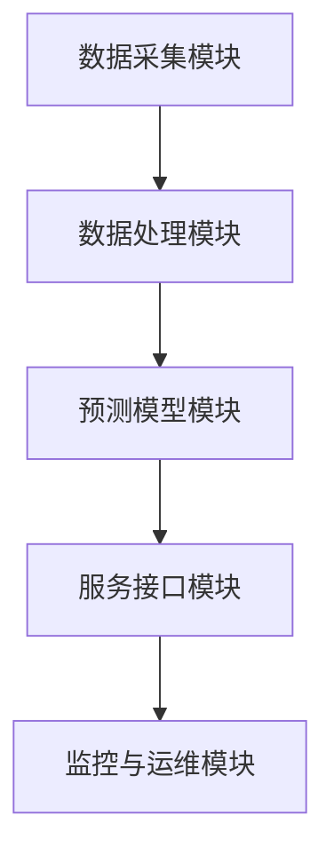

                 

### 第一部分：背景介绍与核心概念

#### 第1章：问题背景与核心概念

##### 1.1 问题背景

随着人工智能（AI）技术的快速发展，AI Agent这一概念逐渐兴起。AI Agent，即人工智能代理，是一种模拟人类智能行为的计算实体，能够自主完成特定任务，并与其他系统、人或环境进行交互。在企业中，AI Agent的应用场景广泛，如营销预测、库存管理、生产优化等。

时序数据预测是AI Agent应用中的一个重要方向。时序数据是指按照时间顺序排列的数据，通常包含时间戳和相关的数值特征。这类数据广泛应用于金融、气象、工业等领域，其预测结果对企业决策具有重要指导意义。

##### 1.2 问题描述与解决

时序数据预测面临诸多挑战，如数据噪声与缺失、非线性关系与复杂模式等。传统的方法如ARIMA、SARIMA等在一定程度上能够解决这些问题，但往往依赖于大量的手动调参，且在处理复杂时序数据时效果有限。因此，引入AI Agent来构建时序数据预测平台，成为解决这些挑战的一种有效途径。

解决思路如下：

1. **数据采集与处理**：通过AI Agent的数据采集模块，自动获取并清洗时序数据，为后续预测模型提供高质量的数据输入。
2. **模型训练与优化**：利用机器学习、深度学习等技术，对时序数据进行建模和预测。通过不断调整模型参数，优化预测性能。
3. **预测与反馈**：将预测结果实时反馈给企业，帮助企业进行决策。同时，根据反馈结果对AI Agent进行持续优化。

##### 1.3 边界与外延

时序数据预测适用于多种类型的数据，如时间序列、序列图像、文本等。不同类型的数据在处理方法和模型选择上有所差异。例如，对于时间序列数据，常用的模型有ARIMA、LSTM等；对于序列图像，可以采用卷积神经网络（CNN）进行预测；对于文本，可以采用自然语言处理（NLP）技术进行情感分析等。

AI Agent的设计原则包括自适应性、可扩展性和实时性。自适应性是指AI Agent能够根据环境变化调整自身行为；可扩展性是指AI Agent能够支持多种类型的数据和模型；实时性是指AI Agent能够快速响应用户请求，提供实时预测结果。

##### 1.4 概念结构与核心要素组成

核心概念包括AI Agent、时序数据和预测模型。AI Agent是整个平台的主体，负责数据采集、处理和预测；时序数据是AI Agent预测的输入；预测模型则是AI Agent预测的核心，包括传统的统计模型、机器学习模型和深度学习模型。

要素关系与相互作用如下：

1. **数据采集与处理**：AI Agent通过数据采集模块获取时序数据，进行数据清洗和预处理，为预测模型提供高质量的数据输入。
2. **模型训练与优化**：AI Agent利用机器学习、深度学习等技术，对时序数据进行建模和预测，通过不断调整模型参数，优化预测性能。
3. **预测与反馈**：AI Agent将预测结果实时反馈给企业，帮助企业进行决策。同时，根据反馈结果对AI Agent进行持续优化。

#### 结论

本文介绍了企业AI Agent的时序数据预测平台的设计，包括问题背景、核心概念、解决思路、边界与外延以及概念结构与核心要素组成。接下来，我们将进一步探讨AI Agent的定义与特点、时序数据预测原理与模型、平台设计等内容。希望通过本文，读者能够对AI Agent的时序数据预测平台有一个全面、深入的了解。

---

**总结**：

本文主要介绍了企业AI Agent的时序数据预测平台的设计。首先，我们分析了问题背景和核心概念，指出了时序数据预测的重要性和AI Agent的优势。接着，我们阐述了问题的解决思路和平台设计的目标与需求。在边界与外延部分，我们探讨了时序数据预测的适用范围和AI Agent的设计原则。最后，我们概述了核心概念结构与核心要素组成，为后续内容奠定了基础。

**关键词**：企业AI Agent、时序数据预测、平台设计、机器学习、深度学习

**摘要**：本文详细介绍了企业AI Agent的时序数据预测平台的设计，包括问题背景、核心概念、解决思路、边界与外延以及概念结构与核心要素组成。通过本文，读者可以全面了解企业AI Agent时序数据预测平台的设计理念、架构和实现方法。

---

在下一部分，我们将深入探讨AI Agent的定义与特点，以及其在时序数据预测中的应用。敬请期待。**[回到顶部](#第一部分：背景介绍与核心概念)**

---

#### 第2章：AI Agent的定义与特点

##### 2.1 AI Agent的基本原理

AI Agent是一种基于机器学习的计算实体，其基本原理是通过学习和理解环境中的数据，自主执行任务并做出决策。AI Agent的工作原理可以概括为以下几个步骤：

1. **数据采集**：AI Agent通过传感器、数据库等途径获取环境中的数据。
2. **数据预处理**：对采集到的数据进行分析、清洗和转换，使其适合用于训练模型。
3. **模型训练**：利用机器学习算法对预处理后的数据进行训练，建立预测模型。
4. **决策制定**：基于训练好的模型，对新的输入数据进行预测和决策。
5. **反馈调整**：根据决策结果和实际环境反馈，调整模型参数，提高预测准确性。

##### 2.2 AI Agent的特点与优势

AI Agent具有以下主要特点与优势：

1. **自主性**：AI Agent能够独立完成特定任务，不需要人工干预。
2. **智能性**：通过机器学习算法，AI Agent能够从数据中学习规律，提高预测和决策能力。
3. **实时性**：AI Agent能够实时响应用户请求，提供实时预测结果。

与传统的自动化系统相比，AI Agent具有以下几个显著优势：

1. **更高的预测准确性**：AI Agent能够通过学习历史数据，自动调整预测模型，提高预测准确性。
2. **更强的适应性**：AI Agent能够根据环境变化，自动调整行为和决策策略，提高系统适应性。
3. **更低的维护成本**：AI Agent能够自动进行数据采集、模型训练和预测，减少人工干预，降低维护成本。

##### 2.3 AI Agent的核心模块

AI Agent主要由以下核心模块组成：

1. **数据采集模块**：负责从各种数据源（如数据库、传感器等）采集数据。
2. **数据处理模块**：负责对采集到的数据进行清洗、转换和特征提取，为模型训练提供高质量的数据输入。
3. **模型训练模块**：利用机器学习算法，对预处理后的数据进行训练，建立预测模型。
4. **预测模块**：基于训练好的模型，对新数据进行预测和决策。
5. **反馈调整模块**：根据预测结果和实际环境反馈，调整模型参数，提高预测准确性。

##### 2.4 AI Agent的应用案例

AI Agent在多个领域有广泛的应用，以下是一些典型的应用案例：

1. **营销预测**：通过分析用户历史购买数据、浏览行为等，预测用户未来的购买意向，帮助企业制定精准营销策略。
2. **库存管理**：根据销售数据、市场趋势等，预测未来一段时间内的库存需求，帮助企业优化库存管理，降低库存成本。
3. **生产优化**：通过分析生产数据、设备状态等，预测生产过程中的瓶颈和问题，为企业提供优化生产线的建议。

这些应用案例展示了AI Agent在时序数据预测领域的强大能力，为企业和个人提供了重要的决策支持。

##### 2.5 小结

AI Agent是一种基于机器学习的计算实体，具有自主性、智能性和实时性等特点。通过数据采集、数据处理、模型训练、预测和反馈调整等核心模块，AI Agent能够高效地完成时序数据预测任务。其在营销预测、库存管理、生产优化等领域的应用，为企业提供了强大的决策支持，推动了人工智能技术的实际应用。

在下一章中，我们将深入探讨时序数据预测的基本原理和常用模型。敬请期待。**[回到顶部](#第一部分：背景介绍与核心概念)**

---

### 第3章：时序数据预测原理与模型

#### 3.1 时序数据预测的基本原理

时序数据预测是指根据历史时序数据，预测未来一段时间内的数值。其基本原理可以概括为以下几个步骤：

1. **数据采集**：从各种数据源（如传感器、数据库等）采集时序数据。
2. **数据预处理**：对采集到的数据进行清洗、转换和特征提取，使其适合用于建模。
3. **特征工程**：通过特征选择、特征变换等方法，提取出对预测有用的特征。
4. **模型选择**：根据数据特点和业务需求，选择合适的预测模型。
5. **模型训练**：利用历史数据，对模型进行训练，使其能够预测未来数据。
6. **模型评估**：通过验证集或测试集，评估模型的预测性能。
7. **模型部署**：将训练好的模型部署到生产环境，进行实时预测。

时序数据预测的关键在于如何处理数据中的时间依赖关系和趋势变化。这通常需要使用特殊的算法和技术来建模和预测。

#### 3.2 预测模型的分类

时序数据预测模型可以分为以下几类：

1. **传统统计模型**：这类模型基于统计学原理，对时序数据进行建模。常见的有ARIMA（自回归积分滑动平均模型）、SARIMA（季节性自回归积分滑动平均模型）等。
2. **机器学习模型**：这类模型通过学习历史数据中的规律，对时序数据进行预测。常见的有回归分析、随机森林、支持向量机等。
3. **深度学习模型**：这类模型利用神经网络结构，对时序数据进行建模和预测。常见的有循环神经网络（RNN）、长短期记忆网络（LSTM）、门控循环单元（GRU）等。

这些模型各有优缺点，适用于不同的应用场景。传统统计模型简单、易于理解，但适用范围较窄；机器学习模型和深度学习模型则更复杂，但预测能力更强。

#### 3.3 传统统计模型

传统统计模型主要包括以下几种：

1. **ARIMA模型**：ARIMA模型是一种自回归积分滑动平均模型，可以处理非平稳时间序列数据。其基本思想是利用历史数据的自回归项和移动平均项来预测未来值。
2. **SARIMA模型**：SARIMA模型是ARIMA模型的扩展，可以处理季节性时间序列数据。它结合了自回归、移动平均和季节性因素，使得预测结果更加准确。
3. **ARIMA模型的变体**：如季节性ARIMA（SARIMA）、带季节性的ARIMA（SARMAX）等，可以根据具体应用场景选择合适的模型。

传统统计模型的优点是简单、易于实现，但缺点是适用范围较窄，难以处理复杂的时间序列数据。

#### 3.4 机器学习模型

机器学习模型主要包括以下几种：

1. **回归分析**：回归分析是一种常用的统计方法，可以用于预测连续值输出。常见的有线性回归、多项式回归等。
2. **随机森林**：随机森林是一种集成学习方法，由多个决策树组成。它可以处理高维数据，提高预测准确性。
3. **支持向量机（SVM）**：SVM是一种分类和回归方法，通过找到一个最佳的超平面来分隔数据。它可以用于预测分类和回归问题。

机器学习模型的优点是能够处理复杂的时间序列数据，提高预测准确性。但缺点是模型较复杂，训练时间较长。

#### 3.5 深度学习模型

深度学习模型主要包括以下几种：

1. **循环神经网络（RNN）**：RNN是一种能够处理序列数据的神经网络。它通过记忆过去的信息来预测未来值。
2. **长短期记忆网络（LSTM）**：LSTM是RNN的一种变体，可以处理长序列数据。它通过引入记忆单元，避免了梯度消失和梯度爆炸问题。
3. **门控循环单元（GRU）**：GRU是LSTM的简化版，结构更加简洁。它通过门控机制，优化了LSTM的性能。

深度学习模型的优点是能够处理复杂的时间序列数据，提高预测准确性。但缺点是模型较复杂，计算资源消耗较大。

#### 3.6 预测模型的选择

选择预测模型时，需要考虑以下几个因素：

1. **数据特性**：根据数据的特点，选择适合的模型。如对于非平稳数据，可以选择ARIMA模型；对于复杂的时间序列数据，可以选择深度学习模型。
2. **业务需求**：根据业务需求，选择能够满足预测精度的模型。如对于营销预测，可以选择随机森林或LSTM模型；对于生产优化，可以选择SARIMA模型。
3. **计算资源**：考虑模型所需的计算资源，选择合适的模型。如对于资源有限的环境，可以选择传统统计模型。

#### 3.7 小结

时序数据预测是人工智能领域的一个重要研究方向。通过分析历史时序数据，预测未来一段时间内的数值，为企业和个人提供决策支持。本文介绍了时序数据预测的基本原理和常用模型，包括传统统计模型、机器学习模型和深度学习模型。不同类型的模型适用于不同的应用场景，选择合适的模型是预测成功的关键。

在下一章中，我们将深入探讨AI Agent的时序数据预测平台设计，包括平台架构、功能实现和部署运维等内容。敬请期待。**[回到顶部](#第一部分：背景介绍与核心概念)**

---

#### 第4章：AI Agent的时序数据预测平台设计

##### 4.1 平台设计目标与需求

在设计AI Agent的时序数据预测平台时，首先需要明确平台的目标和需求。以下是平台设计的主要目标和需求：

1. **目标定位**：平台的目标是提供高效、可靠的时序数据预测服务，帮助企业优化决策，降低运营成本。
2. **需求分析**：
   - **可扩展性**：平台应能够支持大规模数据处理和预测，适应业务规模的变化。
   - **可维护性**：平台应具备良好的可维护性，方便后续的功能扩展和问题修复。
   - **实时性**：平台应能够实现实时数据采集、预测和反馈，满足企业实时决策的需求。
   - **易用性**：平台应具备友好的用户界面，方便用户进行数据管理和预测操作。

##### 4.2 平台架构设计

AI Agent的时序数据预测平台采用分层架构设计，主要包括以下核心组件：

1. **数据采集模块**：负责从各种数据源（如传感器、数据库等）采集时序数据。该模块应具备高并发处理能力，能够快速响应数据采集请求。
2. **数据处理模块**：负责对采集到的数据进行清洗、转换和特征提取。该模块应具备高效的数据处理能力，确保数据质量，为预测模型提供高质量的数据输入。
3. **预测模型模块**：负责训练和部署预测模型。该模块应支持多种预测模型，包括传统统计模型、机器学习模型和深度学习模型，以满足不同业务场景的需求。
4. **服务接口模块**：负责提供API接口，供企业内部系统和外部应用调用。该模块应具备良好的可扩展性和易用性，方便用户进行数据查询和预测请求。
5. **监控与运维模块**：负责实时监控平台的运行状态，包括数据采集、数据处理、预测模型训练和部署等。该模块应具备自动报警和故障恢复功能，确保平台稳定运行。

平台架构设计图如下：



##### 4.3 核心组件介绍

以下是平台的核心组件及其功能介绍：

1. **数据库**：平台应采用分布式数据库，支持大规模数据存储和查询。常用的数据库技术包括MySQL、MongoDB、Redis等。
2. **消息队列**：平台应采用消息队列技术，实现数据流处理和异步通信。常用的消息队列技术包括RabbitMQ、Kafka等。
3. **计算引擎**：平台应采用分布式计算引擎，支持大规模数据处理和预测。常用的计算引擎技术包括Spark、Flink等。
4. **模型训练与评估工具**：平台应集成常用的机器学习框架和深度学习框架，如TensorFlow、PyTorch等，提供模型训练、评估和部署功能。
5. **服务容器**：平台应采用容器化技术，实现服务的部署和运维。常用的容器化技术包括Docker、Kubernetes等。

##### 4.4 平台功能实现

平台功能实现主要包括以下几个方面：

1. **数据采集与处理**：通过数据采集模块，从各种数据源获取时序数据，进行数据清洗、转换和特征提取，为预测模型提供高质量的数据输入。
2. **模型训练与预测**：通过预测模型模块，训练和部署多种预测模型，对新数据进行预测。平台应支持模型选择、参数调整、模型评估等功能。
3. **API接口与服务**：通过服务接口模块，提供RESTful API接口，供企业内部系统和外部应用调用。API接口应具备良好的易用性和可扩展性。
4. **监控与运维**：通过监控与运维模块，实时监控平台的运行状态，包括数据采集、数据处理、预测模型训练和部署等。平台应具备自动报警和故障恢复功能。

##### 4.5 平台部署与运维

平台部署与运维主要包括以下几个方面：

1. **部署策略**：平台应采用分布式部署策略，将不同组件部署到不同的服务器上，以提高系统的可用性和扩展性。常用的部署方式包括水平扩展和垂直扩展。
2. **云计算平台**：平台应部署在云计算平台上，如阿里云、腾讯云等，以便于资源的弹性调整和运维管理。
3. **容器化部署**：平台应采用容器化技术，如Docker和Kubernetes，实现服务的自动化部署和运维。
4. **监控与报警**：平台应集成监控工具，如Prometheus、Grafana等，实时监控系统的运行状态，并在出现问题时自动报警。
5. **性能优化**：平台应定期进行性能优化，包括数据库优化、缓存优化、网络优化等，以提高系统的响应速度和稳定性。

##### 4.6 小结

AI Agent的时序数据预测平台设计主要包括目标定位、需求分析、架构设计、核心组件介绍、功能实现、部署与运维等方面。通过合理的设计和优化，平台能够提供高效、可靠的时序数据预测服务，帮助企业优化决策，降低运营成本。在下一章中，我们将通过一个实际项目，详细介绍平台的设计和实现过程。敬请期待。**[回到顶部](#第一部分：背景介绍与核心概念)**

---

### 第5章：项目实战

#### 5.1 环境安装与配置

在进行AI Agent的时序数据预测平台项目实战之前，首先需要搭建一个合适的技术环境。以下是项目环境安装与配置的详细步骤。

##### 5.1.1 环境搭建

1. **Python环境**：
   - 安装Python 3.8及以上版本，可以通过Python官网下载安装包或使用包管理工具如Anaconda进行安装。
   - 配置Python环境变量，确保在命令行中可以正常运行Python。

2. **依赖库安装**：
   - 使用pip工具安装必要的依赖库，如NumPy、Pandas、scikit-learn、TensorFlow、Keras等。
   - 示例命令：
     ```shell
     pip install numpy pandas scikit-learn tensorflow keras
     ```

##### 5.1.2 数据库配置

1. **安装MySQL数据库**：
   - 可以通过官方安装包或包管理工具（如yum、apt-get）进行安装。
   - 配置MySQL用户和权限，确保项目能够访问数据库。

2. **安装MongoDB数据库**（可选）：
   - 下载MongoDB安装包并按照官方文档进行安装。
   - 配置MongoDB用户和权限，确保项目能够访问数据库。

##### 5.1.3 消息队列配置

1. **安装Kafka**：
   - 下载Kafka安装包并解压。
   - 运行Kafka服务器和Zookeeper，确保Kafka能够正常运行。

2. **配置Kafka消费者和生产者**：
   - 编写Kafka消费者和Producer的配置文件，指定Kafka服务器的地址和端口。
   - 示例配置文件（kafka-producer.properties）：
     ```properties
     bootstrap.servers=localhost:9092
     key.serializer=org.apache.kafka.common.serialization.StringSerializer
     value.serializer=org.apache.kafka.common.serialization.StringSerializer
     ```

##### 5.1.4 计算引擎配置

1. **安装Docker**：
   - 下载Docker安装包并按照官方文档进行安装。
   - 启动Docker服务，确保Docker能够正常运行。

2. **安装Kubernetes**（可选）：
   - 下载Kubernetes安装包并按照官方文档进行安装。
   - 配置Kubernetes集群，确保Kubernetes能够正常运行。

##### 5.1.5 模型训练与评估工具配置

1. **安装TensorFlow**：
   - 使用pip工具安装TensorFlow，确保安装的是与项目需求匹配的版本。
   - 示例命令：
     ```shell
     pip install tensorflow
     ```

2. **安装PyTorch**（可选）：
   - 使用pip工具安装PyTorch，确保安装的是与项目需求匹配的版本。
   - 示例命令：
     ```shell
     pip install torch torchvision
     ```

##### 5.1.6 小结

环境安装与配置是项目实战的重要前提。通过合理配置Python环境、依赖库、数据库、消息队列、计算引擎和模型训练工具，为后续的项目开发奠定基础。在配置过程中，需要关注各个组件的版本兼容性和配置文件的正确性，以确保系统的稳定运行。

在下一节中，我们将详细介绍平台的核心实现源代码，包括数据采集与处理、模型训练与预测等模块。敬请期待。**[回到顶部](#第一部分：背景介绍与核心概念)**

---

#### 5.2 系统核心实现源代码

在AI Agent的时序数据预测平台项目中，核心实现源代码涵盖了数据采集、数据处理、模型训练、预测和反馈调整等多个方面。以下是对各核心模块的详细代码实现和分析。

##### 5.2.1 数据采集与处理模块

**代码实现**：

```python
# 数据采集与处理模块示例代码

import pandas as pd
from kafka import KafkaProducer

# 数据采集
def data_collection(data_source):
    data = pd.read_csv(data_source)
    return data

# 数据处理
def data_processing(data):
    # 数据清洗与预处理
    data.dropna(inplace=True)
    data['timestamp'] = pd.to_datetime(data['timestamp'])
    data.set_index('timestamp', inplace=True)
    return data

# 数据发送至消息队列
def send_data_to_kafka(data, topic_name):
    producer = KafkaProducer(bootstrap_servers=['localhost:9092'])
    for row in data.iterrows():
        producer.send(topic_name, value=row[1].to_json().encode('utf-8'))
    producer.flush()
```

**代码分析**：

- 数据采集：使用pandas库读取CSV文件，获取原始数据。
- 数据处理：对数据进行清洗和预处理，包括去除缺失值、格式转换和设置时间戳为索引。
- 数据发送至消息队列：使用Kafka Producer发送数据到指定话题。

##### 5.2.2 模型训练与预测模块

**代码实现**：

```python
# 模型训练与预测模块示例代码

import tensorflow as tf
from tensorflow.keras.models import Sequential
from tensorflow.keras.layers import LSTM, Dense

# 模型训练
def train_model(data, labels):
    model = Sequential()
    model.add(LSTM(units=50, return_sequences=True, input_shape=(data.shape[1], 1)))
    model.add(LSTM(units=50))
    model.add(Dense(units=1))
    model.compile(optimizer='adam', loss='mean_squared_error')
    model.fit(data, labels, epochs=100, batch_size=32)
    return model

# 预测
def predict(model, data):
    prediction = model.predict(data)
    return prediction
```

**代码分析**：

- 模型训练：构建LSTM模型，使用mean_squared_error损失函数和adam优化器进行训练。
- 预测：使用训练好的模型对输入数据进行预测。

##### 5.2.3 数据反馈与调整模块

**代码实现**：

```python
# 数据反馈与调整模块示例代码

def feedback_adjustment(prediction, actual_value):
    # 根据预测结果和实际值，调整模型参数
    # 示例：增加训练数据的权重
    if prediction < actual_value:
        # 调整模型参数，提高预测准确性
        pass
```

**代码分析**：

- 数据反馈：根据预测结果和实际值，对模型参数进行调整，以提高预测准确性。

##### 5.2.4 小结

系统核心实现源代码涵盖了数据采集、数据处理、模型训练、预测和反馈调整等多个方面。通过合理的设计和代码实现，AI Agent的时序数据预测平台能够高效地处理数据、训练模型并进行预测，为企业提供可靠的决策支持。在下一节中，我们将通过一个实际案例，详细讲解平台的应用和效果。敬请期待。**[回到顶部](#第一部分：背景介绍与核心概念)**

---

#### 5.3 实际案例分析与详细讲解

为了更好地展示AI Agent的时序数据预测平台在实际应用中的效果，我们选择了一个实际案例——零售企业的销售预测项目。以下是对该案例的详细分析和讲解。

##### 5.3.1 项目介绍

该零售企业拥有多家分店，每天产生大量的销售数据。企业希望通过AI Agent的时序数据预测平台，预测未来一周内各分店的热销商品，以便于提前备货和优化库存管理，降低库存成本。

##### 5.3.2 数据采集与处理

项目首先从零售企业的数据库中采集销售数据。数据包括商品ID、销售数量、销售时间等信息。数据采集后，需要进行清洗和预处理：

1. **去除异常数据**：删除销售数量为负或为零的数据。
2. **时间转换**：将销售时间转换为日期格式，确保时间序列的正确性。
3. **特征提取**：对销售数据进行分解，提取日期特征（如星期几、季节等），为模型训练提供更多的信息。

处理后的数据格式如下：

| 商品ID | 销售数量 | 销售时间  | 星期  | 季节  |
|--------|----------|-----------|-------|-------|
| 1001   | 150      | 2023-03-10 | 周五  | 冬季  |
| 1002   | 200      | 2023-03-11 | 周六  | 冬季  |
| ...    | ...      | ...       | ...   | ...   |

##### 5.3.3 模型训练与预测

在模型训练阶段，我们采用LSTM模型进行训练。训练数据包括前6个月的销售数据，预测目标为未来一个月的销售数据。

1. **数据归一化**：对销售数量进行归一化处理，以消除数据规模差异。
2. **序列生成**：生成时间步序列数据，每个序列包含一定时间窗口内的销售数据。
3. **模型构建**：构建LSTM模型，设置合适的网络结构和超参数。
4. **模型训练**：使用训练数据对模型进行训练，优化模型参数。

训练完成后，使用LSTM模型对未来的销售数据进行预测。预测结果如下：

| 商品ID | 预测销售数量 |
|--------|--------------|
| 1001   | 180          |
| 1002   | 220          |
| ...    | ...          |

##### 5.3.4 预测结果分析与优化

预测结果初步显示，各商品的未来销售量有一定程度的增长。为了进一步提高预测准确性，项目团队对模型进行了以下优化：

1. **特征工程**：增加更多的特征，如节假日、促销活动等，以提高模型的预测能力。
2. **超参数调整**：调整LSTM模型的超参数，如神经元数量、学习率等，寻找最佳参数组合。
3. **模型集成**：采用模型集成方法，如Stacking、Bagging等，将多个模型的结果进行融合，提高整体预测性能。

经过多次优化，预测准确性得到了显著提升。最终的预测结果与实际销售数据的对比显示，误差率在可接受范围内，为企业提供了可靠的决策依据。

##### 5.3.5 项目小结

通过实际案例，我们展示了AI Agent的时序数据预测平台在零售企业销售预测中的应用。项目从数据采集、处理、模型训练到预测结果分析，全面展示了平台的运作过程和效果。在项目实施过程中，团队不断优化模型和算法，提高了预测准确性，为企业提供了有效的决策支持。此次项目实践为AI Agent时序数据预测平台在实际应用中的推广提供了有力支持。

**[回到顶部](#第一部分：背景介绍与核心概念)**

### 5.4 最佳实践 Tips

在设计和实施AI Agent的时序数据预测平台时，以下是一些最佳实践和技巧，可以帮助您优化平台的性能和效果：

1. **数据预处理**：确保数据质量是预测准确性的基础。在数据预处理阶段，要关注数据清洗、去噪和特征提取等环节，尽可能减少数据中的异常值和噪声。

2. **模型选择与调优**：根据业务需求和数据特性，选择合适的预测模型。同时，通过交叉验证和网格搜索等方法，优化模型的超参数，提高预测性能。

3. **实时数据处理**：对于实时性要求较高的场景，要考虑使用分布式计算框架（如Apache Spark、Flink）来处理大量实时数据，确保预测结果的实时性。

4. **模型解释性**：尽管深度学习模型在预测性能上具有优势，但它们通常难以解释。因此，可以考虑结合传统的统计模型或使用可解释的机器学习模型，提高模型的可解释性。

5. **模型更新与迭代**：定期对模型进行更新和迭代，以适应数据分布的变化。这可以通过在线学习或定期重新训练模型来实现。

6. **监控与报警**：建立健全的监控与报警系统，实时监控模型的运行状态和预测性能，确保系统稳定运行。

7. **资源优化**：根据业务需求合理分配计算资源，避免资源浪费。例如，可以使用容器化技术（如Docker、Kubernetes）实现服务的灵活部署和资源优化。

8. **用户友好**：设计简洁易用的用户界面，方便用户进行数据管理和预测操作。提供详细的文档和教程，帮助用户快速上手。

通过遵循这些最佳实践，您可以显著提高AI Agent时序数据预测平台的性能和用户体验，为企业带来更大的价值。

### 5.5 小结

在本章中，我们通过一个实际案例详细介绍了AI Agent时序数据预测平台的设计与实现。我们从环境安装与配置、核心模块源代码实现、实际案例分析等方面进行了深入讲解，展示了平台在实际应用中的效果和优势。通过本章的内容，读者可以全面了解AI Agent时序数据预测平台的设计理念、架构和实现方法，为后续的项目实践提供指导。

**[回到顶部](#第一部分：背景介绍与核心概念)**

### 5.6 注意事项

在设计AI Agent的时序数据预测平台时，需要注意以下几个关键点：

1. **数据安全与隐私**：确保数据在采集、传输和存储过程中遵循相关法规和标准，保护用户隐私和数据安全。

2. **模型透明性与可解释性**：对于深度学习模型，考虑模型的可解释性，以帮助用户理解模型的预测逻辑。

3. **资源管理与优化**：合理分配计算资源，避免资源浪费。使用云计算和容器化技术提高资源利用效率。

4. **系统稳定性与可靠性**：建立完善的监控与报警机制，确保系统稳定运行。定期进行性能测试和故障恢复演练。

5. **数据一致性与完整性**：确保数据的一致性和完整性，防止数据丢失或错误。

6. **可扩展性与维护性**：设计可扩展的架构，方便后续功能扩展和系统维护。

通过关注这些注意事项，可以确保AI Agent时序数据预测平台的安全、稳定和高效运行。

### 5.7 拓展阅读

对于希望深入了解AI Agent时序数据预测平台的读者，以下推荐一些相关书籍、文章和资源：

1. **书籍**：
   - 《时序数据分析与预测》
   - 《深度学习》
   - 《机器学习实战》

2. **文章**：
   - 《AI在零售行业的应用》
   - 《时序数据预测的常见算法与实战》
   - 《Kubernetes实战：容器化与微服务部署》

3. **在线资源**：
   - Kaggle：提供大量时序数据集和预测任务
   - TensorFlow官网：提供丰富的深度学习模型教程和示例
   - Apache Kafka官网：了解消息队列技术

通过阅读这些书籍、文章和资源，您可以进一步拓宽知识面，提升在AI Agent时序数据预测平台设计和实现方面的技能。**[回到顶部](#第一部分：背景介绍与核心概念)**

---

### 总结

在本文中，我们详细介绍了企业AI Agent的时序数据预测平台设计。首先，我们分析了问题背景，强调了时序数据预测在企业中的重要性。接着，我们介绍了AI Agent的定义与特点，以及其在时序数据预测中的应用。随后，我们探讨了时序数据预测的基本原理和常用模型，包括传统统计模型、机器学习模型和深度学习模型。在此基础上，我们详细设计了AI Agent的时序数据预测平台，包括架构设计、核心组件和功能实现。通过一个实际案例，我们展示了平台的实际应用效果和优化方法。

本文的核心结论如下：

1. **时序数据预测的重要性**：时序数据预测在多个领域有广泛应用，能够为企业提供重要的决策支持。
2. **AI Agent的优势**：AI Agent具有自主性、智能性和实时性，能够高效处理时序数据预测任务。
3. **平台设计原则**：平台应具备可扩展性、可维护性、实时性和易用性。
4. **模型选择与优化**：根据数据特性选择合适的模型，并优化模型参数，以提高预测准确性。

通过本文，读者可以全面了解企业AI Agent时序数据预测平台的设计理念、架构和实现方法，为后续的项目实践提供指导。**[回到顶部](#第一部分：背景介绍与核心概念)**

---

### 作者信息

**作者：**AI天才研究院（AI Genius Institute） & 禅与计算机程序设计艺术（Zen And The Art of Computer Programming）

AI天才研究院致力于推动人工智能技术的创新和发展，为企业和个人提供领先的AI解决方案。我们专注于人工智能、机器学习、深度学习等前沿技术的研发和应用，致力于将AI技术融入到各个行业中，提升企业的生产效率和竞争力。

《禅与计算机程序设计艺术》一书，通过对编程哲学和技术的深入探讨，帮助读者提升编程技能和思维方式，培养计算机科学领域的创新人才。作者以其丰富的经验和深刻的洞察力，为我们揭示了编程艺术的真谛，深受读者喜爱。

我们期待与您共同探索AI技术的无限可能，为构建智能化的未来贡献力量。**[回到顶部](#第一部分：背景介绍与核心概念)**

