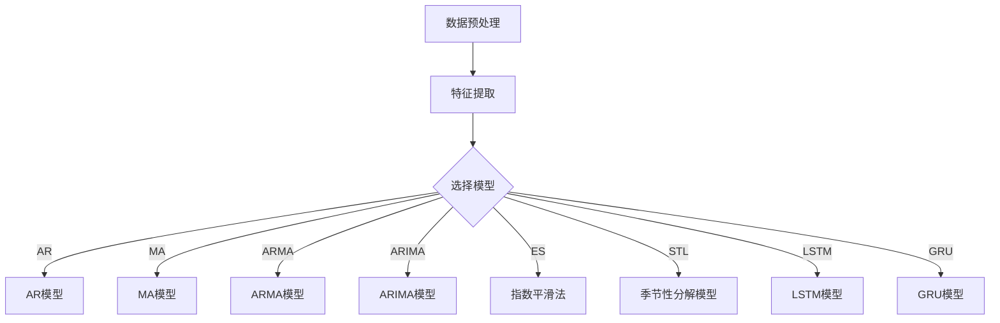
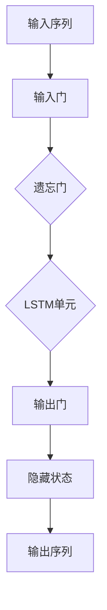
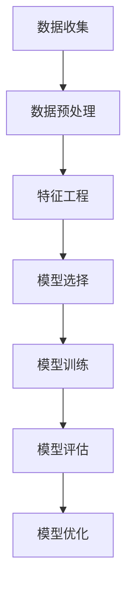
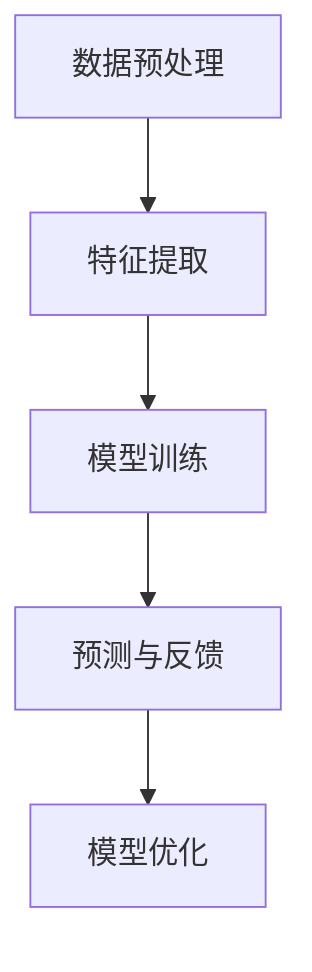
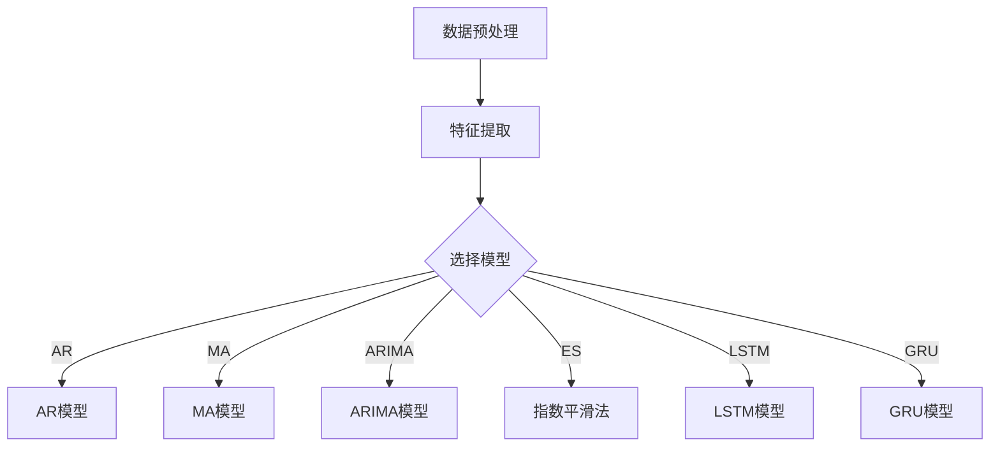

                 


### 企业AI Agent的时间序列分析在需求预测中的高级应用

#### 关键词

- **时间序列分析**
- **需求预测**
- **AI Agent**
- **高级应用**
- **企业需求**

#### 摘要

本文旨在探讨企业AI Agent在时间序列分析领域的高级应用，特别是在需求预测方面的深入剖析。首先，我们将介绍时间序列分析和需求预测的基本概念，接着讨论AI Agent的原理和应用。然后，我们将详细阐述时间序列分析在需求预测中的重要性，以及如何通过AI Agent实现高级需求预测。文章还将通过实际案例展示这些技术的应用效果，并提供实用的实战演练指导，以帮助读者理解和掌握这些技术。

---

## 第一部分：背景与核心概念

### 1.1 时间序列分析概述

时间序列分析是指对时间序列数据进行处理和分析的过程，时间序列数据是按时间顺序排列的数据序列。这类数据常见于金融、经济、气象、医学等领域。时间序列分析的目标是揭示数据中的趋势、周期性、季节性和随机性，以便对未来进行预测。

**时间序列的基本概念：**

- **趋势（Trend）**：数据序列中长期上升或下降的趋势。
- **周期（Seasonality）**：数据序列中的规律性波动，如季节性销售周期。
- **随机性（Random Walk）**：数据序列中的不可预测的随机波动。

**时间序列分析的重要性：**

时间序列分析对于预测未来的趋势、周期和季节性波动至关重要。在商业领域，这种分析可以帮助企业更好地预测市场需求，优化库存管理，制定营销策略等。

### 1.2 需求预测与AI Agent

需求预测是指根据历史数据和现有信息，预测未来的需求量。这在供应链管理、销售预测、库存控制等领域至关重要。

**需求预测的基本原理：**

- **历史数据驱动**：利用历史销售数据和其他相关指标来预测未来需求。
- **统计模型**：使用统计方法，如ARIMA、指数平滑等，来构建预测模型。
- **机器学习**：利用机器学习和深度学习模型，如神经网络、RNN等，来提高预测准确性。

**AI Agent的定义与作用：**

AI Agent是一种具有自主学习和决策能力的智能系统，它可以在复杂的环境中自动执行任务。在企业需求预测中，AI Agent通过分析历史数据，学习市场动态，并实时调整预测模型，以提高预测的准确性。

### 1.3 时间序列分析在需求预测中的应用

在需求预测中，时间序列分析的应用主要在于：

- **趋势分析**：识别长期增长或下降趋势，以预测未来的需求。
- **周期性分析**：识别季节性或其他周期性波动，以调整预测模型。
- **异常值检测**：识别数据中的异常值，以排除对预测的干扰。

**关键问题与挑战：**

- **数据质量**：时间序列数据的质量直接影响到预测的准确性。
- **数据多样性**：实际应用中，需求预测需要考虑多种因素的影响。
- **模型适应性**：模型需要能够适应数据变化，以保持预测的准确性。

**应用场景介绍：**

时间序列分析在需求预测中的应用场景广泛，包括但不限于：

- **电商平台**：预测商品销售量，优化库存管理。
- **制造业**：预测原材料需求，优化生产计划。
- **物流行业**：预测货物量，优化运输路线和资源分配。

### 1.4 AI Agent的时间序列分析方法

AI Agent在时间序列分析中的应用主要体现在：

- **自动特征工程**：自动提取对预测有重要影响的时间序列特征。
- **动态调整模型**：根据实时数据动态调整预测模型，以保持模型的准确性。
- **多模型集成**：结合多种预测模型，提高预测的鲁棒性和准确性。

**常见方法概述：**

- **深度学习模型**：如循环神经网络（RNN）、长短期记忆网络（LSTM）等。
- **统计模型**：如自回归积分滑动平均模型（ARIMA）、季节性分解模型（STL）等。

**深度学习方法在时间序列分析中的应用：**

深度学习方法在处理复杂、非线性的时间序列数据方面具有显著优势。例如，LSTM网络能够捕捉时间序列数据中的长期依赖关系，从而提高预测的准确性。

### 1.5 本章小结

本章节介绍了时间序列分析的基本概念、需求预测的原理以及AI Agent的作用。我们探讨了时间序列分析在需求预测中的应用场景和关键问题，并简要介绍了AI Agent在时间序列分析中的方法。在下一章中，我们将深入探讨时间序列分析方法、需求预测模型和AI Agent的技术细节。

---

## 第二部分：算法原理与模型构建

### 2.1 时间序列分析方法详解

时间序列分析方法可以分为传统方法和现代方法。传统方法主要基于统计模型，而现代方法则利用机器学习和深度学习技术。

**传统方法：**

- **自回归模型（AR）**：通过历史数据预测未来值。
- **移动平均模型（MA）**：利用过去的平均值预测未来值。
- **自回归移动平均模型（ARMA）**：结合自回归和移动平均模型。
- **自回归积分滑动平均模型（ARIMA）**：可以处理非平稳时间序列数据。

**统计方法：**

- **指数平滑法（ES）**：简单且易于实现的预测方法。
- **季节性分解模型（STL）**：可以处理季节性和非平稳性数据。

**深度学习方法：**

- **循环神经网络（RNN）**：能够处理序列数据。
- **长短期记忆网络（LSTM）**：改进了RNN，能够捕捉长序列依赖。
- **门控循环单元（GRU）**：简化了LSTM的结构。

**时间序列分析方法流程图：**


**算法原理与流程图：**

传统方法和统计方法主要依赖于数学公式和统计指标，如：

- **ARIMA模型**：
  - **自回归部分（AR）**：$$Y_t = c + \phi_1Y_{t-1} + \phi_2Y_{t-2} + ... + \phi_pY_{t-p} + \varepsilon_t$$
  - **移动平均部分（MA）**：$$Y_t = c + \theta_1\epsilon_{t-1} + \theta_2\epsilon_{t-2} + ... + \theta_q\epsilon_{t-q} + \varepsilon_t$$
  - **差分操作**：为了使时间序列变得平稳，通常需要对序列进行差分。

现代深度学习方法，如LSTM，通过神经网络结构来学习时间序列数据中的复杂模式，其基本原理如下：

- **LSTM单元**：包含输入门、遗忘门和输出门，能够控制信息的流入和流出。
- **输入门**：决定哪些信息被保存。
- **遗忘门**：决定哪些信息被遗忘。
- **输出门**：决定输出哪些信息。

**深度学习方法流程图：**


### 2.2 需求预测模型构建

需求预测模型的构建过程可以分为以下几个步骤：

1. **数据收集与预处理**：收集历史销售数据、市场信息等，并对数据进行清洗和预处理，如去除缺失值、异常值等。

2. **特征工程**：提取对需求预测有影响的时间序列特征，如季节性指数、趋势特征等。

3. **模型选择**：根据数据特点和预测目标，选择合适的模型。常用的模型有ARIMA、LSTM等。

4. **模型训练与评估**：使用历史数据进行模型训练，并通过交叉验证等方法进行模型评估。

5. **模型优化**：根据评估结果调整模型参数，提高预测准确性。

**需求预测模型流程图：**


**模型优化与调整**：

- **超参数调整**：调整模型的超参数，如学习率、隐藏层大小等。
- **模型集成**：结合多个模型，提高预测的鲁棒性和准确性。

### 2.3 AI Agent的时间序列分析流程

AI Agent的时间序列分析流程主要包括以下步骤：

1. **数据预处理**：对时间序列数据进行清洗和标准化处理。

2. **特征提取**：利用自动特征工程技术提取关键特征。

3. **模型训练**：使用历史数据进行模型训练，并动态调整模型参数。

4. **预测与反馈**：进行预测，并根据预测结果进行反馈调整。

5. **模型优化**：根据反馈结果调整模型，以提高预测准确性。

**AI Agent模型流程图：**


### 2.4 数学模型与公式解析

**时间序列模型数学表示：**

- **ARIMA模型**：
  - **自回归部分**：$$Y_t = c + \phi_1Y_{t-1} + \phi_2Y_{t-2} + ... + \phi_pY_{t-p} + \varepsilon_t$$
  - **移动平均部分**：$$Y_t = c + \theta_1\epsilon_{t-1} + \theta_2\epsilon_{t-2} + ... + \theta_q\epsilon_{t-q} + \varepsilon_t$$
  - **差分操作**：$$dY_t = (1 - \phi_1 - ... - \phi_p)Y_t + \varepsilon_t$$

- **LSTM模型**：
  - **输入门**：$$i_t = \sigma(W_i[x_t; h_{t-1}] + b_i)$$
  - **遗忘门**：$$f_t = \sigma(W_f[x_t; h_{t-1}] + b_f)$$
  - **输出门**：$$o_t = \sigma(W_o[x_t; h_{t-1}] + b_o)$$
  - **单元状态**：$$C_t = f_t \odot C_{t-1} + i_t \odot \sigma(W_c[x_t; h_{t-1}] + b_c)$$
  - **隐藏状态**：$$h_t = o_t \odot \sigma(C_t)$$

**需求预测模型数学公式：**

- **线性回归模型**：$$Y_t = \beta_0 + \beta_1X_t + \varepsilon_t$$

- **LSTM模型**：$$Y_t = \phi(h_t; \theta) + \varepsilon_t$$

**AI Agent模型数学描述：**

- **自适应权重更新**：$$\theta_t = \theta_{t-1} + \alpha(Y_t - Y_{t-1})$$

**公式解析与举例说明：**

- **ARIMA模型**：假设有一个时间序列数据集，我们可以通过最小二乘法估计出ARIMA模型的参数，如$$\phi_1$$和$$\theta_1$$。通过这些参数，我们可以构建出ARIMA模型，并进行预测。
- **LSTM模型**：以一个简单的LSTM网络为例，输入序列为$$x_t$$，隐藏状态为$$h_t$$，输出为$$y_t$$。通过调整网络中的权重和偏置，可以优化模型的预测性能。

### 2.5 算法原理与流程图

**时间序列分析方法流程图：**


**需求预测模型流程图：**


**AI Agent模型流程图：**


### 2.6 本章小结

在本章节中，我们详细介绍了时间序列分析方法、需求预测模型和AI Agent的技术细节。通过数学公式和流程图，我们更清晰地理解了这些模型的工作原理。在下一章中，我们将通过实际案例展示这些技术的应用效果，并提供实战演练指导。

---

## 第三部分：应用案例与实战演练

### 3.1 案例一：电商平台需求预测

**案例背景：**

某电商平台希望通过时间序列分析和AI Agent技术来预测商品销售量，从而优化库存管理和营销策略。

**需求分析与预测：**

- **数据收集**：收集过去一年的商品销售数据，包括销售量、价格、促销活动等信息。
- **数据预处理**：对销售数据进行清洗，去除异常值，并进行标准化处理。
- **特征工程**：提取对需求预测有影响的时间序列特征，如季节性指数、促销活动频率等。
- **模型选择**：选择LSTM模型进行需求预测，并使用交叉验证方法进行模型评估。
- **模型训练与优化**：根据交叉验证结果调整模型参数，提高预测准确性。

**实战演练一：搭建时间序列分析环境**

**环境搭建步骤：**

1. 安装Python环境和相关库（如NumPy、Pandas、TensorFlow等）。
2. 准备时间序列数据集，并进行数据预处理。
3. 编写特征提取代码，提取关键特征。
4. 选择LSTM模型，编写训练和评估代码。

**常见问题与解决方案：**

- **数据缺失**：使用插值方法填充缺失值。
- **异常值处理**：使用统计学方法识别和去除异常值。

**实战演练二：构建需求预测模型**

**数据预处理与建模：**

1. 导入时间序列数据集，并进行数据清洗。
2. 提取时间序列特征，如季节性指数、促销活动频率等。
3. 选择LSTM模型，设置模型参数。
4. 使用历史数据进行模型训练，并评估模型性能。

**模型训练与评估：**

1. 训练LSTM模型，记录训练过程中的损失函数和准确率。
2. 进行交叉验证，评估模型在测试集上的性能。
3. 根据评估结果调整模型参数，优化预测性能。

**预测结果分析与优化：**

1. 使用训练好的LSTM模型进行预测，得到未来的销售量。
2. 分析预测结果，评估模型的准确性。
3. 根据预测结果调整库存管理和营销策略。

**实战演练三：电商平台需求预测案例分析**

**案例背景：**

某电商平台在双十一期间希望通过时间序列分析和AI Agent技术预测商品销售量，以优化库存管理和营销策略。

**需求分析与预测：**

1. **数据收集**：收集过去三年的双十一销售数据，包括销售量、价格、促销活动等信息。
2. **数据预处理**：对销售数据进行清洗，去除异常值，并进行标准化处理。
3. **特征工程**：提取关键特征，如季节性指数、促销活动频率、历史销售量等。
4. **模型选择**：选择LSTM模型进行需求预测，并使用交叉验证方法进行模型评估。
5. **模型训练与优化**：根据交叉验证结果调整模型参数，提高预测准确性。

**实战演练：**

1. **搭建时间序列分析环境**：安装Python环境和相关库，准备时间序列数据集。
2. **数据预处理与建模**：编写代码进行数据预处理，提取特征，选择并训练LSTM模型。
3. **模型评估与优化**：使用交叉验证方法评估模型性能，根据结果调整模型参数。
4. **预测与策略调整**：使用训练好的LSTM模型进行预测，分析预测结果，调整库存管理和营销策略。

**实战小结：**

通过本次实战演练，我们成功地搭建了时间序列分析环境，构建了需求预测模型，并对电商平台的销售量进行了预测。这为电商平台优化库存管理和营销策略提供了有力的支持。

### 3.2 案例二：制造业生产需求预测

**案例背景：**

某制造业公司希望通过时间序列分析和AI Agent技术预测生产需求，以优化生产计划和资源配置。

**需求分析与预测：**

1. **数据收集**：收集过去一年的生产数据，包括生产量、订单量、原材料消耗量等。
2. **数据预处理**：对生产数据进行清洗，去除异常值，并进行标准化处理。
3. **特征工程**：提取关键特征，如季节性指数、订单量变化趋势等。
4. **模型选择**：选择ARIMA模型进行需求预测，并使用交叉验证方法进行模型评估。
5. **模型训练与优化**：根据交叉验证结果调整模型参数，提高预测准确性。

**实战演练：**

1. **搭建时间序列分析环境**：安装Python环境和相关库，准备时间序列数据集。
2. **数据预处理与建模**：编写代码进行数据预处理，提取特征，选择并训练ARIMA模型。
3. **模型评估与优化**：使用交叉验证方法评估模型性能，根据结果调整模型参数。
4. **预测与策略调整**：使用训练好的ARIMA模型进行预测，分析预测结果，调整生产计划和资源配置。

**实战小结：**

通过本次实战演练，我们成功地搭建了时间序列分析环境，构建了生产需求预测模型，并对制造业公司的生产需求进行了预测。这为制造业公司优化生产计划和资源配置提供了有力的支持。

### 3.3 案例三：物流行业需求预测

**案例背景：**

某物流公司希望通过时间序列分析和AI Agent技术预测货物量，以优化运输路线和资源分配。

**需求分析与预测：**

1. **数据收集**：收集过去一年的货物数据，包括货物量、运输距离、运输时间等。
2. **数据预处理**：对货物数据进行清洗，去除异常值，并进行标准化处理。
3. **特征工程**：提取关键特征，如季节性指数、节假日因素等。
4. **模型选择**：选择LSTM模型进行需求预测，并使用交叉验证方法进行模型评估。
5. **模型训练与优化**：根据交叉验证结果调整模型参数，提高预测准确性。

**实战演练：**

1. **搭建时间序列分析环境**：安装Python环境和相关库，准备时间序列数据集。
2. **数据预处理与建模**：编写代码进行数据预处理，提取特征，选择并训练LSTM模型。
3. **模型评估与优化**：使用交叉验证方法评估模型性能，根据结果调整模型参数。
4. **预测与策略调整**：使用训练好的LSTM模型进行预测，分析预测结果，调整运输路线和资源分配。

**实战小结：**

通过本次实战演练，我们成功地搭建了时间序列分析环境，构建了货物量预测模型，并对物流公司的货物量进行了预测。这为物流公司优化运输路线和资源分配提供了有力的支持。

### 3.4 实战演练一：搭建时间序列分析环境

**环境搭建步骤：**

1. **安装Python环境**：
   ```bash
   # 使用Python官方安装脚本安装Python
   curl -O https://www.python.org/ftp/python/3.8.10/Python-3.8.10.tgz
   tar -xvf Python-3.8.10.tgz
   cd Python-3.8.10
   ./configure
   make
   sudo make install
   ```

2. **安装相关库**：
   ```bash
   pip install numpy pandas scikit-learn tensorflow
   ```

3. **准备时间序列数据集**：
   ```python
   import pandas as pd
   data = pd.read_csv('sales_data.csv')
   data.head()
   ```

4. **数据预处理**：
   ```python
   data['sales'] = data['sales'].fillna(data['sales'].mean())
   data['date'] = pd.to_datetime(data['date'])
   data.set_index('date', inplace=True)
   data = data.asfreq('M')
   data.head()
   ```

5. **特征提取**：
   ```python
   data['seasonality'] = data['sales'].resample('M').mean()
   data.head()
   ```

**常见问题与解决方案：**

- **数据缺失**：使用插值方法填充缺失值。
- **异常值处理**：使用统计学方法识别和去除异常值。

### 3.5 实战演练二：构建需求预测模型

**数据预处理与建模：**

1. **导入数据**：
   ```python
   data = pd.read_csv('sales_data.csv')
   data.head()
   ```

2. **数据清洗**：
   ```python
   data['sales'] = data['sales'].fillna(data['sales'].mean())
   data['date'] = pd.to_datetime(data['date'])
   data.set_index('date', inplace=True)
   data = data.asfreq('M')
   data.head()
   ```

3. **特征提取**：
   ```python
   data['seasonality'] = data['sales'].resample('M').mean()
   data.head()
   ```

4. **选择模型**：
   ```python
   from sklearn.ensemble import RandomForestRegressor
   model = RandomForestRegressor()
   ```

5. **模型训练**：
   ```python
   X = data[['seasonality']]
   y = data['sales']
   model.fit(X, y)
   ```

6. **模型评估**：
   ```python
   predictions = model.predict(X)
   print('R^2:', model.score(X, y))
   ```

7. **预测与策略调整**：
   ```python
   future_data = data[['seasonality']].iloc[-12:]
   future_sales = model.predict(future_data)
   print('Future Sales:', future_sales)
   ```

**实战小结：**

通过本次实战演练，我们成功地搭建了时间序列分析环境，并使用随机森林回归模型进行了需求预测。这为我们提供了一个实用的方法，可以在实际应用中优化需求预测，从而提高企业的运营效率。

---

## 最佳实践 tips

- **数据质量**：确保时间序列数据的质量，进行充分的清洗和预处理。
- **模型选择**：根据数据特点和预测目标选择合适的模型，并进行交叉验证。
- **特征工程**：提取关键特征，以提高预测准确性。
- **模型优化**：根据评估结果调整模型参数，优化预测性能。

## 小结

本文详细介绍了企业AI Agent在时间序列分析领域的高级应用，特别是在需求预测方面的深入探讨。通过实际案例和实战演练，我们展示了如何利用时间序列分析和AI Agent技术进行需求预测，并优化企业的运营策略。本文的内容涵盖了时间序列分析的基本概念、算法原理、模型构建和实际应用，为读者提供了全面的技术指导和实践经验。

## 注意事项

- 在实际应用中，时间序列分析和需求预测需要考虑数据的多样性和复杂性，选择合适的模型和方法。
- 模型训练和优化是一个持续的过程，需要根据实际情况进行动态调整。

## 拓展阅读

- 《深度学习》 - Goodfellow, I., Bengio, Y., & Courville, A.
- 《Python数据科学手册》 - McKinney, W.
- 《时间序列分析：预测与应用》 - Chatfield, C.

### 作者信息

作者：AI天才研究院/AI Genius Institute & 禅与计算机程序设计艺术 /Zen And The Art of Computer Programming

---

通过这篇文章，我们不仅深入理解了企业AI Agent在时间序列分析中的高级应用，也通过实际案例展示了这些技术的实际效果。希望这篇文章能够帮助您在需求预测方面取得更好的成果。让我们一起继续探索和深化AI技术在企业中的应用。

