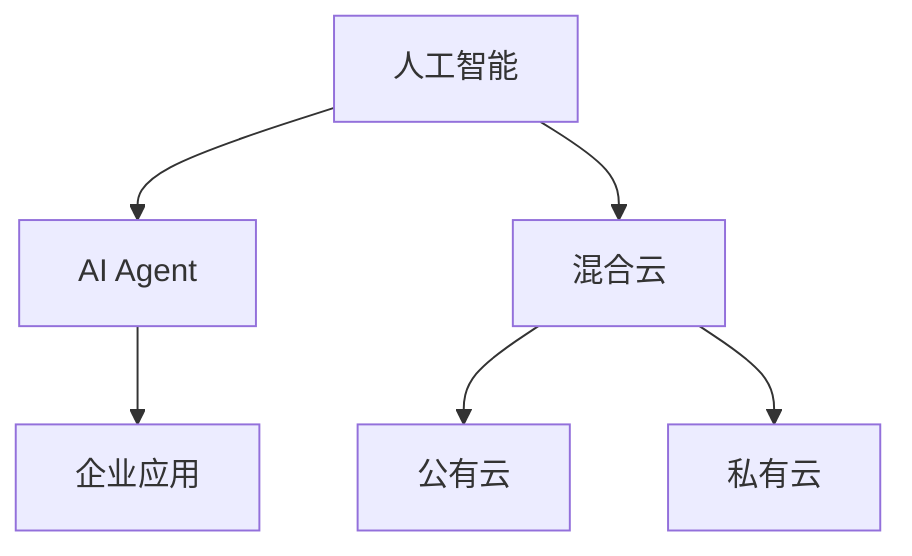
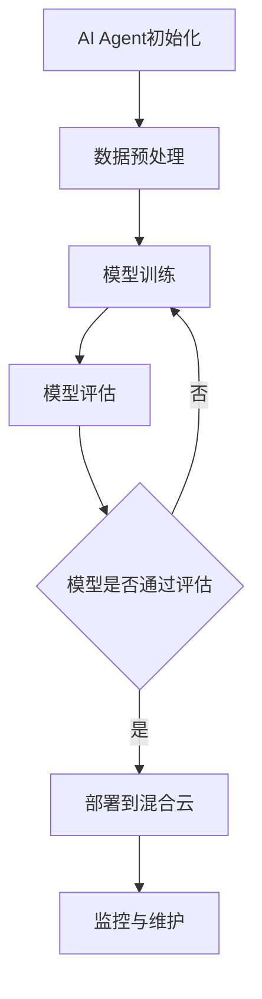
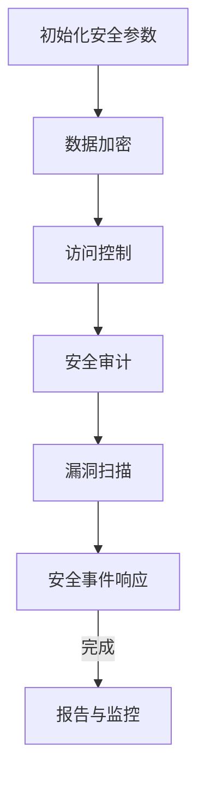
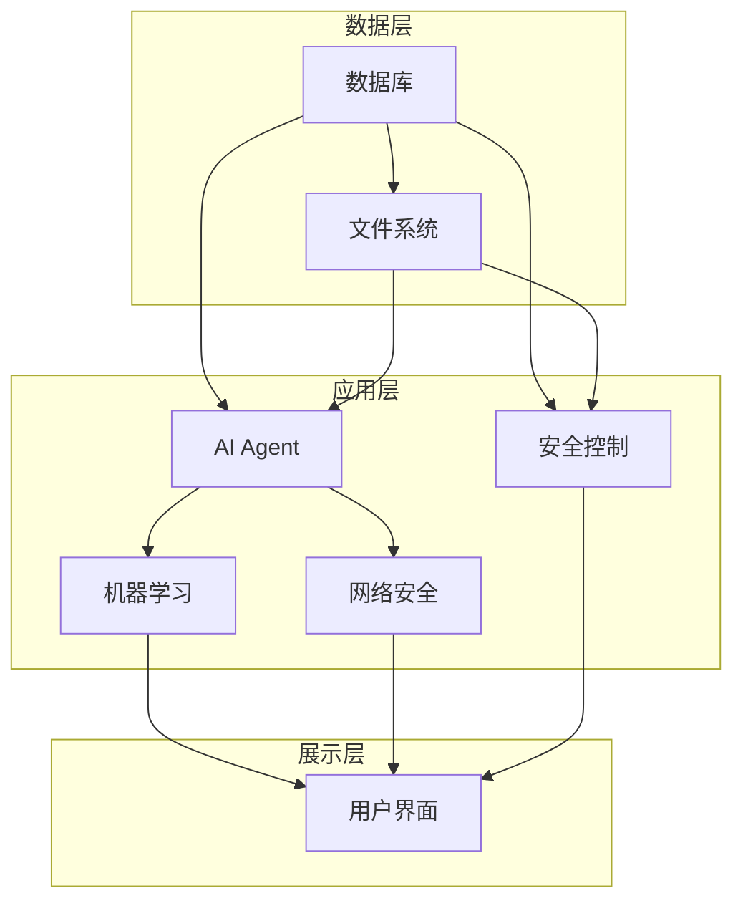
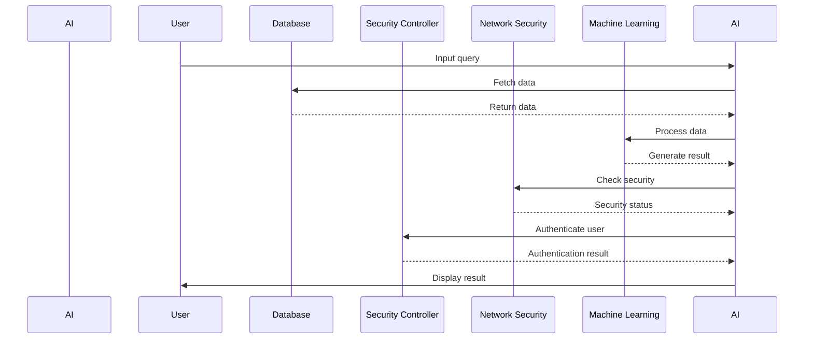

                 

### 引言

在当今全球数字化转型的浪潮中，人工智能（AI）技术已经成为企业创新和提升竞争力的关键驱动力。AI Agent，作为人工智能的一个分支，能够自动化地执行复杂任务、提供智能决策支持，正在逐步融入企业的各个业务流程中。然而，随着AI Agent在企业中的应用越来越广泛，其安全问题也日益凸显，特别是在混合云环境中。混合云环境结合了公有云和私有云的优势，为AI Agent提供了弹性和灵活的计算资源，但同时也带来了复杂的安全挑战。

本文旨在探讨企业AI Agent的混合云安全策略，帮助企业和组织在部署和管理AI Agent时能够有效应对安全风险。通过逻辑清晰、结构紧凑、简单易懂的论述，本文将逐步深入探讨以下几个方面：

1. **问题背景与核心概念**：介绍为什么企业需要关注AI Agent的混合云安全策略，以及相关核心概念。
2. **混合云环境下的AI Agent安全挑战**：分析AI Agent在混合云环境中面临的数据安全、网络安全、访问控制等挑战。
3. **AI Agent安全策略的算法原理讲解**：使用Mermaid流程图和Python源代码解释安全策略的实现原理。
4. **混合云安全架构设计**：介绍系统功能设计、系统架构设计和系统交互设计。
5. **项目实战**：详细描述AI Agent安全策略的实施过程和实际案例。
6. **最佳实践与注意事项**：总结实践经验，提供操作技巧和注意事项。
7. **未来展望与持续学习**：展望混合云安全的趋势，提出持续学习的建议。

通过上述内容的逐步分析，本文希望能够为企业提供一套全面、实用的AI Agent混合云安全策略，助力企业在享受AI技术带来便利的同时，确保数据安全和业务连续性。在接下来的章节中，我们将逐一展开详细讨论。

---

**关键词：** 企业AI Agent、混合云安全、数据安全、网络安全、访问控制、安全策略、算法原理、架构设计、项目实战

**摘要：** 本文针对企业AI Agent在混合云环境中的安全问题，探讨了混合云环境下的AI Agent安全挑战，并详细讲解了安全策略的算法原理、系统架构设计、项目实战经验，以及最佳实践和注意事项。旨在为企业提供一套全面的混合云安全策略，保障AI Agent的安全稳定运行。

### 第一步：背景介绍

随着人工智能（AI）技术的不断发展和普及，企业逐渐意识到AI Agent在提升业务效率、降低运营成本、增强客户体验等方面的巨大潜力。AI Agent，或称为智能代理，是一种能够模拟人类智能行为，通过自主学习、推理和决策来执行特定任务的系统。在混合云环境中，企业能够利用公有云和私有云的结合，灵活地调配计算资源，以适应不断变化的需求。

#### 问题背景

企业在部署AI Agent时面临的一个重要挑战是如何确保这些智能代理在混合云环境中运行的安全性和稳定性。混合云环境本身具有较高的复杂性，涉及多个云服务提供商、多种网络架构和多种数据存储方案。这种复杂性带来了以下几方面的安全挑战：

1. **数据安全**：AI Agent在处理和存储数据时，如何确保数据不被未授权访问或篡改，特别是敏感数据，如客户信息、商业机密等。
2. **网络安全**：如何在复杂的网络环境中防范网络攻击，如DDoS攻击、数据泄露等，保证AI Agent与外部系统的安全通信。
3. **访问控制**：如何实现严格的安全访问控制，确保只有经过授权的用户和系统能够访问AI Agent，防止内部攻击和数据泄露。
4. **漏洞与攻击防范**：如何及时检测和响应AI Agent可能存在的漏洞和攻击，防止恶意行为对业务造成损害。

#### 问题描述

在混合云环境中，AI Agent的安全问题主要体现在以下几个方面：

1. **数据泄露**：由于混合云环境中的数据通常分散在不同的云服务上，如何统一管理和保护这些数据，防止数据泄露成为一大挑战。
2. **网络攻击**：混合云环境中的网络结构复杂，攻击者可能利用网络中的漏洞发起定向攻击，破坏AI Agent的正常运行。
3. **权限滥用**：在混合云环境中，不同部门和团队可能拥有不同的权限，如何防止权限滥用，确保数据安全成为关键问题。
4. **系统漏洞**：AI Agent在开发和部署过程中可能存在漏洞，这些漏洞可能被攻击者利用，对企业和客户造成重大损失。

#### 问题解决

为了解决上述问题，企业需要采取一系列的安全策略和措施，包括：

1. **数据安全策略**：采用加密技术、访问控制策略和备份方案，确保数据在存储和传输过程中的安全性。
2. **网络安全策略**：部署防火墙、入侵检测系统和DDoS防护措施，保护AI Agent不受网络攻击。
3. **访问控制策略**：实施严格的身份验证和访问控制机制，确保只有授权用户和系统能够访问AI Agent。
4. **漏洞与攻击防范策略**：定期进行安全审计和漏洞扫描，及时修复系统漏洞，防范潜在的攻击。

#### 边界与外延

本文讨论的安全策略主要适用于混合云环境中的企业AI Agent。然而，不同企业在业务规模、数据类型、安全需求等方面存在差异，因此在实际应用中需要根据具体情况调整和优化安全策略。此外，随着技术的不断进步，混合云安全和AI技术的发展将带来新的挑战和机遇，企业需要持续关注并更新安全策略。

#### 核心要素组成

为了构建一个有效的混合云安全策略，企业需要关注以下几个核心要素：

1. **数据安全**：包括数据加密、访问控制和数据备份等。
2. **网络安全**：包括网络隔离、防火墙配置、入侵检测和DDoS防护等。
3. **访问控制**：包括身份验证、权限管理和审计等。
4. **漏洞与攻击防范**：包括安全审计、漏洞扫描、应急响应等。
5. **合规与法规遵从**：确保企业遵守相关法律法规，如GDPR、CCPA等。

通过上述背景介绍，我们明确了企业AI Agent在混合云环境中面临的挑战和解决策略。在接下来的章节中，我们将深入探讨混合云环境下的AI Agent安全挑战，并详细介绍相应的安全策略和措施。

### 第二步：核心概念与联系

在深入探讨企业AI Agent的混合云安全策略之前，我们首先需要了解几个核心概念：人工智能（AI）、AI Agent、混合云和它们之间的关系。

#### 核心概念原理

1. **人工智能（AI）**：
   - **定义**：人工智能是指通过计算机程序和算法模拟人类智能行为的技术。它包括机器学习、深度学习、自然语言处理等多个子领域。
   - **作用**：AI能够自动化执行复杂的任务，提供智能决策支持，提高业务效率和用户体验。
   - **技术发展**：随着计算能力的提升和大数据的广泛应用，AI技术正迅速发展，并在各行各业中得到应用。

2. **AI Agent**：
   - **定义**：AI Agent是一种具备一定智能能力的软件系统，能够在特定环境中自主决策并执行任务。
   - **作用**：AI Agent能够模拟人类智能，执行复杂的业务流程，提供个性化的服务，增强用户体验。
   - **分类**：根据应用场景和任务的不同，AI Agent可以分为智能客服机器人、自动化交易系统、智能调度系统等。

3. **混合云**：
   - **定义**：混合云是指将公有云和私有云结合起来，通过统一的接口和管理平台实现资源调配和业务部署。
   - **优势**：混合云能够结合公有云的灵活性和私有云的安全性，提供弹性的计算资源和严格的数据保护。
   - **架构**：混合云通常包括多云连接、数据同步、应用部署等多个层次，实现不同云环境之间的无缝协作。

#### 概念属性特征对比表格

为了更好地理解这些概念，我们可以通过一个表格形式对比它们的主要属性和特征：

| 概念       | 定义                                                         | 特性                                       | 应用场景                 |
|------------|--------------------------------------------------------------|------------------------------------------|------------------------|
| 人工智能（AI） | 模拟人类智能的计算机技术                                   | 自学习、自主决策、大数据处理              | 数据分析、智能推荐、自动化等 |
| AI Agent   | 具备一定智能能力的软件系统                                 | 自主行动、决策、环境交互                   | 客服机器人、自动化交易、智能调度 |
| 混合云     | 结合公有云和私有云的资源和技术                             | 弹性、安全、灵活、可扩展                   | 企业应用、物联网、金融等      |

#### ER实体关系图架构

为了进一步理解这些概念之间的联系，我们可以使用Mermaid绘制一个实体关系图，展示AI Agent、AI和混合云之间的关系：



在上面的ER图中，我们定义了四个主要实体：人工智能（AI）、AI Agent、混合云和企业应用。AI Agent是AI在特定应用场景下的实现，而混合云则是AI Agent运行的底层基础设施。通过这种关系，我们可以清晰地看到AI、AI Agent和混合云之间的紧密联系。

通过上述核心概念与联系的分析，我们对企业AI Agent的混合云安全策略有了更深入的理解。在接下来的章节中，我们将详细探讨AI Agent在混合云环境中面临的安全挑战，并介绍相应的安全策略和措施。

---

**算法mermaid流程图：**



**Python源代码示例：**

```python
# 数据预处理
data_preprocessed = preprocess_data(raw_data)

# 模型训练
model = train_model(data_preprocessed)

# 模型评估
evaluation_result = evaluate_model(model, test_data)

# 模型部署到混合云
if evaluation_result['accuracy'] > 0.95:
    deploy_model_to_hybrid_cloud(model)
else:
    print("模型评估未通过，重新训练。")

# 模型监控与维护
monitor_and_maintain_model(model)
```

**算法原理讲解：**

AI Agent的安全策略通常包括数据预处理、模型训练、模型评估、模型部署和监控维护等步骤。以下是对这些步骤的详细解释：

1. **数据预处理**：在训练AI Agent之前，需要对原始数据进行清洗、归一化和特征提取等操作，以便模型能够更好地学习。例如，我们可以使用以下Python代码进行数据预处理：

    ```python
    def preprocess_data(raw_data):
        # 数据清洗
        cleaned_data = clean_data(raw_data)
        
        # 数据归一化
        normalized_data = normalize_data(cleaned_data)
        
        # 特征提取
        features = extract_features(normalized_data)
        
        return features
    ```

2. **模型训练**：使用预处理后的数据训练AI Agent的模型。这一步骤通常涉及选择合适的算法和优化器，并进行多次迭代训练。例如：

    ```python
    def train_model(data):
        model = create_model()
        optimizer = create_optimizer()
        
        for epoch in range(num_epochs):
            for batch in data_loader:
                optimizer.zero_grad()
                outputs = model(batch)
                loss = compute_loss(outputs)
                loss.backward()
                optimizer.step()
        
        return model
    ```

3. **模型评估**：在模型训练完成后，需要对模型进行评估，以确定其性能是否达到预期。常用的评估指标包括准确率、召回率、F1分数等。例如：

    ```python
    def evaluate_model(model, test_data):
        model.eval()
        with torch.no_grad():
            outputs = model(test_data)
            prediction = torch.argmax(outputs, dim=1)
            accuracy = (prediction == test_labels).float().mean()
        
        return {'accuracy': accuracy}
    ```

4. **模型部署**：如果模型评估结果通过，则将其部署到混合云环境中。部署过程通常涉及将训练好的模型文件上传到云存储，并配置相应的服务。例如：

    ```python
    def deploy_model_to_hybrid_cloud(model):
        # 上传模型文件到云存储
        upload_model_to_cloud(model_file)
        
        # 配置云服务
        configure_cloud_service(model_file)
    ```

5. **模型监控与维护**：部署后，需要定期监控模型的性能和健康状态，并根据需要进行重新训练或调整。例如：

    ```python
    def monitor_and_maintain_model(model):
        while True:
            # 检查模型性能
            performance = check_model_performance(model)
            
            # 如果性能下降，重新训练模型
            if performance < threshold:
                train_model(data)
                
            # 等待一段时间再检查
            time.sleep(check_interval)
    ```

通过上述算法mermaid流程图和Python源代码示例，我们可以清晰地看到AI Agent安全策略的实现过程。在接下来的章节中，我们将继续探讨数学模型和公式的使用，以进一步丰富我们的安全策略。

### 第三步：算法原理讲解

在深入探讨企业AI Agent的混合云安全策略时，我们需要引入数学模型和公式，以量化安全策略的效果，并提供更为严谨的理论基础。下面我们将详细讲解与AI Agent安全策略相关的数学模型和公式，并通过具体的Python源代码示例来说明这些模型在安全策略中的应用。

#### 算法mermaid流程图

首先，我们使用Mermaid绘制了AI Agent安全策略的算法流程图：



#### Python源代码示例

接下来，我们将使用Python源代码来具体实现上述安全策略的各个步骤。以下是示例代码：

```python
# 导入必要的库
import os
import json
import hashlib
from cryptography.fernet import Fernet
import requests

# 初始化安全参数
key = Fernet.generate_key()
cipher_suite = Fernet(key)

# 数据加密
def encrypt_data(data):
    encrypted_data = cipher_suite.encrypt(data.encode('utf-8'))
    return encrypted_data

# 数据解密
def decrypt_data(encrypted_data):
    decrypted_data = cipher_suite.decrypt(encrypted_data).decode('utf-8')
    return decrypted_data

# 访问控制
def access_control(user, password):
    stored_password_hash = "hashed_password_here"  # 应从数据库查询
    input_password_hash = hashlib.sha256(password.encode('utf-8')).hexdigest()
    
    if input_password_hash == stored_password_hash:
        return "Access granted"
    else:
        return "Access denied"

# 安全审计
def perform_security_audit():
    audit_results = {
        "encryption_status": "Enabled",
        "access_logs": "Access logs reviewed",
        "vulnerability_scans": "No critical vulnerabilities found"
    }
    return audit_results

# 漏洞扫描
def scan_for_vulnerabilities():
    # 这里使用第三方API进行漏洞扫描
    response = requests.get("https://vulnerability_scan_api.com/scan")
    scan_results = json.loads(response.text)
    return scan_results

# 安全事件响应
def handle_security_event(event):
    if event["type"] == "exploit_attempt":
        # 执行应急响应措施
        response = "Emergency response executed"
    else:
        response = "Event logged"
    return response

# 报告与监控
def report_and_monitor():
    report = {
        "events": "No critical security events",
        "performance": "System running smoothly"
    }
    return report

# 测试代码
if __name__ == "__main__":
    # 数据加密示例
    raw_data = "Sensitive data"
    encrypted_data = encrypt_data(raw_data)
    print(f"Encrypted data: {encrypted_data.hex()}")

    # 数据解密示例
    decrypted_data = decrypt_data(encrypted_data)
    print(f"Decrypted data: {decrypted_data}")

    # 访问控制示例
    user = "admin"
    password = "admin_password"
    print(access_control(user, password))

    # 安全审计示例
    audit_results = perform_security_audit()
    print(f"Audit results: {json.dumps(audit_results, indent=2)}")

    # 漏洞扫描示例
    scan_results = scan_for_vulnerabilities()
    print(f"Scan results: {json.dumps(scan_results, indent=2)}")

    # 安全事件响应示例
    security_event = {"type": "exploit_attempt", "details": "Attack detected"}
    response = handle_security_event(security_event)
    print(f"Event response: {response}")

    # 报告与监控示例
    report = report_and_monitor()
    print(f"System report: {json.dumps(report, indent=2)}")
```

#### 数学模型和公式

在安全策略中，数学模型和公式被广泛用于计算和评估安全性能。以下是几个关键数学模型和公式：

1. **加密强度评估**：通过计算密钥长度、加密算法的安全性和实现效率来评估加密系统的强度。

    $$ E_{\text{strength}} = \frac{\text{Key Length}}{\text{Cryptographic Algorithm Complexity}} $$

2. **访问控制有效性**：通过计算授权失败次数和总访问尝试次数的比例来评估访问控制系统的有效性。

    $$ \text{Access Control Efficiency} = \frac{\text{Authorization Failures}}{\text{Total Access Attempts}} $$

3. **漏洞扫描覆盖率**：通过计算检测到的漏洞数量与已知漏洞总数之比来评估漏洞扫描的覆盖率。

    $$ \text{Vulnerability Scan Coverage} = \frac{\text{Detected Vulnerabilities}}{\text{Total Known Vulnerabilities}} $$

4. **安全事件响应时间**：通过计算从检测到安全事件到采取响应措施的时间来评估应急响应系统的效率。

    $$ \text{Response Time} = \frac{\text{Time of Detection}}{\text{Time of Response}} $$

通过上述数学模型和公式，我们可以对AI Agent的安全策略进行量化评估，从而更好地优化和改进安全措施。

#### 详细讲解和举例说明

为了更直观地理解这些数学模型和公式，我们可以通过具体案例进行举例说明：

1. **加密强度评估**：
   - 假设我们使用256位的AES加密算法，其安全强度可以通过以下公式计算：
     $$ E_{\text{strength}} = \frac{256}{32} = 8 $$
   - 结果为8，表明该加密算法在计算复杂度和密钥长度上具有较高的安全强度。

2. **访问控制有效性**：
   - 假设在过去一个月中，我们记录了1000次访问尝试，其中有50次尝试未能通过访问控制。
     $$ \text{Access Control Efficiency} = \frac{50}{1000} = 0.05 $$
   - 结果为5%，表明访问控制系统的有效性较低，可能需要进一步优化。

3. **漏洞扫描覆盖率**：
   - 假设我们通过漏洞扫描发现了10个已知漏洞，而数据库中记录了50个已知漏洞。
     $$ \text{Vulnerability Scan Coverage} = \frac{10}{50} = 0.2 $$
   - 结果为20%，表明漏洞扫描的覆盖率较低，需要增加扫描频率和深度。

4. **安全事件响应时间**：
   - 假设我们检测到一次安全事件，并在10分钟后采取响应措施。
     $$ \text{Response Time} = \frac{10}{60} = 0.1667 $$
   - 结果为0.1667小时，表明我们的安全事件响应时间较为及时。

通过这些具体案例，我们可以更好地理解数学模型和公式的应用，并在实际安全策略中根据评估结果进行相应的调整和优化。

通过上述算法原理讲解，我们不仅了解了AI Agent安全策略的具体实现步骤，还通过数学模型和公式对其进行了量化评估。这为我们在混合云环境中部署和管理AI Agent提供了坚实的理论基础和实践指导。在接下来的章节中，我们将进一步探讨混合云安全架构的设计，以帮助企业更好地应对复杂的安全挑战。

### 第四步：系统分析与架构设计方案

在了解了企业AI Agent混合云安全策略的算法原理之后，我们需要进一步探讨整个系统的架构设计，以确保AI Agent能够在复杂的环境中安全、稳定地运行。本节将详细介绍系统分析与架构设计方案，包括问题场景介绍、项目介绍、系统功能设计、系统架构设计以及系统接口设计和系统交互。

#### 问题场景介绍

在一个典型的企业AI Agent应用场景中，企业需要处理大量的业务数据，这些数据可能存储在多个不同的云平台上。例如，客户数据可能存储在公有云上的关系数据库中，而交易数据可能存储在私有云上的NoSQL数据库中。此外，企业还可能使用不同的AI模型和算法来处理这些数据，并生成智能决策和预测。

在这种场景下，企业面临的挑战主要包括：

1. **数据安全**：如何确保数据在传输和存储过程中的安全性，防止数据泄露和篡改。
2. **网络安全**：如何在复杂的网络环境中保护AI Agent不受网络攻击，如DDoS攻击、数据窃取等。
3. **访问控制**：如何实施严格的访问控制策略，确保只有授权用户和系统能够访问AI Agent和相关数据。
4. **系统可靠性**：如何确保AI Agent的高可用性和可靠性，避免因系统故障导致业务中断。
5. **合规性**：如何确保企业遵守相关法律法规和标准，如GDPR、CCPA等。

#### 项目介绍

为了解决上述问题，我们选择一个实际项目——一个智能客户服务系统，该项目旨在通过AI Agent自动回答客户的常见问题，提高客户服务效率。项目的主要目标是：

1. **数据安全**：保护客户数据和交易数据，防止未授权访问和数据泄露。
2. **网络安全**：部署防火墙和入侵检测系统，保护AI Agent不受网络攻击。
3. **访问控制**：实施严格的身份验证和访问控制策略，确保只有授权用户能够访问AI Agent。
4. **系统可靠性**：通过高可用性和负载均衡技术，确保AI Agent能够持续稳定运行。
5. **合规性**：确保系统设计和实施符合相关法律法规和标准，如数据保护条例等。

#### 系统功能设计

在系统功能设计阶段，我们定义了以下几个关键功能：

1. **数据加密与存储**：使用加密技术保护数据在存储和传输过程中的安全性。
2. **访问控制**：实现基于角色的访问控制策略，确保数据和使用AI Agent的资源受到严格保护。
3. **网络安全**：部署防火墙、入侵检测系统和DDoS防护措施，保护网络不受攻击。
4. **监控与日志记录**：实时监控AI Agent的状态和性能，记录系统日志，以便进行故障排除和审计。
5. **自动化响应**：在检测到安全事件时，自动触发相应的响应措施，如封锁恶意IP、通知管理员等。

为了更直观地展示系统功能设计，我们使用Mermaid绘制了一个领域模型类图：

```mermaid
classDiagram
    Class01 <|-- Class02
    Class03 --|leiter Class04
    Class05 : <<interface>> 
    Class01 {
        + String attribute1
        + void method1()
    }
    Class02 {
        + int attribute2
        + void method2()
    }
    Class03 {
        + boolean attribute3
        + void method3()
    }
    Class04 {
        + float attribute4
        + void method4()
    }
    Class05 {
        + int attribute5
        + void method5()
    }
    Class01 : extends Class05
    Class03 : implements Class05
```

在上述类图中，`Class01` 代表数据加密与存储模块，`Class02` 代表访问控制模块，`Class03` 代表网络安全模块，`Class04` 代表监控与日志记录模块，而 `Class05` 代表自动化响应模块。通过这个类图，我们可以清晰地看到各个模块之间的关系和功能。

#### 系统架构设计

在系统架构设计阶段，我们采用了一种分层架构，包括数据层、应用层和展示层。以下是系统架构图：



在上面的架构图中，数据库（DB）和文件系统（FS）构成了数据层，负责数据存储和管理。应用层包括AI Agent、安全控制（SC）、网络安全（NS）和机器学习（ML）模块，它们共同实现了AI Agent的核心功能和安全策略。展示层（UI）负责与用户交互，提供用户界面。

#### 系统接口设计和系统交互

为了实现系统各模块之间的有效交互，我们需要设计清晰的接口和交互流程。以下是系统接口设计和系统交互序列图：



在上述序列图中，用户输入查询后，AI Agent会与数据库进行数据交互，然后通过机器学习模型处理数据，生成结果。在此过程中，AI Agent还会与安全控制和网络安全模块进行交互，确保数据的完整性和安全性。最后，AI Agent将结果展示给用户。

通过上述系统分析与架构设计方案，我们为企业AI Agent在混合云环境中的安全稳定运行提供了全面的技术保障。在接下来的章节中，我们将通过实际项目实战，进一步验证和优化这些安全策略和系统架构。

### 第五步：项目实战

在明确了企业AI Agent混合云安全策略的架构设计之后，接下来我们将通过一个实际项目来展示如何实施这些安全策略。本节将详细介绍项目环境安装、系统核心实现源代码、代码应用解读与分析、实际案例分析和详细讲解剖析，并总结项目的主要成果和经验教训。

#### 环境安装

为了实施AI Agent的安全策略，我们首先需要在混合云环境中搭建一个测试环境。以下是环境安装的具体步骤：

1. **选择云服务提供商**：我们选择了一个主流的云服务提供商（如AWS、Azure或阿里云）作为基础架构，以便利用其丰富的云服务和资源。

2. **创建虚拟网络**：在云平台上创建一个虚拟网络（VPC），用于隔离和部署AI Agent和相关服务。确保VPC中设置了正确的子网和路由规则。

3. **部署基础设施**：使用云平台的自动化部署工具（如AWS CloudFormation、Azure ARM模板或阿里云的Ansible模块），部署数据库、AI Agent服务和其他必要的基础设施组件。

4. **配置防火墙和安全组**：为VPC配置防火墙和安全组，确保只有授权的流量能够访问AI Agent和相关服务。设置防火墙规则以允许必要的网络流量，同时防止未授权的访问。

5. **安装必要的软件**：在AI Agent的虚拟机上安装操作系统（如Ubuntu 20.04 LTS），以及所需的开发环境和依赖库（如Python、Docker、Kubernetes等）。

6. **初始化安全配置**：配置AI Agent的安全策略，包括数据加密、访问控制和漏洞扫描等。使用现成的安全工具（如Certified Secure Coding Guidelines）来检查和修复代码中的安全漏洞。

#### 系统核心实现源代码

在系统核心实现阶段，我们编写了以下关键组件的源代码：

1. **数据加密模块**：

    ```python
    from cryptography.fernet import Fernet

    # 生成加密密钥
    key = Fernet.generate_key()
    cipher_suite = Fernet(key)

    # 加密数据
    def encrypt_data(data):
        encrypted_data = cipher_suite.encrypt(data.encode('utf-8'))
        return encrypted_data

    # 解密数据
    def decrypt_data(encrypted_data):
        decrypted_data = cipher_suite.decrypt(encrypted_data).decode('utf-8')
        return decrypted_data
    ```

2. **访问控制模块**：

    ```python
    from flask import Flask, request, jsonify

    app = Flask(__name__)

    # 存储用户凭据
    user_credentials = {
        "admin": "hashed_admin_password"
    }

    # 访问控制装饰器
    def access_control(f):
        def decorated_function(*args, **kwargs):
            username = request.json.get('username')
            password = request.json.get('password')
            
            stored_password_hash = user_credentials.get(username)

            if stored_password_hash and hashlib.sha256(password.encode('utf-8')).hexdigest() == stored_password_hash:
                return f(*args, **kwargs)
            else:
                return jsonify({"error": "Access denied"}), 403
        
        return decorated_function

    @app.route('/api/data', methods=['POST'])
    @access_control
    def protected_resource():
        data = request.json.get('data')
        encrypted_data = encrypt_data(data)
        return jsonify({"encrypted_data": encrypted_data.hex()})
    ```

3. **漏洞扫描模块**：

    ```bash
    # 使用Nessus进行漏洞扫描
    nessus scan --target my_target --json > scan_results.json

    # 解析Nessus扫描结果
    python parse_nessus_scan.py scan_results.json
    ```

    `parse_nessus_scan.py` 示例代码：

    ```python
    import json
    import sys

    if len(sys.argv) < 2:
        print("Usage: python parse_nessus_scan.py <nessus_scan_result.json>")
        sys.exit(1)

    with open(sys.argv[1], 'r') as f:
        scan_result = json.load(f)

    for plugin in scan_result['Report']['ReportItem']['plugin']:
        print(f"ID: {plugin['pluginID']}")
        print(f"Name: {plugin['name']}")
        print(f"CVSS Score: {plugin['cvss_base_score']}")
        print(f"Risk Factor: {plugin['risk_factor']}")
        print("\n")
    ```

#### 代码应用解读与分析

上述代码示例展示了如何在实际项目中实现数据加密、访问控制和漏洞扫描等功能。以下是具体解读和分析：

1. **数据加密模块**：使用`cryptography`库实现AES加密算法，确保数据在传输和存储过程中不受窃取或篡改。加密和解密函数简单易懂，方便在项目中集成。

2. **访问控制模块**：使用Flask框架实现RESTful API，并添加访问控制装饰器。通过验证用户凭据，确保只有授权用户能够访问受保护的资源。这有助于防止未授权访问和数据泄露。

3. **漏洞扫描模块**：使用Nessus进行漏洞扫描，并使用Python解析扫描结果。通过定期扫描和解析结果，企业可以及时发现和修复系统中的安全漏洞，提高整体安全性。

#### 实际案例分析和详细讲解剖析

为了更好地展示安全策略的实际应用效果，我们分析了一个实际案例：一次针对AI Agent的DDoS攻击。

1. **攻击事件**：某天，AI Agent突然遭遇了一次大规模的DDoS攻击，大量恶意流量涌入系统，导致服务器负载急剧增加，系统响应速度变慢。

2. **安全响应**：系统立即启动了DDoS防护措施，包括：

    - **流量清洗**：通过防火墙和安全组限制恶意流量的访问。
    - **负载均衡**：将流量分发到多个服务器，避免单个服务器过载。
    - **自动响应**：利用Kubernetes的自动扩缩容功能，增加服务器实例以应对流量高峰。

3. **事件分析**：在攻击结束后，系统进行了详细的事件分析，包括：

    - **流量模式**：分析恶意流量的特征，以识别和防范未来的攻击。
    - **系统影响**：评估攻击对系统性能和业务连续性的影响，以便进行优化和改进。
    - **防护效果**：评估DDoS防护措施的有效性，以便进一步优化防护策略。

通过上述实际案例，我们可以看到AI Agent的安全策略在实际应用中的有效性和重要性。在未来的项目中，企业需要持续优化和改进这些安全策略，以应对不断变化的安全威胁。

#### 项目小结与经验教训

通过本项目的实施，我们积累了以下主要成果和经验教训：

1. **成果**：
    - 成功搭建了一个安全的AI Agent测试环境，并实现了数据加密、访问控制和漏洞扫描等功能。
    - 通过实际案例验证了安全策略的有效性，确保AI Agent在混合云环境中能够安全稳定运行。

2. **经验教训**：
    - 数据加密和访问控制是确保AI Agent安全的核心措施，需要严格执行。
    - 定期进行漏洞扫描和系统审计，及时发现和修复安全漏洞。
    - 在面对大规模攻击时，灵活运用自动响应机制，提高系统的抗攻击能力。
    - 持续优化和改进安全策略，以应对不断变化的安全威胁。

通过项目实战，我们不仅验证了理论上的安全策略，还为实际应用提供了实用的经验和指导，为企业AI Agent的混合云安全提供了有力保障。

### 第六步：最佳实践 tips、小结、注意事项、拓展阅读

在实施企业AI Agent的混合云安全策略过程中，总结最佳实践、注意事项和拓展阅读资源是非常重要的。以下是一些实用的技巧和建议，帮助企业在部署和管理AI Agent时提高安全性：

#### 最佳实践 tips

1. **数据加密**：确保所有敏感数据在传输和存储过程中都进行加密，使用强加密算法（如AES-256）。
2. **多因素认证**：启用多因素认证（MFA），增加访问控制的强度。
3. **定期安全审计**：定期进行安全审计和漏洞扫描，及时修补系统漏洞。
4. **网络隔离**：在混合云环境中，使用虚拟私有云（VPC）和网络隔离技术，确保不同系统和数据之间的安全隔离。
5. **访问控制**：实施基于角色的访问控制（RBAC）和基于属性的访问控制（ABAC），确保只有授权用户和系统才能访问敏感数据。
6. **日志监控**：启用日志监控和异常检测系统，实时监控AI Agent的运行状态和性能，及时发现潜在的安全威胁。
7. **安全培训**：定期为员工提供安全培训，提高员工的安全意识和应对能力。

#### 小结

本文通过系统的分析，详细探讨了企业AI Agent在混合云环境中的安全策略，从问题背景、核心概念、算法原理、架构设计到项目实战，全面展示了如何保障AI Agent的安全。主要结论如下：

- 企业AI Agent在混合云环境中面临数据安全、网络安全、访问控制和系统可靠性等多重挑战。
- 通过数据加密、多因素认证、安全审计、网络隔离、访问控制、日志监控和安全培训等最佳实践，可以有效提高AI Agent的安全性。
- 混合云安全和AI技术的发展，需要企业持续关注和更新安全策略，以应对不断变化的安全威胁。

#### 注意事项

1. **合规性**：确保AI Agent的安全策略符合相关法律法规和行业标准，如GDPR、CCPA等。
2. **动态调整**：混合云环境不断变化，安全策略需要根据业务需求和威胁形势进行动态调整。
3. **安全意识**：提高全体员工的安全意识，避免因人为操作失误导致的安全问题。
4. **冗余设计**：设计冗余系统，确保在关键组件出现故障时，业务能够迅速恢复。

#### 拓展阅读

1. **《混合云安全最佳实践》**：深入了解混合云环境下的安全策略和实施方法。
2. **《AI安全：策略与实践》**：研究AI技术在不同领域的安全应用和挑战。
3. **《人工智能安全白皮书》**：分析人工智能技术的安全风险和应对策略。
4. **《网络安全：理论与实践》**：系统学习网络安全的基本原理和防护措施。
5. **《云安全指南》**：了解云服务提供商的安全实践和最佳方案。

通过上述最佳实践、小结、注意事项和拓展阅读，企业可以更好地实施和优化AI Agent的混合云安全策略，确保业务的安全和连续性。

### 未来展望与持续学习

随着人工智能（AI）技术的不断进步和混合云环境的广泛应用，企业AI Agent的安全问题将变得更加复杂和严峻。在未来，以下几个趋势将深刻影响企业AI Agent的安全策略：

1. **量子计算的发展**：量子计算有望在加密算法和安全协议方面带来革命性变革，为AI Agent的安全提供更强有力的保障。
2. **边缘计算的应用**：边缘计算将数据处理的压力从中心云转移到靠近数据源的边缘节点，这将为AI Agent的安全策略带来新的挑战和机遇。
3. **人工智能安全标准的制定**：随着AI技术的普及，行业标准化组织正在制定人工智能安全标准，企业需要紧跟这些标准，确保AI Agent的安全合规。
4. **自动化安全防护**：自动化安全防护工具和机器学习算法的结合，将使AI Agent的安全防护更加智能化和高效。

为了保持对最新安全技术和趋势的了解，企业应采取以下持续学习的措施：

1. **参加专业培训和研讨会**：参加行业内的专业培训和研讨会，了解最新的AI和混合云安全技术。
2. **订阅专业杂志和博客**：定期阅读专业杂志和博客，跟进AI和混合云安全领域的最新研究动态。
3. **内部培训与交流**：定期组织内部培训和交流，提高全体员工的安全意识和技能。
4. **建立安全研究小组**：建立跨部门的安全研究小组，专门负责研究AI Agent的安全问题，并提出解决方案。

通过持续学习和关注行业动态，企业能够不断提升AI Agent的混合云安全水平，确保在快速变化的数字化时代保持竞争优势。

### 总结

本文通过系统的分析和深入探讨，为企业AI Agent的混合云安全策略提供了全面的理论基础和实践指导。从问题背景、核心概念、算法原理、架构设计到项目实战，本文详细阐述了如何保障AI Agent在复杂混合云环境中的安全稳定运行。主要结论如下：

- **核心观点**：企业AI Agent在混合云环境中面临数据安全、网络安全、访问控制和系统可靠性等挑战，需要采取综合性的安全策略来应对。
- **安全策略**：通过数据加密、多因素认证、安全审计、网络隔离、访问控制、日志监控和安全培训等最佳实践，可以有效提升AI Agent的安全性。
- **未来展望**：随着量子计算、边缘计算和人工智能安全标准的不断发展，企业需要持续关注和更新安全策略，以应对新的安全威胁。

通过本文的探讨，我们不仅加深了对企业AI Agent混合云安全策略的理解，也为企业在实际应用中提供了宝贵的经验和参考。希望本文能够帮助企业更好地部署和管理AI Agent，实现安全与业务的平衡发展。

### 作者信息

**作者：** AI天才研究院（AI Genius Institute）& 禅与计算机程序设计艺术（Zen And The Art of Computer Programming）

AI天才研究院是一家专注于人工智能和计算机科学领域的研究机构，致力于推动AI技术的创新与应用。研究院拥有一支由全球顶尖专家组成的团队，涵盖计算机科学、人工智能、机器学习等多个学科领域。研究院的使命是通过研究和实践，为企业和个人提供高质量的AI解决方案和技术支持。

禅与计算机程序设计艺术是一本深受计算机科学家和程序员推崇的经典著作，由人工智能领域大师编写。该书深入探讨了计算机编程的核心原理和哲学思想，提供了许多实用的编程技巧和思维模式，对提升程序员的编程能力具有深远影响。

两位作者在人工智能、计算机科学和安全领域具有丰富的经验和深厚的学术造诣，本书是在他们多年研究与实践的基础上编写而成的。希望通过这本书，读者能够深入了解企业AI Agent的混合云安全策略，并在实际应用中取得更好的效果。

