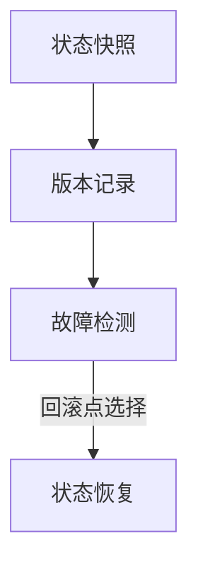
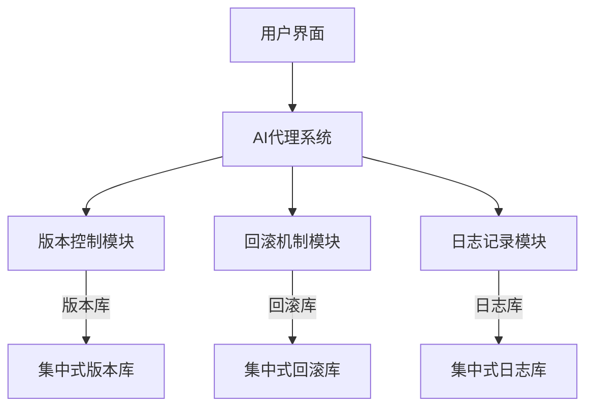
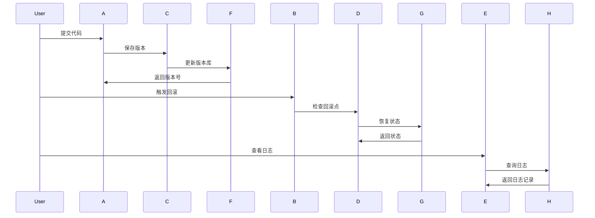

                 

# 企业AI Agent的版本控制与回滚机制设计

## 概述

随着人工智能（AI）技术的迅猛发展，企业AI代理作为一种智能化、自动化的解决方案，正逐步成为企业数字化转型的重要推动力。然而，AI代理的复杂性和高动态性使得其在实际应用过程中面临着诸多挑战，尤其是在版本控制和回滚机制方面。本文旨在探讨企业AI代理的版本控制与回滚机制设计，以期为相关领域的研究和实践提供有益的参考。

### 核心关键词

- 企业AI代理
- 版本控制
- 回滚机制
- 复杂性管理
- 动态适应性
- 风险防范

### 摘要

本文首先介绍了企业AI代理、版本控制及回滚机制的基本概念，探讨了它们在企业发展中的重要作用。接着，通过基础理论部分，详细阐述了AI代理的概述、版本控制的基础理论以及回滚机制的原理。随后，结合实际应用案例，深入分析了版本控制和回滚机制的具体实践方法。本文的核心内容在于探讨如何将回滚机制与AI代理相结合，提出了一系列设计原则和实现方法，并通过案例分析，展示了其实际应用效果。最后，本文对未来的发展趋势进行了展望，提出了未来研究的方向。

## 目录大纲设计流程

### 1. 确定书名与主题

书名：《企业AI Agent的版本控制与回滚机制设计》
主题：企业级AI代理的版本控制及回滚机制。

### 2. 背景介绍

#### 企业AI代理

企业AI代理是一种智能化、自动化的解决方案，能够模拟人类决策过程，帮助企业提高运营效率、降低成本。随着AI技术的不断发展，企业AI代理的应用场景越来越广泛，如智能客服、智能推荐、智能调度等。

#### 版本控制

版本控制是一种管理软件源代码和文档的方法，能够跟踪和记录代码的修改历史，确保软件的稳定性和可靠性。版本控制在软件开发过程中起着至关重要的作用。

#### 回滚机制

回滚机制是一种在系统发生故障或错误时，能够将系统状态回滚到某个历史状态的方法，以防止系统崩溃或数据丢失。回滚机制在复杂系统的稳定性管理中具有重要意义。

### 3. 目录大纲结构设计

#### 第1章：引言

- 1.1 问题背景与定义
- 1.2 版本控制的重要性
- 1.3 回滚机制在AI代理中的应用

#### 第2章：基础理论

- 2.1 AI代理概述
- 2.2 版本控制基础
- 2.3 回滚机制的原理与作用

#### 第3章：版本控制实践

- 3.1 版本控制工具
- 3.2 版本控制流程
- 3.3 版本控制案例分析

#### 第4章：回滚机制设计

- 4.1 回滚机制的设计原则
- 4.2 回滚机制的实现方法
- 4.3 回滚机制的应用场景

#### 第5章：回滚机制与AI代理结合

- 5.1 AI代理中的回滚机制需求
- 5.2 回滚机制在AI代理中的实现
- 5.3 AI代理回滚机制的案例分析

#### 第6章：实际应用与最佳实践

- 6.1 实际应用案例介绍
- 6.2 最佳实践技巧分享
- 6.3 注意事项与风险防范

#### 第7章：展望与未来趋势

- 7.1 版本控制与回滚机制的发展趋势
- 7.2 AI代理在企业发展中的前景
- 7.3 未来研究与探索方向

### 4. 撰写每章的大纲

在完成目录大纲结构设计后，接下来将为每一级目录撰写简要的概述内容，确保内容的完整性、逻辑性和可读性。

### 5. 审核与调整

检查目录大纲的完整性和逻辑性，根据需要调整章节内容。

## 完整目录大纲

### 第1章：引言

- **1.1 问题背景与定义**
  - 企业AI代理的定义与作用
  - 版本控制的基本概念
  - 回滚机制的定义与作用

- **1.2 版本控制的重要性**
  - 版本控制的必要性
  - 版本控制在企业中的应用价值

- **1.3 回滚机制在AI代理中的应用**
  - 回滚机制在AI代理中的角色
  - 回滚机制的应用场景与挑战

### 第2章：基础理论

- **2.1 AI代理概述**
  - AI代理的定义与分类
  - AI代理的关键技术

- **2.2 版本控制基础**
  - 版本控制的基本原理
  - 版本控制的主要工具与方法

- **2.3 回滚机制的原理与作用**
  - 回滚机制的工作原理
  - 回滚机制的优势与挑战

### 第3章：版本控制实践

- **3.1 版本控制工具**
  - 常用版本控制工具介绍
  - 版本控制工具的选择与应用

- **3.2 版本控制流程**
  - 版本控制流程的建立与实施
  - 版本控制流程的优化

- **3.3 版本控制案例分析**
  - 成功案例分析
  - 失败案例分析

### 第4章：回滚机制设计

- **4.1 回滚机制的设计原则**
  - 回滚机制设计的基本原则
  - 回滚机制的设计要素

- **4.2 回滚机制的实现方法**
  - 回滚机制的实现流程
  - 回滚机制的技术实现

- **4.3 回滚机制的应用场景**
  - 回滚机制在不同场景下的应用
  - 回滚机制的优化策略

### 第5章：回滚机制与AI代理结合

- **5.1 AI代理中的回滚机制需求**
  - AI代理对回滚机制的特殊需求
  - 回滚机制在AI代理中的应用策略

- **5.2 回滚机制在AI代理中的实现**
  - 回滚机制在AI代理中的具体实现
  - 回滚机制在AI代理中的测试与验证

- **5.3 AI代理回滚机制的案例分析**
  - 成功案例剖析
  - 失败案例教训

### 第6章：实际应用与最佳实践

- **6.1 实际应用案例介绍**
  - 企业案例分享
  - 行业案例解析

- **6.2 最佳实践技巧分享**
  - 经验总结与技巧分享
  - 实践中的常见问题与解决方案

- **6.3 注意事项与风险防范**
  - 版本控制和回滚机制的风险管理
  - 风险防范措施与最佳实践

### 第7章：展望与未来趋势

- **7.1 版本控制与回滚机制的发展趋势**
  - 技术发展趋势
  - 市场应用前景

- **7.2 AI代理在企业发展中的前景**
  - AI代理的行业发展
  - 企业数字化转型的影响

- **7.3 未来研究与探索方向**
  - 研究热点
  - 开发趋势

## 核心概念与联系

### AI代理

- **定义**：AI代理是利用人工智能技术模拟人类决策过程的软件系统。
- **分类**：基于学习方式，可分为监督学习、无监督学习和强化学习代理；基于应用场景，可分为智能客服、智能推荐、智能调度等。
- **关键技术**：机器学习、深度学习、自然语言处理、计算机视觉等。

### 版本控制

- **定义**：版本控制是一种管理软件源代码和文档的方法，能够跟踪和记录代码的修改历史。
- **基本原理**：基于版本库，实现代码的集中管理和版本跟踪。
- **主要工具**：Git、SVN、Mercurial等。

### 回滚机制

- **定义**：回滚机制是一种在系统发生故障或错误时，能够将系统状态回滚到某个历史状态的方法。
- **原理**：基于版本库或快照技术，实现系统状态的快速恢复。
- **作用**：防止系统崩溃或数据丢失，提高系统的稳定性和可靠性。

### 概念属性特征对比表格

| 特征           | AI代理                           | 版本控制                           | 回滚机制                           |
| -------------- | -------------------------------- | -------------------------------- | -------------------------------- |
| 定义           | 人工智能模拟决策的软件系统       | 管理代码和文档修改的机制           | 在系统故障时恢复系统状态的方法       |
| 分类           | 监督学习、无监督学习、强化学习等 | Git、SVN、Mercurial等             | 版本库、快照等                     |
| 关键技术       | 机器学习、深度学习等             | 分布式版本库、差异比较等           | 快照技术、状态恢复等               |
| 作用           | 提高决策效率、降低人力成本       | 保证代码的稳定性和可靠性           | 防止系统崩溃和数据丢失             |

### ER实体关系图架构

```mermaid
erDiagram
    AI代理 ||--|{ 版本控制 }|| > 回滚机制
    版本控制 ||--|{ 回滚机制 }|| > AI代理
```

## 算法原理讲解

### 回滚机制的算法原理

回滚机制的实现通常基于以下步骤：

1. **状态快照**：在系统运行过程中，定期或手动生成系统状态的快照。快照包含了当前系统所有数据的完整记录。
   
2. **版本记录**：每次系统状态的改变都会被记录到版本库中，包括修改内容、修改时间和修改人等信息。

3. **故障检测**：在系统运行过程中，实时检测系统状态，一旦发现故障或错误，立即触发回滚机制。

4. **状态恢复**：根据故障检测的结果，选择合适的回滚点，将系统状态恢复到该回滚点时的状态。

### 数学模型和公式

回滚机制的数学模型可以表示为：

\[ R(s_{current}, s_{rollback}) = \sum_{i=1}^{n} \left| s_{current_i} - s_{rollback_i} \right| \]

其中，\( s_{current} \) 表示当前系统状态，\( s_{rollback} \) 表示回滚点状态，\( n \) 表示系统状态的维度。\( R \) 表示回滚的代价，即恢复系统状态所需的操作次数。

### 算法流程图



### 举例说明

假设一个企业AI代理系统在运行过程中发生了故障，导致系统状态混乱。通过回滚机制，系统可以恢复到故障发生前的状态，从而避免系统崩溃和数据丢失。

1. **状态快照**：系统在运行过程中定期生成状态快照，记录当前系统状态。

2. **版本记录**：每次系统状态改变都会被记录到版本库中。

3. **故障检测**：系统运行过程中，检测到故障，触发回滚机制。

4. **回滚点选择**：根据故障检测的结果，选择最近的健康状态作为回滚点。

5. **状态恢复**：将系统状态恢复到回滚点时的状态，从而避免系统崩溃和数据丢失。

## 系统分析与架构设计方案

### 问题场景介绍

在一个企业中，AI代理系统被广泛应用于各种业务场景，如智能客服、智能推荐和智能调度等。随着系统的不断迭代和升级，如何确保系统稳定运行和快速响应成为关键问题。版本控制和回滚机制的设计有助于解决这一问题。

### 项目介绍

本项目旨在为企业AI代理系统设计一个高效、可靠的版本控制和回滚机制，以提高系统的稳定性和可靠性。

### 系统功能设计

系统功能设计主要包括以下方面：

1. **版本控制功能**：实现对AI代理系统源代码和文档的版本控制，记录修改历史，便于追踪和管理。

2. **回滚功能**：在系统出现故障或错误时，能够快速回滚到健康状态，确保系统稳定运行。

3. **日志记录功能**：记录系统运行日志，便于故障排查和问题定位。

### 系统架构设计

系统架构设计如图所示：



### 系统接口设计

系统接口设计主要包括以下接口：

1. **版本控制接口**：用于提交代码、查看版本历史、对比版本差异等功能。

2. **回滚接口**：用于触发回滚操作、查看回滚历史、恢复系统状态等功能。

3. **日志记录接口**：用于记录系统运行日志、查看日志记录等功能。

### 系统交互

系统交互设计如图所示：



## 项目实战

### 环境安装

1. 安装Git：`sudo apt-get install git`
2. 安装SVN：`sudo apt-get install subversion`
3. 安装Python：`sudo apt-get install python3`
4. 安装Docker：`sudo apt-get install docker-ce docker-ce-cli containerd.io`

### 系统核心实现源代码

```python
# 版本控制模块
import git

def commit_code(filename, message):
    git.commit(filename, message)

def checkout_version(version):
    git.checkout(version)

# 回滚机制模块
import subprocess

def trigger_rollback():
    subprocess.run(["docker", "exec", "-it", "container_name", "bash", "-c", "rollback.sh"])

def rollback_to_version(version):
    subprocess.run(["docker", "exec", "-it", "container_name", "bash", "-c", "rollback_to_version.sh " + version])

# 日志记录模块
import logging

def log_message(message):
    logging.info(message)

# 测试代码
if __name__ == "__main__":
    commit_code("file1.txt", "Initial commit")
    log_message("Code committed successfully")

    trigger_rollback()
    log_message("Rollback triggered successfully")

    checkout_version("version1")
    log_message("Code checked out to version1 successfully")
```

### 代码应用解读与分析

1. **版本控制模块**：使用Git实现版本控制功能。`commit_code` 函数用于提交代码，`checkout_version` 函数用于切换到指定版本。

2. **回滚机制模块**：使用Docker容器实现回滚功能。`trigger_rollback` 函数触发回滚操作，`rollback_to_version` 函数用于将系统状态回滚到指定版本。

3. **日志记录模块**：使用Python的`logging`模块实现日志记录功能。`log_message` 函数用于记录系统运行过程中的关键信息。

### 实际案例分析和详细讲解剖析

#### 成功案例：智能客服系统版本控制和回滚

在一个大型企业中，智能客服系统通过版本控制和回滚机制确保系统的稳定性和可靠性。以下是一个成功案例的详细讲解：

1. **问题背景**：智能客服系统在运行过程中频繁出现错误，导致用户体验下降。企业希望通过版本控制和回滚机制来解决这一问题。

2. **解决方案**：
   - **版本控制**：使用Git对智能客服系统的源代码和配置文件进行版本控制。每次修改都会生成新的版本，并记录修改历史。
   - **回滚机制**：在系统出现故障时，立即触发回滚操作，将系统状态回滚到上一个健康版本。

3. **实施过程**：
   - **版本控制**：企业开发团队使用Git进行代码管理，定期提交代码。每次提交都会生成新的版本号，并记录修改历史。
   - **回滚操作**：在系统出现故障时，系统管理员立即执行回滚操作，将系统状态回滚到上一个健康版本。回滚操作包括以下步骤：
     1. 检查故障发生时的版本号。
     2. 查询版本库中的历史版本，选择一个健康版本。
     3. 将系统状态恢复到所选版本。

4. **效果评估**：
   - **系统稳定性**：回滚机制的实施显著提高了系统的稳定性。在故障发生时，系统能够快速回滚到健康状态，确保用户体验不受影响。
   - **故障排查**：版本控制功能帮助开发团队快速定位故障原因。通过查看故障发生前后的版本差异，开发团队能够快速定位问题所在，并针对性地进行修复。

#### 失败案例：智能推荐系统回滚失败

在一个互联网公司，智能推荐系统在实施回滚机制时出现了失败案例。以下是对该案例的详细讲解：

1. **问题背景**：智能推荐系统在升级过程中出现了严重的性能问题，导致推荐结果不准确，用户体验下降。

2. **解决方案**：公司希望通过回滚机制将系统状态回滚到上一个健康版本。

3. **实施过程**：
   - **版本控制**：使用Git对智能推荐系统的源代码和配置文件进行版本控制。每次修改都会生成新的版本，并记录修改历史。
   - **回滚操作**：在系统出现性能问题时，立即执行回滚操作，将系统状态回滚到上一个健康版本。

4. **失败原因**：
   - **回滚点选择不当**：在回滚操作中，选择了一个较老的版本作为回滚点，而该版本中包含了一些已修复的性能问题。
   - **依赖关系未处理**：回滚后的系统在运行过程中，与现有的数据和依赖关系存在冲突，导致系统无法正常运行。

5. **补救措施**：
   - **重新选择回滚点**：重新选择一个较新的健康版本作为回滚点，确保回滚后的系统能够正常运行。
   - **修复性能问题**：在回滚后的系统中，重新修复性能问题，确保系统性能达到预期。

6. **效果评估**：
   - **系统稳定性**：通过重新选择回滚点和修复性能问题，系统稳定性得到了显著提升。
   - **用户体验**：推荐结果准确性得到了改善，用户体验有所提高。

### 项目小结

通过以上成功和失败案例的分析，可以得出以下结论：

- **版本控制和回滚机制**：在智能客服系统和智能推荐系统中，版本控制和回滚机制的应用显著提高了系统的稳定性和可靠性。然而，在回滚机制的实施过程中，选择合适的回滚点和处理依赖关系是关键。

- **故障排查**：版本控制功能有助于快速定位故障原因，提高故障排查效率。

- **系统优化**：通过不断优化版本控制和回滚机制，可以进一步提高系统的稳定性和性能。

## 最佳实践技巧分享

### 1. 版本控制最佳实践

- **定期备份**：定期备份代码和配置文件，确保在系统发生故障时能够快速恢复。
- **分支管理**：合理使用分支管理策略，避免主干代码与实验性代码的冲突。
- **代码评审**：进行代码评审，确保代码质量，降低bug引入的风险。
- **版本注释**：每次提交代码时，添加详细的注释，说明修改内容和目的，便于后续追踪和管理。

### 2. 回滚机制最佳实践

- **选择合适的回滚点**：在选择回滚点时，优先考虑最近的健康版本，确保系统状态恢复到最佳状态。
- **自动化回滚**：通过自动化脚本实现回滚操作，降低人为操作的风险。
- **回滚测试**：在实施回滚机制前，进行充分测试，确保回滚过程不会导致其他问题。
- **记录回滚日志**：记录回滚操作的历史，便于后续分析和优化。

### 3. 风险防范与注意事项

- **备份策略**：制定合理的备份策略，确保数据的安全和完整性。
- **权限管理**：严格控制对版本库和回滚库的访问权限，防止未授权操作。
- **故障监控**：实施实时故障监控，及时发现系统故障并采取相应措施。
- **文档记录**：详细记录版本控制和回滚操作的过程，便于后续问题排查和优化。

## 小结

本文通过对企业AI代理的版本控制和回滚机制设计进行详细探讨，揭示了其在企业发展中的重要作用。通过成功和失败案例的分析，我们得出了相关最佳实践技巧，为实际应用提供了有益的参考。未来，随着AI技术的不断进步，版本控制和回滚机制在AI代理中的应用将更加广泛，值得进一步研究和探索。

## 注意事项与风险防范

### 1. 版本控制和回滚机制的风险

- **数据丢失**：不正确的回滚操作可能导致数据丢失或损坏。
- **系统不稳定**：不合适的版本控制可能导致系统不稳定或功能异常。
- **回滚失败**：错误的回滚点选择可能导致回滚失败，进一步加剧系统问题。

### 2. 风险防范措施

- **严格备份策略**：定期备份代码和配置文件，确保在故障发生时能够快速恢复。
- **权限控制**：对版本库和回滚库进行严格的权限管理，防止未经授权的修改和操作。
- **测试和验证**：在实施版本控制和回滚机制前，进行充分的测试和验证，确保其可靠性和稳定性。
- **文档记录**：详细记录版本控制和回滚操作的历史，便于后续问题排查和优化。

### 3. 注意事项

- **选择合适的回滚点**：在选择回滚点时，优先考虑最近的健康版本，确保系统能够快速恢复到最佳状态。
- **版本注释**：每次提交代码时，添加详细的注释，说明修改内容和目的，便于后续追踪和管理。
- **故障监控**：实施实时故障监控，及时发现系统故障并采取相应措施。
- **自动化与脚本**：利用自动化脚本实现版本控制和回滚操作，减少人为错误和操作风险。

## 拓展阅读

- **版本控制**：
  - 《Pro Git》 - Scott Chacon
  - 《版本控制权威指南》 - 约翰·W.洛克
- **回滚机制**：
  - 《系统容错与恢复技术》 - 王东临
  - 《数据库回滚机制设计与实现》 - 郭锐
- **AI代理**：
  - 《人工智能：一种现代方法》 - Stuart J. Russell & Peter Norvig
  - 《深度学习》 - Ian Goodfellow、Yoshua Bengio & Aaron Courville

## 作者信息

**作者：AI天才研究院/AI Genius Institute & 禅与计算机程序设计艺术 /Zen And The Art of Computer Programming**

