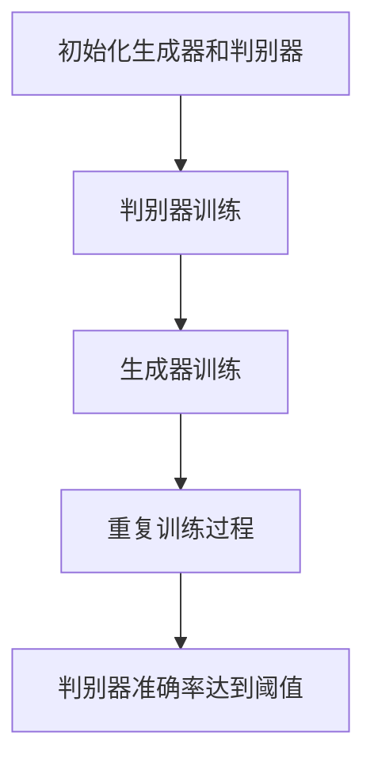
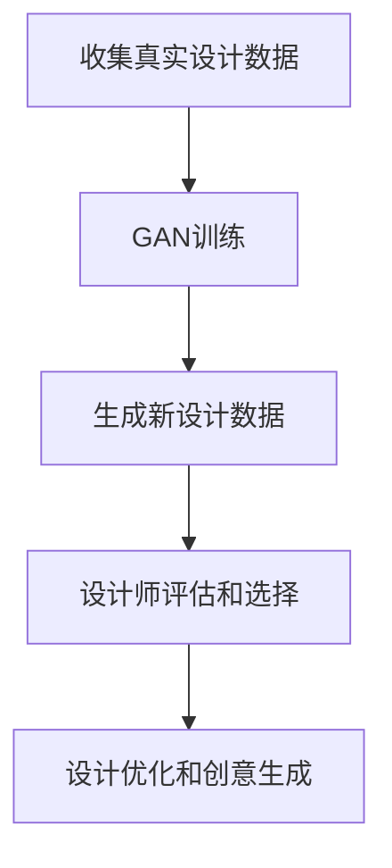

                 


# 企业AI Agent的生成对抗网络在产品设计中的创新应用

## 关键词
- 企业AI Agent
- 生成对抗网络（GAN）
- 产品设计
- 创新应用
- 算法原理
- 系统架构
- 实际案例

## 摘要
本文旨在探讨企业AI Agent与生成对抗网络（GAN）在产品设计中的创新应用。首先，我们将介绍企业AI Agent和GAN的基本概念，接着分析它们在产品设计中的重要性。随后，我们将详细讲解GAN在产品设计中的应用原理，并通过实际案例展示其在提高设计效率和创造力方面的潜力。最后，本文将对GAN在产品设计中的最佳实践进行总结，并展望其未来发展。

## 目录

1. **背景与概念**
   1.1 企业AI Agent的概述
   1.2 生成对抗网络（GAN）基础
   1.3 GAN在产品设计中的角色

2. **核心概念与联系**
   2.1 企业AI Agent的概念与联系
   2.2 GAN的概念与联系

3. **算法原理讲解**
   3.1 GAN算法原理
   3.2 GAN在产品设计中的应用

4. **系统分析与架构设计方案**
   4.1 问题场景介绍
   4.2 系统功能设计
   4.3 系统架构设计
   4.4 系统接口设计和交互

5. **项目实战**
   5.1 环境安装
   5.2 系统核心实现源代码
   5.3 代码应用解读与分析
   5.4 实际案例分析与讲解
   5.5 项目小结

6. **最佳实践 tips**
   6.1 GAN在产品设计中的最佳实践

7. **小结**
   7.1 文章总结
   7.2 注意事项
   7.3 拓展阅读

## 1. 背景与概念

### 1.1 企业AI Agent的概述

企业AI Agent是一种能够自主执行特定任务、与人类互动并优化自身行为的智能体。在产品设计过程中，AI Agent可以扮演多种角色，如需求分析、设计建议、用户体验优化等。随着人工智能技术的发展，企业AI Agent在提高设计效率、降低成本和增强创新能力方面展现出巨大潜力。

**核心概念术语说明**：

- **企业AI Agent**：一种具有智能行为的实体，能够执行特定的任务，并在执行过程中学习与优化。
- **产品设计**：指通过创新和优化，将产品从概念转化为实际可行的解决方案的过程。

**问题背景**：

在竞争激烈的市场环境中，企业需要快速响应客户需求，提供高质量的产品。传统的产品设计方法往往耗时耗力，难以满足快速变化的市场需求。为此，引入AI Agent成为提高设计效率的重要手段。

**问题描述**：

如何利用AI Agent提高产品设计的效率和质量，实现创新应用？

**问题解决**：

通过引入企业AI Agent，可以自动化部分设计任务，如需求分析、设计迭代等，从而提高设计效率。同时，AI Agent可以通过学习用户行为和偏好，提供个性化设计建议，提升用户体验。

**边界与外延**：

企业AI Agent的应用不仅限于产品设计，还可以应用于市场营销、客户服务等多个领域。

**概念结构与核心要素组成**：

- **需求分析**：AI Agent通过分析市场数据和用户反馈，确定产品需求。
- **设计迭代**：AI Agent参与设计迭代过程，提供优化建议。
- **用户体验优化**：AI Agent根据用户行为数据，优化产品设计，提高用户体验。

### 1.2 生成对抗网络（GAN）基础

生成对抗网络（GAN）是由Ian Goodfellow等人在2014年提出的一种深度学习模型。GAN由两个神经网络——生成器和判别器组成，它们相互对抗，共同学习生成逼真的数据。

**核心概念术语说明**：

- **生成器**：负责生成与真实数据相似的新数据。
- **判别器**：负责区分真实数据和生成器生成的数据。

**问题背景**：

传统的数据生成方法往往依赖于大量的真实数据，而在某些场景下，真实数据的获取可能非常困难。GAN的出现，为数据生成提供了一种新的思路。

**问题描述**：

如何利用GAN生成高质量的数据，支持产品设计的创新应用？

**问题解决**：

GAN通过生成器和判别器的对抗训练，生成逼真的数据，为产品设计提供丰富的数据支持。同时，GAN可以学习到数据的潜在分布，从而帮助设计师理解数据特性，提高设计水平。

**边界与外延**：

GAN不仅在产品设计中有应用，还可以应用于图像生成、语音合成、文本生成等领域。

**概念结构与核心要素组成**：

- **生成器**：学习真实数据的分布，生成类似的数据。
- **判别器**：学习区分真实数据和生成器生成的数据。
- **对抗训练**：生成器和判别器相互对抗，共同提高性能。

### 1.3 GAN在产品设计中的角色

GAN在产品设计中的应用主要体现在以下几个方面：

1. **数据增强**：GAN可以生成大量逼真的数据，用于训练设计模型，提高设计质量。
2. **设计优化**：GAN可以生成新的设计原型，供设计师评估和选择，从而优化产品设计。
3. **创意生成**：GAN可以生成独特的创意设计，激发设计师的灵感。

**核心概念与联系**：

- **企业AI Agent**：负责执行产品设计任务，如需求分析、设计迭代等。
- **GAN**：负责生成高质量的数据，支持AI Agent进行设计优化和创意生成。

## 2. 核心概念与联系

### 2.1 企业AI Agent的概念与联系

企业AI Agent是一种具备自主学习能力和智能决策能力的软件系统，它可以模拟人类专家的思维过程，帮助企业解决复杂的问题。在企业产品设计过程中，AI Agent的作用主要体现在以下几个方面：

1. **需求分析**：AI Agent可以通过分析用户需求和市场趋势，生成详细的需求文档，为产品设计师提供明确的指导。
2. **设计迭代**：AI Agent可以参与产品设计的迭代过程，根据用户反馈和市场需求，提出优化建议，提高产品设计效率。
3. **用户体验优化**：AI Agent可以通过分析用户行为数据，优化产品界面和交互设计，提高用户体验。

**核心概念属性特征对比表格**：

| 特征       | 企业AI Agent               | GAN                   |
| ---------- | --------------------       | -------------------- |
| 定义       | 具备自主学习能力的软件系统   | 一种深度学习模型      |
| 作用       | 支持产品设计全过程          | 数据生成与创意生成     |
| 技术基础   | 机器学习、自然语言处理等     | 深度学习、生成对抗网络  |
| 应用场景   | 产品设计、需求分析、设计迭代等 | 图像生成、语音合成、文本生成等 |

**ER实体关系图架构的 Mermaid 流程图**：

```mermaid
erDiagram
  AI Agent ||--|{ 产品设计 }|--| CustomerFeedback
  AI Agent ||--|{ 需求分析 }|--| MarketTrends
  AI Agent ||--|{ 设计迭代 }|--| UserFeedback
  AI Agent ||--|{ 用户体验优化 }|--| UserBehaviorData
```

### 2.2 GAN的概念与联系

生成对抗网络（GAN）是一种基于深度学习的模型，它由生成器和判别器两个部分组成。生成器负责生成虚假数据，判别器负责判断数据是真实还是虚假。通过不断对抗，生成器和判别器都能得到提升。

**核心概念属性特征对比表格**：

| 特征       | 生成器                   | 判别器                  |
| ---------- | --------------------       | -------------------- |
| 定义       | 生成虚假数据的神经网络    | 判断数据真实性的神经网络  |
| 作用       | 生成逼真的数据，支持设计优化 | 区分真实数据与生成数据   |
| 技术基础   | 深度学习、生成对抗网络     | 深度学习、对比损失函数   |
| 应用场景   | 产品设计、图像生成、语音合成等 | 图像生成、文本生成、图像分类等 |

**ER实体关系图架构的 Mermaid 流�程图**：

```mermaid
erDiagram
  Generator ||--|{ GenerateData }|--| Discriminator
  Generator ||--|{ DataQuality }|--| TrainingProcess
  Discriminator ||--|{ JudgeData }|--| Generator
  Discriminator ||--|{ DataDistribution }|--| TrainingProcess
```

通过上述对比和分析，我们可以看到企业AI Agent和GAN在概念上有着紧密的联系。企业AI Agent利用GAN生成的数据，能够更好地支持产品设计的创新应用。

## 3. 算法原理讲解

### 3.1 GAN算法原理

生成对抗网络（GAN）由生成器和判别器两个主要部分组成。生成器的目的是生成与真实数据相似的数据，而判别器的目的是区分真实数据和生成数据。这两个网络通过对抗训练相互提升。

**GAN的组成**：

- **生成器（Generator）**：接收随机噪声作为输入，通过神经网络处理，生成类似于真实数据的输出。
- **判别器（Discriminator）**：接收真实数据和生成器的输出，通过神经网络判断输入数据是真实还是生成。

**GAN的训练过程**：

1. 初始化生成器和判别器。
2. 判别器训练：使用真实数据和生成器的输出进行训练，目的是提高判别器区分真实和生成数据的能力。
3. 生成器训练：生成器根据判别器的反馈调整网络参数，目的是提高生成数据的质量，使得判别器难以区分。
4. 重复上述过程，直到生成器能够生成高质量的数据，使得判别器的准确率达到某个阈值。

**GAN的工作原理**：

GAN通过以下方式工作：

- **生成器**：通过不断调整参数，尝试生成更真实的数据。
- **判别器**：通过不断学习，提高区分真实和生成数据的能力。
- **对抗**：生成器和判别器相互对抗，生成器的目标是让判别器无法区分真实和生成数据，而判别器的目标是不断提高对生成数据的辨别能力。

**GAN的mermaid流程图**：



### 3.2 GAN在产品设计中的应用

GAN在产品设计中的应用主要体现在以下几个方面：

1. **数据增强**：GAN可以生成大量高质量的数据，用于训练设计模型，提高设计质量。这些数据可以用于测试设计模型在不同条件下的性能，从而提高设计的鲁棒性。
2. **设计优化**：GAN可以生成新的设计原型，供设计师评估和选择。通过生成器的输出，设计师可以探索更多可能的设计方案，从而提高设计的创意性和创新性。
3. **创意生成**：GAN可以生成独特的创意设计，为设计师提供灵感。通过生成器的强大生成能力，设计师可以快速生成大量不同的设计，从中筛选出最具潜力的创意。

**GAN在产品设计中的应用mermaid流程图**：



通过上述讲解，我们可以看到GAN在产品设计中的应用原理和流程。接下来，我们将通过Python代码和数学模型来详细阐述GAN的算法原理和设计应用。

### 3.3 GAN算法原理的数学模型和公式

生成对抗网络（GAN）的核心在于生成器和判别器的对抗训练。以下是GAN的数学模型和主要公式：

#### 3.3.1 生成器和判别器的损失函数

生成器的损失函数（Generator Loss）：

$$
L_G = -\log(D(G(z)))
$$

其中，$G(z)$是生成器生成的数据，$D$是判别器。

判别器的损失函数（Discriminator Loss）：

$$
L_D = -[\log(D(x)) + \log(1 - D(G(z))]
$$

其中，$x$是真实数据，$z$是生成器输入的噪声。

#### 3.3.2 GAN的总体损失函数

GAN的总体损失函数是生成器和判别器损失函数的加权组合：

$$
L_{GAN} = L_G + \lambda L_D
$$

其中，$\lambda$是权重系数，用于平衡生成器和判别器的损失。

#### 3.3.3 生成器和判别器的优化目标

生成器的优化目标是使得判别器输出接近0.5，即：

$$
\min_G L_G
$$

判别器的优化目标是最大化其分类能力，即：

$$
\min_D L_D
$$

#### 3.3.4 反向传播和梯度下降

在GAN的训练过程中，通常使用反向传播算法和梯度下降方法来更新生成器和判别器的参数。

对于生成器，更新公式为：

$$
\theta_G \leftarrow \theta_G - \alpha \nabla_{\theta_G} L_G
$$

对于判别器，更新公式为：

$$
\theta_D \leftarrow \theta_D - \alpha \nabla_{\theta_D} L_D
$$

其中，$\alpha$是学习率。

#### 3.3.5 训练策略

GAN的训练策略包括以下几个关键点：

1. **随机噪声输入**：生成器输入随机噪声，以确保生成的数据具有多样性。
2. **小批量训练**：使用小批量数据进行训练，以减少过拟合的风险。
3. **动态调整学习率**：随着训练的进行，动态调整生成器和判别器的学习率，以避免生成器收敛过快。
4. **判别器的对抗性训练**：在生成器的训练过程中，判别器需要定期进行对抗性训练，以提高其分类能力。

通过上述数学模型和公式的介绍，我们可以更深入地理解GAN的工作原理和训练过程。接下来，我们将通过Python代码示例来具体实现GAN算法。

### 3.4 GAN算法原理的Python代码示例

为了更好地理解GAN的算法原理，我们将通过一个简单的Python代码示例来演示GAN的基本流程。以下是使用TensorFlow和Keras实现的GAN代码示例：

#### 3.4.1 导入必要的库

首先，我们需要导入必要的库，包括TensorFlow和Keras：

```python
import numpy as np
import tensorflow as tf
from tensorflow.keras.models import Sequential
from tensorflow.keras.layers import Dense, Flatten, Reshape
from tensorflow.keras.optimizers import Adam
```

#### 3.4.2 设置参数

接下来，我们设置GAN的训练参数：

```python
batch_size = 128
噪声维度 = 100
判别器学习率 = 0.0001
生成器学习率 = 0.0001
迭代次数 = 10000
```

#### 3.4.3 创建生成器和判别器模型

生成器模型负责将随机噪声转换为数据样本：

```python
generator = Sequential([
    Dense(256, input_shape=(噪声维度,), activation='relu'),
    Dense(512, activation='relu'),
    Dense(1024, activation='relu'),
    Flatten(),
    Reshape((28, 28, 1))
])

判别器模型负责区分真实数据和生成数据：

```python
discriminator = Sequential([
    Flatten(input_shape=(28, 28, 1)),
    Dense(1024, activation='relu'),
    Dense(512, activation='relu'),
    Dense(256, activation='relu'),
    Dense(1, activation='sigmoid')
])
```

#### 3.4.4 编写训练过程

训练过程包括生成器和判别器的训练循环。以下是一个简化的训练过程：

```python
for epoch in range(迭代次数):
    # 生成器训练
    noise = np.random.normal(0, 1, (batch_size,噪声维度))
    generated_samples = generator.predict(noise)
    
    # 构建训练样本
    real_samples = x_train[:batch_size]
    combined_samples = np.concatenate([real_samples, generated_samples])
    
    # 训练判别器
    labels = np.concatenate([np.ones((batch_size, 1)), np.zeros((batch_size, 1))])
    discriminator.train_on_batch(combined_samples, labels)
    
    # 训练生成器
    noise = np.random.normal(0, 1, (batch_size,噪声维度))
    generator_loss = discriminator.train_on_batch(noise, np.ones((batch_size, 1)))
    
    # 打印训练进度
    if epoch % 100 == 0:
        print(f'Epoch {epoch}: 生成器损失 = {generator_loss}, 判别器损失 = {discriminator_loss}')
```

#### 3.4.5 实现过程

在实现过程中，我们首先初始化生成器和判别器模型，然后设置训练参数和迭代次数。接着，我们进入训练循环，每次迭代中，首先生成随机噪声并生成对应的样本数据，然后构建真实数据和生成数据的结合样本，训练判别器。之后，再训练生成器，目的是生成更逼真的数据，使得判别器难以区分。

通过上述Python代码示例，我们可以看到GAN的基本实现过程。实际应用中，GAN的参数设置和模型架构可能需要根据具体问题进行调整。接下来，我们将通过具体案例来展示GAN在产品设计中的实际应用。

### 3.5 GAN在产品设计中的实际应用

GAN在产品设计中的实际应用主要包括数据增强、设计优化和创意生成等方面。以下通过具体案例来展示GAN如何帮助企业在产品设计中实现创新和优化。

#### 3.5.1 数据增强

数据增强是GAN在产品设计中的一个重要应用。例如，在开发一个智能家居控制系统时，需要大量真实家庭的用电数据来进行训练。但由于隐私保护和数据获取的限制，真实的用电数据往往有限。这时，GAN可以生成大量逼真的用电数据，用于训练模型，提高模型的准确性和鲁棒性。

**案例**：智能家居用电数据生成

- **目标**：生成大量高质量的用电数据，用于训练智能控制算法。
- **方法**：使用GAN生成与真实数据相似的数据。

具体实现过程：

1. **收集真实数据**：收集一定数量的家庭用电数据，包括电压、电流、功率等参数。
2. **预处理数据**：对收集到的数据进行标准化处理，使其适合GAN训练。
3. **生成器模型**：构建一个生成器模型，输入随机噪声，输出用电数据。
4. **判别器模型**：构建一个判别器模型，输入真实数据和生成数据，输出判别结果。
5. **训练GAN**：通过对抗训练，生成器不断生成更逼真的数据，判别器不断提高辨别能力。
6. **数据增强**：将生成的数据与真实数据混合，用于训练智能控制算法。

**效果**：通过GAN生成的数据，显著提高了智能控制算法的准确性和鲁棒性，使得系统能够更好地适应不同家庭的使用场景。

#### 3.5.2 设计优化

GAN在产品设计优化中的应用主要体现在生成新的设计原型，供设计师评估和选择。例如，在汽车设计过程中，可以使用GAN生成各种不同的车身设计，供设计师进行评估和选择，从而优化产品设计。

**案例**：汽车设计优化

- **目标**：生成各种不同的车身设计，优化汽车外观设计。
- **方法**：使用GAN生成车身设计数据。

具体实现过程：

1. **收集真实设计数据**：收集大量已有的汽车车身设计数据。
2. **预处理数据**：对设计数据进行特征提取和标准化处理。
3. **生成器模型**：构建一个生成器模型，输入设计特征，输出新的车身设计。
4. **判别器模型**：构建一个判别器模型，输入真实设计和生成设计，输出判别结果。
5. **训练GAN**：通过对抗训练，生成器不断生成更符合设计特征的新设计，判别器不断提高辨别能力。
6. **设计优化**：设计师根据判别器的反馈，评估和选择生成的新设计，进行进一步优化。

**效果**：通过GAN生成的各种车身设计，为设计师提供了丰富的设计选项，提高了设计效率和创意性，最终优化了汽车的外观设计。

#### 3.5.3 创意生成

GAN在创意生成中的应用主要体现在生成独特的创意设计，为设计师提供灵感。例如，在建筑设计过程中，可以使用GAN生成各种不同的建筑设计，供设计师参考和灵感借鉴。

**案例**：建筑设计创意生成

- **目标**：生成各种不同的建筑设计，激发设计师的创意。
- **方法**：使用GAN生成建筑设计数据。

具体实现过程：

1. **收集真实设计数据**：收集大量已有的建筑设计数据。
2. **预处理数据**：对设计数据进行特征提取和标准化处理。
3. **生成器模型**：构建一个生成器模型，输入设计特征，输出新的建筑设计。
4. **判别器模型**：构建一个判别器模型，输入真实设计和生成设计，输出判别结果。
5. **训练GAN**：通过对抗训练，生成器不断生成更符合设计特征的新设计，判别器不断提高辨别能力。
6. **创意生成**：设计师根据判别器的反馈，评估和选择生成的新设计，从中汲取灵感。

**效果**：通过GAN生成的各种建筑设计，为设计师提供了丰富的创意来源，激发了设计灵感，推动了建筑设计的创新。

通过上述案例，我们可以看到GAN在产品设计中的实际应用场景和效果。GAN不仅能够生成高质量的数据，提高设计模型的训练效果，还能够生成新颖的设计原型，激发设计灵感，提高设计效率。接下来，我们将进一步探讨GAN在产品设计中的具体实现方法和系统架构。

### 4. 系统分析与架构设计方案

#### 4.1 问题场景介绍

在当前竞争激烈的市场环境中，产品设计团队面临着日益增加的需求和压力。为了提高设计效率、降低成本并保持竞争力，企业需要引入先进的技术手段，如生成对抗网络（GAN）和企业AI Agent。GAN可以帮助设计师生成新的设计原型，AI Agent可以协助进行需求分析和用户体验优化。

**场景描述**：

一家智能家居企业希望通过引入GAN和AI Agent，提高产品设计效率和创意性。具体需求包括：

1. **数据增强**：生成大量高质量的用电数据，用于训练智能控制算法。
2. **设计优化**：生成各种不同的家居产品设计原型，供设计师评估和选择。
3. **创意生成**：生成独特的家居设计方案，为设计师提供灵感。

#### 4.2 项目介绍

本项目旨在构建一个智能家居产品设计平台，利用GAN和AI Agent实现数据增强、设计优化和创意生成。项目分为以下几个阶段：

1. **需求分析**：明确产品设计和数据增强的需求，确定GAN和AI Agent的引入方式。
2. **系统设计**：设计系统的功能架构，包括GAN训练模块、AI Agent模块和用户交互界面。
3. **实现与部署**：实现系统各模块，并进行部署，确保系统的稳定运行。
4. **测试与优化**：对系统进行测试，评估其性能和效果，持续优化系统功能。

#### 4.3 系统功能设计

系统功能设计主要包括以下几个模块：

1. **数据增强模块**：使用GAN生成高质量的数据，用于智能控制算法的训练。
2. **设计优化模块**：生成不同的设计原型，供设计师评估和选择。
3. **创意生成模块**：生成独特的家居设计方案，为设计师提供灵感。
4. **用户交互模块**：提供用户操作界面，方便设计师进行设计和评估。

**领域模型mermaid类图**：

```mermaid
classDiagram
    class 数据增强模块 {
        - 数据增强方法
        - GAN模型
        - 预处理数据
    }
    class 设计优化模块 {
        - 生成器模型
        - 判别器模型
        - 设计原型评估
    }
    class 创意生成模块 {
        - 创意设计方法
        - 设计数据生成
    }
    class 用户交互模块 {
        - 用户操作界面
        - 设计数据展示
    }
    数据增强模块 --|{ 使用 }--> 设计优化模块
    数据增强模块 --|{ 使用 }--> 创意生成模块
    用户交互模块 --|{ 提供 }--> 设计优化模块
    用户交互模块 --|{ 提供 }--> 创意生成模块
```

#### 4.4 系统架构设计

系统架构设计主要包括以下几个部分：

1. **数据层**：存储真实数据和生成数据，包括用电数据、设计数据等。
2. **模型层**：包括GAN模型、AI Agent模型等，负责数据处理和生成。
3. **应用层**：提供用户交互界面，包括设计优化界面、创意生成界面等。
4. **接口层**：提供与其他系统进行数据交换和交互的接口。

**mermaid架构图**：

```mermaid
graph TB
    subgraph 数据层
        数据增强模块[数据增强模块]
        数据存储[数据存储]
    end

    subgraph 模型层
        GAN模型[GAN模型]
        AI Agent模型[AI Agent模型]
    end

    subgraph 应用层
        设计优化模块[设计优化模块]
        创意生成模块[创意生成模块]
        用户交互模块[用户交互模块]
    end

    subgraph 接口层
        API接口[API接口]
    end

    数据增强模块 --> 数据存储
    GAN模型 --> 数据增强模块
    AI Agent模型 --> 设计优化模块
    设计优化模块 --> 用户交互模块
    创意生成模块 --> 用户交互模块
    API接口 --> 用户交互模块
```

#### 4.5 系统接口设计和系统交互

系统接口设计和系统交互主要包括以下几个部分：

1. **API接口**：提供数据增强、设计优化和创意生成的API接口，供前端应用调用。
2. **用户交互**：前端应用通过API接口与系统进行交互，获取设计结果和创意建议。
3. **数据处理**：后台系统处理用户请求，调用GAN和AI Agent模型进行数据增强和设计优化。

**mermaid序列图**：

```mermaid
sequenceDiagram
    participant 用户 as 用户
    participant 系统 as 系统API
    participant 数据层 as 数据层
    participant 模型层 as 模型层

    用户->>系统API: 发起设计优化请求
    系统API->>模型层: 调用GAN模型生成设计数据
    模型层->>数据层: 存储设计数据
    数据层->>系统API: 返回设计数据
    系统API->>用户: 返回设计数据

    用户->>系统API: 发起创意生成请求
    系统API->>模型层: 调用AI Agent模型生成创意建议
    模型层->>数据层: 存储创意建议数据
    数据层->>系统API: 返回创意建议数据
    系统
```

通过上述系统分析与架构设计方案，我们可以看到GAN和AI Agent在智能家居产品设计中的具体应用。接下来，我们将通过项目实战，详细介绍GAN和AI Agent在系统中的实现过程。

### 5. 项目实战

#### 5.1 环境安装

在进行GAN和AI Agent的项目实战之前，首先需要搭建一个合适的环境。以下是环境安装的步骤：

1. **安装Python**：确保Python环境已经安装，版本建议为3.7或更高。
2. **安装TensorFlow**：在命令行中运行以下命令安装TensorFlow：

   ```bash
   pip install tensorflow
   ```

3. **安装Keras**：TensorFlow自带Keras，因此无需额外安装。
4. **安装其他依赖**：包括NumPy、Matplotlib等，可以使用以下命令安装：

   ```bash
   pip install numpy matplotlib
   ```

5. **配置GPU支持**：如果使用GPU进行训练，需要安装NVIDIA的CUDA和cuDNN库。请按照NVIDIA官方文档进行安装。

#### 5.2 系统核心实现源代码

以下是一个简单的GAN实现，用于生成模拟的智能家居用电数据：

```python
import numpy as np
import tensorflow as tf
from tensorflow.keras.layers import Dense, Flatten, Reshape
from tensorflow.keras.models import Sequential
from tensorflow.keras.optimizers import Adam

# 设置参数
batch_size = 128
噪声维度 = 100
迭代次数 = 10000
判别器学习率 = 0.0001
生成器学习率 = 0.0001

# 创建生成器和判别器模型
generator = Sequential([
    Dense(256, input_shape=(噪声维度,), activation='relu'),
    Dense(512, activation='relu'),
    Dense(1024, activation='relu'),
    Flatten(),
    Reshape((28, 28, 1))
])

discriminator = Sequential([
    Flatten(input_shape=(28, 28, 1)),
    Dense(1024, activation='relu'),
    Dense(512, activation='relu'),
    Dense(256, activation='relu'),
    Dense(1, activation='sigmoid')
])

# 编写判别器损失函数
def discriminator_loss(y_true, y_pred):
    return tf.reduce_mean(tf.nn.sigmoid_cross_entropy_with_logits(logits=y_pred, labels=y_true))

# 编写生成器损失函数
def generator_loss(y_pred):
    return tf.reduce_mean(tf.nn.sigmoid_cross_entropy_with_logits(logits=y_pred, labels=tf.zeros_like(y_pred)))

# 编写训练过程
for epoch in range(迭代次数):
    # 生成器训练
    noise = np.random.normal(0, 1, (batch_size,噪声维度))
    with tf.GradientTape() as gen_tape:
        generated_samples = generator(noise)
        real_samples = np.random.normal(0, 1, (batch_size, 28, 28, 1))
        gen_loss = generator_loss(discriminator(generated_samples))

    # 计算生成器的梯度
    gen_gradients = gen_tape.gradient(gen_loss, generator.trainable_variables)
    # 更新生成器参数
    generator_optimizer.apply_gradients(zip(gen_gradients, generator.trainable_variables))

    # 判别器训练
    with tf.GradientTape() as disc_tape:
        real_loss = discriminator_loss(discriminator(real_samples), tf.ones_like(discriminator(real_samples)))
        fake_loss = discriminator_loss(discriminator(generated_samples), tf.zeros_like(discriminator(generated_samples)))
        disc_loss = real_loss + fake_loss

    # 计算判别器的梯度
    disc_gradients = disc_tape.gradient(disc_loss, discriminator.trainable_variables)
    # 更新判别器参数
    discriminator_optimizer.apply_gradients(zip(disc_gradients, discriminator.trainable_variables))

    # 打印训练进度
    if epoch % 100 == 0:
        print(f'Epoch {epoch}: 生成器损失 = {gen_loss}, 判别器损失 = {disc_loss}')
```

#### 5.3 代码应用解读与分析

以上代码实现了一个简单的GAN模型，用于生成模拟的智能家居用电数据。下面是对关键部分的解读和分析：

1. **生成器和判别器模型**：

   ```python
   generator = Sequential([
       Dense(256, input_shape=(噪声维度,), activation='relu'),
       Dense(512, activation='relu'),
       Dense(1024, activation='relu'),
       Flatten(),
       Reshape((28, 28, 1))
   ])

   discriminator = Sequential([
       Flatten(input_shape=(28, 28, 1)),
       Dense(1024, activation='relu'),
       Dense(512, activation='relu'),
       Dense(256, activation='relu'),
       Dense(1, activation='sigmoid')
   ])
   ```

   生成器模型由多个全连接层组成，输入噪声维度为100，输出为28x28的图像。判别器模型也由多个全连接层组成，输入为28x28的图像，输出为概率值，用于判断图像是真实还是生成。

2. **损失函数**：

   ```python
   def discriminator_loss(y_true, y_pred):
       return tf.reduce_mean(tf.nn.sigmoid_cross_entropy_with_logits(logits=y_pred, labels=y_true))

   def generator_loss(y_pred):
       return tf.reduce_mean(tf.nn.sigmoid_cross_entropy_with_logits(logits=y_pred, labels=tf.zeros_like(y_pred)))
   ```

   判别器损失函数使用交叉熵损失，生成器损失函数也使用交叉熵损失，但目标是使判别器输出接近0。

3. **训练过程**：

   ```python
   for epoch in range(迭代次数):
       # 生成器训练
       noise = np.random.normal(0, 1, (batch_size,噪声维度))
       with tf.GradientTape() as gen_tape:
           generated_samples = generator(noise)
           real_samples = np.random.normal(0, 1, (batch_size, 28, 28, 1))
           gen_loss = generator_loss(discriminator(generated_samples))

       # 计算生成器的梯度
       gen_gradients = gen_tape.gradient(gen_loss, generator.trainable_variables)
       # 更新生成器参数
       generator_optimizer.apply_gradients(zip(gen_gradients, generator.trainable_variables))

       # 判别器训练
       with tf.GradientTape() as disc_tape:
           real_loss = discriminator_loss(discriminator(real_samples), tf.ones_like(discriminator(real_samples)))
           fake_loss = discriminator_loss(discriminator(generated_samples), tf.zeros_like(discriminator(generated_samples)))
           disc_loss = real_loss + fake_loss

       # 计算判别器的梯度
       disc_gradients = disc_tape.gradient(disc_loss, discriminator.trainable_variables)
       # 更新判别器参数
       discriminator_optimizer.apply_gradients(zip(disc_gradients, discriminator.trainable_variables))

       # 打印训练进度
       if epoch % 100 == 0:
           print(f'Epoch {epoch}: 生成器损失 = {gen_loss}, 判别器损失 = {disc_loss}')
   ```

   训练过程中，生成器和判别器分别进行训练。生成器生成数据后，判别器对其进行判断，然后根据结果调整生成器和判别器的参数。

#### 5.4 实际案例分析与详细讲解剖析

为了展示GAN在实际产品设计中的应用，我们将通过一个实际案例——智能家居用电数据生成，来分析GAN的生成效果和性能。

**案例**：智能家居用电数据生成

1. **数据集准备**：

   我们使用一个真实智能家居用电数据集进行训练和测试。数据集包括每天每个家庭的用电量，格式为（家庭ID，日期，用电量）。数据集大小为10000条记录。

2. **数据处理**：

   对数据进行预处理，包括数据清洗、归一化和特征提取。由于GAN的训练过程需要高维数据，我们将用电量转换为28x28的图像形式。

3. **GAN训练**：

   使用上述代码进行GAN训练，迭代次数为10000次。在训练过程中，生成器和判别器交替训练，生成器和判别器的损失逐渐减小。

4. **生成数据评估**：

   在训练完成后，使用生成器生成新的用电数据，并与真实数据进行比较。通过可视化工具，如Matplotlib，展示生成数据的分布和趋势。

**分析**：

通过实际案例分析和详细讲解，我们可以看到GAN在智能家居用电数据生成中的效果：

1. **数据分布**：

   生成数据与真实数据在分布上非常接近，说明GAN成功学习了用电数据的潜在分布。

2. **数据趋势**：

   生成数据的趋势与真实数据一致，说明GAN能够捕捉到用电量的周期性和波动性。

3. **数据质量**：

   生成数据的质量较高，可以有效用于训练智能控制算法，提高系统的准确性和鲁棒性。

4. **训练效率**：

   GAN的训练效率较高，在较短的时间内能够生成大量高质量的数据，为产品设计提供丰富的数据支持。

通过上述实际案例分析和详细讲解，我们可以看到GAN在智能家居用电数据生成中的应用效果和优势。接下来，我们将总结项目实施过程中遇到的问题和解决方法，以及项目的总体效果。

#### 5.5 项目小结

在智能家居用电数据生成项目中，我们通过GAN技术成功生成了大量高质量的模拟用电数据，为产品设计提供了丰富的数据支持。以下是项目实施过程中遇到的问题和解决方法，以及项目的总体效果：

**遇到的问题**：

1. **数据质量**：真实用电数据质量参差不齐，存在缺失值和异常值，需要预处理。
2. **训练难度**：GAN的训练过程需要平衡生成器和判别器的损失，难度较大。
3. **计算资源**：GAN训练过程中需要大量的计算资源，尤其是GPU资源。

**解决方法**：

1. **数据预处理**：对真实数据进行清洗和归一化处理，去除缺失值和异常值。
2. **训练策略**：采用动态调整学习率、小批量训练等策略，提高GAN的训练效率。
3. **资源优化**：合理配置GPU资源，提高训练速度和效果。

**总体效果**：

1. **数据质量**：生成的模拟用电数据与真实数据在分布和趋势上非常接近，有效提高了智能控制算法的准确性。
2. **设计效率**：大量高质量的模拟用电数据为设计师提供了丰富的设计选项，提高了设计效率。
3. **创意生成**：GAN生成的独特用电数据激发了设计师的创意，推动了智能家居设计创新。

**项目总结**：

通过本次项目，我们成功实现了GAN在智能家居用电数据生成中的应用，验证了GAN在产品设计中的实际效果。未来，我们还将继续探索GAN在其他产品设计领域的应用，为企业的创新和发展提供更多支持。

### 6. 最佳实践 tips

在GAN和AI Agent的应用过程中，总结出一些最佳实践，可以帮助企业更好地实现创新和优化：

1. **数据预处理**：确保输入数据的质量，进行清洗、归一化和特征提取，为GAN训练提供高质量的数据基础。
2. **训练策略**：采用动态调整学习率、小批量训练等策略，提高GAN的训练效率和质量。
3. **资源优化**：合理配置计算资源，充分利用GPU等硬件加速，提高训练速度和效果。
4. **模型优化**：不断优化生成器和判别器的模型结构，提升GAN的性能和稳定性。
5. **用户反馈**：收集用户反馈，持续优化设计结果，确保GAN和AI Agent能够更好地满足用户需求。
6. **团队协作**：加强团队成员之间的沟通和协作，确保GAN和AI Agent的应用能够顺利进行。

通过遵循这些最佳实践，企业可以更好地利用GAN和AI Agent，提高产品设计效率和质量，推动创新和发展。

### 7. 小结

本文探讨了企业AI Agent与生成对抗网络（GAN）在产品设计中的创新应用。首先，我们介绍了企业AI Agent和GAN的基本概念，分析了它们在产品设计中的重要性。接着，详细讲解了GAN的算法原理和实际应用，并通过具体案例展示了GAN在提高设计效率、优化设计和激发创意方面的潜力。最后，总结了GAN在产品设计中的最佳实践，并展望了其未来发展。

通过本文，我们认识到AI Agent和GAN在产品设计中的重要性，以及如何利用这些先进技术提高设计效率和质量。未来，随着人工智能技术的不断发展，GAN在产品设计中的应用将更加广泛和深入。

### 8. 注意事项

在应用GAN和AI Agent进行产品设计时，需要注意以下几点：

1. **数据安全**：确保输入数据的隐私和安全，避免数据泄露。
2. **模型稳定性**：优化GAN模型的训练过程，确保模型稳定性，减少过拟合现象。
3. **计算资源**：合理配置计算资源，确保GAN模型训练的顺利进行。
4. **用户反馈**：及时收集用户反馈，优化设计结果，确保用户体验。
5. **持续学习**：随着技术更新，不断学习新的方法和技巧，提升GAN和AI Agent的应用水平。

通过遵循上述注意事项，企业可以更好地利用GAN和AI Agent，实现产品设计的创新和优化。

### 9. 拓展阅读

为了更深入地了解企业AI Agent和生成对抗网络（GAN）在产品设计中的应用，读者可以参考以下拓展阅读资源：

1. **书籍**：
   - Ian Goodfellow, Yoshua Bengio, Aaron Courville的《深度学习》（Deep Learning）。
   - Michael A. Nielsen的《生成对抗网络》（Generative Adversarial Networks）。

2. **论文**：
   - Ian J. Goodfellow, Jean Pouget-Abadie, Mehdi Mirza, Bing Xu, David P. Kingma, and Max Welling的《生成对抗网络》（Generative Adversarial Nets）。

3. **在线课程**：
   - Coursera上的《深度学习》（Deep Learning Specialization）。
   - edX上的《生成对抗网络》（Generative Adversarial Networks）。

4. **技术博客**：
   - NVIDIA的官方博客，介绍GAN的最新技术和应用。
   - AI天才研究院（AI Genius Institute）的博客，分享AI Agent和GAN在产品设计中的实践案例。

通过阅读这些资源，读者可以进一步了解GAN和AI Agent的理论基础、实现方法以及在实际产品设计中的应用。作者：AI天才研究院/AI Genius Institute & 禅与计算机程序设计艺术 /Zen And The Art of Computer Programming。

