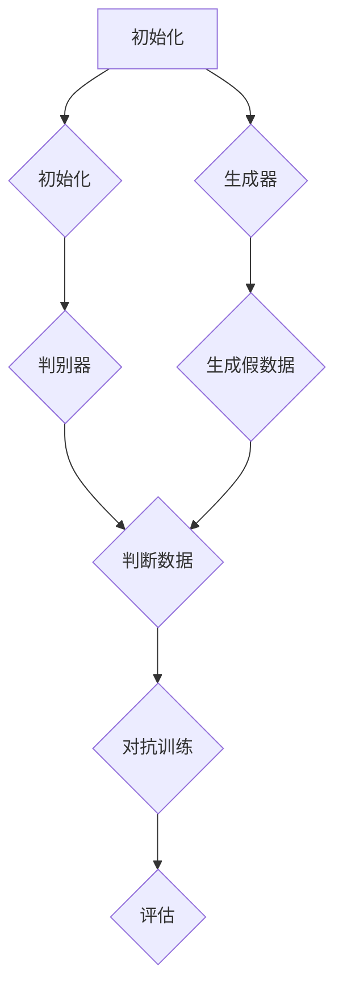

                 

### 1.1 书籍背景与目标

#### 1.1.1 问题背景

在当今这个数字化转型的时代，企业面临着前所未有的挑战和机遇。随着大数据、云计算和人工智能技术的飞速发展，企业需要不断创新和优化其产品设计流程，以保持竞争力。然而，传统的设计方法往往无法应对复杂多变的市场需求，设计周期长、成本高，创新效果不明显，这已经成为许多企业的痛点。

在这个背景下，人工智能（AI）被寄予厚望，特别是AI Agent和生成对抗网络（GANs）的出现，为产品设计创新带来了新的契机。AI Agent是一种可以自主执行任务、学习环境和与人类互动的智能体，而GANs则是一种能够生成高质量数据的深度学习模型。这两种技术的结合，有望在产品设计过程中发挥巨大的潜力，帮助企业实现快速迭代和创新。

#### 1.1.2 问题描述

企业的产品设计创新面临的主要问题可以概括为以下几点：

1. **设计效率低下**：传统的产品设计方法往往需要长时间的迭代和验证，导致设计周期延长，无法快速响应市场需求。
2. **创新不足**：设计过程过于依赖经验和直觉，缺乏系统性的创新思维和方法，导致产品设计同质化严重，无法满足消费者个性化需求。
3. **资源浪费**：在早期的设计阶段，大量的时间和资源被用于制作物理原型或数字模型，往往无法被最终采用，造成了资源浪费。
4. **协作困难**：设计过程中涉及多个部门和团队，信息交流和协作不畅，影响了设计效率和质量。

这些问题不仅影响了企业的竞争力，还阻碍了其创新能力的提升。因此，寻找一种能够提高设计效率、促进创新的方法变得尤为重要。

#### 1.1.3 问题解决

AI Agent和GANs的结合提供了一种可能的解决方案。通过AI Agent，企业可以自动化和智能化设计流程中的许多任务，如需求分析、原型设计、测试和优化等，从而提高设计效率。而GANs则可以生成高质量的设计数据，为设计师提供丰富的灵感来源，促进创新。

具体来说，AI Agent可以帮助实现以下目标：

1. **自动化任务**：通过自主学习，AI Agent可以自动执行设计流程中的重复性任务，如数据收集和分析、原型生成和测试等。
2. **智能协作**：AI Agent可以与人类设计师协作，提供个性化的设计建议，优化设计方案。
3. **实时反馈**：AI Agent可以实时收集用户反馈，对设计方案进行迭代和优化，确保设计能够满足市场需求。

GANs则可以在以下方面发挥重要作用：

1. **数据生成**：GANs可以生成高质量的设计数据，为设计师提供丰富的设计素材和灵感。
2. **辅助创新**：GANs的生成能力可以帮助设计师突破传统思维限制，探索新的设计方向和解决方案。
3. **原型验证**：GANs生成的原型可以用于快速测试和验证，帮助设计师快速评估设计效果，减少时间和成本浪费。

通过AI Agent和GANs的结合，企业可以在产品设计创新过程中实现以下突破：

1. **缩短设计周期**：自动化和智能化的设计流程可以大大缩短设计周期，提高响应速度。
2. **提高创新效果**：AI Agent和GANs可以提供丰富的设计素材和创新的思维方式，提升设计质量和用户体验。
3. **降低设计成本**：通过减少物理原型制作和验证次数，降低设计和开发成本。
4. **增强协作能力**：AI Agent和GANs可以促进团队协作，提高设计效率和团队沟通效果。

总之，本书的目标是深入探讨AI Agent和GANs在产品设计创新中的应用，通过理论分析和实践案例，帮助企业理解和掌握这一前沿技术，实现设计流程的优化和创新能力的提升。

#### 1.1.4 边界与外延

在探讨AI Agent和GANs在产品设计创新中的应用时，需要明确一些边界和外延问题：

1. **应用范围**：虽然AI Agent和GANs在产品设计创新中具有广泛的应用潜力，但并非所有设计问题都适合使用这一技术。例如，一些高度依赖于创意和灵感的设计任务可能更适合传统的设计方法。
2. **技术成熟度**：尽管AI Agent和GANs在理论和技术上已经取得了显著进展，但实际应用中仍存在一些挑战，如算法优化、数据隐私和安全等问题。因此，在实际应用中需要根据技术成熟度和业务需求进行合理选择。
3. **人力资源**：AI Agent和GANs的应用需要专业的人才和技术支持。企业需要具备相应的人才储备和技术能力，以便有效地开发和利用这些技术。
4. **伦理和道德**：在应用AI Agent和GANs的过程中，需要关注伦理和道德问题，确保技术应用不会对人类设计师和用户造成负面影响。

#### 1.1.5 核心概念与要素组成

为了更好地理解AI Agent和GANs在产品设计创新中的应用，我们需要首先了解这些核心概念和要素：

1. **AI Agent**：AI Agent是一种具有自主学习和决策能力的智能体，能够在复杂环境中执行任务。它通常包括感知、行动、学习和交互等关键组成部分。

2. **生成对抗网络（GANs）**：GANs是一种深度学习模型，由生成器和判别器两个网络组成。生成器负责生成数据，判别器则负责判断生成数据与真实数据之间的相似度。通过两个网络的对抗训练，GANs可以生成高质量的数据。

3. **产品设计创新**：产品设计创新是指通过引入新的设计理念、技术或方法，提升产品的设计质量和用户体验。它包括创意生成、原型设计、测试和优化等环节。

4. **设计流程**：设计流程是指从需求分析到产品发布的一系列步骤。它通常包括需求收集、概念生成、原型设计、测试和优化等环节。

通过理解这些核心概念和要素，我们可以更好地把握AI Agent和GANs在产品设计创新中的应用场景和实施策略。

### 1.2 AI Agents概述

#### 1.2.1 AI Agents的定义

AI Agents，又称智能代理，是指一种能够自主执行任务、学习环境并与人类互动的智能实体。它们在人工智能领域扮演着重要的角色，是实现智能自动化和智能化系统的基础。AI Agents的核心特点包括：

- **自主性**：AI Agents可以在没有外部干预的情况下执行任务，具备自主决策和行动的能力。
- **适应性**：AI Agents能够从环境中获取信息，通过学习和适应不断调整自己的行为策略。
- **交互性**：AI Agents可以与人类和其他智能体进行交互，理解并响应人类的指令和需求。

AI Agents的基本概念可以追溯到多智能体系统（MAS）理论。在MAS中，多个智能体通过协作和竞争实现共同目标，每个智能体都具有一定的自主性和适应性。随着人工智能技术的发展，AI Agents逐渐从理论走向实践，成为解决复杂问题的有效工具。

#### 1.2.2 AI Agents的类型

AI Agents可以按照不同的分类标准进行划分，常见的分类方式包括：

1. **基于功能的分类**：
   - **任务型Agent**：专注于完成特定任务的智能代理，如搜索引擎、自动化客服系统等。
   - **社交型Agent**：具备社交能力的智能代理，如聊天机器人、虚拟助手等。
   - **混合型Agent**：结合任务型和社交型Agent的特点，能够同时完成多项任务并与人互动。

2. **基于智能水平的分类**：
   - **弱AI Agent**：在特定任务上表现出人类智能，但缺乏普遍智能，如语音助手、图像识别系统等。
   - **强AI Agent**：具备与人类相同或超过人类的智能水平，能够在任何领域完成任务，但尚处于理论阶段。

3. **基于操作环境的分类**：
   - **室内Agent**：在家庭、办公室等室内环境中运行的智能代理，如智能家居控制系统。
   - **室外Agent**：在户外环境中运行的智能代理，如无人驾驶汽车、无人机等。

4. **基于应用领域的分类**：
   - **工业Agent**：在工业自动化领域应用的智能代理，如工业机器人、自动化生产线等。
   - **金融Agent**：在金融领域应用的智能代理，如智能投顾、自动化交易系统等。
   - **医疗Agent**：在医疗领域应用的智能代理，如疾病预测系统、医疗机器人等。

每种类型的AI Agent都有其特定的应用场景和功能，根据不同的需求和场景选择合适的AI Agent类型是设计智能系统的重要环节。

#### 1.2.3 AI Agents的关键特性

AI Agents的关键特性决定了其在产品设计创新中的应用潜力和适用性。以下是AI Agents的主要特性：

1. **自主性**：自主性是AI Agents最核心的特性之一。它使得AI Agents能够在没有人为干预的情况下自主执行任务，包括感知环境、规划行动、决策执行等。这种自主性大大提高了系统的效率和灵活性。

2. **适应性**：AI Agents需要具备适应环境变化的能力。它们通过不断学习和积累经验，能够调整自己的行为策略，以适应新的任务和挑战。这种适应性使得AI Agents在复杂多变的环境中能够持续地发挥作用。

3. **交互性**：交互性使得AI Agents能够与人类和其他智能体进行有效的沟通和协作。通过自然语言处理、语音识别、图像识别等技术，AI Agents可以理解人类的需求和指令，并提供相应的服务和反馈。

4. **智能性**：AI Agents的智能性体现在其能够模拟人类的思维过程，进行逻辑推理、问题求解、决策分析等。这种智能性使得AI Agents能够在复杂的任务中提供高质量的解决方案。

5. **可扩展性**：AI Agents需要具备良好的可扩展性，以便根据不同的应用场景和需求进行定制和扩展。通过模块化设计和标准化接口，AI Agents可以方便地集成到不同的系统和平台中。

6. **安全性**：AI Agents在执行任务的过程中，需要确保数据的安全性和系统的可靠性。通过安全防护技术和隐私保护机制，AI Agents能够有效防范外部攻击和内部泄露，保障系统的安全运行。

这些关键特性共同决定了AI Agents在产品设计创新中的价值。通过合理设计和应用AI Agents，企业可以显著提高设计效率、促进创新，并提升用户体验。

### 1.3 生成对抗网络（GANs）概述

#### 1.3.1 GANs的定义

生成对抗网络（Generative Adversarial Networks，GANs）是由伊恩·古德费洛（Ian Goodfellow）于2014年提出的一种深度学习模型。GANs的核心思想是通过两个相互对抗的神经网络——生成器（Generator）和判别器（Discriminator）——来共同训练，从而生成高质量的数据。

生成器的任务是生成尽可能真实的数据，以欺骗判别器。判别器的任务是区分真实数据和生成数据。这两个网络在训练过程中相互对抗，生成器试图不断提高生成数据的质量，而判别器则努力提高识别真实数据的能力。通过这种对抗训练，GANs能够学会生成具有高度真实感的数据。

GANs的提出，在人工智能领域引起了巨大的反响。它不仅为数据生成提供了一种全新的方法，还在图像处理、自然语言生成、视频生成等多个领域展现出了巨大的应用潜力。

#### 1.3.2 GANs的工作原理

GANs的工作原理可以概括为以下步骤：

1. **初始化**：生成器和判别器都是通过随机权重初始化的。生成器是一个映射输入噪声z到数据的网络，判别器是一个映射数据到概率的网络。

2. **生成数据**：生成器接收一个随机噪声向量z，通过一系列变换生成假数据G(z)。

3. **判断数据**：判别器接收真实数据和生成数据，通过输出一个介于0和1之间的概率值来判断数据的真实性。概率值越接近1，表示数据越真实；越接近0，表示数据越可能是生成的。

4. **对抗训练**：生成器和判别器在训练过程中进行对抗。生成器尝试生成更真实的数据来欺骗判别器，而判别器则努力提高对真实数据和生成数据的区分能力。这种对抗训练使得生成器和判别器都在不断地改进自己的性能。

5. **评估**：在训练过程中，通过评估生成器生成的数据质量来衡量GANs的性能。常用的评估指标包括生成数据的多样性、真实性和质量等。

GANs的工作原理如图1所示：

#### 1.3.3 GANs的组成部分

GANs主要由两部分组成：生成器和判别器。以下是这两个组成部分的详细介绍：

1. **生成器（Generator）**

生成器的任务是生成高质量的数据，以欺骗判别器。它通常是一个神经网络，接受一个随机噪声向量作为输入，通过一系列变换生成逼真的数据。生成器的结构可以根据应用场景进行定制，但通常包括以下几个关键组成部分：

- **输入层**：接收随机噪声向量，作为生成数据的基础。
- **隐藏层**：通过神经网络结构，将噪声向量转换为更复杂的特征表示。
- **输出层**：生成具体的生成数据，如图像、文本或音频等。

2. **判别器（Discriminator）**

判别器的任务是区分真实数据和生成数据。它也是一个神经网络，接收输入数据，并输出一个概率值，表示该数据为真实数据的可能性。判别器的结构通常包括以下几个部分：

- **输入层**：接收输入数据，如真实图像或生成图像。
- **隐藏层**：通过神经网络结构，对输入数据进行特征提取和分类。
- **输出层**：输出一个介于0和1之间的概率值，表示输入数据的真实性。

判别器在GANs中起着至关重要的作用。它不仅要能够准确地区分真实数据和生成数据，还要在生成器不断改进生成数据的过程中保持较高的识别能力。为此，判别器通常采用复杂的网络结构和正则化方法。

#### 1.3.4 GANs与其他生成模型的比较

GANs作为一种生成模型，与其他生成模型如变分自编码器（VAEs）、自编码器（AEs）等相比，具有以下优势：

1. **生成质量**：GANs通过生成器和判别器的对抗训练，可以生成具有高度真实感和多样性的数据。相比VAEs和AEs，GANs能够更好地捕捉数据的复杂分布。

2. **灵活性**：GANs可以应用于各种数据类型，如图像、文本和音频等，而VAEs和AEs通常仅适用于连续数据。此外，GANs可以通过调整生成器和判别器的结构，适应不同的生成任务。

3. **应用范围**：GANs在图像生成、自然语言生成、视频生成等领域表现出色，而VAEs和AEs在这些领域的应用受到一定限制。

4. **模型复杂度**：GANs的训练过程相对复杂，需要平衡生成器和判别器之间的对抗关系。相比之下，VAEs和AEs的训练过程较为简单，但生成质量可能较低。

总之，GANs作为一种先进的生成模型，在许多应用领域都具有显著的优势，但同时也需要针对具体任务进行优化和改进。通过深入理解GANs的工作原理和优势，企业可以更好地利用这一技术，实现产品设计的创新和优化。

### 1.4 产品设计创新中的前沿应用

#### 1.4.1 GANs在产品设计中的应用场景

生成对抗网络（GANs）作为一种强大的深度学习模型，在产品设计创新中展现了广泛的应用潜力。以下是一些具体的应用场景：

1. **图像生成和风格迁移**：GANs可以生成高质量的图像，包括人脸生成、图像修复、图像风格迁移等。这些图像生成技术可以帮助设计师快速创作出新颖的设计概念，节省时间和成本。例如，利用GANs生成不同风格的艺术作品，设计师可以从中获得灵感，用于产品包装、广告设计等。

2. **产品原型设计**：通过GANs生成的产品原型，设计师可以在没有物理原型的情况下，快速评估和优化设计方案。这种方法特别适用于工业设计、家具设计等领域，设计师可以通过生成不同形态和结构的原型，进行虚拟测试和用户反馈，从而提高设计效率和质量。

3. **个性化定制**：GANs能够生成大量具有多样性的数据，为个性化定制提供支持。例如，在服装设计中，GANs可以根据用户的需求和偏好，生成定制化的服装款式，满足个性化的消费需求。这不仅提升了用户体验，也增加了产品的竞争力。

4. **设计优化**：GANs可以帮助设计师在现有设计基础上进行优化。例如，在汽车设计过程中，GANs可以生成各种不同的设计变化，设计师可以通过这些变化进行评估和选择，找到最优的设计方案。这种方法可以提高设计的创新性和适应性，降低开发成本。

5. **市场需求预测**：通过GANs生成的大量设计数据，企业可以对市场需求进行预测和分析。例如，利用GANs生成的不同产品款式，企业可以评估不同设计在市场上的接受程度，从而更好地制定市场策略。

6. **用户反馈分析**：GANs可以生成用户反馈数据，帮助设计师快速了解用户的需求和偏好。例如，利用GANs生成的用户评价，设计师可以从中获取有价值的信息，指导后续的设计改进。

这些应用场景展示了GANs在产品设计创新中的巨大潜力。通过利用GANs的技术优势，企业可以显著提高设计效率、创新能力和市场竞争力。

#### 1.4.2 GANs提升设计效率的潜力

生成对抗网络（GANs）在产品设计创新中具有显著的提升设计效率的潜力，主要体现在以下几个方面：

1. **自动化设计流程**：GANs可以自动化设计流程中的多个环节，如需求分析、原型生成和测试等。通过生成器和判别器的训练，GANs能够自动生成高质量的设计方案，设计师只需对生成结果进行微调，从而大大减少手动设计的工作量。

2. **快速原型生成**：传统的产品设计流程往往需要较长时间来生成物理原型或数字模型。GANs可以在短时间内生成多个设计原型，设计师可以从中选择最优方案。这种方法不仅加快了设计迭代速度，也降低了设计和开发的成本。

3. **智能辅助设计**：GANs可以提供智能辅助设计，为设计师提供个性化的设计建议。通过分析大量的设计数据和用户反馈，GANs可以生成符合市场需求和用户偏好的设计方案，提高设计的适应性和创新性。

4. **多角度评估和优化**：GANs生成的多个设计原型可以帮助设计师从不同角度评估设计方案，包括形态、结构、材料等。通过这些评估，设计师可以找到最佳的设计方案，并进行进一步优化。

5. **实时反馈和迭代**：GANs可以实时生成用户反馈数据，帮助设计师快速了解用户的实际需求和体验。设计师可以根据这些反馈，对设计方案进行实时迭代和优化，确保设计能够迅速响应市场需求。

总之，通过利用GANs的技术优势，企业可以显著提高设计效率，加快产品迭代速度，降低开发成本，从而在激烈的市场竞争中占据有利位置。

#### 1.4.3 GANs对设计思维的影响

生成对抗网络（GANs）的出现不仅改变了产品设计的方式，也对设计思维产生了深远的影响。以下是一些GANs对设计思维的主要影响：

1. **拓宽创意边界**：GANs通过生成大量具有多样性的数据，为设计师提供了丰富的创意素材。设计师可以利用这些数据，探索前所未有的设计方向和解决方案，从而拓宽创意边界，突破传统思维的限制。

2. **促进创新思维**：GANs的生成能力可以帮助设计师发现新的设计模式和结构，激发创新思维。设计师可以从GANs生成的不同设计方案中，获得灵感，进行创新性的设计尝试。

3. **增强设计适应性**：GANs可以生成适应不同市场需求的设计方案，设计师可以根据实际需求进行选择和调整。这种适应性设计思维使得设计能够更好地满足用户的需求，提高产品的市场竞争力。

4. **优化设计评估**：GANs生成的多个设计原型可以帮助设计师从多个角度评估设计方案，包括用户体验、功能性和美观度等。通过这些评估，设计师可以更加全面地了解设计方案的优缺点，进行有针对性的优化。

5. **提升协作效率**：GANs在生成设计数据的过程中，可以与其他设计师和团队成员进行实时协作。通过共同分析和讨论GANs生成的数据，团队可以更高效地完成设计任务，提高整体设计效率。

总之，GANs通过拓宽创意边界、促进创新思维、增强设计适应性、优化设计评估和提升协作效率，对设计思维产生了深远的影响。设计师可以利用GANs的技术优势，实现更加高效和创新的设计过程。

### 1.5 本章小结

本章主要介绍了AI Agent和生成对抗网络（GANs）在产品设计创新中的前沿应用。首先，通过背景介绍，我们了解了企业在数字化转型过程中面临的挑战和机遇，以及AI Agent和GANs如何成为解决这些问题的有效工具。接着，我们详细阐述了AI Agent的定义、类型和关键特性，以及GANs的定义、工作原理、组成部分和与其他生成模型的比较。最后，我们讨论了GANs在产品设计创新中的应用场景、提升设计效率的潜力以及对设计思维的影响。

通过本章的学习，读者可以了解到AI Agent和GANs在产品设计创新中的重要作用，以及如何利用这些技术提高设计效率、促进创新和提升用户体验。接下来，我们将进一步探讨GANs在实际应用中的具体案例和实现方法，帮助读者深入理解这一前沿技术的应用价值。

