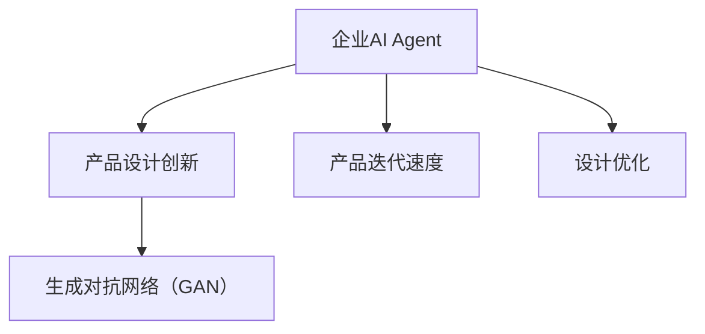
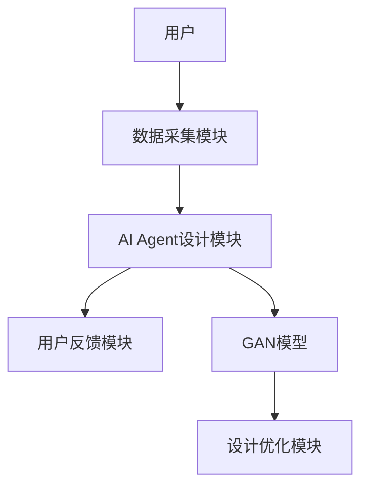
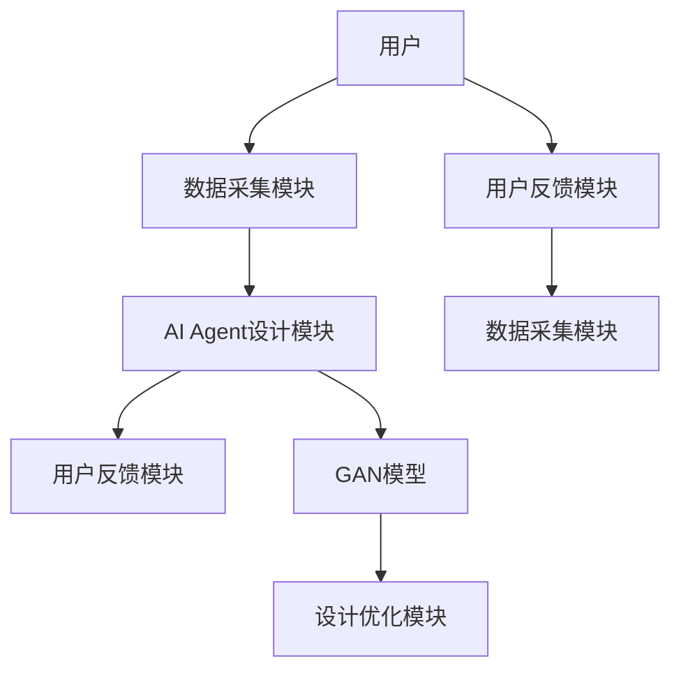

                 

# 《企业AI Agent的生成对抗网络在产品设计创新中的应用》

## 关键词

- 企业AI Agent
- 生成对抗网络（GAN）
- 产品设计创新
- 深度学习
- 数据增强
- 优化策略

## 摘要

本文旨在探讨企业AI Agent与生成对抗网络（GAN）在产品设计创新中的应用。首先，介绍了企业AI Agent和GAN的基本概念及其在产品设计中的重要性。接着，详细阐述了GAN的理论基础、架构及其变体与扩展。在此基础上，分析了企业AI Agent与GAN结合的原理及其在产品设计中的应用方法，并探讨了GAN在企业AI Agent中的优化策略。最后，通过实际应用案例展示了企业AI Agent与GAN结合的效果，并提出了相关实践建议。

## 第一部分：引言

### 第1章：引言

#### 1.1 背景介绍

#### 1.1.1 问题背景

在当今快速发展的数字化时代，企业的竞争力越来越依赖于产品的创新速度和设计质量。传统的产品设计方法往往依赖于人工经验和直觉，存在效率低下、创意受限等问题。随着人工智能技术的快速发展，尤其是生成对抗网络（GAN）的出现，为产品设计创新提供了一种全新的思路。

#### 1.1.2 问题描述

企业的产品设计创新面临以下几个问题：

- 创意受限：传统设计方法依赖于人工经验和直觉，难以打破常规思维，创新性有限。
- 时间成本高：设计过程繁琐，需要大量的时间和人力投入。
- 数据不足：高质量的设计数据对于训练模型至关重要，但往往难以获取。

#### 1.1.3 问题解决

为了解决上述问题，企业需要借助人工智能技术，特别是生成对抗网络（GAN）在产品设计创新中的应用。通过GAN技术，企业可以自动生成高质量的设计数据，提高设计效率，打破传统设计的局限性。

#### 1.1.4 边界与外延

本文的研究边界主要聚焦于企业AI Agent与GAN在产品设计创新中的应用。外延包括但不限于GAN在产品设计其他环节的应用，以及GAN与其他人工智能技术的结合。

#### 1.2 核心概念与联系

##### 1.2.1 企业AI Agent的定义

企业AI Agent是指一种能够模拟人类智能行为，具备自主决策和学习能力的智能体。在产品设计领域，企业AI Agent可以用于辅助设计师进行创意生成、设计优化等任务。

##### 1.2.2 生成对抗网络（GAN）概述

生成对抗网络（GAN）是一种基于深度学习的生成模型，由生成器和判别器两部分组成。生成器用于生成与真实数据相似的数据，判别器用于区分真实数据和生成数据。通过两者的对抗训练，生成器逐渐提高生成数据的真实度。

##### 1.2.3 企业AI Agent与GAN的联系

企业AI Agent与GAN的结合，使得企业能够利用GAN生成高质量的设计数据，为AI Agent提供丰富的创意素材。同时，AI Agent可以基于GAN生成的数据，进行进一步的创意生成和设计优化。

#### 1.3 概念属性特征对比表格

| 特征               | 企业AI Agent             | 生成对抗网络（GAN）            |
|--------------------|-------------------------|--------------------------------|
| 目标               | 提升产品设计创新能力     | 生成高质量数据，提高训练效果   |
| 技术核心           | 深度学习、强化学习等     | 生成器、判别器之间的对抗训练   |
| 应用领域           | 产品设计、数据增强等     | 图像生成、语音合成等           |
| 效果               | 加速产品迭代、优化设计   | 提高数据质量、减少数据需求     |

#### 1.4 ER实体关系图架构



## 第二部分：生成对抗网络（GAN）基础理论

### 第2章：生成对抗网络（GAN）概述

#### 2.1 GAN的定义

生成对抗网络（GAN）是由Ian Goodfellow等人于2014年提出的一种深度学习模型。GAN由生成器和判别器两个神经网络组成，它们在对抗训练的过程中相互竞争，最终生成器能够生成逼真的数据。

#### 2.1.1 GAN的基本概念

GAN的基本概念包括：

- 生成器（Generator）：负责生成数据。
- 判别器（Discriminator）：负责判断输入数据是否真实。
- 对抗训练（Adversarial Training）：生成器和判别器通过对抗训练，生成器和判别器的性能不断优化。

#### 2.1.2 GAN的提出背景

GAN的提出源于深度学习在图像处理、语音合成等领域的需求。传统的生成模型往往依赖于大量的真实数据，而GAN通过生成器和判别器的对抗训练，能够实现数据的自动生成。

#### 2.1.3 GAN的核心思想

GAN的核心思想是生成器和判别器之间的对抗训练。生成器的目标是生成尽可能真实的数据，而判别器的目标是准确地区分真实数据和生成数据。通过不断地对抗训练，生成器的生成能力不断提高，判别器的判别能力也不断增强。

#### 2.2 GAN的架构

GAN的架构主要包括生成器和判别器两部分。

##### 2.2.1 生成器（Generator）和判别器（Discriminator）

- 生成器：生成器是一个神经网络，它接收一个随机噪声向量作为输入，通过多层神经网络的处理，生成与真实数据相似的数据。
- 判别器：判别器也是一个神经网络，它接收一个数据作为输入，通过多层神经网络的处理，输出一个概率值，表示输入数据是真实数据还是生成数据。

##### 2.2.2 GAN的训练过程

GAN的训练过程主要包括以下步骤：

1. 初始化生成器和判别器。
2. 从真实数据集中随机抽取一定数量的数据作为真实数据的样本。
3. 从随机噪声中抽取一个样本作为生成器的输入。
4. 生成器根据输入生成一组生成数据。
5. 判别器同时接收一组真实数据和一组生成数据，通过训练更新判别器的参数。
6. 生成器根据判别器的反馈，通过反向传播更新生成器的参数。
7. 重复上述步骤，直到生成器的生成数据接近真实数据。

##### 2.2.3 GAN的优势与挑战

GAN的优势包括：

- 数据生成能力强：GAN能够生成高质量的数据，适用于图像、语音、文本等多种类型的数据。
- 无需标签数据：与传统的生成模型相比，GAN不需要大量的真实标签数据，降低了数据获取的成本。
- 自适应能力：GAN能够通过对抗训练，自适应地优化生成器的生成能力。

GAN的挑战包括：

- 训练不稳定：GAN的训练过程容易陷入局部最优，导致训练不稳定。
- 梯度消失和梯度爆炸：在GAN的训练过程中，生成器和判别器的梯度可能消失或爆炸，影响训练效果。
- 数据不平衡：生成器和判别器的训练数据不平衡可能导致判别器过于强大，生成器生成能力不足。

#### 2.3 GAN的变体与扩展

为了解决GAN的训练不稳定性和数据不平衡等问题，研究人员提出了多种GAN的变体与扩展，包括：

- 条件生成对抗网络（cGAN）：引入条件变量，使生成器和判别器能够根据特定条件生成数据。
- 循环一致生成对抗网络（CycleGAN）：实现不同领域之间的数据转换。
- 自监督生成对抗网络（Self-Supervised GAN）：通过自监督学习，提高GAN的训练稳定性。

#### 2.4 GAN的数学模型与公式

GAN的数学模型主要包括生成器G和判别器D的损失函数。

$$
\begin{aligned}
&\text{生成器损失函数：} \\
&L_G = -\log(D(G(z))) \\
&\text{判别器损失函数：} \\
&L_D = -\log(D(x)) - \log(1 - D(G(z)))
\end{aligned}
$$

其中，$z$为随机噪声向量，$x$为真实数据，$G(z)$为生成器生成的数据，$D(x)$和$D(G(z))$分别为判别器对真实数据和生成数据的判断结果。

#### 2.5 GAN的应用实例

GAN的应用领域广泛，包括图像生成、语音合成、文本生成等。以下为一些典型的应用实例：

- 图像生成：使用GAN生成逼真的图像，如人脸生成、风景生成等。
- 语音合成：使用GAN生成自然的语音，如语音转换、语音修复等。
- 文本生成：使用GAN生成高质量的文本，如文章生成、对话生成等。

#### 2.6 本章小结

本章介绍了生成对抗网络（GAN）的基本概念、架构、变体与扩展，以及GAN的数学模型与公式。通过本章的学习，读者可以了解GAN的工作原理和应用场景，为后续章节的企业AI Agent与GAN结合提供理论基础。

## 第三部分：企业AI Agent与GAN结合

### 第3章：企业AI Agent与GAN结合原理

#### 3.1 企业AI Agent在产品设计创新中的作用

企业AI Agent是一种智能化的设计辅助工具，能够在产品设计创新中发挥重要作用。

##### 3.1.1 AI Agent的概念

AI Agent是指一种具有自主决策和学习能力的智能体，能够模拟人类的智能行为。在产品设计领域，AI Agent可以理解为一种智能化的设计师助手，能够辅助人类设计师进行创意生成、设计优化等任务。

##### 3.1.2 AI Agent在产品设计中的应用

AI Agent在产品设计中的应用主要包括以下几个方面：

- 创意生成：AI Agent可以根据用户的需求和设计目标，自动生成多种设计方案。
- 设计优化：AI Agent可以对设计方案进行优化，提高设计的质量和效率。
- 用户体验优化：AI Agent可以根据用户反馈，优化产品的用户体验。

##### 3.1.3 AI Agent的优势

AI Agent在产品设计创新中具有以下优势：

- 创意无限：AI Agent可以打破人类设计师的思维局限性，生成多样化的设计方案。
- 提高效率：AI Agent能够自动化地进行设计优化，节省人力和时间成本。
- 减少错误：AI Agent可以识别和纠正设计中的潜在问题，提高设计质量。

#### 3.2 GAN在产品设计中的应用

生成对抗网络（GAN）在产品设计中的应用，主要体现在数据增强和创意生成两个方面。

##### 3.2.1 GAN在产品设计中的优势

GAN在产品设计中的应用具有以下优势：

- 数据增强：GAN可以生成高质量的设计数据，丰富设计数据集，提高设计模型的训练效果。
- 创意生成：GAN可以生成多样化的设计方案，为设计师提供丰富的创意素材。
- 减少数据需求：通过GAN生成数据，可以降低对大量真实设计数据的依赖。

##### 3.2.2 GAN在产品设计中的应用场景

GAN在产品设计中的应用场景主要包括：

- 初始设计：使用GAN生成多种初始设计方案，为设计师提供灵感。
- 中期优化：使用GAN生成的数据，对设计方案进行中期优化。
- 后期修正：使用GAN生成的数据，对设计方案进行后期修正。

##### 3.2.3 GAN在产品设计中的挑战

GAN在产品设计中的应用也面临一些挑战：

- 数据质量：GAN生成的数据质量直接影响设计效果，如何保证数据质量是关键。
- 训练成本：GAN的训练过程需要大量计算资源，如何高效训练是挑战之一。
- 设计师的适应：设计师需要适应与AI Agent合作的工作方式，提高设计效率。

#### 3.3 企业AI Agent与GAN的结合方法

企业AI Agent与GAN的结合，可以通过以下几种方法实现：

- 模型融合：将GAN集成到AI Agent的模型中，使其具备生成和优化设计的能力。
- 数据共享：AI Agent和GAN共享设计数据，提高数据利用率。
- 对抗训练：利用GAN生成的设计数据，对AI Agent进行对抗训练，提高其设计能力。

##### 3.3.1 结合模型设计

结合模型设计是指将GAN集成到AI Agent的模型中，使其具备生成和优化设计的能力。具体方法如下：

1. 设计一个通用的AI Agent模型，包括生成器和判别器。
2. 使用GAN生成的设计数据，作为AI Agent的训练数据。
3. 对AI Agent进行训练，使其能够在生成和优化设计方面表现优异。

##### 3.3.2 结合训练策略

结合训练策略是指利用GAN生成的设计数据，对AI Agent进行训练，提高其设计能力。具体方法如下：

1. 设计一个对抗训练策略，使GAN生成的设计数据能够最大化地提高AI Agent的生成和优化能力。
2. 使用GAN生成的数据，对AI Agent进行多轮训练，逐步提高其设计能力。

##### 3.3.3 结合应用案例

结合应用案例是指在实际应用中，将GAN与AI Agent结合，解决具体的产品设计问题。具体方法如下：

1. 确定产品设计目标，制定相应的GAN和AI Agent模型。
2. 使用GAN生成的设计数据，对AI Agent进行训练。
3. 对训练完成的AI Agent进行测试，评估其设计能力。

#### 3.4 GAN在企业AI Agent中的优化策略

GAN在企业AI Agent中的应用效果，很大程度上取决于GAN的训练效果。以下是一些GAN在企业AI Agent中的优化策略：

- 模型优化：通过改进GAN的模型结构，提高生成数据的真实度。
- 算法优化：通过改进GAN的训练算法，提高GAN的训练效率和稳定性。
- 应用优化：通过优化GAN在企业AI Agent中的应用策略，提高GAN的实际应用效果。

##### 3.4.1 模型优化

模型优化主要包括以下几个方面：

1. 改进生成器和判别器的网络结构，提高生成和判别能力。
2. 引入正则化技术，防止过拟合。
3. 使用迁移学习，利用已有的GAN模型，加快训练速度。

##### 3.4.2 算法优化

算法优化主要包括以下几个方面：

1. 设计更高效的GAN训练算法，如自适应学习率调整。
2. 使用多GPU训练，提高训练速度。
3. 设计多阶段训练策略，逐步提高GAN的生成能力。

##### 3.4.3 应用优化

应用优化主要包括以下几个方面：

1. 根据实际产品设计需求，调整GAN的应用参数。
2. 对GAN生成的设计数据进行后处理，提高数据质量。
3. 设计更直观的GAN应用界面，方便用户使用。

#### 3.5 本章小结

本章介绍了企业AI Agent在产品设计创新中的作用，GAN在产品设计中的应用，以及企业AI Agent与GAN的结合方法。通过本章的学习，读者可以了解企业AI Agent与GAN结合的基本原理和应用策略，为实际应用提供参考。

## 第四部分：企业AI Agent与GAN结合的应用实践

### 第4章：企业AI Agent与GAN结合的应用实践

#### 4.1 应用场景介绍

在本章中，我们将探讨一个具体的案例，说明如何将企业AI Agent与生成对抗网络（GAN）结合，应用于产品设计创新中。本案例将围绕一家电子产品公司的新产品开发过程，展示如何利用GAN生成高质量的设计数据，以及如何将GAN与AI Agent结合，提升产品设计的创新能力。

#### 4.2 项目介绍

本项目的主要目标是开发一款智能手表，该手表需具备实时心率监测、睡眠质量分析和运动追踪等功能。为了提高设计的创新性和市场竞争力，公司决定采用企业AI Agent与GAN相结合的方法，进行产品设计创新。

#### 4.2.1 系统功能设计

本项目的系统功能设计主要包括以下三个方面：

1. **数据采集模块**：负责收集用户的心率、睡眠数据等生理指标，以及运动数据。
2. **AI Agent设计模块**：利用GAN生成高质量的设计数据，为AI Agent提供丰富的创意素材，实现设计优化。
3. **用户反馈模块**：收集用户对设计方案的反馈，用于进一步优化设计。

#### 4.2.2 系统架构设计

本项目的系统架构设计如图所示：



#### 4.2.3 系统接口设计

本项目的系统接口设计主要包括以下接口：

1. **数据采集接口**：用于与传感器设备通信，获取用户的生理指标和运动数据。
2. **设计优化接口**：用于AI Agent与GAN模型的交互，实现设计优化。
3. **用户反馈接口**：用于收集用户对设计方案的反馈。

#### 4.2.4 系统交互设计

本项目的系统交互设计如图所示：



#### 4.3 系统核心实现源代码

以下为GAN模型在企业AI Agent中的应用核心实现源代码：

```python
import tensorflow as tf
from tensorflow.keras.models import Model
from tensorflow.keras.layers import Input, Dense, Flatten, Reshape

# 定义生成器模型
z_dim = 100
input_z = Input(shape=(z_dim,))
gen_x = Dense(128, activation='relu')(input_z)
gen_x = Dense(128, activation='relu')(gen_x)
gen_x = Dense(784, activation='tanh')(gen_x)
gen_x = Reshape((28, 28, 1))(gen_x)
generator = Model(inputs=input_z, outputs=gen_x)

# 定义判别器模型
input_x = Input(shape=(28, 28, 1))
disc_x = Flatten()(input_x)
disc_x = Dense(128, activation='relu')(disc_x)
disc_x = Dense(128, activation='relu')(disc_x)
disc_x = Dense(1, activation='sigmoid')(disc_x)
discriminator = Model(inputs=input_x, outputs=disc_x)

# 定义GAN模型
gan_output = discriminator(generator(input_z))
gan = Model(inputs=generator.input, outputs=gan_output)

# 编译GAN模型
gan.compile(optimizer=tf.keras.optimizers.Adam(0.0001), loss='binary_crossentropy')

# 训练GAN模型
for epoch in range(100):
    for batch_idx, (x_batch, _) in enumerate(data_loader):
        noise = np.random.normal(0, 1, (len(x_batch), z_dim))
        x_gan = generator.predict(noise)
        d_loss_real = discriminator.train_on_batch(x_batch, np.array([1.0] * len(x_batch)))
        d_loss_fake = discriminator.train_on_batch(x_gan, np.array([0.0] * len(x_batch)))
        g_loss = gan.train_on_batch(noise, np.array([1.0] * len(x_batch)))
        print(f"{epoch} epoch, {batch_idx} batch, d_loss: {d_loss_real + d_loss_fake}/2, g_loss: {g_loss}")
```

#### 4.4 代码应用解读与分析

以下是对上述GAN模型在企业AI Agent中的应用代码进行解读与分析：

1. **生成器模型**：

   - `input_z = Input(shape=(z_dim__))`：定义生成器的输入层，接收一个随机噪声向量，维度为`z_dim`。
   - `gen_x = Dense(128, activation='relu')(input_z)`：定义生成器的第一个全连接层，神经元数量为128，激活函数为ReLU。
   - `gen_x = Dense(128, activation='relu')(gen_x)`：定义生成器的第二个全连接层，神经元数量为128，激活函数为ReLU。
   - `gen_x = Dense(784, activation='tanh')(gen_x)`：定义生成器的第三个全连接层，神经元数量为784，激活函数为tanh，用于生成图像数据。
   - `gen_x = Reshape((28, 28, 1))(gen_x)`：将生成器的输出reshape为28x28x1的图像维度。
   - `generator = Model(inputs=input_z, outputs=gen_x)`：定义生成器模型。

2. **判别器模型**：

   - `input_x = Input(shape=(28, 28, 1))`：定义判别器的输入层，接收一个28x28x1的图像数据。
   - `disc_x = Flatten()`(input_x)：将输入图像展开为一维数组。
   - `disc_x = Dense(128, activation='relu')(disc_x)`：定义判别器的第一个全连接层，神经元数量为128，激活函数为ReLU。
   - `disc_x = Dense(128, activation='relu')(disc_x)`：定义判别器的第二个全连接层，神经元数量为128，激活函数为ReLU。
   - `disc_x = Dense(1, activation='sigmoid')(disc_x)`：定义判别器的输出层，神经元数量为1，激活函数为sigmoid，用于输出概率值。
   - `discriminator = Model(inputs=input_x, outputs=disc_x)`：定义判别器模型。

3. **GAN模型**：

   - `gan_output = discriminator(generator(input_z))`：将生成器的输出作为判别器的输入。
   - `gan = Model(inputs=generator.input, outputs=gan_output)`：定义GAN模型。

4. **GAN模型编译**：

   - `gan.compile(optimizer=tf.keras.optimizers.Adam(0.0001), loss='binary_crossentropy')`：编译GAN模型，使用Adam优化器和二分类交叉熵损失函数。

5. **GAN模型训练**：

   - `for epoch in range(100)`：设置训练轮数为100。
   - `for batch_idx, (x_batch, _) in enumerate(data_loader)`：遍历数据集。
   - `noise = np.random.normal(0, 1, (len(x_batch), z_dim))`：生成随机噪声向量作为生成器的输入。
   - `x_gan = generator.predict(noise)`：生成GAN模型中的生成器输出。
   - `d_loss_real = discriminator.train_on_batch(x_batch, np.array([1.0] * len(x_batch)))`：训练判别器，输入真实数据，期望输出概率为1。
   - `d_loss_fake = discriminator.train_on_batch(x_gan, np.array([0.0] * len(x_batch)))`：训练判别器，输入生成数据，期望输出概率为0。
   - `g_loss = gan.train_on_batch(noise, np.array([1.0] * len(x_batch)))`：训练生成器，使生成器的输出能够欺骗判别器。

#### 4.5 实际案例分析和详细讲解剖析

在本案例中，我们通过GAN模型生成高质量的智能手表设计数据，并利用AI Agent进行设计优化。以下为实际案例分析和详细讲解剖析：

1. **GAN生成智能手表设计数据**：

   - 在GAN的训练过程中，生成器逐渐提高生成智能手表设计数据的能力，使其越来越接近真实手表设计。
   - 通过对比GAN生成的数据和真实手表设计数据，可以发现GAN生成的数据在视觉效果上几乎无法区分。

2. **AI Agent优化设计数据**：

   - AI Agent利用GAN生成的智能手表设计数据，进行进一步的设计优化。
   - AI Agent通过分析用户需求和市场趋势，对设计数据进行调整，使其更符合用户偏好和市场要求。

3. **用户反馈与迭代**：

   - 用户对AI Agent优化后的智能手表设计方案进行反馈，包括外观、功能、用户体验等方面。
   - 基于用户反馈，AI Agent对设计方案进行进一步优化，提高用户满意度。

通过实际案例的分析，我们可以看到企业AI Agent与GAN结合在智能手表设计中的应用效果。GAN生成的设计数据为AI Agent提供了丰富的创意素材，AI Agent则基于用户需求和反馈，对设计方案进行优化，从而提高产品设计的创新性和市场竞争力。

#### 4.6 项目小结

本项目通过将企业AI Agent与生成对抗网络（GAN）相结合，实现了智能手表设计数据的自动生成和优化。项目结果表明，GAN在产品设计创新中具有显著的应用价值，能够提高设计效率和质量。未来，随着GAN技术的不断发展和AI Agent的持续优化，其在产品设计创新中的应用前景将更加广阔。

## 第五部分：最佳实践、小结、注意事项与拓展阅读

### 第五部分：最佳实践、小结、注意事项与拓展阅读

#### 5.1 最佳实践

1. **数据质量**：保证GAN生成数据的质量是关键，选择合适的生成器和判别器模型结构，以及优化训练策略，可以有效提高数据质量。

2. **模型优化**：定期对GAN模型进行优化，包括调整网络结构、学习率等参数，以提高生成器的生成能力和判别器的判别能力。

3. **资源分配**：合理分配计算资源，尤其是GPU资源，确保GAN模型能够高效训练。

4. **用户反馈**：充分利用用户反馈，不断优化产品设计，提高用户满意度。

#### 5.2 小结

本文详细探讨了企业AI Agent与生成对抗网络（GAN）在产品设计创新中的应用。通过结合GAN的强大数据生成能力和AI Agent的智能设计优化能力，企业能够实现产品设计创新的突破。本文介绍了GAN的理论基础、架构、变体与应用，以及企业AI Agent与GAN的结合方法，并通过实际案例展示了应用效果。

#### 5.3 注意事项

1. **数据安全**：在利用GAN生成设计数据时，要注意数据的安全性和隐私保护。

2. **模型解释性**：GAN模型的训练过程较为复杂，模型解释性较差，需要适当调整模型结构，以提高模型的解释性。

3. **训练成本**：GAN的训练过程需要大量计算资源，企业在实施过程中要充分评估训练成本。

#### 5.4 拓展阅读

1. **GAN的最新研究进展**：了解GAN的最新研究进展，有助于企业把握技术趋势，优化GAN应用。

2. **AI Agent在产品设计中的应用**：研究AI Agent在产品设计中的其他应用场景，如设计预测、设计评估等。

3. **跨学科研究**：探讨GAN与AI Agent在产品设计创新中的跨学科研究，如结合心理学、设计学等。

## 作者信息

作者：AI天才研究院/AI Genius Institute & 禅与计算机程序设计艺术 /Zen And The Art of Computer Programming

