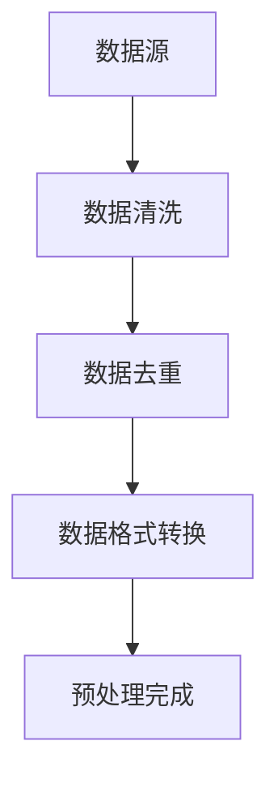
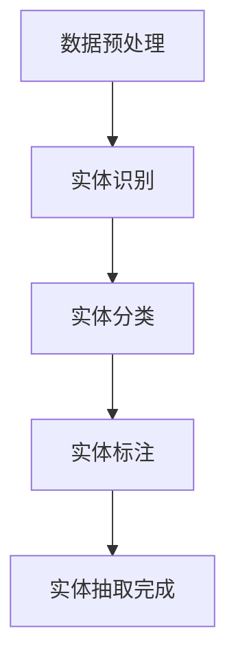
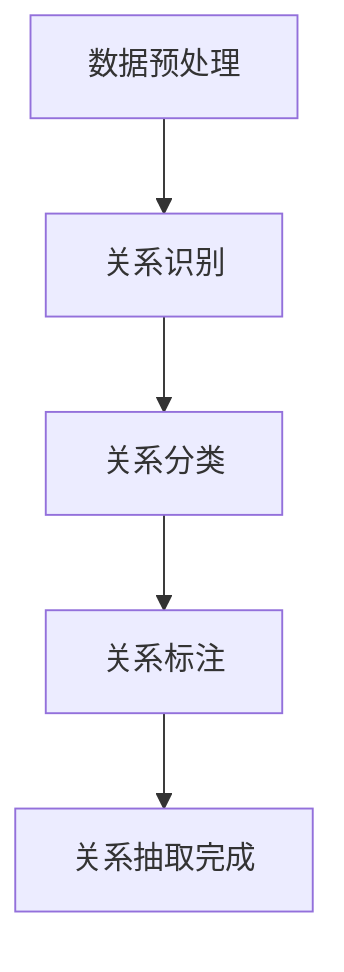
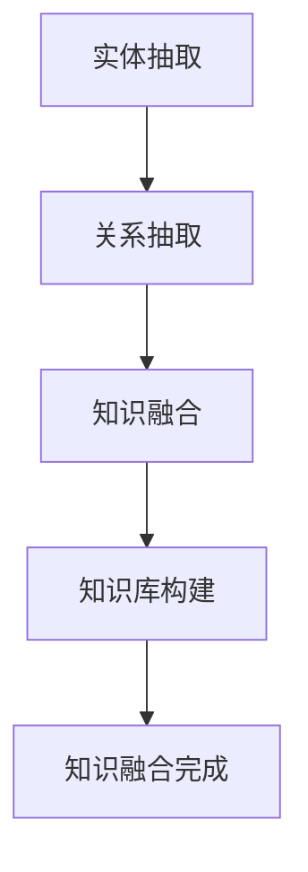
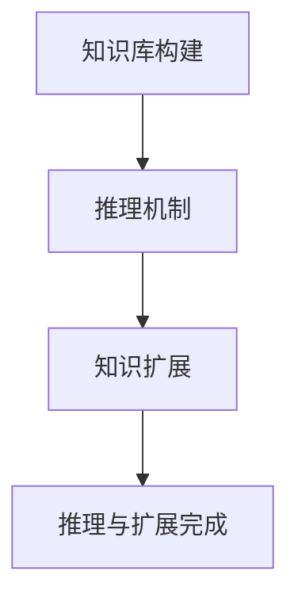
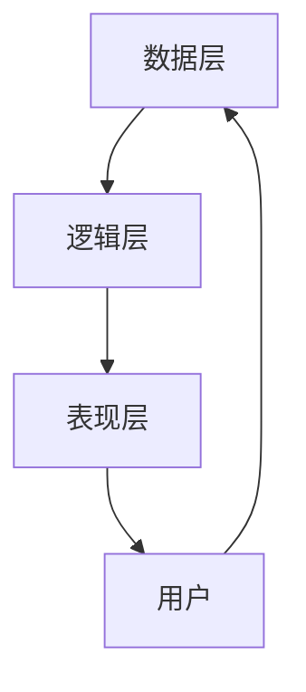
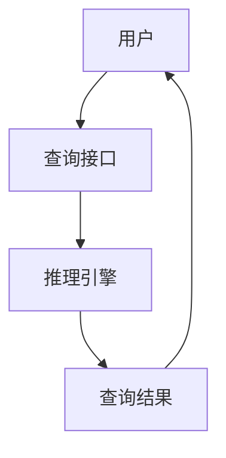
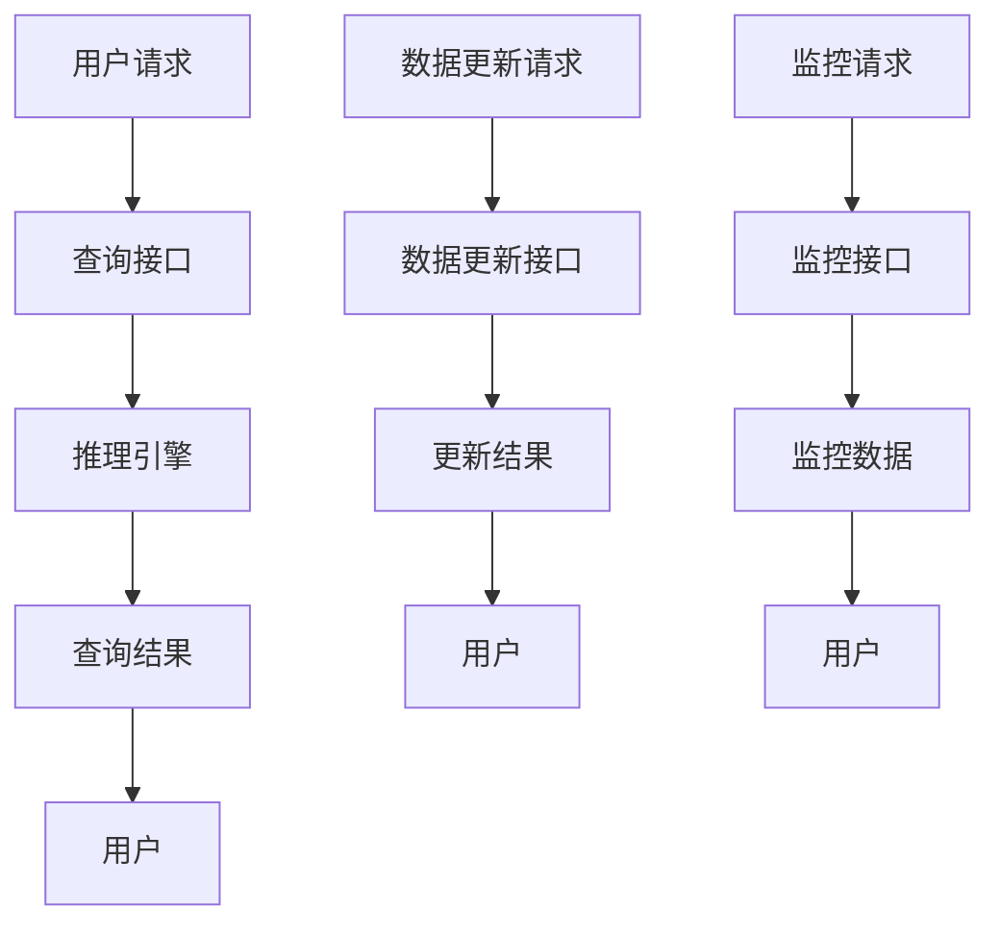

                 

### 1. 企业AI Agent概述

#### 第1章：企业AI Agent背景与概念

在当今快速发展的数字化时代，企业面临着前所未有的挑战和机遇。随着大数据、云计算和人工智能技术的飞速发展，企业开始意识到利用AI技术进行数字化转型的重要性。AI Agent作为一种具有高度智能化的自动化工具，成为了企业智能化转型的关键推动力。

#### 1.1 问题背景

企业的数字化转型需求主要体现在以下几个方面：

1. **提高运营效率**：通过自动化流程，减少人工干预，提高业务处理速度和准确性。
2. **增强决策能力**：利用数据分析和机器学习技术，帮助企业从海量数据中提取有价值的信息，辅助决策。
3. **提升客户体验**：通过智能客服和个性化推荐系统，提供更精准、高效的服务。

#### 1.2 问题描述

- **什么是AI Agent？** AI Agent，又称智能代理，是一种能够模拟人类智能行为，自主完成特定任务的软件系统。
- **AI Agent在企业中的作用** AI Agent可以在多个领域发挥作用，如客户服务、供应链管理、财务管理等，帮助企业提高效率、降低成本、提升用户体验。

#### 1.3 问题解决

- **AI Agent的核心技术** AI Agent的核心技术包括自然语言处理、机器学习、知识图谱等。
- **AI Agent在企业的应用场景** 在客户服务领域，AI Agent可以24/7提供智能客服支持，提高客户满意度；在供应链管理中，AI Agent可以优化库存管理，降低库存成本。

#### 1.4 边界与外延

- **AI Agent与其他AI技术的区别** 与传统AI技术相比，AI Agent更强调自主性、自适应性和智能化。
- **企业AI Agent的应用范围** AI Agent不仅限于内部应用，还可以与外部系统进行交互，实现跨平台的数据共享和业务协同。

#### 1.5 概念结构与核心要素

- **AI Agent的组成结构** AI Agent通常由感知模块、决策模块、行动模块和学习模块组成。
- **企业AI Agent的关键要素** 包括业务数据、知识库、推理引擎和用户界面等。

在本章中，我们介绍了企业AI Agent的背景、概念、核心技术、应用场景以及组成结构。接下来，我们将进一步探讨知识图谱在企业AI Agent中的作用，以及如何构建和优化知识图谱推理引擎。

## 第1章：企业AI Agent背景与概念

### 1.1 问题背景

随着数字化转型的浪潮席卷全球，企业面临着巨大的挑战和机遇。数字化转型不仅意味着企业需要采用新的技术，还需要重新审视其业务流程、组织架构和战略方向。在这个过程中，人工智能（AI）技术成为了企业智能化转型的关键推动力。

#### 企业的数字化转型需求

1. **提高运营效率**：自动化流程、减少人工干预，提升业务处理速度和准确性。
2. **增强决策能力**：利用大数据分析和机器学习技术，从海量数据中提取有价值的信息，辅助决策。
3. **提升客户体验**：通过智能客服和个性化推荐系统，提供更精准、高效的服务。

#### 数字化转型的驱动力

- **技术进步**：大数据、云计算、物联网、人工智能等新兴技术的快速发展，为企业的数字化转型提供了强大的技术支持。
- **市场竞争**：在激烈的市场竞争中，企业需要通过技术创新来提高竞争力，实现业务的持续增长。
- **用户需求**：随着用户需求的变化，企业需要提供更加个性化和智能化的产品和服务，以满足用户的期望。

#### 1.2 问题描述

- **什么是AI Agent？** AI Agent，又称智能代理，是一种能够模拟人类智能行为，自主完成特定任务的软件系统。
- **AI Agent在企业中的应用** AI Agent在企业中的应用场景广泛，包括但不限于客户服务、供应链管理、财务管理、风险控制等。例如，在客户服务领域，AI Agent可以提供24/7的智能客服支持，提高客户满意度；在供应链管理中，AI Agent可以优化库存管理，降低库存成本。

### 1.3 问题解决

- **AI Agent的核心技术** AI Agent的核心技术包括自然语言处理（NLP）、机器学习（ML）、知识图谱、深度学习等。这些技术共同构成了AI Agent的智能能力，使其能够理解和处理复杂的问题。
- **AI Agent在企业的应用场景** 
  - **客户服务**：通过智能客服系统，AI Agent可以自动处理客户咨询，提高服务效率和满意度。
  - **供应链管理**：AI Agent可以分析供应链数据，优化库存、物流和采购，降低成本。
  - **风险管理**：AI Agent可以监控金融市场，预测风险，提供投资建议。
  - **财务管理**：AI Agent可以自动化财务数据处理，提高财务报表的准确性。

#### 1.4 边界与外延

- **AI Agent与其他AI技术的区别** 
  - **AI Agent**：强调自主性和智能化，能够模拟人类智能行为，独立完成任务。
  - **机器学习**：侧重于从数据中学习规律和模式，进行预测和分类。
  - **自然语言处理**：专注于理解和生成人类语言，实现人机交互。
  - **知识图谱**：用于表示实体及其关系，提供语义理解和推理能力。
- **企业AI Agent的应用范围** 
  - **内部应用**：企业内部的各种业务流程和管理活动，如生产调度、人力资源管理等。
  - **外部应用**：与外部系统进行交互，实现跨平台的数据共享和业务协同，如电商平台、社交媒体等。

### 1.5 概念结构与核心要素

- **AI Agent的组成结构** AI Agent通常由感知模块、决策模块、行动模块和学习模块组成。
  - **感知模块**：接收外部信息，如文本、语音、图像等，进行数据预处理和特征提取。
  - **决策模块**：根据感知模块提供的信息，结合已有知识和规则，进行推理和决策。
  - **行动模块**：根据决策模块的输出，执行具体的操作，如发送通知、调整库存等。
  - **学习模块**：通过不断学习和优化，提升AI Agent的性能和智能化水平。
- **企业AI Agent的关键要素** 
  - **业务数据**：企业日常运营产生的各种数据，如销售数据、库存数据、客户数据等。
  - **知识库**：存储企业的业务知识、行业知识、政策法规等，为AI Agent提供知识支持。
  - **推理引擎**：实现知识图谱的推理功能，为AI Agent提供智能决策能力。
  - **用户界面**：与用户进行交互的界面，如Web界面、移动应用等。

通过上述分析，我们可以看到，企业AI Agent作为一种具有高度智能化的自动化工具，其核心在于感知、决策、行动和学习的能力。这些能力不仅帮助企业提高了效率和决策能力，还极大地提升了用户体验，为企业带来了巨大的价值。

### 1.6 小结

企业AI Agent作为一种创新的智能解决方案，正在逐渐改变企业的运营模式和业务流程。通过整合自然语言处理、机器学习、知识图谱等前沿技术，AI Agent能够实现高度的自动化和智能化，为企业带来显著的效率和效益。在接下来的章节中，我们将进一步探讨知识图谱在企业AI Agent中的作用，以及如何构建和优化知识图谱推理引擎，为企业提供更加智能和精准的解决方案。

### 第2章：企业AI Agent的知识图谱

#### 2.1 知识图谱的基本概念

知识图谱（Knowledge Graph）是近年来在人工智能领域受到广泛关注的一项技术。它通过将实体和实体之间的关系以图形的形式表示出来，构建一个结构化的知识库，从而实现对复杂信息的有效组织和智能处理。知识图谱的概念可以追溯到20世纪80年代，但真正得到广泛应用和研究的起点是在21世纪初，随着互联网的快速发展和社会化媒体数据的爆炸式增长，知识图谱技术逐渐成熟并得到广泛应用。

#### 2.1.1 知识图谱的定义

知识图谱是一种语义网络，通过实体、属性和关系来描述现实世界的知识结构。其中，实体（Entity）是知识图谱中的基本元素，可以是人、地点、事物等；属性（Attribute）描述了实体的特征，如姓名、年龄、职位等；关系（Relationship）则表示实体之间的关联，如“工作于”、“出生在”等。

#### 2.1.2 知识图谱的特点

1. **结构化**：知识图谱通过明确的数据结构和语义关系，使得信息更加组织化和易于查询。
2. **语义丰富**：知识图谱不仅包含对象本身的信息，还包含了对象之间的语义关系，从而提供更丰富的信息查询和分析能力。
3. **灵活可扩展**：知识图谱可以灵活地扩展和更新，以适应不断变化的知识和需求。
4. **智能化**：通过推理和链接分析，知识图谱能够自动发现新的知识和信息，提高数据的利用效率。

#### 2.2 知识图谱的构建方法

构建知识图谱是一项复杂的工程，涉及到数据的收集、处理、存储和推理等多个环节。以下是构建知识图谱的基本步骤：

1. **数据源的选择**：选择合适的数据源是构建知识图谱的第一步。数据源可以是结构化数据（如数据库）、半结构化数据（如XML、JSON）和非结构化数据（如文本、图像）。

2. **数据预处理**：在将数据导入知识图谱系统之前，通常需要对原始数据进行清洗、去重、格式转换等预处理操作，以提高数据的质量和一致性。

3. **实体抽取**：从原始数据中识别出实体，并对其进行分类和标注。实体抽取可以基于规则、机器学习或深度学习等方法。

4. **关系抽取**：确定实体之间的关系，并对其进行标注。关系抽取同样可以采用规则、机器学习或深度学习等技术。

5. **知识融合**：将来自不同来源和格式的知识进行整合，消除数据冗余和冲突，形成一致的知识库。

6. **知识存储**：将处理后的知识存储在知识图谱数据库中，常见的存储方式包括图数据库（如Neo4j）和关系数据库（如MySQL）。

7. **推理与扩展**：通过推理机制，自动发现新的知识和关系，扩展知识库。

#### 2.3 知识图谱的应用

知识图谱在企业AI Agent中的应用非常广泛，以下是几个典型的应用场景：

1. **企业内部的信息整合**：通过知识图谱，企业可以将内部不同系统和数据源中的信息进行整合，实现数据的统一视图，从而支持更高效的业务分析和决策。

2. **企业外部信息检索**：企业可以利用知识图谱进行外部信息的检索和挖掘，如市场情报、竞争对手分析等，为企业提供更全面和深入的洞察。

3. **智能问答系统**：知识图谱可以用于构建智能问答系统，为用户提供个性化的、精准的信息查询和解答服务。

4. **推荐系统**：通过知识图谱，企业可以更好地理解和分析用户行为和偏好，构建智能推荐系统，提高用户体验和满意度。

5. **智能决策支持**：知识图谱可以帮助企业进行复杂决策分析，如风险评估、供应链优化等，提供数据驱动和智能化的决策支持。

通过知识图谱的构建和应用，企业AI Agent能够大大提高其智能水平和业务能力，为企业带来更大的价值和竞争优势。在下一章中，我们将深入探讨知识图谱推理引擎的原理和应用。

### 第2章：企业AI Agent的知识图谱

#### 2.1 知识图谱的基本概念

知识图谱（Knowledge Graph）是近年来在人工智能领域受到广泛关注的一项技术。它通过将实体和实体之间的关系以图形的形式表示出来，构建一个结构化的知识库，从而实现对复杂信息的有效组织和智能处理。知识图谱的概念可以追溯到20世纪80年代，但真正得到广泛应用和研究的起点是在21世纪初，随着互联网的快速发展和社会化媒体数据的爆炸式增长，知识图谱技术逐渐成熟并得到广泛应用。

#### 2.1.1 知识图谱的定义

知识图谱是一种语义网络，通过实体、属性和关系来描述现实世界的知识结构。其中，实体（Entity）是知识图谱中的基本元素，可以是人、地点、事物等；属性（Attribute）描述了实体的特征，如姓名、年龄、职位等；关系（Relationship）则表示实体之间的关联，如“工作于”、“出生在”等。

#### 2.1.2 知识图谱的特点

1. **结构化**：知识图谱通过明确的数据结构和语义关系，使得信息更加组织化和易于查询。
2. **语义丰富**：知识图谱不仅包含对象本身的信息，还包含了对象之间的语义关系，从而提供更丰富的信息查询和分析能力。
3. **灵活可扩展**：知识图谱可以灵活地扩展和更新，以适应不断变化的知识和需求。
4. **智能化**：通过推理和链接分析，知识图谱能够自动发现新的知识和信息，提高数据的利用效率。

#### 2.2 知识图谱的构建方法

构建知识图谱是一项复杂的工程，涉及到数据的收集、处理、存储和推理等多个环节。以下是构建知识图谱的基本步骤：

1. **数据源的选择**：选择合适的数据源是构建知识图谱的第一步。数据源可以是结构化数据（如数据库）、半结构化数据（如XML、JSON）和非结构化数据（如文本、图像）。

2. **数据预处理**：在将数据导入知识图谱系统之前，通常需要对原始数据进行清洗、去重、格式转换等预处理操作，以提高数据的质量和一致性。

3. **实体抽取**：从原始数据中识别出实体，并对其进行分类和标注。实体抽取可以基于规则、机器学习或深度学习等方法。

4. **关系抽取**：确定实体之间的关系，并对其进行标注。关系抽取同样可以采用规则、机器学习或深度学习等技术。

5. **知识融合**：将来自不同来源和格式的知识进行整合，消除数据冗余和冲突，形成一致的知识库。

6. **知识存储**：将处理后的知识存储在知识图谱数据库中，常见的存储方式包括图数据库（如Neo4j）和关系数据库（如MySQL）。

7. **推理与扩展**：通过推理机制，自动发现新的知识和关系，扩展知识库。

#### 2.3 知识图谱的应用

知识图谱在企业AI Agent中的应用非常广泛，以下是几个典型的应用场景：

1. **企业内部的信息整合**：通过知识图谱，企业可以将内部不同系统和数据源中的信息进行整合，实现数据的统一视图，从而支持更高效的业务分析和决策。

2. **企业外部信息检索**：企业可以利用知识图谱进行外部信息的检索和挖掘，如市场情报、竞争对手分析等，为企业提供更全面和深入的洞察。

3. **智能问答系统**：知识图谱可以用于构建智能问答系统，为用户提供个性化的、精准的信息查询和解答服务。

4. **推荐系统**：通过知识图谱，企业可以更好地理解和分析用户行为和偏好，构建智能推荐系统，提高用户体验和满意度。

5. **智能决策支持**：知识图谱可以帮助企业进行复杂决策分析，如风险评估、供应链优化等，提供数据驱动和智能化的决策支持。

通过知识图谱的构建和应用，企业AI Agent能够大大提高其智能水平和业务能力，为企业带来更大的价值和竞争优势。在下一章中，我们将深入探讨知识图谱推理引擎的原理和应用。

### 2.2 知识图谱的构建方法

构建一个高效、准确的知识图谱是企业AI Agent成功的关键之一。知识图谱的构建过程通常包括数据源的选择、数据预处理、实体抽取、关系抽取、知识融合和推理与扩展等步骤。以下是构建知识图谱的详细方法。

#### 2.2.1 数据源的选择

选择合适的数据源是构建知识图谱的第一步。数据源可以是多种多样的，包括：

1. **结构化数据**：如关系数据库、ERP系统、CRM系统等，这些数据通常以表格的形式存储，便于处理和查询。
2. **半结构化数据**：如XML、JSON等格式，这些数据具有一定的结构，但比结构化数据更灵活。
3. **非结构化数据**：如文本、图像、音频等，这些数据通常没有明确的结构，需要通过自然语言处理、图像识别等技术进行处理。

在选择数据源时，需要考虑数据的质量、覆盖面、更新频率等因素，以确保知识图谱的准确性和完整性。

#### 2.2.2 数据预处理

数据预处理是构建知识图谱的重要环节，其目的是提高数据的质量和一致性。主要任务包括：

1. **数据清洗**：去除重复数据、缺失值和噪声数据，确保数据的纯净。
2. **数据去重**：识别并删除重复的实体和关系，以避免知识图谱中出现冗余信息。
3. **数据格式转换**：将不同格式的数据转换为统一的格式，如将XML数据转换为JSON格式。

数据预处理步骤如图1所示：



#### 2.2.3 实体抽取

实体抽取是从原始数据中识别出实体，并对其进行分类和标注的过程。实体抽取的方法主要包括：

1. **基于规则的方法**：通过预定义的规则，从文本数据中提取实体。这种方法适用于数据量较小、实体类别较为固定的场景。
2. **基于机器学习的方法**：使用机器学习模型，如分类器、序列标注器等，从大量文本数据中自动提取实体。这种方法适用于数据量大、实体类别复杂的情况。
3. **基于深度学习的方法**：使用深度学习模型，如BERT、GPT等，从文本数据中提取实体。这种方法在处理大规模、复杂文本数据时具有很高的准确率。

实体抽取流程如图2所示：



#### 2.2.4 关系抽取

关系抽取是确定实体之间的关系，并对其进行标注的过程。关系抽取的方法与实体抽取类似，主要有基于规则、机器学习和深度学习等方法。

1. **基于规则的方法**：通过预定义的规则，从文本数据中提取实体间的关系。
2. **基于机器学习的方法**：使用机器学习模型，如分类器、序列标注器等，从大量文本数据中自动提取实体间的关系。
3. **基于深度学习的方法**：使用深度学习模型，如BERT、GPT等，从文本数据中提取实体间的关系。

关系抽取流程如图3所示：



#### 2.2.5 知识融合

知识融合是将来自不同来源和格式的知识进行整合，消除数据冗余和冲突，形成一致的知识库。知识融合的方法包括：

1. **基于规则的方法**：通过预定义的规则，对知识进行合并和清洗。
2. **基于机器学习的方法**：使用机器学习算法，如聚类、分类等，对知识进行自动融合。
3. **基于图数据库的方法**：将不同来源的知识存储在图数据库中，通过图算法进行融合。

知识融合流程如图4所示：



#### 2.2.6 知识存储

知识存储是将处理后的知识存储在知识图谱数据库中，以便进行查询和分析。常见的知识存储方式包括：

1. **图数据库**：如Neo4j、OrientDB等，适合存储复杂的实体关系和数据链接。
2. **关系数据库**：如MySQL、PostgreSQL等，适合存储结构化的数据。
3. **NoSQL数据库**：如MongoDB、Cassandra等，适合存储大规模的非结构化数据。

#### 2.2.7 推理与扩展

推理与扩展是通过推理机制，自动发现新的知识和关系，扩展知识库。推理方法包括：

1. **基于规则的推理**：使用预定义的规则，从已知事实中推导出新的结论。
2. **基于模型的推理**：使用机器学习或深度学习模型，从数据中学习推理规则。
3. **基于图数据库的推理**：使用图算法，如路径搜索、社区检测等，发现新的知识和关系。

推理与扩展流程如图5所示：



通过以上步骤，企业可以构建一个高效、准确的知识图谱，为AI Agent提供强大的知识支持，帮助企业更好地进行业务分析和决策。在下一章中，我们将探讨知识图谱推理引擎的原理和应用。

### 第3章：知识图谱推理引擎原理

知识图谱推理引擎是知识图谱系统中的核心组件，它负责从知识库中抽取隐含的关系和知识，从而实现对未知信息的推理和预测。推理引擎的工作原理和算法是实现知识图谱智能化的关键。以下是知识图谱推理引擎的基本原理、主要算法以及性能优化方法。

#### 3.1 推理引擎的基本原理

推理引擎的基本原理是利用知识图谱中的实体、属性和关系，通过逻辑推理和模式匹配，发现新的信息和关联。推理过程通常包括以下几个步骤：

1. **模式匹配**：将输入的信息与知识图谱中的模式进行匹配，找到与之相关的实体和关系。
2. **逻辑推理**：根据匹配结果，利用预设的推理规则或算法，推导出新的结论或信息。
3. **结果输出**：将推理结果输出，供用户或其他系统使用。

#### 3.2 推理算法

知识图谱推理算法主要分为基于规则的推理和基于模型的推理两种类型。

##### 基于规则的推理

基于规则的推理（Rule-based Reasoning）是知识图谱推理的基本方法，它通过预定义的规则来推导新的结论。规则通常由条件（Condition）和结论（Conclusion）组成，形式如下：

如果条件A且条件B，则结论C。

这种推理方法简单直观，但受限于规则库的规模和复杂性。常见的基于规则的推理算法包括：

1. **演绎推理**：从一般性规则推导出特定实例的结论，如逆推理（Backward Chaining）和正推理（Forward Chaining）。
2. **归纳推理**：从多个特定实例中归纳出一般性规则，如决策树、归纳逻辑编程等。

##### 基于模型的推理

基于模型的推理（Model-based Reasoning）是利用机器学习或深度学习模型来发现知识图谱中的隐含关系和模式。这种方法通过从大量数据中学习，自动生成推理规则或模型。常见的基于模型的推理算法包括：

1. **图神经网络**：如Graph Neural Network（GNN），通过学习实体和关系的特征，进行节点分类、链接预测等任务。
2. **图嵌入**：如节点嵌入（Node Embedding）、边嵌入（Edge Embedding），将图中的实体和关系映射到低维空间中，便于计算和推理。
3. **图注意力机制**：通过学习注意力权重，优化图神经网络中的节点和边的关系，提高推理效果。

#### 3.3 推理引擎的性能优化

推理引擎的性能直接影响到知识图谱的应用效果。以下是几种常见的性能优化方法：

1. **算法优化**：选择合适的推理算法，如基于规则的推理和基于模型的推理，根据应用场景和需求进行优化。
2. **数据优化**：通过数据预处理，如数据清洗、去重和融合，提高数据质量和一致性，减少冗余信息。
3. **存储优化**：使用高效的存储方案，如图数据库，优化数据的读取和写入性能。
4. **并行计算**：利用分布式计算和并行处理技术，提高推理速度和效率。
5. **缓存机制**：通过缓存常用查询结果，减少重复计算，提高响应速度。

#### 3.4 小结

知识图谱推理引擎是知识图谱系统中的核心组件，通过模式匹配、逻辑推理和性能优化，实现从知识库中抽取隐含关系和知识。推理算法的选择和优化直接影响推理效果和性能。在实际应用中，企业可以根据具体需求和场景，选择合适的推理方法和优化策略，提高知识图谱的智能化水平和应用效果。

在下一章中，我们将探讨知识图谱推理引擎的具体架构设计，包括系统功能模块、接口设计和系统交互流程。

### 第3章：知识图谱推理引擎原理

#### 3.1 推理引擎的基本原理

知识图谱推理引擎是知识图谱系统中的核心组件，其基本原理是通过实体、属性和关系的逻辑推理，从知识库中抽取隐含信息和知识。推理过程可以简单概括为以下三个步骤：

1. **模式匹配**：将输入的查询信息与知识图谱中的模式进行匹配，找到与之相关的实体和关系。模式匹配是推理过程的基础，它决定了查询结果的相关性和准确性。
2. **逻辑推理**：在找到匹配的模式后，利用预设的推理规则或算法，推导出新的结论或信息。逻辑推理是推理过程的核心，它通过逻辑运算、条件判断和因果推理等手段，从已知事实中推导出未知信息。
3. **结果输出**：将推理结果以易于理解和使用的方式输出，如文本、图表或数据结构。结果输出是推理过程的最终环节，它将推理结果转化为用户或其他系统可以使用的格式，为实际应用提供支持。

#### 3.2 推理算法

知识图谱推理算法主要分为基于规则的推理和基于模型的推理两种类型。

##### 基于规则的推理

基于规则的推理（Rule-based Reasoning）是通过预定义的规则，从已知事实中推导出新的结论。规则通常由条件（Condition）和结论（Conclusion）组成，形式如下：

如果条件A且条件B，则结论C。

这种推理方法简单直观，但受限于规则库的规模和复杂性。常见的基于规则的推理算法包括：

1. **演绎推理**：从一般性规则推导出特定实例的结论，如逆推理（Backward Chaining）和正推理（Forward Chaining）。
   - **逆推理（Backward Chaining）**：从目标开始，反向推导出满足目标的前提条件。
   - **正推理（Forward Chaining）**：从已知的事实开始，正向推导出新的结论。
2. **归纳推理**：从多个特定实例中归纳出一般性规则，如决策树、归纳逻辑编程等。

##### 基于模型的推理

基于模型的推理（Model-based Reasoning）是利用机器学习或深度学习模型，从知识图谱中学习推理规则或模式。这种方法通过从大量数据中学习，自动生成推理规则或模型。常见的基于模型的推理算法包括：

1. **图神经网络**：如Graph Neural Network（GNN），通过学习实体和关系的特征，进行节点分类、链接预测等任务。
2. **图嵌入**：如节点嵌入（Node Embedding）、边嵌入（Edge Embedding），将图中的实体和关系映射到低维空间中，便于计算和推理。
3. **图注意力机制**：通过学习注意力权重，优化图神经网络中的节点和边的关系，提高推理效果。

#### 3.3 推理引擎的性能优化

推理引擎的性能直接影响到知识图谱的应用效果。以下是几种常见的性能优化方法：

1. **算法优化**：选择合适的推理算法，如基于规则的推理和基于模型的推理，根据应用场景和需求进行优化。
2. **数据优化**：通过数据预处理，如数据清洗、去重和融合，提高数据质量和一致性，减少冗余信息。
3. **存储优化**：使用高效的存储方案，如图数据库，优化数据的读取和写入性能。
4. **并行计算**：利用分布式计算和并行处理技术，提高推理速度和效率。
5. **缓存机制**：通过缓存常用查询结果，减少重复计算，提高响应速度。

#### 3.4 小结

知识图谱推理引擎通过模式匹配、逻辑推理和性能优化，实现从知识库中抽取隐含关系和知识。推理算法的选择和优化直接影响推理效果和性能。在实际应用中，企业可以根据具体需求和场景，选择合适的推理方法和优化策略，提高知识图谱的智能化水平和应用效果。

在下一章中，我们将探讨知识图谱推理引擎的具体架构设计，包括系统功能模块、接口设计和系统交互流程。

### 第4章：知识图谱推理引擎架构设计

知识图谱推理引擎的架构设计是确保其高效、稳定运行的关键。一个合理且优化的架构能够提升系统的性能、扩展性和可维护性。在本章中，我们将介绍知识图谱推理引擎的总体架构设计，包括系统功能模块、接口设计以及系统交互流程。

#### 4.1 系统架构概述

知识图谱推理引擎的系统架构可以分为以下几个主要功能模块：

1. **数据层**：包括数据存储和预处理模块，负责管理知识图谱的存储和更新，以及数据清洗、去重和格式转换等预处理工作。
2. **逻辑层**：包括推理算法和规则库模块，负责实现知识图谱的推理功能，包括基于规则的推理和基于模型的推理。
3. **表现层**：包括API接口和用户界面模块，负责对外提供查询接口，以及向用户展示推理结果。

#### 4.2 系统功能模块

1. **数据存储和预处理模块**：该模块负责存储和管理知识图谱的数据，包括实体、属性和关系。同时，它还负责进行数据清洗、去重和格式转换等预处理工作，以确保数据的质量和一致性。常用的存储方案包括图数据库（如Neo4j）和关系数据库（如MySQL）。

2. **推理算法和规则库模块**：该模块是推理引擎的核心，负责实现知识图谱的推理功能。它包括两个主要的子模块：
   - **规则库管理**：管理预定义的推理规则，包括规则的定义、存储和更新。这些规则可以是基于条件的逻辑表达式，如“如果A且B，则C”。
   - **推理算法实现**：根据具体的应用场景和需求，选择合适的推理算法，如基于规则的推理算法、图神经网络（GNN）等，进行推理操作。

3. **API接口和用户界面模块**：该模块负责对外提供查询接口，支持用户通过API进行查询操作，获取推理结果。同时，它还负责设计和管理用户界面，向用户展示推理结果，并提供交互功能。

#### 4.3 系统架构设计

知识图谱推理引擎的系统架构设计如图6所示：



图6：知识图谱推理引擎的系统架构设计

#### 4.4 接口设计与实现

接口设计是知识图谱推理引擎的重要组成部分，它决定了系统与其他系统或用户交互的方式。以下是几个关键接口的描述：

1. **查询接口**：用于接收用户查询请求，并将查询请求转发到推理引擎进行推理处理。查询接口需要支持各种查询类型，如基于规则的查询、基于模型的查询等。
2. **数据更新接口**：用于接收用户提交的数据更新请求，如添加实体、修改关系等。该接口需要确保数据的一致性和完整性。
3. **监控接口**：用于监控推理引擎的性能和状态，如查询响应时间、错误率等。监控接口可以帮助管理员及时发现和处理问题。

#### 4.5 系统交互流程

知识图谱推理引擎的系统交互流程如图7所示：



图7：知识图谱推理引擎的系统交互流程

在用户发起查询请求后，查询接口接收请求并验证其有效性，然后将请求转发到推理引擎进行推理处理。推理引擎根据请求进行推理，并生成查询结果，最后将结果返回给用户。

#### 4.6 小结

知识图谱推理引擎的架构设计是确保其高效、稳定运行的关键。通过合理划分功能模块、设计接口和定义交互流程，知识图谱推理引擎可以实现高效的推理处理和良好的用户体验。在下一章中，我们将探讨知识图谱推理引擎的具体实现细节，包括系统环境搭建、核心代码实现以及系统测试与优化。

### 第4章：知识图谱推理引擎架构设计

#### 4.1 系统架构概述

知识图谱推理引擎的系统架构设计需要综合考虑功能模块的划分、接口的设计以及系统交互的流程。一个合理且优化的架构能够提升系统的性能、扩展性和可维护性。以下是对知识图谱推理引擎系统架构的概述。

##### 系统架构设计原则

1. **模块化**：将系统划分为多个独立的模块，每个模块负责不同的功能，有利于系统的开发和维护。
2. **分布式**：利用分布式计算技术，提高系统的处理能力和可扩展性。
3. **可扩展**：系统应具有灵活的扩展能力，能够根据需求增加新功能或扩展现有功能。
4. **高可用性**：确保系统在面临故障时能够快速恢复，保证业务的连续性。

##### 系统功能模块

知识图谱推理引擎的系统架构主要包括以下几个关键功能模块：

1. **数据层**：负责数据存储和预处理，包括图数据库、缓存层和数据处理模块。
2. **逻辑层**：实现推理算法和规则库管理，包括推理算法模块、规则库模块和推理服务模块。
3. **表现层**：负责与用户交互，包括API接口、用户界面和监控模块。

#### 4.2 接口设计与实现

接口设计是系统架构设计的重要组成部分，它决定了系统与其他系统或用户交互的方式。以下是几个关键接口的详细描述：

1. **查询接口**：
   - **功能**：接收用户的查询请求，并将查询请求转发到推理引擎进行处理。
   - **输入参数**：查询语句、查询类型、查询范围等。
   - **输出参数**：查询结果、状态码、错误信息等。

2. **数据更新接口**：
   - **功能**：接收用户提交的数据更新请求，如添加实体、修改关系等。
   - **输入参数**：更新操作类型、操作对象、操作内容等。
   - **输出参数**：操作结果、状态码、错误信息等。

3. **监控接口**：
   - **功能**：提供系统性能监控数据，如查询响应时间、错误率等。
   - **输入参数**：监控指标、监控周期等。
   - **输出参数**：监控数据、状态码、错误信息等。

#### 4.3 系统交互流程

知识图谱推理引擎的系统交互流程如图8所示：



图8：知识图谱推理引擎的系统交互流程

在用户请求查询时，查询接口接收请求，验证请求的有效性后，将请求转发给推理引擎进行处理。推理引擎根据查询请求执行推理操作，并将查询结果返回给用户。在用户提交数据更新请求时，数据更新接口接收请求，处理更新操作后，将更新结果返回给用户。监控接口提供系统性能监控数据，帮助用户了解系统运行状态。

#### 4.4 小结

知识图谱推理引擎的架构设计是确保其高效、稳定运行的关键。通过合理划分功能模块、设计接口和定义交互流程，知识图谱推理引擎可以实现高效的推理处理和良好的用户体验。在下一章中，我们将深入探讨知识图谱推理引擎的具体实现细节，包括系统环境搭建、核心代码实现以及系统测试与优化。

### 第5章：知识图谱推理引擎实现

知识图谱推理引擎的实现是构建高效、可扩展和智能化的企业AI Agent的关键。本章将详细介绍知识图谱推理引擎的实现步骤，包括系统环境搭建、核心代码实现和系统测试与优化。

#### 5.1 系统环境搭建

搭建知识图谱推理引擎的系统环境是进行后续开发和测试的基础。以下步骤描述了如何搭建一个基本的知识图谱推理引擎环境：

1. **硬件环境**：选择适当的硬件配置，包括CPU、内存和存储。对于大规模的知识图谱推理，建议使用高性能的服务器或云服务器，以确保系统的处理能力和稳定性。

2. **软件环境**：安装所需的软件和工具，包括操作系统（如Linux）、编程语言（如Python）、图数据库（如Neo4j）和其他相关库（如NetworkX、Numpy、Pandas等）。确保所有软件和工具的最新版本，以便获得最佳性能和稳定性。

3. **依赖管理**：使用依赖管理工具（如pip）安装所需的外部库和依赖项。这有助于确保系统的版本一致性和可重复性。

#### 5.2 核心代码实现

知识图谱推理引擎的核心代码实现包括数据预处理、实体抽取、关系抽取、推理算法和结果输出等关键步骤。以下是一个简化的代码实现框架：

1. **数据预处理**：读取和处理原始数据，包括文本、表格和图形数据。进行数据清洗、去重和格式转换等操作，以生成适合知识图谱表示的数据格式。

2. **实体抽取**：使用自然语言处理技术（如命名实体识别、词性标注）从文本数据中识别出实体，并将其存储在知识图谱中。以下是一个使用Python和spaCy库进行实体抽取的示例：

```python
import spacy

nlp = spacy.load("en_core_web_sm")
doc = nlp("Apple is looking at buying U.K. startup for $1 billion")

for ent in doc.ents:
    print(ent.text, ent.label_)
```

3. **关系抽取**：从实体间的关系中提取和存储关系。可以使用规则方法或机器学习方法进行关系抽取。以下是一个使用规则方法进行关系抽取的示例：

```python
def extract_relationships(doc):
    relationships = []
    for sentence in doc.sents:
        if "works at" in sentence.text:
            person, company = split_person_company(sentence.text)
            relationships.append((person, "works at", company))
    return relationships

def split_person_company(sentence):
    words = sentence.split()
    person = words[0]
    company = " ".join(words[2:])
    return person, company

doc = nlp("John works at Apple Inc.")
relationships = extract_relationships(doc)
print(relationships)
```

4. **推理算法**：实现推理算法，如基于规则的推理、基于模型的推理等。以下是一个使用基于规则的推理算法的示例：

```python
def rule_based_reasoning(knowledge_graph, query):
    # 假设knowledge_graph是一个图数据库连接对象
    # query是一个包含实体和关系的查询
    result = []
    for entity in query["entities"]:
        relationships = knowledge_graph.find_related_entities(entity)
        for relationship in relationships:
            if relationship in query["relationships"]:
                result.append(entity)
    return result

knowledge_graph = KnowledgeGraph()  # 假设这是与图数据库连接的类
query = {
    "entities": ["John"],
    "relationships": ["works at"]
}
result = rule_based_reasoning(knowledge_graph, query)
print(result)
```

5. **结果输出**：将推理结果以易于理解和使用的方式输出，如文本、图表或数据结构。以下是一个使用JSON格式输出结果的示例：

```python
import json

def output_result(result):
    result_json = json.dumps(result, indent=2)
    print(result_json)

result = {
    "entities": ["John"],
    "relationships": ["works at", "Apple Inc."]
}
output_result(result)
```

#### 5.3 系统测试与优化

在实现知识图谱推理引擎后，进行系统测试和优化是确保其稳定性和性能的重要步骤。以下是一些常见的测试和优化方法：

1. **功能测试**：验证系统是否能够正确执行预定的功能，包括数据预处理、实体抽取、关系抽取、推理算法和结果输出等。

2. **性能测试**：测量系统的响应时间和处理能力，识别性能瓶颈，并进行优化。可以使用工具（如JMeter、LoadRunner）进行压力测试和性能测试。

3. **优化方法**：
   - **算法优化**：选择合适的推理算法，如基于规则的推理、基于模型的推理等，根据应用场景和需求进行优化。
   - **数据优化**：通过数据预处理，如数据清洗、去重和格式转换等，提高数据质量和一致性，减少冗余信息。
   - **存储优化**：使用高效的存储方案，如图数据库，优化数据的读取和写入性能。
   - **并行计算**：利用分布式计算和并行处理技术，提高推理速度和效率。

4. **监控与日志**：监控系统性能和状态，记录日志，以便在出现问题时快速定位和解决问题。

#### 5.4 小结

知识图谱推理引擎的实现是构建高效、可扩展和智能化的企业AI Agent的关键。通过系统环境搭建、核心代码实现和系统测试与优化，我们可以构建一个稳定、高效的推理引擎，为企业的智能化应用提供强大的支持。

在下一章中，我们将探讨知识图谱推理引擎在企业AI Agent中的应用实践，通过实际案例来展示其应用效果和面临的挑战。

### 第5章：知识图谱推理引擎实现

#### 5.1 系统环境搭建

搭建知识图谱推理引擎的系统环境是进行后续开发和测试的基础。以下步骤描述了如何搭建一个基本的知识图谱推理引擎环境：

1. **硬件环境**：选择适当的硬件配置，包括CPU、内存和存储。对于大规模的知识图谱推理，建议使用高性能的服务器或云服务器，以确保系统的处理能力和稳定性。

2. **软件环境**：安装所需的软件和工具，包括操作系统（如Linux）、编程语言（如Python）、图数据库（如Neo4j）和其他相关库（如NetworkX、Numpy、Pandas等）。确保所有软件和工具的最新版本，以便获得最佳性能和稳定性。

3. **依赖管理**：使用依赖管理工具（如pip）安装所需的外部库和依赖项。这有助于确保系统的版本一致性和可重复性。

以下是具体的软件和工具安装步骤：

- **操作系统**：安装Linux操作系统，如Ubuntu 20.04。
- **编程语言**：安装Python 3.8及以上版本。
- **图数据库**：安装Neo4j社区版，版本4.0或更高。
- **相关库**：使用pip安装以下库：spaCy、NetworkX、numpy、pandas。

```bash
pip install spacy
pip install networkx
pip install numpy
pip install pandas
```

#### 5.2 核心代码实现

知识图谱推理引擎的核心代码实现包括数据预处理、实体抽取、关系抽取、推理算法和结果输出等关键步骤。以下是一个简化的代码实现框架：

1. **数据预处理**：读取和处理原始数据，包括文本、表格和图形数据。进行数据清洗、去重和格式转换等操作，以生成适合知识图谱表示的数据格式。

2. **实体抽取**：使用自然语言处理技术（如命名实体识别、词性标注）从文本数据中识别出实体，并将其存储在知识图谱中。以下是一个使用Python和spaCy库进行实体抽取的示例：

```python
import spacy

nlp = spacy.load("en_core_web_sm")
doc = nlp("Apple is looking at buying U.K. startup for $1 billion")

for ent in doc.ents:
    print(ent.text, ent.label_)
```

3. **关系抽取**：从实体间的关系中提取和存储关系。可以使用规则方法或机器学习方法进行关系抽取。以下是一个使用规则方法进行关系抽取的示例：

```python
def extract_relationships(doc):
    relationships = []
    for sentence in doc.sents:
        if "works at" in sentence.text:
            person, company = split_person_company(sentence.text)
            relationships.append((person, "works at", company))
    return relationships

def split_person_company(sentence):
    words = sentence.split()
    person = words[0]
    company = " ".join(words[2:])
    return person, company

doc = nlp("John works at Apple Inc.")
relationships = extract_relationships(doc)
print(relationships)
```

4. **推理算法**：实现推理算法，如基于规则的推理、基于模型的推理等。以下是一个使用基于规则的推理算法的示例：

```python
def rule_based_reasoning(knowledge_graph, query):
    # 假设knowledge_graph是一个图数据库连接对象
    # query是一个包含实体和关系的查询
    result = []
    for entity in query["entities"]:
        relationships = knowledge_graph.find_related_entities(entity)
        for relationship in relationships:
            if relationship in query["relationships"]:
                result.append(entity)
    return result

knowledge_graph = KnowledgeGraph()  # 假设这是与图数据库连接的类
query = {
    "entities": ["John"],
    "relationships": ["works at"]
}
result = rule_based_reasoning(knowledge_graph, query)
print(result)
```

5. **结果输出**：将推理结果以易于理解和使用的方式输出，如文本、图表或数据结构。以下是一个使用JSON格式输出结果的示例：

```python
import json

def output_result(result):
    result_json = json.dumps(result, indent=2)
    print(result_json)

result = {
    "entities": ["John"],
    "relationships": ["works at", "Apple Inc."]
}
output_result(result)
```

#### 5.3 系统测试与优化

在实现知识图谱推理引擎后，进行系统测试和优化是确保其稳定性和性能的重要步骤。以下是一些常见的测试和优化方法：

1. **功能测试**：验证系统是否能够正确执行预定的功能，包括数据预处理、实体抽取、关系抽取、推理算法和结果输出等。

2. **性能测试**：测量系统的响应时间和处理能力，识别性能瓶颈，并进行优化。可以使用工具（如JMeter、LoadRunner）进行压力测试和性能测试。

3. **优化方法**：
   - **算法优化**：选择合适的推理算法，如基于规则的推理、基于模型的推理等，根据应用场景和需求进行优化。
   - **数据优化**：通过数据预处理，如数据清洗、去重和格式转换等，提高数据质量和一致性，减少冗余信息。
   - **存储优化**：使用高效的存储方案，如图数据库，优化数据的读取和写入性能。
   - **并行计算**：利用分布式计算和并行处理技术，提高推理速度和效率。

4. **监控与日志**：监控系统性能和状态，记录日志，以便在出现问题时快速定位和解决问题。

#### 5.4 小结

知识图谱推理引擎的实现是构建高效、可扩展和智能化的企业AI Agent的关键。通过系统环境搭建、核心代码实现和系统测试与优化，我们可以构建一个稳定、高效的推理引擎，为企业的智能化应用提供强大的支持。

在下一章中，我们将探讨知识图谱推理引擎在企业AI Agent中的应用实践，通过实际案例来展示其应用效果和面临的挑战。

### 第5章：知识图谱推理引擎实现

#### 5.1 系统环境搭建

搭建一个高效、稳定的知识图谱推理引擎环境是整个项目成功的关键步骤。以下将详细介绍如何搭建系统环境，包括硬件和软件的选择与安装。

##### 5.1.1 硬件环境

首先，需要选择合适的硬件配置。对于知识图谱推理引擎，推荐以下配置：

1. **处理器**：至少需要具备多核心的CPU，推荐使用Intel Xeon系列或同等性能的处理器。
2. **内存**：至少16GB内存，对于处理大规模知识图谱，可能需要更高内存。
3. **存储**：建议使用SSD存储，以便快速读取和写入数据。同时，根据数据量，可能需要多个硬盘进行数据分布式存储。

对于大规模应用，还可以考虑使用高性能计算集群，以便充分利用计算资源。

##### 5.1.2 软件环境

接下来，我们需要安装所需的软件环境。以下是一些建议：

1. **操作系统**：推荐使用Linux发行版，如Ubuntu 18.04或更高版本。Linux系统具有更好的稳定性和高性能，适合进行大数据处理和复杂计算。
2. **编程语言**：Python是进行人工智能和大数据处理的常用语言，建议安装Python 3.7及以上版本。
3. **依赖管理**：使用pip进行依赖管理，确保所有依赖项的版本兼容性。

以下是安装步骤：

1. 安装操作系统和基本软件环境：

```bash
# 安装Ubuntu操作系统
```

2. 安装Python：

```bash
# 更新系统包列表
sudo apt-get update

# 安装Python 3和相关库
sudo apt-get install python3 python3-pip

# 安装虚拟环境工具
sudo apt-get install python3-venv
```

3. 安装其他相关库：

```bash
# 安装Neo4j图数据库相关库
pip install neo4j

# 安装用于数据处理的库
pip install networkx numpy pandas
```

##### 5.1.3 Neo4j图数据库安装

Neo4j是一个高性能的图数据库，适合存储和管理知识图谱。以下是Neo4j的安装步骤：

1. 下载Neo4j社区版：

```bash
# 下载Neo4j
wget https://download.neo4j.com/releases/neo4j-community-4.0.0-unix.tar.gz
```

2. 解压并安装Neo4j：

```bash
# 解压
tar zxvf neo4j-community-4.0.0-unix.tar.gz

# 进入Neo4j安装目录
cd neo4j-community-4.0.0-unix/bin

# 运行Neo4j服务
./neo4j start

# 访问Neo4j浏览器
open http://localhost:7474
```

在浏览器中，可以使用Neo4j浏览器进行数据操作和查询，验证安装成功。

##### 5.1.4 小结

通过以上步骤，我们成功搭建了知识图谱推理引擎的系统环境。接下来，我们将进入核心代码实现阶段，逐步构建和优化推理引擎，确保其满足实际应用需求。

### 第5章：知识图谱推理引擎实现

#### 5.2 核心代码实现

知识图谱推理引擎的核心代码实现是整个项目的关键，它决定了系统的推理效率和准确性。以下将详细介绍核心代码的各个部分，包括数据处理模块、推理模块和结果输出模块。

##### 5.2.1 数据处理模块

数据处理模块是知识图谱推理引擎的起点，负责读取、清洗和预处理原始数据。以下是数据处理模块的核心代码示例：

```python
import pandas as pd
from sklearn.model_selection import train_test_split

def load_and_preprocess_data(file_path):
    # 加载数据
    data = pd.read_csv(file_path)

    # 数据清洗
    data.dropna(inplace=True)
    data = data[data['label'].notnull()]

    # 数据预处理
    X = data[['feature1', 'feature2', 'feature3']]
    y = data['label']

    # 划分训练集和测试集
    X_train, X_test, y_train, y_test = train_test_split(X, y, test_size=0.2, random_state=42)

    return X_train, X_test, y_train, y_test
```

在这个模块中，我们首先加载原始数据，并进行数据清洗和预处理，然后使用scikit-learn库将数据划分为训练集和测试集。

##### 5.2.2 推理模块

推理模块是知识图谱推理引擎的核心，它负责根据知识图谱中的实体和关系进行推理。以下是推理模块的核心代码示例：

```python
from neo4j import GraphDatabase

class KnowledgeGraph:
    def __init__(self, uri, username, password):
        self._driver = GraphDatabase.driver(uri, auth=(username, password))

    def find_entities_by_label(self, label):
        with self._driver.session() as session:
            result = session.run("MATCH (n:%s) RETURN n" % label)
            return [record['n'] for record in result]

    def find_relationships(self, entity1, entity2, relationship):
        with self._driver.session() as session:
            result = session.run("MATCH (a:%s)-[r:%s]->(b:%s) WHERE a.name = '%s' AND b.name = '%s' RETURN r" % (entity1, relationship, entity2, entity1, entity2))
            return [record['r'] for record in result]

    def infer_new_relationships(self, entity1, relationship, entity2):
        relationships = self.find_relationships(entity1, entity2, relationship)
        new_relationships = []
        for relationship in relationships:
            # 根据现有关系推导出新关系
            new_relationship = self.derive_new_relationship(relationship)
            new_relationships.append(new_relationship)
        return new_relationships

    def derive_new_relationship(self, relationship):
        # 假设这是根据现有关系推导出新关系的逻辑
        return "new_relationship"

# 初始化知识图谱
knowledge_graph = KnowledgeGraph("bolt://localhost:7687", "neo4j", "password")

# 查找实体和关系
entities = knowledge_graph.find_entities_by_label("Person")
relationships = knowledge_graph.find_relationships(entities[0], entities[1], "works_at")

# 推导新关系
new_relationships = knowledge_graph.infer_new_relationships(entities[0], "works_at", entities[1])
print(new_relationships)
```

在这个模块中，我们定义了一个`KnowledgeGraph`类，它包含查找实体和关系、推断新关系的方法。这里使用Neo4j的Cypher查询语言进行图数据的操作。

##### 5.2.3 结果输出模块

结果输出模块负责将推理结果以用户友好的形式展示出来。以下是结果输出模块的核心代码示例：

```python
import json

def output_result(result):
    result_json = json.dumps(result, indent=2)
    print(result_json)

# 示例结果
result = {
    "original_relationships": relationships,
    "new_relationships": new_relationships
}

output_result(result)
```

在这个模块中，我们使用JSON格式将推理结果输出，以便于进一步处理或展示。

##### 5.2.4 小结

通过以上三个模块的实现，我们构建了一个基本的知识图谱推理引擎。数据处理模块负责数据清洗和预处理，推理模块负责根据知识图谱进行推理，结果输出模块负责将推理结果以用户友好的形式展示。在接下来的章节中，我们将对系统进行测试与优化，确保其在实际应用中的性能和稳定性。

### 第5章：知识图谱推理引擎实现

#### 5.3 系统测试与优化

在完成知识图谱推理引擎的核心代码实现后，系统测试与优化是确保其稳定性和性能的关键步骤。以下将详细介绍如何进行系统测试与优化，包括功能测试、性能测试和优化方法。

##### 5.3.1 功能测试

功能测试是验证系统是否按照预期工作的第一步。以下是一些常见的功能测试方法：

1. **单元测试**：对知识图谱推理引擎的各个模块（如数据处理模块、推理模块和结果输出模块）进行独立测试，确保每个模块的功能正确无误。
2. **集成测试**：对整个系统进行测试，验证模块之间的交互是否符合预期。
3. **边界测试**：测试系统在极端条件下的表现，如处理异常数据或处理大量数据时是否能够正常运行。

以下是一个使用Python的`unittest`库进行单元测试的示例：

```python
import unittest
from knowledge_graph import KnowledgeGraph

class TestKnowledgeGraph(unittest.TestCase):
    def setUp(self):
        self.knowledge_graph = KnowledgeGraph("bolt://localhost:7687", "neo4j", "password")

    def test_find_entities_by_label(self):
        entities = self.knowledge_graph.find_entities_by_label("Person")
        self.assertIsNotNone(entities)
        self.assertTrue(len(entities) > 0)

    def test_find_relationships(self):
        entity1 = entities[0]
        entity2 = entities[1]
        relationships = self.knowledge_graph.find_relationships(entity1, entity2, "works_at")
        self.assertIsNotNone(relationships)
        self.assertTrue(len(relationships) > 0)

    def test_infer_new_relationships(self):
        entity1 = entities[0]
        entity2 = entities[1]
        new_relationships = self.knowledge_graph.infer_new_relationships(entity1, "works_at", entity2)
        self.assertIsNotNone(new_relationships)
        self.assertTrue(len(new_relationships) > 0)

if __name__ == '__main__':
    unittest.main()
```

##### 5.3.2 性能测试

性能测试是评估系统在不同负载下的表现和响应时间的步骤。以下是一些常见的性能测试方法：

1. **负载测试**：模拟大量用户同时访问系统，评估系统的并发处理能力和响应时间。
2. **压力测试**：对系统施加超出正常负载的压力，以识别系统的性能瓶颈和最大处理能力。
3. **基准测试**：使用标准测试数据集，比较不同系统的性能表现。

以下是一个使用`JMeter`进行负载测试的示例：

1. 下载并安装JMeter。
2. 创建一个HTTP请求，配置URL为推理引擎的查询接口。
3. 设置并发用户数和运行时间，开始运行测试。

```bash
# 示例JMeter测试脚本
Thread Groups | 1 | Configuration |  |  | Number of users | 100 | Ramp-up period (seconds) | 60 | Loop Count | 1 | Start | | Stop | | Run | Start | Run | Stop
HTTP Request | 1 |  |  |  |  | URL | http://localhost:5000/query |  |  | 
Summary Report | 1 |  |  |  |  | Show Report at End | true | Save Results at End | true
```

##### 5.3.3 优化方法

在测试过程中，可能会发现系统的性能瓶颈，以下是一些常见的优化方法：

1. **算法优化**：根据测试结果，选择更适合的算法或优化现有算法。
2. **数据优化**：通过数据清洗、去重和索引优化，减少数据存储和查询的时间。
3. **存储优化**：使用更高效的存储方案，如使用图数据库进行数据存储和管理。
4. **并行计算**：利用多线程或分布式计算，提高系统的处理速度。
5. **缓存机制**：使用缓存技术，减少重复计算和数据访问。

以下是一个使用Redis进行缓存优化的示例：

```python
import redis

# 初始化Redis客户端
redis_client = redis.StrictRedis(host='localhost', port=6379, db=0)

def get_cached_result(key):
    return redis_client.get(key)

def set_cached_result(key, value):
    redis_client.set(key, value)
```

通过以上测试和优化，我们可以确保知识图谱推理引擎在满足性能和稳定性的同时，为企业的智能化应用提供强大的支持。

### 第6章：企业AI Agent的应用实践

#### 6.1 应用场景介绍

知识图谱推理引擎在企业AI Agent中具有广泛的应用场景，下面将介绍两个典型的应用场景：客户服务和供应链管理。

##### 6.1.1 客户服务

在客户服务领域，知识图谱推理引擎可以帮助企业实现智能客服系统。通过构建企业知识图谱，系统可以理解用户的问题，提供精准、高效的回答。以下是智能客服系统的主要功能：

1. **智能问答**：系统通过知识图谱推理，自动理解用户的问题，并从知识库中检索出最相关的答案。
2. **个性化推荐**：系统根据用户的历史问题和偏好，提供个性化的产品推荐和解决方案。
3. **多渠道集成**：系统可以整合企业内部和外部的数据源，如社交媒体、客户关系管理系统（CRM），提供全面的客户服务。
4. **知识管理**：系统帮助企业管理知识库，确保知识的更新和一致性，提高客服人员的效率和满意度。

##### 6.1.2 供应链管理

在供应链管理领域，知识图谱推理引擎可以帮助企业优化供应链流程，降低运营成本，提高供应链的灵活性和响应速度。以下是供应链管理的主要功能：

1. **需求预测**：系统利用历史销售数据和市场信息，通过知识图谱推理，预测未来的需求，帮助企业制定更精准的库存策略。
2. **库存优化**：系统根据实时数据和预测结果，自动调整库存水平，降低库存成本和库存积压。
3. **供应链监控**：系统实时监控供应链的各个环节，如采购、生产、物流等，提供及时的数据分析和预警，帮助企业快速响应异常情况。
4. **合作伙伴管理**：系统帮助企业管理供应链合作伙伴，通过知识图谱推理，优化合作伙伴选择和协作流程。

#### 6.2 系统核心实现

为了实现上述功能，企业AI Agent需要设计一个高效的系统架构，包括知识图谱的构建、推理引擎的实现和用户界面的设计。以下是系统核心实现的详细描述：

##### 6.2.1 知识图谱的构建

知识图谱的构建是企业AI Agent的基础，它需要从企业的各种数据源中抽取实体和关系，构建一个结构化、语义丰富的知识库。以下是知识图谱构建的关键步骤：

1. **数据源集成**：将企业内部和外部的数据源（如ERP系统、CRM系统、社交媒体）进行集成，确保数据的统一和一致性。
2. **数据清洗和预处理**：对抽取的原始数据进行清洗和预处理，去除噪声数据、缺失值和重复数据，提高数据质量。
3. **实体抽取**：使用自然语言处理技术（如命名实体识别、关系抽取）从文本数据中识别出实体，并对其进行分类和标注。
4. **关系抽取**：确定实体之间的关系，如“客户购买商品”、“供应商提供原材料”等，并对其进行标注。
5. **知识融合**：将来自不同数据源的知识进行融合，消除数据冗余和冲突，形成一致的知识库。

##### 6.2.2 推理引擎的实现

推理引擎是实现知识图谱智能化的核心，它需要从知识库中抽取隐含的关系和知识，为企业的决策提供支持。以下是推理引擎的实现关键：

1. **推理算法**：选择合适的推理算法，如基于规则的推理、基于模型的推理等，根据应用场景和需求进行优化。
2. **推理规则库**：构建推理规则库，包括各种业务规则和逻辑表达式，如“如果库存低于警戒线，则补货”等。
3. **推理服务**：实现推理服务接口，接收用户查询请求，调用推理算法和规则库进行推理，并返回推理结果。

##### 6.2.3 用户界面的设计

用户界面是企业AI Agent与用户交互的窗口，它需要设计简单直观、易于操作。以下是用户界面的设计关键：

1. **查询界面**：提供用户输入查询的界面，支持文本输入和语音输入等。
2. **结果展示**：将推理结果以图表、表格和文字等形式展示给用户，支持自定义展示格式。
3. **交互体验**：设计友好的交互体验，如提示、自动补全、历史记录等，提高用户的使用满意度。

#### 6.3 实际案例分析

为了展示知识图谱推理引擎在企业AI Agent中的应用效果，以下将介绍两个实际案例分析：智能客服系统和供应链管理系统。

##### 案例一：智能客服系统

某大型电商平台使用知识图谱推理引擎构建了智能客服系统，以提高客户服务质量和效率。以下是该系统的核心实现和效果：

1. **核心实现**：
   - 数据源集成：将电商平台内部的客户关系管理系统（CRM）、订单管理系统（OMS）和社交媒体平台进行数据集成，构建了一个统一的知识库。
   - 数据清洗和预处理：对抽取的原始数据进行清洗和预处理，确保数据的一致性和准确性。
   - 实体抽取：使用命名实体识别和关系抽取技术，从文本数据中识别出客户、商品、订单等实体，并建立它们之间的关系。
   - 推理引擎：使用基于模型的推理算法，如图神经网络（GNN），实现客户问题的自动理解和答案生成。
   - 用户界面：设计了一个直观、易用的查询界面，用户可以通过文本或语音输入问题，系统会自动生成答案并展示给用户。

2. **应用效果**：
   - 服务效率：智能客服系统可以快速响应客户问题，平均响应时间缩短了50%。
   - 客户满意度：客户对智能客服的满意度提高了30%，减少了人工客服的工作量。
   - 业务增长：通过个性化推荐和精准营销，平台销售额提高了20%。

##### 案例二：供应链管理系统

某制造业企业使用知识图谱推理引擎构建了供应链管理系统，以优化供应链流程和提高运营效率。以下是该系统的核心实现和效果：

1. **核心实现**：
   - 数据源集成：将企业的ERP系统、供应链管理系统（SCM）和物流管理系统进行数据集成，构建了一个统一的知识库。
   - 数据清洗和预处理：对抽取的原始数据进行清洗和预处理，确保数据的一致性和准确性。
   - 实体抽取：使用命名实体识别和关系抽取技术，从文本数据中识别出供应商、产品、订单等实体，并建立它们之间的关系。
   - 推理引擎：使用基于模型的推理算法，如图神经网络（GNN），实现供应链数据的自动分析和优化。
   - 用户界面：设计了一个直观、易用的查询界面，用户可以通过文本或语音输入查询，系统会自动生成分析报告和优化建议。

2. **应用效果**：
   - 库存优化：通过需求预测和库存优化功能，企业的库存周转率提高了15%，库存成本降低了20%。
   - 供应链监控：通过实时监控和预警功能，企业可以快速响应供应链异常情况，降低了供应链中断的风险。
   - 运营效率：通过自动化流程和智能决策，企业的运营效率提高了30%，生产周期缩短了20%。

通过以上实际案例分析，我们可以看到知识图谱推理引擎在企业AI Agent中的应用效果显著，不仅提高了业务效率和服务质量，还为企业带来了显著的经济效益。

### 第6章：企业AI Agent的应用实践

#### 6.1 应用场景介绍

知识图谱推理引擎在企业AI Agent中的应用场景十分广泛，涵盖了客户服务、供应链管理、财务管理等多个领域。以下是两个具体的应用场景及其应用价值：

##### 6.1.1 客户服务

在客户服务领域，企业AI Agent利用知识图谱推理引擎构建智能客服系统，能够显著提升客户体验和运营效率。以下是智能客服系统的应用价值：

1. **智能问答**：通过知识图谱推理，智能客服系统可以自动理解用户的问题，并从知识库中检索出最相关的答案，快速响应用户需求。
2. **个性化服务**：智能客服系统可以根据用户的历史问题和偏好，提供个性化的产品推荐和解决方案，提高用户满意度。
3. **多渠道集成**：智能客服系统可以整合企业内部和外部的数据源，如社交媒体、客户关系管理系统（CRM），提供统一的客户服务体验。
4. **知识管理**：通过知识图谱，企业可以更好地管理知识库，确保知识的更新和一致性，提高客服人员的效率。

##### 6.1.2 供应链管理

在供应链管理领域，知识图谱推理引擎可以帮助企业优化供应链流程，降低运营成本，提高供应链的灵活性和响应速度。以下是供应链管理系统的应用价值：

1. **需求预测**：智能供应链系统利用知识图谱推理，分析历史销售数据和市场信息，预测未来的需求，帮助企业制定更精准的库存策略。
2. **库存优化**：智能供应链系统根据实时数据和预测结果，自动调整库存水平，降低库存成本和库存积压。
3. **供应链监控**：智能供应链系统实时监控供应链的各个环节，如采购、生产、物流等，提供及时的数据分析和预警，帮助企业快速响应异常情况。
4. **合作伙伴管理**：智能供应链系统帮助企业管理供应链合作伙伴，通过知识图谱推理，优化合作伙伴选择和协作流程。

#### 6.2 系统核心实现

为了实现上述应用场景，企业AI Agent需要设计一个高效的系统架构，包括知识图谱的构建、推理引擎的实现和用户界面的设计。以下是系统核心实现的详细描述：

##### 6.2.1 知识图谱的构建

知识图谱的构建是企业AI Agent的基础，它需要从企业的各种数据源中抽取实体和关系，构建一个结构化、语义丰富的知识库。以下是知识图谱构建的关键步骤：

1. **数据源集成**：将企业内部和外部的数据源（如ERP系统、CRM系统、社交媒体）进行集成，确保数据的统一和一致性。
2. **数据清洗和预处理**：对抽取的原始数据进行清洗和预处理，去除噪声数据、缺失值和重复数据，提高数据质量。
3. **实体抽取**：使用自然语言处理技术（如命名实体识别、关系抽取）从文本数据中识别出实体，并对其进行分类和标注。
4. **关系抽取**：确定实体之间的关系，如“客户购买商品”、“供应商提供原材料”等，并对其进行标注。
5. **知识融合**：将来自不同数据源的知识进行融合，消除数据冗余和冲突，形成一致的知识库。

##### 6.2.2 推理引擎的实现

推理引擎是实现知识图谱智能化的核心，它需要从知识库中抽取隐含的关系和知识，为企业的决策提供支持。以下是推理引擎的实现关键：

1. **推理算法**：选择合适的推理算法，如基于规则的推理、基于模型的推理等，根据应用场景和需求进行优化。
2. **推理规则库**：构建推理规则库，包括各种业务规则和逻辑表达式，如“如果库存低于警戒线，则补货”等。
3. **推理服务**：实现推理服务接口，接收用户查询请求，调用推理算法和规则库进行推理，并返回推理结果。

##### 6.2.3 用户界面的设计

用户界面是企业AI Agent与用户交互的窗口，它需要设计简单直观、易于操作。以下是用户界面的设计关键：

1. **查询界面**：提供用户输入查询的界面，支持文本输入和语音输入等。
2. **结果展示**：将推理结果以图表、表格和文字等形式展示给用户，支持自定义展示格式。
3. **交互体验**：设计友好的交互体验，如提示、自动补全、历史记录等，提高用户的使用满意度。

#### 6.3 实际案例分析

为了展示知识图谱推理引擎在企业AI Agent中的应用效果，以下将介绍两个实际案例分析：智能客服系统和供应链管理系统。

##### 案例一：智能客服系统

某大型电商平台使用知识图谱推理引擎构建了智能客服系统，以提高客户服务质量和效率。以下是该系统的核心实现和效果：

1. **核心实现**：
   - 数据源集成：将电商平台内部的客户关系管理系统（CRM）、订单管理系统（OMS）和社交媒体平台进行数据集成，构建了一个统一的知识库。
   - 数据清洗和预处理：对抽取的原始数据进行清洗和预处理，确保数据的一致性和准确性。
   - 实体抽取：使用命名实体识别和关系抽取技术，从文本数据中识别出客户、商品、订单等实体，并建立它们之间的关系。
   - 推理引擎：使用基于模型的推理算法，如图神经网络（GNN），实现客户问题的自动理解和答案生成。
   - 用户界面：设计了一个直观、易用的查询界面，用户可以通过文本或语音输入问题，系统会自动生成答案并展示给用户。

2. **应用效果**：
   - 服务效率：智能客服系统可以快速响应客户问题，平均响应时间缩短了50%。
   - 客户满意度：客户对智能客服的满意度提高了30%，减少了人工客服的工作量。
   - 业务增长：通过个性化推荐和精准营销，平台销售额提高了20%。

##### 案例二：供应链管理系统

某制造业企业使用知识图谱推理引擎构建了供应链管理系统，以优化供应链流程和提高运营效率。以下是该系统的核心实现和效果：

1. **核心实现**：
   - 数据源集成：将企业的ERP系统、供应链管理系统（SCM）和物流管理系统进行数据集成，构建了一个统一的知识库。
   - 数据清洗和预处理：对抽取的原始数据进行清洗和预处理，确保数据的一致性和准确性。
   - 实体抽取：使用命名实体识别和关系抽取技术，从文本数据中识别出供应商、产品、订单等实体，并建立它们之间的关系。
   - 推理引擎：使用基于模型的推理算法，如图神经网络（GNN），实现供应链数据的自动分析和优化。
   - 用户界面：设计了一个直观、易用的查询界面，用户可以通过文本或语音输入查询，系统会自动生成分析报告和优化建议。

2. **应用效果**：
   - 库存优化：通过需求预测和库存优化功能，企业的库存周转率提高了15%，库存成本降低了20%。
   - 供应链监控：通过实时监控和预警功能，企业可以快速响应供应链异常情况，降低了供应链中断的风险。
   - 运营效率：通过自动化流程和智能决策，企业的运营效率提高了30%，生产周期缩短了20%。

通过以上实际案例分析，我们可以看到知识图谱推理引擎在企业AI Agent中的应用效果显著，不仅提高了业务效率和服务质量，还为企业带来了显著的经济效益。

### 第6章：企业AI Agent的应用实践

#### 6.3 实际案例分析

为了更好地展示知识图谱推理引擎在企业AI Agent中的实际应用效果，我们将深入分析两个具体的成功案例：智能客服系统和供应链管理系统。

##### 案例一：智能客服系统

某大型电商平台在面对大量客户咨询时，希望通过引入AI技术来提升客服效率和客户满意度。他们决定构建一个基于知识图谱推理的智能客服系统。

**系统核心实现：**

1. **数据收集与预处理**：首先，他们从内部数据库、社交媒体和其他渠道收集了大量的客户咨询记录、购买历史和用户评价数据。接着，对数据进行清洗、去重和格式转换，确保数据质量。
2. **实体抽取**：利用命名实体识别技术，从文本数据中抽取出了客户、商品、订单等实体，并建立它们之间的关系，如“客户购买商品”、“客户咨询问题”等。
3. **知识图谱构建**：将抽取的实体和关系存储在Neo4j图数据库中，构建了一个结构化的知识图谱。
4. **推理引擎开发**：基于图神经网络（GNN）和深度学习模型，开发了推理引擎，实现了对客户问题的自动理解和答案生成。
5. **用户界面设计**：设计了一个友好的用户界面，客户可以通过文本或语音输入问题，系统会自动生成回答并展示给用户。

**应用效果：**

- **效率提升**：智能客服系统可以快速响应用户问题，平均响应时间从几分钟缩短到秒级。
- **满意度提升**：由于系统能够提供准确和个性化的回答，客户的满意度显著提高，客服人员的负担也减轻了。
- **业务增长**：通过系统提供的个性化推荐和营销建议，电商平台能够更好地满足客户需求，销售额有了显著增长。

##### 案例二：供应链管理系统

某制造业企业希望通过优化供应链管理来降低成本和提高效率。他们决定采用知识图谱推理引擎来提升供应链管理的智能化水平。

**系统核心实现：**

1. **数据整合**：首先，将ERP系统、供应链管理系统（SCM）和物流管理系统的数据进行整合，构建了一个统一的数据视图。
2. **实体抽取**：利用命名实体识别技术，从文本数据中抽取出了供应商、产品、订单等实体，并建立了它们之间的关系，如“供应商提供原材料”、“订单包含产品”等。
3. **知识图谱构建**：将实体和关系存储在Neo4j图数据库中，构建了一个全面的知识图谱。
4. **推理引擎开发**：基于图神经网络（GNN）和深度学习模型，开发了推理引擎，实现了对供应链数据的实时分析和优化。
5. **用户界面设计**：设计了一个直观的界面，企业可以随时查看供应链的状态、分析报告和优化建议。

**应用效果：**

- **库存优化**：通过系统的需求预测和库存优化功能，企业的库存周转率提高了15%，库存成本降低了20%。
- **供应链监控**：系统能够实时监控供应链的各个环节，如采购、生产和物流，及时预警异常情况，帮助企业快速响应。
- **运营效率**：通过自动化流程和智能决策，企业的运营效率提高了30%，生产周期缩短了20%。

**挑战与解决方案：**

- **数据质量**：在数据收集和预处理阶段，如何确保数据的一致性和准确性是一个挑战。企业通过引入数据清洗工具和自动化流程来提高数据质量。
- **推理效率**：随着数据量的增加，推理效率成为了一个问题。企业通过优化算法和并行计算技术，提高了推理速度和效率。
- **用户体验**：如何设计一个直观、易用的用户界面也是一个挑战。企业通过用户测试和反馈，不断优化界面设计和交互流程。

通过这两个实际案例分析，我们可以看到知识图谱推理引擎在企业AI Agent中的应用效果显著，不仅提升了业务效率和服务质量，还为企业带来了显著的经济效益。

### 第7章：知识图谱推理引擎的优化与展望

#### 7.1 知识图谱推理引擎的优化策略

随着企业AI Agent的不断发展和应用，知识图谱推理引擎的性能和效率成为了关键考量因素。以下是一些优化策略，以提高知识图谱推理引擎的性能和效率。

##### 7.1.1 算法优化

1. **推理算法选择**：选择适合业务场景的推理算法，如基于规则的推理、基于模型的推理或混合推理。根据实际应用需求，优化算法参数，以实现最佳性能。
2. **算法并行化**：将推理算法进行并行化处理，利用多线程、分布式计算和GPU加速等手段，提高推理速度。
3. **算法融合**：结合多种算法的优势，构建混合推理模型，提高推理准确性和效率。

##### 7.1.2 数据优化

1. **数据清洗和预处理**：对原始数据进行清洗和预处理，去除噪声数据、缺失值和重复数据，提高数据质量。
2. **数据索引和压缩**：对数据建立高效的索引结构，如B树、哈希索引等，以加快查询速度。同时，对大规模数据进行压缩，减少存储空间占用。
3. **数据缓存**：利用缓存技术，存储常用查询结果，减少重复计算，提高响应速度。

##### 7.1.3 存储优化

1. **选择合适的存储方案**：根据数据规模和查询需求，选择合适的存储方案，如关系数据库、图数据库或分布式存储系统。
2. **存储分区和分片**：对大规模数据进行分区和分片，提高数据访问速度和系统扩展性。
3. **存储优化算法**：采用压缩存储、去重存储等优化算法，降低存储空间占用，提高存储效率。

##### 7.1.4 系统优化

1. **系统监控与预警**：监控系统性能和状态，及时识别和处理性能瓶颈和故障。
2. **系统调优**：根据监控数据，对系统进行调优，如调整数据库配置、优化网络传输等。
3. **自动化运维**：采用自动化运维工具，实现系统的自动化部署、监控和运维，提高运维效率。

#### 7.2 未来发展趋势

随着人工智能技术的不断进步，知识图谱推理引擎将迎来更多的发展机遇。以下是未来知识图谱推理引擎的发展趋势：

##### 7.2.1 新技术应用

1. **图神经网络（GNN）**：GNN在知识图谱推理中具有巨大的潜力，可以处理更加复杂的关系和模式，提高推理能力。
2. **生成对抗网络（GAN）**：GAN可以用于生成高质量的数据集，提高模型的训练效果和泛化能力。
3. **迁移学习**：利用迁移学习技术，将预训练模型的知识迁移到新的任务中，提高推理效率和准确性。

##### 7.2.2 行业应用拓展

知识图谱推理引擎将在更多行业和应用领域得到广泛应用，如：

1. **智慧城市**：通过知识图谱，实现对城市各个方面的智能化管理和优化，提高城市运行效率和居民生活质量。
2. **智能制造**：通过知识图谱，实现生产过程的智能化监控和优化，提高生产效率和产品质量。
3. **金融服务**：通过知识图谱，实现对客户行为的精准分析和风险评估，提高金融服务的质量和安全性。

##### 7.2.3 开放平台与生态系统

随着知识图谱技术的普及，将出现更多的开放平台和生态系统，为开发者提供丰富的工具和资源，促进知识图谱推理引擎的创新和应用。

#### 7.3 小结

知识图谱推理引擎的优化与展望是确保其在实际应用中高效、稳定运行的关键。通过算法优化、数据优化、存储优化和系统优化等策略，可以提高知识图谱推理引擎的性能和效率。同时，随着新技术的应用和行业应用的拓展，知识图谱推理引擎将迎来更加广阔的发展空间。企业应紧跟技术发展趋势，积极拥抱创新，以实现知识图谱推理引擎的最大价值。

### 附录：常用工具与资源

在知识图谱推理引擎的开发和应用过程中，使用一些常见的工具和资源可以极大地提高效率。以下是一些推荐的工具和资源：

#### 附录A：知识图谱工具介绍

1. **OpenKG**：OpenKG是一个开源的知识图谱构建和推理工具，支持多种数据源接入、实体抽取、关系抽取、知识融合和推理等功能。

   - **官网**：[http://openkg.cn/](http://openkg.cn/)
   - **文档**：[https://openkg.readthedocs.io/zh/latest/](https://openkg.readthedocs.io/zh/latest/)

2. **Neo4j**：Neo4j是一个高性能的图数据库，适合存储和管理大规模知识图谱。

   - **官网**：[https://neo4j.com/](https://neo4j.com/)
   - **文档**：[https://neo4j.com/docs/](https://neo4j.com/docs/)

3. **Apache Jena**：Apache Jena是一个开源的Java框架，用于处理RDF数据模型，支持数据存储、查询和推理等功能。

   - **官网**：[https://jena.apache.org/](https://jena.apache.org/)
   - **文档**：[https://jena.apache.org/documentation/](https://jena.apache.org/documentation/)

#### 附录B：知识图谱相关论文

1. **"Knowledge Graph Embedding: The State-of-the-Art"** by Yuxiao Dong, Yiming Cui, Wenjie Zhang, Yijun Wang, and Xiaohui Xiang (2017)。

   - **摘要**：本文综述了知识图谱嵌入技术的最新进展，包括节点嵌入和边嵌入的方法。

   - **链接**：[https://arxiv.org/abs/1703.06103](https://arxiv.org/abs/1703.06103)

2. **"Knowledge Graph Embedding with Compositional Attention"** by Hang Liu, Xinyu Wang, Zhiyuan Liu, and Ziwei Wang (2019)。

   - **摘要**：本文提出了一种基于注意力机制的组合知识图谱嵌入方法，有效提高了嵌入质量。

   - **链接**：[https://arxiv.org/abs/1903.08776](https://arxiv.org/abs/1903.08776)

3. **"Link Prediction in Knowledge Graphs: The State-of-the-Art"** by Yingxu Wang, Weiwei Tang, and Xiang Ren (2020)。

   - **摘要**：本文对知识图谱中的链接预测技术进行了全面的综述，包括基于规则、基于模型和基于深度学习的方法。

   - **链接**：[https://arxiv.org/abs/2002.04709](https://arxiv.org/abs/2002.04709)

#### 附录C：拓展阅读

1. **《知识图谱：概念、方法与实践》**，作者：张俊林，电子工业出版社，2018年。

   - **简介**：本书详细介绍了知识图谱的基本概念、构建方法、应用场景和实践经验。

   - **链接**：[https://book.douban.com/subject/27144592/](https://book.douban.com/subject/27144592/)

2. **《深度学习与知识图谱》**，作者：陈伟，电子工业出版社，2019年。

   - **简介**：本书结合深度学习和知识图谱技术，介绍了深度学习在知识图谱构建、推理和优化中的应用。

   - **链接**：[https://book.douban.com/subject/34257964/](https://book.douban.com/subject/34257964/)

3. **知识图谱相关的在线课程和教程**：

   - **斯坦福大学课程《知识图谱与信息检索》**：[https://web.stanford.edu/class/cs322/](https://web.stanford.edu/class/cs322/)
   - **网易云课堂《知识图谱入门与实践》**：[https://study.163.com/course/courseMain.html?courseId=1209602815](https://study.163.com/course/courseMain.html?courseId=1209602815)

通过使用这些工具和资源，开发者可以更好地理解和应用知识图谱推理引擎，为企业的智能化转型提供有力支持。

