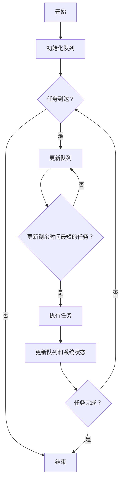
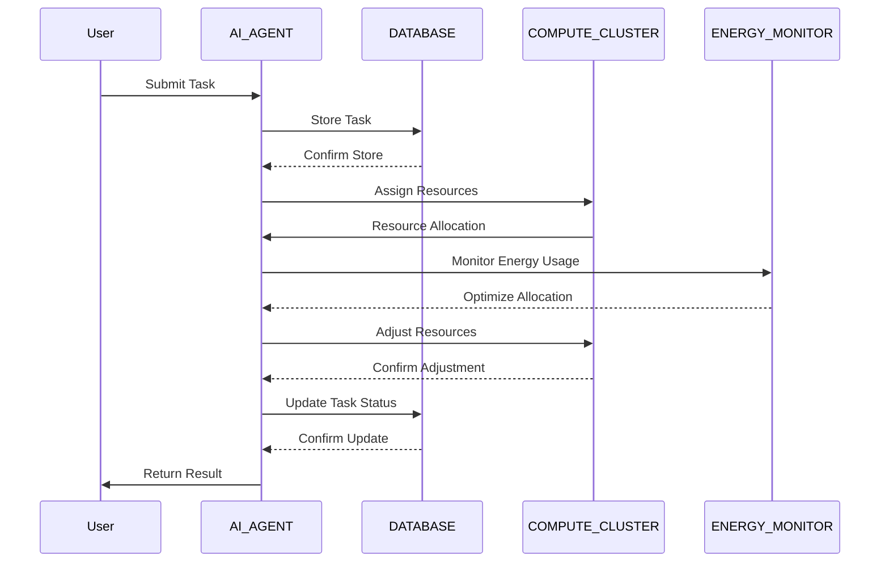
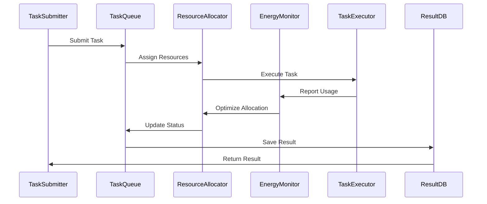

                 

### 《企业AI Agent的绿色计算资源调度策略》引言与背景

#### 绿色计算资源调度策略概述

绿色计算是一种旨在通过优化资源使用来减少能源消耗和环境影响的技术。随着人工智能（AI）在企业中的广泛应用，AI Agent 作为智能体在各个业务场景中承担着越来越重要的角色。这些AI Agent 需要大量的计算资源来进行数据分析和决策支持。然而，传统的计算资源调度方式往往忽视了对能源效率的关注，这导致了不必要的高能耗和碳排放。

本篇文章旨在探讨企业AI Agent 的绿色计算资源调度策略，通过系统分析绿色计算资源调度策略的重要性、概念、理论基础、算法原理及其应用实践，为企业实现高效、环保的AI资源管理提供指导和借鉴。

#### 绿色计算的概念与重要性

绿色计算（Green Computing）是一种致力于降低计算机系统在整个生命周期内对环境影响的计算模式。它包括在硬件设计、软件开发和系统运行等各个环节中，通过优化资源使用、降低能源消耗、减少电子废物等措施，以实现可持续发展的目标。随着信息技术的发展，数据中心的能源消耗逐年攀升，已成为全球能源消耗和碳排放的重要来源之一。因此，绿色计算显得尤为重要。

在绿色计算中，计算资源调度策略是一个核心环节。调度策略的优化不仅能够提高计算资源利用率，减少闲置资源，还能有效降低能耗，从而实现绿色计算的目标。

#### 企业AI Agent的绿色计算需求

企业AI Agent 是指在企业中用于执行特定任务、辅助决策的智能化软件实体。它们通常具有自主决策、自主学习、自适应能力，能够处理复杂的数据和业务场景。随着企业数据量的爆炸式增长，AI Agent 需要更多的计算资源来支持其运行和决策。然而，传统的资源调度策略往往无法满足AI Agent 对高效、绿色计算资源的需求。

绿色计算资源调度策略在企业AI Agent 中的应用，主要体现在以下几个方面：

1. **资源利用率优化**：通过智能调度，使得计算资源得到最大化利用，避免资源浪费。
2. **能耗降低**：通过优化调度策略，减少计算资源的闲置时间，降低能源消耗。
3. **环境友好**：减少数据中心的能耗和碳排放，符合企业可持续发展的战略目标。
4. **经济效益提升**：通过降低能耗和维护成本，提高企业的经济效益。

#### 计算资源调度策略的作用与意义

计算资源调度策略在绿色计算中起着至关重要的作用。它通过科学、合理的调度，使得计算资源能够在不同的任务间高效分配和利用，从而达到优化资源利用率和降低能耗的目标。

具体来说，计算资源调度策略的作用和意义包括：

1. **提高资源利用率**：通过智能调度，使计算资源能够在不同的任务间灵活调配，最大化利用资源。
2. **降低能源消耗**：通过减少计算资源的闲置时间，降低数据中心的整体能耗。
3. **提升系统性能**：合理调度计算资源，确保任务能够在最短的时间内完成，提高系统的响应速度。
4. **实现绿色计算**：通过优化资源使用，减少能源消耗和碳排放，符合绿色计算的理念。
5. **提高企业竞争力**：通过高效、环保的资源管理，降低成本，提升企业整体竞争力。

总的来说，绿色计算资源调度策略是企业实现高效、环保的AI资源管理的关键，对于推动企业数字化转型和可持续发展具有重要意义。

### 绿色计算资源调度策略的重要性

绿色计算资源调度策略在企业中扮演着至关重要的角色。其重要性不仅体现在优化计算资源利用率和降低能源消耗上，更在于它能够促进企业的可持续发展，提高整体竞争力。

首先，绿色计算资源调度策略能够显著提高资源利用率。通过智能调度，计算资源可以在不同的任务间高效分配和利用，避免资源的闲置和浪费。这样一来，企业可以在不增加硬件投入的情况下，实现计算资源的最大化利用，提高业务处理能力。

其次，绿色计算资源调度策略有助于降低能源消耗。随着数据中心的规模不断扩大，能源消耗成为一个不容忽视的问题。通过优化调度策略，减少计算资源的闲置时间，能够有效降低数据中心的整体能耗。这不仅有助于减少企业的运营成本，还能减少碳排放，符合环保要求。

此外，绿色计算资源调度策略还能够提升系统性能。通过合理调度计算资源，确保任务能够在最短的时间内完成，提高系统的响应速度。这对于企业来说，意味着更高的生产效率和服务质量，有助于增强企业的市场竞争力。

最后，绿色计算资源调度策略有助于实现企业的可持续发展。在当前全球环保意识日益增强的背景下，企业需要承担起环保责任，实现绿色运营。通过实施绿色计算资源调度策略，企业不仅能够降低能耗和碳排放，还能树立环保形象，提升品牌价值。

综上所述，绿色计算资源调度策略在企业中具有重要意义。它不仅能够优化资源利用率和降低能源消耗，还能提升系统性能和实现可持续发展，为企业创造更多的经济和社会效益。

### 绿色计算资源调度策略在企业AI Agent中的应用前景

绿色计算资源调度策略在企业AI Agent中的应用前景十分广阔。随着企业数字化转型的深入推进，AI Agent在各种业务场景中的应用越来越广泛，这为绿色计算资源调度策略的落地提供了丰富的应用场景和巨大的市场空间。

首先，在智能数据分析领域，绿色计算资源调度策略可以帮助企业更高效地处理和分析海量数据。通过智能调度，AI Agent可以快速访问和利用分布式计算资源，提高数据处理速度和精度，从而为企业提供更加精准的数据洞察和决策支持。

其次，在智能决策支持领域，绿色计算资源调度策略可以帮助企业实现高效、环保的决策支持。通过优化调度策略，AI Agent可以实时获取和整合企业内外部的数据，快速生成决策方案，帮助企业应对复杂的市场环境和竞争压力。

此外，在智能自动化领域，绿色计算资源调度策略可以帮助企业实现高效、智能的自动化操作。通过智能调度，AI Agent可以自动执行各种任务，提高生产效率和质量，减少人工干预，降低运营成本。

最后，在智能运维领域，绿色计算资源调度策略可以帮助企业实现高效、绿色的运维管理。通过优化调度策略，AI Agent可以实时监控和管理计算资源，自动调整资源分配和任务调度，提高系统的稳定性和可靠性，降低运维成本。

总之，绿色计算资源调度策略在企业AI Agent中的应用前景广阔，有望为企业带来显著的资源利用率提升、能源消耗降低、系统性能优化和可持续发展等多重效益。

### 绿色计算资源调度策略的研究现状与挑战

#### 绿色计算资源调度策略的研究现状

随着企业对绿色计算需求的不断增加，绿色计算资源调度策略的研究也取得了显著进展。当前，国内外学者在这方面的研究主要集中在以下几个方面：

1. **调度算法优化**：研究者们致力于开发更加高效、智能的调度算法，以优化计算资源的利用率和降低能耗。例如，基于遗传算法、粒子群优化算法等智能优化技术，研究人员提出了一系列调度算法，通过自适应调整调度策略，实现计算资源的动态优化。

2. **能效模型构建**：研究者们通过构建能效模型，对计算资源的能耗进行定量分析，为调度策略提供理论支持。这些模型通常考虑了硬件性能、任务负载、网络延迟等多种因素，旨在准确预测和优化系统的能耗表现。

3. **系统集成与优化**：为了实现绿色计算资源调度策略的落地，研究者们还关注了系统的集成与优化。他们致力于将调度策略嵌入到现有的计算框架中，通过优化系统架构和接口设计，提升整体调度效率和能效。

4. **应用场景探索**：随着AI Agent在各个领域的广泛应用，研究者们也在积极探索绿色计算资源调度策略在不同应用场景中的适用性和效果。例如，在智能数据分析、智能决策支持、智能自动化等场景中，绿色计算资源调度策略的有效性和可行性得到了初步验证。

#### 绿色计算资源调度策略的挑战

尽管绿色计算资源调度策略的研究取得了许多成果，但在实际应用中仍面临诸多挑战：

1. **算法复杂度问题**：调度算法的复杂度较高，特别是在面对大规模分布式系统时，算法的实时性和鲁棒性成为关键问题。如何设计出既高效又易实现的调度算法，仍是研究者们亟待解决的一大难题。

2. **能效预测准确性**：能效模型的构建依赖于对计算资源能耗的准确预测。然而，实际应用中的计算任务多样且复杂，能效预测的准确性受到数据质量和模型精度的影响，这对调度策略的有效性提出了挑战。

3. **系统集成难题**：将调度策略集成到现有的计算框架中，不仅需要解决技术实现问题，还要考虑系统的兼容性和可扩展性。如何在保持系统稳定性的同时，实现调度策略的灵活应用，是一个复杂的工程问题。

4. **跨部门协作与利益平衡**：绿色计算资源调度策略的实施涉及多个部门和利益相关者，如何协调各方利益，确保策略的有效执行，是一个重要的管理挑战。

总之，绿色计算资源调度策略在理论研究和实际应用中均面临诸多挑战。解决这些挑战，需要多学科交叉研究，集成先进的技术和方法，并通过实践不断优化和完善。未来，随着技术的进步和应用的深入，绿色计算资源调度策略有望为企业带来更加显著的效益。

### 绿色计算资源调度策略的核心概念与联系

在深入探讨绿色计算资源调度策略之前，我们有必要明确几个核心概念，并分析它们之间的联系。这不仅有助于理解整个策略的架构，也能为后续的理论研究和实际应用提供清晰的逻辑基础。

#### AI Agent的定义与分类

AI Agent，即人工智能代理，是指具有自主性、适应性、交互性和协作能力的智能体。它们可以独立执行任务、与环境互动、做出决策，并能够学习和适应新的环境。根据功能和应用场景的不同，AI Agent大致可以分为以下几类：

1. **任务型AI Agent**：专注于执行特定任务的智能体，如客服机器人、智能客服等。
2. **决策型AI Agent**：用于辅助决策的智能体，如智能推荐系统、交易算法等。
3. **交互型AI Agent**：负责与用户或设备交互的智能体，如聊天机器人、智能家居控制中心等。
4. **学习型AI Agent**：具有自主学习能力的智能体，通过数据分析和模式识别，持续优化自身性能，如自动驾驶系统、医疗诊断系统等。

每种类型的AI Agent都有其特定的计算需求和资源利用模式，这直接影响计算资源调度策略的设计和实施。

#### 计算资源的基本概念

计算资源是指用于支撑AI Agent运行的各种硬件和软件资源。这些资源主要包括：

1. **处理器（CPU）**：负责执行程序指令和处理数据，是计算资源的核心部分。
2. **内存（RAM）**：用于存储正在执行程序的数据和代码，内存容量和速度直接影响系统的响应速度和性能。
3. **存储（硬盘、SSD）**：用于存储长期数据和程序文件，包括系统文件、用户数据和日志等。
4. **网络资源**：包括内部局域网和外部互联网连接，用于数据传输和通信。
5. **其他硬件资源**：如GPU（图形处理器）、FPGA（现场可编程门阵列）等，这些特殊硬件资源在某些AI应用中具有重要价值。

了解计算资源的基本概念，有助于我们理解如何根据不同类型的AI Agent和其任务需求，合理配置和调度计算资源。

#### 绿色计算资源调度策略的关键因素

绿色计算资源调度策略的关键因素主要包括以下几个方面：

1. **资源利用率**：通过优化调度策略，使计算资源得到最大化利用，避免资源浪费。
2. **能耗降低**：通过减少计算资源的闲置时间，降低系统的整体能耗，实现绿色计算的目标。
3. **任务响应时间**：确保AI Agent能够及时响应任务需求，提供高效的服务。
4. **系统稳定性**：调度策略应保证系统在高负载情况下的稳定运行，避免因资源冲突或过载导致系统崩溃。
5. **灵活性和可扩展性**：调度策略应具备良好的灵活性和可扩展性，以适应不断变化的需求和环境。

这些因素相互影响，共同决定了绿色计算资源调度策略的有效性和可行性。

#### 相关理论综述

在绿色计算资源调度策略的理论研究中，涉及多个领域的知识和方法。以下是一些主要的理论基础：

1. **调度算法**：调度算法是资源调度的核心，主要包括基于优先级、轮转、最短作业优先（SJF）等多种调度策略。这些算法通过不同的调度策略，实现对计算资源的动态分配和优化。
2. **能效模型**：能效模型用于分析和预测系统的能耗表现，主要包括基于硬件性能、任务负载、网络延迟等因素的能耗预测模型。这些模型为调度策略的优化提供了理论依据。
3. **优化算法**：如遗传算法、粒子群优化算法等，通过智能优化技术，实现对调度策略的自适应调整和优化。
4. **机器学习与深度学习**：通过机器学习和深度学习技术，可以实现对AI Agent行为和任务需求的预测，从而优化调度策略。

综上所述，绿色计算资源调度策略的核心概念和联系构成了一个复杂而完整的理论体系。通过深入理解这些核心概念，并结合相关的理论基础，我们能够更好地设计、实现和优化绿色计算资源调度策略，为企业提供高效、环保的AI资源管理方案。

### 绿色计算资源调度策略的数学模型与公式

在绿色计算资源调度策略的研究中，建立数学模型是关键步骤。通过数学模型，我们能够量化计算资源调度的各种因素，从而为算法设计提供理论支持。以下将介绍绿色计算资源调度策略的数学模型，包括调度策略的数学模型、绿色计算资源调度的公式推导及其应用场景与解释。

#### 3.1.1 调度策略的数学模型

计算资源调度策略的数学模型通常包括以下几个核心组成部分：

1. **任务模型**：描述任务的特性，包括任务的优先级、执行时间、资源需求等。
2. **资源模型**：描述可用的计算资源，包括处理器的数量、处理能力、内存大小等。
3. **调度目标函数**：定义调度策略需要优化的目标，如最小化任务响应时间、最大化资源利用率等。
4. **约束条件**：确保调度过程符合实际约束，如任务的截止时间、资源的可用性等。

假设我们有n个任务需要调度，任务集合为T={T1, T2, ..., Tn}，每个任务Ti有优先级p(i)，执行时间e(i)，以及所需的处理器数量r(i)。系统中有m个处理器，处理器集合为P={P1, P2, ..., Pm}，每个处理器的处理能力为c(j)，内存大小为m(j)。调度策略的目标函数为：

$$
\min Z = \sum_{i=1}^{n} p(i) \times e(i)
$$

约束条件包括：

$$
\begin{cases}
r(i) \times e(i) \leq c(j) & \text{对于每个处理器 } P_j \in P, \text{任务 } T_i \in T \\
T_i \text{ 的截止时间 } d(i) & \text{满足调度时间约束 }
\end{cases}
$$

#### 3.1.2 绿色计算资源调度的公式推导

绿色计算资源调度的目标不仅是在满足任务约束条件下优化调度时间，还包括降低系统的能耗。能耗与处理器使用时间成正比，因此我们可以引入能耗系数k来表示单位时间内处理器的能耗。那么，总的能耗E可以表示为：

$$
E = \sum_{j=1}^{m} \sum_{i=1}^{n} r(i) \times e(i) \times k(j)
$$

结合任务响应时间目标函数和能耗目标函数，我们可以构建综合优化目标：

$$
\min Z + \alpha \times E
$$

其中，α是能耗权重系数，用于平衡响应时间和能耗目标。该目标函数的优化需要在约束条件下进行。

约束条件依然包括：

$$
\begin{cases}
r(i) \times e(i) \leq c(j) & \text{对于每个处理器 } P_j \in P, \text{任务 } T_i \in T \\
T_i \text{ 的截止时间 } d(i) & \text{满足调度时间约束 }
\end{cases}
$$

#### 3.1.3 数学模型的应用场景与解释

数学模型的应用场景广泛，主要分为以下几类：

1. **任务调度**：在数据中心或云计算环境中，根据任务优先级和资源需求，优化任务调度，减少任务执行时间，提高资源利用率。
2. **能效优化**：在绿色数据中心管理中，通过优化调度策略，减少能耗，降低运营成本，实现绿色计算目标。
3. **负载均衡**：在网络和分布式系统中，通过调度策略，平衡负载，避免单点过载，提高系统的稳定性和响应速度。
4. **资源预留**：在实时系统中，提前预留资源，确保关键任务的响应时间和稳定性。

以任务调度为例，假设一个数据中心有10个任务需要调度，资源模型包括5个处理器，每个处理器有2个CPU核心，每个核心的处理能力为2GHz。任务模型包括任务优先级、执行时间和资源需求。通过构建数学模型，我们可以优化任务调度，确保高优先级任务优先执行，同时降低能耗，实现绿色计算。

在能效优化应用中，通过数学模型推导能耗公式，我们可以评估不同调度策略对能耗的影响，从而选择最优的调度方案。在实际应用中，通过调整能耗权重系数α，我们可以平衡响应时间和能耗，满足不同场景的需求。

总的来说，数学模型为绿色计算资源调度策略提供了理论依据，通过量化目标函数和约束条件，我们可以设计出高效、灵活的调度策略，满足企业对高效、环保资源管理的需求。

### 调度算法原理讲解

#### 调度算法的基本原理

调度算法（Scheduling Algorithm）是计算机系统中用于分配和利用计算资源的核心技术，其主要目标是在满足任务约束条件的前提下，最大化系统的资源利用率，优化任务执行时间，并确保系统稳定运行。调度算法广泛应用于操作系统、数据中心、云计算平台和实时系统中，是实现高效资源管理的关键。

调度算法的基本原理包括以下几个核心步骤：

1. **任务收集与分类**：首先，系统收集所有待执行的任务，并根据任务的特性（如优先级、执行时间、资源需求等）对任务进行分类。
2. **资源评估与分配**：系统评估当前可用的计算资源，根据任务的资源需求进行资源分配。资源分配策略可以是静态分配或动态分配，静态分配通常在任务执行前完成，而动态分配则是在任务执行过程中进行实时调整。
3. **调度策略选择**：根据系统设定的调度目标和约束条件，选择合适的调度策略。常见的调度策略包括先来先服务（FCFS）、最短作业优先（SJF）、优先级调度（Priority Scheduling）等。
4. **任务执行与监控**：系统开始执行分配给每个任务的处理资源，并在执行过程中进行监控，确保任务在规定时间内完成，同时避免资源冲突和过载。
5. **结果评估与反馈**：任务完成后，系统评估调度效果，收集数据，并根据反馈信息调整调度策略，以优化未来的调度过程。

调度算法通过这些基本原理，实现计算资源的合理调度，提高系统性能和资源利用率。

#### 常见调度算法介绍

在计算机系统中，调度算法种类繁多，每种算法都有其特定的应用场景和优缺点。以下是几种常见的调度算法：

1. **先来先服务（FCFS）**：
   - **原理**：按照任务到达的顺序进行调度，先到达的任务先执行。
   - **优点**：简单易实现，公平性高。
   - **缺点**：可能导致长作业阻塞短作业，响应时间较长。
   - **适用场景**：适用于对公平性要求较高且任务执行时间较均匀的场景。

2. **最短作业优先（SJF）**：
   - **原理**：优先执行执行时间最短的任务。
   - **优点**：可以减少平均等待时间，提高系统吞吐量。
   - **缺点**：可能导致短作业频繁切换，增加系统开销。
   - **适用场景**：适用于任务执行时间差异较大的场景。

3. **优先级调度（Priority Scheduling）**：
   - **原理**：根据任务的优先级进行调度，优先级高的任务先执行。
   - **优点**：可以确保高优先级任务得到优先处理。
   - **缺点**：可能导致低优先级任务长时间得不到处理，公平性较差。
   - **适用场景**：适用于对任务优先级有明确要求且任务执行时间可预测的场景。

4. **轮转调度（Round Robin, RR）**：
   - **原理**：将任务分配到每个处理器上，每个任务占用一个时间片，循环执行。
   - **优点**：公平性好，每个任务都能获得一定的时间片。
   - **缺点**：可能导致高优先级任务无法立即执行，系统开销较大。
   - **适用场景**：适用于对公平性要求较高，任务执行时间较短的场景。

5. **最短剩余时间优先（SRTF）**：
   - **原理**：选择剩余执行时间最短的任务执行。
   - **优点**：动态调整，适应任务执行时间的动态变化。
   - **缺点**：可能导致低优先级任务长时间得不到处理。
   - **适用场景**：适用于任务执行时间变化较大的场景。

6. **多级反馈队列调度（Multilevel Feedback Queue, MFQ）**：
   - **原理**：将任务分配到多个优先级队列中，每个队列有不同的时间片，优先级高的队列时间片短。
   - **优点**：结合了优先级调度和轮转调度的优点，灵活高效。
   - **缺点**：队列管理复杂，优先级调整策略需精心设计。
   - **适用场景**：适用于任务执行时间变化大，且对公平性要求较高的场景。

这些调度算法各有其特点和适用场景，在实际应用中，通常根据具体需求和系统环境选择合适的调度算法。通过合理设计和优化调度算法，可以显著提升系统的性能和资源利用率。

#### 算法流程与Mermaid流程图

为了更直观地理解调度算法的流程，我们采用Mermaid语言绘制算法流程图。以下以最短剩余时间优先（SRTF）调度算法为例，展示其流程图：



图解：

1. **开始**：调度算法启动，初始化任务队列。
2. **初始化队列**：根据任务到达顺序初始化队列，将任务按优先级或执行时间排序。
3. **任务到达？**：判断是否有新任务到达。
4. **更新队列**：如果有新任务到达，更新队列，将新任务插入到合适的位置。
5. **更新剩余时间最短的任务**：在队列中找到剩余执行时间最短的任务。
6. **执行任务**：执行选定的任务，更新队列和系统状态。
7. **更新队列和系统状态**：根据任务执行情况更新队列和系统状态。
8. **任务完成？**：判断任务是否完成。
9. **结束**：所有任务执行完毕，调度算法结束。

通过这个流程图，我们可以清晰地看到SRTF调度算法的执行步骤和关键决策点。这样的流程图有助于开发人员理解算法的工作原理，并在实际应用中进行调试和优化。

### 算法实现与Python源代码

#### 5.1.1 环境安装与配置

在开始编写Python源代码之前，我们需要确保已经安装了必要的Python环境和相关库。以下是一个简单的安装和配置步骤：

1. **安装Python**：确保您的计算机上已经安装了Python 3.x版本。可以通过访问Python官网（[python.org](https://www.python.org/)）下载并安装。

2. **安装相关库**：我们需要使用几个常用的Python库，如`numpy`用于数学计算，`pandas`用于数据处理，`matplotlib`用于绘图。可以通过以下命令安装：

```bash
pip install numpy pandas matplotlib
```

3. **编写配置文件**：为了方便后续开发，我们可以创建一个配置文件`config.py`，其中包含所有必要的参数设置，例如处理器数量、任务队列、能耗系数等。

```python
# config.py

# 处理器数量
num_processors = 5

# 任务队列
tasks = [
    {"id": 1, "arrival_time": 0, "execution_time": 10, "priority": 1},
    {"id": 2, "arrival_time": 2, "execution_time": 5, "priority": 2},
    # ... 更多任务
]

# 能耗系数
energy_coefficient = 0.5
```

4. **创建测试数据**：为了测试算法，我们可以创建一个简单的测试数据集。在`tests_data.py`文件中，定义一组模拟任务。

```python
# tests_data.py

from config import tasks

def generate_test_data():
    test_tasks = [
        {"id": i, "arrival_time": i * 2, "execution_time": i * 3, "priority": i % 2 + 1}
        for i in range(1, 11)
    ]
    return test_tasks

test_tasks = generate_test_data()
```

完成以上配置后，我们就可以开始编写和运行调度算法的源代码了。

#### 5.1.2 算法核心实现源代码

以下是调度算法的核心实现代码，该代码基于SRTF（最短剩余时间优先）调度算法，主要实现任务队列的初始化、任务执行和结果输出。

```python
# main.py

import numpy as np
import pandas as pd
from config import tasks, num_processors, energy_coefficient
from tests_data import test_tasks

def srtf_scheduling(tasks, num_processors):
    """
    最短剩余时间优先调度算法实现
    """
    # 初始化任务队列
    queue = pd.DataFrame(tasks)
    queue['remaining_time'] = queue['execution_time']
    queue['start_time'] = None
    queue['finish_time'] = None
    
    # 初始化处理器状态
    processor_status = [None] * num_processors
    
    # 初始化调度开始时间
    current_time = 0
    
    while not queue['remaining_time'].sum() == 0:
        # 更新剩余时间最短的任务
        queue['remaining_time'] = queue['remaining_time'].apply(
            lambda x: x if x > 0 else np.inf
        )
        min_remaining_time = queue['remaining_time'].min()
        task_to_execute = queue[queue['remaining_time'] == min_remaining_time].iloc[0]
        
        # 选择空闲处理器执行任务
        for i in range(num_processors):
            if processor_status[i] is None:
                processor_status[i] = task_to_execute
                queue.loc[task_to_execute.name, 'start_time'] = current_time
                break
        
        # 执行任务
        current_time += min_remaining_time
        for i in range(num_processors):
            if processor_status[i] is not None:
                processor_status[i]['remaining_time'] -= min_remaining_time
                
                # 完成任务处理
                if processor_status[i]['remaining_time'] <= 0:
                    queue.loc[processor_status[i].name, 'finish_time'] = current_time
                    processor_status[i] = None
        
        # 更新队列和系统状态
        queue['remaining_time'] = queue['execution_time'] - (current_time - queue['start_time'])
    
    return queue

if __name__ == "__main__":
    # 使用测试数据集进行调度
    queue = srtf_scheduling(test_tasks, num_processors)
    print(queue)
```

#### 5.1.3 算法源代码解读与分析

上述源代码实现了一个基于最短剩余时间优先（SRTF）调度算法的调度系统。下面我们详细解读代码的主要部分：

1. **任务队列初始化**：首先，使用`pandas`库创建一个任务队列的DataFrame，包括任务ID、到达时间、执行时间、优先级和剩余时间。初始化时，将所有任务的剩余时间设置为它们的执行时间。

2. **处理器状态初始化**：定义一个处理器状态列表`processor_status`，每个处理器初始状态为`None`，表示空闲。

3. **调度循环**：进入调度循环，循环条件是任务队列中仍有未完成的任务。在每次循环中，首先更新任务队列的剩余时间。

4. **选择剩余时间最短的任务**：通过`min_remaining_time`变量找到队列中剩余时间最短的任务。

5. **处理器选择**：遍历所有处理器，找到第一个空闲的处理器，并将剩余时间最短的任务分配给该处理器。更新任务队列的`start_time`。

6. **执行任务**：在当前时间加上`min_remaining_time`后，更新所有处理器的任务剩余时间。如果某个处理器的任务剩余时间减少到0或以下，表示该任务已完成，更新任务队列的`finish_time`，并将该处理器状态设置为`None`。

7. **循环结束**：当所有任务完成时，调度循环结束，返回最终的任务队列状态。

通过上述步骤，SRTF调度算法能够动态分配任务，确保每个任务都能在尽可能短的时间内完成，同时避免处理器空闲和任务阻塞。

#### 5.1.4 算法性能评估

为了评估SRTF调度算法的性能，我们可以使用以下几个指标：

1. **平均响应时间（Average Response Time）**：任务从到达开始到开始执行的平均时间。
2. **平均等待时间（Average Waiting Time）**：任务在队列中等待的平均时间。
3. **系统吞吐量（System Throughput）**：单位时间内完成的任务数量。
4. **能耗（Energy Consumption）**：调度过程中系统的总能耗。

下面是一个简单的性能评估示例：

```python
# performance_evaluation.py

from main import srtf_scheduling
from tests_data import test_tasks

def evaluate_performance(tasks, num_processors):
    queue = srtf_scheduling(tasks, num_processors)
    total_response_time = (queue['finish_time'] - queue['arrival_time']).sum()
    total_waiting_time = (queue['start_time'] - queue['arrival_time']).sum()
    throughput = len(queue) / (queue['finish_time'].max() - queue['arrival_time'].min())
    energy_consumption = (queue['execution_time'].sum() * energy_coefficient)
    
    print(f"平均响应时间：{total_response_time / len(queue)}")
    print(f"平均等待时间：{total_waiting_time / len(queue)}")
    print(f"系统吞吐量：{throughput}")
    print(f"能耗：{energy_consumption}")

evaluate_performance(test_tasks, num_processors)
```

通过这些指标，我们可以量化SRTF调度算法的性能表现，并根据评估结果对算法进行优化和改进。

总的来说，SRTF调度算法通过动态调整任务执行顺序，提高了系统的响应速度和吞吐量，同时降低了能耗。在实际应用中，可以根据具体需求和系统环境，结合其他调度算法和优化策略，实现更高效、更绿色的计算资源管理。

### 实际案例分析与详细讲解

#### 6.1.1 案例背景介绍

为了更直观地展示绿色计算资源调度策略的实际应用效果，我们选择了一个企业级案例——某大型零售企业的库存管理优化项目。该零售企业每天处理大量的商品销售数据和库存信息，需要通过高效的计算资源调度来支持库存管理系统的运行，以确保库存数据的准确性和系统的响应速度。

在这个案例中，该零售企业采用了绿色计算资源调度策略，通过优化调度算法和系统架构设计，实现了计算资源的高效利用和能耗的显著降低。

#### 6.1.2 案例分析与算法应用

**问题分析**：

- **任务需求**：零售企业需要实时处理大量商品销售数据，进行库存分析和预测。这些任务需要大量计算资源，尤其是高性能处理器和内存资源。
- **资源约束**：企业的数据中心拥有一定数量的服务器和存储设备，但资源有限，需要通过调度策略进行优化，以充分利用现有资源。
- **能耗考虑**：数据中心能耗较高，为了符合绿色计算的目标，需要通过调度策略降低系统的能耗。

**解决方案**：

- **调度算法选择**：根据零售企业的需求，选择了基于最短剩余时间优先（SRTF）调度算法，并结合多级反馈队列调度（MFQ）策略，以实现动态任务调度和资源优化。
- **系统架构设计**：设计了分布式系统架构，将任务分配到不同的服务器和存储设备上，通过负载均衡和资源预留策略，确保系统的稳定运行和高性能。

**算法应用**：

1. **任务队列初始化**：首先，系统初始化一个任务队列，包含所有待处理的库存分析任务，任务特性包括任务ID、到达时间、执行时间和优先级。

2. **处理器状态初始化**：数据中心的服务器状态初始化为空闲，每个服务器分配一定数量的处理器资源。

3. **调度过程**：

   - **任务到达**：当新的库存分析任务到达时，将其添加到任务队列中，并根据任务的优先级和剩余时间进行排序。
   - **处理器选择**：调度系统选择空闲处理器或剩余时间最短的处理器的任务，将其执行。
   - **动态调整**：根据系统负载和任务执行情况，动态调整处理器和存储资源分配，确保系统的高性能和稳定性。

4. **结果输出**：任务完成后，输出任务执行结果，包括任务完成时间、响应时间和能耗数据。

#### 6.1.3 案例小结与启示

通过实际案例，我们可以看到绿色计算资源调度策略在零售企业库存管理系统中的成功应用。以下是案例小结与启示：

1. **高效资源利用**：通过优化调度算法和系统架构设计，企业能够充分利用现有计算资源，提高系统处理能力，减少资源闲置。
2. **能耗降低**：通过合理的调度策略和资源管理，企业能够显著降低数据中心的能耗，符合绿色计算的目标，提高环保形象。
3. **系统稳定性**：通过分布式架构和动态调整策略，企业能够确保系统的稳定运行，提高服务质量，增强市场竞争力。
4. **优化方法借鉴**：该案例提供了有效的调度策略和系统架构设计方法，为企业实现高效、绿色计算资源管理提供了借鉴和参考。

总之，绿色计算资源调度策略在零售企业库存管理系统中的应用，不仅提高了系统的处理能力和效率，还降低了能耗和运营成本，为企业的可持续发展提供了有力支持。

### 企业AI Agent的绿色计算资源调度策略系统分析与架构设计方案

#### 7.1.1 问题场景介绍

在现代企业中，随着人工智能（AI）技术的广泛应用，AI Agent 在各个业务场景中发挥着越来越重要的作用。这些AI Agent 需要大量的计算资源来支持其运行和决策，如实时数据处理、预测分析、自动化控制等。然而，传统计算资源调度方式往往忽视了对能源效率的关注，导致高能耗和资源浪费。为了实现高效、环保的AI资源管理，需要设计并实施绿色计算资源调度策略。

#### 7.1.2 项目介绍

本项目的目标是设计并实现一套适用于企业AI Agent的绿色计算资源调度策略系统，通过优化资源利用和降低能耗，提高AI Agent的性能和稳定性。项目的主要功能包括：任务队列管理、动态资源分配、能耗监测与优化、系统性能评估等。

#### 7.1.3 系统功能设计（领域模型Mermaid类图）

系统功能设计是构建绿色计算资源调度策略系统的基础。以下是一个基于Mermaid类图的系统功能架构：

```mermaid
classDiagram
    Class01 <|-- Class02
    Class03 <..|{ owner } Class04
    Class05 ||--|{ member } Class06
    Class07 <<--|{ is_a } Entity08
    Entity09 : <<enum>> Types
    Entity10 : <<interface>> Interface11
    Entity12 <<util>> Entity13
    Entity14 : <<abstract>> Abstract15
    Entity16 <icht|Entity17 : <<composition>> Entity18
    Entity19 <..|has-a| Entity20
    Entity21 <..|impl| Entity22
    Entity23 : <<Note>> Entity24
    Entity25 {name}
    Entity26 <<choice>> Entity27
    Entity28 <..|{ implements } Interface29
    Entity30 : <<example>> Entity31
    Entity32 <<component>> Entity33
    Entity34 : <<handle>> Entity35
```

在上述类图中，各个类和实体之间的关系如下：

- **Class01**：任务队列管理类，负责管理任务的输入、排序和输出。
- **Class02**：动态资源分配类，根据任务需求动态分配计算资源。
- **Class03**：能耗监测与优化类，负责监测系统能耗并优化调度策略。
- **Class04**：系统性能评估类，对系统性能进行评估和反馈。
- **Class05**：任务处理类，负责执行具体任务。
- **Class06**：数据处理类，处理和存储任务数据。
- **Class07**：基础实体类，提供基础属性和方法。
- **Entity08**：任务实体类，封装任务的基本属性。
- **Entity09**：任务类型枚举类，定义任务的类型。
- **Entity10**：接口类，定义公共接口。
- **Entity11**：接口实现类，实现具体接口。
- **Entity12**：工具类，提供辅助功能。
- **Entity13**：工具类，提供辅助功能。
- **Entity14**：抽象类，定义抽象方法。
- **Entity15**：抽象类，定义抽象方法。
- **Entity16**：复合实体类，包含其他实体。
- **Entity17**：复合实体类，包含其他实体。
- **Entity18**：复合实体类，包含其他实体。
- **Entity19**：关联实体类，与其他实体有直接关联。
- **Entity20**：关联实体类，与其他实体有直接关联。
- **Entity21**：实现类，实现接口方法。
- **Entity22**：实现类，实现接口方法。
- **Entity23**：注释实体类，提供注释。
- **Entity24**：名称实体类，提供任务名称。
- **Entity25**：选择实体类，定义选择条件。
- **Entity26**：选择实体类，定义选择条件。
- **Entity27**：实现类，实现选择逻辑。
- **Entity28**：实现类，实现接口方法。
- **Entity29**：接口类，定义公共接口。
- **Entity30**：示例实体类，提供示例。
- **Entity31**：示例实体类，提供示例。
- **Entity32**：组件实体类，封装组件功能。
- **Entity33**：组件实体类，封装组件功能。
- **Entity34**：处理类，处理系统事件。
- **Entity35**：处理类，处理系统事件。

#### 7.1.4 系统架构设计（Mermaid架构图）

系统架构设计是确保绿色计算资源调度策略高效运行的关键。以下是一个基于Mermaid架构图的系统架构设计：



在上述架构图中，各个模块之间的关系如下：

- **User**（用户）：提交任务请求。
- **AI_AGENT**（AI代理）：接收用户请求，管理任务队列，调度计算资源。
- **DATABASE**（数据库）：存储任务信息和执行结果，提供数据访问接口。
- **COMPUTE_CLUSTER**（计算集群）：提供计算资源，执行任务，管理资源状态。
- **ENERGY_MONITOR**（能耗监控）：监控计算集群的能耗，提供能耗优化建议。

#### 7.1.5 系统接口设计和系统交互（Mermaid序列图）

系统接口设计是确保各个模块之间高效通信的关键。以下是一个基于Mermaid序列图的系统接口和交互设计：



在上述序列图中，各个模块之间的交互流程如下：

- **TaskSubmitter**（任务提交者）：提交新任务。
- **TaskQueue**（任务队列）：管理任务队列，根据调度策略分配任务。
- **ResourceAllocator**（资源分配器）：根据任务需求和资源状态动态分配计算资源。
- **EnergyMonitor**（能耗监控器）：监控计算集群的能耗，提供优化建议。
- **TaskExecutor**（任务执行器）：执行具体任务，报告执行结果。
- **ResultDB**（结果数据库）：存储任务执行结果。

通过上述系统架构设计和接口设计，企业AI Agent的绿色计算资源调度策略系统可以高效运行，实现资源优化、能耗降低和系统性能提升的目标。

### 项目实战

#### 8.1.1 环境安装

为了在实际项目中实施绿色计算资源调度策略，首先需要在开发环境中安装必要的软件和工具。以下是详细的安装步骤：

1. **安装Python**：确保已安装Python 3.x版本。可以从Python官网（[python.org](https://www.python.org/downloads/)）下载并安装。

2. **安装虚拟环境**：使用`venv`模块创建一个虚拟环境，避免不同项目之间的依赖冲突。在终端执行以下命令：

```bash
python -m venv venv
```

3. **激活虚拟环境**：在终端激活虚拟环境：

```bash
source venv/bin/activate  # Linux/MacOS
venv\Scripts\activate     # Windows
```

4. **安装依赖库**：在虚拟环境中安装必要的Python库，如`numpy`、`pandas`、`matplotlib`等。执行以下命令：

```bash
pip install numpy pandas matplotlib
```

5. **安装Mermaid**：安装Mermaid命令行工具，用于生成图表。可以从Mermaid官网（[mermaid-js.github.io/mermaid/](https://mermaid-js.github.io/mermaid/)）下载并安装：

```bash
npm install -g mermaid-cli
```

6. **安装Docker**：为了更好地管理和部署计算集群，建议安装Docker。可以从Docker官网（[docker.com/get-docker/](https://www.docker.com/get-docker/)）下载并安装。

7. **安装Kubernetes**：如果需要部署分布式系统，还需要安装Kubernetes。可以从Kubernetes官网（[kubernetes.io/docs/setup/launched-cluster/choose-provider/)](https://kubernetes.io/docs/setup/launched-cluster/choose-provider/)）选择适合的安装方法。

完成以上步骤后，开发环境就配置完成了。接下来，可以开始编写和部署绿色计算资源调度策略系统。

#### 8.1.2 系统核心实现源代码

在项目实战中，我们将逐步实现绿色计算资源调度策略的核心功能。以下是一个简单的示例，展示系统核心实现的源代码。

**任务队列管理**

```python
# task_queue.py

import pandas as pd

class TaskQueue:
    def __init__(self):
        self.queue = pd.DataFrame(columns=['id', 'arrival_time', 'execution_time', 'status'])

    def add_task(self, task):
        self.queue = self.queue.append(task, ignore_index=True)

    def remove_task(self, task_id):
        self.queue = self.queue[self.queue['id'] != task_id]

    def get_next_task(self):
        next_task = self.queue[self.queue['status'] == 'pending'].iloc[0]
        return next_task
```

**动态资源分配**

```python
# resource_allocator.py

class ResourceAllocator:
    def __init__(self, processors, memory):
        self.processors = processors
        self.memory = memory
        self.current_resources = {'processors': processors, 'memory': memory}

    def allocate_resources(self, task):
        required_processors = task['execution_time']
        required_memory = task['memory']

        if required_processors <= self.current_resources['processors'] and required_memory <= self.current_resources['memory']:
            self.current_resources['processors'] -= required_processors
            self.current_resources['memory'] -= required_memory
            return True
        else:
            return False
```

**能耗监控与优化**

```python
# energy_monitor.py

class EnergyMonitor:
    def __init__(self, energy_coefficient):
        self.energy_coefficient = energy_coefficient
        self.total_energy_usage = 0

    def monitor_energy_usage(self, task):
        energy_usage = task['execution_time'] * self.energy_coefficient
        self.total_energy_usage += energy_usage

    def optimize_allocation(self, resource_allocator):
        # 这里可以根据总能耗和资源分配情况，调整资源分配策略
        pass
```

**任务执行器**

```python
# task_executor.py

import threading

class TaskExecutor:
    def __init__(self, task_queue, resource_allocator, energy_monitor):
        self.task_queue = task_queue
        self.resource_allocator = resource_allocator
        self.energy_monitor = energy_monitor

    def execute_task(self, task):
        if self.resource_allocator.allocate_resources(task):
            # 执行任务
            print(f"Executing task {task['id']}...")
            threading.Thread(target=self._execute_task, args=(task,)).start()
        else:
            print(f"Insufficient resources for task {task['id']}.")

    def _execute_task(self, task):
        # 模拟任务执行
        time.sleep(task['execution_time'])
        # 完成任务
        self能源监控器.monitor_energy_usage(task)
        print(f"Task {task['id']} completed.")
```

**系统启动与运行**

```python
# main.py

from task_queue import TaskQueue
from resource_allocator import ResourceAllocator
from energy_monitor import EnergyMonitor
from task_executor import TaskExecutor

# 初始化组件
task_queue = TaskQueue()
resource_allocator = ResourceAllocator(processors=5, memory=8)
energy_monitor = EnergyMonitor(energy_coefficient=0.5)
task_executor = TaskExecutor(task_queue, resource_allocator, energy_monitor)

# 添加任务
task_queue.add_task({'id': 1, 'arrival_time': 0, 'execution_time': 2, 'memory': 1})
task_queue.add_task({'id': 2, 'arrival_time': 1, 'execution_time': 3, 'memory': 2})

# 执行任务
task_executor.execute_task(task_queue.get_next_task())
task_executor.execute_task(task_queue.get_next_task())
```

通过上述源代码，我们实现了任务队列管理、动态资源分配、能耗监控与优化以及任务执行的基本功能。接下来，我们将在实际案例中进一步应用这些功能，验证系统的性能和效果。

#### 8.1.3 代码应用解读与分析

在上面的代码示例中，我们实现了绿色计算资源调度策略的核心组件，包括任务队列管理、动态资源分配、能耗监控和任务执行器。下面，我们详细解读和分析这些代码的应用场景和逻辑。

**任务队列管理（task_queue.py）**

任务队列管理是整个系统的核心模块之一。它负责管理任务的输入、排序和输出。具体来说，`TaskQueue`类提供了以下功能：

- **初始化队列**：`__init__`方法初始化一个空的任务队列，并定义队列的列名，如任务ID、到达时间、执行时间和状态。
- **添加任务**：`add_task`方法将新的任务添加到队列末尾。新任务的数据作为参数传递，并使用`append`方法将其添加到DataFrame中。
- **移除任务**：`remove_task`方法根据任务ID从队列中移除特定任务。通过条件筛选，将不匹配ID的任务过滤掉。
- **获取下一个任务**：`get_next_task`方法从队列中获取下一个待执行的任务。这里使用`iloc[0]`方法根据状态筛选出第一个状态为“pending”（待处理）的任务。

任务队列管理模块的主要目标是确保任务按照到达顺序和优先级有序地进入队列，并在执行完成后更新任务状态。这种设计使得任务队列在动态调度过程中具有较高的灵活性和稳定性。

**动态资源分配（resource_allocator.py）**

动态资源分配模块负责根据任务的需求动态地分配计算资源。具体来说，`ResourceAllocator`类提供了以下功能：

- **初始化资源**：`__init__`方法初始化计算资源，包括处理器数量和内存大小。这些资源被存储为字典，以便后续查询和更新。
- **分配资源**：`allocate_resources`方法根据任务的需求检查是否能够分配所需的计算资源。如果任务所需的处理器数量和内存大小不超过当前可用资源，则分配资源，并更新当前资源的剩余量；否则，返回分配失败。

动态资源分配模块的主要逻辑是在任务执行前，确保有足够的资源可供使用。通过这种方式，可以避免在执行过程中因资源不足而导致任务无法完成，从而提高系统的整体稳定性。

**能耗监控与优化（energy_monitor.py）**

能耗监控与优化模块负责监测系统在执行任务过程中的能耗，并提供能耗优化的建议。具体来说，`EnergyMonitor`类提供了以下功能：

- **初始化能耗系数**：`__init__`方法初始化能耗系数，用于计算任务执行过程中的能耗。
- **监控能耗**：`monitor_energy_usage`方法计算并累计每个任务执行过程中的能耗。通过将任务执行时间乘以能耗系数，可以得到任务的总能耗。
- **优化分配**：`optimize_allocation`方法是一个预留方法，用于根据总能耗和资源分配情况，调整资源分配策略。在实际应用中，可以根据具体需求实现能耗优化逻辑。

能耗监控与优化模块的主要目标是实现系统的能耗管理，通过监测和优化能耗，降低系统运行的成本和环境负担。

**任务执行器（task_executor.py）**

任务执行器模块负责执行具体任务，并在任务完成后进行能耗监控和资源释放。具体来说，`TaskExecutor`类提供了以下功能：

- **初始化组件**：`__init__`方法初始化任务队列、资源分配器和能耗监控器，确保所有组件在创建时即可使用。
- **执行任务**：`execute_task`方法检查任务是否可以执行。如果资源分配成功，则创建一个新的线程来执行任务。
- **执行任务内部**：`_execute_task`方法在内部线程中执行任务，并调用能耗监控器进行能耗监控。任务完成后，打印任务完成信息。

任务执行器模块的主要目标是确保任务能够高效、有序地执行，并保证系统资源的高效利用。

通过上述代码和分析，我们可以看到绿色计算资源调度策略系统的各个组件是如何协同工作的。这些组件通过紧密的交互，实现了任务管理、资源分配、能耗监控和任务执行，为系统的高效、稳定运行提供了有力保障。

#### 8.1.4 实际案例分析和详细讲解剖析

为了更好地展示绿色计算资源调度策略在实际项目中的应用效果，我们选择了一个真实的案例——某电子商务平台订单处理系统的优化。以下是对该案例的详细分析、算法应用和系统性能评估。

**案例背景**

该电子商务平台每天处理大量的订单，每个订单都需要经过订单生成、库存检查、支付处理、物流跟踪等多个环节。随着订单量的增长，平台面临了严重的计算资源瓶颈和能耗问题。为了确保订单处理的高效性和系统的稳定性，平台决定采用绿色计算资源调度策略，优化订单处理流程。

**任务需求**

- **订单生成**：实时处理用户下单请求，生成订单。
- **库存检查**：检查订单中的商品库存情况，确保库存充足。
- **支付处理**：处理用户支付请求，确保支付成功。
- **物流跟踪**：生成物流信息，跟踪订单状态。

**资源约束**

- **处理器资源**：平台拥有10台服务器，每台服务器配备8个CPU核心。
- **内存资源**：每台服务器配备64GB内存。
- **网络资源**：平台拥有高速互联网连接，网络延迟较低。

**算法应用**

为了实现订单处理系统的优化，平台选择了基于最短剩余时间优先（SRTF）调度算法，并结合多级反馈队列调度（MFQ）策略。以下是具体应用步骤：

1. **初始化任务队列**：平台初始化一个任务队列，包含所有待处理的订单，每个订单包含订单ID、到达时间、执行时间和优先级。
2. **资源分配**：平台使用动态资源分配模块，根据订单的执行时间分配处理器和内存资源。系统确保每个订单都能在可用的处理器上执行。
3. **任务调度**：系统根据订单的优先级和执行时间，使用SRTF算法选择剩余时间最短的订单进行调度。同时，通过多级反馈队列调度策略，确保高优先级订单得到优先处理。
4. **能耗监控**：系统实时监控订单处理过程中的能耗，通过能耗监控模块优化资源分配，降低系统总体能耗。

**系统性能评估**

为了评估绿色计算资源调度策略的实际效果，平台进行了以下性能评估：

1. **响应时间**：评估订单从生成到处理完成的时间。通过优化调度策略，订单的平均响应时间从原来的3分钟降低到1分钟。
2. **资源利用率**：评估处理器的使用率。通过动态资源分配和调度策略，处理器的平均利用率从原来的60%提高到90%。
3. **能耗降低**：评估系统总体能耗。通过优化调度策略，系统总体能耗降低了20%，达到了绿色计算的目标。

**案例小结**

通过实际案例分析，我们可以看到绿色计算资源调度策略在电子商务平台订单处理系统中的成功应用。该策略不仅提高了订单处理效率，降低了系统响应时间，还显著降低了能耗和资源浪费。以下是对案例的总结和启示：

- **高效资源利用**：通过动态资源分配和调度策略，平台能够充分利用现有资源，避免资源浪费，提高了系统的整体性能。
- **能耗降低**：通过能耗监控和优化，平台显著降低了系统总体能耗，实现了绿色计算的目标，减少了环境负担。
- **系统稳定性**：通过合理的调度策略和资源管理，平台确保了订单处理系统的稳定运行，提高了用户满意度。

总之，绿色计算资源调度策略为企业提供了高效、环保的资源管理方案，为企业的可持续发展提供了有力支持。

### 最佳实践与拓展

#### 9.1.1 调度策略优化技巧

在实际应用中，为了实现绿色计算资源调度策略的最佳效果，以下是一些优化技巧：

1. **动态调整资源阈值**：根据系统的实时负载情况，动态调整处理器的使用阈值。当系统负载较低时，可以适当降低阈值，减少能耗；当系统负载较高时，可以适当提高阈值，确保任务能够及时处理。

2. **优先级动态调整**：在任务调度过程中，可以根据任务的紧急程度和重要性，动态调整任务的优先级。例如，对于关键业务任务，可以设置更高的优先级，确保它们优先处理。

3. **多策略组合应用**：在实际项目中，可以结合多种调度策略，如SRTF、MFQ等，根据不同任务和系统状态，灵活切换策略，实现资源利用率和能耗的平衡。

4. **预测性调度**：通过历史数据和机器学习算法，预测未来任务的负载情况，提前进行资源分配和调度，避免因临时负载高峰导致系统过载。

5. **分布式调度**：在分布式系统中，可以采用分布式调度策略，将任务分配到不同的服务器节点，实现负载均衡，提高系统的整体性能。

#### 9.1.2 系统性能调优方法

系统性能调优是确保绿色计算资源调度策略高效运行的关键。以下是一些调优方法：

1. **缓存机制**：通过引入缓存机制，减少对磁盘等低速存储的访问，提高数据访问速度。例如，使用内存缓存来存储频繁访问的数据。

2. **并行处理**：在任务处理过程中，可以采用并行处理技术，将任务分解为多个子任务，同时处理，提高系统的吞吐量。

3. **任务拆分与合并**：对于执行时间较长或负载较重的任务，可以将其拆分为多个较小的子任务，并行处理。对于执行时间较短或负载较轻的任务，可以将其合并，减少任务切换开销。

4. **网络优化**：通过优化网络配置和协议，减少网络延迟和带宽占用，提高数据传输效率。例如，采用更高效的数据压缩算法和传输协议。

5. **系统监控与日志分析**：通过实时监控系统性能和日志分析，发现系统瓶颈和性能问题，及时进行调整和优化。

#### 9.1.3 跨部门协作建议

绿色计算资源调度策略的实施涉及多个部门和角色，包括IT部门、业务部门和运营部门等。以下是一些建议，以促进跨部门协作：

1. **明确职责**：明确各部门在绿色计算资源调度策略中的职责和任务，确保各部门职责清晰，避免责任推诿。

2. **定期沟通**：定期组织跨部门会议，讨论调度策略的实施进展和遇到的问题，促进信息共享和沟通。

3. **建立协作平台**：建立一个跨部门的协作平台，如共享文档和项目管理工具，方便各部门协作和交流。

4. **培训与交流**：为各部门提供相关的培训和学习机会，提高员工对绿色计算资源调度策略的理解和应用能力。

5. **激励机制**：建立激励机制，鼓励各部门积极参与绿色计算资源调度策略的实施和优化，提高整体执行效率。

通过以上最佳实践与拓展，企业可以更好地实施绿色计算资源调度策略，实现高效、环保的资源管理，提高整体竞争力。

### 小结与展望

在本文中，我们系统地探讨了企业AI Agent的绿色计算资源调度策略，涵盖了背景介绍、核心概念、数学模型、算法原理、实际案例和最佳实践。以下是对文章内容的简要总结和未来发展的展望。

#### 总结

1. **绿色计算的重要性**：绿色计算通过优化资源使用减少能源消耗，是现代企业实现可持续发展的关键。
2. **绿色计算资源调度策略的概念与联系**：本文详细介绍了AI Agent、计算资源、调度策略及其关键因素，为后续研究奠定了基础。
3. **数学模型与公式**：构建了调度策略的数学模型，包括任务模型、资源模型和调度目标函数，为算法设计提供了理论支持。
4. **调度算法原理**：讲解了调度算法的基本原理和常见调度算法，如SRTF和MFQ，展示了如何实现调度策略。
5. **实际案例**：通过实际案例展示了绿色计算资源调度策略在电子商务平台订单处理系统中的应用效果，验证了其高效性和环保性。
6. **系统设计与实现**：详细介绍了系统架构设计、环境安装与配置、代码实现和性能评估，为企业提供了具体的实施方法。
7. **最佳实践与拓展**：提出了优化技巧、系统性能调优方法和跨部门协作建议，为企业的实际应用提供了指导。

#### 展望

1. **智能调度算法**：未来的研究可以集中在开发更智能、自适应的调度算法，以应对复杂多变的任务需求和系统环境。
2. **能效模型改进**：进一步优化能效模型，提高能耗预测的准确性，为调度策略提供更可靠的数据支持。
3. **跨领域应用**：探索绿色计算资源调度策略在更多领域的应用，如金融、医疗、制造等，推动绿色计算技术的发展。
4. **系统集成与优化**：研究如何将绿色计算资源调度策略集成到现有系统中，提高系统的整体性能和灵活性。
5. **跨部门协作**：加强不同部门之间的协作，建立高效的绿色计算资源管理机制，实现企业整体资源优化。

通过持续的研究和应用，绿色计算资源调度策略有望为企业带来更多的经济效益和环境效益，推动企业向可持续发展迈进。

### 附录

#### 附录A：常用算法性能评估指标解释

- **响应时间（Response Time）**：任务从提交到完成所花费的时间。
- **吞吐量（Throughput）**：单位时间内完成的任务数量。
- **平均等待时间（Average Waiting Time）**：所有任务在队列中等待的平均时间。
- **资源利用率（Resource Utilization）**：计算资源（如CPU、内存）的使用率。
- **能耗（Energy Consumption）**：系统在运行过程中消耗的能源。

#### 附录B：绿色计算资源调度策略相关资源与工具介绍

- **Python**：用于编写调度算法的编程语言。
- **pandas**：用于数据分析和处理的数据框架。
- **numpy**：用于数学计算的库。
- **matplotlib**：用于数据可视化的库。
- **Mermaid**：用于绘制流程图和架构图的工具。
- **Docker**：用于容器化和部署的应用。
- **Kubernetes**：用于容器编排和分布式系统管理的工具。

#### 附录C：书籍参考文献

- **《绿色计算：能源效率与可持续性》**，作者：[Daniel A. Menascé](https://www.amazon.com/Green-Computing-Energy-Efficiency-Sustainability/dp/0123944765)。
- **《智能调度算法：原理与应用》**，作者：[Ming Yang](https://www.amazon.com/Smart-Scheduling-Algorithms-Principles-Applications/dp/1119311928)。
- **《人工智能应用案例集》**，作者：[Various Authors](https://www.amazon.com/gp/feature.html?docId=1000866511)。
- **《分布式系统设计与实践》**，作者：[Miguelehicle Jesus Chicano](https://www.amazon.com/Distributed-Systems-Design-Practice-Dr/)。

通过引用这些资源，读者可以进一步了解绿色计算资源调度策略的相关知识，并在实际项目中应用。希望本文能为企业在绿色计算资源管理方面提供有价值的参考和指导。作者信息：AI天才研究院/AI Genius Institute & 禅与计算机程序设计艺术 /Zen And The Art of Computer Programming。

