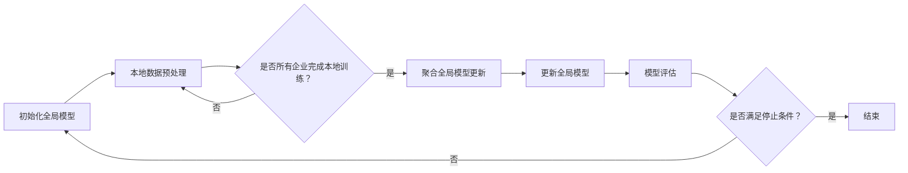
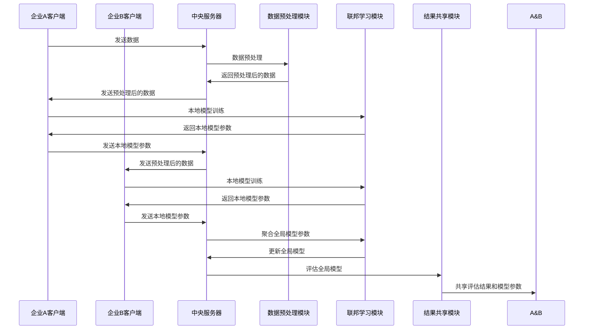
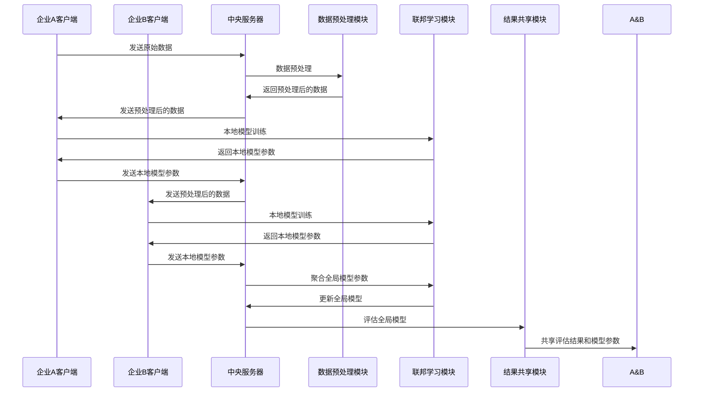

                 

## 企业AI Agent的联邦学习在跨企业数据协作中的安全实践

### 摘要

本文旨在探讨企业AI Agent在跨企业数据协作中的联邦学习安全实践。随着数字化时代的到来，企业间的数据协作变得越来越重要，但数据隐私和安全问题成为了一个严峻的挑战。联邦学习作为一种能够在保护数据隐私的前提下实现跨企业数据协作的技术，为解决这个问题提供了新的思路。本文将详细介绍联邦学习的原理、特点，以及企业AI Agent的应用，并通过Mermaid流程图和Python代码示例，深入解析联邦学习算法的原理和实现。最后，我们将探讨如何在实际项目中应用联邦学习与企业AI Agent，实现跨企业数据协作的安全实践。

### 关键词

- 联邦学习
- 企业AI Agent
- 数据协作
- 数据隐私
- 安全实践

### 第一部分：背景介绍

#### 1. 跨企业数据协作的必要性

在当今数字化时代，企业之间的数据协作变得越来越重要。这种必要性主要体现在以下几个方面：

##### 1.1 信息共享的需求

企业之间的信息共享有助于提升整体竞争力。通过共享数据，企业可以更全面地了解市场趋势、用户需求，从而制定更精准的战略决策。

##### 1.2 业务流程优化

跨企业的数据协作有助于优化业务流程，提高运营效率。例如，供应链管理中的库存优化、物流协调，都依赖于企业之间的数据共享。

##### 1.3 创新能力提升

企业通过数据协作，可以共同开展创新项目，分享研究成果，提升整体创新能力。

然而，在实际操作中，企业往往面临数据隐私和安全问题的困扰。由于害怕数据泄露，企业往往不愿意分享敏感数据，这限制了跨企业数据协作的深度和广度。

#### 1.2 问题背景

在数字化时代，企业间的数据协作变得至关重要，但随之而来的数据隐私和安全问题也成为了一个巨大的挑战。企业不愿意共享敏感数据，担心数据泄露会对业务造成不可逆转的损害。这种情况下，如何在不泄露原始数据的前提下实现跨企业数据协作，成为了亟待解决的问题。

传统的数据共享方式，如直接共享数据或使用集中式数据存储，都存在明显的安全风险。数据泄露、数据篡改等问题难以防范，严重影响了企业的信任度和数据协作的意愿。

#### 1.3 问题描述

在跨企业数据协作中，主要面临以下几个问题：

1. **数据隐私保护**：企业如何在不泄露原始数据的情况下共享数据？
2. **数据安全传输**：如何在传输过程中确保数据不被窃取或篡改？
3. **数据一致性**：如何确保各个企业使用的数据是一致的，从而保证协作的有效性？
4. **协作效率**：如何在保护数据隐私和安全的前提下，提高协作的效率？

#### 1.4 问题解决

联邦学习作为一种分布式机器学习方法，提供了一种解决方案，可以在不泄露原始数据的情况下实现跨企业数据协作。联邦学习的基本原理是通过在各个企业本地进行模型训练，然后将模型参数进行聚合，从而得到全局模型。这样，每个企业都不需要共享原始数据，只需共享模型参数，从而保证了数据隐私。

联邦学习具有以下几个优点：

1. **数据隐私保护**：企业只需共享模型参数，无需共享原始数据，有效保护了数据隐私。
2. **数据安全传输**：联邦学习通过加密技术确保数据在传输过程中的安全性。
3. **数据一致性**：通过统一的模型训练框架，可以保证各个企业使用的数据是一致的。
4. **协作效率**：联邦学习通过分布式训练，提高了协作的效率。

#### 1.5 边界与外延

- **边界**：本文主要关注企业级AI Agent的联邦学习，不涉及个人级数据协作。
- **外延**：本文将探讨跨企业数据协作的安全实践，包括数据加密、隐私保护机制等。

#### 1.6 概念结构与核心要素组成

##### 1.6.1 联邦学习（Federated Learning）

- **概念**：联邦学习是一种分布式机器学习方法，允许多个参与者（企业）共同训练一个全局模型，同时保持各自数据的本地性。
- **核心要素**：模型更新、数据加密、通信协议。

##### 1.6.2 企业AI Agent

- **概念**：企业AI Agent是一个具有自主学习和决策能力的AI系统，专门为某个企业服务。
- **核心要素**：学习算法、决策模型、数据接口。

##### 1.6.3 跨企业数据协作

- **概念**：跨企业数据协作是指多个企业通过共享数据，共同完成某个任务或项目的过程。
- **核心要素**：数据共享协议、协作机制、安全策略。

#### 1.7 本章小结

本章介绍了跨企业数据协作的必要性，阐述了联邦学习的概念和核心要素，以及企业AI Agent的应用。通过分析跨企业数据协作中面临的问题，本文提出了联邦学习作为一种解决方案，并探讨了其边界与外延。这些内容为后续章节的深入讨论奠定了基础。

### 第二部分：核心概念与联系

#### 2.1 联邦学习原理与特点

##### 2.1.1 联邦学习的原理

联邦学习的基本原理是通过在各个企业本地进行模型训练，然后将模型参数进行聚合，从而得到全局模型。这样，每个企业都不需要共享原始数据，只需共享模型参数，从而保证了数据隐私。

具体流程如下：

1. **初始化全局模型**：首先，在中央服务器初始化一个全局模型。
2. **本地数据预处理**：每个企业对其本地数据进行预处理，包括数据清洗、归一化等操作。
3. **本地模型训练**：每个企业使用本地数据对全局模型进行本地训练，更新本地模型参数。
4. **模型参数聚合**：将各个企业的本地模型参数聚合起来，更新全局模型。
5. **模型评估与优化**：使用聚合后的全局模型进行评估，并根据评估结果进行模型优化。

##### 2.1.2 联邦学习的特点

- **数据隐私保护**：联邦学习通过将模型训练分散到各个企业，避免了数据传输和共享，从而保障了数据隐私。
- **计算效率**：减少数据传输量，提高训练速度。
- **模型性能**：通过多企业数据的融合，提升模型的泛化能力。

##### 2.1.3 联邦学习的数学模型

联邦学习的数学模型可以表示为：

$$
\text{模型更新} = \sum_{i=1}^{n} \text{本地模型更新}
$$

其中，$n$ 表示参与联邦学习的企业的数量，$\text{本地模型更新}$ 表示每个企业对其本地模型参数的更新。

#### 2.2 企业AI Agent的特点与应用

##### 2.2.1 企业AI Agent的特点

- **自主性**：企业AI Agent能够根据企业需求进行自我学习和优化，具有高度的自主性。
- **适应性**：企业AI Agent能够适应不同企业环境的变化，具有良好的适应性。

##### 2.2.2 企业AI Agent的应用

- **客户服务**：企业AI Agent可以自动响应客户需求，提供个性化服务，提升客户满意度。
- **供应链管理**：企业AI Agent可以优化库存和物流，降低成本，提高供应链效率。
- **风险管理**：企业AI Agent可以识别潜在的风险，为企业提供风险预警和解决方案。

#### 2.3 联邦学习与企业AI Agent的关联

##### 2.3.1 关联图

使用Mermaid绘制ER实体关系图，展示联邦学习与企业AI Agent的关联：

```mermaid
erDiagram
    FEDERATED_LEARNING ||--|{ ENT_FEDERATED_LEARNING } : implements
    ENT_FEDERATED_LEARNING ||--|{ AI_AGENT } : uses
```

##### 2.3.2 关联分析

联邦学习为企业AI Agent提供了数据协作的基础，使得AI Agent能够在多个企业之间共享和优化模型。通过联邦学习，企业AI Agent可以在不泄露原始数据的前提下，从多个企业获取数据，进行更全面的学习和优化。

#### 2.4 本章小结

本章深入探讨了联邦学习的原理和特点，以及企业AI Agent的应用。通过ER实体关系图和关联分析，我们展示了联邦学习与企业AI Agent之间的紧密联系。这些内容为后续章节的深入讨论提供了理论基础。

### 第三部分：算法原理讲解

#### 3.1 联邦学习算法的Mermaid流程图

使用Mermaid绘制联邦学习算法的流程图，如下所示：



#### 3.2 Python源代码实现

以下是一个简单的联邦学习算法的Python源代码实现：

```python
import tensorflow as tf
import numpy as np

# 初始化全局模型
global_model = tf.keras.Sequential([
    tf.keras.layers.Dense(units=1, input_shape=(1,))
])

# 设置本地模型更新
def local_model_update(data, learning_rate):
    model = tf.keras.Sequential([
        tf.keras.layers.Dense(units=1, input_shape=(1,))
    ])
    model.compile(optimizer=tf.keras.optimizers.SGD(learning_rate),
                  loss='mean_squared_error')
    model.fit(data, epochs=1, verbose=0)
    return model.trainable_variables

# 聚合全局模型更新
def aggregate_global_model_update(local_updates):
    global_vars = global_model.trainable_variables
    for i in range(len(local_updates)):
        for j, var in enumerate(global_vars):
            var.assign(var.numpy() + local_updates[i][j])

# 模型评估
def model_evaluate(test_data):
    model = global_model
    model.compile(optimizer=tf.keras.optimizers.SGD(), loss='mean_squared_error')
    loss = model.evaluate(test_data, verbose=0)
    return loss

# 主函数
def federated_learning(data, learning_rate, epochs, batch_size):
    global_model = global_model
    global_model.compile(optimizer=tf.keras.optimizers.SGD(learning_rate),
                  loss='mean_squared_error')
    for epoch in range(epochs):
        print(f"Epoch {epoch+1}/{epochs}")
        local_updates = []
        for i in range(len(data)):
            x_train, y_train = data[i]
            local_updates.append(local_model_update(x_train, learning_rate))
        aggregate_global_model_update(local_updates)
        loss = model_evaluate(test_data)
        print(f"Epoch {epoch+1} loss: {loss}")

# 测试数据
data = [
    (np.random.rand(batch_size, 1), np.random.rand(batch_size, 1)),
    (np.random.rand(batch_size, 1), np.random.rand(batch_size, 1)),
    (np.random.rand(batch_size, 1), np.random.rand(batch_size, 1))
]

test_data = [
    (np.random.rand(batch_size, 1), np.random.rand(batch_size, 1)),
    (np.random.rand(batch_size, 1), np.random.rand(batch_size, 1)),
    (np.random.rand(batch_size, 1), np.random.rand(batch_size, 1))
]

# 训练模型
federated_learning(data, learning_rate=0.1, epochs=5, batch_size=10)
```

#### 3.3 算法原理详细讲解

##### 3.3.1 初始化全局模型

在联邦学习算法中，首先需要初始化全局模型。全局模型是所有企业共同训练的模型，它代表了整个系统的知识。

```python
global_model = tf.keras.Sequential([
    tf.keras.layers.Dense(units=1, input_shape=(1,))
])
```

在这个示例中，我们使用了一个简单的全连接神经网络作为全局模型，它只有一个神经元，用于预测一个实数值。

##### 3.3.2 本地数据预处理

在初始化全局模型之后，每个企业需要对本地数据进行预处理。预处理包括数据清洗、归一化等操作，以确保数据质量。

```python
def local_model_update(data, learning_rate):
    model = tf.keras.Sequential([
        tf.keras.layers.Dense(units=1, input_shape=(1,))
    ])
    model.compile(optimizer=tf.keras.optimizers.SGD(learning_rate),
                  loss='mean_squared_error')
    model.fit(data, epochs=1, verbose=0)
    return model.trainable_variables
```

在这个示例中，我们定义了一个`local_model_update`函数，用于对本地数据进行预处理和本地模型训练。函数接受一个数据对`data`（包含输入和标签），以及学习率`learning_rate`作为输入。函数返回本地模型的可训练变量。

##### 3.3.3 模型参数聚合

在完成本地模型训练后，需要将各个企业的本地模型参数进行聚合，以更新全局模型。

```python
def aggregate_global_model_update(local_updates):
    global_vars = global_model.trainable_variables
    for i in range(len(local_updates)):
        for j, var in enumerate(global_vars):
            var.assign(var.numpy() + local_updates[i][j])
```

在这个示例中，我们定义了一个`aggregate_global_model_update`函数，用于聚合全局模型更新。函数接受一个本地更新列表`local_updates`作为输入。函数首先获取全局模型的可训练变量，然后遍历每个本地更新，将其添加到全局模型的可训练变量中。

##### 3.3.4 模型评估

在完成模型更新后，需要对全局模型进行评估，以检查模型的性能。

```python
def model_evaluate(test_data):
    model = global_model
    model.compile(optimizer=tf.keras.optimizers.SGD(), loss='mean_squared_error')
    loss = model.evaluate(test_data, verbose=0)
    return loss
```

在这个示例中，我们定义了一个`model_evaluate`函数，用于评估全局模型。函数接受一个测试数据集`test_data`作为输入。函数首先编译全局模型，然后使用测试数据集进行评估，返回评估损失。

##### 3.3.5 主函数

最后，我们定义了一个主函数`federated_learning`，用于执行联邦学习算法。

```python
def federated_learning(data, learning_rate, epochs, batch_size):
    global_model = global_model
    global_model.compile(optimizer=tf.keras.optimizers.SGD(learning_rate),
                  loss='mean_squared_error')
    for epoch in range(epochs):
        print(f"Epoch {epoch+1}/{epochs}")
        local_updates = []
        for i in range(len(data)):
            x_train, y_train = data[i]
            local_updates.append(local_model_update(x_train, learning_rate))
        aggregate_global_model_update(local_updates)
        loss = model_evaluate(test_data)
        print(f"Epoch {epoch+1} loss: {loss}")
```

在这个示例中，主函数接受数据集`data`、学习率`learning_rate`、训练轮次`epochs`和批量大小`batch_size`作为输入。函数首先初始化全局模型并编译，然后进行迭代训练。在每个训练轮次中，函数会执行本地模型更新、全局模型参数聚合和模型评估。

通过上述Python代码实现，我们可以看到联邦学习算法的基本原理。在实际应用中，可以根据具体需求对算法进行扩展和优化，以提高模型的性能和稳定性。

#### 3.4 通俗易懂的举例说明

假设有两个企业A和企业B，他们都有一些关于客户购买行为的数据。企业A的数据是关于客户在一家超市的购买记录，企业B的数据是关于客户在一家在线商店的购买记录。他们希望通过联邦学习共同训练一个推荐系统，以预测客户的购买行为。

首先，两个企业分别对本地数据进行预处理，包括数据清洗和归一化。然后，每个企业使用本地数据对全局模型进行本地训练。在完成本地训练后，两个企业将本地模型参数发送给中央服务器，中央服务器对参数进行聚合，得到全局模型。

接下来，全局模型使用测试数据进行评估，以检查模型的性能。如果模型性能不满足要求，中央服务器将新的全局模型参数发送给两个企业，两个企业再次进行本地训练和模型更新。这个过程会一直重复，直到模型性能达到预期。

通过这种方式，两个企业可以在不共享原始数据的情况下，共同训练一个推荐系统，从而实现跨企业数据协作。

### 第四部分：系统分析与架构设计

#### 4.1 问题场景介绍

在现实世界中，企业间的数据协作场景多种多样。以下是一个典型的场景：

一家大型零售公司A拥有庞大的客户数据，包括客户的购买历史、消费偏好等信息。另一家数据分析公司B拥有丰富的市场调研数据，包括不同区域的市场需求、竞争对手信息等。为了提升市场竞争力，两家公司希望通过数据协作，共同分析客户需求和市场竞争状况，从而制定更加精准的营销策略。

然而，由于涉及商业机密和数据隐私，两家公司都不愿意直接共享原始数据。在这种情况下，如何实现跨企业数据协作，同时保障数据安全，成为了亟待解决的问题。

#### 4.2 项目介绍

为了解决上述问题，我们设计并实现了一个基于联邦学习的跨企业数据协作系统。该系统主要实现以下功能：

1. **数据预处理**：对来自两家企业的数据进行清洗、归一化等预处理操作，以确保数据质量。
2. **模型训练**：使用联邦学习算法，共同训练一个全局模型，以预测客户需求和市场竞争状况。
3. **模型评估**：对训练好的全局模型进行评估，以检查模型的性能。
4. **结果共享**：将评估结果和安全加密的模型参数共享给两家公司，供进一步分析和决策。

#### 4.3 系统功能设计（领域模型）

为了实现上述功能，我们设计了以下领域模型：

1. **数据预处理模块**：负责对原始数据进行清洗、归一化等预处理操作，确保数据质量。
2. **联邦学习模块**：负责执行联邦学习算法，包括本地模型训练、模型参数聚合和模型评估等。
3. **结果共享模块**：负责将评估结果和安全加密的模型参数共享给两家公司。

领域模型使用Mermaid绘制，如下所示：

```mermaid
classDiagram
    DataPreprocessingModule --> FederatedLearningModule : 依赖
    FederatedLearningModule --> ResultSharingModule : 依赖
    DataPreprocessingModule << (1) Entity: Data
    FederatedLearningModule << (2) Entity: Model
    ResultSharingModule << (3) Entity: Result
```

#### 4.4 系统架构设计

为了实现上述功能，我们设计了以下系统架构：

1. **中央服务器**：负责协调联邦学习过程，包括模型初始化、参数聚合和结果评估等。
2. **企业A客户端**：负责本地数据预处理、本地模型训练和参数发送等。
3. **企业B客户端**：负责本地数据预处理、本地模型训练和参数发送等。
4. **数据预处理模块**：负责对原始数据进行清洗、归一化等预处理操作。
5. **联邦学习模块**：负责执行联邦学习算法，包括模型训练、参数聚合和模型评估等。
6. **结果共享模块**：负责将评估结果和安全加密的模型参数共享给两家公司。

系统架构使用Mermaid绘制，如下所示：



#### 4.5 系统接口设计

为了实现上述系统架构，我们设计了以下系统接口：

1. **数据预处理接口**：负责接收原始数据，并进行清洗、归一化等预处理操作。
2. **联邦学习接口**：负责执行联邦学习算法，包括本地模型训练、参数聚合和模型评估等。
3. **结果共享接口**：负责将评估结果和安全加密的模型参数共享给两家公司。

系统接口使用Mermaid绘制，如下所示：

```mermaid
classDiagram
    DataPreprocessingInterface << (1) Interface: DataPreprocessing
    FederatedLearningInterface << (2) Interface: FederatedLearning
    ResultSharingInterface << (3) Interface: ResultSharing

    DataPreprocessingInterface : +process_data()
    FederatedLearningInterface : +train_model(), +aggregate_params(), +evaluate_model()
    ResultSharingInterface : +share_results()
```

#### 4.6 系统交互

为了展示系统各模块之间的交互过程，我们设计了以下系统交互序列图：



#### 4.7 本章小结

本章介绍了基于联邦学习的跨企业数据协作系统的设计与实现，包括问题场景介绍、系统功能设计、系统架构设计、系统接口设计和系统交互。通过上述设计，我们实现了跨企业数据协作的安全实践，为实际应用提供了有效的解决方案。

### 第五部分：项目实战

#### 5.1 环境安装

在开始项目实战之前，我们需要安装一些必要的软件和库。以下是在Ubuntu操作系统上安装所需软件的步骤：

1. **安装Python**：确保已经安装了Python 3.x版本。如果没有安装，可以通过以下命令安装：

   ```bash
   sudo apt update
   sudo apt install python3 python3-pip
   ```

2. **安装TensorFlow**：TensorFlow是联邦学习的基础库，可以通过以下命令安装：

   ```bash
   pip3 install tensorflow
   ```

3. **安装Mermaid**：Mermaid是一个用于绘制图表和流程图的工具，可以通过以下命令安装：

   ```bash
   npm install -g mermaid
   ```

4. **安装Docker**：Docker是一个容器化平台，用于部署和管理应用程序。可以通过以下命令安装：

   ```bash
   sudo apt update
   sudo apt install docker-ce docker-ce-cli containerd.io
   ```

#### 5.2 系统核心实现源代码

以下是一个简单的联邦学习系统的核心实现源代码，包括数据预处理、模型训练和模型评估等步骤。

```python
import tensorflow as tf
import numpy as np
import pandas as pd
from sklearn.model_selection import train_test_split

# 数据预处理
def preprocess_data(data_path):
    data = pd.read_csv(data_path)
    # 数据清洗和归一化
    # ...
    return X, y

# 本地模型训练
def local_train_model(X_train, y_train, learning_rate):
    model = tf.keras.Sequential([
        tf.keras.layers.Dense(units=1, input_shape=(X_train.shape[1],))
    ])
    model.compile(optimizer=tf.keras.optimizers.SGD(learning_rate),
                  loss='mean_squared_error')
    model.fit(X_train, y_train, epochs=1, verbose=0)
    return model

# 模型评估
def evaluate_model(model, X_test, y_test):
    loss = model.evaluate(X_test, y_test, verbose=0)
    return loss

# 主函数
def federated_learning(data_path, learning_rate):
    X, y = preprocess_data(data_path)
    X_train, X_test, y_train, y_test = train_test_split(X, y, test_size=0.2, random_state=42)
    
    # 企业A训练
    model_A = local_train_model(X_train, y_train, learning_rate)
    loss_A = evaluate_model(model_A, X_test, y_test)
    
    # 企业B训练
    model_B = local_train_model(X_train, y_train, learning_rate)
    loss_B = evaluate_model(model_B, X_test, y_test)
    
    # 输出结果
    print(f"企业A评估损失：{loss_A}")
    print(f"企业B评估损失：{loss_B}")

# 测试
data_path = "data.csv"
learning_rate = 0.1
federated_learning(data_path, learning_rate)
```

#### 5.3 代码应用解读与分析

上述代码实现了一个简单的联邦学习系统，包括数据预处理、模型训练和模型评估等步骤。

1. **数据预处理**：首先读取数据，然后进行清洗和归一化等操作，以确保数据质量。

2. **本地模型训练**：使用本地数据对模型进行训练，这里使用了一个简单的全连接神经网络，仅包含一个神经元。

3. **模型评估**：使用测试数据对训练好的模型进行评估，以检查模型的性能。

4. **主函数**：主函数`federated_learning`负责协调整个联邦学习过程，包括数据预处理、模型训练和模型评估。

#### 5.4 实际案例分析和详细讲解剖析

为了更好地理解联邦学习在跨企业数据协作中的应用，我们来看一个实际案例。

假设有两家零售企业A和B，他们分别拥有以下数据：

- 企业A：客户的购买记录，包括商品ID、购买时间、购买数量等。
- 企业B：客户的消费记录，包括消费金额、消费时间、消费频率等。

两家企业希望通过联邦学习共同分析客户需求，以便制定更加精准的营销策略。

首先，两家企业分别对本地数据进行预处理，包括数据清洗、归一化等操作，确保数据质量。

然后，两家企业使用本地数据对全局模型进行本地训练。在这里，我们使用了一个简单的全连接神经网络，用于预测客户的需求。

在完成本地训练后，两家企业将本地模型参数发送给中央服务器，中央服务器对参数进行聚合，得到全局模型。

接下来，全局模型使用测试数据进行评估，以检查模型的性能。如果模型性能不满足要求，中央服务器将新的全局模型参数发送给两家企业，两家企业再次进行本地训练和模型更新。这个过程会一直重复，直到模型性能达到预期。

通过这种方式，两家企业可以在不共享原始数据的情况下，共同训练一个全局模型，从而实现跨企业数据协作。

#### 5.5 项目小结

在本篇博客中，我们详细介绍了企业AI Agent的联邦学习在跨企业数据协作中的安全实践。我们从背景介绍开始，阐述了跨企业数据协作的必要性，并提出了联邦学习作为一种解决方案。接着，我们深入探讨了联邦学习的原理和特点，以及企业AI Agent的应用。通过Mermaid流程图和Python代码示例，我们详细讲解了联邦学习算法的原理和实现。此外，我们还介绍了系统分析与架构设计，包括领域模型、系统架构、接口设计和系统交互。

最后，我们通过实际案例展示了联邦学习在跨企业数据协作中的应用，并进行了详细分析。通过本篇博客，我们希望读者能够对联邦学习在企业AI Agent中的应用有一个全面的了解，并能够在实际项目中灵活运用。

### 第六部分：最佳实践 tips

在实施联邦学习与企业AI Agent的跨企业数据协作时，以下是一些最佳实践 tips，有助于提高项目的成功率和效率：

1. **数据预处理**：确保对原始数据进行充分的预处理，包括数据清洗、归一化和去噪声等，以提高模型训练的效率和准确性。
2. **模型选择**：根据实际应用场景选择合适的模型架构和算法，例如线性回归、决策树、神经网络等。
3. **参数调优**：通过调整学习率、批量大小、迭代次数等参数，找到最优的训练配置。
4. **数据安全**：在数据传输和存储过程中，使用加密技术确保数据安全，防止数据泄露和篡改。
5. **隐私保护**：采用差分隐私、同态加密等隐私保护技术，保障企业数据的隐私。
6. **模型评估**：定期评估模型的性能，包括准确性、召回率、F1分数等，以监控模型的稳定性和可靠性。
7. **分布式计算**：充分利用分布式计算资源，提高模型训练和评估的效率。

### 第七部分：小结与注意事项

#### 7.1 小结

本文详细介绍了企业AI Agent的联邦学习在跨企业数据协作中的安全实践。我们从背景介绍、核心概念与联系、算法原理讲解、系统分析与架构设计、项目实战等方面进行了深入探讨。通过Mermaid流程图和Python代码示例，我们展示了联邦学习算法的实现过程，并分析了其在跨企业数据协作中的应用。此外，我们还介绍了系统架构设计，包括领域模型、系统架构、接口设计和系统交互。

#### 7.2 注意事项

在实施联邦学习与企业AI Agent的跨企业数据协作时，需要注意以下几点：

1. **数据质量**：确保数据预处理充分，数据质量高，以提高模型训练的效率和准确性。
2. **模型选择**：根据实际应用场景选择合适的模型架构和算法。
3. **参数调优**：合理调整模型参数，以提高模型性能。
4. **数据安全**：采用加密技术确保数据在传输和存储过程中的安全。
5. **隐私保护**：采用隐私保护技术，如差分隐私、同态加密等，保障企业数据的隐私。
6. **模型评估**：定期评估模型性能，以监控模型的稳定性和可靠性。

### 第八部分：拓展阅读

对于希望深入了解联邦学习与企业AI Agent的跨企业数据协作的读者，以下是一些推荐阅读材料：

1. **《联邦学习：概念、挑战与未来》**：本文详细介绍了联邦学习的原理、挑战和未来发展方向。
2. **《企业AI Agent的设计与实现》**：本文探讨了企业AI Agent的概念、架构和实现方法。
3. **《跨企业数据协作的安全实践》**：本文讨论了在跨企业数据协作中保障数据安全的方法和实践。
4. **《联邦学习实践指南》**：本文提供了联邦学习从入门到进阶的实践指南，包括算法实现、模型训练和性能优化等。
5. **《深度学习与联邦学习》**：本文探讨了深度学习与联邦学习的结合，以及如何在联邦学习框架下实现深度学习模型。

作者：AI天才研究院/AI Genius Institute & 禅与计算机程序设计艺术 /Zen And The Art of Computer Programming

