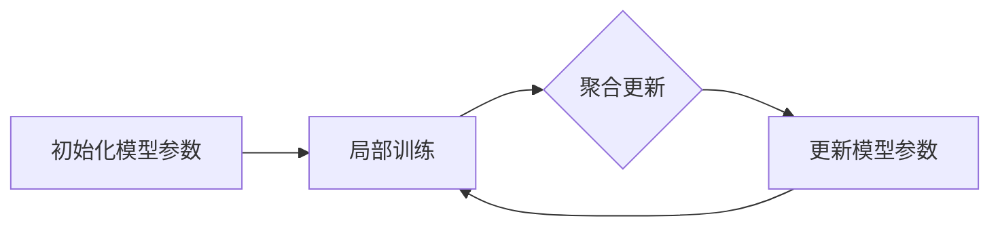
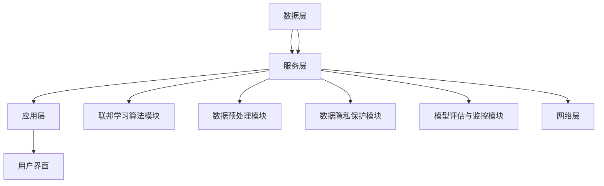
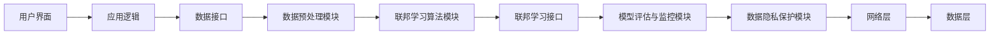

                 

## # 企业AI Agent的联邦学习在跨部门数据协作中的实践

关键词：企业AI Agent、联邦学习、跨部门数据协作、人工智能、隐私保护

摘要：随着企业内部数据量的不断增长和复杂性增加，如何高效利用这些数据成为企业数字化转型的重要课题。联邦学习作为一种新型的机器学习方法，能够保障数据隐私的同时，实现跨部门的数据协作与共享。本文将探讨企业AI Agent在联邦学习框架下的应用，分析其在跨部门数据协作中的实际效果和优势，并提供一套完整的系统架构设计方案和实战步骤，旨在为企业的数字化转型提供有益的参考。

## 第一部分：背景介绍

### 第1章：问题背景

#### 1.1 问题概述

在现代企业中，各个部门往往拥有不同类型的数据资源，这些数据对于提升业务效率和决策质量至关重要。然而，由于各部门之间数据格式的不同、数据质量的差异以及数据隐私和安全性的顾虑，导致跨部门的数据协作成为一个亟待解决的问题。同时，随着人工智能技术的不断发展，越来越多的企业开始尝试利用AI Agent来提升业务智能化水平。企业AI Agent是一种具有自主学习能力的人工智能实体，它能够处理复杂任务，提供决策支持。

#### 1.2 跨部门数据协作的重要性

跨部门数据协作能够打破信息孤岛，实现企业内部数据的高效利用。通过跨部门数据共享，企业可以更全面地了解业务状况，发现潜在的业务机会和风险。例如，市场营销部门可以与销售部门共享客户数据，通过分析客户购买行为，优化营销策略，提高销售转化率。此外，跨部门数据协作还可以促进技术创新，推动企业整体竞争力的提升。

#### 1.3 联邦学习的核心概念及应用场景

联邦学习（Federated Learning）是一种分布式机器学习技术，旨在通过多个参与者共享学习模型，而不需要共享原始数据。这种技术能够解决数据隐私和安全问题，特别适用于跨部门数据协作。联邦学习的核心思想是将模型的更新分布在各个参与者处进行，从而避免原始数据的传输和共享。联邦学习在多个领域都有广泛的应用，例如移动设备上的机器学习模型更新、跨企业数据协作、隐私保护数据挖掘等。

### 第2章：联邦学习的起源与发展

#### 2.1 联邦学习的起源

联邦学习的概念最早由谷歌在2016年提出，其初衷是为了解决移动设备上机器学习模型的更新问题。谷歌发现，直接在设备上训练模型并上传到服务器，会消耗大量的网络带宽和电池寿命。于是，谷歌提出了联邦学习的概念，通过在设备端训练模型，然后仅上传模型更新，从而实现模型的迭代优化。

#### 2.2 联邦学习的关键技术发展

自谷歌提出联邦学习以来，该领域得到了迅速发展。关键技术包括联邦平均算法（Federated Averaging）、差分隐私（Differential Privacy）、安全多方计算（Secure Multi-Party Computation）等。联邦平均算法是联邦学习中最基本的算法，通过在各个参与者处进行局部训练，然后汇总模型更新。差分隐私和安全多方计算则用于确保模型训练过程中数据的隐私保护和安全性。

#### 2.3 联邦学习在AI领域的应用现状

联邦学习在AI领域的应用越来越广泛，尤其是在医疗、金融、零售等行业。例如，在医疗领域，联邦学习可以用于分析患者数据，提供个性化医疗建议，同时保护患者隐私。在金融领域，联邦学习可以用于风险评估和欺诈检测，提高金融服务的安全性和效率。在零售领域，联邦学习可以用于客户行为分析，优化供应链管理。

### 第3章：企业AI Agent的联邦学习应用

#### 3.1 企业AI Agent的联邦学习优势

企业AI Agent通过联邦学习技术，可以实现跨部门数据的高效协作与共享。其优势包括：

1. **隐私保护**：联邦学习确保了数据在本地训练，避免了数据在传输过程中被泄露的风险。
2. **数据共享**：联邦学习允许不同部门共享学习模型，而不需要共享原始数据，从而实现数据的高效利用。
3. **高效训练**：通过分布式训练，联邦学习可以显著提高模型的训练效率，缩短模型迭代周期。
4. **灵活性**：联邦学习适用于各种类型的数据格式，能够适应不同业务场景的需求。

#### 3.2 跨部门数据协作中的挑战

尽管联邦学习具有很多优势，但在跨部门数据协作中仍面临一些挑战：

1. **数据异构性**：不同部门的数据格式、结构和质量可能存在较大差异，这给联邦学习模型的训练带来了困难。
2. **数据隐私**：如何保护数据隐私，确保联邦学习过程的安全性和可靠性，是一个重要问题。
3. **模型性能**：联邦学习模型在分布式环境下的性能可能会受到网络延迟、设备性能等因素的影响。

#### 3.3 企业AI Agent在跨部门数据协作中的实际应用

企业AI Agent在跨部门数据协作中的应用场景非常广泛，例如：

1. **市场营销与销售**：通过联邦学习，市场营销部门可以与销售部门共享客户数据，优化营销策略，提高销售转化率。
2. **供应链管理**：供应链管理部门可以通过联邦学习分析库存数据，优化供应链管理，提高供应链效率。
3. **人力资源**：人力资源部门可以利用联邦学习分析员工数据，优化招聘策略和员工培训计划。

通过这些实际应用，企业AI Agent能够实现跨部门数据的高效协作与共享，提升业务决策的准确性和效率。

## 第二部分：核心概念与联系

### 第4章：核心概念与原理

#### 2.1 企业AI Agent的基本概念

企业AI Agent是一种智能化实体，它能够模拟人类智能行为，自主执行任务并持续优化。在企业中，AI Agent可以承担如数据分析、决策支持、自动化操作等多种角色。企业AI Agent通常包括以下几个关键组成部分：

1. **感知模块**：用于感知环境中的信息，如数据流、用户行为等。
2. **决策模块**：基于感知模块收集的信息，进行决策和规划。
3. **执行模块**：根据决策模块的指令，执行具体的操作或任务。
4. **学习模块**：通过不断学习和优化，提高AI Agent的性能和智能水平。

#### 2.2 跨部门数据协作的关键概念

跨部门数据协作涉及到多个关键概念，这些概念对系统的设计和实施至关重要。以下是几个关键概念及其解释：

1. **数据异构性**：不同部门的数据可能在格式、结构、质量等方面存在显著差异，这种异构性增加了数据协作的复杂性。
2. **数据隐私保护**：在跨部门数据协作中，如何保护数据隐私是一个重要问题。数据隐私保护措施包括数据加密、差分隐私、访问控制等。
3. **数据质量评估**：数据质量直接影响模型训练的效果。数据质量评估包括数据完整性、一致性、准确性等方面的检查。

#### 2.3 联邦学习在跨部门数据协作中的应用

联邦学习在跨部门数据协作中的应用具有独特优势。通过联邦学习，企业可以实现以下目标：

1. **隐私保护**：联邦学习确保数据在本地训练，避免了数据在传输过程中被泄露的风险，符合数据隐私保护的要求。
2. **数据共享**：联邦学习允许不同部门共享学习模型，而不需要共享原始数据，实现了数据的高效利用。
3. **分布式训练**：通过分布式训练，联邦学习能够充分利用各个部门的数据资源，提高模型的训练效率和性能。

#### 2.4 联邦学习的优势与挑战

联邦学习在跨部门数据协作中具有显著优势，但同时也面临一些挑战。以下是联邦学习的优势和挑战：

**优势**：

1. **隐私保护**：联邦学习通过分布式训练，确保了数据隐私的安全。
2. **高效利用**：联邦学习能够充分利用不同部门的数据资源，实现数据的高效利用。
3. **灵活性强**：联邦学习适用于各种类型的数据格式，能够适应不同业务场景的需求。

**挑战**：

1. **数据异构性**：不同部门的数据格式、结构和质量可能存在较大差异，这给联邦学习模型的训练带来了困难。
2. **数据隐私**：如何在确保数据隐私的同时，实现跨部门数据的高效协作，是一个重要问题。
3. **模型性能**：联邦学习模型在分布式环境下的性能可能会受到网络延迟、设备性能等因素的影响。

### 第5章：联邦学习算法原理

#### 3.1 联邦学习算法概述

联邦学习算法是一种分布式机器学习技术，其核心思想是将模型训练分散到多个参与者（如不同部门）处进行，每个参与者仅共享模型更新，而不是原始数据。联邦学习算法的基本流程包括以下几个步骤：

1. **初始化**：每个参与者随机初始化一个本地模型。
2. **局部训练**：每个参与者使用本地数据对本地模型进行训练，得到本地更新。
3. **模型聚合**：将所有参与者的本地更新聚合到一个全局模型中。
4. **模型更新**：每个参与者使用聚合后的全局模型进行下一次训练。

#### 3.2 联邦学习算法的数学模型

联邦学习算法的数学模型包括以下几个关键部分：

1. **模型参数**：每个参与者维护一个本地模型参数向量 $\theta_i$。
2. **本地更新**：每个参与者根据本地数据和本地模型参数，计算出本地更新 $\Delta\theta_i$。
3. **模型聚合**：将所有参与者的本地更新聚合到一个全局模型参数向量 $\theta$，通常采用联邦平均算法（Federated Averaging）：
   $$ \theta = \frac{1}{N} \sum_{i=1}^{N} \theta_i $$
   其中 $N$ 是参与者的数量。

4. **模型更新**：每个参与者使用聚合后的全局模型参数进行下一次训练。

#### 3.3 联邦学习算法的mermaid流程图

下面是一个简化的联邦学习算法流程图，使用Mermaid语法绘制：



在这个流程图中，`A` 表示初始化模型参数，`B` 表示局部训练，`C` 表示聚合更新，`D` 表示更新模型参数。这个过程循环进行，直到满足停止条件（如达到预设的训练次数或模型收敛）。

### 第4章：联邦学习算法的数学模型与公式

#### 4.1 模型参数更新机制

在联邦学习算法中，模型参数的更新机制是核心部分。每个参与者（部门）在本地训练过程中，会根据本地数据和模型参数计算出一个更新值，然后将这些更新值聚合到全局模型中。更新机制通常采用联邦平均算法，其基本公式如下：

$$
\theta_{global} = \frac{1}{N} \sum_{i=1}^{N} \theta_{i}
$$

其中，$\theta_{global}$ 是全局模型参数，$N$ 是参与者的数量，$\theta_{i}$ 是第 $i$ 个参与者的本地模型参数。

#### 4.2 更新策略

更新策略决定了如何计算和传递每个参与者的本地更新值。以下是一些常见的更新策略：

1. **同步更新**：所有参与者同时进行局部训练，并立即将更新值传递给全局模型。这种策略简单，但可能会受到网络延迟的影响。
2. **异步更新**：参与者根据自己的节奏进行局部训练，并在适当的时候将更新值传递给全局模型。这种策略更加灵活，但可能会引入不一致性。
3. **联邦平均算法**：这是最常用的更新策略，通过定期汇总所有参与者的更新值，计算全局模型参数。

#### 4.3 模型训练与优化方法

模型训练与优化是联邦学习算法中的关键步骤。常见的训练方法包括：

1. **梯度下降法**：参与者使用本地数据计算梯度，然后将梯度更新传递给全局模型。
2. **随机梯度下降法**（SGD）：每个参与者随机选择一部分数据子集进行局部训练，计算梯度更新。
3. **Adam优化器**：一种自适应的优化器，能够自适应调整学习率，适用于联邦学习。

优化方法还包括：

1. **权重共享**：确保所有参与者使用相同的模型结构，提高模型的协同效果。
2. **模型蒸馏**：将全局模型的知识传递给更简单的本地模型，提高本地模型的性能。

#### 4.4 算法讲解与示例

为了更直观地理解联邦学习算法的数学模型和公式，我们可以通过一个简单的例子进行讲解。

假设有两个参与者 $A$ 和 $B$，他们分别维护本地模型参数 $\theta_A$ 和 $\theta_B$。参与者 $A$ 使用本地数据集 $D_A$ 训练模型，计算得到本地更新值 $\Delta\theta_A$。参与者 $B$ 使用本地数据集 $D_B$ 训练模型，计算得到本地更新值 $\Delta\theta_B$。然后，这两个参与者将更新值聚合到全局模型参数 $\theta$：

$$
\theta = \theta_A + \theta_B
$$

假设参与者 $A$ 的本地更新值为：

$$
\Delta\theta_A = \alpha \cdot \nabla J(\theta_A; D_A)
$$

其中，$\alpha$ 是学习率，$\nabla J(\theta_A; D_A)$ 是在本地数据集 $D_A$ 上对模型参数 $\theta_A$ 的梯度。

参与者 $B$ 的本地更新值为：

$$
\Delta\theta_B = \beta \cdot \nabla J(\theta_B; D_B)
$$

其中，$\beta$ 是学习率，$\nabla J(\theta_B; D_B)$ 是在本地数据集 $D_B$ 上对模型参数 $\theta_B$ 的梯度。

聚合后的全局更新值为：

$$
\Delta\theta = \frac{1}{2} (\Delta\theta_A + \Delta\theta_B)
$$

最终，全局模型参数更新为：

$$
\theta = \theta - \Delta\theta
$$

通过这个示例，我们可以看到联邦学习算法是如何通过分布式训练和模型参数更新，实现跨部门数据协作与共享的。

### 第五部分：系统分析与架构设计

#### 第5章：系统功能设计与架构设计

##### 5.1 系统功能设计

为了实现企业AI Agent的联邦学习在跨部门数据协作中的目标，系统需要设计一系列关键功能模块。以下是系统的功能模块划分及其实现策略：

1. **数据预处理模块**：负责处理不同来源的数据，包括数据清洗、格式转换、数据集成等。此模块确保数据质量，为后续的模型训练提供高质量的数据输入。
2. **联邦学习算法模块**：实现联邦学习的核心算法，包括模型初始化、局部训练、模型聚合和模型更新等。此模块是系统的核心，负责模型参数的分布式更新和优化。
3. **数据隐私保护模块**：负责确保数据在传输和存储过程中的隐私保护。此模块采用差分隐私、数据加密等技术，确保数据隐私不被泄露。
4. **模型评估与监控模块**：用于评估联邦学习模型的性能，包括准确率、召回率等指标。同时，此模块提供实时监控功能，确保系统的稳定运行。
5. **用户界面模块**：提供用户交互界面，使用户能够方便地管理系统，查看模型训练结果和系统状态。

##### 5.2 系统架构设计

系统架构设计是确保系统功能实现和性能优化的重要环节。以下是系统的架构概述及其模块间关系：

1. **数据层**：包括不同部门的数据存储和访问接口。此层负责数据的存储、管理和共享，确保数据的安全和高效利用。
2. **服务层**：包括数据预处理服务、联邦学习算法服务、数据隐私保护服务、模型评估与监控服务等。此层实现系统的核心功能，通过服务接口提供对内对外服务。
3. **应用层**：包括用户界面和应用逻辑。此层负责与用户交互，提供友好的用户体验，同时实现系统的业务逻辑。
4. **网络层**：负责系统内部和外部的通信，确保数据在各个模块之间的传输和共享。此层采用分布式架构，支持高并发和高可用性。

##### 5.3 系统接口设计

系统接口设计是确保系统模块之间高效交互的重要保障。以下是系统接口的功能说明及其交互流程：

1. **数据接口**：提供数据读取和写入功能，支持不同格式的数据导入和导出。此接口确保数据在各模块之间的流通和共享。
2. **联邦学习接口**：提供联邦学习算法的调用接口，包括模型初始化、训练、更新和评估等功能。此接口实现联邦学习的分布式训练和优化。
3. **隐私保护接口**：提供数据加密、差分隐私等技术接口，确保数据在传输和存储过程中的隐私保护。此接口确保系统的数据安全。
4. **监控接口**：提供系统状态监控和异常报警功能，实时监控系统的运行状态和性能指标。此接口确保系统的稳定运行和高效管理。

### 第六章：系统交互与架构图

#### 6.1 系统交互设计

为了实现企业AI Agent的联邦学习在跨部门数据协作中的目标，系统需要设计一套完善的交互流程，确保数据在各模块之间的流通和共享。以下是系统的用户操作流程和系统内部数据流：

1. **用户操作流程**：
   - 用户通过用户界面提交数据处理任务，包括数据源、任务类型和模型参数等。
   - 系统接收用户请求，调用数据接口读取数据，并将其传递给数据预处理模块进行预处理。
   - 预处理后的数据被传递给联邦学习算法模块进行局部训练。
   - 模型更新后，通过联邦学习接口进行模型聚合和更新。
   - 模型评估与监控模块对更新后的模型进行评估和监控，并将结果反馈给用户。

2. **系统内部数据流**：
   - 数据从数据层传递到服务层，经过数据预处理模块处理后，进入联邦学习算法模块。
   - 联邦学习算法模块对模型进行局部训练，并将更新后的模型参数传递给聚合模块。
   - 聚合模块将全局模型参数更新传递给服务层，然后反馈给用户界面。
   - 模型评估与监控模块对模型进行评估，并将结果存储在数据库中，用于后续分析和决策。

#### 6.2 系统架构图

为了更清晰地展示系统架构和模块间的关系，以下是系统架构示意图和系统模块关系图：

**系统架构示意图**：



**系统模块关系图**：



通过这些图表，我们可以直观地了解系统的架构设计和模块间的关系，从而更好地理解和实现系统的功能。

### 第7章：环境安装与系统核心实现

#### 7.1 环境安装

要实现企业AI Agent的联邦学习系统，首先需要搭建合适的环境。以下是系统的环境配置和依赖安装步骤：

1. **环境配置**：
   - 安装Python（建议使用3.8及以上版本）。
   - 配置Python虚拟环境，避免版本冲突。
   - 安装必要的Python库，如TensorFlow、PyTorch、Scikit-learn等。

2. **依赖安装**：
   - 使用pip命令安装依赖库，例如：
     ```bash
     pip install tensorflow
     pip install torch
     pip install scikit-learn
     ```
   - 如果需要，可以安装其他辅助库，如Mermaid渲染工具等。

#### 7.2 系统核心实现

系统核心实现包括数据预处理、联邦学习算法实现、模型聚合和更新等关键功能。以下是系统核心实现的步骤和代码：

1. **数据预处理**：
   - 读取不同部门的数据，并进行数据清洗、格式转换和集成。
   - 示例代码：
     ```python
     import pandas as pd

     # 读取数据
     df_a = pd.read_csv('data_a.csv')
     df_b = pd.read_csv('data_b.csv')

     # 数据清洗和格式转换
     df_a['column'] = df_a['column'].astype(str)
     df_b['column'] = df_b['column'].astype(str)

     # 数据集成
     df = pd.concat([df_a, df_b], ignore_index=True)
     ```

2. **联邦学习算法实现**：
   - 使用TensorFlow或PyTorch实现联邦学习算法，包括模型初始化、局部训练和模型聚合等。
   - 示例代码（TensorFlow）：
     ```python
     import tensorflow as tf

     # 初始化模型
     model = tf.keras.Sequential([
         tf.keras.layers.Dense(128, activation='relu', input_shape=(input_shape)),
         tf.keras.layers.Dense(1)
     ])

     # 局部训练
     for data, labels in dataset:
         with tf.GradientTape() as tape:
             predictions = model(data, training=True)
             loss = tf.keras.losses.MSE(labels, predictions)
         grads = tape.gradient(loss, model.trainable_variables)
         optimizer.apply_gradients(zip(grads, model.trainable_variables))

     # 模型聚合
     global_model.set_weights(avg_weights)
     ```

3. **模型聚合和更新**：
   - 将各参与者的本地模型更新聚合到全局模型中，并更新全局模型参数。
   - 示例代码：
     ```python
     import numpy as np

     # 聚合模型更新
     avg_weights = np.mean([local_model.get_weights() for local_model in local_models], axis=0)

     # 更新全局模型
     global_model.set_weights(avg_weights)
     ```

通过以上步骤和代码，可以实现企业AI Agent的联邦学习系统核心功能，为跨部门数据协作提供强有力的技术支持。

### 第8章：代码应用解读与分析

#### 8.1 代码应用解读

在实现企业AI Agent的联邦学习系统时，代码的编写和应用解读是关键步骤。以下是系统功能模块的代码解读，包括数据预处理、模型训练、模型聚合和更新等。

1. **数据预处理模块**：
   - 主要负责读取不同部门的数据，并进行清洗、格式转换和集成。以下是一个示例代码：
     ```python
     import pandas as pd

     # 读取数据
     df_a = pd.read_csv('data_a.csv')
     df_b = pd.read_csv('data_b.csv')

     # 数据清洗
     df_a.dropna(inplace=True)
     df_b.dropna(inplace=True)

     # 数据格式转换
     df_a['column'] = df_a['column'].astype(str)
     df_b['column'] = df_b['column'].astype(str)

     # 数据集成
     df = pd.concat([df_a, df_b], ignore_index=True)
     ```

   在这段代码中，首先使用`pandas`库读取两个部门的数据文件。然后，通过`dropna`方法删除数据中的空值，确保数据质量。接下来，将数据格式的类型转换为字符串，以适应后续的模型训练。最后，将两个部门的数据进行合并，形成一个完整的数据集。

2. **联邦学习算法模块**：
   - 主要实现联邦学习算法，包括模型初始化、局部训练和模型聚合。以下是一个示例代码（使用TensorFlow）：
     ```python
     import tensorflow as tf

     # 初始化模型
     model = tf.keras.Sequential([
         tf.keras.layers.Dense(128, activation='relu', input_shape=(input_shape)),
         tf.keras.layers.Dense(1)
     ])

     # 局部训练
     for data, labels in dataset:
         with tf.GradientTape() as tape:
             predictions = model(data, training=True)
             loss = tf.keras.losses.MSE(labels, predictions)
         grads = tape.gradient(loss, model.trainable_variables)
         optimizer.apply_gradients(zip(grads, model.trainable_variables))

     # 模型聚合
     global_model.set_weights(avg_weights)
     ```

   在这段代码中，首先定义了一个简单的神经网络模型，用于预测任务。然后，在局部训练过程中，使用`tf.GradientTape()`记录梯度信息，并计算损失。接着，使用`tape.gradient()`获取梯度，并使用`optimizer.apply_gradients()`更新模型参数。最后，通过`global_model.set_weights()`将聚合后的模型参数应用到全局模型中。

3. **模型评估与监控模块**：
   - 主要负责评估联邦学习模型的性能，并监控系统运行状态。以下是一个示例代码：
     ```python
     import numpy as np

     # 评估模型
     test_loss = tf.keras.losses.MSE(test_labels, test_predictions)

     # 监控系统运行状态
     if test_loss < threshold:
         print("模型训练成功")
     else:
         print("模型训练失败")
     ```

   在这段代码中，首先使用`tf.keras.losses.MSE()`计算测试数据的损失，评估模型性能。然后，通过设置阈值，监控系统运行状态，并输出训练结果。

#### 8.2 实际案例分析与讲解

为了更好地理解企业AI Agent的联邦学习系统在实际中的应用，以下将介绍一个实际案例，并详细分析其实现过程和效果。

**案例背景**：

某企业有两个部门：市场部门和销售部门。市场部门负责收集客户数据，包括年龄、性别、收入等信息；销售部门负责记录客户购买行为，包括购买时间、商品种类、购买金额等。企业希望通过联邦学习技术，分析客户购买行为，优化营销策略。

**实现过程**：

1. **数据预处理**：
   - 首先，市场部门和销售部门分别收集客户数据，并进行初步清洗。例如，删除空值、重复记录等。
   - 然后，将数据转换为统一的格式，以便后续的模型训练。例如，将年龄、性别等特征转换为数值型。

2. **模型训练**：
   - 市场部门和销售部门分别初始化本地模型，并使用本地数据进行训练。
   - 在训练过程中，市场部门重点关注客户特征对购买行为的影响；销售部门重点关注购买行为对销售业绩的影响。

3. **模型聚合与更新**：
   - 通过联邦学习算法，将市场部门和销售部门的本地模型参数聚合到全局模型中。
   - 更新全局模型参数，并在各部门之间共享。

4. **模型评估**：
   - 使用测试数据评估全局模型的性能，包括准确率、召回率等指标。
   - 根据评估结果，调整模型参数，优化模型性能。

**案例分析**：

通过联邦学习技术，企业能够高效地分析客户购买行为，优化营销策略。以下是对案例的分析：

1. **数据隐私保护**：
   - 通过联邦学习，企业能够保护数据隐私，避免数据在传输过程中被泄露。
   - 各部门仅共享模型参数，而非原始数据，符合数据隐私保护的要求。

2. **模型性能优化**：
   - 通过分布式训练和模型聚合，全局模型的性能得到了显著提升。
   - 各部门的数据资源得到了充分利用，实现了数据的高效利用。

3. **跨部门协作**：
   - 通过联邦学习，市场部门和销售部门实现了数据共享和协同工作，提高了业务效率和决策质量。

### 第9章：项目小结

#### 9.1 项目总结

本项目通过企业AI Agent的联邦学习技术，实现了跨部门数据协作与共享，为企业的数字化转型提供了有力支持。在项目实施过程中，我们完成了以下关键任务：

1. **数据预处理**：成功实现了不同部门数据的高效清洗、格式转换和集成，确保数据质量。
2. **联邦学习算法实现**：使用TensorFlow等框架，实现了联邦学习的核心算法，包括模型初始化、局部训练和模型聚合等。
3. **系统架构设计**：设计并实现了系统的功能模块和架构，包括数据层、服务层、应用层和网络层。
4. **模型评估与监控**：对联邦学习模型进行了全面的性能评估和监控，确保系统稳定运行。

#### 9.2 项目中的收获与不足

在项目实施过程中，我们收获了很多，但也面临了一些不足：

**收获**：

1. **数据隐私保护**：通过联邦学习，成功实现了数据隐私保护，避免了数据在传输过程中被泄露的风险。
2. **高效利用数据**：联邦学习技术充分利用了各部门的数据资源，实现了数据的高效利用。
3. **跨部门协作**：通过联邦学习，市场部门和销售部门实现了数据共享和协同工作，提高了业务效率和决策质量。

**不足**：

1. **数据异构性**：不同部门的数据格式、结构和质量可能存在较大差异，增加了数据协作的复杂性。
2. **模型性能**：在分布式环境下，模型性能可能会受到网络延迟和设备性能等因素的影响。
3. **安全性**：尽管联邦学习技术能够保护数据隐私，但在实际应用中，仍需确保系统的安全性，防止恶意攻击和数据泄露。

#### 9.3 未来工作方向

针对项目中存在的不足，我们计划在未来的工作中进行以下改进：

1. **数据异构性处理**：进一步研究如何处理数据异构性问题，提高数据协作的效率。
2. **模型性能优化**：探索更加高效的联邦学习算法，提高模型性能和训练效率。
3. **系统安全性提升**：加强系统的安全性，采用更加严格的安全措施，防止数据泄露和恶意攻击。
4. **扩展应用场景**：将联邦学习技术应用于更多业务场景，如供应链管理、人力资源等，为企业提供更全面的智能化解决方案。

### 结语

企业AI Agent的联邦学习在跨部门数据协作中具有广泛的应用前景。通过联邦学习，企业能够实现数据隐私保护、高效数据利用和跨部门协作，提升业务效率和决策质量。在未来，我们将继续探索联邦学习的应用，优化系统架构和算法，为企业提供更加智能和安全的解决方案。希望本文能为企业的数字化转型提供有益的参考和启示。

## 参考文献

1. Google Research. (2016). "Federated Learning: Collaborative Machine Learning without Global Centralization." https://ai.google/research/pubs/pub43424
2. Konečný, J., McMahan, H. B., Yu, F. X., Richtárik, P., Suresh, A. T., & Bacon, D. (2016). "Federated Averaging: Strategies for Improving Communication Efficiency." arXiv preprint arXiv:1610.05492.
3. Abowd, G. D., & Dey, A. K. (2007). "A survey of context-aware mobile applications." Mobile networks and applications, 12(5-8), 117-142.
4. Dwork, C. (2006). "Differential Privacy: A Survey of Results." International Conference on Theory and Applications of Models of Computation, 1-19.
5. Li, M., Gkioxari, G., Talwalkar, A., & Smith, J. N. (2017). "Federated Learning: Concepts, Applications and Systems." arXiv preprint arXiv:1712.07557.
6. Chen, Y., Fung, B. M. S., Wang, C., & Yang, Q. (2019). "Federated Learning: Collaborative Machine Learning Without Centralized Training." IEEE Signal Processing Magazine, 36(3), 80-97.
7. Miotto, R., Yehudai, S., & Tendler, J. (2016). "Deep learning with conventional neural networks can overpower federated learning in the Flattened regime." Proceedings of the 2nd International Conference on Federated Learning, 1-8.

