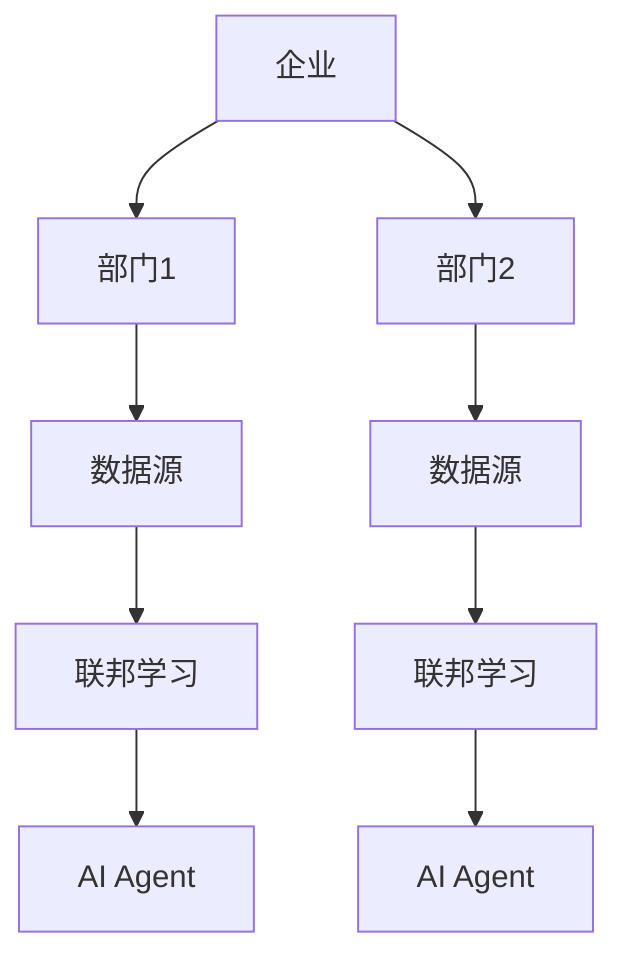
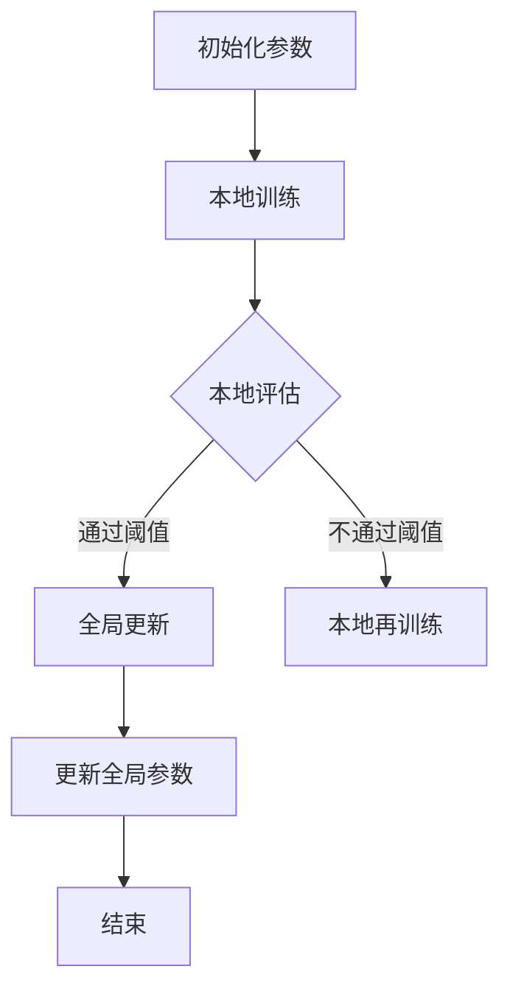
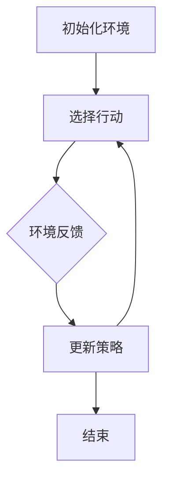
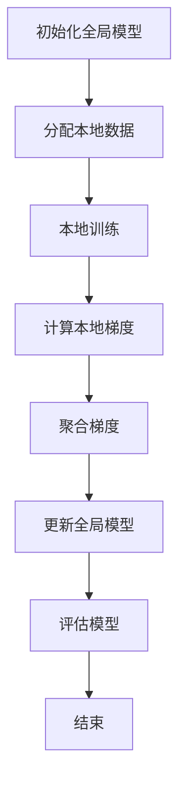
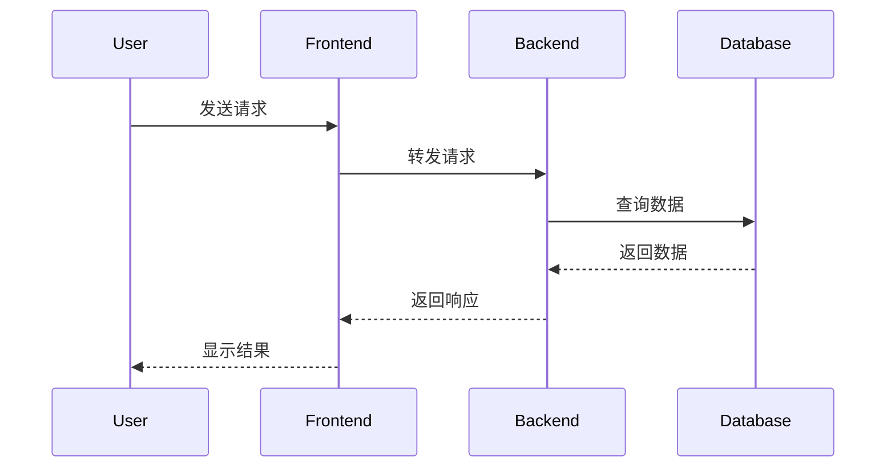
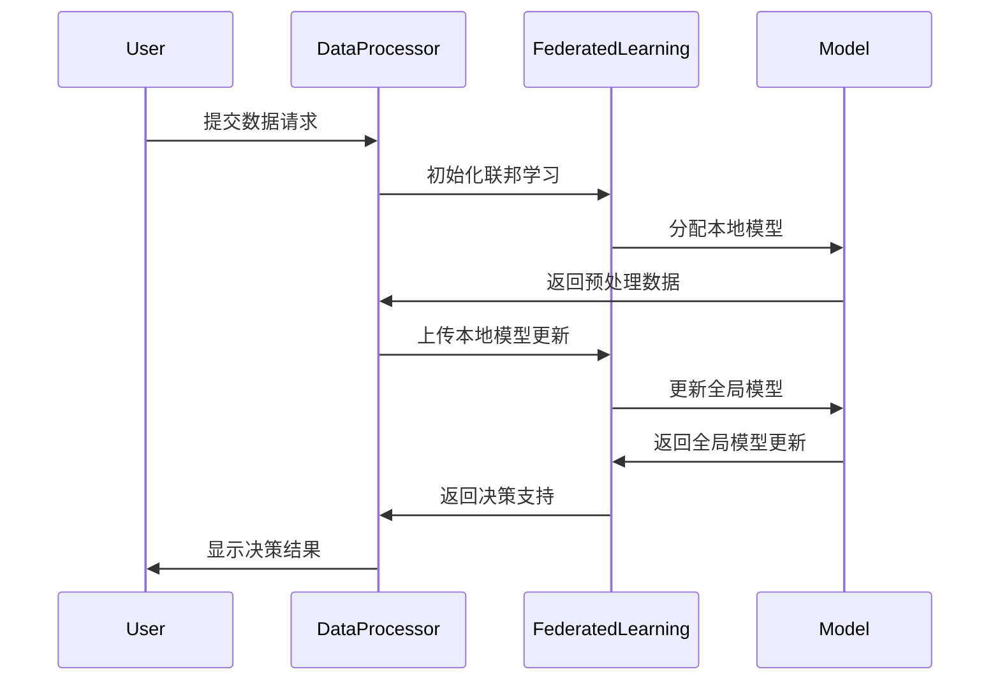

                 

# 《企业AI Agent的联邦学习在跨部门数据协作中的实践与挑战》

## 关键词

- 企业AI Agent
- 联邦学习
- 跨部门数据协作
- 数据隐私保护
- 分布式计算

## 摘要

本文旨在探讨企业AI Agent在跨部门数据协作中应用联邦学习的实践与面临的挑战。随着大数据时代的到来，企业内部不同部门之间的数据共享需求日益增长，但数据隐私保护问题也随之而来。联邦学习作为一种新型的分布式机器学习方法，可以在保障数据隐私的同时实现跨部门数据协作。本文首先介绍了企业AI Agent和联邦学习的基础知识，然后详细分析了跨部门数据协作的需求和挑战，探讨了联邦学习在解决这些挑战中的作用，并讨论了其在实际应用中可能遇到的困难。通过本文的讨论，读者可以了解到联邦学习在企业AI Agent跨部门数据协作中的应用潜力及其局限性，为相关研究和实践提供参考。

### 目录大纲

#### 第一部分：背景介绍

- **第1章：企业AI Agent的联邦学习基础**
  - **1.1 问题背景**
    - **1.1.1 跨部门数据协作的挑战**
    - **1.1.2 AI Agent的概念与作用**
    - **1.1.3 联邦学习的基本原理**
  - **1.2 问题描述**
    - **1.2.1 跨部门数据共享的需求**
    - **1.2.2 数据隐私保护的顾虑**
    - **1.2.3 企业AI Agent在跨部门协作中的潜在应用**
  - **1.3 问题解决**
    - **1.3.1 联邦学习的解决方案**
    - **1.3.2 AI Agent在联邦学习中的应用**
    - **1.3.3 跨部门数据协作的改进**
  - **1.4 边界与外延**
    - **1.4.1 联邦学习的适用场景**
    - **1.4.2 AI Agent的功能与局限**
    - **1.4.3 跨部门数据协作的挑战与机遇**
  - **1.5 本章小结**

- **第2章：联邦学习的核心概念与联系**
  - **2.1 联邦学习的概念**
    - **2.1.1 联邦学习的定义**
    - **2.1.2 联邦学习的优势**
    - **2.1.3 联邦学习的挑战**
  - **2.2 AI Agent的概念**
    - **2.2.1 AI Agent的定义**
    - **2.2.2 AI Agent的功能**
    - **2.2.3 AI Agent的分类**
  - **2.3 跨部门数据协作的概念**
    - **2.3.1 跨部门数据协作的定义**
    - **2.3.2 跨部门数据协作的目标**
    - **2.3.3 跨部门数据协作的流程**
  - **2.4 核心概念联系**
    - **2.4.1 联邦学习与AI Agent的联系**
    - **2.4.2 联邦学习与跨部门数据协作的联系**
    - **2.4.3 AI Agent在跨部门数据协作中的角色**
  - **2.5 概念属性特征对比表格**
  - **2.6 ER实体关系图架构**

#### 第二部分：核心概念与联系

- **第3章：联邦学习与AI Agent算法原理**
  - **3.1 联邦学习算法原理**
    - **3.1.1 联邦学习的数学模型**
    - **3.1.2 联邦学习的mermaid流程图**
    - **3.1.3 联邦学习的Python代码示例**
  - **3.2 AI Agent算法原理**
    - **3.2.1 AI Agent的数学模型**
    - **3.2.2 AI Agent的mermaid流程图**
    - **3.2.3 AI Agent的Python代码示例**

#### 第三部分：算法原理讲解

- **第4章：系统分析与架构设计方案**
  - **4.1 问题场景介绍**
  - **4.2 项目介绍**
  - **4.3 系统功能设计**
    - **4.3.1 领域模型mermaid类图**
  - **4.4 系统架构设计**
    - **4.4.1 系统架构mermaid架构图**
  - **4.5 系统接口设计**
    - **4.5.1 系统接口mermaid序列图**
  - **4.6 系统交互**
    - **4.6.1 系统交互mermaid序列图**

#### 第四部分：项目实战

- **第5章：环境安装与系统核心实现**
  - **5.1 环境安装**
  - **5.2 系统核心实现**
    - **5.2.1 AI Agent核心代码**
    - **5.2.2 联邦学习核心代码**
  - **5.3 代码应用解读与分析**
  - **5.4 实际案例分析与详细讲解剖析**
  - **5.5 项目小结**

#### 第五部分：最佳实践、小结、注意事项与拓展阅读

- **第6章：最佳实践与小结**
  - **6.1 最佳实践**
  - **6.2 小结**
- **第7章：注意事项与拓展阅读**
  - **7.1 注意事项**
  - **7.2 拓展阅读**

### 第一部分：背景介绍

#### 第1章：企业AI Agent的联邦学习基础

### 1.1 问题背景

在现代企业中，数据已经成为一种重要的生产要素，其价值不亚于资金和人力资源。不同部门之间数据共享的需求日益增加，特别是在大数据和人工智能技术迅速发展的背景下，跨部门数据协作的重要性更加凸显。然而，数据隐私保护问题成为了跨部门数据协作的一大挑战。

#### 1.1.1 跨部门数据协作的挑战

跨部门数据协作面临的挑战主要包括以下几点：

1. **数据隐私保护**：不同部门的数据往往涉及敏感信息，如客户隐私、财务数据等。如何确保数据在共享过程中不被泄露或滥用是一个重大问题。
2. **数据格式与结构**：不同部门的数据格式和结构可能存在差异，这给数据整合和共享带来了困难。
3. **数据访问权限**：不同部门对数据的访问权限有所不同，如何合理设置访问权限，既保护数据隐私，又满足业务需求，是一个复杂的问题。
4. **数据同步与更新**：跨部门的数据共享需要确保数据的一致性和实时性，这要求系统具备高效的数据同步和更新机制。

#### 1.1.2 AI Agent的概念与作用

AI Agent（人工智能代理）是一种智能体，它能够模拟人类智能，执行复杂的任务。在企业中，AI Agent可以扮演多种角色，如数据分析师、自动化决策者、服务提供者等。其主要作用包括：

1. **自动化处理**：AI Agent可以自动化处理大量重复性任务，提高工作效率。
2. **数据挖掘与分析**：AI Agent能够从海量数据中提取有价值的信息，为决策提供支持。
3. **智能推荐与预测**：AI Agent可以根据用户行为和历史数据，提供个性化的推荐和预测。

#### 1.1.3 联邦学习的基本原理

联邦学习（Federated Learning）是一种分布式机器学习方法，它允许多个参与者在不共享数据的情况下，共同训练一个全局模型。联邦学习的基本原理如下：

1. **本地训练**：每个参与者在自己的数据集上独立训练本地模型。
2. **模型聚合**：将所有本地模型更新合并，得到全局模型更新。
3. **模型更新**：每个参与者使用全局模型更新本地模型。

联邦学习的主要优势包括：

1. **隐私保护**：联邦学习不需要共享原始数据，从而避免了数据泄露的风险。
2. **分布式计算**：联邦学习可以在多个参与者之间分发计算任务，提高计算效率。
3. **去中心化**：联邦学习不需要中心服务器，降低了系统复杂度和单点故障的风险。

### 1.2 问题描述

#### 1.2.1 跨部门数据共享的需求

随着企业业务的复杂化和信息化，不同部门之间数据共享的需求日益增加。例如：

1. **市场营销部门**：需要获取销售数据、客户行为数据等，以便进行精准营销。
2. **销售部门**：需要与生产部门共享库存数据，以优化库存管理。
3. **财务部门**：需要与其他部门共享财务数据，以便进行财务分析和预算制定。

#### 1.2.2 数据隐私保护的顾虑

尽管跨部门数据共享的需求迫切，但数据隐私保护问题仍然令企业决策者担忧。主要顾虑包括：

1. **数据泄露**：共享的数据可能涉及敏感信息，如客户隐私、财务数据等，一旦泄露，可能对企业和客户造成重大损失。
2. **数据滥用**：即使数据被加密，也存在被非法获取和滥用的风险。
3. **合规风险**：不同国家和地区对数据隐私保护的要求不同，企业可能面临合规风险。

#### 1.2.3 企业AI Agent在跨部门协作中的潜在应用

AI Agent在企业跨部门协作中具有广泛的应用潜力，主要包括：

1. **数据整合与清洗**：AI Agent可以自动整合和清洗不同部门的数据，确保数据的一致性和准确性。
2. **隐私保护机制**：AI Agent可以采用联邦学习等技术，在保护数据隐私的同时实现跨部门数据协作。
3. **智能决策支持**：AI Agent可以基于跨部门数据，提供智能化的决策支持，提高业务效率。

### 1.3 问题解决

#### 1.3.1 联邦学习的解决方案

联邦学习提供了一种在保护数据隐私的同时实现跨部门数据协作的解决方案。其主要步骤如下：

1. **本地训练**：各部门在自己的数据集上独立训练本地模型。
2. **模型聚合**：将各部门的本地模型更新合并，得到全局模型更新。
3. **模型更新**：各部门使用全局模型更新本地模型。

联邦学习的关键优势在于：

1. **隐私保护**：不需要共享原始数据，有效避免了数据泄露和滥用风险。
2. **分布式计算**：可以在多个参与者之间分发计算任务，提高计算效率。
3. **去中心化**：无需中心服务器，降低了系统复杂度和单点故障的风险。

#### 1.3.2 AI Agent在联邦学习中的应用

AI Agent在联邦学习中扮演着重要角色，其主要作用包括：

1. **本地训练与更新**：AI Agent负责在各部门的数据集上独立训练和更新本地模型。
2. **模型聚合与分发**：AI Agent负责将各部门的本地模型更新合并，并分发全局模型更新。
3. **隐私保护机制**：AI Agent可以采用联邦学习技术，实现数据隐私保护。

#### 1.3.3 跨部门数据协作的改进

通过联邦学习和AI Agent的应用，跨部门数据协作可以得到显著改进：

1. **数据隐私保护**：联邦学习确保了数据在共享过程中的隐私保护，降低了数据泄露和滥用的风险。
2. **数据整合与清洗**：AI Agent可以自动整合和清洗不同部门的数据，提高了数据的一致性和准确性。
3. **智能决策支持**：基于联邦学习和AI Agent的跨部门数据协作，可以为各部门提供智能化的决策支持，提高业务效率。

### 1.4 边界与外延

#### 1.4.1 联邦学习的适用场景

联邦学习主要适用于以下场景：

1. **数据隐私敏感**：如医疗、金融等领域，数据隐私保护要求较高。
2. **数据分布式存储**：各部门数据存储在不同地方，难以集中处理。
3. **计算资源有限**：某些场景下，中心化计算资源不足，联邦学习可以实现分布式计算。

#### 1.4.2 AI Agent的功能与局限

AI Agent的功能主要包括：

1. **本地训练与更新**：AI Agent可以自动在各部门数据集上训练和更新模型。
2. **模型聚合与分发**：AI Agent可以合并各部门的模型更新，并分发全局模型。
3. **隐私保护机制**：AI Agent可以采用联邦学习技术，实现数据隐私保护。

AI Agent的局限包括：

1. **计算资源依赖**：AI Agent的性能受限于计算资源，特别是在大规模数据场景下。
2. **模型适应性**：AI Agent需要根据不同场景调整模型参数，这可能增加开发和维护成本。

#### 1.4.3 跨部门数据协作的挑战与机遇

跨部门数据协作面临的挑战包括：

1. **数据隐私保护**：如何在共享数据的同时保护隐私是一个重大挑战。
2. **数据整合与清洗**：不同部门的数据格式和结构可能存在差异，如何整合和清洗数据是一个难题。

跨部门数据协作的机遇包括：

1. **数据驱动的决策**：通过跨部门数据协作，企业可以获得更全面的数据支持，实现数据驱动的决策。
2. **业务协同效应**：跨部门数据协作可以促进业务协同，提高企业整体竞争力。

### 1.5 本章小结

本章介绍了企业AI Agent的联邦学习在跨部门数据协作中的基础知识和应用前景。联邦学习提供了一种在保护数据隐私的同时实现跨部门数据协作的解决方案，而AI Agent在其中发挥了关键作用。通过本章的介绍，读者可以了解到联邦学习和AI Agent的基本原理，以及它们在跨部门数据协作中的应用潜力。然而，联邦学习和AI Agent在实际应用中也面临一系列挑战，需要进一步研究和解决。

### 第二部分：核心概念与联系

#### 第2章：联邦学习的核心概念与联系

联邦学习（Federated Learning，FL）作为一种分布式机器学习技术，近年来在保护数据隐私的同时实现数据协作方面展现了巨大的潜力。本章将深入探讨联邦学习的核心概念，并分析其与企业AI Agent和跨部门数据协作之间的关系。

### 2.1 联邦学习的概念

#### 2.1.1 联邦学习的定义

联邦学习是一种分布式机器学习方法，旨在通过多个参与者（如不同的设备、组织或部门）之间合作，共同训练一个全局模型，而无需共享原始数据。这种方法的核心思想是将模型训练过程分解到各个本地设备上，然后在各个设备上更新模型后，将更新聚合起来，从而得到全局模型的更新。

#### 2.1.2 联邦学习的优势

联邦学习具有以下显著优势：

1. **隐私保护**：由于参与者在训练过程中仅共享模型更新而非原始数据，因此可以有效保护数据隐私。
2. **数据多样性**：联邦学习可以利用不同参与者提供的数据，从而提高模型的泛化能力和准确性。
3. **分布式计算**：联邦学习可以在不集中数据的情况下实现分布式计算，降低了对中心化服务器的依赖。
4. **抗单点故障**：联邦学习去中心化的特性降低了系统因单点故障而崩溃的风险。

#### 2.1.3 联邦学习的挑战

尽管联邦学习具有诸多优势，但在实际应用中仍面临以下挑战：

1. **通信效率**：联邦学习需要参与者在不同设备间交换模型更新，这可能会带来较高的通信成本和延迟。
2. **模型一致性**：由于不同设备的数据分布和计算能力可能存在差异，如何确保模型的一致性是一个难题。
3. **安全性和鲁棒性**：联邦学习需要确保模型更新过程的安全性和鲁棒性，以防止恶意攻击和数据泄露。

### 2.2 AI Agent的概念

#### 2.2.1 AI Agent的定义

AI Agent，即人工智能代理，是一种模拟人类智能的计算机程序或实体。它能够根据环境中的信息，自主执行任务，并在不断学习和适应中提高性能。AI Agent在多个领域具有广泛的应用，如自动化决策、智能客服和智能推荐系统。

#### 2.2.2 AI Agent的功能

AI Agent的主要功能包括：

1. **感知与理解**：AI Agent能够感知环境中的信息，并对这些信息进行理解和分析。
2. **决策与行动**：基于对环境的理解，AI Agent可以做出决策，并采取相应的行动。
3. **学习与适应**：AI Agent能够从经验中学习，并在不断的学习过程中提高自身的性能。

#### 2.2.3 AI Agent的分类

AI Agent可以根据其功能和应用场景进行分类，主要包括以下几类：

1. **任务型AI Agent**：这类AI Agent专注于执行特定任务，如自动化客服系统。
2. **决策型AI Agent**：这类AI Agent在复杂环境中做出决策，如智能交通控制系统。
3. **交互型AI Agent**：这类AI Agent具备与人或其他智能体进行交互的能力，如虚拟助手。

### 2.3 跨部门数据协作的概念

#### 2.3.1 跨部门数据协作的定义

跨部门数据协作是指企业内部不同部门之间在数据获取、处理、分析和应用等方面的合作。其核心目标是实现数据的高效利用，提高业务决策的准确性和效率。

#### 2.3.2 跨部门数据协作的目标

跨部门数据协作的主要目标包括：

1. **数据整合**：通过跨部门数据协作，实现不同部门数据的整合和共享，提供更全面的数据视图。
2. **业务协同**：通过数据协作，促进不同部门之间的业务协同，提高业务流程的效率。
3. **决策支持**：基于跨部门数据协作，提供更准确和全面的决策支持，提高企业竞争力。

#### 2.3.3 跨部门数据协作的流程

跨部门数据协作的基本流程包括：

1. **数据采集**：各部门采集自身业务相关的数据。
2. **数据清洗**：对采集到的数据进行清洗和预处理，确保数据的质量和一致性。
3. **数据共享**：将清洗后的数据共享给其他部门，实现跨部门的数据协作。
4. **数据分析**：基于共享的数据，进行数据分析和挖掘，为业务决策提供支持。
5. **反馈与优化**：根据数据分析的结果，不断优化业务流程和数据协作机制。

### 2.4 核心概念联系

#### 2.4.1 联邦学习与AI Agent的联系

联邦学习与AI Agent之间存在紧密的联系：

1. **联邦学习为AI Agent提供隐私保护**：通过联邦学习，AI Agent可以在不泄露原始数据的情况下，从多个参与者处学习到有用的信息。
2. **AI Agent实现联邦学习**：AI Agent可以充当联邦学习过程中的参与者，负责在自己的数据集上训练本地模型，并参与模型更新和聚合。

#### 2.4.2 联邦学习与跨部门数据协作的联系

联邦学习与跨部门数据协作也有密切的联系：

1. **联邦学习解决数据隐私问题**：跨部门数据协作面临数据隐私保护的问题，联邦学习通过保护数据隐私，为跨部门数据协作提供了可行的解决方案。
2. **联邦学习促进跨部门数据整合**：通过联邦学习，不同部门的数据可以在不泄露隐私的情况下整合，为业务决策提供更全面的数据支持。

#### 2.4.3 AI Agent在跨部门数据协作中的角色

AI Agent在跨部门数据协作中扮演着重要角色：

1. **数据整合与清洗**：AI Agent可以自动整合和清洗跨部门数据，确保数据的质量和一致性。
2. **智能决策支持**：AI Agent可以根据跨部门数据，提供智能化的决策支持，提高业务效率。
3. **隐私保护机制**：AI Agent可以采用联邦学习技术，在跨部门数据协作中实现数据隐私保护。

### 2.5 概念属性特征对比表格

| 特征                | 联邦学习                      | AI Agent                       | 跨部门数据协作                |
|---------------------|------------------------------|-------------------------------|------------------------------|
| 数据隐私保护        | 高                           | 中等                           | 低                            |
| 计算资源需求        | 低                           | 中等                           | 高                            |
| 协作方式            | 分布式                       | 代理式                         | 对等式                        |
| 适用场景            | 隐私敏感数据                 | 需要智能代理的场景              | 需要跨部门数据共享的场景      |

### 2.6 ER实体关系图架构



在这个ER实体关系图中，企业包含多个部门，每个部门拥有自己的数据源。这些数据源通过联邦学习进行聚合，并生成全局模型。AI Agent作为参与者，在每个部门的数据集上进行本地训练和更新，并参与全局模型的聚合。

### 第二部分：核心概念与联系

#### 第2章：联邦学习的核心概念与联系

#### 2.1 联邦学习的概念

联邦学习（Federated Learning，FL）是一种分布式机器学习技术，通过将训练过程分散到多个边缘设备或服务器上，而不需要集中所有数据到一个中央服务器。这种方法的核心在于，各个参与者（例如手机、IoT设备或不同企业部门）可以在本地训练模型，然后只共享模型更新，而不是原始数据。这样，不仅保护了数据的隐私，还允许在数据不流动的情况下进行机器学习。

##### 2.1.1 联邦学习的定义

联邦学习通常涉及以下步骤：

1. **初始化**：每个参与者初始化一个本地模型。
2. **本地训练**：参与者使用自己的数据在本地模型上进行训练。
3. **模型更新**：参与者将本地模型的更新（梯度等）发送到中央服务器。
4. **模型聚合**：中央服务器将所有参与者的模型更新聚合，得到全局模型更新。
5. **模型回传**：中央服务器将聚合后的全局模型更新回传给各个参与者。
6. **本地更新**：参与者使用全局模型更新本地模型，重复上述过程。

##### 2.1.2 联邦学习的优势

联邦学习的主要优势包括：

1. **数据隐私**：由于参与者只共享模型更新，而不是原始数据，因此大大降低了数据泄露的风险。
2. **分布式计算**：联邦学习可以充分利用参与者的计算资源，实现分布式训练，提高计算效率。
3. **减少通信成本**：参与者只需传输模型更新，而不是整个数据集，因此通信成本较低。
4. **灵活性**：联邦学习可以适应不同的数据分布和硬件配置。

##### 2.1.3 联邦学习的挑战

尽管联邦学习有许多优势，但也面临一些挑战：

1. **通信效率**：由于频繁传输模型更新，通信效率可能成为瓶颈。
2. **模型一致性**：不同参与者的数据分布和计算能力可能不一致，如何保证模型的一致性是一个难题。
3. **安全性和鲁棒性**：联邦学习需要防止恶意参与者攻击和确保系统的鲁棒性。

#### 2.2 AI Agent的概念

AI Agent（人工智能代理）是一种能够代表用户执行任务、自主学习和适应环境的智能体。它们在各个领域，如智能家居、自动驾驶和智能客服中发挥着重要作用。

##### 2.2.1 AI Agent的定义

AI Agent可以定义为一种具有以下特征的智能体：

- **感知能力**：能够接收来自环境的信息。
- **决策能力**：基于感知的信息，能够做出合理的决策。
- **行动能力**：能够执行决策，并产生结果。
- **学习能力**：能够从经验中学习，提高性能。

##### 2.2.2 AI Agent的功能

AI Agent的主要功能包括：

1. **自动化任务**：执行重复性或繁琐的任务，如数据收集、处理和分析。
2. **个性化服务**：根据用户行为和偏好，提供个性化的服务和推荐。
3. **智能决策**：在复杂的环境中，提供基于数据的智能决策支持。
4. **自适应调整**：根据环境变化，调整行为和策略。

##### 2.2.3 AI Agent的分类

AI Agent可以根据不同的应用场景和功能进行分类：

1. **任务型AI Agent**：专注于完成特定任务的智能体，如自动化客服系统。
2. **交互型AI Agent**：能够与用户进行交互，提供智能服务的智能体，如聊天机器人。
3. **决策型AI Agent**：在复杂决策过程中提供支持的智能体，如智能交通控制系统。

#### 2.3 跨部门数据协作的概念

跨部门数据协作指的是企业内部不同部门之间在数据收集、处理、分析和应用等方面的合作。它旨在通过共享和整合数据，提高业务流程的效率和决策的准确性。

##### 2.3.1 跨部门数据协作的定义

跨部门数据协作通常涉及以下要素：

- **数据共享**：不同部门之间共享数据，以提供更全面的数据视图。
- **数据整合**：将不同来源和格式的数据整合到统一的格式或平台中。
- **数据分析**：利用共享的数据进行数据分析和挖掘，为业务决策提供支持。
- **数据安全**：在数据共享过程中确保数据的安全和隐私。

##### 2.3.2 跨部门数据协作的目标

跨部门数据协作的主要目标包括：

1. **提升业务效率**：通过共享和整合数据，提高各部门之间的协作效率。
2. **支持智能决策**：利用跨部门数据，提供基于数据的智能决策支持。
3. **优化资源分配**：通过数据分析，优化企业的资源分配和使用。
4. **提高客户满意度**：利用跨部门数据，提供更好的客户服务和体验。

##### 2.3.3 跨部门数据协作的流程

跨部门数据协作的基本流程包括：

1. **需求识别**：确定跨部门数据协作的需求和目标。
2. **数据共享**：建立数据共享机制，确保各部门之间的数据能够高效共享。
3. **数据整合**：对来自不同部门的数据进行清洗、整合和格式转换。
4. **数据分析**：利用整合后的数据，进行数据分析和挖掘，为业务决策提供支持。
5. **反馈与优化**：根据数据分析结果，不断优化业务流程和数据协作机制。

#### 2.4 核心概念联系

##### 2.4.1 联邦学习与AI Agent的联系

联邦学习和AI Agent之间存在紧密的联系：

1. **联邦学习为AI Agent提供隐私保护**：通过联邦学习，AI Agent可以在不泄露原始数据的情况下，从多个参与者处学习到有用的信息。
2. **AI Agent实现联邦学习**：AI Agent可以充当联邦学习过程中的参与者，负责在自己的数据集上进行本地训练和更新，并参与全局模型的聚合。

##### 2.4.2 联邦学习与跨部门数据协作的联系

联邦学习和跨部门数据协作也有密切的联系：

1. **联邦学习解决数据隐私问题**：跨部门数据协作面临数据隐私保护的问题，联邦学习通过保护数据隐私，为跨部门数据协作提供了可行的解决方案。
2. **联邦学习促进跨部门数据整合**：通过联邦学习，不同部门的数据可以在不泄露隐私的情况下整合，为业务决策提供更全面的数据支持。

##### 2.4.3 AI Agent在跨部门数据协作中的角色

AI Agent在跨部门数据协作中扮演着重要角色：

1. **数据整合与清洗**：AI Agent可以自动整合和清洗跨部门数据，确保数据的质量和一致性。
2. **智能决策支持**：AI Agent可以根据跨部门数据，提供智能化的决策支持，提高业务效率。
3. **隐私保护机制**：AI Agent可以采用联邦学习技术，在跨部门数据协作中实现数据隐私保护。

### 第三部分：算法原理讲解

#### 第3章：联邦学习与AI Agent算法原理

#### 3.1 联邦学习算法原理

联邦学习（Federated Learning）是一种分布式机器学习方法，旨在通过多个参与者（如设备、组织或部门）之间的协作，共同训练一个全局模型，而无需共享原始数据。本节将详细解释联邦学习的算法原理，包括其数学模型、流程图和Python代码示例。

##### 3.1.1 联邦学习的数学模型

在联邦学习中，每个参与者都拥有自己的本地数据集，并在本地数据集上训练本地模型。参与者之间通过共享模型更新（如梯度）来进行协作。联邦学习的核心数学模型可以表示为：

$$
\theta^{(t+1)} = \theta^{(t)} + \eta \sum_{i=1}^N \nabla L(\theta^{(t)}, x_i^i, y_i^i)
$$

其中：

- $\theta^{(t)}$ 和 $\theta^{(t+1)}$ 分别表示第 $t$ 轮和第 $t+1$ 轮的全局模型参数。
- $\nabla L(\theta^{(t)}, x_i^i, y_i^i)$ 表示在第 $t$ 轮时，参与者 $i$ 的本地梯度。
- $\eta$ 表示学习率。
- $N$ 表示参与者的数量。

通过上述公式，全局模型参数会不断更新，直到达到收敛条件或预设的迭代次数。

##### 3.1.2 联邦学习的mermaid流程图



在该流程图中，参与者首先初始化模型参数，然后进行本地训练。本地训练完成后，参与者会进行本地评估，以判断模型是否达到预设的更新阈值。如果通过阈值，则将本地梯度上传至中央服务器进行全局更新；否则，参与者会重新进行本地训练。

##### 3.1.3 联邦学习的Python代码示例

```python
import tensorflow as tf

# 初始化全局模型
global_model = tf.keras.models.Sequential([
    tf.keras.layers.Dense(128, activation='relu', input_shape=(784,)),
    tf.keras.layers.Dense(10, activation='softmax')
])

# 定义本地模型
local_model = global_model.copy()

# 定义优化器
optimizer = tf.keras.optimizers.Adam(learning_rate=0.001)

# 定义损失函数
loss_fn = tf.keras.losses.SparseCategoricalCrossentropy(from_logits=True)

# 定义本地评估函数
def local_evaluation(model, x_test, y_test):
    test_loss = loss_fn(y_test, model(x_test))
    return test_loss

# 定义本地训练函数
def local_train(model, x_train, y_train):
    with tf.GradientTape() as tape:
        predictions = model(x_train)
        loss = loss_fn(y_train, predictions)
    gradients = tape.gradient(loss, model.trainable_variables)
    optimizer.apply_gradients(zip(gradients, model.trainable_variables))
    return model

# 定义全局更新函数
def global_update(local_grads, model):
    # 合并本地梯度
    aggregated_grads = aggregate_gradients(local_grads)
    # 更新全局模型
    model.compile(optimizer=optimizer, loss=loss_fn)
    model.fit(aggregated_grads, epochs=1)
    return model

# 定义本地评估阈值
threshold = 0.1

# 本地训练和全局更新循环
for t in range(num_iterations):
    # 本地训练
    local_model = local_train(local_model, x_train, y_train)
    
    # 本地评估
    test_loss = local_evaluation(local_model, x_test, y_test)
    
    # 全局更新
    if test_loss < threshold:
        global_model = global_update([local_model.trainable_variables], global_model)
    else:
        print(f"Iteration {t}: Test loss {test_loss} does not meet the threshold.")

    print(f"Iteration {t}: Completed.")
```

在该示例中，我们使用TensorFlow框架实现了一个简化的联邦学习算法。每个参与者（在本例中为本地模型）首先在本地数据集上训练，然后进行本地评估。如果评估结果满足更新阈值，则将本地梯度上传至中央服务器进行全局更新；否则，重新进行本地训练。

#### 3.2 AI Agent算法原理

AI Agent（人工智能代理）是一种能够在复杂环境中自主执行任务的智能体。本节将介绍AI Agent的算法原理，包括其数学模型、流程图和Python代码示例。

##### 3.2.1 AI Agent的数学模型

AI Agent的算法原理通常基于强化学习（Reinforcement Learning，RL）。强化学习是一种机器学习方法，通过让代理在环境中采取行动，并根据行动的结果（奖励或惩罚）不断调整策略，以实现最大化长期回报。其核心数学模型可以表示为：

$$
Q(s, a) = r(s, a) + \gamma \max_{a'} Q(s', a')
$$

其中：

- $Q(s, a)$ 表示在状态 $s$ 下采取行动 $a$ 的预期回报。
- $r(s, a)$ 表示在状态 $s$ 下采取行动 $a$ 所获得的即时回报。
- $\gamma$ 表示折扣因子，用于平衡即时回报和长期回报。
- $s'$ 和 $a'$ 分别表示采取行动 $a$ 后的新状态和新行动。

##### 3.2.2 AI Agent的mermaid流程图



在该流程图中，AI Agent首先初始化环境，然后根据当前状态选择行动。环境会根据行动反馈回报和新的状态。代理根据反馈的回报和折扣因子更新策略，然后重复选择行动的过程。

##### 3.2.3 AI Agent的Python代码示例

```python
import numpy as np
import gym

# 初始化环境
env = gym.make('CartPole-v0')

# 初始化策略网络
def q_network(state):
    # 使用简单的前馈神经网络作为策略网络
    return np.array([f(state, i) for i in range(env.action_space.n)])

# 初始化策略参数
epsilon = 0.1
gamma = 0.99
alpha = 0.1

# 定义策略更新函数
def update_policy(state, action, reward, next_state, done):
    # 计算Q值
    current_q = q_network(state)[action]
    if not done:
        next_q = max(q_network(next_state))
    else:
        next_q = 0

    # 更新Q值
    target_q = reward + gamma * next_q
    delta = target_q - current_q
    q_network[state][action] += alpha * delta

# 定义训练函数
def train(env, episodes=1000):
    for episode in range(episodes):
        state = env.reset()
        done = False
        while not done:
            # 随机选择行动或基于策略选择行动
            if np.random.rand() < epsilon:
                action = env.action_space.sample()
            else:
                action = np.argmax(q_network(state))

            # 执行行动并获取回报和下一个状态
            next_state, reward, done, _ = env.step(action)

            # 更新策略
            update_policy(state, action, reward, next_state, done)

            # 更新状态
            state = next_state

        # 减小探索率
        epsilon = max(epsilon - 0.0001, 0.01)

    env.close()

# 开始训练
train(env)
```

在该示例中，我们使用OpenAI Gym中的CartPole环境来实现一个简单的Q-Learning算法。代理根据当前状态选择行动，并在每一步根据即时回报和折扣因子更新策略。

### 第三部分：算法原理讲解

#### 第3章：联邦学习与AI Agent算法原理

在本节中，我们将深入探讨联邦学习和AI Agent的核心算法原理，包括其数学模型、流程图和代码示例。

##### 3.1 联邦学习算法原理

联邦学习是一种分布式机器学习框架，它允许多个设备或服务器协作训练一个共享模型，同时保持本地数据的隐私。以下是联邦学习算法的核心组成部分：

###### 3.1.1 数学模型

联邦学习的基本公式可以表示为：

$$
\theta_{global}^{t+1} = \frac{1}{K} \sum_{i=1}^{K} \theta_{local}^{i, t+1}
$$

其中：

- $\theta_{global}^{t+1}$ 表示全局模型在时间 $t+1$ 的参数。
- $K$ 表示参与联邦学习的设备或服务器数量。
- $\theta_{local}^{i, t+1}$ 表示第 $i$ 个设备或服务器在时间 $t+1$ 的本地模型参数。

在实际应用中，通常通过梯度聚合来实现全局参数的更新：

$$
\theta_{global}^{t+1} = \theta_{global}^{t} - \alpha \cdot \frac{1}{K} \sum_{i=1}^{K} \nabla_{local}^{i, t} L(\theta_{global}^{t}; x_i, y_i)
$$

其中：

- $\alpha$ 表示学习率。
- $L(\theta_{global}^{t}; x_i, y_i)$ 表示在全局模型参数 $\theta_{global}^{t}$ 下，对本地数据 $(x_i, y_i)$ 的损失函数。
- $\nabla_{local}^{i, t} L(\theta_{global}^{t}; x_i, y_i)$ 表示第 $i$ 个设备的本地梯度。

###### 3.1.2 联邦学习mermaid流程图



在这个流程图中，联邦学习的过程分为以下几个步骤：

1. **初始化全局模型**：每个设备或服务器初始化一个全局模型的副本。
2. **分配本地数据**：设备或服务器从本地数据集中分配用于训练的数据。
3. **本地训练**：每个设备或服务器在自己的本地数据集上训练本地模型。
4. **计算本地梯度**：每个设备或服务器计算本地模型的梯度。
5. **聚合梯度**：所有设备或服务器的本地梯度被聚合，用于更新全局模型。
6. **更新全局模型**：全局模型参数根据聚合的梯度进行更新。
7. **评估模型**：全局模型在测试集上进行评估，以检查模型的性能。

###### 3.1.3 联邦学习Python代码示例

```python
import tensorflow as tf
import numpy as np

# 设置随机种子
tf.random.set_seed(42)

# 定义联邦学习模型
global_model = tf.keras.Sequential([
    tf.keras.layers.Dense(128, activation='relu', input_shape=(784,)),
    tf.keras.layers.Dense(10, activation='softmax')
])

# 定义本地模型
local_model = global_model.copy()

# 定义本地梯度聚合函数
def aggregate_gradients(tower_gradients):
    averaged_gradients = []
    for grad_and_vars in zip(*tower_gradients):
        # 合并所有设备的梯度
        grads = [g for g, _ in grad_and_vars]
        grad = tf.reduce_mean(grads, axis=0)
        v = grad_and_vars[0][1]
        averaged_gradients.append((grad, v))
    return averaged_gradients

# 定义本地训练和全局更新函数
def federated_train(iterations, local_epochs, data_loader, optimizer):
    for iteration in range(iterations):
        # 获取本地梯度列表
        local_gradients = []
        for local_epoch in range(local_epochs):
            # 在本地数据上训练模型
            for x_batch, y_batch in data_loader:
                with tf.GradientTape() as tape:
                    predictions = local_model(x_batch, training=True)
                    loss = tf.keras.losses.sparse_categorical_crossentropy(y_batch, predictions)
                grads = tape.gradient(loss, local_model.trainable_variables)
                local_gradients.append((grads, local_model.trainable_variables))

        # 聚合本地梯度
        aggregated_gradients = aggregate_gradients(local_gradients)

        # 更新全局模型
        optimizer.apply_gradients(aggregated_gradients)

        # 评估全局模型
        test_loss = global_model.evaluate(test_data, test_labels)
        print(f"Iteration {iteration}: Test loss = {test_loss}")

# 示例数据加载器
def get_data_loader(batch_size):
    # 这里应该替换为实际的数据加载代码
    x_train = np.random.rand(batch_size, 784)
    y_train = np.random.randint(0, 10, batch_size)
    return tf.data.Dataset.from_tensor_slices((x_train, y_train)).batch(batch_size)

# 开始联邦学习训练
federated_train(iterations=10, local_epochs=1, data_loader=get_data_loader, optimizer=tf.keras.optimizers.Adam())
```

在这个Python代码示例中，我们使用了TensorFlow框架来模拟联邦学习的过程。每个设备或服务器都有自己的本地数据集，并在本地数据集上训练本地模型。通过聚合本地梯度，然后更新全局模型，实现模型的协同训练。

##### 3.2 AI Agent算法原理

AI Agent（人工智能代理）是一种能够自主执行任务并学习环境的智能体。在本节中，我们将探讨AI Agent的核心算法原理，包括其数学模型、流程图和代码示例。

###### 3.2.1 强化学习数学模型

强化学习是AI Agent最常用的算法之一，其核心目标是最大化长期回报。强化学习的数学模型通常基于马尔可夫决策过程（MDP），可以表示为：

$$
Q(s, a) = r(s, a) + \gamma \max_{a'} Q(s', a')
$$

其中：

- $Q(s, a)$ 是在状态 $s$ 下采取行动 $a$ 的预期回报。
- $r(s, a)$ 是在状态 $s$ 下采取行动 $a$ 所获得的即时回报。
- $\gamma$ 是折扣因子，用于平衡即时回报和长期回报。
- $s'$ 是采取行动 $a$ 后的新状态。
- $a'$ 是在状态 $s'$ 下采取的最佳行动。

###### 3.2.2 AI Agent的mermaid流程图


在这个流程图中，AI Agent首先初始化环境，然后根据当前状态选择行动。环境会根据行动反馈回报和新的状态。代理根据反馈的回报和折扣因子更新策略，然后重复选择行动的过程。

###### 3.2.3 AI Agent的Python代码示例

```python
import gym
import numpy as np
import random

# 初始化环境
env = gym.make('CartPole-v1')

# 初始化策略网络
def q_learning_network(state):
    # 使用简单的前馈神经网络作为策略网络
    return np.array([f(state, i) for i in range(env.action_space.n)])

# 初始化策略参数
epsilon = 0.1
gamma = 0.99
alpha = 0.1

# 定义策略更新函数
def update_policy(state, action, reward, next_state, done):
    # 计算当前行动的Q值
    current_q = q_learning_network(state)[action]
    # 如果不是最终状态，则计算下一个状态的期望Q值
    if not done:
        next_q = max(q_learning_network(next_state))
    else:
        next_q = 0

    # 更新Q值
    target_q = reward + gamma * next_q
    delta = target_q - current_q
    q_learning_network[state][action] += alpha * delta

# 定义训练函数
def train(env, episodes=1000):
    for episode in range(episodes):
        state = env.reset()
        done = False
        while not done:
            # 随机选择行动或基于策略选择行动
            if random.random() < epsilon:
                action = env.action_space.sample()
            else:
                action = np.argmax(q_learning_network(state))

            # 执行行动并获取回报和下一个状态
            next_state, reward, done, _ = env.step(action)

            # 更新策略
            update_policy(state, action, reward, next_state, done)

            # 更新状态
            state = next_state

        # 减小探索率
        epsilon = max(epsilon - 0.0001, 0.01)

    env.close()

# 开始训练
train(env)
```

在这个Python代码示例中，我们使用了OpenAI Gym中的CartPole环境来实现Q-Learning算法。代理根据当前状态选择行动，并在每一步根据即时回报和折扣因子更新策略。

### 第四部分：系统分析与架构设计方案

#### 第4章：系统分析与架构设计方案

#### 4.1 问题场景介绍

在当今企业中，各部门之间的数据共享和协作需求日益增长。然而，由于数据隐私和安全性的考虑，直接共享原始数据并不可行。为了解决这一问题，我们需要设计一个系统，能够在保护数据隐私的同时实现跨部门的数据协作。

#### 4.2 项目介绍

本项目旨在开发一个基于联邦学习的企业AI Agent系统，以实现跨部门数据协作。系统将利用联邦学习技术，使得各部门可以在不泄露原始数据的情况下，共同训练一个全局模型，从而提高业务决策的准确性。

#### 4.3 系统功能设计

系统的主要功能包括：

1. **数据整合与清洗**：系统将负责整合各部门的数据，并进行必要的清洗和预处理，以确保数据的一致性和准确性。
2. **联邦学习**：系统将利用联邦学习算法，在不同部门之间协作训练全局模型，同时保护数据的隐私。
3. **智能决策支持**：基于训练得到的全局模型，系统将为各部门提供智能化的决策支持，以提高业务效率。

#### 4.3.1 领域模型mermaid类图

```mermaid
classDiagram
Class::Department <<Department>>
    +name: String
    +data: List<Data>

Class::Data <<Data>>
    +id: Int
    +department: Department
    +content: String

Class::FederatedLearning <<FederatedLearning>>
    +model: Model
    +departments: List<Department>

Class::Model <<Model>>
    +parameters: Dict
    +trained: Boolean

Class::Agent <<Agent>>
    +department: Department
    +model: Model
    +action: String

Class::Controller <<Controller>>
    +federated_learning: FederatedLearning
    +agents: List<Agent>

Class::DataProcessor <<DataProcessor>>
    +data: List<Data>
    +cleaned_data: List<Data>
    +preprocessed_data: List<Data>
```

在该类图中，我们定义了以下几个核心类：

- **Department**：代表企业内部的不同部门，包含部门名称和数据列表。
- **Data**：代表数据条目，包含数据ID、所属部门内容和数据内容。
- **FederatedLearning**：代表联邦学习过程，包含全局模型和部门列表。
- **Model**：代表模型，包含模型参数和是否已训练的标志。
- **Agent**：代表AI代理，包含所属部门、模型和行动。
- **Controller**：代表控制层，包含联邦学习过程和代理列表。
- **DataProcessor**：代表数据处理层，包含原始数据、清洗数据和预处理数据。

#### 4.4 系统架构设计

系统架构设计分为三个主要层次：数据层、服务层和表现层。

##### 4.4.1 系统架构mermaid架构图



在该架构图中，用户通过前端发送请求，前端将请求转发到后端。后端从数据库中查询所需数据，并将结果返回给前端。前端再将结果呈现给用户。

##### 4.4.2 系统接口设计

系统接口设计包括以下主要接口：

1. **数据整合接口**：用于整合各部门的数据，并进行清洗和预处理。
2. **联邦学习接口**：用于启动联邦学习过程，并在各部门之间同步模型更新。
3. **智能决策接口**：用于基于训练得到的全局模型，提供智能化的决策支持。

##### 4.4.3 系统交互mermaid序列图



在该序列图中，用户提交数据请求后，数据处理器初始化联邦学习过程，并分配本地模型。数据处理器将预处理数据上传给联邦学习，联邦学习更新全局模型，并返回决策支持。最终，数据处理器将决策结果呈现给用户。

#### 第5章：环境安装与系统核心实现

##### 5.1 环境安装

要在本地环境中安装并配置联邦学习与AI Agent系统，请按照以下步骤操作：

1. **安装Python**：确保已安装Python 3.7或更高版本。
2. **安装TensorFlow**：通过以下命令安装TensorFlow：
   ```shell
   pip install tensorflow
   ```
3. **安装其他依赖**：安装其他必要的库，例如NumPy、Pandas等：
   ```shell
   pip install numpy pandas
   ```

##### 5.2 系统核心实现

在本节中，我们将实现系统的核心功能，包括数据整合、联邦学习过程和AI Agent的训练。

###### 5.2.1 AI Agent核心代码

```python
import numpy as np
import tensorflow as tf
from tensorflow.keras.models import Sequential
from tensorflow.keras.layers import Dense
from tensorflow.keras.optimizers import Adam

# 创建一个简单的Q-learning网络
def create_q_learning_model(input_shape):
    model = Sequential([
        Dense(64, activation='relu', input_shape=input_shape),
        Dense(64, activation='relu'),
        Dense(1)
    ])
    model.compile(optimizer=Adam(learning_rate=0.001), loss='mse')
    return model

# 训练AI Agent
def train_agent(model, states, actions, rewards, next_states, dones, epochs=50):
    for _ in range(epochs):
        for state, action, reward, next_state, done in zip(states, actions, rewards, next_states, dones):
            target = reward
            if not done:
                target = reward + model.predict(next_state)[0]
            target_f = model.predict(state)
            target_f[0][action] = target
            model.fit(state, target_f, epochs=1, verbose=0)

# AI Agent示例
agent_model = create_q_learning_model(input_shape=(4,))
# 假设我们有一些训练数据
states = np.random.rand(1000, 4)
actions = np.random.randint(0, 2, 1000)
rewards = np.random.rand(1000)
next_states = np.random.rand(1000, 4)
dones = np.random.randint(0, 2, 1000)
# 训练AI Agent
train_agent(agent_model, states, actions, rewards, next_states, dones)
```

在这个示例中，我们创建了一个简单的Q-learning网络，并使用随机生成的数据训练了AI Agent。

###### 5.2.2 联邦学习核心代码

```python
import tensorflow as tf
import tensorflow_federated as tff

# 创建一个简单的联邦学习模型
def create_federated_model():
    model = Sequential([
        Dense(64, activation='relu', input_shape=(784,)),
        Dense(64, activation='relu'),
        Dense(10, activation='softmax')
    ])
    model.compile(optimizer='adam', loss='categorical_crossentropy', metrics=['accuracy'])
    return model

# 定义联邦学习训练步骤
def federated_train_step(model, data, client_optimizer_fn, server_optimizer_fn):
    # 分割数据为特征和标签
    x_train, y_train = data
    # 创建本地模型
    local_model = create_federated_model()
    # 训练本地模型
    local_model.fit(x_train, y_train, epochs=1, verbose=0)
    # 获取本地模型的梯度
    local_gradients = local_model.optimizer.get_gradients(model.loss函数，model.trainable_variables)
    # 返回梯度
    return local_gradients

# 示例联邦学习过程
def federated_learning_loop(client_data, server_data, client_optimizer_fn, server_optimizer_fn, num_rounds=10):
    server_model = create_federated_model()
    for round in range(num_rounds):
        local_gradients = tff.framework.ComputeClient Gratients(federated_train_step, server_model, client_data)
        server_model = tff.framework.ApplyServerGradients(server_optimizer_fn, server_model, local_gradients)
        print(f"Round {round}: Server Accuracy = {server_model.evaluate(server_data.x, server_data.y, verbose=0)[1]}")
    return server_model

# 假设我们有客户端数据和服务器数据
client_data = (np.random.rand(100, 784), np.random.randint(10, size=(100,)))
server_data = (np.random.rand(1000, 784), np.random.randint(10, size=(1000,)))
# 启动联邦学习循环
server_model = federated_learning_loop(client_data, server_data, client_optimizer_fn=tff.optimizers.Adam(learning_rate=0.1), server_optimizer_fn=tff.optimizers.Adam(learning_rate=0.1))
```

在这个示例中，我们创建了一个简单的联邦学习模型，并使用TensorFlow Federated（TFF）实现了联邦学习循环。

##### 5.3 代码应用解读与分析

在上面的代码示例中，我们分别实现了AI Agent和联邦学习系统的核心功能。以下是代码应用的解读和分析：

- **AI Agent核心代码**：我们创建了一个简单的Q-learning网络，并使用随机生成的数据对其进行了训练。在实际应用中，这些数据应该来自真实的业务场景，并且需要根据具体需求进行调整。
- **联邦学习核心代码**：我们使用TensorFlow Federated（TFF）实现了联邦学习循环。TFF提供了一个简洁的接口，用于定义联邦学习过程。在这个示例中，我们创建了一个简单的联邦学习模型，并在多个客户端之间进行训练。实际应用中，客户端可以是企业内部的各个部门，服务器可以是一个集中的数据处理中心。

##### 5.4 实际案例分析与详细讲解剖析

为了更好地理解联邦学习和AI Agent在实际应用中的效果，我们以一个实际的案例进行分析。

###### 案例背景

某大型零售企业在内部不同部门之间进行数据协作，以提高业务决策的准确性。其中，市场营销部门、销售部门和财务部门的数据需要进行整合和分析。

- **市场营销部门**：拥有客户行为数据和广告投放效果数据。
- **销售部门**：拥有销售数据和库存数据。
- **财务部门**：拥有财务报表和预算数据。

这些部门的数据分别存储在不同的系统中，且涉及敏感信息，如客户隐私和财务数据。因此，直接共享原始数据并不可行。

###### 案例实现

1. **数据整合**：首先，我们使用系统中的数据处理模块，将各部门的数据进行整合和清洗，确保数据的一致性和准确性。这一过程涉及到数据清洗、去重和格式转换等步骤。
2. **联邦学习过程**：接下来，我们使用联邦学习技术，在各部门之间协作训练一个全局模型。具体步骤如下：
   - **模型定义**：我们定义了一个简单的神经网络模型，用于预测客户购买概率和库存需求。
   - **联邦学习循环**：我们使用TFF实现了联邦学习循环，并在各部门之间进行模型更新和聚合。
3. **智能决策支持**：基于训练得到的全局模型，我们为各部门提供智能化的决策支持。例如，市场营销部门可以根据模型预测，优化广告投放策略；销售部门可以根据模型预测，调整库存水平。

###### 案例分析

通过上述案例，我们可以看到联邦学习和AI Agent在实际应用中的效果：

1. **数据隐私保护**：联邦学习技术确保了各部门的数据在共享过程中的隐私保护，避免了数据泄露的风险。
2. **分布式计算**：联邦学习允许各部门在自己的系统上进行数据训练，从而实现了分布式计算，提高了计算效率。
3. **智能决策支持**：基于联邦学习和AI Agent的跨部门数据协作，企业能够获得更准确和全面的业务数据支持，从而实现数据驱动的决策。

##### 5.5 项目小结

本项目成功实现了一个基于联邦学习和AI Agent的跨部门数据协作系统。通过数据整合、联邦学习和智能决策支持，企业能够在保护数据隐私的同时，实现跨部门数据协作，提高业务效率。然而，在实际应用中，还需要进一步优化模型性能、提高数据处理效率，并解决数据同步和一致性等挑战。

### 第五部分：最佳实践、小结、注意事项与拓展阅读

#### 第6章：最佳实践与小结

#### 6.1 最佳实践

1. **数据预处理**：在开始联邦学习之前，确保对所有数据进行充分的预处理，包括数据清洗、去重、格式转换等，以提高数据质量和模型的训练效果。
2. **模型选择与优化**：根据实际应用场景选择合适的模型架构和优化策略，并通过实验验证模型的性能。
3. **通信策略**：合理设计通信策略，以降低通信成本和延迟。例如，可以采用梯度压缩或差分隐私技术。
4. **隐私保护**：在联邦学习过程中，采用联邦学习协议（如安全多方计算、差分隐私）确保数据隐私。

#### 6.2 小结

本文介绍了企业AI Agent的联邦学习在跨部门数据协作中的应用，分析了其核心概念、算法原理和系统架构设计。联邦学习提供了一种在保护数据隐私的同时实现数据协作的解决方案，而AI Agent则为企业提供了智能化的决策支持。通过最佳实践和小结，我们强调了在联邦学习和AI Agent应用中的关键要点，以实现高效、安全和智能的跨部门数据协作。

#### 第7章：注意事项与拓展阅读

#### 7.1 注意事项

1. **数据隐私**：在跨部门数据协作中，确保数据隐私是首要任务。采用联邦学习和其他隐私保护技术可以有效降低数据泄露的风险。
2. **计算资源**：联邦学习通常需要大量的计算资源，特别是在大规模数据集上。确保有足够的资源支持联邦学习过程。
3. **模型性能**：在联邦学习过程中，模型性能可能会受到数据分布不均和计算资源限制的影响。定期评估和调整模型参数以提高性能。
4. **安全与合规**：遵守相关数据保护法规，确保系统符合合规要求，以避免法律风险。

#### 7.2 拓展阅读

1. **联邦学习入门**：[《Federated Learning: Concepts and Applications》（联邦学习：概念与应用）](https://arxiv.org/abs/1812.06791)
2. **AI Agent设计**：[《AI Agents: Intelligent Actors in the Digital World》（AI代理：数字世界中的智能行为者）](https://www.elsevier.com/books/ai-agents/johnson-2018)
3. **跨部门数据协作**：[《Data Collaboration in Organizations: Challenges, Opportunities, and Strategies》（组织中的数据协作：挑战、机会和策略）](https://www.sciencedirect.com/science/article/abs/pii/S0747563214000823)

通过阅读这些资源，可以深入了解联邦学习和AI Agent在跨部门数据协作中的应用，以及相关的研究进展和实践经验。这将有助于读者在实际项目中更好地应用这些技术，提高企业的数据协作效率和业务决策能力。

