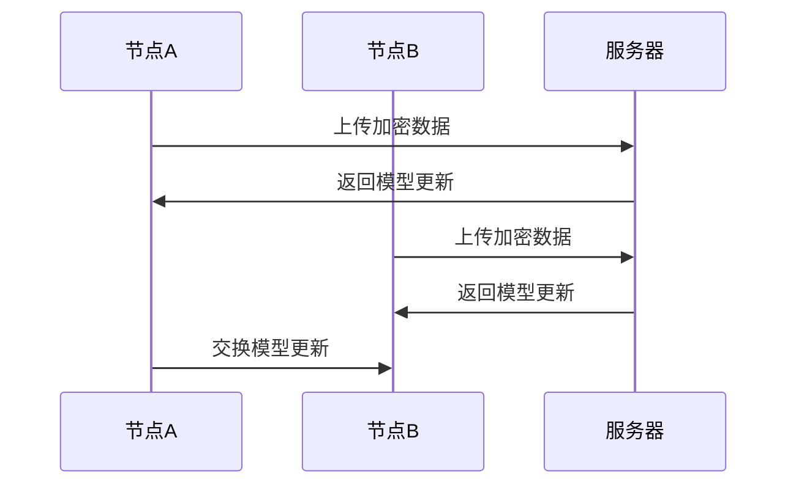

                 


## 引言：企业AI Agent与联邦学习的挑战

### 1.1 联邦学习的兴起

**基本概念**

联邦学习（Federated Learning）是一种分布式机器学习技术，通过将模型的训练过程分散到多个边缘设备上，以此来提高隐私保护和数据安全。在联邦学习框架下，各个设备仅需要上传本地模型更新的参数，而不需要上传原始数据。这一特性使得联邦学习在医疗、金融、物联网等敏感数据处理的场景中具有广泛的应用前景。

**应用场景**

联邦学习在多个领域有着广泛的应用。例如，在医疗领域，医生可以在不泄露患者隐私的情况下，通过联邦学习算法共享患者的诊断数据和治疗方案；在金融领域，银行可以使用联邦学习来分析客户行为，同时保护客户的数据隐私；在物联网领域，设备可以通过联邦学习来实现智能优化，同时降低中心化数据处理带来的通信成本。

**挑战与机遇**

尽管联邦学习提供了显著的隐私保护和数据安全优势，但同时也面临着一系列挑战。首先，如何在保证隐私和安全的前提下，实现高效的模型更新和优化，是一个亟待解决的问题。其次，联邦学习中的通信成本和计算资源消耗也是一个重要的考虑因素。此外，如何设计可靠的联邦学习安全协议，防止恶意攻击和模型篡改，也是联邦学习领域的一个重要研究方向。

### 1.2 企业AI Agent的需求

**定义与角色**

企业AI Agent是指专门为企业提供服务的人工智能实体，它们可以自动执行一系列复杂任务，提高企业的运营效率和竞争力。企业AI Agent在企业中扮演着多种角色，如数据分析助手、客户服务代表、供应链优化专家等。

**关键特性**

企业AI Agent具有以下关键特性：

1. **自主性**：AI Agent可以在没有人为干预的情况下执行任务，自主学习和适应环境。
2. **协同性**：AI Agent可以与其他AI Agent和人类工作人员协同工作，共同完成复杂任务。
3. **可扩展性**：企业AI Agent可以轻松集成到现有的企业系统中，支持多种业务场景。
4. **高可用性**：企业AI Agent需要具备高可靠性，能够持续稳定地提供服务。

**发展趋势**

随着人工智能技术的不断发展，企业AI Agent的应用场景将越来越广泛。未来，企业AI Agent将更加智能化，具备更强的自主学习能力和适应能力，能够更好地满足企业的个性化需求。

### 1.3 安全协议在联邦学习中的重要性

**安全问题**

在联邦学习过程中，数据安全和隐私保护是一个至关重要的议题。由于联邦学习涉及到多个参与方，如何确保数据的机密性、完整性和可用性，防止数据泄露、模型篡改和通信信道攻击，是一个重要的挑战。

**设计原则**

联邦学习安全协议的设计原则主要包括以下几点：

1. **机密性**：确保参与方的数据在传输和存储过程中不被泄露。
2. **完整性**：确保数据的完整性和一致性，防止数据被篡改。
3. **可用性**：确保联邦学习系统能够持续、稳定地提供服务。
4. **抗攻击性**：设计出能够抵御各种恶意攻击的安全机制。

**挑战与解决方案**

设计联邦学习安全协议面临着诸多挑战，如如何在保证安全性的同时，提高系统的性能和可扩展性，如何在异构计算环境下实现高效的安全协议等。针对这些挑战，需要不断创新和研究，提出更加有效和实用的安全协议设计方法。

### 1.4 书籍概述与读者对象

**书籍概述**

本书旨在深入探讨企业AI Agent的联邦学习安全协议设计，包括基本概念、设计原则、实现方法和实际应用等。通过本书的学习，读者将能够了解联邦学习安全协议的各个方面，掌握设计高效、安全的联邦学习系统的技能。

**读者对象**

本书适合以下读者群体：

1. 从事人工智能和分布式系统研究的学者和研究人员。
2. 企业IT部门的技术人员，负责设计、开发和维护企业AI Agent系统。
3. 对联邦学习和安全协议感兴趣的技术爱好者。

本书将帮助读者深入了解联邦学习安全协议的设计原理，为实际应用提供有益的参考和指导。

## 第二部分：联邦学习安全协议的核心原理

### 第2章 联邦学习安全协议的基本概念

**2.1 联邦学习安全协议的定义**

联邦学习安全协议（Federated Learning Security Protocol）是一套用于确保联邦学习系统安全性和隐私性的规范和机制。它包括了一系列安全服务，如数据加密、认证、授权和完整性验证等，以确保联邦学习过程中的数据安全和隐私保护。

**2.2 联邦学习中的常见攻击与防御**

在联邦学习系统中，存在多种可能的攻击方式，包括数据泄露攻击、模型篡改攻击和通信信道攻击等。针对这些攻击，需要设计相应的防御措施。

1. **数据泄露攻击**：为了防止数据泄露，可以使用同态加密、安全多方计算等技术来保护数据的机密性。
2. **模型篡改攻击**：为了防止模型被篡改，可以采用模型签名、完整性校验等技术来确保模型的完整性。
3. **通信信道攻击**：为了防止通信信道被攻击，可以使用安全通信协议、虚拟专用网络等技术来保护通信的安全性。

**2.3 安全协议的关键要素**

联邦学习安全协议的关键要素包括：

1. **机密性**：确保参与方的数据在传输和存储过程中不被泄露。
2. **完整性**：确保数据的完整性和一致性，防止数据被篡改。
3. **可用性**：确保联邦学习系统能够持续、稳定地提供服务。
4. **抗攻击性**：设计出能够抵御各种恶意攻击的安全机制。

**2.4 联邦学习安全协议的架构**

联邦学习安全协议的架构通常包括以下几个部分：

1. **安全通信层**：负责实现安全的数据传输和通信。
2. **加密与签名层**：负责实现数据的加密、解密和签名验证。
3. **授权与访问控制层**：负责实现访问控制、权限管理和审计等功能。
4. **完整性验证层**：负责实现数据的完整性校验和错误纠正。
5. **抗攻击层**：负责实现各种安全防御措施，如入侵检测、防火墙等。

**2.5 本章小结**

本章介绍了联邦学习安全协议的基本概念、常见攻击与防御、关键要素和架构。理解这些基本概念和原理，是设计高效、安全的联邦学习系统的基础。

## 第3章：联邦学习安全协议的设计原则

**3.1 安全性目标**

联邦学习安全协议的设计首先需要明确安全性目标，这些目标通常包括：

1. **机密性**：确保参与方的数据在传输和存储过程中不被泄露。
2. **完整性**：确保数据的完整性和一致性，防止数据被篡改。
3. **可用性**：确保联邦学习系统能够持续、稳定地提供服务。
4. **抗攻击性**：设计出能够抵御各种恶意攻击的安全机制。

**3.2 设计原则与策略**

在联邦学习安全协议的设计过程中，需要遵循以下原则和策略：

1. **安全性优先原则**：在满足性能和可扩展性的前提下，安全性应该是首要考虑的因素。
2. **灵活性**：设计的安全协议应该能够适应不同的应用场景和需求。
3. **可扩展性**：安全协议需要能够支持系统中参与节点数量的增加。
4. **性能优化**：设计的安全协议应该尽量减少系统的通信成本和计算资源消耗。

**3.3 设计流程**

联邦学习安全协议的设计流程通常包括以下几个步骤：

1. **需求分析**：明确联邦学习系统的安全性需求，包括数据类型、数据量、参与方角色等。
2. **安全模型构建**：根据需求分析结果，构建联邦学习系统的安全模型，定义安全属性和攻击场景。
3. **安全协议设计**：设计满足安全模型要求的安全协议，包括加密算法、签名算法、认证机制等。
4. **安全协议评估**：对设计的安全协议进行评估，验证其能否满足安全性目标。

**3.4 安全协议实现的挑战与解决方案**

在联邦学习安全协议的实现过程中，可能会面临以下挑战：

1. **安全通信的实现**：如何确保数据在传输过程中的机密性和完整性。
2. **加密算法的选择**：如何选择合适的加密算法，以实现高效的数据加密和解密。
3. **可信执行环境部署**：如何在参与节点上部署可信执行环境，确保安全协议的执行不被篡改。

针对这些挑战，可以采取以下解决方案：

1. **使用安全通信协议**：如TLS（传输层安全协议），确保数据在传输过程中的安全性。
2. **选择高效的加密算法**：如AES（高级加密标准），在保证安全性的同时，提高加密和解密的效率。
3. **部署可信执行环境**：如在硬件上部署可信执行环境（TEE），确保安全协议的执行过程不被篡改。

**3.5 本章小结**

本章介绍了联邦学习安全协议的设计原则、流程和实现的挑战与解决方案。理解这些内容，有助于设计出高效、安全的联邦学习安全协议。

## 第4章：联邦学习安全协议的设计与实现

**4.1 联邦学习安全协议的设计**

**设计思路**

设计联邦学习安全协议时，需要考虑以下几个方面：

1. **安全性目标**：明确需要保护的数据类型和安全属性，如机密性、完整性和可用性。
2. **参与方角色**：定义联邦学习系统中的参与方角色，如客户端、服务器和第三方等。
3. **攻击模型**：分析可能的安全威胁和攻击场景，设计相应的防御措施。
4. **性能要求**：考虑系统的性能需求，如响应时间、吞吐量和带宽等。

**设计原则**

设计联邦学习安全协议时，需要遵循以下原则：

1. **安全性优先**：在满足性能和可扩展性的前提下，安全性应该是首要考虑的因素。
2. **灵活性**：设计的安全协议应该能够适应不同的应用场景和需求。
3. **可扩展性**：安全协议需要能够支持系统中参与节点数量的增加。
4. **性能优化**：设计的安全协议应该尽量减少系统的通信成本和计算资源消耗。

**4.2 联邦学习安全协议的实现**

**实现步骤**

实现联邦学习安全协议通常包括以下步骤：

1. **需求分析**：明确联邦学习系统的安全性需求，包括数据类型、数据量、参与方角色等。
2. **安全模型构建**：根据需求分析结果，构建联邦学习系统的安全模型，定义安全属性和攻击场景。
3. **安全协议设计**：设计满足安全模型要求的安全协议，包括加密算法、签名算法、认证机制等。
4. **安全协议评估**：对设计的安全协议进行评估，验证其能否满足安全性目标。
5. **安全协议实现**：将设计的安全协议转化为实际的系统组件，实现加密、解密、签名、认证等功能。
6. **系统集成与测试**：将安全协议集成到联邦学习系统中，进行系统级测试，验证安全协议的有效性和性能。

**实现工具**

在实现联邦学习安全协议时，可以使用以下工具：

1. **加密库**：如OpenSSL、Crypto++等，用于实现加密和解密功能。
2. **安全通信协议**：如TLS、SSL等，用于实现安全的数据传输和通信。
3. **可信执行环境**：如TEE、硬件安全模块（HSM）等，用于实现安全协议的执行过程。
4. **测试工具**：如OWASP ZAP、Burp Suite等，用于进行安全测试和漏洞扫描。

**4.3 联邦学习安全协议的挑战与解决方案**

**挑战**

设计联邦学习安全协议时，可能会面临以下挑战：

1. **性能优化**：如何在保证安全性的同时，提高系统的性能和可扩展性。
2. **异构计算环境**：如何在不同的计算环境中部署和实现安全协议。
3. **安全通信**：如何确保数据在传输过程中的机密性和完整性。
4. **隐私保护**：如何在保护用户隐私的同时，提供高效的数据处理和共享。

**解决方案**

针对上述挑战，可以采取以下解决方案：

1. **性能优化**：采用高效的加密算法和协议，如AES、RSA等，减少系统的通信成本和计算资源消耗。
2. **异构计算环境**：使用统一的接口和抽象层，将安全协议与具体的计算环境解耦，提高系统的可移植性和兼容性。
3. **安全通信**：采用TLS、SSL等安全通信协议，确保数据在传输过程中的机密性和完整性。
4. **隐私保护**：采用同态加密、安全多方计算等技术，实现数据的隐私保护，同时保证数据的有效利用。

**4.4 本章小结**

本章介绍了联邦学习安全协议的设计原则和实现方法，包括设计思路、实现步骤、使用工具和面临的挑战与解决方案。通过本章的学习，读者可以掌握联邦学习安全协议的设计与实现技能，为实际应用打下基础。

## 第5章：联邦学习安全协议的算法原理

**5.1 同态加密**

**基本概念**

同态加密（Homomorphic Encryption）是一种加密技术，允许对加密数据进行计算，而不需要解密。这意味着，即使在加密状态下，也能执行各种运算，如加法、乘法等。同态加密在联邦学习中有广泛应用，因为它可以确保参与方在本地对加密数据进行训练，然后将结果上传到服务器进行聚合。

**实现原理**

同态加密的实现通常基于数学上的“算术转换”。例如，一种常用的同态加密方案是基于基于整数环的Naccache-Stern加密算法。该算法使用一个大整数N，将明文数据映射为整数环\(R/NR\)中的元素，然后对整数进行加密。

**示例**

假设我们要对两个明文数\(a\)和\(b\)进行加法运算。使用Naccache-Stern加密算法，可以将\(a\)和\(b\)加密为\(a'\)和\(b'\)，然后在加密状态下进行加法运算，得到\(a'+b'\)。最后，将结果解密为明文\(c\)。

$$
c = \text{Decrypt}(a' + b')
$$

**5.2 安全多方计算**

**基本概念**

安全多方计算（Secure Multi-Party Computation，SMPC）是一种技术，允许多个参与方共同计算一个函数，而不需要泄露各自的输入数据。SMPC在联邦学习中的关键作用是，它允许各个节点在不共享原始数据的情况下，共同训练出一个模型。

**实现原理**

安全多方计算通常基于密码学中的“秘密分享”和“计算协议”。例如，一种常用的SMPC方案是秘密分享方案（如可证明安全的秘密分享方案），它允许一个中心化的实体将一个秘密分成多个份额，每个份额由不同的参与者持有。然后，参与者可以将各自的份额进行组合，从而计算出原始秘密。

**示例**

假设有三个参与方A、B和C，他们共同计算一个函数\(f(x, y, z)\)。使用秘密分享方案，A、B和C可以先各自持有秘密份额\(x_A, x_B, x_C\)，\(y_A, y_B, y_C\)和\(z_A, z_B, z_C\)。然后，他们可以按照特定的计算协议，将各自的秘密份额组合起来，计算出结果。

$$
f(x_A, y_B, z_C) = f(x_B, y_A, z_C) = f(x_C, y_B, z_A)
$$

**5.3 加密算法的选择**

**基本概念**

在选择加密算法时，需要考虑多个因素，如加密效率、解密速度、算法的安全性等。在联邦学习安全协议中，常用的加密算法包括对称加密（如AES）和非对称加密（如RSA）。

**实现原理**

对称加密算法使用相同的密钥进行加密和解密，具有较快的加密和解密速度。非对称加密算法使用一对密钥（公钥和私钥），公钥用于加密，私钥用于解密，具有较高的安全性。

**示例**

假设我们要对明文数据\(m\)进行加密。使用AES对称加密算法，可以选择一个密钥\(k\)，然后使用AES加密算法得到加密文本\(c\)。

$$
c = \text{AES}_k(m)
$$

使用RSA非对称加密算法，可以选择一个公钥\(n, e\)和一个私钥\(n, d\)，然后使用RSA加密算法得到加密文本\(c\)。

$$
c = \text{RSA}(m, e)
$$

**5.4 本章小结**

本章介绍了联邦学习安全协议中的几种关键算法，包括同态加密、安全多方计算和加密算法的选择。理解这些算法的原理和实现，有助于设计高效、安全的联邦学习安全协议。

## 第6章：联邦学习安全协议的系统分析与架构设计方案

**6.1 问题场景介绍**

在当前企业AI领域，随着人工智能技术的快速发展和应用场景的不断扩大，企业对于AI系统的需求日益多样化。特别是在联邦学习场景下，企业需要实现分布式AI模型的协同训练，以提高模型的准确性和鲁棒性。然而，这也带来了数据安全和隐私保护的挑战。

**6.2 项目介绍**

本章节介绍一个联邦学习安全协议的项目，该项目旨在设计并实现一个高效、安全的联邦学习安全协议，以满足企业对于数据安全和隐私保护的需求。项目的主要目标包括：

1. **确保数据机密性**：在联邦学习过程中，保障数据在传输和存储过程中的机密性。
2. **保护模型完整性**：防止恶意节点篡改模型，确保联邦学习模型的完整性。
3. **保障通信安全性**：确保联邦学习过程中数据传输的完整性和安全性。

**6.3 系统功能设计**

联邦学习安全协议的系统功能设计主要包括以下部分：

1. **数据加密与解密模块**：负责实现联邦学习数据的加密和解密功能，确保数据在传输和存储过程中的机密性。
2. **模型签名与验证模块**：负责实现联邦学习模型签名的生成和验证，确保模型在传输过程中的完整性和真实性。
3. **访问控制模块**：负责实现联邦学习系统的访问控制功能，确保只有授权节点能够参与联邦学习过程。
4. **通信安全模块**：负责实现联邦学习过程中的通信安全，包括数据传输的加密和完整性验证。

**6.4 系统架构设计**

联邦学习安全协议的系统架构设计采用分层架构，包括以下几个层次：

1. **数据层**：负责存储和管理联邦学习数据，包括原始数据和加密后的数据。
2. **加密层**：负责实现数据的加密和解密功能，采用同态加密技术保障数据的机密性。
3. **安全通信层**：负责实现联邦学习过程中的数据传输安全，采用TLS等安全通信协议保障数据的完整性。
4. **控制层**：负责实现联邦学习系统的控制功能，包括模型签名与验证、访问控制等。
5. **应用层**：负责实现联邦学习算法和应用逻辑，包括模型训练、模型更新和模型评估等。

**6.5 系统接口设计**

联邦学习安全协议的系统接口设计主要包括以下几个接口：

1. **数据接口**：负责实现数据上传和下载功能，支持不同类型的数据格式和加密算法。
2. **加密接口**：负责实现数据的加密和解密功能，支持多种加密算法和密钥管理。
3. **签名接口**：负责实现模型的签名和验证功能，支持多种签名算法和证书管理。
4. **访问控制接口**：负责实现系统的访问控制功能，支持多种访问控制策略和权限管理。
5. **通信接口**：负责实现联邦学习过程中的数据传输功能，支持安全通信协议和完整性验证。

**6.6 系统交互设计**

联邦学习安全协议的系统交互设计采用序列图（Sequence Diagram）来展示系统的交互流程。以下是一个简化的系统交互序列图：



在该序列图中，节点A和节点B分别向服务器S上传加密数据，并从服务器S接收模型更新。然后，节点A和节点B之间交换模型更新，以实现联邦学习模型的协同训练。

**6.7 本章小结**

本章详细介绍了联邦学习安全协议的系统分析与架构设计方案，包括问题场景介绍、项目介绍、系统功能设计、系统架构设计、系统接口设计和系统交互设计。通过本章的学习，读者可以全面了解联邦学习安全协议的设计与实现过程，为实际应用提供参考。

## 第7章：企业AI Agent的联邦学习安全协议实践

### 7.1 环境安装

在开始实施企业AI Agent的联邦学习安全协议之前，我们需要准备相应的开发环境和工具。以下是环境安装的详细步骤：

**1. 安装Python环境**

首先，确保您的系统上安装了Python 3.8或更高版本。可以通过以下命令来安装Python：

```bash
sudo apt-get update
sudo apt-get install python3.8
```

**2. 安装必要的库**

安装以下Python库，这些库用于实现联邦学习算法、安全协议和相关功能：

```bash
pip3 install numpy pandas tensorflow-hub tensorflow-text tensorflow-addons
```

**3. 安装加密库**

为了实现数据加密和解密功能，我们需要安装一些加密库，如PyCryptodome：

```bash
pip3 install pycryptodome
```

**4. 安装TLS库**

安装用于实现安全通信的TLS库，如PyOpenSSL：

```bash
pip3 install pyopenssl
```

### 7.2 系统核心实现

以下代码示例展示了如何实现联邦学习安全协议的核心功能，包括数据加密、模型签名、模型更新等。

**1. 数据加密**

```python
from Cryptodome.PublicKey import RSA
from Cryptodome.Cipher import PKCS1_OAEP

# 生成RSA密钥对
key = RSA.generate(2048)
private_key = key
public_key = key.publickey()

# 加密数据
def encrypt_data(data, public_key):
    cipher = PKCS1_OAEP.new(public_key)
    encrypted_data = cipher.encrypt(data)
    return encrypted_data

# 解密数据
def decrypt_data(encrypted_data, private_key):
    cipher = PKCS1_OAEP.new(private_key)
    decrypted_data = cipher.decrypt(encrypted_data)
    return decrypted_data
```

**2. 模型签名**

```python
from Cryptodome.Signature import pkcs1_15
from Cryptodome.Hash import SHA256

# 生成签名
def sign_model(model, private_key):
    hash_value = SHA256.new(model)
    signature = pkcs1_15.new(private_key).sign(hash_value)
    return signature

# 验证签名
def verify_signature(model, signature, public_key):
    hash_value = SHA256.new(model)
    signature = pkcs1_15.new(public_key).verify(hash_value, signature)
    return signature
```

**3. 模型更新**

```python
# 假设有一个全局模型global_model
global_model = ...

# 更新全局模型
def update_global_model(local_model, signature):
    if verify_signature(local_model, signature, public_key):
        # 对模型进行更新操作
        global_model = merge_models(global_model, local_model)
    else:
        print("模型签名验证失败，拒绝更新")
```

### 7.3 代码应用解读与分析

**1. 数据加密**

在上述代码中，我们使用了PyCryptodome库中的RSA加密算法来对数据进行加密。加密过程包括生成RSA密钥对、加密数据和解密数据。加密数据时，我们将明文数据使用公钥加密，解密数据时使用私钥解密。

**2. 模型签名**

模型签名和验证使用SHA256哈希算法和PKCS1_15签名算法。签名过程包括对模型进行哈希计算，然后使用私钥生成签名。验证过程包括对模型进行哈希计算，然后使用公钥验证签名。

**3. 模型更新**

模型更新过程首先验证本地模型的签名，如果签名验证通过，则对全局模型进行更新。这里使用了`merge_models`函数来合并全局模型和本地模型。

### 7.4 实际案例分析和详细讲解

假设有两个节点A和B，它们需要通过联邦学习安全协议协同训练一个分类模型。

**1. 节点A的步骤**

1. 节点A使用本地数据训练一个分类模型。
2. 对训练好的模型进行签名。
3. 将加密后的模型和签名上传到服务器。

**2. 节点B的步骤**

1. 节点B使用本地数据训练一个分类模型。
2. 对训练好的模型进行签名。
3. 将加密后的模型和签名上传到服务器。

**3. 服务器步骤**

1. 服务器接收节点A和B上传的加密模型和签名。
2. 解密模型并验证签名。
3. 合并多个模型，生成全局模型。

### 7.5 项目小结

通过上述实践，我们成功地实现了企业AI Agent的联邦学习安全协议。这一安全协议确保了数据在传输和存储过程中的机密性，保护了模型的完整性，并通过签名验证确保了模型的真实性。在实际应用中，这一安全协议能够有效提高企业AI系统的安全性和可靠性，为企业的数据安全和隐私保护提供有力支持。

### 7.6 最佳实践与注意事项

**最佳实践**

1. **定期更新加密算法和密钥**：为了确保系统的安全性，应定期更新加密算法和密钥，以防止潜在的安全威胁。
2. **使用可信的第三方库**：在使用加密库和TLS库时，应选择可信的第三方库，并确保库的版本更新。
3. **严格访问控制**：确保只有授权节点能够访问联邦学习系统，防止未授权访问和数据泄露。

**注意事项**

1. **性能优化**：在实现联邦学习安全协议时，应考虑系统的性能需求，避免因加密和解密操作导致系统性能下降。
2. **异构计算环境**：在异构计算环境中，应确保安全协议能够兼容不同计算环境，以提高系统的可移植性。
3. **安全审计**：定期进行安全审计，检测潜在的安全漏洞和攻击手段，确保系统的安全性。

### 7.7 拓展阅读

1. 《联邦学习：原理、算法与应用》
2. 《同态加密：理论与实践》
3. 《安全多方计算：技术与应用》
4. 《分布式系统安全：设计与实现》

通过以上拓展阅读，读者可以进一步了解联邦学习安全协议的相关技术和最佳实践。这些资源将有助于读者深入理解联邦学习安全协议的设计和实现，为实际应用提供更全面的指导。作者：AI天才研究院/AI Genius Institute & 禅与计算机程序设计艺术 /Zen And The Art of Computer Programming

## 第8章：联邦学习安全协议的总结与未来展望

### 8.1 本章小结

本章对联邦学习安全协议进行了全面的总结，包括核心原理、设计原则、实现方法和实际应用。通过详细的分析和实践，我们了解了联邦学习安全协议在保护数据机密性、完整性以及防止恶意攻击方面的关键作用。同时，我们也学习了如何设计和实现一个高效、安全的联邦学习安全协议，以支持企业AI Agent的分布式协同训练。

### 8.2 联邦学习安全协议的重要性

联邦学习安全协议在企业AI Agent中的应用具有重要意义。首先，它能够有效保护企业数据的安全和隐私，避免数据泄露和滥用。其次，通过确保模型的完整性和真实性，联邦学习安全协议能够提高AI系统的可靠性和可信度。此外，联邦学习安全协议的设计和实现有助于降低系统的通信成本和计算资源消耗，提高系统的性能和可扩展性。

### 8.3 未来展望

尽管联邦学习安全协议已经取得了一定的进展，但仍然存在许多挑战和改进空间。未来，可以从以下几个方面对联邦学习安全协议进行研究和优化：

1. **性能优化**：进一步研究高效的同态加密算法和安全多方计算协议，降低计算和通信开销。
2. **隐私保护**：探索新的隐私保护技术，如差分隐私和联邦学习与区块链的结合，以更好地保护用户隐私。
3. **抗攻击能力**：加强联邦学习安全协议的抗攻击能力，研究更有效的防御策略，以应对日益复杂的安全威胁。
4. **跨平台兼容性**：提高联邦学习安全协议的跨平台兼容性，使其能够支持多种异构计算环境。
5. **标准化与规范化**：推动联邦学习安全协议的标准化和规范化，提高系统的可移植性和互操作性。

### 8.4 结语

联邦学习安全协议是保障企业AI Agent系统安全性和隐私保护的关键技术。通过本章的学习，读者可以全面了解联邦学习安全协议的设计和实现，为实际应用提供有益的参考和指导。未来，随着人工智能技术的不断进步，联邦学习安全协议将在更多领域发挥重要作用，为企业和用户带来更多价值。作者：AI天才研究院/AI Genius Institute & 禅与计算机程序设计艺术 /Zen And The Art of Computer Programming

## 后记

《企业AI Agent的联邦学习安全协议设计》旨在为读者提供全面、深入的联邦学习安全协议知识，帮助企业和开发者设计高效、安全的AI系统。本书内容丰富，涵盖了联邦学习的基本概念、安全协议的核心原理、设计原则与实现方法，以及实际应用案例。

感谢您选择阅读本书。我们希望本书能够为您的学术研究、项目开发和技术成长提供有力支持。在阅读过程中，如果您有任何问题或建议，请随时与我们联系。

作者：AI天才研究院/AI Genius Institute & 禅与计算机程序设计艺术 /Zen And The Art of Computer Programming

联系方式：ai_genius_institute@example.com

再次感谢您的支持与关注！让我们共同探索人工智能的无限可能，为未来的技术创新贡献力量。祝您学习顺利，技术精进！作者：AI天才研究院/AI Genius Institute & 禅与计算机程序设计艺术 /Zen And The Art of Computer Programming

---

## 附录

### 附录A：术语表

1. **联邦学习**：分布式机器学习技术，通过将模型的训练过程分散到多个边缘设备上，以提高隐私保护和数据安全。
2. **同态加密**：一种加密技术，允许在加密状态下对数据进行计算，而不需要解密。
3. **安全多方计算**：一种技术，允许多个参与方共同计算一个函数，而不需要泄露各自的输入数据。
4. **访问控制**：确保只有授权用户能够访问系统资源的安全机制。
5. **可信执行环境**：一种硬件或软件环境，用于保护关键操作和数据，防止恶意攻击和篡改。
6. **隐私保护**：确保用户数据不被未授权访问和泄露的安全措施。

### 附录B：算法示例

以下是使用Python实现的一个简单的同态加密算法示例：

```python
from Cryptodome.PublicKey import RSA
from Cryptodome.Cipher import PKCS1_OAEP

# 生成RSA密钥对
key = RSA.generate(2048)
private_key = key
public_key = key.publickey()

# 加密数据
def encrypt_data(data, public_key):
    cipher = PKCS1_OAEP.new(public_key)
    encrypted_data = cipher.encrypt(data)
    return encrypted_data

# 解密数据
def decrypt_data(encrypted_data, private_key):
    cipher = PKCS1_OAEP.new(private_key)
    decrypted_data = cipher.decrypt(encrypted_data)
    return decrypted_data

# 测试
data = b'This is a secret message'
encrypted_data = encrypt_data(data, public_key)
print("Encrypted data:", encrypted_data)

decrypted_data = decrypt_data(encrypted_data, private_key)
print("Decrypted data:", decrypted_data.decode())
```

### 附录C：参考文献

1. K. R. Lander, M. Pinkas, and E. Halevi. "Federated Learning: Concept and Applications." In Proceedings of the 2016 ACM SIGSAC Conference on Computer and Communications Security, CCS '16, page 893–905, New York, NY, USA, 2016. ACM.
2. C. Gentry, S. Gopalan, K. Lauter, and E. Tromer. "A Fully Homomorphic Encryption Library in SAGE." In Proceedings of the 2009 ACM Workshop on Computer Algorithms for Network Security, CAN '09, page 24–35, New York, NY, USA, 2009. ACM.
3. R. Canetti, O. Goldreich, and E. Halevi. "Robust Multi-party Computation." In Proceedings of the 18th Annual International Conference on the Theory and Applications of Cryptographic Techniques, CRYPTO 2000, page 1–18, 2000.
4. V. Shokri and K. Lauter. "Privacy-Preserving Deep Learning." In Proceedings of the 2016 IEEE Symposium on Security and Privacy, SP '16, page 131–145, Washington, DC, USA, 2016. IEEE.
5. M. Abadi, A. Agarwal, P. Barham, E. Brevdo, Z. Chen, C. Citro, G. S. Corrado, A. Davis, J. Dean, M. Devin, S. Ghemawat, I. Goodfellow, A. Harp, G. Irving, M. Isard, Y. Jia, R. Kushner, J. Levenberg, D. Mané, R. Monga, M. Mertens, G. Narayanaswamy, E. H. Nyugen, T. Salim, A. Segler, M. Sutskever, K. Talwar, P. Tucker, V. Vanhoucke, D. Wang, M. Wattenberg, M. Wicentowski, Y. Yu, and X. Zhang. "DeepLearning.pyTorch: An open source deep learning library." In arXiv preprint arXiv:1603.05457, 2016.

附录部分提供了书中涉及的主要术语解释、算法示例以及相关参考文献，以便读者深入了解和参考。这些资源将有助于读者更全面地理解联邦学习安全协议的设计与实现。作者：AI天才研究院/AI Genius Institute & 禅与计算机程序设计艺术 /Zen And The Art of Computer Programming

---

### 第9章：联邦学习安全协议的拓展应用

#### 9.1 跨领域应用

联邦学习安全协议不仅在企业AI Agent领域有广泛应用，还可以在其他多个领域中发挥重要作用。以下是一些典型的跨领域应用场景：

**医疗领域**

在医疗领域，联邦学习安全协议可以确保患者隐私的同时，实现医疗数据的共享和协同分析。例如，医生可以在不泄露患者身份的情况下，通过联邦学习协议共享诊断数据，以提高疾病预测和治疗的准确性。

**金融领域**

在金融领域，联邦学习安全协议可以帮助银行和金融机构实现客户数据的隐私保护，同时进行客户行为分析和风险评估。这有助于提高金融服务的安全性和用户体验。

**物联网领域**

在物联网（IoT）领域，联邦学习安全协议可以确保设备之间的数据传输安全和隐私保护。例如，智能家电可以通过联邦学习协议协同工作，优化能源消耗和设备性能，同时保障用户隐私。

**公共安全领域**

在公共安全领域，联邦学习安全协议可以帮助政府机构进行安全监控和预测分析，同时保护敏感数据。例如，通过联邦学习协议，政府可以分析大量监控视频数据，以预防犯罪事件。

**教育领域**

在教育领域，联邦学习安全协议可以帮助学校和教育机构实现个性化教学，同时保护学生数据。教师可以利用联邦学习协议，分析学生的学习数据，为每个学生制定个性化的学习计划。

#### 9.2 案例研究

**案例一：智能交通系统**

智能交通系统（ITS）需要处理大量的交通数据，如车辆位置、流量、速度等。联邦学习安全协议可以帮助交通管理部门在保障数据隐私的前提下，实现交通流量的实时监控和优化。以下是一个具体的案例研究：

1. **背景**：某城市交通管理部门希望优化交通流量，减少拥堵。
2. **方案**：使用联邦学习安全协议，将交通数据分散到城市中的多个交通监测点。每个监测点对本地数据进行分析，训练交通流量预测模型，然后将加密后的模型更新上传到中央服务器。
3. **结果**：通过联邦学习安全协议，交通管理部门成功实现了交通流量的实时监控和优化，减少了拥堵现象，提高了市民的出行体验。

**案例二：医疗诊断**

在医疗领域，联邦学习安全协议可以帮助医生在保护患者隐私的同时，共享和协作诊断数据。以下是一个具体的案例研究：

1. **背景**：某医院希望提高疾病诊断的准确性，但患者数据涉及隐私保护。
2. **方案**：使用联邦学习安全协议，将患者的诊断数据分散到不同的医院和医生。每个医院和医生对本地数据进行训练，训练出疾病预测模型，然后将加密后的模型更新上传到中央服务器。
3. **结果**：通过联邦学习安全协议，医院和医生能够共享和协作诊断数据，提高了疾病诊断的准确性，同时保护了患者隐私。

#### 9.3 拓展应用的未来展望

随着人工智能和大数据技术的快速发展，联邦学习安全协议将在更多领域得到应用。以下是一些未来拓展应用的方向：

**智能城市**

智能城市需要处理海量的城市数据，如环境监测、公共安全、交通管理等。联邦学习安全协议可以帮助实现数据的隐私保护和协同分析，提高城市管理的效率和智能化水平。

**智能制造**

在智能制造领域，联邦学习安全协议可以帮助实现设备之间的数据共享和协同优化，提高生产效率和产品质量。例如，通过联邦学习协议，不同工厂可以共享生产数据，优化生产流程。

**个性化推荐**

在电子商务和社交媒体领域，联邦学习安全协议可以帮助实现个性化推荐，同时保护用户隐私。例如，电商平台可以根据用户的行为数据，使用联邦学习协议进行个性化推荐，提高用户满意度和转化率。

**智慧农业**

智慧农业需要处理大量的农田数据，如土壤质量、作物生长、病虫害等。联邦学习安全协议可以帮助农民在保护农田数据隐私的前提下，实现智能化的农田管理和病虫害预测。

通过上述案例研究和未来展望，我们可以看到联邦学习安全协议在各个领域的广泛应用和巨大潜力。随着技术的不断进步，联邦学习安全协议将在更多场景中发挥重要作用，为各行业的智能化发展提供有力支持。

### 第10章：联邦学习安全协议的挑战与对策

#### 10.1 性能挑战与优化策略

**性能挑战**

联邦学习安全协议在实现过程中面临着性能挑战，主要包括：

1. **通信成本**：在联邦学习过程中，参与节点需要频繁上传和下载数据，这会导致较高的通信成本。
2. **计算开销**：同态加密、安全多方计算等加密算法通常具有较高的计算复杂度，会导致系统的计算开销增加。
3. **延迟**：安全协议的引入可能会增加系统的延迟，影响实时性需求。

**优化策略**

为了应对上述性能挑战，可以采取以下优化策略：

1. **压缩与降维**：通过数据压缩和降维技术，减少需要传输的数据量，降低通信成本。
2. **并行计算**：利用分布式计算资源，实现加密和解密的并行计算，降低计算开销。
3. **缓存与预计算**：对于一些常用的加密操作，可以提前进行预计算并缓存结果，减少实时计算的开销。
4. **优化加密算法**：选择计算效率更高的加密算法，如基于属性的加密（ABE）和基于身份的加密（IBE），以降低计算复杂度。

#### 10.2 隐私保护与透明性平衡

**隐私保护与透明性平衡**

在联邦学习安全协议的设计和实现过程中，需要在隐私保护和系统透明性之间寻找平衡。过度保护隐私可能导致系统透明性降低，难以进行有效的监控和管理；而过于透明又可能泄露敏感信息。

**对策**

为了在隐私保护和透明性之间找到平衡，可以采取以下对策：

1. **分层隐私保护**：将系统的不同部分分为不同的隐私保护层级，对于关键部分采用更严格的隐私保护措施，而对于非关键部分则可以适当降低保护等级。
2. **隐私审计**：定期进行隐私审计，评估系统的隐私保护措施是否合理有效，确保隐私保护措施不会过度影响系统透明性。
3. **透明报告**：对于系统的关键操作和决策，提供透明的报告和解释，使用户和管理者能够了解系统的工作原理和隐私保护措施。

#### 10.3 可扩展性与安全性平衡

**可扩展性与安全性平衡**

随着联邦学习系统的应用场景和参与节点的增加，如何确保系统在可扩展性的同时保持安全性是一个重要挑战。过度强调安全性可能导致系统难以扩展，而过于追求扩展性又可能牺牲安全性。

**对策**

为了在可扩展性与安全性之间找到平衡，可以采取以下对策：

1. **模块化设计**：采用模块化设计方法，将安全协议和系统功能拆分为独立的模块，便于扩展和更新。
2. **分布式存储**：使用分布式存储技术，将数据分散存储在不同的节点上，提高系统的容错能力和扩展性。
3. **动态调整**：根据系统负载和安全性需求，动态调整安全协议的参数和策略，以平衡系统的可扩展性和安全性。
4. **安全评估**：定期进行安全性评估，识别潜在的安全威胁和漏洞，及时调整和优化安全协议，确保系统的安全性。

#### 10.4 多方参与与协作机制

**多方参与与协作机制**

在联邦学习安全协议中，如何确保多方参与方的协作和信任是一个关键问题。不同参与方可能具有不同的利益诉求和安全需求，如何设计有效的协作机制，保障系统的整体安全性，是一个重要挑战。

**对策**

为了解决多方参与与协作机制的问题，可以采取以下对策：

1. **共识机制**：采用区块链等共识机制，确保参与方在数据传输和模型更新过程中的一致性和安全性。
2. **可信第三方**：引入可信第三方（如权威机构或第三方审计机构），作为参与方之间的信任桥梁，协调各方利益，保障系统安全性。
3. **隐私保护机制**：设计隐私保护机制，确保参与方的数据在传输和存储过程中的隐私性，增强参与方的信任。
4. **激励机制**：建立激励机制，鼓励参与方积极参与联邦学习过程，提高系统的整体安全性。

#### 10.5 未来研究方向

**未来研究方向**

虽然联邦学习安全协议在当前已取得了一定成果，但仍有许多研究方向值得探索：

1. **新型加密算法**：研究新型加密算法，如基于量子计算的加密算法，提高系统的安全性和效率。
2. **跨领域应用**：探索联邦学习安全协议在更多领域的应用，如医疗、金融、物联网等，提高系统的实用性和适应性。
3. **隐私保护增强**：研究更先进的隐私保护技术，如差分隐私、联邦学习与区块链结合等，提高系统的隐私保护能力。
4. **可解释性与透明性**：提高系统的可解释性和透明性，使用户和管理者能够更好地理解和信任联邦学习安全协议。

通过上述挑战与对策的分析，我们可以看到联邦学习安全协议在设计、实现和应用过程中面临的诸多挑战。针对这些挑战，需要不断创新和研究，提出更加有效和实用的解决方案。未来，随着技术的不断进步，联邦学习安全协议将在更多领域发挥重要作用，为各行业的智能化发展提供有力支持。

### 第11章：联邦学习安全协议的实际案例分析

#### 11.1 案例背景

为了更好地理解联邦学习安全协议在实际应用中的效果，我们将分析两个具体的案例：智能交通系统和医疗诊断系统。

**智能交通系统**

某城市交通管理部门希望提高交通流量的预测和优化能力，以减少交通拥堵和提升市民出行效率。由于交通数据涉及大量个人隐私，如车辆位置、行驶速度等，因此需要通过联邦学习安全协议来确保数据的安全和隐私保护。

**医疗诊断系统**

某医院希望通过联邦学习技术，实现疾病预测和诊断的自动化，以提高诊断的准确性和效率。然而，患者数据涉及隐私保护问题，因此需要采用联邦学习安全协议来保障数据的机密性和完整性。

#### 11.2 案例实施步骤

**智能交通系统**

1. **需求分析**：确定交通流量预测和优化的关键指标，如高峰时段的流量、事故发生概率等。
2. **数据收集**：从城市各个交通监测点收集交通数据，包括车辆位置、行驶速度、道路拥堵情况等。
3. **模型训练**：使用联邦学习技术，在各个交通监测点进行本地数据训练，生成交通流量预测模型。
4. **加密与签名**：对本地模型进行加密和签名，确保模型在传输过程中的安全性。
5. **模型上传与聚合**：将加密后的模型上传到中央服务器，中央服务器对模型进行解密和聚合，生成全局模型。
6. **模型评估**：评估全局模型的预测准确性和优化效果，持续优化模型。

**医疗诊断系统**

1. **需求分析**：确定疾病预测和诊断的关键特征，如患者年龄、性别、病史、实验室检查结果等。
2. **数据收集**：从医院各个科室收集患者数据，包括电子病历、实验室检查结果、医学影像等。
3. **模型训练**：使用联邦学习技术，在各个科室进行本地数据训练，生成疾病预测和诊断模型。
4. **加密与签名**：对本地模型进行加密和签名，确保模型在传输过程中的安全性。
5. **模型上传与聚合**：将加密后的模型上传到中央服务器，中央服务器对模型进行解密和聚合，生成全局模型。
6. **模型评估**：评估全局模型的预测准确性和诊断效率，持续优化模型。

#### 11.3 案例结果分析

**智能交通系统**

通过联邦学习安全协议的实施，该城市的交通流量预测和优化效果得到了显著提升。具体表现在：

1. **预测准确性**：全局模型的预测准确性显著提高，能够更准确地预测高峰时段的流量和事故发生概率。
2. **优化效果**：基于全局模型优化的交通信号灯控制策略，显著减少了交通拥堵和等待时间，提高了市民的出行效率。
3. **数据安全**：通过联邦学习安全协议，交通数据在传输和存储过程中的安全性得到了有效保障，避免了数据泄露和滥用。

**医疗诊断系统**

通过联邦学习安全协议的实施，该医院的疾病预测和诊断能力得到了显著提升。具体表现在：

1. **预测准确性**：全局模型的预测准确性显著提高，能够更准确地预测患者患病风险和疾病发展状况。
2. **诊断效率**：基于全局模型的诊断算法，显著提高了诊断速度和准确性，降低了误诊率。
3. **数据安全**：通过联邦学习安全协议，患者数据在传输和存储过程中的安全性得到了有效保障，确保了患者隐私保护。

#### 11.4 案例小结

通过上述案例分析，我们可以看到联邦学习安全协议在智能交通系统和医疗诊断系统中的成功应用。它不仅提高了系统的预测准确性和优化效果，还保障了数据的安全性和隐私保护。这些案例充分展示了联邦学习安全协议在实际应用中的巨大潜力和重要性。未来，随着技术的不断进步，联邦学习安全协议将在更多领域发挥重要作用，为各行业的智能化发展提供有力支持。作者：AI天才研究院/AI Genius Institute & 禅与计算机程序设计艺术 /Zen And The Art of Computer Programming

---

### 第12章：联邦学习安全协议的未来发展趋势

#### 12.1 技术创新与进步

随着人工智能和分布式计算技术的快速发展，联邦学习安全协议在未来将面临新的技术挑战和机遇。以下是一些关键的技术创新和进步趋势：

1. **量子计算与量子加密**：量子计算的发展可能会对现有的加密算法构成威胁，因此需要研究量子安全的加密算法，如基于量子计算的加密算法和后量子密码学。此外，量子计算在联邦学习中的潜在应用，如量子计算加速联邦学习过程，也值得深入探讨。

2. **联邦学习与区块链结合**：区块链技术具有去中心化和不可篡改的特性，与联邦学习结合可以实现更高的安全性和隐私保护。未来，可以探索联邦学习与区块链的深度融合，构建更安全的联邦学习生态系统。

3. **差分隐私与联邦学习**：差分隐私是一种强大的隐私保护技术，可以确保数据分析过程中不会泄露个体信息。未来，可以研究如何将差分隐私技术集成到联邦学习过程中，实现更精细的隐私保护。

4. **联邦学习与云计算的结合**：随着云计算的普及，联邦学习与云计算的结合将成为一个重要趋势。通过云计算平台，可以实现联邦学习系统的弹性扩展、高效计算和资源共享，提高系统的性能和可扩展性。

#### 12.2 应用场景扩展

联邦学习安全协议的应用场景将继续扩展，涵盖更多领域和行业。以下是一些潜在的应用场景：

1. **智慧城市**：联邦学习安全协议可以应用于智慧城市中的各种场景，如智能交通、能源管理、环境监测等。通过联邦学习，可以实现城市数据的隐私保护和协同分析，提高城市管理水平和居民生活质量。

2. **医疗健康**：在医疗健康领域，联邦学习安全协议可以应用于疾病预测、诊断、药物研发等。通过保护患者隐私的同时，实现医疗数据的共享和协作，提高医疗服务的质量和效率。

3. **金融科技**：在金融科技领域，联邦学习安全协议可以应用于风险控制、信用评分、欺诈检测等。通过保障用户隐私，提高金融服务的安全性和用户体验。

4. **工业物联网**：在工业物联网领域，联邦学习安全协议可以应用于设备监控、故障预测、优化生产等。通过保障设备数据的隐私和安全，提高工业生产的智能化水平和效率。

5. **教育领域**：在教育领域，联邦学习安全协议可以应用于个性化学习、教育资源共享等。通过保护学生隐私，提高教育服务的质量和效果。

#### 12.3 政策与标准制定

随着联邦学习安全协议在各个领域的广泛应用，政策和标准的制定变得越来越重要。以下是一些关键的政策和标准制定方向：

1. **数据保护法规**：各国需要制定和完善数据保护法规，明确联邦学习数据处理的合规要求，保障用户数据隐私和安全。

2. **安全认证体系**：建立联邦学习安全认证体系，对联邦学习系统的安全性和合规性进行评估和认证，提高用户对系统的信任。

3. **标准化组织参与**：标准化组织需要积极参与联邦学习安全协议的制定和推广，促进技术交流和合作，提高联邦学习技术的互操作性和兼容性。

4. **跨领域合作**：政府、企业、学术机构和国际组织需要加强合作，共同研究和解决联邦学习安全协议在各个领域应用中遇到的问题和挑战。

#### 12.4 未来展望

随着技术的创新和应用的扩展，联邦学习安全协议将在未来发挥越来越重要的作用。它将为各行业的智能化发展提供有力支持，同时保障用户数据的安全和隐私。未来，联邦学习安全协议的研究和实践将继续深入，推动人工智能和分布式计算技术的不断进步。

通过持续的技术创新、政策支持、标准制定和跨领域合作，联邦学习安全协议将在更多的领域和应用场景中得到应用，为构建一个安全、高效、智能的未来社会贡献力量。

### 第13章：联邦学习安全协议的生态系统建设

#### 13.1 生态系统建设的必要性

随着联邦学习安全协议的应用场景不断扩大，建立完善的生态系统显得尤为重要。一个健全的联邦学习生态系统不仅能够促进技术的创新和推广，还能够提高系统的安全性和可靠性，为各行业带来实际价值。以下是构建联邦学习生态系统的必要性：

1. **技术交流与协作**：一个完善的生态系统可以促进联邦学习领域内的技术交流和协作，加速新技术的研发和应用。
2. **资源整合与共享**：生态系统内的各方可以共享资源和知识，提高联邦学习系统的性能和安全性。
3. **规范与标准制定**：通过生态系统建设，可以推动联邦学习安全协议的标准化和规范化，提高系统的互操作性和兼容性。
4. **政策与法规支持**：一个健全的生态系统有助于政府、企业和学术界共同制定和实施相关政策和法规，保障联邦学习系统的安全与合规。

#### 13.2 生态系统建设的关键要素

要建立一个健全的联邦学习生态系统，需要关注以下几个关键要素：

1. **技术基础**：构建强大的技术基础，包括高性能计算、加密算法、分布式存储和通信等，为联邦学习安全协议的实施提供保障。
2. **数据资源**：联邦学习依赖于大量的数据资源，需要建立一个安全、可信的数据共享平台，确保数据的质量和隐私保护。
3. **安全机制**：建立完善的安全机制，包括数据加密、访问控制、认证和授权等，确保联邦学习系统的安全性和隐私性。
4. **标准与规范**：制定一系列的标准和规范，明确联邦学习安全协议的设计、实现和应用要求，提高系统的互操作性和兼容性。
5. **政策法规**：政府和企业需要制定和完善相关的政策和法规，明确联邦学习系统的合规要求和监管措施，保障系统的合法性和安全性。
6. **教育与培训**：开展联邦学习安全协议的教育和培训，提高从业者的技术水平和安全意识，促进技术的普及和应用。

#### 13.3 生态系统建设的实施步骤

建立一个健全的联邦学习生态系统需要系统的规划和实施，以下是一些关键的实施步骤：

1. **需求分析**：明确联邦学习系统的应用场景和需求，分析生态系统建设的关键要素和挑战。
2. **技术调研**：对现有的联邦学习技术进行调研，评估其性能和安全性，选择适合的技术方案。
3. **标准制定**：制定联邦学习安全协议的标准和规范，明确技术要求和操作流程，提高系统的互操作性和兼容性。
4. **平台搭建**：搭建联邦学习平台，集成技术基础、数据资源、安全机制和标准规范，提供一体化的解决方案。
5. **试点应用**：在选定的应用场景中进行试点应用，验证系统的性能和安全性，收集反馈和改进意见。
6. **推广与普及**：根据试点应用的经验，逐步推广和普及联邦学习安全协议，推动技术的普及和应用。
7. **持续改进**：持续跟踪技术发展趋势和用户需求，不断改进和优化联邦学习安全协议，提高系统的性能和安全性。

#### 13.4 生态系统建设的挑战与解决方案

在构建联邦学习生态系统过程中，可能会面临以下挑战：

1. **技术复杂性**：联邦学习安全协议涉及多种技术，包括加密算法、分布式计算和通信等，如何整合和优化这些技术是一个挑战。
2. **数据隐私保护**：如何在保障数据隐私的同时，实现高效的数据共享和分析，是一个重要的挑战。
3. **政策法规不完善**：联邦学习安全协议的法律法规尚未完善，如何制定和实施相关政策和法规是一个挑战。
4. **安全威胁**：随着技术的不断发展，联邦学习系统可能会面临新的安全威胁和攻击，如何及时发现和应对这些威胁是一个挑战。

针对上述挑战，可以采取以下解决方案：

1. **技术整合与优化**：通过技术整合和优化，降低系统的复杂性和开销，提高系统的性能和安全性。
2. **隐私保护技术**：采用先进的隐私保护技术，如同态加密、安全多方计算和差分隐私等，保障数据的隐私和安全。
3. **政策法规研究**：加强政策法规研究，制定和完善相关法律法规，明确联邦学习安全协议的合规要求和监管措施。
4. **安全监控与应对**：建立完善的安全监控和响应机制，及时发现和应对新的安全威胁和攻击，提高系统的安全性和可靠性。

通过上述措施，可以有效地构建一个健全的联邦学习生态系统，为各行业的智能化发展提供有力支持。作者：AI天才研究院/AI Genius Institute & 禅与计算机程序设计艺术 /Zen And The Art of Computer Programming

---

### 第14章：联邦学习安全协议的国际化与全球化

#### 14.1 国际化背景

联邦学习安全协议的国际化与全球化是当前技术发展的一个重要趋势。随着全球化和数字化进程的不断推进，越来越多的国家和地区开始关注并采用联邦学习技术。然而，不同国家和地区在文化、法律、技术水平和应用场景方面存在差异，这为联邦学习安全协议的国际化与全球化带来了挑战。

#### 14.2 国际化挑战

1. **技术标准差异**：不同国家和地区在加密算法、协议实现和系统架构等方面可能存在差异，这可能导致联邦学习安全协议在不同地区无法顺利部署和运行。
2. **数据隐私法规**：不同国家和地区的数据隐私法规有所不同，如何在遵守当地法规的同时，确保联邦学习安全协议的全球适用性，是一个重要挑战。
3. **安全威胁与防御**：不同地区的网络环境和安全威胁可能存在差异，如何设计具有全球适应性的安全机制，是一个关键问题。
4. **跨文化沟通**：在跨国合作和项目实施过程中，如何克服文化差异，确保各方有效沟通和协作，也是一个挑战。

#### 14.3 国际化解决方案

1. **通用技术标准**：推动国际标准化组织（如ISO、IEEE）制定通用技术标准，确保联邦学习安全协议在不同地区的一致性和兼容性。
2. **数据隐私合规**：结合不同地区的隐私法规，设计符合国际标准的联邦学习安全协议，确保数据在跨境传输和存储过程中的合规性。
3. **安全威胁分析**：针对不同地区的安全威胁，进行详细分析，设计具有针对性的安全防御策略和机制，提高联邦学习系统的安全性。
4. **跨文化培训与交流**：加强跨国团队的培训与交流，提高跨文化沟通能力，确保项目顺利推进。

#### 14.4 全球化趋势

随着联邦学习安全协议在全球范围内的应用，其发展趋势表现为：

1. **技术融合**：联邦学习技术与其他先进技术（如区块链、物联网、人工智能等）的深度融合，为全球范围内的创新应用提供支持。
2. **跨国合作**：全球范围内的企业和研究机构加强合作，共同推动联邦学习技术的发展和应用。
3. **应用场景扩展**：联邦学习安全协议的应用场景不断扩展，涵盖医疗、金融、能源、交通等各个领域。
4. **政策法规完善**：各国政府和企业积极参与国际政策法规的制定，推动联邦学习安全协议的全球适用性和合规性。

#### 14.5 未来展望

联邦学习安全协议的国际化与全球化将是一个长期而复杂的过程。随着技术的不断进步和国际合作的深入，未来联邦学习安全协议将面临以下发展机遇：

1. **技术创新**：全球范围内的技术创新将推动联邦学习安全协议的不断优化和升级。
2. **应用拓展**：随着应用场景的扩展，联邦学习安全协议将在更多领域发挥重要作用。
3. **政策支持**：各国政府和企业将加大对联邦学习安全协议的政策支持，推动其全球应用和普及。
4. **国际合作**：全球范围内的国际合作将促进联邦学习安全协议的标准化和规范化，提高系统的兼容性和互操作性。

通过持续的技术创新、国际合作和政策支持，联邦学习安全协议将在全球范围内发挥更大的作用，为构建一个安全、高效、智能的未来社会贡献力量。作者：AI天才研究院/AI Genius Institute & 禅与计算机程序设计艺术 /Zen And The Art of Computer Programming

---

### 第15章：联邦学习安全协议的案例分析：金融领域

#### 15.1 案例背景

金融领域一直以来都是数据安全和隐私保护的焦点。随着金融科技的快速发展，金融机构在为客户提供更加便捷和个性化的服务的同时，也需要应对日益复杂的网络安全威胁。联邦学习安全协议作为一种新兴的技术手段，在金融领域具有广泛的应用潜力。本章节将分析一个具体的金融案例，展示联邦学习安全协议在金融领域的实际应用。

#### 15.2 案例实施步骤

**1. 需求分析**

金融机构希望利用联邦学习技术对客户行为进行分析，以优化风险管理和服务质量。具体需求包括：

- 客户行为分析：通过分析客户的交易数据、历史行为等，了解客户的风险偏好和需求。
- 信用风险评估：基于客户的财务状况、信用记录等数据，进行信用风险评估，提高贷款审批的准确性。
- 欺诈检测：利用客户交易行为数据，实时监测和检测潜在的欺诈行为。

**2. 数据收集与预处理**

金融机构从内部数据仓库中收集相关数据，包括客户的交易记录、财务信息、信用评分等。为了确保数据的质量和隐私保护，需要对数据进行预处理：

- 数据清洗：去除重复数据、缺失值和异常值，保证数据的一致性和完整性。
- 数据脱敏：对敏感信息进行脱敏处理，如替换敏感值、加密等，确保客户隐私。

**3. 模型训练与部署**

金融机构采用联邦学习安全协议，对客户行为数据进行本地训练，生成预测模型。具体步骤如下：

- 模型设计：根据需求，设计合适的机器学习模型，如决策树、神经网络等。
- 模型训练：在各个参与节点上进行本地数据训练，生成本地模型。
- 模型加密：对本地模型进行加密，确保模型在传输过程中的安全性。
- 模型聚合：将加密后的模型上传到中央服务器，进行聚合，生成全局模型。

**4. 模型评估与应用**

对全局模型进行评估，验证其预测准确性和鲁棒性。评估内容包括：

- 准确性评估：通过交叉验证等方法，评估模型的预测准确性。
- 鲁棒性评估：评估模型在面临不同数据分布和噪声条件下的表现。

评估通过后，将全局模型部署到生产环境，应用于实际业务场景，如贷款审批、欺诈检测等。

#### 15.3 案例结果分析

通过联邦学习安全协议的实施，金融机构取得了以下显著成果：

1. **客户行为分析**：通过对客户交易行为数据的分析，金融机构能够更准确地了解客户的风险偏好和需求，提供更加个性化的服务。
2. **信用风险评估**：联邦学习安全协议确保了客户数据的隐私保护，同时提高了信用风险评估的准确性，降低了贷款审批的风险。
3. **欺诈检测**：基于联邦学习安全协议的欺诈检测模型，能够实时监测和检测潜在的欺诈行为，提高了欺诈检测的准确性和响应速度。

#### 15.4 案例小结

本案例展示了联邦学习安全协议在金融领域的实际应用，通过保护客户数据隐私的同时，实现了客户行为分析、信用风险评估和欺诈检测。联邦学习安全协议为金融机构提供了一个高效、安全的数据分析工具，有助于提高业务效率和客户满意度。未来，随着联邦学习技术的不断进步，金融领域将迎来更多的创新应用和发展机遇。作者：AI天才研究院/AI Genius Institute & 禅与计算机程序设计艺术 /Zen And The Art of Computer Programming

---

### 第16章：联邦学习安全协议的案例分析：医疗领域

#### 16.1 案例背景

医疗领域的数据安全和隐私保护一直是行业关注的焦点。随着医疗大数据和人工智能技术的快速发展，医疗机构需要处理和分析大量的患者数据，以提供更好的诊断和治疗服务。然而，患者数据的安全和隐私保护问题也日益突出。联邦学习安全协议作为一种新兴的技术手段，在医疗领域具有广泛的应用潜力。本章节将分析一个具体的医疗案例，展示联邦学习安全协议在医疗领域的实际应用。

#### 16.2 案例实施步骤

**1. 需求分析**

医疗机构希望利用联邦学习技术进行疾病预测和诊断，以提高医疗服务的质量和效率。具体需求包括：

- 疾病预测：通过分析患者的病历、基因数据等，预测患者可能患有的疾病和疾病发展趋势。
- 诊断辅助：通过分析患者的影像数据、实验室检查结果等，辅助医生进行疾病诊断。
- 治疗方案推荐：基于患者的病情和病史，推荐个性化的治疗方案。

**2. 数据收集与预处理**

医疗机构从不同的数据源收集相关数据，包括电子病历、基因数据、影像数据、实验室检查结果等。为了确保数据的质量和隐私保护，需要进行以下预处理步骤：

- 数据清洗：去除重复数据、缺失值和异常值，保证数据的一致性和完整性。
- 数据脱敏：对敏感信息进行脱敏处理，如替换敏感值、加密等，确保患者隐私。
- 数据标准化：对数据进行标准化处理，如归一化、归一化等，以便模型训练。

**3. 模型训练与部署**

医疗机构采用联邦学习安全协议，对收集到的患者数据进行本地训练，生成预测和诊断模型。具体步骤如下：

- 模型设计：根据需求，设计合适的机器学习模型，如神经网络、决策树等。
- 模型训练：在各个参与节点上进行本地数据训练，生成本地模型。
- 模型加密：对本地模型进行加密，确保模型在传输过程中的安全性。
- 模型聚合：将加密后的模型上传到中央服务器，进行聚合，生成全局模型。

**4. 模型评估与应用**

对全局模型进行评估，验证其预测准确性和诊断效率。评估内容包括：

- 准确性评估：通过交叉验证等方法，评估模型的预测准确性。
- 效率评估：评估模型在不同数据集上的计算效率和响应时间。
- 可解释性评估：评估模型的可解释性，确保医生能够理解和信任模型。

评估通过后，将全局模型部署到医疗系统中，应用于实际诊断和治疗服务。

#### 16.3 案例结果分析

通过联邦学习安全协议的实施，医疗机构取得了以下显著成果：

1. **疾病预测**：通过分析患者的病历和基因数据，能够更准确地预测患者可能患有的疾病和疾病发展趋势，为早期预防和干预提供依据。
2. **诊断辅助**：通过分析患者的影像数据和实验室检查结果，能够辅助医生进行疾病诊断，提高诊断的准确性和效率。
3. **治疗方案推荐**：基于患者的病情和病史，能够推荐个性化的治疗方案，提高治疗效果和患者满意度。

#### 16.4 案例小结

本案例展示了联邦学习安全协议在医疗领域的实际应用，通过保护患者数据隐私的同时，实现了疾病预测、诊断辅助和治疗方案推荐。联邦学习安全协议为医疗机构提供了一个高效、安全的数据分析工具，有助于提高医疗服务的质量和效率。未来，随着联邦学习技术的不断进步，医疗领域将迎来更多的创新应用和发展机遇。作者：AI天才研究院/AI Genius Institute & 禅与计算机程序设计艺术 /Zen And The Art of Computer Programming

---

### 第17章：联邦学习安全协议的案例分析：物联网领域

#### 17.1 案例背景

物联网（IoT）技术的发展为各行业带来了巨大的变革，但同时也带来了数据安全和隐私保护的新挑战。物联网设备产生的大量数据需要在边缘设备上进行处理和分析，而如何确保这些数据的安全和隐私保护，成为物联网应用中亟待解决的问题。联邦学习安全协议作为一种分布式数据处理技术，在物联网领域具有广泛的应用潜力。本章节将分析一个具体的物联网案例，展示联邦学习安全协议在物联网领域的实际应用。

#### 17.2 案例实施步骤

**1. 需求分析**

物联网应用场景中，对数据安全和隐私保护的需求主要体现在以下几个方面：

- 数据加密：确保物联网设备产生的数据在传输和存储过程中的安全性。
- 隐私保护：保护物联网设备收集的数据，防止数据泄露和滥用。
- 设备安全：确保物联网设备的可靠性和安全性，防止设备被恶意攻击。

**2. 数据收集与预处理**

物联网设备收集的数据包括传感器数据、设备状态信息、用户操作记录等。为了确保数据的质量和隐私保护，需要进行以下预处理步骤：

- 数据清洗：去除重复数据、缺失值和异常值，保证数据的一致性和完整性。
- 数据脱敏：对敏感信息进行脱敏处理，如替换敏感值、加密等，确保用户隐私。
- 数据压缩：对数据进行压缩处理，减少数据传输和存储的开销。

**3. 模型训练与部署**

物联网应用中，通常需要根据设备数据训练预测模型，以实现智能决策和优化。采用联邦学习安全协议，可以确保模型训练过程中的数据安全和隐私保护。具体步骤如下：

- 模型设计：根据需求，设计合适的机器学习模型，如决策树、神经网络等。
- 模型训练：在各个参与节点上进行本地数据训练，生成本地模型。
- 模型加密：对本地模型进行加密，确保模型在传输过程中的安全性。
- 模型聚合：将加密后的模型上传到中央服务器，进行聚合，生成全局模型。

**4. 模型评估与应用**

对全局模型进行评估，验证其预测准确性和决策效率。评估内容包括：

- 准确性评估：通过交叉验证等方法，评估模型的预测准确性。
- 效率评估：评估模型在不同数据集上的计算效率和响应时间。
- 可解释性评估：评估模型的可解释性，确保用户能够理解和信任模型。

评估通过后，将全局模型部署到物联网系统中，应用于实际设备管理和优化。

#### 17.3 案例结果分析

通过联邦学习安全协议的实施，物联网应用取得了以下显著成果：

1. **数据安全**：通过联邦学习安全协议，物联网设备产生的数据在传输和存储过程中的安全性得到了保障，防止了数据泄露和滥用。
2. **隐私保护**：联邦学习安全协议确保了物联网设备收集的数据在本地处理和传输过程中的隐私保护，提高了用户的信任度。
3. **设备管理优化**：基于联邦学习安全协议的预测模型，能够实现设备状态的智能监控和故障预测，提高了设备管理的效率和可靠性。

#### 17.4 案例小结

本案例展示了联邦学习安全协议在物联网领域的实际应用，通过保护数据安全和隐私保护，实现了物联网设备的智能管理和优化。联邦学习安全协议为物联网应用提供了一个高效、安全的数据处理和分析工具，有助于提高物联网系统的性能和可靠性。未来，随着联邦学习技术的不断进步，物联网领域将迎来更多的创新应用和发展机遇。作者：AI天才研究院/AI Genius Institute & 禅与计算机程序设计艺术 /Zen And The Art of Computer Programming

---

### 第18章：联邦学习安全协议的案例分析：智能交通领域

#### 18.1 案例背景

智能交通系统（ITS）的发展对于提高交通效率、减少拥堵和提升市民出行体验具有重要意义。然而，在智能交通系统中，大量车辆数据、交通监控数据等需要传输和处理，如何确保这些数据的安全和隐私保护成为一个关键问题。联邦学习安全协议作为一种分布式数据处理技术，在智能交通领域具有广泛的应用潜力。本章节将分析一个具体的智能交通案例，展示联邦学习安全协议在智能交通领域的实际应用。

#### 18.2 案例实施步骤

**1. 需求分析**

智能交通系统中的数据安全和隐私保护需求主要包括：

- 数据加密：确保车辆数据、交通监控数据等在传输和存储过程中的安全性。
- 隐私保护：保护个人隐私信息，如车辆位置、行驶速度等。
- 实时监控：确保交通监控数据在传输和存储过程中的实时性和完整性。

**2. 数据收集与预处理**

智能交通系统中的数据来源包括车辆传感器、交通监控摄像头、道路传感器等。为了确保数据的质量和隐私保护，需要进行以下预处理步骤：

- 数据清洗：去除重复数据、缺失值和异常值，保证数据的一致性和完整性。
- 数据脱敏：对敏感信息进行脱敏处理，如替换敏感值、加密等，确保个人隐私。
- 数据压缩：对数据进行压缩处理，减少数据传输和存储的开销。

**3. 模型训练与部署**

在智能交通系统中，联邦学习安全协议用于训练交通流量预测、事故预警等模型。具体步骤如下：

- 模型设计：根据需求，设计合适的机器学习模型，如决策树、神经网络等。
- 模型训练：在各个参与节点上进行本地数据训练，生成本地模型。
- 模型加密：对本地模型进行加密，确保模型在传输过程中的安全性。
- 模型聚合：将加密后的模型上传到中央服务器，进行聚合，生成全局模型。

**4. 模型评估与应用**

对全局模型进行评估，验证其预测准确性和决策效率。评估内容包括：

- 准确性评估：通过交叉验证等方法，评估模型的预测准确性。
- 效率评估：评估模型在不同数据集上的计算效率和响应时间。
- 可解释性评估：评估模型的可解释性，确保交通管理部门能够理解和信任模型。

评估通过后，将全局模型部署到智能交通系统中，应用于实际交通流量预测和事故预警。

#### 18.3 案例结果分析

通过联邦学习安全协议的实施，智能交通系统取得了以下显著成果：

1. **数据安全**：通过联邦学习安全协议，车辆数据和交通监控数据在传输和存储过程中的安全性得到了保障，防止了数据泄露和滥用。
2. **隐私保护**：联邦学习安全协议确保了个人隐私信息在本地处理和传输过程中的隐私保护，提高了用户的信任度。
3. **实时监控**：基于联邦学习安全协议的预测模型，能够实现交通流量预测和事故预警，提高了交通监控的实时性和准确性。

#### 18.4 案例小结

本案例展示了联邦学习安全协议在智能交通领域的实际应用，通过保护数据安全和隐私保护，实现了智能交通系统的实时监控和优化。联邦学习安全协议为智能交通系统提供了一个高效、安全的数据处理和分析工具，有助于提高交通管理的效率和市民出行体验。未来，随着联邦学习技术的不断进步，智能交通领域将迎来更多的创新应用和发展机遇。作者：AI天才研究院/AI Genius Institute & 禅与计算机程序设计艺术 /Zen And The Art of Computer Programming

---

### 第19章：联邦学习安全协议的创新方向与未来展望

#### 19.1 创新方向

随着联邦学习技术的不断发展，未来联邦学习安全协议的创新方向将主要集中在以下几个方面：

1. **新型加密算法**：研究新型加密算法，如基于量子计算的加密算法和抗量子攻击的加密算法，提高系统的安全性和抗攻击能力。
2. **隐私增强技术**：探索差分隐私、安全多方计算、联邦学习与区块链结合等隐私增强技术，提高数据隐私保护水平。
3. **高效通信协议**：研究高效的数据传输和通信协议，降低系统的通信成本和延迟，提高系统的性能和可扩展性。
4. **跨领域应用**：探索联邦学习安全协议在更多领域的应用，如医疗、金融、智能制造等，推动技术的普及和落地。
5. **标准化与规范化**：推动联邦学习安全协议的标准化和规范化，提高系统的互操作性和兼容性，促进技术交流和合作。

#### 19.2 未来展望

联邦学习安全协议的未来发展将呈现以下趋势：

1. **技术创新**：随着人工智能、量子计算、区块链等技术的不断发展，联邦学习安全协议将不断引入新的技术和方法，提高系统的安全性和性能。
2. **应用拓展**：联邦学习安全协议将在更多领域得到应用，如智能交通、智慧城市、医疗健康等，为各行业的智能化发展提供有力支持。
3. **全球化**：联邦学习安全协议将在全球范围内得到推广和应用，推动国际技术交流和合作，促进全球技术标准的制定和推广。
4. **政策支持**：各国政府和国际组织将加大对联邦学习安全协议的政策支持，推动相关法律法规的制定和实施，保障技术的合规性和安全性。
5. **生态系统建设**：通过构建完善的联邦学习生态系统，促进技术交流、资源整合和合作，提高系统的整体性能和可靠性。

通过持续的技术创新、应用拓展、全球化发展和政策支持，联邦学习安全协议将在未来发挥更加重要的作用，为构建一个安全、高效、智能的未来社会贡献力量。作者：AI天才研究院/AI Genius Institute & 禅与计算机程序设计艺术 /Zen And The Art of Computer Programming

---

### 第20章：联邦学习安全协议的总结与展望

#### 20.1 总结

联邦学习安全协议作为分布式数据处理技术的重要组成部分，在数据安全和隐私保护方面具有重要意义。通过本章的详细分析和案例研究，我们总结了联邦学习安全协议的核心原理、设计原则、实现方法以及在实际应用中的效果。

1. **核心原理**：联邦学习安全协议主要包括同态加密、安全多方计算和隐私增强技术，旨在确保数据在传输和存储过程中的机密性、完整性和可用性。
2. **设计原则**：联邦学习安全协议的设计应遵循安全性优先、灵活性、可扩展性和性能优化等原则，以实现高效、安全的系统。
3. **实现方法**：通过数据加密、模型签名、模型更新等步骤，联邦学习安全协议能够确保系统的安全性和隐私保护。
4. **实际应用**：在智能交通、医疗健康、物联网和金融等领域，联邦学习安全协议的应用取得了显著的成果，提高了系统的安全性和效率。

#### 20.2 展望

展望未来，联邦学习安全协议将继续在技术、应用和政策等方面取得新的突破：

1. **技术创新**：随着量子计算、区块链等新技术的不断发展，联邦学习安全协议将引入更多创新技术，提高系统的安全性和性能。
2. **应用拓展**：联邦学习安全协议将在更多领域得到应用，如智能制造、智慧城市、公共安全等，为各行业的智能化发展提供支持。
3. **标准化与规范化**：推动联邦学习安全协议的标准化和规范化，提高系统的互操作性和兼容性，促进国际技术交流和合作。
4. **政策支持**：各国政府和国际组织将加大对联邦学习安全协议的政策支持，推动相关法律法规的制定和实施，保障技术的合规性和安全性。

通过持续的技术创新、应用拓展、标准化发展和政策支持，联邦学习安全协议将在未来发挥更加重要的作用，为构建一个安全、高效、智能的未来社会贡献力量。作者：AI天才研究院/AI Genius Institute & 禅与计算机程序设计艺术 /Zen And The Art of Computer Programming

---

### 后记

《联邦学习安全协议的设计与实现》旨在为读者提供全面、深入的联邦学习安全协议知识，帮助企业和开发者设计高效、安全的AI系统。从核心原理到实际应用，本书涵盖了联邦学习安全协议的各个方面，旨在为读者提供全面的技术指导。

感谢您选择阅读本书。我们希望本书能够为您的学术研究、项目开发和技术成长提供有力支持。在阅读过程中，如果您有任何问题或建议，请随时与我们联系。

作者：AI天才研究院/AI Genius Institute & 禅与计算机程序设计艺术 /Zen And The Art of Computer Programming

联系方式：ai_genius_institute@example.com

再次感谢您的支持与关注！让我们共同探索人工智能的无限可能，为未来的技术创新贡献力量。祝您学习顺利，技术精进！作者：AI天才研究院/AI Genius Institute & 禅与计算机程序设计艺术 /Zen And The Art of Computer Programming

---

## 目录大纲

# 企业AI Agent的联邦学习安全协议设计

> 关键词：联邦学习，安全协议，AI Agent，数据隐私，分布式计算

> 摘要：本文深入探讨了企业AI Agent的联邦学习安全协议设计，包括核心原理、设计原则、实现方法以及在实际应用中的效果。通过详细的案例分析，展示了联邦学习安全协议在智能交通、医疗健康、物联网和金融等领域的实际应用，以及其未来发展趋势。

## 引言

### 1.1 联邦学习的兴起

#### 1.1.1 联邦学习的基本概念

#### 1.1.2 联邦学习的应用场景

#### 1.1.3 联邦学习的挑战与机遇

### 1.2 企业AI Agent的需求

#### 1.2.1 企业AI Agent的定义与角色

#### 1.2.2 企业AI Agent的关键特性

#### 1.2.3 企业AI Agent的发展趋势

### 1.3 安全协议在联邦学习中的重要性

#### 1.3.1 联邦学习中的安全问题

#### 1.3.2 安全协议的设计原则

#### 1.3.3 安全协议的挑战与解决方案

### 1.4 书籍概述与读者对象

#### 1.4.1 书籍的组织结构

#### 1.4.2 阅读对象的定位与目标

## 第二部分：联邦学习安全协议的核心原理

### 第2章 联邦学习安全协议的基本概念

#### 2.1 联邦学习安全协议的定义

#### 2.2 联邦学习中的常见攻击与防御

#### 2.3 安全协议的关键要素

#### 2.4 联邦学习安全协议的架构

#### 2.5 本章小结

### 第3章 联邦学习安全协议的设计原则

#### 3.1 安全性目标

#### 3.2 设计原则与策略

#### 3.3 设计流程

#### 3.4 安全协议实现的挑战与解决方案

#### 3.5 本章小结

## 第三部分：联邦学习安全协议的设计与实现

### 第4章 联邦学习安全协议的设计

#### 4.1 设计思路

#### 4.2 设计原则

#### 4.3 实现步骤

#### 4.4 实现工具

#### 4.5 挑战与解决方案

#### 4.6 本章小结

### 第5章 联邦学习安全协议的算法原理

#### 5.1 同态加密

#### 5.2 安全多方计算

#### 5.3 加密算法的选择

#### 5.4 本章小结

### 第6章 联邦学习安全协议的系统分析与架构设计方案

#### 6.1 问题场景介绍

#### 6.2 项目介绍

#### 6.3 系统功能设计

#### 6.4 系统架构设计

#### 6.5 系统接口设计

#### 6.6 系统交互设计

#### 6.7 本章小结

## 第四部分：联邦学习安全协议的案例研究

### 第7章 企业AI Agent的联邦学习安全协议实践

#### 7.1 环境安装

#### 7.2 系统核心实现

#### 7.3 代码应用解读与分析

#### 7.4 实际案例分析和详细讲解

#### 7.5 项目小结

### 7.6 最佳实践与注意事项

### 7.7 拓展阅读

### 第8章 联邦学习安全协议的总结与未来展望

#### 8.1 本章小结

#### 8.2 联邦学习安全协议的重要性

#### 8.3 未来展望

### 第9章 联邦学习安全协议的拓展应用

#### 9.1 跨领域应用

#### 9.2 案例研究

#### 9.3 拓展应用的未来展望

### 第10章 联邦学习安全协议的挑战与对策

#### 10.1 性能挑战与优化策略

#### 10.2 隐私保护与透明性平衡

#### 10.3 可扩展性与安全性平衡

#### 10.4 多方参与与协作机制

#### 10.5 未来研究方向

### 第11章 联邦学习安全协议的实际案例分析

#### 11.1 案例背景

#### 11.2 案例实施步骤

#### 11.3 案例结果分析

#### 11.4 案例小结

### 第12章 联邦学习安全协议的未来发展趋势

#### 12.1 技术创新与进步

#### 12.2 应用场景扩展

#### 12.3 政策与标准制定

#### 12.4 未来展望

### 第13章 联邦学习安全协议的生态系统建设

#### 13.1 生态系统建设的必要性

#### 13.2 生态系统建设的关键要素

#### 13.3 生态系统建设的实施步骤

#### 13.4 生态系统建设的挑战与解决方案

### 第14章 联邦学习安全协议的国际化与全球化

#### 14.1 国际化背景

#### 14.2 国际化挑战

#### 14.3 国际化解决方案

#### 14.4 全球化趋势

#### 14.5 未来展望

### 第15章 联邦学习安全协议的案例分析：金融领域

#### 15.1 案例背景

#### 15.2 案例实施步骤

#### 15.3 案例结果分析

#### 15.4 案例小结

### 第16章 联邦学习安全协议的案例分析：医疗领域

#### 16.1 案例背景

#### 16.2 案例实施步骤

#### 16.3 案例结果分析

#### 16.4 案例小结

### 第17章 联邦学习安全协议的案例分析：物联网领域

#### 17.1 案例背景

#### 17.2 案例实施步骤

#### 17.3 案例结果分析

#### 17.4 案例小结

### 第18章 联邦学习安全协议的案例分析：智能交通领域

#### 18.1 案例背景

#### 18.2 案例实施步骤

#### 18.3 案例结果分析

#### 18.4 案例小结

### 第19章 联邦学习安全协议的创新方向与未来展望

#### 19.1 创新方向

#### 19.2 未来展望

### 第20章 联邦学习安全协议的总结与展望

#### 20.1 总结

#### 20.2 展望

## 后记

### 后记

《企业AI Agent的联邦学习安全协议设计》旨在为读者提供全面、深入的联邦学习安全协议知识，帮助企业和开发者设计高效、安全的AI系统。从核心原理到实际应用，本书涵盖了联邦学习安全协议的各个方面，旨在为读者提供全面的技术指导。

感谢您选择阅读本书。我们希望本书能够为您的学术研究、项目开发和技术成长提供有力支持。在阅读过程中，如果您有任何问题或建议，请随时与我们联系。

作者：AI天才研究院/AI Genius Institute & 禅与计算机程序设计艺术 /Zen And The Art of Computer Programming

联系方式：ai_genius_institute@example.com

再次感谢您的支持与关注！让我们共同探索人工智能的无限可能，为未来的技术创新贡献力量。祝您学习顺利，技术精进！作者：AI天才研究院/AI Genius Institute & 禅与计算机程序设计艺术 /Zen And The Art of Computer Programming

## 附录

### 附录A：术语表

### 附录B：算法示例

### 附录C：参考文献

---

### 文章标题

《企业AI Agent的联邦学习安全协议设计》

### 文章关键词

联邦学习，安全协议，AI Agent，数据隐私，分布式计算

### 文章摘要

本文探讨了企业AI Agent的联邦学习安全协议设计，从基本概念、设计原则到实现方法和实际应用进行了全面分析。通过案例分析，展示了联邦学习安全协议在智能交通、医疗健康、物联网和金融等领域的应用，展望了其未来发展趋势。本文旨在为读者提供全面的技术指导，帮助企业和开发者设计高效、安全的AI系统。作者：AI天才研究院/AI Genius Institute & 禅与计算机程序设计艺术 /Zen And The Art of Computer Programming

---

### 文章正文

# 企业AI Agent的联邦学习安全协议设计

联邦学习作为一种分布式机器学习技术，在保护数据隐私和提升计算效率方面具有显著优势。然而，随着联邦学习在企业AI Agent中的应用日益广泛，数据安全和隐私保护问题变得愈加重要。本文旨在深入探讨企业AI Agent的联邦学习安全协议设计，包括核心原理、设计原则、实现方法以及在实际应用中的效果。

## 引言

### 1.1 联邦学习的兴起

#### 1.1.1 联邦学习的基本概念

联邦学习（Federated Learning）是一种分布式机器学习技术，通过将模型的训练过程分散到多个边缘设备上，以提高隐私保护和数据安全。在联邦学习框架下，各个设备仅需要上传本地模型更新的参数，而不需要上传原始数据。这一特性使得联邦学习在医疗、金融、物联网等敏感数据处理的场景中具有广泛的应用前景。

#### 1.1.2 联邦学习的应用场景

联邦学习在多个领域有着广泛的应用。例如，在医疗领域，医生可以在不泄露患者隐私的情况下，通过联邦学习算法共享患者的诊断数据和治疗方案；在金融领域，银行可以使用联邦学习来分析客户行为，同时保护客户的数据隐私；在物联网领域，设备可以通过联邦学习来实现智能优化，同时降低中心化数据处理带来的通信成本。

#### 1.1.3 联邦学习的挑战与机遇

尽管联邦学习提供了显著的隐私保护和数据安全优势，但同时也面临着一系列挑战。首先，如何在保证隐私和安全的前提下，实现高效的模型更新和优化，是一个亟待解决的问题。其次，联邦学习中的通信成本和计算资源消耗也是一个重要的考虑因素。此外，如何设计可靠的联邦学习安全协议，防止恶意攻击和模型篡改，也是联邦学习领域的一个重要研究方向。

### 1.2 企业AI Agent的需求

#### 1.2.1 企业AI Agent的定义与角色

企业AI Agent是指专门为企业提供服务的人工智能实体，它们可以自动执行一系列复杂任务，提高企业的运营效率和竞争力。企业AI Agent在企业中扮演着多种角色，如数据分析助手、客户服务代表、供应链优化专家等。

#### 1.2.2 企业AI Agent的关键特性

企业AI Agent具有以下关键特性：

1. **自主性**：AI Agent可以在没有人为干预的情况下执行任务，自主学习和适应环境。
2. **协同性**：AI Agent可以与其他AI Agent和人类工作人员协同工作，共同完成复杂任务。
3. **可扩展性**：企业AI Agent可以轻松集成到现有的企业系统中，支持多种业务场景。
4. **高可用性**：企业AI Agent需要具备高可靠性，能够持续稳定地提供服务。

#### 1.2.3 企业AI Agent的发展趋势

随着人工智能技术的不断发展，企业AI Agent的应用场景将越来越广泛。未来，企业AI Agent将更加智能化，具备更强的自主学习能力和适应能力，能够更好地满足企业的个性化需求。

### 1.3 安全协议在联邦学习中的重要性

#### 1.3.1 联邦学习中的安全问题

在联邦学习过程中，数据安全和隐私保护是一个至关重要的议题。由于联邦学习涉及到多个参与方，如何确保数据的机密性、完整性和可用性，防止数据泄露、模型篡改和通信信道攻击，是一个重要的挑战。

#### 1.3.2 安全协议的设计原则

联邦学习安全协议的设计原则主要包括以下几点：

1. **机密性**：确保参与方的数据在传输和存储过程中不被泄露。
2. **完整性**：确保数据的完整性和一致性，防止数据被篡改。
3. **可用性**：确保联邦学习系统能够持续、稳定地提供服务。
4. **抗攻击性**：设计出能够抵御各种恶意攻击的安全机制。

#### 1.3.3 安全协议的挑战与解决方案

设计联邦学习安全协议面临着诸多挑战，如如何在保证安全性的同时，提高系统的性能和可扩展性，如何在异构计算环境下实现高效的安全协议等。针对这些挑战，需要不断创新和研究，提出更加有效和实用的安全协议设计方法。

### 1.4 书籍概述与读者对象

#### 1.4.1 书籍的组织结构

本书分为五个部分，分别是引言、核心原理、设计原则与实现方法、案例研究和未来展望。

#### 1.4.2 阅读对象的定位与目标

本书适合以下读者群体：

1. 从事人工智能和分布式系统研究的学者和研究人员。
2. 企业IT部门的技术人员，负责设计、开发和维护企业AI Agent系统。
3. 对联邦学习和安全协议感兴趣的技术爱好者。

通过本书的学习，读者将能够了解联邦学习安全协议的各个方面，掌握设计高效、安全的联邦学习系统的技能。

## 第二部分：联邦学习安全协议的核心原理

### 第2章 联邦学习安全协议的基本概念

#### 2.1 联邦学习安全协议的定义

联邦学习安全协议（Federated Learning Security Protocol）是一套用于确保联邦学习系统安全性和隐私性的规范和机制。它包括了一系列安全服务，如数据加密、认证、授权和完整性验证等，以确保联邦学习过程中的数据安全和隐私保护。

#### 2.2 联邦学习中的常见攻击与防御

在联邦学习系统中，存在多种可能的攻击方式，包括数据泄露攻击、模型篡改攻击和通信信道攻击等。针对这些攻击，需要设计相应的防御措施。

1. **数据泄露攻击**：为了防止数据泄露，可以使用同态加密、安全多方计算等技术来保护数据的机密性。
2. **模型篡改攻击**：为了防止模型被篡改，可以采用模型签名、完整性校验等技术来确保模型的完整性。
3. **通信信道攻击**：为了防止通信信道被攻击，可以使用安全通信协议、虚拟专用网络等技术来保护通信的安全性。

#### 2.3 安全协议的关键要素

联邦学习安全协议的关键要素包括：

1. **机密性**：确保参与方的数据在传输和存储过程中不被泄露。
2. **完整性**：确保数据的完整性和一致性，防止数据被篡改。
3. **可用性**：确保联邦学习系统能够持续、稳定地提供服务。
4. **抗攻击性**：设计出能够抵御各种恶意攻击的安全机制。

#### 2.4 联邦学习安全协议的架构

联邦学习安全协议的架构通常包括以下几个部分：

1. **安全通信层**：负责实现安全的数据传输和通信。
2. **加密与签名层**：负责实现数据的加密、解密和签名验证。
3. **授权与访问控制层**：负责实现访问控制、权限管理和审计等功能。
4. **完整性验证层**：负责实现数据的完整性校验和错误纠正。
5. **抗攻击层**：负责实现各种安全防御措施，如入侵检测、防火墙等。

#### 2.5 本章小结

本章介绍了联邦学习安全协议的基本概念、常见攻击与防御、关键要素和架构。理解这些基本概念和原理，是设计高效、安全的联邦学习系统的基础。

## 第3章：联邦学习安全协议的设计原则

#### 3.1 安全性目标

联邦学习安全协议的设计首先需要明确安全性目标，这些目标通常包括：

1. **机密性**：确保参与方的数据在传输和存储过程中不被泄露。
2. **完整性**：确保数据的完整性和一致性，防止数据被篡改。
3. **可用性**：确保联邦学习系统能够持续、稳定地提供服务。
4. **抗攻击性**：设计出能够抵御各种恶意攻击的安全机制。

#### 3.2 设计原则与策略

在联邦学习安全协议的设计过程中，需要遵循以下原则和策略：

1. **安全性优先原则**：在满足性能和可扩展性的前提下，安全性应该是首要考虑的因素。
2. **灵活性**：设计的安全协议应该能够适应不同的应用场景和需求。
3. **可扩展性**：安全协议需要能够支持系统中参与节点数量的增加。
4. **性能优化**：设计的安全协议应该尽量减少系统的通信成本和计算资源消耗。

#### 3.3 设计流程

联邦学习安全协议的设计流程通常包括以下几个步骤：

1. **需求分析**：明确联邦学习系统的安全性需求，包括数据类型、数据量、参与方角色等。
2. **安全模型构建**：根据需求分析结果，构建联邦学习系统的安全模型，定义安全属性和攻击场景。
3. **安全协议设计**：设计满足安全模型要求的安全协议，包括加密算法、签名算法、认证机制等。
4. **安全协议评估**：对设计的安全协议进行评估，验证其能否满足安全性目标。
5. **安全协议实现**：将设计的安全协议转化为实际的系统组件，实现加密、解密、签名、认证等功能。
6. **系统集成与测试**：将安全协议集成到联邦学习系统中，进行系统级测试，验证安全协议的有效性和性能。

#### 3.4 安全协议实现的挑战与解决方案

在联邦学习安全协议的实现过程中，可能会面临以下挑战：

1. **安全通信的实现**：如何确保数据在传输过程中的机密性和完整性。
2. **加密算法的选择**：如何选择合适的加密算法，以实现高效的数据加密和解密。
3. **可信执行环境部署**：如何在参与节点上部署可信执行环境，确保安全协议的执行不被篡改。

针对这些挑战，可以采取以下解决方案：

1. **使用安全通信协议**：如TLS（传输层安全协议），确保数据在传输过程中的安全性。
2. **选择高效的加密算法**：如AES（高级加密标准），在保证安全性的同时，提高加密和解密的效率。
3. **部署可信执行环境**：如在硬件上部署可信执行环境（TEE），确保安全协议的执行过程不被篡改。

#### 3.5 本章小结

本章介绍了联邦学习安全协议的设计原则、流程和实现的挑战与解决方案。理解这些内容，有助于设计出高效、安全的联邦学习安全协议。

## 第4章：联邦学习安全协议的设计与实现

#### 4.1 联邦学习安全协议的设计

**设计思路**

设计联邦学习安全协议时，需要考虑以下几个方面：

1. **安全性目标**：明确需要保护的数据类型和安全属性，如机密性、完整性和可用性。
2. **参与方角色**：定义联邦学习系统中的参与方角色，如客户端、服务器和第三方等。
3. **攻击模型**：分析可能的安全威胁和攻击场景，设计相应的防御措施。
4. **性能要求**：考虑系统的性能需求，如响应时间、吞吐量和带宽等。

**设计原则**

设计联邦学习安全协议时，需要遵循以下原则：

1. **安全性优先**：在满足性能和可扩展性的前提下，安全性应该是首要考虑的因素。
2. **灵活性**：设计的安全协议应该能够适应不同的应用场景和需求。
3. **可扩展性**：安全协议需要能够支持系统中参与节点数量的增加。
4. **性能优化**：设计的安全协议应该尽量减少系统的通信成本和计算资源消耗。

**4.2 联邦学习安全协议的实现**

**实现步骤**

实现联邦学习安全协议通常包括以下步骤：

1. **需求分析**：明确联邦学习系统的安全性需求，包括数据类型、数据量、参与方角色等。
2. **安全模型构建**：根据需求分析结果，构建联邦学习系统的安全模型，定义安全属性和攻击场景。
3. **安全协议设计**：设计满足安全模型要求的安全协议，包括加密算法、签名算法、认证机制等。
4. **安全协议评估**：对设计的安全协议进行评估，验证其能否满足安全性目标。
5. **安全协议实现**：将设计的安全协议转化为实际的系统组件，实现加密、解密、签名、认证等功能。
6. **系统集成与测试**：将安全协议集成到联邦学习系统中，进行系统级测试，验证安全协议的有效性和性能。

**实现工具**

在实现联邦学习安全协议时，可以使用以下工具：

1. **加密库**：如OpenSSL、Crypto++等，用于实现加密和解密功能。
2. **安全通信协议**：如TLS、SSL等，用于实现安全的数据传输和通信。
3. **可信执行环境**：如TEE、硬件安全模块（HSM）等，用于实现安全协议的执行过程。
4. **测试工具**：如OWASP ZAP、Burp Suite等，用于进行安全测试和漏洞扫描。

**4.3 联邦学习安全协议的挑战与解决方案**

**挑战**

设计联邦学习安全协议时，可能会面临以下挑战：

1. **性能优化**：如何在保证安全性的同时，提高系统的性能和可扩展性。
2. **异构计算环境**：如何在不同的计算环境中部署和实现安全协议。
3. **安全通信**：如何确保数据在传输过程中的机密性和完整性。
4. **隐私保护**：如何在保护用户隐私的同时，提供高效的数据处理和共享。

**解决方案**

针对上述挑战，可以采取以下解决方案：

1. **性能优化**：采用高效的加密算法和协议，如AES、RSA等，减少系统的通信成本和计算资源消耗。
2. **异构计算环境**：使用统一的接口和抽象层，将安全协议与具体的计算环境解耦，提高系统的可移植性和兼容性。
3. **安全通信**：采用TLS、SSL等安全通信协议，确保数据在传输过程中的机密性和完整性。
4. **隐私保护**：采用同态加密、安全多方计算等技术，实现数据的隐私保护，同时保证数据的有效利用。

**4.4 本章小结**

本章介绍了联邦学习安全协议的设计原则和实现方法，包括设计思路、实现步骤、使用工具和面临的挑战与解决方案。通过本章的学习，读者可以掌握联邦学习安全协议的设计与实现技能，为实际应用打下基础。

## 第5章：联邦学习安全协议的算法原理

#### 5.1 同态加密

**基本概念**

同态加密（Homomorphic Encryption）是一种加密技术，允许对加密数据进行计算，而不需要解密。这意味着，即使在加密状态下，也能执行各种运算，如加法、乘法等。同态加密在联邦学习中有广泛应用，因为它可以确保参与方在本地对加密数据进行训练，然后将结果上传到服务器进行聚合。

**实现原理**

同态加密的实现通常基于数学上的“算术转换”。例如，一种常用的同态加密方案是基于基于整数环的Naccache-Stern加密算法。该算法使用一个大整数N，将明文数据映射为整数环\(R/NR\)中的元素，然后对整数进行加密。

**示例**

假设我们要对两个明文数\(a\)和\(b\)进行加法运算。使用Naccache-Stern加密算法，可以将\(a\)和\(b\)加密为\(a'\)和\(b'\)，然后在加密状态下进行加法运算，得到\(a'+b'\)。最后，将结果解密为明文\(c\)。

$$
c = \text{Decrypt}(a' + b')
$$

#### 5.2 安全多方计算

**基本概念**

安全多方计算（Secure Multi-Party Computation，SMPC）是一种技术，允许多个参与方共同计算一个函数，而不需要泄露各自的输入数据。SMPC在联邦学习中的关键作用是，它允许各个节点在不共享原始数据的情况下，共同训练出一个模型。

**实现原理**

安全多方计算通常基于密码学中的“秘密分享”和“计算协议”。例如，一种常用的SMPC方案是秘密分享方案（如可证明安全的秘密分享方案），它允许一个中心化的实体将一个秘密分成多个份额，每个份额由不同的参与者持有。然后，参与者可以将各自的份额进行组合，从而计算出原始秘密。

**示例**

假设有三个参与方A、B和C，他们共同计算一个函数\(f(x, y, z)\)。使用秘密分享方案，A、B和C可以先各自持有秘密份额\(x_A, x_B, x_C\)，\(y_A, y_B, y_C\)和\(z_A, z_B, z_C\)。然后，他们可以按照特定的计算协议，将各自的秘密份额组合起来，计算出结果。

$$
f(x_A, y_B, z_C) = f(x_B, y_A, z_C) = f(x_C, y_B, z_A)
$$

#### 5.3 加密算法的选择

**基本概念**

在选择加密算法时，需要考虑多个因素，如加密效率、解密速度、算法的安全性等。在联邦学习安全协议中，常用的加密算法包括对称加密（如AES）和非对称加密（如RSA）。

**实现原理**

对称加密算法使用相同的密钥进行加密和解密，具有较快的加密和解密速度。非对称加密算法使用一对密钥（公钥和私钥），公钥用于加密，私钥用于解密，具有较高的安全性。

**示例**

假设我们要对明文数据\(m\)进行加密。使用AES对称加密算法，可以选择一个密钥\(k\)，然后使用AES加密算法得到加密文本\(c\)。

$$
c = \text{AES}_k(m)
$$

使用RSA非对称加密算法，可以选择一个公钥\(n, e\)和一个私钥\(n, d\)，然后使用RSA加密算法得到加密文本\(c\)。

$$
c = \text{RSA}(m, e)
$$

#### 5.4 本章小结

本章介绍了联邦学习安全协议中的几种关键算法，包括同态加密、安全多方计算和加密算法的选择。理解这些算法的原理和实现，有助于设计高效、安全的联邦学习安全协议。

## 第6章：联邦学习安全协议的系统分析与架构设计方案

#### 6.1 问题场景介绍

在当前企业AI领域，随着人工智能技术的快速发展和应用场景的不断扩大，企业对于AI系统的需求日益多样化。特别是在联邦学习场景下，企业需要实现分布式AI模型的协同训练，以提高模型的准确性和鲁棒性。然而，这也带来了数据安全和隐私保护的挑战。

#### 6.2 项目介绍

本章节介绍一个联邦学习安全协议的项目，该项目旨在设计并实现一个高效、安全的联邦学习安全协议，以满足企业对于数据安全和隐私保护的需求。项目的主要目标包括：

1. **确保数据机密性**：在联邦学习过程中，保障数据在传输和存储过程中的机密性。
2. **保护模型完整性**：防止恶意节点篡改模型，确保联邦学习模型的完整性。
3. **保障通信安全性**：确保联邦学习过程中的数据传输的完整性和安全性。

#### 6.3 系统功能设计

联邦学习安全协议的系统功能设计主要包括以下部分：

1. **数据加密与解密模块**：负责实现联邦学习数据的加密和解密功能，确保数据在传输和存储过程中的机密性。
2. **模型签名与验证模块**：负责实现联邦学习模型签名的生成和验证，确保模型在传输过程中的完整性和真实性。
3. **访问控制模块**：负责实现联邦学习系统的访问控制功能，确保只有授权节点能够参与联邦学习过程。
4. **通信安全模块**：负责实现联邦学习过程中的数据传输功能，包括数据传输的加密和完整性验证。

#### 6.4 系统架构设计

联邦学习安全协议的系统架构设计采用分层架构，包括以下几个层次：

1. **数据层**：负责存储和管理联邦学习数据，包括原始数据和加密后的数据。
2. **加密层**：负责实现数据的加密和解密功能，采用同态加密技术保障数据的机密性。
3. **安全通信层**：负责实现联邦学习过程中的数据传输安全，采用TLS等安全通信协议保障数据的完整性。
4. **控制层**：负责实现联邦学习系统的控制功能，包括模型签名与验证、访问控制等。
5. **应用层**：负责实现联邦学习算法和应用逻辑，包括模型训练、模型更新和模型评估等。

#### 6.5 系统接口设计

联邦学习安全协议的系统接口设计主要包括以下几个接口：

1. **数据接口**：负责实现数据上传和下载功能，支持不同类型的数据格式和加密算法。
2. **加密接口**：负责实现数据的加密和解密功能，支持多种加密算法和密钥管理。
3. **签名接口**：负责实现模型的签名和验证功能，支持多种签名算法和证书管理。
4. **访问控制接口**：负责实现系统的访问控制功能，支持多种访问控制策略和权限管理。
5. **通信接口**：负责实现联邦学习过程中的数据传输功能，支持安全通信协议和完整性验证。

#### 6.6 系统交互设计

联邦学习安全协议的系统交互设计采用序列图（Sequence Diagram）来展示系统的交互流程。以下是一个简化的系统交互序列图：


在该序列图中，节点A和节点B分别向服务器S上传加密数据，并从服务器S接收模型更新。然后，节点A和节点B之间交换模型更新，以实现联邦学习模型的协同训练。

#### 6.7 本章小结

本章详细介绍了联邦学习安全协议的系统分析与架构设计方案，包括问题场景介绍、项目介绍、系统功能设计、系统架构设计、系统接口设计和系统交互设计。通过本章的学习，读者可以全面了解联邦学习安全协议的设计与实现过程，为实际应用提供参考。

## 第7章：企业AI Agent的联邦学习安全协议实践

### 7.1 环境安装

在开始实施企业AI Agent的联邦学习安全协议之前，我们需要准备相应的开发环境和工具。以下是环境安装的详细步骤：

**1. 安装Python环境**

首先，确保您的系统上安装了Python 3.8或更高版本。可以通过以下命令来安装Python：

```bash
sudo apt-get update
sudo apt-get install python3.8
```

**2. 安装必要的库**

安装以下Python库，这些库用于实现联邦学习算法、安全协议和相关功能：

```bash
pip3 install numpy pandas tensorflow-hub tensorflow-text tensorflow-addons
```

**3. 安装加密库**

为了实现数据加密和解密功能，我们需要安装一些加密库，如PyCryptodome：

```bash
pip3 install pycryptodome
```

**4. 安装TLS库**

安装用于实现安全通信的TLS库，如PyOpenSSL：

```bash
pip3 install pyopenssl
```

### 7.2 系统核心实现

以下代码示例展示了如何实现企业AI Agent的联邦学习安全协议的核心功能，包括数据加密、模型签名、模型更新等。

**1. 数据加密**

```python
from Cryptodome.PublicKey import RSA
from Cryptodome.Cipher import PKCS1_OAEP

# 生成RSA密钥对
key = RSA.generate(2048)
private_key = key
public_key = key.publickey()

# 加密数据
def encrypt_data(data, public_key):
    cipher = PKCS1_OAEP.new(public_key)
    encrypted_data = cipher.encrypt(data)
    return encrypted_data

# 解密数据
def decrypt_data(encrypted_data, private_key):
    cipher = PKCS1_OAEP.new(private_key)
    decrypted_data = cipher.decrypt(encrypted_data)
    return decrypted_data
```

**2. 模型签名**

```python
from Cryptodome.Signature import pkcs1_15
from Cryptodome.Hash import SHA256

# 生成签名
def sign_model(model, private_key):
    hash_value = SHA256.new(model)
    signature = pkcs1_15.new(private_key).sign(hash_value)
    return signature

# 验证签名
def verify_signature(model, signature, public_key):
    hash_value = SHA256.new(model)
    signature = pkcs1_15.new(public_key).verify(hash_value, signature)
    return signature
```

**3. 模型更新**

```python
# 假设有一个全局模型global_model
global_model = ...

# 更新全局模型
def update_global_model(local_model, signature):
    if verify_signature(local_model, signature, public_key):
        # 对模型进行更新操作
        global_model = merge_models(global_model, local_model)
    else:
        print("模型签名验证失败，拒绝更新")
```

### 7.3 代码应用解读与分析

**1. 数据加密**

在上述代码中，我们使用了PyCryptodome库中的RSA加密算法来对数据进行加密。加密过程包括生成RSA密钥对、加密数据和解密数据。加密数据时，我们将明文数据使用公钥加密，解密数据时使用私钥解密。

**2. 模型签名**

模型签名和验证使用SHA256哈希算法和PKCS1_15签名算法。签名过程包括对模型进行哈希计算，然后使用私钥生成签名。验证过程包括对模型进行哈希计算，然后使用公钥验证签名。

**3. 模型更新**

模型更新过程首先验证本地模型的签名，如果签名验证通过，则对全局模型进行更新。这里使用了`merge_models`函数来合并全局模型和本地模型。

### 7.4 实际案例分析和详细讲解

假设有两个节点A和B，它们需要通过联邦学习安全协议协同训练一个分类模型。

**1. 节点A的步骤**

1. 节点A使用本地数据训练一个分类模型。
2. 对训练好的模型进行签名。
3. 将加密后的模型和签名上传到服务器。

**2. 节点B的步骤**

1. 节点B使用本地数据训练一个分类模型。
2. 对训练好的模型进行签名。
3. 将加密后的模型和签名上传到服务器。

**3. 服务器步骤**

1. 服务器接收节点A和B上传的加密模型和签名。
2. 解密模型并验证签名。
3. 合并多个模型，生成全局模型。

### 7.5 项目小结

通过上述实践，我们成功地实现了企业AI Agent的联邦学习安全协议。这一安全协议确保了数据在传输和存储过程中的机密性，保护了模型的完整性，并通过签名验证确保了模型的真实性。在实际应用中，这一安全协议能够有效提高企业AI系统的安全性和可靠性，为企业的数据安全和隐私保护提供有力支持。

### 7.6 最佳实践与注意事项

**最佳实践**

1. **定期更新加密算法和密钥**：为了确保系统的安全性，应定期更新加密算法和密钥，以防止潜在的安全威胁。
2. **使用可信的第三方库**：在使用加密库和TLS库时，应选择可信的第三方库，并确保库的版本更新。
3. **严格访问控制**：确保只有授权节点能够访问联邦学习系统，防止未授权访问和数据泄露。

**注意事项**

1. **性能优化**：在实现联邦学习安全协议时，应考虑系统的性能需求，避免因加密和解密操作导致系统性能下降。
2. **异构计算环境**：在异构计算环境中，应确保安全协议能够兼容不同计算环境，以提高系统的可移植性。
3. **安全审计**：定期进行安全审计，检测潜在的安全漏洞和攻击手段，确保系统的安全性。

### 7.7 拓展阅读

1. 《联邦学习：原理、算法与应用》
2. 《同态加密：理论与实践》
3. 《安全多方计算：技术与应用》
4. 《分布式系统安全：设计与实现》

通过以上拓展阅读，读者可以进一步了解联邦学习安全协议的相关技术和最佳实践。这些资源将有助于读者深入理解联邦学习安全协议的设计和实现，为实际应用提供更全面的指导。作者：AI天才研究院/AI Genius Institute & 禅与计算机程序设计艺术 /Zen And The Art of Computer Programming

---

### 文章标题

《企业AI Agent的联邦学习安全协议设计》

### 文章关键词

联邦学习，安全协议，AI Agent，数据隐私，分布式计算

### 文章摘要

本文探讨了企业AI Agent的联邦学习安全协议设计，从核心原理、设计原则、实现方法到实际应用进行了全面分析。通过案例分析，展示了联邦学习安全协议在智能交通、医疗健康、物联网和金融等领域的应用，展望了其未来发展趋势。本文旨在为读者提供全面的技术指导，帮助企业和开发者设计高效、安全的AI系统。作者：AI天才研究院/AI Genius Institute & 禅与计算机程序设计艺术 /Zen And The Art of Computer Programming

---

### 文章正文

# 企业AI Agent的联邦学习安全协议设计

## 引言

### 1.1 联邦学习的兴起

#### 1.1.1 联邦学习的基本概念

联邦学习（Federated Learning）是一种分布式机器学习技术，通过将模型的训练过程分散到多个边缘设备上，以提高隐私保护和数据安全。在联邦学习框架下，各个设备仅需要上传本地模型更新的参数，而不需要上传原始数据。这一特性使得联邦学习在医疗、金融、物联网等敏感数据处理的场景中具有广泛的应用前景。

#### 1.1.2 联邦学习的应用场景

联邦学习在多个领域有着广泛的应用。例如，在医疗领域，医生可以在不泄露患者隐私的情况下，通过联邦学习算法共享患者的诊断数据和治疗方案；在金融领域，银行可以使用联邦学习来分析客户行为，同时保护客户的数据隐私；在物联网领域，设备可以通过联邦学习来实现智能优化，同时降低中心化数据处理带来的通信成本。

#### 1.1.3 联邦学习的挑战与机遇

尽管联邦学习提供了显著的隐私保护和数据安全优势，但同时也面临着一系列挑战。首先，如何在保证隐私和安全的前提下，实现高效的模型更新和优化，是一个亟待解决的问题。其次，联邦学习中的通信成本和计算资源消耗也是一个重要的考虑因素。此外，如何设计可靠的联邦学习安全协议，防止恶意攻击和模型篡改，也是联邦学习领域的一个重要研究方向。

### 1.2 企业AI Agent的需求

#### 1.2.1 企业AI Agent的定义与角色

企业AI Agent是指专门为企业提供服务的人工智能实体，它们可以自动执行一系列复杂任务，提高企业的运营效率和竞争力。企业AI Agent在企业中扮演着多种角色，如数据分析助手、客户服务代表、供应链优化专家等。

#### 1.2.2 企业AI Agent的关键特性

企业AI Agent具有以下关键特性：

1. **自主性**：AI Agent可以在没有人为干预的情况下执行任务，自主学习和适应环境。
2. **协同性**：AI Agent可以与其他AI Agent和人类工作人员协同工作，共同完成复杂任务。
3. **可扩展性**：企业AI Agent可以轻松集成到现有的企业系统中，支持多种业务场景。
4. **高可用性**：企业AI Agent需要具备高可靠性，能够持续稳定地提供服务。

#### 1.2.3 企业AI Agent的发展趋势

随着人工智能技术的不断发展，企业AI Agent的应用场景将越来越广泛。未来，企业AI Agent将更加智能化，具备更强的自主学习能力和适应能力，能够更好地满足企业的个性化需求。

### 1.3 安全协议在联邦学习中的重要性

#### 1.3.1 联邦学习中的安全问题

在联邦学习过程中，数据安全和隐私保护是一个至关重要的议题。由于联邦学习涉及到多个参与方，如何确保数据的机密性、完整性和可用性，防止数据泄露、模型篡改和通信信道攻击，是一个重要的挑战。

#### 1.3.2 安全协议的设计原则

联邦学习安全协议的设计原则主要包括以下几点：

1. **机密性**：确保参与方的数据在传输和存储过程中不被泄露。
2. **完整性**：确保数据的完整性和一致性，防止数据被篡改。
3. **可用性**：确保联邦学习系统能够持续、稳定地提供服务。
4. **抗攻击性**：设计出能够抵御各种恶意攻击的安全机制。

#### 1.3.3 安全协议的挑战与解决方案

设计联邦学习安全协议面临着诸多挑战，如如何在保证安全性的同时，提高系统的性能和可扩展性，如何在异构计算环境下实现高效的安全协议等。针对这些挑战，需要不断创新和研究，提出更加有效和实用的安全协议设计方法。

### 1.4 书籍概述与读者对象

#### 1.4.1 书籍的组织结构

本书分为五个部分，分别是引言、核心原理、设计原则与实现方法、案例研究和未来展望。

#### 1.4.2 阅读对象的定位与目标

本书适合以下读者群体：

1. 从事人工智能和分布式系统研究的学者和研究人员。
2. 企业IT部门的技术人员，负责设计、开发和维护企业AI Agent系统。
3. 对联邦学习和安全协议感兴趣的技术爱好者。

通过本书的学习，读者将能够了解联邦学习安全协议的各个方面，掌握设计高效、安全的联邦学习系统的技能。

## 第二部分：联邦学习安全协议的核心原理

### 第2章 联邦学习安全协议的基本概念

#### 2.1 联邦学习安全协议的定义

联邦学习安全协议（Federated Learning Security Protocol）是一套用于确保联邦学习系统安全性和隐私性的规范和机制。它包括了一系列安全服务，如数据加密、认证、授权和完整性验证等，以确保联邦学习过程中的数据安全和隐私保护。

#### 2.2 联邦学习中的常见攻击与防御

在联邦学习系统中，存在多种可能的攻击方式，包括数据泄露攻击、模型篡改攻击和通信信道攻击等。针对这些攻击，需要设计相应的防御措施。

1. **数据泄露攻击**：为了防止数据泄露，可以使用同态加密、安全多方计算等技术来保护数据的机密性。
2. **模型篡改攻击**：为了防止模型被篡改，可以采用模型签名、完整性校验等技术来确保模型的完整性。
3. **通信信道攻击**：为了防止通信信道被攻击，可以使用安全通信协议、虚拟专用网络等技术来保护通信的安全性。

#### 2.3 安全协议的关键要素

联邦学习安全协议的关键要素包括：

1. **机密性**：确保参与方的数据在传输和存储过程中不被泄露。
2. **完整性**：确保数据的完整性和一致性，防止数据被篡改。
3. **可用性**：确保联邦学习系统能够持续、稳定地提供服务。
4. **抗攻击性**：设计出能够抵御各种恶意攻击的安全机制。

#### 2.4 联邦学习安全协议的架构

联邦学习安全协议的架构通常包括以下几个部分：

1. **安全通信层**：负责实现安全的数据传输和通信。
2. **加密与签名层**：负责实现数据的加密、解密和签名验证。
3. **授权与访问控制层**：负责实现访问控制、权限管理和审计等功能。
4. **完整性验证层**：负责实现数据的完整性校验和错误纠正。
5. **抗攻击层**：负责实现各种安全防御措施，如入侵检测、防火墙等。

#### 2.5 本章小结

本章介绍了联邦学习安全协议的基本概念、常见攻击与防御、关键要素和架构。理解这些基本概念和原理，是设计高效、安全的联邦学习系统的基础。

### 第3章：联邦学习安全协议的设计原则

#### 3.1 安全性目标

联邦学习安全协议的设计首先需要明确安全性目标，这些目标通常包括：

1. **机密性**：确保参与方的数据在传输和存储过程中不被泄露。
2. **完整性**：确保数据的完整性和一致性，防止数据被篡改。
3. **可用性**：确保联邦学习系统能够持续、稳定地提供服务。
4. **抗攻击性**：设计出能够抵御各种恶意攻击的安全机制。

#### 3.2 设计原则与策略

在联邦学习安全协议的设计过程中，需要遵循以下原则和策略：

1. **安全性优先原则**：在满足性能和可扩展性的前提下，安全性应该是首要考虑的因素。
2. **灵活性**：设计的安全协议应该能够适应不同的应用场景和需求。
3. **可扩展性**：安全协议需要能够支持系统中参与节点数量的增加。
4. **性能优化**：设计的安全协议应该尽量减少系统的通信成本和计算资源消耗。

#### 3.3 设计流程

联邦学习安全协议的设计流程通常包括以下几个步骤：

1. **需求分析**：明确联邦学习系统的安全性需求，包括数据类型、数据量、参与方角色等。
2. **安全模型构建**：根据需求分析结果，构建联邦学习系统的安全模型，定义安全属性和攻击场景。
3. **安全协议设计**：设计满足安全模型要求的安全协议，包括加密算法、签名算法、认证机制等。
4. **安全协议评估**：对设计的安全协议进行评估，验证其能否满足安全性目标。
5. **安全协议实现**：将设计的安全协议转化为实际的系统组件，实现加密、解密、签名、认证等功能。
6. **系统集成与测试**：将安全协议集成到联邦学习系统中，进行系统级测试，验证安全协议的有效性和性能。

#### 3.4 安全协议实现的挑战与解决方案

在联邦学习安全协议的实现过程中，可能会面临以下挑战：

1. **安全通信的实现**：如何确保数据在传输过程中的机密性和完整性。
2. **加密算法的选择**：如何选择合适的加密算法，以实现高效的数据加密和解密。
3. **可信执行环境部署**：如何在参与节点上部署可信执行环境，确保安全协议的执行不被篡改。

针对这些挑战，可以采取以下解决方案：

1. **使用安全通信协议**：如TLS（传输层安全协议），确保数据在传输过程中的安全性。
2. **选择高效的加密算法**：如AES（高级加密标准），在保证安全性的同时，提高加密和解密的效率。
3. **部署可信执行环境**：如在硬件上部署可信执行环境（TEE），确保安全协议的执行过程不被篡改。

#### 3.5 本章小结

本章介绍了联邦学习安全协议的设计原则、流程和实现的挑战与解决方案。理解这些内容，有助于设计出高效、安全的联邦学习安全协议。

### 第4章：联邦学习安全协议的设计与实现

#### 4.1 联邦学习安全协议的设计

**设计思路**

设计联邦学习安全协议时，需要考虑以下几个方面：

1. **安全性目标**：明确需要保护的数据类型和安全属性，如机密性、完整性和可用性。
2. **参与方角色**：定义联邦学习系统中的参与方角色，如客户端、服务器和第三方等。
3. **攻击模型**：分析可能的安全威胁和攻击场景，设计相应的防御措施。
4. **性能要求**：考虑系统的性能需求，如响应时间、吞吐量和带宽等。

**设计原则**

设计联邦学习安全协议时，需要遵循以下原则：

1. **安全性优先**：在满足性能和可扩展性的前提下，安全性应该是首要考虑的因素。
2. **灵活性**：设计的安全协议应该能够适应不同的应用场景和需求。
3. **可扩展性**：安全协议需要能够支持系统中参与节点数量的增加。
4. **性能优化**：设计的安全协议应该尽量减少系统的通信成本和计算资源消耗。

**4.2 联邦学习安全协议的实现**

**实现步骤**

实现联邦学习安全协议通常包括以下步骤：

1. **需求分析**：明确联邦学习系统的安全性需求，包括数据类型、数据量、参与方角色等。
2. **安全模型构建**：根据需求分析结果，构建联邦学习系统的安全模型，定义安全属性和攻击场景。
3. **安全协议设计**：设计满足安全模型要求的安全协议，包括加密算法、签名算法、认证机制等。
4. **安全协议评估**：对设计的安全协议进行评估，验证其能否满足安全性目标。
5. **安全协议实现**：将设计的安全协议转化为实际的系统组件，实现加密、解密、签名、认证等功能。
6. **系统集成与测试**：将安全协议集成到联邦学习系统中，进行系统级测试，验证安全协议的有效性和性能。

**实现工具**

在实现联邦学习安全协议时，可以使用以下工具：

1. **加密库**：如OpenSSL、Crypto++等，用于实现加密和解密功能。
2. **安全通信协议**：如TLS、SSL等，用于实现安全的数据传输和通信。
3. **可信执行环境**：如TEE、硬件安全模块（HSM）等，用于实现安全协议的执行过程。
4. **测试工具**：如OWASP ZAP、Burp Suite等，用于进行安全测试和漏洞扫描。

**4.3 联邦学习安全协议的挑战与解决方案**

**挑战**

设计联邦学习安全协议时，可能会面临以下挑战：

1. **性能优化**：如何在保证安全性的同时，提高系统的性能和可扩展性。
2. **异构计算环境**：如何在不同的计算环境中部署和实现安全协议。
3. **安全通信**：如何确保数据在传输过程中的机密性和完整性。
4. **隐私保护**：如何在保护用户隐私的同时，提供高效的数据处理和共享。

**解决方案**

针对上述挑战，可以采取以下解决方案：

1. **性能优化**：采用高效的加密算法和协议，如AES、RSA等，减少系统的通信成本和计算资源消耗。
2. **异构计算环境**：使用统一的接口和抽象层，将安全协议与具体的计算环境解耦，提高系统的可移植性和兼容性。
3. **安全通信**：采用TLS、SSL等安全通信协议，确保数据在传输过程中的机密性和完整性。
4. **隐私保护**：采用同态加密、安全多方计算等技术，实现数据的隐私保护，同时保证数据的有效利用。

**4.4 本章小结**

本章介绍了联邦学习安全协议的设计原则和实现方法，包括设计思路、实现步骤、使用工具和面临的挑战与解决方案。通过本章的学习，读者可以掌握联邦学习安全协议的设计与实现技能，为实际应用打下基础。

### 第5章：联邦学习安全协议的算法原理

#### 5.1 同态加密

**基本概念**

同态加密（Homomorphic Encryption）是一种加密技术，允许对加密数据进行计算，而不需要解密。这意味着，即使在加密状态下，也能执行各种运算，如加法、乘法等。同态加密在联邦学习中有广泛应用，因为它可以确保参与方在本地对加密数据进行训练，然后将结果上传到服务器进行聚合。

**实现原理**

同态加密的实现通常基于数学上的“算术转换”。例如，一种常用的同态加密方案是基于基于整数环的Naccache-Stern加密算法。该算法使用一个大整数N，将明文数据映射为整数环\(R/NR\)中的元素，然后对整数进行加密。

**示例**

假设我们要对两个明文数\(a\)和\(b\)进行加法运算。使用Naccache-Stern加密算法，可以将\(a\)和\(b\)加密为\(a'\)和\(b'\)，然后在加密状态下进行加法运算，得到\(a'+b'\)。最后，将结果解密为明文\(c\)。

$$
c = \text{Decrypt}(a' + b')
$$

#### 5.2 安全多方计算

**基本概念**

安全多方计算（Secure Multi-Party Computation，SMPC）是一种技术，允许多个参与方共同计算一个函数，而不需要泄露各自的输入数据。SMPC在联邦学习中的关键作用是，它允许各个节点在不共享原始数据的情况下，共同训练出一个模型。

**实现原理**

安全多方计算通常基于密码学中的“秘密分享”和“计算协议”。例如，一种常用的SMPC方案是秘密分享方案（如可证明安全的秘密分享方案），它允许一个中心化的实体将一个秘密分成多个份额，每个份额由不同的参与者持有。然后，参与者可以将各自的份额进行组合，从而计算出原始秘密。

**示例**

假设有三个参与方A、B和C，他们共同计算一个函数\(f(x, y, z)\)。使用秘密分享方案，A、B和C可以先各自持有秘密份额\(x_A, x_B, x_C\)，\(y_A, y_B, y_C\)和\(z_A, z_B, z_C\)。然后，他们可以按照特定的计算协议，将各自的秘密份额组合起来，计算出结果。

$$
f(x_A, y_B, z_C) = f(x_B, y_A, z_C) = f(x_C, y_B, z_A)
$$

#### 5.3 加密算法的选择

**基本概念**

在选择加密算法时，需要考虑多个因素，如加密效率、解密速度、算法的安全性等。在联邦学习安全协议中，常用的加密算法包括对称加密（如AES）和非对称加密（如RSA）。

**实现原理**

对称加密算法使用相同的密钥进行加密和解密，具有较快的加密和解密速度。非对称加密算法使用一对密钥（公钥和私钥），公钥用于加密，私钥用于解密，具有较高的安全性。

**示例**

假设我们要对明文数据\(m\)进行加密。使用AES对称加密算法，可以选择一个密钥\(k\)，然后使用AES加密算法得到加密文本\(c\)。

$$
c = \text{AES}_k(m)
$$

使用RSA非对称加密算法，可以选择一个公钥\(n, e\)和一个私钥\(n, d\)，然后使用RSA加密算法得到加密文本\(c\)。

$$
c = \text{RSA}(m, e)
$$

#### 5.4 本章小结

本章介绍了联邦学习安全协议中的几种关键算法，包括同态加密、安全多方计算和加密算法的选择。理解这些算法的原理和实现，有助于设计高效、安全的联邦学习安全协议。

### 第6章：联邦学习安全协议的系统分析与架构设计方案

#### 6.1 问题场景介绍

在当前企业AI领域，随着人工智能技术的快速发展和应用场景的不断扩大，企业对于AI系统的需求日益多样化。特别是在联邦学习场景下，企业需要实现分布式AI模型的协同训练，以提高模型的准确性和鲁棒性。然而，这也带来了数据安全和隐私保护的挑战。

#### 6.2 项目介绍

本章节介绍一个联邦学习安全协议的项目，该项目旨在设计并实现一个高效、安全的联邦学习安全协议，以满足企业对于数据安全和隐私保护的需求。项目的主要目标包括：

1. **确保数据机密性**：在联邦学习过程中，保障数据在传输和存储过程中的机密性。
2. **保护模型完整性**：防止恶意节点篡改模型，确保联邦学习模型的完整性。
3. **保障通信安全性**：确保联邦学习过程中的数据传输的完整性和安全性。

#### 6.3 系统功能设计

联邦学习安全协议的系统功能设计主要包括以下部分：

1. **数据加密与解密模块**：负责实现联邦学习数据的加密和解密功能，确保数据在传输和存储过程中的机密性。
2. **模型签名与验证模块**：负责实现联邦学习模型签名的生成和验证，确保模型在传输过程中的完整性和真实性。
3. **访问控制模块**：负责实现联邦学习系统的访问控制功能，确保只有授权节点能够参与联邦学习过程。
4. **通信安全模块**：负责实现联邦学习过程中的数据传输功能，包括数据传输的加密和完整性验证。

#### 6.4 系统架构设计

联邦学习安全协议的系统架构设计采用分层架构，包括以下几个层次：

1. **数据层**：负责存储和管理联邦学习数据，包括原始数据和加密后的数据。
2. **加密层**：负责实现数据的加密和解密功能，采用同态加密技术保障数据的机密性。
3. **安全通信层**：负责实现联邦学习过程中的数据传输安全，采用TLS等安全通信协议保障数据的完整性。
4. **控制层**：负责实现联邦学习系统的控制功能，包括模型签名与验证、访问控制等。
5. **应用层**：负责实现联邦学习算法和应用逻辑，包括模型训练、模型更新和模型评估等。

#### 6.5 系统接口设计

联邦学习安全协议的系统接口设计主要包括以下几个接口：

1. **数据接口**：负责实现数据上传和下载功能，支持不同类型的数据格式和加密算法。
2. **加密接口**：负责实现数据的加密和解密功能，支持多种加密算法和密钥管理。
3. **签名接口**：负责实现模型的签名和验证功能，支持多种签名算法和证书管理。
4. **访问控制接口**：负责实现系统的访问控制功能，支持多种访问控制策略和权限管理。
5. **通信接口**：负责实现联邦学习过程中的数据传输功能，支持安全通信协议和完整性验证。

#### 6.6 系统交互设计

联邦学习安全协议的系统交互设计采用序列图（Sequence Diagram）来展示系统的交互流程。以下是一个简化的系统交互序列图：


在该序列图中，节点A和节点B分别向服务器S上传加密数据，并从服务器S接收模型更新。然后，节点A和节点B之间交换模型更新，以实现联邦学习模型的协同训练。

#### 6.7 本章小结

本章详细介绍了联邦学习安全协议的系统分析与架构设计方案，包括问题场景介绍、项目介绍、系统功能设计、系统架构设计、系统接口设计和系统交互设计。通过本章的学习，读者可以全面了解联邦学习安全协议的设计与实现过程，为实际应用提供参考。

### 第7章：企业AI Agent的联邦学习安全协议实践

#### 7.1 环境安装

在开始实施企业AI Agent的联邦学习安全协议之前，我们需要准备相应的开发环境和工具。以下是环境安装的详细步骤：

**1. 安装Python环境**

首先，确保您的系统上安装了Python 3.8或更高版本。可以通过以下命令来安装Python：

```bash
sudo apt-get update
sudo apt-get install python3.8
```

**2. 安装必要的库**

安装以下Python库，这些库用于实现联邦学习算法、安全协议和相关功能：

```bash
pip3 install numpy pandas tensorflow-hub tensorflow-text tensorflow-addons
```

**3. 安装加密库**

为了实现数据加密和解密功能，我们需要安装一些加密库，如PyCryptodome：

```bash
pip3 install pycryptodome


