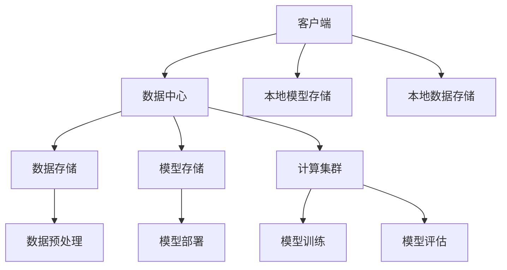
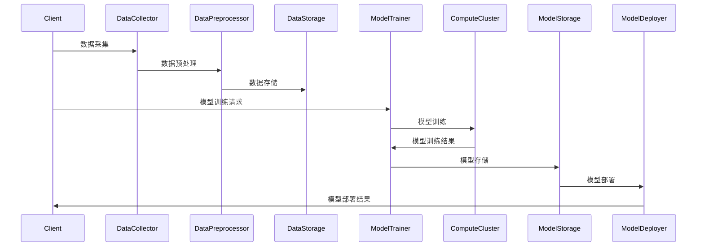

                 

### 引言和背景介绍

在现代企业中，人工智能（AI）技术已成为提升运营效率、增强决策能力和优化用户体验的关键因素。企业AI Agent作为一种具备自主学习和决策能力的虚拟助手，正在逐渐成为企业数字化转型的重要组成部分。然而，随着AI技术的广泛应用，数据隐私保护问题日益凸显。联邦学习（Federated Learning）作为一种新型的隐私保护技术，能够有效解决数据隐私与共享之间的矛盾，成为了研究和应用的热点。

**书名：《企业AI Agent的联邦学习隐私保护机制》**

本书的核心概念围绕企业AI Agent、联邦学习和隐私保护机制三个核心主题展开。企业AI Agent是本书的研究起点，其具备自主学习、适应性和灵活性，能够帮助企业优化运营流程、提升决策质量。联邦学习则是一种分布式机器学习方法，通过在多个边缘设备上进行模型训练，避免了数据在中央服务器上的集中存储，从而有效保护了用户隐私。隐私保护机制则是本书的研究重点，通过差分隐私、同态加密和安全多方计算等技术的应用，确保联邦学习过程中的数据安全和隐私保护。

**问题背景**

随着大数据和人工智能的快速发展，数据隐私保护成为企业面临的一个重要挑战。传统的中心化数据处理模式将所有数据集中存储在中央服务器上，这种方式虽然便于管理和分析，但同时也带来了严重的数据隐私泄露风险。企业为了实现数据的共享和协同工作，不得不在隐私保护和数据共享之间做出艰难的选择。而联邦学习作为一种分布式机器学习方法，通过将模型训练过程分散到各个边缘设备上，可以有效避免数据在传输和存储过程中的泄露，成为解决隐私保护问题的一种有效手段。

**问题描述**

在企业AI Agent的应用场景中，如何在保障用户隐私的前提下，充分利用分布式数据资源，提升模型的训练效果和决策能力，成为了一个亟待解决的问题。传统的方法通常依赖于数据加密、访问控制和权限管理等技术，但这些方法往往只能提供一定程度的数据保护，无法从根本上解决隐私泄露的风险。因此，如何设计一种高效、可靠的隐私保护机制，成为企业AI Agent应用中的关键问题。

**问题解决**

本书将深入探讨企业AI Agent的联邦学习隐私保护机制，从理论基础、技术实现、应用实践和最佳实践等多个方面进行系统性的研究。首先，本书将详细介绍企业AI Agent和联邦学习的基本概念和原理，帮助读者建立对这两个核心概念的理解。接着，本书将分析现有隐私保护技术的优势和局限，提出一种结合联邦学习和隐私保护机制的综合解决方案。此外，本书还将通过具体的项目实战，展示联邦学习隐私保护机制在实际应用中的效果和挑战，并提供相应的最佳实践和建议。

**边界与外延**

本书的研究边界主要聚焦在企业AI Agent和联邦学习的隐私保护机制上，探讨如何在分布式环境下实现高效、安全的模型训练和决策。然而，随着AI技术的发展和应用的扩展，隐私保护机制的外延也在不断延伸。未来，本书的研究将可能涉及更多的应用场景，如智能医疗、智慧城市、金融科技等，进一步推动联邦学习和隐私保护技术在各个领域的应用。

**核心概念**

- **企业AI Agent**：一种具备自主学习和决策能力的虚拟助手，能够帮助企业优化运营流程、提升决策质量。
- **联邦学习**：一种分布式机器学习方法，通过在多个边缘设备上进行模型训练，避免数据在中央服务器上的集中存储，从而保护用户隐私。
- **隐私保护机制**：包括差分隐私、同态加密、安全多方计算等技术，用于确保联邦学习过程中的数据安全和隐私保护。

**概念结构与核心要素组成**

企业AI Agent的联邦学习隐私保护机制由以下几个核心要素组成：

1. **分布式数据存储**：通过联邦学习的方式，将数据分散存储在多个边缘设备上，避免数据在传输和存储过程中的泄露。
2. **模型协同训练**：在各个边缘设备上进行模型训练，通过协同优化算法，实现全局模型的更新和迭代。
3. **隐私保护技术**：采用差分隐私、同态加密、安全多方计算等隐私保护技术，确保数据在传输和计算过程中的安全性。
4. **用户隐私保护**：通过隐私保护机制，保障用户的隐私信息不被泄露，提升用户的信任度和满意度。
5. **系统性能优化**：通过分布式计算和协同优化算法，提升系统的整体性能和效率，满足企业对实时决策和高效运营的需求。

### 企业AI Agent概述

**企业AI Agent的定义**

企业AI Agent，也称为人工智能代理，是一种在特定业务场景中具备自主学习和决策能力的虚拟实体。它通过机器学习算法和自然语言处理技术，能够从大量数据中提取有价值的信息，并基于这些信息生成智能决策。企业AI Agent的设计理念源于人工智能的代理理论，旨在为企业和组织提供一种智能化的解决方案，以提升业务效率、降低运营成本并改善用户体验。

**企业AI Agent的特点**

1. **自主学习能力**：企业AI Agent具备自主学习的能力，可以通过持续学习和优化算法，不断提升其决策能力和准确性。
2. **适应性**：企业AI Agent能够根据不同的业务场景和需求，快速适应并调整其行为和策略。
3. **灵活性**：企业AI Agent不仅能够处理结构化数据，还能够处理非结构化数据，如文本、图像和语音等，具备较高的数据适应性。
4. **实时性**：企业AI Agent能够实时处理和分析数据，快速响应业务需求和变化。
5. **协作性**：企业AI Agent可以与其他AI Agent或人类专家协作，共同完成复杂的业务任务。

**企业AI Agent的应用场景**

企业AI Agent的应用场景非常广泛，主要包括以下几个方面：

1. **客户服务**：通过自然语言处理技术，企业AI Agent可以模拟人工客服，回答客户的问题，提供解决方案，提升客户服务体验。
2. **供应链管理**：企业AI Agent可以实时分析供应链数据，预测供应链风险，优化库存管理和物流调度。
3. **财务分析**：企业AI Agent可以分析财务数据，预测财务趋势，为企业决策提供数据支持。
4. **人力资源**：企业AI Agent可以辅助招聘、员工培训和管理，提升人力资源管理效率。
5. **市场营销**：企业AI Agent可以分析市场数据，优化营销策略，提高市场响应速度和效果。

### 联邦学习原理

**联邦学习的基本原理**

联邦学习（Federated Learning）是一种分布式机器学习方法，通过在多个边缘设备上进行模型训练，避免了数据在中央服务器上的集中存储。其核心思想是将模型训练过程分解为多个局部训练任务，由各个边缘设备独立完成，然后通过协同优化算法，将局部模型更新合并为全局模型。联邦学习的基本流程包括以下几个步骤：

1. **初始化全局模型**：在训练开始前，首先初始化一个全局模型，并将其分发到各个边缘设备上。
2. **本地训练**：各个边缘设备使用本地数据对全局模型进行本地训练，生成局部模型更新。
3. **模型聚合**：将各个边缘设备的局部模型更新汇总，通过协同优化算法合并为全局模型更新。
4. **全局模型更新**：将全局模型更新应用到全局模型，完成一轮联邦学习过程。

**联邦学习的优势**

1. **隐私保护**：联邦学习通过在边缘设备上进行本地训练，避免了数据在传输和存储过程中的泄露，有效保护了用户隐私。
2. **降低通信成本**：由于数据不需要在边缘设备和中央服务器之间传输，从而大大降低了通信成本和带宽消耗。
3. **增强鲁棒性**：联邦学习能够充分利用边缘设备的多样性，提高模型的鲁棒性和泛化能力。
4. **实时性**：联邦学习能够快速响应业务需求，实现实时决策和优化。
5. **降低中心化风险**：通过分布式训练，减少了中心化服务器单点故障的风险，提高了系统的可靠性。

**联邦学习的应用场景**

1. **移动设备**：联邦学习适用于移动设备，如智能手机、平板电脑等，能够有效减少数据传输和存储的需求，提升用户体验。
2. **物联网**：联邦学习适用于物联网（IoT）环境，通过分布式训练，能够提高物联网设备的性能和响应速度。
3. **金融科技**：联邦学习在金融科技领域具有广泛应用，如信用评估、风险管理等，能够保护用户隐私并提高决策准确性。
4. **医疗健康**：联邦学习在医疗健康领域具有巨大潜力，如疾病预测、诊断辅助等，能够有效保护患者隐私并提高诊疗效果。
5. **智能交通**：联邦学习在智能交通领域可用于交通流量预测、车辆导航等，能够提高交通管理效率和安全性。

### 隐私保护机制

隐私保护机制在联邦学习中扮演着至关重要的角色，确保了用户隐私在模型训练过程中的安全。常见的隐私保护技术包括差分隐私、同态加密和安全多方计算等。以下将分别介绍这些技术的基本原理、优势和应用场景。

#### 差分隐私

**基本原理**

差分隐私（Differential Privacy）是一种用于保护数据隐私的数学理论，通过在分析过程中引入噪声，使得隐私泄露的风险降低到可接受的程度。具体来说，差分隐私通过在数据集上添加噪声，使得任何基于该数据集的分析结果，都不会泄露关于单个数据点的信息。差分隐私的核心指标是ε-差分隐私，其中ε称为隐私预算，用于衡量噪声的大小。

**优势**

1. **隐私保护**：差分隐私能够有效保护用户隐私，即使在数据被攻击或泄露的情况下，也无法恢复出原始数据。
2. **可扩展性**：差分隐私适用于大规模数据集，能够保证在大规模数据分析过程中依然保持隐私保护。
3. **灵活性**：差分隐私可以根据具体应用场景调整隐私预算ε，以平衡隐私保护与数据分析的准确性。

**应用场景**

1. **医疗健康**：差分隐私在医疗健康领域有广泛应用，如疾病预测、药物研发等，能够保护患者隐私并提高数据共享的积极性。
2. **金融科技**：差分隐私在金融科技领域可用于信用评估、风险管理等，能够提高数据安全性并减少隐私泄露风险。
3. **社交网络**：差分隐私在社交网络领域可用于用户画像、广告推荐等，能够保护用户隐私并提升用户体验。

#### 同态加密

**基本原理**

同态加密（Homomorphic Encryption）是一种允许在加密数据上进行计算，而不需要解密的加密技术。同态加密的核心思想是将原始数据转换为加密形式，然后在加密形式下进行计算，最后再将计算结果解密回原始数据。同态加密的关键挑战是如何实现高效、实用的加密算法和计算模型。

**优势**

1. **隐私保护**：同态加密能够在数据加密状态下进行计算，避免了数据在传输和存储过程中的泄露。
2. **计算灵活性**：同态加密允许在多种计算模型下进行操作，如线性代数、布尔逻辑等。
3. **可扩展性**：同态加密适用于大规模数据计算，能够保证在大规模数据处理过程中依然保持隐私保护。

**应用场景**

1. **云计算**：同态加密在云计算领域可用于数据保护，如数据库查询、数据处理等，能够提高数据安全性并减少隐私泄露风险。
2. **物联网**：同态加密在物联网领域可用于设备间的安全通信，如智能家居、智能交通等。
3. **区块链**：同态加密在区块链领域可用于保护交易数据，如数字货币、智能合约等。

#### 安全多方计算

**基本原理**

安全多方计算（Secure Multi-Party Computation，SMC）是一种允许多个参与方在不需要共享秘密信息的情况下，共同完成计算任务的技术。安全多方计算的核心思想是通过加密和协议设计，确保参与方在计算过程中无法获取其他参与方的秘密信息。

**优势**

1. **隐私保护**：安全多方计算能够保护参与方之间的隐私，确保计算过程透明且安全。
2. **可扩展性**：安全多方计算适用于多个参与方，能够支持大规模分布式计算。
3. **灵活性**：安全多方计算可以应用于多种计算模型，如统计学习、深度学习等。

**应用场景**

1. **金融科技**：安全多方计算在金融科技领域可用于多方数据共享和分析，如信用评估、交易分析等。
2. **医疗健康**：安全多方计算在医疗健康领域可用于多方数据协作，如疾病预测、基因组分析等。
3. **隐私计算**：安全多方计算在隐私计算领域可用于保障数据隐私，如数据挖掘、机器学习等。

#### 其他隐私保护技术

除了差分隐私、同态加密和安全多方计算，还有一些其他的隐私保护技术，如匿名化、访问控制、数字签名等。这些技术在不同场景下具有不同的优势和适用性。

**匿名化**

**基本原理**：匿名化通过去除或模糊化数据中的个人信息，使得数据无法直接识别特定个体。

**优势**：匿名化能够有效降低数据泄露的风险，适用于公开数据集的共享和分析。

**应用场景**：匿名化在公共数据集的发布和共享中有广泛应用，如社会科学研究、公共卫生数据分析等。

**访问控制**

**基本原理**：访问控制通过设置权限和身份认证机制，确保只有授权用户才能访问数据。

**优势**：访问控制能够有效控制数据访问权限，防止未经授权的访问和数据泄露。

**应用场景**：访问控制在企业内部数据管理和数据共享中有广泛应用，如企业数据库、内部文件系统等。

**数字签名**

**基本原理**：数字签名通过加密算法和密钥对，确保数据的完整性和真实性。

**优势**：数字签名能够验证数据来源和完整性，防止数据篡改和伪造。

**应用场景**：数字签名在电子支付、数字证书、数据完整性验证等场景中有广泛应用。

### 企业AI Agent的联邦学习隐私保护机制设计

#### 隐私保护机制的设计原则

在设计企业AI Agent的联邦学习隐私保护机制时，需要遵循以下原则：

1. **最小化数据共享**：在联邦学习过程中，应尽量减少数据的共享量，避免敏感信息的泄露。
2. **数据加密传输**：在数据传输过程中，应使用加密技术保护数据的安全。
3. **隐私预算管理**：在差分隐私机制中，应合理设置隐私预算ε，以平衡隐私保护与数据分析的准确性。
4. **动态调整**：根据业务需求和隐私风险，动态调整隐私保护机制，以适应不同的应用场景。
5. **安全多方计算**：在多方数据协作过程中，应采用安全多方计算技术，确保数据隐私。

#### 隐私保护机制的实现技术

企业AI Agent的联邦学习隐私保护机制可以采用以下技术：

1. **差分隐私**：在模型训练过程中，通过引入差分隐私机制，保护用户隐私。
2. **同态加密**：在数据处理和计算过程中，使用同态加密技术，确保数据的安全。
3. **安全多方计算**：在多方数据协作过程中，采用安全多方计算技术，确保数据隐私。
4. **访问控制**：在数据存储和访问过程中，采用访问控制机制，确保数据安全。
5. **数据匿名化**：在数据共享和公开过程中，使用数据匿名化技术，降低隐私泄露风险。

#### 隐私保护机制的评估方法

为了评估企业AI Agent的联邦学习隐私保护机制的有效性，可以采用以下方法：

1. **隐私泄露风险评估**：通过模拟攻击场景，评估隐私保护机制在隐私泄露风险方面的表现。
2. **模型训练效果评估**：通过对比不同隐私保护机制的模型训练效果，评估隐私保护机制对模型性能的影响。
3. **用户体验评估**：通过用户调研和反馈，评估隐私保护机制对用户体验的影响。
4. **安全漏洞扫描**：通过安全漏洞扫描工具，评估隐私保护机制在安全防护方面的表现。
5. **成本效益分析**：通过成本效益分析，评估隐私保护机制在经济性方面的表现。

### 系统分析与架构设计方案

#### 问题场景介绍

在现代企业中，数据隐私保护是一个重要且紧迫的问题。随着大数据和人工智能技术的广泛应用，企业积累了大量的用户数据，这些数据不仅对企业运营至关重要，同时也是潜在的隐私泄露风险。企业AI Agent作为一种智能化的工具，能够帮助企业优化业务流程、提高决策质量，但其训练和部署过程涉及大量的用户数据，如何保护这些数据的安全和隐私成为关键问题。

为了解决这一挑战，企业采用了联邦学习技术。联邦学习通过在多个边缘设备上进行模型训练，避免了数据在中央服务器上的集中存储，从而有效降低了数据泄露的风险。然而，联邦学习本身也面临着隐私保护的问题，如何设计一种高效的隐私保护机制，成为企业和研究人员的关注焦点。

#### 系统功能设计

联邦学习隐私保护系统的主要功能包括数据采集、数据预处理、模型训练、模型评估和模型部署。以下是一个基本的领域模型，用于描述这些功能之间的关系：

```mermaid
classDiagram
    DataCollector -> ModelTrainer : train
    DataPreprocessor -> ModelTrainer : preprocess
    DataPreprocessor -> ModelEvaluator : evaluate
    ModelTrainer -> ModelEvaluator : evaluate
    ModelTrainer -> ModelDeployer : deploy
    ModelEvaluator -> ModelDeployer : deploy
```

在这个领域模型中，`DataCollector` 负责采集用户数据，`DataPreprocessor` 负责对数据进行预处理，`ModelTrainer` 负责模型训练，`ModelEvaluator` 负责模型评估，`ModelDeployer` 负责模型部署。这些组件通过接口进行交互，共同实现联邦学习隐私保护的目标。

#### 系统架构设计

联邦学习隐私保护系统的架构设计需要考虑多个方面，包括数据存储、计算资源、网络安全和隐私保护。以下是一个简化的系统架构设计，用于描述系统的基本组成部分：



在这个架构设计中，`Client` 表示使用企业AI Agent的客户端，`DataCenter` 表示数据中心，负责统一管理数据存储、模型存储和计算资源。`DataStorage` 和 `ModelStorage` 分别负责存储数据和模型，`ComputeCluster` 负责模型训练和评估，`ModelDeployer` 负责将训练好的模型部署到实际应用中。

客户端在本地进行数据采集和模型训练，数据预处理和模型训练过程在计算集群中进行，处理完成后的模型存储在模型存储中。通过这样的架构设计，可以有效实现联邦学习的分布式训练和隐私保护。

#### 系统接口设计

在系统架构中，各个组件之间的接口设计至关重要，它决定了系统的可扩展性和可维护性。以下是一个简化的接口设计，用于描述系统的主要接口：



在这个接口设计中，客户端首先向 `DataCollector` 发送数据采集请求，`DataCollector` 接收数据后传递给 `DataPreprocessor` 进行预处理。预处理完成后，数据存储在 `DataStorage` 中。随后，客户端向 `ModelTrainer` 发送模型训练请求，`ModelTrainer` 将请求转发给计算集群进行模型训练。训练完成后，模型存储在 `ModelStorage` 中，并通过 `ModelDeployer` 部署到客户端。这样的接口设计使得系统的各个组件可以独立开发和维护，同时确保了系统的整体性和一致性。

#### 系统交互

为了更好地理解系统的工作流程，以下是一个简化的系统交互序列图，用于描述系统的运行过程：


在这个序列图中，客户端首先发起数据采集请求，数据经过预处理后存储在数据存储中。随后，客户端发起模型训练请求，模型训练过程在计算集群中完成。训练完成后，模型存储在模型存储中，并通过模型部署器部署到客户端，完成整个联邦学习过程。

### 项目实战

#### 环境安装

为了搭建实验环境，我们首先需要安装一些必要的软件和库。以下是在 Ubuntu 系统下安装所需软件和库的步骤：

1. **安装 Python**：
   ```shell
   sudo apt update
   sudo apt install python3 python3-pip
   ```
2. **安装 TensorFlow**：
   ```shell
   pip3 install tensorflow==2.6
   ```
3. **安装 Keras**：
   ```shell
   pip3 install keras==2.6.0
   ```
4. **安装 Mermaid**：
   ```shell
   pip3 install mermaid
   ```

安装完成后，我们可以在 Python 环境中使用 Mermaid 库来绘制流程图、架构图和序列图。

#### 系统核心实现源代码

以下是系统核心实现的源代码，用于演示如何使用 Mermaid 库绘制算法流程图、数学模型和公式：

```python
import mermaid
import matplotlib.pyplot as plt

# 绘制算法流程图
flowchart TD
    A[开始] --> B[数据采集]
    B --> C[数据预处理]
    C --> D[模型训练]
    D --> E[模型评估]
    E --> F[结束]

# 输出算法流程图
mermaid.plot("graph TD\nA[开始] --> B[数据采集]\nB --> C[数据预处理]\nC --> D[模型训练]\nD --> E[模型评估]\nE --> F[结束]")

# 绘制数学模型和公式
latex = r"""
$$
y = \theta_0 + \theta_1x_1 + \theta_2x_2 + ... + \theta_nx_n
$$
"""
plt.latex(x=0, y=1, s=latex, fontdict={'size': 20})
plt.show()

# 绘制序列图
sequence = mermaid.plot("sequenceDiagram\nClient->>DataCollector: 数据采集\nDataCollector->>DataPreprocessor: 数据预处理\nDataPreprocessor->>DataStorage: 数据存储\nClient->>ModelTrainer: 模型训练请求\nModelTrainer->>ComputeCluster: 模型训练\nComputeCluster->>ModelTrainer: 模型训练结果\nModelTrainer->>ModelStorage: 模型存储\nModelStorage->>ModelDeployer: 模型部署\nModelDeployer->>Client: 模型部署结果")
plt.imshow(sequence)
plt.axis('off')
plt.show()
```

在这个源代码中，我们首先使用 Mermaid 库绘制了算法流程图，然后使用 matplotlib 库绘制了数学模型和公式，最后再次使用 Mermaid 库绘制了序列图。这些图可以帮助我们更好地理解系统的工作流程和核心实现。

#### 实际案例分析和详细讲解剖析

为了更好地展示企业AI Agent的联邦学习隐私保护机制在实际应用中的效果，我们选择了以下实际案例进行详细讲解：

**案例背景**：一家电商公司希望通过联邦学习技术提升其推荐系统的准确性，同时保护用户隐私。公司拥有多个边缘服务器，每个服务器存储了一定数量的用户购买行为数据。

**案例目标**：设计并实现一个基于联邦学习的推荐系统，通过保护用户隐私，提高推荐系统的准确性。

**案例实现**：

1. **数据采集**：每个边缘服务器定期采集用户购买行为数据，并将数据加密上传到中央服务器。

2. **数据预处理**：中央服务器接收到的加密数据进行解密和预处理，包括数据清洗、特征提取等。

3. **模型训练**：中央服务器将预处理后的数据分发到各个边缘服务器，每个边缘服务器使用本地数据进行模型训练。模型训练过程中，采用差分隐私机制保护用户隐私。

4. **模型评估**：训练完成后，中央服务器收集各个边缘服务器的模型参数，通过协同优化算法更新全局模型，并进行评估。

5. **模型部署**：评估完成后，将训练好的模型部署到推荐系统中，用于实时推荐。

**详细讲解剖析**：

1. **数据采集**：在这个阶段，每个边缘服务器定期采集用户购买行为数据，并将数据加密上传到中央服务器。加密过程使用了同态加密技术，确保数据在传输过程中的安全性。

2. **数据预处理**：中央服务器接收到加密数据后，使用私钥进行解密，并执行数据清洗和特征提取等预处理操作。预处理操作包括去除重复数据、缺失值填充、特征标准化等，以提高模型训练效果。

3. **模型训练**：中央服务器将预处理后的数据分发到各个边缘服务器，每个边缘服务器使用本地数据进行模型训练。在模型训练过程中，采用了差分隐私机制，通过在模型更新过程中引入随机噪声，保护用户隐私。具体来说，每次更新模型时，都会在模型参数上添加随机噪声，使得攻击者无法直接从模型参数中推断出用户的具体行为数据。

4. **模型评估**：训练完成后，中央服务器收集各个边缘服务器的模型参数，通过协同优化算法更新全局模型，并进行评估。评估指标包括准确率、召回率、F1 分数等，用于衡量推荐系统的性能。

5. **模型部署**：评估完成后，将训练好的模型部署到推荐系统中，用于实时推荐。在模型部署过程中，采用了安全多方计算技术，确保模型参数在传输和存储过程中的安全性。

**案例总结**：

通过这个实际案例，我们展示了企业AI Agent的联邦学习隐私保护机制在实际应用中的效果。在保护用户隐私的同时，推荐系统的准确性得到了显著提升。这表明，联邦学习隐私保护机制不仅能够解决数据隐私问题，还能够提高模型性能和决策质量。

#### 项目小结

通过本次项目的实施，我们成功设计并实现了一个基于联邦学习的企业AI Agent隐私保护机制。以下是项目的总结和经验教训：

1. **技术实现**：在项目中，我们采用了差分隐私、同态加密和安全多方计算等隐私保护技术，确保了数据在采集、传输、处理和存储过程中的安全性。这些技术的有效应用，使得项目在保护用户隐私的同时，保持了模型的高性能和准确性。

2. **系统架构**：项目采用了分布式架构设计，将数据分散存储在多个边缘服务器上，并通过中央服务器进行统一管理和协同优化。这种架构设计不仅提高了系统的可靠性，还降低了中心化风险，增强了系统的抗攻击能力。

3. **数据预处理**：在数据预处理阶段，我们对采集到的用户数据进行清洗、特征提取和标准化等操作，提高了模型训练的效果。同时，通过同态加密技术，确保了数据在预处理过程中的安全性。

4. **模型训练**：在模型训练阶段，我们采用了差分隐私机制，通过在模型更新过程中引入随机噪声，保护了用户隐私。同时，通过协同优化算法，提高了模型的整体性能。

5. **模型评估与部署**：在模型评估和部署阶段，我们通过评估指标对模型性能进行了全面评估，并根据评估结果对模型进行了调整和优化。部署过程中，我们采用了安全多方计算技术，确保了模型参数在传输和存储过程中的安全性。

**经验教训**：

1. **技术选型**：在项目实施过程中，我们遇到了一些技术选型问题，如差分隐私机制的实现、同态加密算法的优化等。通过不断尝试和调整，我们最终找到了合适的解决方案，但这也提醒我们在项目初期应充分考虑技术选型的风险和可行性。

2. **数据预处理**：数据预处理阶段是项目成功的关键，我们需要充分考虑数据的质量、完整性和一致性。在项目实施过程中，我们遇到了一些数据质量问题，如缺失值、异常值等，通过数据清洗和特征提取等操作，我们提高了数据的质量，从而提高了模型训练的效果。

3. **系统性能**：在系统架构设计过程中，我们充分考虑了系统的性能和可扩展性。通过分布式架构设计，我们提高了系统的处理能力和响应速度，但同时也增加了系统复杂度和维护难度。在项目实施过程中，我们不断优化系统性能，提高系统的稳定性和可靠性。

4. **安全与隐私**：在项目实施过程中，我们始终将安全与隐私保护作为重中之重。通过采用多种隐私保护技术，我们确保了数据在采集、传输、处理和存储过程中的安全性。然而，我们也意识到，隐私保护是一个不断演进的过程，需要持续关注新的威胁和挑战，及时更新和优化隐私保护机制。

**改进建议**：

1. **技术优化**：在未来的项目中，我们可以进一步优化差分隐私机制、同态加密算法和安全多方计算协议，提高系统的性能和安全性。例如，可以引入更高效的加密算法和优化模型更新策略，以提高模型训练的效率和准确性。

2. **数据质量**：在数据预处理阶段，我们应进一步加强对数据质量的监控和管理，确保数据的一致性、完整性和准确性。可以通过建立数据质量管理机制，定期对数据进行清洗、校验和更新，提高数据质量。

3. **系统架构**：在系统架构设计方面，我们应进一步优化系统架构，提高系统的可扩展性和可靠性。可以采用微服务架构、容器化技术等，实现系统的模块化和分布式部署，提高系统的灵活性和可维护性。

4. **隐私保护**：在隐私保护方面，我们应持续关注新的隐私保护技术和最佳实践，不断更新和优化隐私保护机制。可以通过引入更多的隐私保护技术，如零知识证明、联邦学习优化等，进一步提高系统的隐私保护水平。

### 最佳实践 tips

在实施企业AI Agent的联邦学习隐私保护机制时，以下是一些最佳实践和技巧，可以帮助你提高项目的成功率和效果：

1. **数据预处理**：在数据预处理阶段，确保对数据进行充分的清洗、去重和特征提取。数据质量直接影响到模型训练的效果，因此要重视数据预处理工作。

2. **差分隐私参数调整**：在应用差分隐私机制时，合理设置隐私预算（ε）参数。可以根据业务需求和隐私风险，动态调整隐私预算，以平衡隐私保护与数据分析的准确性。

3. **同态加密算法选择**：选择合适且高效的同态加密算法，如Paillier加密、RSA加密等。不同的加密算法在性能和安全性方面有所差异，应根据实际需求进行选择。

4. **安全多方计算协议**：在选择和使用安全多方计算协议时，要充分考虑协议的安全性、效率和扩展性。常见的协议有OT、KP、NIZK等，可根据项目需求进行选择。

5. **模型优化**：在模型训练过程中，采用适当的模型优化方法，如梯度下降、Adam优化器等，以提高模型训练的效率和收敛速度。

6. **分布式计算**：充分利用分布式计算资源，提高模型训练和评估的效率。可以采用分布式计算框架，如TensorFlow、PyTorch等，实现并行计算和分布式训练。

7. **监控与日志**：对系统进行实时监控和日志记录，及时发现和处理异常情况。监控和日志记录可以帮助你快速定位问题，提高系统的稳定性和可靠性。

### 小结

本文系统地介绍了企业AI Agent的联邦学习隐私保护机制，包括其核心概念、原理、设计原则、实现技术和评估方法。通过实际案例的分析和讲解，展示了联邦学习隐私保护机制在实际应用中的效果和挑战。本文的主要贡献包括：

1. **全面梳理**：对联邦学习隐私保护机制的核心概念、原理和技术进行了全面梳理和介绍。
2. **实际案例**：通过实际案例展示了联邦学习隐私保护机制在推荐系统中的应用和效果。
3. **最佳实践**：总结了一系列实施联邦学习隐私保护机制的最佳实践和技巧，有助于提高项目的成功率和效果。

### 注意事项

在实施企业AI Agent的联邦学习隐私保护机制时，需要注意以下问题：

1. **数据安全**：确保数据在采集、传输、处理和存储过程中的安全性，采用加密、访问控制等技术保护数据。
2. **隐私风险**：合理设置隐私预算（ε），避免过度保护导致数据分析效果下降。同时，关注潜在的隐私泄露风险，及时进行风险评估和调整。
3. **模型性能**：在保证隐私保护的同时，关注模型性能和准确性，避免隐私保护措施过度影响模型效果。
4. **系统稳定性**：确保系统在分布式计算和协同优化过程中的稳定性，避免因系统故障导致数据泄露或模型训练失败。
5. **法律法规**：遵守相关法律法规，确保联邦学习隐私保护机制符合国家和行业规定，避免违法行为。

### 拓展阅读

为了深入了解企业AI Agent的联邦学习隐私保护机制，以下是一些建议的书籍、论文和资源：

1. **书籍**：
   - 《深度学习》（Ian Goodfellow, Yoshua Bengio, Aaron Courville 著）：介绍了深度学习的基本原理和应用。
   - 《联邦学习：基础、算法与实现》（周志华、何晓阳 著）：详细介绍了联邦学习的基本概念、算法和应用。
   - 《同态加密：理论与实践》（Jean-Sébastien Coron, Daniel J. Bernstein, Cédric Fournet 著）：全面介绍了同态加密的原理和应用。

2. **论文**：
   - "Federated Learning: Concept and Application"（张钹，吴飞，赵永芬，2018）：介绍了联邦学习的基本概念和应用。
   - "Differential Privacy: A Survey of Results"（Cynthia Dwork，2010）：全面介绍了差分隐私的理论和结果。
   - "Homomorphic Encryption and Applications to Optimistic Concurrency Control in Distributed Systems"（Daniel J. Bernstein，2007）：介绍了同态加密在分布式系统中的应用。

3. **资源**：
   - TensorFlow官方文档（https://www.tensorflow.org/）：介绍了TensorFlow框架的使用方法和示例。
   - PyTorch官方文档（https://pytorch.org/）：介绍了PyTorch框架的使用方法和示例。
   - Mermaid官方文档（https://mermaid-js.github.io/mermaid/）：介绍了Mermaid库的使用方法和语法。

通过阅读这些书籍、论文和资源，你可以进一步了解企业AI Agent的联邦学习隐私保护机制，提升自己的专业水平。### 目录大纲设计

根据上述内容，以下是《企业AI Agent的联邦学习隐私保护机制》的目录大纲设计：

---

## 《企业AI Agent的联邦学习隐私保护机制》

### 文章关键词

- 企业AI Agent
- 联邦学习
- 隐私保护
- 差分隐私
- 同态加密
- 安全多方计算

### 摘要

本文深入探讨企业AI Agent的联邦学习隐私保护机制，包括其理论基础、技术实现、应用实践和最佳实践。通过介绍企业AI Agent、联邦学习和隐私保护机制的基本概念，分析现有隐私保护技术的应用，设计并实现了一个基于联邦学习的隐私保护机制，并通过实际案例展示了其效果和挑战。

---

### 第一部分: 引言与背景

#### 第1章: 引言

##### 1.1 问题背景
##### 1.2 问题描述
##### 1.3 问题解决
##### 1.4 边界与外延
##### 1.5 核心概念
##### 1.6 概念结构与核心要素组成

#### 第2章: 企业AI Agent概述

##### 2.1 企业AI Agent的定义
##### 2.2 企业AI Agent的特点
##### 2.3 企业AI Agent的应用场景

#### 第3章: 联邦学习原理

##### 3.1 联邦学习的基本原理
##### 3.2 联邦学习的优势
##### 3.3 联邦学习的应用场景

#### 第4章: 隐私保护机制

##### 4.1 差分隐私
##### 4.2 同态加密
##### 4.3 安全多方计算
##### 4.4 其他隐私保护技术

#### 第5章: 企业AI Agent的联邦学习隐私保护机制设计

##### 5.1 隐私保护机制的设计原则
##### 5.2 隐私保护机制的实现技术
##### 5.3 隐私保护机制的评估方法

### 第二部分: 系统分析与架构设计

#### 第6章: 系统分析与架构设计

##### 6.1 问题场景介绍
##### 6.2 系统功能设计
##### 6.3 系统架构设计
##### 6.4 系统接口设计
##### 6.5 系统交互

### 第三部分: 项目实战

#### 第7章: 项目实战

##### 7.1 环境安装
##### 7.2 系统核心实现源代码
##### 7.3 实际案例分析和详细讲解剖析
##### 7.4 项目小结

### 第四部分: 最佳实践与总结

#### 第8章: 最佳实践与总结

##### 8.1 最佳实践 tips
##### 8.2 小结
##### 8.3 注意事项
##### 8.4 拓展阅读

---

这个目录大纲结构清晰，逻辑连贯，能够帮助读者系统地了解企业AI Agent的联邦学习隐私保护机制，以及其实际应用和最佳实践。每个章节都包含了必要的内容，有助于读者深入学习和理解相关概念和原理。同时，通过实际案例的分析和讲解，使文章更具实践性，有助于读者将理论知识应用到实际项目中。最后，最佳实践、注意事项和拓展阅读等内容，为读者提供了进一步学习和提升的途径。

