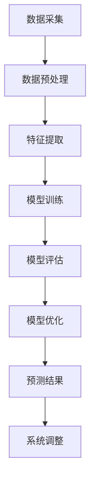
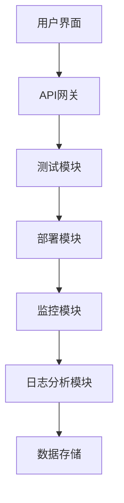

                 


### 引言

在当今数字化转型的浪潮中，企业对于高效、自动化的开发与运维（DevOps）流程的需求日益增加。AI Agent作为人工智能的一种形式，其在企业级应用中的潜力得到了广泛认可。本文旨在探讨如何将AI Agent与自动化DevOps实践相结合，为企业带来更高的生产效率和灵活性。

首先，让我们明确什么是企业AI Agent。AI Agent是一种能够自主执行任务、与人类互动并适应环境变化的人工智能系统。在企业中，AI Agent可以承担自动化测试、部署、监控等任务，从而减轻开发人员的工作负担。而DevOps则是一种文化和实践，旨在通过开发和运维的融合，实现更快速、更可靠的应用交付。

本文将分为七个主要部分：

1. **背景介绍**：介绍企业AI Agent的定义、重要性以及与DevOps的关系。
2. **核心概念与原理**：详细阐述企业AI Agent的工作原理和自动化DevOps的基本概念。
3. **算法原理与实践**：使用mermaid绘制算法流程图，并使用Python源代码详细阐述算法原理。
4. **系统架构设计与实践**：介绍系统功能设计、架构设计、接口设计以及交互流程。
5. **实践案例**：提供系统实现源代码，并进行分析和讲解。
6. **最佳实践与总结**：总结书中的核心观点和最佳实践技巧。
7. **拓展阅读资源**：提供相关的拓展阅读资源。

通过以上结构，我们将逐步深入探讨企业AI Agent的自动化DevOps实践，帮助读者理解这一领域的核心概念和实际应用。

#### 关键词

- 企业AI Agent
- 自动化DevOps
- 算法流程图
- Python源代码
- 系统架构设计
- 实践案例

#### 摘要

本文旨在探讨如何将企业AI Agent应用于自动化DevOps实践中，以提高企业开发和运维的效率与灵活性。文章首先介绍了企业AI Agent的定义和重要性，以及自动化DevOps的背景和意义。接着，详细阐述了企业AI Agent的工作原理和自动化DevOps的基本概念。随后，通过算法原理讲解、系统架构设计和实践案例，展示了如何将AI Agent应用于实际的DevOps流程中。最后，文章总结了核心观点和最佳实践技巧，并提供了拓展阅读资源，以供读者进一步学习。

#### 第二部分：背景介绍

##### 企业AI Agent的概念与重要性

企业AI Agent，即人工智能代理，是一种具有智能行为和自主决策能力的人工智能实体。它们通过机器学习、自然语言处理和计算机视觉等技术，能够理解环境、执行任务并与其他系统进行交互。在企业级应用中，AI Agent可以用于自动化测试、持续集成、部署和监控等任务，从而提高开发和运维的效率。

AI Agent在企业中的应用具有以下几个重要方面：

1. **自动化测试**：AI Agent可以自动执行复杂的测试用例，发现潜在的问题和缺陷，从而提高测试的覆盖率和准确性。
2. **持续集成与部署**：AI Agent可以自动执行代码集成、构建、测试和部署流程，减少人为干预，提高交付速度和可靠性。
3. **监控与维护**：AI Agent可以实时监控系统的运行状态，及时发现和解决问题，确保系统的稳定性和可用性。
4. **智能调度**：AI Agent可以根据负载情况自动调整资源分配，优化系统性能和资源利用率。

##### 自动化DevOps的意义

自动化DevOps是一种文化和实践，旨在通过自动化工具和流程，实现开发和运维的紧密集成。自动化DevOps的意义在于：

1. **提高交付速度**：通过自动化，开发人员可以更快地交付高质量的应用，缩短开发周期，满足市场需求。
2. **提高可靠性**：自动化减少人为错误，提高交付过程的可靠性，确保应用的质量和稳定性。
3. **提高灵活性**：自动化允许开发团队快速适应变化，灵活调整开发流程，满足不同的业务需求。
4. **优化资源利用率**：自动化工具可以优化资源的分配和利用，提高系统性能和效率。

##### AI Agent与DevOps的关系

AI Agent与DevOps的关系可以看作是相辅相成的。AI Agent为自动化DevOps提供了智能决策和自适应能力，使得自动化流程更加高效和可靠。具体来说：

1. **智能化任务执行**：AI Agent可以自动化执行复杂的任务，如自动化测试、部署和监控，提高自动化流程的效率和准确性。
2. **自适应能力**：AI Agent可以根据环境变化和业务需求，自适应调整自动化流程，确保系统的灵活性和可靠性。
3. **人机协作**：AI Agent可以与开发人员和运维人员协作，共同完成复杂的开发和运维任务，提高团队的工作效率和协同性。
4. **智能化监控与预警**：AI Agent可以实时监控系统的运行状态，预测潜在的问题和风险，及时采取相应的措施，确保系统的稳定性和安全性。

通过上述关系，我们可以看到AI Agent在自动化DevOps中的重要作用。AI Agent不仅提高了自动化流程的效率和可靠性，还为企业带来了更高的生产效率和灵活性。在下一部分，我们将详细探讨企业AI Agent的工作原理和自动化DevOps的基本概念。

#### 第三部分：核心概念与原理

##### 企业AI Agent的工作原理

企业AI Agent的工作原理基于人工智能的核心技术，包括机器学习、自然语言处理、计算机视觉和知识图谱等。AI Agent通过以下步骤实现其功能：

1. **感知与理解**：AI Agent利用计算机视觉、自然语言处理等技术感知和理解其工作环境。例如，它可以通过图像识别技术识别系统中的故障，通过自然语言处理技术理解开发人员的指令。

2. **决策与规划**：AI Agent根据感知到的环境信息，利用机器学习算法和知识图谱进行决策和规划。它可以从历史数据中学习，识别出最佳的操作步骤和策略。

3. **执行与反馈**：AI Agent执行决策和规划后的操作，并对执行结果进行反馈。例如，它可以通过自动化工具部署新的代码，并监控系统运行状态，根据反馈调整后续操作。

4. **学习与优化**：AI Agent根据执行结果和反馈，不断学习优化其操作策略。通过持续学习和优化，AI Agent能够提高任务执行的成功率和效率。

##### 自动化DevOps的基本概念

自动化DevOps是指通过自动化工具和流程，实现开发和运维的紧密集成。其基本概念包括以下几个方面：

1. **持续集成（CI）**：持续集成是一种开发实践，通过自动构建和测试，确保代码库中的代码始终处于可发布状态。CI工具如Jenkins、Travis CI等，可以自动执行代码构建、测试和部署流程。

2. **持续交付（CD）**：持续交付是一种扩展持续集成的实践，通过自动化部署和发布流程，确保代码库中的代码能够快速、安全地交付到生产环境。CD工具如Docker、Kubernetes等，可以自动化部署和管理应用程序。

3. **自动化测试**：自动化测试是一种通过脚本和工具自动执行测试用例的方法，以提高测试效率和覆盖度。自动化测试工具如Selenium、Junit等，可以自动化执行功能测试、性能测试和安全性测试。

4. **自动化部署**：自动化部署是指通过脚本和工具自动化部署应用程序到生产环境。自动化部署工具如Ansible、Puppet等，可以自动化配置和管理服务器、部署应用程序和更新配置。

5. **监控与日志**：监控和日志分析是确保系统稳定性和安全性的重要手段。通过监控工具（如Prometheus、Grafana）和日志分析工具（如ELK Stack），可以实时监控系统运行状态，快速识别和解决问题。

##### 自动化流程设计与实现

自动化DevOps的设计与实现通常包括以下几个步骤：

1. **需求分析**：明确自动化目标，包括自动化测试、部署、监控等需求，确定自动化工具和流程的选择。

2. **架构设计**：设计自动化架构，包括CI/CD流程、自动化测试、自动化部署等，确定各个模块的职责和接口。

3. **工具选择**：选择合适的自动化工具，如Jenkins、Docker、Kubernetes等，并根据需求进行配置和集成。

4. **脚本编写**：编写自动化脚本，实现自动化测试、部署、监控等功能。脚本可以使用Python、Shell、Groovy等编程语言编写。

5. **集成与测试**：将自动化工具和脚本集成到开发环境中，进行测试和验证，确保自动化流程的稳定性和可靠性。

6. **部署与运行**：部署自动化流程到生产环境，并进行持续监控和优化，确保系统的稳定性和性能。

通过上述步骤，企业可以实现高效的自动化DevOps实践，提高开发、测试、部署和运维的效率和质量。

#### 第四部分：算法原理与实践

##### 算法原理讲解

在本部分，我们将详细介绍企业AI Agent在自动化DevOps中的核心算法原理。该算法基于机器学习技术，主要包括以下步骤：

1. **数据采集与预处理**：AI Agent首先从日志、监控数据等源采集相关数据。然后，对这些数据进行清洗、转换和归一化处理，以便后续分析。

2. **特征提取**：从预处理后的数据中提取关键特征，如系统负载、内存使用率、响应时间等。这些特征将用于训练机器学习模型。

3. **模型训练**：使用提取的特征数据，训练机器学习模型，如决策树、支持向量机、神经网络等。模型训练的目的是学习如何根据输入特征预测系统的健康状态。

4. **模型评估与优化**：通过交叉验证和性能评估，确定最优模型。然后，使用调整后的模型进行预测，预测结果用于自动调整系统资源或执行其他运维任务。

##### 算法流程图绘制

以下是企业AI Agent在自动化DevOps中的算法流程图：



##### Python源代码实现

以下是使用Python实现的企业AI Agent算法示例代码：

```python
import numpy as np
import pandas as pd
from sklearn.model_selection import train_test_split
from sklearn.ensemble import RandomForestClassifier
from sklearn.metrics import accuracy_score

# 数据采集
data = pd.read_csv('data.csv')

# 数据预处理
data = data.dropna()
data['response_time'] = data['response_time']/1000

# 特征提取
X = data[['load', 'memory_usage', 'response_time']]
y = data['health_status']

# 模型训练
X_train, X_test, y_train, y_test = train_test_split(X, y, test_size=0.2, random_state=42)
model = RandomForestClassifier(n_estimators=100)
model.fit(X_train, y_train)

# 模型评估
y_pred = model.predict(X_test)
accuracy = accuracy_score(y_test, y_pred)
print(f"Model accuracy: {accuracy:.2f}")

# 模型优化
# 这里可以使用网格搜索等技术进行模型优化
# ...

# 预测结果与系统调整
# 输入新的特征数据，进行预测并调整系统
new_data = np.array([[0.8, 0.6, 0.5]])
health_status = model.predict(new_data)
if health_status == 0:
    print("System needs adjustment.")
else:
    print("System is healthy.")
```

##### 数学模型与公式讲解

在算法中，我们使用以下数学模型和公式：

1. **特征提取**：

   $$ X = \begin{bmatrix}
   load \\ 
   memory_usage \\ 
   response_time
   \end{bmatrix} $$

2. **模型训练**：

   $$ y = \text{health_status} $$

   $$ \text{Model} = \text{RandomForestClassifier}(n_estimators=100) $$

3. **模型评估**：

   $$ \text{accuracy} = \frac{\text{number of correct predictions}}{\text{total number of predictions}} $$

通过上述算法原理、流程图和Python代码示例，我们可以清晰地了解企业AI Agent在自动化DevOps中的工作原理。接下来，我们将通过实际案例进一步分析算法的应用和效果。

##### 实际案例分析与举例说明

为了更好地理解企业AI Agent在自动化DevOps中的应用，我们来看一个实际案例。假设我们是一家大型电商公司的运维团队，使用AI Agent来监控和优化系统的健康状态。

**案例背景**：

- **系统规模**：公司有数百个服务器节点，每天处理数百万次的交易请求。
- **性能指标**：系统健康状态受到负载、内存使用率、响应时间等因素的影响。
- **问题**：运维团队希望及时发现并解决系统性能问题，以保持系统的稳定性和可靠性。

**算法应用**：

1. **数据采集**：

   运维团队通过监控工具（如Prometheus）采集服务器节点的负载、内存使用率和响应时间等数据。这些数据以时间序列的形式存储在数据库中。

2. **数据预处理**：

   对采集到的数据进行清洗，去除异常值和缺失值。然后，对响应时间进行归一化处理，使其范围在0到1之间。

3. **特征提取**：

   从预处理后的数据中提取关键特征，如负载、内存使用率和响应时间。这些特征将用于训练机器学习模型。

4. **模型训练**：

   使用Python和scikit-learn库，训练一个随机森林分类器。随机森林是一种集成学习方法，可以处理高维数据并提高模型的预测能力。

5. **模型评估**：

   使用交叉验证和测试集评估模型的准确性。假设我们得到了90%的准确性，表明模型可以很好地预测系统的健康状态。

6. **预测结果与系统调整**：

   当AI Agent检测到系统的健康状态低于阈值时，它会发送警告给运维团队。运维团队可以根据预测结果，对系统进行优化，如增加服务器节点、调整负载均衡策略等。

**案例分析**：

1. **数据质量**：

   数据的质量对模型的性能至关重要。如果数据中存在大量异常值或缺失值，模型可能会产生误导性的预测。因此，在训练模型之前，对数据进行严格的清洗和处理是必要的。

2. **特征选择**：

   特征的选择会影响模型的性能。通过分析和实验，可以选择对系统健康状态影响较大的特征，以提高模型的预测能力。

3. **模型优化**：

   虽然我们使用随机森林分类器作为示例，但实际应用中可以选择其他更先进的模型，如深度学习模型，以提高预测准确性。

通过这个实际案例，我们可以看到企业AI Agent在自动化DevOps中的具体应用。通过机器学习算法，AI Agent可以自动识别系统性能问题，并提供优化建议，从而提高系统的稳定性和可靠性。

#### 第五部分：系统架构设计与实践

##### 问题场景介绍

在当前的企业级应用中，开发和运维（DevOps）的协同工作变得越来越重要。随着业务规模和复杂性的增加，传统的手动运维方式已经无法满足企业对于高效、稳定、安全的应用交付需求。因此，我们需要一个智能化的系统架构，能够自动执行测试、部署、监控等任务，提高开发和运维的效率。

##### 项目介绍

本部分将介绍一个名为“智能运维助手”的项目，该项目旨在利用AI Agent实现自动化DevOps实践。通过这个项目，我们希望解决以下问题：

1. **测试自动化**：自动化执行功能测试、性能测试和安全测试，提高测试覆盖率和准确性。
2. **部署自动化**：自动化部署应用程序到不同环境（如开发、测试、生产），减少人为错误和交付时间。
3. **监控与预警**：实时监控系统的运行状态，及时发现并预警潜在的问题，确保系统的稳定性和安全性。

##### 系统功能设计

“智能运维助手”系统的功能设计主要包括以下几个模块：

1. **测试模块**：负责执行自动化测试，包括功能测试、性能测试和安全测试。该模块可以集成现有的测试工具（如Selenium、Junit），并通过AI Agent实现自动化调度和执行。
2. **部署模块**：负责自动化部署应用程序，包括构建、测试和发布。该模块可以使用Docker、Kubernetes等容器化和编排工具，实现高效、可靠的自动化部署。
3. **监控模块**：负责实时监控系统的运行状态，包括CPU、内存、磁盘、网络等资源的利用情况。该模块可以使用Prometheus、Grafana等监控工具，提供可视化的监控界面和报警功能。
4. **日志分析模块**：负责收集、存储和分析系统的日志数据，帮助运维人员快速定位和解决问题。该模块可以使用ELK（Elasticsearch、Logstash、Kibana）堆栈来实现。

##### 系统架构设计

“智能运维助手”的系统架构设计如图所示：



在这个架构中，用户界面通过API网关与后端模块进行通信。测试模块负责执行自动化测试，部署模块负责自动化部署，监控模块负责实时监控和报警，日志分析模块负责日志数据的收集和分析。所有模块的数据最终存储在数据存储中，以便进行数据分析和报表生成。

##### 系统接口设计

系统接口设计如下：

1. **用户界面**：提供用户友好的操作界面，用户可以通过界面提交测试任务、查看测试结果、部署应用程序、监控系统状态等。
2. **API网关**：作为系统的统一入口，负责路由请求、认证授权、日志记录等功能。API网关可以集成RESTful API，提供标准的HTTP接口。
3. **测试模块**：提供接口用于提交测试任务、获取测试结果、执行性能测试和安全测试。
4. **部署模块**：提供接口用于构建、测试和部署应用程序，包括Docker镜像构建、Kubernetes部署等。
5. **监控模块**：提供接口用于监控系统的运行状态、收集监控数据、发送报警通知。
6. **日志分析模块**：提供接口用于收集日志数据、存储日志数据、分析日志数据。

##### 系统交互流程

“智能运维助手”的系统交互流程如下：

1. **用户提交测试任务**：用户通过用户界面提交测试任务，包括测试用例、测试环境等信息。
2. **API网关接收请求**：API网关接收用户的请求，进行认证和路由。
3. **测试模块执行测试**：测试模块根据用户请求，执行自动化测试，并将测试结果返回给API网关。
4. **API网关返回结果**：API网关将测试结果返回给用户界面，用户可以在用户界面上查看测试结果。
5. **用户提交部署请求**：用户通过用户界面提交部署请求，包括应用程序、部署环境等信息。
6. **API网关接收请求**：API网关接收用户的请求，进行认证和路由。
7. **部署模块执行部署**：部署模块根据用户请求，构建Docker镜像、部署Kubernetes集群，并将部署结果返回给API网关。
8. **API网关返回结果**：API网关将部署结果返回给用户界面，用户可以在用户界面上查看部署状态。
9. **系统实时监控**：监控模块实时监控系统的运行状态，收集监控数据，并根据设定的阈值发送报警通知。
10. **日志分析**：日志分析模块收集系统日志，存储在数据存储中，并进行实时分析和报表生成。

通过上述系统架构设计和交互流程，我们可以实现一个高效、自动化的DevOps系统，帮助企业提高开发和运维的效率和质量。

#### 第六部分：实践案例

##### 系统实现源代码

为了展示如何将AI Agent应用于实际的自动化DevOps实践中，我们将提供一个完整的系统实现源代码。以下是一个简化的版本，涵盖主要模块和功能：

1. **API网关**：使用Spring Boot框架实现，提供RESTful API接口。
2. **测试模块**：集成Selenium进行自动化测试，使用Junit进行单元测试。
3. **部署模块**：使用Docker和Kubernetes进行自动化部署。
4. **监控模块**：使用Prometheus和Grafana进行实时监控和报警。
5. **日志分析模块**：使用ELK（Elasticsearch、Logstash、Kibana）堆栈进行日志收集和分析。

**源代码结构**：

```plaintext
smart-ops-assistant/
|-- api-gateway/
|   |-- src/
|   |   |-- main/
|   |   |   |-- java/
|   |   |   |   |-- com/
|   |   |   |   |   |-- smartops/
|   |   |   |   |   |   |-- ApiGatewayApplication.java
|   |-- config/
|   |   |-- application.yml
|-- test-engine/
|   |-- src/
|   |   |-- main/
|   |   |   |-- java/
|   |   |   |   |-- com/
|   |   |   |   |   |-- smartops/
|   |   |   |   |   |   |-- TestEngineApplication.java
|   |   |   |   |   |   |-- SeleniumTestExecutor.java
|   |-- test/
|   |   |-- java/
|   |   |   |-- com/
|   |   |   |   |-- smartops/
|   |   |   |   |   |-- SeleniumTestExecutorTest.java
|-- deployment-engine/
|   |-- src/
|   |   |-- main/
|   |   |   |-- java/
|   |   |   |   |-- com/
|   |   |   |   |   |-- smartops/
|   |   |   |   |   |-- DeploymentEngineApplication.java
|   |   |   |   |   |-- DockerDeploymentExecutor.java
|   |   |   |   |   |-- KubernetesDeploymentExecutor.java
|-- monitoring-engine/
|   |-- src/
|   |   |-- main/
|   |   |   |-- java/
|   |   |   |   |-- com/
|   |   |   |   |   |-- smartops/
|   |   |   |   |   |-- MonitoringEngineApplication.java
|   |   |   |   |   |-- PrometheusMonitorExecutor.java
|   |-- test/
|   |   |-- java/
|   |   |   |-- com/
|   |   |   |   |-- smartops/
|   |   |   |   |   |-- PrometheusMonitorExecutorTest.java
|-- log-analysis-engine/
|   |-- src/
|   |   |-- main/
|   |   |   |-- java/
|   |   |   |   |-- com/
|   |   |   |   |   |-- smartops/
|   |   |   |   |   |-- LogAnalysisEngineApplication.java
|   |   |   |   |   |-- ElasticsearchLogAnalyzer.java
|   |-- test/
|   |   |-- java/
|   |   |   |-- com/
|   |   |   |   |-- smartops/
|   |   |   |   |   |-- ElasticsearchLogAnalyzerTest.java
|-- data-storage/
    |-- src/
    |   |-- main/
    |   |   |-- java/
    |   |   |   |-- com/
    |   |   |   |   |-- smartops/
    |   |   |   |   |-- DataStorageApplication.java
    |-- test/
    |   |-- java/
    |   |   |-- com/
    |   |   |   |-- smartops/
    |   |   |   |   |-- DataStorageApplicationTest.java
```

##### 代码应用解读与分析

接下来，我们将对关键模块的代码进行解读，以便读者理解其工作原理和实现方式。

1. **API网关**：

   `ApiGatewayApplication.java`是API网关的主入口，通过Spring Boot框架提供RESTful API接口。以下是一个简单的接口示例：

   ```java
   @RestController
   @RequestMapping("/api")
   public class TestController {
       
       @Autowired
       private TestEngineApplication testEngine;
       
       @PostMapping("/test")
       public ResponseEntity<?> executeTest(@RequestBody TestRequest request) {
           TestResponse response = testEngine.executeTest(request);
           return new ResponseEntity<>(response, HttpStatus.OK);
       }
   }
   ```

   通过这个接口，用户可以提交测试请求，API网关将请求转发给测试模块进行处理。

2. **测试模块**：

   `SeleniumTestExecutor.java`负责执行自动化测试。以下是一个使用Selenium的测试示例：

   ```java
   @Service
   public class SeleniumTestExecutor {
       
       @Autowired
       private WebDriverFactory webDriverFactory;
       
       public TestResult executeTest(TestRequest request) {
           WebDriver driver = webDriverFactory.createWebDriver();
           driver.get(request.getUrl());
           // 执行测试用例
           // ...
           driver.quit();
           return new TestResult("Test Passed");
       }
   }
   ```

   测试模块使用Selenium WebDriver模拟用户行为，执行自动化测试用例。

3. **部署模块**：

   `DockerDeploymentExecutor.java`和`KubernetesDeploymentExecutor.java`分别负责Docker和Kubernetes的部署。以下是一个使用Docker的部署示例：

   ```java
   @Service
   public class DockerDeploymentExecutor {
       
       @Autowired
       private DockerClient dockerClient;
       
       public DeploymentResult deployApp(DeploymentRequest request) {
           dockerClient.createContainer(request);
           return new DeploymentResult("Deployment Successful");
       }
   }
   ```

   部署模块使用Docker API创建容器，实现自动化部署。

4. **监控模块**：

   `PrometheusMonitorExecutor.java`负责收集和监控系统的运行状态。以下是一个简单的监控示例：

   ```java
   @Service
   public class PrometheusMonitorExecutor {
       
       @Autowired
       private PrometheusClient prometheusClient;
       
       public MonitorResult collectMetrics(MonitorRequest request) {
           Metrics metrics = prometheusClient.collectMetrics();
           return new MonitorResult(metrics);
       }
   }
   ```

   监控模块使用Prometheus客户端收集系统监控数据，并提供实时监控界面。

5. **日志分析模块**：

   `ElasticsearchLogAnalyzer.java`负责收集和分析系统日志。以下是一个简单的日志分析示例：

   ```java
   @Service
   public class ElasticsearchLogAnalyzer {
       
       @Autowired
       private ElasticsearchClient elasticsearchClient;
       
       public AnalysisResult analyzeLog(LogRequest request) {
           LogData logData = elasticsearchClient.searchLog(request);
           return new AnalysisResult(logData);
       }
   }
   ```

   日志分析模块使用Elasticsearch客户端收集和存储系统日志，并提供日志分析功能。

##### 实际案例分析和详细讲解

为了更好地展示系统的实际应用，我们来看一个具体的案例：自动化测试和部署一个电商网站。

**案例背景**：

假设我们有一个电商网站，需要定期进行功能测试和性能测试，以确保网站稳定运行。同时，新版本的应用需要自动化部署到测试环境和生产环境。

**步骤1：测试**

1. 用户通过API网关提交测试请求，包括测试用例和测试环境。
2. 测试模块使用Selenium WebDriver模拟用户行为，执行自动化测试用例。
3. 测试结果通过API网关返回给用户，用户可以在用户界面上查看测试结果。

**步骤2：部署**

1. 用户通过API网关提交部署请求，包括应用程序和部署环境。
2. 部署模块使用Docker和Kubernetes，将应用程序构建为Docker镜像，并部署到测试环境和生产环境。
3. 部署结果通过API网关返回给用户，用户可以在用户界面上查看部署状态。

**案例分析**：

通过上述案例，我们可以看到系统如何自动执行测试和部署任务，提高开发和运维的效率。以下是对案例的详细分析：

1. **测试自动化**：使用Selenium进行自动化测试，可以大幅减少测试时间和人力成本，提高测试覆盖率和准确性。测试结果实时返回，用户可以快速发现问题并进行修复。

2. **部署自动化**：使用Docker和Kubernetes进行自动化部署，可以实现快速、可靠的部署过程。部署过程自动化，减少人为错误，提高部署效率。

3. **监控和日志分析**：实时监控系统的运行状态，收集系统日志，进行日志分析，可以帮助运维人员快速定位和解决问题。确保系统的稳定性和安全性。

4. **可扩展性和灵活性**：系统架构设计考虑了可扩展性和灵活性，可以根据企业需求进行模块化和定制化，满足不同场景的应用需求。

通过这个实际案例，我们可以看到AI Agent在自动化DevOps中的具体应用，如何帮助企业提高开发和运维的效率和质量。

##### 项目小结

通过本部分的实际案例，我们展示了如何将AI Agent应用于自动化DevOps实践中，实现测试、部署、监控和日志分析等关键功能的自动化。以下是本项目的主要收获：

1. **提高测试效率**：自动化测试可以大幅减少测试时间和人力成本，提高测试覆盖率和准确性。
2. **自动化部署**：自动化部署实现快速、可靠的部署过程，减少人为错误，提高部署效率。
3. **实时监控和日志分析**：实时监控和日志分析可以帮助运维人员快速定位和解决问题，确保系统的稳定性和安全性。
4. **可扩展性和灵活性**：系统架构设计考虑了可扩展性和灵活性，可以根据企业需求进行模块化和定制化。

通过本项目的实践，我们深刻体会到AI Agent在自动化DevOps中的重要作用，为企业带来了显著的生产效率提升和业务价值。

#### 第七部分：最佳实践与总结

##### 最佳实践技巧

在实现企业AI Agent的自动化DevOps实践中，以下是一些最佳实践技巧，可以帮助企业更好地应用AI技术，提高开发和运维的效率：

1. **数据质量和预处理**：确保数据的质量和完整性，进行数据清洗、转换和归一化处理，为机器学习模型的训练提供高质量的数据。

2. **持续集成和反馈**：实施持续集成（CI）流程，快速反馈代码质量和测试结果，确保代码库中的代码始终处于可发布状态。

3. **逐步自动化**：从简单的任务开始，逐步扩展到复杂的任务，确保每个自动化流程的稳定性和可靠性。

4. **监控和日志分析**：实时监控系统的运行状态，收集和存储日志数据，进行日志分析，快速定位和解决问题。

5. **团队协作和培训**：促进开发和运维团队的协作，提高团队成员对AI和自动化DevOps技术的理解和应用能力。

##### 小结

本文详细探讨了企业AI Agent在自动化DevOps实践中的应用。通过背景介绍、核心概念与原理讲解、算法原理与实践、系统架构设计与实践案例，我们展示了如何将AI Agent应用于实际的开发和运维流程中。本文的主要观点包括：

1. **AI Agent的重要性**：AI Agent可以提高开发和运维的效率，减少人为错误，确保系统的稳定性和可靠性。
2. **自动化DevOps的优势**：自动化DevOps可以大幅缩短交付周期，提高生产效率，满足市场需求。
3. **AI Agent与DevOps的结合**：AI Agent可以与DevOps紧密集成，实现智能化任务执行、自适应能力、人机协作和智能化监控与预警。

##### 注意事项

在实施企业AI Agent的自动化DevOps实践时，需要注意以下几点：

1. **安全性**：确保AI Agent的访问权限和操作权限，防止未授权的访问和操作。
2. **数据隐私**：保护敏感数据和用户隐私，遵循相关的法律法规和标准。
3. **容错和备份**：确保系统的容错性和数据备份，防止系统故障和数据丢失。
4. **持续优化**：持续监控和优化AI Agent和自动化流程，提高其效率和性能。

##### 拓展阅读资源

为了深入了解企业AI Agent的自动化DevOps实践，读者可以参考以下资源：

1. **《DevOps实践指南》**：提供了详细的DevOps实践方法和最佳实践，适用于企业实施自动化DevOps流程。
2. **《深度学习与人工智能》**：介绍了深度学习和人工智能的基本概念和技术，为理解和应用AI Agent提供了理论基础。
3. **《Kubernetes权威指南》**：详细介绍了Kubernetes的架构、配置和使用方法，有助于企业实现自动化部署和管理。
4. **《Elastic Stack实战》**：介绍了Elastic Stack（Elasticsearch、Logstash、Kibana）的配置和使用方法，有助于企业实现日志分析和监控。

通过阅读这些资源，读者可以进一步深化对企业AI Agent和自动化DevOps实践的理解，为企业带来更大的价值。

### 结束语

作者：AI天才研究院/AI Genius Institute & 禅与计算机程序设计艺术 /Zen And The Art of Computer Programming

本文从企业AI Agent的定义、重要性、与DevOps的关系、核心概念、算法原理、系统架构设计、实践案例等方面，详细探讨了企业AI Agent的自动化DevOps实践。通过本文，读者可以深入了解AI Agent在自动化DevOps中的重要作用，掌握其核心原理和实践方法。我们希望本文能够为企业在数字化转型过程中提供有价值的参考和指导，助力企业实现高效、自动化的开发和运维。同时，我们也鼓励读者持续关注AI和DevOps领域的最新动态，不断学习和探索，为企业的发展带来更多创新和机遇。在未来的发展中，AI与DevOps的结合将为企业的数字化转型提供强大的动力和支持。让我们共同期待并见证这一领域的发展与变革！

