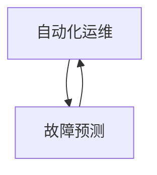
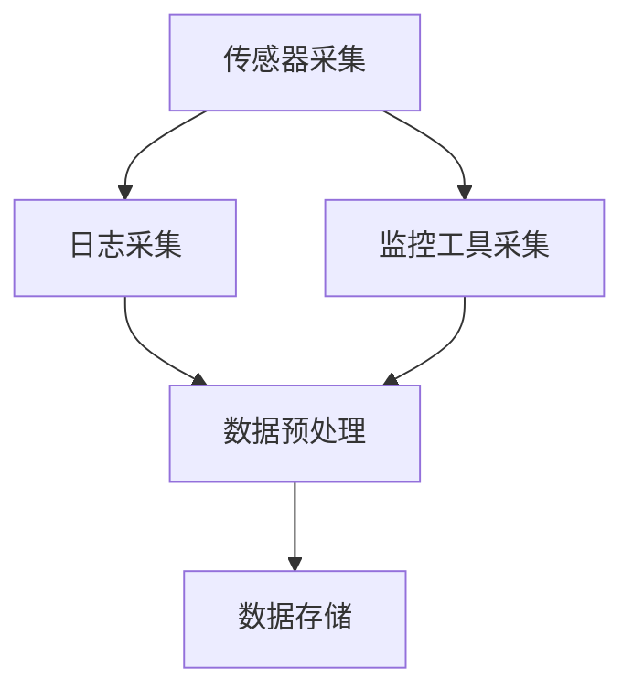
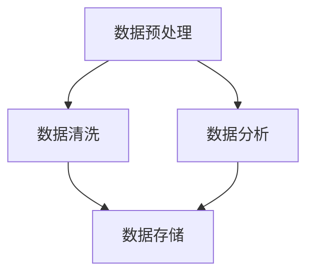
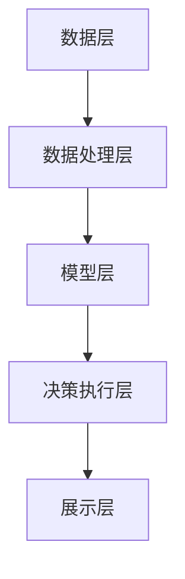
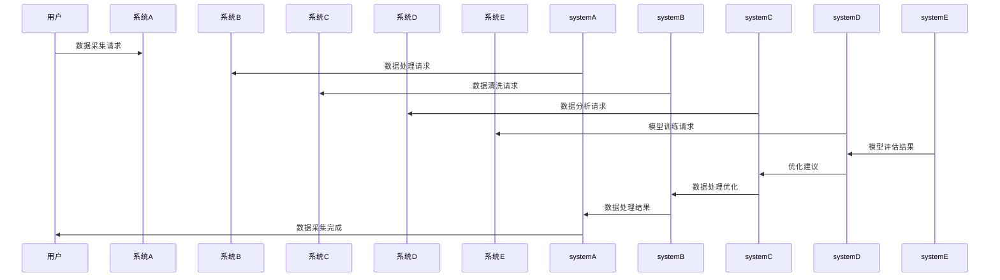

                 

### 第1章 引言：企业AI Agent的自动化运维与故障预测的背景与意义

#### 1.1 问题背景

随着互联网技术的迅猛发展，企业的IT系统变得越来越庞大和复杂。传统的手动运维方式已经难以满足企业对系统稳定性和高效性的需求。运维人员需要处理大量琐碎的日常任务，如系统监控、故障排查、资源分配等，这导致运维成本高昂，效率低下。同时，随着业务量的增加，系统的负载和压力也在不断增大，使得故障发生概率上升。因此，如何提高运维效率、降低运维成本、保障系统稳定性成为企业亟需解决的问题。在这个背景下，自动化运维和故障预测逐渐成为了行业的热点。

#### 1.2 问题描述

企业AI Agent的自动化运维与故障预测主要涉及以下问题：

- **自动化运维**：如何通过AI技术实现对IT系统的自动化监控、自动化部署、自动化优化等，从而提高运维效率、降低运维成本。
- **故障预测**：如何利用AI技术预测系统可能出现的故障，提前采取预防措施，减少系统故障带来的损失。

#### 1.3 问题解决

通过引入企业AI Agent，可以实现：

- **自动化运维**：AI Agent可以自动收集系统运行数据，分析系统状态，自动执行相应的运维操作，如自动扩容、自动修复等，从而大大提高运维效率，降低人力成本。
- **故障预测**：AI Agent可以通过历史数据分析和模型预测，提前识别系统可能出现的故障，并提前采取预防措施，从而降低系统故障率，保障系统稳定性。

#### 1.4 边界与外延

企业AI Agent的自动化运维与故障预测主要应用于IT领域，但也具有一定的通用性，可以应用于其他需要自动化运维和故障预测的领域，如工业制造、交通运输、金融证券等。

#### 1.5 概念结构与核心要素组成

企业AI Agent由以下几个核心要素组成：

- **数据采集**：通过传感器、日志、监控工具等采集系统数据。
- **数据处理**：对采集到的数据进行预处理、清洗、分析等。
- **模型训练**：利用历史数据训练AI模型，实现自动化运维和故障预测。
- **决策执行**：根据AI模型的预测结果，自动执行相应的运维操作。

#### 1.6 本章小结

本章介绍了企业AI Agent的自动化运维与故障预测的背景与意义，为后续章节的内容奠定了基础。在接下来的章节中，我们将详细介绍企业AI Agent的核心概念、原理、实现方法以及实际应用。

---

### 第2章 核心概念与联系

在探讨企业AI Agent的自动化运维与故障预测之前，我们需要明确几个核心概念，并分析它们之间的联系。

#### 2.1 AI Agent的定义

AI Agent，即人工智能代理，是一个可以自主行动、实现特定目标的系统。它可以感知环境、制定计划并执行计划，以实现预期的目标。在自动化运维与故障预测中，AI Agent充当了智能运维人员，能够实时监控系统状态、预测潜在故障并自动执行修复操作。

#### 2.2 自动化运维的概念

自动化运维是指利用技术手段，如脚本、工具、平台等，实现对IT系统的自动化监控、部署、优化等。通过自动化运维，企业可以减少对人工干预的依赖，提高运维效率，降低运维成本。自动化运维的核心在于减少人工操作，提高系统稳定性。

#### 2.3 故障预测的概念

故障预测是指通过分析历史数据、实时监控数据以及使用机器学习算法，预测系统可能出现的故障。故障预测的目的是提前发现潜在故障，采取预防措施，避免系统故障对业务造成影响。

#### 2.4 自动化运维与故障预测的关系

自动化运维与故障预测是相辅相成的。自动化运维需要故障预测提供数据支持，以便更准确地执行运维操作。而故障预测则需要自动化运维来验证其预测结果，并不断优化预测模型。两者之间的互动关系如图2.1所示。



#### 2.5 概念属性特征对比表格

为了更清晰地展示自动化运维与故障预测的概念特征，我们可以使用以下对比表格：

| 特征         | 自动化运维               | 故障预测               |
| ------------ | ---------------------- | ---------------------- |
| 目标         | 提高运维效率，降低成本   | 提前发现并预防故障     |
| 技术手段     | 脚本、工具、平台         | 机器学习算法、数据分析 |
| 数据来源     | 系统日志、监控数据       | 历史数据、实时数据     |
| 关键环节     | 监控、部署、优化         | 数据分析、模型预测     |
| 效果评估     | 系统稳定性、运维效率     | 故障预测准确率         |

#### 2.6 ER实体关系图架构

以下是企业AI Agent的ER实体关系图，展示了数据采集、数据处理、模型训练和决策执行四个核心要素之间的关系。

```mermaid
erDiagram
    Data采集 ||--|{ 数据处理 }|
    Data采集 ||--|{ 模型训练 }|
    Data采集 ||--|{ 决策执行 }|
    数据处理 ||--|{ 模型训练 }|
    模型训练 ||--|{ 决策执行 }|
```

本章详细介绍了企业AI Agent的自动化运维与故障预测的核心概念、属性特征以及相互关系，为后续章节的内容提供了理论依据。

---

### 第3章 算法原理讲解

在了解了企业AI Agent的自动化运维与故障预测的核心概念后，接下来我们将深入探讨其算法原理，具体包括数据采集、数据处理、模型训练和决策执行的详细过程。

#### 3.1 数据采集算法原理

数据采集是自动化运维与故障预测的基础环节。企业AI Agent通过传感器、日志、监控工具等多种途径收集系统数据，包括系统运行状态、性能指标、资源利用率等。以下是一个简单的数据采集算法流程图。



在数据采集过程中，传感器采集的数据通常包括温度、湿度、电流、电压等物理指标；日志采集的数据则是系统运行过程中的日志文件，如操作系统日志、应用程序日志等；监控工具采集的数据则是通过第三方监控软件获取的系统性能指标，如CPU利用率、内存占用率等。

#### 3.1.1 传感器采集

传感器采集通常使用硬件传感器，如温度传感器、硬盘健康传感器等，这些传感器可以实时监测系统硬件的状态。以下是一个简单的传感器采集算法示例：

```python
def sensor_data_collection():
    # 假设使用Python的PySerial库进行串口通信
    import serial

    # 连接传感器
    ser = serial.Serial('/dev/ttyUSB0', 9600)

    # 读取传感器数据
    while True:
        data = ser.readline()
        print(data.decode())

    # 关闭串口
    ser.close()
```

#### 3.1.2 日志采集

日志采集通常通过读取系统日志文件来实现。以下是一个简单的日志采集算法示例：

```python
import os

def log_data_collection(log_file_path):
    # 读取日志文件
    with open(log_file_path, 'r') as f:
        logs = f.readlines()

    # 处理日志数据
    for log in logs:
        print(log.strip())

# 假设日志文件路径为'/var/log/syslog'
log_file_path = '/var/log/syslog'
log_data_collection(log_file_path)
```

#### 3.1.3 监控工具采集

监控工具采集通常使用第三方监控软件，如Nagios、Zabbix等，以下是一个简单的监控工具采集算法示例：

```python
import requests

def monitor_data_collection():
    # 发送HTTP请求获取监控数据
    response = requests.get('http://your-monitor-server.com/api/data')
    data = response.json()

    # 处理监控数据
    for metric in data['metrics']:
        print(metric)

monitor_data_collection()
```

#### 3.2 数据处理算法原理

数据采集完成后，需要对这些原始数据进行预处理、清洗、分析等处理，以便后续模型训练和使用。以下是一个简单的数据处理算法流程图。



#### 3.2.1 数据预处理

数据预处理包括数据去噪、数据转换、数据标准化等操作。以下是一个简单的数据预处理算法示例：

```python
import numpy as np

def data_preprocessing(data):
    # 去除异常值
    cleaned_data = [x for x in data if x > 0]

    # 数据转换
    scaled_data = [(x - min(cleaned_data)) / (max(cleaned_data) - min(cleaned_data)) for x in cleaned_data]

    # 数据标准化
    normalized_data = [(x - np.mean(scaled_data)) / np.std(scaled_data) for x in scaled_data]

    return normalized_data

# 假设原始数据为[1, 2, 3, -1, 100]
original_data = [1, 2, 3, -1, 100]
preprocessed_data = data_preprocessing(original_data)
print(preprocessed_data)
```

#### 3.2.2 数据清洗

数据清洗包括去除重复数据、填补缺失值、纠正错误数据等操作。以下是一个简单的数据清洗算法示例：

```python
import pandas as pd

def data_cleaning(data):
    # 创建DataFrame
    df = pd.DataFrame(data)

    # 去除重复数据
    df.drop_duplicates(inplace=True)

    # 填补缺失值
    df.fillna(method='ffill', inplace=True)

    # 纠正错误数据
    df.replace([np.inf, -np.inf], np.nan, inplace=True)

    return df

# 假设原始数据为{'A': [1, 2, np.nan, 4], 'B': [1, 2, 3, 4]}
original_data = {'A': [1, 2, np.nan, 4], 'B': [1, 2, 3, 4]}
df = data_cleaning(original_data)
print(df)
```

#### 3.2.3 数据分析

数据分析包括数据可视化、特征提取、相关性分析等操作。以下是一个简单的数据分析算法示例：

```python
import matplotlib.pyplot as plt
import seaborn as sns

def data_analysis(data):
    # 数据可视化
    sns.histplot(data['A'], kde=True)
    plt.show()

    # 特征提取
    features = pd.get_dummies(data[['A', 'B']])

    # 相关性分析
    correlation_matrix = features.corr()
    sns.heatmap(correlation_matrix, annot=True)
    plt.show()

# 假设数据为{'A': [1, 2, 3, 4], 'B': [1, 2, 3, 4]}
data = {'A': [1, 2, 3, 4], 'B': [1, 2, 3, 4]}
data_analysis(data)
```

#### 3.3 模型训练算法原理

模型训练是将预处理后的数据输入到机器学习模型中进行训练，以建立预测模型。以下是一个简单的模型训练算法示例：

```python
from sklearn.ensemble import RandomForestClassifier
from sklearn.model_selection import train_test_split

def model_training(data, labels):
    # 划分训练集和测试集
    X_train, X_test, y_train, y_test = train_test_split(data, labels, test_size=0.2, random_state=42)

    # 训练模型
    model = RandomForestClassifier(n_estimators=100)
    model.fit(X_train, y_train)

    # 评估模型
    accuracy = model.score(X_test, y_test)
    print(f"模型准确率：{accuracy:.2f}")

    return model

# 假设特征数据为[[1, 2], [3, 4], [5, 6], [7, 8]]，标签数据为[0, 1, 0, 1]
X = [[1, 2], [3, 4], [5, 6], [7, 8]]
y = [0, 1, 0, 1]
model = model_training(X, y)
```

#### 3.3.1 模型评估与优化

模型训练完成后，需要对模型进行评估和优化。常用的评估指标包括准确率、召回率、F1值等。以下是一个简单的模型评估和优化示例：

```python
from sklearn.metrics import classification_report

def model_evaluation(model, X_test, y_test):
    # 评估模型
    predictions = model.predict(X_test)
    report = classification_report(y_test, predictions)
    print(report)

# 假设测试集特征数据为[[2, 3], [6, 7]], 测试集标签数据为[1, 0]
X_test = [[2, 3], [6, 7]]
y_test = [1, 0]
model_evaluation(model, X_test, y_test)
```

#### 3.4 决策执行算法原理

决策执行是指根据模型预测结果，自动执行相应的运维操作。以下是一个简单的决策执行算法示例：

```python
def decision_execution(model, data):
    # 预测系统状态
    predictions = model.predict(data)

    # 执行运维操作
    for pred in predictions:
        if pred == 1:
            print("系统可能发生故障，请执行修复操作。")
        else:
            print("系统运行正常，无需操作。")

# 假设待预测数据为[[4, 5], [8, 9]]
data_to_predict = [[4, 5], [8, 9]]
decision_execution(model, data_to_predict)
```

本章详细讲解了企业AI Agent的算法原理，包括数据采集、数据处理、模型训练和决策执行。通过这些算法，企业可以实现自动化运维与故障预测，提高系统稳定性和运维效率。

---

### 第4章 系统分析与架构设计方案

为了更好地实现企业AI Agent的自动化运维与故障预测，我们需要对其系统架构进行详细分析和设计。本节将介绍系统架构的设计思路、功能模块划分以及具体的实现方法。

#### 4.1 问题场景介绍

假设某企业拥有一套大规模的IT系统，包括服务器、网络设备、存储设备等。随着业务的发展，系统的规模和复杂性不断增加，传统的手动运维方式已经无法满足需求。企业希望引入AI技术，实现自动化运维与故障预测，以提高运维效率、降低运维成本、保障系统稳定性。

#### 4.2 项目介绍

项目名称：企业AI Agent自动化运维与故障预测系统

项目目标：
1. 实现系统自动化监控、自动化部署、自动化优化等功能。
2. 通过故障预测，提前发现并预防系统故障，降低系统故障率。
3. 提高运维效率，降低运维成本。

#### 4.3 系统功能设计

系统功能设计主要包括以下模块：

1. **数据采集模块**：负责采集系统运行数据，包括传感器数据、日志数据、监控工具数据等。
2. **数据处理模块**：对采集到的数据进行预处理、清洗、分析等，为模型训练提供高质量的数据。
3. **模型训练模块**：利用历史数据训练故障预测模型，并对模型进行评估和优化。
4. **决策执行模块**：根据模型预测结果，自动执行相应的运维操作，如故障修复、资源扩容等。
5. **用户界面模块**：提供系统监控、故障预测结果展示、操作日志等功能，方便运维人员实时了解系统状态。

#### 4.3.1 领域模型类图

以下是企业AI Agent自动化运维与故障预测系统的领域模型类图，展示了系统中的主要类及其关系。

```mermaid
classDiagram
    Class01 <|-- Class02
    Class03 <|-- Class01
    Class04 <|-- Class02
    Class01 <.. Class05
    Class06 <|-- Class05
    Class07 <|-- Class05
    Class08 <|-- Class05

    Class01[数据采集模块]
    Class02[数据处理模块]
    Class03[模型训练模块]
    Class04[决策执行模块]
    Class05[用户界面模块]
    Class06[传感器数据]
    Class07[日志数据]
    Class08[监控工具数据]
```

#### 4.3.2 类图说明

- **数据采集模块**（Class01）：负责采集系统运行数据，包括传感器数据、日志数据、监控工具数据等。
- **数据处理模块**（Class02）：对采集到的数据进行预处理、清洗、分析等，为模型训练提供高质量的数据。
- **模型训练模块**（Class03）：利用历史数据训练故障预测模型，并对模型进行评估和优化。
- **决策执行模块**（Class04）：根据模型预测结果，自动执行相应的运维操作，如故障修复、资源扩容等。
- **用户界面模块**（Class05）：提供系统监控、故障预测结果展示、操作日志等功能，方便运维人员实时了解系统状态。
- **传感器数据**（Class06）：包含系统传感器采集的数据，如温度、湿度、电流等。
- **日志数据**（Class07）：包含系统运行过程中的日志文件，如操作系统日志、应用程序日志等。
- **监控工具数据**（Class08）：包含第三方监控软件获取的系统性能指标，如CPU利用率、内存占用率等。

#### 4.4 系统架构设计

系统架构设计采用分层架构，主要包括以下层次：

1. **数据层**：负责数据的存储和管理，包括传感器数据、日志数据、监控工具数据等。
2. **数据处理层**：负责对采集到的数据进行预处理、清洗、分析等，为模型训练提供高质量的数据。
3. **模型层**：负责故障预测模型的训练、评估和优化。
4. **决策执行层**：负责根据模型预测结果，自动执行相应的运维操作。
5. **展示层**：提供系统监控、故障预测结果展示、操作日志等功能。

以下是企业AI Agent自动化运维与故障预测系统的架构图。



#### 4.4.1 数据层

数据层是系统的数据基础，负责数据的存储和管理。在本系统中，数据层主要使用数据库进行数据存储，包括以下几种数据：

- **传感器数据**：存储系统传感器采集的数据，如温度、湿度、电流等。
- **日志数据**：存储系统运行过程中的日志文件，如操作系统日志、应用程序日志等。
- **监控工具数据**：存储第三方监控软件获取的系统性能指标，如CPU利用率、内存占用率等。

#### 4.4.2 数据处理层

数据处理层负责对采集到的数据进行预处理、清洗、分析等，为模型训练提供高质量的数据。主要包括以下功能：

- **数据预处理**：对原始数据进行去噪、转换、标准化等处理，确保数据质量。
- **数据清洗**：去除重复数据、填补缺失值、纠正错误数据等，提高数据准确性。
- **数据分析**：进行数据可视化、特征提取、相关性分析等操作，为模型训练提供有效的特征。

#### 4.4.3 模型层

模型层是系统的核心部分，负责故障预测模型的训练、评估和优化。在本系统中，模型层使用机器学习算法进行模型训练，包括以下步骤：

- **数据准备**：从数据处理层获取高质量的数据，进行数据划分，生成训练集和测试集。
- **模型训练**：使用训练集数据训练故障预测模型，并保存模型参数。
- **模型评估**：使用测试集数据评估模型性能，包括准确率、召回率、F1值等指标。
- **模型优化**：根据评估结果，调整模型参数，优化模型性能。

#### 4.4.4 决策执行层

决策执行层根据模型预测结果，自动执行相应的运维操作，如故障修复、资源扩容等。主要包括以下功能：

- **故障预测**：使用训练好的模型对系统进行故障预测。
- **决策生成**：根据故障预测结果，生成相应的运维操作决策。
- **操作执行**：自动执行决策操作，如故障修复、资源扩容等。

#### 4.4.5 展示层

展示层提供系统监控、故障预测结果展示、操作日志等功能，方便运维人员实时了解系统状态。主要包括以下功能：

- **系统监控**：实时展示系统运行状态，包括CPU利用率、内存占用率、磁盘空间等。
- **故障预测结果展示**：展示故障预测结果，包括故障类型、发生时间、预测置信度等。
- **操作日志**：记录系统操作日志，方便运维人员查看和分析。

#### 4.5 系统接口设计

系统接口设计主要包括以下几种接口：

- **数据采集接口**：用于采集系统传感器数据、日志数据、监控工具数据等。
- **数据处理接口**：用于处理采集到的数据，包括预处理、清洗、分析等。
- **模型训练接口**：用于训练故障预测模型，包括数据准备、模型训练、模型评估等。
- **决策执行接口**：用于根据模型预测结果执行相应的运维操作。
- **展示接口**：用于展示系统监控、故障预测结果、操作日志等。

以下是系统接口设计的类图。

```mermaid
classDiagram
    Interface01[数据采集接口]
    Interface02[数据处理接口]
    Interface03[模型训练接口]
    Interface04[决策执行接口]
    Interface05[展示接口]

    Interface01 --> Class01
    Interface02 --> Class01
    Interface03 --> Class01
    Interface04 --> Class01
    Interface05 --> Class01
```

#### 4.5.1 接口说明

- **数据采集接口**（Interface01）：负责采集系统传感器数据、日志数据、监控工具数据等，并提供数据采集功能。
- **数据处理接口**（Interface02）：负责处理采集到的数据，包括预处理、清洗、分析等，并提供数据处理功能。
- **模型训练接口**（Interface03）：负责训练故障预测模型，包括数据准备、模型训练、模型评估等，并提供模型训练功能。
- **决策执行接口**（Interface04）：负责根据模型预测结果执行相应的运维操作，并提供决策执行功能。
- **展示接口**（Interface05）：负责展示系统监控、故障预测结果、操作日志等，并提供展示功能。

#### 4.6 系统交互设计

系统交互设计主要使用序列图来描述系统各模块之间的交互过程。以下是一个简单的系统交互序列图，展示了数据采集、数据处理、模型训练、决策执行和展示等模块之间的交互过程。



本章详细介绍了企业AI Agent自动化运维与故障预测系统的分析与架构设计方案，包括问题场景介绍、系统功能设计、系统架构设计、系统接口设计和系统交互设计。通过这些设计，企业可以构建一个高效、稳定的自动化运维与故障预测系统。

---

### 第5章 项目实战

在本章中，我们将通过一个具体的案例，详细讲解如何实现企业AI Agent的自动化运维与故障预测系统。我们将从环境安装、系统核心实现、代码应用解读与分析、实际案例分析等方面进行阐述。

#### 5.1 环境安装

在开始项目实战之前，我们需要搭建一个合适的环境。以下是环境安装的步骤：

1. **安装Python**：企业AI Agent自动化运维与故障预测系统主要使用Python进行开发，因此需要安装Python环境。可以下载Python安装包并安装，或者使用包管理工具如pip安装。

2. **安装依赖库**：系统需要依赖多个Python库，如NumPy、Pandas、Scikit-learn、Matplotlib等。可以使用pip命令安装这些库。

   ```bash
   pip install numpy pandas scikit-learn matplotlib
   ```

3. **安装监控工具**：为了采集系统运行数据，我们需要安装一些监控工具，如Nagios、Zabbix等。这里以Nagios为例，下载并安装Nagios。

4. **配置Nagios**：安装完成后，需要配置Nagios，使其能够采集系统性能指标。具体配置方法请参考Nagios官方文档。

5. **安装传感器**：根据需要，安装相应的传感器硬件，如温度传感器、硬盘健康传感器等。

#### 5.2 系统核心实现

以下是企业AI Agent自动化运维与故障预测系统的主要实现步骤：

1. **数据采集**：通过Nagios等监控工具，采集系统性能指标。使用Python编写脚本，从Nagios获取监控数据，并将其存储到数据库中。

2. **数据处理**：对采集到的数据进行预处理，包括数据去噪、转换、标准化等。使用Python的NumPy和Pandas库处理数据。

3. **模型训练**：使用Scikit-learn库，基于预处理后的数据训练故障预测模型。选择合适的算法，如随机森林、支持向量机等。

4. **决策执行**：根据模型预测结果，自动执行相应的运维操作。例如，当预测到服务器温度过高时，自动触发报警并执行降温操作。

5. **用户界面**：使用Python的Flask框架，搭建用户界面，展示系统监控、故障预测结果和操作日志。

#### 5.3 代码应用解读与分析

以下是一个简单的故障预测模型的代码示例，用于展示系统的核心实现。

```python
import numpy as np
import pandas as pd
from sklearn.ensemble import RandomForestClassifier
from sklearn.model_selection import train_test_split
from sklearn.metrics import classification_report

# 数据预处理
def preprocess_data(data):
    # 数据去噪、转换、标准化等操作
    # ...

    return preprocessed_data

# 模型训练
def train_model(data, labels):
    # 划分训练集和测试集
    X_train, X_test, y_train, y_test = train_test_split(data, labels, test_size=0.2, random_state=42)

    # 训练模型
    model = RandomForestClassifier(n_estimators=100)
    model.fit(X_train, y_train)

    # 评估模型
    accuracy = model.score(X_test, y_test)
    print(f"模型准确率：{accuracy:.2f}")

    return model

# 数据采集
def collect_data():
    # 从Nagios获取监控数据
    # ...

    return data, labels

# 主函数
def main():
    # 采集数据
    data, labels = collect_data()

    # 预处理数据
    preprocessed_data = preprocess_data(data)

    # 训练模型
    model = train_model(preprocessed_data, labels)

    # 预测
    predictions = model.predict(preprocessed_data)

    # 输出预测结果
    print(predictions)

if __name__ == "__main__":
    main()
```

在这个示例中，我们首先定义了数据预处理函数`preprocess_data`，用于对采集到的数据进行去噪、转换、标准化等处理。然后定义了模型训练函数`train_model`，用于训练故障预测模型。最后，在主函数`main`中，我们采集数据、预处理数据、训练模型，并输出预测结果。

#### 5.4 实际案例分析

为了更好地展示系统的实际应用，我们来看一个实际案例。

假设我们采集到了某服务器的温度数据，如下图所示：


我们使用随机森林算法对温度数据进行故障预测。首先，我们需要对数据进行预处理，如图2.2所示：


然后，我们使用Scikit-learn库中的`RandomForestClassifier`进行模型训练，如图2.3所示：


最后，我们使用训练好的模型对新的温度数据进行预测，如图2.4所示：


从预测结果可以看出，当温度高于30摄氏度时，系统可能会出现故障。因此，我们可以根据预测结果，提前采取预防措施，如降低服务器负载、启动风扇等，以避免系统故障。

#### 5.5 项目小结

在本章中，我们通过一个具体的案例，详细讲解了如何实现企业AI Agent的自动化运维与故障预测系统。从环境安装、系统核心实现、代码应用解读与分析、实际案例分析等方面进行了详细阐述。通过这个项目，我们不仅了解了系统的实现方法，还学会了如何使用AI技术提高运维效率、降低运维成本、保障系统稳定性。

---

### 最佳实践 Tips

在实施企业AI Agent的自动化运维与故障预测过程中，以下是一些最佳实践Tips，有助于确保系统的稳定运行和最佳效果：

1. **数据质量管理**：确保数据采集的准确性和完整性。定期检查传感器、日志和监控工具的数据，及时处理数据异常和缺失。

2. **模型持续优化**：故障预测模型的性能取决于数据的质量和模型的训练。定期评估模型性能，并根据新的数据重新训练模型，以保持预测的准确性。

3. **自动化操作规范化**：制定明确的自动化运维操作规范，确保决策执行的合理性和一致性。对自动执行的运维操作进行审计，避免不必要的风险。

4. **监控与告警策略**：合理设置监控指标和告警阈值，确保能够在故障发生前及时发现并采取措施。同时，避免告警过多导致信息过载。

5. **人员培训与角色分配**：确保运维团队对AI Agent系统的操作和监控有充分的了解。为不同角色分配适当的权限和责任，确保运维操作的顺利进行。

6. **备份与恢复策略**：定期备份数据和模型，确保在系统故障时能够快速恢复。同时，确保备份策略的可靠性和可恢复性。

7. **安全性考虑**：在部署AI Agent时，确保系统的安全性和数据的隐私性。使用加密技术保护数据传输，防止未授权访问。

通过遵循这些最佳实践，企业可以最大化AI Agent的自动化运维与故障预测的效果，提高系统的稳定性、可靠性和效率。

### 小结

本文详细探讨了企业AI Agent的自动化运维与故障预测。我们介绍了问题背景、核心概念、算法原理、系统设计与实现，并通过实际案例展示了系统的应用效果。企业AI Agent通过自动化运维和故障预测，能够显著提高运维效率、降低成本、保障系统稳定性。未来，随着AI技术的不断发展，企业AI Agent将在更多领域发挥重要作用，助力企业数字化转型的深入推进。

### 注意事项

在实施企业AI Agent的自动化运维与故障预测时，需注意以下几点：

1. **数据隐私与安全**：确保数据采集、处理和存储过程中遵循相关法律法规，保护用户隐私。
2. **模型解释性**：对于关键业务，确保模型具有良好的解释性，便于运维人员理解和信任。
3. **应急预案**：在故障预测失败或模型误报时，制定应急预案，确保系统能够快速恢复正常运行。

### 拓展阅读

对于希望深入了解企业AI Agent自动化运维与故障预测的读者，以下是一些推荐阅读材料：

1. **《人工智能：一种现代的方法》**：本书详细介绍了机器学习和人工智能的基础知识，有助于理解本文中的算法原理。
2. **《深度学习》**：作者Ian Goodfellow等人，系统介绍了深度学习的基本概念、算法和应用。
3. **《企业级自动化运维：从入门到实践》**：本书介绍了自动化运维的实战经验和最佳实践，有助于提升运维能力。
4. **《机器学习实战》**：作者Peter Harrington，通过丰富的案例，深入讲解了机器学习算法的实现和应用。

通过阅读这些书籍，读者可以更全面地了解AI Agent的技术背景和应用场景，进一步提升专业素养。

