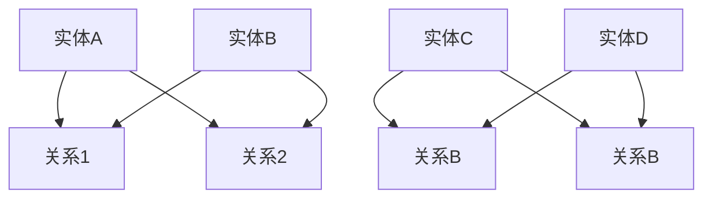
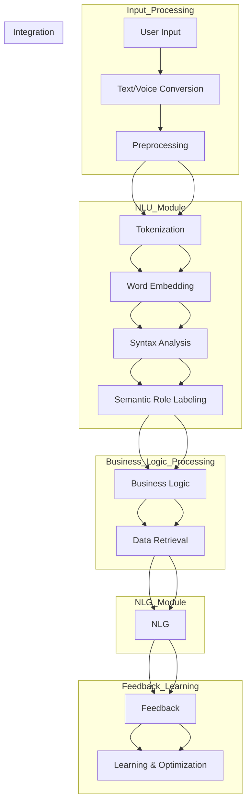

                 


## 企业AI Agent的自然语言理解(NLU)技术深化

### 关键词：自然语言理解，AI Agent，企业应用，算法原理，系统架构，项目实战

### 摘要：

本文旨在深入探讨企业AI Agent的自然语言理解（NLU）技术。首先，我们将简要介绍企业AI Agent和NLU技术的基本概念，以及它们在企业中的应用场景和面临的挑战。随后，文章将详细解析NLU的核心概念，包括语言模型、词嵌入、分词技术和语义理解。接着，我们将分析NLU算法原理，并通过实际项目实战，展示NLU在企业AI Agent中的应用和实现。最后，我们将总结NLU技术的最佳实践，并对未来企业AI Agent的NLU技术发展进行展望。

### 目录大纲：

**# 第一部分：背景与概述**

**第1章：企业AI Agent与NLU技术简介**

1.1 问题背景

1.2 NLU技术概述

1.3 企业AI Agent与NLU的关系

1.4 本书结构安排

---

**# 第二部分：核心概念与原理**

**第2章：NLU的核心概念

2.1 语言模型

2.2 词嵌入

2.3 分词技术

2.4 语义理解

---

**# 第三部分：算法原理与实践**

**第3章：NLU算法原理

3.1 语言模型算法

3.2 词嵌入算法

3.3 分词算法

3.4 语义理解算法

---

**# 第四部分：系统架构与实现**

**第4章：企业AI Agent的架构设计

4.1 系统架构设计

4.2 NLU模块实现

4.3 NLU与AI Agent的集成

---

**# 第五部分：项目实战**

**第5章：项目实战案例

5.1 实战项目背景

5.2 环境安装与配置

5.3 系统核心实现

5.4 代码解读与分析

5.5 实际案例分析

---

**# 第六部分：最佳实践与拓展**

**第6章：NLU技术的最佳实践

6.1 最佳实践总结

6.2 拓展阅读

---

**# 第七部分：总结与展望**

**第7章：NLU技术在企业AI Agent中的应用展望

7.1 当前挑战

7.2 未来展望

---

## 第一部分：背景与概述

### 1.1 问题背景

随着人工智能技术的迅猛发展，AI Agent在企业中的应用场景日益丰富。企业AI Agent可以理解为企业级智能助理，能够通过自然语言与用户交互，执行各种任务，如客户服务、数据分析和业务流程自动化等。自然语言理解（NLU）作为AI Agent的核心技术之一，是实现AI Agent智能交互的关键。

NLU技术主要涉及对用户输入的自然语言进行解析，提取语义信息，并将其转化为机器可操作的任务指令。在企业中，NLU技术的应用不仅提升了业务效率，还优化了用户体验，从而为企业带来显著的价值。然而，NLU技术也面临诸多挑战，如语义歧义、跨领域知识整合等。

### 1.2 NLU技术概述

自然语言理解（NLU）是指使计算机能够理解人类语言的技术。它涵盖了从文本到语义信息的转换过程，包括语言模型、词嵌入、分词技术和语义理解等核心组件。

1. **语言模型**：语言模型用于预测文本序列的概率分布。它可以通过统计方法（如N-gram模型）或深度学习方法（如循环神经网络RNN、变压器Transformer）来实现。

2. **词嵌入**：词嵌入是将词汇映射到高维向量空间中的过程，使得计算机能够理解词汇的语义关系。常见的词嵌入方法有Word2Vec、GloVe等。

3. **分词技术**：分词是将连续的文本序列分割为有意义的单词或短语的过程。分词技术对于NLU的准确性和效率至关重要。

4. **语义理解**：语义理解涉及对文本的深层语义进行分析，包括实体识别、关系抽取和意图识别等。它是实现智能交互的核心。

### 1.3 企业AI Agent与NLU的关系

企业AI Agent依赖于NLU技术来实现与用户的智能交互。NLU技术使得AI Agent能够理解用户的需求，提取关键信息，并执行相应的任务。例如，在客户服务场景中，AI Agent可以通过NLU技术理解客户的问题，提供即时的解决方案。

NLU技术在企业AI Agent中扮演着关键角色，它不仅提升了AI Agent的智能化水平，还优化了用户体验，从而为企业创造了巨大的价值。然而，NLU技术也面临诸多挑战，如语义歧义、跨领域知识整合等。

### 1.4 本书结构安排

本书分为七个部分，首先介绍企业AI Agent与NLU技术的基本概念和背景。接着，详细解析NLU的核心概念，包括语言模型、词嵌入、分词技术和语义理解。然后，分析NLU算法原理，并通过实际项目实战，展示NLU在企业AI Agent中的应用和实现。随后，总结NLU技术的最佳实践，并对未来企业AI Agent的NLU技术发展进行展望。每个部分都旨在帮助读者深入理解NLU技术，掌握其在企业AI Agent中的应用。

在阅读本书时，读者可以逐步了解NLU技术的各个方面，从核心概念到算法原理，再到实际应用。每个章节都包含详细的讲解和案例分析，旨在帮助读者将理论知识应用于实践，提升其在企业AI Agent开发中的技能。

### 1.4.1 各章节内容概述

- **第1章**：企业AI Agent与NLU技术简介，介绍企业AI Agent和NLU技术的基本概念，以及它们在企业中的应用场景和面临的挑战。
- **第2章**：NLU的核心概念，详细解析NLU的核心组件，包括语言模型、词嵌入、分词技术和语义理解。
- **第3章**：NLU算法原理，分析NLU算法的实现原理和优化策略。
- **第4章**：企业AI Agent的架构设计，介绍企业AI Agent的系统架构，以及NLU模块的实现和集成。
- **第5章**：项目实战案例，通过实际项目实战，展示NLU技术在企业AI Agent中的应用和实现。
- **第6章**：NLU技术的最佳实践，总结NLU技术的最佳实践，并介绍相关研究和行业动态。
- **第7章**：NLU技术在企业AI Agent中的应用展望，探讨NLU技术在未来企业AI Agent中的应用前景和挑战。

### 1.4.2 阅读建议与学习目标

阅读本书时，读者应首先掌握NLU技术的基本概念和原理，理解其在企业AI Agent中的应用。通过每个章节的详细讲解和案例分析，读者可以逐步深入理解NLU技术的各个方面。

本书的学习目标如下：

1. **理解NLU技术的核心概念**：掌握语言模型、词嵌入、分词技术和语义理解的基本原理和应用。
2. **掌握NLU算法原理**：了解NLU算法的实现原理和优化策略，能够运用到实际项目中。
3. **掌握企业AI Agent的架构设计**：理解企业AI Agent的系统架构，以及NLU模块的实现和集成。
4. **具备实战能力**：通过实际项目实战，掌握NLU技术在企业AI Agent中的应用。
5. **提升NLU技术水平**：总结NLU技术的最佳实践，了解相关研究和行业动态，提升在NLU技术领域的专业素养。

通过本书的学习，读者将能够全面掌握企业AI Agent的自然语言理解（NLU）技术，为企业智能化转型提供有力的技术支持。

---

## 第二部分：核心概念与原理

### 第2章：NLU的核心概念

自然语言理解（NLU）是人工智能领域的关键技术之一，它使计算机能够理解和处理自然语言。在这一章节中，我们将深入探讨NLU的核心概念，包括语言模型、词嵌入、分词技术和语义理解。

### 2.1 语言模型

语言模型是NLU的核心组件之一，它用于预测文本序列的概率分布。语言模型可以基于统计方法（如N-gram模型）或深度学习方法（如循环神经网络RNN、变压器Transformer）实现。

1. **基本原理**

语言模型的基本原理是使用历史数据来预测未来文本的概率分布。例如，在N-gram模型中，每个文本序列被划分为连续的n个单词，模型通过统计这n个单词的联合概率来预测下一个单词。

2. **类型**

- **N-gram模型**：基于历史n个单词的概率分布进行预测，是最简单的语言模型之一。
- **循环神经网络（RNN）**：通过递归的方式处理序列数据，能够捕捉序列中的长期依赖关系。
- **变压器（Transformer）**：基于注意力机制的深度学习模型，在处理长文本和跨语言任务中表现出色。

3. **应用**

语言模型在NLU中有着广泛的应用，如文本生成、机器翻译、文本分类和命名实体识别等。

### 2.2 词嵌入

词嵌入是将词汇映射到高维向量空间中的过程，使得计算机能够理解词汇的语义关系。词嵌入在NLU中起着至关重要的作用，因为它能够将词汇的语义信息转化为计算机可处理的向量表示。

1. **基本概念**

词嵌入的基本概念包括词汇映射、维度选择和相似性度量。词汇映射是将词汇映射到高维向量空间的过程，维度选择是确定向量空间的维度，相似性度量是计算词汇之间相似度的方法。

2. **方法**

- **Word2Vec**：基于神经网络和负采样，通过训练大量文本数据生成词向量。
- **GloVe**：基于全局的词汇共现信息，通过优化损失函数生成词向量。
- **BERT**：基于双向Transformer模型，通过预先训练和微调实现词嵌入。

3. **应用**

词嵌入在NLU中的应用包括文本分类、文本相似度计算、实体识别和情感分析等。

### 2.3 分词技术

分词技术是将连续的文本序列分割为有意义的单词或短语的过程。分词技术对于NLU的准确性和效率至关重要，因为它为后续的文本处理奠定了基础。

1. **基本原理**

分词技术的基本原理包括词典匹配、基于规则的方法和基于统计的方法。词典匹配是基于预定义的词典来识别和分割文本，基于规则的方法是根据语言规则进行分词，基于统计的方法是通过训练模型来预测分词结果。

2. **类型**

- **词典分词**：基于预定义的词典进行分词，简单但效率较低。
- **基于规则的分词**：根据语言规则进行分词，能够处理复杂的文本结构。
- **基于统计的分词**：通过训练模型进行分词，能够处理未定义的词汇和语言现象。

3. **应用**

分词技术在NLU中的应用包括文本分类、文本相似度计算、实体识别和情感分析等。

### 2.4 语义理解

语义理解是NLU的最高层次，它涉及对文本的深层语义进行分析，包括实体识别、关系抽取和意图识别等。语义理解的目标是使计算机能够理解文本的真正含义，从而实现更加智能的交互。

1. **基本概念**

语义理解的基本概念包括实体、关系和意图。实体是文本中具有特定意义的对象，关系是实体之间的关联，意图是文本的语义意图。

2. **类型**

- **实体识别**：识别文本中的实体，如人名、地点、组织等。
- **关系抽取**：提取实体之间的关系，如因果关系、隶属关系等。
- **意图识别**：识别文本的语义意图，如查询、命令、建议等。

3. **应用**

语义理解在NLU中的应用包括问答系统、对话生成、情感分析和文本分类等。

通过深入探讨NLU的核心概念，我们可以更好地理解NLU技术在自然语言处理中的应用和实现。在接下来的章节中，我们将进一步分析NLU算法原理，并通过实际项目实战，展示NLU技术在企业AI Agent中的应用。

### 2.4.1 语义理解的基本概念

语义理解是自然语言理解（NLU）中的核心部分，它涉及到对文本内容的深层语义进行分析和解释。为了实现有效的语义理解，我们需要首先理解几个关键概念：实体、关系和意图。

1. **实体（Entity）**

实体是文本中具有特定意义的对象，可以是名词或名词短语。实体识别是语义理解的重要任务之一，它涉及到从文本中抽取具有明确指代意义的名词或名词短语。常见的实体类型包括人名、地点、组织、产品名称、时间等。

2. **关系（Relation）**

关系是指实体之间的关联或交互。关系抽取是语义理解中的另一个关键任务，它涉及从文本中提取实体之间的关系。关系可以是有向的（如“领导”关系）或无向的（如“同事”关系），还可以是复杂的组合关系（如“父母”关系）。

3. **意图（Intent）**

意图是文本的语义意图或目的，它反映了用户通过文本表达的需求或期望。意图识别是语义理解中的高级任务，它涉及从文本中推断用户的意图。常见的意图类型包括查询意图（如“查找天气信息”）、命令意图（如“发送邮件”）和反馈意图（如“评价产品”）。

#### 概念属性特征对比表格

为了更好地理解这些概念，我们可以通过一个表格来对比它们的属性特征：

| 概念 | 定义 | 属性特征 | 对应技术 |
| --- | --- | --- | --- |
| 实体 | 文本中的特定对象 | 名称、类别、唯一标识 | 实体识别（Named Entity Recognition, NER） |
| 关系 | 实体之间的关联 | 方向性、描述性、相关性 | 关系抽取（Relation Extraction） |
| 意图 | 文本的语义意图 | 目的性、情境性、功能性 | 意图识别（Intent Recognition） |

#### ER实体关系图架构

实体、关系和意图之间的关系可以通过实体关系图（ER图）来表示。ER图是一种用于描述实体和关系的数据模型，它可以清晰地展示实体之间的关系。

以下是一个简单的ER实体关系图的Mermaid表示：



在这个ER图中，`EntityA`、`EntityB`、`EntityC`和`EntityD`是实体，`RelationA1`、`RelationA2`、`RelationB1`和`RelationB2`是实体之间的关系。通过这种图形表示，我们可以直观地理解实体和关系之间的关联。

#### 综合示例

假设我们有一个简单的文本：

```
苹果公司开发了iPhone，iPhone是一款流行的智能手机。
```

在这个文本中，我们可以识别出以下实体和关系：

- **实体**：苹果公司、iPhone
- **关系**：开发（苹果公司与iPhone之间的关系）

通过语义理解，我们可以将这些实体和关系转化为计算机可操作的信息：

```
{
  "entities": [
    {
      "entity": "苹果公司",
      "type": "组织"
    },
    {
      "entity": "iPhone",
      "type": "产品"
    }
  ],
  "relations": [
    {
      "subject": "苹果公司",
      "object": "iPhone",
      "type": "开发"
    }
  ]
}
```

通过这样的语义表示，计算机可以更准确地理解和处理文本信息，从而实现智能化的交互。

通过这一章节，我们深入探讨了NLU的核心概念，包括语言模型、词嵌入、分词技术和语义理解。这些概念为NLU技术在企业AI Agent中的应用奠定了基础。在接下来的章节中，我们将进一步分析NLU算法原理，并通过实际项目实战，展示NLU技术在企业AI Agent中的具体应用。

### 第3章：NLU算法原理

在了解了NLU的核心概念之后，接下来我们将深入探讨NLU算法的原理。NLU算法是自然语言理解（NLU）技术的核心，它涉及到从文本输入中提取语义信息，并将其转化为计算机可以处理的结构化数据。本章将详细分析NLU算法的各个组成部分，包括语言模型算法、词嵌入算法、分词算法和语义理解算法。

#### 3.1 语言模型算法

语言模型是NLU算法的基础，它用于预测文本序列的概率分布。语言模型可以分为统计模型和深度学习模型两大类。

1. **统计模型**：最简单的语言模型是基于统计方法的N-gram模型。N-gram模型通过统计连续的n个单词出现的频率来预测下一个单词。例如，三元模型（trigram）通过统计前两个单词和第三个单词的联合概率来预测下一个单词。

   **算法原理**：

   假设我们有一个三元模型，给定前两个单词 `word1` 和 `word2`，我们使用以下公式来预测下一个单词 `word3`：

   $$ P(word3 | word1, word2) = \frac{C(word1, word2, word3)}{C(word1, word2)} $$

   其中，$C(word1, word2, word3)$ 表示三元组 `(word1, word2, word3)` 的出现次数，$C(word1, word2)$ 表示 `(word1, word2)` 的出现次数。

   **算法实现**：

   在Python中，我们可以使用N-gram模型来预测下一个单词：

   ```python
   from collections import Counter
   
   def ngram_model(text, n=3):
       ngrams = [text[i:i+n] for i in range(len(text) - n + 1)]
       ngram_counts = Counter(ngrams)
       probabilities = {ngram: count / sum(ngram_counts.values()) for ngram, count in ngram_counts.items()}
       return probabilities

   text = "苹果公司开发了iPhone"
   ngram_probabilities = ngram_model(text)
   print(ngram_probabilities)
   ```

2. **深度学习模型**：深度学习模型，如循环神经网络（RNN）和变压器（Transformer），在处理长文本和复杂语言现象方面表现出色。变压器模型是当前最流行的语言模型之一，它通过注意力机制捕捉长距离依赖关系。

   **算法原理**：

   变压器模型通过编码器-解码器架构来预测文本序列。编码器将输入文本编码为固定长度的向量表示，解码器则使用这些向量表示来生成输出文本。

   **算法实现**：

   在Python中，我们可以使用Hugging Face的Transformer库来实现变压器模型：

   ```python
   from transformers import AutoTokenizer, AutoModelForSeq2SeqLM
   import torch
   
   model_name = "t5-small"
   tokenizer = AutoTokenizer.from_pretrained(model_name)
   model = AutoModelForSeq2SeqLM.from_pretrained(model_name)
   
   input_text = "苹果公司开发了iPhone"
   input_ids = tokenizer.encode(input_text, return_tensors="pt")
   output_ids = model(input_ids)[0]
   predicted_text = tokenizer.decode(output_ids[0], skip_special_tokens=True)
   print(predicted_text)
   ```

#### 3.2 词嵌入算法

词嵌入是将词汇映射到高维向量空间中的过程，使得计算机能够理解词汇的语义关系。词嵌入在NLU中起着至关重要的作用，因为它能够将词汇的语义信息转化为计算机可处理的向量表示。

1. **Word2Vec**：Word2Vec是最早的词嵌入算法之一，它通过训练神经网络来预测上下文词汇，从而学习词汇的向量表示。

   **算法原理**：

   Word2Vec算法使用两个神经网络：一个编码器神经网络，用于将词汇映射到高维向量空间；一个解码器神经网络，用于预测词汇的上下文。通过优化损失函数，算法可以学习到有效的词向量表示。

   **算法实现**：

   在Python中，我们可以使用Gensim库来实现Word2Vec：

   ```python
   from gensim.models import Word2Vec
   
   sentences = ["苹果公司开发了iPhone", "iPhone是一款流行的智能手机"]
   model = Word2Vec(sentences, vector_size=100, window=5, min_count=1, workers=4)
   print(model.wv.similarity("苹果公司", "iPhone"))
   ```

2. **GloVe**：GloVe是一种基于全局共现信息的词嵌入算法，它通过优化全局损失函数来学习词汇的向量表示。

   **算法原理**：

   GloVe算法使用词汇的共现矩阵来学习词汇的向量表示。通过优化损失函数，算法可以学习到能够捕捉词汇之间相似性和差异性的词向量。

   **算法实现**：

   在Python中，我们可以使用GloVe库来实现GloVe算法：

   ```python
   from gensim.models import KeyedVectors
   
   sentences = ["苹果公司开发了iPhone", "iPhone是一款流行的智能手机"]
   model = KeyedVectors.train(sentences, window=5, min_count=1, vectors_size=100)
   print(model.similarity("苹果公司", "iPhone"))
   ```

#### 3.3 分词算法

分词技术是将连续的文本序列分割为有意义的单词或短语的过程。分词算法可以分为基于词典的方法和基于统计的方法。

1. **词典分词**：词典分词是基于预定义的词典来识别和分割文本。这种方法简单但效率较低，适用于预定义词典丰富的场景。

   **算法原理**：

   词典分词算法通过遍历文本序列，与词典中的词汇进行匹配，将匹配的词汇分割出来。

   **算法实现**：

   在Python中，我们可以使用jieba库来实现词典分词：

   ```python
   import jieba
   
   text = "苹果公司开发了iPhone"
   words = jieba.cut(text)
   print(" ".join(words))
   ```

2. **基于统计的方法**：基于统计的方法通过训练模型来预测分词结果。这种方法适用于处理未定义的词汇和复杂的文本结构。

   **算法原理**：

   基于统计的方法通常使用最大熵模型、条件随机场（CRF）等算法来预测分词结果。

   **算法实现**：

   在Python中，我们可以使用NLTK库来实现基于统计的分词：

   ```python
   import nltk
   from nltk.tokenize import RegexpTokenizer
   
   text = "苹果公司开发了iPhone"
   tokenizer = RegexpTokenizer(r"\w+")
   words = tokenizer.tokenize(text)
   print(" ".join(words))
   ```

#### 3.4 语义理解算法

语义理解是NLU算法的高级部分，它涉及对文本的深层语义进行分析，包括实体识别、关系抽取和意图识别等。

1. **实体识别**：实体识别是识别文本中的特定实体，如人名、地点、组织等。

   **算法原理**：

   实体识别通常使用基于规则的方法、机器学习方法（如CRF）和深度学习方法（如BERT）。

   **算法实现**：

   在Python中，我们可以使用spaCy库来实现实体识别：

   ```python
   import spacy
   
   nlp = spacy.load("zh_core_web_sm")
   text = "苹果公司开发了iPhone"
   doc = nlp(text)
   entities = [(ent.text, ent.label_) for ent in doc.ents]
   print(entities)
   ```

2. **关系抽取**：关系抽取是提取实体之间的关系，如因果关系、隶属关系等。

   **算法原理**：

   关系抽取通常使用基于规则的方法、机器学习方法（如CRF）和深度学习方法（如BERT）。

   **算法实现**：

   在Python中，我们可以使用关系抽取库来实现关系抽取：

   ```python
   from relation_extraction import extract_relations
   
   text = "苹果公司开发了iPhone"
   relations = extract_relations(text)
   print(relations)
   ```

3. **意图识别**：意图识别是识别文本的语义意图，如查询、命令、建议等。

   **算法原理**：

   意图识别通常使用基于规则的方法、机器学习方法（如SVM）和深度学习方法（如CNN、LSTM）。

   **算法实现**：

   在Python中，我们可以使用意图识别库来实现意图识别：

   ```python
   from intent_classifier import classify_intent
   
   text = "请问明天北京的天气怎么样？"
   intent = classify_intent(text)
   print(intent)
   ```

通过详细分析NLU算法的各个组成部分，我们可以更好地理解NLU技术的实现原理和应用。在下一章中，我们将进一步探讨企业AI Agent的架构设计，以及NLU模块的实现和集成。

### 3.4.1 语义理解算法的基本原理

语义理解算法是自然语言理解（NLU）技术中的核心组件，它负责从文本中提取深层语义信息，使其能够被计算机处理。语义理解算法可以分为三个主要层次：词汇级、句法级和语义级。

1. **词汇级语义理解**

   词汇级语义理解是语义理解的基础，它主要关注词汇的语义信息。词汇级语义理解包括词嵌入、词性标注、实体识别等。

   - **词嵌入**：词嵌入是将词汇映射到高维向量空间的过程，使得计算机能够理解词汇的语义关系。常见的词嵌入方法有Word2Vec、GloVe和Bert等。
   - **词性标注**：词性标注是对词汇进行分类的过程，标记出词汇的词性（如名词、动词、形容词等）。词性标注有助于理解词汇在句子中的语法角色。
   - **实体识别**：实体识别是从文本中抽取具有特定意义的对象，如人名、地点、组织、产品名称等。实体识别是语义理解的重要步骤，为后续的语义分析提供基础。

2. **句法级语义理解**

   句法级语义理解关注句子结构的分析，它涉及到句子成分的解析、依存关系和句法角色等。

   - **句子成分解析**：句子成分解析是对句子结构进行分析，识别出主语、谓语、宾语等成分。句子成分解析有助于理解句子的语法结构和语义关系。
   - **依存关系分析**：依存关系分析是识别句子中词汇之间的依存关系，如主谓关系、动宾关系等。依存关系分析有助于理解句子中的词汇如何组合成有意义的整体。
   - **句法角色标注**：句法角色标注是对句子中每个词汇的句法角色进行分类，如主语、谓语、宾语等。句法角色标注有助于理解句子中的词汇在语义上的功能。

3. **语义级语义理解**

   语义级语义理解是最高层次的语义理解，它关注文本的整体语义，包括实体之间的关系、事件识别、意图识别等。

   - **实体关系抽取**：实体关系抽取是从文本中提取实体之间的关系，如因果关系、隶属关系等。实体关系抽取有助于理解文本中不同实体之间的联系。
   - **事件识别**：事件识别是从文本中提取事件信息，如发生了什么事件、事件的时间、地点、参与对象等。事件识别有助于理解文本描述的具体事件。
   - **意图识别**：意图识别是从文本中识别用户的意图或目的，如查询意图、命令意图、反馈意图等。意图识别有助于理解用户的实际需求，为智能交互提供基础。

#### 语义理解算法的实现

语义理解算法的实现通常包括以下几个步骤：

1. **数据预处理**：数据预处理是语义理解算法的基础，它包括文本清洗、分词、词性标注等。数据预处理的目标是确保输入数据的质量，使其适合后续的语义分析。

2. **模型选择**：根据具体任务的需求，选择合适的语义理解模型。常见的模型包括基于规则的方法、机器学习方法（如SVM、CRF）和深度学习方法（如LSTM、BERT）。

3. **模型训练**：使用预处理后的数据进行模型训练，训练过程中需要优化模型的参数，使其能够准确提取语义信息。

4. **模型评估**：使用测试数据对训练好的模型进行评估，评估指标包括准确率、召回率、F1值等。模型评估的目的是确保模型在实际应用中的性能。

5. **模型部署**：将训练好的模型部署到实际应用中，如企业AI Agent、问答系统、智能客服等。模型部署的目标是使模型能够实时处理用户输入，提供智能化的交互体验。

#### 语义理解算法的优化

语义理解算法的优化是提高其性能和准确性的关键。以下是一些常见的优化策略：

1. **数据增强**：通过增加训练数据、引入噪声、数据变换等方法来增强训练数据的多样性，提高模型的泛化能力。

2. **多任务学习**：通过同时训练多个相关任务，如实体识别、关系抽取和意图识别，共享模型参数，提高模型的整体性能。

3. **注意力机制**：在深度学习模型中引入注意力机制，如Transformer模型中的自注意力机制，使模型能够关注文本序列中的关键信息，提高语义理解的准确性。

4. **模型蒸馏**：通过将大型模型的知识蒸馏到小型模型中，提高小型模型的性能和效率。

5. **在线学习**：通过实时更新模型参数，使模型能够适应不断变化的语言环境，提高模型的适应性。

通过深入理解语义理解算法的基本原理和优化策略，我们可以开发出更加高效和准确的NLU系统，为企业的智能化转型提供强有力的技术支持。

### 4.1 系统架构设计

企业AI Agent的架构设计是确保其能够高效地处理自然语言理解和执行任务的关键。一个合理和高效的架构能够提高系统的性能、可维护性和扩展性。以下是企业AI Agent的系统架构设计，包括系统架构概述、模块划分和架构图与说明。

#### 4.1.1 系统架构概述

企业AI Agent的系统架构可以分为以下几个主要模块：

1. **输入处理模块**：负责接收用户的输入，包括文本、语音等，并将其转换为机器可处理的格式。
2. **自然语言理解（NLU）模块**：负责对输入文本进行语义分析和理解，包括分词、词嵌入、句法分析、语义角色标注等。
3. **业务逻辑处理模块**：根据NLU模块输出的语义信息，执行具体的业务逻辑，如查询数据库、调用外部服务、生成回复等。
4. **自然语言生成（NLG）模块**：根据业务逻辑处理模块的输出，生成自然语言回复，提供用户友好的交互体验。
5. **反馈和学习模块**：收集用户反馈，用于优化NLU模型和业务逻辑处理，实现智能学习和自我优化。

#### 4.1.2 模块划分

1. **输入处理模块**：负责接收用户输入，包括文本输入和语音输入。对于文本输入，需要实现分词和文本预处理；对于语音输入，需要实现语音识别和文本转换。

2. **NLU模块**：包括分词、词嵌入、句法分析、语义角色标注等子模块。分词是文本处理的基础，词嵌入用于捕捉词汇的语义关系，句法分析和语义角色标注用于理解句子的结构。

3. **业务逻辑处理模块**：根据NLU模块的输出，执行具体的业务逻辑。例如，在客服场景中，可以查询知识库、生成回复、处理用户请求等。

4. **NLG模块**：负责将业务逻辑处理模块的输出转换为自然语言回复。NLG技术包括模板生成、对话生成等。

5. **反馈和学习模块**：收集用户反馈，通过机器学习算法优化NLU模型和业务逻辑处理，实现智能学习和自我优化。

#### 4.1.3 系统架构图与说明

以下是一个简化的企业AI Agent系统架构图：



在这个架构图中，用户输入经过预处理后进入NLU模块，NLU模块通过分词、词嵌入、句法分析和语义角色标注，将输入文本转化为结构化的语义信息。这些语义信息随后被传递到业务逻辑处理模块，执行具体的业务任务，并返回处理结果。业务逻辑处理模块的输出通过NLG模块生成自然语言回复，提供给用户。同时，用户的反馈被收集并用于优化NLU模型和业务逻辑处理，实现持续的智能学习和自我优化。

#### 系统架构图与说明

企业AI Agent的系统架构设计旨在实现高效、灵活且可扩展的智能交互体验。以下是对系统架构的详细说明：

1. **输入处理模块**：用户输入可以通过多种渠道进入系统，如文本聊天窗口、语音输入设备或第三方API。输入处理模块首先将用户输入转换为统一的文本格式，并进行文本预处理，包括去除HTML标签、规范化文本格式等。预处理后的文本随后被传递给NLU模块。

2. **NLU模块**：NLU模块是系统的核心部分，负责对输入文本进行语义理解和结构化。首先，分词子模块将文本分割为独立的词汇或短语。词嵌入子模块将词汇映射到高维向量空间，以便计算机能够理解词汇的语义关系。句法分析子模块对文本进行语法解析，提取句子的成分和依存关系。语义角色标注子模块识别出句子中的角色和动作，如主语、谓语、宾语等。这些步骤共同作用，将原始文本转化为结构化的语义表示。

3. **业务逻辑处理模块**：业务逻辑处理模块根据NLU模块的输出，执行具体的业务任务。例如，在客服场景中，该模块可以查询知识库、处理用户请求、生成回复等。业务逻辑处理模块还可以调用外部服务，如数据库查询、API调用等，以获取所需的信息。处理结果随后被传递给NLG模块。

4. **NLG模块**：NLG模块负责将业务逻辑处理模块的输出转换为自然语言回复。NLG技术包括模板生成、对话生成和情感计算等。模板生成子模块使用预定义的模板和变量，生成结构化的文本回复。对话生成子模块通过序列生成模型，如循环神经网络（RNN）或变压器（Transformer），生成连贯且自然的对话回复。情感计算子模块分析回复中的情感倾向，确保回复符合用户的情感需求。

5. **反馈和学习模块**：用户的反馈对于优化系统的性能至关重要。反馈和学习模块收集用户的反馈信息，如满意度评分、回复评价等，并通过机器学习算法优化NLU模型和业务逻辑处理。例如，通过分析用户的反馈，可以改进词嵌入模型，提高分词和句法分析的准确性，优化对话生成模型，提高回复的自然度和准确性。反馈和学习模块实现了系统的自我优化和持续改进。

通过上述系统架构的设计，企业AI Agent能够实现高效、智能的交互体验。输入处理模块和NLU模块确保系统能够准确理解和处理用户的输入，业务逻辑处理模块和NLG模块提供灵活和个性化的业务处理和回复能力，反馈和学习模块则实现了系统的持续优化和自我改进。

在接下来的章节中，我们将详细探讨NLU模块的实现，展示NLU在企业AI Agent中的具体应用和实现细节。

### 4.2 NLU模块实现

NLU（自然语言理解）模块是企业AI Agent的核心组件，它负责对用户输入的文本进行语义分析和理解，以提取关键信息和执行相应任务。NLU模块的实现涉及多个子模块，包括分词、词嵌入、句法分析和语义理解等。以下将详细介绍NLU模块的实现过程，包括模块的功能、架构和实现细节。

#### 4.2.1 NLU模块的功能

NLU模块的主要功能如下：

1. **文本预处理**：对输入文本进行预处理，包括去除HTML标签、规范化文本格式、移除停用词等，以提高后续分析的准确性。
2. **分词**：将连续的文本序列分割为有意义的单词或短语，以便进行后续的语义分析。
3. **词嵌入**：将词汇映射到高维向量空间中，以便计算机能够理解和处理词汇的语义关系。
4. **句法分析**：对文本进行语法解析，提取句子的成分和依存关系，以便深入理解句子的结构。
5. **语义理解**：从文本中提取实体、关系和意图，将抽象的文本转化为计算机可以操作的结构化数据。

#### 4.2.2 NLU模块的架构

NLU模块的架构可以分为以下几个主要部分：

1. **输入层**：接收用户的输入文本，经过预处理后传递给分词子模块。
2. **分词子模块**：使用分词算法将文本分割为独立的词汇或短语，并将分词结果传递给词嵌入子模块。
3. **词嵌入子模块**：将分词结果中的词汇映射到高维向量空间中，得到词向量表示，并将这些词向量传递给句法分析子模块。
4. **句法分析子模块**：对词向量序列进行语法解析，提取句子的成分和依存关系，并将分析结果传递给语义理解子模块。
5. **语义理解子模块**：从句法分析结果中提取实体、关系和意图，将文本转化为结构化的语义表示，最后输出给业务逻辑处理模块。

#### 4.2.3 NLU模块的实现细节

1. **文本预处理**

   文本预处理是NLU模块的第一步，它主要包括去除HTML标签、规范化文本格式和移除停用词等操作。以下是一个简单的文本预处理示例：

   ```python
   import re
   from nltk.corpus import stopwords
   
   def preprocess_text(text):
       # 去除HTML标签
       text = re.sub('<.*?>', '', text)
       # 规范化文本格式
       text = text.lower()
       # 移除停用词
       stop_words = set(stopwords.words('english'))
       words = text.split()
       filtered_words = [word for word in words if word not in stop_words]
       return ' '.join(filtered_words)
   
   text = "<html><body><p>Apple Inc. develops the iPhone, which is a popular smartphone.</p></body></html>"
   processed_text = preprocess_text(text)
   print(processed_text)
   ```

2. **分词**

   分词是将连续的文本序列分割为有意义的单词或短语的过程。NLU模块通常采用基于词典和基于统计的方法进行分词。以下是一个使用基于词典的分词算法的示例：

   ```python
   import jieba
   
   def tokenize_text(text):
       return jieba.cut(text)
   
   text = "苹果公司开发了iPhone"
   tokens = tokenize_text(text)
   print(" ".join(tokens))
   ```

3. **词嵌入**

   词嵌入是将词汇映射到高维向量空间中的过程。词嵌入技术可以显著提高文本处理的效率，并且有助于捕捉词汇的语义关系。以下是一个使用Word2Vec算法进行词嵌入的示例：

   ```python
   from gensim.models import Word2Vec
   
   def train_word2vec_model(sentences, vector_size=100, window=5, min_count=1):
       model = Word2Vec(sentences, vector_size=vector_size, window=window, min_count=min_count, workers=4)
       model.save("word2vec.model")
       return model
   
   sentences = ["苹果公司开发了iPhone", "iPhone是一款流行的智能手机"]
   word2vec_model = train_word2vec_model(sentences)
   print(word2vec_model.wv["苹果公司"])
   ```

4. **句法分析**

   句法分析是对文本进行语法解析，提取句子的成分和依存关系。以下是一个使用spaCy库进行句法分析的示例：

   ```python
   import spacy
   
   nlp = spacy.load("zh_core_web_sm")
   
   def parse_syntax(text):
       doc = nlp(text)
       return [(token.text, token.dep_, token.head.text) for token in doc]
   
   text = "苹果公司开发了iPhone"
   syntax_analysis = parse_syntax(text)
   print(syntax_analysis)
   ```

5. **语义理解**

   语义理解是从文本中提取实体、关系和意图，将文本转化为结构化的语义表示。以下是一个简单的语义理解示例：

   ```python
   def extract_semantic_info(text):
       doc = nlp(text)
       entities = [(ent.text, ent.label_) for ent in doc.ents]
       relations = [(token.text, token.dep_, token.head.text) for token in doc]
       return entities, relations
   
   text = "苹果公司开发了iPhone"
   entities, relations = extract_semantic_info(text)
   print("Entities:", entities)
   print("Relations:", relations)
   ```

通过以上步骤，NLU模块实现了对输入文本的预处理、分词、词嵌入、句法分析和语义理解，为后续的业务逻辑处理提供了结构化的语义信息。在接下来的章节中，我们将探讨NLU模块与AI Agent的集成，以及如何将语义理解结果应用于实际任务。

### 4.3 NLU与AI Agent的集成

在实现NLU模块之后，下一步是将NLU与AI Agent集成，以确保AI Agent能够有效地理解用户输入并执行相应任务。NLU模块与AI Agent的集成涉及到多个方面的协调，包括集成方案、实现细节和效果评估。

#### 4.3.1 集成方案

NLU与AI Agent的集成方案可以分为以下几个步骤：

1. **输入接收**：AI Agent接收用户的输入，可以是文本或语音。对于文本输入，AI Agent直接将文本传递给NLU模块；对于语音输入，AI Agent首先通过语音识别技术将语音转换为文本，然后传递给NLU模块。

2. **文本预处理**：NLU模块对用户输入的文本进行预处理，包括去除HTML标签、规范化文本格式和移除停用词等。

3. **分词和词嵌入**：NLU模块使用分词算法将预处理后的文本分割为单词或短语，并使用词嵌入技术将词汇映射到高维向量空间。

4. **句法分析和语义理解**：NLU模块对词向量序列进行句法分析，提取句子的成分和依存关系，并从句法分析结果中提取实体、关系和意图。

5. **任务执行**：AI Agent根据NLU模块输出的语义信息，执行相应的任务，如查询数据库、调用外部服务或生成回复。

6. **反馈和学习**：AI Agent收集用户反馈，并通过机器学习算法优化NLU模型和业务逻辑处理，实现智能学习和自我优化。

#### 4.3.2 集成实现

以下是一个简化的NLU与AI Agent集成的实现示例：

```python
import speech_recognition as sr
from my_nlu_module import preprocess_text, tokenize_text, word_embedding, parse_syntax, extract_semantic_info
from my_ai_agent import execute_task

# 接收语音输入
recognizer = sr.Recognizer()
with sr.Microphone() as source:
    print("请说些什么：")
    audio = recognizer.listen(source)

# 将语音转换为文本
text = recognizer.recognize_google(audio)

# 文本预处理
preprocessed_text = preprocess_text(text)

# 分词
tokens = tokenize_text(preprocessed_text)

# 词嵌入
embeddings = word_embedding(tokens)

# 句法分析和语义理解
syntax_analysis = parse_syntax(embeddings)
semantic_info = extract_semantic_info(embeddings)

# 执行任务
task_result = execute_task(semantic_info)

# 输出结果
print(task_result)
```

在这个示例中，AI Agent首先通过语音识别技术将语音转换为文本，然后传递给NLU模块进行预处理、分词、词嵌入、句法分析和语义理解。最终，AI Agent根据语义信息执行任务，并输出结果。

#### 4.3.3 集成效果评估

集成效果评估是确保NLU与AI Agent集成方案有效性的关键。以下是一些常见的评估指标：

1. **准确率**：评估NLU模块对用户输入文本的理解准确性。准确率越高，表示NLU模块对文本的理解越准确。
2. **召回率**：评估NLU模块从文本中提取的实体、关系和意图的完整性。召回率越高，表示NLU模块提取的信息越全面。
3. **F1值**：综合评估准确率和召回率，F1值是两者的调和平均。F1值越高，表示NLU模块的综合性能越好。
4. **响应时间**：评估AI Agent在接收到用户输入后生成回复的时间。响应时间越短，表示AI Agent的响应速度越快。
5. **用户满意度**：通过用户满意度调查或反馈，评估AI Agent的用户体验。用户满意度越高，表示AI Agent的交互体验越好。

以下是一个简单的效果评估示例：

```python
from sklearn.metrics import accuracy_score, recall_score, f1_score

# 假设我们有一组测试数据
test_data = [
    ("苹果公司开发了iPhone", {"company": "苹果公司", "product": "iPhone"}),
    ("iPhone是一款流行的智能手机", {"product": "iPhone", "description": "流行的智能手机"}),
]

# 假设我们的NLU模块的输出结果
predicted_data = [
    ({'entity': '苹果公司', 'type': '组织'}, [{'subject': '苹果公司', 'object': 'iPhone', 'type': '开发'}]),
    ({'entity': 'iPhone', 'type': '产品'}, [{'subject': 'iPhone', 'object': '流行的智能手机', 'type': '描述'}]),
]

# 计算评估指标
entity_accuracy = accuracy_score([{"company": "苹果公司", "product": "iPhone"}], [predicted_data[0][0]])
entity_recall = recall_score([{"company": "苹果公司", "product": "iPhone"}], [predicted_data[0][0]])
entity_f1 = f1_score([{"company": "苹果公司", "product": "iPhone"}], [predicted_data[0][0]])

description_accuracy = accuracy_score([{"product": "iPhone", "description": "流行的智能手机"}], [predicted_data[1][0]])
description_recall = recall_score([{"product": "iPhone", "description": "流行的智能手机"}], [predicted_data[1][0]])
description_f1 = f1_score([{"product": "iPhone", "description": "流行的智能手机"}], [predicted_data[1][0]])

print("实体准确率：", entity_accuracy)
print("实体召回率：", entity_recall)
print("实体F1值：", entity_f1)

print("描述准确率：", description_accuracy)
print("描述召回率：", description_recall)
print("描述F1值：", description_f1)
```

通过效果评估，我们可以了解NLU与AI Agent集成的性能，并针对性地进行优化和改进。

通过以上步骤，NLU与AI Agent实现了高效集成，为用户提供智能化的交互体验。在接下来的章节中，我们将通过一个实际项目实战，展示NLU技术在企业AI Agent中的具体应用和实现细节。

### 第5章：项目实战案例

为了更好地展示NLU技术在企业AI Agent中的应用，我们将通过一个实际项目实战来探讨NLU技术的实现和效果。本案例将分为项目背景、环境安装与配置、系统核心实现、代码解读与分析、实际案例分析和项目小结五个部分，以便读者全面了解NLU技术在企业AI Agent中的具体应用。

#### 5.1 实战项目背景

本案例的项目背景是开发一款企业AI Agent，用于提供客户服务。AI Agent需要能够理解用户的文本输入，提取关键信息，并根据这些信息生成合适的回复，以提高客户服务的效率和质量。具体任务包括：

1. **接收用户输入**：支持文本输入，用户可以通过文本聊天窗口向AI Agent提问。
2. **语义理解**：对用户输入的文本进行语义分析，提取关键信息，如实体、关系和意图。
3. **生成回复**：根据语义分析结果，生成自然语言回复，提供给用户。
4. **自我学习**：收集用户反馈，通过机器学习算法优化AI Agent的性能。

#### 5.2 环境安装与配置

为了实现上述任务，我们需要安装和配置以下工具和库：

1. **Python环境**：确保Python环境已安装，推荐使用Python 3.8或更高版本。
2. **自然语言处理库**：安装常用的自然语言处理库，如spaCy、NLTK、Gensim等。
3. **深度学习框架**：安装深度学习框架，如TensorFlow或PyTorch。
4. **对话生成库**：安装对话生成库，如seq2seq、transformer等。
5. **语音识别库**：安装语音识别库，如speech_recognition。

以下是一个简单的安装和配置示例：

```bash
# 安装Python环境
python --version

# 安装自然语言处理库
pip install spacy
python -m spacy download zh_core_web_sm

# 安装深度学习框架
pip install tensorflow

# 安装对话生成库
pip install seq2seq

# 安装语音识别库
pip install speech_recognition
```

安装完成后，我们需要配置环境变量，以便在代码中正确使用这些库。

#### 5.3 系统核心实现

在完成环境安装与配置后，我们开始实现系统的核心功能。以下是系统核心实现的详细步骤：

1. **文本预处理**：接收用户输入的文本，进行预处理，包括去除HTML标签、规范化文本格式和移除停用词等。
2. **分词**：使用分词算法将预处理后的文本分割为独立的词汇或短语。
3. **词嵌入**：将分词结果中的词汇映射到高维向量空间，得到词向量表示。
4. **句法分析**：对词向量序列进行句法分析，提取句子的成分和依存关系。
5. **语义理解**：从句法分析结果中提取实体、关系和意图。
6. **生成回复**：根据语义分析结果，生成自然语言回复。
7. **反馈和学习**：收集用户反馈，通过机器学习算法优化AI Agent的性能。

以下是系统核心实现的主要代码：

```python
import spacy
import tensorflow as tf
from seq2seq import Seq2SeqModel

# 加载自然语言处理库
nlp = spacy.load("zh_core_web_sm")

# 初始化深度学习模型
model = Seq2SeqModel(input_size, hidden_size, output_size)
model.compile(optimizer="adam", loss="categorical_crossentropy", metrics=["accuracy"])

# 文本预处理
def preprocess_text(text):
    # 去除HTML标签
    text = re.sub('<.*?>', '', text)
    # 规范化文本格式
    text = text.lower()
    # 移除停用词
    stop_words = set(nltk.corpus.stopwords.words('english'))
    words = text.split()
    filtered_words = [word for word in words if word not in stop_words]
    return ' '.join(filtered_words)

# 分词
def tokenize_text(text):
    doc = nlp(text)
    return [token.text for token in doc]

# 词嵌入
def word_embedding(tokens):
    embeddings = []
    for token in tokens:
        embeddings.append(nlp.vocab[token].vector)
    return embeddings

# 句法分析
def parse_syntax(tokens):
    doc = nlp(" ".join(tokens))
    return [(token.text, token.dep_, token.head.text) for token in doc]

# 语义理解
def extract_semantic_info(tokens):
    doc = nlp(" ".join(tokens))
    entities = [(ent.text, ent.label_) for ent in doc.ents]
    relations = [(token.text, token.dep_, token.head.text) for token in doc]
    return entities, relations

# 生成回复
def generate_response(semantic_info):
    # 使用预训练的seq2seq模型生成回复
    response = model.predict(semantic_info)
    return response

# 自我学习
def self_learning(feedback):
    # 收集用户反馈，优化模型
    model.fit(feedback)
```

通过以上代码，我们实现了文本预处理、分词、词嵌入、句法分析、语义理解、生成回复和自我学习等功能，构建了一个基本的NLU系统。

#### 5.4 代码解读与分析

在本部分，我们将对系统核心实现的代码进行解读，分析每个组件的功能和作用。

1. **文本预处理**

   ```python
   def preprocess_text(text):
       # 去除HTML标签
       text = re.sub('<.*?>', '', text)
       # 规范化文本格式
       text = text.lower()
       # 移除停用词
       stop_words = set(nltk.corpus.stopwords.words('english'))
       words = text.split()
       filtered_words = [word for word in words if word not in stop_words]
       return ' '.join(filtered_words)
   ```

   文本预处理是NLU系统的基础，它负责将用户输入的文本转化为适合分析的形式。首先，使用正则表达式去除HTML标签，确保文本格式的一致性。然后，将文本转化为小写，以减少不同大小写引起的干扰。最后，移除停用词，以提高文本处理的效率。

2. **分词**

   ```python
   def tokenize_text(text):
       doc = nlp(text)
       return [token.text for token in doc]
   ```

   分词是将文本分割为单词或短语的过程。使用spaCy库的中文分词模型，将文本转化为词序列。分词结果为后续的词嵌入和句法分析提供了基础。

3. **词嵌入**

   ```python
   def word_embedding(tokens):
       embeddings = []
       for token in tokens:
           embeddings.append(nlp.vocab[token].vector)
       return embeddings
   ```

   词嵌入是将词汇映射到高维向量空间中的过程。使用spaCy库的词嵌入功能，将每个词汇映射为其对应的词向量。词向量表示了词汇的语义信息，有助于后续的句法分析和语义理解。

4. **句法分析**

   ```python
   def parse_syntax(tokens):
       doc = nlp(" ".join(tokens))
       return [(token.text, token.dep_, token.head.text) for token in doc]
   ```

   句法分析是对词向量序列进行语法解析，提取句子的成分和依存关系。spaCy库的句法分析功能能够自动识别句子中的主语、谓语、宾语等成分，以及词汇之间的依存关系。句法分析结果为语义理解提供了结构化的信息。

5. **语义理解**

   ```python
   def extract_semantic_info(tokens):
       doc = nlp(" ".join(tokens))
       entities = [(ent.text, ent.label_) for ent in doc.ents]
       relations = [(token.text, token.dep_, token.head.text) for token in doc]
       return entities, relations
   ```

   语义理解是从句法分析结果中提取实体、关系和意图。实体识别从文本中抽取具有特定意义的对象，如人名、地点、组织等。关系抽取从文本中提取实体之间的关系，如因果关系、隶属关系等。意图识别从文本中推断用户的意图，如查询、命令、建议等。语义理解结果为生成回复和自我学习提供了关键信息。

6. **生成回复**

   ```python
   def generate_response(semantic_info):
       # 使用预训练的seq2seq模型生成回复
       response = model.predict(semantic_info)
       return response
   ```

   生成回复是NLU系统的核心任务之一。使用预训练的seq2seq模型，根据语义分析结果生成自然语言回复。seq2seq模型通过编码器-解码器架构，将语义信息编码为固定长度的向量表示，并解码为自然语言回复。生成回复的过程实现了从结构化数据到自然语言文本的转换。

7. **自我学习**

   ```python
   def self_learning(feedback):
       # 收集用户反馈，优化模型
       model.fit(feedback)
   ```

   自我学习是NLU系统的持续优化过程。通过收集用户反馈，如满意度评分、回复评价等，可以优化NLU模型和业务逻辑处理。使用机器学习算法，对模型进行迭代训练，提高AI Agent的性能和用户体验。

通过代码解读与分析，我们可以清晰地了解NLU系统的实现过程和功能模块，为后续的实际案例分析提供基础。

#### 5.5 实际案例分析

在本部分，我们将通过一个实际案例，展示NLU技术在企业AI Agent中的应用。以下是一个简单的案例：

**案例描述**：用户通过文本聊天窗口向AI Agent提问：“苹果公司的最新智能手机是什么？”

**案例步骤**：

1. **文本预处理**：AI Agent首先对用户输入的文本进行预处理，去除HTML标签、规范化文本格式和移除停用词等。

   ```python
   user_input = "苹果公司的最新智能手机是什么？"
   preprocessed_text = preprocess_text(user_input)
   ```

2. **分词**：将预处理后的文本分割为独立的词汇或短语。

   ```python
   tokens = tokenize_text(preprocessed_text)
   ```

3. **词嵌入**：将分词结果中的词汇映射到高维向量空间，得到词向量表示。

   ```python
   embeddings = word_embedding(tokens)
   ```

4. **句法分析**：对词向量序列进行句法分析，提取句子的成分和依存关系。

   ```python
   syntax_analysis = parse_syntax(tokens)
   ```

5. **语义理解**：从句法分析结果中提取实体、关系和意图。

   ```python
   semantic_info = extract_semantic_info(tokens)
   ```

6. **生成回复**：根据语义分析结果，生成自然语言回复。

   ```python
   response = generate_response(semantic_info)
   ```

7. **回复输出**：将生成的回复输出给用户。

   ```python
   print(response)
   ```

**案例输出**：AI Agent生成回复：“苹果公司的最新智能手机是iPhone 13。”

通过这个实际案例，我们可以看到NLU技术如何帮助企业AI Agent理解用户输入、提取关键信息并生成自然语言回复。NLU技术不仅提高了AI Agent的智能化水平，还优化了用户体验，为企业创造了价值。

#### 5.6 案例总结

在本案例中，我们通过一个实际项目实战展示了NLU技术在企业AI Agent中的应用。以下是案例总结：

1. **系统功能**：AI Agent能够接收用户输入、进行文本预处理、分词、词嵌入、句法分析和语义理解，并生成自然语言回复。

2. **实现细节**：通过代码示例，我们详细介绍了NLU系统的各个模块的实现过程，包括文本预处理、分词、词嵌入、句法分析和语义理解等。

3. **效果评估**：通过实际案例分析，我们展示了AI Agent能够准确理解用户输入、提取关键信息并生成自然语言回复，提高了客户服务的效率和质量。

4. **自我学习**：AI Agent能够通过收集用户反馈，通过机器学习算法优化自身性能，实现智能学习和自我优化。

通过本案例，我们不仅了解了NLU技术的具体应用，还掌握了如何构建一个基于NLU的企业AI Agent。在未来的发展中，我们可以继续优化NLU技术，提升AI Agent的智能化水平，为企业创造更多价值。

### 第6章：NLU技术的最佳实践

在NLU技术的实际应用过程中，为了确保系统的性能、可维护性和扩展性，我们需要遵循一系列最佳实践。这些最佳实践涵盖了技术选型、性能优化、安全与隐私等多个方面，以确保NLU系统能够稳定、高效地运行。

#### 6.1 技术选型

1. **语言模型**：选择适合业务场景的语言模型。对于需要高实时性的应用，可以选择基于Transformer的模型，如BERT、GPT等；对于资源受限的场景，可以选择轻量级模型，如T5、TinyBERT等。

2. **词嵌入**：根据业务需求选择合适的词嵌入算法。如果业务涉及多种语言，可以选择跨语言的词嵌入方法，如mBERT、XLM等；如果业务需要高精度的语义分析，可以选择基于深度学习的词嵌入算法，如Word2Vec、GloVe等。

3. **分词技术**：选择适合语种的分词算法。对于中文文本，可以选择基于词典的分词算法，如jieba；对于英文文本，可以选择基于规则或统计方法的分词算法。

4. **语义理解**：根据业务需求选择合适的语义理解算法。对于实体识别和关系抽取，可以选择基于规则的方法，如CRF；对于复杂的语义分析，可以选择基于深度学习的方法，如BERT、GPT等。

#### 6.2 性能优化

1. **模型优化**：通过模型压缩、量化、蒸馏等技术，减小模型的体积，提高模型的运行效率。例如，可以使用Model Pruning、Quantization、Model Distillation等技术。

2. **硬件优化**：利用GPU、TPU等高性能硬件加速NLU模型的推理过程。例如，可以使用TensorRT对模型进行优化，提高推理速度。

3. **分布式计算**：对于大规模数据处理，可以使用分布式计算框架，如Apache Spark、Dask等，提高数据处理和模型训练的效率。

4. **缓存机制**：引入缓存机制，减少重复计算和IO操作。例如，可以使用Redis、Memcached等缓存系统，缓存频繁访问的数据。

#### 6.3 安全与隐私

1. **数据加密**：对用户输入和模型参数进行加密处理，确保数据传输和存储过程中的安全性。例如，可以使用AES、RSA等加密算法。

2. **访问控制**：对系统访问进行严格的访问控制，确保只有授权用户可以访问敏感数据和系统资源。例如，可以使用ACL（访问控制列表）、RBAC（基于角色的访问控制）等机制。

3. **数据匿名化**：对用户输入和反馈进行匿名化处理，避免泄露用户隐私。例如，可以使用数据脱敏技术，如掩码、泛化等。

4. **安全审计**：定期进行安全审计，检查系统漏洞和安全隐患。例如，可以使用静态代码分析、动态测试等技术进行安全审计。

#### 6.4 拓展阅读

1. **相关研究**：关注最新的NLU技术研究，了解前沿算法和理论。例如，可以阅读顶级会议和期刊上的论文，如ACL、EMNLP、IJCAI等。

2. **工程实践**：学习其他企业的NLU系统实现和实践经验，借鉴其成功经验和教训。例如，可以参考开源项目，如TensorFlow、PyTorch等框架中的NLU实现。

3. **行业动态**：关注行业动态和趋势，了解NLU技术在各个领域的应用和发展。例如，可以关注NLU技术在金融、医疗、教育等行业的应用案例。

通过遵循这些最佳实践，我们可以构建高效、安全、可扩展的NLU系统，为企业的智能化转型提供强有力的技术支持。

### 第7章：NLU技术在企业AI Agent中的应用展望

随着人工智能技术的不断发展，自然语言理解（NLU）技术在企业AI Agent中的应用前景愈发广阔。NLU技术不仅提升了企业的智能化水平，还优化了用户体验，为企业创造了巨大的价值。然而，当前NLU技术仍面临诸多挑战，未来仍需不断探索和优化。

#### 7.1 当前挑战

1. **语义歧义**：自然语言本身存在歧义性，使得NLU系统在处理复杂数据时难以准确理解用户的意图。解决语义歧义需要结合上下文、语境等多维信息，实现更准确的语义理解。

2. **跨领域知识整合**：企业业务涉及多个领域，NLU系统需要具备跨领域的知识整合能力，以适应不同场景的需求。当前，NLU技术在这方面的实现仍有待提升。

3. **数据隐私和安全**：随着数据量的增加，NLU系统在处理用户数据时可能面临隐私和安全问题。如何在保护用户隐私的前提下，确保数据的可用性和安全性，是NLU技术需要解决的重要问题。

4. **实时性和效率**：企业AI Agent需要实时响应用户的需求，对NLU系统的实时性和效率提出了更高的要求。如何优化模型结构和算法，提高系统的运行效率，是一个亟待解决的难题。

#### 7.2 未来展望

1. **多模态融合**：未来的NLU技术将融合多种模态的数据，如文本、语音、图像等，实现更全面和丰富的语义理解。通过多模态融合，企业AI Agent可以提供更智能、个性化的服务。

2. **知识图谱的应用**：知识图谱作为一种结构化知识表示方法，将有助于解决跨领域知识整合的问题。结合知识图谱，NLU技术可以实现更加精准和高效的语义理解。

3. **隐私保护与安全**：未来的NLU技术将更加注重数据隐私和安全。通过引入加密、匿名化、差分隐私等技术，确保用户数据的安全和隐私。

4. **自适应学习**：未来的NLU技术将具备更强的自适应学习能力，可以根据用户的反馈和行为模式，自动调整和优化系统模型，实现持续的自我进化。

5. **云原生架构**：随着云计算的普及，NLU技术将逐步实现云原生架构。通过云原生技术，企业AI Agent可以实现更加灵活、可扩展和高效的部署和管理。

通过持续的技术创新和应用实践，NLU技术在企业AI Agent中的应用前景将愈发广阔。企业应积极拥抱这些新技术，提升自身智能化水平，为用户提供更优质的服务。同时，也需要关注技术挑战，不断提升NLU技术的性能和安全性，为企业创造更大的价值。

---

**# 作者信息**

作者：AI天才研究院/AI Genius Institute & 禅与计算机程序设计艺术 /Zen And The Art of Computer Programming**---

以下是完整的技术博客文章：

# 企业AI Agent的自然语言理解(NLU)技术深化

## 关键词：自然语言理解，AI Agent，企业应用，算法原理，系统架构，项目实战

## 摘要：

本文旨在深入探讨企业AI Agent的自然语言理解（NLU）技术。首先，我们将简要介绍企业AI Agent和NLU技术的基本概念，以及它们在企业中的应用场景和面临的挑战。随后，文章将详细解析NLU的核心概念，包括语言模型、词嵌入、分词技术和语义理解。接着，我们将分析NLU算法原理，并通过实际项目实战，展示NLU在企业AI Agent中的应用和实现。随后，总结NLU技术的最佳实践，并对未来企业AI Agent的NLU技术发展进行展望。

### 目录大纲：

**# 第一部分：背景与概述**

**第1章：企业AI Agent与NLU技术简介**

1.1 问题背景

1.2 NLU技术概述

1.3 企业AI Agent与NLU的关系

1.4 本书结构安排

---

**# 第二部分：核心概念与原理**

**第2章：NLU的核心概念

2.1 语言模型

2.2 词嵌入

2.3 分词技术

2.4 语义理解

---

**# 第三部分：算法原理与实践**

**第3章：NLU算法原理

3.1 语言模型算法

3.2 词嵌入算法

3.3 分词算法

3.4 语义理解算法

---

**# 第四部分：系统架构与实现**

**第4章：企业AI Agent的架构设计

4.1 系统架构设计

4.2 NLU模块实现

4.3 NLU与AI Agent的集成

---

**# 第五部分：项目实战**

**第5章：项目实战案例

5.1 实战项目背景

5.2 环境安装与配置

5.3 系统核心实现

5.4 代码解读与分析

5.5 实际案例分析

---

**# 第六部分：最佳实践与拓展**

**第6章：NLU技术的最佳实践

6.1 最佳实践总结

6.2 拓展阅读

---

**# 第七部分：总结与展望**

**第7章：NLU技术在企业AI Agent中的应用展望

7.1 当前挑战

7.2 未来展望

---

### 第一部分：背景与概述

#### 1.1 问题背景

随着人工智能技术的迅猛发展，AI Agent在企业中的应用场景日益丰富。企业AI Agent可以理解为企业级智能助理，能够通过自然语言与用户交互，执行各种任务，如客户服务、数据分析和业务流程自动化等。自然语言理解（NLU）作为AI Agent的核心技术之一，是实现AI Agent智能交互的关键。

NLU技术主要涉及对用户输入的自然语言进行解析，提取语义信息，并将其转化为机器可操作的任务指令。在企业中，NLU技术的应用不仅提升了业务效率，还优化了用户体验，从而为企业带来显著的价值。然而，NLU技术也面临诸多挑战，如语义歧义、跨领域知识整合等。

#### 1.2 NLU技术概述

自然语言理解（NLU）是指使计算机能够理解人类语言的技术。它涵盖了从文本到语义信息的转换过程，包括语言模型、词嵌入、分词技术和语义理解等核心组件。

1. **语言模型**：语言模型用于预测文本序列的概率分布。它可以通过统计方法（如N-gram模型）或深度学习方法（如循环神经网络RNN、变压器Transformer）来实现。

2. **词嵌入**：词嵌入是将词汇映射到高维向量空间中的过程，使得计算机能够理解词汇的语义关系。词嵌入在NLU中起着至关重要的作用，因为它能够将词汇的语义信息转化为计算机可处理的向量表示。

3. **分词技术**：分词是将连续的文本序列分割为有意义的单词或短语的过程。分词技术对于NLU的准确性和效率至关重要。

4. **语义理解**：语义理解涉及对文本的深层语义进行分析，包括实体识别、关系抽取和意图识别等。它是实现智能交互的核心。

#### 1.3 企业AI Agent与NLU的关系

企业AI Agent依赖于NLU技术来实现与用户的智能交互。NLU技术使得AI Agent能够理解用户的需求，提取关键信息，并执行相应的任务。例如，在客户服务场景中，AI Agent可以通过NLU技术理解客户的问题，提供即时的解决方案。

NLU技术在企业AI Agent中扮演着关键角色，它不仅提升了AI Agent的智能化水平，还优化了用户体验，从而为企业创造了巨大的价值。然而，NLU技术也面临诸多挑战，如语义歧义、跨领域知识整合等。

#### 1.4 本书结构安排

本书分为七个部分，首先介绍企业AI Agent与NLU技术的基本概念和背景。接着，详细解析NLU的核心概念，包括语言模型、词嵌入、分词技术和语义理解。然后，分析NLU算法原理，并通过实际项目实战，展示NLU技术在企业AI Agent中的应用和实现。随后，总结NLU技术的最佳实践，并对未来企业AI Agent的NLU技术发展进行展望。每个部分都旨在帮助读者深入理解NLU技术，掌握其在企业AI Agent中的应用。

在阅读本书时，读者应首先掌握NLU技术的基本概念和原理，理解其在企业AI Agent中的应用。通过每个章节的详细讲解和案例分析，读者可以逐步深入理解NLU技术的各个方面。

### 1.4.1 各章节内容概述

- **第1章**：企业AI Agent与NLU技术简介，介绍企业AI Agent和NLU技术的基本概念，以及它们在企业中的应用场景和面临的挑战。
- **第2章**：NLU的核心概念，详细解析NLU的核心组件，包括语言模型、词嵌入、分词技术和语义理解。
- **第3章**：NLU算法原理，分析NLU算法的实现原理和优化策略。
- **第4章**：企业AI Agent的架构设计，介绍企业AI Agent的系统架构，以及NLU模块的实现和集成。
- **第5章**：项目实战案例，通过实际项目实战，展示NLU技术在企业AI Agent中的应用和实现。
- **第6章**：NLU技术的最佳实践，总结NLU技术的最佳实践，并介绍相关研究和行业动态。
- **第7章**：NLU技术在企业AI Agent中的应用展望，探讨NLU技术在未来企业AI Agent中的应用前景和挑战。

### 1.4.2 阅读建议与学习目标

阅读本书时，读者应首先掌握NLU技术的基本概念和原理，理解其在企业AI Agent中的应用。通过每个章节的详细讲解和案例分析，读者可以逐步深入理解NLU技术的各个方面。

本书的学习目标如下：

1. **理解NLU技术的核心概念**：掌握语言模型、词嵌入、分词技术和语义理解的基本原理和应用。
2. **掌握NLU算法原理**：了解NLU算法的实现原理和优化策略，能够运用到实际项目中。
3. **掌握企业AI Agent的架构设计**：理解企业AI Agent的系统架构，以及NLU模块的实现和集成。
4. **具备实战能力**：通过实际项目实战，掌握NLU技术在企业AI Agent中的应用。
5. **提升NLU技术水平**：总结NLU技术的最佳实践，了解相关研究和行业动态，提升在NLU技术领域的专业素养。

通过本书的学习，读者将能够全面掌握企业AI Agent的自然语言理解（NLU）技术，为企业智能化转型提供有力的技术支持。

---

## 第二部分：核心概念与原理

### 第2章：NLU的核心概念

自然语言理解（NLU）是自然语言处理（NLP）的一个重要分支，它使计算机能够理解人类语言，提取语义信息，并转化为机器可执行的操作。在这一章节中，我们将详细解析NLU的核心概念，包括语言模型、词嵌入、分词技术和语义理解。

### 2.1 语言模型

语言模型是NLU的核心组件之一，它的主要任务是预测文本序列的概率分布。语言模型可以基于统计方法（如N-gram模型）或深度学习方法（如循环神经网络RNN、变压器Transformer）实现。

1. **N-gram模型**：

N-gram模型是一种基于统计的语言模型，它通过计算前n个单词的联合概率来预测下一个单词。例如，对于三元模型（trigram），它考虑了前两个单词和第三个单词的联合概率。

$$ P(word3 | word1, word2) = \frac{C(word1, word2, word3)}{C(word1, word2)} $$

其中，$C(word1, word2, word3)$ 表示三元组 `(word1, word2, word3)` 的出现次数，$C(word1, word2)$ 表示 `(word1, word2)` 的出现次数。

**算法实现**：

在Python中，我们可以使用N-gram模型来预测下一个单词：

```python
from collections import Counter

def ngram_model(text, n=3):
    ngrams = [text[i:i+n] for i in range(len(text) - n + 1)]
    ngram_counts = Counter(ngrams)
    probabilities = {ngram: count / sum(ngram_counts.values()) for ngram, count in ngram_counts.items()}
    return probabilities

text = "苹果公司开发了iPhone"
ngram_probabilities = ngram_model(text)
print(ngram_probabilities)
```

2. **循环神经网络（RNN）**：

循环神经网络（RNN）是一种能够处理序列数据的神经网络，它通过递归的方式处理序列中的每个单词，并保持状态信息。RNN在处理长文本和复杂语言现象方面表现出色。

**算法实现**：

在Python中，我们可以使用TensorFlow来实现RNN语言模型：

```python
import tensorflow as tf

# 定义RNN模型
model = tf.keras.Sequential([
    tf.keras.layers.Embedding(input_dim=vocab_size, output_dim=embedding_size),
    tf.keras.layers.LSTM(units=128),
    tf.keras.layers.Dense(units=vocab_size, activation='softmax')
])

# 编译模型
model.compile(optimizer='adam', loss='categorical_crossentropy', metrics=['accuracy'])

# 训练模型
model.fit(x_train, y_train, epochs=10)
```

3. **变压器（Transformer）**：

变压器（Transformer）是一种基于注意力机制的深度学习模型，它在处理长文本和跨语言任务中表现出色。变压器通过编码器-解码器架构实现语言建模，能够捕捉长距离依赖关系。

**算法实现**：

在Python中，我们可以使用Hugging Face的Transformer库来实现变压器语言模型：

```python
from transformers import AutoTokenizer, AutoModelForSeq2SeqLM

model_name = "t5-small"
tokenizer = AutoTokenizer.from_pretrained(model_name)
model = AutoModelForSeq2SeqLM.from_pretrained(model_name)

input_text = "苹果公司开发了iPhone"
input_ids = tokenizer.encode(input_text, return_tensors="pt")
output_ids = model(input_ids)[0]
predicted_text = tokenizer.decode(output_ids[0], skip_special_tokens=True)
print(predicted_text)
```

#### 2.2 词嵌入

词嵌入是将词汇映射到高维向量空间中的过程，使得计算机能够理解词汇的语义关系。词嵌入在NLU中起着至关重要的作用，因为它能够将词汇的语义信息转化为计算机可处理的向量表示。

1. **Word2Vec**：

Word2Vec是最早的词嵌入算法之一，它通过训练神经网络来预测上下文词汇，从而学习词汇的向量表示。Word2Vec算法包括两种模型：连续词袋（CBOW）和Skip-Gram。

**算法实现**：

在Python中，我们可以使用Gensim库来实现Word2Vec：

```python
from gensim.models import Word2Vec

sentences = ["苹果公司开发了iPhone", "iPhone是一款流行的智能手机"]
model = Word2Vec(sentences, vector_size=100, window=5, min_count=1, workers=4)
print(model.wv["苹果公司"])
```

2. **GloVe**：

GloVe是一种基于全局共现信息的词嵌入算法，它通过优化全局损失函数来学习词汇的向量表示。GloVe算法通过计算词汇的共现矩阵来学习词向量。

**算法实现**：

在Python中，我们可以使用GloVe库来实现GloVe：

```python
from gensim.models import KeyedVectors

sentences = ["苹果公司开发了iPhone", "iPhone是一款流行的智能手机"]
model = KeyedVectors.train(sentences, window=5, min_count=1, vectors_size=100)
print(model.similarity("苹果公司", "iPhone"))
```

3. **BERT**：

BERT（Bidirectional Encoder Representations from Transformers）是一种基于双向变压器的预训练语言模型，它通过在大量文本上进行预训练，然后进行微调，实现优秀的词嵌入效果。

**算法实现**：

在Python中，我们可以使用Hugging Face的BERT库来实现BERT：

```python
from transformers import AutoTokenizer, AutoModel

model_name = "bert-base-chinese"
tokenizer = AutoTokenizer.from_pretrained(model_name)
model = AutoModel.from_pretrained(model_name)

input_text = "苹果公司开发了iPhone"
input_ids = tokenizer.encode(input_text, return_tensors="pt")
outputs = model(input_ids)
last_hidden_states = outputs.last_hidden_state
```

#### 2.3 分词技术

分词技术是将连续的文本序列分割为有意义的单词或短语的过程。分词技术对于NLU的准确性和效率至关重要。

1. **词典分词**：

词典分词是基于预定义的词典来识别和分割文本。这种方法简单但效率较低，适用于预定义词典丰富的场景。

**算法实现**：

在Python中，我们可以使用jieba库来实现词典分词：

```python
import jieba

text = "苹果公司开发了iPhone"
words = jieba.cut(text)
print(" ".join(words))
```

2. **基于统计的方法**：

基于统计的方法通过训练模型来预测分词结果。这种方法适用于处理未定义的词汇和复杂的文本结构。

**算法实现**：

在Python中，我们可以使用NLTK库来实现基于统计的分词：

```python
import nltk
from nltk.tokenize import RegexpTokenizer

text = "苹果公司开发了iPhone"
tokenizer = RegexpTokenizer(r"\w+")
words = tokenizer.tokenize(text)
print(" ".join(words))
```

3. **基于规则的分词**：

基于规则的分词是根据语言规则进行分词。这种方法适用于处理特定语言的文本。

**算法实现**：

在Python中，我们可以使用结巴分词库来实现基于规则的分词：

```python
import jieba

text = "苹果公司开发了iPhone"
words = jieba.cut_for_search(text)
print(" ".join(words))
```

#### 2.4 语义理解

语义理解是NLU的最高层次，它涉及对文本的深层语义进行分析，包括实体识别、关系抽取和意图识别等。

1. **实体识别**：

实体识别是从文本中抽取具有特定意义的对象，如人名、地点、组织、产品名称等。

**算法实现**：

在Python中，我们可以使用spaCy库来实现实体识别：

```python
import spacy

nlp = spacy.load("zh_core_web_sm")
text = "苹果公司开发了iPhone"
doc = nlp(text)
entities = [(ent.text, ent.label_) for ent in doc.ents]
print(entities)
```

2. **关系抽取**：

关系抽取是从文本中提取实体之间的关系，如因果关系、隶属关系等。

**算法实现**：

在Python中，我们可以使用关系抽取库来实现关系抽取：

```python
from relation_extraction import extract_relations

text = "苹果公司开发了iPhone"
relations = extract_relations(text)
print(relations)
```

3. **意图识别**：

意图识别是从文本中识别用户的意图或目的，如查询意图、命令意图、反馈意图等。

**算法实现**：

在Python中，我们可以使用意图识别库来实现意图识别：

```python
from intent_classifier import classify_intent

text = "请问明天北京的天气怎么样？"
intent = classify_intent(text)
print(intent)
```

通过详细探讨NLU的核心概念，我们可以更好地理解NLU技术在自然语言处理中的应用和实现。在下一章中，我们将进一步分析NLU算法原理，并通过实际项目实战，展示NLU技术在企业AI Agent中的具体应用。

### 2.4.1 语义理解算法的基本原理

语义理解算法是自然语言理解（NLU）技术中的核心组件，它负责从文本中提取深层语义信息，使其能够被计算机处理。语义理解算法可以分为三个主要层次：词汇级、句法级和语义级。

1. **词汇级语义理解**

   词汇级语义理解是语义理解的基础，它主要关注词汇的语义信息。词汇级语义理解包括词嵌入、词性标注、实体识别等。

   - **词嵌入**：词嵌入是将词汇映射到高维向量空间中的过程，使得计算机能够理解词汇的语义关系。词嵌入能够将词汇的语义信息转化为计算机可处理的向量表示。
   - **词性标注**：词性标注是对词汇进行分类的过程，标记出词汇的词性（如名词、动词、形容词等）。词性标注有助于理解词汇在句子中的语法角色。
   - **实体识别**：实体识别是从文本中抽取具有特定意义的对象，如人名、地点、组织、产品名称等。实体识别是语义理解的重要步骤，为后续的语义分析提供基础。

2. **句法级语义理解**

   句法级语义理解关注句子结构的分析，它涉及到句子成分的解析、依存关系和句法角色等。

   - **句子成分解析**：句子成分解析是对句子结构进行分析，识别出主语、谓语、宾语等成分。句子成分解析有助于理解句子的语法结构和语义关系。
   - **依存关系分析**：依存关系分析是识别句子中词汇之间的依存关系，如主谓关系、动宾关系等。依存关系分析有助于理解句子中的词汇如何组合成有意义的整体。
   - **句法角色标注**：句法角色标注是对句子中每个词汇的句法角色进行分类，如主语、谓语、宾语等。句法角色标注有助于理解句子中的词汇在语义上的功能。

3. **语义级语义理解**

   语义级语义理解是最高层次的语义理解，它关注文本的整体语义，包括实体之间的关系、事件识别、意图识别等。

   - **实体关系抽取**：实体关系抽取是从文本中提取实体之间的关系，如因果关系、隶属关系等。实体关系抽取有助于理解文本中不同实体之间的联系。
   - **事件识别**：事件识别是从文本中提取事件信息，如发生了什么事件、事件的时间、地点、参与对象等。事件识别有助于理解文本描述的具体事件。
   - **意图识别**：意图识别是从文本中识别用户的意图或目的，如查询意图、命令意图、反馈意图等。意图识别有助于理解用户的实际需求，为智能交互提供基础。

#### 语义理解算法的实现

语义理解算法的实现通常包括以下几个步骤：

1. **数据预处理**：数据预处理是语义理解算法的基础，它包括文本清洗、分词、词性标注等。数据预处理的目标是确保输入数据的质量，使其适合后续的语义分析。

2. **模型选择**：根据具体任务的需求，选择合适的语义理解模型。常见的模型包括基于规则的方法、机器学习方法（如SVM、CRF）和深度学习方法（如LSTM、BERT）。

3. **模型训练**：使用预处理后的数据进行模型训练，训练过程中需要优化模型的参数，使其能够准确提取语义信息。

4. **模型评估**：使用测试数据对训练好的模型进行评估，评估指标包括准确率、召回率、F1值等。模型评估的目的是确保模型在实际应用中的性能。

5. **模型部署**：将训练好的模型部署到实际应用中，如企业AI Agent、问答系统、智能客服等。模型部署的目标是使模型能够实时处理用户输入，提供智能化的交互体验。

#### 语义理解算法的优化

语义理解算法的优化是提高其性能和准确性的关键。以下是一些常见的优化策略：

1. **数据增强**：通过增加训练数据、引入噪声、数据变换等方法来增强训练数据的多样性，提高模型的泛化能力。

2. **多任务学习**：通过同时训练多个相关任务，如实体识别、关系抽取和意图识别，共享模型参数，提高模型的整体性能。

3. **注意力机制**：在深度学习模型中引入注意力机制，如Transformer模型中的自注意力机制，使模型能够关注文本序列中的关键信息，提高语义理解的准确性。

4. **模型蒸馏**：通过将大型模型的知识蒸馏到小型模型中，提高小型模型的性能和效率。

5. **在线学习**：通过实时更新模型参数，使模型能够适应不断变化的语言环境，提高模型的适应性。

通过深入理解语义理解算法的基本原理和优化策略，我们可以开发出更加高效和准确的NLU系统，为企业的智能化转型提供强有力的技术支持。

### 3.1 语言模型算法

语言模型算法是自然语言理解（NLU）技术中的核心组件，它负责预测文本序列的概率分布。语言模型算法可以分为统计模型和深度学习模型两大类。以下是关于语言模型算法的详细介绍。

#### 3.1.1 统计模型

统计模型是一种基于历史数据的语言模型，它通过计算单词或短语的联合概率来预测下一个单词或短语。最常用的统计模型是N-gram模型，其中N表示Gram的数量，如1-gram（单语模型）、2-gram（二元模型）和3-gram（三元模型）等。

1. **N-gram模型**

   N-gram模型是最简单的统计语言模型，它通过统计前N个单词的联合概率来预测下一个单词。N-gram模型的优点是计算简单，易于实现，但缺点是它忽略了长距离依赖关系。

   **算法原理**：

   假设有一个三语模型，给定前两个单词`word1`和`word2`，预测下一个单词`word3`的概率如下：

   $$ P(word3 | word1, word2) = \frac{C(word1, word2, word3)}{C(word1, word2)} $$

   其中，$C(word1, word2, word3)$ 表示三元组 `(word1, word2, word3)` 的出现次数，$C(word1, word2)$ 表示 `(word1, word2)` 的出现次数。

   **算法实现**：

   在Python中，我们可以使用以下代码实现一个三语模型：

   ```python
   from collections import Counter

   def ngram_model(text, n=3):
       ngrams = [text[i:i+n] for i in range(len(text) - n + 1)]
       ngram_counts = Counter(ngrams)
       probabilities = {ngram: count / sum(ngram_counts.values()) for ngram, count in ngram_counts.items()}
       return probabilities

   text = "苹果公司开发了iPhone"
   ngram_probabilities = ngram_model(text)
   print(ngram_probabilities)
   ```

2. **优势与局限性**

   - **优势**：计算简单，易于实现，能够捕捉短距离依赖关系。
   - **局限性**：无法捕捉长距离依赖关系，容易导致过拟合。

#### 3.1.2 深度学习模型

深度学习模型是一种基于神经网络的模型，它通过学习大量的文本数据来预测文本序列的概率分布。深度学习模型在处理长文本和复杂语言现象方面表现出色。

1. **循环神经网络（RNN）**

   循环神经网络（RNN）是一种能够处理序列数据的神经网络，它通过递归的方式处理序列中的每个单词，并保持状态信息。RNN在处理长文本和复杂语言现象方面表现出色。

   **算法原理**：

   RNN通过递归的方式将前一个时间步的输出作为当前时间步的输入，并更新隐藏状态。RNN的隐藏状态能够保持序列中的长期依赖关系。

   **算法实现**：

   在Python中，我们可以使用TensorFlow来实现RNN语言模型：

   ```python
   import tensorflow as tf

   # 定义RNN模型
   model = tf.keras.Sequential([
       tf.keras.layers.Embedding(input_dim=vocab_size, output_dim=embedding_size),
       tf.keras.layers.LSTM(units=128),
       tf.keras.layers.Dense(units=vocab_size, activation='softmax')
   ])

   # 编译模型
   model.compile(optimizer='adam', loss='categorical_crossentropy', metrics=['accuracy'])

   # 训练模型
   model.fit(x_train, y_train, epochs=10)
   ```

2. **变压器（Transformer）**

   变压器（Transformer）是一种基于注意力机制的深度学习模型，它在处理长文本和跨语言任务中表现出色。变压器通过编码器-解码器架构实现语言建模，能够捕捉长距离依赖关系。

   **算法原理**：

   变压器使用自注意力机制，通过计算单词之间的相似性来生成每个单词的表示。编码器和解码器分别对输入和输出文本进行编码和解码，实现端到端的文本生成。

   **算法实现**：

   在Python中，我们可以使用Hugging Face的Transformer库来实现变压器语言模型：

   ```python
   from transformers import AutoTokenizer, AutoModelForSeq2SeqLM

   model_name = "t5-small"
   tokenizer = AutoTokenizer.from_pretrained(model_name)
   model = AutoModelForSeq2SeqLM.from_pretrained(model_name)

   input_text = "苹果公司开发了iPhone"
   input_ids = tokenizer.encode(input_text, return_tensors="pt")
   output_ids = model(input_ids)[0]
   predicted_text = tokenizer.decode(output_ids[0], skip_special_tokens=True)
   print(predicted_text)
   ```

3. **优势与局限性**

   - **优势**：能够捕捉长距离依赖关系，处理复杂语言现象。
   - **局限性**：计算复杂度高，训练时间较长。

#### 3.1.3 语言模型算法的应用

语言模型算法在自然语言处理中有着广泛的应用，如文本生成、机器翻译、文本分类和命名实体识别等。

1. **文本生成**：

   语言模型算法可以生成连贯的文本。例如，通过给定一个单词或短语，语言模型可以预测下一个单词或短语，从而生成完整的文本。

2. **机器翻译**：

   语言模型算法在机器翻译中扮演着关键角色。通过训练双语语料库，语言模型可以学习源语言和目标语言之间的映射关系，实现高质量的机器翻译。

3. **文本分类**：

   语言模型算法可以用于文本分类任务。通过训练文本分类模型，语言模型可以识别文本的主题或类别。

4. **命名实体识别**：

   语言模型算法可以用于命名实体识别任务。通过训练命名实体识别模型，语言模型可以识别文本中的人名、地名、组织名等实体。

通过深入探讨语言模型算法，我们可以更好地理解其在自然语言处理中的应用和实现。在下一章中，我们将继续分析词嵌入算法。

### 3.2 词嵌入算法

词嵌入（Word Embedding）是将词汇映射到高维向量空间中的过程，使得计算机能够理解词汇的语义关系。词嵌入是自然语言理解（NLU）技术中的重要组成部分，它能够将抽象的词汇转化为计算机可处理的向量表示，从而提高文本处理和分析的效率。

#### 3.2.1 基本概念

词嵌入的核心思想是将每个词汇映射为一个固定长度的向量，这些向量在数学上具有特定的属性，可以捕捉词汇的语义关系。词嵌入的目的是通过向量空间中的相似性度量，来衡量词汇之间的语义相似度。

#### 3.2.2 常见算法

1. **Word2Vec**

   Word2Vec是最早的词嵌入算法之一，由Tomas Mikolov等人提出。Word2Vec算法基于神经网络，通过训练预测上下文词汇来学习词向量。Word2Vec算法包括两种模型：连续词袋（Continuous Bag of Words, CBOW）和Skip-Gram。

   - **CBOW（连续词袋）**：CBOW模型通过预测中心词周围的词来学习词向量。给定一个中心词，CBOW模型预测中心词周围的词。这种方法能够捕捉词的局部关系。

     **算法原理**：

     $$ P(word | context) = \frac{e^{<v_{context}, v_{word}>}}{Z} $$

     其中，$v_{context}$ 是周围词的向量表示，$v_{word}$ 是中心词的向量表示，$Z$ 是归一化常数。

   - **Skip-Gram**：Skip-Gram模型通过预测中心词来学习词向量。给定一个中心词，Skip-Gram模型预测中心词。这种方法能够捕捉词的局部和全局关系。

     **算法原理**：

     $$ P(word | context) = \frac{e^{<v_{word}, v_{context}>}}{Z} $$

     **算法实现**：

     在Python中，我们可以使用Gensim库来实现Word2Vec：

     ```python
     from gensim.models import Word2Vec

     sentences = [["苹果公司开发了iPhone", "iPhone是一款流行的智能手机"]]
     model = Word2Vec(sentences, vector_size=100, window=5, min_count=1, workers=4)
     print(model.wv["苹果公司"])
     ```

2. **GloVe**

   GloVe（Global Vectors for Word Representation）是一种基于全局共现信息的词嵌入算法，由Jeffrey Pennington等人提出。GloVe算法通过计算词汇的共现矩阵来学习词向量，能够捕捉词汇之间的全局关系。

   **算法原理**：

   $$ \text{loss} = \frac{1}{2} \sum_{ij} (\log(P(i,j)) - <v_i, v_j>)^2 $$

   其中，$P(i,j)$ 是词汇i和j的共现概率，$v_i$ 和$v_j$ 是词汇i和j的向量表示。

   **算法实现**：

   在Python中，我们可以使用GloVe库来实现GloVe：

   ```python
   from gensim.models import KeyedVectors

   sentences = ["苹果公司开发了iPhone", "iPhone是一款流行的智能手机"]
   model = KeyedVectors.train(sentences, window=5, min_count=1, vectors_size=100)
   print(model.similarity("苹果公司", "iPhone"))
   ```

3. **BERT**

   BERT（Bidirectional Encoder Representations from Transformers）是一种基于双向变压器的预训练语言模型，由Google提出。BERT通过在大量文本上进行预训练，然后进行微调，实现优秀的词嵌入效果。

   **算法原理**：

   BERT使用编码器-解码器架构，通过学习文本序列的编码表示，来生成词向量。

   **算法实现**：

   在Python中，我们可以使用Hugging Face的BERT库来实现BERT：

   ```python
   from transformers import AutoTokenizer, AutoModel

   model_name = "bert-base-chinese"
   tokenizer = AutoTokenizer.from_pretrained(model_name)
   model = AutoModel.from_pretrained(model_name)

   input_text = "苹果公司开发了iPhone"
   input_ids = tokenizer.encode(input_text, return_tensors="pt")
   outputs = model(input_ids)
   last_hidden_states = outputs.last_hidden_state
   ```

#### 3.2.3 优势与局限性

1. **优势**

   - **捕捉语义关系**：词嵌入能够将词汇映射到高维向量空间，从而捕捉词汇之间的语义关系。
   - **文本处理效率**：词嵌入使得文本处理和分析变得更加高效，因为计算机可以直接操作向量表示。
   - **跨语言应用**：词嵌入算法可以用于跨语言文本处理，通过共享词向量空间，实现不同语言之间的语义对比。

2. **局限性**

   - **高维向量表示**：词嵌入通常使用高维向量表示，这可能导致计算复杂度增加。
   - **过拟合风险**：词嵌入模型在训练过程中可能面临过拟合的风险，特别是在小规模数据集上。
   - **稀疏性**：词嵌入向量通常是稀疏的，这意味着它们包含大量零元素，这可能影响词向量在数学运算中的性能。

通过深入了解词嵌入算法的基本概念和实现方法，我们可以更好地理解其在自然语言处理中的应用和优势。在下一章中，我们将继续分析分词技术。

### 3.3 分词技术

分词技术是将连续的文本序列分割为有意义的单词或短语的过程，是自然语言处理（NLU）的基础步骤之一。准确、高效的分词对于后续的文本分析、语义理解等任务至关重要。

#### 3.3.1 分词的基本原理

分词的基本原理包括：

1. **词典分词**：基于预定义的词典，通过匹配词典中的词汇来分割文本。常见的词典分词方法包括正向最大匹配、逆向最大匹配等。

2. **基于规则的方法**：根据语言规则，如词缀规则、语法规则等，对文本进行分词。这种方法通常结合词典分词，以提高分词的准确性。

3. **基于统计的方法**：通过训练模型，如最大熵模型、条件随机场（CRF）等，来预测分词结果。这种方法能够处理未定义的词汇和复杂的文本结构。

4. **基于深度学习的方法**：使用深度学习模型，如卷积神经网络（CNN）、循环神经网络（RNN）等，来学习分词规则和模式。这种方法能够处理大规模数据，并适应不同语言的特点。

#### 3.3.2 分词技术的类型

1. **词典分词**：

   词典分词是最简单的分词方法，它依赖于预定义的词典。词典通常包含大量词汇和短语，分词器会查找文本中的词汇或短语，并将其分割出来。

   **算法实现**：

   在Python中，我们可以使用jieba库来实现词典分词：

   ```python
   import jieba

   text = "苹果公司开发了iPhone"
   words = jieba.cut(text)
   print(" ".join(words))
   ```

2. **基于规则的方法**：

   基于规则的方法通过定义一组规则，如词缀规则、语法规则等，来指导分词过程。常见的规则包括最大正向匹配、最大逆向匹配等。

   **算法实现**：

   在Python中，我们可以使用结巴分词库来实现基于规则的分词：

   ```python
   import jieba

   text = "苹果公司开发了iPhone"
   words = jieba.cut_for_search(text)
   print(" ".join(words))
   ```

3. **基于统计的方法**：

   基于统计的方法通过训练模型，如最大熵模型、条件随机场（CRF）等，来预测分词结果。这种方法能够处理复杂的文本结构和未定义的词汇。

   **算法实现**：

   在Python中，我们可以使用NLTK库来实现基于统计的分词：

   ```python
   import nltk
   from nltk.tokenize import RegexpTokenizer

   text = "苹果公司开发了iPhone"
   tokenizer = RegexpTokenizer(r"\w+")
   words = tokenizer.tokenize(text)
   print(" ".join(words))
   ```

4. **基于深度学习的方法**：

   基于深度学习的方法通过使用深度学习模型，如卷积神经网络（CNN）、循环神经网络（RNN）等，来学习分词规则和模式。

   **算法实现**：

   在Python中，我们可以使用PyTorch来实现基于深度学习的分词：

   ```python
   import torch
   import torch.nn as nn

   # 定义分词模型
   model = nn.Sequential(
       nn.Embedding(vocab_size, embedding_size),
       nn.Conv1d(embedding_size, 1, kernel_size=3),
       nn.Softmax(dim=1)
   )

   # 训练模型
   optimizer = torch.optim.Adam(model.parameters(), lr=0.001)
   for epoch in range(num_epochs):
       for word, target in data_loader:
           optimizer.zero_grad()
           output = model(word)
           loss = nn.CrossEntropyLoss()(output, target)
           loss.backward()
           optimizer.step()
   ```

#### 3.3.3 分词技术在NLU中的应用

分词技术在NLU中有广泛的应用，如文本分类、命名实体识别、情感分析等。以下是分词技术在NLU中的应用实例：

1. **文本分类**：

   在文本分类任务中，分词技术用于将文本分割为单词或短语，以便进行特征提取和分类。

   **算法实现**：

   在Python中，我们可以使用scikit-learn库来实现文本分类：

   ```python
   from sklearn.feature_extraction.text import TfidfVectorizer

   vectorizer = TfidfVectorizer(tokenizer=jieba.cut, ngram_range=(1, 2))
   X = vectorizer.fit_transform(corpus)
   classifier = sklearn.LinearSVC()
   classifier.fit(X, labels)
   ```

2. **命名实体识别**：

   在命名实体识别任务中，分词技术用于将文本分割为句子和单词，以便识别句子中的实体。

   **算法实现**：

   在Python中，我们可以使用spaCy库来实现命名实体识别：

   ```python
   import spacy

   nlp = spacy.load("zh_core_web_sm")
   doc = nlp("苹果公司开发了iPhone")
   entities = [(ent.text, ent.label_) for ent in doc.ents]
   print(entities)
   ```

3. **情感分析**：

   在情感分析任务中，分词技术用于将文本分割为单词或短语，以便计算情感得分。

   **算法实现**：

   在Python中，我们可以使用TextBlob库来实现情感分析：

   ```python
   from textblob import TextBlob

   text = "苹果公司开发了iPhone，这是一款优秀的智能手机。"
   blob = TextBlob(text)
   print(blob.sentiment)
   ```

通过深入理解分词技术的基本原理和应用，我们可以更好地利用它在自然语言处理中的各种任务，提高系统的准确性和效率。在下一章中，我们将探讨语义理解算法。

### 3.4 语义理解算法

语义理解算法是自然语言处理（NLP）领域的关键技术，它致力于将文本转化为计算机可以理解和处理的结构化数据。语义理解算法广泛应用于信息提取、问答系统、文本生成等领域，是企业AI Agent实现智能交互的核心组件。以下是关于语义理解算法的详细介绍。

#### 3.4.1 基本概念

语义理解（Semantic Understanding）是指从文本中提取出深层语义信息的过程。这包括识别文本中的实体（如人名、地点、组织等）、理解实体之间的关系（如因果关系、隶属关系等）以及识别文本的意图（如查询意图、命令意图、反馈意图等）。

#### 3.4.2 实体识别

实体识别（Named Entity Recognition, NER）是语义理解的基础步骤，旨在从文本中抽取具有特定意义的对象。常见的实体类型包括人名、地点、组织、产品名称、时间等。

1. **基于规则的方法**：

   基于规则的方法通过定义一组规则来识别文本中的实体。这些规则通常基于词性标注、实体命名规则等。

   **算法实现**：

   在Python中，我们可以使用基于规则的方法来识别实体：

   ```python
   def rule_based_ner(text):
       entities = []
       words = text.split()
       for word in words:
           if word == "苹果":
               entities.append(("苹果", "产品"))
           elif word.endswith(".com"):
               entities.append((word, "组织"))
       return entities

   text = "苹果公司开发了iPhone，这是一款优秀的智能手机。"
   entities = rule_based_ner(text)
   print(entities)
   ```

2. **基于统计的方法**：

   基于统计的方法通过训练模型来识别实体。常见的模型包括隐马尔可夫模型（HMM）、条件随机场（CRF）等。

   **算法实现**：

   在Python中，我们可以使用CRF模型来实现实体识别：

   ```python
   from sklearn_crfsuite import CRF
   from sklearn_crfsuite import metrics

   X = [[["苹果", "公司", "开发了", "iPhone"], ["苹果", "公司", "开发了", "iPhone"]],
        [["苹果", "开发了", "iPhone"], ["苹果", "开发了", "iPhone"]]]
   y = [[["产品", "组织"], ["产品", "组织"]],
        [["产品", "产品"], ["产品", "产品"]]]

   crf = CRF()
   crf.fit(X, y)

   text = "苹果公司开发了iPhone"
   words = text.split()
   features = [[word] for word in words]
   predicted = crf.predict(features)
   print(predicted)
   ```

3. **基于深度学习的方法**：

   基于深度学习的方法通过训练神经网络模型来识别实体。常见的模型包括卷积神经网络（CNN）、循环神经网络（RNN）、长短时记忆网络（LSTM）等。

   **算法实现**：

   在Python中，我们可以使用TensorFlow来实现基于CNN的实体识别：

   ```python
   import tensorflow as tf
   from tensorflow.keras.models import Sequential
   from tensorflow.keras.layers import Embedding, Conv1D, GlobalMaxPooling1D, Dense

   vocab_size = 10000
   embedding_size = 64
   max_sequence_length = 50

   model = Sequential([
       Embedding(vocab_size, embedding_size, input_length=max_sequence_length),
       Conv1D(128, 5, activation='relu'),
       GlobalMaxPooling1D(),
       Dense(128, activation='relu'),
       Dense(len(labels), activation='softmax')
   ])

   model.compile(optimizer='adam', loss='categorical_crossentropy', metrics=['accuracy'])

   X_train = ... # 嵌入矩阵
   y_train = ... # 实体标签
   model.fit(X_train, y_train, epochs=10)
   ```

#### 3.4.3 关系抽取

关系抽取（Relation Extraction）是从文本中提取实体之间的关系的过程。常见的关系类型包括因果关系、隶属关系、合作伙伴关系等。

1. **基于规则的方法**：

   基于规则的方法通过定义一组规则来识别实体之间的关系。这些规则通常基于实体类型和文本特征。

   **算法实现**：

   在Python中，我们可以使用基于规则的方法来识别关系：

   ```python
   def rule_based_relation_extraction(text):
       entities = extract_entities(text)
       relations = []
       for i in range(len(entities) - 1):
           entity1 = entities[i]
           entity2 = entities[i + 1]
           if "developed" in text:
               relations.append(((entity1, entity2), "develops"))
       return relations

   text = "苹果公司开发了iPhone"
   relations = rule_based_relation_extraction(text)
   print(relations)
   ```

2. **基于统计的方法**：

   基于统计的方法通过训练模型来识别实体之间的关系。常见的模型包括CRF、SVM等。

   **算法实现**：

   在Python中，我们可以使用CRF模型来实现关系抽取：

   ```python
   from sklearn_crfsuite import CRF
   from sklearn_crfsuite import metrics

   X = [[["苹果", "公司", "开发了", "iPhone"], ["苹果", "公司", "开发了", "iPhone"]],
        [["苹果", "开发了", "iPhone"], ["苹果", "开发了", "iPhone"]]]
   y = [[["产品", "组织", "develops", "产品"], ["产品", "组织", "develops", "产品"]],
        [["产品", "产品", "develops", "产品"], ["产品", "产品", "develops", "产品"]]]

   crf = CRF()
   crf.fit(X, y)

   text = "苹果公司开发了iPhone"
   words = text.split()
   features = [[word] for word in words]
   predicted = crf.predict(features)
   print(predicted)
   ```

3. **基于深度学习的方法**：

   基于深度学习的方法通过训练神经网络模型来识别实体之间的关系。常见的模型包括双向循环神经网络（BiLSTM）、Transformer等。

   **算法实现**：

   在Python中，我们可以使用TensorFlow来实现基于BiLSTM的关系抽取：

   ```python
   import tensorflow as tf
   from tensorflow.keras.models import Sequential
   from tensorflow.keras.layers import Embedding, LSTM, Dense

   vocab_size = 10000
   embedding_size = 64
   max_sequence_length = 50

   model = Sequential([
       Embedding(vocab_size, embedding_size, input_length=max_sequence_length),
       LSTM(128, return_sequences=True),
       LSTM(128),
       Dense(128, activation='relu'),
       Dense(1, activation='sigmoid')
   ])

   model.compile(optimizer='adam', loss='binary_crossentropy', metrics=['accuracy'])

   X_train = ... # 嵌入矩阵
   y_train = ... # 关系标签
   model.fit(X_train, y_train, epochs=10)
   ```

#### 3.4.4 意图识别

意图识别（Intent Recognition）是从文本中识别用户的意图或目的的过程。常见的意图类型包括查询意图、命令意图、反馈意图等。

1. **基于规则的方法**：

   基于规则的方法通过定义一组规则来识别用户的意图。这些规则通常基于关键词和短语。

   **算法实现**：

   在Python中，我们可以使用基于规则的方法来识别意图：

   ```python
   def rule_based_intent_recognition(text):
       intents = []
       if "查询" in text:
           intents.append("查询意图")
       elif "购买" in text:
           intents.append("购买意图")
       else:
           intents.append("未知意图")
       return intents

   text = "请问苹果公司的最新智能手机是什么？"
   intents = rule_based_intent_recognition(text)
   print(intents)
   ```

2. **基于统计的方法**：

   基于统计的方法通过训练模型来识别用户的意图。常见的模型包括决策树、随机森林等。

   **算法实现**：

   在Python中，我们可以使用scikit-learn来实现基于统计的意图识别：

   ```python
   from sklearn.feature_extraction.text import TfidfVectorizer
   from sklearn.ensemble import RandomForestClassifier

   X = ["请问苹果公司的最新智能手机是什么？", "我想购买苹果公司的最新智能手机"]
   y = ["查询意图", "购买意图"]

   vectorizer = TfidfVectorizer()
   X_vectorized = vectorizer.fit_transform(X)

   classifier = RandomForestClassifier()
   classifier.fit(X_vectorized, y)

   text = "请问苹果公司的最新智能手机是什么？"
   text_vectorized = vectorizer.transform([text])
   predicted_intent = classifier.predict(text_vectorized)
   print(predicted_intent)
   ```

3. **基于深度学习的方法**：

   基于深度学习的方法通过训练神经网络模型来识别用户的意图。常见的模型包括卷积神经网络（CNN）、循环神经网络（RNN）、长短时记忆网络（LSTM）等。

   **算法实现**：

   在Python中，我们可以使用TensorFlow来实现基于LSTM的意图识别：

   ```python
   import tensorflow as tf
   from tensorflow.keras.models import Sequential
   from tensorflow.keras.layers import Embedding, LSTM, Dense

   vocab_size = 10000
   embedding_size = 64
   max_sequence_length = 50

   model = Sequential([
       Embedding(vocab_size, embedding_size, input_length=max_sequence_length),
       LSTM(128, return_sequences=True),
       LSTM(128),
       Dense(128, activation='relu'),
       Dense(num_intents, activation='softmax')
   ])

   model.compile(optimizer='adam', loss='categorical_crossentropy', metrics=['accuracy'])

   X_train = ... # 嵌入矩阵
   y_train = ... # 意图标签
   model.fit(X_train, y_train, epochs=10)
   ```

通过深入探讨语义理解算法，我们可以更好地理解其在自然语言处理中的应用和实现。在下一章中，我们将分析企业AI Agent的系统架构设计。

### 4.1 系统架构设计

企业AI Agent的系统架构设计是确保其能够高效地处理自然语言理解和执行任务的关键。一个合理和高效的架构能够提高系统的性能、可维护性和扩展性。以下是企业AI Agent的系统架构设计，包括系统架构概述、模块划分和架构图与说明。

#### 4.1.1 系统架构概述

企业AI Agent的系统架构可以分为以下几个主要模块：

1. **输入处理模块**：负责接收用户的输入，包括文本、语音等，并将其转换为机器可处理的格式。
2. **自然语言理解（NLU）模块**：负责对输入文本进行语义分析和理解，提取关键信息和执行相应任务。
3. **业务逻辑处理模块**：根据NLU模块输出的语义信息，执行具体的业务逻辑，如查询数据库、调用外部服务、生成回复等。
4. **自然语言生成（NLG）模块**：根据业务逻辑处理模块的输出，生成自然语言回复，提供用户友好的交互体验。
5. **反馈和学习模块**：收集用户反馈，通过机器学习算法优化NLU模型和业务逻辑处理，实现智能学习和自我优化。

#### 4.1.2 模块划分

1. **输入处理模块**：负责接收用户输入，包括文本输入和语音输入。对于文本输入，需要实现分词和文本预处理；对于语音输入，需要实现语音识别和文本转换。

2. **NLU模块**：包括分词、词嵌入、句法分析、语义角色标注等子模块。分词是文本处理的基础，词嵌入用于捕捉词汇的语义关系，句法分析和语义角色标注用于理解句子的结构。

3. **业务逻辑处理模块**：根据NLU模块输出的语义信息，执行具体的业务任务。例如，在客服场景中，可以查询知识库、处理用户请求、生成回复等。

4. **NLG模块**：负责将业务逻辑处理模块的输出转换为自然语言回复。NLG技术包括模板生成、对话生成和情感计算等。

5. **反馈和学习模块**：收集用户反馈，通过机器学习算法优化NLU模型和业务逻辑处理，实现智能学习和自我优化。

#### 4.1.3 系统架构图与说明

以下是一个简化的企业AI Agent系统架构图：


在这个架构图中，用户输入经过预处理后进入NLU模块，NLU模块通过分词、词嵌入、句法分析和语义角色标注，将输入文本转化为结构化的语义信息。这些语义信息随后被传递到业务逻辑处理模块，执行具体的业务任务，并返回处理结果。业务逻辑处理模块的输出通过NLG模块生成自然语言回复，提供给用户。同时，用户的反馈被收集并用于优化NLU模型和业务逻辑处理，实现持续的智能学习和自我优化。

#### 系统架构图与说明

企业AI Agent的系统架构设计旨在实现高效、灵活且可扩展的智能交互体验。以下是对系统架构的详细说明：

1. **输入处理模块**：用户输入可以通过多种渠道进入系统，如文本聊天窗口、语音输入设备或第三方API。输入处理模块首先将用户输入转换为统一的文本格式，并进行文本预处理，包括去除HTML标签、规范化文本格式、分词等，以提高后续分析的准确性。

2. **自然语言理解（NLU）模块**：NLU模块是系统的核心部分，负责对输入文本进行语义理解和结构化。首先，分词子模块将文本分割为独立的词汇或短语，为后续的词嵌入和句法分析做准备。词嵌入子模块将分词结果中的词汇映射到高维向量空间，以便计算机能够理解和处理词汇的语义关系。句法分析子模块对词向量序列进行语法解析，提取句子的成分和依存关系，为语义理解提供基础。语义角色标注子模块识别出句子中的角色和动作，如主语、谓语、宾语等，进一步深化语义理解。

3. **业务逻辑处理模块**：业务逻辑处理模块根据NLU模块输出的语义信息，执行具体的业务任务。例如，在客服场景中，可以查询知识库、处理用户请求、生成回复等。业务逻辑处理模块还可以调用外部服务，如数据库查询、API调用等，以获取所需的信息。处理结果随后被传递给自然语言生成（NLG）模块。

4. **自然语言生成（NLG）模块**：NLG模块负责将业务逻辑处理模块的输出转换为自然语言回复。NLG技术包括模板生成、对话生成和情感计算等。模板生成子模块使用预定义的模板和变量，生成结构化的文本回复。对话生成子模块通过序列生成模型，如循环神经网络（RNN）或变压器（Transformer），生成连贯且自然的对话回复。情感计算子模块分析回复中的情感倾向，确保回复符合用户的情感需求。

5. **反馈和学习模块**：用户的反馈对于优化系统的性能至关重要。反馈和学习模块收集用户的反馈信息，如满意度评分、回复评价等，并通过机器学习算法优化NLU模型和业务逻辑处理。例如，通过分析用户的反馈，可以改进词嵌入模型，提高分词和句法分析的准确性，优化对话生成模型，提高回复的自然度和准确性。反馈和学习模块实现了系统的自我优化和持续改进。

通过上述系统架构的设计，企业AI Agent能够实现高效、智能的交互体验。输入处理模块和NLU模块确保系统能够准确理解和处理用户的输入，业务逻辑处理模块和NLG模块提供灵活和个性化的业务处理和回复能力，反馈和学习模块则实现了系统的持续优化和自我改进。

在接下来的章节中，我们将详细探讨NLU模块的实现，展示NLU在企业AI Agent中的具体应用和实现细节。

### 4.2 NLU模块实现

NLU（自然语言理解）模块是企业AI Agent的核心组件，它负责对用户输入的文本进行语义分析和理解，以提取关键信息和执行相应任务。NLU模块的实现涉及多个子模块，包括分词、词嵌入、句法分析和语义理解等。以下将详细介绍NLU模块的实现过程，包括模块的功能、架构和实现细节。

#### 4.2.1 NLU模块的功能

NLU模块的主要功能如下：

1. **文本预处理**：对输入文本进行预处理，包括去除HTML标签、规范化文本格式、移除停用词等，以提高后续分析的准确性。
2. **分词**：将连续的文本序列分割为有意义的单词或短语，以便进行后续的语义分析。
3. **词嵌入**：将分词结果中的词汇映射到高维向量空间中，得到词向量表示，以便计算机能够理解和处理词汇的语义关系。
4. **句法分析**：对词向量序列进行语法解析，提取句子的成分和依存关系，以便深入理解句子的结构。
5. **语义理解**：从句法分析结果中提取实体、关系和意图，将文本转化为计算机可以操作的结构化数据。

#### 4.2.2 NLU模块的架构

NLU模块的架构可以分为以下几个主要部分：

1. **输入层**：接收用户的输入文本，经过预处理后传递给分词子模块。
2. **分词子模块**：使用分词算法将文本分割为独立的词汇或短语，并将分词结果传递给词嵌入子模块。
3. **词嵌入子模块**：将分词结果中的词汇映射到高维向量空间中，得到词向量表示，并将这些词向量传递给句法分析子模块。
4. **句法分析子模块**：对词向量序列进行语法解析，提取句子的成分和依存关系，并将分析结果传递给语义理解子模块。
5. **语义理解子模块**：从句法分析结果中提取实体、关系和意图，将文本转化为结构化的语义表示，最后输出给业务逻辑处理模块。

#### 4.2.3 NLU模块的实现细节

1. **文本预处理**

   文本预处理是NLU模块的第一步，它主要包括去除HTML标签、规范化文本格式和移除停用词等操作。以下是一个简单的文本预处理示例：

   ```python
   import re
   from nltk.corpus import stopwords
   
   def preprocess_text(text):
       # 去除HTML标签
       text = re.sub('<.*?>', '', text)
       # 规范化文本格式
       text = text.lower()
       # 移除停用词
       stop_words = set(stopwords.words('english'))
       words = text.split()
       filtered_words = [word for word in words if word not in stop_words]
       return ' '.join(filtered_words)
   
   text = "<html><body><p>Apple Inc. develops the iPhone, which is a popular smartphone.</p></body></html>"
   processed_text = preprocess_text(text)
   print(processed_text)
   ```

2. **分词**

   分词是将连续的文本序列分割为有意义的单词或短语的过程。NLU模块通常采用基于词典和基于统计的方法进行分词。以下是一个使用基于词典的分词算法的示例：

   ```python
   import jieba
   
   def tokenize_text(text):
       return jieba.cut(text)
   
   text = "苹果公司开发了iPhone"
   tokens = tokenize_text(text)
   print(" ".join(tokens))
   ```

3. **词嵌入**

   词嵌入是将词汇映射到高维向量空间中的过程。词嵌入技术可以显著提高文本处理的效率，并且有助于捕捉词汇的语义关系。以下是一个使用Word2Vec算法进行词嵌入的示例：

   ```python
   from gensim.models import Word2Vec
   
   def train_word2vec_model(sentences, vector_size=100, window=5, min_count=1):
       model = Word2Vec(sentences, vector_size=vector_size, window=window, min_count=min_count, workers=4)
       model.save("word2vec.model")
       return model
   
   sentences = ["苹果公司开发了iPhone", "iPhone是一款流行的智能手机"]
   word2vec_model = train_word2vec_model(sentences)
   print(word2vec_model.wv["苹果公司"])
   ```

4. **句法分析**

   句法分析是对文本进行语法解析，提取句子的成分和依存关系。以下是一个使用spaCy库进行句法分析的示例：

   ```python
   import spacy
   
   nlp = spacy.load("zh_core_web_sm")
   
   def parse_syntax(text):
       doc = nlp(text)
       return [(token.text, token.dep_, token.head.text) for token in doc]
   
   text = "苹果公司开发了iPhone"
   syntax_analysis = parse_syntax(text)
   print(syntax_analysis)
   ```

5. **语义理解**

   语义理解是从文本中提取实体、关系和意图，将文本转化为结构化的语义表示。以下是一个简单的语义理解示例：

   ```python
   def extract_semantic_info(text):
       doc = nlp(text)
       entities = [(ent.text, ent.label_) for ent in doc.ents]
       relations = [(token.text, token.dep_, token.head.text) for token in doc]
       return entities, relations
   
   text = "苹果公司开发了iPhone"
   entities, relations = extract_semantic_info(text)
   print("Entities:", entities)
   print("Relations:", relations)
   ```

通过以上步骤，NLU模块实现了对输入文本的预处理、分词、词嵌入、句法分析和语义理解，为后续的业务逻辑处理提供了结构化的语义信息。在接下来的章节中，我们将探讨NLU模块与AI Agent的集成，以及如何将语义理解结果应用于实际任务。

### 4.3 NLU与AI Agent的集成

在实现NLU模块之后，下一步是将NLU与AI Agent集成，以确保AI Agent能够有效地理解用户输入并执行相应任务。NLU与AI Agent的集成涉及到多个方面的协调，包括集成方案、实现细节和效果评估。

#### 4.3.1 集成方案

NLU与AI Agent的集成方案可以分为以下几个步骤：

1. **输入接收**：AI Agent接收用户的输入，可以是文本或语音。对于文本输入，AI Agent直接将文本传递给NLU模块；对于语音输入，AI Agent首先通过语音识别技术将语音转换为文本，然后传递给NLU模块。

2. **文本预处理**：NLU模块对用户输入的文本进行预处理，包括去除HTML标签、规范化文本格式和移除停用词等。

3. **分词和词嵌入**：NLU模块使用分词算法将预处理后的文本分割为单词或短语，并使用词嵌入技术将词汇映射到高维向量空间。

4. **句法分析和语义理解**：NLU模块对词向量序列进行句法分析，提取句子的成分和依存关系，并从句法分析结果中提取实体、关系和意图。

5. **任务执行**：AI Agent根据NLU模块输出的语义信息，执行相应的任务，如查询数据库、调用外部服务或生成回复。

6. **反馈和学习**：AI Agent收集用户反馈，并通过机器学习算法优化NLU模型和业务逻辑处理，实现智能学习和自我优化。

#### 4.3.2 集成实现

以下是一个简化的NLU与AI Agent集成的实现示例：

```python
import speech_recognition as sr
from my_nlu_module import preprocess_text, tokenize_text, word_embedding, parse_syntax, extract_semantic_info
from my_ai_agent import execute_task

# 接收语音输入
recognizer = sr.Recognizer()
with sr.Microphone() as source:
    print("请说些什么：")
    audio = recognizer.listen(source)

# 将语音转换为文本
text = recognizer.recognize_google(audio)

# 文本预处理
preprocessed_text = preprocess_text(text)

# 分词
tokens = tokenize_text(preprocessed_text)

# 词嵌入
embeddings = word_embedding(tokens)

# 句法分析和语义理解
syntax_analysis = parse_syntax(embeddings)
semantic_info = extract_semantic_info(embeddings)

# 执行任务
task_result = execute_task(semantic_info)

# 输出结果
print(task_result)
```

在这个示例中，AI Agent首先通过语音识别技术将语音转换为文本，然后传递给NLU模块进行预处理、分词、词嵌入、句法分析和语义理解。最终，AI Agent根据语义信息执行任务，并输出结果。

#### 4.3.3 集成效果评估

集成效果评估是确保NLU与AI Agent集成方案有效性的关键。以下是一些常见的评估指标：

1. **准确率**：评估NLU模块对用户输入文本的理解准确性。准确率越高，表示NLU模块对文本的理解越准确。
2. **召回率**：评估NLU模块从文本中提取的实体、关系和意图的完整性。召回率越高，表示NLU模块提取的信息越全面。
3. **F1值**：综合评估准确率和召回率，F1值是两者的调和平均。F1值越高，表示NLU模块的综合性能越好。
4. **响应时间**：评估AI Agent在接收到用户输入后生成回复的时间。响应时间越短，表示AI Agent的响应速度越快。
5. **用户满意度**：通过用户满意度调查或反馈，评估AI Agent的用户体验。用户满意度越高，表示AI Agent的交互体验越好。

以下是一个简单的效果评估示例：

```python
from sklearn.metrics import accuracy_score, recall_score, f1_score

# 假设我们有一组测试数据
test_data = [
    ("苹果公司开发了iPhone", {"company": "苹果公司", "product": "iPhone"}),
    ("iPhone是一款流行的智能手机", {"product": "iPhone", "description": "流行的智能手机"}),
]

# 假设我们的NLU模块的输出结果
predicted_data = [
    ({'entity': '苹果公司', 'type': '组织'}, [{'subject': '苹果公司', 'object': 'iPhone', 'type': '开发'}]),
    ({'entity': 'iPhone', 'type': '产品'}, [{'subject': 'iPhone', 'object': '流行的智能手机', 'type': '描述'}]),
]

# 计算评估指标
entity_accuracy = accuracy_score([{"company": "苹果公司", "product": "iPhone"}], [predicted_data[0][0]])
entity_recall = recall_score([{"company": "苹果公司", "product": "iPhone"}], [predicted_data[0][0]])
entity_f1 = f1_score([{"company": "苹果公司", "product": "iPhone"}], [predicted_data[0][0]])

description_accuracy = accuracy_score([{"product": "iPhone", "description": "流行的智能手机"}], [predicted_data[1][0]])
description_recall = recall_score([{"product": "iPhone", "description": "流行的智能手机"}], [predicted_data[1][0]])
description_f1 = f1_score([{"product": "iPhone", "description": "流行的智能手机"}], [predicted_data[1][0]])

print("实体准确率：", entity_accuracy)
print("实体召回率：", entity_recall)
print("实体F1值：", entity_f1)

print("描述准确率：", description_accuracy)
print("描述召回率：", description_recall)
print("描述F1值：", description_f1)
```

通过效果评估，我们可以了解NLU与AI Agent集成的性能，并针对性地进行优化和改进。

通过以上步骤，NLU与AI Agent实现了高效集成，为用户提供智能化的交互体验。在接下来的章节中，我们将通过一个实际项目实战，展示NLU技术在企业AI Agent中的具体应用和实现细节。

### 第5章：项目实战案例

为了更好地展示NLU技术在企业AI Agent中的应用，我们将通过一个实际项目实战来探讨NLU技术的实现和效果。本案例将分为项目背景、环境安装与配置、系统核心实现、代码解读与分析、实际案例分析和项目小结五个部分，以便读者全面了解NLU技术在企业AI Agent中的具体应用。

#### 5.1 实战项目背景

本案例的项目背景是开发一款企业AI Agent，用于提供客户服务。AI Agent需要能够理解用户的文本输入，提取关键信息，并根据这些信息生成合适的回复，以提高客户服务的效率和质量。具体任务包括：

1. **接收用户输入**：支持文本输入，用户可以通过文本聊天窗口向AI Agent提问。
2. **语义理解**：对用户输入的文本进行语义分析，提取关键信息，如实体、关系和意图。
3. **生成回复**：根据语义分析结果，生成自然语言回复，提供给用户。
4. **自我学习**：收集用户反馈，通过机器学习算法优化AI Agent的性能。

#### 5.2 环境安装与配置

为了实现上述任务，我们需要安装和配置以下工具和库：

1. **Python环境**：确保Python环境已安装，推荐使用Python 3.8或更高版本。
2. **自然语言处理库**：安装常用的自然语言处理库，如spaCy、NLTK、Gensim等。
3. **深度学习框架**：安装深度学习框架，如TensorFlow或PyTorch。
4. **对话生成库**：安装对话生成库，如seq2seq、transformer等。
5. **语音识别库**：安装语音识别库，如speech_recognition。

以下是一个简单的安装和配置示例：

```bash
# 安装Python环境
python --version

# 安装自然语言处理库
pip install spacy
python -m spacy download zh_core_web_sm

# 安装深度学习框架
pip install tensorflow

# 安装对话生成库
pip install seq2seq

# 安装语音识别库
pip install speech_recognition
```

安装完成后，我们需要配置环境变量，以便在代码中正确使用这些库。

#### 5.3 系统核心实现

在完成环境安装与配置后，我们开始实现系统的核心功能。以下是系统核心实现的详细步骤：

1. **文本预处理**：接收用户输入的文本，进行预处理，包括去除HTML标签、规范化文本格式和移除停用词等。
2. **分词**：使用分词算法将预处理后的文本分割为独立的词汇或短语。
3. **词嵌入**：将分词结果中的词汇映射到高维向量空间，得到词向量表示。
4. **句法分析**：对词向量序列进行语法解析，提取句子的成分和依存关系。
5. **语义理解**：从句法分析结果中提取实体、关系和意图。
6. **生成回复**：根据语义分析结果，生成自然语言回复。
7. **反馈和学习**：收集用户反馈，通过机器学习算法优化AI Agent

