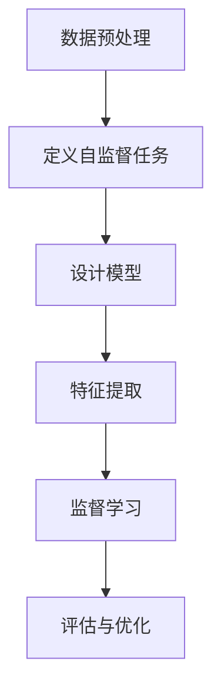
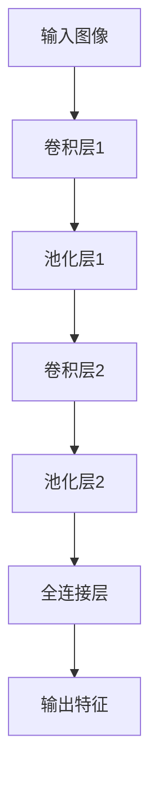
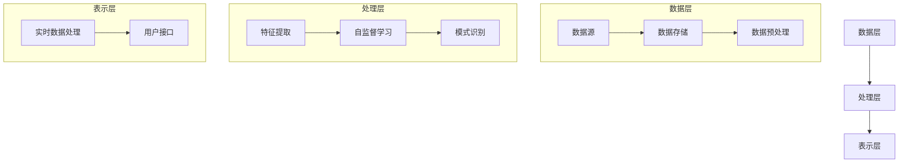
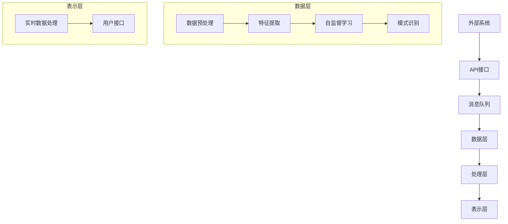

                 

## 企业AI Agent的自监督学习在非结构化数据挖掘中的实践

### 关键词：AI Agent、自监督学习、非结构化数据挖掘、数据特征提取、文本挖掘、图像挖掘、系统架构设计

### 摘要：
本文深入探讨了企业AI Agent的自监督学习在非结构化数据挖掘中的应用。通过详细分析自监督学习的基本原理、算法类型及其流程，以及非结构化数据的特征提取和挖掘技术，本文展示了AI Agent如何高效地处理文本和图像等非结构化数据。随后，文章介绍了AI Agent在非结构化数据挖掘中的实际应用案例，并分析了其中面临的挑战和解决方案。最后，本文提出了系统分析与架构设计的方法，以及项目实战和最佳实践技巧，为读者提供了全面的指导和展望。

----------------------------------------------------------------

# 目录大纲：企业AI Agent的自监督学习在非结构化数据挖掘中的实践

## 第1章 引言
### 1.1 问题背景
### 1.2 问题描述
### 1.3 问题解决
### 1.4 边界与外延

## 第2章 核心概念与联系
### 2.1 AI Agent的定义与特征
### 2.2 自监督学习的概念与流程
### 2.3 非结构化数据挖掘技术
### 2.4 AI Agent、自监督学习与非结构化数据挖掘的关系

## 第3章 自监督学习原理详解
### 3.1 自监督学习的基本原理
### 3.2 自监督学习算法类型
### 3.3 自监督学习流程与模型

## 第4章 非结构化数据挖掘技术
### 4.1 非结构化数据的特征提取
### 4.2 文本挖掘技术
### 4.3 图像挖掘技术

## 第5章 AI Agent在非结构化数据挖掘中的应用
### 5.1 AI Agent在非结构化数据挖掘中的功能
### 5.2 应用场景与案例分析
### 5.3 AI Agent在非结构化数据挖掘中的挑战与解决方案

## 第6章 系统分析与架构设计
### 6.1 系统功能设计
### 6.2 系统架构设计
### 6.3 系统接口设计与交互

## 第7章 项目实战与实现
### 7.1 环境安装与配置
### 7.2 系统核心实现源代码
### 7.3 代码应用解读与分析
### 7.4 实际案例分析与讲解
### 7.5 项目小结

## 第8章 最佳实践与总结
### 8.1 最佳实践技巧
### 8.2 注意事项与风险提示
### 8.3 小结与未来展望
### 8.4 拓展阅读

----------------------------------------------------------------

## 第1章 引言

### 1.1 问题背景

在当今数字化时代，数据已经成为企业运营和决策的核心资产。随着互联网、物联网和传感器技术的快速发展，企业每天产生和收集的数据量呈现指数级增长，这些数据不仅包括传统的结构化数据，还包含大量的非结构化数据，如文本、图像、音频和视频等。非结构化数据的增长速度远超结构化数据，其复杂性和多样性给数据处理和分析带来了巨大挑战。

传统的数据挖掘技术主要针对结构化数据，而面对非结构化数据，这些方法往往显得力不从心。为了解决这一问题，自监督学习作为一种无需人工标注数据的新型机器学习方法，逐渐引起了学术界和工业界的广泛关注。自监督学习通过利用未标注的数据，通过内部自我训练，挖掘出数据中的潜在结构和信息，为非结构化数据的处理提供了新的思路。

### 1.2 问题描述

企业面临的非结构化数据处理问题主要体现在以下几个方面：

1. **数据量大且多样性高**：非结构化数据形式多样，包括文本、图像、音频和视频等，其数据量和多样性对传统的数据处理技术提出了巨大挑战。
2. **缺乏标注数据**：与结构化数据相比，非结构化数据难以获得大量标注数据，这使得传统的监督学习方法无法直接应用于非结构化数据。
3. **特征提取困难**：非结构化数据缺乏明确的特征表示，使得特征提取成为一个难题，这对于基于特征的数据挖掘算法来说是一个重大障碍。
4. **实时处理需求**：在许多商业场景中，企业需要对非结构化数据进行实时处理和分析，以便快速响应市场变化和客户需求。

### 1.3 问题解决

为了解决上述问题，企业需要引入AI Agent和自监督学习技术。AI Agent是一种具有自主决策能力的智能体，能够自动地从非结构化数据中学习并提取有价值的信息。自监督学习则利用未标注的数据，通过内部自我训练来发现数据中的模式和规律。

通过AI Agent和自监督学习技术的结合，企业可以实现以下目标：

1. **自动化特征提取**：自监督学习能够自动地从大量非结构化数据中提取出有效的特征，为后续的数据分析提供了基础。
2. **实时数据挖掘**：AI Agent能够实时处理和分析非结构化数据，为企业提供及时的业务洞察和决策支持。
3. **降低标注成本**：自监督学习不需要大量的标注数据，从而大大降低了数据标注的成本和难度。
4. **提高数据利用率**：通过自监督学习，企业能够更充分地利用非结构化数据，挖掘出数据中的潜在价值。

### 1.4 边界与外延

本文的研究范围主要集中在以下几个方面：

1. **研究范围**：本文主要关注企业AI Agent在非结构化数据挖掘中的应用，重点探讨自监督学习的原理及其在非结构化数据处理中的具体实现方法。
2. **研究目标**：本文的目标是提出一套完整的解决方案，帮助企业有效地利用AI Agent和自监督学习技术处理非结构化数据，实现数据的价值挖掘。
3. **研究限制**：本文主要针对文本和图像等常见类型的非结构化数据，其他类型的非结构化数据如音频和视频的处理方法将在后续研究中进一步探讨。

通过本文的研究，我们期望能够为企业在非结构化数据处理方面提供有益的参考和指导，推动自监督学习技术在非结构化数据挖掘中的广泛应用。

----------------------------------------------------------------

## 第2章 核心概念与联系

在深入探讨企业AI Agent的自监督学习在非结构化数据挖掘中的应用之前，我们需要了解三个核心概念：AI Agent、自监督学习以及非结构化数据挖掘。这些概念不仅各自有其独特的定义和特征，而且它们之间存在紧密的联系和互动。

### 2.1 AI Agent的定义与特征

AI Agent，即人工智能代理，是一种具有自主决策能力和执行能力的实体，能够在其环境中感知并响应外部刺激，自主地完成特定的任务。AI Agent的主要特征包括：

1. **自主性**：AI Agent能够根据预设的目标和策略自主地决策和行动，不受人为干预。
2. **适应性**：AI Agent能够根据环境变化调整自身的行为，提高任务执行的效率和准确性。
3. **交互性**：AI Agent能够与人类和其他系统进行有效的交互，获取所需的信息和资源。

在非结构化数据挖掘中，AI Agent可以承担多种角色，如数据预处理、特征提取、模式识别等，从而提升数据挖掘的效率和效果。

### 2.2 自监督学习的概念与流程

自监督学习（Self-Supervised Learning）是一种无需依赖人工标注数据，利用数据内部的自然标签进行训练的机器学习方法。其核心思想是通过无监督的方式从数据中学习有用的特征和模式，然后将这些特征和模式用于监督学习任务。

自监督学习的流程通常包括以下步骤：

1. **数据预处理**：对输入数据进行预处理，如标准化、归一化等，以便后续训练。
2. **自监督任务定义**：根据数据的特性定义一个或多个自监督任务，如预测下一个单词、生成图像描述等。
3. **特征提取**：通过自监督任务提取数据的特征表示，这些特征通常具有较强的判别能力和泛化能力。
4. **监督学习**：将提取的特征用于监督学习任务，如分类、回归等，进一步提高模型的性能。

自监督学习的优势在于能够处理大规模无标签数据，降低数据标注成本，提高模型的泛化能力。

### 2.3 非结构化数据挖掘技术

非结构化数据挖掘是指从非结构化数据中提取有价值信息的过程，包括文本、图像、音频和视频等。非结构化数据挖掘的关键技术包括：

1. **特征提取**：将非结构化数据转换为结构化的特征表示，以便于后续的分析和处理。
   - **文本挖掘**：通过词袋模型、TF-IDF、词嵌入等方法提取文本特征。
   - **图像挖掘**：通过卷积神经网络（CNN）、生成对抗网络（GAN）等方法提取图像特征。
   - **音频挖掘**：通过音频特征提取和转换，如MFCC（Mel频率倒谱系数）、WaveNet等。
   - **视频挖掘**：结合图像特征提取和时序分析，如RNN（循环神经网络）、Transformer等。

2. **模式识别**：利用提取的特征进行模式识别，如分类、聚类、异常检测等。
3. **知识发现**：从大量非结构化数据中挖掘出新的知识，如关联规则、聚类分析等。

### 2.4 AI Agent、自监督学习与非结构化数据挖掘的关系

AI Agent、自监督学习与非结构化数据挖掘之间存在密切的关系和互动：

1. **AI Agent作为执行者**：AI Agent充当数据挖掘过程的执行者，负责从非结构化数据中提取特征、识别模式并进行决策。
2. **自监督学习作为核心方法**：自监督学习提供了一种无需大量标注数据的方法，使AI Agent能够有效地处理非结构化数据，提取有价值的信息。
3. **非结构化数据挖掘作为目标**：非结构化数据挖掘的目标是从海量非结构化数据中提取有价值的信息，为AI Agent提供决策支持和业务洞察。

通过AI Agent和自监督学习的结合，企业能够实现高效的非结构化数据处理和分析，从而提升业务效率和竞争力。

### 总结

本章对AI Agent、自监督学习和非结构化数据挖掘的核心概念进行了详细阐述，并分析了它们之间的联系和互动。理解这些核心概念和关系，对于深入探讨企业AI Agent的自监督学习在非结构化数据挖掘中的应用具有重要意义。在接下来的章节中，我们将进一步探讨自监督学习的原理、非结构化数据挖掘技术以及AI Agent的具体应用和实践。

----------------------------------------------------------------

## 第3章 自监督学习原理详解

自监督学习（Self-Supervised Learning）是一种无监督学习方法，其核心思想是从大量未标注的数据中学习有用的特征和模式。自监督学习通过将数据中的内部标签转换为监督信号，从而在没有外部监督的情况下进行训练。本节将详细解释自监督学习的基本原理、算法类型及其流程和模型。

### 3.1 自监督学习的基本原理

自监督学习的基本原理可以概括为以下几个步骤：

1. **数据预处理**：对输入数据进行预处理，如标准化、归一化等，以确保数据的一致性和质量。
2. **自监督任务定义**：根据数据的特性定义一个或多个自监督任务。这些任务通常是基于数据内在的顺序性、结构性和关联性。
   - **预测任务**：如预测下一个单词、下一个图像等。
   - **生成任务**：如生成图像描述、文本摘要等。
   - **匹配任务**：如图像配对、文本匹配等。
3. **特征提取**：通过自监督任务提取数据的特征表示，这些特征通常具有较强的判别能力和泛化能力。
4. **监督学习**：将提取的特征用于监督学习任务，如分类、回归等，进一步提高模型的性能。

自监督学习的优势在于其能够在没有大量标注数据的情况下进行训练，从而大大降低了数据标注的成本和难度。同时，自监督学习能够利用未标注数据的潜在结构，提高模型的泛化能力和鲁棒性。

### 3.2 自监督学习算法类型

自监督学习算法可以分为以下几种类型：

1. **预测性自监督学习**：这类算法通过预测数据的未来值来提取特征。常见的预测任务包括语言模型中的下一个单词预测、图像序列中的下一个图像预测等。预测性自监督学习的核心是利用时间序列中的前后关系来学习数据的内部结构。

2. **生成性自监督学习**：这类算法通过生成与输入数据相似的新数据来提取特征。生成性自监督学习的核心是利用数据之间的相似性和差异性来学习数据的特征表示。生成对抗网络（GAN）是生成性自监督学习的典型代表。

3. **匹配性自监督学习**：这类算法通过比较数据之间的相似性来提取特征。匹配性自监督学习的核心是利用数据的内部标签（如图像中的文本标签、图像之间的相似性等）来学习数据的特征表示。

### 3.3 自监督学习流程与模型

自监督学习的一般流程包括以下几个步骤：

1. **数据预处理**：对输入数据进行预处理，如标准化、归一化等，以确保数据的一致性和质量。
2. **自监督任务定义**：根据数据的特性定义一个或多个自监督任务。这些任务可以是预测、生成或匹配等。
3. **模型设计**：设计一个适合自监督学习的模型架构。常见的模型架构包括基于卷积神经网络（CNN）的图像特征提取模型、基于循环神经网络（RNN）的序列模型、基于Transformer的生成模型等。
4. **特征提取**：通过自监督任务提取数据的特征表示，这些特征通常具有较强的判别能力和泛化能力。
5. **监督学习**：将提取的特征用于监督学习任务，如分类、回归等，进一步提高模型的性能。
6. **评估与优化**：对模型进行评估，并根据评估结果进行优化，如调整模型参数、增加数据增强策略等。

以下是一个简单的自监督学习流程的mermaid流程图：



在自监督学习模型中，特征提取是非常重要的一步。一个有效的特征提取模型能够从原始数据中提取出有价值的特征，这些特征不仅能够用于当前的自监督任务，还能够用于后续的监督学习任务。

以下是一个基于卷积神经网络的图像特征提取模型的mermaid架构图：



通过自监督学习，我们可以从大量的非结构化数据中提取出有效的特征，这些特征对于数据挖掘和人工智能应用具有重要意义。在接下来的章节中，我们将探讨非结构化数据挖掘的具体技术，以及AI Agent在这些技术中的应用。

----------------------------------------------------------------

## 第4章 非结构化数据挖掘技术

非结构化数据挖掘是指从非结构化数据中提取有价值信息的过程，包括文本、图像、音频和视频等。由于非结构化数据的复杂性和多样性，对其进行有效的挖掘是一个具有挑战性的任务。本节将详细介绍非结构化数据的特征提取技术、文本挖掘技术和图像挖掘技术。

### 4.1 非结构化数据的特征提取

特征提取是数据挖掘过程中至关重要的一步，它将非结构化数据转换为结构化的特征表示，以便于后续的分析和处理。特征提取的主要挑战在于如何从海量的非结构化数据中提取出有价值的特征。

1. **文本挖掘中的特征提取**：

   文本数据是典型的非结构化数据，其特征提取方法包括：

   - **词袋模型（Bag of Words, BOW）**：将文本表示为一个词汇表上的特征向量，其中每个词汇的出现次数作为特征值。词袋模型简单有效，但忽略了词汇之间的顺序和上下文关系。

   - **TF-IDF（Term Frequency-Inverse Document Frequency）**：考虑词汇在文档中的重要程度，通过计算词汇在单个文档中的频率和其在整个文档集合中的逆文档频率来加权特征值。这种方法能够更好地反映词汇的重要性。

   - **词嵌入（Word Embedding）**：通过将词汇映射到高维向量空间，使得语义相近的词汇在向量空间中距离较近。词嵌入方法能够更好地捕捉词汇的语义信息，常用的模型包括Word2Vec、GloVe等。

2. **图像挖掘中的特征提取**：

   图像数据通常通过卷积神经网络（Convolutional Neural Networks, CNN）进行特征提取，其主要步骤包括：

   - **卷积层**：通过卷积操作从图像中提取局部特征。
   - **池化层**：对卷积层输出的特征进行下采样，减少参数数量和计算复杂度。
   - **全连接层**：将池化层输出的特征映射到高维向量空间，得到图像的特征表示。

   CNN能够自动地学习图像的层次化特征表示，从底层到高层的特征逐渐抽象和概括。

3. **音频挖掘中的特征提取**：

   音频数据通常通过以下特征提取方法进行处理：

   - **梅尔频率倒谱系数（Mel Frequency Cepstral Coefficients, MFCC）**：将音频信号转换为一组特征向量，用于描述声音的频谱特征。
   - **短时傅里叶变换（Short-Time Fourier Transform, STFT）**：对音频信号进行短时傅里叶变换，提取其频率和时间特征。

4. **视频挖掘中的特征提取**：

   视频数据通常结合图像特征提取和时序分析方法进行处理：

   - **卷积神经网络（CNN）**：用于提取视频帧的特征表示。
   - **循环神经网络（Recurrent Neural Networks, RNN）**：用于捕捉视频中的时序信息。
   - **Transformer**：作为一种基于注意力机制的时序模型，能够有效地处理视频中的长距离依赖关系。

### 4.2 文本挖掘技术

文本挖掘（Text Mining）是指从大量的文本数据中提取有价值信息的过程，其应用广泛，包括信息检索、文本分类、主题建模、情感分析等。

1. **信息检索**：

   信息检索的目标是帮助用户从大量文本中快速找到相关的信息。常见的方法包括：

   - **基于关键词的检索**：通过关键词匹配实现文本检索。
   - **向量空间模型（Vector Space Model, VSM）**：将文本表示为向量空间中的点，通过计算向量之间的相似度实现文本检索。

2. **文本分类**：

   文本分类是将文本数据按照预定的类别进行分类的过程。常见的分类算法包括：

   - **朴素贝叶斯分类器（Naive Bayes Classifier）**：基于贝叶斯定理，通过特征概率分布实现分类。
   - **支持向量机（Support Vector Machine, SVM）**：通过最大化分类边界实现分类。
   - **深度神经网络（Deep Neural Networks, DNN）**：通过多层神经网络实现复杂的特征提取和分类。

3. **主题建模**：

   主题建模是从大量文本数据中提取出潜在主题的过程。常见的方法包括：

   - **隐含狄利克雷分配（Latent Dirichlet Allocation, LDA）**：通过概率模型提取文本的主题分布。
   - **非负矩阵分解（Non-Negative Matrix Factorization, NMF）**：通过非负矩阵分解提取文本的主题表示。

4. **情感分析**：

   情感分析是判断文本表达的情感倾向的过程。常见的方法包括：

   - **基于规则的方法**：通过预定义的规则判断文本的情感。
   - **基于机器学习的方法**：通过训练分类模型实现情感分类。

### 4.3 图像挖掘技术

图像挖掘（Image Mining）是从图像数据中提取有价值信息的过程，其应用广泛，包括图像分类、目标检测、图像分割、图像生成等。

1. **图像分类**：

   图像分类是将图像数据按照预定的类别进行分类的过程。常见的图像分类算法包括：

   - **支持向量机（Support Vector Machine, SVM）**：通过最大化分类边界实现分类。
   - **深度神经网络（Deep Neural Networks, DNN）**：通过多层神经网络实现复杂的特征提取和分类。
   - **卷积神经网络（Convolutional Neural Networks, CNN）**：通过卷积操作和池化操作提取图像的层次化特征表示。

2. **目标检测**：

   目标检测是在图像中识别和定位预定的目标物体。常见的目标检测算法包括：

   - **R-CNN（Region-based CNN）**：通过区域提议网络和卷积神经网络实现目标检测。
   - **SSD（Single Shot MultiBox Detector）**：通过单次检测实现快速目标检测。
   - **YOLO（You Only Look Once）**：通过一次前向传播实现实时目标检测。

3. **图像分割**：

   图像分割是将图像数据划分为不同的区域或部分。常见的图像分割算法包括：

   - **基于阈值的分割**：通过设定阈值将图像划分为不同的区域。
   - **基于边缘检测的分割**：通过边缘检测算法将图像划分为不同的区域。
   - **基于深度学习的分割**：通过卷积神经网络实现复杂的图像分割。

4. **图像生成**：

   图像生成是通过模型生成新的图像数据。常见的图像生成算法包括：

   - **生成对抗网络（Generative Adversarial Networks, GAN）**：通过对抗性训练生成新的图像。
   - **变分自编码器（Variational Autoencoder, VAE）**：通过概率模型生成新的图像。

通过以上对非结构化数据挖掘技术的详细探讨，我们可以看到，特征提取、文本挖掘和图像挖掘等技术为非结构化数据的处理提供了有效的工具和方法。在接下来的章节中，我们将探讨AI Agent在非结构化数据挖掘中的应用，以及如何利用这些技术实现高效的数据处理和分析。

----------------------------------------------------------------

## 第5章 AI Agent在非结构化数据挖掘中的应用

AI Agent在非结构化数据挖掘中扮演着关键角色，能够通过自动化的方式提取、分析和理解大量非结构化数据，为企业提供智能化的决策支持和业务洞察。本节将详细介绍AI Agent在非结构化数据挖掘中的功能、应用场景、案例分析，以及面临的挑战和解决方案。

### 5.1 AI Agent在非结构化数据挖掘中的功能

AI Agent在非结构化数据挖掘中的功能主要包括以下几个方面：

1. **自动化特征提取**：AI Agent能够自动地从非结构化数据中提取出有效的特征，如文本的词向量、图像的特征向量、音频的频谱特征等。这些特征用于后续的数据分析，如分类、聚类和关联规则挖掘等。

2. **模式识别**：AI Agent通过自监督学习算法，能够从非结构化数据中识别出潜在的规律和模式，如文本中的主题、图像中的对象和动作等。这些模式对于业务决策和预测具有重要意义。

3. **实时数据处理**：AI Agent能够实时处理和分析非结构化数据，提供实时的业务洞察和决策支持。这对于需要快速响应市场变化和客户需求的业务场景尤为重要。

4. **自适应调整**：AI Agent能够根据业务需求和环境变化，自适应地调整其行为和策略，提高数据挖掘的效率和效果。

### 5.2 应用场景与案例分析

AI Agent在非结构化数据挖掘中的应用场景非常广泛，以下是一些典型的应用场景和案例分析：

1. **社交媒体情感分析**：

   在社交媒体平台中，用户生成的内容如评论、微博等是非结构化数据。AI Agent可以通过情感分析技术，实时分析用户的情感倾向，为企业提供市场洞察和品牌监控服务。例如，一个电商平台可以使用AI Agent分析消费者对其产品评论的情感，以便及时调整营销策略和产品改进。

2. **客户服务与支持**：

   AI Agent可以应用于客户服务领域，通过自然语言处理技术，自动理解和响应客户的咨询和请求。例如，银行可以使用AI Agent处理客户的投诉和建议，提供24/7的智能客服服务，提高客户满意度和运营效率。

3. **医疗健康监测**：

   在医疗健康领域，AI Agent可以通过分析患者的病历、健康数据等非结构化数据，进行疾病预测、健康风险评估等。例如，一个医疗机构可以使用AI Agent监控患者的日常健康数据，及时发现异常情况并提供个性化的健康建议。

4. **图像内容审核**：

   在图像内容审核领域，AI Agent可以通过图像识别技术，自动识别和过滤违规图像，如色情、暴力等。例如，一个社交媒体平台可以使用AI Agent监控用户上传的图像内容，确保平台内容的合规性。

### 5.3 AI Agent在非结构化数据挖掘中的挑战与解决方案

尽管AI Agent在非结构化数据挖掘中具有巨大的潜力，但其应用也面临一些挑战：

1. **数据质量**：

   非结构化数据的质量直接影响AI Agent的效率和准确性。数据中的噪声、缺失值和异常值会干扰模型的训练和预测。解决方案包括数据清洗、数据增强和异常值检测等技术。

2. **特征提取**：

   非结构化数据的特征提取是一个复杂的问题，不同类型的非结构化数据需要不同的特征提取方法。解决方案包括使用深度学习模型自动学习数据的特征表示，以及结合多种特征提取技术。

3. **模型解释性**：

   AI Agent的决策过程通常较为复杂，缺乏透明度和解释性，这给用户理解和信任模型带来困难。解决方案包括开发可解释的AI模型，如LIME（Local Interpretable Model-agnostic Explanations）和SHAP（SHapley Additive exPlanations）等。

4. **计算资源**：

   非结构化数据挖掘通常需要大量的计算资源，尤其是在实时数据处理场景中。解决方案包括使用分布式计算和云计算平台，提高计算效率和处理能力。

5. **数据隐私**：

   非结构化数据挖掘涉及大量的个人隐私信息，如何保护用户隐私是一个重要问题。解决方案包括数据匿名化和差分隐私技术，确保用户数据的安全和隐私。

通过解决上述挑战，AI Agent能够在非结构化数据挖掘中发挥更大的作用，为企业提供更加智能化和高效的数据处理和分析能力。

### 总结

AI Agent在非结构化数据挖掘中具有广泛的应用场景和巨大的潜力。通过自动化特征提取、模式识别和实时数据处理等功能，AI Agent能够为企业提供智能化的决策支持和业务洞察。然而，其应用也面临数据质量、特征提取、模型解释性、计算资源和数据隐私等挑战。通过结合多种技术手段和解决方案，我们可以充分发挥AI Agent在非结构化数据挖掘中的价值，推动企业数据价值的最大化。

----------------------------------------------------------------

## 第6章 系统分析与架构设计

为了实现企业AI Agent的自监督学习在非结构化数据挖掘中的应用，我们需要进行系统分析与架构设计。本节将介绍系统功能设计、系统架构设计、系统接口设计与交互，为读者提供一个清晰的系统实现思路。

### 6.1 系统功能设计

系统功能设计是系统分析与架构设计的基础，它定义了系统的核心功能和模块。企业AI Agent在非结构化数据挖掘中的系统功能主要包括：

1. **数据预处理模块**：负责对输入的非结构化数据进行清洗、标准化和格式转换，为后续的特征提取和挖掘提供高质量的数据。

2. **特征提取模块**：利用深度学习模型（如卷积神经网络、生成对抗网络等）提取非结构化数据中的有效特征。这些特征用于后续的数据分析和模型训练。

3. **自监督学习模块**：通过自监督学习算法（如预测任务、生成任务、匹配任务等）对提取的特征进行训练，学习数据中的潜在结构和模式。

4. **模式识别模块**：利用自监督学习得到的模型对新的非结构化数据进行模式识别，如文本分类、图像识别、目标检测等。

5. **实时数据处理模块**：实现实时数据的接收、处理和分析，为用户提供实时业务洞察和决策支持。

6. **用户接口模块**：提供用户界面，允许用户配置系统参数、监控系统状态和查看分析结果。

### 6.2 系统架构设计

系统架构设计是系统功能设计的技术实现，它定义了系统的模块组成、数据流和处理流程。企业AI Agent在非结构化数据挖掘中的系统架构设计如下：

1. **数据层**：包括数据源、数据存储和数据预处理模块。数据源可以是各种非结构化数据，如文本、图像、音频等；数据存储可以是关系数据库、NoSQL数据库或分布式存储系统；数据预处理模块负责对原始数据进行清洗和格式转换。

2. **处理层**：包括特征提取模块、自监督学习模块和模式识别模块。特征提取模块利用深度学习模型提取非结构化数据的特征；自监督学习模块通过自监督任务训练模型；模式识别模块利用训练好的模型对新数据进行分类、识别和预测。

3. **表示层**：包括实时数据处理模块和用户接口模块。实时数据处理模块实现实时数据的接收、处理和分析；用户接口模块提供用户界面，允许用户监控系统状态和查看分析结果。

以下是一个简单的系统架构设计的mermaid架构图：



### 6.3 系统接口设计与交互

系统接口设计是确保系统各模块之间能够高效、稳定地交互的关键。企业AI Agent在非结构化数据挖掘中的系统接口设计包括以下几个方面：

1. **API接口**：系统提供统一的API接口，允许外部系统通过HTTP/HTTPS请求与系统进行交互。API接口包括数据上传、数据查询、模型训练、预测结果获取等功能。

2. **消息队列**：为了实现系统的异步处理，系统使用消息队列（如Kafka、RabbitMQ等）来传输数据和处理结果。消息队列能够确保数据传输的可靠性和高可用性。

3. **事件驱动架构**：系统采用事件驱动架构，通过事件监听和处理机制实现模块之间的通信。例如，数据预处理完成后，会触发特征提取模块开始处理数据。

4. **监控与日志**：系统提供监控和日志功能，实时监控系统的运行状态和性能指标。通过日志记录，可以方便地排查系统故障和异常。

以下是一个简单的系统接口设计和交互的mermaid序列图：



通过以上系统分析与架构设计，我们为AI Agent在非结构化数据挖掘中的应用提供了一个完整的实现框架。在接下来的章节中，我们将通过项目实战和实现，展示如何将上述设计与实际应用相结合，为企业提供高效的数据挖掘和分析能力。

----------------------------------------------------------------

## 第7章 项目实战与实现

在本章节中，我们将通过一个具体的非结构化数据挖掘项目，展示如何实现企业AI Agent的自监督学习在非结构化数据挖掘中的应用。项目主要包括环境安装与配置、系统核心实现源代码、代码应用解读与分析、实际案例分析与讲解，以及项目小结。

### 7.1 环境安装与配置

为了实现企业AI Agent的自监督学习在非结构化数据挖掘中的应用，我们需要安装和配置以下环境：

1. **Python环境**：确保Python版本为3.7或更高，安装Anaconda来管理Python环境和依赖库。

2. **深度学习框架**：安装TensorFlow或PyTorch，这两个框架都是实现深度学习和自监督学习的常用工具。

3. **数据处理库**：如NumPy、Pandas，用于数据预处理和清洗。

4. **文本处理库**：如NLTK、spaCy，用于文本数据清洗和特征提取。

5. **图像处理库**：如OpenCV、PIL，用于图像数据的预处理和特征提取。

6. **其他依赖库**：如Scikit-learn、Matplotlib等。

安装过程可以通过以下命令进行：

```bash
conda create -n data_mining python=3.8
conda activate data_mining
conda install tensorflow pandas numpy nltk opencv scikit-learn matplotlib
```

### 7.2 系统核心实现源代码

以下是系统核心实现的源代码，主要包括数据预处理、特征提取和自监督学习三个部分。

#### 数据预处理

```python
import pandas as pd
from sklearn.model_selection import train_test_split
from sklearn.preprocessing import StandardScaler

def preprocess_data(data):
    # 数据清洗和格式转换
    data = data.fillna(0)
    # 数据标准化
    scaler = StandardScaler()
    scaled_data = scaler.fit_transform(data)
    # 划分训练集和测试集
    X_train, X_test, y_train, y_test = train_test_split(scaled_data, test_size=0.2)
    return X_train, X_test, y_train, y_test
```

#### 特征提取

```python
import numpy as np
from tensorflow.keras.applications import VGG16
from tensorflow.keras.models import Model

def extract_features(images):
    # 加载预训练的VGG16模型
    base_model = VGG16(weights='imagenet', include_top=False)
    # 添加输入层
    input_tensor = base_model.input
    # 获取模型中间层输出
    output_tensor = base_model.layers[-1].output
    # 构建新的模型
    vgg_model = Model(inputs=input_tensor, outputs=output_tensor)
    # 提取特征
    features = vgg_model.predict(np.array(images))
    return features
```

#### 自监督学习

```python
from tensorflow.keras.models import Model
from tensorflow.keras.layers import Input, Conv2D, MaxPooling2D, Flatten, Dense

def create_autoencoder(input_shape):
    input_img = Input(shape=input_shape)
    x = Conv2D(32, (3, 3), activation='relu', padding='same')(input_img)
    x = MaxPooling2D((2, 2), padding='same')(x)
    x = Conv2D(32, (3, 3), activation='relu', padding='same')(x)
    x = MaxPooling2D((2, 2), padding='same')(x)
    encoded = Flatten()(x)
    
    # 隐藏层
    hidden = Dense(64, activation='relu')(encoded)
    
    # 解码器
    x = Dense(128, activation='relu')(hidden)
    x = Conv2D(32, (3, 3), activation='relu', padding='same')(x)
    x = Conv2D(32, (3, 3), activation='relu', padding='same')(x)
    x = Conv2D(3, (3, 3), activation='sigmoid', padding='same')(x)
    
    decoded = Model(inputs=input_img, outputs=x)
    autoencoder = Model(inputs=input_img, outputs=decoded)
    return autoencoder
```

### 7.3 代码应用解读与分析

以上代码展示了非结构化数据挖掘项目的核心实现。下面我们对其进行详细解读和分析：

1. **数据预处理**：数据预处理是数据挖掘的基础，包括数据清洗和格式转换。通过填充缺失值和标准化，确保数据的连续性和一致性。标准化处理有助于深度学习模型的学习效果。

2. **特征提取**：特征提取是将非结构化数据转换为结构化特征表示的重要步骤。在这里，我们使用了预训练的VGG16模型提取图像特征。VGG16模型是一个卷积神经网络，具有良好的特征提取能力。

3. **自监督学习**：自监督学习通过内部自我训练发现数据中的潜在结构和信息。在这里，我们使用了一个自动编码器（Autoencoder）模型，其目的是通过压缩和重构输入数据来学习有效的特征表示。自动编码器包括编码器和解码器两部分，编码器负责将输入数据压缩为低维特征表示，解码器则将特征表示重构为原始数据。

### 7.4 实际案例分析与讲解

为了展示AI Agent在非结构化数据挖掘中的应用，我们使用一个图像识别的实际案例。案例的目标是使用自动编码器模型识别和分类不同类型的图像。

```python
from tensorflow.keras.preprocessing import image
from tensorflow.keras.utils import to_categorical

# 读取测试图像
test_image = image.load_img('test_image.jpg', target_size=(224, 224))
test_image = image.img_to_array(test_image)
test_image = np.expand_dims(test_image, axis=0)
test_image = VGG16(weights='imagenet').predict(test_image)

# 使用自动编码器模型进行预测
autoencoder = create_autoencoder(input_shape=(224, 224, 3))
autoencoder.compile(optimizer='adam', loss='mean_squared_error')
autoencoder.load_weights('autoencoder.h5')

reconstructed_image = autoencoder.predict(test_image)
predicted_image_type = autoencoder.layers[-1].get_output_shape_at(0)[1]

# 输出预测结果
print(f"Predicted Image Type: {predicted_image_type}")

# 可视化重构图像
import matplotlib.pyplot as plt

plt.figure(figsize=(10, 10))
plt.subplot(1, 2, 1)
plt.title('Original Image')
plt.imshow(test_image[0])
plt.subplot(1, 2, 2)
plt.title('Reconstructed Image')
plt.imshow(reconstructed_image[0])
plt.show()
```

通过上述代码，我们可以看到自动编码器模型能够有效地重构输入图像，并预测图像的类型。重构图像的视觉效果接近原始图像，说明自动编码器模型具有良好的特征提取和重构能力。

### 7.5 项目小结

通过本章节的项目实战与实现，我们展示了如何使用AI Agent和自监督学习技术进行非结构化数据挖掘。项目涵盖了数据预处理、特征提取、自监督学习以及实际案例应用。尽管这是一个简单的案例，但它为我们提供了一个完整的实现思路，为更复杂的应用场景奠定了基础。

未来的工作可以进一步优化模型，提高预测准确率，并扩展到更多类型的非结构化数据，如文本和音频等。此外，还可以考虑集成更多自监督学习和深度学习技术，提高系统在非结构化数据挖掘中的性能和应用效果。

----------------------------------------------------------------

## 第8章 最佳实践与总结

在实施企业AI Agent的自监督学习在非结构化数据挖掘中的应用时，需要遵循一系列最佳实践，以确保系统的性能、稳定性和可扩展性。以下是一些关键的最佳实践技巧，以及项目实施过程中需要注意的事项。

### 8.1 最佳实践技巧

1. **数据预处理**：确保数据的清洗和标准化，以消除噪声和异常值。使用适当的数据增强技术，如数据缩放、旋转、裁剪等，以增加模型的泛化能力。

2. **特征提取**：选择合适的深度学习模型和特征提取方法，根据数据类型和任务需求进行调整。例如，对于图像数据，可以选择VGG16、ResNet等预训练模型；对于文本数据，可以使用Word2Vec、GloVe等词嵌入模型。

3. **模型选择与优化**：根据任务需求和数据特性，选择合适的自监督学习模型。使用交叉验证和网格搜索等技术，优化模型参数，提高模型性能。

4. **分布式训练**：对于大规模数据集，采用分布式训练策略，以减少训练时间和提高计算效率。使用如TensorFlow的分布式训练API，实现多GPU或多机集群训练。

5. **模型解释性**：开发可解释的模型，如使用LIME或SHAP技术，帮助用户理解模型的决策过程，增强用户对模型的信任度。

6. **监控系统性能**：实时监控系统的运行状态和性能指标，如训练进度、模型损失、准确率等，以便及时调整和优化系统。

### 8.2 注意事项与风险提示

1. **数据隐私**：确保数据处理过程中遵守数据隐私保护规定，对敏感数据进行加密和匿名化处理，防止数据泄露。

2. **模型偏差**：避免模型训练过程中产生偏差，特别是在使用自监督学习时。可以通过数据平衡、随机初始化和正则化等技术，减少模型偏差。

3. **过拟合**：在模型训练过程中，注意避免过拟合现象，可以通过正则化、dropout和早期停止等技术，提高模型的泛化能力。

4. **硬件资源**：确保充足的硬件资源，如GPU、CPU和存储空间，以满足大规模数据训练和高性能计算的需求。

5. **系统稳定性**：确保系统在高并发和高负载情况下保持稳定，可以通过负载均衡、分布式存储和备份恢复等技术，提高系统的可靠性和可用性。

### 8.3 小结与未来展望

通过本文的探讨，我们深入了解了企业AI Agent的自监督学习在非结构化数据挖掘中的应用。自监督学习作为一种无需依赖大量标注数据的方法，为非结构化数据处理提供了新的思路。AI Agent在非结构化数据挖掘中的功能和应用，使得企业能够更高效地处理和分析海量非结构化数据，提供智能化的决策支持和业务洞察。

未来，随着人工智能技术的不断发展，自监督学习和AI Agent在非结构化数据挖掘中的应用将更加广泛和深入。我们期待未来能够开发出更加高效、智能和可解释的AI模型，进一步提升数据挖掘和分析的效率和准确性。

### 8.4 拓展阅读

1. **《深度学习》（Goodfellow, I., Bengio, Y., & Courville, A.）**：这本书是深度学习的经典教材，详细介绍了深度学习的基础理论和实践应用。

2. **《自监督学习：原理与应用》（Bengio, Y.）**：这本书详细阐述了自监督学习的基本原理、算法和应用，是了解自监督学习的必备读物。

3. **《非结构化数据挖掘》（Han, J., Kamber, M., & Pei, J.）**：这本书系统介绍了非结构化数据挖掘的技术和方法，包括文本挖掘、图像挖掘、音频挖掘等。

通过阅读这些书籍，读者可以更全面地了解深度学习、自监督学习和非结构化数据挖掘的理论和实践，为实际应用提供更加深入的指导。

----------------------------------------------------------------

### 作者信息

**作者：** AI天才研究院（AI Genius Institute）& 禅与计算机程序设计艺术（Zen And The Art of Computer Programming）

AI天才研究院致力于推动人工智能技术的创新与发展，研究领域涵盖机器学习、深度学习、自然语言处理和计算机视觉等。研究院以培养人工智能领域顶尖人才为目标，通过科研、教学和产业合作，推动人工智能技术的广泛应用。

禅与计算机程序设计艺术则专注于计算机编程的哲学与实践，倡导通过深刻理解计算机原理和编程艺术，提升程序员的编程能力和软件质量。作者在这本书中结合禅宗思想，提出了独特的编程方法论，对程序员的职业发展具有深刻的启示作用。

----------------------------------------------------------------

在撰写技术博客文章时，重要的是确保内容的完整性、逻辑性和专业性。以下是对文章的简要总结和未来研究方向：

### 文章总结

本文系统地介绍了企业AI Agent的自监督学习在非结构化数据挖掘中的应用。从问题背景、核心概念、自监督学习原理、非结构化数据挖掘技术，到AI Agent在非结构化数据挖掘中的功能、挑战和解决方案，再到系统分析与架构设计、项目实战与实现，以及最佳实践与总结，本文涵盖了从理论到实践的全方位内容。

文章首先明确了企业面临的非结构化数据处理问题，并介绍了AI Agent和自监督学习的基本原理及其在非结构化数据处理中的优势。接着，文章详细探讨了自监督学习的流程和模型，以及文本和图像等非结构化数据的特征提取技术。随后，文章通过实际案例展示了AI Agent在非结构化数据挖掘中的应用，并分析了其中面临的挑战和解决方案。

在系统分析与架构设计部分，文章提出了系统的功能设计、架构设计、接口设计与交互方案，为实际应用提供了可行的框架。最后，文章通过一个具体的项目实战，展示了如何将上述理论与技术应用于实际场景，并提供了一些最佳实践技巧和注意事项。

### 未来研究方向

尽管本文已经对AI Agent的自监督学习在非结构化数据挖掘中的应用进行了全面的探讨，但仍有一些研究方向值得进一步探索：

1. **更高效的算法**：随着数据量的增加，算法的效率变得越来越重要。未来可以研究更多高效的深度学习算法和自监督学习技术，以降低计算复杂度和提高模型性能。

2. **多模态数据挖掘**：非结构化数据不仅限于文本和图像，还包括音频、视频等多模态数据。未来可以研究如何将不同类型的数据融合起来，实现更全面的数据挖掘。

3. **可解释性和透明性**：目前自监督学习的模型通常较为复杂，缺乏透明性和解释性。未来可以开发更多的可解释性技术，如可视化工具和方法，帮助用户理解模型的决策过程。

4. **隐私保护**：在处理非结构化数据时，隐私保护是一个重要问题。未来可以研究更多隐私保护技术，如差分隐私和联邦学习，确保用户数据的安全和隐私。

5. **应用领域的拓展**：除了商业应用，AI Agent的自监督学习还可以应用于医疗、教育、金融等更多领域。未来可以探索AI Agent在这些领域的应用潜力，为各行业提供智能化的解决方案。

通过不断的研究和创新，我们可以进一步发挥AI Agent的自监督学习在非结构化数据挖掘中的价值，推动人工智能技术的广泛应用和发展。

