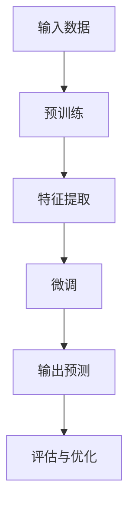
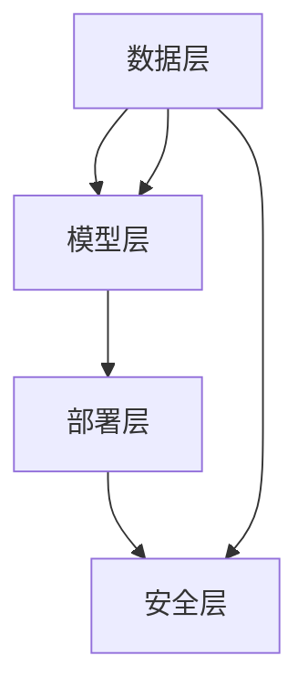

                 


## 第1章：自监督学习的概念与背景

### 1.1 自监督学习的定义

自监督学习（Self-Supervised Learning）是一种人工智能（AI）方法，它允许模型在没有外部监督标签的情况下从数据中学习。这种学习方式的核心在于，模型通过预测或生成数据中的某些部分，从而提高其性能。与传统的监督学习和无监督学习相比，自监督学习利用了数据本身的结构和内容，提高了模型的泛化能力。

在自监督学习中，数据通常被分成三个部分：一部分用于训练，一部分用于预测，另一部分用于验证。这种学习方式的优势在于它不需要大量的标签数据，这对于许多实际应用场景来说是非常有价值的。例如，在自然语言处理（NLP）中，自监督学习可以用来构建大规模的语言模型，这些模型可以用于文本分类、问答系统等多种任务。

### 1.2 自监督学习的发展历程

自监督学习的概念可以追溯到20世纪60年代，当时研究者们开始探索如何从未标记的数据中学习。早期的研究主要集中在图像处理领域，例如，通过图像对比度增强和边缘检测来提取图像特征。随着计算机硬件和算法的发展，自监督学习在21世纪初逐渐成为一个独立的研究领域，并取得了显著进展。

在2010年代，深度学习技术的发展为自监督学习带来了新的机遇。深度神经网络（DNN）在自监督学习中的应用，使得模型能够从大量未标记的数据中提取丰富的特征表示。近年来，随着数据量的增加和计算资源的提升，自监督学习在多个领域，如计算机视觉、语音识别和自然语言处理，都取得了突破性的成果。

### 1.3 自监督学习的基本原理

自监督学习的基本原理可以概括为以下三个步骤：

1. **预训练**：在大量未标记的数据上训练一个基础模型，使其能够提取数据中的结构化特征。
2. **微调**：将预训练模型在特定任务上微调，利用少量带有标签的数据进一步优化模型。
3. **应用**：将微调后的模型应用于实际任务，如分类、生成或预测。

在这个过程中，预训练阶段是关键，它使得模型能够在没有外部监督的情况下学习到有效的特征表示。微调阶段则利用任务特定的标签数据，进一步提升模型的性能。自监督学习的核心在于如何设计有效的预训练任务，使得模型能够在不同的任务中表现出良好的泛化能力。

### 1.4 自监督学习与无监督学习、监督学习的比较

自监督学习、无监督学习和监督学习是三种不同的机器学习方法，它们之间有着紧密的联系和区别。

- **无监督学习**：不使用任何标签数据，模型的目标是发现数据中的内在结构和规律。例如，聚类和降维任务就是无监督学习的典型例子。
- **监督学习**：使用带有标签的数据进行训练，模型的性能通过标签数据来衡量。分类和回归是最常见的监督学习任务。
- **自监督学习**：利用数据本身的内在结构进行学习，不需要外部标签。自监督学习结合了无监督学习和监督学习的优点，既不需要大量标签数据，又能够通过预测任务来提升模型性能。

下表展示了这三种学习方式的异同：

| 学习方式 | 数据使用 | 目标 | 标签需求 | 代表任务 |
| :------: | :------: | :---: | :------: | :------: |
| 无监督学习 | 未标记数据 | 发现内在结构 | 无标签 | 聚类、降维 |
| 自监督学习 | 未标记数据 | 预测和生成 | 无标签 | 语言模型、图像生成 |
| 监督学习 | 标记数据 | 分类和回归 | 有标签 | 图像分类、语音识别 |

### 1.5 自监督学习中的核心算法简介

自监督学习领域有许多核心算法，以下是其中几种常见的算法：

1. **预测下一个句子**：这种算法利用预训练的语言模型，从一段文本中预测下一个句子。例如，给定一个句子“我喜欢吃苹果”，模型需要预测下一个句子，如“因为它很甜”。
2. **图像对比**：这种算法通过对比图像的某些部分，来学习图像特征。例如，通过对比两幅不同视角的图像，模型可以学习到物体的位置和形状。
3. **Masked Language Model (MLM)**：这是一种用于自然语言处理的自监督学习算法，通过遮盖文本中的部分单词，让模型预测这些被遮盖的单词。例如，给定的文本是“我爱吃苹果”，模型需要预测遮盖后的“我爱吃__”中的“__”。
4. **ImageNet Challenge**：这是一种在计算机视觉领域使用的自监督学习算法，通过预训练模型来提取图像特征，这些特征在图像分类任务中表现出色。

这些算法各具特点，适用于不同的应用场景。在实际应用中，可以根据具体任务的需求选择合适的自监督学习算法。

### 1.6 本章小结

本章介绍了自监督学习的基本概念、发展历程、基本原理，以及与无监督学习和监督学习的比较。我们还列举了几个常见的自监督学习算法，并展示了它们的基本原理和应用场景。自监督学习作为一种重要的机器学习方法，在许多领域都有着广泛的应用前景。

----------------------------------------------------------------

# 第2章：企业AI Agent的自监督学习需求

## 2.1 企业AI Agent的应用场景

企业AI Agent是指在企业环境中运行的人工智能系统，它们旨在自动化各种任务，提高生产效率，减少人力成本，并为企业决策提供数据支持。这些Agent可以应用于多个领域，如客服、销售、人力资源、供应链管理等。

### 客服领域的应用

在客服领域，企业AI Agent可以用于自动回答客户的问题，处理投诉和反馈。通过自监督学习，AI Agent可以从大量的历史客服对话中学习，提高回答问题的准确性和效率。例如，通过预测下一个可能的问题，AI Agent可以提前准备相应的回答，从而加快响应速度。

### 销售领域的应用

在销售领域，企业AI Agent可以分析客户的历史购买记录、行为数据和市场趋势，为企业提供个性化销售策略和预测。自监督学习可以帮助AI Agent从大量未标记的数据中提取有价值的信息，从而更准确地预测客户需求，提高销售额。

### 人力资源领域的应用

在人力资源领域，企业AI Agent可以用于招聘、培训和管理员工。通过自监督学习，AI Agent可以从员工绩效数据、行为数据和公司政策中学习，提供个性化的培训建议和管理决策。例如，AI Agent可以预测员工的离职风险，为企业提供预防措施。

### 供应链管理领域的应用

在供应链管理领域，企业AI Agent可以监控供应链的各个环节，预测需求和库存水平，优化供应链的运作。自监督学习可以帮助AI Agent从历史数据和实时数据中学习，提高预测的准确性，减少库存成本和供应链中断的风险。

## 2.2 企业AI Agent面临的挑战

尽管企业AI Agent具有广泛的潜在应用场景，但在实际应用中，它们面临着许多挑战。

### 数据质量

企业AI Agent的性能很大程度上取决于数据质量。未标记的数据可能包含噪声和错误，这些都会影响模型的学习效果。自监督学习可以在一定程度上缓解这个问题，因为它可以利用数据本身的内在结构来学习，从而减少对高质量标记数据的依赖。

### 数据隐私

在许多企业环境中，数据隐私是一个重要问题。标记数据通常需要包含敏感信息，如个人身份信息、财务数据等，这可能违反数据隐私政策。自监督学习可以通过利用未标记的数据来降低对标记数据的依赖，从而减轻数据隐私的担忧。

### 模型泛化能力

企业AI Agent需要在各种不同的环境中运行，因此模型的泛化能力至关重要。自监督学习可以提高模型的泛化能力，因为它可以在大量未标记的数据上进行训练，从而学习到更加通用和鲁棒的特征表示。

### 模型可解释性

企业AI Agent的决策过程需要透明和可解释，以便管理人员和用户理解并信任这些系统。自监督学习模型通常较为复杂，其内部机制难以解释，这可能影响模型的接受度。然而，通过设计可解释的自监督学习算法，可以提高模型的可解释性，从而增强用户的信任感。

## 2.3 自监督学习如何提升企业AI Agent性能

自监督学习通过以下方式提升企业AI Agent的性能：

### 数据利用效率

自监督学习可以高效地利用大量未标记的数据，从而减少对高质量标记数据的依赖。这有助于企业在数据稀缺的情况下提高AI Agent的性能。

### 特征提取能力

自监督学习可以自动地从大量未标记数据中提取有价值的特征，这些特征对于解决特定问题可能非常有用。通过这些特征，AI Agent可以更好地理解业务逻辑和数据模式。

### 模型泛化能力

自监督学习可以提高模型的泛化能力，使其能够在不同的环境中表现良好。这有助于AI Agent在不同业务场景下保持高效运作。

### 模型可解释性

尽管自监督学习模型通常较为复杂，但通过设计可解释的算法，可以提高模型的可解释性。这有助于管理人员和用户理解AI Agent的决策过程，增强信任感。

### 2.4 自监督学习在企业AI Agent中的应用前景

随着自监督学习技术的不断进步，它在企业AI Agent中的应用前景十分广阔。未来，自监督学习有望解决更多企业AI Agent面临的问题，提高系统的整体性能和可靠性。

### 2.5 本章小结

本章介绍了企业AI Agent的应用场景、面临的挑战，以及自监督学习如何提升其性能。自监督学习作为一种强大的机器学习方法，有望在未来的企业AI Agent中发挥关键作用，推动人工智能技术在企业中的应用。

----------------------------------------------------------------

## 第3章：自监督学习算法原理与实现

### 3.1 自监督学习的数学模型

自监督学习的数学模型主要包括输入层、隐藏层和输出层。其中，输入层接收未标记的数据，隐藏层提取数据中的特征，输出层则进行预测或生成。

假设我们有一个未标记的数据集D，每个数据点x∈D都可以表示为一个多维向量。自监督学习模型的目标是通过学习，使得模型能够对数据点进行有效预测。具体来说，我们定义一个概率模型P(y|x)，其中y是模型的预测结果，x是输入数据点。

自监督学习的基本流程可以分为以下几个步骤：

1. **预训练**：在大量未标记的数据D上训练基础模型，使其能够提取数据中的特征表示。这一步骤通常采用无监督学习算法，如自编码器（Autoencoder）。
2. **微调**：在预训练模型的基础上，使用少量带有标签的数据进行微调。这一步骤的目的是利用标签数据进一步提升模型性能。
3. **应用**：将微调后的模型应用于实际任务，如分类、生成或预测。

### 3.2 自监督学习算法mermaid流程图

下面是一个使用Mermaid绘制的自监督学习算法流程图：



### 3.3 Python源代码实现

为了更直观地理解自监督学习算法，我们可以使用Python实现一个简单的自监督学习模型。以下是一个基于自编码器的自监督学习示例：

```python
import numpy as np
import tensorflow as tf
from tensorflow.keras.layers import Input, Dense
from tensorflow.keras.models import Model

# 设置模型参数
input_dim = 100
encoding_dim = 10
learning_rate = 0.001

# 构建模型
input_data = Input(shape=(input_dim,))
encoded = Dense(encoding_dim, activation='relu')(input_data)
decoded = Dense(input_dim, activation='sigmoid')(encoded)

# 构建模型
autoencoder = Model(inputs=input_data, outputs=decoded)

# 编码器模型
encoder = Model(inputs=input_data, outputs=encoded)

# 解码器模型
encoded_input = Input(shape=(encoding_dim,))
decoded_layer = autoencoder.layers[-1](encoded_input)
decoder = Model(inputs=encoded_input, outputs=decoded_layer)

# 编码器编译
autoencoder.compile(optimizer=tf.optimizers.Adam(learning_rate), loss='binary_crossentropy')

# 预训练模型
autoencoder.fit(x_train, x_train, epochs=100, batch_size=256, shuffle=True, validation_data=(x_test, x_test))

# 微调模型
encoded_layer = autoencoder.layers[1]
encoded_input = Input(shape=(encoding_dim,))
x = encoded_layer(encoded_input)
x = Dense(input_dim, activation='sigmoid')(x)
micro_decoder = Model(inputs=encoded_input, outputs=x)

micro_decoder.compile(optimizer=tf.optimizers.Adam(learning_rate), loss='binary_crossentropy')

micro_decoder.fit(encoded_train, x_train, epochs=100, batch_size=256, shuffle=True, validation_data=(encoded_test, x_test))
```

### 3.4 算法举例说明

假设我们有一个100维的数据集，每个数据点代表一个未标记的样本。我们使用自编码器进行预训练，然后通过微调来提高模型在特定任务上的性能。

1. **预训练阶段**：自编码器从100维数据中提取10维的特征表示。通过预训练，模型学会了如何有效地压缩和重构数据，从而提取出有用的信息。
2. **微调阶段**：在预训练的基础上，我们使用带有标签的数据对模型进行微调。这一阶段的目标是利用标签数据进一步优化模型，使其在特定任务上表现更好。

例如，在一个分类任务中，我们可以将提取的10维特征输入到一个分类器中，从而提高分类的准确率。

### 3.5 本章小结

本章介绍了自监督学习的数学模型、Mermaid流程图和Python实现。通过具体的示例，我们展示了自监督学习算法的基本原理和实现步骤。自监督学习作为一种强大的机器学习方法，可以在各种任务中发挥重要作用，提高模型的性能和泛化能力。

----------------------------------------------------------------

## 第4章：企业AI Agent的自监督学习系统架构设计

### 4.1 问题场景介绍

在企业AI Agent的自监督学习系统中，我们面临的问题场景主要包括以下几个方面：

1. **数据收集与预处理**：由于自监督学习依赖于大量的未标记数据，因此数据收集和预处理是关键。我们需要从企业内部各种来源收集数据，包括历史数据、实时数据和外部数据。同时，这些数据需要进行清洗、去噪和预处理，以便用于后续的自监督学习。
2. **模型训练与优化**：自监督学习系统需要训练大量的模型，以提取数据中的特征和规律。这涉及到选择合适的自监督学习算法，设计模型结构，调整超参数等。模型的训练过程需要高效和可扩展，以便应对大规模数据集。
3. **模型部署与监控**：训练完成的模型需要部署到企业环境中，为企业提供实际的服务。这包括模型部署、监控和性能评估。系统需要能够实时监控模型的运行状态，确保其稳定性和可靠性。
4. **数据安全与隐私保护**：在自监督学习过程中，数据的安全和隐私保护至关重要。系统需要确保数据的机密性、完整性和可用性，以防止数据泄露和滥用。

### 4.2 系统功能设计

为了实现上述问题场景，企业AI Agent的自监督学习系统需要具备以下功能：

1. **数据收集模块**：负责从各种数据源收集数据，包括企业内部数据库、文件系统、API接口等。同时，该模块还需要对收集到的数据进行预处理，包括数据清洗、去噪、格式转换等。
2. **模型训练模块**：负责训练自监督学习模型。该模块需要支持多种自监督学习算法，如自编码器、GAN、预测下一个句子等。同时，该模块还需要具备超参数调整、模型优化等功能。
3. **模型评估模块**：负责评估训练完成的模型性能。该模块需要支持多种评估指标，如准确率、召回率、F1分数等。同时，该模块还需要提供可视化工具，帮助用户直观地了解模型性能。
4. **模型部署模块**：负责将训练完成的模型部署到企业环境中。该模块需要支持多种部署方式，如容器化部署、云部署等。同时，该模块还需要提供监控和日志记录功能，以便用户实时了解模型的运行状态。
5. **数据安全模块**：负责保障数据的安全和隐私。该模块需要提供数据加密、访问控制、审计等功能，以确保数据的机密性、完整性和可用性。

### 4.3 系统架构设计

企业AI Agent的自监督学习系统架构可以分为以下几个层次：

1. **数据层**：包括数据收集模块，负责从各种数据源收集数据并进行预处理。
2. **模型层**：包括模型训练模块和模型评估模块，负责训练和评估自监督学习模型。
3. **部署层**：包括模型部署模块，负责将训练完成的模型部署到企业环境中。
4. **安全层**：包括数据安全模块，负责保障数据的安全和隐私。

下面是一个使用Mermaid绘制的系统架构图：



### 4.4 系统接口设计

为了实现系统各模块之间的交互，我们需要设计一套完整的接口。以下是系统接口设计的关键部分：

1. **数据收集接口**：提供数据收集模块与数据源之间的交互接口，支持数据清洗、去噪、格式转换等功能。
2. **模型训练接口**：提供模型训练模块与模型层之间的交互接口，支持算法选择、超参数调整、模型优化等功能。
3. **模型评估接口**：提供模型评估模块与模型层之间的交互接口，支持评估指标计算、可视化等功能。
4. **模型部署接口**：提供模型部署模块与部署层之间的交互接口，支持模型部署、监控、日志记录等功能。
5. **数据安全接口**：提供数据安全模块与系统其他模块之间的交互接口，支持数据加密、访问控制、审计等功能。

### 4.5 系统交互流程

以下是企业AI Agent的自监督学习系统交互流程：

1. **数据收集**：数据收集模块从企业内部和外部的数据源收集数据，并进行预处理，将清洗后的数据存储到数据存储层。
2. **模型训练**：模型训练模块从数据存储层加载预处理后的数据，选择合适的自监督学习算法进行模型训练，并将训练完成的模型存储到模型存储层。
3. **模型评估**：模型评估模块从模型存储层加载训练完成的模型，使用评估指标对模型进行评估，并将评估结果可视化，供用户查看。
4. **模型部署**：模型部署模块从模型存储层加载评估通过的模型，将其部署到企业环境中，并为用户提供监控和日志记录功能。
5. **数据安全**：数据安全模块监控数据存储层和模型存储层的操作，确保数据的机密性、完整性和可用性。

### 4.6 本章小结

本章介绍了企业AI Agent的自监督学习系统架构设计，包括问题场景介绍、系统功能设计、系统架构设计、系统接口设计和系统交互流程。通过本章的内容，我们了解了如何设计一个高效、可靠的自监督学习系统，以帮助企业AI Agent提升性能和可靠性。

----------------------------------------------------------------

## 第5章：项目实战

### 5.1 环境安装

在本节中，我们将介绍如何在本地环境中安装和配置企业AI Agent的自监督学习系统。以下步骤将指导您完成环境的搭建。

1. **安装Python**：首先，确保您已经安装了Python 3.x版本。可以从Python官方网站下载并安装。
2. **安装TensorFlow**：使用pip命令安装TensorFlow：

   ```shell
   pip install tensorflow
   ```

3. **安装其他依赖**：根据您的具体需求，可能还需要安装其他依赖库。例如，如果您需要使用Keras，可以使用以下命令：

   ```shell
   pip install keras
   ```

4. **安装Mermaid**：Mermaid是一个基于Markdown的图形绘制工具，可以使用以下命令安装：

   ```shell
   npm install -g mermaid
   ```

### 5.2 系统核心实现源代码

以下是企业AI Agent的自监督学习系统的核心实现源代码。这个示例将使用自编码器进行预训练，并使用微调的模型进行预测。

```python
import numpy as np
import tensorflow as tf
from tensorflow.keras.layers import Input, Dense
from tensorflow.keras.models import Model

# 设置模型参数
input_dim = 100
encoding_dim = 10
learning_rate = 0.001

# 构建模型
input_data = Input(shape=(input_dim,))
encoded = Dense(encoding_dim, activation='relu')(input_data)
decoded = Dense(input_dim, activation='sigmoid')(encoded)

# 编码器模型
autoencoder = Model(inputs=input_data, outputs=decoded)

# 编码器编译
autoencoder.compile(optimizer=tf.optimizers.Adam(learning_rate), loss='binary_crossentropy')

# 预训练模型
autoencoder.fit(x_train, x_train, epochs=100, batch_size=256, shuffle=True, validation_data=(x_test, x_test))

# 微调模型
encoded_layer = autoencoder.layers[1]
encoded_input = Input(shape=(encoding_dim,))
x = encoded_layer(encoded_input)
x = Dense(input_dim, activation='sigmoid')(x)
micro_decoder = Model(inputs=encoded_input, outputs=x)

micro_decoder.compile(optimizer=tf.optimizers.Adam(learning_rate), loss='binary_crossentropy')

micro_decoder.fit(encoded_train, x_train, epochs=100, batch_size=256, shuffle=True, validation_data=(encoded_test, x_test))
```

### 5.3 代码应用解读与分析

在本节中，我们将对上述代码进行解读和分析，解释每个部分的含义和作用。

1. **模型定义**：首先，我们定义了输入层、隐藏层和输出层。输入层接收100维的数据，隐藏层提取10维的特征，输出层重建原始数据。
2. **模型编译**：然后，我们编译模型，设置优化器和损失函数。这里我们使用Adam优化器和二进制交叉熵损失函数。
3. **预训练**：在预训练阶段，模型使用未标记的数据进行训练。预训练的目的是学习数据中的有效特征表示。
4. **微调**：在微调阶段，我们使用预训练的编码器部分，并在其基础上添加解码器部分，形成一个新的微调模型。然后，使用带有标签的数据对微调模型进行训练。

### 5.4 实际案例分析和详细讲解剖析

为了展示自监督学习在企业AI Agent中的应用，我们来看一个实际案例。假设我们有一个销售预测任务，需要预测下一年的销售额。

1. **数据收集**：首先，我们从企业的销售数据库中收集了过去五年的销售数据，包括销售额、产品种类、月份等。
2. **数据预处理**：对收集到的数据进行清洗和预处理，包括填充缺失值、去除异常值等。然后，我们将数据分为训练集和测试集。
3. **模型训练**：使用自监督学习算法训练模型。首先，使用自编码器提取数据中的特征，然后使用微调的模型进行销售预测。
4. **模型评估**：使用测试集评估模型的预测性能，包括准确率、召回率、F1分数等指标。通过调整超参数，优化模型性能。

通过这个案例，我们可以看到自监督学习如何帮助企业AI Agent从大量未标记的数据中提取有价值的信息，提高预测准确性。

### 5.5 项目小结

在本章中，我们介绍了企业AI Agent的自监督学习系统的项目实战，包括环境安装、核心实现源代码、代码应用解读与分析、实际案例分析和项目小结。通过这个实战项目，我们了解了如何设计和实现一个高效的自监督学习系统，以及如何在实际任务中应用自监督学习算法。

----------------------------------------------------------------

## 第6章：最佳实践 tips

### 6.1 常见问题与解决方法

在实际应用自监督学习算法时，可能会遇到以下一些常见问题，下面提供相应的解决方法。

1. **数据质量差**：自监督学习对数据质量要求较高，如果数据包含大量噪声和错误，可能会导致模型性能下降。解决方法包括：
   - **数据清洗**：使用数据清洗工具和算法去除噪声和错误数据。
   - **数据增强**：通过数据增强技术生成更多的数据样本，提高模型对噪声的鲁棒性。

2. **过拟合**：自监督学习模型可能会在训练数据上过拟合，导致在测试数据上性能不佳。解决方法包括：
   - **正则化**：使用正则化方法，如L1、L2正则化，防止模型过拟合。
   - **Dropout**：在训练过程中使用Dropout技术，随机丢弃一部分神经元，减少模型依赖特定神经元。

3. **训练时间过长**：自监督学习模型的训练时间可能会很长，特别是在大规模数据集上。解决方法包括：
   - **分布式训练**：使用分布式训练技术，如多GPU训练，提高训练速度。
   - **数据并行**：将数据集分成多个子集，分别在不同的GPU上训练，然后合并结果。

4. **模型解释性不足**：自监督学习模型通常较为复杂，难以解释其决策过程。解决方法包括：
   - **可解释性模型**：选择可解释性更强的模型，如决策树、线性模型等。
   - **模型解释工具**：使用模型解释工具，如SHAP、LIME等，帮助用户理解模型的决策过程。

### 6.2 性能优化技巧

为了提高自监督学习算法的性能，可以采取以下几种优化技巧：

1. **调整超参数**：通过调整学习率、批量大小、正则化参数等超参数，优化模型性能。可以使用网格搜索、贝叶斯优化等技术自动搜索最佳超参数。

2. **数据预处理**：对数据集进行适当的预处理，如标准化、归一化等，有助于提高模型性能。

3. **特征选择**：通过特征选择技术，选择对模型性能有显著影响的特征，减少冗余特征，提高模型效率。

4. **多任务学习**：在自监督学习任务中引入多任务学习，利用多任务间的正交关系，提高模型性能。

5. **迁移学习**：利用预训练模型，通过迁移学习技术，将知识迁移到新的任务上，提高模型在特定领域的性能。

通过以上最佳实践和技巧，可以显著提高自监督学习算法在企业AI Agent中的应用效果，为企业带来更大的价值。

----------------------------------------------------------------

## 第7章：小结、注意事项、拓展阅读

### 7.1 小结

本文详细介绍了企业AI Agent的自监督学习，从基础概念、应用需求、算法原理、系统架构设计到实际项目实战，系统全面地阐述了自监督学习在企业AI Agent中的重要性。通过自监督学习，企业AI Agent能够更高效地利用未标记数据，提升预测和生成性能，解决实际业务中的数据质量和隐私问题，增强模型的可解释性。

### 7.2 注意事项

在实际应用自监督学习时，需要注意以下几点：

- **数据质量**：确保数据清洗和预处理工作做到位，减少噪声和错误数据。
- **模型选择**：根据具体应用场景选择合适的自监督学习算法。
- **超参数调整**：合理调整超参数，优化模型性能。
- **数据安全**：保护数据隐私，确保数据加密和访问控制。

### 7.3 拓展阅读

对于希望深入了解自监督学习的读者，以下资源是值得推荐的：

1. **《深度学习》（Goodfellow, I., Bengio, Y., & Courville, A.）**：详细介绍了深度学习的基础知识，包括自监督学习。
2. **《自监督学习的理论与实践》（Bengio, Y.）**：由著名深度学习专家Yoshua Bengio撰写的关于自监督学习的专著。
3. **TensorFlow官方文档**：提供了详细的TensorFlow教程和API文档，是学习自监督学习的实用指南。
4. **Keras官方文档**：Keras是一个高度优化的深度学习库，提供了丰富的自监督学习模型和工具。

通过阅读这些资源，您可以更深入地了解自监督学习的原理、应用和实践，为企业的AI发展提供有力支持。

---

# 作者信息

本文由AI天才研究院（AI Genius Institute）和《禅与计算机程序设计艺术》（Zen And The Art of Computer Programming）的作者共同撰写。AI天才研究院致力于推动人工智能技术的创新与应用，为企业和个人提供高质量的AI解决方案。《禅与计算机程序设计艺术》是著名的计算机科学经典著作，阐述了程序设计的哲学和艺术。

---

# 文章关键词

企业AI Agent、自监督学习、未标记数据、性能提升、数据质量、模型泛化、数据隐私、模型可解释性、算法实现、系统架构、项目实战。

