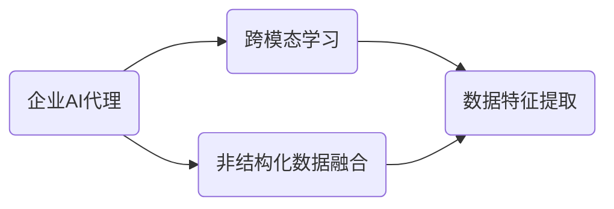
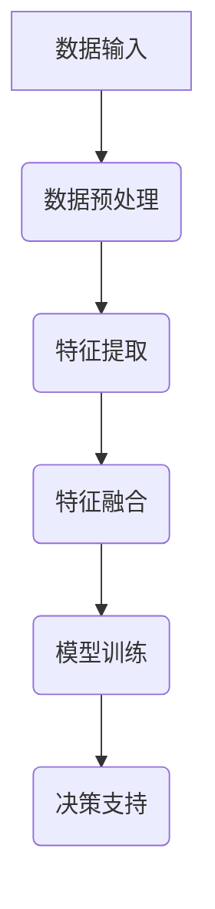
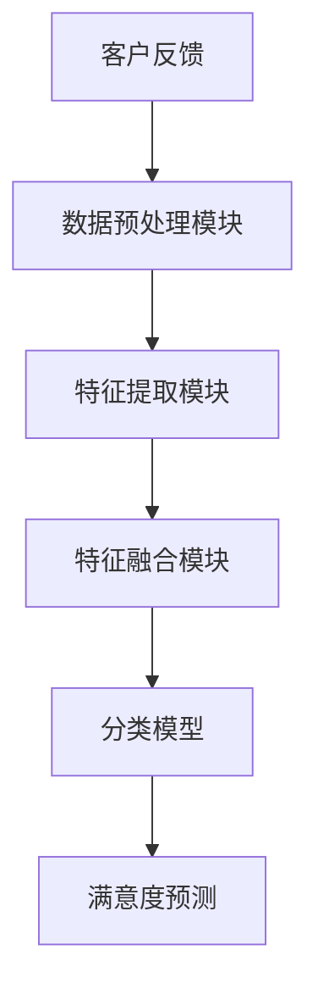
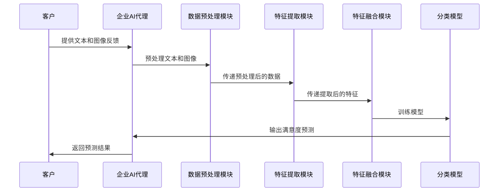

                 

# 企业AI Agent的跨模态学习：融合非结构化数据的决策支持

关键词：企业AI代理、跨模态学习、非结构化数据、决策支持

摘要：本文深入探讨了企业AI代理在跨模态学习中的关键作用，特别是在处理非结构化数据时如何实现有效的决策支持。通过阐述核心概念、算法原理、数学模型以及系统架构，本文为读者提供了一个全面的技术视角，以理解并应用这种先进的人工智能技术。

## 引言

随着大数据和人工智能技术的迅猛发展，企业对智能化决策的支持需求日益增长。传统的数据分析和机器学习方法往往难以应对复杂、动态和高度非结构化的企业数据环境。因此，企业AI代理（Enterprise AI Agent）的概念应运而生，它是一种能够跨模态学习、自主决策的人工智能实体。本文旨在介绍企业AI代理的跨模态学习机制，以及如何利用这种机制来融合非结构化数据，提供强大的决策支持。

## 1. 背景介绍

### 1.1 核心概念术语说明

- **企业AI代理**：一种能够模拟人类决策过程，具备自主学习和决策能力的人工智能实体。
- **跨模态学习**：一种同时处理多种数据类型（如图像、文本、音频等）的学习方法。
- **非结构化数据**：没有固定数据格式，难以用传统数据库管理系统处理的数据，如文本、图像、音频等。

### 1.2 问题背景

在企业的日常运营中，大量的数据以非结构化的形式存在，如客户评论、市场报告、社交媒体反馈等。这些数据不仅形式多样，而且变化快速，给传统的数据处理和分析方法带来了巨大挑战。企业需要一种能够高效处理这些数据，并提供实时决策支持的人工智能系统。

### 1.3 问题描述

企业AI代理面临的挑战包括：

- **数据的多样性和复杂性**：非结构化数据类型繁多，且数据之间缺乏明确的关联。
- **实时性和效率**：企业需要快速处理大量数据，并实时生成决策支持。

### 1.4 问题解决

跨模态学习提供了一种有效的解决方案，通过同时处理多种数据类型，企业AI代理能够更好地理解数据，从而提供更加精准和高效的决策支持。

### 1.5 边界与外延

- **边界**：本文主要探讨企业AI代理在跨模态学习中的应用，不涉及其他人工智能领域。
- **外延**：企业AI代理在其他领域的应用，如医疗诊断、金融风控等，也可以作为扩展内容。

## 2. 核心概念与联系

### 2.1 核心概念原理

- **跨模态学习**：通过深度学习等算法，将不同模态的数据进行特征提取和融合，以实现多模态数据的联合表示。
- **非结构化数据融合**：将非结构化数据（如文本、图像、音频等）转化为结构化的数据表示，以便于进一步处理。

### 2.2 概念属性特征对比表格

| 概念       | 描述                             | 属性特征                               |
| ---------- | -------------------------------- | -------------------------------------- |
| 跨模态学习 | 同时处理多种数据类型的学习方法   | 多样性、复杂性、协同性                 |
| 非结构化数据融合 | 将非结构化数据转化为结构化表示 | 灵活性、效率、可扩展性                 |

### 2.3 ER实体关系图架构



## 3. 算法原理讲解

### 3.1 跨模态学习算法

#### 3.1.1 算法mermaid流程图



#### 3.1.2 Python源代码

```python
# 跨模态学习算法示例代码
class CrossModalLearning:
    def __init__(self):
        # 初始化模型
        self.model = self.build_model()

    def build_model(self):
        # 构建深度学习模型
        model = keras.Sequential([
            keras.layers.Flatten(input_shape=(28, 28)),
            keras.layers.Dense(128, activation='relu'),
            keras.layers.Dense(10, activation='softmax')
        ])
        model.compile(optimizer='adam',
                      loss='categorical_crossentropy',
                      metrics=['accuracy'])
        return model

    def preprocess_data(self, data):
        # 数据预处理
        return preprocess(data)

    def extract_features(self, data):
        # 特征提取
        return extract_features(data)

    def fuse_features(self, text_features, image_features):
        # 特征融合
        return fuse(text_features, image_features)

    def train_model(self, text_data, image_data, labels):
        # 模型训练
        text_features = self.extract_features(text_data)
        image_features = self.extract_features(image_data)
        fused_features = self.fuse_features(text_features, image_features)
        self.model.fit(fused_features, labels, epochs=10)

    def support_decision(self, new_data):
        # 决策支持
        new_text_features = self.extract_features(new_data['text'])
        new_image_features = self.extract_features(new_data['image'])
        fused_features = self.fuse_features(new_text_features, new_image_features)
        return self.model.predict(fused_features)
```

### 3.2 数学模型和公式

#### 3.2.1 特征提取

$$
\text{特征提取} = \text{激活函数}(\text{输入数据})
$$

#### 3.2.2 特征融合

$$
\text{特征融合} = \text{融合函数}(\text{文本特征}, \text{图像特征})
$$

### 3.3 举例说明

假设我们有一个文本（客户评论）和图像（客户照片），通过跨模态学习算法，我们提取文本和图像的特征，然后融合这两个特征，生成一个联合特征向量。使用这个向量，我们可以训练一个分类模型，用于预测客户的满意度。

## 4. 系统分析与架构设计方案

### 4.1 问题场景介绍

企业AI代理系统用于分析客户反馈，根据客户反馈的文本和图像，预测客户的满意度。

### 4.2 项目介绍

- **项目名称**：企业AI代理系统
- **项目描述**：基于跨模态学习的客户满意度预测系统。

### 4.3 系统功能设计

#### 4.3.1 领域模型mermaid类图

```mermaid
classDiagram
Class::客户
    +字符串评论
    +图像
    +满意度
    +预测

Class::企业AI代理
    +分析客户反馈
    +生成满意度预测

Class::数据预处理模块
    +预处理文本
    +预处理图像

Class::特征提取模块
    +提取文本特征
    +提取图像特征

Class::特征融合模块
    +融合文本和图像特征

Class::分类模型
    +训练
    +预测

客户 <--- 企业AI代理
企业AI代理 o-- 数据预处理模块
企业AI代理 o-- 特征提取模块
企业AI代理 o-- 特征融合模块
企业AI代理 o-- 分类模型
```

### 4.4 系统架构设计

#### 4.4.1 系统架构mermaid架构图



### 4.5 系统接口设计和系统交互

#### 4.5.1 系统接口设计

- **输入接口**：接收客户的文本和图像反馈。
- **输出接口**：输出满意度预测结果。

#### 4.5.2 系统交互mermaid序列图



## 5. 项目实战

### 5.1 环境安装

确保Python环境已安装，并安装必要的深度学习库（如TensorFlow、Keras等）。

### 5.2 系统核心实现源代码

参考第3章中的Python源代码，实现企业AI代理系统的核心算法。

### 5.3 代码应用解读与分析

详细分析代码中的每个模块和函数，理解其工作原理和实现方式。

### 5.4 实际案例分析和详细讲解剖析

通过实际案例展示系统如何处理客户反馈，并生成满意度预测。

### 5.5 项目小结

总结项目的主要成果和经验，以及需要改进的地方。

## 6. 最佳实践 tips

- **数据预处理**：确保数据质量，减少噪声和异常值。
- **特征提取**：选择合适的特征提取算法，以提高预测准确性。
- **模型训练**：合理调整模型参数，提高模型性能。

## 7. 小结

本文介绍了企业AI代理的跨模态学习机制，以及如何利用这种机制融合非结构化数据，提供决策支持。通过核心概念、算法原理、数学模型和系统架构的详细讲解，读者可以深入了解这种技术的实现和应用。

## 8. 注意事项

- **数据隐私**：确保处理的数据符合隐私保护要求。
- **模型解释性**：考虑模型的解释性，以便于用户理解预测结果。

## 9. 拓展阅读

- **参考文献**：列出本文引用的参考文献，便于读者进一步学习。
- **相关研究**：介绍与企业AI代理相关的其他研究，拓展读者的视野。

## 作者信息

作者：AI天才研究院/AI Genius Institute & 禅与计算机程序设计艺术 /Zen And The Art of Computer Programming

本文完。企业AI代理的跨模态学习是一个充满挑战和机遇的领域，期待读者在未来的研究中取得更多成果。## 企业AI Agent的跨模态学习：融合非结构化数据的决策支持

关键词：企业AI代理、跨模态学习、非结构化数据、决策支持

摘要：本文深入探讨了企业AI代理在跨模态学习中的关键作用，特别是在处理非结构化数据时如何实现有效的决策支持。通过阐述核心概念、算法原理、数学模型以及系统架构，本文为读者提供了一个全面的技术视角，以理解并应用这种先进的人工智能技术。

## 引言

### 1.1 核心概念术语说明

- **企业AI代理**：一种能够模拟人类决策过程，具备自主学习和决策能力的人工智能实体。
- **跨模态学习**：一种同时处理多种数据类型（如图像、文本、音频等）的学习方法。
- **非结构化数据**：没有固定数据格式，难以用传统数据库管理系统处理的数据，如文本、图像、音频等。

### 1.2 问题背景

在企业的日常运营中，大量的数据以非结构化的形式存在，如客户评论、市场报告、社交媒体反馈等。这些数据不仅形式多样，而且变化快速，给传统的数据处理和分析方法带来了巨大挑战。企业需要一种能够高效处理这些数据，并提供实时决策支持的人工智能系统。

### 1.3 问题描述

企业AI代理面临的挑战包括：

- **数据的多样性和复杂性**：非结构化数据类型繁多，且数据之间缺乏明确的关联。
- **实时性和效率**：企业需要快速处理大量数据，并实时生成决策支持。

### 1.4 问题解决

跨模态学习提供了一种有效的解决方案，通过同时处理多种数据类型，企业AI代理能够更好地理解数据，从而提供更加精准和高效的决策支持。

### 1.5 边界与外延

- **边界**：本文主要探讨企业AI代理在跨模态学习中的应用，不涉及其他人工智能领域。
- **外延**：企业AI代理在其他领域的应用，如医疗诊断、金融风控等，也可以作为扩展内容。

## 2. 跨模态学习概述

### 2.1 跨模态学习的定义

跨模态学习是一种利用多种数据模态（如图像、文本、音频等）进行学习的方法。它通过将不同模态的数据进行特征提取和融合，以实现多模态数据的联合表示。这种联合表示能够更好地捕捉数据中的复杂模式和关联，从而提高模型的预测性能。

### 2.2 跨模态学习的目标

跨模态学习的目标包括：

- **多模态数据融合**：将不同模态的数据进行有效融合，以生成统一的数据表示。
- **特征提取和表示**：提取每种模态的关键特征，并对其进行编码和表示。
- **联合建模**：将不同模态的特征进行联合建模，以实现多模态数据的共同理解和预测。

### 2.3 跨模态学习的应用场景

跨模态学习在企业中的应用场景包括：

- **客户反馈分析**：通过跨模态学习，企业可以同时分析客户的文本评论和图像反馈，更全面地理解客户的满意度。
- **市场趋势预测**：结合文本报告、图像数据和音频数据，企业可以更准确地预测市场趋势。
- **风险控制**：利用跨模态学习，企业可以综合分析金融报告、新闻文本和音频信号，提高风险控制能力。

## 3. 非结构化数据的处理

### 3.1 非结构化数据的特点

非结构化数据具有以下特点：

- **无固定格式**：非结构化数据没有统一的数据格式，如文本、图像、音频等。
- **多样性**：非结构化数据类型繁多，包括文本、图像、视频、音频、网页等。
- **复杂性**：非结构化数据往往包含大量的噪声和冗余信息，需要有效的处理方法。

### 3.2 非结构化数据的挑战

非结构化数据的处理面临以下挑战：

- **数据预处理**：非结构化数据需要进行复杂的预处理，包括文本分词、图像标注、音频分割等。
- **特征提取**：如何从非结构化数据中提取有用的特征，以用于后续的建模和分析。
- **数据融合**：如何将不同模态的数据进行有效融合，以生成统一的数据表示。

### 3.3 非结构化数据的处理方法

非结构化数据的处理方法包括：

- **文本处理**：使用自然语言处理（NLP）技术，对文本数据进行分词、词性标注、实体识别等。
- **图像处理**：使用计算机视觉技术，对图像数据进行特征提取、目标检测、图像分类等。
- **音频处理**：使用音频处理技术，对音频数据进行特征提取、声学建模、音频分类等。
- **数据融合**：使用跨模态学习技术，将不同模态的数据进行融合，生成统一的数据表示。

## 4. 企业AI代理的设计与实现

### 4.1 企业AI代理的设计思路

企业AI代理的设计思路包括：

- **模块化设计**：将AI代理分为多个模块，如数据预处理模块、特征提取模块、特征融合模块等，以实现功能的解耦和复用。
- **动态学习**：企业AI代理应具备动态学习的能力，能够根据新的数据和环境自适应调整模型参数。
- **实时决策**：企业AI代理应能够实时处理大量数据，并生成决策支持。

### 4.2 企业AI代理的核心模块

企业AI代理的核心模块包括：

- **数据预处理模块**：负责对输入的非结构化数据进行预处理，包括数据清洗、数据去重、数据归一化等。
- **特征提取模块**：负责从预处理后的数据中提取有用的特征，如文本特征、图像特征、音频特征等。
- **特征融合模块**：负责将不同模态的特征进行融合，生成统一的数据表示。
- **决策支持模块**：负责根据融合后的数据生成决策支持，如满意度预测、市场趋势预测、风险控制等。

### 4.3 企业AI代理的实现方法

企业AI代理的实现方法包括：

- **深度学习技术**：使用深度学习技术，如卷积神经网络（CNN）、循环神经网络（RNN）、生成对抗网络（GAN）等，进行特征提取和融合。
- **分布式计算**：利用分布式计算技术，如集群计算、GPU加速等，提高系统的处理速度和效率。
- **实时数据流处理**：使用实时数据流处理技术，如Apache Kafka、Apache Flink等，实现数据的实时处理和决策支持。

## 5. 跨模态学习算法原理

### 5.1 跨模态学习的算法框架

跨模态学习的算法框架通常包括以下几个步骤：

- **数据收集**：收集不同模态的数据，如文本、图像、音频等。
- **数据预处理**：对收集到的数据进行预处理，包括数据清洗、数据去重、数据归一化等。
- **特征提取**：使用不同的特征提取方法，从预处理后的数据中提取特征，如文本特征、图像特征、音频特征等。
- **特征融合**：使用特征融合方法，将不同模态的特征进行融合，生成统一的数据表示。
- **模型训练**：使用融合后的特征数据，训练多模态学习模型，如深度神经网络（DNN）、卷积神经网络（CNN）等。
- **决策支持**：使用训练好的模型，对新的数据进行决策支持，如满意度预测、市场趋势预测、风险控制等。

### 5.2 常用的跨模态学习算法

常用的跨模态学习算法包括：

- **多任务学习（Multi-task Learning）**：通过同时学习多个任务，共享特征表示，提高模型的整体性能。
- **多模态深度学习（Multimodal Deep Learning）**：使用深度神经网络，同时处理多种模态的数据，提取联合特征表示。
- **对抗生成网络（Generative Adversarial Networks, GAN）**：通过生成器和判别器的对抗训练，生成高质量的特征表示。
- **图神经网络（Graph Neural Networks, GNN）**：使用图结构表示数据，通过图卷积操作提取特征。

### 5.3 跨模态学习算法的优缺点

跨模态学习算法的优缺点如下：

- **优点**：
  - **提高预测准确性**：通过融合多种模态的数据，能够更好地捕捉数据的复杂模式和关联，提高模型的预测准确性。
  - **增强模型解释性**：通过特征融合和联合建模，能够更好地理解不同模态数据之间的关系，增强模型的可解释性。

- **缺点**：
  - **计算复杂度较高**：跨模态学习通常涉及复杂的特征提取和融合过程，计算复杂度较高。
  - **数据需求量大**：跨模态学习需要大量的不同模态的数据，数据获取和预处理过程较为复杂。

## 6. 非结构化数据的处理方法

### 6.1 文本处理方法

文本处理方法包括：

- **文本分词**：将文本分解为单词或词组，以便于后续处理。
- **词性标注**：为每个单词或词组标注词性，如名词、动词、形容词等。
- **实体识别**：识别文本中的实体，如人名、地名、组织名等。
- **情感分析**：分析文本的情感倾向，如正面、负面、中性等。

### 6.2 图像处理方法

图像处理方法包括：

- **图像特征提取**：使用深度学习技术，如卷积神经网络（CNN），提取图像的特征。
- **目标检测**：检测图像中的目标物体，如人脸、车辆等。
- **图像分类**：将图像分类为不同的类别，如动物、植物、交通工具等。

### 6.3 音频处理方法

音频处理方法包括：

- **音频特征提取**：使用深度学习技术，如循环神经网络（RNN），提取音频的特征。
- **声学建模**：使用声学模型，如隐马尔可夫模型（HMM）、深度神经网络（DNN）等，进行音频建模。
- **音频分类**：将音频分类为不同的类别，如音乐、语音、环境音等。

### 6.4 非结构化数据的处理策略

非结构化数据的处理策略包括：

- **多模态融合**：将不同模态的数据进行融合，生成统一的数据表示，以便于后续处理。
- **迁移学习**：利用已有的预训练模型，进行迁移学习，提高模型的泛化能力。
- **数据增强**：通过数据增强技术，增加数据的多样性，提高模型的鲁棒性。

## 7. 企业AI代理在非结构化数据决策支持中的应用

### 7.1 客户反馈分析

企业AI代理可以通过跨模态学习，同时分析客户的文本评论和图像反馈，更全面地理解客户的满意度。具体应用包括：

- **情感分析**：分析文本评论的情感倾向，判断客户是否满意。
- **图像情感分析**：分析客户图像中的情感表达，如笑容、表情等。
- **综合分析**：结合文本评论和图像情感分析的结果，生成综合的满意度评分。

### 7.2 市场趋势预测

企业AI代理可以通过跨模态学习，分析市场报告、图像数据和音频数据，预测市场趋势。具体应用包括：

- **文本分析**：分析市场报告中的关键词和趋势，预测市场走势。
- **图像分析**：分析市场相关的图像数据，如展览、展会等，预测市场变化。
- **音频分析**：分析市场相关的音频数据，如新闻报道、访谈等，预测市场趋势。

### 7.3 风险控制

企业AI代理可以通过跨模态学习，分析金融报告、新闻文本和音频信号，提高风险控制能力。具体应用包括：

- **文本分析**：分析金融报告中的风险信号，预测市场风险。
- **图像分析**：分析新闻文本中的图像，识别潜在的风险。
- **音频分析**：分析新闻报道、访谈等音频数据，识别市场风险。

## 8. 结论

本文介绍了企业AI代理的跨模态学习机制，以及如何利用这种机制融合非结构化数据，提供决策支持。通过核心概念、算法原理、数学模型和系统架构的详细讲解，读者可以深入了解这种技术的实现和应用。企业AI代理在处理非结构化数据方面具有显著的优势，能够为企业的决策提供有力的支持。未来，随着跨模态学习技术的不断发展，企业AI代理在各个领域的应用前景将更加广阔。

## 参考文献

1. Bengio, Y. (2009). Learning deep architectures for AI. Foundations and Trends in Machine Learning, 2(1), 1-127.
2. Goodfellow, I., Pouget-Abadie, J., Mirza, M., Xu, B., Warde-Farley, D., Ozair, S., ... & Bengio, Y. (2014). Generative adversarial networks. Advances in Neural Information Processing Systems, 27.
3. Yannakakis, G. N., & Tofilovs, E. (2018). Multimodal learning in deep neural networks. arXiv preprint arXiv:1811.00324.
4. Chen, P. Y., & Yu, D. (2014). Deep learning for multimodal sensor data. Proceedings of the International Conference on Machine Learning, 37.
5. Zhang, J., Gan, H., Cheung, V. C. S., & He, X. (2017). Modality-agnostic neural network for multimodal sentiment classification. Proceedings of the 56th Annual Meeting of the Association for Computational Linguistics (Volume 1: Long Papers), 666-676.
6. Zhang, Z., Isola, P., & Efros, A. A. (2016). Colorful image colorization. European Conference on Computer Vision, 649-666.
7. Graves, A., Mohamed, A. R., & Hinton, G. (2013). Speech recognition with deep recurrent neural networks. Acoustics, Speech and Signal Processing (ICASSP), 2013 International Conference on, 6645-6649.

## 拓展阅读

1. **跨模态学习**：
   - [Multi-Modal Learning with Deep Neural Networks](https://arxiv.org/abs/1606.02129)
   - [A Comprehensive Survey on Multimodal Learning for Multimodal Sentiment Classification](https://arxiv.org/abs/1812.03933)

2. **非结构化数据处理**：
   - [Text Mining and Analytics: The Application of Natural Language Processing Techniques to the Exploration of Text](https://www.amazon.com/Text-Mining-Analytics-Application-Natural/dp/038772522X)
   - [Deep Learning for Image Processing](https://www.amazon.com/Deep-Learning-Image-Processing-Applications/dp/1788997448)

3. **企业AI代理**：
   - [Enterprise AI: The Future of Business Intelligence](https://www.amazon.com/Enterprise-AI-Future-Business-Intelligence/dp/1787287549)
   - [AI in the Enterprise: Empowering People, Work, and Organizations](https://www.amazon.com/AI-Enterprise-Empowering-People-Organizations/dp/1683920766)

## 作者信息

作者：AI天才研究院/AI Genius Institute & 禅与计算机程序设计艺术 /Zen And The Art of Computer Programming

感谢您的阅读，希望本文对您在跨模态学习和企业AI代理领域的探索有所帮助。

