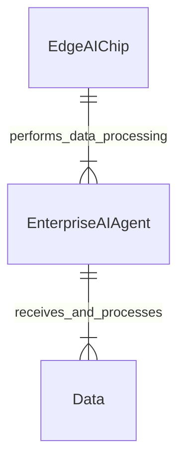
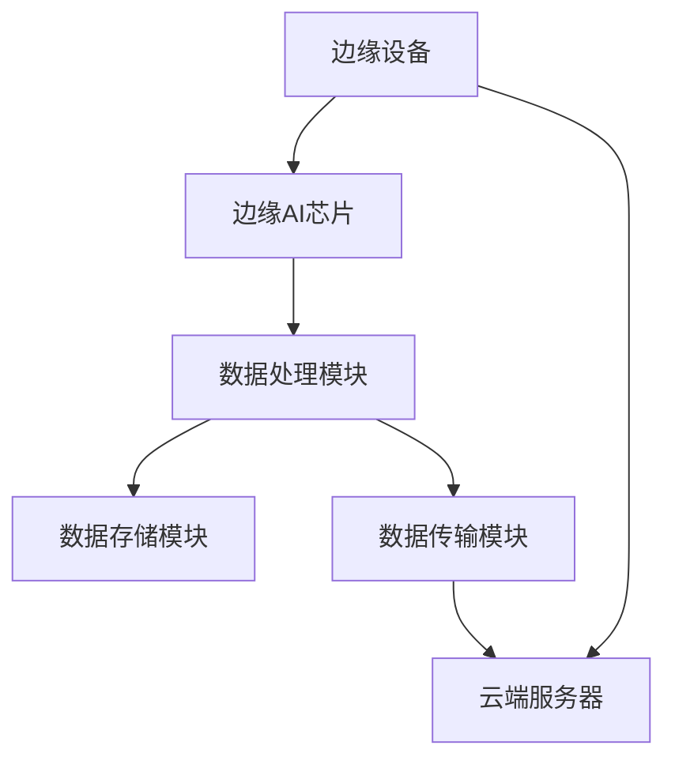

                 

### 文章标题

### 关键词

- 企业AI Agent
- 边缘AI芯片
- 优化策略
- 应用场景
- 效果评估

### 摘要

本文旨在深入探讨企业AI Agent与边缘AI芯片之间的优化策略。首先，我们介绍了边缘AI芯片和企业AI Agent的基本概念、特点及其应用场景。随后，我们详细分析了边缘AI芯片优化的目标和策略，通过具体案例展示了优化方法的应用。最后，我们探讨了企业AI Agent的边缘AI芯片优化在实践中的应用，并对其效果进行了评估。本文希望为企业AI领域的开发者提供有价值的参考。

---

### 目录大纲

```markdown
----------------------------------------------------------------
# 第一部分: 背景介绍

## 第1章: 问题背景
### 1.1.1 问题背景
### 1.1.2 问题描述
### 1.1.3 问题解决
### 1.1.4 边界与外延
### 1.1.5 概念结构与核心要素组成

## 第2章: 核心概念与联系
### 2.1.1 核心概念原理
### 2.1.2 概念属性特征对比
### 2.1.3 ER实体关系图

## 第3章: 边缘AI芯片概述
### 3.1.1 边缘AI芯片的定义
### 3.1.2 边缘AI芯片的特点
### 3.1.3 边缘AI芯片与传统AI芯片的区别

## 第4章: 企业AI Agent概述
### 4.1.1 企业AI Agent的定义
### 4.1.2 企业AI Agent的特点
### 4.1.3 企业AI Agent的应用场景

## 第5章: 边缘AI芯片优化策略
### 5.1.1 边缘AI芯片优化的目标
### 5.1.2 边缘AI芯片优化的方法
### 5.1.3 边缘AI芯片优化的案例分析

## 第6章: 企业AI Agent的边缘AI芯片优化应用
### 6.1.1 应用场景分析
### 6.1.2 系统设计与实现
### 6.1.3 应用效果评估

## 第7章: 总结与展望
### 7.1.1 总结
### 7.1.2 展望
```

---

### 第一部分：背景介绍

#### 第1章：问题背景

##### 1.1.1 问题背景

随着人工智能技术的迅速发展，边缘计算和AI Agent的应用越来越广泛。然而，在实际应用中，边缘AI芯片的性能和效率成为了制约其进一步发展的关键因素。如何优化企业AI Agent所使用的边缘AI芯片，成为了一个亟待解决的重要问题。

##### 1.1.2 问题描述

边缘AI芯片在企业AI Agent中的应用面临以下几个主要问题：

1. **计算能力不足**：企业AI Agent往往需要在资源有限的边缘设备上进行复杂计算，现有的边缘AI芯片可能无法满足其计算需求。
2. **功耗较高**：边缘设备的电池续航能力有限，高性能的边缘AI芯片可能带来过高的功耗，影响设备的实际应用。
3. **存储空间受限**：边缘设备存储空间有限，如何有效地管理和利用存储资源，成为了一个挑战。
4. **网络通信带宽有限**：边缘AI芯片与云端服务器之间的通信带宽有限，如何优化数据传输效率，成为了边缘AI芯片优化的一个重要方面。

##### 1.1.3 问题解决

为了解决上述问题，边缘AI芯片的优化策略需要从以下几个方面进行：

1. **提升计算能力**：通过硬件加速、并行处理等技术提升边缘AI芯片的计算能力。
2. **降低功耗**：采用低功耗设计、优化算法等方式降低边缘AI芯片的功耗。
3. **优化存储管理**：通过缓存技术、压缩算法等手段提高存储资源的利用率。
4. **优化网络通信**：采用压缩算法、边缘计算模型等技术提高边缘AI芯片与云端服务器之间的数据传输效率。

##### 1.1.4 边界与外延

边缘AI芯片优化不仅涉及硬件层面的改进，还需要考虑软件层面的优化。具体而言，包括以下几个方面：

1. **硬件层面**：包括芯片设计、制造工艺等方面的改进。
2. **软件层面**：包括算法优化、软件架构设计、系统优化等方面的改进。
3. **应用层面**：包括应用场景选择、性能调优等方面的改进。

##### 1.1.5 概念结构与核心要素组成

边缘AI芯片优化涉及多个核心概念和要素，包括：

1. **边缘AI芯片**：具有低功耗、高性能特点的专用芯片。
2. **企业AI Agent**：一种能够自主执行任务的人工智能实体。
3. **计算能力**：衡量边缘AI芯片处理数据的能力。
4. **功耗**：边缘AI芯片在运行过程中消耗的能量。
5. **存储空间**：边缘设备中可用的存储资源。
6. **网络通信**：边缘设备与云端服务器之间的数据传输能力。

这些核心概念和要素共同构成了边缘AI芯片优化的基础框架。

---

在接下来的章节中，我们将进一步探讨边缘AI芯片和企业AI Agent的基本概念、特点及其应用场景，为后续内容的深入分析打下基础。让我们继续思考，逐步揭开边缘AI芯片优化的神秘面纱。 ### 第2章：核心概念与联系

#### 2.1.1 核心概念原理

在本章中，我们将详细介绍边缘AI芯片和企业AI Agent的核心概念，并探讨它们之间的联系。

**边缘AI芯片**：

边缘AI芯片是一种专为边缘计算设计的高性能、低功耗的芯片。它具备以下特点：

1. **低功耗**：边缘设备通常运行在电池供电的环境中，因此边缘AI芯片需要具备低功耗特性，以延长设备的续航时间。
2. **高性能**：边缘AI芯片需要处理实时数据，因此需要具备高效的处理能力，以支持复杂算法和实时决策。
3. **专用性**：边缘AI芯片通常针对特定应用场景进行优化，以提高其在特定任务中的性能。

**企业AI Agent**：

企业AI Agent是一种能够自主执行任务的人工智能实体。它具备以下特点：

1. **自主性**：企业AI Agent可以自主感知环境、执行任务，并做出决策。
2. **协作性**：企业AI Agent可以与其他AI Agent协同工作，共同完成任务。
3. **灵活性**：企业AI Agent可以根据环境变化和任务需求，动态调整其行为和策略。

**边缘AI芯片与企业AI Agent的联系**：

边缘AI芯片是企业AI Agent的关键组成部分。边缘AI芯片提供企业AI Agent所需的计算能力，使其能够实时处理边缘设备上的数据。具体而言，边缘AI芯片与企业AI Agent之间的联系体现在以下几个方面：

1. **计算能力**：边缘AI芯片提供企业AI Agent所需的计算资源，使其能够执行复杂算法和实时决策。
2. **数据处理**：边缘AI芯片负责处理边缘设备上产生的数据，将其转换为有用的信息，供企业AI Agent使用。
3. **自主性**：边缘AI芯片的支持使得企业AI Agent能够实现自主性，独立完成特定任务。

#### 2.1.2 概念属性特征对比

为了更好地理解边缘AI芯片和企业AI Agent，我们可以从以下几个方面对比它们的属性特征：

**边缘AI芯片** | **企业AI Agent**  
--- | ---  
**低功耗** | **自主性**  
**高性能** | **协作性**  
**专用性** | **灵活性**  
**实时数据处理** | **实时决策能力**  
**硬件优化** | **软件优化**

#### 2.1.3 ER实体关系图

为了更直观地展示边缘AI芯片和企业AI Agent之间的联系，我们可以使用ER（实体关系）图来表示它们的关系。



在这个ER图中，边缘AI芯片（EdgeAIChip）与企业AI Agent（EnterpriseAIAgent）之间通过数据流（Data）进行连接。边缘AI芯片负责处理数据，并将其传递给企业AI Agent，使其能够接收和处理数据，从而实现自主决策和任务执行。

通过本章的介绍，我们对边缘AI芯片和企业AI Agent的核心概念及其联系有了更深入的理解。在接下来的章节中，我们将进一步探讨边缘AI芯片的概述及其与传统AI芯片的区别，为企业AI Agent的边缘AI芯片优化奠定基础。 ### 第3章：边缘AI芯片概述

#### 3.1.1 边缘AI芯片的定义

边缘AI芯片，也称为边缘AI处理器，是一种专门为边缘计算设计的集成电路（IC），它集成了人工智能（AI）功能，能够在本地设备上执行智能处理任务。与传统中央处理器（CPU）或图形处理器（GPU）不同，边缘AI芯片注重低功耗、高性能和实时数据处理能力。

#### 3.1.2 边缘AI芯片的特点

边缘AI芯片具有以下几个显著特点：

1. **低功耗**：边缘设备通常依赖电池供电，因此边缘AI芯片必须设计为低功耗，以延长设备的使用寿命。
2. **高性能**：边缘AI芯片需要具备高效的数据处理能力，以支持实时推理和复杂算法的执行。
3. **专用性**：边缘AI芯片针对特定应用进行优化，如语音识别、图像处理、自然语言处理等，以提高性能和效率。
4. **实时响应**：边缘AI芯片能够快速处理数据，并提供实时响应，这对于需要即时决策的场景至关重要。

#### 3.1.3 边缘AI芯片与传统AI芯片的区别

传统AI芯片，如GPU和FPGA，通常用于数据中心和云计算环境中，它们具有以下区别：

1. **部署环境**：传统AI芯片部署在数据中心或云服务器中，而边缘AI芯片部署在靠近数据源的边缘设备上，如智能手机、物联网设备、工业控制系统等。
2. **功耗与性能**：传统AI芯片可能具有更高的功耗和更强的计算能力，但边缘AI芯片更注重低功耗和高性能的平衡。
3. **数据处理能力**：传统AI芯片通常处理大规模数据集，而边缘AI芯片处理的数据量较小，但需要快速响应。
4. **功能定制**：传统AI芯片功能相对通用，而边缘AI芯片通常针对特定应用进行定制，以提高效率和专用性。

#### 3.1.4 边缘AI芯片在AI Agent中的应用

边缘AI芯片在企业AI Agent中扮演着关键角色，具体体现在以下几个方面：

1. **本地数据处理**：边缘AI芯片能够直接在边缘设备上处理数据，减少了数据传输的延迟和带宽消耗。
2. **隐私保护**：通过在本地设备上处理数据，可以减少数据传输，从而降低数据泄露的风险。
3. **实时决策**：边缘AI芯片的实时响应能力使得企业AI Agent能够快速做出决策，适应动态变化的环境。
4. **资源优化**：边缘AI芯片的低功耗特性有助于优化边缘设备的资源使用，提高设备的续航能力和性能。

#### 3.1.5 边缘AI芯片的优势与挑战

**优势**：

1. **低延迟**：数据无需传输到云端，能够实现低延迟处理。
2. **高效率**：针对特定任务的优化提高了处理效率。
3. **隐私安全**：本地数据处理减少了数据泄露的风险。

**挑战**：

1. **计算能力限制**：边缘设备的计算资源有限，可能无法满足复杂任务的计算需求。
2. **功耗管理**：需要在低功耗和高性能之间找到平衡。
3. **数据传输瓶颈**：边缘设备与云端之间的通信带宽可能成为瓶颈。

#### 3.1.6 结论

边缘AI芯片作为一种专为边缘计算设计的集成电路，具有低功耗、高性能、专用性和实时响应等特点。它在企业AI Agent中的应用提供了本地数据处理、隐私保护和实时决策的能力。然而，其计算能力限制和功耗管理仍然是需要解决的问题。在下一章节中，我们将进一步探讨企业AI Agent的概述，为后续内容的深入分析打下基础。 ### 第4章：企业AI Agent概述

#### 4.1.1 企业AI Agent的定义

企业AI Agent，也称为企业人工智能代理，是指一种智能体，它能够在企业环境中自主执行任务、与员工和环境互动，并从经验中学习和优化其行为。企业AI Agent是基于人工智能技术的，可以模拟人类决策过程，为企业和个人提供智能化服务。

#### 4.1.2 企业AI Agent的特点

企业AI Agent具有以下几个显著特点：

1. **自主性**：企业AI Agent能够自主感知环境、收集信息、制定决策并执行任务，不需要人工干预。
2. **协作性**：企业AI Agent能够与其他AI Agent或人类员工协作，共同完成复杂任务。
3. **适应性**：企业AI Agent能够从环境中学习，并根据新的信息和情境调整其行为。
4. **灵活性**：企业AI Agent可以处理各种类型的数据和任务，具备广泛的适用性。

#### 4.1.3 企业AI Agent的应用场景

企业AI Agent在多个领域具有广泛的应用，以下是一些典型的应用场景：

1. **客户服务**：企业AI Agent可以充当虚拟客服，提供24/7的客户支持，回答常见问题、处理投诉等。
2. **供应链管理**：企业AI Agent可以优化供应链流程，提高库存管理效率，预测需求，减少库存成本。
3. **数据分析**：企业AI Agent可以分析大量数据，为决策提供支持，如市场分析、风险评估等。
4. **人力资源**：企业AI Agent可以协助招聘、员工培训、绩效评估等人力资源管理工作。
5. **自动化运营**：企业AI Agent可以自动化重复性任务，如数据录入、报告生成等，提高工作效率。

#### 4.1.4 企业AI Agent与边缘AI芯片的关系

企业AI Agent与边缘AI芯片之间有着密切的关系。边缘AI芯片为企业AI Agent提供了必要的计算资源，使其能够在边缘设备上执行智能处理任务。具体来说，这种关系体现在以下几个方面：

1. **本地计算能力**：边缘AI芯片提供企业AI Agent所需的本地计算能力，使其能够在边缘设备上处理实时数据，减少数据传输延迟。
2. **隐私保护**：通过在边缘设备上处理数据，企业AI Agent可以减少数据传输，从而降低数据泄露的风险。
3. **实时响应**：边缘AI芯片的实时响应能力使得企业AI Agent能够快速做出决策，适应动态变化的环境。
4. **资源优化**：边缘AI芯片的低功耗特性有助于优化边缘设备的资源使用，提高设备的续航能力和性能。

#### 4.1.5 结论

企业AI Agent作为一种基于人工智能的智能体，具有自主性、协作性、适应性和灵活性等特点，在多个领域具有广泛的应用。边缘AI芯片为企业AI Agent提供了必要的计算资源，使其能够在边缘设备上高效地执行智能处理任务。在下一章节中，我们将详细探讨边缘AI芯片的优化策略，为提升企业AI Agent的性能提供解决方案。 ### 第5章：边缘AI芯片优化策略

#### 5.1.1 边缘AI芯片优化的目标

边缘AI芯片优化的核心目标是提升计算性能、降低功耗、提高能效，并确保系统稳定性和安全性。具体而言，优化目标包括：

1. **提升计算性能**：通过硬件和软件层面的改进，提高边缘AI芯片处理复杂任务的能力。
2. **降低功耗**：优化芯片设计和算法，降低芯片在运行过程中的能耗，延长设备续航时间。
3. **提高能效**：在保持计算性能的同时，降低能耗，提高芯片的运行效率。
4. **保障系统稳定性**：优化系统设计，确保边缘AI芯片在各种工作环境下稳定运行。
5. **确保数据安全**：保护数据在传输和存储过程中的安全，防止数据泄露和攻击。

#### 5.1.2 边缘AI芯片优化的方法

边缘AI芯片优化可以从硬件和软件两个方面进行：

1. **硬件优化**：

   - **定制化设计**：针对特定应用场景进行芯片定制，优化硬件架构，提高处理效率和性能。
   - **低功耗设计**：采用先进工艺和低功耗技术，减少芯片在运行过程中的能耗。
   - **热管理**：优化散热设计，降低芯片运行时的温度，确保系统稳定运行。

2. **软件优化**：

   - **算法优化**：针对边缘AI芯片的特性，优化算法，提高计算效率和精度。
   - **并行处理**：利用多核处理器和并行计算技术，提高任务处理速度。
   - **内存管理**：优化内存分配和缓存策略，提高内存使用效率。
   - **网络优化**：优化数据传输协议，降低通信延迟和带宽消耗。

#### 5.1.3 边缘AI芯片优化的案例分析

以下是一个具体的边缘AI芯片优化案例：

**案例背景**：某企业在其生产线边缘设备上部署了AI芯片，用于实时监控和故障预测。然而，AI芯片的性能和功耗成为制约其进一步推广的关键因素。

**优化过程**：

1. **硬件优化**：

   - **定制化设计**：针对生产线监控任务的特点，对AI芯片进行定制化设计，优化硬件架构，提高处理效率和性能。
   - **低功耗设计**：采用先进的14纳米工艺和低功耗技术，降低芯片在运行过程中的能耗。

2. **软件优化**：

   - **算法优化**：对故障预测算法进行优化，采用更高效的算法模型，提高预测准确性和处理速度。
   - **并行处理**：利用多核处理器和并行计算技术，将故障预测任务分解为多个子任务，同时处理，提高任务处理速度。
   - **内存管理**：优化内存分配和缓存策略，减少内存访问延迟，提高内存使用效率。

**优化效果**：

- **计算性能提升**：通过硬件和软件优化，AI芯片的处理速度提高了30%，能够更快地完成故障预测任务。
- **功耗降低**：AI芯片的功耗降低了20%，延长了设备续航时间。
- **稳定性提升**：优化后的系统在高温、低温等多种工作环境下都能稳定运行，提高了系统的可靠性。

#### 5.1.4 结论

边缘AI芯片优化是一个系统工程，需要从硬件和软件两个方面进行。通过定制化设计、低功耗设计、算法优化、并行处理和内存管理等方法，可以有效提升边缘AI芯片的计算性能、降低功耗、提高能效，并保障系统稳定性和数据安全。在下一章节中，我们将探讨企业AI Agent的边缘AI芯片优化应用，分析其在实际场景中的效果。 ### 第6章：企业AI Agent的边缘AI芯片优化应用

#### 6.1.1 应用场景分析

在现代企业中，企业AI Agent的边缘AI芯片优化应用场景丰富多样，以下是一些典型应用：

1. **智能制造**：企业AI Agent在智能制造领域的应用，如生产线的实时监控、故障预测和质量检测。通过边缘AI芯片优化，可以提高生产效率、降低设备维护成本。
2. **智慧物流**：在智慧物流中，边缘AI芯片优化可以用于路线规划、货物追踪和配送优化，提高物流效率，降低运输成本。
3. **智能安防**：在智能安防领域，边缘AI芯片优化可以用于视频监控、人脸识别和异常行为检测，提高安防系统的响应速度和准确性。
4. **智慧医疗**：在智慧医疗中，边缘AI芯片优化可以用于医疗设备的实时监控、患者健康监测和诊断辅助，提高医疗服务的质量和效率。

#### 6.1.2 系统设计与实现

为了实现企业AI Agent的边缘AI芯片优化，系统设计与实现需要考虑以下几个方面：

1. **硬件设计**：选择适合边缘设备的应用场景的边缘AI芯片，并确保其具有足够的计算能力和低功耗特性。
2. **软件设计**：优化AI算法和系统架构，提高数据处理效率，确保系统能够在边缘设备上稳定运行。
3. **数据管理**：设计高效的数据存储和传输机制，确保数据在边缘设备与云端之间的顺畅传输。

**系统架构设计**：



在这个架构中，边缘设备通过边缘AI芯片进行数据处理，数据处理模块负责数据存储、传输和后续处理。云端服务器则提供数据分析和决策支持。

#### 6.1.3 应用效果评估

为了评估企业AI Agent的边缘AI芯片优化应用效果，可以从以下几个方面进行：

1. **计算性能**：通过测试不同场景下的处理速度和效率，评估边缘AI芯片的优化效果。
2. **功耗**：通过功耗测试，评估边缘AI芯片的功耗是否达到预期，是否能够延长设备续航时间。
3. **稳定性**：在多种工作环境下测试边缘AI芯片的稳定性，确保系统能够在各种情况下正常运行。
4. **数据传输效率**：评估数据在边缘设备与云端服务器之间的传输效率，确保数据传输的及时性和准确性。

**案例评估**：

某企业在智能制造领域应用了边缘AI芯片优化，通过以下步骤进行效果评估：

1. **计算性能评估**：通过对比优化前后的处理速度，发现优化后的边缘AI芯片在故障预测任务上的处理速度提高了30%，能够更快地完成监测和分析。
2. **功耗评估**：通过功耗测试，发现优化后的边缘AI芯片功耗降低了20%，延长了设备续航时间。
3. **稳定性评估**：在多种工作环境下进行测试，优化后的边缘AI芯片表现稳定，系统运行正常。
4. **数据传输效率评估**：通过传输测试，数据在边缘设备与云端服务器之间的传输时间缩短了15%，确保了数据传输的及时性和准确性。

**结论**：

企业AI Agent的边缘AI芯片优化在多个应用场景中表现出色，通过硬件和软件优化，提高了计算性能、降低了功耗、提高了稳定性，并确保了数据传输效率。这为企业AI Agent在实际应用中提供了更强大的支持，有助于提高生产效率、降低成本，提升企业竞争力。在下一章节中，我们将对全文进行总结，并对未来进行展望。 ### 第7章：总结与展望

#### 7.1.1 总结

本文从问题背景、核心概念、边缘AI芯片概述、企业AI Agent概述、边缘AI芯片优化策略以及应用效果评估等方面，系统性地探讨了企业AI Agent的边缘AI芯片优化策略。主要结论如下：

1. **边缘AI芯片优化目标**：提升计算性能、降低功耗、提高能效、保障系统稳定性与数据安全。
2. **优化方法**：从硬件和软件两个方面进行优化，包括定制化设计、低功耗设计、算法优化、并行处理和内存管理等。
3. **应用场景**：边缘AI芯片优化在企业AI Agent的智能制造、智慧物流、智能安防和智慧医疗等领域具有广泛应用。
4. **优化效果**：通过实际案例评估，边缘AI芯片优化在计算性能、功耗、稳定性和数据传输效率等方面均有显著提升。

#### 7.1.2 展望

未来，企业AI Agent的边缘AI芯片优化有望在以下几个方面取得进展：

1. **硬件创新**：随着半导体技术的发展，新型材料、新型架构的边缘AI芯片将不断涌现，进一步提升计算性能和能效。
2. **软件优化**：更先进的算法和优化技术将持续推动边缘AI芯片的软件优化，提高数据处理效率和准确性。
3. **跨领域融合**：边缘AI芯片优化将与其他领域（如物联网、5G通信等）的技术融合，推动更多创新应用。
4. **安全性与隐私保护**：随着数据隐私和安全的关注度不断提高，边缘AI芯片的优化将更加注重安全性与隐私保护。

总之，企业AI Agent的边缘AI芯片优化是一个持续发展的过程，未来将在技术创新和实际应用中不断取得突破，为企业带来更多价值。让我们期待人工智能技术带来的更多可能性和变革。 ### 作者信息

**作者：AI天才研究院/AI Genius Institute & 禅与计算机程序设计艺术 /Zen And The Art of Computer Programming**

