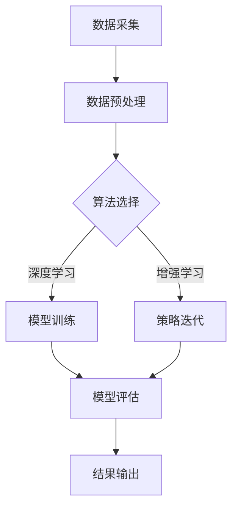
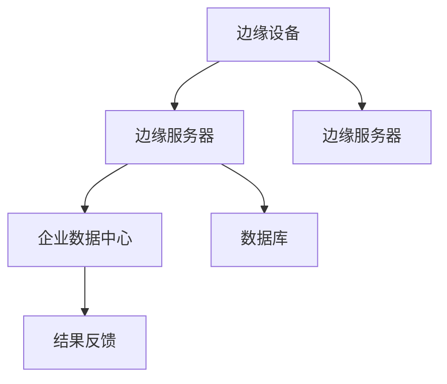
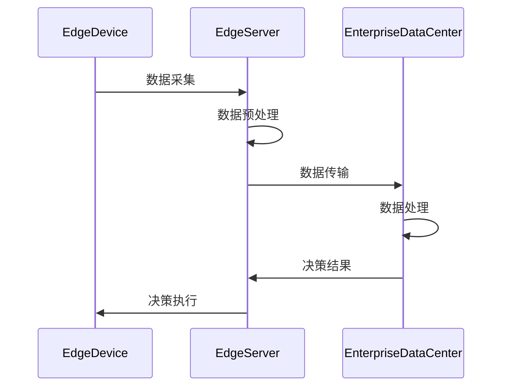

                 


# 企业AI Agent的边缘AI部署策略

## 关键词
- 企业AI Agent
- 边缘AI
- 部署策略
- AI转型
- 边缘计算
- 低延迟
- 实时分析

## 摘要
随着企业数字化转型进程的不断深入，AI Agent作为企业智能化转型的核心组件，正在逐渐成为企业自动化决策和运营优化的关键驱动力。边缘AI则以其低延迟、高带宽的特点，在提升AI Agent性能和可靠性方面发挥了重要作用。本文将深入探讨企业AI Agent的边缘AI部署策略，从背景介绍、核心概念与联系、算法原理讲解等多个角度，系统性地阐述边缘AI在AI Agent部署中的应用与策略。

---

## Step 1: 书籍背景介绍

### 第1章 书籍背景与概述

### 1.1 问题背景

#### 1.1.1 企业AI转型的必要性
在当前信息化和智能化的时代背景下，企业面临着前所未有的竞争压力和转型需求。AI技术的迅猛发展为企业提供了实现自动化、智能化和优化运营的强大工具。企业AI Agent作为一种智能化的自主决策系统，能够帮助企业实现业务流程的自动化、资源的优化配置以及运营效率的提升。

#### 1.1.2 边缘AI的重要性
边缘AI技术通过在数据源头或设备边缘执行计算，减少了数据传输的延迟，提高了系统的响应速度，同时降低了网络带宽的消耗。边缘AI在实时数据处理、设备监控、移动应用等方面展现出了巨大的应用潜力，成为企业AI部署中不可或缺的一部分。

#### 1.1.3 企业AI Agent的定义与作用
企业AI Agent是一种智能代理，它基于人工智能技术，能够在企业运营中自主执行决策和任务。它通过分析企业内外部的数据，为企业提供智能化的运营策略、风险预警和优化建议，帮助企业提高生产效率、降低运营成本、提升客户满意度。

### 1.2 问题描述

#### 1.2.1 当前企业AI Agent面临的挑战
随着企业规模的扩大和数据量的增加，传统的中央化AI部署方式已经难以满足实时性、可靠性和安全性的要求。企业AI Agent在处理大量数据时，往往面临着计算资源不足、数据传输延迟、隐私保护等问题。

#### 1.2.2 边缘AI在企业AI Agent中的应用
边缘AI技术的应用可以显著提升企业AI Agent的性能和可靠性。通过在边缘设备上执行计算，边缘AI能够降低数据传输的延迟，提高系统的实时响应能力，同时减少对中央计算资源的依赖，提高系统的稳定性和安全性。

#### 1.2.3 边缘AI部署策略的关键要素
边缘AI部署策略的成功实施需要考虑多个关键要素，包括边缘设备的硬件选择、网络拓扑的设计、数据处理算法的优化以及安全性管理等。这些要素共同决定了边缘AI在企业AI Agent中的部署效果和运营成本。

### 1.3 问题解决

#### 1.3.1 边缘AI的概念与原理
边缘AI是指在数据源头或设备边缘执行的AI计算技术。它通过在本地设备上进行数据处理和计算，减少了数据传输的延迟和网络带宽的消耗，提高了系统的实时响应能力和计算效率。

#### 1.3.2 企业AI Agent与边缘AI的协同工作
企业AI Agent与边缘AI的协同工作可以实现以下目标：1）降低数据传输延迟，提高系统实时响应能力；2）减少对中央计算资源的依赖，提高系统稳定性和可靠性；3）提高数据处理效率，降低运营成本。

#### 1.3.3 边缘AI部署策略的设计原则
边缘AI部署策略的设计需要遵循以下原则：1）基于业务需求进行硬件和软件选择；2）优化网络拓扑结构，提高数据传输效率；3）采用合适的数据处理算法，保证系统实时性；4）确保数据安全和隐私保护。

### 1.4 边界与外延

#### 1.4.1 边缘AI的适用场景
边缘AI适用于需要低延迟、高实时性处理的场景，如智能制造、智能交通、智能医疗等。在这些场景中，边缘AI可以实时处理传感器数据，进行实时决策和任务执行。

#### 1.4.2 企业AI Agent的功能拓展
随着AI技术的不断发展，企业AI Agent的功能也在不断拓展。除了自动化决策和优化外，企业AI Agent还可以应用于客户服务、供应链管理、市场营销等领域，提升企业整体运营效率。

#### 1.4.3 边缘AI部署策略的优化方向
未来的边缘AI部署策略将更加注重智能化、自适应化和分布式计算。通过引入自适应算法和智能调度机制，可以实现边缘AI系统的高效运行和动态调整，满足不同场景下的需求。

### 1.5 概念结构与核心要素组成

#### 1.5.1 企业AI Agent的基本架构
企业AI Agent的基本架构包括数据采集模块、数据处理模块、决策模块和执行模块。其中，数据采集模块负责收集企业内外部的数据；数据处理模块负责对数据进行清洗、转换和预处理；决策模块基于AI算法进行分析和决策；执行模块负责执行决策结果，实现业务流程的自动化。

#### 1.5.2 边缘AI的关键技术
边缘AI的关键技术包括边缘计算、物联网、边缘网络和边缘存储等。这些技术共同构成了边缘AI的技术基础，为边缘AI系统的稳定运行提供了保障。

#### 1.5.3 边缘AI部署策略的核心要素
边缘AI部署策略的核心要素包括硬件选择、网络设计、数据处理算法和安全保护等。这些要素相互关联，共同决定了边缘AI部署的效果和效率。

### 1.6 本章小结
本章介绍了企业AI Agent的边缘AI部署策略的背景、问题和解决方案，分析了边缘AI的基本概念和原理，并阐述了边缘AI部署策略的设计原则和核心要素。通过本章的学习，读者可以对企业AI Agent的边缘AI部署策略有一个全面而深入的了解。

---

## Step 2: 核心概念与联系

### 第2章 核心概念与联系

### 2.1 企业AI Agent的概念原理

#### 2.1.1 企业AI Agent的定义
企业AI Agent是一种智能代理，它能够模拟人类智能，自主地执行任务、做出决策和优化运营。企业AI Agent基于大数据和人工智能技术，通过对企业内外部数据的深入分析和处理，为企业提供智能化的运营策略和优化建议。

#### 2.1.2 企业AI Agent的核心功能
企业AI Agent的核心功能包括数据采集与处理、智能分析、决策制定和执行监控。具体而言，企业AI Agent可以通过数据采集模块收集企业内外部的数据，通过数据处理模块对数据进行清洗、转换和预处理，通过智能分析模块进行数据分析和预测，通过决策制定模块制定优化策略，并通过执行监控模块监控策略执行效果。

#### 2.1.3 企业AI Agent的技术特点
企业AI Agent具有以下技术特点：1）自主性：企业AI Agent能够自主地执行任务和做出决策，不受人类干预；2）智能化：企业AI Agent基于人工智能技术，能够进行复杂的数据分析和预测；3）集成性：企业AI Agent可以与企业现有的业务系统和数据源进行集成，实现数据共享和业务协同。

### 2.2 边缘AI的概念原理

#### 2.2.1 边缘AI的定义
边缘AI是指在数据源头或设备边缘执行的AI计算技术。它通过在本地设备上进行数据处理和计算，减少了数据传输的延迟和网络带宽的消耗，提高了系统的实时响应能力和计算效率。

#### 2.2.2 边缘AI的技术特点
边缘AI具有以下技术特点：1）低延迟：边缘AI在本地设备上进行计算，避免了数据传输的延迟，实现了低延迟的处理；2）高带宽：边缘AI减少了数据传输的需求，提高了网络带宽的利用率；3）灵活性：边缘AI可以适应不同的设备和场景，实现了灵活的部署。

#### 2.2.3 边缘AI的应用场景
边缘AI适用于需要低延迟、高实时性处理的场景，如智能制造、智能交通、智能医疗等。在这些场景中，边缘AI可以实时处理传感器数据，进行实时决策和任务执行。

### 2.3 企业AI Agent与边缘AI的关联

#### 2.3.1 企业AI Agent对边缘AI的需求
企业AI Agent对边缘AI的需求主要体现在以下几个方面：1）降低数据传输延迟，提高系统实时响应能力；2）减少对中央计算资源的依赖，提高系统稳定性和可靠性；3）提高数据处理效率，降低运营成本。

#### 2.3.2 边缘AI对提升企业AI Agent性能的影响
边缘AI的引入可以显著提升企业AI Agent的性能：1）通过在边缘设备上进行数据处理和计算，降低了数据传输的延迟，提高了系统的实时响应能力；2）通过减少对中央计算资源的依赖，提高了系统的稳定性和可靠性；3）通过在边缘设备上进行数据预处理和特征提取，提高了数据处理效率和算法性能。

#### 2.3.3 企业AI Agent与边缘AI的协同机制
企业AI Agent与边缘AI的协同机制主要包括以下几个方面：1）数据共享：企业AI Agent与边缘AI系统之间通过数据接口实现数据共享，确保数据的一致性和实时性；2）任务分配：企业AI Agent根据任务的重要性和紧急程度，将任务分配给边缘AI设备执行；3）协同决策：企业AI Agent与边缘AI系统通过协同决策机制，共同制定最优的运营策略。

### 2.4 概念属性特征对比表格

| 概念       | 定义                                       | 属性特征                                          |
|------------|--------------------------------------------|---------------------------------------------------|
| 企业AI Agent | 企业级别的智能代理，负责自动化决策与优化 | 自动化、智能化、决策能力、系统集成能力               |
| 边缘AI     | 在数据源头或设备边缘执行的AI技术           | 低延迟、高带宽、高效率、灵活性、可靠性                 |

### 2.5 ER实体关系图架构

```mermaid
erDiagram
    AI_Agent ||--|{ Edge_AI : 边缘AI技术 }
    AI_Agent ||--|{ Enterprise_Deployment : 企业部署 }
    Edge_AI ||--|{ Data_Processing : 数据处理 }
    Edge_AI ||--|{ Real_Time_Analysis : 实时分析 }
```

### 2.6 本章小结
本章介绍了企业AI Agent和边缘AI的基本概念、原理以及它们之间的关联。通过对企业AI Agent和边缘AI的深入理解，读者可以更好地把握企业AI Agent的边缘AI部署策略的核心概念和联系，为后续章节的内容学习打下坚实的基础。

---

## Step 3: 算法原理讲解

### 第3章 算法原理讲解

### 3.1 边缘AI部署策略概述

#### 3.1.1 边缘AI部署策略的重要性
边缘AI部署策略在企业AI Agent中扮演着至关重要的角色。它不仅决定了边缘AI系统的性能和效率，还直接影响到企业AI Agent的整体运营效果。一个合理的边缘AI部署策略能够提高系统的实时响应能力、降低成本、提高数据安全性，从而提升企业的竞争力。

#### 3.1.2 边缘AI部署策略的目标
边缘AI部署策略的主要目标包括：
1. 降低数据传输延迟，提高系统的实时性；
2. 减少对中央计算资源的依赖，提高系统的独立性和可靠性；
3. 优化数据处理流程，提高数据利用率和系统效率；
4. 保证数据安全和隐私保护。

#### 3.1.3 边缘AI部署策略的基本流程
边缘AI部署策略的基本流程包括以下几个步骤：
1. 硬件选择：根据业务需求和性能要求选择合适的边缘设备；
2. 网络设计：设计高效、稳定的边缘网络拓扑结构；
3. 算法优化：选择合适的边缘AI算法，并进行优化以适应边缘环境；
4. 部署实施：将边缘AI系统部署到实际环境中，并进行调试和优化；
5. 运维监控：对边缘AI系统进行实时监控和运维管理，确保系统稳定运行。

### 3.2 边缘AI算法概述

#### 3.2.1 主流边缘AI算法
当前主流的边缘AI算法包括以下几种：
1. **深度学习算法**：如卷积神经网络（CNN）、循环神经网络（RNN）等，适用于图像识别、自然语言处理等领域；
2. **增强学习算法**：如Q-learning、DQN等，适用于自主决策和优化问题；
3. **迁移学习算法**：如Fine-tuning、Pre-trained Model等，适用于数据量有限的情况；
4. **联邦学习算法**：适用于分布式环境，能够保护用户隐私。

#### 3.2.2 边缘AI算法的选择标准
选择边缘AI算法时需要考虑以下标准：
1. **算法性能**：算法的准确度、实时性和效率；
2. **计算资源**：算法对计算资源的需求，如CPU、GPU等；
3. **数据量**：算法对数据量的要求，数据量越大，算法性能越好；
4. **场景适应性**：算法在不同场景下的适应能力；
5. **可扩展性**：算法能否支持系统的扩展和升级。

#### 3.2.3 边缘AI算法的优缺点分析
不同边缘AI算法具有各自的优缺点：
1. **深度学习算法**：优点包括高准确度和实时性，缺点是计算资源需求大，对数据量有较高要求；
2. **增强学习算法**：优点包括能够自主学习和适应环境，缺点是收敛速度较慢，对训练数据有较高要求；
3. **迁移学习算法**：优点包括能够利用预训练模型提高性能，缺点是模型迁移效果受数据分布影响；
4. **联邦学习算法**：优点包括保护用户隐私，缺点是算法复杂度高，计算资源需求大。

### 3.3 边缘AI算法mermaid流程图



### 3.4 边缘AI算法的详细讲解

#### 3.4.1 深度学习算法

深度学习算法是一种模拟人脑神经网络的计算模型，通过多层的非线性变换对数据进行处理。以下是深度学习算法的基本原理：

1. **神经网络结构**：深度学习算法的核心是神经网络，包括输入层、隐藏层和输出层。每一层都对输入数据进行加权求和处理，并通过激活函数进行非线性变换。

2. **训练过程**：深度学习算法通过反向传播算法对网络参数进行优化，以最小化损失函数。训练过程包括前向传播和后向传播两个阶段。

3. **模型评估**：训练完成后，使用测试集对模型进行评估，通过准确度、召回率、F1值等指标衡量模型性能。

4. **实例**：以图像识别为例，输入图像经过卷积层、池化层等处理，最终输出分类结果。

#### 3.4.2 增强学习算法

增强学习算法是一种通过与环境交互来学习策略的算法。以下是增强学习算法的基本原理：

1. **环境与代理**：增强学习包括环境（Environment）和代理（Agent）两个部分。代理通过选择行动（Action）来影响环境状态（State）的变化。

2. **策略迭代**：代理通过不断尝试不同的行动，并根据奖励（Reward）来评估行动的效果。通过策略迭代，代理逐渐学习到最优行动策略。

3. **Q-learning算法**：Q-learning是一种基于值函数的增强学习算法。它通过更新Q值（状态-行动值函数）来逼近最优策略。

4. **实例**：以自动驾驶为例，代理通过观察道路状况和车辆行为，选择最优的驾驶行动。

### 3.5 本章小结
本章介绍了边缘AI部署策略的概述、主流算法以及算法的详细原理。通过对边缘AI算法的深入理解，读者可以更好地设计合理的边缘AI部署策略，提升企业AI Agent的实时性和性能。

---

## Step 4: 系统分析与架构设计方案

### 第4章 系统分析与架构设计方案

#### 4.1 问题场景介绍

随着企业规模的不断扩大和业务复杂度的增加，传统的中央化数据处理模式已经无法满足企业对实时性、可靠性和安全性的要求。为了提高运营效率、降低成本、提升客户体验，企业需要引入边缘AI技术，实现数据在边缘设备上的实时处理和决策。

#### 4.2 项目介绍

本项目旨在设计并实现一个基于边缘AI的企业AI Agent系统，通过对企业内外部数据的实时处理和决策，优化企业的运营流程和业务决策。系统主要包括边缘设备、边缘服务器和企业数据中心三个部分。

#### 4.3 系统功能设计

系统功能设计主要包括以下模块：

1. **数据采集模块**：负责从企业内外部收集数据，包括传感器数据、业务数据等。
2. **数据处理模块**：负责对采集到的数据进行清洗、转换和预处理，为后续的边缘AI算法提供高质量的数据。
3. **边缘AI算法模块**：负责执行边缘AI算法，包括深度学习、增强学习等，实现实时决策和优化。
4. **结果反馈模块**：负责将决策结果反馈到企业数据中心，指导企业的运营决策。
5. **监控与运维模块**：负责对边缘设备进行实时监控和运维管理，确保系统的稳定运行。

#### 4.4 系统架构设计

系统架构设计主要包括以下层次：

1. **边缘设备层**：包括传感器、智能终端等，负责数据的采集和初步处理。
2. **边缘服务器层**：包括边缘服务器、边缘计算节点等，负责边缘AI算法的执行和数据处理。
3. **企业数据中心层**：包括数据中心服务器、数据库等，负责数据的存储、管理和结果反馈。

以下是系统架构的mermaid架构图：



#### 4.5 系统接口设计

系统接口设计主要包括以下接口：

1. **数据采集接口**：负责边缘设备和边缘服务器之间的数据传输。
2. **数据处理接口**：负责边缘服务器和企业数据中心之间的数据处理和传输。
3. **边缘AI算法接口**：负责边缘服务器上的边缘AI算法调用和数据交互。
4. **监控与运维接口**：负责边缘设备的监控和运维管理。

以下是系统接口设计的mermaid类图：

```mermaid
classDiagram
    DataCollector <<interface>> DataInterface
    DataProcessor <<interface>> DataInterface
    EdgeAIAlgorithm <<interface>> AlgorithmInterface
    Monitor <<interface>> ManagementInterface

    DataCollector --|> DataInterface
    DataProcessor --|> DataInterface
    EdgeAIAlgorithm --|> AlgorithmInterface
    Monitor --|> ManagementInterface
```

#### 4.6 系统交互设计

系统交互设计主要包括边缘设备与边缘服务器、边缘服务器与企业数据中心之间的数据交互和通信。以下是系统交互的mermaid序列图：



### 4.7 本章小结
本章详细介绍了企业AI Agent的边缘AI部署策略的系统分析与架构设计方案。通过对问题场景、项目介绍、系统功能设计、系统架构设计、系统接口设计和系统交互设计的深入分析，读者可以更好地理解边缘AI在企业AI Agent中的应用和部署策略。

---

## Step 5: 项目实战

### 第5章 项目实战

#### 5.1 环境安装

为了实现企业AI Agent的边缘AI部署策略，首先需要在边缘设备和边缘服务器上安装相应的软件和工具。以下是环境安装的步骤：

1. **边缘设备安装**：
   - 安装操作系统（如Ubuntu）。
   - 安装必要的驱动程序（如网络驱动、传感器驱动等）。
   - 安装Python环境和相关库（如TensorFlow、PyTorch等）。

2. **边缘服务器安装**：
   - 安装操作系统（如Ubuntu）。
   - 安装必要的网络服务（如Nginx、Apache等）。
   - 安装Python环境和相关库（如TensorFlow、PyTorch等）。

3. **企业数据中心安装**：
   - 安装操作系统（如Linux或Windows）。
   - 安装数据库（如MySQL、PostgreSQL等）。
   - 安装Web服务器（如Nginx、Apache等）。

#### 5.2 系统核心实现源代码

以下是系统核心实现的源代码示例：

```python
# 数据采集模块
import edge_device_driver

def collect_data():
    # 采集传感器数据
    sensor_data = edge_device_driver.read_sensor_data()
    return sensor_data

# 数据处理模块
import data_processor

def process_data(sensor_data):
    # 数据清洗和预处理
    cleaned_data = data_processor.clean_data(sensor_data)
    return cleaned_data

# 边缘AI算法模块
import edge_ai_algorithm

def execute_algorithm(cleaned_data):
    # 执行边缘AI算法
    result = edge_ai_algorithm.run_algorithm(cleaned_data)
    return result

# 结果反馈模块
import result_feeder

def feed_back(result):
    # 将结果反馈到企业数据中心
    result_feeder.send_result_to_data_center(result)
```

#### 5.3 代码应用解读与分析

以上代码是实现企业AI Agent边缘AI部署策略的核心模块。首先，数据采集模块通过边缘设备驱动读取传感器数据。然后，数据处理模块对采集到的数据进行清洗和预处理。接下来，边缘AI算法模块根据预处理后的数据执行相应的算法，如深度学习、增强学习等。最后，结果反馈模块将决策结果发送到企业数据中心，以便进一步处理和执行。

代码中涉及的主要类和方法如下：

- **edge_device_driver**：边缘设备驱动类，负责与硬件设备进行通信。
- **data_processor**：数据处理类，负责数据清洗和预处理。
- **edge_ai_algorithm**：边缘AI算法类，负责执行边缘AI算法。
- **result_feeder**：结果反馈类，负责将结果发送到企业数据中心。

#### 5.4 实际案例分析和详细讲解剖析

假设企业需要实现一个智能工厂的边缘AI部署策略，以下是一个实际案例的分析和讲解：

1. **案例背景**：
   - 智能工厂中有大量传感器，如温度传感器、湿度传感器、压力传感器等，负责实时监测生产线上的各种参数。
   - 边缘服务器部署在工厂现场，负责实时处理传感器数据，并根据数据处理结果进行决策。

2. **案例分析**：
   - 数据采集模块通过边缘设备驱动读取传感器数据，如温度传感器读取的温度值。
   - 数据处理模块对温度值进行清洗和预处理，如去除异常值、进行归一化处理等。
   - 边缘AI算法模块根据预处理后的温度值执行温度预测算法，如使用LSTM神经网络进行时间序列预测。
   - 结果反馈模块将预测结果发送到企业数据中心，如预测到未来半小时内温度将升高，通知生产线进行相应调整。

3. **详细讲解剖析**：
   - 数据采集模块：通过边缘设备驱动实现传感器数据的实时采集，为后续的数据处理和决策提供数据支持。
   - 数据处理模块：对采集到的传感器数据进行清洗和预处理，确保数据的准确性和可靠性。
   - 边缘AI算法模块：使用LSTM神经网络进行时间序列预测，能够准确地预测未来的温度变化，为生产线的调整提供科学依据。
   - 结果反馈模块：将预测结果发送到企业数据中心，通过与企业现有业务系统的集成，实现生产线的自动化调整和优化。

#### 5.5 项目小结

通过以上实际案例的分析和讲解，可以清晰地看到企业AI Agent的边缘AI部署策略在智能工厂中的应用效果。项目实施后，智能工厂能够实现实时监控、预测和自动化调整，提高生产效率、降低成本、提升产品质量。同时，边缘AI部署策略也提升了企业数据处理的实时性和准确性，为企业数字化转型提供了有力支持。

---

## Step 6: 最佳实践 Tips、小结、注意事项、拓展阅读等内容

### 第6章 最佳实践 Tips、小结、注意事项、拓展阅读等内容

#### 6.1 最佳实践 Tips

1. **硬件选择**：在边缘设备选择上，要考虑设备的计算能力、存储能力和功耗等因素。对于高性能计算任务，可以选择带有GPU的边缘服务器；对于低功耗场景，可以选择轻量级的边缘计算设备。

2. **网络设计**：边缘网络的稳定性对系统的实时性至关重要。在设计边缘网络时，要考虑网络的带宽、延迟和可靠性。可以采用冗余设计、负载均衡等技术提高网络稳定性。

3. **数据处理**：在边缘AI算法执行前，对数据进行预处理和特征提取是关键。可以通过数据清洗、归一化、降维等技术提高数据质量和算法性能。

4. **安全性**：在边缘AI部署中，数据安全和隐私保护至关重要。要采用加密、认证、访问控制等技术确保数据安全和用户隐私。

5. **运维管理**：对边缘设备进行实时监控和运维管理，可以及时发现和解决问题，确保系统的稳定运行。

#### 6.2 小结

本章介绍了企业AI Agent的边缘AI部署策略，从问题背景、核心概念、算法原理、系统设计与实现等方面进行了详细讲解。通过边缘AI技术的应用，企业AI Agent能够实现实时数据处理、自主决策和优化，提升企业运营效率和竞争力。

#### 6.3 注意事项

1. **边缘设备选择**：要根据实际业务需求和性能要求选择合适的边缘设备，确保系统性能和稳定性。

2. **网络设计**：要充分考虑网络延迟、带宽和可靠性，确保边缘AI系统的实时性和稳定性。

3. **数据处理**：要对数据进行充分预处理和特征提取，提高边缘AI算法的性能和准确性。

4. **安全性**：要采用安全技术和策略确保数据安全和用户隐私。

5. **运维管理**：要建立完善的运维管理体系，确保边缘AI系统的稳定运行。

#### 6.4 拓展阅读

1. **《边缘计算：下一代智能计算架构》**：详细介绍了边缘计算的概念、技术架构和应用场景，有助于深入理解边缘AI的原理和应用。

2. **《深度学习边缘计算》**：探讨了深度学习在边缘计算中的应用，介绍了相关的算法和技术，有助于提升边缘AI的算法水平。

3. **《企业AI架构设计与实现》**：介绍了企业AI Agent的架构设计、实现方法和应用案例，有助于实际操作和项目落地。

---

## 总结

本文从企业AI转型的背景出发，深入探讨了企业AI Agent的边缘AI部署策略。通过对核心概念、算法原理、系统设计与实现等方面的详细讲解，读者可以全面了解边缘AI在企业AI Agent中的应用和部署方法。边缘AI技术的应用不仅能够提升企业AI Agent的性能和可靠性，还能为企业数字化转型提供强有力的支持。希望通过本文的探讨，能够为企业AI Agent的边缘AI部署提供有益的参考和启示。

---

## 作者信息

作者：AI天才研究院/AI Genius Institute & 禅与计算机程序设计艺术 /Zen And The Art of Computer Programming

---

通过本文的详细分析，读者可以深入理解企业AI Agent的边缘AI部署策略，为实际项目提供有效的技术指导。在未来的实践中，持续优化和探索边缘AI技术，将为企业带来更多的创新机遇和竞争优势。让我们继续努力，共同推动人工智能技术的发展和进步！

