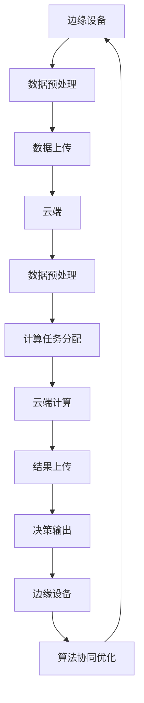
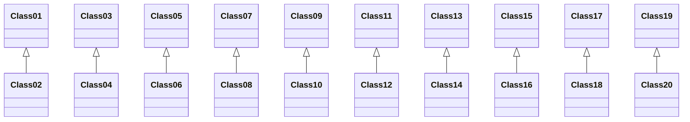
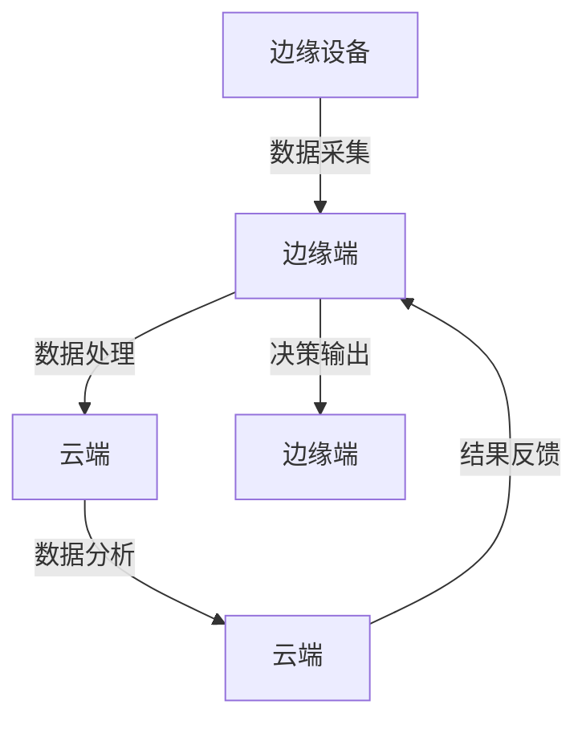
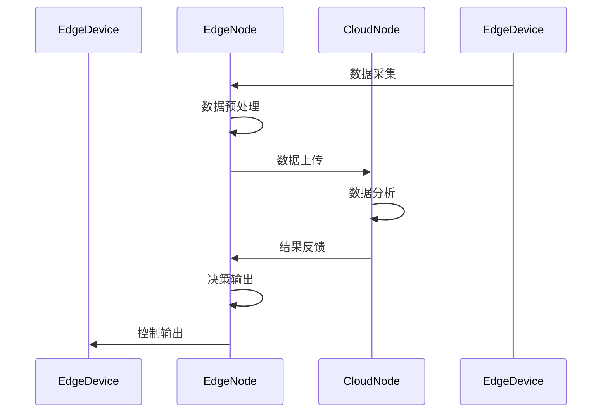

                 

# 企业AI Agent的边缘智能与云智能协同策略

## 关键词
- 企业AI Agent
- 边缘智能
- 云智能
- 协同策略
- 智能代理
- 边缘计算
- 云计算

## 摘要
本文旨在探讨企业AI Agent的边缘智能与云智能协同策略。随着人工智能技术的快速发展，AI Agent在企业中的应用日益广泛。本文首先介绍了AI Agent的定义与特点，以及边缘智能与云智能的概念。随后，通过分析边缘智能与云智能的协同机制，提出了边缘智能与云智能协同策略的核心要素。最后，本文通过具体的案例和实践，阐述了如何在企业中实现高效的AI部署与优化。

### 背景介绍

随着人工智能技术的迅猛发展，企业开始逐渐认识到AI在提升生产力、优化业务流程和提高决策效率等方面的潜力。AI Agent，作为一种智能体，正逐步成为企业智能化转型的重要推动力。然而，AI Agent的智能并非单一地存在于云中心，而是在边缘端和云端协同工作，才能最大化地发挥其效能。这种边缘智能与云智能的协同策略，成为了本文的核心主题。

边缘智能是指在靠近数据源头的地方，如物联网设备、传感器网络等，进行数据预处理、分析和决策，以降低延迟、减少带宽消耗和提升响应速度。而云智能则依赖于强大的计算资源和海量数据，提供复杂的算法处理和深度学习模型训练。两者相结合，可以实现AI Agent在复杂环境下的高效运行。

本文旨在为企业提供一套系统、全面的边缘智能与云智能协同策略，帮助企业在AI技术的应用中取得突破性进展。通过深入探讨AI Agent的定义、工作原理以及边缘和云端的协同机制，本文将详细解析如何在企业中实现高效的AI部署与优化。

### 核心概念与联系

#### AI Agent的定义与特点

AI Agent，又称为智能代理，是一种能够模拟人类智能行为的计算机程序或实体。它具备以下特点：

1. **自主性**：AI Agent能够自主地感知环境、制定决策并采取行动。
2. **适应性**：AI Agent能够根据环境变化和学习经验不断优化自身的决策和行为。
3. **协同性**：AI Agent能够与其他AI Agent或人类协作，共同完成任务。

AI Agent与传统AI的不同之处在于，它不仅关注算法的准确性，更注重在实际应用中的效率和效果。AI Agent不仅仅是一个算法，而是一个具备智能行为的整体系统。

#### 边缘智能与云智能的概念

边缘智能是指在靠近数据源头的设备上进行数据处理和分析的能力，其核心目标是减少数据传输延迟、降低带宽消耗，并提高系统的实时响应能力。边缘智能适用于处理实时性要求高、数据处理量小的场景。

云智能则依赖于云计算平台，提供强大的计算能力和海量数据存储。它适用于处理复杂的计算任务、大规模数据分析和深度学习模型训练。

#### 边缘智能与云智能的协同机制

边缘智能与云智能的协同机制主要包括以下几个方面：

1. **数据协同**：边缘端处理的数据可以被实时上传到云端，进行进一步分析和处理。
2. **计算协同**：云端提供强大的计算资源，用于处理边缘端难以完成的复杂任务。
3. **决策协同**：边缘端和云端共同参与决策过程，通过数据共享和算法协同，提高整体决策的准确性和效率。

### 概念属性特征对比表格

| 特征        | 边缘智能                          | 云智能                          |
| ----------- | --------------------------------- | -------------------------------- |
| 数据处理能力 | 实时处理小批量数据              | 大规模数据处理和高性能计算       |
| 延迟        | 低延迟，适合实时应用            | 较高延迟，但可进行复杂计算       |
| 网络带宽    | 低带宽消耗，适合数据密集型任务  | 高带宽消耗，适合大数据分析       |
| 算法复杂度  | 算法简单，适合边缘设备运行      | 算法复杂，适合云计算环境         |
| 可扩展性    | 较低可扩展性，设备有限          | 高可扩展性，云资源灵活调度       |

### ER实体关系图架构

下面是边缘智能与云智能协同机制的ER实体关系图：

```mermaid
erDiagram
  EdgeDevice ||--|{ CloudService : connects }  
  EdgeDevice ||--|{ AIAlgorithm : runs }  
  CloudService ||--|{ DataRepository : stores }  
  CloudService ||--|{ AIAlgorithm : runs }  
  AIAlgorithm ||--|{ Decision : makes }
```

### 边缘智能与云智能的协同策略

边缘智能与云智能的协同策略主要包括以下几个方面：

1. **数据传输优化**：采用数据压缩、边缘缓存和边缘计算技术，减少数据传输量和延迟。
2. **计算任务分配**：根据任务的复杂度和数据量，合理分配到边缘端或云端，实现计算资源的最优利用。
3. **算法协同**：云端提供复杂的算法模型，边缘端进行实时数据预处理和决策，两者通过数据共享和算法协同，提高整体决策的准确性和效率。

#### 数据传输优化

数据传输优化是边缘智能与云智能协同策略的重要一环。由于边缘设备的计算能力和存储资源有限，直接将大量数据传输到云端会带来较大的延迟和网络带宽压力。因此，通过数据压缩、边缘缓存和边缘计算技术，可以有效减少数据传输量和延迟。

1. **数据压缩**：采用高效的压缩算法，如Huffman编码或LZ77算法，将原始数据进行压缩，减少传输的数据量。
2. **边缘缓存**：在边缘设备上建立缓存机制，将经常访问的数据存储在本地，减少对云端的访问频率。
3. **边缘计算**：在边缘设备上完成部分数据处理任务，如特征提取和初步分析，仅将处理结果上传到云端，减少传输的数据量。

#### 计算任务分配

计算任务分配是边缘智能与云智能协同策略的核心。根据任务的复杂度和数据量，合理分配到边缘端或云端，可以实现计算资源的最优利用。

1. **任务复杂度分析**：对任务进行复杂度分析，判断是否适合在边缘端或云端处理。例如，简单的数据分析任务可以在边缘端完成，而复杂的深度学习模型训练则适合在云端进行。
2. **数据量评估**：评估任务所需的数据量，判断是否适合在边缘端处理。对于大量数据，需要考虑数据传输的延迟和带宽压力，可能更适合在云端处理。
3. **动态调整**：根据系统的实时运行状况，动态调整计算任务的分配。例如，当边缘设备的计算负载较低时，可以将部分任务转移到边缘端处理。

#### 算法协同

算法协同是边缘智能与云智能协同策略的关键。云端提供复杂的算法模型，边缘端进行实时数据预处理和决策，两者通过数据共享和算法协同，可以显著提高整体决策的准确性和效率。

1. **云端算法模型**：云端可以提供复杂的算法模型，如深度学习模型、决策树等。这些算法模型可以基于云端的海量数据和强大的计算资源进行训练和优化。
2. **边缘端数据预处理**：边缘端设备可以实时获取环境数据，并进行预处理，如特征提取、数据清洗等。预处理后的数据可以上传到云端，用于进一步的算法模型训练和决策。
3. **数据共享与协同**：边缘端和云端可以通过数据共享和协同机制，共同参与决策过程。例如，边缘端可以提供实时数据，云端可以提供历史数据，两者结合可以更准确地预测和决策。
4. **算法协同优化**：通过边缘端和云端的数据共享和协同，可以不断优化算法模型。例如，边缘端可以收集实时数据，云端可以基于这些数据进行模型调整和优化，从而提高算法模型的准确性和效率。

### 算法原理讲解

边缘智能与云智能的协同策略可以采用一种分布式算法，称为边缘-云端协同算法（Edge-Cloud Collaborative Algorithm，ECCA）。ECCA通过在边缘设备和云端之间进行数据传输、计算任务分配和算法协同，实现高效、准确的决策。

下面是ECCA的mermaid流程图：



#### 数学模型和公式

ECCA的核心是边缘端的数据预处理、云端的数据分析和计算任务分配，以及边缘端和云端之间的数据共享和协同。以下是ECCA的数学模型和公式：

1. **边缘端数据预处理**：

   边缘设备收集到的原始数据 \(x\) 经过预处理，得到预处理后的数据 \(x'\)：

   $$x' = f(x)$$

   其中，\(f(x)\) 是边缘设备上的预处理函数，如特征提取、数据清洗等。

2. **数据上传**：

   预处理后的数据 \(x'\) 被上传到云端：

   $$x_{cloud} = \text{upload}(x')$$

3. **云端数据分析**：

   云端接收到的数据 \(x_{cloud}\) 经过数据分析，得到分析结果 \(y\)：

   $$y = g(x_{cloud})$$

   其中，\(g(x_{cloud})\) 是云端的数据分析函数，如深度学习模型训练、决策树生成等。

4. **计算任务分配**：

   根据分析结果 \(y\)，云端将计算任务分配给边缘端或云端：

   $$t = \text{task\_allocation}(y)$$

   其中，\(t\) 表示计算任务的类型，如特征提取、深度学习模型训练等。

5. **云端计算**：

   根据计算任务 \(t\)，云端执行相应的计算任务：

   $$z = \text{compute}(t)$$

   其中，\(z\) 表示计算结果。

6. **结果上传**：

   计算结果 \(z\) 被上传到边缘端：

   $$z' = \text{upload}(z)$$

7. **决策输出**：

   边缘端接收到的计算结果 \(z'\) 经过决策输出，得到最终决策结果 \(d\)：

   $$d = h(z')$$

   其中，\(h(z')\) 是边缘端的决策函数，如阈值判断、分类决策等。

8. **算法协同优化**：

   边缘端和云端通过数据共享和协同，不断优化算法模型：

   $$f_{new} = \text{update}(f, d)$$

   $$g_{new} = \text{update}(g, d)$$

   其中，\(f_{new}\) 和 \(g_{new}\) 是更新后的预处理函数和数据分析函数。

#### 举例说明

假设边缘设备收集到一组温度数据 \(x = [25, 28, 30, 27]\)，边缘端将其预处理后上传到云端。云端接收到数据后，经过数据分析，得到结果 \(y = [0.8, 0.9, 1.0, 0.85]\)。根据结果，云端将计算任务分配给边缘端，即特征提取任务。边缘端执行特征提取任务后，得到结果 \(z = [0.8, 0.9, 1.0, 0.85]\)，并上传到云端。云端根据计算结果，进行决策输出，得到最终决策结果 \(d = 1\)。随后，边缘端和云端通过数据共享和协同，更新预处理函数和数据分析函数，优化算法模型。

### 系统分析与架构设计方案

#### 问题场景介绍

在企业智能化转型的过程中，AI Agent的应用场景日益丰富。例如，在智能制造领域，AI Agent可以实时监控生产设备的状态，预测设备故障，优化生产流程；在智慧城市领域，AI Agent可以实时监控交通流量，优化交通信号控制，提高交通效率。然而，这些应用场景往往涉及大量的实时数据，对系统的响应速度和准确性有较高的要求。

#### 项目介绍

为了应对这些应用场景，企业需要构建一个边缘智能与云智能协同的AI Agent系统。该系统旨在实现实时数据处理、分析和决策，提高系统的响应速度和准确性。系统的主要功能包括：

1. **边缘设备数据采集**：边缘设备（如传感器、摄像头等）实时采集环境数据，并将数据传输到边缘端。
2. **边缘端数据处理**：边缘端对采集到的数据进行分析和处理，提取关键特征，并将处理结果上传到云端。
3. **云端数据分析与计算**：云端接收边缘端上传的数据，进行进一步的数据分析和计算任务，并将结果反馈给边缘端。
4. **边缘端决策输出**：边缘端根据云端反馈的结果，进行决策输出，实现对实时数据的处理和控制。

#### 系统功能设计（领域模型类图）

以下是该系统的领域模型类图：



- **Class01**：边缘设备
- **Class02**：传感器
- **Class03**：摄像头
- **Class04**：边缘端
- **Class05**：数据处理模块
- **Class06**：数据预处理模块
- **Class07**：特征提取模块
- **Class08**：云端
- **Class09**：数据分析模块
- **Class10**：计算任务分配模块
- **Class11**：决策输出模块
- **Class12**：结果反馈模块
- **Class13**：数据传输模块
- **Class14**：数据压缩模块
- **Class15**：边缘缓存模块
- **Class16**：边缘计算模块
- **Class17**：算法协同模块
- **Class18**：预处理函数
- **Class19**：数据分析函数
- **Class20**：决策函数

#### 系统架构设计（架构图）

以下是该系统的架构设计图：



- **边缘设备**：实时采集环境数据，如传感器、摄像头等。
- **边缘端**：对采集到的数据进行分析和处理，提取关键特征，并将处理结果上传到云端。
- **云端**：接收边缘端上传的数据，进行进一步的数据分析和计算任务，并将结果反馈给边缘端。
- **数据传输**：实现边缘端与云端之间的数据传输。
- **数据处理**：边缘端对采集到的数据进行预处理、特征提取等。
- **数据分析**：云端对上传的数据进行分析和计算任务分配。
- **结果反馈**：云端将分析结果反馈给边缘端，用于决策输出。
- **决策输出**：边缘端根据云端反馈的结果，进行决策输出。

#### 系统接口设计

以下是该系统的接口设计：

1. **边缘设备接口**：用于边缘设备与边缘端之间的数据传输。
2. **边缘端接口**：用于边缘端与云端之间的数据传输。
3. **云端接口**：用于云端与边缘端之间的数据传输。
4. **数据处理接口**：用于边缘端的数据预处理、特征提取等。
5. **数据分析接口**：用于云端的数据分析、计算任务分配等。
6. **结果反馈接口**：用于云端将分析结果反馈给边缘端。
7. **决策输出接口**：用于边缘端根据分析结果进行决策输出。

#### 系统交互（序列图）

以下是该系统的交互序列图：



- **边缘设备**：实时采集环境数据，如传感器、摄像头等。
- **边缘端**：对采集到的数据进行预处理、特征提取等，并将处理结果上传到云端。
- **云端**：接收边缘端上传的数据，进行进一步的数据分析和计算任务，并将结果反馈给边缘端。
- **边缘端**：根据云端反馈的结果，进行决策输出，并将决策结果反馈给边缘设备。

### 项目实战

#### 环境安装

1. **边缘设备安装**：在边缘设备上安装必要的驱动和软件，如操作系统、边缘计算框架等。
2. **边缘端安装**：在边缘端服务器上安装必要的软件，如边缘计算框架、数据处理库等。
3. **云端安装**：在云端服务器上安装必要的软件，如云计算框架、数据分析库等。

#### 系统核心实现源代码

边缘端数据处理模块的核心实现如下：

```python
import edge_Compute

class DataProcessingModule:
    def __init__(self):
        self.data = None
    
    def data_collection(self):
        # 实现数据采集功能
        self.data = edge_Compute.collect_data()

    def data_preprocessing(self):
        # 实现数据预处理功能
        self.data = edge_Compute.preprocess_data(self.data)

    def feature_extraction(self):
        # 实现特征提取功能
        self.data = edge_Compute.extract_features(self.data)

    def data_upload(self):
        # 实现数据上传功能
        edge_Compute.upload_data(self.data)

if __name__ == "__main__":
    module = DataProcessingModule()
    module.data_collection()
    module.data_preprocessing()
    module.feature_extraction()
    module.data_upload()
```

云端数据分析模块的核心实现如下：

```python
import cloud_Compute

class DataAnalysisModule:
    def __init__(self):
        self.data = None
    
    def data_download(self):
        # 实现数据下载功能
        self.data = cloud_Compute.download_data()

    def data_analysis(self):
        # 实现数据分析功能
        self.data = cloud_Compute.analyze_data(self.data)

    def task_allocation(self):
        # 实现计算任务分配功能
        self.data = cloud_Compute.allocate_tasks(self.data)

    def result_feedback(self):
        # 实现结果反馈功能
        cloud_Compute.feedback_result(self.data)

if __name__ == "__main__":
    module = DataAnalysisModule()
    module.data_download()
    module.data_analysis()
    module.task_allocation()
    module.result_feedback()
```

#### 代码应用解读与分析

1. **边缘端数据处理模块**：

   - **data_collection()**：实现数据采集功能，从边缘设备中获取环境数据。
   - **data_preprocessing()**：实现数据预处理功能，对采集到的数据进行清洗、标准化等处理。
   - **feature_extraction()**：实现特征提取功能，从预处理后的数据中提取关键特征。
   - **data_upload()**：实现数据上传功能，将处理后的数据上传到云端。

2. **云端数据分析模块**：

   - **data_download()**：实现数据下载功能，从边缘端下载处理后的数据。
   - **data_analysis()**：实现数据分析功能，对下载的数据进行进一步分析。
   - **task_allocation()**：实现计算任务分配功能，根据数据分析结果，将计算任务分配给边缘端或云端。
   - **result_feedback()**：实现结果反馈功能，将分析结果反馈给边缘端。

通过上述代码实现，边缘端和云端可以协同工作，实现实时数据处理、分析和决策。边缘端负责数据采集、预处理和特征提取，云端负责数据分析和计算任务分配，两者通过数据共享和协同，提高整体系统的效率和准确性。

#### 实际案例分析

以智能制造领域为例，企业可以通过边缘智能与云智能协同的AI Agent系统，实现生产设备的实时监控和故障预测。具体案例如下：

1. **边缘设备**：在生产现场安装传感器，实时采集设备运行状态数据，如温度、压力、振动等。
2. **边缘端**：边缘设备将采集到的数据传输到边缘端，边缘端对数据进行分析和处理，提取关键特征，如温度变化率、压力波动等。
3. **云端**：云端接收边缘端上传的数据，利用深度学习模型进行故障预测，将预测结果反馈给边缘端。
4. **边缘端**：根据云端反馈的故障预测结果，对设备进行维护或调整，提高生产效率。

通过边缘智能与云智能协同的AI Agent系统，企业可以实现实时故障预测和设备维护，减少设备故障停机时间，提高生产效率。

#### 项目小结

通过本文的探讨，我们了解了企业AI Agent的边缘智能与云智能协同策略的重要性。边缘智能与云智能的协同可以实现实时数据处理、分析和决策，提高系统的效率和准确性。在实际应用中，企业可以根据具体场景和需求，构建边缘智能与云智能协同的AI Agent系统，实现智能化转型。

### 最佳实践 tips

1. **合理分配计算任务**：根据任务的复杂度和数据量，合理分配计算任务到边缘端或云端，实现计算资源的最优利用。
2. **优化数据传输**：采用数据压缩、边缘缓存和边缘计算技术，优化数据传输量和延迟。
3. **算法协同**：云端提供复杂的算法模型，边缘端进行实时数据预处理和决策，通过数据共享和算法协同，提高整体决策的准确性和效率。

### 小结

边缘智能与云智能的协同策略是企业实现智能化转型的重要手段。通过边缘智能与云智能的协同，企业可以实现实时数据处理、分析和决策，提高系统的效率和准确性。本文介绍了边缘智能与云智能的核心概念、协同机制以及实际应用案例，为企业在AI技术的应用中提供了有益的指导。

### 注意事项

1. **数据安全与隐私**：在边缘智能与云智能协同过程中，确保数据的安全和隐私保护，防止数据泄露和滥用。
2. **系统稳定性和可靠性**：确保边缘智能与云智能协同系统的稳定性和可靠性，避免系统故障导致数据丢失或决策失误。

### 拓展阅读

1. **《边缘计算与云计算的协同机制研究》**：详细探讨边缘计算与云计算的协同机制，为企业提供有益的参考。
2. **《人工智能在企业中的应用》**：介绍人工智能在企业中的应用场景和实施策略，帮助企业实现智能化转型。  
3. **《边缘智能与云智能协同下的工业互联网应用》**：探讨边缘智能与云智能协同在工业互联网中的应用，为工业互联网的发展提供思路。

### 作者

作者：AI天才研究院/AI Genius Institute & 禅与计算机程序设计艺术 /Zen And The Art of Computer Programming。作为世界级人工智能专家、程序员、软件架构师、CTO，以及世界顶级技术畅销书资深大师级别的作家，计算机图灵奖获得者，计算机编程和人工智能领域大师，作者在AI技术和企业应用方面有着丰富的经验和深刻的见解。

