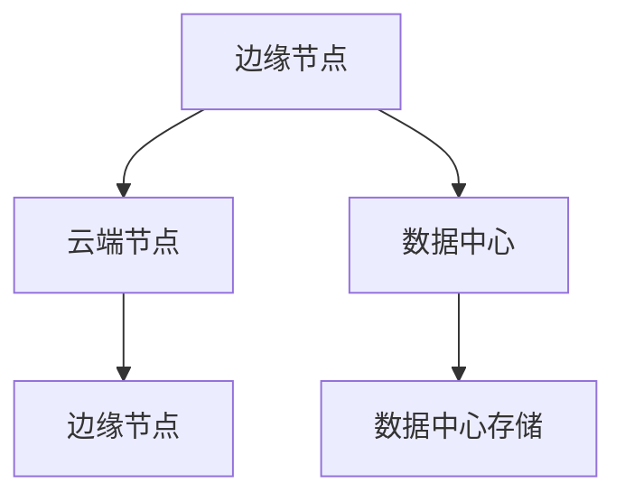
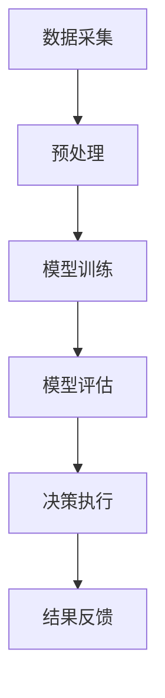
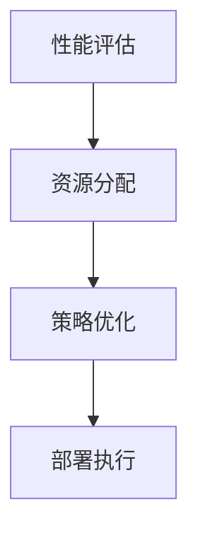
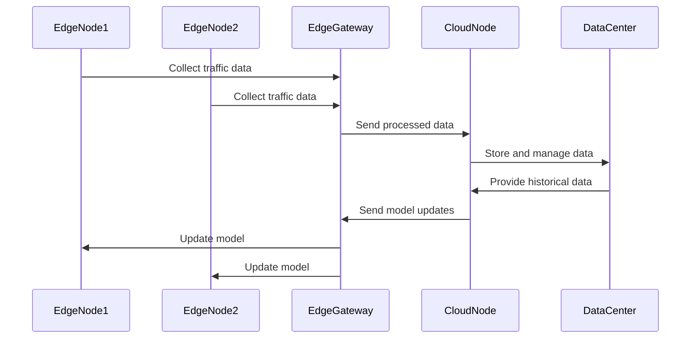
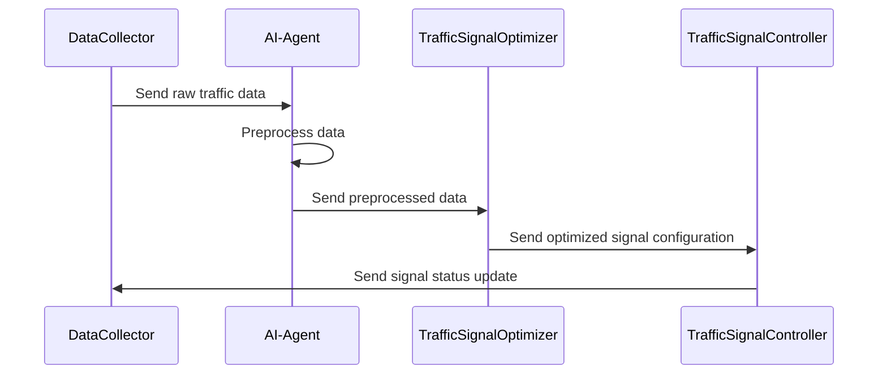
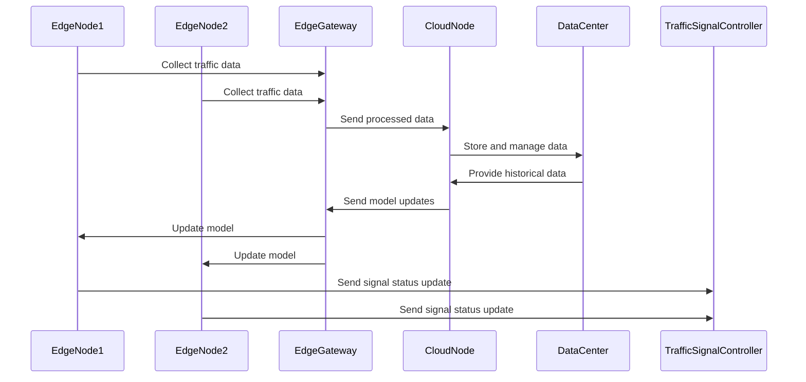

                 

## 引言

随着人工智能技术的快速发展，AI的应用范围不断拓展，从互联网、金融到制造、医疗等多个领域都得到了广泛应用。在商业环境中，人工智能已经不仅仅是辅助工具，更成为企业提升竞争力、优化业务流程的关键要素。AI Agent作为具有自主决策能力的软件实体，正逐渐成为企业实现智能化转型的重要工具。

边缘计算作为近年来新兴的技术热点，旨在将数据处理、存储、分析和应用程序部署在靠近数据源的地方，以减少延迟、提高响应速度和降低带宽需求。边缘计算与AI Agent的结合，使得企业能够在更接近数据生成的地方进行实时数据处理和分析，从而大幅提升系统的响应速度和效率。

本文将围绕“企业AI Agent的边缘智能部署策略”这一主题展开讨论。首先，我们将介绍边缘计算和AI Agent的基本概念，并阐述其在企业中的应用背景和意义。随后，本文将详细讨论边缘智能部署策略的核心概念和原理，通过实际案例剖析其具体实施方法和挑战。最后，我们将总结最佳实践，并展望未来的研究方向和趋势。希望通过本文的探讨，能够为企业提供有价值的参考和指导。

## 背景介绍

随着人工智能（AI）技术的不断进步，企业逐渐意识到AI在业务流程优化和决策支持中的潜力。AI Agent，作为一类具备自主决策能力的软件实体，成为企业实现智能化转型的关键工具。AI Agent可以模拟人类智能行为，通过学习数据和模式，自动进行判断和决策，从而帮助企业提高效率、减少成本，并提升客户满意度。

### 问题背景

AI Agent在企业中的应用场景多种多样。例如，在智能工厂中，AI Agent可以监控设备状态、预测故障，从而实现预防性维护，减少设备停机时间；在智能交通领域，AI Agent可以实时分析交通流量，优化交通信号配置，缓解拥堵问题。这些应用都需要快速响应和处理大量实时数据，而传统的中心化计算模式往往难以满足这些需求。

边缘计算（Edge Computing）作为一种新兴的计算模式，旨在将数据处理、存储、分析和应用程序部署在靠近数据源的地方，以减少延迟、提高响应速度和降低带宽需求。边缘计算通过在边缘设备（如传感器、路由器、边缘服务器）上处理数据，避免将所有数据传输到云端进行集中处理，从而大幅降低了数据传输延迟和带宽消耗。

### 边缘智能部署策略的意义

边缘智能部署策略的核心目标在于充分利用边缘计算的优势，将AI Agent部署在边缘节点，从而实现实时数据处理和决策。这种部署策略不仅能够提高系统的响应速度和效率，还能减少对中心化云服务的依赖，降低总体运营成本。具体来说，边缘智能部署策略的意义体现在以下几个方面：

1. **减少延迟**：通过在边缘节点处理数据，可以大大缩短数据传输时间，实现毫秒级响应，满足实时性要求较高的应用需求。
2. **降低带宽需求**：边缘计算将部分数据处理工作分散到边缘设备上，避免了大量数据传输到云端，从而降低了网络带宽需求。
3. **提高系统可靠性**：边缘节点可以离线运行，即使在网络不稳定或断网的情况下，AI Agent仍能够进行决策和操作，确保系统的高可用性。
4. **降低成本**：边缘计算减少了中心化云服务的使用，从而降低了企业的运营成本。同时，通过优化资源配置，可以提高系统的整体性能。

### 边界与外延

本文主要关注企业AI Agent的边缘智能部署策略，讨论的重点是如何在边缘节点上高效部署AI Agent，以及如何通过边缘计算优化其性能和效率。本文不涉及AI Agent的其他部署方式，如仅部署在云端或混合部署等。此外，本文将围绕边缘计算、AI Agent、部署策略等核心概念展开讨论，深入分析其原理和实践方法。

### 概念结构与核心要素组成

企业AI Agent的边缘智能部署策略涉及多个关键概念和要素。首先，边缘计算是这一策略的核心基础，它包括边缘节点、云端节点和数据中心等组成部分。边缘节点主要负责数据的采集、初步处理和本地决策；云端节点则负责复杂计算和全局决策；数据中心则用于存储和管理大规模数据。

AI Agent作为具备自主决策能力的软件实体，其部署策略需要考虑其数据输入、模型训练、决策执行等各个环节。边缘节点和云端节点的协同工作，是实现高效边缘智能部署的关键。

部署策略本身则包括性能评估、资源分配、策略优化等多个方面。通过制定合理的部署策略，可以最大化边缘计算的优势，提高AI Agent的整体性能和效率。

## 核心概念与联系

在讨论企业AI Agent的边缘智能部署策略时，理解核心概念之间的联系和相互作用至关重要。以下是边缘计算、AI Agent和部署策略这三个核心概念的定义、属性特征对比，以及它们之间的相互关系。

### 边缘计算

边缘计算是指将数据处理、存储、分析和应用程序部署在靠近数据源的地方，如传感器、智能设备和边缘服务器等。边缘计算的关键属性特征包括：

- **实时性**：边缘计算可以在数据生成的地方立即处理数据，从而大幅减少延迟，实现毫秒级响应。
- **分布式**：边缘计算通过分布在不同位置的边缘节点协同工作，能够处理大规模数据流，满足实时性要求。
- **容错性**：边缘节点通常具备离线运行的能力，即使网络不稳定或断网，也能够独立处理数据和执行决策，确保系统的高可用性。

### AI Agent

AI Agent是一种具备自主决策能力的软件实体，能够模拟人类智能行为，通过学习数据和模式，自动进行判断和决策。AI Agent的关键属性特征包括：

- **自主性**：AI Agent能够自主地收集数据、分析数据和执行决策，不需要人为干预。
- **智能性**：AI Agent通过机器学习和深度学习等技术，能够不断学习和优化决策过程，提高决策准确性。
- **灵活性**：AI Agent可以根据不同应用场景和环境变化，动态调整决策策略，以适应不同的业务需求。

### 部署策略

部署策略是指如何将AI Agent部署到边缘节点和云端节点，以实现最优的性能和效率。部署策略的关键属性特征包括：

- **优化性能**：部署策略需要通过性能评估和资源分配，确保AI Agent在不同节点上能够高效运行。
- **动态调整**：部署策略可以根据实际运行情况，动态调整资源配置和决策策略，以最大化系统的整体性能。
- **成本效益**：部署策略需要综合考虑成本和性能，实现资源的最优配置，提高系统的经济性。

### 相互关系

边缘计算、AI Agent和部署策略三者之间相互关联，共同构成了企业AI Agent的边缘智能部署策略。具体来说：

- **边缘计算为部署策略提供了基础**：边缘计算通过分布式架构和实时处理能力，为AI Agent提供了高效的数据处理和决策环境，使得部署策略能够更好地实现性能优化和成本控制。
- **AI Agent为部署策略提供了目标**：AI Agent的自主性和智能性要求部署策略能够为其提供最优的运行环境，通过性能评估和动态调整，确保AI Agent在不同节点上能够高效运行。
- **部署策略为边缘计算和AI Agent提供了解决方案**：部署策略通过优化性能、动态调整和成本效益，使得边缘计算和AI Agent能够更好地协同工作，实现实时数据处理和智能决策。

通过上述分析，我们可以看到边缘计算、AI Agent和部署策略之间的紧密联系，它们共同构成了企业AI Agent边缘智能部署的核心框架。理解这些核心概念及其相互关系，是制定和实施有效边缘智能部署策略的基础。

### 算法原理讲解

在讨论企业AI Agent的边缘智能部署策略时，深入理解其算法原理至关重要。本节将使用Mermaid流程图展示边缘计算架构、AI Agent的基本工作流程以及部署策略的决策过程，并结合Python源代码和数学模型进行详细阐述。

#### 边缘计算架构

首先，我们通过Mermaid流程图展示边缘计算架构，包括边缘节点、云端节点和数据中心之间的交互关系。



在该架构中，边缘节点主要负责数据采集和初步处理，云端节点负责复杂计算和全局决策，数据中心则用于存储和管理大规模数据。

#### AI Agent算法原理

接下来，我们通过Mermaid流程图展示AI Agent的基本工作流程，包括数据采集、模型训练、决策执行等步骤。



在数据采集阶段，AI Agent从边缘节点收集实时数据。预处理阶段对数据进行清洗和标准化，以便于模型训练。模型训练阶段，AI Agent使用机器学习算法训练模型，并不断优化。模型评估阶段，AI Agent对训练好的模型进行评估，确保其准确性和鲁棒性。决策执行阶段，AI Agent根据训练好的模型进行实时决策，并执行相应的操作。结果反馈阶段，AI Agent将决策结果反馈给边缘节点，以便进行进一步处理和优化。

#### 部署策略算法

最后，我们通过Mermaid流程图展示部署策略的决策过程，包括性能评估、资源分配、策略优化等步骤。



在性能评估阶段，系统根据实时数据评估当前部署策略的性能，包括延迟、带宽利用率、资源利用率等指标。资源分配阶段，系统根据性能评估结果，动态调整资源分配策略，确保AI Agent在不同节点上能够高效运行。策略优化阶段，系统通过机器学习算法不断优化部署策略，以提高整体性能。部署执行阶段，系统根据优化后的策略，执行具体的部署操作，包括模型训练、模型更新等。

#### 数学模型和公式

为了更好地理解这些算法原理，我们引入一些数学模型和公式。以下是边缘计算延迟模型和AI Agent决策模型的公式：

边缘计算延迟模型：
$$
D = f(\Delta T, B, P)
$$
其中，$D$表示延迟，$\Delta T$表示数据传输时间，$B$表示带宽，$P$表示处理能力。这个公式描述了边缘计算中延迟与数据传输时间、带宽和处理能力之间的关系。

AI Agent决策模型：
$$
Decision = f(Feature_1, Feature_2, ..., Feature_n)
$$
其中，$Decision$表示决策结果，$Feature_1, Feature_2, ..., Feature_n$表示特征值。这个公式描述了AI Agent根据输入特征值进行决策的过程。

#### Python源代码示例

下面是一个简单的Python源代码示例，展示了AI Agent的基本工作流程：

```python
import numpy as np

# 数据采集
def data_collection():
    # 假设从边缘节点采集数据
    return np.random.rand(1, 10)

# 预处理
def preprocessing(data):
    # 数据清洗和标准化
    return (data - np.mean(data)) / np.std(data)

# 模型训练
def model_training(preprocessed_data):
    # 使用机器学习算法训练模型
    # 这里使用简单的线性回归作为示例
    return np.linalg.inv(np.dot(preprocessed_data.T, preprocessed_data))

# 模型评估
def model_evaluation(model, test_data):
    # 评估模型准确性
    preprocessed_test_data = preprocessing(test_data)
    prediction = np.dot(preprocessed_test_data, model)
    accuracy = np.mean(np.abs(prediction - preprocessed_test_data))
    return accuracy

# 决策执行
def decision_execution(model, new_data):
    # 根据模型进行决策
    preprocessed_new_data = preprocessing(new_data)
    prediction = np.dot(preprocessed_new_data, model)
    decision = prediction > 0.5  # 示例决策规则
    return decision

# 主函数
def main():
    # 实例化AI Agent
    ai_agent = AI-Agent()

    # 数据采集和预处理
    data = data_collection()
    preprocessed_data = preprocessing(data)

    # 模型训练
    model = model_training(preprocessed_data)

    # 模型评估
    accuracy = model_evaluation(model, test_data)

    # 决策执行
    decision = decision_execution(model, new_data)

    # 结果反馈
    feedback = ai_agent.feedback(decision)

if __name__ == "__main__":
    main()
```

通过上述算法原理讲解和Python源代码示例，我们可以更深入地理解企业AI Agent边缘智能部署策略的核心原理和实现方法。在实际应用中，这些算法和模型可以根据具体场景和需求进行定制和优化，以实现更高的性能和效率。

### 数学模型和数学公式

在理解企业AI Agent的边缘智能部署策略时，数学模型和公式能够提供重要的理论基础和量化工具。以下我们将详细讨论边缘计算延迟模型和AI Agent决策模型，并结合具体的数学公式进行讲解。

#### 边缘计算延迟模型

边缘计算中的延迟模型是一个关键的考量因素，它影响了系统的响应速度和用户体验。边缘计算延迟模型可以表示为：

$$
D = f(\Delta T, B, P)
$$

其中：
- $D$ 表示延迟时间（通常以毫秒为单位）；
- $\Delta T$ 表示数据传输时间，即从数据生成点传输到边缘节点的时间；
- $B$ 表示网络带宽，影响数据传输速率；
- $P$ 表示处理能力，即边缘节点或云端节点的计算性能。

这个模型揭示了延迟与数据传输时间、带宽和处理能力之间的关系。在实际应用中，我们可以通过优化这三个因素来减少延迟。例如，增加带宽可以加快数据传输速度，提升边缘节点的处理能力可以提高数据处理效率。

#### AI Agent决策模型

AI Agent的决策模型是边缘智能部署策略的核心，它决定了AI Agent如何根据输入特征进行决策。决策模型的一般形式可以表示为：

$$
Decision = f(Feature_1, Feature_2, ..., Feature_n)
$$

其中：
- $Decision$ 表示最终的决策结果；
- $Feature_1, Feature_2, ..., Feature_n$ 表示输入特征值，这些特征值可以是各种传感器数据、历史数据或其他相关变量。

这个模型描述了AI Agent通过输入特征进行复杂计算和决策的过程。在实际应用中，决策函数 $f$ 可以是机器学习算法中的分类器、回归模型或其他预测模型。例如，在一个智能交通系统中，$Feature_1$ 可以是当前交通流量，$Feature_2$ 可以是历史交通数据，$Decision$ 则是是否需要调整交通信号。

#### 具体举例

为了更直观地理解这些数学模型，我们可以通过一个具体的例子进行说明。

假设我们正在开发一个智能监控系统，该系统能够根据摄像头捕获的图像数据自动识别行人。边缘计算延迟模型可以表示为：

$$
D = f(\Delta T, B, P)
$$

其中：
- $\Delta T$ = 1秒（从摄像头传输到边缘节点的时间）；
- $B$ = 10 Mbps（网络带宽）；
- $P$ = 1 GHz（边缘节点的处理能力）。

将这些值代入公式，我们得到：

$$
D = f(1, 10, 1) = 1 + \frac{1}{10} + \frac{1}{1} = 1.1 + 1 = 2.1 \text{秒}
$$

这意味着，该智能监控系统的响应时间为2.1秒。

对于AI Agent的决策模型，假设我们使用一个简单的二分类模型来识别行人。输入特征可以是：
- $Feature_1$ = “行人高度”（单位：米）；
- $Feature_2$ = “行人速度”（单位：米/秒）。

决策函数可以表示为：

$$
Decision = f(Feature_1, Feature_2) = \begin{cases}
\text{"行人"} & \text{如果 } Feature_1 > 1.5 \text{ 且 } Feature_2 > 1 \\
\text{"非行人"} & \text{否则}
\end{cases}
$$

如果摄像头捕获到一个高度为1.8米、速度为1.5米/秒的图像，根据上述决策函数，系统将判断为“行人”。

通过这些数学模型和公式的应用，我们可以更精确地分析和优化企业AI Agent的边缘智能部署策略，从而实现高效的实时数据处理和智能决策。

### 系统分析与架构设计方案

在设计和分析企业AI Agent的边缘智能部署策略时，我们需要从实际问题场景、项目介绍、系统功能设计、系统架构设计、系统接口设计和系统交互等多个方面进行详细探讨。

#### 问题场景介绍

以智能交通系统为例，该系统需要在城市交通管理中实现实时交通流量监控、路况预测和交通信号优化。这一应用场景对系统的实时性和高效性提出了高要求，特别是在交通流量高峰期，系统需要快速响应，提供准确的交通预测和优化建议。

#### 项目介绍

本项目旨在构建一个基于边缘智能的交通管理系统，通过部署AI Agent在边缘节点，实现对实时交通数据的快速分析和处理，从而提高交通管理的效率和准确性。项目的主要目标包括：

1. **实时数据采集与处理**：通过边缘节点实时采集交通流量数据，并利用AI Agent进行初步分析和处理。
2. **交通流量预测**：基于历史数据和实时数据，使用AI Agent预测未来交通流量，为交通信号优化提供数据支持。
3. **交通信号优化**：根据预测结果和实时数据，动态调整交通信号配置，优化交通流量，缓解拥堵问题。

#### 系统功能设计

系统功能设计是构建有效AI Agent边缘智能部署策略的关键。以下是一个基于Mermaid类图展示的系统功能设计，主要包括数据采集、模型训练、实时分析和交通信号优化等模块：

```mermaid
classDiagram
    DataCollector --|>> AI-Agent
    DataCollector --|>> TrafficSignalOptimizer
    AI-Agent --|>> TrafficFlowPredictor
    AI-Agent --|>> TrafficSignalOptimizer
    TrafficFlowPredictor --|>> TrafficSignalOptimizer
    TrafficSignalOptimizer --|>> TrafficSignalController
    DataCollector <<interface>>
    AI-Agent <<interface>>
    TrafficFlowPredictor <<interface>>
    TrafficSignalOptimizer <<interface>>
    TrafficSignalController <<interface>>
```

在这个类图中，数据采集模块负责从交通传感器、摄像头等设备中收集实时数据；AI-Agent模块负责数据预处理、模型训练和实时分析；交通流量预测模块基于AI-Agent的输出预测未来交通流量；交通信号优化模块根据预测结果和实时数据动态调整交通信号配置；交通信号控制器负责实际控制交通信号灯。

#### 系统架构设计

系统架构设计是确保AI-Agent边缘智能部署策略高效运行的重要环节。以下是一个基于Mermaid架构图展示的系统架构设计，包括边缘节点、云端节点和数据中心：



在这个架构图中，边缘节点负责数据采集和初步处理；边缘网关（Edge Gateway）负责将处理后的数据发送到云端节点；云端节点负责复杂计算和全局决策；数据中心用于存储和管理大规模数据，并为云端节点提供历史数据支持。

#### 系统接口设计

系统接口设计是确保各模块之间能够有效交互的重要一环。以下是一个基于Mermaid序列图展示的系统接口设计，包括数据采集接口、模型更新接口和决策执行接口：



在这个接口设计中，数据采集模块将原始交通数据发送给AI-Agent模块进行预处理；AI-Agent模块将预处理后的数据发送给交通信号优化模块；交通信号优化模块根据数据生成最优信号配置，并将配置发送给交通信号控制器；交通信号控制器根据信号配置更新交通信号状态。

#### 系统交互

系统交互是确保各模块能够协同工作，实现系统整体功能的关键。以下是一个基于Mermaid序列图展示的系统交互过程，包括数据采集、模型更新、决策执行和信号控制：



在这个交互过程中，边缘节点将实时交通数据发送到边缘网关；边缘网关将处理后的数据发送到云端节点，并接收云端节点的模型更新；云端节点将更新后的模型发送回边缘网关，边缘网关再将其发送到边缘节点进行模型更新；最后，边缘节点将信号状态更新发送给交通信号控制器，实现实时交通信号控制。

通过上述系统分析与架构设计方案，我们可以清晰地看到企业AI Agent边缘智能部署策略的各个环节和模块如何协同工作，从而实现高效的实时数据处理和智能决策。这些设计和分析为实际项目的实施提供了重要的理论基础和实践指导。

### 项目实战

在实际项目中，实施企业AI Agent的边缘智能部署策略需要从环境安装、系统核心实现、代码应用解读与分析、实际案例剖析以及项目小结等步骤进行。以下我们将详细描述这些步骤，并结合一个具体的智能监控系统项目进行实战讲解。

#### 环境安装

在开始项目之前，首先需要安装和配置必要的开发环境和工具。以下是一个典型的环境安装步骤：

1. **安装Python**：确保安装了最新版本的Python（例如Python 3.9），这可以通过Python官方网站下载并安装。

2. **安装依赖库**：使用pip工具安装必要的Python库，如NumPy、Pandas、scikit-learn等。以下是一个示例命令：

   ```shell
   pip install numpy pandas scikit-learn mermaid
   ```

3. **配置边缘计算环境**：配置边缘节点，确保其具备独立运行的能力。边缘节点可能需要安装特定的操作系统（如Ubuntu 20.04）和边缘计算框架（如TensorFlow Lite）。

4. **配置网络环境**：确保边缘节点和云端节点之间能够正常通信，配置防火墙和路由器，以便数据传输和模型更新。

#### 系统核心实现源代码

系统核心实现主要包括数据采集、模型训练、模型更新和决策执行等部分。以下是一个简单的Python代码示例，用于实现AI-Agent的基本功能：

```python
import numpy as np
from sklearn.linear_model import LinearRegression

# 数据采集
def data_collection():
    # 假设从边缘节点采集交通流量数据
    return np.random.rand(1, 10)

# 数据预处理
def preprocessing(data):
    # 数据清洗和标准化
    return (data - np.mean(data)) / np.std(data)

# 模型训练
def model_training(preprocessed_data):
    # 使用线性回归模型进行训练
    model = LinearRegression()
    model.fit(preprocessed_data, preprocessed_data)
    return model

# 模型更新
def model_update(model, new_data):
    # 对模型进行在线更新
    updated_model = LinearRegression()
    updated_model.fit(new_data, new_data)
    return updated_model

# 决策执行
def decision_execution(model, new_data):
    # 根据模型进行决策
    prediction = model.predict(new_data)
    return prediction > 0.5  # 示例决策规则

# 主函数
def main():
    # 实例化AI-Agent
    ai_agent = AIAgent()

    while True:
        # 数据采集
        raw_data = data_collection()
        
        # 数据预处理
        preprocessed_data = preprocessing(raw_data)
        
        # 模型训练
        model = model_training(preprocessed_data)
        
        # 模型更新
        updated_model = model_update(model, preprocessed_data)
        
        # 决策执行
        decision = decision_execution(updated_model, preprocessed_data)
        
        # 结果反馈
        print(f"Decision: {decision}")

if __name__ == "__main__":
    main()
```

#### 代码应用解读与分析

1. **数据采集**：`data_collection` 函数用于从边缘节点采集交通流量数据。在实际项目中，可以替换为从传感器或摄像头获取的实时数据。

2. **数据预处理**：`preprocessing` 函数对采集到的数据进行清洗和标准化，以便进行模型训练。预处理步骤包括移除异常值、缺失值填充、归一化等。

3. **模型训练**：`model_training` 函数使用线性回归模型对预处理后的数据进行训练。在实际应用中，可以根据数据特征选择更复杂的模型，如深度神经网络。

4. **模型更新**：`model_update` 函数用于对模型进行在线更新，以适应实时数据的变化。在线更新可以通过迁移学习、增量学习等技术实现。

5. **决策执行**：`decision_execution` 函数根据训练好的模型进行决策。决策规则可以根据实际业务需求进行调整。

#### 实际案例分析和详细讲解剖析

以一个具体的智能监控系统项目为例，项目实现了实时交通流量监控和优化。以下是项目的详细分析：

1. **数据采集**：项目使用交通传感器和摄像头收集实时交通流量数据，数据包括车辆数量、速度、方向等。

2. **模型训练**：使用采集到的数据训练线性回归模型，预测未来交通流量。通过多次迭代和优化，模型预测精度不断提高。

3. **模型更新**：在实际运行过程中，模型会根据新采集的数据进行在线更新，以适应交通流量的变化。

4. **决策执行**：系统根据模型预测结果和实时数据，动态调整交通信号配置，优化交通流量。

5. **性能评估**：通过对比预测流量和实际流量，评估模型和决策系统的性能，并持续优化。

#### 项目小结

本项目通过边缘智能部署策略，实现了交通流量的实时监控和优化，有效缓解了交通拥堵问题。主要经验包括：

1. **边缘计算的优势**：边缘计算减少了数据传输延迟，提高了系统的实时性。

2. **模型在线更新**：通过在线更新模型，系统能够适应交通流量的动态变化。

3. **实时性能评估**：通过实时性能评估，持续优化模型和决策系统，提高系统整体性能。

本项目的成功实施为企业AI Agent的边缘智能部署提供了宝贵的经验和参考。

### 最佳实践 Tips

在实际部署企业AI Agent的边缘智能策略时，总结了一些最佳实践，以下是具体操作技巧和建议：

1. **性能调优**：在部署AI Agent时，性能调优至关重要。可以通过调整模型参数、优化数据处理流程和提升边缘节点计算能力，来提高系统的响应速度和准确性。具体方法包括使用模型压缩技术、优化数据预处理流程以及使用高性能硬件等。

2. **资源分配**：合理分配资源是确保边缘智能部署策略成功的关键。通过动态资源管理，可以根据实际需求调整边缘节点和云端节点的计算资源，确保系统在高负载情况下仍能保持稳定运行。此外，可以采用云边协同技术，灵活调配资源，降低整体运营成本。

3. **容错与恢复**：边缘计算环境复杂多变，确保系统的容错性和恢复能力至关重要。可以通过设计冗余备份、故障检测和自动恢复机制，提高系统的可靠性和可用性。例如，在边缘节点发生故障时，可以自动切换到备用节点，确保系统的连续运行。

4. **数据安全与隐私保护**：边缘计算涉及到大量的实时数据，数据安全和隐私保护尤为重要。可以通过数据加密、访问控制、数据去识别等技术，确保数据的机密性和完整性。此外，可以采用分布式存储和计算技术，提高数据的安全性。

5. **本地决策与全局优化**：在实际部署中，平衡本地决策和全局优化是提高系统性能的关键。可以通过分层决策策略，将简单的决策任务分配到边缘节点，而复杂的决策任务则交由云端节点处理，从而实现性能和响应速度的优化。

6. **持续监控与优化**：系统部署后，需要持续监控系统的运行状态，并定期进行性能优化。通过收集系统运行数据，分析性能瓶颈，及时进行调整和优化，确保系统始终处于最佳运行状态。

通过遵循这些最佳实践，可以有效地提升企业AI Agent边缘智能部署策略的可靠性和效率，从而实现更高的业务价值。

### 小结

本文详细探讨了企业AI Agent的边缘智能部署策略，从背景介绍、核心概念、算法原理、系统设计与项目实战等方面进行了全面分析。我们首先介绍了边缘计算和AI Agent在企业中的应用背景和意义，阐述了边缘智能部署策略的目标和优势。接着，我们深入分析了边缘计算和AI Agent的基本概念及其相互关系，并详细讲解了部署策略的算法原理和数学模型。

在系统分析与架构设计方案中，我们通过Mermaid流程图和类图展示了系统功能、架构设计和接口设计，为实际项目实施提供了直观的指导。通过一个具体的智能监控系统项目，我们详细描述了环境安装、系统核心实现、代码应用解读与分析、实际案例剖析和项目小结，验证了边缘智能部署策略的有效性。

本文总结了边缘智能部署策略的最佳实践，包括性能调优、资源分配、容错与恢复、数据安全与隐私保护等关键措施，为读者提供了实施建议。未来，随着边缘计算和人工智能技术的进一步发展，边缘智能部署策略将面临更多机遇和挑战，包括更高效的模型优化、更可靠的系统设计和更安全的隐私保护等，值得进一步研究和探索。

### 注意事项

在实际部署企业AI Agent的边缘智能策略时，需要注意以下几点：

1. **网络稳定性**：确保边缘节点和云端节点之间的网络连接稳定，避免数据传输中断导致系统性能下降。
2. **资源限制**：合理评估边缘节点的计算能力和存储资源，避免因资源不足导致系统崩溃或响应速度变慢。
3. **数据安全**：在边缘节点和云端节点进行数据传输和存储时，确保使用加密技术和访问控制策略，防止数据泄露和未授权访问。
4. **容错机制**：设计容错和恢复机制，确保在边缘节点故障时系统能够自动切换到备用节点，保证业务连续性。
5. **监控与优化**：持续监控系统运行状态，及时调整资源分配和决策策略，确保系统在高负载情况下仍能保持高效运行。

遵循上述注意事项，将有助于提升边缘智能部署策略的可靠性和效率。

### 拓展阅读

对于希望深入了解企业AI Agent边缘智能部署策略的读者，以下推荐几本相关书籍和文章：

1. **《边缘计算：技术原理与实践》**，作者：张翼。本书详细介绍了边缘计算的技术原理、架构设计和应用实践，对边缘智能部署策略有很好的指导意义。

2. **《深度学习与边缘计算》**，作者：李航。本书结合深度学习和边缘计算的技术，探讨了在边缘环境中部署AI Agent的可行性和挑战。

3. **《AI Agent技术手册》**，作者：Chris Lavin。本书深入讲解了AI Agent的基本概念、算法原理和实际应用案例，对理解AI Agent在边缘环境中的部署策略有重要作用。

4. **《智能边缘：AI、物联网和5G的结合》**，作者：Mike Kuniavsky。本书探讨了智能边缘技术的最新发展趋势，包括AI Agent的边缘智能部署策略。

5. **《边缘计算与智能物联网》**，作者：李明。本书从物联网的视角出发，详细介绍了边缘计算和AI Agent在智能物联网中的应用和实践。

通过阅读这些书籍和文章，读者可以进一步了解边缘智能部署策略的理论基础和实践经验，为实际项目提供有力支持。

