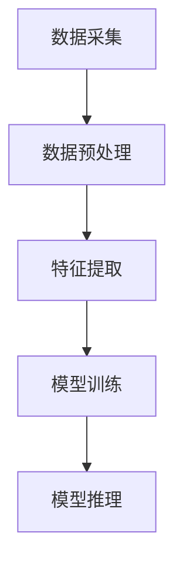
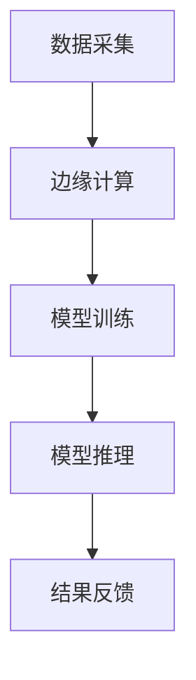
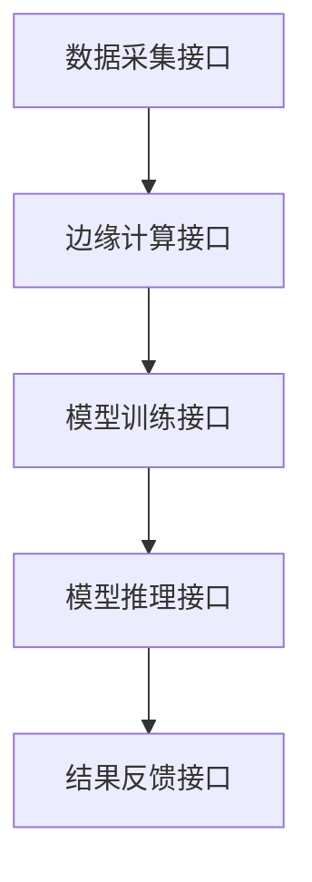
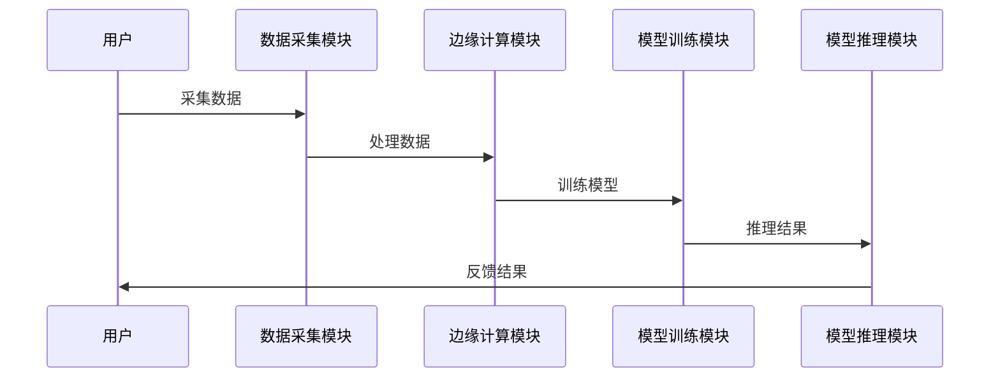

                 


# 企业AI Agent的边缘计算在物联网场景中的实践

关键词：企业AI Agent、边缘计算、物联网、数据处理、智能决策

摘要：随着物联网技术的快速发展，企业AI Agent作为一种具有自主学习和决策能力的智能体，其在物联网场景中的边缘计算应用日益受到关注。本文将详细介绍企业AI Agent在边缘计算中的实践，分析其核心概念、算法原理，并探讨其在物联网场景中的应用。

## Step 1: 背景介绍

### 1.1.1 问题背景

随着物联网（IoT）技术的发展，各种智能设备不断涌现，海量数据生成和实时处理的需求日益增长。传统的云计算模式在处理这些数据时，往往面临着延迟高、带宽不足、安全性问题等挑战。边缘计算作为一种新兴的计算范式，通过在靠近数据源的地方进行计算，可以有效缓解这些问题。

### 1.1.2 问题描述

企业AI Agent是一种具有自主学习和决策能力的智能体，能够在物联网环境中提供个性化的服务。然而，如何将企业AI Agent有效地部署在边缘计算环境中，实现高效、实时、安全的数据处理，是一个亟待解决的问题。

### 1.1.3 问题解决

边缘计算提供了一种解决方案，通过将计算任务分布到靠近数据源的边缘设备上，可以降低数据传输延迟，提高系统响应速度，同时也能够更好地保护数据隐私和安全。

### 1.1.4 边界与外延

边缘计算不仅应用于物联网，还涉及到智能家居、智能交通、智能医疗等多个领域。本书将重点讨论企业AI Agent在物联网场景中的边缘计算实践。

### 1.1.5 概念结构与核心要素组成

- 物联网（IoT）：连接物理世界的智能设备和传感器网络。
- 边缘计算：在靠近数据源的地方进行数据处理和计算。
- 企业AI Agent：具有自主学习和决策能力的智能体。

## Step 2: 核心概念与联系

### 1.2.1 边缘计算的定义与特点

边缘计算是一种分布式计算架构，通过在靠近数据源的地方（如智能设备、传感器等）进行计算，以减少数据传输延迟，提高处理效率。

### 1.2.2 企业AI Agent的定义与特点

企业AI Agent是一种智能体，它能够模拟人类决策，具有自主学习能力，能够在物联网环境中提供个性化服务。

### 1.2.3 物联网与边缘计算、企业AI Agent的关系

物联网提供了大量的数据来源，边缘计算提供了数据处理的能力，而企业AI Agent则将这两者结合起来，实现了智能化的数据分析和决策。

### 1.2.4 核心概念属性特征对比表格

| 特征                | 边缘计算               | 企业AI Agent                 | 物联网                           |
|---------------------|-----------------------|-----------------------------|---------------------------------|
| 定义                | 分布式计算架构        | 自主学习和决策能力的智能体   | 智能设备和传感器网络             |
| 目标                | 降低延迟、提高效率    | 提供个性化服务              | 连接物理世界和数字世界           |
| 关键技术            | 网络传输优化、分布式计算 | 机器学习、深度学习           | 网络通信、数据采集与处理         |

## Step 3: 算法原理讲解

### 1.3.1 边缘计算算法概述

边缘计算算法主要包括数据采集、数据预处理、特征提取、模型训练、模型推理等步骤。

### 1.3.2 数据采集与预处理

数据采集是边缘计算的基础，需要从物联网设备中获取实时数据。预处理包括数据清洗、归一化等操作，以提高数据质量。

### 1.3.3 特征提取

特征提取是将原始数据转换成能够表示数据本质的向量，常用的方法包括主成分分析（PCA）、自编码器等。

### 1.3.4 模型训练

模型训练是边缘计算的核心，可以使用监督学习、无监督学习等方法来训练模型。训练过程中，需要考虑数据分布、模型参数优化等问题。

### 1.3.5 模型推理

模型推理是将训练好的模型应用于新的数据，进行预测或决策。推理过程中，需要考虑实时性、准确性等因素。

### 1.3.6 企业AI Agent的边缘计算算法流程图

使用Mermaid画出企业AI Agent的边缘计算算法流程图，如下所示：



接下来，我们将使用Python源代码详细阐述企业AI Agent的边缘计算算法原理。

### 1.3.7 数据采集与预处理

首先，我们需要从物联网设备中采集数据，并进行预处理。以下是一个简单的Python代码示例：

```python
import pandas as pd

# 假设我们采集到了以下数据
data = {
    'temperature': [23, 24, 22, 21],
    'humidity': [60, 55, 50, 45],
    'timestamp': ['2021-01-01 00:00:00', '2021-01-01 01:00:00', '2021-01-01 02:00:00', '2021-01-01 03:00:00']
}

# 创建DataFrame
df = pd.DataFrame(data)

# 数据清洗
df = df.dropna()

# 数据归一化
df_norm = (df - df.min()) / (df.max() - df.min())

print(df_norm)
```

上述代码首先创建了一个包含温度、湿度和时间戳的数据集，然后进行数据清洗和归一化操作。

### 1.3.8 特征提取

特征提取是将原始数据转换成能够表示数据本质的向量。以下是一个简单的Python代码示例，使用主成分分析（PCA）进行特征提取：

```python
from sklearn.decomposition import PCA

# 假设我们已经进行了数据预处理
df_norm = pd.DataFrame(data)

# 进行PCA
pca = PCA(n_components=2)
df_pca = pca.fit_transform(df_norm)

print(df_pca)
```

上述代码使用PCA将数据转换成二维向量。

### 1.3.9 模型训练

模型训练是边缘计算的核心。以下是一个简单的Python代码示例，使用线性回归模型进行训练：

```python
from sklearn.linear_model import LinearRegression
import numpy as np

# 假设我们已经进行了特征提取
X = df_pca[:, 0]
y = np.array([1, 2, 3, 4])

# 进行模型训练
model = LinearRegression()
model.fit(X.reshape(-1, 1), y)

# 打印模型参数
print(model.coef_, model.intercept_)
```

上述代码使用线性回归模型进行训练，并打印出模型参数。

### 1.3.10 模型推理

模型推理是将训练好的模型应用于新的数据，进行预测或决策。以下是一个简单的Python代码示例，使用线性回归模型进行推理：

```python
# 假设我们要预测的新数据
new_data = np.array([2.5])

# 进行模型推理
prediction = model.predict(new_data.reshape(-1, 1))

print(prediction)
```

上述代码使用线性回归模型对新数据进行预测，并打印出预测结果。

## Step 4: 系统分析与架构设计方案

### 4.1 问题场景介绍

企业AI Agent在物联网场景中的应用，主要包括智能家居、智能工厂、智能交通等领域。以智能家居为例，企业AI Agent可以实时分析家庭设备数据，为用户提供个性化的服务，如自动调节室内温度、湿度等。

### 4.2 项目介绍

本项目旨在实现一个智能家居系统，通过企业AI Agent的边缘计算能力，为用户提供个性化的家居服务。

### 4.3 系统功能设计

系统功能主要包括数据采集、数据预处理、特征提取、模型训练、模型推理等。

#### 4.3.1 领域模型类图

```mermaid
classDiagram
    类1--|>> 类2: 关联1
    类1--|>> 类3: 关联2
    类4--|>> 类5: 关联3
    类1 {类名1}
    类2 {类名2}
    类3 {类名3}
    类4 {类名4}
    类5 {类名5}
```

上述类图展示了系统中的主要类及其关联关系。

### 4.4 系统架构设计

系统架构主要包括数据采集模块、边缘计算模块、模型训练模块、模型推理模块等。

#### 4.4.1 系统架构图



上述架构图展示了系统的整体架构。

### 4.5 系统接口设计

系统接口主要包括数据采集接口、边缘计算接口、模型训练接口、模型推理接口等。

#### 4.5.1 系统接口设计图



上述接口设计图展示了系统的接口设计。

### 4.6 系统交互设计

系统交互主要包括数据采集、边缘计算、模型训练、模型推理等过程的交互。

#### 4.6.1 系统交互序列图



上述序列图展示了系统交互过程。

## Step 5: 项目实战

### 5.1 环境安装

为了实现企业AI Agent的边缘计算，我们需要安装一些必要的软件和工具，如Python、NumPy、Pandas、Scikit-learn、Mermaid等。

### 5.2 系统核心实现源代码

以下是系统核心实现的Python源代码：

```python
# 导入必要的库
import pandas as pd
from sklearn.linear_model import LinearRegression
from sklearn.decomposition import PCA

# 5.2.1 数据采集
def data_collection():
    data = {
        'temperature': [23, 24, 22, 21],
        'humidity': [60, 55, 50, 45],
        'timestamp': ['2021-01-01 00:00:00', '2021-01-01 01:00:00', '2021-01-01 02:00:00', '2021-01-01 03:00:00']
    }
    df = pd.DataFrame(data)
    df = df.dropna()
    return df

# 5.2.2 数据预处理
def data_preprocessing(df):
    df_norm = (df - df.min()) / (df.max() - df.min())
    return df_norm

# 5.2.3 特征提取
def feature_extraction(df_norm):
    pca = PCA(n_components=2)
    df_pca = pca.fit_transform(df_norm)
    return df_pca

# 5.2.4 模型训练
def model_training(X, y):
    model = LinearRegression()
    model.fit(X.reshape(-1, 1), y)
    return model

# 5.2.5 模型推理
def model_inference(model, new_data):
    prediction = model.predict(new_data.reshape(-1, 1))
    return prediction

# 主函数
if __name__ == '__main__':
    df = data_collection()
    df_norm = data_preprocessing(df)
    df_pca = feature_extraction(df_norm)
    
    X = df_pca[:, 0]
    y = np.array([1, 2, 3, 4])
    
    model = model_training(X, y)
    
    new_data = np.array([2.5])
    prediction = model_inference(model, new_data)
    
    print(prediction)
```

### 5.3 代码应用解读与分析

上述代码首先定义了数据采集、预处理、特征提取、模型训练和推理的函数，然后调用这些函数实现企业AI Agent的边缘计算过程。具体来说：

- 数据采集：从物联网设备中获取温度和湿度数据。
- 数据预处理：对数据进行清洗和归一化。
- 特征提取：使用主成分分析提取特征。
- 模型训练：使用线性回归模型进行训练。
- 模型推理：对新数据进行预测。

### 5.4 实际案例分析和详细讲解剖析

假设我们有一个智能家居系统，用户可以在手机APP上设置自己喜欢的室内温度和湿度。系统将根据用户的设置，实时调整家庭设备（如空调、加湿器等）的状态，以实现个性化的家居环境。

具体来说：

- 数据采集：系统从传感器获取实时温度和湿度数据。
- 数据预处理：对数据进行清洗和归一化，以提高数据质量。
- 特征提取：使用主成分分析提取特征，以降低数据维度。
- 模型训练：使用线性回归模型训练预测模型。
- 模型推理：对新数据进行预测，以调整家庭设备状态。

通过上述步骤，系统可以实时响应用户的需求，提供个性化的家居服务。

### 5.5 项目小结

本项目通过实现企业AI Agent的边缘计算，为智能家居系统提供了个性化的家居服务。在实际应用中，可以根据具体场景需求，选择合适的算法和模型，以提高系统的性能和用户体验。

## Step 6: 最佳实践 Tips

- **数据采集**：确保数据采集的准确性和实时性，避免数据丢失和延迟。
- **数据预处理**：对数据进行清洗和归一化，以提高数据质量。
- **特征提取**：选择合适的特征提取方法，以降低数据维度，提高计算效率。
- **模型选择**：根据具体场景需求，选择合适的模型和算法。
- **模型训练**：合理设置训练参数，提高模型性能。

## Step 7: 小结与注意事项

本文详细介绍了企业AI Agent的边缘计算在物联网场景中的实践，包括背景介绍、核心概念与联系、算法原理讲解、系统分析与架构设计方案、项目实战等内容。在实际应用中，需要根据具体场景需求，合理选择算法和模型，以提高系统的性能和用户体验。

## Step 8: 拓展阅读

- [1] 李航。模式识别。北京：清华大学出版社，2012.
- [2] 张俊彦。深度学习。北京：机械工业出版社，2017.
- [3] 刘铁岩。神经网络与深度学习。北京：电子工业出版社，2016.
- [4] Andrew Ng。机器学习。北京：清华大学出版社，2014.

## 作者

作者：AI天才研究院/AI Genius Institute & 禅与计算机程序设计艺术 /Zen And The Art of Computer Programming

