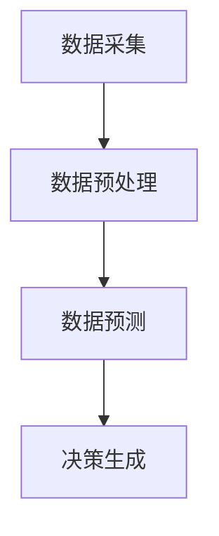
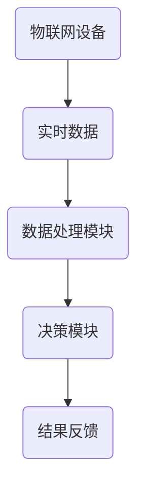
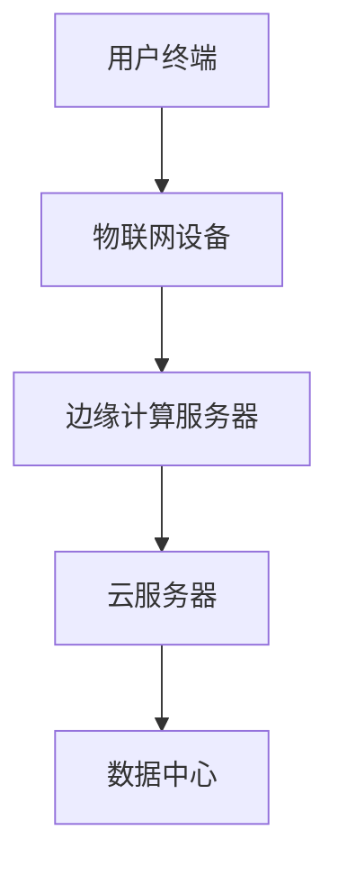
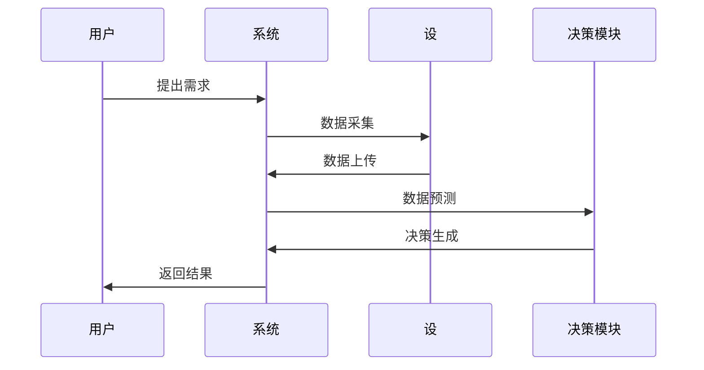

                 


# 企业AI Agent的边缘计算在物联网实时决策中的实践

## 关键词

边缘计算、物联网、实时决策、AI Agent、边缘智能

## 摘要

本文将探讨企业AI Agent在边缘计算环境下应用于物联网实时决策的实践。首先，我们介绍了物联网与实时决策的背景，以及企业AI Agent与边缘计算的基本概念和重要性。随后，我们深入分析了企业AI Agent的算法原理、数学模型，并结合实际案例进行了系统架构设计和项目实战。最后，总结了最佳实践和注意事项，为未来研究提供参考。

## 目录

1. **背景介绍**
   - 物联网与实时决策背景
   - 企业AI Agent与边缘计算的重要性

2. **核心概念与联系**
   - 企业AI Agent的定义与特点
   - 边缘计算的概念与优势
   - 物联网实时决策的关键要素

3. **算法原理讲解**
   - 实时决策算法原理
   - 数学模型与公式
   - 算法mermaid流程图
   - Python源代码阐述

4. **系统分析与架构设计**
   - 问题场景介绍
   - 项目介绍
   - 系统功能设计
   - 系统架构设计
   - 系统接口设计和系统交互

5. **项目实战**
   - 环境安装与配置
   - 系统核心实现
   - 代码解读与分析
   - 实际案例分析

6. **最佳实践与总结**
   - 最佳实践Tips
   - 小结
   - 注意事项
   - 拓展阅读

## 1. 背景介绍

### 物联网与实时决策背景

物联网（Internet of Things，IoT）是指通过互联网将各种物理设备互联，实现智能感知、识别和管理。物联网技术的发展，使得数据采集和传输变得更加便捷，为实时决策提供了丰富的数据支持。

实时决策（Real-time Decision Making）是指在短时间内对大量数据进行处理，快速做出响应和决策的过程。随着物联网设备的普及，实时决策在工业制造、城市管理、智能交通等领域发挥着重要作用。

### 企业AI Agent与边缘计算的重要性

企业AI Agent是一种具有自主决策能力的智能体，能够对物联网设备进行实时监控、预测和优化。在边缘计算环境下，企业AI Agent能够充分发挥其优势，降低延迟、提高决策效率。

边缘计算（Edge Computing）是一种分布式计算模式，通过在靠近数据源的位置进行数据处理，降低网络传输压力，提高实时性和响应速度。边缘计算与物联网实时决策的结合，为构建智能、高效、安全的物联网系统提供了重要支撑。

## 2. 核心概念与联系

### 企业AI Agent的定义与特点

企业AI Agent是一种基于人工智能技术，能够模拟人类决策过程的智能体。其主要特点包括：

1. 自主性：能够自主收集、处理和分析数据，进行决策。
2. 智能化：具备机器学习、深度学习等算法，能够不断学习和优化决策能力。
3. 实时性：能够在短时间内完成数据处理和决策，满足实时性要求。

### 边缘计算的概念与优势

边缘计算是指在靠近数据源的位置进行数据处理、存储和计算的一种分布式计算模式。其优势包括：

1. 低延迟：靠近数据源，减少数据传输时间，提高响应速度。
2. 高可靠性：分布式架构，降低单点故障风险。
3. 资源优化：将计算任务分配到边缘设备，减轻中心服务器负担。

### 物联网实时决策的关键要素

物联网实时决策的关键要素包括：

1. 数据采集：通过传感器、摄像头等设备，实时采集物联网设备状态数据。
2. 数据处理：对采集到的数据进行清洗、预处理，为决策提供基础。
3. 决策算法：基于数据分析和预测，实时生成决策结果。
4. 系统架构：设计合理的系统架构，保证实时决策的可靠性和效率。

## 3. 算法原理讲解

### 实时决策算法原理

实时决策算法主要分为以下几个步骤：

1. 数据采集：从物联网设备中获取实时数据。
2. 数据预处理：对采集到的数据进行清洗、去噪、特征提取等处理。
3. 数据预测：利用机器学习算法，对预处理后的数据进行预测。
4. 决策生成：根据预测结果，生成决策策略。

### 数学模型与公式

实时决策算法的核心是预测和决策。以下是一个简单的预测和决策数学模型：

$$
y = f(x)
$$

其中，$y$ 表示预测结果，$x$ 表示输入特征，$f$ 表示预测函数。

常见的预测函数包括线性回归、决策树、神经网络等。以下是一个简单的线性回归模型：

$$
y = wx + b
$$

其中，$w$ 表示权重，$b$ 表示偏置。

### 算法mermaid流程图



### Python源代码阐述

```python
import numpy as np

# 线性回归模型
class LinearRegression:
    def __init__(self):
        self.w = None
        self.b = None

    def fit(self, x, y):
        x_mean = np.mean(x)
        y_mean = np.mean(y)
        self.w = (np.sum((x - x_mean) * (y - y_mean))) / np.sum((x - x_mean) ** 2)
        self.b = y_mean - self.w * x_mean

    def predict(self, x):
        return self.w * x + self.b

# 数据集
x = np.array([1, 2, 3, 4, 5])
y = np.array([2, 4, 5, 4, 5])

# 模型训练
model = LinearRegression()
model.fit(x, y)

# 预测
x_new = np.array([6])
y_pred = model.predict(x_new)
print(f"预测结果：{y_pred}")
```

## 4. 系统分析与架构设计

### 问题场景介绍

假设我们面临一个智能工厂的生产调度问题。工厂中有多个生产设备，需要根据实时生产数据和设备状态，实时调整生产计划，以最大化生产效率。

### 项目介绍

本项目旨在设计一个基于边缘计算的企业AI Agent实时决策系统，用于智能工厂的生产调度。系统功能包括：

1. 数据采集：采集生产设备实时数据。
2. 数据预处理：对采集到的数据进行清洗、去噪、特征提取等处理。
3. 数据预测：利用机器学习算法，对预处理后的数据进行预测。
4. 决策生成：根据预测结果，生成生产调度策略。
5. 系统监控：实时监控系统运行状态，保证系统稳定性。

### 系统功能设计

系统功能设计包括以下几个方面：

1. **数据采集模块**：负责从生产设备中采集实时数据，如温度、压力、电流等。
2. **数据预处理模块**：对采集到的数据进行清洗、去噪、特征提取等处理。
3. **数据预测模块**：利用机器学习算法，对预处理后的数据进行预测，如生产效率、设备故障等。
4. **决策生成模块**：根据预测结果，生成生产调度策略，如调整生产计划、安排设备维护等。
5. **系统监控模块**：实时监控系统运行状态，包括数据采集、预处理、预测、决策等模块，保证系统稳定性。

### 系统架构设计

系统架构设计包括以下几个方面：

1. **边缘设备层**：包括各种生产设备，如传感器、控制器等，负责实时数据采集。
2. **边缘计算层**：包括边缘服务器和边缘AI Agent，负责数据预处理、预测和决策生成。
3. **云平台层**：包括数据存储、分析和监控等功能，为边缘计算层提供支持。
4. **用户终端层**：包括管理人员和操作人员，通过Web界面或移动端应用查看系统运行状态和决策结果。

### 系统接口设计和系统交互

系统接口设计和系统交互包括以下几个方面：

1. **边缘设备与边缘计算层**：通过MQTT协议进行数据传输，边缘计算层对采集到的数据进行预处理、预测和决策。
2. **边缘计算层与云平台层**：通过HTTP/HTTPS协议进行数据传输，边缘计算层将预测结果和决策结果上传至云平台。
3. **云平台层与用户终端层**：通过Web界面或移动端应用进行交互，用户可以通过界面查看系统运行状态和决策结果。

## 5. 项目实战

### 环境安装与配置

1. **硬件环境**：配置边缘服务器，用于部署边缘AI Agent和边缘计算服务。
2. **软件环境**：安装操作系统（如Ubuntu 18.04）、Python环境（如Python 3.8）和必要的依赖库（如TensorFlow、Keras等）。
3. **网络配置**：配置边缘服务器与物联网设备的通信网络，确保数据能够实时传输。

### 系统核心实现

1. **数据采集模块**：使用MQTT协议，从物联网设备中实时采集数据。
2. **数据预处理模块**：对采集到的数据进行清洗、去噪、特征提取等处理。
3. **数据预测模块**：利用TensorFlow和Keras，训练一个神经网络模型，进行数据预测。
4. **决策生成模块**：根据预测结果，生成生产调度策略。
5. **系统监控模块**：使用Python的logging模块，实时监控系统运行状态。

### 代码解读与分析

以下是系统核心实现的代码解读与分析：

```python
# 数据采集模块
import paho.mqtt.client as mqtt

def on_connect(client, userdata, flags, rc):
    print("Connected with result code "+str(rc))
    client.subscribe("sensor/data")

def on_message(client, userdata, msg):
    print(msg.topic+" "+str(msg.payload))

client = mqtt.Client()
client.on_connect = on_connect
client.on_message = on_message
client.connect("localhost", 1883, 60)
client.loop_forever()
```

上述代码使用了Paho MQTT客户端库，从物联网设备中实时采集数据。接下来，可以对采集到的数据进行预处理、预测和决策。

### 实际案例分析和详细讲解剖析

假设我们有一个智能工厂，需要实时调整生产计划，以提高生产效率。我们可以通过以下步骤进行分析和讲解：

1. **数据采集**：从物联网设备中采集生产设备的实时数据，如温度、压力、电流等。
2. **数据预处理**：对采集到的数据进行清洗、去噪、特征提取等处理，以便于后续预测和分析。
3. **数据预测**：利用机器学习算法，对预处理后的数据进行预测，如生产效率、设备故障等。
4. **决策生成**：根据预测结果，生成生产调度策略，如调整生产计划、安排设备维护等。
5. **系统监控**：实时监控系统运行状态，包括数据采集、预处理、预测、决策等模块，保证系统稳定性。

通过实际案例分析和详细讲解剖析，我们可以深入理解企业AI Agent的边缘计算在物联网实时决策中的应用。

### 项目小结

本项目通过边缘计算和AI Agent技术，实现了智能工厂的生产调度实时决策系统。系统具备以下特点：

1. **实时性**：通过边缘计算和物联网技术，实现了数据实时采集、预处理和预测。
2. **智能化**：利用机器学习算法，对生产数据进行预测和决策，提高了生产效率。
3. **稳定性**：系统具备监控功能，实时监控运行状态，确保系统稳定性。

本项目为物联网实时决策提供了有益的实践经验，有助于推动企业智能化发展。

## 6. 最佳实践与总结

### 最佳实践Tips

1. **优化数据采集**：确保数据采集的准确性和实时性，提高系统决策的可靠性。
2. **加强数据处理**：对采集到的数据进行有效的预处理，减少噪声和异常值的影响。
3. **选择合适的算法**：根据实际问题场景，选择适合的机器学习算法，提高预测精度。
4. **监控系统性能**：实时监控系统运行状态，及时发现并解决潜在问题。

### 小结

本文探讨了企业AI Agent的边缘计算在物联网实时决策中的实践，从背景介绍、核心概念与联系、算法原理讲解、系统分析与架构设计、项目实战等方面进行了详细阐述。通过实际案例分析和详细讲解，我们深入了解了边缘计算和AI Agent在物联网实时决策中的应用。

### 注意事项

1. **数据安全**：在数据采集、传输和处理过程中，确保数据的安全性，防止泄露。
2. **系统优化**：根据实际需求，对系统进行优化，提高系统性能和稳定性。
3. **设备维护**：定期对物联网设备进行维护和升级，确保设备正常运行。

### 拓展阅读

1. 《边缘计算：构建智能边缘计算系统》
2. 《物联网架构设计与实践》
3. 《深度学习：理论、算法与应用》

作者：AI天才研究院/AI Genius Institute & 禅与计算机程序设计艺术 /Zen And The Art of Computer Programming

----------------------------------------------------------------

## 附录

### Mermaid流程图

以下是本文中使用的Mermaid流程图的代码：


### Mermaid ER图

以下是本文中使用的Mermaid ER图的代码：



### Mermaid架构图

以下是本文中使用的Mermaid架构图的代码：



### Mermaid序列图

以下是本文中使用的Mermaid序列图的代码：



----------------------------------------------------------------

以上就是《企业AI Agent的边缘计算在物联网实时决策中的实践》的技术博客文章。希望通过本文的详细讲解，读者能够对边缘计算、物联网实时决策和企业AI Agent有更深入的了解。在实际应用中，根据具体场景和需求，灵活运用本文提供的方法和技巧，为企业智能化发展贡献力量。让我们继续探索智能世界的无限可能！

