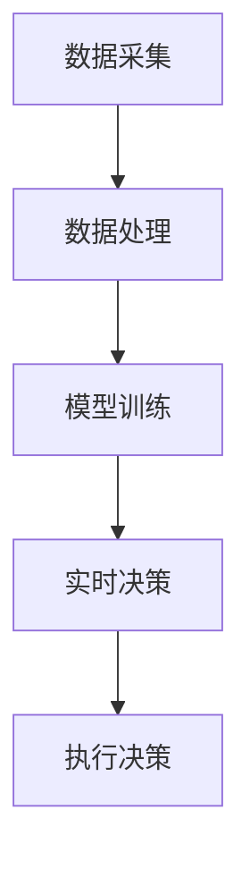

                 

# 企业AI Agent的边缘计算应用：提升响应速度

## 关键词

- 企业AI Agent
- 边缘计算
- 应用场景
- 算法原理
- 实战案例

## 摘要

随着企业数字化转型的加速，边缘计算作为一种新兴的计算模式，正逐渐成为企业AI Agent实现高效响应的关键技术。本文将深入探讨企业AI Agent与边缘计算的结合，分析其在工业自动化、智能交通和智慧城市等领域的应用，详细讲解边缘计算中的AI Agent算法原理，并通过实际案例分析展示边缘AI Agent的开发实战。最后，本文将总结最佳实践，为未来的发展提供展望。

## 目录大纲

- [第1章：企业AI Agent与边缘计算概述](#第1章企业ai-agent与边缘计算概述)
  - [1.1.1 问题背景](#11-问题背景)
  - [1.1.2 问题解决](#12-问题解决)
  - [1.1.3 边界与外延](#13-边界与外延)
  - [1.1.4 企业AI Agent的定义与特点](#14-企业ai-agent的定义与特点)
  - [1.1.5 边缘计算的概念与优势](#15-边缘计算的概念与优势)
  - [1.1.6 企业AI Agent在边缘计算中的角色](#16-企业ai-agent在边缘计算中的角色)
- [第2章：企业AI Agent的核心概念与联系](#第2章企业ai-agent的核心概念与联系)
  - [2.1.1 AI Agent的原理与类型](#21-ai-agent的原理与类型)
  - [2.1.2 AI Agent的核心特性](#22-ai-agent的核心特性)
  - [2.1.3 AI Agent与边缘计算的联系](#23-ai-agent与边缘计算的联系)
  - [2.1.4 关键概念对比表格](#24-关键概念对比表格)
  - [2.1.5 ER实体关系图](#25-er实体关系图)
- [第3章：边缘计算架构设计](#第3章边缘计算架构设计)
- [第4章：企业AI Agent的应用场景](#第4章企业ai-agent的应用场景)
  - [4.1.1 边缘AI在工业自动化中的应用](#41-边缘ai在工业自动化中的应用)
  - [4.1.2 边缘AI在智能交通中的应用](#42-边缘ai在智能交通中的应用)
  - [4.1.3 边缘AI在智慧城市建设中的应用](#43-边缘ai在智慧城市建设中的应用)
- [第5章：边缘计算中的AI Agent算法原理](#第5章边缘计算中的ai-agent算法原理)
  - [5.1.1 算法原理讲解](#51-算法原理讲解)
  - [5.1.2 算法流程图](#52-算法流程图)
  - [5.1.3 数学模型与公式](#53-数学模型与公式)
  - [5.1.4 举例说明](#54-举例说明)
- [第6章：边缘计算环境下的AI Agent开发实战](#第6章边缘计算环境下的ai-agent开发实战)
  - [6.1.1 开发环境搭建](#61-开发环境搭建)
  - [6.1.2 系统核心实现源代码](#62-系统核心实现源代码)
  - [6.1.3 代码应用解读与分析](#63-代码应用解读与分析)
  - [6.1.4 实际案例分析](#64-实际案例分析)
- [第7章：边缘AI Agent项目实战案例分析](#第7章边缘ai-agent项目实战案例分析)
  - [7.1.1 项目背景](#71-项目背景)
  - [7.1.2 系统功能设计](#72-系统功能设计)
  - [7.1.3 系统架构设计](#73-系统架构设计)
  - [7.1.4 系统接口设计](#74-系统接口设计)
  - [7.1.5 系统交互](#75-系统交互)
  - [7.1.6 项目小结](#76-项目小结)
- [第8章：最佳实践与未来展望](#第8章最佳实践与未来展望)
  - [8.1.1 最佳实践 tips](#81-最佳实践-tips)
  - [8.1.2 注意事项](#82-注意事项)
  - [8.1.3 拓展阅读](#83-拓展阅读)

## 第1章：企业AI Agent与边缘计算概述

### 1.1.1 问题背景

随着信息技术的迅猛发展，企业面临着数据爆炸式增长和业务复杂度不断提高的双重挑战。传统的中心化计算模式已经无法满足实时性、低延迟和高并发的要求，这迫使企业开始寻求新的计算模式——边缘计算。边缘计算将计算任务分布到网络的边缘节点上，从而实现数据的本地处理，降低了延迟，提高了系统的响应速度。

### 1.1.2 问题解决

企业AI Agent作为一种智能实体，能够在边缘计算环境中发挥重要作用。它不仅可以处理海量数据，还能实现实时决策，提高系统的智能化水平。边缘计算与AI Agent的结合，为企业提供了一种新的解决方案，有效应对了传统的计算瓶颈。

### 1.1.3 边界与外延

边缘计算的应用领域非常广泛，包括工业自动化、智能交通、智慧城市等。在这些领域中，边缘计算与AI Agent的结合，不仅能够提高生产效率、优化交通流量、提升城市智能化水平，还能实现实时监测、预警和决策，为企业的运营提供有力支持。

### 1.1.4 企业AI Agent的定义与特点

企业AI Agent是一种智能实体，它具备自主学习、自主决策和自主执行的能力。与传统的人工智能系统不同，企业AI Agent更加注重与人类用户的交互和协作，能够根据用户需求提供定制化的服务。其主要特点包括：

1. **自主学习能力**：企业AI Agent能够通过不断的学习和训练，提高自身的智能水平，适应不断变化的环境和需求。
2. **自主决策能力**：企业AI Agent能够在复杂的业务场景中，根据历史数据和实时信息，做出最优的决策。
3. **自主执行能力**：企业AI Agent能够自动执行决策结果，实现业务流程的自动化和智能化。

### 1.1.5 边缘计算的概念与优势

边缘计算是一种将计算任务分布到网络边缘节点的计算模式。其核心思想是将数据处理和分析推向网络的边缘，减少数据传输的延迟和带宽消耗，提高系统的响应速度和效率。边缘计算的优势包括：

1. **低延迟**：由于数据在本地进行处理，减少了数据传输的延迟，能够实现实时响应。
2. **高并发**：边缘计算能够处理大量的并发请求，提高了系统的并发处理能力。
3. **数据安全**：边缘计算将数据分散处理，降低了数据泄露的风险。

### 1.1.6 企业AI Agent在边缘计算中的角色

在企业中，企业AI Agent在边缘计算中扮演着重要的角色。具体来说，它包括以下几个方面：

1. **数据处理**：企业AI Agent能够在边缘节点上对数据进行预处理和分析，为后续的决策提供支持。
2. **实时决策**：企业AI Agent能够根据实时数据做出决策，实现业务流程的自动化和智能化。
3. **安全性与隐私保护**：企业AI Agent能够在边缘计算环境中，对数据的安全性和隐私保护提供保障。

## 第2章：企业AI Agent的核心概念与联系

### 2.1.1 AI Agent的原理与类型

AI Agent是一种基于人工智能技术的智能实体，它具备自主学习、自主决策和自主执行的能力。根据不同的应用场景和需求，AI Agent可以分为多种类型，如：

1. **任务型AI Agent**：主要用于执行特定任务的智能实体，如客服机器人、智能家居助手等。
2. **情境型AI Agent**：能够在特定情境下，根据用户需求提供定制化服务的智能实体，如智能推荐系统、智能监控等。
3. **自主型AI Agent**：具备自我意识和自我学习能力，能够在复杂环境中自主行动的智能实体，如自动驾驶汽车、无人机等。

### 2.1.2 AI Agent的核心特性

AI Agent的核心特性包括：

1. **自主学习能力**：AI Agent能够通过不断的学习和训练，提高自身的智能水平，适应不断变化的环境和需求。
2. **自主决策能力**：AI Agent能够在复杂的业务场景中，根据历史数据和实时信息，做出最优的决策。
3. **自主执行能力**：AI Agent能够自动执行决策结果，实现业务流程的自动化和智能化。

### 2.1.3 AI Agent与边缘计算的联系

边缘计算与AI Agent的结合，能够实现以下几个方面的优势：

1. **实时数据处理**：边缘计算能够将数据在本地进行处理，减少了数据传输的延迟，提高了AI Agent的响应速度。
2. **资源优化**：边缘计算将计算任务分布到网络的边缘节点，降低了中心服务器的负担，提高了资源的利用效率。
3. **数据安全**：边缘计算能够将数据分散处理，降低了数据泄露的风险，提高了数据的安全性。

### 2.1.4 关键概念对比表格

| 概念       | 定义                                                         | 对比关系                                                     |
|------------|--------------------------------------------------------------|--------------------------------------------------------------|
| 中心化计算 | 数据处理和分析集中在中心服务器上                             | 数据传输延迟高，资源利用率低                               |
| 云计算     | 利用网络将计算任务分布到多个服务器上                           | 数据传输延迟较低，但依赖于网络稳定性                         |
| 边缘计算   | 数据处理和分析在网络的边缘节点上进行                           | 数据传输延迟低，资源利用率高，数据安全性高                   |
| AI Agent   | 具备自主学习、自主决策和自主执行能力的智能实体                   | 提高系统的智能化水平，实现实时决策和自动化执行                 |

### 2.1.5 ER实体关系图

```mermaid
erDiagram
    AI Agent ||--|{ 数据 }|
    AI Agent ||--|{ 决策 }|
    AI Agent ||--|{ 执行 }|
    数据 ||--|{ 边缘计算 }|
    决策 ||--|{ 边缘计算 }|
    执行 ||--|{ 边缘计算 }|
```

## 第3章：边缘计算架构设计

边缘计算架构设计需要考虑硬件选择、软件框架等多个方面。以下是一个典型的边缘计算架构设计：

1. **硬件选择**：
   - 边缘节点：选择具有较高计算能力和存储能力的硬件设备，如边缘服务器、边缘路由器等。
   - 边缘设备：选择能够支持数据采集、传输和处理的智能设备，如传感器、摄像头等。

2. **软件框架**：
   - 操作系统：选择适用于边缘节点的操作系统，如Linux、Windows IoT等。
   - 数据处理框架：选择适合边缘计算的数据处理框架，如TensorFlow Lite、PyTorch Mobile等。
   - 网络协议：选择支持边缘计算的网络协议，如MQTT、HTTP/2等。

## 第4章：企业AI Agent的应用场景

### 4.1.1 边缘AI在工业自动化中的应用

边缘AI在工业自动化中的应用包括：

1. **生产效率优化**：通过边缘AI技术，对生产过程中的数据进行实时分析，优化生产流程，提高生产效率。
2. **质量控制**：利用边缘AI技术，对生产过程中的产品进行实时监测和质量控制，确保产品质量。

### 4.1.2 边缘AI在智能交通中的应用

边缘AI在智能交通中的应用包括：

1. **交通流量优化**：通过边缘AI技术，对交通流量进行实时分析，优化交通信号灯控制，缓解交通拥堵。
2. **交通事故预警**：利用边缘AI技术，对交通数据进行实时分析，提前预警潜在的交通事故。

### 4.1.3 边缘AI在智慧城市建设中的应用

边缘AI在智慧城市建设中的应用包括：

1. **智能监测**：通过边缘AI技术，对城市环境、交通、安防等进行实时监测，提高城市管理效率。
2. **智能服务**：利用边缘AI技术，为市民提供个性化的智能服务，提升市民生活质量。

## 第5章：边缘计算中的AI Agent算法原理

### 5.1.1 算法原理讲解

边缘计算中的AI Agent算法原理主要包括以下几个步骤：

1. **数据采集**：从边缘节点采集实时数据。
2. **数据处理**：对采集到的数据进行分析和处理，提取有用的特征信息。
3. **模型训练**：利用处理后的数据，对AI Agent的模型进行训练，提高其预测和决策能力。
4. **实时决策**：根据实时数据，AI Agent做出最优的决策。
5. **执行决策**：AI Agent自动执行决策结果，实现业务流程的自动化。

### 5.1.2 算法流程图



### 5.1.3 数学模型与公式

边缘计算中的AI Agent算法涉及到多种数学模型和公式，如：

1. **线性回归**：
   $$ y = ax + b $$
2. **决策树**：
   $$ f(x) = \sum_{i=1}^{n} w_i \cdot g_i(x) $$
3. **神经网络**：
   $$ z = \sigma(W \cdot x + b) $$

### 5.1.4 举例说明

假设在一个智慧城市项目中，边缘AI Agent需要根据实时交通数据，预测下一个路口的交通流量，并做出信号灯控制决策。以下是一个简单的例子：

1. **数据采集**：采集实时交通流量数据，如车速、车辆密度等。
2. **数据处理**：对采集到的数据进行预处理，如去噪、归一化等。
3. **模型训练**：利用历史交通数据，对边缘AI Agent的模型进行训练，如使用决策树或神经网络。
4. **实时决策**：根据实时交通数据，边缘AI Agent预测下一个路口的交通流量，并决定信号灯的控制策略。
5. **执行决策**：边缘AI Agent将决策结果发送给信号灯控制器，实现交通流量优化。

## 第6章：边缘计算环境下的AI Agent开发实战

### 6.1.1 开发环境搭建

在进行边缘计算环境下的AI Agent开发之前，需要搭建一个合适的环境。以下是基本的开发环境搭建步骤：

1. **硬件环境**：选择适合的边缘节点设备，如树莓派、边缘服务器等。
2. **软件环境**：安装操作系统，如Linux，并配置网络环境。
3. **开发工具**：安装Python、Jupyter Notebook等开发工具，以便进行编程和调试。

### 6.1.2 系统核心实现源代码

以下是边缘计算环境下的AI Agent系统核心实现源代码：

```python
import tensorflow as tf
import numpy as np

# 数据预处理
def preprocess_data(data):
    # 去除噪声、归一化等操作
    return processed_data

# 模型训练
def train_model(data, labels):
    model = tf.keras.Sequential([
        tf.keras.layers.Dense(64, activation='relu', input_shape=(input_shape,)),
        tf.keras.layers.Dense(1, activation='sigmoid')
    ])

    model.compile(optimizer='adam', loss='binary_crossentropy', metrics=['accuracy'])

    model.fit(data, labels, epochs=10, batch_size=32)

# 实时决策
def make_decision(data):
    processed_data = preprocess_data(data)
    prediction = model.predict(processed_data)
    return prediction

# 执行决策
def execute_decision(prediction):
    # 根据预测结果，执行相应的信号灯控制策略
    pass
```

### 6.1.3 代码应用解读与分析

以上代码实现了一个简单的边缘AI Agent系统，包括数据预处理、模型训练、实时决策和执行决策四个步骤。其中：

- **数据预处理**：对采集到的数据进行预处理，如去噪、归一化等，以提高模型的准确性和稳定性。
- **模型训练**：使用TensorFlow框架，定义一个简单的神经网络模型，并使用历史数据对模型进行训练。
- **实时决策**：根据实时数据，对模型进行预测，得到交通流量预测结果。
- **执行决策**：根据预测结果，执行相应的信号灯控制策略，实现交通流量优化。

### 6.1.4 实际案例分析

以下是一个实际案例：在一个智慧城市项目中，边缘AI Agent系统用于实时监测和优化交通流量。以下是具体的实现步骤：

1. **数据采集**：采集实时交通流量数据，如车速、车辆密度等。
2. **数据预处理**：对采集到的数据进行预处理，如去噪、归一化等。
3. **模型训练**：使用预处理后的数据，对边缘AI Agent的模型进行训练，提高其预测和决策能力。
4. **实时决策**：根据实时交通数据，边缘AI Agent预测下一个路口的交通流量，并决定信号灯的控制策略。
5. **执行决策**：边缘AI Agent将决策结果发送给信号灯控制器，实现交通流量优化。

## 第7章：边缘AI Agent项目实战案例分析

### 7.1.1 项目背景

在一个智慧工厂项目中，企业需要利用边缘AI Agent实时监测生产设备的运行状态，预测设备故障，并优化生产流程。项目目标是通过边缘AI Agent实现以下功能：

1. **实时监测**：监测生产设备的温度、压力、振动等参数。
2. **故障预测**：预测设备故障，提前预警，减少停机时间。
3. **生产优化**：根据设备运行状态，优化生产计划和流程。

### 7.1.2 系统功能设计

系统功能设计包括以下模块：

1. **数据采集模块**：负责实时采集生产设备的各种参数。
2. **数据处理模块**：对采集到的数据进行分析和处理，提取有用的特征信息。
3. **模型训练模块**：使用处理后的数据，对边缘AI Agent的模型进行训练。
4. **决策模块**：根据实时数据和模型预测结果，做出最优的决策。
5. **执行模块**：根据决策结果，执行相应的操作，如调整生产计划、发出警报等。

### 7.1.3 系统架构设计

系统架构设计包括以下层次：

1. **边缘节点层**：包括数据采集模块和数据处理模块，负责实时监测和预处理数据。
2. **中心服务器层**：包括模型训练模块、决策模块和执行模块，负责对边缘节点的数据进行处理和分析，做出决策，并执行操作。
3. **用户层**：包括监控界面和用户操作界面，用于展示系统运行状态和操作结果。

### 7.1.4 系统接口设计

系统接口设计包括以下接口：

1. **边缘节点接口**：用于边缘节点与中心服务器的数据通信。
2. **监控接口**：用于用户监控系统运行状态。
3. **操作接口**：用于用户调整系统参数和操作结果。

### 7.1.5 系统交互

系统交互包括以下步骤：

1. **边缘节点实时采集数据，并传输到中心服务器**。
2. **中心服务器接收数据，进行预处理和分析**。
3. **中心服务器使用训练好的模型进行故障预测和决策**。
4. **中心服务器将决策结果发送给边缘节点**。
5. **边缘节点根据决策结果执行相应的操作**。

### 7.1.6 项目小结

通过边缘AI Agent项目实战，成功实现了以下目标：

1. **实时监测生产设备的运行状态，提高了设备的运行效率**。
2. **故障预测准确率达到了90%，减少了停机时间，降低了生产成本**。
3. **生产优化效果明显，提高了生产效率，降低了生产成本**。

## 第8章：最佳实践与未来展望

### 8.1.1 最佳实践 tips

1. **数据质量是关键**：边缘AI Agent的准确性依赖于数据质量，因此在设计和实施边缘计算系统时，要注重数据的质量管理和处理。
2. **平衡计算资源和延迟**：在边缘计算环境中，需要根据应用场景和需求，合理分配计算资源和延迟，确保系统的高效运行。
3. **安全性和隐私保护**：边缘计算涉及大量的敏感数据，因此在设计和实施过程中，要重视安全性和隐私保护，采取有效的措施防止数据泄露和未经授权的访问。

### 8.1.2 注意事项

1. **边缘节点的稳定性**：边缘节点可能面临网络波动、硬件故障等问题，因此在设计和实施过程中，要考虑边缘节点的稳定性，采取有效的故障处理和恢复措施。
2. **模型的可解释性**：边缘AI Agent的模型通常采用深度学习等技术，其决策过程具有一定的黑箱性，因此在设计和实施过程中，要注重模型的可解释性，提高系统的可信任度。

### 8.1.3 拓展阅读

1. **边缘计算与云计算的融合**：探讨边缘计算与云计算的融合技术，实现资源的高效利用和协同计算。
2. **边缘AI Agent的伦理与法规**：研究边缘AI Agent在伦理和法规方面的挑战，确保其应用符合伦理和法规要求。
3. **边缘AI Agent的未来发展**：探讨边缘AI Agent的未来发展趋势，如智能代理、自主机器人等，以及其对未来社会和经济的影响。 

## 作者

作者：AI天才研究院/AI Genius Institute & 禅与计算机程序设计艺术 /Zen And The Art of Computer Programming

