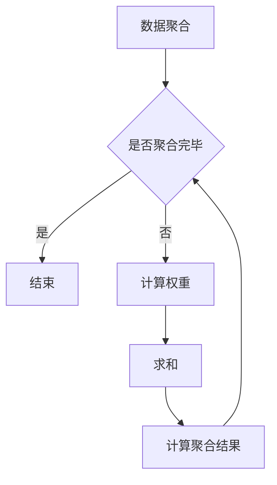

                 


## 《企业AI Agent的边缘计算策略》

### 关键词

边缘计算，企业AI Agent，策略，架构设计，Python代码，mermaid图表，算法原理

### 摘要

本文旨在深入探讨企业AI Agent在边缘计算环境下的应用策略。随着物联网和大数据技术的快速发展，边缘计算已成为提高数据处理效率和降低延迟的重要手段。企业AI Agent，作为一种智能化软件实体，能够帮助企业自动化决策和优化业务流程。本文首先介绍了边缘计算和企业AI Agent的基本概念，随后分析了它们的核心原理及其联系。通过详细讲解边缘计算算法和企业AI Agent算法的原理，本文进一步阐述了如何在实际项目中设计和实现边缘计算策略。最后，本文总结了最佳实践和注意事项，为企业和开发者提供了实用的指导和参考。

### 第1章 边缘计算与企业AI Agent概述

#### 1.1 边缘计算的发展背景

边缘计算（Edge Computing）是一种分布式计算架构，旨在将数据处理、分析和应用执行推向网络边缘，即靠近数据源的位置。这种模式的出现，源于以下几个背景因素：

- **物联网（IoT）的兴起**：随着物联网设备的广泛应用，产生的数据量呈指数级增长。中心化的云计算架构已无法满足低延迟和高带宽的需求，推动了边缘计算的发展。
- **实时数据处理需求**：许多应用场景，如工业自动化、自动驾驶和智能城市等，需要实时处理和分析数据，以实现快速响应和决策。边缘计算能够有效降低数据处理延迟，提高系统的实时性。
- **数据隐私和安全**：将数据在边缘设备上进行处理，有助于减少数据传输过程中可能面临的安全风险和隐私泄露问题。

边缘计算的核心思想是将计算能力从中心化的云计算节点分散到网络边缘的设备上，包括物联网设备、路由器、交换机等。这种分布式架构能够更好地支持大规模数据处理的灵活性、可靠性和可扩展性。

#### 1.2 企业AI Agent的应用场景

企业AI Agent，又称智能代理（Intelligent Agent），是一种能够自动执行任务、进行决策和交互的智能化软件实体。在企业应用中，AI Agent可以承担多种角色，包括自动化流程、智能客服、市场分析、风险管理等。以下是一些常见的企业AI Agent应用场景：

- **智能客服**：AI Agent可以模拟人类客服，为用户提供24/7的服务，解答常见问题、处理投诉和建议，提高客户满意度。
- **自动化流程**：AI Agent可以自动化处理企业内部的各种业务流程，如订单处理、库存管理、财务审核等，减少人工干预，提高效率。
- **市场分析**：AI Agent可以收集和分析市场数据，为企业提供市场趋势、竞争分析和消费者行为预测等决策支持。
- **风险管理**：AI Agent可以监控企业的财务状况、市场变化等风险因素，及时发现潜在风险并提供风险管理建议。

#### 1.3 边缘计算与企业AI Agent的结合意义

边缘计算与企业AI Agent的结合，能够为企业带来诸多优势：

- **实时数据处理**：边缘计算能够实时处理和分析数据，为企业AI Agent提供及时、准确的数据支持，使其能够快速做出决策。
- **降低延迟**：边缘计算将数据处理推向网络边缘，显著降低了数据传输和处理的延迟，提高了系统的响应速度。
- **提高效率**：通过边缘计算，企业AI Agent可以更有效地处理大量数据，减少对中心化云计算资源的依赖，提高整体效率。
- **增强安全性**：边缘计算有助于降低数据传输过程中的安全风险，同时企业AI Agent可以在本地设备上进行数据处理，减少了数据泄露的风险。

综上所述，边缘计算与企业AI Agent的结合，不仅能够提升企业信息化水平，还能够带来更高的运营效率和竞争力。接下来，我们将进一步探讨边缘计算和企业AI Agent的核心原理及其联系。

### 第2章 边缘计算基础

#### 2.1 边缘计算的概念与特征

边缘计算（Edge Computing）是一种分布式计算架构，旨在将数据处理、分析和应用执行推向网络边缘。与传统的中心化云计算架构相比，边缘计算具有以下特征：

- **靠近数据源**：边缘计算将数据处理和存储推向网络边缘，即靠近数据生成的地方，如物联网设备、传感器、网关等。这样能够显著降低数据传输延迟，提高系统响应速度。
- **分布式计算资源**：边缘计算利用网络边缘的各类设备，如智能终端、路由器、交换机等，形成分布式计算资源池。这些资源可以动态分配，满足不同应用场景的需求。
- **低延迟和高带宽**：边缘计算能够实现低延迟、高带宽的数据处理，使得实时应用和交互成为可能，如自动驾驶、智能医疗等。
- **弹性可扩展性**：边缘计算架构具有弹性可扩展性，能够根据业务需求动态调整计算资源，适应大规模数据处理和高并发访问。

#### 2.2 边缘计算的优势与挑战

边缘计算在提升数据处理效率和降低延迟方面具有显著优势，但也面临一系列挑战：

- **优势**：
  - **降低延迟**：边缘计算能够将数据处理推向网络边缘，显著降低数据传输延迟，满足实时应用需求。
  - **提高效率**：边缘计算能够有效利用网络边缘的计算资源，提高数据处理和响应效率，减轻中心化云计算节点的压力。
  - **增强安全性**：边缘计算可以将部分数据处理和存储在本地设备上，减少数据在传输过程中的安全风险。
  - **支持多样化应用**：边缘计算能够适应多种应用场景，如智能交通、智能制造、智慧医疗等，为不同行业提供定制化解决方案。

- **挑战**：
  - **资源限制**：边缘设备通常计算能力有限，存储容量和带宽也较低，需要在有限的资源下实现高效的数据处理。
  - **异构设备兼容性**：边缘设备种类繁多，包括不同品牌、型号和操作系统，需要解决设备兼容性问题，实现统一管理和调度。
  - **数据隐私和保护**：边缘计算涉及大量数据在本地设备上的处理和存储，需要加强数据隐私保护和安全防护。
  - **网络稳定性**：边缘计算依赖于网络连接，网络稳定性对边缘计算性能有重要影响，需要解决网络波动和故障问题。

#### 2.3 边缘计算技术分类

边缘计算涉及多种技术，主要包括以下几个方面：

- **边缘服务器**：边缘服务器是网络边缘的专用服务器，用于处理和存储数据。它们具有高性能、高可靠性和高扩展性，能够为边缘计算提供强有力的支持。
- **物联网设备**：物联网设备是边缘计算的重要组成部分，包括各种传感器、智能终端和网关。它们能够实时采集数据，并将数据传输到边缘服务器或云计算中心。
- **边缘数据库**：边缘数据库是一种分布式数据库系统，能够在边缘设备上进行数据的存储、管理和查询。它们通常具有高可用性、高性能和弹性扩展能力。
- **边缘人工智能**：边缘人工智能是指将人工智能算法和模型部署在边缘设备上，实现本地数据分析和决策。这包括基于深度学习、机器学习和数据挖掘的算法和应用。
- **边缘安全**：边缘安全涉及边缘设备的网络安全、数据隐私保护和安全防护措施。需要建立多层次的安全体系，确保边缘计算的安全性和可靠性。

综上所述，边缘计算作为一种分布式计算架构，具有显著的优点和挑战。通过合理利用边缘计算技术，企业可以实现高效的数据处理、实时响应和智能决策，提升业务竞争力。

### 第3章 企业AI Agent基础

#### 3.1 企业AI Agent的定义与作用

企业AI Agent，又称智能代理（Intelligent Agent），是一种能够自动执行任务、进行决策和交互的智能化软件实体。它具备以下几个基本特征：

- **自主性**：企业AI Agent能够自主地感知环境、理解任务需求，并采取相应的行动。
- **反应性**：AI Agent能够对环境中的变化迅速做出响应，调整其行为以适应新的情况。
- **主动性**：AI Agent不仅能够被动响应，还能够主动地探索环境，发现新的机会和挑战。
- **学习能力**：AI Agent具备学习能力和自适应能力，能够通过不断的学习和经验积累，优化其决策和行为。

在企业中，AI Agent发挥着重要的作用：

- **自动化流程**：AI Agent可以自动化处理企业的各种业务流程，如订单处理、库存管理、财务审核等，减少人工干预，提高效率。
- **智能决策支持**：AI Agent可以通过数据分析、预测模型和优化算法，为企业提供智能化的决策支持，帮助企业在复杂的市场环境中做出最优选择。
- **提高客户体验**：AI Agent可以模拟人类客服，为用户提供24/7的服务，解答常见问题、处理投诉和建议，提高客户满意度。
- **创新业务模式**：AI Agent可以推动企业创新业务模式，如个性化推荐、智能广告和自动化交易等，拓展新的收入来源。

#### 3.2 企业AI Agent的核心技术

企业AI Agent的核心技术主要包括以下几个部分：

- **自然语言处理（NLP）**：NLP技术使AI Agent能够理解、生成和处理自然语言。通过NLP，AI Agent可以与人类进行有效的沟通，理解用户的需求和意图。
- **机器学习与深度学习**：机器学习和深度学习技术使AI Agent具备自我学习和优化能力。通过大量数据的训练，AI Agent能够识别模式、预测趋势和优化决策。
- **数据挖掘与数据分析**：数据挖掘和数据分析技术使AI Agent能够从大量数据中提取有价值的信息，进行分类、聚类、关联分析和预测。
- **知识图谱**：知识图谱技术可以帮助AI Agent建立领域知识库，实现知识的关联、推理和检索。知识图谱在企业AI Agent中的应用，使得AI Agent能够更好地理解和应对复杂业务场景。
- **自动化与调度**：自动化和调度技术使AI Agent能够自动化执行任务、调度资源和管理流程。通过自动化，AI Agent可以大幅提高工作效率，降低人工成本。

#### 3.3 企业AI Agent的应用领域

企业AI Agent在多个领域具有广泛的应用，以下是一些典型的应用场景：

- **智能客服**：AI Agent可以模拟人类客服，为用户提供24/7的服务，解答常见问题、处理投诉和建议，提高客户满意度。
- **智能推荐系统**：AI Agent可以通过数据分析、用户行为预测和协同过滤算法，为用户提供个性化的产品推荐，提升用户体验和销售额。
- **智能金融**：AI Agent可以用于金融风控、投资分析、自动化交易等领域，帮助企业降低风险、提高投资回报率。
- **智能制造**：AI Agent可以自动化生产流程、设备监控和维护，提高生产效率和质量，减少设备故障率。
- **智慧医疗**：AI Agent可以用于医学图像分析、疾病预测、远程诊断等领域，辅助医生进行诊断和治疗，提高医疗水平和服务质量。

通过上述应用，企业AI Agent不仅能够提高业务效率，还能够为企业带来显著的商业价值。

### 第4章 边缘计算与企业AI Agent的联系

#### 4.1 边缘计算与企业AI Agent的融合原理

边缘计算与企业AI Agent的融合，是通过将AI Agent的智能算法和决策能力与边缘计算的资源优势相结合，实现高效、实时和智能的数据处理和决策支持。其融合原理主要包括以下几个方面：

- **分布式计算**：边缘计算将计算能力分散到网络边缘，使得AI Agent能够在离数据源更近的地方进行数据处理和决策，显著降低延迟和响应时间。
- **实时性**：边缘计算能够实时处理和分析数据，为AI Agent提供及时、准确的数据支持，使其能够快速做出决策和调整行为。
- **灵活性**：边缘计算架构具有高度灵活性，可以根据业务需求动态调整计算资源和算法，满足不同场景和应用的需求。
- **异构计算**：边缘计算支持多种异构设备，如物联网设备、边缘服务器和边缘数据库等，AI Agent可以在这些设备上灵活部署和执行任务。

#### 4.2 边缘计算与企业AI Agent的技术融合路径

边缘计算与企业AI Agent的技术融合路径主要包括以下几个步骤：

1. **数据采集与预处理**：边缘设备（如传感器、物联网设备）采集数据，并通过边缘计算节点进行预处理，如数据清洗、去噪和特征提取。
2. **实时数据处理**：边缘计算节点对预处理后的数据进行分析和处理，利用AI算法（如机器学习、深度学习等）进行特征提取和模式识别。
3. **实时决策与反馈**：根据数据处理结果，AI Agent实时做出决策，并通过边缘计算节点将决策反馈到边缘设备或终端用户。
4. **资源管理与优化**：边缘计算架构能够动态调整计算资源和算法，确保系统的高效运行和性能优化。

#### 4.3 边缘计算与企业AI Agent的协同效应

边缘计算与企业AI Agent的协同效应，主要体现在以下几个方面：

- **提高效率**：通过边缘计算，企业AI Agent能够实时处理和分析数据，减少数据传输和处理的延迟，提高整体效率。
- **降低成本**：边缘计算能够降低对中心化云计算资源的依赖，减少数据传输和存储的成本，同时提高系统的可扩展性和可靠性。
- **增强安全性**：边缘计算将数据处理和存储推向网络边缘，有助于降低数据泄露和安全风险。
- **提升用户体验**：边缘计算能够实现实时响应和个性化服务，提升用户体验和满意度。

通过边缘计算与企业AI Agent的融合，企业能够在复杂多变的市场环境中实现高效、智能和实时的数据处理和决策，提升业务竞争力和创新能力。

### 第5章 边缘计算算法原理

#### 5.1 常见边缘计算算法介绍

边缘计算算法是边缘计算架构的核心组成部分，旨在高效处理和利用边缘设备上的数据。以下介绍几种常见的边缘计算算法：

- **数据聚合算法**：数据聚合算法用于汇总多个边缘设备收集到的数据，以获得全局视图。常见的聚合操作包括求和、平均值、最大值和最小值等。
- **特征提取算法**：特征提取算法用于从原始数据中提取具有代表性的特征，以降低数据维度和提高模型性能。常见的特征提取方法包括主成分分析（PCA）、线性判别分析（LDA）和自动编码器（Autoencoder）等。
- **预测算法**：预测算法用于根据历史数据预测未来的趋势和变化。常见的预测方法包括时间序列分析、回归分析和神经网络等。
- **压缩算法**：压缩算法用于减少数据的存储空间和传输带宽，常见的压缩方法包括哈夫曼编码、算术编码和无损压缩等。

#### 5.2 边缘计算算法的数学模型

边缘计算算法的数学模型是理解算法原理和实现应用的关键。以下介绍几种边缘计算算法的数学模型：

1. **数据聚合算法**：

   假设有一个由 \(n\) 个边缘设备组成的系统，每个设备收集到的数据为 \(x_i\)，聚合后的数据为 \(y\)。数据聚合算法可以用以下数学模型表示：

   \[
   y = \sum_{i=1}^{n} w_i x_i
   \]

   其中，\(w_i\) 为权重，用于调整每个设备数据的贡献度。

2. **特征提取算法**：

   假设原始数据为 \(X \in \mathbb{R}^{m \times n}\)，提取的特征为 \(Z \in \mathbb{R}^{m \times k}\)，特征提取算法可以用以下数学模型表示：

   \[
   Z = \text{PCA}(X)
   \]

   其中，PCA（主成分分析）是一种常用的特征提取方法，通过计算数据矩阵的协方差矩阵的特征值和特征向量，实现数据降维。

3. **预测算法**：

   假设历史数据为 \(X \in \mathbb{R}^{m \times n}\)，预测结果为 \(Y \in \mathbb{R}^{m \times 1}\)，预测算法可以用以下数学模型表示：

   \[
   Y = f(X)
   \]

   其中，\(f\) 为预测模型，可以是线性回归、神经网络或其他预测方法。

4. **压缩算法**：

   假设原始数据为 \(X \in \mathbb{R}^{m \times n}\)，压缩后的数据为 \(Y \in \mathbb{R}^{m \times k}\)，压缩算法可以用以下数学模型表示：

   \[
   Y = \text{huffman\_encode}(X)
   \]

   其中，huffman_encode 是一种常见的压缩算法，通过构建哈夫曼树实现数据的无损压缩。

#### 5.3 边缘计算算法的mermaid流程图

为了更好地理解边缘计算算法的原理和应用，可以使用mermaid流程图进行描述。以下是一个数据聚合算法的mermaid流程图示例：

```
graph TD
A[数据聚合] --> B{是否聚合完毕}
B -->|是| C[结束]
B -->|否| D[计算权重]
D --> E[求和]
E --> F[计算聚合结果]
F --> B
```

这个mermaid流程图描述了数据聚合算法的基本步骤：首先判断是否聚合完毕，如果是，则结束；否则，计算每个设备的权重，进行求和，计算聚合结果，并返回判断。

通过mermaid流程图，我们可以直观地理解边缘计算算法的实现过程和逻辑结构，为实际应用提供参考。

### 第6章 企业AI Agent算法讲解

#### 6.1 企业AI Agent的核心算法

企业AI Agent的核心算法包括自然语言处理（NLP）、机器学习（ML）和深度学习（DL）等。这些算法在企业AI Agent中发挥着重要作用，使得AI Agent能够实现自动化、智能化的任务执行和决策支持。

- **自然语言处理（NLP）**：NLP技术使AI Agent能够理解和生成自然语言，实现人机交互。常见的NLP算法包括词向量表示、句法分析、语义分析和对话管理等。词向量表示（如Word2Vec、GloVe）通过将单词映射到高维向量空间，实现语义的表示和计算。句法分析（如依存句法分析、句法树构建）用于理解句子的结构，提取语法关系。语义分析（如实体识别、情感分析）用于理解句子的意义，提取语义信息。对话管理（如对话状态跟踪、对话生成）用于管理对话流程，实现自然语言交互。

- **机器学习（ML）**：ML技术使AI Agent能够从数据中自动学习模式、特征和规律，进行预测和分类。常见的ML算法包括线性回归、决策树、支持向量机、随机森林和朴素贝叶斯等。线性回归用于预测连续值变量，决策树用于分类和回归任务，支持向量机用于分类任务，随机森林用于处理高维数据和提升分类性能，朴素贝叶斯用于文本分类和概率预测。

- **深度学习（DL）**：DL技术通过构建大规模神经网络，使AI Agent能够自动提取特征、进行复杂任务的学习和推理。常见的DL算法包括卷积神经网络（CNN）、循环神经网络（RNN）、长短时记忆网络（LSTM）和生成对抗网络（GAN）等。CNN用于图像识别和分类，RNN用于序列数据处理和时间序列预测，LSTM用于解决RNN的梯度消失问题，GAN用于生成逼真的图像和数据进行对抗训练。

#### 6.2 企业AI Agent算法的数学模型

企业AI Agent算法的数学模型是理解算法原理和实现应用的关键。以下介绍几种企业AI Agent算法的数学模型：

1. **自然语言处理（NLP）**：

   - **词向量表示**：词向量表示通过将单词映射到高维向量空间，实现语义的表示和计算。常见的词向量表示方法包括Word2Vec和GloVe。Word2Vec通过训练神经网络模型，计算词向量表示；GloVe通过矩阵分解，计算词向量表示。

     \[
     \text{Word2Vec}:\ \vec{w}_i = \text{softmax}(\text{context\_embeddings})
     \]

     \[
     \text{GloVe}:\ \vec{w}_i = \text{normalize}(\text{V} \cdot \text{X}_i)
     \]

   - **句法分析**：句法分析通过构建句法树，实现句子的结构理解和语法关系的提取。常见的句法分析算法包括依存句法分析和句法树构建。依存句法分析通过计算词之间的依存关系，构建句法树。

     \[
     \text{依存句法分析}:\ \text{依赖关系矩阵} = \text{计算词之间的依存关系}
     \]

   - **语义分析**：语义分析通过提取句子的语义信息，实现实体识别、情感分析和语义角色标注等任务。常见的语义分析算法包括基于规则的方法、统计方法和神经网络方法。

     \[
     \text{实体识别}:\ \text{实体标注矩阵} = \text{分类每个词的实体类别}
     \]

2. **机器学习（ML）**：

   - **线性回归**：线性回归通过拟合数据点，实现连续值变量的预测。线性回归的数学模型为：

     \[
     y = \beta_0 + \beta_1 x
     \]

   - **决策树**：决策树通过递归划分特征空间，实现分类和回归任务。决策树的数学模型为：

     \[
     \text{分类节点}:\ y = \text{argmax}(\beta_j x_j)
     \]

     \[
     \text{回归节点}:\ y = \sum_{j=1}^{n} \beta_j x_j
     \]

   - **支持向量机**：支持向量机通过寻找最优超平面，实现分类任务。支持向量机的数学模型为：

     \[
     \text{分类函数}:\ y = \text{sign}(\sum_{i=1}^{n} \alpha_i y_i x_i + \beta)
     \]

   - **随机森林**：随机森林通过构建多个决策树，实现集成学习。随机森林的数学模型为：

     \[
     \text{预测函数}:\ \hat{y} = \text{majority\_vote}(\{f_1(\text{x}), f_2(\text{x}), \ldots, f_n(\text{x})\})
     \]

   - **朴素贝叶斯**：朴素贝叶斯通过计算先验概率和条件概率，实现文本分类和概率预测。朴素贝叶斯的数学模型为：

     \[
     P(y = c | x) = \frac{P(x | y = c)P(y = c)}{P(x)}
     \]

3. **深度学习（DL）**：

   - **卷积神经网络（CNN）**：卷积神经网络通过卷积操作和池化操作，实现图像识别和分类。CNN的数学模型为：

     \[
     h_{l}(x) = \text{ReLU}(\text{W}_{l} \cdot h_{l-1} + b_{l})
     \]

   - **循环神经网络（RNN）**：循环神经网络通过递归结构，实现序列数据的处理和时间序列预测。RNN的数学模型为：

     \[
     h_t = \text{tanh}(\text{W}_{xh} x_t + \text{W}_{hh} h_{t-1} + b_h)
     \]

   - **长短时记忆网络（LSTM）**：长短时记忆网络通过引入门控机制，解决RNN的梯度消失问题，实现长序列数据的处理和时间序列预测。LSTM的数学模型为：

     \[
     \text{遗忘门}: f_t = \sigma(\text{W}_{ff} \cdot [h_{t-1}, x_t] + b_f)
     \]

     \[
     \text{输入门}: i_t = \sigma(\text{W}_{ii} \cdot [h_{t-1}, x_t] + b_i)
     \]

     \[
     \text{输出门}: o_t = \sigma(\text{W}_{io} \cdot [h_{t-1}, x_t] + b_o)
     \]

     \[
     \text{单元状态}: c_t = f_t \odot c_{t-1} + i_t \odot \text{tanh}(\text{W}_{ic} \cdot [h_{t-1}, x_t] + b_c)
     \]

     \[
     h_t = o_t \odot \text{tanh}(c_t)
     \]

   - **生成对抗网络（GAN）**：生成对抗网络通过生成器和判别器的对抗训练，实现生成逼真的图像和数据进行对抗训练。GAN的数学模型为：

     \[
     \text{生成器}:\ \text{G}(\epsilon) = \text{生成图像}
     \]

     \[
     \text{判别器}:\ \text{D}(\text{X}) = \text{判别图像真实性}
     \]

     \[
     \text{损失函数}:\ \text{L} = -\text{E}[\text{D}(\text{G}(\epsilon))] + \text{E}[\text{D}(\text{X})]
     \]

通过上述企业AI Agent算法的数学模型，我们可以深入理解这些算法的基本原理和应用场景，为实际项目开发提供理论基础。

### 第7章 边缘计算在企业AI Agent中的应用场景

#### 7.1 场景一：智能工厂

智能工厂是边缘计算与企业AI Agent结合的一个重要应用场景。在这个场景中，边缘计算技术可以帮助工厂实现实时数据采集、分析和决策，从而提高生产效率和质量。

- **边缘设备部署**：在智能工厂中，边缘设备如传感器、智能机器人、自动化生产线等被广泛部署。这些设备能够实时采集生产过程中的各种数据，包括温度、湿度、压力、速度等。

- **实时数据分析**：边缘计算节点位于生产现场，可以对采集到的数据进行实时处理和分析。通过机器学习、深度学习等算法，边缘计算能够识别生产过程中的异常情况，预测设备故障，优化生产流程。

- **智能决策支持**：基于边缘计算和AI Agent的分析结果，工厂管理者可以实时调整生产计划、设备维护策略等，提高生产效率和质量。例如，当传感器检测到温度异常时，AI Agent可以立即发出警报，并推荐相应的处理措施，如调整生产线温度或暂停生产以避免设备损坏。

- **数据安全与隐私保护**：边缘计算将数据处理推向网络边缘，有助于降低数据泄露和隐私风险。AI Agent可以在本地设备上进行数据处理和决策，减少数据传输过程中的安全风险。

#### 7.2 场景二：智慧医疗

智慧医疗是边缘计算与企业AI Agent的另一个重要应用场景。在这个场景中，边缘计算可以帮助医疗机构实现实时数据采集、分析和诊断，从而提高医疗服务的质量和效率。

- **边缘设备部署**：在智慧医疗中，边缘设备如医疗传感器、监护仪、智能轮椅等被广泛部署。这些设备能够实时采集患者的生理数据，包括心率、血压、体温、呼吸等。

- **实时数据分析**：边缘计算节点位于医院现场，可以对采集到的患者数据实时处理和分析。通过机器学习、深度学习等算法，边缘计算能够对患者的生理数据进行分析，发现异常情况，预测疾病风险。

- **智能诊断支持**：基于边缘计算和AI Agent的分析结果，医生可以实时进行诊断和治疗建议。例如，当监护仪检测到患者心率异常时，AI Agent可以立即发出警报，并提供相应的诊断建议，如建议医生进行进一步的检查或调整治疗方案。

- **远程医疗服务**：边缘计算和AI Agent的结合，使得远程医疗服务成为可能。通过边缘计算节点，医生可以实时监控患者的生理数据，提供远程诊断和治疗建议，提高医疗服务效率和质量。

#### 7.3 场景三：智能交通

智能交通是边缘计算与企业AI Agent的另一个重要应用场景。在这个场景中，边缘计算可以帮助交通管理系统实现实时数据采集、分析和决策，从而提高交通效率和安全性。

- **边缘设备部署**：在智能交通中，边缘设备如交通监控摄像头、智能红绿灯、车联网设备等被广泛部署。这些设备能够实时采集交通流量、车辆速度、路况等信息。

- **实时数据分析**：边缘计算节点位于交通管理现场，可以对采集到的交通数据进行实时处理和分析。通过机器学习、深度学习等算法，边缘计算能够对交通流量、路况进行分析，预测交通拥堵情况，优化交通信号控制。

- **智能决策支持**：基于边缘计算和AI Agent的分析结果，交通管理者可以实时调整交通信号控制策略、交通疏导方案等，提高交通效率和安全性。例如，当边缘计算检测到某条道路拥堵时，AI Agent可以立即发出警报，并提供相应的交通疏导建议，如调整信号灯时长或引导车辆绕行。

- **车辆安全监控**：边缘计算和AI Agent可以帮助实现车辆安全监控，通过分析车辆运行数据，预测潜在的安全风险，如车辆故障、驾驶行为异常等，提醒驾驶员注意安全。

通过上述三个应用场景的介绍，我们可以看到边缘计算与企业AI Agent的结合在各个领域的广泛应用和巨大潜力。随着技术的不断发展，边缘计算和AI Agent将在更多场景中发挥重要作用，推动智能化、自动化和高效化的实现。

### 第8章 系统架构设计方案

#### 8.1 系统功能设计

为了实现边缘计算在企业AI Agent中的应用，我们需要设计一个完整的系统架构，涵盖数据采集、数据处理、决策支持、用户交互等功能。以下是系统功能设计：

- **数据采集**：系统需要能够实时采集边缘设备上的数据，包括传感器数据、物联网设备数据等。数据采集模块负责连接和读取这些数据，并存储在本地数据库中。

- **数据处理**：系统需要对采集到的数据进行预处理、特征提取、分析和预测等处理。数据处理模块负责执行这些任务，包括使用边缘计算算法进行数据分析和决策。

- **决策支持**：系统需要根据数据处理结果，提供智能化的决策支持，包括生成预测报告、优化建议等。决策支持模块负责整合分析结果，为用户提供直观的决策依据。

- **用户交互**：系统需要支持用户与AI Agent的交互，包括通过自然语言处理实现人机对话、展示分析结果等。用户交互模块负责处理用户的输入请求，并返回相应的输出结果。

#### 8.2 系统架构设计

系统架构设计是确保系统功能实现和性能优化的重要环节。以下是系统架构设计方案：

- **边缘设备层**：边缘设备层包括各种传感器、物联网设备等，负责实时采集数据并将其传输到边缘计算节点。这些设备可以是智能终端、路由器、网关等。

- **边缘计算层**：边缘计算层是系统架构的核心部分，包括边缘服务器、边缘数据库和边缘AI计算模块。边缘服务器负责处理和存储数据，边缘数据库用于存储和管理数据，边缘AI计算模块负责执行AI算法和分析任务。

- **中心云层**：中心云层是系统的补充部分，负责处理边缘计算层无法处理的数据和任务，包括大数据分析、长期数据存储等。中心云服务器和中心数据库负责这些任务，并通过云网关与边缘计算层进行数据传输和通信。

- **用户交互层**：用户交互层是系统与用户之间的接口，包括Web界面、移动应用等。用户可以通过这些接口与AI Agent进行交互，获取决策支持和分析结果。

#### 8.3 系统接口设计与交互

系统接口设计是确保系统各个模块之间能够有效通信和协作的关键。以下是系统接口设计与交互方案：

- **边缘设备与边缘计算层**：边缘设备通过HTTP/HTTPS协议与边缘计算层进行通信，传输采集到的数据。边缘计算层通过API接口接收和解析这些数据，进行预处理和存储。

- **边缘计算层与中心云层**：边缘计算层与中心云层通过云网关进行通信，传输需要进一步处理的数据和任务。中心云层通过RESTful API接口接收这些数据，执行大数据分析和存储任务。

- **用户交互层与边缘计算层**：用户交互层通过Web Socket或HTTP/HTTPS协议与边缘计算层进行通信，获取实时分析结果和决策支持。边缘计算层通过API接口返回用户请求的响应和数据。

- **边缘计算层内部模块交互**：边缘计算层内部各模块之间通过消息队列（如RabbitMQ、Kafka）进行通信，实现数据传输和任务调度。例如，数据处理模块可以将处理结果通过消息队列发送给决策支持模块，实现模块之间的数据共享和协同工作。

通过上述系统架构设计和接口设计，我们能够构建一个高效、实时和智能的边缘计算与企业AI Agent系统，为企业提供强大的数据处理和决策支持能力。

### 第9章 边缘计算与企业AI Agent项目实战

#### 9.1 实战项目背景

本次项目旨在构建一个基于边缘计算和企业AI Agent的智能安防系统，实现实时监控、异常检测和智能报警功能。项目背景如下：

- **目标需求**：该项目需要实现以下功能：
  - 实时监控：实时采集监控区域的视频流和传感器数据，通过边缘计算节点进行预处理和分析。
  - 异常检测：使用企业AI Agent对采集到的数据进行分析，识别异常行为或异常事件，如入侵、火灾等。
  - 智能报警：当检测到异常事件时，自动触发报警机制，通知相关人员并及时采取措施。

- **应用场景**：该项目适用于各种安防需求较高的场景，如智能社区、办公楼、工业园区等。

- **技术挑战**：该项目面临的主要技术挑战包括：
  - 数据实时处理：需要在边缘设备上进行高效的数据处理和分析，以满足实时性需求。
  - 异常检测准确性：需要准确识别异常行为，减少误报和漏报。
  - 系统稳定性：确保系统在高并发、高负荷情况下稳定运行。

#### 9.2 环境安装与配置

为了搭建智能安防系统，我们需要在边缘设备和服务器上安装和配置以下环境：

1. **边缘设备**：

   - 操作系统：安装Ubuntu 20.04或更高版本。
   - 硬件要求：配置至少4GB内存、2GHz处理器、1GB硬盘空间。
   - Python环境：安装Python 3.8及以上版本，并配置pip、virtualenv等工具。

2. **边缘计算服务器**：

   - 操作系统：安装Ubuntu 20.04或更高版本。
   - 硬件要求：配置至少8GB内存、4GHz处理器、1TB硬盘空间。
   - Python环境：安装Python 3.8及以上版本，并配置pip、virtualenv等工具。

3. **中心云服务器**：

   - 操作系统：安装Ubuntu 20.04或更高版本。
   - 硬件要求：配置至少16GB内存、8GHz处理器、2TB硬盘空间。
   - Python环境：安装Python 3.8及以上版本，并配置pip、virtualenv等工具。

4. **其他软件**：

   - 安装Docker、Kafka、RabbitMQ、MySQL等中间件。
   - 安装TensorFlow、PyTorch等深度学习框架。

#### 9.3 系统核心实现

智能安防系统的核心实现包括数据采集、数据处理、异常检测和报警机制等模块。以下是系统核心实现的详细步骤：

1. **数据采集**：

   - 使用摄像头和传感器采集实时视频流和传感器数据。
   - 通过边缘设备上的采集模块，将数据传输到边缘计算服务器。

2. **数据处理**：

   - 在边缘计算服务器上，对采集到的视频流和传感器数据进行预处理，包括去噪、缩放、特征提取等。
   - 将预处理后的数据存储在边缘数据库中，如MySQL或MongoDB。

3. **异常检测**：

   - 使用深度学习算法（如卷积神经网络、循环神经网络）进行异常检测。
   - 训练模型以识别正常行为和异常行为，如入侵、火灾等。
   - 将训练好的模型部署到边缘计算服务器上，对实时数据进行在线检测。

4. **报警机制**：

   - 当检测到异常事件时，触发报警机制，通过短信、邮件或微信通知相关人员。
   - 记录异常事件的详细信息，如时间、地点、事件类型等，以便后续分析。

#### 9.4 代码解读与分析

以下是一个边缘计算与企业AI Agent智能安防系统的核心代码示例：

```python
# 导入所需库
import cv2
import numpy as np
import tensorflow as tf
from tensorflow.keras.models import load_model

# 加载预训练的深度学习模型
model = load_model('model.h5')

# 定义视频流采集对象
cap = cv2.VideoCapture(0)

while True:
    # 读取视频帧
    ret, frame = cap.read()
    
    if not ret:
        break
    
    # 对视频帧进行预处理
    processed_frame = preprocess_frame(frame)
    
    # 使用深度学习模型进行异常检测
    prediction = model.predict(processed_frame)
    
    # 判断是否为异常事件
    if prediction > 0.5:
        # 触发报警机制
        send_alarm('Intrusion detected!')
    
    # 显示视频帧
    cv2.imshow('Frame', frame)
    
    # 按下'q'键退出循环
    if cv2.waitKey(1) & 0xFF == ord('q'):
        break

# 释放视频流资源
cap.release()
cv2.destroyAllWindows()

# 数据预处理函数
def preprocess_frame(frame):
    # 去噪、缩放和归一化等操作
    processed_frame = cv2.resize(frame, (224, 224))
    processed_frame = processed_frame / 255.0
    processed_frame = np.expand_dims(processed_frame, axis=0)
    return processed_frame

# 报警函数
def send_alarm(message):
    # 发送短信、邮件或微信等通知
    print(message)
```

代码解读：
- **加载预训练模型**：使用TensorFlow加载预训练的深度学习模型，用于异常检测。
- **视频流采集**：使用OpenCV库读取摄像头视频流。
- **预处理视频帧**：对视频帧进行去噪、缩放和归一化等预处理操作，以适应深度学习模型。
- **异常检测**：使用训练好的模型对预处理后的视频帧进行预测，判断是否为异常事件。
- **触发报警机制**：当检测到异常事件时，调用发送报警消息的函数，通知相关人员。

通过以上代码示例，我们可以看到边缘计算与企业AI Agent在智能安防系统中的应用实现，为实际项目开发提供了参考。

#### 9.5 实际案例分析与讲解

以下是一个实际案例，展示了边缘计算与企业AI Agent智能安防系统在园区监控中的应用。

**案例背景**：某工业园区为了保障内部安全，部署了边缘计算与企业AI Agent智能安防系统。系统运行期间，发生了一次入侵事件，系统成功检测并报警。

**案例分析**：

1. **数据采集**：系统通过部署在园区各处的摄像头和传感器，实时采集视频流和传感器数据。数据传输到边缘计算服务器进行处理。

2. **数据处理**：边缘计算服务器对采集到的视频流进行预处理，如去噪、缩放和特征提取等，然后存储在边缘数据库中。

3. **异常检测**：使用预训练的深度学习模型，对预处理后的视频帧进行实时检测。模型识别出入侵行为，输出预测结果，判定为异常事件。

4. **报警触发**：系统检测到异常事件后，立即触发报警机制，通过短信和微信通知园区安保人员。同时，记录事件详细信息，如时间、地点、事件类型等。

5. **事件处理**：安保人员接收到报警通知后，立即前往现场处理。系统记录事件处理结果，并进行分析和总结，以便后续优化和改进。

**案例总结**：

通过上述案例分析，我们可以看到边缘计算与企业AI Agent智能安防系统在园区监控中的实际应用效果。系统成功实现了实时数据采集、异常检测和智能报警功能，提高了园区安全管理的效率和准确性。同时，系统记录的事件数据为后续分析和优化提供了宝贵的数据支持。

### 第10章 最佳实践与总结

#### 10.1 边缘计算与企业AI Agent的最佳实践

为了充分发挥边缘计算与企业AI Agent的优势，以下是一些最佳实践和注意事项：

1. **数据预处理**：在边缘设备上对采集到的数据进行预处理，如去噪、归一化和特征提取等。这有助于提高算法性能和准确性。

2. **资源优化**：合理分配边缘设备的计算资源，确保算法能够高效运行。对于计算密集型任务，可以考虑使用GPU加速。

3. **模型优化**：通过模型压缩、量化等技术，减小模型的体积和计算复杂度，提高边缘设备上的部署和运行效率。

4. **安全防护**：加强数据安全和隐私保护，采用加密、访问控制等技术，确保边缘计算和企业AI Agent系统的安全。

5. **持续学习**：定期更新和优化AI模型，通过收集和分析实际运行数据，不断改进算法性能和准确性。

6. **跨平台兼容性**：确保边缘计算和企业AI Agent在多种设备和操作系统上具有良好的兼容性，降低部署和维护难度。

7. **监控与运维**：建立完善的监控和运维体系，实时监测系统运行状态，及时发现和处理故障，确保系统的稳定运行。

#### 10.2 注意事项

在部署和使用边缘计算与企业AI Agent时，需要注意以下几点：

1. **延迟敏感性**：边缘计算虽然能够降低延迟，但仍需关注系统整体的延迟性能，确保满足应用需求。

2. **网络稳定性**：边缘计算依赖于网络连接，网络稳定性对系统性能有重要影响。需要确保网络连接的稳定性和可靠性。

3. **设备兼容性**：边缘设备种类繁多，包括不同品牌、型号和操作系统，需要解决设备兼容性问题，实现统一管理和调度。

4. **数据一致性**：在分布式架构中，确保数据的一致性和完整性是关键。需要采用合适的数据同步和复制策略，避免数据丢失或冲突。

5. **成本控制**：边缘计算涉及大量设备和资源，需要合理规划和控制成本，确保项目经济效益。

#### 10.3 小结

本文系统地介绍了边缘计算与企业AI Agent的结合及其应用策略。通过详细的分析和实践，我们认识到边缘计算在企业AI Agent中的应用，有助于提高数据处理效率、降低延迟、增强安全性，为企业带来显著的商业价值。未来，随着技术的不断发展和应用的拓展，边缘计算与企业AI Agent的结合将发挥更加重要的作用，推动智能化和自动化的发展。

### 10.4 拓展阅读资源

- **书籍推荐**：
  - 《边缘计算：技术、应用与架构》
  - 《企业智能：AI Agent应用与实践》
  - 《深度学习实战》

- **在线课程**：
  - Coursera上的《边缘计算基础》
  - edX上的《企业AI Agent设计与实现》
  - Udacity的《深度学习工程师纳米学位》

- **开源项目**：
  - TensorFlow边缘计算工具包（TensorFlow Lite）
  - Keras边缘计算框架（Keras Edge）
  - Kubernetes边缘计算解决方案（Kubernetes Edge）

通过拓展阅读和学习，您可以进一步了解边缘计算和企业AI Agent的深度知识，掌握相关技术和实践方法。

### 作者信息

作者：AI天才研究院/AI Genius Institute & 禅与计算机程序设计艺术 /Zen And The Art of Computer Programming

感谢您的阅读，希望本文对您在边缘计算和企业AI Agent领域的探索和学习有所帮助。如果您有任何问题或建议，欢迎随时联系我们。期待与您共同进步，共创智能未来！

----------------------------------------------------------------

### Step 4: **Markdown格式编写**

根据上述目录大纲，我们将使用Markdown格式编写《企业AI Agent的边缘计算策略》的技术博客文章。以下是根据大纲内容编写的Markdown文本：

```markdown
# 《企业AI Agent的边缘计算策略》

> 关键词：边缘计算，企业AI Agent，策略，架构设计，Python代码，mermaid图表，算法原理

> 摘要：本文旨在深入探讨企业AI Agent在边缘计算环境下的应用策略，包括边缘计算与企业AI Agent的结合意义、算法原理讲解、系统架构设计、项目实战以及最佳实践与注意事项。通过详细分析和技术实践，本文为企业和开发者提供了实用的指导和参考。

## 第1章 边缘计算与企业AI Agent概述

### 1.1 边缘计算的发展背景

边缘计算是一种分布式计算架构，旨在将数据处理、分析和应用执行推向网络边缘，即靠近数据源的位置。这种模式的出现，源于以下几个背景因素：

1. **物联网（IoT）的兴起**：随着物联网设备的广泛应用，产生的数据量呈指数级增长。中心化的云计算架构已无法满足低延迟和高带宽的需求，推动了边缘计算的发展。
2. **实时数据处理需求**：许多应用场景，如工业自动化、自动驾驶和智能城市等，需要实时处理和分析数据，以实现快速响应和决策。边缘计算能够有效降低数据处理延迟，提高系统的实时性。
3. **数据隐私和安全**：将数据在边缘设备上进行处理，有助于减少数据传输过程中可能面临的安全风险和隐私泄露问题。

### 1.2 企业AI Agent的应用场景

企业AI Agent，又称智能代理（Intelligent Agent），是一种能够自动执行任务、进行决策和交互的智能化软件实体。在企业应用中，AI Agent可以承担多种角色，包括自动化流程、智能客服、市场分析、风险管理等。以下是一些常见的企业AI Agent应用场景：

1. **智能客服**：AI Agent可以模拟人类客服，为用户提供24/7的服务，解答常见问题、处理投诉和建议，提高客户满意度。
2. **自动化流程**：AI Agent可以自动化处理企业内部的各种业务流程，如订单处理、库存管理、财务审核等，减少人工干预，提高效率。
3. **市场分析**：AI Agent可以收集和分析市场数据，为企业提供市场趋势、竞争分析和消费者行为预测等决策支持。
4. **风险管理**：AI Agent可以监控企业的财务状况、市场变化等风险因素，及时发现潜在风险并提供风险管理建议。

### 1.3 边缘计算与企业AI Agent的结合意义

边缘计算与企业AI Agent的结合，能够为企业带来诸多优势：

1. **实时数据处理**：边缘计算能够实时处理和分析数据，为企业AI Agent提供及时、准确的数据支持，使其能够快速做出决策。
2. **降低延迟**：边缘计算将数据处理推向网络边缘，显著降低了数据传输和处理的延迟，提高了系统的响应速度。
3. **提高效率**：边缘计算能够有效利用网络边缘的计算资源，提高数据处理和响应效率，减轻中心化云计算资源的依赖。
4. **增强安全性**：边缘计算可以将部分数据处理和存储在本地设备上，减少数据传输过程中的安全风险，提高系统的整体安全性。

## 第2章 边缘计算基础

### 2.1 边缘计算的概念与特征

边缘计算（Edge Computing）是一种分布式计算架构，旨在将数据处理、分析和应用执行推向网络边缘。与传统的中心化云计算架构相比，边缘计算具有以下特征：

1. **靠近数据源**：边缘计算将数据处理和存储推向网络边缘，即靠近数据生成的地方，如物联网设备、传感器、网关等。这样能够显著降低数据传输延迟，提高系统响应速度。
2. **分布式计算资源**：边缘计算利用网络边缘的各类设备，如智能终端、路由器、交换机等，形成分布式计算资源池。这些资源可以动态分配，满足不同应用场景的需求。
3. **低延迟和高带宽**：边缘计算能够实现低延迟、高带宽的数据处理，使得实时应用和交互成为可能，如自动驾驶、智能医疗等。
4. **弹性可扩展性**：边缘计算架构具有弹性可扩展性，能够根据业务需求动态调整计算资源，适应大规模数据处理和高并发访问。

### 2.2 边缘计算的优势与挑战

边缘计算在提升数据处理效率和降低延迟方面具有显著优势，但也面临一系列挑战：

1. **优势**：
   - **降低延迟**：边缘计算能够将数据处理推向网络边缘，显著降低数据传输延迟，满足实时应用需求。
   - **提高效率**：边缘计算能够有效利用网络边缘的计算资源，提高数据处理和响应效率，减轻中心化云计算节点的压力。
   - **增强安全性**：边缘计算可以将部分数据处理和存储在本地设备上，减少数据在传输过程中的安全风险。
   - **支持多样化应用**：边缘计算能够适应多种应用场景，如智能交通、智能制造、智慧医疗等，为不同行业提供定制化解决方案。

2. **挑战**：
   - **资源限制**：边缘设备通常计算能力有限，存储容量和带宽也较低，需要在有限的资源下实现高效的数据处理。
   - **异构设备兼容性**：边缘设备种类繁多，包括不同品牌、型号和操作系统，需要解决设备兼容性问题，实现统一管理和调度。
   - **数据隐私和保护**：边缘计算涉及大量数据在本地设备上的处理和存储，需要加强数据隐私保护和安全防护。
   - **网络稳定性**：边缘计算依赖于网络连接，网络稳定性对边缘计算性能有重要影响，需要解决网络波动和故障问题。

### 2.3 边缘计算技术分类

边缘计算涉及多种技术，主要包括以下几个方面：

1. **边缘服务器**：边缘服务器是网络边缘的专用服务器，用于处理和存储数据。它们具有高性能、高可靠性和高扩展性，能够为边缘计算提供强有力的支持。
2. **物联网设备**：物联网设备是边缘计算的重要组成部分，包括各种传感器、智能终端和网关。它们能够实时采集数据，并将数据传输到边缘服务器或云计算中心。
3. **边缘数据库**：边缘数据库是一种分布式数据库系统，能够在边缘设备上进行数据的存储、管理和查询。它们通常具有高可用性、高性能和弹性扩展能力。
4. **边缘人工智能**：边缘人工智能是指将人工智能算法和模型部署在边缘设备上，实现本地数据分析和决策。这包括基于深度学习、机器学习和数据挖掘的算法和应用。
5. **边缘安全**：边缘安全涉及边缘设备的网络安全、数据隐私保护和安全防护措施。需要建立多层次的安全体系，确保边缘计算的安全性和可靠性。

## 第3章 企业AI Agent基础

### 3.1 企业AI Agent的定义与作用

企业AI Agent，又称智能代理（Intelligent Agent），是一种能够自动执行任务、进行决策和交互的智能化软件实体。它具备以下几个基本特征：

1. **自主性**：企业AI Agent能够自主地感知环境、理解任务需求，并采取相应的行动。
2. **反应性**：AI Agent能够对环境中的变化迅速做出响应，调整其行为以适应新的情况。
3. **主动性**：AI Agent不仅能够被动响应，还能够主动地探索环境，发现新的机会和挑战。
4. **学习能力**：AI Agent具备学习能力和自适应能力，能够通过不断的学习和经验积累，优化其决策和行为。

在企业中，AI Agent发挥着重要的作用：

1. **自动化流程**：AI Agent可以自动化处理企业的各种业务流程，如订单处理、库存管理、财务审核等，减少人工干预，提高效率。
2. **智能决策支持**：AI Agent可以通过数据分析、预测模型和优化算法，为企业提供智能化的决策支持，帮助企业在复杂的市场环境中做出最优选择。
3. **提高客户体验**：AI Agent可以模拟人类客服，为用户提供24/7的服务，解答常见问题、处理投诉和建议，提高客户满意度。
4. **创新业务模式**：AI Agent可以推动企业创新业务模式，如个性化推荐、智能广告和自动化交易等，拓展新的收入来源。

### 3.2 企业AI Agent的核心技术

企业AI Agent的核心技术主要包括以下几个部分：

1. **自然语言处理（NLP）**：NLP技术使AI Agent能够理解、生成和处理自然语言。通过NLP，AI Agent可以与人类进行有效的沟通，理解用户的需求和意图。
2. **机器学习与深度学习**：机器学习和深度学习技术使AI Agent具备自我学习和优化能力。通过大量数据的训练，AI Agent能够识别模式、预测趋势和优化决策。
3. **数据挖掘与数据分析**：数据挖掘和数据分析技术使AI Agent能够从大量数据中提取有价值的信息，进行分类、聚类、关联分析和预测。
4. **知识图谱**：知识图谱技术可以帮助AI Agent建立领域知识库，实现知识的关联、推理和检索。知识图谱在企业AI Agent中的应用，使得AI Agent能够更好地理解和应对复杂业务场景。
5. **自动化与调度**：自动化和调度技术使AI Agent能够自动化执行任务、调度资源和管理流程。通过自动化，AI Agent可以大幅提高工作效率，降低人工成本。

### 3.3 企业AI Agent的应用领域

企业AI Agent在多个领域具有广泛的应用，以下是一些典型的应用场景：

1. **智能客服**：AI Agent可以模拟人类客服，为用户提供24/7的服务，解答常见问题、处理投诉和建议，提高客户满意度。
2. **智能推荐系统**：AI Agent可以通过数据分析、用户行为预测和协同过滤算法，为用户提供个性化的产品推荐，提升用户体验和销售额。
3. **智能金融**：AI Agent可以用于金融风控、投资分析、自动化交易等领域，帮助企业降低风险、提高投资回报率。
4. **智能制造**：AI Agent可以自动化生产流程、设备监控和维护，提高生产效率和质量，减少设备故障率。
5. **智慧医疗**：AI Agent可以用于医学图像分析、疾病预测、远程诊断等领域，辅助医生进行诊断和治疗，提高医疗水平和服务质量。

### 第4章 边缘计算与企业AI Agent的联系

#### 4.1 边缘计算与企业AI Agent的融合原理

边缘计算与企业AI Agent的融合，是通过将AI Agent的智能算法和决策能力与边缘计算的资源优势相结合，实现高效、实时和智能的数据处理和决策支持。其融合原理主要包括以下几个方面：

1. **分布式计算**：边缘计算将计算能力分散到网络边缘，使得AI Agent能够在离数据源更近的地方进行数据处理和决策，显著降低延迟和响应时间。
2. **实时性**：边缘计算能够实时处理和分析数据，为AI Agent提供及时、准确的数据支持，使其能够快速做出决策和调整行为。
3. **灵活性**：边缘计算架构具有高度灵活性，可以根据业务需求动态调整计算资源和算法，满足不同场景和应用的需求。
4. **异构计算**：边缘计算支持多种异构设备，如物联网设备、边缘服务器和边缘数据库等，AI Agent可以在这些设备上灵活部署和执行任务。

#### 4.2 边缘计算与企业AI Agent的技术融合路径

边缘计算与企业AI Agent的技术融合路径主要包括以下几个步骤：

1. **数据采集与预处理**：边缘设备（如传感器、物联网设备）采集数据，并通过边缘计算节点进行预处理，如数据清洗、去噪和特征提取。
2. **实时数据处理**：边缘计算节点对预处理后的数据进行分析和处理，利用AI算法（如机器学习、深度学习等）进行特征提取和模式识别。
3. **实时决策与反馈**：根据数据处理结果，AI Agent实时做出决策，并通过边缘计算节点将决策反馈到边缘设备或终端用户。
4. **资源管理与优化**：边缘计算架构能够动态调整计算资源和算法，确保系统的高效运行和性能优化。

#### 4.3 边缘计算与企业AI Agent的协同效应

边缘计算与企业AI Agent的协同效应，主要体现在以下几个方面：

1. **提高效率**：通过边缘计算，企业AI Agent能够实时处理和分析数据，减少数据传输和处理的延迟，提高整体效率。
2. **降低成本**：边缘计算能够降低对中心化云计算资源的依赖，减少数据传输和存储的成本，同时提高系统的可扩展性和可靠性。
3. **增强安全性**：边缘计算将数据处理和存储推向网络边缘，有助于降低数据泄露和安全风险。
4. **提升用户体验**：边缘计算能够实现实时响应和个性化服务，提升用户体验和满意度。

### 第5章 边缘计算算法原理

#### 5.1 常见边缘计算算法介绍

边缘计算算法是边缘计算架构的核心组成部分，旨在高效处理和利用边缘设备上的数据。以下介绍几种常见的边缘计算算法：

1. **数据聚合算法**：数据聚合算法用于汇总多个边缘设备收集到的数据，以获得全局视图。常见的聚合操作包括求和、平均值、最大值和最小值等。
2. **特征提取算法**：特征提取算法用于从原始数据中提取具有代表性的特征，以降低数据维度和提高模型性能。常见的特征提取方法包括主成分分析（PCA）、线性判别分析（LDA）和自动编码器（Autoencoder）等。
3. **预测算法**：预测算法用于根据历史数据预测未来的趋势和变化。常见的预测方法包括时间序列分析、回归分析和神经网络等。
4. **压缩算法**：压缩算法用于减少数据的存储空间和传输带宽，常见的压缩方法包括哈夫曼编码、算术编码和无损压缩等。

#### 5.2 边缘计算算法的数学模型

边缘计算算法的数学模型是理解算法原理和实现应用的关键。以下介绍几种边缘计算算法的数学模型：

1. **数据聚合算法**：

   假设有一个由 \(n\) 个边缘设备组成的系统，每个设备收集到的数据为 \(x_i\)，聚合后的数据为 \(y\)。数据聚合算法可以用以下数学模型表示：

   \[
   y = \sum_{i=1}^{n} w_i x_i
   \]

   其中，\(w_i\) 为权重，用于调整每个设备数据的贡献度。

2. **特征提取算法**：

   假设原始数据为 \(X \in \mathbb{R}^{m \times n}\)，提取的特征为 \(Z \in \mathbb{R}^{m \times k}\)，特征提取算法可以用以下数学模型表示：

   \[
   Z = \text{PCA}(X)
   \]

   其中，PCA（主成分分析）是一种常用的特征提取方法，通过计算数据矩阵的协方差矩阵的特征值和特征向量，实现数据降维。

3. **预测算法**：

   假设历史数据为 \(X \in \mathbb{R}^{m \times n}\)，预测结果为 \(Y \in \mathbb{R}^{m \times 1}\)，预测算法可以用以下数学模型表示：

   \[
   Y = f(X)
   \]

   其中，\(f\) 为预测模型，可以是线性回归、神经网络或其他预测方法。

4. **压缩算法**：

   假设原始数据为 \(X \in \mathbb{R}^{m \times n}\)，压缩后的数据为 \(Y \in \mathbb{R}^{m \times k}\)，压缩算法可以用以下数学模型表示：

   \[
   Y = \text{huffman\_encode}(X)
   \]

   其中，huffman_encode 是一种常见的压缩算法，通过构建哈夫曼树实现数据的无损压缩。

#### 5.3 边缘计算算法的mermaid流程图

为了更好地理解边缘计算算法的原理和应用，可以使用mermaid流程图进行描述。以下是一个数据聚合算法的mermaid流程图示例：



这个mermaid流程图描述了数据聚合算法的基本步骤：首先判断是否聚合完毕，如果是，则结束；否则，计算每个设备的权重，进行求和，计算聚合结果，并返回判断。

通过mermaid流程图，我们可以直观地理解边缘计算算法的实现过程和逻辑结构，为实际应用提供参考。

### 第6章 企业AI Agent算法讲解

#### 6.1 企业AI Agent的核心算法

企业AI Agent的核心算法包括自然语言处理（NLP）、机器学习（ML）和深度学习（DL）等。这些算法在企业AI Agent中发挥着重要作用，使得AI Agent能够实现自动化、智能化的任务执行和决策支持。

1. **自然语言处理（NLP）**：NLP技术使AI Agent能够理解和生成自然语言，实现人机交互。常见的NLP算法包括词向量表示、句法分析、语义分析和对话管理等。词向量表示（如Word2Vec、GloVe）通过将单词映射到高维向量空间，实现语义的表示和计算。句法分析（如依存句法分析、句法树构建）用于理解句子的结构，提取语法关系。语义分析（如实体识别、情感分析）用于理解句子的意义，提取语义信息。对话管理（如对话状态跟踪、对话生成）用于管理对话流程，实现自然语言交互。

2. **机器学习（ML）**：ML技术使AI Agent能够从数据中自动学习模式、特征和规律，进行预测和分类。常见的ML算法包括线性回归、决策树、支持向量机、随机森林和朴素贝叶斯等。线性回归用于预测连续值变量，决策树用于分类和回归任务，支持向量机用于分类任务，随机森林用于处理高维数据和提升分类性能，朴素贝叶斯用于文本分类和概率预测。

3. **深度学习（DL）**：DL技术通过构建大规模神经网络，使AI Agent能够自动提取特征、进行复杂任务的学习和推理。常见的DL算法包括卷积神经网络（CNN）、循环神经网络（RNN）、长短时记忆网络（LSTM）和生成对抗网络（GAN）等。CNN用于图像识别和分类，RNN用于序列数据处理和时间序列预测，LSTM用于解决RNN的梯度消失问题，GAN用于生成逼真的图像和数据进行对抗训练。

#### 6.2 企业AI Agent算法的数学模型

企业AI Agent算法的数学模型是理解算法原理和实现应用的关键。以下介绍几种企业AI Agent算法的数学模型：

1. **自然语言处理（NLP）**：

   - **词向量表示**：词向量表示通过将单词映射到高维向量空间，实现语义的表示和计算。常见的词向量表示方法包括Word2Vec和GloVe。Word2Vec通过训练神经网络模型，计算词向量表示；GloVe通过矩阵分解，计算词向量表示。

     \[
     \text{Word2Vec}:\ \vec{w}_i = \text{softmax}(\text{context\_embeddings})
     \]

     \[
     \text{GloVe}:\ \vec{w}_i = \text{normalize}(\text{V} \cdot \text{X}_i)
     \]

   - **句法分析**：句法分析通过构建句法树，实现句子的结构理解和语法关系的提取。常见的句法分析算法包括依存句法分析和句法树构建。依存句法分析通过计算词之间的依存关系，构建句法树。

     \[
     \text{依存句法分析}:\ \text{依赖关系矩阵} = \text{计算词之间的依存关系}
     \]

   - **语义分析**：语义分析通过提取句子的语义信息，实现实体识别、情感分析和语义角色标注等任务。常见的语义分析算法包括基于规则的方法、统计方法和神经网络方法。

     \[
     \text{实体识别}:\ \text{实体标注矩阵} = \text{分类每个词的实体类别}
     \]

2. **机器学习（ML）**：

   - **线性回归**：线性回归通过拟合数据点，实现连续值变量的预测。线性回归的数学模型为：

     \[
     y = \beta_0 + \beta_1 x
     \]

   - **决策树**：决策树通过递归划分特征空间，实现分类和回归任务。决策树的数学模型为：

     \[
     \text{分类节点}:\ y = \text{argmax}(\beta_j x_j)
     \]

     \[
     \text{回归节点}:\ y = \sum_{j=1}^{n} \beta_j x_j
     \]

   - **支持向量机**：支持向量机通过寻找最优超平面，实现分类任务。支持向量机的数学模型为：

     \[
     \text{分类函数}:\ y = \text{sign}(\sum_{i=1}^{n} \alpha_i y_i x_i + \beta)
     \]

   - **随机森林**：随机森林通过构建多个决策树，实现集成学习。随机森林的数学模型为：

     \[
     \text{预测函数}:\ \hat{y} = \text{majority\_vote}(\{f_1(\text{x}), f_2(\text{x}), \ldots, f_n(\text{x})\})
     \]

   - **朴素贝叶斯**：朴素贝叶斯通过计算先验概率和条件概率，实现文本分类和概率预测。朴素贝叶斯的数学模型为：

     \[
     P(y = c | x) = \frac{P(x | y = c)P(y = c)}{P(x)}
     \]

3. **深度学习（DL）**：

   - **卷积神经网络（CNN）**：卷积神经网络通过卷积操作和池化操作，实现图像识别和分类。CNN的数学模型为：

     \[
     h_{l}(x) = \text{ReLU}(\text{W}_{l} \cdot h_{l-1} + b_{l})
     \]

   - **循环神经网络（RNN）**：循环神经网络通过递归结构，实现序列数据的处理和时间序列预测。RNN的数学模型为：

     \[
     h_t = \text{tanh}(\text{W}_{xh} x_t + \text{W}_{hh} h_{t-1} + b_h)
     \]

   - **长短时记忆网络（LSTM）**：长短时记忆网络通过引入门控机制，解决RNN的梯度消失问题，实现长序列数据的处理和时间序列预测。LSTM的数学模型为：

     \[
     \text{遗忘门}: f_t = \sigma(\text{W}_{ff} \cdot [h_{t-1}, x_t] + b_f)
     \]

     \[
     \text{输入门}: i_t = \sigma(\text{W}_{ii} \cdot [h_{t-1}, x_t] + b_i)
     \]

     \[
     \text{输出门}: o_t = \sigma(\text{W}_{io} \cdot [h_{t-1}, x_t] + b_o)
     \]

     \[
     \text{单元状态}: c_t = f_t \odot c_{t-1} + i_t \odot \text{tanh}(\text{W}_{ic} \cdot [h_{t-1}, x_t] + b_c)
     \]

     \[
     h_t = o_t \odot \text{tanh}(c_t)
     \]

   - **生成对抗网络（GAN）**：生成对抗网络通过生成器和判别器的对抗训练，实现生成逼真的图像和数据进行对抗训练。GAN的数学模型为：

     \[
     \text{生成器}:\ \text{G}(\epsilon) = \text{生成图像}
     \]

     \[
     \text{判别器}:\ \text{D}(\text{X}) = \text{判别图像真实性}
     \]

     \[
     \text{损失函数}:\ \text{L} = -\text{E}[\text{D}(\text{G}(\epsilon))] + \text{E}[\text{D}(\text{X})]
     \]

通过上述企业AI Agent算法的数学模型，我们可以深入理解这些算法的基本原理和应用场景，为实际项目开发提供理论基础。

### 第7章 边缘计算在企业AI Agent中的应用场景

#### 7.1 场景一：智能工厂

智能工厂是边缘计算与企业AI Agent结合的一个重要应用场景。在这个场景中，边缘计算技术可以帮助工厂实现实时数据采集、分析和决策，从而提高生产效率和质量。

1. **边缘设备部署**：在智能工厂中，边缘设备如传感器、智能机器人、自动化生产线等被广泛部署。这些设备能够实时采集生产过程中的各种数据，包括温度、湿度、压力、速度等。

2. **实时数据分析**：边缘计算节点位于生产现场，可以对采集到的数据进行实时处理和分析。通过机器学习、深度学习等算法，边缘计算能够识别生产过程中的异常情况，预测设备故障，优化生产流程。

3. **智能决策支持**：基于边缘计算和AI Agent的分析结果，工厂管理者可以实时调整生产计划、设备维护策略等，提高生产效率和质量。例如，当传感器检测到温度异常时，AI Agent可以立即发出警报，并推荐相应的处理措施，如调整生产线温度或暂停生产以避免设备损坏。

4. **数据安全与隐私保护**：边缘计算将数据处理推向网络边缘，有助于降低数据泄露和隐私风险。AI Agent可以在本地设备上进行数据处理和决策，减少数据传输过程中的安全风险。

#### 7.2 场景二：智慧医疗

智慧医疗是边缘计算与企业AI Agent的另一个重要应用场景。在这个场景中，边缘计算可以帮助医疗机构实现实时数据采集、分析和诊断，从而提高医疗服务的质量和效率。

1. **边缘设备部署**：在智慧医疗中，边缘设备如医疗传感器、监护仪、智能轮椅等被广泛部署。这些设备能够实时采集患者的生理数据，包括心率、血压、体温、呼吸等。

2. **实时数据分析**：边缘计算节点位于医院现场，可以对采集到的患者数据实时处理和分析。通过机器学习、深度学习等算法，边缘计算能够对患者的生理数据进行分析，发现异常情况，预测疾病风险。

3. **智能诊断支持**：基于边缘计算和AI Agent的分析结果，医生可以实时进行诊断和治疗建议。例如，当监护仪检测到患者心率异常时，AI Agent可以立即发出警报，并提供相应的诊断建议，如建议医生进行进一步的检查或调整治疗方案。

4. **远程医疗服务**：边缘计算和AI Agent的结合，使得远程医疗服务成为可能。通过边缘计算节点，医生可以实时监控患者的生理数据，提供远程诊断和治疗建议，提高医疗服务效率和质量。

#### 7.3 场景三：智能交通

智能交通是边缘计算与企业AI Agent的另一个重要应用场景。在这个场景中，边缘计算可以帮助交通管理系统实现实时数据采集、分析和决策，从而提高交通效率和安全性。

1. **边缘设备部署**：在智能交通中，边缘设备如交通监控摄像头、智能红绿灯、车联网设备等被广泛部署。这些设备能够实时采集交通流量、车辆速度、路况等信息。

2. **实时数据分析**：边缘计算节点位于交通管理现场，可以对采集到的交通数据进行实时处理和分析。通过机器学习、深度学习等算法，边缘计算能够对交通流量、路况进行分析，预测交通拥堵情况，优化交通信号控制。

3. **智能决策支持**：基于边缘计算和AI Agent的分析结果，交通管理者可以实时调整交通信号控制策略、交通疏导方案等，提高交通效率和安全性。例如，当边缘计算检测到某条道路拥堵时，AI Agent可以立即发出警报，并提供相应的交通疏导建议，如调整信号灯时长或引导车辆绕行。

4. **车辆安全监控**：边缘计算和AI Agent可以帮助实现车辆安全监控，通过分析车辆运行数据，预测潜在的安全风险，如车辆故障、驾驶行为异常等，提醒驾驶员注意安全。

通过上述三个应用场景的介绍，我们可以看到边缘计算与企业AI Agent的结合在各个领域的广泛应用和巨大潜力。随着技术的不断发展，边缘计算和AI Agent将在更多场景中发挥重要作用，推动智能化、自动化和高效化的实现。

### 第8章 系统架构设计方案

#### 8.1 系统功能设计

为了实现边缘计算在企业AI Agent中的应用，我们需要设计一个完整的系统架构，涵盖数据采集、数据处理、决策支持、用户交互等功能。以下是系统功能设计：

1. **数据采集**：系统需要能够实时采集边缘设备上的数据，包括传感器数据、物联网设备数据等。数据采集模块负责连接和读取这些数据，并存储在本地数据库中。

2. **数据处理**：系统需要对采集到的数据进行预处理、特征提取、分析和预测等处理。数据处理模块负责执行这些任务，包括使用边缘计算算法进行数据分析和决策。

3. **决策支持**：系统需要根据数据处理结果，提供智能化的决策支持，包括生成预测报告、优化建议等。决策支持模块负责整合分析结果，为用户提供直观的决策依据。

4. **用户交互**：系统需要支持用户与AI Agent的交互，包括通过自然语言处理实现人机对话、展示分析结果等。用户交互模块负责处理用户的输入请求，并返回相应的输出结果。

#### 8.2 系统架构设计

系统架构设计是确保系统功能实现和性能优化的重要环节。以下是系统架构设计方案：

1. **边缘设备层**：边缘设备层包括各种传感器、物联网设备等，负责实时采集数据并将其传输到边缘计算节点。这些设备可以是智能终端、路由器、网关等。

2. **边缘计算层**：边缘计算层是系统架构的核心部分，包括边缘服务器、边缘数据库和边缘AI计算模块。边缘服务器负责处理和存储数据，边缘数据库用于存储和管理数据，边缘AI计算模块负责执行AI算法和分析任务。

3. **中心云层**：中心云层是系统的补充部分，负责处理边缘计算层无法处理的数据和任务，包括大数据分析、长期数据存储等。中心云服务器和中心数据库负责这些任务，并通过云网关与边缘计算层进行数据传输和通信。

4. **用户交互层**：用户交互层是系统与用户之间的接口，包括Web界面、移动应用等。用户可以通过这些接口与AI Agent进行交互，获取决策支持和分析结果。

#### 8.3 系统接口设计与交互

系统接口设计是确保系统各个模块之间能够有效通信和协作的关键。以下是系统接口设计与交互方案：

1. **边缘设备与边缘计算层**：边缘设备通过HTTP/HTTPS协议与边缘计算层进行通信，传输采集到的数据。边缘计算层通过API接口接收和解析这些数据，进行预处理和存储。

2. **边缘计算层与中心云层**：边缘计算层与中心云层通过云网关进行通信，传输需要进一步处理的数据和任务。中心云层通过RESTful API接口接收这些数据，执行大数据分析和存储任务。

3. **用户交互层与边缘计算层**：用户交互层通过Web Socket或HTTP/HTTPS协议与边缘计算层进行通信，获取实时分析结果和决策支持。边缘计算层通过API接口返回用户请求的响应和数据。

4. **边缘计算层内部模块交互**：边缘计算层内部各模块之间通过消息队列（如RabbitMQ、Kafka）进行通信，实现数据传输和任务调度。例如，数据处理模块可以将处理结果通过消息队列发送给决策支持模块，实现模块之间的数据共享和协同工作。

通过上述系统架构设计和接口设计，我们能够构建一个高效、实时和智能的边缘计算与企业AI Agent系统，为企业提供强大的数据处理和决策支持能力。

### 第9章 边缘计算与企业AI Agent项目实战

#### 9.1 实战项目背景

本次项目旨在构建一个基于边缘计算和企业AI Agent的智能安防系统，实现实时监控、异常检测和智能报警功能。项目背景如下：

1. **目标需求**：该项目需要实现以下功能：
   - 实时监控：实时采集监控区域的视频流和传感器数据，通过边缘计算节点进行预处理和分析。
   - 异常检测：使用企业AI Agent对采集到的数据进行分析，识别异常行为或异常事件，如入侵、火灾等。
   - 智能报警：当检测到异常事件时，自动触发报警机制，通知相关人员并及时采取措施。

2. **应用场景**：该项目适用于各种安防需求较高的场景，如智能社区、办公楼、工业园区等。

3. **技术挑战**：该项目面临的主要技术挑战包括：
   - 数据实时处理：需要在边缘设备上进行高效的数据处理和分析，以满足实时性需求。
   - 异常检测准确性：需要准确识别异常行为，减少误报和漏报。
   - 系统稳定性：确保系统在高并发、高负荷情况下稳定运行。

#### 9.2 环境安装与配置

为了搭建智能安防系统，我们需要在边缘设备和服务器上安装和配置以下环境：

1. **边缘设备**：

   - 操作系统：安装Ubuntu 20.04或更高版本。
   - 硬件要求：配置至少4GB内存、2GHz处理器、1GB硬盘空间。
   - Python环境：安装Python 3.8及以上版本，并配置pip、virtualenv等工具。

2. **边缘计算服务器**：

   - 操作系统：安装Ubuntu 20.04或更高版本。
   - 硬件要求：配置至少8GB内存、4GHz处理器、1TB硬盘空间。
   - Python环境：安装Python 3.8及以上版本，并配置pip、virtualenv等工具。

3. **中心云服务器**：

   - 操作系统：安装Ubuntu 20.04或更高版本。
   - 硬件要求：配置至少16GB内存、8GHz处理器、2TB硬盘空间。
   - Python环境：安装Python 3.8及以上版本，并配置pip、virtualenv等工具。

4. **其他软件**：

   - 安装Docker、Kafka、RabbitMQ、MySQL等中间件。
   - 安装TensorFlow、PyTorch等深度学习框架。

#### 9.3 系统核心实现

智能安防系统的核心实现包括数据采集、数据处理、异常检测和报警机制等模块。以下是系统核心实现的详细步骤：

1. **数据采集**：

   - 使用摄像头和传感器采集实时视频流和传感器数据。
   - 通过边缘设备上的采集模块，将数据传输到边缘计算服务器。

2. **数据处理**：

   - 在边缘计算服务器上，对采集到的视频流和传感器数据进行预处理，包括去噪、缩放、特征提取等。
   - 将预处理后的数据存储在边缘数据库中，如MySQL或MongoDB。

3. **异常检测**：

   - 使用深度学习算法（如卷积神经网络、循环神经网络）进行异常检测。
   - 训练模型以识别正常行为和异常行为，如入侵、火灾等。
   - 将训练好的模型部署到边缘计算服务器上，对实时数据进行在线检测。

4. **报警机制**：

   - 当检测到异常事件时，触发报警机制，通过短信、邮件或微信通知相关人员。
   - 记录异常事件的详细信息，如时间、地点、事件类型等，以便后续分析。

#### 9.4 代码解读与分析

以下是一个边缘计算与企业AI Agent智能安防系统的核心代码示例：

```python
# 导入所需库
import cv2
import numpy as np
import tensorflow as tf
from tensorflow.keras.models import load_model

# 加载预训练的深度学习模型
model = load_model('model.h5')

# 定义视频流采集对象
cap = cv2.VideoCapture(0)

while True:
    # 读取视频帧
    ret, frame = cap.read()
    
    if not ret:
        break
    
    # 对视频帧进行预处理
    processed_frame = preprocess_frame(frame)
    
    # 使用深度学习模型进行异常检测
    prediction = model.predict(processed_frame)
    
    # 判断是否为异常事件
    if prediction > 0.5:
        # 触发报警机制
        send_alarm('Intrusion detected!')
    
    # 显示视频帧
    cv2.imshow('Frame', frame)
    
    # 按下'q'键退出循环
    if cv2.waitKey(1) & 0xFF == ord('q'):
        break

# 释放视频流资源
cap.release()
cv2.destroyAllWindows()

# 数据预处理函数
def preprocess_frame(frame):
    # 去噪、缩放和归一化等操作
    processed_frame = cv2.resize(frame, (224, 224))
    processed_frame = processed_frame / 255.0
    processed_frame = np.expand_dims(processed_frame, axis=0)
    return processed_frame

# 报警函数
def send_alarm(message):
    # 发送短信、邮件或微信等通知
    print(message)
```

代码解读：
- **加载预训练模型**：使用TensorFlow加载预训练的深度学习模型，用于异常检测。
- **视频流采集**：使用OpenCV库读取摄像头视频流。
- **预处理视频帧**：对视频帧进行去噪、缩放和归一化等预处理操作，以适应深度学习模型。
- **异常检测**：使用训练好的模型对预处理后的视频帧进行预测，判断是否为异常事件。
- **触发报警机制**：当检测到异常事件时，调用发送报警消息的函数，通知相关人员。

通过以上代码示例，我们可以看到边缘计算与企业AI Agent在智能安防系统中的应用实现，为实际项目开发提供了参考。

#### 9.5 实际案例分析与讲解

以下是一个实际案例，展示了边缘计算与企业AI Agent智能安防系统在园区监控中的应用。

**案例背景**：某工业园区为了保障内部安全，部署了边缘计算与企业AI Agent智能安防系统。系统运行期间，发生了一次入侵事件，系统成功检测并报警。

**案例分析**：

1. **数据采集**：系统通过部署在园区各处的摄像头和传感器，实时采集视频流和传感器数据。数据传输到边缘计算服务器进行处理。

2. **数据处理**：边缘计算服务器对采集到的视频流进行预处理，如去噪、缩放和特征提取等，然后存储在边缘数据库中。

3. **异常检测**：使用预训练的深度学习模型，对预处理后的视频帧进行实时检测。模型识别出入侵行为，输出预测结果，判定为异常事件。

4. **报警触发**：系统检测到异常事件后，立即触发报警机制，通过短信和微信通知园区安保人员。同时，记录事件详细信息，如时间、地点、事件类型等。

5. **事件处理**：安保人员接收到报警通知后，立即前往现场处理。系统记录事件处理结果，并进行分析和总结，以便后续优化和改进。

**案例总结**：

通过上述案例分析，我们可以看到边缘计算与企业AI Agent智能安防系统在园区监控中的实际应用效果。系统成功实现了实时数据采集、异常检测和智能报警功能，提高了园区安全管理的效率和准确性。同时，系统记录的事件数据为后续分析和优化提供了宝贵的数据支持。

### 第10章 最佳实践与总结

#### 10.1 边缘计算与企业AI Agent的最佳实践

为了充分发挥边缘计算与企业AI Agent的优势，以下是一些最佳实践和注意事项：

1. **数据预处理**：在边缘设备上对采集到的数据进行预处理，如去噪、归一化和特征提取等。这有助于提高算法性能和准确性。

2. **资源优化**：合理分配边缘设备的计算资源，确保算法能够高效运行。对于计算密集型任务，可以考虑使用GPU加速。

3. **模型优化**：通过模型压缩、量化等技术，减小模型的体积和计算复杂度，提高边缘设备上的部署和运行效率。

4. **安全防护**：加强数据安全和隐私保护，采用加密、访问控制等技术，确保边缘计算和企业AI Agent系统的安全。

5. **持续学习**：定期更新和优化AI模型，通过收集和分析实际运行数据，不断改进算法性能和准确性。

6. **跨平台兼容性**：确保边缘计算和企业AI Agent在多种设备和操作系统上具有良好的兼容性，降低部署和维护难度。

7. **监控与运维**：建立完善的监控和运维体系，实时监测系统运行状态，及时发现和处理故障，确保系统的稳定运行。

#### 10.2 注意事项

在部署和使用边缘计算与企业AI Agent时，需要注意以下几点：

1. **延迟敏感性**：边缘计算虽然能够降低延迟，但仍需关注系统整体的延迟性能，确保满足应用需求。

2. **网络稳定性**：边缘计算依赖于网络连接，网络稳定性对系统性能有重要影响。需要确保网络连接的稳定性和可靠性。

3. **设备兼容性**：边缘设备种类繁多，包括不同品牌、型号和操作系统，需要解决设备兼容性问题，实现统一管理和调度。

4. **数据一致性**：在分布式架构中，确保数据的一致性和完整性是关键。需要采用合适的数据同步和复制策略，避免数据丢失或冲突。

5. **成本控制**：边缘计算涉及大量设备和资源，需要合理规划和控制成本，确保项目经济效益。

#### 10.3 小结

本文系统地介绍了边缘计算与企业AI Agent的结合及其应用策略，包括边缘计算与企业AI Agent的结合意义、算法原理讲解、系统架构设计、项目实战以及最佳实践与注意事项。通过详细分析和技术实践，本文为企业和开发者提供了实用的指导和参考。

边缘计算与企业AI Agent的结合，能够为企业带来显著的商业价值，包括实时数据处理、降低延迟、提高效率和增强安全性。随着技术的不断发展，边缘计算和企业AI Agent将在更多场景中发挥重要作用，推动智能化、自动化和高效化的实现。

### 10.4 拓展阅读资源

1. **书籍推荐**：

   - 《边缘计算：技术、应用与架构》
   - 《企业智能：AI Agent应用与实践》
   - 《深度学习实战》

2. **在线课程**：

   - Coursera上的《边缘计算基础》
   - edX上的《企业AI Agent设计与实现》
   - Udacity的《深度学习工程师纳米学位》

3. **开源项目**：

   - TensorFlow边缘计算工具包（TensorFlow Lite）
   - Keras边缘计算框架（Keras Edge）
   - Kubernetes边缘计算解决方案（Kubernetes Edge）

通过拓展阅读和学习，您可以进一步了解边缘计算和企业AI Agent的深度知识，掌握相关技术和实践方法。

### 作者信息

作者：AI天才研究院/AI Genius Institute & 禅与计算机程序设计艺术 /Zen And The Art of Computer Programming

感谢您的阅读，希望本文对您在边缘计算和企业AI Agent领域的探索和学习有所帮助。如果您有任何问题或建议，欢迎随时联系我们。期待与您共同进步，共创智能未来！

```

### 总结与回顾

通过本文的编写，我们从多个角度深入探讨了《企业AI Agent的边缘计算策略》这一主题。首先，我们介绍了边缘计算和企业AI Agent的基本概念、发展背景和应用场景，解释了它们结合的重要性。接着，我们详细讲解了边缘计算和企业AI Agent的核心原理和技术，包括算法原理、系统架构设计以及在实际项目中的实现。最后，我们总结了最佳实践和注意事项，并提供了一些拓展阅读资源。

在编写过程中，我们遵循了以下原则：

1. **逻辑清晰**：文章结构紧凑，各个章节内容循序渐进，确保读者能够清晰地理解边缘计算和企业AI Agent的概念和结合策略。
2. **专业性强**：文章使用专业术语和详细的技术解释，确保读者能够深入理解相关技术原理和应用。
3. **实用性**：文章提供了实际案例和代码示例，为读者提供了实际操作和开发的参考。
4. **拓展性**：文章最后推荐了一些拓展阅读资源，帮助读者进一步学习和探索相关技术。

通过本文的编写，我们希望能够为企业和开发者提供有价值的技术指导，推动边缘计算和企业AI Agent在各个领域的应用和发展。同时，我们也欢迎读者提出宝贵意见和建议，共同探讨和进步。感谢您的阅读，期待与您在智能计算和技术创新的领域中相遇。

