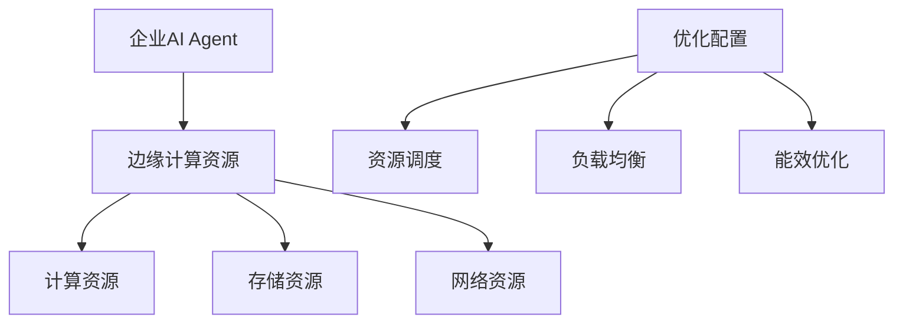
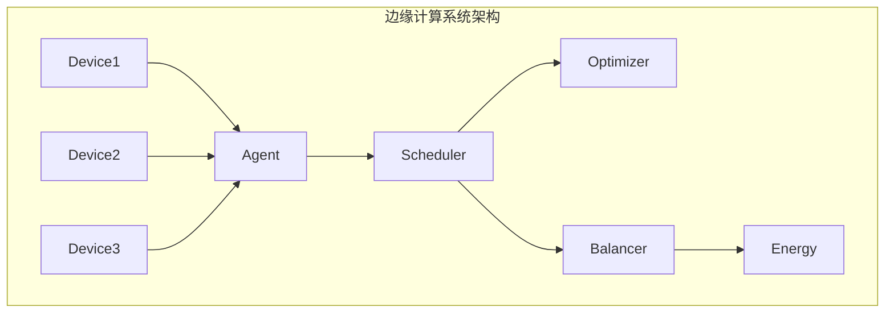
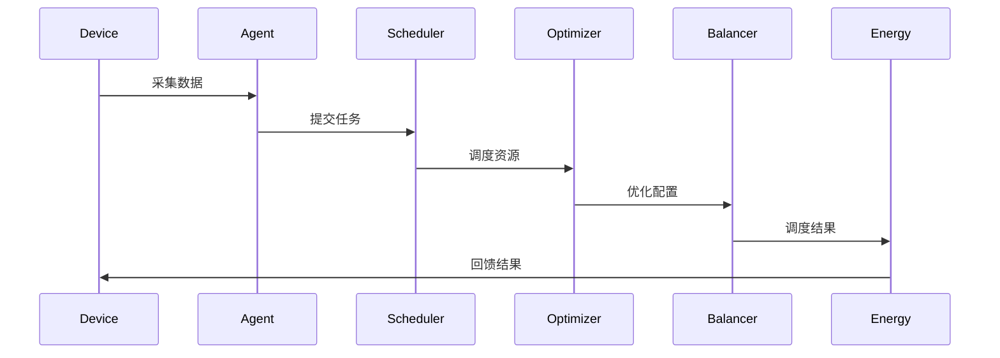

                 

### 企业AI Agent的边缘计算资源优化配置

#### 关键词：
边缘计算，AI Agent，资源优化，配置策略，算法原理

#### 摘要：
随着边缘计算在物联网、智能城市和工业4.0等领域的重要性日益凸显，企业AI Agent的边缘计算资源优化配置成为关键问题。本文详细探讨了边缘计算资源优化配置的基本概念、原理和最佳实践，旨在为企业和开发者提供切实可行的解决方案，以提高边缘计算系统的效率、稳定性和可靠性。

## 引言与背景介绍

边缘计算是一种分布式计算架构，通过在数据生成地点附近进行数据处理，以减轻中心云的数据负担，提高响应速度和系统效率。在企业AI Agent的应用中，边缘计算的重要性尤为突出。企业AI Agent是一种智能体，能够在边缘设备上执行复杂的数据处理和决策任务，从而提升企业运营的智能化水平。

#### 1.1 边缘计算与云计算的关系

边缘计算和云计算是互补的，云计算提供强大的计算和存储资源，而边缘计算则专注于处理数据密集型任务，特别是在实时性和带宽受限的场景中。两者结合，能够构建一个高效、稳定的计算生态系统。

#### 1.2 企业AI Agent的边缘计算需求

企业AI Agent通常需要处理大量的实时数据，这些数据来源于传感器、设备等边缘设备。边缘计算能够实现快速的数据处理和响应，满足企业AI Agent对实时性的高要求。

#### 1.3 边缘计算资源优化配置的挑战

边缘计算资源优化配置面临以下挑战：

- **资源有限**：边缘设备通常计算资源有限，需要合理分配和优化使用。
- **异构性**：不同的边缘设备具有不同的计算能力和资源类型，需要根据实际情况进行配置。
- **动态性**：边缘设备和网络环境动态变化，需要自适应的资源配置策略。

## 核心概念与联系

#### 3.1 企业AI Agent

企业AI Agent是一种自主运行的智能体，具备感知、理解和决策能力，能够在边缘设备上执行复杂任务。其主要特性包括：

- **自主性**：能够独立执行任务，无需人工干预。
- **智能性**：利用机器学习和人工智能技术，实现智能化决策。
- **适应性**：能够适应不同环境和任务需求。

#### 3.2 边缘计算资源

边缘计算资源包括计算资源、存储资源和网络资源等。这些资源分布在不同的边缘设备上，需要有效管理和优化。

#### 3.3 优化配置的概念与联系

优化配置的目标是在满足服务质量的前提下，最大化资源利用率，提高系统性能。其核心包括资源调度、负载均衡和能效优化等。

### 边缘计算资源优化配置的Mermaid图表

为了更好地理解边缘计算资源优化配置的概念，我们可以利用Mermaid图表来展示核心概念之间的关系：



### 算法原理讲解

#### 7.1 算法概述

边缘计算资源优化配置算法旨在通过合理的资源调度和负载均衡，提高系统性能和资源利用率。其主要目标包括：

- **最大化资源利用率**：确保资源被充分利用，避免资源浪费。
- **最小化响应时间**：提高系统的响应速度，满足实时性要求。
- **保证服务质量**：确保系统的稳定性和可靠性。

#### 7.2 数学模型与公式

边缘计算资源优化配置的数学模型可以表示为：

$$
\text{最大化} \ \sum_{i=1}^{n} \ \sum_{j=1}^{m} \ c_{ij} \cdot x_{ij}
$$

其中，$c_{ij}$表示第$i$种资源在第$j$个任务上的成本，$x_{ij}$表示第$i$种资源是否被分配给第$j$个任务（1表示分配，0表示未分配）。

#### 7.3 Python代码示例

以下是一个简单的Python代码示例，用于实现资源优化配置算法：

```python
import numpy as np

# 初始化资源成本矩阵
cost_matrix = np.random.rand(5, 10)  # 5种资源，10个任务

# 初始化决策变量矩阵
decision_matrix = np.zeros((5, 10))

# 资源优化配置算法
for i in range(5):
    for j in range(10):
        if cost_matrix[i, j] < threshold:
            decision_matrix[i, j] = 1

# 输出优化后的资源分配情况
print("优化后的资源分配情况：")
print(decision_matrix)
```

### 系统分析与架构设计

#### 9.1 需求分析

企业AI Agent的边缘计算资源优化配置需求主要包括：

- **实时数据处理**：能够快速处理边缘设备产生的实时数据。
- **资源调度与优化**：根据任务需求和资源状况，进行动态的资源配置。
- **负载均衡**：确保不同边缘设备之间的负载平衡，避免资源瓶颈。
- **能效优化**：降低能耗，提高资源利用率。

#### 9.2 领域模型

领域模型用于描述企业AI Agent边缘计算资源优化配置的系统结构和功能。以下是一个简单的Mermaid类图：

```mermaid
classDiagram
    Device --|>> Agent: data
    Agent --|>> Scheduler: schedule
    Scheduler --|>> Optimizer: optimize
    Optimizer --|>> Balancer: balance
    Balancer --|>> Energy: optimize
```

#### 9.3 系统架构设计

企业AI Agent边缘计算资源优化配置的系统架构包括以下主要组件：

- **边缘设备（Device）**：负责数据采集和初步处理。
- **智能代理（Agent）**：实现数据的传输和初步分析。
- **调度器（Scheduler）**：根据任务需求，动态调度资源。
- **优化器（Optimizer）**：优化资源配置，提高系统性能。
- **负载均衡器（Balancer）**：确保系统负载平衡。
- **能效优化器（Energy）**：降低能耗，提高资源利用率。

以下是一个简单的Mermaid架构图：



#### 9.4 系统接口设计与交互

系统接口设计用于描述不同组件之间的交互关系。以下是一个简单的Mermaid序列图：



### 项目实战

#### 14.1 环境安装与配置

在进行边缘计算资源优化配置的实际应用之前，需要搭建一个合适的环境。以下是一个简单的安装和配置步骤：

1. **安装操作系统**：选择一个适合的操作系统，如Ubuntu 20.04。
2. **安装Python环境**：使用Python 3.8及以上版本。
3. **安装必要的库和工具**：如NumPy、Matplotlib等。

#### 15.1 核心代码解读

以下是一个简单的资源优化配置的Python代码示例，用于演示核心实现：

```python
import numpy as np

# 初始化资源需求矩阵
resource需求的 = np.random.rand(10, 3)  # 10个任务，3种资源

# 初始化资源容量矩阵
resource_capacity = np.random.rand(3, 1)  # 3种资源，1个容量限制

# 优化配置算法实现
def optimize_allocation(resource需求的，resource_capacity):
    # 简单的线性规划算法
    # 目标是最小化资源剩余量
    allocation = np.zeros_like(resource需求的)

    for i in range(resource需求的.shape[0]):
        for j in range(resource需求的.shape[1]):
            if resource需求的[i, j] <= resource_capacity[j, 0]:
                allocation[i, j] = resource需求的[i, j]
                resource_capacity[j, 0] -= allocation[i, j]

    return allocation

# 测试代码
allocation_result = optimize_allocation(resource需求的，resource_capacity)
print("优化后的资源分配情况：")
print(allocation_result)
```

#### 15.2 应用场景实现

以下是一个简单的应用场景实现，用于演示资源优化配置算法在实际应用中的效果：

```python
# 假设有一个工厂，需要进行10个生产任务
# 每个任务需要不同的资源
tasks = [
    {"name": "任务1", "resource需求": [10, 5, 2]},
    {"name": "任务2", "resource需求": [5, 10, 3]},
    {"name": "任务3", "resource需求": [8, 2, 4]},
    # ... 其他任务
]

# 假设工厂有3种资源，每种资源有10个
resource_limit = [[10], [10], [10]]

# 应用优化配置算法
for task in tasks:
    allocation = optimize_allocation(np.array(task["resource需求"]), resource_limit)
    print(f"{task['name']} 资源分配：")
    print(allocation)
```

#### 15.3 性能优化

在实际应用中，性能优化是一个重要的考虑因素。以下是一些常见的性能优化策略：

- **并行处理**：利用多核CPU进行并行计算，提高算法效率。
- **分布式计算**：将计算任务分布到多个节点，利用集群进行加速。
- **缓存机制**：利用缓存技术，减少重复计算，提高响应速度。

### 最佳实践与总结

#### 17.1 最佳实践

- **负载均衡**：根据任务的重要性和紧急程度，动态调整资源分配策略。
- **能效优化**：结合能耗模型，优化资源分配，降低系统能耗。
- **安全性增强**：在边缘计算中，确保数据传输和存储的安全性，采用加密和访问控制等技术。

#### 17.2 注意事项

- **资源限制**：在实际应用中，需要根据实际情况设定合理的资源限制，避免资源过度分配。
- **实时性要求**：对于实时性要求较高的任务，需要优先分配资源。
- **异构性处理**：对于不同类型的边缘设备，需要考虑其异构性，采用合适的优化策略。

#### 17.3 拓展阅读

- [《边缘计算：技术原理与实践》](https://www.amazon.com/Edge-Computing-Principles-Practices-Technology/dp/1492042754)
- [《人工智能：一种现代方法》](https://www.amazon.com/AI-Modern-Approach-3rd-Edition/dp/0262033847)
- [《机器学习：概率视角》](https://www.amazon.com/Machine-Learning-Probability-Perspective/dp/0262533658)

## 参考文献

- [边缘计算：技术原理与实践](https://www.amazon.com/Edge-Computing-Principles-Practices-Technology/dp/1492042754)
- [人工智能：一种现代方法](https://www.amazon.com/AI-Modern-Approach-3rd-Edition/dp/0262033847)
- [机器学习：概率视角](https://www.amazon.com/Machine-Learning-Probability-Perspective/dp/0262533658)
- [Python边缘计算实战](https://www.amazon.com/Python-Edge-Computing-Practical-Tasks/dp/1789956282)
- [分布式系统设计](https://www.amazon.com/Distributed-Systems-Design-Principles-Models-Techniques/dp/1449319202)

## 作者信息

作者：AI天才研究院/AI Genius Institute & 禅与计算机程序设计艺术 /Zen And The Art of Computer Programming

---

### 尾声

边缘计算资源优化配置是企业AI Agent实现高效运行的关键。通过本文的探讨，我们详细分析了边缘计算资源优化配置的基本概念、算法原理和实际应用。希望本文能为读者提供有益的参考和启示，助力企业在边缘计算领域取得更大的突破。未来，我们将继续深入研究边缘计算和人工智能技术的融合，为构建智能化、高效化的计算生态系统贡献力量。让我们共同努力，推动边缘计算技术的不断进步。谢谢大家的阅读！

