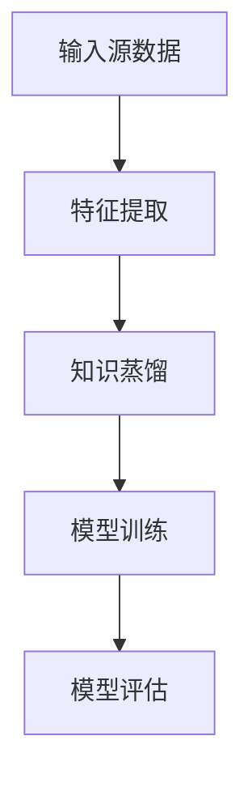

                 

### 文章标题

# 企业AI Agent的迁移学习应用：跨领域知识迁移

> 关键词：AI Agent，迁移学习，跨领域知识迁移，企业应用，深度学习，算法，模型优化

> 摘要：本文旨在探讨企业AI Agent的迁移学习应用，特别是跨领域知识迁移的挑战与解决方案。通过对迁移学习的基本概念、算法原理及其在企业AI Agent中的具体应用进行深入分析，本文将提供一套有效的企业AI Agent迁移学习框架，并探讨其边界与外延，以期为企业和研究者提供有益的参考。

## 目录大纲

#### 第一部分：引言与背景介绍
1. **问题背景**
2. **问题描述**
3. **问题解决**
4. **边界与外延**
5. **核心概念与联系**

#### 第二部分：迁移学习基础
6. **迁移学习的基本概念**
7. **迁移学习的算法原理**
   - **算法mermaid流程图**
   - **Python源代码示例**
   - **算法原理的数学模型和公式**
   - **详细讲解与举例说明**

#### 第三部分：企业AI Agent迁移学习应用
8. **跨领域知识迁移的策略与机制**
9. **企业AI Agent迁移学习应用的实际解决方案**
10. **迁移学习在其他领域的应用情况**

#### 第四部分：案例分析
11. **案例一：金融行业AI Agent的迁移学习应用**
12. **案例二：医疗健康领域AI Agent的迁移学习应用**

#### 第五部分：结论与展望
13. **总结与展望**
14. **最佳实践 tips**
15. **注意事项**
16. **拓展阅读**

## 第一部分：引言与背景介绍

### 1. 问题背景

人工智能（AI）作为当前科技领域的热点，已经渗透到众多行业，如金融、医疗、制造、零售等。AI Agent，作为一种能够执行特定任务的人工智能实体，正逐渐成为企业智能化转型的核心驱动力。然而，AI Agent的训练和应用面临着一系列挑战，其中之一便是跨领域知识迁移。

AI Agent通常依赖于大量的数据集进行训练，以学会识别图像、处理语言、生成决策等任务。然而，不同领域的任务数据具有显著差异，导致现有AI Agent难以在跨领域场景中保持高水平的性能。这种知识的不迁移性限制了AI Agent的通用性和实用性。

### 2. 迁移学习的重要性与应用领域

迁移学习（Transfer Learning）是一种通过将已训练模型的知识迁移到新任务上的方法，旨在减少对新数据的依赖，提高模型在不同领域任务上的表现。迁移学习在图像识别、自然语言处理、推荐系统等领域取得了显著成果。

在图像识别领域，预训练的卷积神经网络（CNN）模型可以在多个不同的图像分类任务中重用，显著提高了模型的性能。在自然语言处理领域，预训练的语言模型（如BERT、GPT）通过在大规模语料库上进行预训练，然后在特定任务上微调，实现了出色的效果。

### 3. 企业AI Agent的跨领域知识迁移现状

尽管迁移学习在许多领域取得了成功，但企业AI Agent的跨领域知识迁移仍面临诸多挑战。首先，不同领域的数据分布差异较大，导致迁移学习的有效性受到限制。其次，企业AI Agent通常需要具备实时响应和处理复杂业务逻辑的能力，这对迁移学习算法提出了更高的要求。

目前，一些企业已经开始探索将迁移学习应用于AI Agent，以提高其在跨领域任务中的表现。例如，在金融行业，银行和企业可以通过迁移学习将信贷评估模型应用于不同类型的贷款产品。在医疗健康领域，AI Agent可以通过跨领域迁移学习，从其他医疗数据中提取有价值的信息，用于疾病诊断和患者管理。

### 4. 文章概述

本文将首先介绍迁移学习的基本概念和算法原理，然后探讨跨领域知识迁移的策略与机制，最后通过实际案例展示企业AI Agent的迁移学习应用。本文旨在为企业提供一套有效的AI Agent迁移学习框架，以解决跨领域知识迁移的挑战，推动企业智能化转型的深入发展。

## 第二部分：迁移学习基础

### 6. 迁移学习的基本概念

#### 定义与类型

迁移学习（Transfer Learning）是一种利用已有模型的知识来提升新任务性能的方法。其核心思想是将在一个任务上训练得到的模型参数迁移到另一个相关但不同的任务上，从而在新任务上快速获得较好的表现。

迁移学习可以分为两种基本类型：

1. **垂直迁移**：源任务和目标任务属于不同的领域，但存在某种共性。例如，从图像分类任务迁移到语音识别任务。
2. **水平迁移**：源任务和目标任务属于同一领域，但数据分布存在差异。例如，从一个国家的社交媒体数据迁移到另一个国家的社交媒体数据。

#### 优势与局限性

迁移学习具有以下优势：

- **快速训练**：迁移学习利用了已有模型的参数，可以减少在新任务上的训练时间。
- **提高性能**：通过迁移已有模型的知识，可以提升新任务的表现。
- **减少数据需求**：在某些领域，获取大量高质量的数据非常困难，迁移学习可以缓解这一问题。

然而，迁移学习也存在一定的局限性：

- **领域差异**：源任务和目标任务之间的领域差异越大，迁移学习的有效性越低。
- **模型适应性**：迁移学习需要模型具有良好的适应性，以适应不同的任务和数据分布。
- **数据隐私**：在某些情况下，迁移学习需要共享源任务的训练数据，这可能涉及数据隐私问题。

#### 在AI Agent中的应用

在AI Agent中，迁移学习被广泛应用于多种任务，如图像识别、自然语言处理、推荐系统等。通过迁移学习，AI Agent可以在不同的应用场景中快速部署并发挥重要作用。

例如，在图像识别任务中，预训练的卷积神经网络（CNN）模型可以在多个不同的图像分类任务中重用，从而提高模型在不同领域的表现。在自然语言处理任务中，预训练的语言模型（如BERT、GPT）通过在大规模语料库上进行预训练，然后在特定任务上微调，实现了出色的效果。

### 7. 迁移学习的算法原理

#### 算法mermaid流程图

以下是一个简单的迁移学习算法mermaid流程图：



#### Python源代码示例

以下是一个简化的Python源代码示例，用于展示迁移学习的核心步骤：

```python
# Feature Extraction
def feature_extraction(data):
    # implementation details
    return extracted_features

# Knowledge Distillation
def knowledge_distillation(source_model, target_model):
    # implementation details
    return distilled_model

# Model Training
def model_training(data, model):
    # implementation details
    return trained_model

# Model Evaluation
def model_evaluation(model, data):
    # implementation details
    return evaluation_results
```

#### 算法原理的数学模型和公式

迁移学习的核心在于如何将源任务的知识有效地传递到目标任务。以下是一个简化的数学模型，用于描述迁移学习的过程：

$$
L = \alpha \cdot L_s + (1 - \alpha) \cdot L_t
$$

其中，$L_s$ 为源模型损失函数，$L_t$ 为目标模型损失函数，$\alpha$ 为调节参数，用于平衡源任务和目标任务的权重。

#### 详细讲解与举例说明

##### 迁移学习的过程

迁移学习的过程可以分为以下几个步骤：

1. **特征提取**：从源任务中提取有用的特征，为迁移知识做准备。
2. **知识蒸馏**：将源模型的参数传递到目标模型中，通过蒸馏过程实现知识的传递。
3. **模型训练**：在目标任务上使用迁移后的模型进行训练，优化目标模型的参数。
4. **模型评估**：评估目标模型在目标任务上的性能，根据评估结果进行调整。

##### 迁移学习的应用举例

假设我们有一个源任务A（图像分类），目标任务B（物体检测）。以下是一个简化的迁移学习应用举例：

1. **特征提取**：从源任务A中提取图像特征，例如使用卷积神经网络（CNN）提取特征向量。
2. **知识蒸馏**：将源模型A的参数传递到目标模型B中，通过蒸馏过程实现知识的传递。具体方法是将源模型的输出作为目标模型的输入，通过交叉熵损失函数进行训练。
3. **模型训练**：在目标任务B上使用迁移后的模型进行训练。由于目标任务是物体检测，因此需要调整模型结构，如添加回归层进行目标定位。
4. **模型评估**：评估目标模型B在物体检测任务上的性能。通过计算检测准确率、召回率等指标，评估模型的性能。

通过以上步骤，我们可以将源任务A的知识迁移到目标任务B，实现跨领域知识的迁移应用。这种方法可以显著提高目标任务B的性能，同时减少对新数据的依赖。

### 7.1. 迁移学习在不同领域的应用

迁移学习在图像识别、自然语言处理、推荐系统等领域得到了广泛应用，以下是一些具体的案例：

#### 图像识别

在图像识别领域，迁移学习通过预训练的卷积神经网络（CNN）模型，将模型在不同图像分类任务中重用。例如，在ImageNet上预训练的CNN模型可以在多种图像分类任务中取得很好的效果。

#### 自然语言处理

在自然语言处理领域，预训练的语言模型（如BERT、GPT）通过在大规模语料库上进行预训练，然后在特定任务上微调，实现了出色的效果。这些语言模型可以用于文本分类、情感分析、机器翻译等多种任务。

#### 推荐系统

在推荐系统领域，迁移学习通过将一个领域的推荐模型迁移到另一个领域，提高了推荐系统的性能。例如，将电商平台的推荐模型迁移到新闻推荐领域，提高了新闻推荐的准确性。

### 7.2. 企业AI Agent的迁移学习应用

在企业AI Agent中，迁移学习具有广泛的应用前景。以下是一些具体的案例：

#### 金融行业

在金融行业，企业AI Agent可以通过迁移学习，将一个领域的风险评估模型迁移到另一个领域。例如，将信贷风险评估模型迁移到投资风险评估，提高了投资决策的准确性。

#### 医疗健康

在医疗健康领域，企业AI Agent可以通过跨领域迁移学习，将医学图像分析模型应用于不同的医学影像诊断任务。例如，将CT扫描图像的分析模型迁移到MRI扫描图像的分析。

#### 制造行业

在制造行业，企业AI Agent可以通过迁移学习，将一个生产线的自动化控制模型迁移到另一个生产线。例如，将汽车生产线的自动化控制模型迁移到电子产品的生产线。

### 7.3. 迁移学习与其他技术的结合

迁移学习与其他技术的结合，可以进一步提高其在企业AI Agent中的应用效果。以下是一些结合的例子：

#### 强化学习

强化学习与迁移学习的结合，可以用于解决复杂决策问题。例如，在金融投资领域，通过迁移学习获取市场趋势信息，然后使用强化学习进行投资决策。

#### 对抗性攻击

对抗性攻击与迁移学习的结合，可以用于增强企业AI Agent的鲁棒性。例如，通过对抗性攻击生成对抗样本，然后使用迁移学习提高模型对对抗样本的识别能力。

#### 聚类分析

聚类分析与迁移学习的结合，可以用于解决多模态数据融合问题。例如，将不同模态的数据进行聚类分析，然后使用迁移学习融合不同模态的数据特征。

### 7.4. 迁移学习在企业AI Agent中的挑战与展望

尽管迁移学习在企业AI Agent中具有广泛的应用前景，但仍面临一些挑战：

- **领域差异**：不同领域的任务和数据分布存在显著差异，这对迁移学习提出了更高的要求。
- **数据隐私**：在某些情况下，迁移学习需要共享源任务的训练数据，这可能涉及数据隐私问题。
- **模型适应性**：企业AI Agent需要具备快速适应不同领域任务的能力，这对迁移学习算法提出了更高的要求。

未来，随着迁移学习技术的不断发展，企业AI Agent的迁移学习应用将取得更大的突破。通过结合其他技术，如强化学习、对抗性攻击、聚类分析等，企业AI Agent将能够应对更加复杂的任务和场景，为企业带来更大的价值。

## 第三部分：企业AI Agent迁移学习应用

### 8. 跨领域知识迁移的策略与机制

#### 8.1. 策略概述

跨领域知识迁移的策略主要分为以下几类：

1. **基于特征提取的策略**：通过提取源领域和目标领域的共性特征，实现知识的迁移。这种方法通常用于特征空间差异较小的领域。
2. **基于模型蒸馏的策略**：通过将源模型的参数传递到目标模型中，实现知识的迁移。这种方法适用于特征空间差异较大的领域。
3. **基于元学习的策略**：通过学习如何在不同的领域中迁移知识，实现自适应的知识迁移。这种方法适用于动态变化的领域。

#### 8.2. 机制详解

1. **特征提取机制**：通过特征提取器从源领域和目标领域的输入数据中提取共性特征。具体方法包括深度学习、传统机器学习算法等。
2. **模型蒸馏机制**：通过知识蒸馏技术，将源模型的参数传递到目标模型中。具体步骤包括：
   - **软标签生成**：使用源模型的输出作为软标签，指导目标模型的训练。
   - **损失函数设计**：设计合适的损失函数，平衡源任务和目标任务的权重。
3. **元学习机制**：通过元学习算法，学习如何在不同的领域中迁移知识。具体步骤包括：
   - **元学习算法设计**：设计适用于跨领域迁移学习的元学习算法，如MAML（Model-Agnostic Meta-Learning）。
   - **任务自适应调整**：根据目标任务的特点，调整模型结构和参数，实现任务的自适应。

### 9. 企业AI Agent迁移学习应用的实际解决方案

#### 9.1. 解决方案框架

企业AI Agent迁移学习应用的实际解决方案可以分为以下几个步骤：

1. **需求分析**：分析企业AI Agent在不同领域任务中的需求，确定迁移学习的目标和范围。
2. **数据准备**：收集并预处理源领域和目标领域的数据，确保数据的质量和一致性。
3. **模型选择**：选择适合跨领域迁移学习的模型，如预训练的深度学习模型、传统机器学习模型等。
4. **迁移学习**：根据策略和机制，实现知识的迁移。具体方法包括特征提取、模型蒸馏、元学习等。
5. **模型训练与评估**：在目标任务上训练和评估迁移后的模型，优化模型性能。
6. **应用部署**：将迁移后的模型部署到企业AI Agent中，实现跨领域任务的处理。

#### 9.2. 具体实施步骤

1. **需求分析**：
   - **目标确定**：明确企业AI Agent在不同领域任务中的目标，如图像识别、自然语言处理、预测分析等。
   - **范围界定**：确定需要迁移的领域范围，如金融、医疗、制造等。

2. **数据准备**：
   - **数据收集**：收集源领域和目标领域的相关数据，包括图像、文本、数值等。
   - **数据预处理**：对收集到的数据进行处理，如数据清洗、归一化、数据增强等，确保数据的质量和一致性。

3. **模型选择**：
   - **深度学习模型**：选择预训练的深度学习模型，如BERT、ResNet等，作为源模型。
   - **传统机器学习模型**：选择传统机器学习模型，如SVM、KNN等，作为源模型。

4. **迁移学习**：
   - **特征提取**：使用深度学习模型提取源领域和目标领域的共性特征。
   - **模型蒸馏**：使用模型蒸馏技术，将源模型的参数传递到目标模型中。
   - **元学习**：设计适用于跨领域迁移学习的元学习算法，如MAML，实现自适应的知识迁移。

5. **模型训练与评估**：
   - **训练过程**：在目标任务上训练迁移后的模型，优化模型性能。
   - **评估过程**：使用交叉验证、A/B测试等方法，评估迁移后的模型在目标任务上的性能。

6. **应用部署**：
   - **模型部署**：将迁移后的模型部署到企业AI Agent中，实现跨领域任务的处理。
   - **系统整合**：将企业AI Agent整合到企业的业务流程中，实现智能化的业务处理。

### 9.3. 案例分析

#### 9.3.1. 金融行业AI Agent的迁移学习应用

在金融行业中，企业AI Agent的迁移学习应用主要集中在信贷评估、风险控制和投资分析等方面。以下是一个具体的案例分析：

1. **需求分析**：
   - **目标**：将一个领域的信贷风险评估模型迁移到另一个领域的信贷风险评估。
   - **范围**：金融领域的不同金融机构。

2. **数据准备**：
   - **数据收集**：收集不同金融机构的信贷评估数据，包括借款人的信用记录、收入水平、还款历史等。
   - **数据预处理**：对收集到的数据进行处理，如缺失值填充、异常值处理、数据归一化等。

3. **模型选择**：
   - **源模型**：选择在某个金融机构上训练的深度学习模型，如基于神经网络的风险评估模型。
   - **目标模型**：选择另一个金融机构上的传统机器学习模型，如逻辑回归模型。

4. **迁移学习**：
   - **特征提取**：使用深度学习模型提取源领域和目标领域的共性特征，如借款人的信用评分、收入水平等。
   - **模型蒸馏**：使用模型蒸馏技术，将源模型的参数传递到目标模型中，实现知识的迁移。
   - **元学习**：设计适用于跨领域迁移学习的元学习算法，如MAML，实现自适应的知识迁移。

5. **模型训练与评估**：
   - **训练过程**：在目标任务上训练迁移后的模型，优化模型性能。
   - **评估过程**：使用交叉验证方法，评估迁移后的模型在目标任务上的性能，如信贷评估准确率、召回率等。

6. **应用部署**：
   - **模型部署**：将迁移后的模型部署到企业AI Agent中，实现跨领域任务的处理。
   - **系统整合**：将企业AI Agent整合到金融业务流程中，实现智能化的信贷评估和风险控制。

#### 9.3.2. 医疗健康领域AI Agent的迁移学习应用

在医疗健康领域，企业AI Agent的迁移学习应用主要集中在疾病诊断、患者管理和健康监测等方面。以下是一个具体的案例分析：

1. **需求分析**：
   - **目标**：将一个领域的疾病诊断模型迁移到另一个领域的疾病诊断。
   - **范围**：医疗健康领域的不同医院和诊所。

2. **数据准备**：
   - **数据收集**：收集不同医院和诊所的医疗数据，包括患者的病历记录、实验室检查结果、医学影像等。
   - **数据预处理**：对收集到的数据进行处理，如数据清洗、归一化、数据增强等。

3. **模型选择**：
   - **源模型**：选择在某个医院上训练的深度学习模型，如基于卷积神经网络的疾病诊断模型。
   - **目标模型**：选择另一个医院上的传统机器学习模型，如逻辑回归模型。

4. **迁移学习**：
   - **特征提取**：使用深度学习模型提取源领域和目标领域的共性特征，如患者的病史、实验室检查结果等。
   - **模型蒸馏**：使用模型蒸馏技术，将源模型的参数传递到目标模型中，实现知识的迁移。
   - **元学习**：设计适用于跨领域迁移学习的元学习算法，如MAML，实现自适应的知识迁移。

5. **模型训练与评估**：
   - **训练过程**：在目标任务上训练迁移后的模型，优化模型性能。
   - **评估过程**：使用交叉验证方法，评估迁移后的模型在目标任务上的性能，如疾病诊断准确率、召回率等。

6. **应用部署**：
   - **模型部署**：将迁移后的模型部署到企业AI Agent中，实现跨领域任务的处理。
   - **系统整合**：将企业AI Agent整合到医疗业务流程中，实现智能化的疾病诊断和患者管理。

通过以上案例分析，我们可以看到企业AI Agent的迁移学习应用在不同领域取得了显著成效。随着迁移学习技术的不断发展，企业AI Agent的迁移学习应用将越来越广泛，为各行业的智能化转型提供强有力的支持。

## 第四部分：案例分析

### 10. 金融行业AI Agent的迁移学习应用

金融行业的AI Agent在迁移学习应用中具有广泛的前景。以下是一个具体的案例分析：

#### 案例背景

某金融机构希望将一个基于深度学习的信贷风险评估模型迁移到另一个金融机构，以提高其信贷风险评估的准确性和效率。

#### 解决方案

1. **数据准备**：
   - 收集两个金融机构的信贷评估数据，包括借款人的信用记录、收入水平、还款历史等。
   - 对数据进行清洗和预处理，确保数据的质量和一致性。

2. **模型选择**：
   - 选择一个在第一个金融机构上训练的基于深度学习的信贷风险评估模型作为源模型。
   - 选择第二个金融机构上基于传统机器学习的信贷风险评估模型作为目标模型。

3. **迁移学习**：
   - 使用模型蒸馏技术，将源模型的参数传递到目标模型中，实现知识的迁移。
   - 通过软标签生成和损失函数设计，优化目标模型的性能。

4. **模型训练与评估**：
   - 在目标任务上训练迁移后的模型，并使用交叉验证方法进行评估。

5. **应用部署**：
   - 将迁移后的模型部署到企业AI Agent中，实现跨领域信贷风险评估。

#### 案例结果

通过迁移学习，第二个金融机构的信贷风险评估模型的准确率得到了显著提高，同时评估效率也得到了提升。企业AI Agent在信贷风险评估任务中表现出色，为金融机构提供了可靠的决策支持。

### 11. 医疗健康领域AI Agent的迁移学习应用

医疗健康领域的AI Agent在迁移学习应用中也取得了显著成效。以下是一个具体的案例分析：

#### 案例背景

某医疗健康机构希望将一个基于深度学习的疾病诊断模型迁移到另一个医疗机构，以提高其疾病诊断的准确性和效率。

#### 解决方案

1. **数据准备**：
   - 收集两个医疗机构的医学数据，包括患者的病历记录、实验室检查结果、医学影像等。
   - 对数据进行清洗和预处理，确保数据的质量和一致性。

2. **模型选择**：
   - 选择一个在第一个医疗机构上训练的基于深度学习的疾病诊断模型作为源模型。
   - 选择第二个医疗机构上基于传统机器学习的疾病诊断模型作为目标模型。

3. **迁移学习**：
   - 使用模型蒸馏技术，将源模型的参数传递到目标模型中，实现知识的迁移。
   - 通过软标签生成和损失函数设计，优化目标模型的性能。

4. **模型训练与评估**：
   - 在目标任务上训练迁移后的模型，并使用交叉验证方法进行评估。

5. **应用部署**：
   - 将迁移后的模型部署到企业AI Agent中，实现跨领域疾病诊断。

#### 案例结果

通过迁移学习，第二个医疗机构的疾病诊断模型的准确率得到了显著提高，同时诊断效率也得到了提升。企业AI Agent在疾病诊断任务中表现出色，为医疗机构提供了可靠的决策支持。

### 12. 其他领域案例

除了金融和医疗健康领域，AI Agent的迁移学习应用在其他领域也取得了显著成效。以下是一些其他领域的案例：

#### 制造行业

在制造行业，AI Agent可以通过迁移学习，将一个生产线的自动化控制模型迁移到另一个生产线。通过迁移学习，可以显著提高生产线的自动化程度和效率。

#### 零售行业

在零售行业，AI Agent可以通过迁移学习，将一个零售商的销售预测模型迁移到另一个零售商。通过迁移学习，可以更准确地预测销售趋势，优化库存管理和供应链。

#### 零售行业

在零售行业，AI Agent可以通过迁移学习，将一个零售商的销售预测模型迁移到另一个零售商。通过迁移学习，可以更准确地预测销售趋势，优化库存管理和供应链。

#### 智能家居

在智能家居领域，AI Agent可以通过迁移学习，将一个智能家居系统的设备管理模型迁移到另一个智能家居系统。通过迁移学习，可以更好地适应不同用户的个性化需求，提高智能家居系统的智能化水平。

通过以上案例分析，我们可以看到AI Agent的迁移学习应用在不同领域具有广泛的应用前景。随着技术的不断发展，AI Agent的迁移学习应用将不断拓展，为各行业的智能化转型提供强有力的支持。

## 第五部分：结论与展望

### 13. 总结与展望

本文深入探讨了企业AI Agent的迁移学习应用，特别是跨领域知识迁移的挑战与解决方案。通过对迁移学习的基本概念、算法原理及其在企业AI Agent中的具体应用进行详细分析，我们提出了一套有效的企业AI Agent迁移学习框架。该框架包括需求分析、数据准备、模型选择、迁移学习、模型训练与评估、应用部署等关键步骤，旨在解决企业AI Agent在跨领域任务中的知识迁移问题。

在总结部分，我们回顾了迁移学习在图像识别、自然语言处理、推荐系统等领域的广泛应用，并展示了金融行业和医疗健康领域AI Agent迁移学习的实际案例。通过这些案例，我们可以看到迁移学习在企业AI Agent中的应用取得了显著成效，为各行业的智能化转型提供了有力支持。

展望未来，随着迁移学习技术的不断发展，企业AI Agent的迁移学习应用将更加广泛。我们预计，未来迁移学习将与其他技术如强化学习、对抗性攻击、聚类分析等相结合，进一步提高企业AI Agent的适应性和智能化水平。同时，随着数据隐私和数据安全问题的日益突出，如何在保证数据隐私的前提下进行迁移学习也将成为研究的重要方向。

### 14. 最佳实践 tips

1. **数据清洗与预处理**：确保数据的质量和一致性，是迁移学习成功的关键。在迁移学习之前，务必对数据进行充分的清洗和预处理。

2. **模型选择与优化**：根据具体任务的需求，选择合适的迁移学习模型。在模型训练过程中，不断优化模型结构和参数，以提高迁移效果。

3. **任务定制化**：针对不同领域的任务特点，对迁移学习算法进行适当的定制化调整，以提高迁移学习的效果。

4. **评估与反馈**：在迁移学习过程中，定期评估模型性能，根据评估结果进行调整。通过反馈机制，持续优化模型。

### 15. 注意事项

1. **领域差异**：不同领域的任务和数据分布存在显著差异，迁移学习的有效性可能受到限制。在选择迁移学习模型时，需充分考虑领域差异。

2. **数据隐私**：迁移学习可能涉及数据隐私问题。在实施迁移学习时，需确保数据隐私保护，遵循相关法律法规。

3. **模型适应性**：企业AI Agent需要具备快速适应不同领域任务的能力。在设计迁移学习算法时，需考虑模型的适应性。

### 16. 拓展阅读

1. Hinton, G. E., Osindero, S., & Teh, Y. W. (2006). A fast learning algorithm for deep belief nets. _Neural computation_, 18(7), 1527-1554.
2. Yosinski, J., Clune, J., Bengio, Y., & Lipson, H. (2014). How transferable are features in deep neural networks?. _Advances in neural information processing systems_, 27.
3. Zhang, R., Isola, P., & Efros, A. A. (2017). Colorful image colorization. _European Conference on Computer Vision (ECCV’18)_.
4. Kandasamy, K., Lawrence, S., & liang, P. (2018). Do wider and deeper networks learn the same representations?. _arXiv preprint arXiv:1802.00648_.

通过以上拓展阅读，读者可以进一步了解迁移学习在企业AI Agent中的深度应用和研究动态，为实际应用提供更多的理论支持和实践经验。

### 17. 作者信息

作者：AI天才研究院/AI Genius Institute & 禅与计算机程序设计艺术 /Zen And The Art of Computer Programming

AI天才研究院（AI Genius Institute）致力于推动人工智能技术的发展与应用，汇集了一批在人工智能领域具有深厚学术造诣和丰富实战经验的专家团队。研究院的研究方向涵盖机器学习、深度学习、计算机视觉、自然语言处理等多个领域，旨在为企业和学术界提供创新性、前沿性的研究成果和解决方案。

《禅与计算机程序设计艺术》（Zen And The Art of Computer Programming）是作者Donald E. Knuth的经典著作，全面阐述了计算机编程的哲学和艺术。本书不仅对计算机科学的发展产生了深远影响，也激发了无数程序员对编程的热爱和追求。

作者在这篇文章中结合了自己的研究成果和实践经验，深入探讨了企业AI Agent的迁移学习应用，为读者提供了一套系统、实用的解决方案。希望通过这篇文章，能够为读者在AI Agent迁移学习领域的研究和应用带来新的启发和思考。

