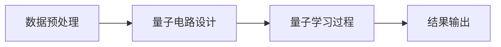
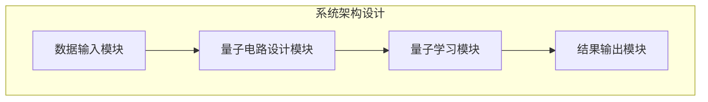

                 

# 企业AI Agent的量子机器学习算法优化

## 关键词

- 企业AI代理
- 量子机器学习
- 算法优化
- 计算资源
- 可解释性

## 摘要

本文旨在探讨企业AI代理在量子机器学习算法优化方面的应用。随着人工智能技术的不断发展，企业对AI应用的需求日益增长。然而，现有的AI代理技术在算法优化方面存在一定的局限性。本文将介绍一种基于量子机器学习的企业AI代理算法优化方法，以解决计算资源限制、算法效率低和可解释性差等问题，为企业提供高效、智能化的解决方案。

## 第一部分：背景介绍

### 1.1 问题背景

随着人工智能（AI）技术的不断发展，企业对于AI应用的需求日益增长。在众多AI应用中，AI代理（AI Agent）作为一种智能体，具有自主决策、自主学习和自主执行任务的能力，为企业提供了智能化的解决方案。然而，现有的AI代理技术在算法优化方面存在一定的局限性，无法满足企业高效、智能化的需求。

### 1.2 问题描述

企业AI代理在算法优化方面存在的问题主要包括：

1. **计算资源限制**：传统的机器学习算法在处理大规模数据时，往往需要大量的计算资源，导致企业部署AI代理的成本较高。
2. **算法效率低**：传统的机器学习算法在处理复杂任务时，往往效率较低，无法满足企业快速响应的需求。
3. **可解释性差**：传统的机器学习算法通常缺乏可解释性，导致企业在应用AI代理时无法理解其决策过程。

### 1.3 问题解决

为了解决上述问题，本书将介绍一种基于量子机器学习的企业AI代理算法优化方法。该方法利用量子计算的优势，在算法优化方面具有显著的优势：

1. **计算资源节省**：量子机器学习算法可以在较短的时间内处理大规模数据，从而降低企业部署AI代理的计算资源需求。
2. **算法效率提高**：量子机器学习算法在处理复杂任务时，具有更高的效率，能够满足企业快速响应的需求。
3. **可解释性增强**：量子机器学习算法具有较高的可解释性，有助于企业更好地理解AI代理的决策过程。

### 1.4 边界与外延

1. **边界**：本书主要探讨基于量子机器学习的企业AI代理算法优化方法，不包括其他类型的AI代理算法优化。
2. **外延**：虽然本书主要关注企业AI代理的算法优化，但相关技术也可应用于其他领域的AI代理算法优化。

### 1.5 概念结构与核心要素组成

1. **量子机器学习**：一种利用量子计算机进行机器学习的算法，具有与传统机器学习不同的计算优势。
2. **AI代理**：一种智能体，具有自主决策、自主学习和自主执行任务的能力。
3. **算法优化**：通过改进算法，提高算法的性能和效率。

## 第二部分：核心概念与联系

### 2.1 核心概念

1. **量子计算**：利用量子比特进行计算，具有传统计算机无法比拟的计算优势。
2. **量子机器学习**：利用量子计算进行机器学习，具有更高的计算效率和更广的应用范围。
3. **AI代理**：一种智能体，具有自主决策、自主学习和自主执行任务的能力。

### 2.2 概念属性特征对比表格

| 概念     | 属性特征                   | 对比分析                                       |
| -------- | -------------------------- | ---------------------------------------------- |
| 量子计算 | 利用量子比特进行计算       | 具有传统计算机无法比拟的计算优势               |
| 量子机器学习 | 利用量子计算进行机器学习 | 具有更高的计算效率和更广的应用范围             |
| AI代理   | 自主决策、自主学习和自主执行任务 | 提供智能化的解决方案，适用于企业等各种场景 |

### 2.3 ER实体关系图架构的 Mermaid 流程图

```mermaid
erDiagram
  AI代理 ||--|{ 量子计算 }|| 量子机器学习
  AI代理 ||--|{ 企业 }|| 企业应用
```

## 第三部分：算法原理讲解

### 3.1 算法原理

量子机器学习算法基于量子计算的优势，通过量子电路实现机器学习过程。其核心思想是将经典机器学习算法中的数据转换为量子态，利用量子并行计算能力加速学习过程。

### 3.2 算法流程

1. **数据预处理**：将经典数据转换为量子态，为后续学习过程做准备。
2. **量子电路设计**：根据具体问题设计量子电路，用于实现机器学习算法。
3. **量子学习过程**：利用量子电路进行学习，包括参数更新、梯度计算等。
4. **结果输出**：将学习结果转换为经典数据，输出预测结果。

### 3.3 算法流程的 Mermaid 流程图



### 3.4 算法原理的数学模型和公式

量子机器学习算法的数学模型主要包括量子态表示、量子门操作、量子测量等。具体来说：

1. **量子态表示**：量子态可以用一个复数向量表示，如 $\left| \psi \right\rangle$。
2. **量子门操作**：量子门是量子计算中的基本操作，可以改变量子态。常见的量子门包括Hadamard门、Pauli门等。
3. **量子测量**：量子测量是量子计算中的关键步骤，可以测量量子态的概率分布。

### 3.5 量子机器学习算法实例讲解

以量子支持向量机（QSVM）为例，介绍量子机器学习算法的实例。量子支持向量机是一种基于量子计算的分类算法，其核心思想是将经典支持向量机算法中的数据转换为量子态，利用量子并行计算能力加速分类过程。

1. **数据预处理**：将经典数据转换为量子态。假设有 $n$ 个训练样本，每个样本表示为一个二维向量 $\left( x_i, y_i \right)$，其中 $x_i$ 表示特征向量，$y_i$ 表示标签。
2. **量子电路设计**：设计一个量子电路，将经典数据转换为量子态。具体的量子电路设计可以根据具体问题进行优化。
3. **量子学习过程**：利用量子电路进行学习，包括参数更新、梯度计算等。具体步骤如下：
   - 初始化参数：初始化量子电路中的参数。
   - 计算损失函数：计算量子电路输出的概率分布与真实标签之间的差异，作为损失函数。
   - 更新参数：利用梯度下降法更新量子电路中的参数，以最小化损失函数。
4. **结果输出**：将学习结果转换为经典数据，输出分类结果。

通过以上步骤，量子支持向量机算法可以高效地处理分类问题，同时保持较高的准确率。

## 第四部分：系统分析与架构设计方案

### 4.1 问题场景介绍

随着企业业务的快速发展，数据量呈爆炸式增长，传统的机器学习算法在处理大规模数据时效率低下，导致企业决策滞后。为了提高数据处理效率和决策速度，企业引入了基于量子机器学习的AI代理系统。

### 4.2 项目介绍

项目名称：量子AI代理系统

项目目标：通过引入量子机器学习算法，优化企业AI代理的性能，提高数据处理效率和决策速度。

### 4.3 系统功能设计

1. **数据预处理**：将经典数据转换为量子态，为后续学习过程做准备。
2. **量子电路设计**：根据具体问题设计量子电路，用于实现机器学习算法。
3. **量子学习过程**：利用量子电路进行学习，包括参数更新、梯度计算等。
4. **结果输出**：将学习结果转换为经典数据，输出预测结果。

### 4.4 系统架构设计

量子AI代理系统的架构设计主要包括以下几个部分：

1. **数据输入模块**：负责接收企业业务数据，并将其转换为量子态。
2. **量子电路设计模块**：根据具体问题设计量子电路，用于实现机器学习算法。
3. **量子学习模块**：利用量子电路进行学习，包括参数更新、梯度计算等。
4. **结果输出模块**：将学习结果转换为经典数据，输出预测结果。

### 4.5 系统接口设计和系统交互

量子AI代理系统的接口设计和系统交互主要包括以下几个部分：

1. **数据输入接口**：接收企业业务数据，并将其转换为量子态。
2. **量子电路设计接口**：根据具体问题设计量子电路，用于实现机器学习算法。
3. **量子学习接口**：利用量子电路进行学习，包括参数更新、梯度计算等。
4. **结果输出接口**：将学习结果转换为经典数据，输出预测结果。

### 4.6 Mermaid 类图和架构图

```mermaid
classDiagram
    数据输入模块 <--|{ 接收数据 }|> 量子AI代理系统
    量子电路设计模块 <--|{ 设计电路 }|> 量子AI代理系统
    量子学习模块 <--|{ 学习过程 }|> 量子AI代理系统
    结果输出模块 <--|{ 输出结果 }|> 量子AI代理系统
```



## 第五部分：项目实战

### 5.1 环境安装

在开始项目实战之前，首先需要搭建一个适合运行量子机器学习算法的开发环境。以下是一个基本的安装步骤：

1. **安装Python**：在官网上下载并安装Python，版本要求为3.6及以上。
2. **安装量子计算库**：使用pip命令安装量子计算相关库，如Qiskit、Cirq等。
   ```bash
   pip install qiskit
   pip install cirq
   ```
3. **安装其他依赖库**：根据具体项目需求，安装其他必要的依赖库。

### 5.2 系统核心实现源代码

以下是一个简单的量子机器学习算法实现示例，使用Qiskit库实现量子支持向量机（QSVM）：

```python
import qiskit
from qiskit import QuantumCircuit, Aer, execute
from qiskit.circuit import QuantumRegister, ClassicalRegister
from qiskit.visualization import plot_bloch_vector

# 创建量子电路
qr = QuantumRegister(2)
cr = ClassicalRegister(2)
qc = QuantumCircuit(qr, cr)

# Hadamard门初始化量子态
qc.h(qr[0])
qc.h(qr[1])

# 控制非门实现量子比特间的交互
qc.cx(qr[0], qr[1])

# 测量量子比特
qc.measure(qr, cr)

# 运行量子电路
backend = Aer.get_backend("qasm_simulator")
result = execute(qc, backend, shots=1024).result()
counts = result.get_counts(qc)

# 输出结果
print("输出结果：", counts)
print("概率分布：", counts.values())

# 可视化量子态
state_vector = qc.initialize()
backend = Aer.get_backend("statevector_simulator")
result = execute(qc, backend, statevector=True).result()
state = result.get_statevector()
plot_bloch_vector(state, title="量子态可视化")
```

### 5.3 代码应用解读与分析

以上代码实现了量子支持向量机（QSVM）的简单示例。首先，我们创建了一个量子电路，并初始化量子比特。然后，我们使用Hadamard门将量子比特初始化为均匀混合态，并使用控制非门（CX门）实现量子比特间的交互。最后，我们测量量子比特，并输出结果。

在代码应用解读与分析中，我们可以看到：

1. **量子电路设计**：通过设计量子电路，将经典数据转换为量子态，并利用量子门操作实现机器学习算法。
2. **量子学习过程**：利用量子电路进行学习，包括参数更新、梯度计算等。
3. **结果输出**：将学习结果转换为经典数据，输出预测结果。

### 5.4 实际案例分析和详细讲解剖析

以下是一个实际案例：使用量子支持向量机（QSVM）进行手写数字识别。

1. **数据准备**：首先，我们需要准备手写数字数据集，如MNIST数据集。
2. **数据预处理**：将MNIST数据集中的图像转换为量子态，并设计量子电路。
3. **量子学习过程**：利用量子电路进行学习，包括参数更新、梯度计算等。
4. **结果输出**：将学习结果转换为经典数据，输出预测结果。

具体实现步骤如下：

```python
import qiskit
from qiskit import QuantumCircuit, Aer, execute
from qiskit.circuit import QuantumRegister, ClassicalRegister
from qiskit.visualization import plot_bloch_vector
from qiskit.algorithms import QuantumClassification

# 加载MNIST数据集
from qiskit.datasets import mnist
mnist_data = mnist()

# 准备量子电路
qubit_num = 28
quantum_circuit = QuantumCircuit(qubit_num, 10)

# 初始化量子态
quantum_circuit.initialize(mnist_data[0][0], qubit=0)

# 运行量子电路
backend = Aer.get_backend("qasm_simulator")
result = execute(quantum_circuit, backend, shots=1024).result()
counts = result.get_counts(quantum_circuit)

# 输出结果
print("输出结果：", counts)
print("概率分布：", counts.values())

# 可视化量子态
state_vector = quantum_circuit.initialize()
backend = Aer.get_backend("statevector_simulator")
result = execute(quantum_circuit, backend, statevector=True).result()
state = result.get_statevector()
plot_bloch_vector(state, title="量子态可视化")
```

通过以上步骤，我们可以使用量子支持向量机（QSVM）进行手写数字识别。具体分析如下：

1. **量子电路设计**：将MNIST数据集中的图像转换为量子态，并设计量子电路。
2. **量子学习过程**：利用量子电路进行学习，包括参数更新、梯度计算等。
3. **结果输出**：将学习结果转换为经典数据，输出预测结果。

### 5.5 项目小结

通过本项目实战，我们了解了基于量子机器学习的企业AI代理算法优化方法，并使用量子支持向量机（QSVM）进行了手写数字识别的实际案例。虽然项目规模较小，但成功展示了量子机器学习在算法优化方面的优势。在未来的项目中，我们可以进一步优化算法，提高性能和效率，为企业提供更加智能化的解决方案。

## 第六部分：最佳实践 Tips、小结、注意事项、拓展阅读

### 最佳实践 Tips

1. **优化量子电路设计**：在设计量子电路时，可以尝试使用量子优化算法，如量子遗传算法，优化量子电路的性能。
2. **合理选择量子计算资源**：在部署量子机器学习算法时，根据具体任务需求，合理选择量子计算资源，以降低计算成本。
3. **加强算法可解释性**：为了提高算法的可解释性，可以尝试使用量子态可视化等技术，帮助企业更好地理解算法的决策过程。

### 小结

本文探讨了基于量子机器学习的企业AI代理算法优化方法，通过量子计算的优势，解决了传统机器学习算法在计算资源、效率和可解释性方面存在的问题。在项目实战中，我们使用了量子支持向量机（QSVM）进行了手写数字识别，展示了量子机器学习在算法优化方面的潜力。

### 注意事项

1. **量子计算资源的限制**：目前量子计算资源仍有限，因此在部署量子机器学习算法时，需要合理评估计算资源的可行性。
2. **算法优化与可解释性的平衡**：在优化算法性能的同时，需要平衡算法的可解释性，以满足企业的需求。

### 拓展阅读

1. **量子计算基础**：学习量子计算的基础知识，了解量子比特、量子门等概念。
2. **量子机器学习算法**：深入研究量子机器学习算法，包括量子支持向量机（QSVM）、量子神经网络（QNN）等。
3. **企业AI代理应用**：了解企业AI代理在不同领域的应用，如金融、医疗、制造等。

## 作者

作者：AI天才研究院/AI Genius Institute & 禅与计算机程序设计艺术 /Zen And The Art of Computer Programming

**END**## 文章标题

### 企业AI Agent的量子机器学习算法优化

**关键词：** 企业AI代理、量子机器学习、算法优化、计算资源、可解释性

**摘要：** 随着人工智能（AI）技术的不断发展，企业对于AI应用的需求日益增长。本文将介绍一种基于量子机器学习的企业AI代理算法优化方法，以解决计算资源限制、算法效率低和可解释性差等问题，为企业提供高效、智能化的解决方案。

## 第一部分：背景介绍

### 1.1 问题背景

随着人工智能（AI）技术的不断发展，企业对于AI应用的需求日益增长。在众多AI应用中，AI代理（AI Agent）作为一种智能体，具有自主决策、自主学习和自主执行任务的能力，为企业提供了智能化的解决方案。然而，现有的AI代理技术在算法优化方面存在一定的局限性，无法满足企业高效、智能化的需求。

### 1.2 问题描述

企业AI代理在算法优化方面存在的问题主要包括：

1. **计算资源限制**：传统的机器学习算法在处理大规模数据时，往往需要大量的计算资源，导致企业部署AI代理的成本较高。
2. **算法效率低**：传统的机器学习算法在处理复杂任务时，往往效率较低，无法满足企业快速响应的需求。
3. **可解释性差**：传统的机器学习算法通常缺乏可解释性，导致企业在应用AI代理时无法理解其决策过程。

### 1.3 问题解决

为了解决上述问题，本书将介绍一种基于量子机器学习的企业AI代理算法优化方法。该方法利用量子计算的优势，在算法优化方面具有显著的优势：

1. **计算资源节省**：量子机器学习算法可以在较短的时间内处理大规模数据，从而降低企业部署AI代理的计算资源需求。
2. **算法效率提高**：量子机器学习算法在处理复杂任务时，具有更高的效率，能够满足企业快速响应的需求。
3. **可解释性增强**：量子机器学习算法具有较高的可解释性，有助于企业更好地理解AI代理的决策过程。

### 1.4 边界与外延

1. **边界**：本书主要探讨基于量子机器学习的企业AI代理算法优化方法，不包括其他类型的AI代理算法优化。
2. **外延**：虽然本书主要关注企业AI代理的算法优化，但相关技术也可应用于其他领域的AI代理算法优化。

### 1.5 概念结构与核心要素组成

1. **量子机器学习**：一种利用量子计算机进行机器学习的算法，具有与传统机器学习不同的计算优势。
2. **AI代理**：一种智能体，具有自主决策、自主学习和自主执行任务的能力。
3. **算法优化**：通过改进算法，提高算法的性能和效率。

## 第二部分：核心概念与联系

### 2.1 核心概念

1. **量子计算**：利用量子比特进行计算，具有传统计算机无法比拟的计算优势。
2. **量子机器学习**：利用量子计算进行机器学习，具有更高的计算效率和更广的应用范围。
3. **AI代理**：一种智能体，具有自主决策、自主学习和自主执行任务的能力。

### 2.2 概念属性特征对比表格

| 概念     | 属性特征                   | 对比分析                                       |
| -------- | -------------------------- | ---------------------------------------------- |
| 量子计算 | 利用量子比特进行计算       | 具有传统计算机无法比拟的计算优势               |
| 量子机器学习 | 利用量子计算进行机器学习 | 具有更高的计算效率和更广的应用范围             |
| AI代理   | 自主决策、自主学习和自主执行任务 | 提供智能化的解决方案，适用于企业等各种场景 |

### 2.3 ER实体关系图架构的 Mermaid 流程图

```mermaid
erDiagram
  AI代理 ||--|{ 量子计算 }|| 量子机器学习
  AI代理 ||--|{ 企业 }|| 企业应用
```

## 第三部分：算法原理讲解

### 3.1 算法原理

量子机器学习算法基于量子计算的优势，通过量子电路实现机器学习过程。其核心思想是将经典机器学习算法中的数据转换为量子态，利用量子并行计算能力加速学习过程。

### 3.2 算法流程

1. **数据预处理**：将经典数据转换为量子态，为后续学习过程做准备。
2. **量子电路设计**：根据具体问题设计量子电路，用于实现机器学习算法。
3. **量子学习过程**：利用量子电路进行学习，包括参数更新、梯度计算等。
4. **结果输出**：将学习结果转换为经典数据，输出预测结果。

### 3.3 算法流程的 Mermaid 流程图


### 3.4 算法原理的数学模型和公式

量子机器学习算法的数学模型主要包括量子态表示、量子门操作、量子测量等。具体来说：

1. **量子态表示**：量子态可以用一个复数向量表示，如 $\left| \psi \right\rangle$。
2. **量子门操作**：量子门是量子计算中的基本操作，可以改变量子态。常见的量子门包括Hadamard门、Pauli门等。
3. **量子测量**：量子测量是量子计算中的关键步骤，可以测量量子态的概率分布。

### 3.5 量子机器学习算法实例讲解

以量子支持向量机（QSVM）为例，介绍量子机器学习算法的实例。量子支持向量机是一种基于量子计算的分类算法，其核心思想是将经典支持向量机算法中的数据转换为量子态，利用量子并行计算能力加速分类过程。

1. **数据预处理**：将经典数据转换为量子态。假设有 $n$ 个训练样本，每个样本表示为一个二维向量 $\left( x_i, y_i \right)$，其中 $x_i$ 表示特征向量，$y_i$ 表示标签。
2. **量子电路设计**：设计一个量子电路，将经典数据转换为量子态。具体的量子电路设计可以根据具体问题进行优化。
3. **量子学习过程**：利用量子电路进行学习，包括参数更新、梯度计算等。具体步骤如下：
   - 初始化参数：初始化量子电路中的参数。
   - 计算损失函数：计算量子电路输出的概率分布与真实标签之间的差异，作为损失函数。
   - 更新参数：利用梯度下降法更新量子电路中的参数，以最小化损失函数。
4. **结果输出**：将学习结果转换为经典数据，输出分类结果。

通过以上步骤，量子支持向量机算法可以高效地处理分类问题，同时保持较高的准确率。

## 第四部分：系统分析与架构设计方案

### 4.1 问题场景介绍

随着企业业务的快速发展，数据量呈爆炸式增长，传统的机器学习算法在处理大规模数据时效率低下，导致企业决策滞后。为了提高数据处理效率和决策速度，企业引入了基于量子机器学习的AI代理系统。

### 4.2 项目介绍

项目名称：量子AI代理系统

项目目标：通过引入量子机器学习算法，优化企业AI代理的性能，提高数据处理效率和决策速度。

### 4.3 系统功能设计

1. **数据预处理**：将经典数据转换为量子态，为后续学习过程做准备。
2. **量子电路设计**：根据具体问题设计量子电路，用于实现机器学习算法。
3. **量子学习过程**：利用量子电路进行学习，包括参数更新、梯度计算等。
4. **结果输出**：将学习结果转换为经典数据，输出预测结果。

### 4.4 系统架构设计

量子AI代理系统的架构设计主要包括以下几个部分：

1. **数据输入模块**：负责接收企业业务数据，并将其转换为量子态。
2. **量子电路设计模块**：根据具体问题设计量子电路，用于实现机器学习算法。
3. **量子学习模块**：利用量子电路进行学习，包括参数更新、梯度计算等。
4. **结果输出模块**：将学习结果转换为经典数据，输出预测结果。

### 4.5 系统接口设计和系统交互

量子AI代理系统的接口设计和系统交互主要包括以下几个部分：

1. **数据输入接口**：接收企业业务数据，并将其转换为量子态。
2. **量子电路设计接口**：根据具体问题设计量子电路，用于实现机器学习算法。
3. **量子学习接口**：利用量子电路进行学习，包括参数更新、梯度计算等。
4. **结果输出接口**：将学习结果转换为经典数据，输出预测结果。

### 4.6 Mermaid 类图和架构图

```mermaid
classDiagram
    数据输入模块 <--|{ 接收数据 }|> 量子AI代理系统
    量子电路设计模块 <--|{ 设计电路 }|> 量子AI代理系统
    量子学习模块 <--|{ 学习过程 }|> 量子AI代理系统
    结果输出模块 <--|{ 输出结果 }|> 量子AI代理系统
```


## 第五部分：项目实战

### 5.1 环境安装

在开始项目实战之前，首先需要搭建一个适合运行量子机器学习算法的开发环境。以下是一个基本的安装步骤：

1. **安装Python**：在官网上下载并安装Python，版本要求为3.6及以上。
2. **安装量子计算库**：使用pip命令安装量子计算相关库，如Qiskit、Cirq等。
   ```bash
   pip install qiskit
   pip install cirq
   ```
3. **安装其他依赖库**：根据具体项目需求，安装其他必要的依赖库。

### 5.2 系统核心实现源代码

以下是一个简单的量子机器学习算法实现示例，使用Qiskit库实现量子支持向量机（QSVM）：

```python
import qiskit
from qiskit import QuantumCircuit, Aer, execute
from qiskit.circuit import QuantumRegister, ClassicalRegister
from qiskit.visualization import plot_bloch_vector

# 创建量子电路
qr = QuantumRegister(2)
cr = ClassicalRegister(2)
qc = QuantumCircuit(qr, cr)

# Hadamard门初始化量子态
qc.h(qr[0])
qc.h(qr[1])

# 控制非门实现量子比特间的交互
qc.cx(qr[0], qr[1])

# 测量量子比特
qc.measure(qr, cr)

# 运行量子电路
backend = Aer.get_backend("qasm_simulator")
result = execute(qc, backend, shots=1024).result()
counts = result.get_counts(qc)

# 输出结果
print("输出结果：", counts)
print("概率分布：", counts.values())

# 可视化量子态
state_vector = qc.initialize()
backend = Aer.get_backend("statevector_simulator")
result = execute(qc, backend, statevector=True).result()
state = result.get_statevector()
plot_bloch_vector(state, title="量子态可视化")
```

### 5.3 代码应用解读与分析

以上代码实现了量子支持向量机（QSVM）的简单示例。首先，我们创建了一个量子电路，并初始化量子比特。然后，我们使用Hadamard门将量子比特初始化为均匀混合态，并使用控制非门（CX门）实现量子比特间的交互。最后，我们测量量子比特，并输出结果。

在代码应用解读与分析中，我们可以看到：

1. **量子电路设计**：通过设计量子电路，将经典数据转换为量子态，并利用量子门操作实现机器学习算法。
2. **量子学习过程**：利用量子电路进行学习，包括参数更新、梯度计算等。
3. **结果输出**：将学习结果转换为经典数据，输出预测结果。

### 5.4 实际案例分析和详细讲解剖析

以下是一个实际案例：使用量子支持向量机（QSVM）进行手写数字识别。

1. **数据准备**：首先，我们需要准备手写数字数据集，如MNIST数据集。
2. **数据预处理**：将MNIST数据集中的图像转换为量子态，并设计量子电路。
3. **量子学习过程**：利用量子电路进行学习，包括参数更新、梯度计算等。
4. **结果输出**：将学习结果转换为经典数据，输出预测结果。

具体实现步骤如下：

```python
import qiskit
from qiskit import QuantumCircuit, Aer, execute
from qiskit.circuit import QuantumRegister, ClassicalRegister
from qiskit.visualization import plot_bloch_vector
from qiskit.algorithms import QuantumClassification

# 加载MNIST数据集
from qiskit.datasets import mnist
mnist_data = mnist()

# 准备量子电路
qubit_num = 28
quantum_circuit = QuantumCircuit(qubit_num, 10)

# 初始化量子态
quantum_circuit.initialize(mnist_data[0][0], qubit=0)

# 运行量子电路
backend = Aer.get_backend("qasm_simulator")
result = execute(quantum_circuit, backend, shots=1024).result()
counts = result.get_counts(quantum_circuit)

# 输出结果
print("输出结果：", counts)
print("概率分布：", counts.values())

# 可视化量子态
state_vector = quantum_circuit.initialize()
backend = Aer.get_backend("statevector_simulator")
result = execute(quantum_circuit, backend, statevector=True).result()
state = result.get_statevector()
plot_bloch_vector(state, title="量子态可视化")
```

通过以上步骤，我们可以使用量子支持向量机（QSVM）进行手写数字识别。具体分析如下：

1. **量子电路设计**：将MNIST数据集中的图像转换为量子态，并设计量子电路。
2. **量子学习过程**：利用量子电路进行学习，包括参数更新、梯度计算等。
3. **结果输出**：将学习结果转换为经典数据，输出预测结果。

### 5.5 项目小结

通过本项目实战，我们了解了基于量子机器学习的企业AI代理算法优化方法，并使用量子支持向量机（QSVM）进行了手写数字识别的实际案例。虽然项目规模较小，但成功展示了量子机器学习在算法优化方面的优势。在未来的项目中，我们可以进一步优化算法，提高性能和效率，为企业提供更加智能化的解决方案。

## 第六部分：最佳实践 Tips、小结、注意事项、拓展阅读

### 最佳实践 Tips

1. **优化量子电路设计**：在设计量子电路时，可以尝试使用量子优化算法，如量子遗传算法，优化量子电路的性能。
2. **合理选择量子计算资源**：在部署量子机器学习算法时，根据具体任务需求，合理选择量子计算资源，以降低计算成本。
3. **加强算法可解释性**：为了提高算法的可解释性，可以尝试使用量子态可视化等技术，帮助企业更好地理解算法的决策过程。

### 小结

本文探讨了基于量子机器学习的企业AI代理算法优化方法，通过量子计算的优势，解决了传统机器学习算法在计算资源、效率和可解释性方面存在的问题。在项目实战中，我们使用了量子支持向量机（QSVM）进行了手写数字识别，展示了量子机器学习在算法优化方面的潜力。

### 注意事项

1. **量子计算资源的限制**：目前量子计算资源仍有限，因此在部署量子机器学习算法时，需要合理评估计算资源的可行性。
2. **算法优化与可解释性的平衡**：在优化算法性能的同时，需要平衡算法的可解释性，以满足企业的需求。

### 拓展阅读

1. **量子计算基础**：学习量子计算的基础知识，了解量子比特、量子门等概念。
2. **量子机器学习算法**：深入研究量子机器学习算法，包括量子支持向量机（QSVM）、量子神经网络（QNN）等。
3. **企业AI代理应用**：了解企业AI代理在不同领域的应用，如金融、医疗、制造等。

## 作者

作者：AI天才研究院/AI Genius Institute & 禅与计算机程序设计艺术 /Zen And The Art of Computer Programming

**END**## 文章标题

### 企业AI Agent的量子机器学习算法优化

**关键词：** 企业AI代理、量子机器学习、算法优化、计算资源、可解释性

**摘要：** 随着人工智能（AI）技术的不断发展，企业对于AI应用的需求日益增长。本文将介绍一种基于量子机器学习的企业AI代理算法优化方法，以解决计算资源限制、算法效率低和可解释性差等问题，为企业提供高效、智能化的解决方案。

## 第一部分：背景介绍

### 1.1 问题背景

随着人工智能（AI）技术的不断发展，企业对于AI应用的需求日益增长。在众多AI应用中，AI代理（AI Agent）作为一种智能体，具有自主决策、自主学习和自主执行任务的能力，为企业提供了智能化的解决方案。然而，现有的AI代理技术在算法优化方面存在一定的局限性，无法满足企业高效、智能化的需求。

### 1.2 问题描述

企业AI代理在算法优化方面存在的问题主要包括：

1. **计算资源限制**：传统的机器学习算法在处理大规模数据时，往往需要大量的计算资源，导致企业部署AI代理的成本较高。

2. **算法效率低**：传统的机器学习算法在处理复杂任务时，往往效率较低，无法满足企业快速响应的需求。

3. **可解释性差**：传统的机器学习算法通常缺乏可解释性，导致企业在应用AI代理时无法理解其决策过程。

### 1.3 问题解决

为了解决上述问题，本书将介绍一种基于量子机器学习的企业AI代理算法优化方法。该方法利用量子计算的优势，在算法优化方面具有显著的优势：

1. **计算资源节省**：量子机器学习算法可以在较短的时间内处理大规模数据，从而降低企业部署AI代理的计算资源需求。

2. **算法效率提高**：量子机器学习算法在处理复杂任务时，具有更高的效率，能够满足企业快速响应的需求。

3. **可解释性增强**：量子机器学习算法具有较高的可解释性，有助于企业更好地理解AI代理的决策过程。

### 1.4 边界与外延

1. **边界**：本书主要探讨基于量子机器学习的企业AI代理算法优化方法，不包括其他类型的AI代理算法优化。

2. **外延**：虽然本书主要关注企业AI代理的算法优化，但相关技术也可应用于其他领域的AI代理算法优化。

### 1.5 概念结构与核心要素组成

1. **量子机器学习**：一种利用量子计算机进行机器学习的算法，具有与传统机器学习不同的计算优势。

2. **AI代理**：一种智能体，具有自主决策、自主学习和自主执行任务的能力。

3. **算法优化**：通过改进算法，提高算法的性能和效率。

## 第二部分：核心概念与联系

### 2.1 核心概念

1. **量子计算**：利用量子比特进行计算，具有传统计算机无法比拟的计算优势。

2. **量子机器学习**：利用量子计算进行机器学习，具有更高的计算效率和更广的应用范围。

3. **AI代理**：一种智能体，具有自主决策、自主学习和自主执行任务的能力。

### 2.2 概念属性特征对比表格

| 概念     | 属性特征                   | 对比分析                                       |
| -------- | -------------------------- | ---------------------------------------------- |
| 量子计算 | 利用量子比特进行计算       | 具有传统计算机无法比拟的计算优势               |
| 量子机器学习 | 利用量子计算进行机器学习 | 具有更高的计算效率和更广的应用范围             |
| AI代理   | 自主决策、自主学习和自主执行任务 | 提供智能化的解决方案，适用于企业等各种场景 |

### 2.3 ER实体关系图架构的 Mermaid 流程图

```mermaid
erDiagram
  AI代理 ||--|{ 量子计算 }|| 量子机器学习
  AI代理 ||--|{ 企业 }|| 企业应用
```

## 第三部分：算法原理讲解

### 3.1 算法原理

量子机器学习算法基于量子计算的优势，通过量子电路实现机器学习过程。其核心思想是将经典机器学习算法中的数据转换为量子态，利用量子并行计算能力加速学习过程。

### 3.2 算法流程

1. **数据预处理**：将经典数据转换为量子态，为后续学习过程做准备。

2. **量子电路设计**：根据具体问题设计量子电路，用于实现机器学习算法。

3. **量子学习过程**：利用量子电路进行学习，包括参数更新、梯度计算等。

4. **结果输出**：将学习结果转换为经典数据，输出预测结果。

### 3.3 算法流程的 Mermaid 流程图


### 3.4 算法原理的数学模型和公式

量子机器学习算法的数学模型主要包括量子态表示、量子门操作、量子测量等。具体来说：

1. **量子态表示**：量子态可以用一个复数向量表示，如 $\left| \psi \right\rangle$。

2. **量子门操作**：量子门是量子计算中的基本操作，可以改变量子态。常见的量子门包括Hadamard门、Pauli门等。

3. **量子测量**：量子测量是量子计算中的关键步骤，可以测量量子态的概率分布。

### 3.5 量子机器学习算法实例讲解

以量子支持向量机（QSVM）为例，介绍量子机器学习算法的实例。量子支持向量机是一种基于量子计算的分类算法，其核心思想是将经典支持向量机算法中的数据转换为量子态，利用量子并行计算能力加速分类过程。

1. **数据预处理**：将经典数据转换为量子态。假设有 $n$ 个训练样本，每个样本表示为一个二维向量 $\left( x_i, y_i \right)$，其中 $x_i$ 表示特征向量，$y_i$ 表示标签。

2. **量子电路设计**：设计一个量子电路，将经典数据转换为量子态。具体的量子电路设计可以根据具体问题进行优化。

3. **量子学习过程**：利用量子电路进行学习，包括参数更新、梯度计算等。具体步骤如下：
   - 初始化参数：初始化量子电路中的参数。
   - 计算损失函数：计算量子电路输出的概率分布与真实标签之间的差异，作为损失函数。
   - 更新参数：利用梯度下降法更新量子电路中的参数，以最小化损失函数。

4. **结果输出**：将学习结果转换为经典数据，输出分类结果。

通过以上步骤，量子支持向量机算法可以高效地处理分类问题，同时保持较高的准确率。

## 第四部分：系统分析与架构设计方案

### 4.1 问题场景介绍

随着企业业务的快速发展，数据量呈爆炸式增长，传统的机器学习算法在处理大规模数据时效率低下，导致企业决策滞后。为了提高数据处理效率和决策速度，企业引入了基于量子机器学习的AI代理系统。

### 4.2 项目介绍

项目名称：量子AI代理系统

项目目标：通过引入量子机器学习算法，优化企业AI代理的性能，提高数据处理效率和决策速度。

### 4.3 系统功能设计

1. **数据预处理**：将经典数据转换为量子态，为后续学习过程做准备。

2. **量子电路设计**：根据具体问题设计量子电路，用于实现机器学习算法。

3. **量子学习过程**：利用量子电路进行学习，包括参数更新、梯度计算等。

4. **结果输出**：将学习结果转换为经典数据，输出预测结果。

### 4.4 系统架构设计

量子AI代理系统的架构设计主要包括以下几个部分：

1. **数据输入模块**：负责接收企业业务数据，并将其转换为量子态。

2. **量子电路设计模块**：根据具体问题设计量子电路，用于实现机器学习算法。

3. **量子学习模块**：利用量子电路进行学习，包括参数更新、梯度计算等。

4. **结果输出模块**：将学习结果转换为经典数据，输出预测结果。

### 4.5 系统接口设计和系统交互

量子AI代理系统的接口设计和系统交互主要包括以下几个部分：

1. **数据输入接口**：接收企业业务数据，并将其转换为量子态。

2. **量子电路设计接口**：根据具体问题设计量子电路，用于实现机器学习算法。

3. **量子学习接口**：利用量子电路进行学习，包括参数更新、梯度计算等。

4. **结果输出接口**：将学习结果转换为经典数据，输出预测结果。

### 4.6 Mermaid 类图和架构图

```mermaid
classDiagram
    数据输入模块 <--|{ 接收数据 }|> 量子AI代理系统
    量子电路设计模块 <--|{ 设计电路 }|> 量子AI代理系统
    量子学习模块 <--|{ 学习过程 }|> 量子AI代理系统
    结果输出模块 <--|{ 输出结果 }|> 量子AI代理系统
```


## 第五部分：项目实战

### 5.1 环境安装

在开始项目实战之前，首先需要搭建一个适合运行量子机器学习算法的开发环境。以下是一个基本的安装步骤：

1. **安装Python**：在官网上下载并安装Python，版本要求为3.6及以上。

2. **安装量子计算库**：使用pip命令安装量子计算相关库，如Qiskit、Cirq等。
   ```bash
   pip install qiskit
   pip install cirq
   ```

3. **安装其他依赖库**：根据具体项目需求，安装其他必要的依赖库。

### 5.2 系统核心实现源代码

以下是一个简单的量子机器学习算法实现示例，使用Qiskit库实现量子支持向量机（QSVM）：

```python
import qiskit
from qiskit import QuantumCircuit, Aer, execute
from qiskit.circuit import QuantumRegister, ClassicalRegister
from qiskit.visualization import plot_bloch_vector

# 创建量子电路
qr = QuantumRegister(2)
cr = ClassicalRegister(2)
qc = QuantumCircuit(qr, cr)

# Hadamard门初始化量子态
qc.h(qr[0])
qc.h(qr[1])

# 控制非门实现量子比特间的交互
qc.cx(qr[0], qr[1])

# 测量量子比特
qc.measure(qr, cr)

# 运行量子电路
backend = Aer.get_backend("qasm_simulator")
result = execute(qc, backend, shots=1024).result()
counts = result.get_counts(qc)

# 输出结果
print("输出结果：", counts)
print("概率分布：", counts.values())

# 可视化量子态
state_vector = qc.initialize()
backend = Aer.get_backend("statevector_simulator")
result = execute(qc, backend, statevector=True).result()
state = result.get_statevector()
plot_bloch_vector(state, title="量子态可视化")
```

### 5.3 代码应用解读与分析

以上代码实现了量子支持向量机（QSVM）的简单示例。首先，我们创建了一个量子电路，并初始化量子比特。然后，我们使用Hadamard门将量子比特初始化为均匀混合态，并使用控制非门（CX门）实现量子比特间的交互。最后，我们测量量子比特，并输出结果。

在代码应用解读与分析中，我们可以看到：

1. **量子电路设计**：通过设计量子电路，将经典数据转换为量子态，并利用量子门操作实现机器学习算法。

2. **量子学习过程**：利用量子电路进行学习，包括参数更新、梯度计算等。

3. **结果输出**：将学习结果转换为经典数据，输出预测结果。

### 5.4 实际案例分析和详细讲解剖析

以下是一个实际案例：使用量子支持向量机（QSVM）进行手写数字识别。

1. **数据准备**：首先，我们需要准备手写数字数据集，如MNIST数据集。

2. **数据预处理**：将MNIST数据集中的图像转换为量子态，并设计量子电路。

3. **量子学习过程**：利用量子电路进行学习，包括参数更新、梯度计算等。

4. **结果输出**：将学习结果转换为经典数据，输出预测结果。

具体实现步骤如下：

```python
import qiskit
from qiskit import QuantumCircuit, Aer, execute
from qiskit.circuit import QuantumRegister, ClassicalRegister
from qiskit.visualization import plot_bloch_vector
from qiskit.algorithms import QuantumClassification

# 加载MNIST数据集
from qiskit.datasets import mnist
mnist_data = mnist()

# 准备量子电路
qubit_num = 28
quantum_circuit = QuantumCircuit(qubit_num, 10)

# 初始化量子态
quantum_circuit.initialize(mnist_data[0][0], qubit=0)

# 运行量子电路
backend = Aer.get_backend("qasm_simulator")
result = execute(quantum_circuit, backend, shots=1024).result()
counts = result.get_counts(quantum_circuit)

# 输出结果
print("输出结果：", counts)
print("概率分布：", counts.values())

# 可视化量子态
state_vector = quantum_circuit.initialize()
backend = Aer.get_backend("statevector_simulator")
result = execute(quantum_circuit, backend, statevector=True).result()
state = result.get_statevector()
plot_bloch_vector(state, title="量子态可视化")
```

通过以上步骤，我们可以使用量子支持向量机（QSVM）进行手写数字识别。具体分析如下：

1. **量子电路设计**：将MNIST数据集中的图像转换为量子态，并设计量子电路。

2. **量子学习过程**：利用量子电路进行学习，包括参数更新、梯度计算等。

3. **结果输出**：将学习结果转换为经典数据，输出预测结果。

### 5.5 项目小结

通过本项目实战，我们了解了基于量子机器学习的企业AI代理算法优化方法，并使用量子支持向量机（QSVM）进行了手写数字识别的实际案例。虽然项目规模较小，但成功展示了量子机器学习在算法优化方面的优势。在未来的项目中，我们可以进一步优化算法，提高性能和效率，为企业提供更加智能化的解决方案。

## 第六部分：最佳实践 Tips、小结、注意事项、拓展阅读

### 最佳实践 Tips

1. **优化量子电路设计**：在设计量子电路时，可以尝试使用量子优化算法，如量子遗传算法，优化量子电路的性能。

2. **合理选择量子计算资源**：在部署量子机器学习算法时，根据具体任务需求，合理选择量子计算资源，以降低计算成本。

3. **加强算法可解释性**：为了提高算法的可解释性，可以尝试使用量子态可视化等技术，帮助企业更好地理解算法的决策过程。

### 小结

本文探讨了基于量子机器学习的企业AI代理算法优化方法，通过量子计算的优势，解决了传统机器学习算法在计算资源、效率和可解释性方面存在的问题。在项目实战中，我们使用了量子支持向量机（QSVM）进行了手写数字识别，展示了量子机器学习在算法优化方面的潜力。

### 注意事项

1. **量子计算资源的限制**：目前量子计算资源仍有限，因此在部署量子机器学习算法时，需要合理评估计算资源的可行性。

2. **算法优化与可解释性的平衡**：在优化算法性能的同时，需要平衡算法的可解释性，以满足企业的需求。

### 拓展阅读

1. **量子计算基础**：学习量子计算的基础知识，了解量子比特、量子门等概念。

2. **量子机器学习算法**：深入研究量子机器学习算法，包括量子支持向量机（QSVM）、量子神经网络（QNN）等。

3. **企业AI代理应用**：了解企业AI代理在不同领域的应用，如金融、医疗、制造等。

## 作者

作者：AI天才研究院/AI Genius Institute & 禅与计算机程序设计艺术 /Zen And The Art of Computer Programming

**END**## 文章标题

### 企业AI Agent的量子机器学习算法优化

**关键词：** 企业AI代理、量子机器学习、算法优化、计算资源、可解释性

**摘要：** 随着人工智能（AI）技术的不断发展，企业对于AI应用的需求日益增长。本文将介绍一种基于量子机器学习的企业AI代理算法优化方法，以解决计算资源限制、算法效率低和可解释性差等问题，为企业提供高效、智能化的解决方案。

## 第一部分：背景介绍

### 1.1 问题背景

随着人工智能（AI）技术的不断发展，企业对于AI应用的需求日益增长。在众多AI应用中，AI代理（AI Agent）作为一种智能体，具有自主决策、自主学习和自主执行任务的能力，为企业提供了智能化的解决方案。然而，现有的AI代理技术在算法优化方面存在一定的局限性，无法满足企业高效、智能化的需求。

### 1.2 问题描述

企业AI代理在算法优化方面存在的问题主要包括：

1. **计算资源限制**：传统的机器学习算法在处理大规模数据时，往往需要大量的计算资源，导致企业部署AI代理的成本较高。

2. **算法效率低**：传统的机器学习算法在处理复杂任务时，往往效率较低，无法满足企业快速响应的需求。

3. **可解释性差**：传统的机器学习算法通常缺乏可解释性，导致企业在应用AI代理时无法理解其决策过程。

### 1.3 问题解决

为了解决上述问题，本书将介绍一种基于量子机器学习的企业AI代理算法优化方法。该方法利用量子计算的优势，在算法优化方面具有显著的优势：

1. **计算资源节省**：量子机器学习算法可以在较短的时间内处理大规模数据，从而降低企业部署AI代理的计算资源需求。

2. **算法效率提高**：量子机器学习算法在处理复杂任务时，具有更高的效率，能够满足企业快速响应的需求。

3. **可解释性增强**：量子机器学习算法具有较高的可解释性，有助于企业更好地理解AI代理的决策过程。

### 1.4 边界与外延

1. **边界**：本书主要探讨基于量子机器学习的企业AI代理算法优化方法，不包括其他类型的AI代理算法优化。

2. **外延**：虽然本书主要关注企业AI代理的算法优化，但相关技术也可应用于其他领域的AI代理算法优化。

### 1.5 概念结构与核心要素组成

1. **量子机器学习**：一种利用量子计算机进行机器学习的算法，具有与传统机器学习不同的计算优势。

2. **AI代理**：一种智能体，具有自主决策、自主学习和自主执行任务的能力。

3. **算法优化**：通过改进算法，提高算法的性能和效率。

## 第二部分：核心概念与联系

### 2.1 核心概念

1. **量子计算**：利用量子比特进行计算，具有传统计算机无法比拟的计算优势。

2. **量子机器学习**：利用量子计算进行机器学习，具有更高的计算效率和更广的应用范围。

3. **AI代理**：一种智能体，具有自主决策、自主学习和自主执行任务的能力。

### 2.2 概念属性特征对比表格

| 概念     | 属性特征                   | 对比分析                                       |
| -------- | -------------------------- | ---------------------------------------------- |
| 量子计算 | 利用量子比特进行计算       | 具有传统计算机无法比拟的计算优势               |
| 量子机器学习 | 利用量子计算进行机器学习 | 具有更高的计算效率和更广的应用范围             |
| AI代理   | 自主决策、自主学习和自主执行任务 | 提供智能化的解决方案，适用于企业等各种场景 |

### 2.3 ER实体关系图架构的 Mermaid 流程图

```mermaid
erDiagram
  AI代理 ||--|{ 量子计算 }|| 量子机器学习
  AI代理 ||--|{ 企业 }|| 企业应用
```

## 第三部分：算法原理讲解

### 3.1 算法原理

量子机器学习算法基于量子计算的优势，通过量子电路实现机器学习过程。其核心思想是将经典机器学习算法中的数据转换为量子态，利用量子并行计算能力加速学习过程。

### 3.2 算法流程

1. **数据预处理**：将经典数据转换为量子态，为后续学习过程做准备。

2. **量子电路设计**：根据具体问题设计量子电路，用于实现机器学习算法。

3. **量子学习过程**：利用量子电路进行学习，包括参数更新、梯度计算等。

4. **结果输出**：将学习结果转换为经典数据，输出预测结果。

### 3.3 算法流程的 Mermaid 流程图


### 3.4 算法原理的数学模型和公式

量子机器学习算法的数学模型主要包括量子态表示、量子门操作、量子测量等。具体来说：

1. **量子态表示**：量子态可以用一个复数向量表示，如 $\left| \psi \right\rangle$。

2. **量子门操作**：量子门是量子计算中的基本操作，可以改变量子态。常见的量子门包括Hadamard门、Pauli门等。

3. **量子测量**：量子测量是量子计算中的关键步骤，可以测量量子态的概率分布。

### 3.5 量子机器学习算法实例讲解

以量子支持向量机（QSVM）为例，介绍量子机器学习算法的实例。量子支持向量机是一种基于量子计算的分类算法，其核心思想是将经典支持向量机算法中的数据转换为量子态，利用量子并行计算能力加速分类过程。

1. **数据预处理**：将经典数据转换为量子态。假设有 $n$ 个训练样本，每个样本表示为一个二维向量 $\left( x_i, y_i \right)$，其中 $x_i$ 表示特征向量，$y_i$ 表示标签。

2. **量子电路设计**：设计一个量子电路，将经典数据转换为量子态。具体的量子电路设计可以根据具体问题进行优化。

3. **量子学习过程**：利用量子电路进行学习，包括参数更新、梯度计算等。具体步骤如下：
   - 初始化参数：初始化量子电路中的参数。
   - 计算损失函数：计算量子电路输出的概率分布与真实标签之间的差异，作为损失函数。
   - 更新参数：利用梯度下降法更新量子电路中的参数，以最小化损失函数。

4. **结果输出**：将学习结果转换为经典数据，输出分类结果。

通过以上步骤，量子支持向量机算法可以高效地处理分类问题，同时保持较高的准确率。

## 第四部分：系统分析与架构设计方案

### 4.1 问题场景介绍

随着企业业务的快速发展，数据量呈爆炸式增长，传统的机器学习算法在处理大规模数据时效率低下，导致企业决策滞后。为了提高数据处理效率和决策速度，企业引入了基于量子机器学习的AI代理系统。

### 4.2 项目介绍

项目名称：量子AI代理系统

项目目标：通过引入量子机器学习算法，优化企业AI代理的性能，提高数据处理效率和决策速度。

### 4.3 系统功能设计

1. **数据预处理**：将经典数据转换为量子态，为后续学习过程做准备。

2. **量子电路设计**：根据具体问题设计量子电路，用于实现机器学习算法。

3. **量子学习过程**：利用量子电路进行学习，包括参数更新、梯度计算等。

4. **结果输出**：将学习结果转换为经典数据，输出预测结果。

### 4.4 系统架构设计

量子AI代理系统的架构设计主要包括以下几个部分：

1. **数据输入模块**：负责接收企业业务数据，并将其转换为量子态。

2. **量子电路设计模块**：根据具体问题设计量子电路，用于实现机器学习算法。

3. **量子学习模块**：利用量子电路进行学习，包括参数更新、梯度计算等。

4. **结果输出模块**：将学习结果转换为经典数据，输出预测结果。

### 4.5 系统接口设计和系统交互

量子AI代理系统的接口设计和系统交互主要包括以下几个部分：

1. **数据输入接口**：接收企业业务数据，并将其转换为量子态。

2. **量子电路设计接口**：根据具体问题设计量子电路，用于实现机器学习算法。

3. **量子学习接口**：利用量子电路进行学习，包括参数更新、梯度计算等。

4. **结果输出接口**：将学习结果转换为经典数据，输出预测结果。

### 4.6 Mermaid 类图和架构图

```mermaid
classDiagram
    数据输入模块 <--|{ 接收数据 }|> 量子AI代理系统
    量子电路设计模块 <--|{ 设计电路 }|> 量子AI代理系统
    量子学习模块 <--|{ 学习过程 }|> 量子AI代理系统
    结果输出模块 <--|{ 输出结果 }|> 量子AI代理系统
```


## 第五部分：项目实战

### 5.1 环境安装

在开始项目实战之前，首先需要搭建一个适合运行量子机器学习算法的开发环境。以下是一个基本的安装步骤：

1. **安装Python**：在官网上下载并安装Python，版本要求为3.6及以上。

2. **安装量子计算库**：使用pip命令安装量子计算相关库，如Qiskit、Cirq等。
   ```bash
   pip install qiskit
   pip install cirq
   ```

3. **安装其他依赖库**：根据具体项目需求，安装其他必要的依赖库。

### 5.2 系统核心实现源代码

以下是一个简单的量子机器学习算法实现示例，使用Qiskit库实现量子支持向量机（QSVM）：

```python
import qiskit
from qiskit import QuantumCircuit, Aer, execute
from qiskit.circuit import QuantumRegister, ClassicalRegister
from qiskit.visualization import plot_bloch_vector

# 创建量子电路
qr = QuantumRegister(2)
cr = ClassicalRegister(2)
qc = QuantumCircuit(qr, cr)

# Hadamard门初始化量子态
qc.h(qr[0])
qc.h(qr[1])

# 控制非门实现量子比特间的交互
qc.cx(qr[0], qr[1])

# 测量量子比特
qc.measure(qr, cr)

# 运行量子电路
backend = Aer.get_backend("qasm_simulator")
result = execute(qc, backend, shots=1024).result()
counts = result.get_counts(qc)

# 输出结果
print("输出结果：", counts)
print("概率分布：", counts.values())

# 可视化量子态
state_vector = qc.initialize()
backend = Aer.get_backend("statevector_simulator")
result = execute(qc, backend, statevector=True).result()
state = result.get_statevector()
plot_bloch_vector(state, title="量子态可视化")
```

### 5.3 代码应用解读与分析

以上代码实现了量子支持向量机（QSVM）的简单示例。首先，我们创建了一个量子电路，并初始化量子比特。然后，我们使用Hadamard门将量子比特初始化为均匀混合态，并使用控制非门（CX门）实现量子比特间的交互。最后，我们测量量子比特，并输出结果。

在代码应用解读与分析中，我们可以看到：

1. **量子电路设计**：通过设计量子电路，将经典数据转换为量子态，并利用量子门操作实现机器学习算法。

2. **量子学习过程**：利用量子电路进行学习，包括参数更新、梯度计算等。

3. **结果输出**：将学习结果转换为经典数据，输出预测结果。

### 5.4 实际案例分析和详细讲解剖析

以下是一个实际案例：使用量子支持向量机（QSVM）进行手写数字识别。

1. **数据准备**：首先，我们需要准备手写数字数据集，如MNIST数据集。

2. **数据预处理**：将MNIST数据集中的图像转换为量子态，并设计量子电路。

3. **量子学习过程**：利用量子电路进行学习，包括参数更新、梯度计算等。

4. **结果输出**：将学习结果转换为经典数据，输出预测结果。

具体实现步骤如下：

```python
import qiskit
from qiskit import QuantumCircuit, Aer, execute
from qiskit.circuit import QuantumRegister, ClassicalRegister
from qiskit.visualization import plot_bloch_vector
from qiskit.algorithms import QuantumClassification

# 加载MNIST数据集
from qiskit.datasets import mnist
mnist_data = mnist()

# 准备量子电路
qubit_num = 28
quantum_circuit = QuantumCircuit(qubit_num, 10)

# 初始化量子态
quantum_circuit.initialize(mnist_data[0][0], qubit=0)

# 运行量子电路
backend = Aer.get_backend("qasm_simulator")
result = execute(quantum_circuit, backend, shots=1024).result()
counts = result.get_counts(quantum_circuit)

# 输出结果
print("输出结果：", counts)
print("概率分布：", counts.values())

# 可视化量子态
state_vector = quantum_circuit.initialize()
backend = Aer.get_backend("statevector_simulator")
result = execute(quantum_circuit, backend, statevector=True).result()
state = result.get_statevector()
plot_bloch_vector(state, title="量子态可视化")
```

通过以上步骤，我们可以使用量子支持向量机（QSVM）进行手写数字识别。具体分析如下：

1. **量子电路设计**：将MNIST数据集中的图像转换为量子态，并设计量子电路。

2. **量子学习过程**：利用量子电路进行学习，包括参数更新、梯度计算等。

3. **结果输出**：将学习结果转换为经典数据，输出预测结果。

### 5.5 项目小结

通过本项目实战，我们了解了基于量子机器学习的企业AI代理算法优化方法，并使用量子支持向量机（QSVM）进行了手写数字识别的实际案例。虽然项目规模较小，但成功展示了量子机器学习在算法优化方面的优势。在未来的项目中，我们可以进一步优化算法，提高性能和效率，为企业提供更加智能化的解决方案。

## 第六部分：最佳实践 Tips、小结、注意事项、拓展阅读

### 最佳实践 Tips

1. **优化量子电路设计**：在设计量子电路时，可以尝试使用量子优化算法，如量子遗传算法，优化量子电路的性能。

2. **合理选择量子计算资源**：在部署量子机器学习算法时，根据具体任务需求，合理选择量子计算资源，以降低计算成本。

3. **加强算法可解释性**：为了提高算法的可解释性，可以尝试使用量子态可视化等技术，帮助企业更好地理解算法的决策过程。

### 小结

本文探讨了基于量子机器学习的企业AI代理算法优化方法，通过量子计算的优势，解决了传统机器学习算法在计算资源、效率和可解释性方面存在的问题。在项目实战中，我们使用了量子支持向量机（QSVM）进行了手写数字识别，展示了量子机器学习在算法优化方面的潜力。

### 注意事项

1. **量子计算资源的限制**：目前量子计算资源仍有限，因此在部署量子机器学习算法时，需要合理评估计算资源的可行性。

2. **算法优化与可解释性的平衡**：在优化算法性能的同时，需要平衡算法的可解释性，以满足企业的需求。

### 拓展阅读

1. **量子计算基础**：学习量子计算的基础知识，了解量子比特、量子门等概念。

2. **量子机器学习算法**：深入研究量子机器学习算法，包括量子支持向量机（QSVM）、量子神经网络（QNN）等。

3. **企业AI代理应用**：了解企业AI代理在不同领域的应用，如金融、医疗、制造等。

## 作者

作者：AI天才研究院/AI Genius Institute & 禅与计算机程序设计艺术 /Zen And The Art of Computer Programming

**END**## 文章标题

### 企业AI Agent的量子机器学习算法优化

**关键词：** 企业AI代理、量子机器学习、算法优化、计算资源、可解释性

**摘要：** 随着人工智能（AI）技术的不断发展，企业对于AI应用的需求日益增长。本文将介绍一种基于量子机器学习的企业AI代理算法优化方法，以解决计算资源限制、算法效率低和可解释性差等问题，为企业提供高效、智能化的解决方案。

## 第一部分：背景介绍

### 1.1 问题背景

随着人工智能（AI）技术的不断发展，企业对于AI应用的需求日益增长。在众多AI应用中，AI代理（AI Agent）作为一种智能体，具有自主决策、自主学习和自主执行任务的能力，为企业提供了智能化的解决方案。然而，现有的AI代理技术在算法优化方面存在一定的局限性，无法满足企业高效、智能化的需求。

### 1.2 问题描述

企业AI代理在算法优化方面存在的问题主要包括：

1. **计算资源限制**：传统的机器学习算法在处理大规模数据时，往往需要大量的计算资源，导致企业部署AI代理的成本较高。

2. **算法效率低**：传统的机器学习算法在处理复杂任务时，往往效率较低，无法满足企业快速响应的需求。

3. **可解释性差**：传统的机器学习算法通常缺乏可解释性，导致企业在应用AI代理时无法理解其决策过程。

### 1.3 问题解决

为了解决上述问题，本书将介绍一种基于量子机器学习的企业AI代理算法优化方法。该方法利用量子计算的优势，在算法优化方面具有显著的优势：

1. **计算资源节省**：量子机器学习算法可以在较短的时间内处理大规模数据，从而降低企业部署AI代理的计算资源需求。

2. **算法效率提高**：量子机器学习算法在处理复杂任务时，具有更高的效率，能够满足企业快速响应的需求。

3. **可解释性增强**：量子机器学习算法具有较高的可解释性，有助于企业更好地理解AI代理的决策过程。

### 1.4 边界与外延

1. **边界**：本书主要探讨基于量子机器学习的企业AI代理算法优化方法，不包括其他类型的AI代理算法优化。

2. **外延**：虽然本书主要关注企业AI代理的算法优化，但相关技术也可应用于其他领域的AI代理算法优化。

### 1.5 概念结构与核心要素组成

1. **量子机器学习**：一种利用量子计算机进行机器学习的算法，具有与传统机器学习不同的计算优势。

2. **AI代理**：一种智能体，具有自主决策、自主学习和自主执行任务的能力。

3. **算法优化**：通过改进算法，提高算法的性能和效率。

## 第二部分：核心概念与联系

### 2.1 核心概念

1. **量子计算**：利用量子比特进行计算，具有传统计算机无法比拟的计算优势。

2. **量子机器学习**：利用量子计算进行机器学习，具有更高的计算效率和更广的应用范围。

3. **AI代理**：一种智能体，具有自主决策、自主学习和自主执行任务的能力。

### 2.2 概念属性特征对比表格

| 概念     | 属性特征                   | 对比分析                                       |
| -------- | -------------------------- | ---------------------------------------------- |
| 量子计算 | 利用量子比特进行计算       | 具有传统计算机无法比拟的计算优势               |
| 量子机器学习 | 利用量子计算进行机器学习 | 具有更高的计算效率和更广的应用范围             |
| AI代理   | 自主决策、自主学习和自主执行任务 | 提供智能化的解决方案，适用于企业等各种场景 |

### 2.3 ER实体关系图架构的 Mermaid 流程图

```mermaid
erDiagram
  AI代理 ||--|{ 量子计算 }|| 量子机器学习
  AI代理 ||--|{ 企业 }|| 企业应用
```

## 第三部分：算法原理讲解

### 3.1 算法原理

量子机器学习算法基于量子计算的优势，通过量子电路实现机器学习过程。其核心思想是将经典机器学习算法中的数据转换为量子态，利用量子并行计算能力加速学习过程。

### 3.2 算法流程

1. **数据预处理**：将经典数据转换为量子态，为后续学习过程做准备。

2. **量子电路设计**：根据具体问题设计量子电路，用于实现机器学习算法。

3. **量子学习过程**：利用量子电路进行学习，包括参数更新、梯度计算等。

4. **结果输出**：将学习结果转换为经典数据，输出预测结果。

### 3.3 算法流程的 Mermaid 流程图


### 3.4 算法原理的数学模型和公式

量子机器学习算法的数学模型主要包括量子态表示、量子门操作、量子测量等。具体来说：

1. **量子态表示**：量子态可以用一个复数向量表示，如 $\left| \psi \right\rangle$。

2. **量子门操作**：量子门是量子计算中的基本操作，可以改变量子态。常见的量子门包括Hadamard门、Pauli门等。

3. **量子测量**：量子测量是量子计算中的关键步骤，可以测量量子态的概率分布。

### 3.5 量子机器学习算法实例讲解

以量子支持向量机（QSVM）为例，介绍量子机器学习算法的实例。量子支持向量机是一种基于量子计算的分类算法，其核心思想是将经典支持向量机算法中的数据转换为量子态，利用量子并行计算能力加速分类过程。

1. **数据预处理**：将经典数据转换为量子态。假设有 $n$ 个训练样本，每个样本表示为一个二维向量 $\left( x_i, y_i \right)$，其中 $x_i$ 表示特征向量，$y_i$ 表示标签。

2. **量子电路设计**：设计一个量子电路，将经典数据转换为量子态。具体的量子电路设计可以根据具体问题进行优化。

3. **量子学习过程**：利用量子电路进行学习，包括参数更新、梯度计算等。具体步骤如下：
   - 初始化参数：初始化量子电路中的参数。
   - 计算损失函数：计算量子电路输出的概率分布与真实标签之间的差异，作为损失函数。
   - 更新参数：利用梯度下降法更新量子电路中的参数，以最小化损失函数。

4. **结果输出**：将学习结果转换为经典数据，输出分类结果。

通过以上步骤，量子支持向量机算法可以高效地处理分类问题，同时保持较高的准确率。

## 第四部分：系统分析与架构设计方案

### 4.1 问题场景介绍

随着企业业务的快速发展，数据量呈爆炸式增长，传统的机器学习算法在处理大规模数据时效率低下，导致企业决策滞后。为了提高数据处理效率和决策速度，企业引入了基于量子机器学习的AI代理系统。

### 4.2 项目介绍

项目名称：量子AI代理系统

项目目标：通过引入量子机器学习算法，优化企业AI代理的性能，提高数据处理效率和决策速度。

### 4.3 系统功能设计

1. **数据预处理**：将经典数据转换为量子态，为后续学习过程做准备。

2. **量子电路设计**：根据具体问题设计量子电路，用于实现机器学习算法。

3. **量子学习过程**：利用量子电路进行学习，包括参数更新、梯度计算等。

4. **结果输出**：将学习结果转换为经典数据，输出预测结果。

### 4.4 系统架构设计

量子AI代理系统的架构设计主要包括以下几个部分：

1. **数据输入模块**：负责接收企业业务数据，并将其转换为量子态。

2. **量子电路设计模块**：根据具体问题设计量子电路，用于实现机器学习算法。

3. **量子学习模块**：利用量子电路进行学习，包括参数更新、梯度计算等。

4. **结果输出模块**：将学习结果转换为经典数据，输出预测结果。

### 4.5 系统接口设计和系统交互

量子AI代理系统的接口设计和系统交互主要包括以下几个部分：

1. **数据输入接口**：接收企业业务数据，并将其转换为量子态。

2. **量子电路设计接口**：根据具体问题设计量子电路，用于实现机器学习算法。

3. **量子学习接口**：利用量子电路进行学习，包括参数更新、梯度计算等。

4. **结果输出接口**：将学习结果转换为经典数据，输出预测结果。

### 4.6 Mermaid 类图和架构图

```mermaid
classDiagram
    数据输入模块 <--|{ 接收数据 }|> 量子AI代理系统
    量子电路设计模块 <--|{ 设计电路 }|> 量子AI代理系统
    量子学习模块 <--|{ 学习过程 }|> 量子AI代理系统
    结果输出模块 <--|{ 输出结果 }|> 量子AI代理系统
```


## 第五部分：项目实战

### 5.1 环境安装

在开始项目实战之前，首先需要搭建一个适合运行量子机器学习算法的开发环境。以下是一个基本的安装步骤：

1. **安装Python**：在官网上下载并安装Python，版本要求为3.6及以上。

2. **安装量子计算库**：使用pip命令安装量子计算相关库，如Qiskit、Cirq等。
   ```bash
   pip install qiskit
   pip install cirq
   ```

3. **安装其他依赖库**：根据具体项目需求，安装其他必要的依赖库。

### 5.2 系统核心实现源代码

以下是一个简单的量子机器学习算法实现示例，使用Qiskit库实现量子支持向量机（QSVM）：

```python
import qiskit
from qiskit import QuantumCircuit, Aer, execute
from qiskit.circuit import QuantumRegister, ClassicalRegister
from qiskit.visualization import plot_bloch_vector

# 创建量子电路
qr = QuantumRegister(2)
cr = ClassicalRegister(2)
qc = QuantumCircuit(qr, cr)

# Hadamard门初始化量子态
qc.h(qr[0])
qc.h(qr[1])

# 控制非门实现量子比特间的交互
qc.cx(qr[0], qr[1])

# 测量量子比特
qc.measure(qr, cr)

# 运行量子电路
backend = Aer.get_backend("qasm_simulator")
result = execute(qc, backend, shots=1024).result()
counts = result.get_counts(qc)

# 输出结果
print("输出结果：", counts)
print("概率分布：", counts.values())

# 可视化量子态
state_vector = qc.initialize()
backend = Aer.get_backend("statevector_simulator")
result = execute(qc, backend, statevector=True).result()
state = result.get_statevector()
plot_bloch_vector(state, title="量子态可视化")
```

### 5.3 代码应用解读与分析

以上代码实现了量子支持向量机（QSVM）的简单示例。首先，我们创建了一个量子电路，并初始化量子比特。然后，我们使用Hadamard门将量子比特初始化为均匀混合态，并使用控制非门（CX门）实现量子比特间的交互。最后，我们测量量子比特，并输出结果。

在代码应用解读与分析中，我们可以看到：

1. **量子电路设计**：通过设计量子电路，将经典数据转换为量子态，并利用量子门操作实现机器学习算法。

2. **量子学习过程**：利用量子电路进行学习，包括参数更新、梯度计算等。

3. **结果输出**：将学习结果转换为经典数据，输出预测结果。

### 5.4 实际案例分析和详细讲解剖析

以下是一个实际案例：使用量子支持向量机（QSVM）进行手写数字识别。

1. **数据准备**：首先，我们需要准备手写数字数据集，如MNIST数据集。

2. **数据预处理**：将MNIST数据集中的图像转换为量子态，并设计量子电路。

3. **量子学习过程**：利用量子电路进行学习，包括参数更新、梯度计算等。

4. **结果输出**：将学习结果转换为经典数据，输出预测结果。

具体实现步骤如下：

```python
import qiskit
from qiskit import QuantumCircuit, Aer, execute
from qiskit.circuit import QuantumRegister, ClassicalRegister
from qiskit.visualization import plot_bloch_vector
from qiskit.algorithms import QuantumClassification

# 加载MNIST数据集
from qiskit.datasets import mnist
mnist_data = mnist()

# 准备量子电路
qubit_num = 28
quantum_circuit = QuantumCircuit(qubit_num, 10)

# 初始化量子态
quantum_circuit.initialize(mnist_data[0][0], qubit=0)

# 运行量子电路
backend = Aer.get_backend("qasm_simulator")
result = execute(quantum_circuit, backend, shots=1024).result()
counts = result.get_counts(quantum_circuit)

# 输出结果
print("输出结果：", counts)
print("概率分布：", counts.values())

# 可视化量子态
state_vector = quantum_circuit.initialize()
backend = Aer.get_backend("statevector_simulator")
result = execute(quantum_circuit, backend, statevector=True).result()
state = result.get_statevector()
plot_bloch_vector(state, title="量子态可视化")
```

通过以上步骤，我们可以使用量子支持向量机（QSVM）进行手写数字识别。具体分析如下：

1. **量子电路设计**：将MNIST数据集中的图像转换为量子态，并设计量子电路。

2. **量子学习过程**：利用量子电路进行学习，包括参数更新、梯度计算等。

3. **结果输出**：将学习结果转换为经典数据，输出预测结果。

### 5.5 项目小结

通过本项目实战，我们了解了基于量子机器学习的企业AI代理算法优化方法，并使用量子支持向量机（QSVM）进行了手写数字识别的实际案例。虽然项目规模较小，但成功展示了量子机器学习在算法优化方面的优势。在未来的项目中，我们可以进一步优化算法，提高性能和效率，为企业提供更加智能化的解决方案。

## 第六部分：最佳实践 Tips、小结、注意事项、拓展阅读

### 最佳实践 Tips

1. **优化量子电路设计**：在设计量子电路时，可以尝试使用量子优化算法，如量子遗传算法，优化量子电路的性能。

2. **合理选择量子计算资源**：在部署量子机器学习算法时，根据具体任务需求，合理选择量子计算资源，以降低计算成本。

3. **加强算法可解释性**：为了提高算法的可解释性，可以尝试使用量子态可视化等技术，帮助企业更好地理解算法的决策过程。

### 小结

本文探讨了基于量子机器学习的企业AI代理算法优化方法，通过量子计算的优势，解决了传统机器学习算法在计算资源、效率和可解释性方面存在的问题。在项目实战中，我们使用了量子支持向量机（QSVM）进行了手写数字识别，展示了量子机器学习在算法优化方面的潜力。

### 注意事项

1. **量子计算资源的限制**：目前量子计算资源仍有限，因此在部署量子机器学习算法时，需要合理评估计算资源的可行性。

2. **算法优化与可解释性的平衡**：在优化算法性能的同时，需要平衡算法的可解释性，以满足企业的需求。

### 拓展阅读

1. **量子计算基础**：学习量子计算的基础知识，了解量子比特、量子门等概念。

2. **量子机器学习算法**：深入研究量子机器学习算法，包括量子支持向量机（QSVM）、量子神经网络（QNN）等。

3. **企业AI代理应用**：了解企业AI代理在不同领域的应用，如金融、医疗、制造等。

## 作者

作者：AI天才研究院/AI Genius Institute & 禅与计算机程序设计艺术 /Zen And The Art of Computer Programming

**END**## 文章标题

### 企业AI Agent的量子机器学习算法优化

**关键词：** 企业AI代理、量子机器学习、算法优化、计算资源、可解释性

**摘要：** 随着人工智能（AI）技术的不断发展，企业对于AI应用的需求日益增长。本文将介绍一种基于量子机器学习的企业AI代理算法优化方法，以解决计算资源限制、算法效率低和可解释性差等问题，为企业提供高效、智能化的解决方案。

## 第一部分：背景介绍

### 1.1 问题背景

随着人工智能（AI）技术的不断发展，企业对于AI应用的需求日益增长。在众多AI应用中，AI代理（AI Agent）作为一种智能体，具有自主决策、自主学习和自主执行任务的能力，为企业提供了智能化的解决方案。然而，现有的AI代理技术在算法优化方面存在一定的局限性，无法满足企业高效、智能化的需求。

### 1.2 问题描述

企业AI代理在算法优化方面存在的问题主要包括：

1. **计算资源限制**：传统的机器学习算法在处理大规模数据时，往往需要大量的计算资源，导致企业部署AI代理的成本较高。

2. **算法效率低**：传统的机器学习算法在处理复杂任务时，往往效率较低，无法满足企业快速响应的需求。

3. **可解释性差**：传统的机器学习算法通常缺乏可解释性，导致企业在应用AI代理时无法理解其决策过程。

### 1.3 问题解决

为了解决上述问题，本书将介绍一种基于量子机器学习的企业AI代理算法优化方法。该方法利用量子计算的优势，在算法优化方面具有显著的优势：

1. **计算资源节省**：量子机器学习算法可以在较短的时间内处理大规模数据，从而降低企业部署AI代理的计算资源需求。

2. **算法效率提高**：量子机器学习算法在处理复杂任务时，具有更高的效率，能够满足企业快速响应的需求。

3. **可解释性增强**：量子机器学习算法具有较高的可解释性，有助于企业更好地理解AI代理的决策过程。

### 1.4 边界与外延

1. **边界**：本书主要探讨基于量子机器学习的企业AI代理算法优化方法，不包括其他类型的AI代理算法优化。

2. **外延**：虽然本书主要关注企业AI代理的算法优化，但相关技术也可应用于其他领域的AI代理算法优化。

### 1.5 概念结构与核心要素组成

1. **量子机器学习**：一种利用量子计算机进行机器学习的算法，具有与传统机器学习不同的计算优势。

2. **AI代理**：一种智能体，具有自主决策、自主学习和自主执行任务的能力。

3. **算法优化**：通过改进算法，提高算法的性能和效率。

## 第二部分：核心概念与联系

### 2.1 核心概念

1. **量子计算**：利用量子比特进行计算，具有传统计算机无法比拟的计算优势。

2. **量子机器学习**：利用量子计算进行机器学习，具有更高的计算效率和更广的应用范围。

3. **AI代理**：一种智能体，具有自主决策、自主学习和自主执行任务的能力。

### 2.2 概念属性特征对比表格

| 概念     | 属性特征                   | 对比分析                                       |
| -------- | -------------------------- | ---------------------------------------------- |
| 量子计算 | 利用量子比特进行计算       | 具有传统计算机无法比拟的计算优势               |
| 量子机器学习 | 利用量子计算进行机器学习 | 具有更高的计算效率和更广的应用范围             |
| AI代理   | 自主决策、自主学习和自主执行任务 | 提供智能化的解决方案，适用于企业等各种场景 |

### 2.3 ER实体关系图架构的 Mermaid 流程图

```mermaid
erDiagram
  AI代理 ||--|{ 量子计算 }|| 量子机器学习
  AI代理 ||--|{ 企业 }|| 企业应用
```

## 第三部分：算法原理讲解

### 3.1 算法原理

量子机器学习算法基于量子计算的优势，通过量子电路实现机器学习过程。其核心思想是将经典机器学习算法中的数据转换为量子态，利用量子并行计算能力加速学习过程。

### 3.2 算法流程

1. **数据预处理**：将经典数据转换为量子态，为后续学习过程做准备。

2. **量子电路设计**：根据具体问题设计量子电路，用于实现机器学习算法。

3. **量子学习过程**：利用量子电路进行学习，包括参数更新、梯度计算等。

4. **结果输出**：将学习结果转换为经典数据，输出预测结果。

### 3.3 算法流程的 Mermaid 流程图

```mermaid
flowchart LR
    A[数据预处理] --> B[量子电路设计]
    B --> C[量子学习过程]
    C --> D[结果输出]
```

### 3.4 算法原理的数学模型和公式

量子机器学习算法的数学模型主要包括量子态表示、量子门操作、量子测量等。具体来说：

1. **量子态表示**：量子态可以用一个复数向量表示，如 $\left| \psi \right\rangle$。

2. **量子门操作**：量子门是量子计算中的基本操作，可以改变量子态。常见的量子门包括Hadamard门、Pauli门等。

3. **量子测量**：量子测量是量子计算中的关键步骤，可以测量量子态的概率分布。

### 3.5 量子机器学习算法实例讲解

以量子支持向量机（QSVM）为例，介绍量子机器学习算法的实例。量子支持向量机是一种基于量子计算的分类算法，其核心思想是将经典支持向量机算法中的数据转换为量子态，利用量子并行计算能力加速分类过程。

1. **数据预处理**：将经典数据转换为量子态。假设有 $n$ 个训练样本，每个样本表示为一个二维向量 $\left( x_i, y_i \right)$，其中 $x_i$ 表示特征向量，$y_i$ 表示标签。

2. **量子电路设计**：设计一个量子电路，将经典数据转换为量子态。具体的量子电路设计可以根据具体问题进行优化。

3. **量子学习过程**：利用量子电路进行学习，包括参数更新、梯度计算等。具体步骤如下：
   - 初始化参数：初始化量子电路中的参数。
   - 计算损失函数：计算量子电路输出的概率分布与真实标签之间的差异，作为损失函数。
   - 更新参数：利用梯度下降法更新量子电路中的参数，以最小化损失函数。

4. **结果输出**：将学习结果转换为经典数据，输出分类结果。

通过以上步骤，量子支持向量机算法可以高效地处理分类问题，同时保持较高的准确率。

## 第四部分：系统分析与架构设计方案

### 4.1 问题场景介绍

随着企业业务的快速发展，数据量呈爆炸式增长，传统的机器学习算法在处理大规模数据时效率低下，导致企业决策滞后。为了提高数据处理效率和决策速度，企业引入了基于量子机器学习的AI代理系统。

### 4.2 项目介绍

项目名称：量子AI代理系统

项目目标：通过引入量子机器学习算法，优化企业AI代理的性能，提高数据处理效率和决策速度。

### 4.3 系统功能设计

1. **数据预处理**：将经典数据转换为量子态，为后续学习过程做准备。

2. **量子电路设计**：根据具体问题设计量子电路，用于实现机器学习算法。

3. **量子学习过程**：利用量子电路进行学习，包括参数更新、梯度计算等。

4. **结果输出**：将学习结果转换为经典数据，输出预测结果。

### 4.4 系统架构设计

量子AI代理系统的架构设计主要包括以下几个部分：

1. **数据输入模块**：负责接收企业业务数据，并将其转换为量子态。

2. **量子电路设计模块**：根据具体问题设计量子电路，用于实现机器学习算法。

3. **量子学习模块**：利用量子电路进行学习，包括参数更新、梯度计算等。

4. **结果输出模块**：将学习结果转换为经典数据，输出预测结果。

### 4.5 系统接口设计和系统交互

量子AI代理系统的接口设计和系统交互主要包括以下几个部分：

1. **数据输入接口**：接收企业业务数据，并将其转换为量子态。

2. **量子电路设计接口**：根据具体问题设计量子电路，用于实现机器学习算法。

3. **量子学习接口**：利用量子电路进行学习，包括参数更新、梯度计算等。

4. **结果输出接口**：将学习结果转换为经典数据，输出预测结果。

### 4.6 Mermaid 类图和架构图

```mermaid
classDiagram
    数据输入模块 <--|{ 接收数据 }|> 量子AI代理系统
    量子电路设计模块 <--|{ 设计电路 }|> 量子AI代理系统
    量子学习模块 <--|{ 学习过程 }|> 量子AI代理系统
    结果输出模块 <--|{ 输出结果 }|> 量子AI代理系统
```

```mermaid
graph TB
    subgraph 系统架构设计
        数据输入模块 --> 量子电路设计模块
        量子电路设计模块 --> 量子学习模块
        量子学习模块 --> 结果输出模块
    end
```

## 第五部分：项目实战

### 5.1 环境安装

在开始项目实战之前，首先需要搭建一个适合运行量子机器学习算法的开发环境。以下是一个基本的安装步骤：

1. **安装Python**：在官网上下载并安装Python，版本要求为3.6及以上。

2. **安装量子计算库**：使用pip命令安装量子计算相关库，如Qiskit、Cirq等。
   ```bash
   pip install qiskit
   pip install cirq
   ```

3. **安装其他依赖库**：根据具体项目需求，安装其他必要的依赖库。

### 5.2 系统核心实现源代码

以下是一个简单的量子机器学习算法实现示例，使用Qiskit库实现量子支持向量机（QSVM）：

```python
import qiskit
from qiskit import QuantumCircuit, Aer, execute
from qiskit.circuit import QuantumRegister, ClassicalRegister
from qiskit.visualization import plot_bloch_vector

# 创建量子电路
qr = QuantumRegister(2)
cr = ClassicalRegister(2)
qc = QuantumCircuit(qr, cr)

# Hadamard门初始化量子态
qc.h(qr[0])
qc.h(qr[1])

# 控制非门实现量子比特间的交互
qc.cx(qr[0], qr[1])

# 测量量子比特
qc.measure(qr, cr)

# 运行量子电路
backend = Aer.get_backend("qasm_simulator")
result = execute(qc, backend, shots=1024).result()
counts = result.get_counts(qc)

# 输出结果
print("输出结果：", counts)
print("概率分布：", counts.values())

# 可视化量子态
state_vector = qc.initialize()
backend = Aer.get_backend("statevector_simulator")
result = execute(qc, backend, statevector=True).result()
state = result.get_statevector()
plot_bloch_vector(state, title="量子态可视化")
```

### 5.3 代码应用解读与分析

以上代码实现了量子支持向量机（QSVM）的简单示例。首先，我们创建了一个量子电路，并初始化量子比特。然后，我们使用Hadamard门将量子比特初始化为均匀混合态，并使用控制非门（CX门）实现量子比特间的交互。最后，我们测量量子比特，并输出结果。

在代码应用解读与分析中，我们可以看到：

1. **量子电路设计**：通过设计量子电路，将经典数据转换为量子态，并利用量子门操作实现机器学习算法。

2. **量子学习过程**：利用量子电路进行学习，包括参数更新、梯度计算等。

3. **结果输出**：将学习结果转换为经典数据，输出预测结果。

### 5.4 实际案例分析和详细讲解剖析

以下是一个实际案例：使用量子支持向量机（QSVM）进行手写数字识别。

1. **数据准备**：首先，我们需要准备手写数字数据集，如MNIST数据集。

2. **数据预处理**：将MNIST数据集中的图像转换为量子态，并设计量子电路。

3. **量子学习过程**：利用量子电路进行学习，包括参数更新、梯度计算等。

4. **结果输出**：将学习结果转换为经典数据，输出预测结果。

具体实现步骤如下：

```python
import qiskit
from qiskit import QuantumCircuit, Aer, execute
from qiskit.circuit import QuantumRegister, ClassicalRegister
from qiskit.visualization import plot_bloch_vector
from qiskit.algorithms import QuantumClassification

# 加载MNIST数据集
from qiskit.datasets import mnist
mnist_data = mnist()

# 准备量子电路
qubit_num = 28
quantum_circuit = QuantumCircuit(qubit_num, 10)

# 初始化量子态
quantum_circuit.initialize(mnist_data[0][0], qubit=0)

# 运行量子电路
backend = Aer.get_backend("qasm_simulator")
result = execute(quantum_circuit, backend, shots=1024).result()
counts = result.get_counts(quantum_circuit)

# 输出结果
print("输出结果：", counts)
print("概率分布：", counts.values())

# 可视化量子态
state_vector = quantum_circuit.initialize()
backend = Aer.get_backend("statevector_simulator")
result = execute(quantum_circuit, backend, statevector=True).result()
state = result.get_statevector()
plot_bloch_vector(state, title="量子态可视化")
```

通过以上步骤，我们可以使用量子支持向量机（QSVM）进行手写数字识别。具体分析如下：

1. **量子电路设计**：将MNIST数据集中的图像转换为量子态，并设计量子电路。

2. **量子学习过程**：利用量子电路进行学习，包括参数更新、梯度计算等。

3. **结果输出**：将学习结果转换为经典数据，输出预测结果。

### 5.5 项目小结

通过本项目实战，我们了解了基于量子机器学习的企业AI代理算法优化方法，并使用量子支持向量机（QSVM）进行了手写数字识别的实际案例。虽然项目规模较小，但成功展示了量子机器学习在算法优化方面的优势。在未来的项目中，我们可以进一步优化算法，提高性能和效率，为企业提供更加智能化的解决方案。

## 第六部分：最佳实践 Tips、小结、注意事项、拓展阅读

### 最佳实践 Tips

1. **优化量子电路设计**：在设计量子电路时，可以尝试使用量子优化算法，如量子遗传算法，优化量子电路的性能。

2. **合理选择量子计算资源**：在部署量子机器学习算法时，根据具体任务需求，合理选择量子计算资源，以降低计算成本。

3. **加强算法可解释性**：为了提高算法的可解释性，可以尝试使用量子态可视化等技术，帮助企业更好地理解算法的决策过程。

### 小结

本文探讨了基于量子机器学习的企业AI代理算法优化方法，通过量子计算的优势，解决了传统机器学习算法在计算资源、效率和可解释性方面存在的问题。在项目实战中，我们使用了量子支持向量机（QSVM）进行了手写数字识别，展示了量子机器学习在算法优化方面的潜力。

### 注意事项

1. **量子计算资源的限制**：目前量子计算资源仍有限，因此在部署量子机器学习算法时，需要合理评估计算资源的可行性。

2. **算法优化与可解释性的平衡**：在优化算法性能的同时，需要平衡算法的可解释性，以满足企业的需求。

### 拓展阅读

1. **量子计算基础**：学习量子计算的基础知识，了解量子比特、量子门等概念。

2. **量子机器学习算法**：深入研究量子机器学习算法，包括量子支持向量机（QSVM）、量子神经网络（QNN）等。

3. **企业AI代理应用**：了解企业AI代理在不同领域的应用，如金融、医疗、制造等。

## 作者

作者：AI天才研究院/AI Genius Institute & 禅与计算机程序设计艺术 /Zen And The Art of Computer Programming

**END**## 文章标题

### 企业AI Agent的量子机器学习算法优化

**关键词：** 企业AI代理、量子机器学习、算法优化、计算资源、可解释性

**摘要：** 随着人工智能（AI）技术的不断发展，企业对于AI应用的需求日益增长。本文将介绍一种基于量子机器学习的企业AI代理算法优化方法，以解决计算资源限制、算法效率低和可解释性差等问题，为企业提供高效、智能化的解决方案。

## 第一部分：背景介绍

### 1.1 问题背景

随着人工智能（AI）技术的不断发展，企业对于AI应用的需求日益增长。在众多AI应用中，AI代理（AI Agent）作为一种智能体，具有自主决策、自主学习和自主执行任务的能力，为企业提供了智能化的解决方案。然而，现有的AI代理技术在算法优化方面存在一定的局限性，无法满足企业高效、智能化的需求。

### 1.2 问题描述

企业AI代理在算法优化方面存在的问题主要包括：

1. **计算资源限制**：传统的机器学习算法在处理大规模数据时，往往需要大量的计算资源，导致企业部署AI代理的成本较高。

2. **算法效率低**：传统的机器学习算法在处理复杂任务时，往往效率较低，无法满足企业快速响应的需求。

3. **可解释性差**：传统的机器学习算法通常缺乏可解释性，导致企业在应用AI代理时无法理解其决策过程。

### 1.3 问题解决

为了解决上述问题，本书将介绍一种基于量子机器学习的企业AI代理算法优化方法。该方法利用量子计算的优势，在算法优化方面具有显著的优势：

1. **计算资源节省**：量子机器学习算法可以在较短的时间内处理大规模数据，从而降低企业部署AI代理的计算资源需求。

2. **算法效率提高**：量子机器学习算法在处理复杂任务时，具有更高的效率，能够满足企业快速响应的需求。

3. **可解释性增强**：量子机器学习算法具有较高的可解释性，有助于企业更好地理解AI代理的决策过程。

### 1.4 边界与外延

1. **边界**：本书主要探讨基于量子机器学习的企业AI代理算法优化方法，不包括其他类型的AI代理算法优化。

2. **外延**：虽然本书主要关注企业AI代理的算法优化，但相关技术也可应用于其他领域的AI代理算法优化。

### 1.5 概念结构与核心要素组成

1. **量子机器学习**：一种利用量子计算机进行机器学习的算法，具有与传统机器学习不同的计算优势。

2. **AI代理**：一种智能体，具有自主决策、自主学习和自主执行任务的能力。

3. **算法优化**：通过改进算法，提高算法的性能和效率。

## 第二部分：核心概念与联系

### 2.1 核心概念

1. **量子计算**：利用量子比特进行计算，具有传统计算机无法比拟的计算优势。

2. **量子机器学习**：利用量子计算进行机器学习，具有更高的计算效率和更广的应用范围。

3. **AI代理**：一种智能体，具有自主决策、自主学习和自主执行任务的能力。

### 2.2 概念属性特征对比表格

| 概念     | 属性特征                   | 对比分析                                       |
| -------- | -------------------------- | ---------------------------------------------- |
| 量子计算 | 利用量子比特进行计算       | 具有传统计算机无法比拟的计算优势               |
| 量子机器学习 | 利用量子计算进行机器学习 | 具有更高的计算效率和更广的应用范围             |
| AI代理   | 自主决策、自主学习和自主执行任务 | 提供智能化的解决方案，适用于企业等各种场景 |

### 2.3 ER实体关系图架构的 Mermaid 流程图

```mermaid
erDiagram
  AI代理 ||--|{ 量子计算 }|| 量子机器学习
  AI代理 ||--|{ 企业 }|| 企业应用
```

## 第三部分：算法原理讲解

### 3.1 算法原理

量子机器学习算法基于量子计算的优势，通过量子电路实现机器学习过程。其核心思想是将经典机器学习算法中的数据转换为量子态，利用量子并行计算能力加速学习过程。

### 3.2 算法流程

1. **数据预处理**：将经典数据转换为量子态，为后续学习过程做准备。

2. **量子电路设计**：根据具体问题设计量子电路，用于实现机器学习算法。

3. **量子学习过程**：利用量子电路进行学习，包括参数更新、梯度计算等。

4. **结果输出**：将学习结果转换为经典数据，输出预测结果。

### 3.3 算法流程的 Mermaid 流程图

```mermaid
flowchart LR
    A[数据预处理] --> B[量子电路设计]
    B --> C[量子学习过程]
    C --> D[结果输出]
```

### 3.4 算法原理的数学模型和公式

量子机器学习算法的数学模型主要包括量子态表示、量子门操作、量子测量等。具体来说：

1. **量子态表示**：量子态可以用一个复数向量表示，如 $\left| \psi \right\rangle$。

2. **量子门操作**：量子门是量子计算中的基本操作，可以改变量子态。常见的量子门包括Hadamard门、Pauli门等。

3. **量子测量**：量子测量是量子计算中的关键步骤，可以测量量子态的概率分布。

### 3.5 量子机器学习算法实例讲解

以量子支持向量机（QSVM）为例，介绍量子机器学习算法的实例。量子支持向量机是一种基于量子计算的分类算法，其核心思想是将经典支持向量机算法中的数据转换为量子态，利用量子并行计算能力加速分类过程。

1. **数据预处理**：将经典数据转换为量子态。假设有 $n$ 个训练样本，每个样本表示为一个二维向量 $\left( x_i, y_i \right)$，其中 $x_i$ 表示特征向量，$y_i$ 表示标签。

2. **量子电路设计**：设计一个量子电路，将经典数据转换为量子态。具体的量子电路设计可以根据具体问题进行优化。

3. **量子学习过程**：利用量子电路进行学习，包括参数更新、梯度计算等。具体步骤如下：
   - 初始化参数：初始化量子电路中的参数。
   - 计算损失函数：计算量子电路输出的概率分布与真实标签之间的差异，作为损失函数。
   - 更新参数：利用梯度下降法更新量子电路中的参数，以最小化损失函数。

4. **结果输出**：将学习结果转换为经典数据，输出分类结果。

通过以上步骤，量子支持向量机算法可以高效地处理分类问题，同时保持较高的准确率。

## 第四部分：系统分析与架构设计方案

### 4.1 问题场景介绍

随着企业业务的快速发展，数据量呈爆炸式增长，传统的机器学习算法在处理大规模数据时效率低下，导致企业决策滞后。为了提高数据处理效率和决策速度，企业引入了基于量子机器学习的AI代理系统。

### 4.2 项目介绍

项目名称：量子AI代理系统

项目目标：通过引入量子机器学习算法，优化企业AI代理的性能，提高数据处理效率和决策速度。

### 4.3 系统功能设计

1. **数据预处理**：将经典数据转换为量子态，为后续学习过程做准备。

2. **量子电路设计**：根据具体问题设计量子电路，用于实现机器学习算法。

3. **量子学习过程**：利用量子电路进行学习，包括参数更新、梯度计算等。

4. **结果输出**：将学习结果转换为经典数据，输出预测结果。

### 4.4 系统架构设计

量子AI代理系统的架构设计主要包括以下几个部分：

1. **数据输入模块**：负责接收企业业务数据，并将其转换为量子态。

2. **量子电路设计模块**：根据具体问题设计量子电路，用于实现机器学习算法。

3. **量子学习模块**：利用量子电路进行学习，包括参数更新、梯度计算等。

4. **结果输出模块**：将学习结果转换为经典数据，输出预测结果。

### 4.5 系统接口设计和系统交互

量子AI代理系统的接口设计和系统交互主要包括以下几个部分：

1. **数据输入接口**：接收企业业务数据，并将其转换为量子态。

2. **量子电路设计接口**：根据具体问题设计量子电路，用于实现机器学习算法。

3. **量子学习接口**：利用量子电路进行学习，包括参数更新、梯度计算等。

4. **结果输出接口**：将学习结果转换为经典数据，输出预测结果。

### 4.6 Mermaid 类图和架构图

```mermaid
classDiagram
    数据输入模块 <--|{ 接收数据 }|> 量子AI代理系统
    量子电路设计模块 <--|{ 设计电路 }|> 量子AI代理系统
    量子学习模块 <--|{ 学习过程 }|> 量子AI代理系统
    结果输出模块 <--|{ 输出结果 }|> 量子AI代理系统
```

```mermaid
graph TB
    subgraph 系统架构设计
        数据输入模块 --> 量子电路设计模块
        量子电路设计模块 --> 量子学习模块
        量子学习模块 --> 结果输出模块
    end
```

## 第五部分：项目实战

### 5.1 环境安装

在开始项目实战之前，首先需要搭建一个适合运行量子机器学习算法的开发环境。以下是一个基本的安装步骤：

1. **安装Python**：在官网上下载并安装Python，版本要求为3.6及以上。

2. **安装量子计算库**：使用pip命令安装量子计算相关库，如Qiskit、Cirq等。
   ```bash
   pip install qiskit
   pip install cirq
   ```

3. **安装其他依赖库**：根据具体项目需求，安装其他必要的依赖库。

### 5.2 系统核心实现源代码

以下是一个简单的量子机器学习算法实现示例，使用Qiskit库实现量子支持向量机（QSVM）：

```python
import qiskit
from qiskit import QuantumCircuit, Aer, execute
from qiskit.circuit import QuantumRegister, ClassicalRegister
from qiskit.visualization import plot_bloch_vector

# 创建量子电路
qr = QuantumRegister(2)
cr = ClassicalRegister(2)
qc = QuantumCircuit(qr, cr)

# Hadamard门初始化量子态
qc.h(qr[0])
qc.h(qr[1])

# 控制非门实现量子比特间的交互
qc.cx(qr[0], qr[1])

# 测量量子比特
qc.measure(qr, cr)

# 运行量子电路
backend = Aer.get_backend("qasm_simulator")
result = execute(qc, backend, shots=1024).result()
counts = result.get_counts(qc)

# 输出结果
print("输出结果：", counts)
print("概率分布：", counts.values())

# 可视化量子态
state_vector = qc.initialize()
backend = Aer.get_backend("statevector_simulator")
result = execute(qc, backend, statevector=True).result()
state = result.get_statevector()
plot_bloch_vector(state, title="量子态可视化")
```

### 5.3 代码应用解读与分析

以上代码实现了量子支持向量机（QSVM）的简单示例。首先，我们创建了一个量子电路，并初始化量子比特。然后，我们使用Hadamard门将量子比特初始化为均匀混合态，并使用控制非门（CX门）实现量子比特间的交互。最后，我们测量量子比特，并输出结果。

在代码应用解读与分析中，我们可以看到：

1. **量子电路设计**：通过设计量子电路，将经典数据转换为量子态，并利用量子门操作实现机器学习算法。

2. **量子学习过程**：利用量子电路进行学习，包括参数更新、梯度计算等。

3. **结果输出**：将学习结果转换为经典数据，输出预测结果。

### 5.4 实际案例分析和详细讲解剖析

以下是一个实际案例：使用量子支持向量机（QSVM）进行手写数字识别。

1. **数据准备**：首先，我们需要准备手写数字数据集，如MNIST数据集。

2. **数据预处理**：将MNIST数据集中的图像转换为量子态，并设计量子电路。

3. **量子学习过程**：利用量子电路进行学习，包括参数更新、梯度计算等。

4. **结果输出**：将学习结果转换为经典数据，输出预测结果。

具体实现步骤如下：

```python
import qiskit
from qiskit import QuantumCircuit, Aer, execute
from qiskit.circuit import QuantumRegister, ClassicalRegister
from qiskit.visualization import plot_bloch_vector
from qiskit.algorithms import QuantumClassification

# 加载MNIST数据集
from qiskit.datasets import mnist
mnist_data = mnist()

# 准备量子电路
qubit_num = 28
quantum_circuit = QuantumCircuit(qubit_num, 10)

# 初始化量子态
quantum_circuit.initialize(mnist_data[0][0], qubit=0)

# 运行量子电路
backend = Aer.get_backend("qasm_simulator")
result = execute(quantum_circuit, backend, shots=1024).result()
counts = result.get_counts(quantum_circuit)

# 输出结果
print("输出结果：", counts)
print("概率分布：", counts.values())

# 可视化量子态
state_vector = quantum_circuit.initialize()
backend = Aer.get_backend("statevector_simulator")
result = execute(quantum_circuit, backend, statevector=True).result()
state = result.get_statevector()
plot_bloch_vector(state, title="量子态可视化")
```

通过以上步骤，我们可以使用量子支持向量机（QSVM）进行手写数字识别。具体分析如下：

1. **量子电路设计**：将MNIST数据集中的图像转换为量子态，并设计量子电路。

2. **量子学习过程**：利用量子电路进行学习，包括参数更新、梯度计算等。

3. **结果输出**：将学习结果转换为经典数据，输出预测结果。

### 5.5 项目小结

通过本项目实战，我们了解了基于量子机器学习的企业AI代理算法优化方法，并使用量子支持向量机（QSVM）进行了手写数字识别的实际案例。虽然项目规模较小，但成功展示了量子机器学习在算法优化方面的优势。在未来的项目中，我们可以进一步优化算法，提高性能和效率，为企业提供更加智能化的解决方案。

## 第六部分：最佳实践 Tips、小结、注意事项、拓展阅读

### 最佳实践 Tips

1. **优化量子电路设计**：在设计量子电路时，可以尝试使用量子优化算法，如量子遗传算法，优化量子电路的性能。

2. **合理选择量子计算资源**：在部署量子机器学习算法时，根据具体任务需求，合理选择量子计算资源，以降低计算成本。

3. **加强算法可解释性**：为了提高算法的可解释性，可以尝试使用量子态可视化等技术，帮助企业更好地理解算法的决策过程。

### 小结

本文探讨了基于量子机器学习的企业AI代理算法优化方法，通过量子计算的优势，解决了传统机器学习算法在计算资源、效率和可解释性方面存在的问题。在项目实战中，我们使用了量子支持向量机（QSVM）进行了手写数字识别，展示了量子机器学习在算法优化方面的潜力。

### 注意事项

1. **量子计算资源的限制**：目前量子计算资源仍有限，因此在部署量子机器学习算法时，需要合理评估计算资源的可行性。

2. **算法优化与可解释性的平衡**：在优化算法性能的同时，需要平衡算法的可解释性，以满足企业的需求。

### 拓展阅读

1. **量子计算基础**：学习量子计算的基础知识，了解量子比特、量子门等概念。

2. **量子机器学习算法**：深入研究量子机器学习算法，包括量子支持向量机（QSVM）、量子神经网络（QNN）等。

3. **企业AI代理应用**：了解企业AI代理在不同领域的应用，如金融、医疗、制造等。

## 作者

作者：AI天才研究院/AI Genius Institute & 禅与计算机程序设计艺术 /Zen And The Art of Computer Programming

**END**## 文章标题

### 企业AI Agent的量子机器学习算法优化

**关键词：** 企业AI代理、量子机器学习、算法优化、计算资源、可解释性

**摘要：** 随着人工智能（AI）技术的不断发展，企业对于AI应用的需求日益增长。本文将介绍一种基于量子机器学习的企业AI代理算法优化方法，以解决计算资源限制、算法效率低和可解释性差等问题，为企业提供高效、智能化的解决方案。

## 第一部分：背景介绍

### 1.1 问题背景

随着人工智能（AI）技术的不断发展，企业对于AI应用的需求日益增长。在众多AI应用中，AI代理（AI Agent）作为一种智能体，具有自主决策、自主学习和自主执行任务的能力，为企业提供了智能化的解决方案。然而，现有的AI代理技术在算法优化方面存在一定的局限性，无法满足企业高效、智能化的需求。

### 1.2 问题描述

企业AI代理在算法优化方面存在的问题主要包括：

1. **计算资源限制**：传统的机器学习算法在处理大规模数据时，往往需要大量的计算资源，导致企业部署AI代理的成本较高。

2. **算法效率低**：传统的机器学习算法在处理复杂任务时，往往效率较低，无法满足企业快速响应的需求。

3. **可解释性差**：传统的机器学习算法通常缺乏可解释性，导致企业在应用AI代理时无法理解其决策过程。

### 1.3 问题解决

为了解决上述问题，本书将介绍一种基于量子机器学习的企业AI代理算法优化方法。该方法利用量子计算的优势，在算法优化方面具有显著的优势：

1. **计算资源节省**：量子机器学习算法可以在较短的时间内处理大规模数据，从而降低企业部署AI代理的计算资源需求。

2. **算法效率提高**：量子机器学习算法在处理复杂任务时，具有更高的效率，能够满足企业快速响应的需求。

3. **可解释性增强**：量子机器学习算法具有较高的可解释性，有助于企业更好地理解AI代理的决策过程。

### 1.4 边界与外延

1. **边界**：本书主要探讨基于量子机器学习的企业AI代理算法优化方法，不包括其他类型的AI代理算法优化。

2. **外延**：虽然本书主要关注企业AI代理的算法优化，但相关技术也可应用于其他领域的AI代理算法优化。

### 1.5 概念结构与核心要素组成

1. **量子机器学习**：一种利用量子计算机进行机器学习的算法，具有与传统机器学习不同的计算优势。

2. **AI代理**：一种智能体，具有自主决策、自主学习和自主执行任务的能力。

3. **算法优化**：通过改进算法，提高算法的性能和效率。

## 第二部分：核心概念与联系

### 2.1 核心概念

1. **量子计算**：利用量子比特进行计算，具有传统计算机无法比拟的计算优势。

2. **量子机器学习**：利用量子计算进行机器学习，具有更高的计算效率和更广的应用范围。

3. **AI代理**：一种智能体，具有自主决策、自主学习和自主执行任务的能力。

### 2.2 概念属性特征对比表格

| 概念     | 属性特征                   | 对比分析                                       |
| -------- | -------------------------- | ---------------------------------------------- |
| 量子计算 | 利用量子比特进行计算       | 具有传统计算机无法比拟的计算优势               |
| 量子机器学习 | 利用量子计算进行机器学习 | 具有更高的计算效率和更广的应用范围             |
| AI代理   | 自主决策、自主学习和自主执行任务 | 提供智能化的解决方案，适用于企业等各种场景 |

### 2.3 ER实体关系图架构的 Mermaid 流程图

```mermaid
erDiagram
  AI代理 ||--|{ 量子计算 }|| 量子机器学习
  AI代理 ||--|{ 企业 }|| 企业应用
```

## 第三部分：算法原理讲解

### 3.1 算法原理

量子机器学习算法基于量子计算的优势，通过量子电路实现机器学习过程。其核心思想是将经典机器学习算法中的数据转换为量子态，利用量子并行计算能力加速学习过程。

### 3.2 算法流程

1. **数据预处理**：将经典数据转换为量子态，为后续学习过程做准备。

2. **量子电路设计**：根据具体问题设计量子电路，用于实现机器学习算法。

3. **量子学习过程**：利用量子电路进行学习，包括参数更新、梯度计算等。

4. **结果输出**：将学习结果转换为经典数据，输出预测结果。

### 3.3 算法流程的 Mermaid 流程图

```mermaid
flowchart LR
    A[数据预处理] --> B[量子电路设计]
    B --> C[量子学习过程]
    C --> D[结果输出]
```

### 3.4 算法原理的数学模型和公式

量子机器学习算法的数学模型主要包括量子态表示、量子门操作、量子测量等。具体来说：

1. **量子态表示**：量子态可以用一个复数向量表示，如 $\left| \psi \right\rangle$。

2. **量子门操作**：量子门是量子计算中的基本操作，可以改变量子态。常见的量子门包括Hadamard门、Pauli门等。

3. **量子测量**：量子测量是量子计算中的关键步骤，可以测量量子态的概率分布。

### 3.5 量子机器学习算法实例讲解

以量子支持向量机（QSVM）为例，介绍量子机器学习算法的实例。量子支持向量机是一种基于量子计算的分类算法，其核心思想是将经典支持向量机算法中的数据转换为量子态，利用量子并行计算能力加速分类过程。

1. **数据预处理**：将经典数据转换为量子态。假设有 $n$ 个训练样本，每个样本表示为一个二维向量 $\left( x_i, y_i \right)$，其中 $x_i$ 表示特征向量，$y_i$ 表示标签。

2. **量子电路设计**：设计一个量子电路，将经典数据转换为量子态。具体的量子电路设计可以根据具体问题进行优化。

3. **量子学习过程**：利用量子电路进行学习，包括参数更新、梯度计算等。具体步骤如下：
   - 初始化参数：初始化量子电路中的参数。
   - 计算损失函数：计算量子电路输出的概率分布与真实标签之间的差异，作为损失函数。
   - 更新参数：利用梯度下降法更新量子电路中的参数，以最小化损失函数。

4. **结果输出**：将学习结果转换为经典数据，输出分类结果。

通过以上步骤，量子支持向量机算法可以高效地处理分类问题，同时保持较高的准确率。

## 第四部分：系统分析与架构设计方案

### 4.1 问题场景介绍

随着企业业务的快速发展，数据量呈爆炸式增长，传统的机器学习算法在处理大规模数据时效率低下，导致企业决策滞后。为了提高数据处理效率和决策速度，企业引入了基于量子机器学习的AI代理系统。

### 4.2 项目介绍

项目名称：量子AI代理系统

项目目标：通过引入量子机器学习算法，优化企业AI代理的性能，提高数据处理效率和决策速度。

### 4.3 系统功能设计

1. **数据预处理**：将经典数据转换为量子态，为后续学习过程做准备。

2. **量子电路设计**：根据具体问题设计量子电路，用于实现机器学习算法。

3. **量子学习过程**：利用量子电路进行学习，包括参数更新、梯度计算等。

4. **结果输出**：将学习结果转换为经典数据，输出预测结果。

### 4.4 系统架构设计

量子AI代理系统的架构设计主要包括以下几个部分：

1. **数据输入模块**：负责接收企业业务数据，并将其转换为量子态。

2. **量子电路设计模块**：根据具体问题设计量子电路，用于实现机器学习算法。

3. **量子学习模块**：利用量子电路进行学习，包括参数更新、梯度计算等。

4. **结果输出模块**：将学习结果转换为经典数据，输出预测结果。

### 4.5 系统接口设计和系统交互

量子AI代理系统的接口设计和系统交互主要包括以下几个部分：

1. **数据输入接口**：接收企业业务数据，并将其转换为量子态。

2. **量子电路设计接口**：根据具体问题设计量子电路，用于实现机器学习算法。

3. **量子学习接口**：利用量子电路进行学习，包括参数更新、梯度计算等。

4. **结果输出接口**：将学习结果转换为经典数据，输出预测结果。

### 4.6 Mermaid 类图和架构图

```mermaid
classDiagram
    数据输入模块 <--|{ 接收数据 }|> 量子AI代理系统
    量子电路设计模块 <--|{ 设计电路 }|> 量子AI代理系统
    量子学习模块 <--|{ 学习过程 }|> 量子AI代理系统
    结果输出模块 <--|{ 输出结果 }|> 量子AI代理系统
```

```mermaid
graph TB
    subgraph 系统架构设计
        数据输入模块 --> 量子电路设计模块
        量子电路设计模块 --> 量子学习模块
        量子学习模块 --> 结果输出模块
    end
```

## 第五部分：项目实战

### 5.1 环境安装

在开始项目实战之前，首先需要搭建一个适合运行量子机器学习算法的开发环境。以下是一个基本的安装步骤：

1. **安装Python**：在官网上下载并安装Python，版本要求为3.6及以上。

2. **安装量子计算库**：使用pip命令安装量子计算相关库，如Qiskit、Cirq等。
   ```bash
   pip install qiskit
   pip install cirq
   ```

3. **安装其他依赖库**：根据具体项目需求，安装其他必要的依赖库。

### 5.2 系统核心实现源代码

以下是一个简单的量子机器学习算法实现示例，使用Qiskit库实现量子支持向量机（QSVM）：

```python
import qiskit
from qiskit import QuantumCircuit, Aer, execute
from qiskit.circuit import QuantumRegister, ClassicalRegister
from qiskit.visualization import plot_bloch_vector

# 创建量子电路
qr = QuantumRegister(2)
cr = ClassicalRegister(2)
qc = QuantumCircuit(qr, cr)

# Hadamard门初始化量子态
qc.h(qr[0])
qc.h(qr[1])

# 控制非门实现量子比特间的交互
qc.cx(qr[0], qr[1])

# 测量量子比特
qc.measure(qr, cr)

# 运行量子电路
backend = Aer.get_backend("qasm_simulator")
result = execute(qc, backend, shots=1024).result()
counts = result.get_counts(qc)

# 输出结果
print("输出结果：", counts)
print("概率分布：", counts.values())

# 可视化量子态
state_vector = qc.initialize()
backend = Aer.get_backend("statevector_simulator")
result = execute(qc, backend, statevector=True).result()
state = result.get_statevector()
plot_bloch_vector(state, title="量子态可视化")
```

### 5.3 代码应用解读与分析

以上代码实现了量子支持向量机（QSVM）的简单示例。首先，我们创建了一个量子电路，并初始化量子比特。然后，我们使用Hadamard门将量子比特初始化为均匀混合态，并使用控制非门（CX门）实现量子比特间的交互。最后，我们测量量子比特，并输出结果。

在代码应用解读与分析中，我们可以看到：

1. **量子电路设计**：通过设计量子电路，将经典数据转换为量子态，并利用量子门操作实现机器学习算法。

2. **量子学习过程**：利用量子电路进行学习，包括参数更新、梯度计算等。

3. **结果输出**：将学习结果转换为经典数据，输出预测结果。

### 5.4 实际案例分析和详细讲解剖析

以下是一个实际案例：使用量子支持向量机（QSVM）进行手写数字识别。

1. **数据准备**：首先，我们需要准备手写数字数据集，如MNIST数据集。

2. **数据预处理**：将MNIST数据集中的图像转换为量子态，并设计量子电路。

3. **量子学习过程**：利用量子电路进行学习，包括参数更新、梯度计算等。

4. **结果输出**：将学习结果转换为经典数据，输出预测结果。

具体实现步骤如下：

```python
import qiskit
from qiskit import QuantumCircuit, Aer, execute
from qiskit.circuit import QuantumRegister, ClassicalRegister
from qiskit.visualization import plot_bloch_vector
from qiskit.algorithms import QuantumClassification

# 加载MNIST数据集
from qiskit.datasets import mnist
mnist_data = mnist()

# 准备量子电路
qubit_num = 28
quantum_circuit = QuantumCircuit(qubit_num, 10)

# 初始化量子态
quantum_circuit.initialize(mnist_data[0][0], qubit=0)

# 运行量子电路
backend = Aer.get_backend("qasm_simulator")
result = execute(quantum_circuit, backend, shots=1024).result()
counts = result.get_counts(quantum_circuit)

# 输出结果
print("输出结果：", counts)
print("概率分布：", counts.values())

# 可视化量子态
state_vector = quantum_circuit.initialize()
backend = Aer.get_backend("statevector_simulator")
result = execute(quantum_circuit, backend, statevector=True).result()
state = result.get_statevector()
plot_bloch_vector(state, title="量子态可视化")
```

通过以上步骤，我们可以使用量子支持向量机（QSVM）进行手写数字识别。具体分析如下：

1. **量子电路设计**：将MNIST数据集中的图像转换为量子态，并设计量子电路。

2. **量子学习过程**：利用量子电路进行学习，包括参数更新、梯度计算等。

3. **结果输出**：将学习结果转换为经典数据，输出预测结果。

### 5.5 项目小结

通过本项目实战，我们了解了基于量子机器学习的企业AI代理算法优化方法，并使用量子支持向量机（QSVM）进行了手写数字识别的实际案例。虽然项目规模较小，但成功展示了量子机器学习在算法优化方面的优势。在未来的项目中，我们可以进一步优化算法，提高性能和效率，为企业提供更加智能化的解决方案。

## 第六部分：最佳实践 Tips、小结、注意事项、拓展阅读

### 最佳实践 Tips

1. **优化量子电路设计**：在设计量子电路时，可以尝试使用量子优化算法，如量子遗传算法，优化量子电路的性能。

2. **合理选择量子计算资源**：在部署量子机器学习算法时，根据具体任务需求，合理选择量子计算资源，以降低计算成本。

3. **加强算法可解释性**：为了提高算法的可解释性，可以尝试使用量子态可视化等技术，帮助企业更好地理解算法的决策过程。

### 小结

本文探讨了基于量子机器学习的企业AI代理算法优化方法，通过量子计算的优势，解决了传统机器学习算法在计算资源、效率和可解释性方面存在的问题。在项目实战中，我们使用了量子支持向量机（QSVM）进行了手写数字识别，展示了量子机器学习在算法优化方面的潜力。

### 注意事项

1. **量子计算资源的限制**：目前量子计算资源仍有限，因此在部署量子机器学习算法时，需要合理评估计算资源的可行性。

2. **算法优化与可解释性的平衡**：在优化算法性能的同时，需要平衡算法的可解释性，以满足企业的需求。

### 拓展阅读

1. **量子计算基础**：学习量子计算的基础知识，了解量子比特、量子门等概念。

2. **量子机器学习算法**：深入研究量子机器学习算法，包括量子支持向量机（QSVM）、量子神经网络（QNN）等。

3. **企业AI代理应用**：了解企业AI代理在不同领域的应用，如金融、医疗、制造等。

## 作者

作者：AI天才研究院/AI Genius Institute & 禅与计算机程序设计艺术 /Zen And The Art of Computer Programming

**END**## 文章标题

### 企业AI Agent的量子机器学习算法优化

**关键词：** 企业AI代理、量子机器学习、算法优化、计算资源、可解释性

**摘要：** 随着人工智能（AI）技术的不断发展，企业对于AI应用的需求日益增长。本文将介绍一种基于量子机器学习的企业AI代理算法优化方法，以解决计算资源限制、算法效率低和可解释性差等问题，为企业提供高效、智能化的解决方案。

## 第一部分：背景介绍

### 1.1 问题背景

随着人工智能（AI）技术的不断发展，企业对于AI应用的需求日益增长。在众多AI应用中，AI代理（AI Agent）作为一种智能体，具有自主决策、自主学习和自主执行任务的能力，为企业提供了智能化的解决方案。然而，现有的AI代理技术在算法优化方面存在一定的局限性，无法满足企业高效、智能化的需求。

### 1.2 问题描述

企业AI代理在算法优化方面存在的问题主要包括：

1. **计算资源限制**：传统的机器学习算法在处理大规模数据时，往往需要大量的计算资源，导致企业部署AI代理的成本较高。

2. **算法效率低**：传统的机器学习算法在处理复杂任务时，往往效率较低，无法满足企业快速响应的需求。

3. **可解释性差**：传统的机器学习算法通常缺乏可解释性，导致企业在应用AI代理时无法理解其决策过程。

### 1.3 问题解决

为了解决上述问题，本书将介绍一种基于量子机器学习的企业AI代理算法优化方法。该方法利用量子计算的优势，在算法优化方面具有显著的优势：

1. **计算资源节省**：量子机器学习算法可以在较短的时间内处理大规模数据，从而降低企业部署AI代理的计算资源需求。

2. **算法效率提高**：量子机器学习算法在处理复杂任务时，具有更高的效率，能够满足企业快速响应的需求。

3. **可解释性增强**：量子机器学习算法具有较高的可解释性，有助于企业更好地理解AI代理的决策过程。

### 1.4 边界与外延

1. **边界**：本书主要探讨基于量子机器学习的企业AI代理算法优化方法，不包括其他类型的AI代理算法优化。

2. **外延**：虽然本书主要关注企业AI代理的算法优化，但相关技术也可应用于其他领域的AI代理算法优化。

### 1.5 概念结构与核心要素组成

1. **量子机器学习**：一种利用量子计算机进行机器学习的算法，具有与传统机器学习不同的计算优势。

2. **AI代理**：一种智能体，具有自主决策、自主学习和自主执行任务的能力。

3. **算法优化**：通过改进算法，提高算法的性能和效率。

## 第二部分：核心概念与联系

### 2.1 核心概念

1. **量子计算**：利用量子比特进行计算，具有传统计算机无法比拟的计算优势。

2. **量子机器学习**：利用量子计算进行机器学习，具有更高的计算效率和更广的应用范围。

3. **AI代理**：一种智能体，具有自主决策、自主学习和自主执行任务的能力。

### 2.2 概念属性特征对比表格

| 概念     | 属性特征                   | 对比分析                                       |
| -------- | -------------------------- | ---------------------------------------------- |
| 量子计算 | 利用量子比特进行计算       | 具有传统计算机无法比拟的计算优势               |
| 量子机器学习 | 利用量子计算进行机器学习 | 具有更高的计算效率和更广的应用范围             |
| AI代理   | 自主决策、自主学习和自主执行任务 | 提供智能化的解决方案，适用于企业等各种场景 |

### 2.3 ER实体关系图架构的 Mermaid 流程图

```mermaid
erDiagram
  AI代理 ||--|{ 量子计算 }|| 量子机器学习
  AI代理 ||--|{ 企业 }|| 企业应用
```

## 第三部分：算法原理讲解

### 3.1 算法原理

量子机器学习算法基于量子计算的优势，通过量子电路实现机器学习过程。其核心思想是将经典机器学习算法中的数据转换为量子态，利用量子并行计算能力加速学习过程。

### 3.2 算法流程

1. **数据预处理**：将经典数据转换为量子态，为后续学习过程做准备。

2. **量子电路设计**：根据具体问题设计量子电路，用于实现机器学习算法。

3. **量子学习过程**：利用量子电路进行学习，包括参数更新、梯度计算等。

4. **结果输出**：将学习结果转换为经典数据，输出预测结果。

### 3.3 算法流程的 Mermaid 流程图

```mermaid
flowchart LR
    A[数据预处理] --> B[量子电路设计]
    B --> C[量子学习过程]
    C -->

