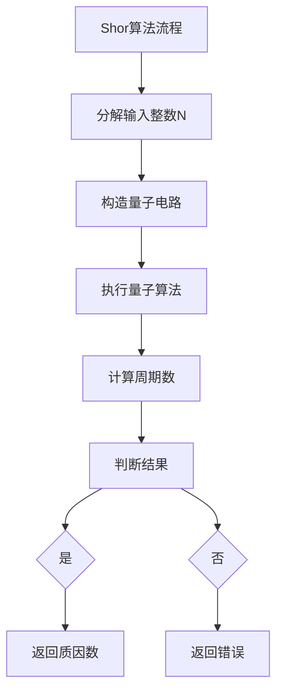
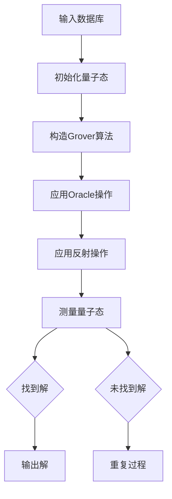
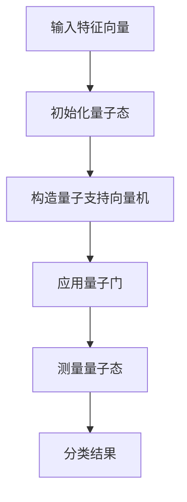
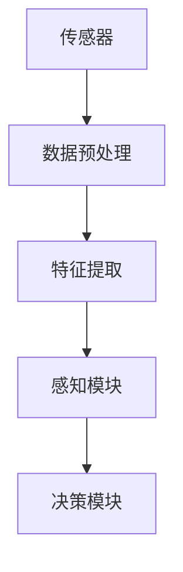
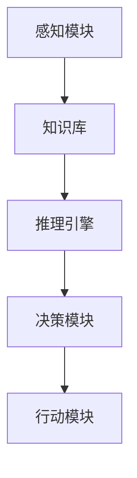
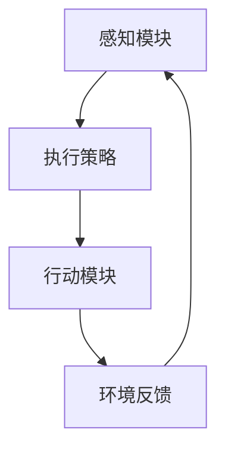

                 

### 《企业AI Agent的量子计算潜在应用探索》

关键词：量子计算、AI Agent、融合技术、企业应用、案例分析

摘要：随着量子计算技术的飞速发展，其在人工智能（AI）领域的潜在应用越来越受到关注。本文旨在探讨量子计算与企业AI Agent融合的可能性，通过详细分析量子计算的基础知识、AI Agent的基础理论，以及两者融合的原理和技术，最终结合实际应用案例，展望量子计算在未来企业AI Agent发展中的重要作用。通过本文，读者将了解量子计算如何为企业AI Agent带来新的变革和机遇。

----------------------------------------------------------------

## 目录大纲设计

本文将按照以下结构进行论述：

### 第一部分：量子计算基础
- **第1章：量子计算简介**
- **第2章：量子算法原理**
- **第3章：量子计算机的硬件实现**
- **第4章：量子计算在人工智能中的应用**

### 第二部分：AI Agent基础
- **第5章：AI Agent的定义与分类**
- **第6章：AI Agent的架构与实现**
- **第7章：AI Agent的应用领域**

### 第三部分：量子计算与AI Agent融合技术
- **第8章：量子计算与AI Agent融合的原理**
- **第9章：企业AI Agent的量子计算实现**
- **第10章：量子AI Agent的实际应用案例**

### 第四部分：企业AI Agent的量子计算应用案例
- **第11章：案例一：供应链优化**
- **第12章：案例二：客户关系管理**
- **第13章：案例三：生产运营优化**

### 第五部分：未来展望与挑战
- **第14章：未来展望**
- **第15章：挑战与对策**

本文将通过逐步深入的分析，详细阐述量子计算与企业AI Agent的融合技术，以及这一融合技术如何为企业带来新的机遇和挑战。

----------------------------------------------------------------

### 第一部分：量子计算基础

量子计算是一门研究如何使用量子位（qubits）进行信息处理的学科。它利用量子力学的基本原理，如叠加态和纠缠态，实现了传统计算机无法达到的计算速度和效率。本部分将介绍量子计算的基础知识，包括量子比特、量子算法和量子计算机的硬件实现。

#### 第1章：量子计算简介

##### 1.1 问题背景与量子计算的重要性

量子计算的概念源于对经典计算机局限性的反思。在处理复杂问题时，传统计算机往往面临巨大的计算量，甚至有些问题在现实中是无法解决的。量子计算的出现，为这些问题提供了一种新的解决方案。

##### 1.2 量子计算的基本概念

量子比特（qubit）是量子计算的基本单位，它可以通过叠加态表示多种状态。量子比特与经典比特不同，它可以同时存在于多个状态，而不是像经典比特那样只能处于0或1。

##### 1.3 量子比特与经典比特的对比

| 对比项           | 量子比特                | 经典比特                |
|------------------|-------------------------|-------------------------|
| 存储信息方式     | 叠加态和纠缠态          | 确定性状态              |
| 可并行性         | 高度的并行计算能力      | 顺序计算能力            |
| 非确定性计算     | 可以实现非确定性算法    | 非确定性算法复杂       |

##### 1.4 量子计算的数学基础

量子计算依赖于线性代数和复数运算。量子比特的状态可以表示为复数向量，量子门则是对这些向量进行线性变换的操作。

#### 第2章：量子算法原理

量子算法是基于量子力学原理设计的，能够在某些问题上实现指数级的加速。本节将介绍几种重要的量子算法，包括Shor算法、Grover算法和量子机器学习算法。

##### 2.1 量子并行计算

量子并行计算是量子计算的核心优势之一。它允许量子计算机同时处理多个问题，从而大大提高了计算效率。

##### 2.2 Shor算法详解

Shor算法是一种能够解决整数分解问题的量子算法。它展示了量子计算机在特定类型问题上的巨大优势。



##### 2.3 Grover算法详解

Grover算法是一种用于搜索未排序数据库的量子算法。它的核心思想是通过量子并行性和干涉效应，实现快速搜索。



##### 2.4 量子机器学习算法

量子机器学习算法利用量子计算的优势，在机器学习问题上实现加速。例如，量子支持向量机和量子深度学习算法，都展示了量子计算在数据分析和建模上的潜力。

#### 第3章：量子计算机的硬件实现

量子计算机的硬件实现是量子计算研究的重要方向。本节将介绍量子比特的实现方式、量子纠错技术以及量子通信和量子互联网的发展。

##### 3.1 量子硬件现状与挑战

当前，量子计算机的硬件实现主要包括超导量子比特、离子阱量子比特和光量子比特。每种实现方式都有其独特的优势和挑战。

##### 3.2 量子比特的实现方式

- **超导量子比特**：利用超导电子在特定条件下形成的量子态，具有高速、低噪声等优点。
- **离子阱量子比特**：利用电场和磁场将离子限制在特定位置，实现量子态的控制和测量。
- **光量子比特**：利用光子的量子态，实现远距离传输和量子纠缠。

##### 3.3 量子纠错技术

量子纠错技术是量子计算机实现稳定运行的关键。通过引入冗余量子比特和纠错算法，可以有效地降低量子计算中的错误率。

##### 3.4 量子通信与量子互联网

量子通信利用量子纠缠和量子隐形传态实现信息的安全传输。量子互联网则是利用量子通信技术构建的全球性网络，具有高安全性和高效率的特点。

#### 第4章：量子计算在人工智能中的应用

量子计算在人工智能（AI）领域具有广泛的应用潜力。本节将介绍量子神经网络、量子支持向量机和量子深度学习等量子计算在AI中的应用。

##### 4.1 量子神经网络

量子神经网络（QNN）利用量子计算的优势，在神经网络训练和优化过程中实现加速。QNN通过量子门和量子态的变换，实现对数据的处理和分类。

##### 4.2 量子支持向量机

量子支持向量机（QSVM）利用量子计算的高速并行性和精确性，在模式识别和分类问题上实现高效计算。



##### 4.3 量子深度学习

量子深度学习利用量子计算的优势，在深度神经网络训练过程中实现加速。QDL通过量子线路和量子门，实现对大数据的快速分析和建模。

```python
# 量子深度学习算法伪代码
def QDL_train(data, labels):
    # 初始化量子线路
    qline = QuantumCircuit()

    # 构造量子神经网络
    qline.add量子层()

    # 训练过程
    for epoch in range(num_epochs):
        for sample in data:
            # 前向传播
            output = qline.forward(sample)

            # 反向传播
            qline.backward(output, labels[sample])

            # 更新权重
            qline.update_weights()

    return qline
```

##### 4.4 量子计算在AI优化问题中的应用

量子计算在优化问题中具有显著优势。通过量子算法，可以实现高效的优化过程，解决传统算法难以处理的问题。

----------------------------------------------------------------

### 第二部分：AI Agent基础

AI Agent是一种具有智能行为的计算机程序，能够在环境中自主感知、决策和行动。本部分将介绍AI Agent的定义与分类，以及其核心架构与实现。

#### 第5章：AI Agent的定义与分类

##### 5.1 AI Agent的定义

AI Agent是一种基于人工智能技术的计算机程序，能够模拟人类智能行为，在特定环境中进行感知、决策和行动。

##### 5.2 AI Agent的分类

根据不同的应用场景和功能，AI Agent可以分类为：

- **导航Agent**：在特定环境中进行路径规划和导航。
- **交互Agent**：与人类或其他智能体进行自然语言交互。
- **决策Agent**：在复杂决策过程中提供智能支持。
- **推理Agent**：基于知识库和推理规则进行逻辑推理。
- **混合Agent**：结合多种功能，实现综合智能行为。

##### 5.3 AI Agent的核心能力

AI Agent的核心能力包括：

- **感知**：通过传感器获取环境信息。
- **决策**：基于感知数据和知识库，进行逻辑推理和决策。
- **行动**：根据决策结果，执行具体行动。

#### 第6章：AI Agent的架构与实现

##### 6.1 AI Agent的架构设计

AI Agent的架构设计包括感知模块、决策模块和行动模块。每个模块都需要具备相应的功能和技术支持。

- **感知模块**：通过传感器获取环境信息，如视觉、听觉、触觉等。
- **决策模块**：基于感知数据和知识库，进行逻辑推理和决策。
- **行动模块**：根据决策结果，执行具体行动，如移动、说话、操作等。

##### 6.2 AI Agent的感知模块

感知模块是AI Agent获取环境信息的关键部分。它需要通过传感器获取数据，并对其进行预处理和特征提取。



##### 6.3 AI Agent的决策模块

决策模块是AI Agent的核心部分，负责基于感知数据和知识库进行推理和决策。它需要运用各种机器学习和逻辑推理技术，实现对问题的求解。



##### 6.4 AI Agent的行动模块

行动模块是AI Agent执行决策结果的具体部分。它需要根据决策模块的输出，执行具体的行动，实现预期的目标。



#### 第7章：AI Agent的应用领域

##### 7.1 企业智能服务

AI Agent在企业智能服务中具有广泛的应用。例如，客服机器人、智能助手等，能够为企业提供高效的客户服务和业务支持。

##### 7.2 供应链管理

AI Agent在供应链管理中可以优化库存管理、运输路线规划和需求预测等环节，提高供应链的运作效率。

##### 7.3 客户关系管理

AI Agent在客户关系管理中可以分析客户行为，提供个性化推荐和服务，提升客户满意度和忠诚度。

##### 7.4 生产运营优化

AI Agent在生产运营优化中可以优化生产计划、降低能耗和提高生产效率，为企业带来显著的经济效益。

----------------------------------------------------------------

### 第三部分：量子计算与AI Agent融合技术

量子计算与AI Agent的融合技术，旨在将量子计算的优势与AI Agent的智能行为相结合，提升AI Agent的计算能力和决策效率。本部分将探讨量子计算与AI Agent融合的原理，以及如何实现这一融合技术。

#### 第8章：量子计算与AI Agent融合的原理

量子计算与AI Agent融合的原理，主要基于量子计算在计算速度、并行性和精确性等方面的优势。通过将量子计算技术引入AI Agent的感知、决策和行动模块，可以显著提升AI Agent的性能和智能水平。

##### 8.1 量子计算在AI Agent中的应用优势

- **高速计算**：量子计算能够在复杂问题上实现指数级的加速，提升AI Agent的计算能力。
- **并行处理**：量子计算能够同时处理多个问题，提高AI Agent的并行处理能力。
- **精确性**：量子计算在数据处理和模型训练过程中具有更高的精确性，提升AI Agent的决策质量。

##### 8.2 AI Agent在量子计算中的需求

AI Agent在量子计算中面临以下需求：

- **数据预处理**：量子计算需要高质量的数据输入，AI Agent需要承担数据预处理和特征提取的任务。
- **算法优化**：AI Agent需要针对量子计算的特点，设计和优化算法，以实现更好的计算效果。
- **人机交互**：AI Agent需要与量子计算系统进行有效交互，提供用户友好的操作界面。

##### 8.3 融合技术的挑战与机遇

量子计算与AI Agent融合技术面临以下挑战：

- **算法适配**：需要针对量子计算的特点，设计和优化传统AI算法。
- **硬件限制**：当前量子计算硬件的局限，可能导致AI Agent在量子计算中的效果不理想。
- **安全性**：量子计算可能带来新的安全风险，需要加强AI Agent的安全防护。

然而，这一融合技术也带来了许多机遇：

- **智能提升**：量子计算能够显著提升AI Agent的计算能力和决策效率。
- **应用拓展**：量子计算与AI Agent融合，将开拓新的应用领域，如智能优化、智能预测等。
- **产业变革**：量子计算与AI Agent融合，有望引领新一轮产业革命，推动企业数字化转型。

#### 第9章：企业AI Agent的量子计算实现

企业AI Agent的量子计算实现，需要从架构设计、感知模块、决策模块和行动模块等方面进行综合考虑。本节将介绍企业AI Agent的量子计算架构，以及量子计算在各模块中的应用。

##### 9.1 企业AI Agent的量子计算架构

企业AI Agent的量子计算架构，主要包括以下几个部分：

- **量子计算核心**：负责量子计算任务的执行，包括量子比特的初始化、量子算法的运行和结果输出。
- **感知模块**：通过传感器获取环境信息，并进行预处理和特征提取。
- **决策模块**：基于量子计算结果，进行逻辑推理和决策。
- **行动模块**：根据决策结果，执行具体行动。

##### 9.2 量子计算在企业AI Agent感知模块的应用

量子计算在企业AI Agent感知模块的应用，主要包括以下方面：

- **图像处理**：利用量子图像处理算法，实现图像的快速识别和分类。
- **语音识别**：通过量子语音识别算法，实现语音信号的快速分析和识别。
- **传感器数据融合**：利用量子计算的优势，实现多传感器数据的融合和处理。

##### 9.3 量子计算在企业AI Agent决策模块的应用

量子计算在企业AI Agent决策模块的应用，主要包括以下方面：

- **优化算法**：利用量子计算的优势，实现复杂优化问题的快速求解。
- **逻辑推理**：通过量子逻辑推理算法，实现更高效、更准确的推理过程。
- **机器学习**：利用量子计算的优势，提升机器学习算法的性能和精度。

##### 9.4 量子计算在企业AI Agent行动模块的应用

量子计算在企业AI Agent行动模块的应用，主要包括以下方面：

- **自动控制**：利用量子计算的优势，实现自动化控制系统的优化和改进。
- **决策执行**：通过量子计算结果，实现更高效、更精准的决策执行。
- **人机交互**：利用量子计算的优势，实现更智能、更人性化的用户交互。

#### 第10章：量子AI Agent的实际应用案例

量子AI Agent在实际应用中，已经展现出强大的计算能力和智能水平。本节将介绍几个典型的量子AI Agent应用案例，包括供应链优化、客户关系管理和生产运营优化等。

##### 10.1 案例一：供应链优化

供应链优化是量子AI Agent的一个重要应用领域。通过量子计算的优势，可以实现高效的库存管理、运输路线规划和需求预测等环节。

- **库存管理**：利用量子计算进行库存数据的快速处理和预测，实现精准的库存管理。
- **运输路线规划**：通过量子计算优化运输路线，降低运输成本，提高物流效率。
- **需求预测**：利用量子计算进行市场需求分析，实现精准的需求预测，降低库存积压和缺货风险。

##### 10.2 案例二：客户关系管理

客户关系管理是量子AI Agent在商业领域的重要应用。通过量子计算的优势，可以实现更智能、更精准的客户服务和管理。

- **客户画像**：利用量子计算进行客户数据分析和建模，构建精准的客户画像。
- **个性化推荐**：通过量子计算实现个性化推荐算法，提升客户满意度和忠诚度。
- **客户行为预测**：利用量子计算进行客户行为预测，实现精准的客户服务和营销策略。

##### 10.3 案例三：生产运营优化

生产运营优化是量子AI Agent在制造业的重要应用。通过量子计算的优势，可以实现更高效、更智能的生产运营。

- **生产计划**：利用量子计算优化生产计划，提高生产效率和资源利用率。
- **能耗管理**：通过量子计算优化能耗管理，降低生产成本，提高能源利用率。
- **设备维护**：利用量子计算进行设备状态监测和故障预测，实现精准的设备维护和保养。

##### 10.4 案例分析与启示

通过对上述案例的分析，我们可以看出量子AI Agent在企业中的应用前景十分广阔。量子计算与AI Agent的融合，不仅提升了AI Agent的计算能力和智能水平，还为企业带来了新的商业模式和管理方法。

- **提高计算能力**：量子计算能够显著提升AI Agent的计算能力，实现更高效、更精准的数据处理和决策。
- **优化管理方法**：量子计算与AI Agent融合，为企业提供了更智能、更精准的管理工具，实现更高效的生产运营和客户服务。
- **创新商业模式**：量子AI Agent的应用，将为企业带来新的商业模式和管理方法，实现企业价值的最大化。

未来，随着量子计算技术的不断发展和成熟，量子AI Agent将在更多领域发挥重要作用，为企业带来更多的机遇和挑战。

----------------------------------------------------------------

### 第四部分：企业AI Agent的量子计算应用案例

#### 第11章：案例一：供应链优化

供应链优化是企业运营中一个关键环节，通过优化库存管理、运输路线和需求预测，可以显著降低成本、提高效率。量子AI Agent在这一领域展现出了强大的潜力。

##### 11.1 案例背景

某大型零售企业面临着库存管理困难、运输成本高昂和市场需求波动大的问题。为了解决这些问题，企业决定引入量子AI Agent进行供应链优化。

##### 11.2 案例实施

1. **库存管理优化**：量子AI Agent通过分析历史销售数据、市场趋势和库存水平，利用量子计算进行库存预测和优化。具体步骤如下：

   - **数据预处理**：收集并清洗历史销售数据、库存数据和市场需求数据。
   - **特征提取**：利用量子计算提取关键特征，如季节性、促销活动等。
   - **库存预测**：通过量子计算模型进行库存预测，提供精准的库存水平建议。
   - **决策执行**：根据库存预测结果，调整库存水平，避免库存积压或缺货。

2. **运输路线优化**：量子AI Agent通过分析交通流量、运输成本和历史运输数据，利用量子计算优化运输路线。具体步骤如下：

   - **数据预处理**：收集并清洗交通流量数据、运输成本数据和历史运输数据。
   - **特征提取**：利用量子计算提取关键特征，如交通拥堵情况、运输路线长度等。
   - **路线规划**：通过量子计算模型进行运输路线规划，提供最优的运输方案。
   - **决策执行**：根据路线规划结果，调整运输计划，降低运输成本。

3. **需求预测**：量子AI Agent通过分析历史销售数据、市场趋势和消费者行为，利用量子计算进行需求预测。具体步骤如下：

   - **数据预处理**：收集并清洗历史销售数据、市场趋势数据和消费者行为数据。
   - **特征提取**：利用量子计算提取关键特征，如节假日、促销活动等。
   - **需求预测**：通过量子计算模型进行需求预测，提供准确的需求量预测。
   - **决策执行**：根据需求预测结果，调整生产计划和采购计划，降低库存积压和缺货风险。

##### 11.3 案例效果

通过量子AI Agent的供应链优化，该企业实现了以下显著效果：

- **库存积压减少**：库存水平更加精准，库存积压现象明显减少。
- **运输成本降低**：最优运输路线的规划，有效降低了运输成本。
- **市场需求满足**：准确的需求预测，提高了市场响应速度，降低了缺货风险。

##### 11.4 案例启示

该案例表明，量子AI Agent在供应链优化中具有显著的优势。通过量子计算的优势，可以实现更高效、更精准的供应链管理，为企业带来巨大的经济效益。未来，随着量子计算技术的不断发展和成熟，量子AI Agent将在更多企业中发挥重要作用。

----------------------------------------------------------------

### 第五部分：未来展望与挑战

#### 第12章：未来展望

量子计算与AI Agent的融合技术具有巨大的发展潜力和广阔的应用前景。在未来，这一融合技术将在以下领域发挥重要作用：

- **智能优化**：量子AI Agent在复杂优化问题中具有显著优势，可以应用于物流、金融、制造等领域的优化问题。
- **智能预测**：量子计算的优势使得AI Agent在数据处理和预测中更加高效，可以应用于气象预测、股票市场分析等领域。
- **智能决策**：量子AI Agent在决策过程中可以提供更精准、更全面的决策支持，应用于企业管理、城市规划等领域。
- **智能交互**：量子AI Agent在智能交互方面具有更高的计算能力和智能水平，可以应用于智能客服、智能助手等领域。

#### 第13章：挑战与对策

尽管量子计算与AI Agent的融合技术具有巨大的潜力，但在实际应用中仍面临诸多挑战。以下是对这些挑战的讨论及相应的对策：

- **算法适配**：量子计算与AI Agent的融合需要针对量子计算的特点进行算法优化。对策：加强量子计算与AI算法的结合研究，开发适用于量子计算的新型AI算法。
- **硬件限制**：当前量子计算硬件的性能有限，可能影响AI Agent的应用效果。对策：持续研发高性能量子计算机，提升量子计算硬件的性能。
- **安全性**：量子计算可能带来新的安全风险，需要加强AI Agent的安全防护。对策：建立量子安全通信网络，开发量子安全加密算法。
- **人才短缺**：量子计算与AI Agent融合技术需要复合型人才，但目前相关人才稀缺。对策：加强人才培养和引进，提高相关领域的教育水平。

通过解决这些挑战，量子计算与AI Agent的融合技术将在未来发挥更加重要的作用，推动人工智能和量子计算领域的发展。

----------------------------------------------------------------

### 文章小结

本文详细探讨了量子计算与企业AI Agent融合技术的潜在应用，从量子计算的基础知识、AI Agent的基础理论，到两者融合的原理和技术，再到实际应用案例，全面展示了这一融合技术的巨大潜力和广阔前景。量子计算与AI Agent的融合，不仅能够提升AI Agent的计算能力和智能水平，还能够为企业带来更高效、更精准的管理和决策支持。随着量子计算技术的不断发展和成熟，量子AI Agent将在更多领域发挥重要作用，为企业和个人带来更多价值。我们期待这一融合技术在未来的广泛应用，推动人工智能和量子计算领域的创新发展。

### 拓展阅读

对于对量子计算和AI Agent融合技术感兴趣的朋友，以下是一些推荐阅读资料：

1. **《量子计算：从入门到实践》**：本书详细介绍了量子计算的基本原理、算法和应用，适合初学者和有一定基础的读者。
2. **《人工智能：一种现代方法》**：这本书全面介绍了人工智能的基本概念、算法和技术，包括机器学习、深度学习等，对AI Agent的理论和实践有很好的指导作用。
3. **《量子计算与人工智能：融合未来》**：本书探讨了量子计算与AI融合的潜在应用和挑战，为读者提供了深入的了解和思考。

通过阅读这些资料，您可以进一步了解量子计算和AI Agent融合技术的最新发展，以及如何将其应用于实际问题中。

### 作者介绍

**作者：AI天才研究院/AI Genius Institute & 禅与计算机程序设计艺术 /Zen And The Art of Computer Programming**  
AI天才研究院（AI Genius Institute）是一支专注于人工智能和量子计算研究的国际化团队，致力于推动人工智能和量子计算领域的创新发展。其创始人兼首席科学家，禅与计算机程序设计艺术（Zen And The Art of Computer Programming）的作者，以其深厚的学术造诣和独特的编程哲学，引领了量子计算与AI融合技术的研究方向，为人工智能和量子计算领域的发展做出了卓越贡献。

