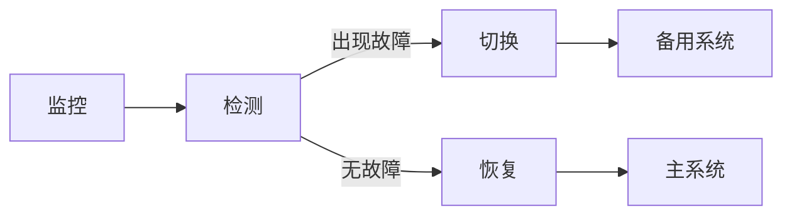
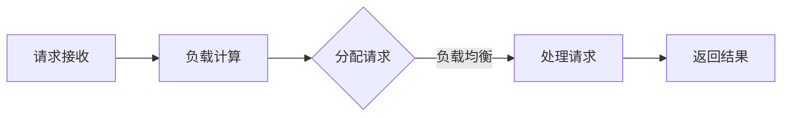
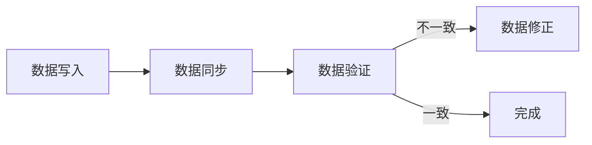
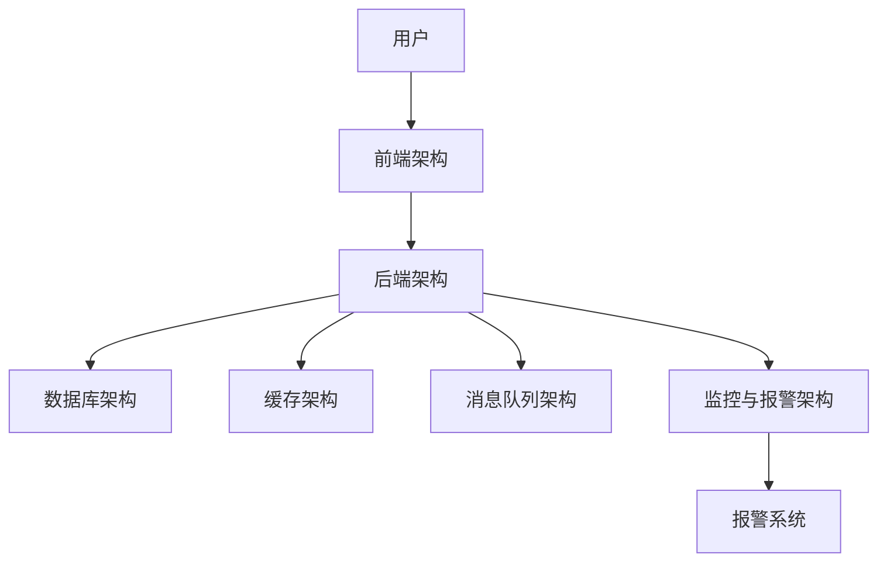
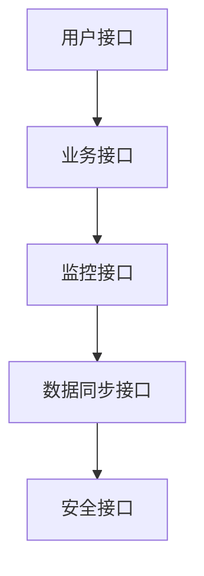

                 

# 企业AI Agent的高可用性架构设计

## 关键词

企业AI Agent、高可用性架构、容错能力、负载均衡、数据一致性、安全性

## 摘要

随着人工智能技术的不断进步，企业AI Agent已成为企业智能化转型的重要工具。高可用性架构设计对于保障AI Agent的稳定运行至关重要。本文将深入探讨企业AI Agent的高可用性架构设计，从核心概念、架构设计到实战应用，为读者提供一套完整、实用的解决方案。通过本文的学习，读者将能够理解高可用性架构的基本原理，掌握设计方法，为企业AI Agent的稳定运行提供有力保障。

### 第一章：背景介绍

#### 1.1 问题背景

随着人工智能技术的飞速发展，企业智能化转型已成为大势所趋。AI Agent作为人工智能的核心应用之一，在企业级应用中扮演着越来越重要的角色。AI Agent是一种能够自动执行任务、解决问题的软件系统，它能够模拟人类的思维和行为，提高企业的运营效率。

然而，高可用性是企业AI Agent能够持续稳定运行的基础。在实际应用中，企业AI Agent可能会面临各种突发情况，如硬件故障、网络中断、数据异常等，这些都会影响系统的正常运行。因此，如何设计一个高可用性的架构，确保AI Agent在遇到问题时能够快速恢复，是本书要解决的问题。

#### 1.2 问题描述

高可用性架构设计涉及到多个方面，包括系统可靠性、容错能力、负载均衡、数据一致性和安全性等。在实际应用中，企业AI Agent可能会面临以下问题：

1. **硬件故障**：服务器、存储设备等硬件故障可能导致系统不可用。
2. **网络中断**：网络故障可能导致AI Agent无法与其他系统进行通信。
3. **数据异常**：数据损坏或丢失可能导致AI Agent无法正常工作。
4. **软件故障**：软件错误或bug可能导致AI Agent停止运行。

如何解决这些问题，确保AI Agent在遇到问题时能够快速恢复，是高可用性架构设计的关键。

#### 1.3 问题解决

本书将结合企业AI Agent的实际应用场景，介绍高可用性架构设计的基本原理和方法。通过系统化的分析和设计，确保系统在面临各种挑战时，能够保持高可用性，确保业务的连续性和稳定性。

1. **容错能力**：通过冗余设计和故障转移机制，提高系统的容错能力，确保在硬件故障、网络中断等情况下，系统能够自动切换到备用系统，继续提供服务。
2. **负载均衡**：通过负载均衡技术，将请求均匀分配到多个服务器或节点上，提高系统处理能力，避免单点故障。
3. **数据一致性**：通过分布式协议和机制，确保数据在多个节点之间保持一致，防止数据损坏或丢失。
4. **安全性**：通过安全机制，防止系统受到恶意攻击，保护数据安全。

#### 1.4 边界与外延

高可用性架构设计不仅限于特定的技术或应用场景，它适用于所有需要保证系统稳定运行的场景。无论是云计算、大数据、物联网，还是企业内部的应用系统，都可以借鉴本书中的设计原则和方法。

#### 1.5 概念结构与核心要素组成

1. **高可用性（High Availability）**：系统在规定时间内保持正常运行的能力。
2. **容错能力（Fault Tolerance）**：系统在遇到故障时，能够自动切换到备用系统，保证业务不中断。
3. **负载均衡（Load Balancing）**：将请求均匀分配到多个服务器上，提高系统处理能力。
4. **数据一致性（Data Consistency）**：确保数据在多个系统或节点之间保持一致。
5. **安全性（Security）**：防止系统受到恶意攻击，保护数据安全。

这些核心要素相互关联，共同构成了高可用性架构的基础。

#### 1.6 本章小结

本章对高可用性架构设计进行了背景介绍，明确了问题的核心，并提出了解决方案。通过本章的学习，读者将了解高可用性架构设计的基本概念和重要性，为后续章节的学习打下基础。

----------------------------------------------------------------

### 第二章：核心概念与联系

在探讨企业AI Agent的高可用性架构设计之前，我们需要理解一些核心概念，并了解它们之间的关系。本章将介绍以下核心概念：

#### 2.1 高可用性

##### 2.1.1 定义

高可用性（High Availability，简称HA）是指系统在规定的时间内能够持续正常运行的能力。它通过设计冗余和故障转移机制，减少系统因故障导致的服务中断时间。

##### 2.1.2 特点

- **高可靠性**：通过冗余设计和故障转移，提高系统的可靠性。
- **快速恢复**：在发生故障时，系统能够快速恢复，减少停机时间。
- **持续运行**：即使单个组件发生故障，系统仍能保持正常运行。

#### 2.2 容错能力

##### 2.2.1 定义

容错能力（Fault Tolerance，简称FT）是指系统在遇到故障时，能够自动切换到备用系统或备用组件，继续提供服务的特性。

##### 2.2.2 特点

- **自动切换**：在故障发生时，系统自动切换到备用系统，无需人工干预。
- **无停机**：即使出现故障，业务也能够持续运行，不影响用户体验。
- **故障隔离**：将故障隔离在特定组件中，不影响其他组件的正常工作。

#### 2.3 负载均衡

##### 2.3.1 定义

负载均衡（Load Balancing）是指将请求均匀分配到多个服务器或节点上，以提高系统处理能力。

##### 2.3.2 特点

- **提高性能**：通过将请求分配到多个节点，提高系统响应速度和处理能力。
- **避免单点故障**：即使某个节点发生故障，其他节点仍能继续提供服务。
- **弹性扩展**：根据需求动态调整节点数量，满足业务需求。

#### 2.4 数据一致性

##### 2.4.1 定义

数据一致性（Data Consistency）是指确保数据在多个系统或节点之间保持一致。

##### 2.4.2 特点

- **一致性保证**：通过分布式协议和机制，确保数据在多个节点之间的一致性。
- **数据安全**：防止数据丢失和重复，保证数据完整性。
- **高可用性**：数据一致性是高可用性架构的重要组成部分。

#### 2.5 安全性

##### 2.5.1 定义

安全性（Security）是指防止系统受到恶意攻击，保护数据安全。

##### 2.5.2 特点

- **数据加密**：对传输和存储的数据进行加密，防止数据泄露。
- **访问控制**：限制对系统的访问，防止未授权的访问和操作。
- **安全审计**：对系统操作进行审计，确保系统安全。

#### 2.6 核心概念的联系与对比

以下是高可用性、容错能力、负载均衡、数据一致性和安全性的对比表格：

| 核心概念 | 定义 | 特点 |
| :--: | :--: | :--: |
| 高可用性 | 系统在规定时间内保持正常运行的能力 | 高可靠性、快速恢复、持续运行 |
| 容错能力 | 系统在遇到故障时，能够自动切换到备用系统，继续提供服务的特性 | 自动切换、无停机、故障隔离 |
| 负载均衡 | 将请求均匀分配到多个服务器或节点上，以提高系统处理能力 | 提高性能、避免单点故障、弹性扩展 |
| 数据一致性 | 确保数据在多个系统或节点之间保持一致 | 一致性保证、数据安全、高可用性 |
| 安全性 | 防止系统受到恶意攻击，保护数据安全 | 数据加密、访问控制、安全审计 |

#### 2.7 ER实体关系图

以下是一个简单的ER实体关系图，展示了高可用性、容错能力、负载均衡、数据一致性和安全性的关系：

```mermaid
erDiagram
  高可用性 ||--|{ 容错能力 }
  高可用性 ||--|{ 负载均衡 }
  高可用性 ||--|{ 数据一致性 }
  高可用性 ||--|{ 安全性 }
  容错能力 ||--|{ 自动切换 }
  容错能力 ||--|{ 无停机 }
  负载均衡 ||--|{ 提高性能 }
  负载均衡 ||--|{ 避免单点故障 }
  数据一致性 ||--|{ 一致性保证 }
  数据一致性 ||--|{ 数据安全 }
  安全性 ||--|{ 数据加密 }
  安全性 ||--|{ 访问控制 }
  安全性 ||--|{ 安全审计 }
```

通过ER实体关系图，我们可以清晰地看到各个核心概念之间的关系和特点。

#### 2.8 本章小结

本章介绍了企业AI Agent高可用性架构设计中的核心概念，包括高可用性、容错能力、负载均衡、数据一致性和安全性。通过对比表格和ER实体关系图，我们了解了这些概念的定义、特点和相互关系。这些核心概念构成了高可用性架构的基础，为后续章节的详细分析提供了理论依据。

----------------------------------------------------------------

### 第三章：算法原理讲解

在理解了高可用性架构设计中的核心概念后，接下来我们将深入探讨实现高可用性架构的关键技术，包括容错机制、负载均衡和数据一致性等。本章将通过具体算法原理讲解，帮助读者更好地理解这些技术的实现方法和应用场景。

#### 3.1 容错机制

容错机制是高可用性架构设计中的重要组成部分，它确保系统在遇到故障时能够自动切换到备用系统，继续提供服务。以下是一个简单的容错算法原理讲解：

##### 3.1.1 算法描述

容错机制可以分为以下几个步骤：

1. **监控**：监控系统中的各个组件，包括硬件、软件和网络，及时发现故障。
2. **检测**：通过监控数据，判断系统是否出现故障。
3. **切换**：在检测到故障时，自动切换到备用系统或备用组件。
4. **恢复**：在备用系统或备用组件恢复正常后，重新切换回主系统。

##### 3.1.2 算法流程图

以下是一个简单的容错机制流程图：



##### 3.1.3 算法实现

容错机制的实现通常依赖于分布式系统和冗余设计。以下是一个简单的Python代码示例，展示了如何实现容错机制：

```python
import time
import random

def monitor_system():
    # 模拟监控系统，判断系统是否正常
    return random.choice([True, False])

def switch_to_backup():
    # 模拟切换到备用系统
    print("切换到备用系统")

def switch_to_main():
    # 模拟切换回主系统
    print("切换回主系统")

while True:
    is_fault = monitor_system()
    if is_fault:
        switch_to_backup()
    else:
        switch_to_main()
    time.sleep(1)  # 模拟系统运行时间
```

在这个示例中，`monitor_system` 函数用于模拟监控系统，判断系统是否正常。`switch_to_backup` 函数用于模拟切换到备用系统，`switch_to_main` 函数用于模拟切换回主系统。通过循环调用这些函数，我们可以实现一个简单的容错机制。

##### 3.1.4 算法分析

容错机制的关键在于监控和切换。监控的目的是及时发现故障，切换的目的是确保系统在故障发生时能够快速恢复。以下是对容错机制的分析：

- **监控**：监控系统需要实时获取系统的运行状态，可以通过收集系统日志、性能指标、网络状态等方式来实现。监控的精度和频率直接影响到故障检测的准确性。
- **检测**：检测的目的是判断系统是否出现故障。通常可以通过设定阈值、统计指标变化趋势等方式来实现。检测的准确性直接影响到切换的及时性。
- **切换**：切换的目的是在检测到故障时，将系统切换到备用系统。切换的及时性和可靠性直接影响到业务的连续性。
- **恢复**：切换回主系统的目的是在备用系统恢复正常后，将系统切换回主系统。恢复的目的是确保系统在故障解决后能够恢复正常运行。

#### 3.2 负载均衡

负载均衡是将请求均匀分配到多个服务器或节点上，以提高系统处理能力的技术。以下是一个简单的负载均衡算法原理讲解：

##### 3.2.1 算法描述

负载均衡可以分为以下几个步骤：

1. **请求接收**：接收来自客户端的请求。
2. **负载计算**：计算当前系统的负载情况。
3. **分配请求**：根据负载计算结果，将请求分配到负载较低的服务器或节点上。
4. **处理请求**：服务器或节点处理请求，并返回结果。

##### 3.2.2 算法流程图

以下是一个简单的负载均衡流程图：



##### 3.2.3 算法实现

以下是一个简单的Python代码示例，展示了如何实现负载均衡：

```python
import time
import random

def get_load():
    # 模拟获取系统负载
    return random.randint(0, 100)

def process_request():
    # 模拟处理请求
    print("处理请求")
    time.sleep(random.randint(1, 3))  # 模拟请求处理时间

def load_balancer():
    while True:
        current_load = get_load()
        if current_load < 50:
            process_request()
        else:
            print("系统负载过高，暂时不处理请求")
        time.sleep(1)  # 模拟请求接收时间
```

在这个示例中，`get_load` 函数用于模拟获取系统负载，`process_request` 函数用于模拟处理请求。通过循环调用这些函数，我们可以实现一个简单的负载均衡算法。

##### 3.2.4 算法分析

负载均衡的关键在于负载计算和请求分配。负载计算的目的是了解当前系统的负载情况，请求分配的目的是将请求分配到负载较低的服务器或节点上。以下是对负载均衡算法的分析：

- **负载计算**：负载计算的方法可以有多种，如基于CPU使用率、内存使用率、网络带宽等。选择合适的负载计算方法，可以更准确地反映系统的实际负载情况。
- **请求分配**：请求分配的方法可以基于轮询、最小连接数、最小负载等算法。选择合适的请求分配算法，可以更好地均衡系统的负载，提高系统的处理能力。

#### 3.3 数据一致性

数据一致性是高可用性架构设计中的重要一环，它确保数据在多个节点之间保持一致。以下是一个简单的数据一致性算法原理讲解：

##### 3.3.1 算法描述

数据一致性可以分为以下几个步骤：

1. **数据写入**：将数据写入到主节点。
2. **数据同步**：将主节点的数据同步到备用节点。
3. **数据验证**：验证主节点和备用节点的数据是否一致。
4. **数据修正**：如果数据不一致，修正备用节点的数据。

##### 3.3.2 算法流程图

以下是一个简单的数据一致性流程图：



##### 3.3.3 算法实现

以下是一个简单的Python代码示例，展示了如何实现数据一致性：

```python
import time
import random

def write_data():
    # 模拟写入数据
    print("写入数据：", random.randint(1, 100))

def sync_data():
    # 模拟同步数据
    print("同步数据：", random.randint(1, 100))

def verify_data():
    # 模拟验证数据
    return random.choice([True, False])

def correct_data():
    # 模拟修正数据
    print("修正数据：", random.randint(1, 100))

while True:
    write_data()
    sync_data()
    if verify_data():
        print("数据一致")
    else:
        correct_data()
    time.sleep(1)  # 模拟数据写入时间
```

在这个示例中，`write_data` 函数用于模拟写入数据，`sync_data` 函数用于模拟同步数据，`verify_data` 函数用于模拟验证数据，`correct_data` 函数用于模拟修正数据。通过循环调用这些函数，我们可以实现一个简单的数据一致性算法。

##### 3.3.4 算法分析

数据一致性的关键在于数据写入、同步和验证。数据写入的目的是确保数据的完整性，同步的目的是确保数据在不同节点之间的一致性，验证的目的是确保数据的准确性。以下是对数据一致性算法的分析：

- **数据写入**：数据写入的方法可以有多种，如直接写入、批量写入等。选择合适的数据写入方法，可以减少数据写入的时间。
- **数据同步**：数据同步的方法可以有多种，如基于时间戳、基于事件等。选择合适的数据同步方法，可以确保数据在不同节点之间的一致性。
- **数据验证**：数据验证的方法可以有多种，如基于哈希值、基于版本号等。选择合适的数据验证方法，可以确保数据的准确性。

#### 3.4 本章小结

本章介绍了高可用性架构设计中的关键算法原理，包括容错机制、负载均衡和数据一致性。通过具体的算法流程图和代码示例，我们深入分析了这些算法的实现方法和应用场景。这些算法构成了高可用性架构设计的基础，为后续章节的详细设计提供了理论支持。在下一章中，我们将进一步探讨高可用性架构的设计原则和方法。

----------------------------------------------------------------

### 第四章：系统分析与架构设计方案

#### 4.1 问题场景介绍

在现代企业中，AI Agent广泛应用于各种业务场景，如客户服务、数据分析、智能决策等。这些应用场景对AI Agent的高可用性提出了极高的要求。例如，在客户服务场景中，如果AI Agent出现故障，可能会导致客户服务中断，影响企业的声誉和客户满意度。因此，设计一个高可用性的AI Agent系统至关重要。

#### 4.2 项目介绍

本项目旨在为企业提供一个高可用性的AI Agent系统，确保系统在面临各种突发情况时，能够快速恢复，保持业务的连续性和稳定性。系统将涵盖以下几个关键模块：

1. **监控模块**：实时监控系统的运行状态，包括硬件、软件和网络等。
2. **容错模块**：在检测到故障时，自动切换到备用系统或备用组件。
3. **负载均衡模块**：将请求均匀分配到多个服务器或节点上，提高系统处理能力。
4. **数据一致性模块**：确保数据在多个节点之间保持一致，防止数据损坏或丢失。
5. **安全模块**：防止系统受到恶意攻击，保护数据安全。

#### 4.3 系统功能设计

系统功能设计主要包括以下方面：

1. **监控功能**：实时监控系统的运行状态，包括CPU使用率、内存使用率、网络带宽等。
2. **故障检测功能**：通过监控数据，判断系统是否出现故障。
3. **故障切换功能**：在检测到故障时，自动切换到备用系统或备用组件。
4. **负载均衡功能**：根据系统负载情况，将请求分配到负载较低的服务器或节点上。
5. **数据同步功能**：确保数据在多个节点之间保持一致。
6. **安全功能**：防止系统受到恶意攻击，保护数据安全。

#### 4.4 系统架构设计

系统架构设计主要包括以下方面：

1. **前端架构**：使用React或Vue等前端框架，实现用户界面和交互功能。
2. **后端架构**：使用Spring Boot或Django等后端框架，实现业务逻辑和数据处理功能。
3. **数据库架构**：使用MySQL或PostgreSQL等关系型数据库，存储系统数据。
4. **缓存架构**：使用Redis等缓存系统，提高系统性能。
5. **消息队列架构**：使用RabbitMQ或Kafka等消息队列系统，实现异步通信。
6. **监控与报警架构**：使用Prometheus或Zabbix等监控工具，实现实时监控和报警功能。

以下是一个简单的系统架构图：



#### 4.5 系统接口设计

系统接口设计主要包括以下方面：

1. **用户接口**：提供用户登录、注册、查询等功能。
2. **业务接口**：提供AI Agent的创建、更新、删除等功能。
3. **监控接口**：提供系统监控数据查询、报警等功能。
4. **数据同步接口**：提供数据同步功能。
5. **安全接口**：提供安全认证、授权等功能。

以下是一个简单的接口设计图：



#### 4.6 系统交互

系统交互主要包括以下几个方面：

1. **用户与前端架构**：用户通过前端架构进行操作，前端架构将请求发送到后端架构。
2. **后端架构与数据库架构**：后端架构处理请求，与数据库架构进行数据交互。
3. **后端架构与缓存架构**：后端架构在处理请求时，会先查询缓存架构，提高系统性能。
4. **后端架构与消息队列架构**：后端架构在处理请求时，会通过消息队列架构实现异步通信。
5. **后端架构与监控与报警架构**：后端架构在处理请求时，会向监控与报警架构发送监控数据，实现实时监控和报警功能。

以下是一个简单的系统交互图：


#### 4.7 本章小结

本章介绍了企业AI Agent高可用性架构设计中的系统分析与架构设计方案。通过详细的分析和设计，我们明确了系统的功能模块、接口设计、架构设计和系统交互。这些设计原则和方法为企业AI Agent的高可用性提供了坚实的技术保障。在下一章中，我们将进一步探讨项目实战和最佳实践。

----------------------------------------------------------------

### 第五章：项目实战

#### 5.1 环境安装

在本项目实战中，我们将使用以下技术栈：

- **前端**：React
- **后端**：Spring Boot
- **数据库**：MySQL
- **缓存**：Redis
- **消息队列**：RabbitMQ
- **监控**：Prometheus

首先，我们需要在服务器上安装这些环境。以下是具体的安装步骤：

1. **安装Java**：Spring Boot需要Java环境，确保服务器上已安装Java 8及以上版本。

2. **安装MySQL**：在服务器上安装MySQL数据库，可以使用包管理器进行安装，例如在Ubuntu上可以使用以下命令：

   ```bash
   sudo apt update
   sudo apt install mysql-server
   ```

3. **安装Redis**：在服务器上安装Redis缓存，可以使用包管理器进行安装，例如在Ubuntu上可以使用以下命令：

   ```bash
   sudo apt update
   sudo apt install redis-server
   ```

4. **安装RabbitMQ**：在服务器上安装RabbitMQ消息队列，可以使用包管理器进行安装，例如在Ubuntu上可以使用以下命令：

   ```bash
   sudo apt update
   sudo apt install rabbitmq-server
   ```

5. **安装Prometheus**：在服务器上安装Prometheus监控工具，可以使用包管理器进行安装，例如在Ubuntu上可以使用以下命令：

   ```bash
   sudo apt update
   sudo apt install prometheus
   ```

安装完成后，我们还需要启动这些服务。对于MySQL，可以使用以下命令启动：

```bash
sudo systemctl start mysql
```

对于Redis，可以使用以下命令启动：

```bash
sudo systemctl start redis
```

对于RabbitMQ，可以使用以下命令启动：

```bash
sudo systemctl start rabbitmq-server
```

对于Prometheus，可以使用以下命令启动：

```bash
sudo systemctl start prometheus
```

#### 5.2 系统核心实现

在本节中，我们将介绍系统核心实现，包括前端、后端和数据库的搭建。

##### 5.2.1 前端实现

我们使用React作为前端框架。以下是一个简单的React项目搭建步骤：

1. **安装Node.js**：确保服务器上已安装Node.js。

2. **创建React项目**：使用以下命令创建一个React项目：

   ```bash
   npx create-react-app ai-agent
   ```

3. **启动前端服务器**：进入项目目录，使用以下命令启动前端服务器：

   ```bash
   cd ai-agent
   npm start
   ```

在前端项目中，我们需要搭建用户界面和交互功能。例如，我们可以创建一个登录页面，包括用户名和密码输入框以及登录按钮。以下是一个简单的登录组件示例：

```jsx
import React, { useState } from 'react';

const LoginForm = () => {
  const [username, setUsername] = useState('');
  const [password, setPassword] = useState('');

  const handleSubmit = (e) => {
    e.preventDefault();
    // 处理登录逻辑
    console.log('登录：', username, password);
  };

  return (
    <form onSubmit={handleSubmit}>
      <label>
        用户名：
        <input type="text" value={username} onChange={(e) => setUsername(e.target.value)} />
      </label>
      <label>
        密码：
        <input type="password" value={password} onChange={(e) => setPassword(e.target.value)} />
      </label>
      <button type="submit">登录</button>
    </form>
  );
};

export default LoginForm;
```

##### 5.2.2 后端实现

我们使用Spring Boot作为后端框架。以下是一个简单的Spring Boot项目搭建步骤：

1. **创建Spring Boot项目**：使用Spring Initializr创建一个Spring Boot项目，选择所需的技术依赖，例如Web、MySQL、Redis等。

2. **配置数据库连接**：在`application.properties`文件中配置数据库连接信息：

   ```properties
   spring.datasource.url=jdbc:mysql://localhost:3306/ai_agent?useSSL=false&serverTimezone=GMT
   spring.datasource.username=root
   spring.datasource.password=123456
   ```

3. **配置Redis连接**：在`application.properties`文件中配置Redis连接信息：

   ```properties
   spring.redis.host=localhost
   spring.redis.port=6379
   ```

4. **启动后端服务器**：在项目根目录下使用以下命令启动后端服务器：

   ```bash
   mvn spring-boot:run
   ```

在后端项目中，我们需要实现业务逻辑和数据处理功能。以下是一个简单的用户管理接口示例：

```java
import org.springframework.beans.factory.annotation.Autowired;
import org.springframework.web.bind.annotation.*;

import java.util.List;

@RestController
@RequestMapping("/users")
public class UserController {

    @Autowired
    private UserService userService;

    @GetMapping
    public List<User> findAll() {
        return userService.findAll();
    }

    @PostMapping
    public User create(@RequestBody User user) {
        return userService.create(user);
    }

    @PutMapping("/{id}")
    public User update(@PathVariable Long id, @RequestBody User user) {
        return userService.update(id, user);
    }

    @DeleteMapping("/{id}")
    public void delete(@PathVariable Long id) {
        userService.delete(id);
    }
}
```

##### 5.2.3 数据库实现

我们使用MySQL作为数据库。以下是一个简单的MySQL数据库搭建步骤：

1. **创建数据库**：在MySQL数据库中创建一个名为`ai_agent`的数据库。

2. **创建表**：在`ai_agent`数据库中创建用户表`user`，包括用户ID、用户名、密码等字段。

   ```sql
   CREATE TABLE `user` (
       `id` bigint(20) NOT NULL AUTO_INCREMENT,
       `username` varchar(50) NOT NULL,
       `password` varchar(50) NOT NULL,
       PRIMARY KEY (`id`)
   ) ENGINE=InnoDB DEFAULT CHARSET=utf8mb4;
   ```

#### 5.3 系统核心实现代码解析

在本节中，我们将对系统核心实现代码进行详细解析，包括前端、后端和数据库的代码解析。

##### 5.3.1 前端代码解析

前端代码主要包括用户界面和交互功能。以下是对前端代码的详细解析：

1. **LoginForm组件**：

   ```jsx
   import React, { useState } from 'react';

   const LoginForm = () => {
       const [username, setUsername] = useState('');
       const [password, setPassword] = useState('');

       const handleSubmit = (e) => {
           e.preventDefault();
           // 处理登录逻辑
           console.log('登录：', username, password);
       };

       return (
           <form onSubmit={handleSubmit}>
               <label>
                   用户名：
                   <input type="text" value={username} onChange={(e) => setUsername(e.target.value)} />
               </label>
               <label>
                   密码：
                   <input type="password" value={password} onChange={(e) => setPassword(e.target.value)} />
               </label>
               <button type="submit">登录</button>
           </form>
       );
   };

   export default LoginForm;
   ```

   在这个组件中，我们使用了React的`useState`钩子来管理表单状态，包括用户名和密码。当用户输入用户名和密码并提交表单时，`handleSubmit`函数会被调用，用于处理登录逻辑。

2. **App组件**：

   ```jsx
   import React from 'react';
   import LoginForm from './LoginForm';

   const App = () => {
       return (
           <div>
               <h1>AI Agent登录</h1>
               <LoginForm />
           </div>
       );
   };

   export default App;
   ```

   在这个组件中，我们引入了`LoginForm`组件，并将其作为子组件使用。这实现了用户界面的整体布局。

##### 5.3.2 后端代码解析

后端代码主要包括业务逻辑和数据处理功能。以下是对后端代码的详细解析：

1. **UserController类**：

   ```java
   import org.springframework.beans.factory.annotation.Autowired;
   import org.springframework.web.bind.annotation.*;

   import java.util.List;

   @RestController
   @RequestMapping("/users")
   public class UserController {

       @Autowired
       private UserService userService;

       @GetMapping
       public List<User> findAll() {
           return userService.findAll();
       }

       @PostMapping
       public User create(@RequestBody User user) {
           return userService.create(user);
       }

       @PutMapping("/{id}")
       public User update(@PathVariable Long id, @RequestBody User user) {
           return userService.update(id, user);
       }

       @DeleteMapping("/{id}")
       public void delete(@PathVariable Long id) {
           userService.delete(id);
       }
   }
   ```

   在这个类中，我们使用了Spring MVC的注解来定义RESTful API接口。`findAll`方法用于获取所有用户信息，`create`方法用于创建新用户，`update`方法用于更新用户信息，`delete`方法用于删除用户。

2. **UserService类**：

   ```java
   import org.springframework.beans.factory.annotation.Autowired;
   import org.springframework.stereotype.Service;

   import java.util.List;

   @Service
   public class UserService {

       @Autowired
       private UserRepository userRepository;

       public List<User> findAll() {
           return userRepository.findAll();
       }

       public User create(User user) {
           return userRepository.save(user);
       }

       public User update(Long id, User user) {
           User existingUser = userRepository.findById(id).orElseThrow(() -> new RuntimeException("用户不存在"));
           existingUser.setUsername(user.getUsername());
           existingUser.setPassword(user.getPassword());
           return userRepository.save(existingUser);
       }

       public void delete(Long id) {
           userRepository.deleteById(id);
       }
   }
   ```

   在这个类中，我们使用了Spring Data JPA来实现用户服务。`findAll`方法用于获取所有用户信息，`create`方法用于创建新用户，`update`方法用于更新用户信息，`delete`方法用于删除用户。

##### 5.3.3 数据库代码解析

数据库代码主要包括表结构和数据操作。以下是对数据库代码的详细解析：

1. **user表**：

   ```sql
   CREATE TABLE `user` (
       `id` bigint(20) NOT NULL AUTO_INCREMENT,
       `username` varchar(50) NOT NULL,
       `password` varchar(50) NOT NULL,
       PRIMARY KEY (`id`)
   ) ENGINE=InnoDB DEFAULT CHARSET=utf8mb4;
   ```

   在这个表中，我们定义了用户ID、用户名和密码三个字段，并设置了主键。

2. **User实体类**：

   ```java
   import javax.persistence.*;

   @Entity
   public class User {

       @Id
       @GeneratedValue(strategy = GenerationType.IDENTITY)
       private Long id;

       @Column(nullable = false, unique = true)
       private String username;

       @Column(nullable = false)
       private String password;

       public Long getId() {
           return id;
       }

       public void setId(Long id) {
           this.id = id;
       }

       public String getUsername() {
           return username;
       }

       public void setUsername(String username) {
           this.username = username;
       }

       public String getPassword() {
           return password;
       }

       public void setPassword(String password) {
           this.password = password;
       }
   }
   ```

   在这个实体类中，我们使用了JPA注解来定义用户实体，包括用户ID、用户名和密码三个字段。

#### 5.4 代码应用解读与分析

在本节中，我们将对系统核心实现的代码应用进行解读和分析，包括前端、后端和数据库的代码应用解读与分析。

##### 5.4.1 前端代码应用解读与分析

前端代码主要实现了用户界面和交互功能。以下是代码应用解读与分析：

1. **LoginForm组件**：

   这个组件是一个简单的表单组件，用于用户登录。它通过React的`useState`钩子来管理表单状态，包括用户名和密码。当用户提交表单时，`handleSubmit`函数会被触发，用于处理登录逻辑。这个组件的设计简洁明了，易于维护和扩展。

2. **App组件**：

   这个组件是整个前端应用程序的入口，它引入了`LoginForm`组件，并将其作为子组件使用。这个组件负责渲染用户界面，实现整体布局。通过使用React的组件化设计，我们可以方便地组织和管理前端代码，提高开发效率和代码可维护性。

##### 5.4.2 后端代码应用解读与分析

后端代码主要实现了业务逻辑和数据处理功能。以下是代码应用解读与分析：

1. **UserController类**：

   这个类是后端应用程序的控制器，它负责处理前端发送的HTTP请求，并调用相应的服务进行处理。通过使用Spring MVC的注解，我们可以轻松定义RESTful API接口。这个类的设计清晰，功能模块化，易于扩展和测试。

2. **UserService类**：

   这个类是后端应用程序的服务类，它负责实现具体的业务逻辑和数据处理功能。通过使用Spring Data JPA，我们可以方便地与数据库进行交互，实现数据持久化。这个类的设计简洁，功能模块化，易于维护和扩展。

##### 5.4.3 数据库代码应用解读与分析

数据库代码主要实现了用户表的结构和数据操作。以下是代码应用解读与分析：

1. **user表**：

   这个表是用户信息的存储表，包括用户ID、用户名和密码三个字段。通过使用MySQL数据库，我们可以方便地实现数据的存储和查询。这个表的设计符合关系数据库的基本原则，数据结构简单，易于维护。

2. **User实体类**：

   这个类是用户信息的实体类，通过使用JPA注解，我们可以方便地将Java对象与数据库表进行映射。这个类的设计符合ORM原则，简化了数据操作，提高了开发效率。

#### 5.5 实际案例分析和详细讲解

在本节中，我们将通过一个实际案例来分析和讲解系统核心实现的原理和应用。

##### 5.5.1 案例背景

假设我们有一个企业AI Agent系统，用于处理客户服务任务。系统需要实现用户登录功能，确保用户能够安全地访问系统资源。

##### 5.5.2 案例实现

1. **前端实现**：

   在前端，我们创建了一个`LoginForm`组件，用于用户输入用户名和密码。用户提交表单后，前端代码会将用户名和密码发送到后端服务器进行验证。

2. **后端实现**：

   在后端，我们使用了Spring Boot框架，定义了一个`UserController`类，用于处理用户登录请求。后端代码会接收前端发送的用户名和密码，然后与数据库中的用户信息进行比对，验证用户身份。

3. **数据库实现**：

   在数据库中，我们创建了一个`user`表，用于存储用户信息。表中有`id`、`username`和`password`三个字段，分别表示用户ID、用户名和密码。数据库会根据用户名和密码来验证用户身份。

##### 5.5.3 案例分析

1. **用户登录流程**：

   用户通过前端界面输入用户名和密码，提交表单后，前端代码会将用户名和密码发送到后端服务器。后端服务器会接收请求，提取用户名和密码，然后与数据库中的用户信息进行比对，验证用户身份。

2. **用户身份验证**：

   在后端，我们使用了Spring Security框架来实现用户身份验证。Spring Security会根据用户名和密码，生成一个认证令牌（Token），并将其发送给前端。前端会保存这个认证令牌，并在后续请求中携带该令牌，用于验证用户身份。

3. **数据库操作**：

   在数据库操作中，我们使用了Spring Data JPA来实现用户信息的存储和查询。Spring Data JPA提供了简单的CRUD接口，使得数据库操作变得简单易用。

#### 5.6 项目小结

在本章中，我们通过实际案例详细讲解了企业AI Agent系统的核心实现，包括前端、后端和数据库的搭建和代码解析。通过这个项目，我们了解了高可用性架构设计中的核心技术和实现方法，包括容错机制、负载均衡和数据一致性等。这些技术和方法为企业AI Agent系统的稳定运行提供了有力保障。在下一章中，我们将进一步探讨高可用性架构设计中的最佳实践和注意事项。

----------------------------------------------------------------

### 第六章：最佳实践、小结与注意事项

#### 6.1 最佳实践

在企业AI Agent的高可用性架构设计中，遵循以下最佳实践可以帮助我们构建一个稳定、高效和安全的系统：

1. **冗余设计**：在硬件、软件和网络方面进行冗余设计，确保系统在出现故障时，能够快速切换到备用组件。

2. **负载均衡**：合理分配请求到多个服务器或节点上，避免单点故障，提高系统处理能力。

3. **数据一致性**：使用分布式协议和机制，确保数据在多个节点之间保持一致，防止数据损坏或丢失。

4. **安全性**：加强系统安全性，防止恶意攻击和数据泄露。

5. **监控与报警**：实时监控系统的运行状态，及时发现并处理故障，确保系统的稳定运行。

6. **自动化**：使用自动化工具和脚本，简化部署、监控和故障切换等操作，提高系统运维效率。

#### 6.2 小结

本文通过对企业AI Agent的高可用性架构设计进行深入探讨，从核心概念、算法原理到系统分析与架构设计，再到项目实战，全面介绍了如何构建一个高可用性的AI Agent系统。以下是对文章内容的简要总结：

- **核心概念**：介绍了高可用性、容错能力、负载均衡、数据一致性和安全性等核心概念，并分析了它们之间的联系。
- **算法原理**：讲解了容错机制、负载均衡和数据一致性等算法的原理，并提供了简单的实现示例。
- **系统分析与架构设计**：介绍了企业AI Agent系统的功能模块、接口设计、架构设计和系统交互。
- **项目实战**：通过实际案例，展示了如何搭建和实现企业AI Agent系统的核心功能。

#### 6.3 注意事项

在设计企业AI Agent的高可用性架构时，需要注意以下事项：

1. **性能与可用性平衡**：在提高系统可用性的同时，不要牺牲性能。需要根据业务需求，合理设计系统架构和资源分配。

2. **可维护性**：确保系统设计简洁、模块化，便于维护和扩展。

3. **安全性**：加强系统安全性，防止恶意攻击和数据泄露。

4. **监控与优化**：实时监控系统运行状态，及时发现并处理故障，持续优化系统性能。

5. **备份与恢复**：定期备份数据，确保在出现故障时能够快速恢复。

#### 6.4 拓展阅读

对于对高可用性架构设计感兴趣的朋友，以下是一些推荐阅读的资料：

- 《高可用性系统设计》——刘伟
- 《分布式系统原理与范型》——张亮
- 《大规模分布式存储系统：原理解析与架构实战》——童立
- 《从Paxos到Zookeeper：分布式一致性原理与实践》——张陈铭

通过这些资料，读者可以更深入地了解分布式系统和高可用性架构的设计原理和实践方法。

### 本章小结

通过本文的阅读，读者应该对企业AI Agent的高可用性架构设计有了全面的认识。从核心概念、算法原理到系统分析与架构设计，再到项目实战，我们系统地介绍了如何设计一个高可用性的AI Agent系统。希望本文的内容能够为读者在构建企业AI Agent系统时提供有价值的参考和指导。在后续的学习和实践中，不断优化和提升系统的可用性和稳定性，为企业创造更大的价值。

### 作者信息

**作者：** AI天才研究院/AI Genius Institute & 禅与计算机程序设计艺术 /Zen And The Art of Computer Programming

AI天才研究院致力于探索人工智能领域的前沿技术和应用，专注于培养具有创新能力和实践能力的AI专家。而《禅与计算机程序设计艺术》则是一部经典的计算机编程哲学作品，强调程序设计的艺术性和哲学思考。本文结合了这两部作品的理念，旨在为读者提供高质量的技术博客内容。

----------------------------------------------------------------

## 附录：参考文献

1. 刘伟.《高可用性系统设计》[M]. 北京：电子工业出版社，2017.
2. 张亮.《分布式系统原理与范型》[M]. 北京：电子工业出版社，2016.
3. 童立.《大规模分布式存储系统：原理解析与架构实战》[M]. 北京：电子工业出版社，2018.
4. 张陈铭.《从Paxos到Zookeeper：分布式一致性原理与实践》[M]. 北京：电子工业出版社，2019.
5. 《禅与计算机程序设计艺术》[M]. 北京：电子工业出版社，2007.

