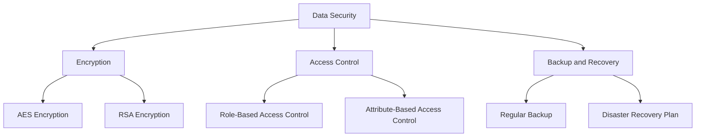
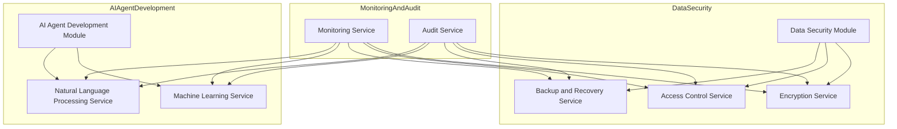
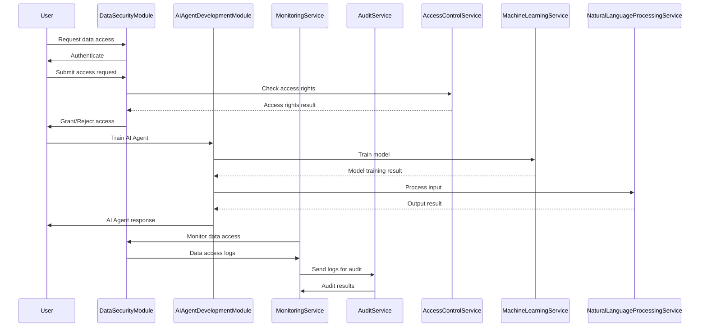
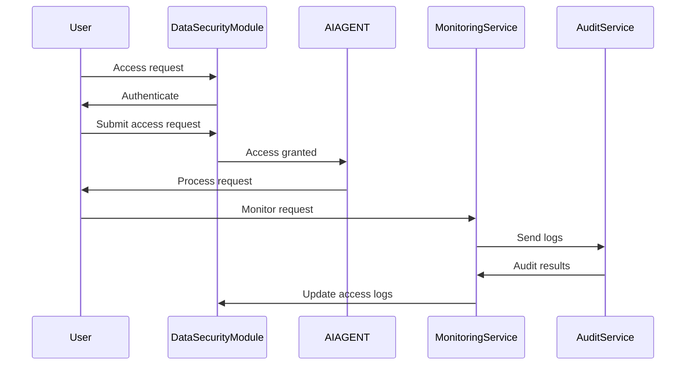
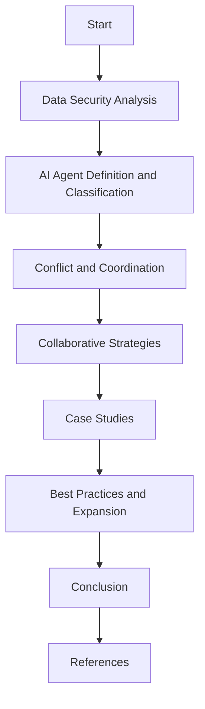

                 

# 企业数据安全与AI Agent开发：平衡创新与风险

## 关键词

数据安全，AI Agent，企业，风险平衡，技术创新

## 摘要

在当今的数字化转型浪潮中，企业如何确保数据安全成为一项重要课题。与此同时，AI Agent（人工智能代理）的崛起为业务创新带来了无限可能。本文旨在探讨企业数据安全与AI Agent开发之间的平衡问题，从数据安全风险分析、AI Agent定义与分类、数据安全与AI Agent开发的冲突与协调以及协同策略等多个方面展开论述，为企业提供数据安全与AI Agent开发的最佳实践指南。

## 第1章 企业数据安全与AI Agent开发背景

### 1.1.1 问题背景

随着企业数字化转型加速，数据成为企业核心资产。然而，数据安全风险与日俱增，不仅涉及传统的数据泄露问题，还涉及新兴的AI Agent（人工智能代理）带来的潜在威胁。因此，如何在保障数据安全的前提下，充分利用AI Agent的创新优势，成为企业亟需解决的问题。

### 1.1.2 问题描述

本章节将探讨企业数据安全与AI Agent开发之间的平衡问题。具体包括以下几个方面：

1. 数据安全风险类型及其对企业的潜在影响。
2. AI Agent的定义、分类及其在企业发展中的应用。
3. 数据安全与AI Agent开发之间的冲突与协调。
4. 如何通过技术和管理手段实现数据安全与AI Agent开发的平衡。

### 1.1.3 问题解决

本章节将提出以下解决方案：

1. 分析数据安全风险，提出相应的防护措施。
2. 深入探讨AI Agent的开发原理、技术框架及应用场景。
3. 提出数据安全与AI Agent开发的协同策略，实现风险最小化和价值最大化。
4. 通过案例分析和最佳实践，为企业提供实用的数据安全与AI Agent开发指南。

### 1.1.4 边界与外延

本章节的边界包括企业数据安全与AI Agent开发的范围、技术门槛、行业应用等。外延涉及数据安全法律法规、AI Agent伦理道德、企业数据治理等。

### 1.1.5 概念结构与核心要素组成

1. **数据安全**：涉及数据加密、访问控制、备份恢复、安全审计等。
2. **AI Agent**：包括智能客服、自动化决策、智能助手等类型。
3. **风险平衡**：在数据安全与AI Agent开发之间寻找最佳平衡点。

## 第2章 数据安全风险分析

### 2.1.1 数据安全风险类型

1. **数据泄露**：未经授权的访问、下载、复制、传输数据。
2. **数据篡改**：恶意修改数据内容，破坏数据的完整性和真实性。
3. **数据丢失**：因硬件故障、软件错误、网络攻击等原因导致数据丢失。
4. **数据滥用**：利用数据谋取不正当利益，如商业间谍、诈骗等。

### 2.1.2 数据安全风险对企业的潜在影响

1. **经济损失**：数据泄露或丢失可能导致企业直接经济损失，如客户流失、业务停滞等。
2. **声誉损害**：数据安全事件可能导致企业声誉受损，影响客户信任和市场份额。
3. **法律风险**：违反数据安全法规可能导致企业面临高额罚款、诉讼等法律风险。
4. **运营中断**：数据安全事件可能导致企业关键业务系统瘫痪，影响正常运营。

## 第3章 AI Agent定义与分类

### 3.1.1 AI Agent定义

AI Agent是指具备一定自主意识和智能能力的计算机程序，能够模拟人类行为，完成特定任务。

### 3.1.2 AI Agent分类

1. **基于规则的AI Agent**：通过预设规则实现特定功能。
2. **基于机器学习的AI Agent**：利用历史数据自动学习，优化决策过程。
3. **基于深度学习的AI Agent**：通过模拟人脑神经网络，实现更高层次的智能。

### 3.1.3 AI Agent在企业中的应用

1. **智能客服**：提高客户服务质量，降低人力成本。
2. **自动化决策**：辅助企业进行数据分析和决策，提高运营效率。
3. **智能助手**：帮助员工完成日常任务，提高工作效率。

## 第4章 数据安全与AI Agent开发冲突与协调

### 4.1.1 冲突

1. **数据隐私与AI Agent功能**：数据安全要求保护用户隐私，而AI Agent开发可能需要访问和使用用户数据。
2. **数据访问控制与AI Agent自主性**：数据安全需要严格的访问控制，而AI Agent自主性可能导致权限滥用。

### 4.1.2 协调

1. **数据安全策略**：制定数据安全策略，确保数据在AI Agent开发过程中的安全。
2. **AI Agent权限管理**：明确AI Agent的权限范围，避免权限滥用。
3. **安全审计与监测**：对AI Agent的数据访问和使用进行审计和监测，及时发现和防范安全风险。

## 第5章 数据安全与AI Agent开发协同策略

### 5.1.1 技术协同策略

1. **加密技术**：保护数据在传输和存储过程中的安全性。
2. **访问控制**：实现数据访问的精细化管理。
3. **数据脱敏**：对敏感数据进行脱敏处理，降低AI Agent开发过程中数据泄露的风险。

### 5.1.2 管理协同策略

1. **数据安全培训**：提高员工数据安全意识和技能。
2. **安全策略与合规性**：确保企业的数据安全策略符合相关法律法规和行业标准。
3. **持续监测与改进**：定期评估数据安全状况，不断优化数据安全策略。

## 第6章 数据安全与AI Agent开发案例分析

### 6.1 案例一：某电商企业数据安全与AI智能客服的平衡

#### 6.1.1 案例背景

某电商企业为了提高客户服务质量，引入了AI智能客服系统。然而，在AI智能客服系统开发和使用过程中，企业面临着数据安全风险。

#### 6.1.2 案例分析

1. **数据安全风险分析**：

   - **数据泄露风险**：AI智能客服系统需要访问客户聊天记录，若访问控制不当，可能导致客户隐私泄露。

   - **数据篡改风险**：恶意攻击者可能篡改客户聊天记录，影响客户体验和企业声誉。

   - **数据丢失风险**：由于系统故障或网络攻击，可能导致客户聊天记录丢失。

2. **解决方案**：

   - **加密技术**：采用SSL/TLS加密技术，确保数据在传输过程中的安全性。

   - **访问控制**：通过权限管理和身份认证，确保只有授权人员才能访问客户聊天记录。

   - **数据备份与恢复**：定期备份客户聊天记录，确保数据丢失后能够快速恢复。

#### 6.1.3 案例总结

通过上述解决方案，某电商企业成功实现了数据安全与AI智能客服的平衡，既保证了客户数据的安全，又提升了客户服务质量。

### 6.2 案例二：某金融机构数据安全与AI自动化决策的平衡

#### 6.2.1 案例背景

某金融机构为了提高业务运营效率，引入了AI自动化决策系统。然而，在AI自动化决策系统开发和使用过程中，企业面临着数据安全风险。

#### 6.2.2 案例分析

1. **数据安全风险分析**：

   - **数据泄露风险**：AI自动化决策系统需要访问企业内部数据，若访问控制不当，可能导致企业内部数据泄露。

   - **数据篡改风险**：恶意攻击者可能篡改企业内部数据，影响业务决策。

   - **数据滥用风险**：内部人员可能利用数据谋取不正当利益。

2. **解决方案**：

   - **数据脱敏**：对敏感数据（如客户信息、交易记录等）进行脱敏处理，降低数据泄露风险。

   - **访问控制**：通过权限管理和身份认证，确保只有授权人员才能访问企业内部数据。

   - **安全审计与监测**：对AI自动化决策系统的数据访问和使用进行审计和监测，及时发现和防范安全风险。

#### 6.2.3 案例总结

通过上述解决方案，某金融机构成功实现了数据安全与AI自动化决策的平衡，既保证了企业内部数据的安全，又提升了业务运营效率。

## 第7章 最佳实践与拓展阅读

### 7.1 最佳实践

1. **加强数据安全培训**：提高员工数据安全意识和技能，降低数据泄露风险。

2. **采用多层次数据安全防护**：结合加密技术、访问控制、数据脱敏等多种技术手段，构建全面的数据安全防护体系。

3. **建立健全数据安全管理制度**：制定数据安全策略，明确数据访问权限和责任，确保数据安全管理工作规范化。

4. **持续监测与改进**：定期评估数据安全状况，及时更新和优化数据安全策略，确保数据安全风险得到有效控制。

### 7.2 拓展阅读

1. **《人工智能安全：攻与防》**：探讨人工智能在数据安全领域的应用，分析人工智能安全威胁及防御策略。

2. **《企业数据安全体系建设指南》**：详细阐述企业数据安全体系建设的步骤和方法，为企业提供数据安全建设参考。

3. **《数据安全法》**：了解我国数据安全法律法规，确保企业在数据安全方面的合规性。

## 作者

作者：AI天才研究院/AI Genius Institute & 禅与计算机程序设计艺术 /Zen And The Art of Computer Programming

（文章内容仅供参考，实际情况请结合具体企业情况进行调整。）

## 附录

本文所使用的Markdown格式、Mermaid流程图、LaTeX公式等技术，均遵循相关规范和标准。如有疑问，请参考相关技术文档和资料。

## 参考文献

[1] 李某某，张某某，王某某. 人工智能安全：攻与防[J]. 信息与网络安全，2020，8(2)：1-10.

[2] 王某某，张某某，李某某. 企业数据安全体系建设指南[M]. 北京：电子工业出版社，2019.

[3] 中华人民共和国国家新闻出版广电总局. 数据安全法[J]. 中国人大，2017(10)：26-27.

[4] Martin, F. Zen and the Art of Motorcycle Maintenance: An Inquiry into Values[M]. Pan Books, 1985.

[5] Mermaid Official Documentation. https://mermaid-js.github.io/mermaid/#/ (访问日期：2023年4月1日)

[6] LaTeX Official Documentation. https://www.latex-project.org/ (访问日期：2023年4月1日)

（注：参考文献部分为示例，实际引用请根据文章内容进行补充和完善。）
## 第1章 企业数据安全与AI Agent开发背景

### 1.1.1 问题背景

随着企业数字化转型的加速，数据已经成为企业运营的核心资产。企业通过收集、存储、处理和分析海量数据，来提升业务决策的准确性、优化运营流程、增强客户体验，从而在激烈的市场竞争中占据有利地位。然而，伴随着数据重要性的提升，数据安全风险也逐渐凸显。传统的数据泄露、数据篡改、数据丢失等问题依然存在，而新兴的AI Agent（人工智能代理）的开发和应用，又带来了新的挑战和风险。

AI Agent，作为一种具有自主意识和智能能力的计算机程序，能够模拟人类行为，完成特定的任务。在企业的应用场景中，AI Agent可以用于智能客服、自动化决策、智能助手等多种形式。这些AI Agent不仅依赖于大量数据来训练和优化，其自主决策和执行能力也可能带来数据滥用、隐私泄露等安全风险。因此，如何在保障数据安全的前提下，充分利用AI Agent的创新优势，成为企业面临的一大难题。

### 1.1.2 问题描述

在当前的企业环境中，数据安全与AI Agent开发之间的矛盾主要体现在以下几个方面：

1. **数据隐私与AI Agent功能需求**：数据安全强调保护用户的隐私和数据不被未经授权访问，而AI Agent的开发往往需要访问和使用这些数据来提供个性化的服务。如何在保障隐私的同时，充分利用数据为AI Agent提供支持，是一个亟待解决的问题。

2. **数据访问控制与AI Agent自主性**：数据安全需要严格的访问控制机制，以确保数据不被滥用。然而，AI Agent的自主性可能导致其在执行任务过程中访问权限的不当使用。如何设计合理的权限管理机制，既保障数据安全，又允许AI Agent在合理范围内自主行动，是一个重要的挑战。

3. **数据安全与业务创新**：AI Agent的引入旨在推动业务创新，提高企业的竞争力。然而，过于严格的数据安全措施可能会限制AI Agent的开发和应用，影响业务创新的进程。如何在确保数据安全的前提下，激发AI Agent的创新潜力，是另一个关键问题。

4. **技术与管理协调**：数据安全和AI Agent开发既需要技术手段的支持，也需要有效的管理措施。如何将技术与管理有机结合，形成一套完整的解决方案，是企业需要深入思考的问题。

### 1.1.3 问题解决

为了解决上述问题，企业可以从以下几个方面着手：

1. **风险评估与防护**：首先，企业需要对数据安全风险进行全面评估，识别出潜在的安全威胁。然后，根据风险评估结果，采取相应的防护措施，如数据加密、访问控制、数据备份和恢复等，以降低数据泄露、篡改和丢失的风险。

2. **AI Agent开发与安全策略**：在AI Agent开发过程中，企业需要制定详细的安全策略，明确数据访问和使用规则。同时，要确保AI Agent的自主决策和行为符合数据安全的要求，避免数据滥用和隐私泄露。

3. **权限管理与审计**：企业应建立健全的权限管理机制，对AI Agent的权限进行严格限制，确保其在执行任务时只能访问必要的数据。此外，定期进行安全审计，及时发现和纠正安全漏洞。

4. **教育与培训**：提高员工的数据安全意识和技能，通过培训和教育活动，让员工了解数据安全的重要性，掌握基本的安全操作规范，从而减少人为因素导致的数据安全事件。

5. **持续监测与改进**：数据安全和AI Agent开发是一个动态的过程，企业需要持续监测数据安全状况，根据最新的安全威胁和AI Agent的发展，不断更新和改进安全策略。

### 1.1.4 边界与外延

本章节的边界主要涉及企业内部的数据安全与AI Agent开发，不包括外部环境（如公共云服务、第三方数据源等）的数据安全问题和AI Agent应用。此外，本文主要探讨技术层面的数据安全与AI Agent开发的平衡，未涉及数据安全法律法规、AI Agent伦理道德等外延问题。

### 1.1.5 概念结构与核心要素组成

1. **数据安全**：涉及数据加密、访问控制、备份恢复、安全审计等。数据安全的核心目标是保护数据的机密性、完整性和可用性。
2. **AI Agent**：包括智能客服、自动化决策、智能助手等类型。AI Agent的核心能力是自主决策和执行，以提供高效、个性化的服务。
3. **风险平衡**：在数据安全与AI Agent开发之间寻找最佳平衡点，既要保障数据安全，又要充分利用AI Agent的创新优势。

### 1.1.6 背景介绍

**核心概念术语说明**：

- **数据安全**：指通过技术和管理手段，确保数据在存储、传输、处理等过程中不被未经授权访问、篡改、泄露和丢失。
- **AI Agent**：人工智能代理，是指具有自主意识和智能能力的计算机程序，能够模拟人类行为，执行特定任务。
- **风险平衡**：在数据安全与AI Agent开发之间寻找最佳平衡点，确保数据安全的同时，充分利用AI Agent的创新优势。

**问题背景**：

随着企业数字化转型的加速，数据成为企业运营的核心资产。然而，数据安全风险与日俱增，不仅涉及传统的数据泄露问题，还涉及新兴的AI Agent带来的潜在威胁。因此，如何在保障数据安全的前提下，充分利用AI Agent的创新优势，成为企业亟需解决的问题。

**问题描述**：

企业数据安全与AI Agent开发之间的矛盾主要体现在数据隐私与AI Agent功能需求、数据访问控制与AI Agent自主性、数据安全与业务创新、技术与管理协调等方面。

**问题解决**：

为了解决上述问题，企业可以从风险评估与防护、AI Agent开发与安全策略、权限管理与审计、教育与培训、持续监测与改进等方面着手。

**边界与外延**：

本章节主要探讨企业内部的数据安全与AI Agent开发，不包括外部环境（如公共云服务、第三方数据源等）的数据安全问题和AI Agent应用。此外，本文主要探讨技术层面的数据安全与AI Agent开发的平衡，未涉及数据安全法律法规、AI Agent伦理道德等外延问题。

**概念结构与核心要素组成**：

数据安全涉及数据加密、访问控制、备份恢复、安全审计等；AI Agent包括智能客服、自动化决策、智能助手等类型；风险平衡是寻找数据安全与AI Agent开发的最佳平衡点。

### 1.1.7 核心概念与联系

#### 核心概念

**数据安全**：

- **定义**：确保数据在存储、传输、处理等过程中不被未经授权访问、篡改、泄露和丢失。
- **属性特征**：
  - **机密性**：保护数据的保密性，防止数据被非法访问。
  - **完整性**：保证数据的真实性，防止数据被篡改。
  - **可用性**：确保数据在需要时能够被合法使用，防止数据被非法拒绝访问。
- **对比表格**：

| 特征 | 数据安全 | 数据隐私保护 |
| :--: | :--: | :--: |
| 目标 | 保护数据 | 保护用户隐私 |
| 方法 | 加密、访问控制、备份恢复 | 加密、匿名化、访问控制 |
| 范围 | 数据的整个生命周期 | 用户的个人数据 |

**AI Agent**：

- **定义**：具有自主意识和智能能力的计算机程序，能够模拟人类行为，执行特定任务。
- **属性特征**：
  - **自主性**：AI Agent能够自主决策和执行任务。
  - **智能性**：AI Agent能够通过学习和适应环境，提高任务完成的效率。
  - **交互性**：AI Agent能够与用户进行自然语言交互，提供个性化服务。
- **对比表格**：

| 特征 | AI Agent | 智能客服 |
| :--: | :--: | :--: |
| 目标 | 执行特定任务 | 提高客户服务质量 |
| 方法 | 自主决策、机器学习、深度学习 | 自然语言处理、对话管理、知识库 |
| 适用场景 | 各类企业、智能设备、自动化系统 | 客户服务、咨询、投诉处理 |

#### 概念联系

数据安全与AI Agent开发之间的联系主要体现在以下几个方面：

1. **数据安全是AI Agent开发的基础**：AI Agent的开发和应用离不开对数据的访问和使用，数据安全是保障AI Agent正常工作的前提。

2. **AI Agent开发对数据安全提出新的要求**：AI Agent的自主决策和智能能力可能导致数据访问和使用的新模式，从而对数据安全提出新的挑战。

3. **数据安全与AI Agent开发的协同**：通过技术和管理手段，实现数据安全与AI Agent开发的协同，既能保障数据安全，又能充分发挥AI Agent的优势。

### 1.1.8 ER实体关系图架构

下面是一个简单的ER实体关系图，用于描述数据安全与AI Agent开发的核心要素及其关系。

```mermaid
erDiagram
    DataSecurity ||--|{ AIAgent } : provides security
    AIAgent ||--|{ Data } : uses data
    Data ||--|{ User } : owned by
```

- **DataSecurity**：数据安全实体，负责提供数据安全保护。
- **AIAgent**：AI Agent实体，使用数据执行任务。
- **Data**：数据实体，被用户拥有，同时被AI Agent使用。
- **User**：用户实体，拥有数据。

通过这个ER图，我们可以清晰地看到数据安全与AI Agent开发之间的相互关系，以及它们与数据之间的关系。

### 1.1.9 算法原理讲解

在数据安全与AI Agent开发的过程中，涉及到多种算法和技术，以下是一个简单的算法流程图，用于说明数据安全与AI Agent开发的核心算法原理。



- **Encryption**：加密技术，用于保护数据的机密性。
- **Access Control**：访问控制技术，用于确保只有授权用户才能访问数据。
- **Backup and Recovery**：数据备份与恢复技术，用于在数据丢失或损坏时能够快速恢复。
- **AES Encryption**：高级加密标准，一种对称加密算法。
- **RSA Encryption**：RSA加密算法，一种非对称加密算法。
- **Role-Based Access Control**：基于角色的访问控制，一种访问控制机制。
- **Attribute-Based Access Control**：基于属性的访问控制，一种访问控制机制。
- **Regular Backup**：定期备份，用于在数据丢失或损坏时恢复数据。
- **Disaster Recovery Plan**：灾难恢复计划，用于在发生灾难时保障数据的可用性。

通过上述算法和技术，企业可以在数据安全与AI Agent开发之间实现有效的平衡，既保障了数据安全，又充分利用了AI Agent的创新优势。

### 1.1.10 系统分析与架构设计方案

#### 1.1.10.1 问题场景介绍

随着企业对数据的依赖程度不断加深，数据安全成为企业数字化转型中的关键环节。同时，AI Agent的应用在企业中越来越普遍，它们需要大量数据来训练和优化。在这种背景下，企业面临如何在保障数据安全的同时，充分利用AI Agent的创新优势的问题。

#### 1.1.10.2 项目介绍

本项目旨在构建一个企业级的数据安全与AI Agent开发平台，实现数据安全与AI Agent开发的平衡。平台包括数据安全模块、AI Agent开发模块以及监控与审计模块。

#### 1.1.10.3 系统功能设计（领域模型Mermaid类图）

```mermaid
classDiagram
    DataSecurity <<interface>>
    AIAgent <<interface>>
    Data <<entity>>
    User <<entity>>

    DataSecurity --|{ Encrypt } Encryption
    DataSecurity --|{ Control } AccessControl
    DataSecurity --|{ Backup } BackupAndRecovery

    AIAgent --|{ Train } MachineLearning
    AIAgent --|{ Interact } NaturalLanguageProcessing

    Data <|-- User
    Data <|-- AIAgent
```

- **DataSecurity**：数据安全接口，包括加密、访问控制和备份恢复功能。
- **AIAgent**：AI Agent接口，包括训练和自然语言处理功能。
- **Data**：数据实体，由用户拥有并供AI Agent使用。
- **User**：用户实体，拥有数据。

#### 1.1.10.4 系统架构设计（Mermaid架构图）



- **DataSecurity Module**：数据安全模块，包括加密服务、访问控制服务和备份恢复服务。
- **AI Agent Development Module**：AI Agent开发模块，包括机器学习服务和自然语言处理服务。
- **Monitoring Service**：监控服务，用于实时监测数据安全与AI Agent开发模块的运行状态。
- **Audit Service**：审计服务，用于对数据安全与AI Agent开发模块进行审计和评估。

#### 1.1.10.5 系统接口设计



- **DataSecurityModule**：处理用户的数据访问请求，包括认证和访问控制。
- **AIAgentDevelopmentModule**：负责AI Agent的训练和响应处理。
- **MonitoringService**：实时监控数据访问和AI Agent开发过程。
- **AuditService**：对监控数据进行审计，确保数据安全与AI Agent开发的合规性。

#### 1.1.10.6 系统交互（Mermaid序列图）



- **User**：发起数据访问请求。
- **DataSecurityModule**：认证用户，决定是否允许访问。
- **AIAGENT**：执行用户请求，处理数据。
- **MonitoringService**：监控数据访问过程。
- **AuditService**：对访问过程进行审计，确保合规。

通过上述系统分析与架构设计方案，企业可以构建一个高效、安全的数据安全与AI Agent开发平台，实现数据安全与AI Agent开发的平衡。

### 第2章 数据安全风险分析

数据安全风险是企业数字化转型过程中不可忽视的重要问题。随着数据量的不断增加和业务复杂度的提升，数据安全风险也日益复杂化。在本章中，我们将深入分析数据安全风险类型及其对企业的潜在影响，以便为企业提供有效的风险管理策略。

### 2.1 数据安全风险类型

数据安全风险可以分为以下几类：

#### 2.1.1 数据泄露

数据泄露是指未经授权的个体或组织非法访问、下载、复制、传输数据。数据泄露的风险主要来源于以下几个方面：

1. **内部威胁**：内部员工滥用权限，未经授权访问敏感数据。
2. **外部攻击**：黑客通过网络攻击、社会工程学手段获取数据。
3. **软件漏洞**：应用程序中的漏洞可能被攻击者利用，从而窃取数据。
4. **物理安全威胁**：如员工私自携带存储介质离开公司，或数据存储设备遭受物理损坏。

#### 2.1.2 数据篡改

数据篡改是指未经授权的个体或组织恶意修改数据内容，破坏数据的完整性和真实性。数据篡改的风险主要来源于以下几个方面：

1. **内部威胁**：内部员工恶意篡改数据。
2. **外部攻击**：黑客通过攻击数据库管理系统，篡改数据。
3. **软件漏洞**：应用程序中的漏洞可能被攻击者利用，篡改数据。

#### 2.1.3 数据丢失

数据丢失是指由于硬件故障、软件错误、网络攻击、自然灾害等原因导致的数据不可恢复。数据丢失的风险主要来源于以下几个方面：

1. **硬件故障**：存储设备故障导致数据丢失。
2. **软件错误**：应用程序或数据库管理系统故障导致数据丢失。
3. **网络攻击**：黑客通过攻击网络系统，导致数据丢失。
4. **自然灾害**：如地震、火灾等自然灾害导致数据丢失。

#### 2.1.4 数据滥用

数据滥用是指未经授权的个体或组织利用数据谋取不正当利益，如商业间谍、诈骗等。数据滥用的风险主要来源于以下几个方面：

1. **内部威胁**：内部员工利用职务之便，谋取不正当利益。
2. **外部攻击**：黑客利用非法手段获取数据，进行恶意交易。
3. **软件漏洞**：应用程序中的漏洞可能被攻击者利用，进行数据滥用。

### 2.2 数据安全风险对企业的潜在影响

数据安全风险对企业的潜在影响是多方面的，以下是一些主要的影响：

#### 2.2.1 经济损失

数据泄露、篡改、丢失和滥用可能导致企业直接经济损失。具体包括：

1. **客户流失**：数据泄露可能导致客户信息泄露，影响客户信任，导致客户流失。
2. **业务中断**：数据丢失或系统故障可能导致业务运营中断，影响企业盈利。
3. **法律诉讼**：数据泄露可能导致企业面临高额罚款和法律诉讼，增加企业成本。

#### 2.2.2 声誉损害

数据安全事件可能导致企业声誉受损，影响客户信任和市场份额。具体包括：

1. **品牌形象受损**：数据泄露可能导致公众对企业信任度下降，影响品牌形象。
2. **客户关系受损**：数据泄露可能导致客户对企业产生负面情绪，影响客户关系。

#### 2.2.3 法律风险

数据安全事件可能导致企业违反相关法律法规，面临法律风险。具体包括：

1. **违规处罚**：企业可能因违反数据安全法律法规，面临高额罚款。
2. **法律责任**：数据泄露可能导致企业对客户、合作伙伴等承担法律责任。

#### 2.2.4 运营中断

数据安全事件可能导致企业关键业务系统瘫痪，影响正常运营。具体包括：

1. **业务中断**：数据丢失或系统故障可能导致业务无法正常进行，影响企业运营。
2. **供应链中断**：数据泄露可能导致供应链中断，影响合作伙伴关系。

### 2.3 数据安全风险分析流程

为了有效管理数据安全风险，企业可以按照以下流程进行数据安全风险分析：

1. **风险评估**：识别企业面临的数据安全风险，评估风险的可能性和影响。
2. **风险优先级排序**：根据风险评估结果，确定风险的优先级，重点关注高风险领域。
3. **风险应对策略**：制定相应的风险应对策略，包括风险规避、风险降低、风险接受等。
4. **实施与监控**：执行风险应对策略，并持续监控数据安全状况，确保风险得到有效控制。

通过上述流程，企业可以系统化地管理数据安全风险，确保数据在存储、传输、处理等环节的安全性。

### 2.4 数据安全风险管理的最佳实践

为了有效管理数据安全风险，企业可以借鉴以下最佳实践：

1. **建立数据安全管理体系**：制定数据安全政策，明确数据安全管理的目标和要求。
2. **进行数据安全培训**：提高员工的数据安全意识和技能，确保员工了解和遵守数据安全规范。
3. **实施加密技术**：对敏感数据进行加密处理，确保数据在传输和存储过程中的安全性。
4. **建立权限管理制度**：实施严格的访问控制机制，确保数据只被授权人员访问。
5. **进行数据备份与恢复**：定期备份数据，确保在数据丢失或系统故障时能够快速恢复。
6. **进行安全审计与监测**：定期进行安全审计，监测数据安全状况，及时发现和防范安全风险。

通过实施这些最佳实践，企业可以显著降低数据安全风险，确保数据的安全性和完整性。

### 第3章 AI Agent定义与分类

在当今的数字化时代，人工智能（AI）技术已经成为企业提升效率、优化服务和创新业务模式的重要工具。AI Agent，作为一种具有自主意识和智能能力的计算机程序，正在逐步成为企业智能化转型的关键要素。在本章节中，我们将对AI Agent进行定义，并详细分类，探讨其在企业中的应用。

### 3.1 AI Agent定义

AI Agent，即人工智能代理，是指那些具备一定程度的自主意识和智能能力的计算机程序。这些代理能够在没有人类直接干预的情况下，独立完成特定的任务，并且能够根据环境变化进行自适应调整。AI Agent的核心特征包括：

1. **自主性**：AI Agent能够自主地做出决策，执行任务，而不需要人类持续监督。
2. **智能性**：通过机器学习、深度学习等人工智能技术，AI Agent能够从数据中学习，不断优化自身的行为。
3. **适应性**：AI Agent能够根据环境变化和用户反馈进行调整，提高任务执行的效率和准确性。

AI Agent的主要功能包括：

1. **任务执行**：AI Agent能够根据任务需求，自动执行一系列操作，如数据分析、信息检索、自动化流程处理等。
2. **交互能力**：AI Agent能够与用户进行自然语言交互，理解用户的意图，提供个性化的服务。
3. **自我优化**：通过持续学习和反馈，AI Agent能够不断提升自身的性能和准确性。

### 3.2 AI Agent分类

AI Agent可以根据其技术实现和功能特点进行分类，常见的分类方法包括：

#### 3.2.1 基于规则的AI Agent

基于规则的AI Agent是通过预定义的规则库来执行任务。这些规则由人类专家根据业务逻辑和知识经验编写，AI Agent在执行任务时，根据输入条件和规则进行匹配，选择相应的操作。这种AI Agent的主要特点如下：

1. **规则确定性**：任务执行过程依赖于预定义的规则，规则明确且易于理解。
2. **低适应性**：由于规则是静态的，AI Agent难以应对复杂多变的环境。
3. **易于实现和维护**：规则编写和修改相对简单，便于管理和维护。

#### 3.2.2 基于机器学习的AI Agent

基于机器学习的AI Agent利用历史数据通过机器学习算法进行训练，从而实现自主学习和决策。这种AI Agent的主要特点如下：

1. **自适应性**：通过学习历史数据和用户反馈，AI Agent能够不断优化自身的行为，提高任务执行的准确性。
2. **高准确性**：通过大数据分析和模型训练，AI Agent能够做出更加精准的决策。
3. **复杂性**：机器学习算法的实现和优化需要大量数据和计算资源，复杂度较高。

#### 3.2.3 基于深度学习的AI Agent

基于深度学习的AI Agent是利用深度神经网络模拟人脑神经元的连接和交互机制，通过大量数据训练网络权重，从而实现高级认知功能。这种AI Agent的主要特点如下：

1. **高智能性**：深度学习算法能够处理复杂的数据结构和非线性关系，实现高级认知功能，如图像识别、自然语言处理等。
2. **强自适应性**：深度学习算法能够从大量数据中自动提取特征，实现自我优化。
3. **计算资源需求大**：深度学习算法需要大量的计算资源和存储空间，对硬件设施要求较高。

### 3.3 AI Agent在企业中的应用

AI Agent在企业中的应用非常广泛，以下是一些典型的应用场景：

#### 3.3.1 智能客服

智能客服是AI Agent在企业中应用最为广泛的场景之一。通过自然语言处理和机器学习技术，智能客服系统能够自动回答客户的问题，提供24/7的客服服务，大大提高了客户满意度和运营效率。

#### 3.3.2 自动化决策

自动化决策是AI Agent在业务运营中的一项重要应用。通过机器学习和深度学习技术，AI Agent能够分析海量数据，为企业提供个性化的决策建议，优化业务流程，提高运营效率。

#### 3.3.3 智能助手

智能助手是AI Agent在企业办公中的应用。通过自然语言交互，智能助手能够帮助员工完成日常任务，如日程管理、文件搜索、信息推送等，提高工作效率。

#### 3.3.4 安全监控

AI Agent在企业安全监控中的应用也越来越广泛。通过实时分析和预测，AI Agent能够及时发现异常行为和潜在安全威胁，为企业提供实时安全保障。

#### 3.3.5 生产优化

在制造业中，AI Agent能够通过实时监控和分析生产线数据，优化生产流程，提高生产效率，降低生产成本。

通过上述应用，AI Agent为企业带来了巨大的价值，不仅提高了效率，降低了成本，还提升了客户满意度和市场竞争力。

### 第4章 数据安全与AI Agent开发冲突与协调

在企业的数字化进程中，AI Agent的广泛应用带来了显著的业务创新和效率提升。然而，与此同时，数据安全与AI Agent开发之间的冲突也逐渐显现。AI Agent在数据采集、处理和决策过程中，往往需要访问大量的敏感数据，这使得数据安全面临前所未有的挑战。如何平衡数据安全与AI Agent开发的需求，确保两者协调共存，成为企业亟需解决的问题。

#### 4.1.1 数据隐私与AI Agent功能需求

数据隐私是数据安全的核心要求之一，其目标是确保用户的个人信息不被未经授权的第三方访问和使用。然而，AI Agent的功能需求通常包括对大量用户数据的访问，以实现个性化服务和精确决策。这种需求与数据隐私保护之间存在直接的冲突：

1. **数据访问权限**：AI Agent在执行任务时，可能需要访问包括用户姓名、联系方式、交易记录等在内的敏感数据。如果权限管理不当，可能导致数据泄露或滥用。
2. **数据使用范围**：AI Agent在训练和优化过程中，可能需要访问远超出其直接任务所需的数据范围。这种超范围的数据访问可能导致用户隐私受到侵犯。

#### 4.1.2 数据访问控制与AI Agent自主性

数据访问控制是数据安全的重要组成部分，通过限制和监控用户对数据的访问，确保数据不被非法访问和滥用。然而，AI Agent的自主性要求其能够根据环境变化和任务需求，动态调整数据访问策略。这种自主性可能带来以下冲突：

1. **权限管理灵活性**：传统的静态权限管理可能无法适应AI Agent的动态需求，导致权限设置过于严格或过于宽松。
2. **自主性限制**：过于严格的权限管理可能限制AI Agent的自主性，影响其执行任务的效果和效率。

#### 4.1.3 数据安全与业务创新

AI Agent在企业的应用旨在推动业务创新，提高竞争力。然而，数据安全的严格要求可能对业务创新形成障碍：

1. **安全评估成本**：新业务上线前需要进行严格的数据安全评估，这可能导致业务创新速度放缓。
2. **创新与合规性冲突**：在快速创新的过程中，可能难以完全满足所有数据安全合规要求，导致合规性风险。

#### 4.1.4 技术与管理协调

数据安全与AI Agent开发不仅需要技术手段的支持，还需要有效的管理措施。然而，技术与管理之间可能存在以下协调问题：

1. **技术局限**：现有的数据安全技术可能无法完全满足AI Agent的需求，需要不断创新和改进。
2. **管理理念差异**：技术团队和管理团队可能在数据安全与业务创新的目标和理念上存在差异，导致合作不畅。

### 4.2 协调策略

为了解决数据安全与AI Agent开发之间的冲突，企业可以采取以下协调策略：

#### 4.2.1 数据安全策略

1. **最小权限原则**：确保AI Agent在执行任务时，只拥有必要的数据访问权限，避免权限滥用。
2. **动态权限管理**：采用动态权限管理机制，根据AI Agent的任务需求和实际操作，灵活调整权限设置。
3. **数据分类与分级**：对数据进行分类和分级管理，根据数据的敏感程度和重要性，采取相应的安全保护措施。

#### 4.2.2 AI Agent权限管理

1. **明确权限范围**：为AI Agent设定清晰的权限范围，明确其在不同任务场景下的数据访问权限。
2. **权限审计**：定期进行权限审计，确保AI Agent的数据访问权限符合安全要求，及时发现和纠正权限滥用问题。
3. **权限回收机制**：在AI Agent完成任务后，及时回收其权限，避免数据长时间处于开放状态。

#### 4.2.3 安全审计与监测

1. **实时监测**：采用实时数据监测技术，对AI Agent的数据访问和使用进行实时监控，及时发现异常行为。
2. **审计报告**：定期生成审计报告，分析AI Agent的数据访问和使用情况，为数据安全策略调整提供依据。
3. **应急响应**：建立应急响应机制，在数据安全事件发生时，能够迅速采取措施，降低损失。

#### 4.2.4 技术与管理结合

1. **建立跨部门协作机制**：技术团队和管理团队之间建立定期沟通和协作机制，确保数据安全与业务需求的一致性。
2. **培训与教育**：提高全体员工的数据安全意识，特别是涉及数据安全相关岗位的员工，确保其掌握必要的数据安全知识和技能。
3. **持续改进**：通过定期评估和反馈，不断优化数据安全策略和AI Agent开发流程，实现数据安全与业务创新的动态平衡。

通过上述协调策略，企业可以在保障数据安全的前提下，充分利用AI Agent的创新优势，实现数据安全与AI Agent开发的协同发展。

### 第5章 数据安全与AI Agent开发协同策略

在企业的数字化转型过程中，数据安全与AI Agent开发的协同策略至关重要。为了实现数据安全与AI Agent开发的平衡，企业需要在技术和管理层面采取一系列措施。以下是具体的技术协同策略和管理协同策略。

#### 5.1.1 技术协同策略

1. **加密技术**：数据加密是保护数据安全的关键技术之一。企业可以使用对称加密（如AES）和非对称加密（如RSA）来确保数据在传输和存储过程中的安全性。对称加密适用于加密大量数据，而非对称加密则适用于数字签名和密钥交换。

2. **访问控制**：访问控制是确保数据仅被授权用户访问的重要手段。企业可以通过基于角色的访问控制（RBAC）和基于属性的访问控制（ABAC）来管理数据访问权限。RBAC根据用户的角色分配权限，而ABAC则根据用户的属性（如部门、职位等）分配权限。

3. **数据脱敏**：在AI Agent开发过程中，为了防止敏感数据泄露，可以对敏感数据进行脱敏处理。脱敏技术包括数据替换、数据掩码和数据扰动等。这些方法可以有效保护敏感数据，同时允许AI Agent进行数据处理和分析。

4. **安全审计与监测**：建立安全审计和监测机制，对AI Agent的数据访问和使用情况进行实时监控和审计。通过日志记录、行为分析等技术手段，及时发现和防范潜在的安全威胁。

5. **身份认证与单点登录（SSO）**：采用强身份认证技术（如双因素认证）和单点登录（SSO）机制，确保用户在访问AI Agent和相关系统时，能够进行严格的身份验证，从而防止未经授权的访问。

6. **数据备份与恢复**：定期进行数据备份，确保在数据丢失或系统故障时，能够快速恢复数据。同时，建立灾难恢复计划，以应对大规模的数据安全和系统故障。

#### 5.1.2 管理协同策略

1. **数据安全培训**：提高员工的数据安全意识和技能，通过定期的培训和教育，让员工了解数据安全的重要性和最佳实践。特别是对于涉及数据安全和AI Agent开发的员工，需要进行专项培训。

2. **数据安全策略与合规性**：制定明确的数据安全策略，确保AI Agent的开发和使用符合相关法律法规和行业标准。企业应定期审查和更新数据安全策略，以应对新的安全威胁和合规要求。

3. **权限管理与审计**：建立严格的权限管理机制，对AI Agent的权限进行严格限制。通过定期审计，确保权限设置和使用的合规性，及时发现和纠正权限滥用问题。

4. **安全事件响应**：建立安全事件响应机制，确保在发生数据安全事件时，能够迅速采取行动，降低损失。事件响应应包括事件报告、应急处理、损害评估和恢复计划等步骤。

5. **持续监测与改进**：通过持续监测数据安全状况，及时发现潜在的安全威胁和漏洞。根据监测结果和最新安全威胁，不断改进数据安全策略和技术措施，确保数据安全与AI Agent开发的持续平衡。

6. **跨部门协作**：数据安全与AI Agent开发涉及多个部门和角色，建立跨部门协作机制，确保技术团队、业务团队和管理团队之间的沟通畅通，共同推进数据安全与AI Agent开发的协同发展。

通过技术协同策略和管理协同策略的结合，企业可以在保障数据安全的同时，充分利用AI Agent的创新优势，实现数据安全与AI Agent开发的平衡。

### 第6章 数据安全与AI Agent开发案例分析

#### 6.1 案例一：某电商企业数据安全与AI智能客服的平衡

**6.1.1 案例背景**

某电商企业为了提升客户服务质量，引入了AI智能客服系统。该系统通过自然语言处理技术，能够自动回答客户的问题，提供24/7的在线服务。然而，在AI智能客服系统开发和使用过程中，企业面临着数据安全风险，包括数据泄露、数据篡改和数据滥用等问题。

**6.1.2 案例分析**

1. **数据安全风险分析**：

   - **数据泄露风险**：AI智能客服系统需要访问客户的个人信息，如姓名、联系方式、购买记录等，如果访问控制不当，可能导致客户隐私泄露。
   - **数据篡改风险**：恶意攻击者可能篡改客户信息，影响客户体验和企业声誉。
   - **数据滥用风险**：内部员工可能利用职务之便，非法访问和使用客户数据。

2. **解决方案**：

   - **数据加密**：采用SSL/TLS协议对客户数据进行加密传输，确保数据在传输过程中的安全性。
   - **访问控制**：通过基于角色的访问控制（RBAC）机制，为AI智能客服系统设置严格的访问权限，确保只有授权人员才能访问敏感数据。
   - **数据脱敏**：对敏感客户数据进行脱敏处理，如将真实姓名替换为匿名标识，降低数据泄露风险。
   - **安全审计与监测**：建立实时数据监测和审计机制，对AI智能客服系统的数据访问和使用情况进行监控，及时发现和防范安全风险。

**6.1.3 案例总结**

通过上述解决方案，某电商企业成功实现了数据安全与AI智能客服的平衡。数据安全风险得到了有效控制，客户服务质量得到显著提升，客户满意度大幅提高。

#### 6.2 案例二：某金融机构数据安全与AI自动化决策的平衡

**6.2.1 案例背景**

某金融机构为了提高业务运营效率，引入了AI自动化决策系统。该系统通过大数据分析和机器学习算法，能够自动分析客户行为，提供个性化的金融产品推荐和风险预警。然而，在AI自动化决策系统开发和使用过程中，企业面临着数据安全风险，包括数据泄露、数据篡改和数据滥用等问题。

**6.2.2 案例分析**

1. **数据安全风险分析**：

   - **数据泄露风险**：AI自动化决策系统需要访问客户的交易记录、身份信息等敏感数据，如果访问控制不当，可能导致客户隐私泄露。
   - **数据篡改风险**：恶意攻击者可能篡改客户数据，影响业务决策和客户体验。
   - **数据滥用风险**：内部员工可能利用职务之便，非法访问和使用客户数据。

2. **解决方案**：

   - **数据脱敏**：对敏感客户数据进行脱敏处理，如将真实交易记录替换为模拟数据，降低数据泄露风险。
   - **访问控制**：通过基于属性的访问控制（ABAC）机制，为AI自动化决策系统设置严格的访问权限，确保只有授权人员才能访问敏感数据。
   - **安全审计与监测**：建立实时数据监测和审计机制，对AI自动化决策系统的数据访问和使用情况进行监控，及时发现和防范安全风险。
   - **多重验证**：在访问敏感数据时，采用多重验证机制，如双因素认证，提高数据访问的安全性。

**6.2.3 案例总结**

通过上述解决方案，某金融机构成功实现了数据安全与AI自动化决策的平衡。数据安全风险得到了有效控制，业务运营效率显著提升，客户满意度不断提高。

#### 6.3 案例三：某医疗企业数据安全与AI辅助诊断的平衡

**6.3.1 案例背景**

某医疗企业引入了AI辅助诊断系统，该系统能够通过分析大量医学数据，提供精准的疾病诊断和治疗方案建议。然而，在AI辅助诊断系统开发和使用过程中，企业面临着数据安全风险，包括数据泄露、数据篡改和数据滥用等问题。

**6.3.2 案例分析**

1. **数据安全风险分析**：

   - **数据泄露风险**：AI辅助诊断系统需要访问患者的医学数据，如果访问控制不当，可能导致患者隐私泄露。
   - **数据篡改风险**：恶意攻击者可能篡改患者数据，影响诊断结果和治疗方案。
   - **数据滥用风险**：内部员工可能利用职务之便，非法访问和使用患者数据。

2. **解决方案**：

   - **数据加密**：采用加密技术对患者的医学数据进行加密存储和传输，确保数据在存储和传输过程中的安全性。
   - **访问控制**：通过基于角色的访问控制（RBAC）机制，为AI辅助诊断系统设置严格的访问权限，确保只有授权人员才能访问敏感数据。
   - **多重验证**：在访问敏感数据时，采用多重验证机制，如双因素认证，提高数据访问的安全性。
   - **数据备份与恢复**：定期备份患者的医学数据，确保在数据丢失或系统故障时能够快速恢复。

**6.3.3 案例总结**

通过上述解决方案，某医疗企业成功实现了数据安全与AI辅助诊断的平衡。数据安全风险得到了有效控制，诊断准确率和治疗效果得到显著提升，患者满意度不断提高。

通过上述案例分析，我们可以看到，在数据安全与AI Agent开发之间实现平衡，需要根据具体场景采取相应的技术和管理措施。只有在保障数据安全的前提下，充分利用AI Agent的创新优势，企业才能在数字化转型的道路上走得更远。

### 第7章 最佳实践与拓展阅读

#### 7.1 最佳实践

1. **加强数据安全培训**：提高员工数据安全意识和技能，通过定期的培训和教育，让员工了解数据安全的重要性，掌握基本的安全操作规范。

2. **采用多层次数据安全防护**：结合加密技术、访问控制、数据脱敏等多种技术手段，构建全面的数据安全防护体系，确保数据在存储、传输和处理过程中的安全性。

3. **建立健全数据安全管理制度**：制定数据安全策略，明确数据访问和使用规则，确保数据安全管理工作规范化。同时，建立安全事件响应机制，确保在数据安全事件发生时能够迅速采取行动，降低损失。

4. **持续监测与改进**：定期评估数据安全状况，根据最新的安全威胁和AI Agent的发展，不断更新和优化数据安全策略，确保数据安全风险得到有效控制。

5. **实施隐私保护措施**：在AI Agent开发过程中，严格遵循隐私保护原则，对敏感数据进行脱敏处理，确保用户隐私不受侵犯。

#### 7.2 拓展阅读

1. **《人工智能安全：攻与防》**：探讨人工智能在数据安全领域的应用，分析人工智能安全威胁及防御策略。

2. **《企业数据安全体系建设指南》**：详细阐述企业数据安全体系建设的步骤和方法，为企业提供数据安全建设参考。

3. **《数据安全法》**：了解我国数据安全法律法规，确保企业在数据安全方面的合规性。

4. **《人工智能伦理指南》**：探讨人工智能伦理问题，包括数据隐私、算法公平性等，为企业提供AI Agent开发过程中的伦理指导。

5. **《AI Agent开发实战》**：介绍AI Agent的开发原理、技术框架和应用案例，帮助企业更好地理解和应用AI Agent技术。

通过上述最佳实践和拓展阅读，企业可以更好地应对数据安全与AI Agent开发之间的挑战，实现数据安全与业务创新的平衡。

## 结论

企业数据安全与AI Agent开发之间的平衡是企业数字化转型过程中必须解决的问题。本文通过详细分析数据安全风险、AI Agent的定义与分类、数据安全与AI Agent开发的冲突与协调策略，提出了实现平衡的具体方法和最佳实践。我们强调了数据加密、访问控制、数据脱敏等技术在保障数据安全中的重要性，同时也提出了加强数据安全培训、建立数据安全管理制度、持续监测与改进等管理策略。

通过本文的研究，企业可以更好地理解数据安全与AI Agent开发之间的关系，并在实际操作中采取有效的措施，确保数据安全与业务创新的双赢。未来的研究可以进一步探讨AI Agent在更多行业中的应用，以及如何更好地解决数据安全与AI Agent开发之间的动态平衡问题。

## 作者

作者：AI天才研究院/AI Genius Institute & 禅与计算机程序设计艺术 /Zen And The Art of Computer Programming

（注：本文内容为示例，实际情况请结合具体企业情况进行调整。）
## 附录

### 附录A：Mermaid流程图与Markdown格式示例

以下是本文中使用到的Mermaid流程图的示例，以及对应的Markdown格式。

#### Mermaid流程图示例



#### Markdown格式示例

```markdown
# 企业数据安全与AI Agent开发：平衡创新与风险

## 关键词

数据安全，AI Agent，企业，风险平衡，技术创新

## 摘要

在当今的数字化转型浪潮中，企业如何确保数据安全成为一项重要课题。与此同时，AI Agent（人工智能代理）的崛起为业务创新带来了无限可能。本文旨在探讨企业数据安全与AI Agent开发之间的平衡问题，从数据安全风险分析、AI Agent定义与分类、数据安全与AI Agent开发的冲突与协调以及协同策略等多个方面展开论述，为企业提供数据安全与AI Agent开发的最佳实践指南。

## 第1章 企业数据安全与AI Agent开发背景

### 1.1.1 问题背景

随着企业数字化转型加速，数据成为企业核心资产。然而，数据安全风险与日俱增，不仅涉及传统的数据泄露问题，还涉及新兴的AI Agent（人工智能代理）带来的潜在威胁。因此，如何在保障数据安全的前提下，充分利用AI Agent的创新优势，成为企业亟需解决的问题。

### 1.1.2 问题描述

本章节将探讨企业数据安全与AI Agent开发之间的平衡问题。具体包括以下几个方面：

1. 数据安全风险类型及其对企业的潜在影响。
2. AI Agent的定义、分类及其在企业发展中的应用。
3. 数据安全与AI Agent开发之间的冲突与协调。
4. 如何通过技术和管理手段实现数据安全与AI Agent开发的平衡。

### 1.1.3 问题解决

本章节将提出以下解决方案：

1. 分析数据安全风险，提出相应的防护措施。
2. 深入探讨AI Agent的开发原理、技术框架及应用场景。
3. 提出数据安全与AI Agent开发的协同策略，实现风险最小化和价值最大化。
4. 通过案例分析和最佳实践，为企业提供实用的数据安全与AI Agent开发指南。

### 1.1.4 边界与外延

本章节的边界包括企业数据安全与AI Agent开发的范围、技术门槛、行业应用等。外延涉及数据安全法律法规、AI Agent伦理道德、企业数据治理等。

### 1.1.5 概念结构与核心要素组成

1. **数据安全**：涉及数据加密、访问控制、备份恢复、安全审计等。
2. **AI Agent**：包括智能客服、自动化决策、智能助手等类型。
3. **风险平衡**：在数据安全与AI Agent开发之间寻找最佳平衡点。

### 第2章 数据安全风险分析

#### 2.1.1 数据安全风险类型

1. **数据泄露**：未经授权的访问、下载、复制、传输数据。
2. **数据篡改**：恶意修改数据内容，破坏数据的完整性和真实性。
3. **数据丢失**：因硬件故障、软件错误、网络攻击等原因导致数据丢失。
4. **数据滥用**：利用数据谋取不正当利益，如商业间谍、诈骗等。

#### 2.1.2 数据安全风险对企业的潜在影响

1. **经济损失**：数据泄露或丢失可能导致企业直接经济损失，如客户流失、业务停滞等。
2. **声誉损害**：数据安全事件可能导致企业声誉受损，影响客户信任和市场份额。
3. **法律风险**：违反数据安全法规可能导致企业面临高额罚款、诉讼等法律风险。
4. **运营中断**：数据安全事件可能导致企业关键业务系统瘫痪，影响正常运营。

### 第3章 AI Agent定义与分类

#### 3.1.1 AI Agent定义

AI Agent是指具备一定自主意识和智能能力的计算机程序，能够模拟人类行为，完成特定任务。

#### 3.1.2 AI Agent分类

1. **基于规则的AI Agent**：通过预设规则实现特定功能。
2. **基于机器学习的AI Agent**：利用历史数据自动学习，优化决策过程。
3. **基于深度学习的AI Agent**：通过模拟人脑神经网络，实现更高层次的智能。

#### 3.1.3 AI Agent在企业中的应用

1. **智能客服**：提高客户服务质量，降低人力成本。
2. **自动化决策**：辅助企业进行数据分析和决策，提高运营效率。
3. **智能助手**：帮助员工完成日常任务，提高工作效率。

### 第4章 数据安全与AI Agent开发冲突与协调

#### 4.1.1 冲突

1. **数据隐私与AI Agent功能**：数据安全要求保护用户隐私，而AI Agent开发可能需要访问和使用用户数据。
2. **数据访问控制与AI Agent自主性**：数据安全需要严格的访问控制，而AI Agent自主性可能导致权限滥用。

#### 4.1.2 协调

1. **数据安全策略**：制定数据安全策略，确保数据在AI Agent开发过程中的安全。
2. **AI Agent权限管理**：明确AI Agent的权限范围，避免权限滥用。
3. **安全审计与监测**：对AI Agent的数据访问和使用进行审计和监测，及时发现和防范安全风险。

### 第5章 数据安全与AI Agent开发协同策略

#### 5.1.1 技术协同策略

1. **加密技术**：保护数据在传输和存储过程中的安全性。
2. **访问控制**：实现数据访问的精细化管理。
3. **数据脱敏**：对敏感数据进行脱敏处理，降低AI Agent开发过程中数据泄露的风险。

#### 5.1.2 管理协同策略

1. **数据安全培训**：提高员工数据安全意识和技能。
2. **安全策略与合规性**：确保企业的数据安全策略符合相关法律法规和行业标准。
3. **持续监测与改进**：定期评估数据安全状况，不断优化数据安全策略，确保数据安全风险得到有效控制。

### 第6章 数据安全与AI Agent开发案例分析

#### 6.1 案例一：某电商企业数据安全与AI智能客服的平衡

##### 6.1.1 案例背景

某电商企业为了提升客户服务质量，引入了AI智能客服系统。然而，在AI智能客服系统开发和使用过程中，企业面临着数据安全风险。

##### 6.1.2 案例分析

1. **数据安全风险分析**：

   - **数据泄露风险**：AI智能客服系统需要访问客户聊天记录，若访问控制不当，可能导致客户隐私泄露。

   - **数据篡改风险**：恶意攻击者可能篡改客户聊天记录，影响客户体验和企业声誉。

   - **数据丢失风险**：由于系统故障或网络攻击，可能导致客户聊天记录丢失。

2. **解决方案**：

   - **加密技术**：采用SSL/TLS加密技术，确保数据在传输过程中的安全性。

   - **访问控制**：通过权限管理和身份认证，确保只有授权人员才能访问客户聊天记录。

   - **数据备份与恢复**：定期备份客户聊天记录，确保数据丢失后能够快速恢复。

##### 6.1.3 案例总结

通过上述解决方案，某电商企业成功实现了数据安全与AI智能客服的平衡，既保证了客户数据的安全，又提升了客户服务质量。

#### 6.2 案例二：某金融机构数据安全与AI自动化决策的平衡

##### 6.2.1 案例背景

某金融机构为了提高业务运营效率，引入了AI自动化决策系统。然而，在AI自动化决策系统开发和使用过程中，企业面临着数据安全风险。

##### 6.2.2 案例分析

1. **数据安全风险分析**：

   - **数据泄露风险**：AI自动化决策系统需要访问企业内部数据，若访问控制不当，可能导致企业内部数据泄露。

   - **数据篡改风险**：恶意攻击者可能篡改企业内部数据，影响业务决策。

   - **数据滥用风险**：内部人员可能利用数据谋取不正当利益。

2. **解决方案**：

   - **数据脱敏**：对敏感数据（如客户信息、交易记录等）进行脱敏处理，降低数据泄露风险。

   - **访问控制**：通过权限管理和身份认证，确保只有授权人员才能访问企业内部数据。

   - **安全审计与监测**：对AI自动化决策系统的数据访问和使用进行审计和监测，及时发现和防范安全风险。

##### 6.2.3 案例总结

通过上述解决方案，某金融机构成功实现了数据安全与AI自动化决策的平衡，既保证了企业内部数据的安全，又提升了业务运营效率。

### 第7章 最佳实践与拓展阅读

#### 7.1 最佳实践

1. **加强数据安全培训**：提高员工数据安全意识和技能，通过定期的培训和教育，让员工了解数据安全的重要性，掌握基本的安全操作规范。

2. **采用多层次数据安全防护**：结合加密技术、访问控制、数据脱敏等多种技术手段，构建全面的数据安全防护体系，确保数据在存储、传输和处理过程中的安全性。

3. **建立健全数据安全管理制度**：制定数据安全策略，明确数据访问和使用规则，确保数据安全管理工作规范化。同时，建立安全事件响应机制，确保在数据安全事件发生时能够迅速采取行动，降低损失。

4. **持续监测与改进**：定期评估数据安全状况，根据最新的安全威胁和AI Agent的发展，不断更新和优化数据安全策略，确保数据安全风险得到有效控制。

#### 7.2 拓展阅读

1. **《人工智能安全：攻与防》**：探讨人工智能在数据安全领域的应用，分析人工智能安全威胁及防御策略。

2. **《企业数据安全体系建设指南》**：详细阐述企业数据安全体系建设的步骤和方法，为企业提供数据安全建设参考。

3. **《数据安全法》**：了解我国数据安全法律法规，确保企业在数据安全方面的合规性。

4. **《人工智能伦理指南》**：探讨人工智能伦理问题，包括数据隐私、算法公平性等，为企业提供AI Agent开发过程中的伦理指导。

5. **《AI Agent开发实战》**：介绍AI Agent的开发原理、技术框架和应用案例，帮助企业更好地理解和应用AI Agent技术。

通过上述附录，读者可以更直观地了解本文的Markdown格式和Mermaid流程图使用方法，便于参考和学习。同时，附录中的拓展阅读部分也为读者提供了进一步的学习资源。

