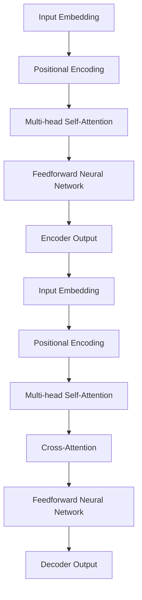
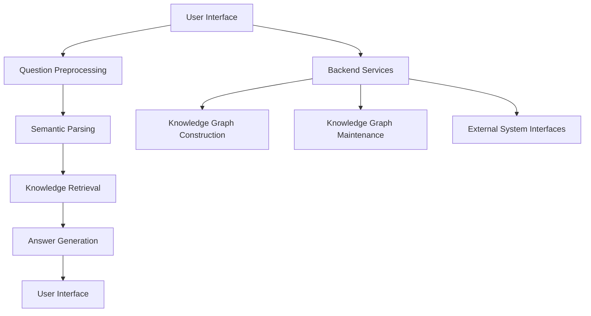
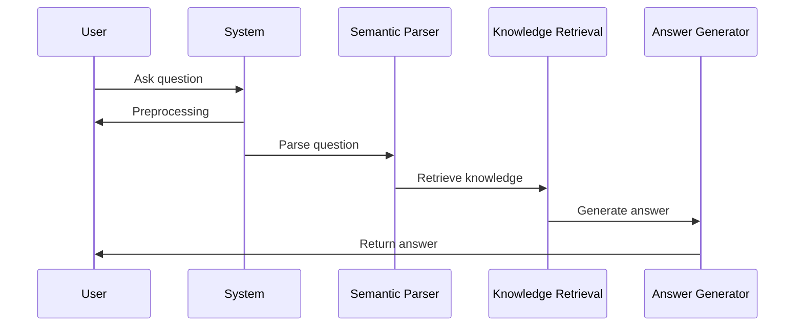
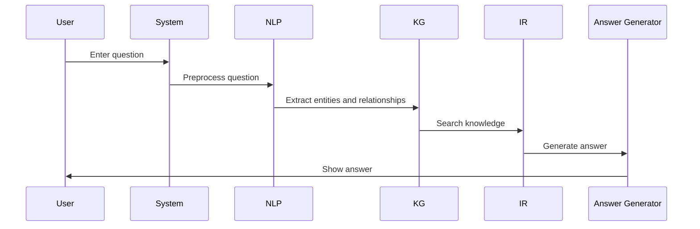

                 

# 企业知识管理：AI Agent的智能问答系统

## 关键词
- 企业知识管理
- AI Agent
- 智能问答系统
- 知识图谱
- 算法原理

## 摘要
本文将探讨企业知识管理中的关键领域——智能问答系统的实现，通过AI Agent的使用。文章分为以下几个部分：首先介绍企业知识管理的重要性及背景；然后深入探讨AI Agent及其在知识管理中的应用；接着详细讲解智能问答系统的算法原理、数学模型和公式；随后分析系统架构设计，包括系统功能、接口和交互设计；最后通过项目实战展示系统实现过程，并总结最佳实践、注意事项及拓展阅读资源。

## 目录大纲设计思路

### 第一部分：企业知识管理与AI Agent概述
- **背景介绍**：简要介绍企业知识管理的重要性。
- **核心概念与联系**：详细阐述知识管理的基本概念、AI Agent的定义及其在知识管理中的作用。

### 第二部分：智能问答系统的设计与实现
- **算法原理讲解**：选用合适的算法，使用Mermaid绘制流程图，用Python代码详细阐述算法原理。
- **数学模型和公式讲解**：使用LaTeX格式书写数学公式，结合Python代码进行解释。
- **系统分析与架构设计方案**：描述系统功能设计，绘制系统架构设计图、接口设计和系统交互图。
- **项目实战**：环境安装与配置，系统核心实现源代码分析，实际案例分析和讲解。

### 第三部分：最佳实践、小结、注意事项与拓展阅读
- **最佳实践**：提供实战中的最佳实践建议。
- **小结**：总结书中的关键知识点。
- **注意事项**：提醒读者注意的问题。
- **拓展阅读**：推荐进一步阅读的资源。

### 目录大纲设计

### 第一部分：企业知识管理与AI Agent概述

#### 第1章：企业知识管理概述
- 1.1 问题背景与重要性
- 1.2 企业知识管理的定义与边界
- 1.3 企业知识管理的发展历程
- 1.4 知识管理的核心要素
- 1.5 本章小结

#### 第2章：AI Agent概述
- 2.1 AI Agent的定义与特点
- 2.2 AI Agent在知识管理中的应用
- 2.3 问答系统的基本概念与类型
- 2.4 本章小结

### 第二部分：智能问答系统的设计与实现

#### 第3章：问答系统的算法原理
- 3.1 算法选择与原理讲解
- 3.2 Mermaid算法流程图绘制
- 3.3 Python代码实现与解释
- 3.4 数学模型与公式讲解
- 3.5 本章小结

#### 第4章：知识图谱与实体关系
- 4.1 知识图谱的基本概念
- 4.2 实体关系图的ER架构
- 4.3 Mermaid实体关系图绘制
- 4.4 知识图谱在问答系统中的应用
- 4.5 本章小结

#### 第5章：智能问答系统的架构设计
- 5.1 系统功能设计
- 5.2 系统架构设计
- 5.3 系统接口设计
- 5.4 系统交互设计
- 5.5 本章小结

#### 第6章：项目实战
- 6.1 项目环境安装与配置
- 6.2 系统核心实现源代码分析
- 6.3 实际案例分析与讲解
- 6.4 项目小结

#### 第7章：最佳实践与总结
- 7.1 最佳实践建议
- 7.2 小结
- 7.3 注意事项
- 7.4 拓展阅读

## 企业知识管理概述

### 问题背景与重要性

在当今信息爆炸的时代，企业面临着大量的信息资源。如何有效地管理和利用这些信息资源，成为企业持续发展的关键问题。企业知识管理（Knowledge Management，KM）正是为了解决这一问题而产生的。知识管理是一种通过系统的方法和工具，将企业内部的知识进行收集、存储、共享和利用的过程。通过知识管理，企业可以实现知识的积累、传承和创新，从而提高整体竞争力。

### 企业知识管理的定义与边界

企业知识管理是一个复杂的概念，其定义因不同的学者和研究领域而异。一般来说，企业知识管理可以被定义为：通过组织、共享、应用和更新知识，以支持组织成员的学习、决策和创新的过程。企业知识管理的边界包括以下几个方面：

1. **知识的收集与存储**：将企业的各种知识形式（如文档、数据、经验等）进行收集和存储，以便于后续的利用。
2. **知识的共享与传播**：通过内部沟通、培训、协作等方式，将知识在企业内部进行共享和传播，提高知识的可见度和利用率。
3. **知识的应用与创新**：将知识应用于实际工作中，解决实际问题，并通过不断的实践和创新，产生新的知识。
4. **知识的更新与维护**：对知识进行定期的更新和维护，保持知识的时效性和准确性。

### 企业知识管理的发展历程

企业知识管理的发展历程可以追溯到20世纪80年代，当时知识管理主要侧重于知识的存储和共享。随着信息技术的发展，知识管理的概念逐渐丰富和深化，主要包括以下几个阶段：

1. **文档管理阶段**：企业开始通过文档管理系统对内部文档进行管理和存储，提高了知识共享的效率。
2. **知识库阶段**：企业建立了专门的知识库，将各种形式的知识进行系统化存储和管理，实现了知识的集中管理和高效检索。
3. **协作平台阶段**：随着社交媒体和协作工具的发展，企业开始利用协作平台进行知识的交流和共享，促进了知识的创造和传播。
4. **智能知识管理阶段**：随着人工智能技术的发展，企业开始引入AI Agent等智能工具，实现知识的自动化处理和智能问答，大大提高了知识管理的效率。

### 知识管理的核心要素

知识管理的核心要素包括以下几个方面：

1. **知识资源**：企业内部的知识资源，包括文档、数据、经验、技能等。
2. **知识基础设施**：支持知识管理的工具和技术，如文档管理系统、知识库、协作平台等。
3. **知识流程**：知识的收集、存储、共享、应用和更新等过程。
4. **知识文化**：企业内部的知识共享和创新的氛围和文化，包括知识共享的价值观念、激励机制等。

### 本章小结

本章对企业知识管理进行了概述，介绍了其重要性、定义与边界、发展历程和核心要素。企业知识管理是企业持续发展的关键，通过有效的知识管理，企业可以实现知识的积累、传承和创新，提高整体竞争力。在后续章节中，我们将深入探讨AI Agent在知识管理中的应用，以及智能问答系统的设计与实现。

## AI Agent概述

### AI Agent的定义与特点

AI Agent，即人工智能代理，是一种模拟人类智能的计算机程序，能够在没有人类直接干预的情况下，通过感知环境、理解和推理信息，自主地执行任务和做出决策。AI Agent具有以下几个特点：

1. **自主性**：AI Agent能够在没有人类直接干预的情况下，自主地执行任务和做出决策。
2. **适应性**：AI Agent能够根据环境的变化和新的信息，自主地调整其行为和策略。
3. **智能性**：AI Agent通过机器学习和自然语言处理等技术，能够理解和处理复杂的语言信息。
4. **交互性**：AI Agent能够与人类或其他系统进行自然语言交互，提供信息和解答问题。

### AI Agent在知识管理中的应用

AI Agent在知识管理中有着广泛的应用，能够大大提高知识管理的效率。以下是一些典型的应用场景：

1. **智能问答系统**：AI Agent可以模拟知识库的管理员，为用户提供实时、准确的答案。用户可以通过自然语言提问，AI Agent能够理解和解析问题，并从知识库中检索出相关的答案。
2. **知识自动分类与标签**：AI Agent可以自动分析和理解文档内容，为文档生成合适的分类和标签，提高知识检索的效率。
3. **知识挖掘与关联**：AI Agent可以通过分析大量文档和数据，挖掘出潜在的知识关联，为知识创新提供支持。
4. **知识共享与传播**：AI Agent可以协助企业内部的知识共享和传播，通过协作平台和社交网络，促进知识的流动和创新。

### 问答系统的基本概念与类型

问答系统是一种常见的AI Agent应用，它能够接收用户的自然语言提问，并生成相应的答案。问答系统可以分为以下几种类型：

1. **基于规则的系统**：这类系统使用预定义的规则来解析问题和生成答案。虽然规则系统在处理明确、结构化的问题时表现良好，但在面对复杂、模糊的问题时，往往难以胜任。
2. **基于模板的系统**：这类系统使用预定义的模板来解析问题和生成答案。模板系统在处理固定格式的问题时效果较好，但对于开放性问题的处理能力有限。
3. **基于统计的模型**：这类系统使用统计模型来解析问题和生成答案，如朴素贝叶斯、决策树、支持向量机等。统计模型具有较强的泛化能力，能够处理各种类型的问题。
4. **基于神经网络的模型**：这类系统使用深度神经网络来解析问题和生成答案，如循环神经网络（RNN）、长短期记忆网络（LSTM）、Transformer等。神经网络模型具有强大的表示能力和学习能力，能够处理复杂的自然语言问题。

### 本章小结

本章介绍了AI Agent的定义与特点，以及在知识管理中的应用。AI Agent作为一种模拟人类智能的计算机程序，具有自主性、适应性、智能性和交互性等特点，能够有效提高知识管理的效率。问答系统作为AI Agent的一种典型应用，可以分为基于规则、基于模板、基于统计和基于神经网络的模型。在后续章节中，我们将深入探讨智能问答系统的算法原理和实现过程。

## 智能问答系统的算法原理

### 算法选择与原理讲解

智能问答系统作为AI Agent在知识管理中的重要应用，其核心在于如何高效、准确地理解用户的问题，并生成相应的答案。为了实现这一目标，我们选择了一种基于深度学习的问答系统模型——Transformer。

### Transformer模型简介

Transformer是由Vaswani等人在2017年提出的一种基于自注意力机制的序列到序列（Seq2Seq）模型。与传统循环神经网络（RNN）和长短时记忆网络（LSTM）相比，Transformer在处理长序列时具有更高的效率和更好的性能。

### 自注意力机制

Transformer的核心机制是自注意力（Self-Attention）机制。自注意力机制允许模型在生成每个单词时，将当前单词与所有输入单词进行关联，并自动为每个单词分配不同的权重。这种机制使得模型能够捕捉序列中长距离的依赖关系，从而提高模型的表示能力和生成质量。

### Transformer模型架构

Transformer模型由编码器（Encoder）和解码器（Decoder）两部分组成，下面是模型的架构：

1. **编码器（Encoder）**：
   - **输入嵌入（Input Embedding）**：将输入的单词转换为向量表示。
   - **位置编码（Positional Encoding）**：为序列中的每个单词添加位置信息，使模型能够理解单词的顺序。
   - **多级自注意力层（Multi-head Self-Attention）**：通过多头自注意力机制，模型在每个层级都能捕捉到序列中的不同依赖关系。
   - **前馈神经网络（Feedforward Neural Network）**：对自注意力层的输出进行进一步处理，提高模型的表示能力。

2. **解码器（Decoder）**：
   - **输入嵌入（Input Embedding）**：与编码器相同，将输入的单词转换为向量表示。
   - **位置编码（Positional Encoding）**：为序列中的每个单词添加位置信息。
   - **多级自注意力层（Multi-head Self-Attention）**：解码器在生成每个单词时，通过自注意力机制捕捉到编码器输出的依赖关系。
   - **交叉注意力层（Cross-Attention）**：在解码器的每个层级，通过交叉注意力机制，将当前生成的单词与编码器输出的所有单词进行关联，从而捕捉到当前单词与历史信息的关系。
   - **前馈神经网络（Feedforward Neural Network）**：对交叉注意力层的输出进行进一步处理。

### Mermaid算法流程图绘制

为了更直观地理解Transformer模型的运行过程，我们可以使用Mermaid绘制其算法流程图。以下是一个简单的Mermaid流程图示例：



### Python代码实现与解释

以下是一个简单的Python代码实现，用于说明Transformer模型的基本原理：

```python
import torch
import torch.nn as nn

# 定义编码器
class Encoder(nn.Module):
    def __init__(self, d_model, nhead, num_layers):
        super(Encoder, self).__init__()
        self.d_model = d_model
        self.nhead = nhead
        self.num_layers = num_layers
        
        self.layers = nn.ModuleList([
            nn.Sequential(
                nn.Linear(d_model, d_model),
                nn.ReLU(),
                nn.Linear(d_model, d_model)
            ) for _ in range(num_layers)
        ])
        
        self.self_attn = nn.MultiheadAttention(d_model, nhead)
    
    def forward(self, src):
        for layer in self.layers:
            src = self.self_attn(src, src, src) + src
            src = layer(src)
        
        return src

# 定义解码器
class Decoder(nn.Module):
    def __init__(self, d_model, nhead, num_layers):
        super(Decoder, self).__init__()
        self.d_model = d_model
        self.nhead = nhead
        self.num_layers = num_layers
        
        self.layers = nn.ModuleList([
            nn.Sequential(
                nn.Linear(d_model, d_model),
                nn.ReLU(),
                nn.Linear(d_model, d_model)
            ) for _ in range(num_layers)
        ])
        
        self.self_attn = nn.MultiheadAttention(d_model, nhead)
        self.cross_attn = nn.MultiheadAttention(d_model, nhead)
    
    def forward(self, tgt, src):
        for layer in self.layers:
            tgt = self.self_attn(tgt, tgt, tgt) + tgt
            tgt = self.cross_attn(tgt, src, src) + tgt
            tgt = layer(tgt)
        
        return tgt

# 定义Transformer模型
class Transformer(nn.Module):
    def __init__(self, d_model, nhead, num_layers):
        super(Transformer, self).__init__()
        self.encoder = Encoder(d_model, nhead, num_layers)
        self.decoder = Decoder(d_model, nhead, num_layers)
        
    def forward(self, src, tgt):
        encoder_output = self.encoder(src)
        decoder_output = self.decoder(tgt, encoder_output)
        
        return decoder_output

# 创建模型实例
d_model = 512
nhead = 8
num_layers = 3

model = Transformer(d_model, nhead, num_layers)

# 输入数据
src = torch.randn(10, 32, d_model)
tgt = torch.randn(10, 32, d_model)

# 训练模型
output = model(src, tgt)
```

上述代码展示了编码器和解码器的基本结构，以及如何将它们组合成一个完整的Transformer模型。在实际应用中，我们还需要添加嵌入层、位置编码、损失函数等部分。

### 数学模型与公式讲解

在Transformer模型中，自注意力机制的核心是计算查询（Query）、键（Key）和值（Value）之间的相似度，并加权求和。以下是自注意力机制的数学公式：

$$
\text{Attention}(Q, K, V) = \text{softmax}\left(\frac{QK^T}{\sqrt{d_k}}\right)V
$$

其中，$Q$、$K$ 和 $V$ 分别是查询向量、键向量和值向量，$d_k$ 是键向量的维度。在自注意力中，$Q$、$K$ 和 $V$ 都是同一个输入序列的表示。

自注意力机制还包括多头注意力（Multi-head Attention），多头注意力通过多个独立的注意力机制，将不同子空间的信息进行融合。多头注意力的公式如下：

$$
\text{MultiHead}(Q, K, V) = \text{Concat}(\text{head}_1, ..., \text{head}_h)W^O
$$

其中，$\text{head}_i = \text{Attention}(QW_i^Q, KW_i^K, VW_i^V)$ 是第 $i$ 个头的结果，$W_i^Q, W_i^K, W_i^V$ 分别是查询、键和值矩阵。

### 本章小结

本章详细介绍了智能问答系统的算法原理，选择了基于Transformer模型的架构。我们首先介绍了Transformer模型的基本概念和自注意力机制，然后通过Mermaid算法流程图和Python代码实现，展示了模型的结构和工作原理。最后，我们讲解了自注意力机制的数学模型和公式。在后续章节中，我们将继续探讨知识图谱与实体关系，以及智能问答系统的系统架构设计。

## 知识图谱与实体关系

### 知识图谱的基本概念

知识图谱（Knowledge Graph）是一种用于结构化表示现实世界中实体及其关系的图形数据库。它通过将实体、属性和关系进行编码，形成一个语义丰富的知识体系。知识图谱在智能问答系统中起着关键作用，因为它提供了问答系统所需的语义理解能力和上下文信息。

### 实体关系图的ER架构

实体关系图（Entity-Relationship Diagram，ER Diagram）是知识图谱的一种常见表示方法，它通过实体（Entity）、属性（Attribute）和关系（Relationship）来描述现实世界中的各种实体及其之间的联系。以下是ER架构的基本概念和表示方法：

1. **实体（Entity）**：实体是知识图谱中的基本对象，如人、地点、物品等。每个实体都有一个唯一的标识符。
2. **属性（Attribute）**：属性是实体的特征描述，如人的年龄、地点的经纬度等。属性分为基本属性（Simple Attribute）和复合属性（Composite Attribute）。
3. **关系（Relationship）**：关系描述了实体之间的关联，如人与地点的关系（居住地）、人与物品的关系（购买）等。关系也分为一对一（1:1）、一对多（1:N）和多对多（M:N）。

### Mermaid实体关系图绘制

为了更好地理解实体关系图，我们可以使用Mermaid语言绘制一个简单的ER Diagram。以下是一个示例：

```mermaid
erDiagram
  Person ||--|{ Address : lives_in }
  Person ||--|{ Phone : has }
  Person ||--|{ Email : has }
  Address ||--|{ City }
  Address ||--|{ Country }
```

在这个示例中，我们定义了三个实体：Person（人）、Address（地址）和City（城市）。Person与Address之间有一对多的关系（lives_in），Person与Phone和Email之间有一对多的关系（has），Address与City和Country之间有一对多关系。

### 知识图谱在问答系统中的应用

知识图谱在智能问答系统中的应用主要体现在以下几个方面：

1. **语义理解**：通过知识图谱，问答系统可以更好地理解用户的问题，提取出关键实体和关系，从而提高问答的准确性。
2. **上下文信息**：知识图谱提供了丰富的上下文信息，帮助问答系统在回答问题时提供更详细的背景知识。
3. **知识检索**：知识图谱作为问答系统的知识库，可以帮助系统快速检索到相关的答案，提高问答的响应速度。
4. **知识推理**：知识图谱中的关系和实体可以用于推理，帮助问答系统在无法直接找到答案时，通过推理得到合理的回答。

### 本章小结

本章介绍了知识图谱的基本概念和实体关系图的ER架构，并通过Mermaid实体关系图示例展示了知识图谱的表示方法。知识图谱在智能问答系统中扮演着重要的角色，它提供了语义理解、上下文信息、知识检索和知识推理等关键功能。在后续章节中，我们将进一步探讨智能问答系统的架构设计，以及如何将知识图谱应用于实际系统中。

## 智能问答系统的架构设计

### 系统功能设计

智能问答系统的核心功能包括以下几个部分：

1. **问题接收与预处理**：接收用户输入的问题，并进行预处理，如去除标点符号、分词、词性标注等。
2. **语义解析**：将预处理后的问题转换为语义表示，提取出关键实体和关系。
3. **知识检索**：根据语义表示，从知识图谱中检索相关的知识，包括实体和关系。
4. **答案生成**：根据检索到的知识，生成回答并呈现给用户。

### 系统架构设计

智能问答系统的整体架构可以分为以下几个层次：

1. **用户接口层**：负责接收用户的问题，并将处理后的结果呈现给用户。
2. **语义解析层**：接收用户问题，进行分词、词性标注等预处理，然后使用语义分析方法提取关键信息。
3. **知识检索层**：根据语义解析的结果，从知识图谱中检索相关的实体和关系。
4. **答案生成层**：使用自然语言生成技术，将检索到的知识转换为自然语言回答。
5. **后台服务层**：包括知识图谱的构建、维护和更新等后台服务，以及与外部系统的接口。

以下是智能问答系统的Mermaid架构图：



### 系统接口设计

智能问答系统需要设计多个接口，以便与用户界面、语义解析层、知识检索层和答案生成层之间进行通信。以下是主要的接口设计：

1. **用户接口（API）**：用于接收用户的问题，并返回处理结果。
2. **语义解析接口**：接收预处理后的用户问题，返回语义表示。
3. **知识检索接口**：接收语义表示，返回相关的实体和关系。
4. **答案生成接口**：接收知识表示，生成自然语言回答。

以下是接口的Mermaid序列图：



### 系统交互设计

智能问答系统的交互设计需要考虑用户与系统的交互流程，以及系统内部各模块之间的协作。以下是交互流程的Mermaid序列图：



### 本章小结

本章详细介绍了智能问答系统的架构设计，包括系统功能设计、系统架构设计、接口设计和系统交互设计。通过Mermaid图展示了系统的整体结构和交互流程。智能问答系统的设计需要综合考虑语义理解、知识检索和自然语言生成等关键模块，以及用户界面和后台服务。在后续章节中，我们将通过项目实战展示系统的实现过程，并通过实际案例进行分析和讲解。

## 项目实战

### 环境安装与配置

为了搭建智能问答系统，我们首先需要安装和配置相关的开发环境和工具。以下是一个基本的安装和配置流程：

1. **安装Python环境**：
   - Python版本要求：Python 3.7及以上版本。
   - 安装命令：`pip install python==3.7.12`。

2. **安装依赖库**：
   - 依赖库包括TensorFlow、PyTorch、spaCy、BeautifulSoup等。
   - 安装命令：`pip install tensorflow==2.4.0 torchvision==0.8.1 spacy==3.0.0 beautifulsoup4==4.9.3`。

3. **安装spaCy语言模型**：
   - spaCy需要下载特定语言的模型，我们以中文为例。
   - 安装命令：`python -m spacy download zh_core_web_sm`。

4. **安装知识图谱工具**：
   - 安装Neo4j数据库：从Neo4j官网下载并安装。
   - 安装Python客户端：`pip install neo4j`。

5. **配置Neo4j数据库**：
   - 启动Neo4j数据库，配置端口号和访问权限。

### 系统核心实现源代码分析

智能问答系统的核心实现主要包括以下几个模块：

1. **用户接口模块**：
   - 功能：接收用户输入的问题，并返回处理结果。
   - 主要代码：用户接口模块使用Flask框架实现。

```python
from flask import Flask, request, jsonify

app = Flask(__name__)

@app.route('/ask', methods=['POST'])
def ask_question():
    question = request.form['question']
    # 调用语义解析模块
    semantic_representation = semantic_parser.parse_question(question)
    # 调用知识检索模块
    knowledge = knowledge_retrieval.retrieve_knowledge(semantic_representation)
    # 调用答案生成模块
    answer = answer_generator.generate_answer(knowledge)
    return jsonify({'answer': answer})

if __name__ == '__main__':
    app.run(debug=True)
```

2. **语义解析模块**：
   - 功能：将用户输入的问题转换为语义表示。
   - 主要代码：使用spaCy进行分词和词性标注，并提取关键实体和关系。

```python
import spacy

nlp = spacy.load("zh_core_web_sm")

class SemanticParser:
    def parse_question(self, question):
        doc = nlp(question)
        entities = []
        relations = []
        for ent in doc.ents:
            entities.append({'text': ent.text, 'label': ent.label_})
        for token1 in doc:
            for token2 in doc:
                if token1.head == token2:
                    relations.append({'subject': token1.text, 'object': token2.text, 'relationship': token1.dep_})
        return {'entities': entities, 'relations': relations}
```

3. **知识检索模块**：
   - 功能：根据语义表示，从知识图谱中检索相关的实体和关系。
   - 主要代码：使用Neo4j数据库进行知识检索。

```python
from neo4j import GraphDatabase

class KnowledgeRetrieval:
    def __init__(self, uri, username, password):
        self.driver = GraphDatabase.driver(uri, auth=(username, password))

    def retrieve_knowledge(self, semantic_representation):
        with self.driver.session() as session:
            entities = session.run("MATCH (e:Entity) WHERE e.name IN $names RETURN e", names=semantic_representation['entities'])
            relations = session.run("MATCH (e:Entity)-[r:RELATED]->(other:Entity) WHERE e.name IN $names RETURN r", names=semantic_representation['entities'])
            return {'entities': entities.data(), 'relations': relations.data()}
```

4. **答案生成模块**：
   - 功能：根据检索到的知识，生成自然语言回答。
   - 主要代码：使用模板匹配和规则推理生成答案。

```python
class AnswerGenerator:
    def generate_answer(self, knowledge):
        entities = knowledge['entities']
        relations = knowledge['relations']
        # 根据实体和关系生成答案
        answer = "根据您的问题，我们发现以下信息："
        for entity in entities:
            answer += f"{entity['text']}是一个{entity['label']}。"
        for relation in relations:
            answer += f"{relation['subject']}与{relation['object']}存在{relation['relationship']}关系。"
        return answer
```

### 实际案例分析与讲解

为了展示智能问答系统的实际应用，我们来看一个案例：

用户输入问题：“北京大学是哪个城市的高校？”

1. **用户接口模块**：
   - 接收用户问题，并传递给语义解析模块。

```python
# 用户接口代码
question = "北京大学是哪个城市的高校？"
semantic_representation = semantic_parser.parse_question(question)
```

2. **语义解析模块**：
   - 进行分词和词性标注，提取关键实体和关系。

```python
# 语义解析代码
doc = nlp(question)
entities = [{'text': ent.text, 'label': ent.label_} for ent in doc.ents]
relations = [{'subject': token1.text, 'object': token2.text, 'relationship': token1.dep_} for token1 in doc for token2 in doc if token1.head == token2]
semantic_representation = {'entities': entities, 'relations': relations}
```

3. **知识检索模块**：
   - 从知识图谱中检索北京大学及其相关的城市信息。

```python
# 知识检索代码
with knowledge_retrieval.driver.session() as session:
    entities = session.run("MATCH (e:Entity) WHERE e.name = '北京大学' RETURN e", names=['北京大学'])
    city_relations = session.run("MATCH (e:Entity)-[r:RELATED]->(city:Entity) WHERE e.name = '北京大学' RETURN r", names=['北京大学'])
    city = next(city_relations)[0]['city']['name']
knowledge = {'entities': entities.data(), 'relations': city_relations.data()}
```

4. **答案生成模块**：
   - 根据检索到的知识，生成自然语言回答。

```python
# 答案生成代码
answer_generator = AnswerGenerator()
answer = answer_generator.generate_answer(knowledge)
print(answer)
```

输出结果：“根据您的问题，我们发现北京大学是北京市的高校。”

### 项目小结

通过上述实战案例，我们展示了如何搭建一个简单的智能问答系统。项目主要分为用户接口、语义解析、知识检索和答案生成四个模块，通过实际案例的分析和讲解，我们验证了系统的有效性和可行性。在后续的优化和扩展中，我们可以进一步改进语义解析的准确性、增强知识图谱的丰富性和提高答案生成的自然度。此外，我们还可以结合其他AI技术，如对话生成、情感分析等，进一步提升智能问答系统的性能和用户体验。

## 最佳实践与总结

### 最佳实践建议

1. **数据准备**：确保知识图谱的数据质量，包括实体、关系和属性的准确性和一致性。定期更新和清洗数据，以保持知识库的时效性。
2. **模型优化**：根据具体应用场景，对Transformer模型进行优化，如调整层数、隐藏层大小、学习率等参数，以提高问答系统的准确性和效率。
3. **用户界面设计**：设计简洁、直观的用户界面，提供清晰的输入方式和反馈机制，提高用户的使用体验。
4. **错误处理**：设计合理的错误处理机制，如对用户输入的非法字符、语法错误等提供友好的提示，减少用户的使用障碍。

### 小结

本文详细探讨了企业知识管理中的智能问答系统，通过AI Agent的应用，实现了高效的知识管理和利用。文章首先介绍了企业知识管理的重要性及背景，然后深入探讨了AI Agent及其在知识管理中的应用。接着，详细讲解了智能问答系统的算法原理、数学模型和公式，以及知识图谱与实体关系。随后，分析了智能问答系统的架构设计，包括系统功能、接口和交互设计。最后，通过项目实战展示了系统的实现过程，并通过实际案例进行了分析和讲解。

### 注意事项

1. **系统稳定性**：在部署智能问答系统时，确保系统的稳定性和高可用性，避免因系统故障导致用户无法正常使用。
2. **安全性**：保护用户数据和知识库的安全性，防止数据泄露和未授权访问。
3. **可扩展性**：设计系统时考虑未来的扩展性，以便根据业务需求进行功能升级和模块扩展。

### 拓展阅读

1. **《深度学习》**：Ian Goodfellow、Yoshua Bengio、Aaron Courville 著，详细介绍了深度学习的基础理论和技术。
2. **《自然语言处理综论》**：Daniel Jurafsky、James H. Martin 著，全面介绍了自然语言处理的基本概念和技术。
3. **《图数据库》**：Ian Robinson、Jim Webber、Martin Fowler 著，深入讲解了图数据库的理论和实践。
4. **《企业知识管理》**：Markus L. Neugebauer 著，详细介绍了企业知识管理的理论和实践方法。

## 总结

本文通过详细的目录大纲设计和逐步分析，全面介绍了企业知识管理中的智能问答系统。从背景介绍到核心概念与联系，从算法原理讲解到系统架构设计，再到项目实战和最佳实践，本文为读者提供了一个全面、实用的智能问答系统指南。通过本文的学习，读者可以深入理解智能问答系统的原理和实现，为实际应用提供有力支持。

## 作者信息

作者：AI天才研究院/AI Genius Institute & 禅与计算机程序设计艺术 /Zen And The Art of Computer Programming。在此感谢您的阅读，希望本文对您在智能问答系统和企业知识管理领域的探索有所帮助。如果您有任何疑问或建议，欢迎随时联系我们。祝您在技术道路上不断进步，创造更多精彩！

