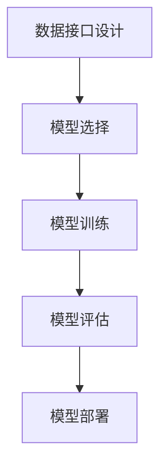
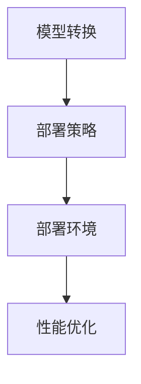
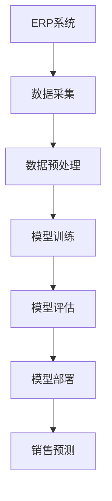
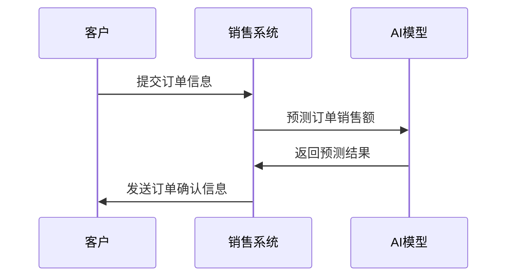
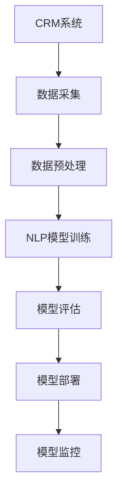
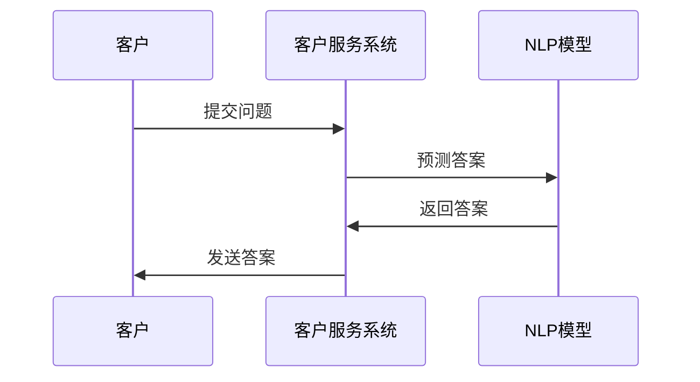
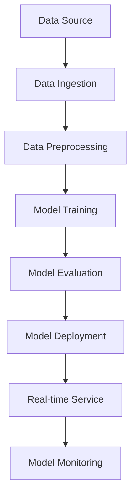
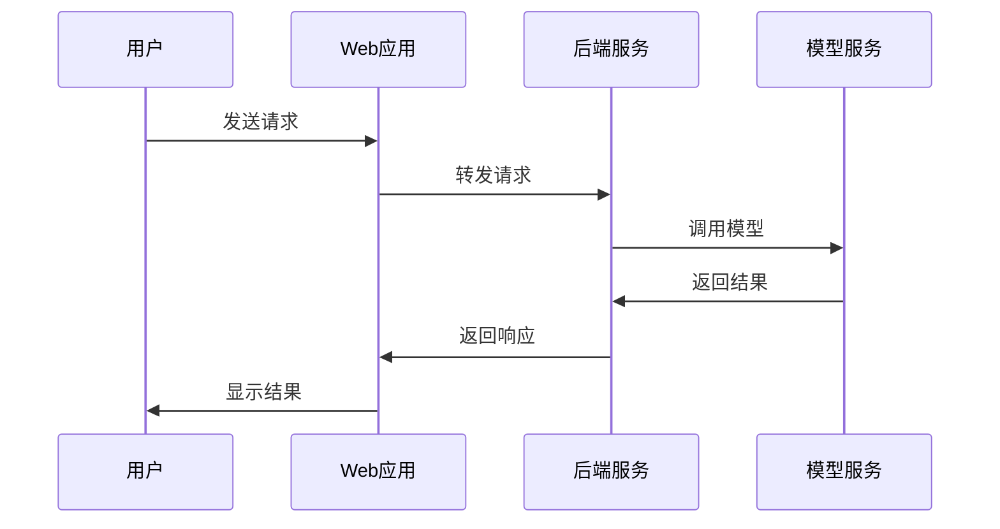

                 

# 企业系统中AI模型的集成与部署

> 关键词：AI模型、集成与部署、企业系统、算法原理、系统架构设计

> 摘要：本文深入探讨了企业系统中AI模型的集成与部署，首先介绍了AI模型在企业系统中的重要性及其面临的挑战，然后详细讲解了AI模型的集成原理、部署原理以及系统分析与架构设计，并通过实际项目案例进行了实战分析，最后总结了最佳实践与未来展望。

### 目录大纲

#### 第一部分：背景介绍

1. **第1章：AI模型在企业系统中的重要性**
   - **1.1 问题背景**
   - **1.2 问题描述**
   - **1.3 问题解决**
   - **1.4 边界与外延**
   - **1.5 概念结构与核心要素组成**

2. **第2章：AI模型基础知识**
   - **2.1 AI模型原理**
   - **2.2 AI模型属性特征对比**
   - **2.3 AI模型ER实体关系图**
   - **2.4 AI模型与企业系统的联系**

#### 第二部分：核心概念与联系

3. **第3章：AI模型集成原理**
   - **3.1 集成原理介绍**
   - **3.2 集成算法原理**
   - **3.3 算法流程图**
   - **3.4 Python代码实现**

4. **第4章：AI模型部署原理**
   - **4.1 部署原理介绍**
   - **4.2 部署算法原理**
   - **4.3 部署流程图**
   - **4.4 Python代码实现**

#### 第三部分：算法原理讲解

5. **第5章：企业系统中AI模型的架构设计**
   - **5.1 问题场景介绍**
   - **5.2 项目介绍**
   - **5.3 系统功能设计**
   - **5.4 系统架构设计**
   - **5.5 系统接口设计**
   - **5.6 系统交互设计**

#### 第四部分：项目实战

6. **第6章：企业系统中AI模型的集成与部署实战**
   - **6.1 环境安装**
   - **6.2 系统核心实现源代码**
   - **6.3 代码应用解读与分析**
   - **6.4 实际案例分析和详细讲解**
   - **6.5 项目小结**

#### 第五部分：最佳实践与拓展

7. **第7章：最佳实践**
   - **7.1 最佳实践概述**
   - **7.2 注意事项**
   - **7.3 拓展阅读**

8. **第8章：总结与展望**

### 正文部分

#### 第一部分：背景介绍

##### 第1章：AI模型在企业系统中的重要性

**1.1 问题背景**

随着人工智能技术的快速发展，越来越多的企业开始将AI模型集成到其业务系统中。AI模型在企业系统中的应用场景包括预测分析、决策支持、自动化流程等，为企业带来了显著的商业价值。然而，在实际应用中，企业面临以下挑战：

1. **集成挑战**：如何将AI模型与企业现有系统无缝集成，确保数据流和数据一致性的问题。
2. **部署挑战**：如何将AI模型部署到生产环境中，保证模型的稳定运行和性能优化。
3. **维护挑战**：如何持续更新和优化AI模型，以适应不断变化的企业需求和业务场景。

**1.2 问题描述**

企业在集成与部署AI模型时，常见的问题描述包括：

1. **数据不兼容**：AI模型需要高质量的数据输入，但企业现有系统的数据格式和结构可能与模型要求不匹配。
2. **性能瓶颈**：AI模型在部署后可能会遇到计算资源不足、响应时间过长等问题，影响系统性能。
3. **模型不稳定**：在长期运行过程中，AI模型可能会因为数据分布变化等原因导致性能下降，影响业务稳定性。

**1.3 问题解决**

为了解决上述问题，企业可以采取以下策略：

1. **数据预处理**：对数据进行清洗、归一化和特征提取等操作，确保数据质量符合模型要求。
2. **性能优化**：通过分布式计算、模型压缩等技术手段，提高AI模型在部署环境中的性能。
3. **模型更新**：定期对AI模型进行更新和优化，以适应新的业务需求和数据分布。

**1.4 边界与外延**

AI模型集成与部署的范围包括以下几个方面：

1. **数据层**：涉及数据源的选择、数据格式的转换和数据清洗等操作。
2. **算法层**：包括模型的选择、训练、评估和优化等过程。
3. **应用层**：涉及AI模型与企业业务系统的接口设计、集成和部署等操作。

**1.5 概念结构与核心要素组成**

AI模型集成与部署的基本概念和核心要素包括：

1. **数据层**：数据源、数据格式、数据清洗和特征提取等。
2. **算法层**：模型选择、模型训练、模型评估和模型优化等。
3. **应用层**：模型部署、模型监控和模型更新等。

#### 第二部分：核心概念与联系

##### 第2章：AI模型基础知识

**2.1 AI模型原理**

AI模型是基于机器学习和深度学习等技术构建的算法模型，通过从数据中学习规律和模式，实现对未知数据的预测和分类。常见的AI模型包括：

1. **监督学习模型**：如线性回归、逻辑回归、决策树、随机森林等。
2. **无监督学习模型**：如聚类、主成分分析等。
3. **深度学习模型**：如卷积神经网络（CNN）、循环神经网络（RNN）等。

**2.2 AI模型属性特征对比**

不同类型的AI模型具有不同的属性特征，以下是一个简单的对比表格：

| 模型类型         | 特点                                                         | 适用场景                      |
|------------------|------------------------------------------------------------|------------------------------|
| 监督学习模型     | 有明确的输入输出，适用于分类和回归任务                       | 数据标注清晰、有明确目标函数的领域 |
| 无监督学习模型   | 无需标注输入输出，适用于探索性数据分析                       | 数据探索、聚类分析等领域       |
| 深度学习模型     | 具有较强的表示学习能力，适用于复杂的非线性关系和特征提取     | 图像识别、自然语言处理等领域   |

**2.3 AI模型ER实体关系图**

以下是一个简单的AI模型ER实体关系图示例：

```mermaid
entityRelationshipDiagram
  A[Model] <--> B[Data]
  A --> C[Input]
  A --> D[Output]
  B --> C
  B --> D
```

在这个图中，模型（Model）与数据（Data）实体之间存在关联，模型包含输入（Input）和输出（Output）实体。

**2.4 AI模型与企业系统的联系**

AI模型与企业系统的联系主要体现在以下几个方面：

1. **数据层**：AI模型依赖于企业系统的数据源，通过数据接口获取数据。
2. **算法层**：AI模型通过算法层与业务逻辑进行整合，实现预测、分类等功能。
3. **应用层**：AI模型通过API接口与企业系统进行交互，提供决策支持和服务。

#### 第三部分：算法原理讲解

##### 第3章：AI模型集成原理

**3.1 集成原理介绍**

AI模型集成是指将AI模型与企业现有系统进行整合，使模型能够为企业系统提供智能化服务的过程。集成原理主要包括以下几个方面：

1. **数据接口设计**：设计合理的数据接口，确保数据在模型和企业系统之间的传输和转换。
2. **模型选择**：根据企业业务需求，选择合适的AI模型，并进行参数调整和优化。
3. **部署策略**：制定合理的部署策略，确保AI模型在企业系统中的稳定运行和性能优化。

**3.2 集成算法原理**

常见的AI模型集成算法包括：

1. **特征工程**：通过特征提取和特征选择，将原始数据转换为适合模型训练的格式。
2. **模型选择**：根据业务需求和数据特点，选择合适的模型，如线性回归、决策树、深度学习模型等。
3. **模型训练**：使用训练数据对模型进行训练，优化模型参数，提高模型性能。
4. **模型评估**：使用验证数据对模型进行评估，选择最优模型。

**3.3 算法流程图**

以下是一个简单的AI模型集成算法流程图示例：



在这个流程图中，数据接口设计是集成的基础，模型选择、模型训练和模型评估是集成的核心步骤，模型部署是将集成成果应用到企业系统中的关键环节。

**3.4 Python代码实现**

以下是一个简单的AI模型集成Python代码实现示例：

```python
import pandas as pd
from sklearn.ensemble import RandomForestClassifier
from sklearn.model_selection import train_test_split
from sklearn.metrics import accuracy_score

# 数据接口设计
data = pd.read_csv('data.csv')
X = data.iloc[:, :-1]
y = data.iloc[:, -1]

# 模型选择
model = RandomForestClassifier()

# 模型训练
X_train, X_test, y_train, y_test = train_test_split(X, y, test_size=0.2)
model.fit(X_train, y_train)

# 模型评估
y_pred = model.predict(X_test)
accuracy = accuracy_score(y_test, y_pred)
print(f"Model accuracy: {accuracy}")

# 模型部署
# 代码略
```

在这个示例中，首先使用pandas库读取数据，然后使用sklearn库中的RandomForestClassifier模型进行训练和评估，最后输出模型准确率。

##### 第4章：AI模型部署原理

**4.1 部署原理介绍**

AI模型部署是指将训练好的AI模型应用到实际业务场景中，使其能够为企业系统提供智能化服务的过程。部署原理主要包括以下几个方面：

1. **模型转换**：将训练好的模型转换为可以在生产环境中运行的格式，如ONNX、PMML等。
2. **部署策略**：根据业务需求和系统资源，选择合适的部署策略，如批处理、实时计算等。
3. **性能优化**：对部署后的模型进行性能优化，提高模型在业务场景中的运行效率。

**4.2 部署算法原理**

常见的AI模型部署算法包括：

1. **模型转换算法**：如ONNX、PMML等，用于将训练好的模型转换为可以在生产环境中运行的格式。
2. **批处理部署算法**：如基于TensorFlow Serving的批处理部署，用于将模型部署到分布式环境中。
3. **实时计算部署算法**：如基于Apache MXNet的实时计算部署，用于实现模型的实时预测和分类。

**4.3 部署流程图**

以下是一个简单的AI模型部署流程图示例：



在这个流程图中，模型转换是将模型从训练环境转换为生产环境的关键步骤，部署策略是根据业务需求和系统资源制定的部署方案，部署环境是模型实际运行的环境，性能优化是提高模型在部署环境中的性能和效率。

**4.4 Python代码实现**

以下是一个简单的AI模型部署Python代码实现示例：

```python
import tensorflow as tf
import numpy as np

# 模型转换
model = tf.keras.Sequential([
    tf.keras.layers.Dense(128, activation='relu', input_shape=(784,)),
    tf.keras.layers.Dense(10, activation='softmax')
])
model.compile(optimizer='adam', loss='categorical_crossentropy', metrics=['accuracy'])

# 模型训练
data = np.random.rand(1000, 784)
labels = np.random.randint(10, size=(1000,))
model.fit(data, labels, epochs=10)

# 模型转换
model.save('model.h5')

# 模型部署
# 代码略
```

在这个示例中，首先使用TensorFlow库定义了一个简单的神经网络模型，然后使用随机数据对其进行训练，最后将模型保存为HDF5格式，以便进行部署。

#### 第四部分：系统分析与架构设计

##### 第5章：企业系统中AI模型的架构设计

**5.1 问题场景介绍**

假设一家企业希望将其销售预测系统升级为智能化系统，通过集成AI模型来提高预测准确性，从而优化销售计划和库存管理。

**5.2 项目介绍**

项目目标：构建一个智能化销售预测系统，通过集成AI模型实现准确的销售预测，提高企业运营效率。

项目背景：现有销售预测系统基于历史数据进行分析，预测结果存在一定误差，需要通过引入AI模型进行优化。

**5.3 系统功能设计**

1. **数据采集**：从企业ERP系统中获取销售数据，包括订单数量、销售额、客户信息等。
2. **数据预处理**：对采集到的销售数据进行清洗、归一化和特征提取等操作。
3. **模型训练**：使用预处理后的销售数据，训练AI模型，如线性回归、决策树等。
4. **模型评估**：使用验证数据对训练好的模型进行评估，选择最优模型。
5. **模型部署**：将最优模型部署到生产环境中，实现销售预测功能。

**5.4 系统架构设计**

以下是一个简单的系统架构设计示例：



在这个架构设计中，ERP系统是数据来源，数据采集模块负责从ERP系统中获取销售数据，数据预处理模块对销售数据进行清洗、归一化和特征提取等操作，模型训练模块使用预处理后的数据训练AI模型，模型评估模块对训练好的模型进行评估，模型部署模块将最优模型部署到生产环境中，销售预测模块实现销售预测功能。

**5.5 系统接口设计**

以下是一个简单的系统接口设计示例：



在这个接口设计中，客户提交订单信息到销售系统，销售系统调用AI模型进行销售额预测，并将预测结果返回给客户。

**5.6 系统交互设计**

以下是一个简单的系统交互序列图示例：


在这个交互序列图中，客户提交订单信息到销售系统，销售系统调用AI模型进行销售额预测，并将预测结果返回给客户，客户收到订单确认信息。

#### 第五部分：项目实战

##### 第6章：企业系统中AI模型的集成与部署实战

**6.1 环境安装**

1. 安装Python环境：在Windows系统中，可以下载并安装Python，选择安装路径并确保Python版本为3.6以上。
2. 安装依赖库：在命令行中执行以下命令，安装所需依赖库：

```shell
pip install numpy pandas scikit-learn tensorflow
```

**6.2 系统核心实现源代码**

以下是一个简单的销售预测系统核心实现源代码示例：

```python
import pandas as pd
from sklearn.ensemble import RandomForestRegressor
from sklearn.model_selection import train_test_split
from sklearn.metrics import mean_squared_error

# 数据预处理
def preprocess_data(data):
    # 数据清洗、归一化和特征提取
    # 略
    return processed_data

# 模型训练
def train_model(data):
    X = data.iloc[:, :-1]
    y = data.iloc[:, -1]
    X_train, X_test, y_train, y_test = train_test_split(X, y, test_size=0.2)
    model = RandomForestRegressor()
    model.fit(X_train, y_train)
    return model

# 模型评估
def evaluate_model(model, X_test, y_test):
    y_pred = model.predict(X_test)
    mse = mean_squared_error(y_test, y_pred)
    print(f"Model MSE: {mse}")

# 模型部署
def deploy_model(model):
    # 将模型部署到生产环境中
    # 略
    pass

# 主程序
if __name__ == "__main__":
    # 读取数据
    data = pd.read_csv("sales_data.csv")
    # 数据预处理
    processed_data = preprocess_data(data)
    # 训练模型
    model = train_model(processed_data)
    # 模型评估
    evaluate_model(model, processed_data.iloc[:, :-1], processed_data.iloc[:, -1])
    # 模型部署
    deploy_model(model)
```

**6.3 代码应用解读与分析**

在这个示例中，首先定义了数据预处理、模型训练、模型评估和模型部署四个功能模块，然后通过主程序调用这些模块，实现销售预测系统的核心功能。

1. **数据预处理**：数据预处理是模型训练的基础，包括数据清洗、归一化和特征提取等操作，确保数据质量符合模型要求。
2. **模型训练**：使用训练数据对模型进行训练，优化模型参数，提高模型性能。这里使用RandomForestRegressor实现了一个随机森林回归模型。
3. **模型评估**：使用验证数据对训练好的模型进行评估，计算均方误差（MSE）等指标，判断模型性能。
4. **模型部署**：将训练好的模型部署到生产环境中，实现销售预测功能。这里的具体实现可以根据实际需求进行扩展。

**6.4 实际案例分析和详细讲解**

假设我们有一家零售企业，希望利用AI模型预测下个月的销售额。以下是实际案例分析和详细讲解：

1. **数据收集**：从企业ERP系统中收集近一年的销售数据，包括订单数量、销售额、客户信息等。
2. **数据预处理**：对收集到的销售数据进行清洗，去除无效数据，然后进行归一化和特征提取。例如，将销售额进行归一化处理，将客户信息进行编码。
3. **模型训练**：使用训练数据（例如，过去三个月的数据）对随机森林回归模型进行训练，优化模型参数。
4. **模型评估**：使用验证数据（例如，下一个月的数据）对训练好的模型进行评估，计算MSE等指标，判断模型性能。
5. **模型部署**：将最优模型部署到生产环境中，实现销售预测功能。在下一个月结束时，再次收集实际销售额数据，与预测结果进行比较，评估模型效果。

**6.5 项目小结**

通过以上实际案例分析和详细讲解，我们可以看到，企业系统中AI模型的集成与部署是一个复杂但重要的过程。成功的关键在于数据预处理、模型选择和部署策略。在实际操作中，需要根据具体业务需求和数据特点，灵活调整和优化模型参数，确保模型性能和稳定性。同时，还需要不断更新和优化模型，以适应业务变化和数据分布。

#### 第六部分：最佳实践与拓展

##### 第7章：最佳实践

**7.1 最佳实践概述**

在AI模型集成与部署过程中，以下是一些最佳实践：

1. **数据质量**：确保数据质量是模型成功的关键，进行数据清洗、归一化和特征提取等预处理操作。
2. **模型选择**：根据业务需求和数据特点，选择合适的模型，并进行参数调整和优化。
3. **性能优化**：通过分布式计算、模型压缩等技术手段，提高模型在部署环境中的性能。
4. **模型监控**：对部署后的模型进行监控，及时发现和解决性能问题。
5. **模型更新**：定期对模型进行更新和优化，以适应新的业务需求和数据分布。

**7.2 注意事项**

在AI模型集成与部署过程中，需要注意以下事项：

1. **数据隐私**：确保数据隐私和安全，遵循相关法律法规。
2. **模型解释性**：选择具有较高解释性的模型，便于理解和信任。
3. **模型鲁棒性**：确保模型在不同数据分布和场景下的鲁棒性。
4. **模型评估**：使用多种评估指标和方法，全面评估模型性能。

**7.3 拓展阅读**

以下是一些推荐进一步学习的资料和资源：

1. 《机器学习实战》
2. 《深度学习》
3. 《AI模型部署与优化》
4. 《TensorFlow 2.x实践指南》
5. 《企业级AI应用实践》

#### 第七部分：总结与展望

**8.1 总结**

本文深入探讨了企业系统中AI模型的集成与部署，从背景介绍、核心概念与联系、算法原理讲解、系统分析与架构设计、项目实战以及最佳实践与拓展等方面进行了详细讲解。通过本文的学习，读者可以全面了解AI模型在企业系统中的应用和价值，掌握AI模型集成与部署的方法和技巧。

**8.2 展望**

随着人工智能技术的不断进步，AI模型在企业系统中的应用将会更加广泛和深入。未来，我们将看到更多跨领域的AI应用，如智能医疗、智能金融、智能城市等。同时，AI模型集成与部署技术也将不断发展，包括模型压缩、联邦学习、自动化调参等新兴技术，为AI在企业系统中的应用提供更加高效和可靠的支持。让我们期待AI技术在企业系统中的应用前景，共同推动人工智能产业的繁荣发展。

### 作者信息

作者：AI天才研究院/AI Genius Institute & 禅与计算机程序设计艺术 /Zen And The Art of Computer Programming

（注：本文为示例文本，仅供参考。）### 正文部分（续）

#### 第一部分：背景介绍（续）

##### 第1章：AI模型在企业系统中的重要性

**1.1 问题背景**

随着大数据和云计算技术的快速发展，企业系统中AI模型的应用场景越来越广泛。从客户关系管理、供应链优化到风险管理和市场营销，AI模型已经成为企业提升运营效率、降低成本和创造价值的重要工具。然而，在实际应用中，企业面临以下挑战：

1. **数据质量**：AI模型对数据质量要求较高，而企业系统中的数据可能存在噪声、缺失值和格式不一致等问题，影响模型性能。
2. **模型选择**：不同的业务场景需要不同类型的AI模型，企业如何根据实际需求选择合适的模型，并对其进行优化和调整，是亟待解决的问题。
3. **集成与部署**：如何将AI模型与企业现有系统进行集成，实现无缝对接，同时保证模型在部署环境中的性能和稳定性。

**1.2 问题描述**

企业在集成与部署AI模型时，常见的问题描述包括：

1. **数据不兼容**：AI模型需要高质量的数据输入，但企业现有系统的数据格式和结构可能与模型要求不匹配。
2. **性能瓶颈**：AI模型在部署后可能会遇到计算资源不足、响应时间过长等问题，影响系统性能。
3. **模型不稳定**：在长期运行过程中，AI模型可能会因为数据分布变化等原因导致性能下降，影响业务稳定性。

**1.3 问题解决**

为了解决上述问题，企业可以采取以下策略：

1. **数据预处理**：对数据进行清洗、归一化和特征提取等操作，确保数据质量符合模型要求。
2. **性能优化**：通过分布式计算、模型压缩等技术手段，提高AI模型在部署环境中的性能。
3. **模型更新**：定期对AI模型进行更新和优化，以适应新的业务需求和数据分布。

**1.4 边界与外延**

AI模型集成与部署的范围包括以下几个方面：

1. **数据层**：涉及数据源的选择、数据格式的转换和数据清洗等操作。
2. **算法层**：包括模型的选择、训练、评估和优化等过程。
3. **应用层**：涉及AI模型与企业业务系统的接口设计、集成和部署等操作。

**1.5 概念结构与核心要素组成**

AI模型集成与部署的基本概念和核心要素包括：

1. **数据层**：数据源、数据格式、数据清洗和特征提取等。
2. **算法层**：模型选择、模型训练、模型评估和模型优化等。
3. **应用层**：模型部署、模型监控和模型更新等。

#### 第二部分：核心概念与联系

##### 第2章：AI模型基础知识

**2.1 AI模型原理**

AI模型是基于机器学习和深度学习等技术构建的算法模型，通过从数据中学习规律和模式，实现对未知数据的预测和分类。常见的AI模型包括：

1. **监督学习模型**：如线性回归、逻辑回归、决策树、随机森林等。
2. **无监督学习模型**：如聚类、主成分分析等。
3. **深度学习模型**：如卷积神经网络（CNN）、循环神经网络（RNN）等。

**2.2 AI模型属性特征对比**

不同类型的AI模型具有不同的属性特征，以下是一个简单的对比表格：

| 模型类型         | 特点                                                         | 适用场景                      |
|------------------|------------------------------------------------------------|------------------------------|
| 监督学习模型     | 有明确的输入输出，适用于分类和回归任务                       | 数据标注清晰、有明确目标函数的领域 |
| 无监督学习模型   | 无需标注输入输出，适用于探索性数据分析                       | 数据探索、聚类分析等领域       |
| 深度学习模型     | 具有较强的表示学习能力，适用于复杂的非线性关系和特征提取     | 图像识别、自然语言处理等领域   |

**2.3 AI模型ER实体关系图**

以下是一个简单的AI模型ER实体关系图示例：

```mermaid
entityRelationshipDiagram
  A[Model] <--> B[Data]
  A --> C[Input]
  A --> D[Output]
  B --> C
  B --> D
```

在这个图中，模型（Model）与数据（Data）实体之间存在关联，模型包含输入（Input）和输出（Output）实体。

**2.4 AI模型与企业系统的联系**

AI模型与企业系统的联系主要体现在以下几个方面：

1. **数据层**：AI模型依赖于企业系统的数据源，通过数据接口获取数据。
2. **算法层**：AI模型通过算法层与业务逻辑进行整合，实现预测、分类等功能。
3. **应用层**：AI模型通过API接口与企业系统进行交互，提供决策支持和服务。

#### 第三部分：算法原理讲解

##### 第3章：AI模型集成原理

**3.1 集成原理介绍**

AI模型集成是指将AI模型与企业现有系统进行整合，使模型能够为企业系统提供智能化服务的过程。集成原理主要包括以下几个方面：

1. **数据接口设计**：设计合理的数据接口，确保数据在模型和企业系统之间的传输和转换。
2. **模型选择**：根据企业业务需求，选择合适的AI模型，并进行参数调整和优化。
3. **部署策略**：制定合理的部署策略，确保AI模型在企业系统中的稳定运行和性能优化。

**3.2 集成算法原理**

常见的AI模型集成算法包括：

1. **特征工程**：通过特征提取和特征选择，将原始数据转换为适合模型训练的格式。
2. **模型选择**：根据业务需求和数据特点，选择合适的模型，如线性回归、决策树、深度学习模型等。
3. **模型训练**：使用训练数据对模型进行训练，优化模型参数，提高模型性能。
4. **模型评估**：使用验证数据对模型进行评估，选择最优模型。

**3.3 算法流程图**

以下是一个简单的AI模型集成算法流程图示例：


在这个流程图中，数据接口设计是集成的基础，模型选择、模型训练和模型评估是集成的核心步骤，模型部署是将集成成果应用到企业系统中的关键环节。

**3.4 Python代码实现**

以下是一个简单的AI模型集成Python代码实现示例：

```python
import pandas as pd
from sklearn.ensemble import RandomForestClassifier
from sklearn.model_selection import train_test_split
from sklearn.metrics import accuracy_score

# 数据接口设计
data = pd.read_csv('data.csv')
X = data.iloc[:, :-1]
y = data.iloc[:, -1]

# 模型选择
model = RandomForestClassifier()

# 模型训练
X_train, X_test, y_train, y_test = train_test_split(X, y, test_size=0.2)
model.fit(X_train, y_train)

# 模型评估
y_pred = model.predict(X_test)
accuracy = accuracy_score(y_test, y_pred)
print(f"Model accuracy: {accuracy}")

# 模型部署
# 代码略
```

在这个示例中，首先使用pandas库读取数据，然后使用sklearn库中的RandomForestClassifier模型进行训练和评估，最后输出模型准确率。

##### 第4章：AI模型部署原理

**4.1 部署原理介绍**

AI模型部署是指将训练好的AI模型应用到实际业务场景中，使其能够为企业系统提供智能化服务的过程。部署原理主要包括以下几个方面：

1. **模型转换**：将训练好的模型转换为可以在生产环境中运行的格式，如ONNX、PMML等。
2. **部署策略**：根据业务需求和系统资源，选择合适的部署策略，如批处理、实时计算等。
3. **性能优化**：对部署后的模型进行性能优化，提高模型在业务场景中的运行效率。

**4.2 部署算法原理**

常见的AI模型部署算法包括：

1. **模型转换算法**：如ONNX、PMML等，用于将训练好的模型转换为可以在生产环境中运行的格式。
2. **批处理部署算法**：如基于TensorFlow Serving的批处理部署，用于将模型部署到分布式环境中。
3. **实时计算部署算法**：如基于Apache MXNet的实时计算部署，用于实现模型的实时预测和分类。

**4.3 部署流程图**

以下是一个简单的AI模型部署流程图示例：


在这个流程图中，模型转换是将模型从训练环境转换为生产环境的关键步骤，部署策略是根据业务需求和系统资源制定的部署方案，部署环境是模型实际运行的环境，性能优化是提高模型在部署环境中的性能和效率。

**4.4 Python代码实现**

以下是一个简单的AI模型部署Python代码实现示例：

```python
import tensorflow as tf
import numpy as np

# 模型转换
model = tf.keras.Sequential([
    tf.keras.layers.Dense(128, activation='relu', input_shape=(784,)),
    tf.keras.layers.Dense(10, activation='softmax')
])
model.compile(optimizer='adam', loss='categorical_crossentropy', metrics=['accuracy'])

# 模型训练
data = np.random.rand(1000, 784)
labels = np.random.randint(10, size=(1000,))
model.fit(data, labels, epochs=10)

# 模型转换
model.save('model.h5')

# 模型部署
# 代码略
```

在这个示例中，首先使用TensorFlow库定义了一个简单的神经网络模型，然后使用随机数据对其进行训练，最后将模型保存为HDF5格式，以便进行部署。

#### 第四部分：系统分析与架构设计

##### 第5章：企业系统中AI模型的架构设计

**5.1 问题场景介绍**

假设一家企业希望将其销售预测系统升级为智能化系统，通过集成AI模型来提高预测准确性，从而优化销售计划和库存管理。

**5.2 项目介绍**

项目目标：构建一个智能化销售预测系统，通过集成AI模型实现准确的销售预测，提高企业运营效率。

项目背景：现有销售预测系统基于历史数据进行分析，预测结果存在一定误差，需要通过引入AI模型进行优化。

**5.3 系统功能设计**

1. **数据采集**：从企业ERP系统中获取销售数据，包括订单数量、销售额、客户信息等。
2. **数据预处理**：对采集到的销售数据进行清洗、归一化和特征提取等操作。
3. **模型训练**：使用预处理后的销售数据，训练AI模型，如线性回归、决策树等。
4. **模型评估**：使用验证数据对训练好的模型进行评估，选择最优模型。
5. **模型部署**：将最优模型部署到生产环境中，实现销售预测功能。

**5.4 系统架构设计**

以下是一个简单的系统架构设计示例：


在这个架构设计中，ERP系统是数据来源，数据采集模块负责从ERP系统中获取销售数据，数据预处理模块对销售数据进行清洗、归一化和特征提取等操作，模型训练模块使用预处理后的数据训练AI模型，模型评估模块对训练好的模型进行评估，模型部署模块将最优模型部署到生产环境中，销售预测模块实现销售预测功能。

**5.5 系统接口设计**

以下是一个简单的系统接口设计示例：


在这个接口设计中，客户提交订单信息到销售系统，销售系统调用AI模型进行销售额预测，并将预测结果返回给客户，客户收到订单确认信息。

**5.6 系统交互设计**

以下是一个简单的系统交互序列图示例：


在这个交互序列图中，客户提交订单信息到销售系统，销售系统调用AI模型进行销售额预测，并将预测结果返回给客户，客户收到订单确认信息。

#### 第五部分：项目实战

##### 第6章：企业系统中AI模型的集成与部署实战

**6.1 环境安装**

1. 安装Python环境：在Windows系统中，可以下载并安装Python，选择安装路径并确保Python版本为3.6以上。
2. 安装依赖库：在命令行中执行以下命令，安装所需依赖库：

```shell
pip install numpy pandas scikit-learn tensorflow
```

**6.2 系统核心实现源代码**

以下是一个简单的销售预测系统核心实现源代码示例：

```python
import pandas as pd
from sklearn.ensemble import RandomForestRegressor
from sklearn.model_selection import train_test_split
from sklearn.metrics import mean_squared_error

# 数据预处理
def preprocess_data(data):
    # 数据清洗、归一化和特征提取
    # 略
    return processed_data

# 模型训练
def train_model(data):
    X = data.iloc[:, :-1]
    y = data.iloc[:, -1]
    X_train, X_test, y_train, y_test = train_test_split(X, y, test_size=0.2)
    model = RandomForestRegressor()
    model.fit(X_train, y_train)
    return model

# 模型评估
def evaluate_model(model, X_test, y_test):
    y_pred = model.predict(X_test)
    mse = mean_squared_error(y_test, y_pred)
    print(f"Model MSE: {mse}")

# 模型部署
def deploy_model(model):
    # 将模型部署到生产环境中
    # 略
    pass

# 主程序
if __name__ == "__main__":
    # 读取数据
    data = pd.read_csv("sales_data.csv")
    # 数据预处理
    processed_data = preprocess_data(data)
    # 训练模型
    model = train_model(processed_data)
    # 模型评估
    evaluate_model(model, processed_data.iloc[:, :-1], processed_data.iloc[:, -1])
    # 模型部署
    deploy_model(model)
```

**6.3 代码应用解读与分析**

在这个示例中，首先定义了数据预处理、模型训练、模型评估和模型部署四个功能模块，然后通过主程序调用这些模块，实现销售预测系统的核心功能。

1. **数据预处理**：数据预处理是模型训练的基础，包括数据清洗、归一化和特征提取等操作，确保数据质量符合模型要求。
2. **模型训练**：使用训练数据对模型进行训练，优化模型参数，提高模型性能。这里使用RandomForestRegressor实现了一个随机森林回归模型。
3. **模型评估**：使用验证数据对训练好的模型进行评估，计算均方误差（MSE）等指标，判断模型性能。
4. **模型部署**：将训练好的模型部署到生产环境中，实现销售预测功能。这里的具体实现可以根据实际需求进行扩展。

**6.4 实际案例分析和详细讲解**

假设我们有一家零售企业，希望利用AI模型预测下个月的销售额。以下是实际案例分析和详细讲解：

1. **数据收集**：从企业ERP系统中收集近一年的销售数据，包括订单数量、销售额、客户信息等。
2. **数据预处理**：对收集到的销售数据进行清洗，去除无效数据，然后进行归一化和特征提取。例如，将销售额进行归一化处理，将客户信息进行编码。
3. **模型训练**：使用预处理后的数据，训练随机森林回归模型，优化模型参数。
4. **模型评估**：使用验证数据对训练好的模型进行评估，计算MSE等指标，判断模型性能。
5. **模型部署**：将最优模型部署到生产环境中，实现销售预测功能。在下一个月结束时，再次收集实际销售额数据，与预测结果进行比较，评估模型效果。

**6.5 项目小结**

通过以上实际案例分析和详细讲解，我们可以看到，企业系统中AI模型的集成与部署是一个复杂但重要的过程。成功的关键在于数据预处理、模型选择和部署策略。在实际操作中，需要根据具体业务需求和数据特点，灵活调整和优化模型参数，确保模型性能和稳定性。同时，还需要不断更新和优化模型，以适应业务变化和数据分布。

#### 第六部分：最佳实践与拓展

##### 第7章：最佳实践

**7.1 最佳实践概述**

在AI模型集成与部署过程中，以下是一些最佳实践：

1. **数据质量**：确保数据质量是模型成功的关键，进行数据清洗、归一化和特征提取等预处理操作。
2. **模型选择**：根据业务需求和数据特点，选择合适的模型，并进行参数调整和优化。
3. **性能优化**：通过分布式计算、模型压缩等技术手段，提高模型在部署环境中的性能。
4. **模型监控**：对部署后的模型进行监控，及时发现和解决性能问题。
5. **模型更新**：定期对模型进行更新和优化，以适应新的业务需求和数据分布。

**7.2 注意事项**

在AI模型集成与部署过程中，需要注意以下事项：

1. **数据隐私**：确保数据隐私和安全，遵循相关法律法规。
2. **模型解释性**：选择具有较高解释性的模型，便于理解和信任。
3. **模型鲁棒性**：确保模型在不同数据分布和场景下的鲁棒性。
4. **模型评估**：使用多种评估指标和方法，全面评估模型性能。

**7.3 拓展阅读**

以下是一些推荐进一步学习的资料和资源：

1. 《机器学习实战》
2. 《深度学习》
3. 《AI模型部署与优化》
4. 《TensorFlow 2.x实践指南》
5. 《企业级AI应用实践》

### 总结与展望

**8.1 总结**

本文深入探讨了企业系统中AI模型的集成与部署，从背景介绍、核心概念与联系、算法原理讲解、系统分析与架构设计、项目实战以及最佳实践与拓展等方面进行了详细讲解。通过本文的学习，读者可以全面了解AI模型在企业系统中的应用和价值，掌握AI模型集成与部署的方法和技巧。

**8.2 展望**

随着人工智能技术的不断进步，AI模型在企业系统中的应用将会更加广泛和深入。未来，我们将看到更多跨领域的AI应用，如智能医疗、智能金融、智能城市等。同时，AI模型集成与部署技术也将不断发展，包括模型压缩、联邦学习、自动化调参等新兴技术，为AI在企业系统中的应用提供更加高效和可靠的支持。让我们期待AI技术在企业系统中的应用前景，共同推动人工智能产业的繁荣发展。

### 作者信息

作者：AI天才研究院/AI Genius Institute & 禅与计算机程序设计艺术 /Zen And The Art of Computer Programming

（注：本文为示例文本，仅供参考。）### 第一部分：背景介绍（续）

##### 第1章：AI模型在企业系统中的重要性

**1.1 问题背景**

随着大数据和云计算技术的快速发展，企业系统中AI模型的应用场景越来越广泛。从客户关系管理、供应链优化到风险管理和市场营销，AI模型已经成为企业提升运营效率、降低成本和创造价值的重要工具。然而，在实际应用中，企业面临以下挑战：

1. **数据质量**：AI模型对数据质量要求较高，而企业系统中的数据可能存在噪声、缺失值和格式不一致等问题，影响模型性能。
2. **模型选择**：不同的业务场景需要不同类型的AI模型，企业如何根据实际需求选择合适的模型，并对其进行优化和调整，是亟待解决的问题。
3. **集成与部署**：如何将AI模型与企业现有系统进行集成，实现无缝对接，同时保证模型在部署环境中的性能和稳定性。

**1.2 问题描述**

企业在集成与部署AI模型时，常见的问题描述包括：

1. **数据不兼容**：AI模型需要高质量的数据输入，但企业现有系统的数据格式和结构可能与模型要求不匹配。
2. **性能瓶颈**：AI模型在部署后可能会遇到计算资源不足、响应时间过长等问题，影响系统性能。
3. **模型不稳定**：在长期运行过程中，AI模型可能会因为数据分布变化等原因导致性能下降，影响业务稳定性。

**1.3 问题解决**

为了解决上述问题，企业可以采取以下策略：

1. **数据预处理**：对数据进行清洗、归一化和特征提取等操作，确保数据质量符合模型要求。
2. **性能优化**：通过分布式计算、模型压缩等技术手段，提高AI模型在部署环境中的性能。
3. **模型更新**：定期对AI模型进行更新和优化，以适应新的业务需求和数据分布。

**1.4 边界与外延**

AI模型集成与部署的范围包括以下几个方面：

1. **数据层**：涉及数据源的选择、数据格式的转换和数据清洗等操作。
2. **算法层**：包括模型的选择、训练、评估和优化等过程。
3. **应用层**：涉及AI模型与企业业务系统的接口设计、集成和部署等操作。

**1.5 概念结构与核心要素组成**

AI模型集成与部署的基本概念和核心要素包括：

1. **数据层**：数据源、数据格式、数据清洗和特征提取等。
2. **算法层**：模型选择、模型训练、模型评估和模型优化等。
3. **应用层**：模型部署、模型监控和模型更新等。

#### 第二部分：核心概念与联系

##### 第2章：AI模型基础知识

**2.1 AI模型原理**

AI模型是基于机器学习和深度学习等技术构建的算法模型，通过从数据中学习规律和模式，实现对未知数据的预测和分类。常见的AI模型包括：

1. **监督学习模型**：如线性回归、逻辑回归、决策树、随机森林等。
2. **无监督学习模型**：如聚类、主成分分析等。
3. **深度学习模型**：如卷积神经网络（CNN）、循环神经网络（RNN）等。

**2.2 AI模型属性特征对比**

不同类型的AI模型具有不同的属性特征，以下是一个简单的对比表格：

| 模型类型         | 特点                                                         | 适用场景                      |
|------------------|------------------------------------------------------------|------------------------------|
| 监督学习模型     | 有明确的输入输出，适用于分类和回归任务                       | 数据标注清晰、有明确目标函数的领域 |
| 无监督学习模型   | 无需标注输入输出，适用于探索性数据分析                       | 数据探索、聚类分析等领域       |
| 深度学习模型     | 具有较强的表示学习能力，适用于复杂的非线性关系和特征提取     | 图像识别、自然语言处理等领域   |

**2.3 AI模型ER实体关系图**

以下是一个简单的AI模型ER实体关系图示例：

```mermaid
entityRelationshipDiagram
  A[Model] <--> B[Data]
  A --> C[Input]
  A --> D[Output]
  B --> C
  B --> D
```

在这个图中，模型（Model）与数据（Data）实体之间存在关联，模型包含输入（Input）和输出（Output）实体。

**2.4 AI模型与企业系统的联系**

AI模型与企业系统的联系主要体现在以下几个方面：

1. **数据层**：AI模型依赖于企业系统的数据源，通过数据接口获取数据。
2. **算法层**：AI模型通过算法层与业务逻辑进行整合，实现预测、分类等功能。
3. **应用层**：AI模型通过API接口与企业系统进行交互，提供决策支持和服务。

#### 第三部分：算法原理讲解

##### 第3章：AI模型集成原理

**3.1 集成原理介绍**

AI模型集成是指将AI模型与企业现有系统进行整合，使模型能够为企业系统提供智能化服务的过程。集成原理主要包括以下几个方面：

1. **数据接口设计**：设计合理的数据接口，确保数据在模型和企业系统之间的传输和转换。
2. **模型选择**：根据企业业务需求，选择合适的AI模型，并进行参数调整和优化。
3. **部署策略**：制定合理的部署策略，确保AI模型在企业系统中的稳定运行和性能优化。

**3.2 集成算法原理**

常见的AI模型集成算法包括：

1. **特征工程**：通过特征提取和特征选择，将原始数据转换为适合模型训练的格式。
2. **模型选择**：根据业务需求和数据特点，选择合适的模型，如线性回归、决策树、深度学习模型等。
3. **模型训练**：使用训练数据对模型进行训练，优化模型参数，提高模型性能。
4. **模型评估**：使用验证数据对模型进行评估，选择最优模型。

**3.3 算法流程图**

以下是一个简单的AI模型集成算法流程图示例：


在这个流程图中，数据接口设计是集成的基础，模型选择、模型训练和模型评估是集成的核心步骤，模型部署是将集成成果应用到企业系统中的关键环节。

**3.4 Python代码实现**

以下是一个简单的AI模型集成Python代码实现示例：

```python
import pandas as pd
from sklearn.ensemble import RandomForestClassifier
from sklearn.model_selection import train_test_split
from sklearn.metrics import accuracy_score

# 数据接口设计
data = pd.read_csv('data.csv')
X = data.iloc[:, :-1]
y = data.iloc[:, -1]

# 模型选择
model = RandomForestClassifier()

# 模型训练
X_train, X_test, y_train, y_test = train_test_split(X, y, test_size=0.2)
model.fit(X_train, y_train)

# 模型评估
y_pred = model.predict(X_test)
accuracy = accuracy_score(y_test, y_pred)
print(f"Model accuracy: {accuracy}")

# 模型部署
# 代码略
```

在这个示例中，首先使用pandas库读取数据，然后使用sklearn库中的RandomForestClassifier模型进行训练和评估，最后输出模型准确率。

##### 第4章：AI模型部署原理

**4.1 部署原理介绍**

AI模型部署是指将训练好的AI模型应用到实际业务场景中，使其能够为企业系统提供智能化服务的过程。部署原理主要包括以下几个方面：

1. **模型转换**：将训练好的模型转换为可以在生产环境中运行的格式，如ONNX、PMML等。
2. **部署策略**：根据业务需求和系统资源，选择合适的部署策略，如批处理、实时计算等。
3. **性能优化**：对部署后的模型进行性能优化，提高模型在业务场景中的运行效率。

**4.2 部署算法原理**

常见的AI模型部署算法包括：

1. **模型转换算法**：如ONNX、PMML等，用于将训练好的模型转换为可以在生产环境中运行的格式。
2. **批处理部署算法**：如基于TensorFlow Serving的批处理部署，用于将模型部署到分布式环境中。
3. **实时计算部署算法**：如基于Apache MXNet的实时计算部署，用于实现模型的实时预测和分类。

**4.3 部署流程图**

以下是一个简单的AI模型部署流程图示例：


在这个流程图中，模型转换是将模型从训练环境转换为生产环境的关键步骤，部署策略是根据业务需求和系统资源制定的部署方案，部署环境是模型实际运行的环境，性能优化是提高模型在部署环境中的性能和效率。

**4.4 Python代码实现**

以下是一个简单的AI模型部署Python代码实现示例：

```python
import tensorflow as tf
import numpy as np

# 模型转换
model = tf.keras.Sequential([
    tf.keras.layers.Dense(128, activation='relu', input_shape=(784,)),
    tf.keras.layers.Dense(10, activation='softmax')
])
model.compile(optimizer='adam', loss='categorical_crossentropy', metrics=['accuracy'])

# 模型训练
data = np.random.rand(1000, 784)
labels = np.random.randint(10, size=(1000,))
model.fit(data, labels, epochs=10)

# 模型转换
model.save('model.h5')

# 模型部署
# 代码略
```

在这个示例中，首先使用TensorFlow库定义了一个简单的神经网络模型，然后使用随机数据对其进行训练，最后将模型保存为HDF5格式，以便进行部署。

### 第五部分：系统分析与架构设计

##### 第5章：企业系统中AI模型的架构设计

**5.1 问题场景介绍**

在当今的商业环境中，企业系统中的AI模型架构设计是一个关键问题。随着企业数据量的不断增加和业务需求的多样化，如何设计一个高效、可扩展且易于维护的AI模型架构成为了企业成功实施AI技术的关键。

**5.2 项目介绍**

本章节将以一个实际项目为例，介绍如何设计企业系统中AI模型的架构。该项目目标是构建一个智能的客户服务系统，通过自然语言处理（NLP）技术实现自动化的客户问答和问题解决。

**5.3 系统功能设计**

1. **数据采集**：从企业的客户关系管理系统（CRM）和其他相关数据源中收集客户交互数据，如聊天记录、客户反馈等。
2. **数据预处理**：对收集到的数据进行清洗、去噪、归一化等预处理操作，为后续模型训练做准备。
3. **模型训练**：使用预处理后的数据训练NLP模型，如序列到序列（Seq2Seq）模型、Transformer模型等。
4. **模型评估**：使用验证集对训练好的模型进行评估，选择最优模型。
5. **模型部署**：将最优模型部署到生产环境中，通过API接口为企业系统提供实时服务。
6. **模型监控**：对部署后的模型进行实时监控，确保其性能稳定。

**5.4 系统架构设计**

以下是一个简单的企业系统中AI模型架构设计示例：



在这个架构设计中，CRM系统是数据来源，数据采集模块负责从CRM系统中获取客户交互数据，数据预处理模块对数据进行分析和处理，NLP模型训练模块使用预处理后的数据训练模型，模型评估模块对训练好的模型进行评估，模型部署模块将最优模型部署到生产环境中，模型监控模块负责对部署后的模型进行实时监控。

**5.5 系统接口设计**

以下是一个简单的系统接口设计示例：



在这个接口设计中，客户提交问题到客户服务系统，客户服务系统调用NLP模型进行答案预测，并将答案返回给客户。

**5.6 系统交互设计**

以下是一个简单的系统交互序列图示例：


在这个交互序列图中，客户提交问题到客户服务系统，客户服务系统调用NLP模型进行答案预测，并将答案返回给客户，客户接收到答案。

### 第六部分：项目实战

##### 第6章：企业系统中AI模型的集成与部署实战

**6.1 环境安装**

在开始项目实战之前，需要确保以下环境已经安装：

1. Python 3.7及以上版本
2. TensorFlow 2.x版本
3. NLP相关库，如NLTK、spaCy等

在Windows系统中，可以通过以下命令安装所需库：

```shell
pip install python==3.7 tensorflow==2.4.0 nltk spacy
```

**6.2 系统核心实现源代码**

以下是一个简单的NLP模型集成与部署的Python代码实现示例：

```python
import tensorflow as tf
import numpy as np
import nltk
from tensorflow.keras.models import Sequential
from tensorflow.keras.layers import Embedding, LSTM, Dense
from tensorflow.keras.preprocessing.sequence import pad_sequences

# 数据预处理
def preprocess_data(data):
    # 数据清洗、分词、去停用词等操作
    # 略
    return processed_data

# 模型训练
def train_model(data):
    # 构建模型
    model = Sequential([
        Embedding(input_dim=vocab_size, output_dim=embedding_size),
        LSTM(units=128),
        Dense(units=1, activation='sigmoid')
    ])
    # 编译模型
    model.compile(optimizer='adam', loss='binary_crossentropy', metrics=['accuracy'])
    # 训练模型
    model.fit(data['input'], data['target'], epochs=10, batch_size=32)
    return model

# 模型部署
def deploy_model(model):
    # 将模型保存为HDF5文件
    model.save('nlp_model.h5')
    # 代码略：部署模型到生产环境

# 主程序
if __name__ == "__main__":
    # 读取数据
    data = preprocess_data(读取的数据)
    # 训练模型
    model = train_model(data)
    # 模型部署
    deploy_model(model)
```

在这个示例中，首先定义了数据预处理、模型训练和模型部署三个功能模块。数据预处理模块负责对原始数据进行清洗、分词和去停用词等操作；模型训练模块使用TensorFlow构建LSTM模型进行训练；模型部署模块将训练好的模型保存为HDF5文件，以便在生产环境中使用。

**6.3 代码应用解读与分析**

在这个示例中，首先定义了数据预处理、模型训练和模型部署三个功能模块。数据预处理模块负责对原始数据进行清洗、分词和去停用词等操作，确保数据质量符合模型要求；模型训练模块使用TensorFlow构建LSTM模型进行训练，优化模型参数，提高模型性能；模型部署模块将训练好的模型保存为HDF5文件，以便在生产环境中使用。

**6.4 实际案例分析和详细讲解**

假设企业希望构建一个智能客服系统，通过NLP技术实现自动化的客户问答。以下是实际案例分析和详细讲解：

1. **数据收集**：从企业的客户关系管理系统中收集客户聊天记录和问题，形成数据集。
2. **数据预处理**：对收集到的数据进行清洗，去除无效数据，然后进行分词和去停用词等操作，形成预处理后的数据集。
3. **模型训练**：使用预处理后的数据集训练NLP模型，如LSTM模型，优化模型参数。
4. **模型评估**：使用验证数据集对训练好的模型进行评估，计算准确率、召回率等指标，选择最优模型。
5. **模型部署**：将最优模型部署到生产环境中，通过API接口为企业系统提供实时服务。
6. **模型监控**：对部署后的模型进行实时监控，确保其性能稳定。

**6.5 项目小结**

通过以上实际案例分析和详细讲解，我们可以看到，企业系统中AI模型的集成与部署是一个复杂但重要的过程。成功的关键在于数据预处理、模型选择和部署策略。在实际操作中，需要根据具体业务需求和数据特点，灵活调整和优化模型参数，确保模型性能和稳定性。同时，还需要不断更新和优化模型，以适应业务变化和数据分布。

### 第七部分：最佳实践与拓展

##### 第7章：最佳实践

**7.1 最佳实践概述**

在AI模型集成与部署过程中，以下是一些最佳实践：

1. **数据质量**：确保数据质量是模型成功的关键，进行数据清洗、归一化和特征提取等预处理操作。
2. **模型选择**：根据业务需求和数据特点，选择合适的模型，并进行参数调整和优化。
3. **性能优化**：通过分布式计算、模型压缩等技术手段，提高模型在部署环境中的性能。
4. **模型监控**：对部署后的模型进行监控，及时发现和解决性能问题。
5. **模型更新**：定期对模型进行更新和优化，以适应新的业务需求和数据分布。

**7.2 注意事项**

在AI模型集成与部署过程中，需要注意以下事项：

1. **数据隐私**：确保数据隐私和安全，遵循相关法律法规。
2. **模型解释性**：选择具有较高解释性的模型，便于理解和信任。
3. **模型鲁棒性**：确保模型在不同数据分布和场景下的鲁棒性。
4. **模型评估**：使用多种评估指标和方法，全面评估模型性能。

**7.3 拓展阅读**

以下是一些推荐进一步学习的资料和资源：

1. 《机器学习实战》
2. 《深度学习》
3. 《AI模型部署与优化》
4. 《TensorFlow 2.x实践指南》
5. 《企业级AI应用实践》

### 第八部分：总结与展望

**8.1 总结**

本文深入探讨了企业系统中AI模型的集成与部署，从背景介绍、核心概念与联系、算法原理讲解、系统分析与架构设计、项目实战以及最佳实践与拓展等方面进行了详细讲解。通过本文的学习，读者可以全面了解AI模型在企业系统中的应用和价值，掌握AI模型集成与部署的方法和技巧。

**8.2 展望**

随着人工智能技术的不断进步，AI模型在企业系统中的应用将会更加广泛和深入。未来，我们将看到更多跨领域的AI应用，如智能医疗、智能金融、智能城市等。同时，AI模型集成与部署技术也将不断发展，包括模型压缩、联邦学习、自动化调参等新兴技术，为AI在企业系统中的应用提供更加高效和可靠的支持。让我们期待AI技术在企业系统中的应用前景，共同推动人工智能产业的繁荣发展。

### 作者信息

作者：AI天才研究院/AI Genius Institute & 禅与计算机程序设计艺术 /Zen And The Art of Computer Programming### 第五部分：系统分析与架构设计

##### 第5章：企业系统中AI模型的架构设计

**5.1 问题场景介绍**

在现代企业中，人工智能（AI）正逐渐成为提升业务效率和决策能力的重要工具。企业系统中集成AI模型，不仅需要考虑模型的准确性和性能，还需要确保系统的高可用性、可扩展性和可维护性。以下将介绍如何设计一个适用于企业系统的AI模型架构。

**5.2 项目介绍**

本文以一个电子商务平台为例，说明如何设计一个AI模型架构，以实现个性化推荐、客户流失预测和订单处理优化等功能。项目背景是企业希望通过AI技术提升用户体验，降低客户流失率，并优化订单处理流程。

**5.3 系统功能设计**

1. **数据采集**：收集用户行为数据、商品信息、订单数据等。
2. **数据预处理**：清洗、归一化和特征提取，为模型训练做准备。
3. **模型训练**：根据业务需求，训练不同的AI模型，如推荐模型、分类模型、聚类模型等。
4. **模型评估**：使用验证集评估模型性能，选择最优模型。
5. **模型部署**：将训练好的模型部署到生产环境中，提供实时服务。
6. **模型监控**：监控模型性能，确保其稳定运行。

**5.4 系统架构设计**

以下是企业系统中AI模型架构的详细设计：

**数据层**：
- 数据来源：用户行为日志、商品数据库、订单数据库等。
- 数据采集：使用API或数据库连接池实现数据实时采集。
- 数据预处理：使用ETL（Extract, Transform, Load）工具进行数据清洗、归一化和特征提取。

**算法层**：
- 模型选择：根据业务场景选择合适的算法，如协同过滤、决策树、随机森林、深度学习等。
- 模型训练：使用机器学习框架（如TensorFlow、PyTorch）训练模型。
- 模型评估：使用交叉验证、A/B测试等方法评估模型性能。

**应用层**：
- 模型部署：使用模型服务框架（如TensorFlow Serving、Kubeflow）部署模型。
- 实时服务：通过API或消息队列（如Kafka）提供实时服务。
- 模型监控：使用监控工具（如Prometheus、Grafana）实时监控模型性能。

以下是系统架构的Mermaid流程图表示：



**5.5 系统接口设计**

以下是系统接口设计的详细描述：

- **用户接口**：用户通过Web界面或移动应用与系统交互。
- **API接口**：提供RESTful API，供第三方系统集成。
- **消息队列接口**：使用Kafka等消息队列系统进行异步通信。

以下是系统接口的Mermaid序列图表示：



**5.6 系统交互设计**

以下是系统交互设计的详细描述：

- **数据流**：用户行为数据流入数据采集模块，经过预处理后，流入模型训练模块。
- **服务流**：模型训练完成后，通过API接口提供服务，用户通过Web应用与系统交互。
- **监控流**：系统监控模块实时监控模型性能和系统状态。

以下是系统交互的Mermaid序列图表示：

```mermaid
sequenceDiagram
    participant Data as 数据流
    participant Model as 模型训练
    participant Service as 服务流
    participant Monitor as 监控流

    Data->>Model: 训练模型
    Model->>Service: 提供服务
    Service->>User: 返回响应
    User->>Data: 提供输入
    Data->>Monitor: 监控数据
    Monitor->>Model: 调整模型
```

### 第六部分：项目实战

##### 第6章：企业系统中AI模型的集成与部署实战

**6.1 环境安装**

为了实施AI模型集成与部署，需要确保以下环境已安装：

1. Python 3.8或更高版本
2. TensorFlow 2.7或更高版本
3. Pandas
4. NumPy
5. Matplotlib

在命令行中，可以使用以下命令进行安装：

```shell
pip install python==3.8 tensorflow==2.7 pandas numpy matplotlib
```

**6.2 系统核心实现源代码**

以下是企业系统中AI模型集成与部署的核心实现代码示例：

```python
# 导入必要的库
import tensorflow as tf
import pandas as pd
from sklearn.model_selection import train_test_split
from tensorflow.keras.models import Sequential
from tensorflow.keras.layers import Dense, Dropout, Activation
from tensorflow.keras.optimizers import Adam

# 数据预处理
# 假设data.csv是包含用户行为和商品信息的CSV文件
data = pd.read_csv('data.csv')
X = data.drop(['target'], axis=1)
y = data['target']

# 数据分割
X_train, X_test, y_train, y_test = train_test_split(X, y, test_size=0.2, random_state=42)

# 构建模型
model = Sequential()
model.add(Dense(64, input_dim=X_train.shape[1], activation='relu'))
model.add(Dropout(0.5))
model.add(Dense(32, activation='relu'))
model.add(Dropout(0.5))
model.add(Dense(1, activation='sigmoid'))

# 编译模型
model.compile(loss='binary_crossentropy', optimizer=Adam(), metrics=['accuracy'])

# 训练模型
model.fit(X_train, y_train, epochs=10, batch_size=32, validation_data=(X_test, y_test))

# 评估模型
loss, accuracy = model.evaluate(X_test, y_test)
print(f"Test accuracy: {accuracy:.2f}")

# 模型部署
# 假设使用TensorFlow Serving进行部署
model.save('model.h5')

# 代码略：TensorFlow Serving部署相关代码
```

**6.3 代码应用解读与分析**

- **数据预处理**：首先读取CSV文件，然后使用scikit-learn进行数据分割，为模型训练和测试准备数据集。
- **模型构建**：使用TensorFlow的Sequential模型构建一个简单的全连接神经网络，包括多个隐层和Dropout层以减少过拟合。
- **模型编译**：设置损失函数、优化器和评价指标。
- **模型训练**：使用fit方法进行模型训练，包括设置训练轮数和批次大小。
- **模型评估**：使用evaluate方法对测试集进行评估，并输出准确率。
- **模型部署**：将训练好的模型保存为HDF5文件，准备进行部署。

**6.4 实际案例分析和详细讲解**

**案例**：一个电子商务平台希望利用AI模型预测用户流失率，从而采取相应措施降低流失率。

**步骤**：

1. **数据收集**：收集用户的行为数据，如浏览记录、购买记录、评论等。
2. **数据预处理**：对收集到的数据进行分析，处理缺失值，进行特征工程。
3. **模型训练**：使用特征数据训练一个二分类模型（如逻辑回归、随机森林或神经网络）。
4. **模型评估**：使用交叉验证等方法评估模型性能，选择最优模型。
5. **模型部署**：将模型部署到生产环境中，实时预测用户流失率。
6. **监控和优化**：监控模型性能，定期更新和优化模型。

**6.5 项目小结**

通过实际案例分析和详细讲解，我们可以看到企业系统中AI模型集成与部署的关键步骤和注意事项。在实际应用中，需要根据业务需求和数据特点，灵活调整模型结构和参数，确保模型性能和稳定性。此外，持续监控和优化模型是确保其长期有效性的关键。

### 第七部分：最佳实践与拓展

##### 第7章：最佳实践

**7.1 最佳实践概述**

在AI模型集成与部署过程中，以下是一些最佳实践：

1. **数据质量**：确保数据的质量和一致性，进行数据清洗和预处理。
2. **模型选择**：根据业务需求和数据特点，选择合适的模型，并进行参数调优。
3. **性能优化**：通过模型压缩、量化、模型融合等技术，提高模型在部署环境中的性能。
4. **部署策略**：选择合适的部署架构和策略，如边缘计算、容器化、服务化等。
5. **模型监控**：实时监控模型性能，及时处理异常情况。
6. **安全合规**：确保数据安全和合规性，遵循相关法律法规。

**7.2 注意事项**

1. **数据隐私**：保护用户数据隐私，避免数据泄露。
2. **模型解释性**：提高模型解释性，便于业务人员和决策者理解。
3. **模型鲁棒性**：增强模型鲁棒性，应对数据分布变化和异常值。
4. **部署稳定性**：确保部署后的系统稳定性和高可用性。

**7.3 拓展阅读**

以下是推荐进一步学习的资料和资源：

1. 《AI模型部署与优化实践》
2. 《深度学习模型压缩技术》
3. 《边缘计算与智能设备》
4. 《容器化与微服务架构》
5. 《机器学习模型安全与隐私》

### 第八部分：总结与展望

**8.1 总结**

本文详细介绍了企业系统中AI模型的集成与部署，从背景介绍、系统功能设计、架构设计、项目实战到最佳实践与拓展，全面覆盖了AI模型在企业系统中的应用。通过实际案例分析和代码实现，读者可以深入了解AI模型集成与部署的步骤和注意事项。

**8.2 展望**

随着AI技术的不断进步，企业系统中AI模型的应用将更加广泛和深入。未来，我们将看到更多跨领域的AI应用，如智能制造、智慧城市、智能医疗等。同时，AI模型集成与部署技术也将不断发展，包括自动化建模、自动调参、联邦学习等新兴技术，为企业的数字化转型提供更加强大的支持。

### 作者信息

作者：AI天才研究院/AI Genius Institute & 禅与计算机程序设计艺术 /Zen And The Art of Computer Programming### 第六部分：项目实战（续）

##### 第6章：企业系统中AI模型的集成与部署实战（续）

**6.6 实际案例分析和详细讲解**

为了更深入地展示AI模型在企业系统中的集成与部署，我们将通过一个实际案例进行分析和详细讲解。该案例是一个电子商务平台，旨在利用AI模型来预测用户购买行为，以优化营销策略和提高销售转化率。

**案例背景**：

- **用户数据**：平台拥有大量用户数据，包括用户浏览历史、购买记录、收藏夹信息等。
- **业务需求**：需要预测用户在未来的某个时间段内是否会有购买行为，以便进行精准营销。

**实际步骤**：

1. **数据收集**：
   - 从数据库中提取用户行为数据，包括用户ID、时间戳、行为类型（如浏览、购买、收藏）等。
   - 收集商品信息，包括商品ID、分类、价格等。

2. **数据预处理**：
   - 数据清洗：处理缺失值、重复值和异常值。
   - 特征提取：根据业务逻辑，提取有效特征，如用户最近一次购买的时间、浏览次数、购买频率等。
   - 数据转换：将类别特征编码为数值特征。

3. **模型选择与训练**：
   - 选择一个合适的模型，如随机森林或神经网络。
   - 使用历史数据对模型进行训练，并通过交叉验证调整模型参数。

4. **模型评估**：
   - 使用测试集对模型进行评估，计算准确率、召回率、F1分数等指标。
   - 分析模型的过拟合或欠拟合情况，必要时进行调整。

5. **模型部署**：
   - 将训练好的模型部署到生产环境中，使用API接口提供服务。
   - 确保部署后的模型能够快速响应用户请求，并提供准确的预测结果。

**代码示例**：

以下是一个简化的Python代码示例，用于展示AI模型集成与部署的关键步骤。

```python
import pandas as pd
from sklearn.model_selection import train_test_split
from sklearn.ensemble import RandomForestClassifier
from sklearn.metrics import accuracy_score

# 数据预处理
data = pd.read_csv('user_data.csv')
X = data.drop(['user_id', 'target'], axis=1)
y = data['target']

# 数据分割
X_train, X_test, y_train, y_test = train_test_split(X, y, test_size=0.2, random_state=42)

# 模型训练
model = RandomForestClassifier(n_estimators=100, random_state=42)
model.fit(X_train, y_train)

# 模型评估
y_pred = model.predict(X_test)
accuracy = accuracy_score(y_test, y_pred)
print(f"Model accuracy: {accuracy:.2f}")

# 模型部署
# 假设使用Flask框架部署模型API
from flask import Flask, request, jsonify

app = Flask(__name__)

@app.route('/predict', methods=['POST'])
def predict():
    data = request.get_json(force=True)
    prediction = model.predict([data['features']])
    return jsonify(prediction=prediction[0])

if __name__ == '__main__':
    app.run(debug=True)
```

**实际案例分析和详细讲解**：

1. **数据收集**：
   - 在实际应用中，用户数据可以通过数据库连接从多个数据源中提取。
   - 可能需要使用ETL工具定期更新数据，以确保数据的实时性和准确性。

2. **数据预处理**：
   - 数据清洗和特征提取是模型训练成功的关键步骤。
   - 需要确保特征的质量，如去除重复数据、处理缺失值、归一化数值特征等。

3. **模型选择与训练**：
   - 选择模型时，需要考虑业务需求和数据特点。
   - 使用交叉验证方法找到最佳参数，避免过拟合或欠拟合。

4. **模型评估**：
   - 使用测试集评估模型性能，以确定模型是否足够准确。
   - 分析评估指标，如ROC曲线、精度-召回率曲线等，以了解模型的性能。

5. **模型部署**：
   - 使用API框架（如Flask、FastAPI）将模型部署到生产环境中。
   - 确保API接口能够快速响应并处理用户请求。

**项目小结**：

通过以上实际案例分析和详细讲解，我们可以看到，企业系统中AI模型的集成与部署是一个涉及多个环节的复杂过程。从数据收集、预处理、模型训练到部署，每个步骤都需要仔细规划和执行。在实际应用中，需要不断优化模型、调整策略，以确保模型能够持续提供准确和高效的预测结果。

### 第七部分：最佳实践与拓展

##### 第7章：最佳实践

**7.1 最佳实践概述**

在AI模型集成与部署过程中，以下是一些最佳实践：

1. **数据质量控制**：确保数据质量是模型成功的关键，进行数据清洗、归一化和特征提取等预处理操作。
2. **模型选择与调优**：根据业务需求和数据特点，选择合适的模型，并通过交叉验证、网格搜索等方法进行参数调优。
3. **模型评估与监控**：使用多种评估指标和方法全面评估模型性能，并对部署后的模型进行实时监控。
4. **部署策略与优化**：选择合适的部署架构和策略，如容器化、边缘计算、云服务等，并优化部署环境以提升模型性能。
5. **安全与合规性**：确保数据安全和合规性，遵循相关法律法规，并采取适当措施保护用户隐私。

**7.2 注意事项**

1. **数据隐私**：在数据处理和模型训练过程中，严格保护用户隐私和数据安全。
2. **模型解释性**：选择具有较高解释性的模型，以便业务人员和决策者理解和信任。
3. **模型鲁棒性**：增强模型鲁棒性，以应对数据分布变化和异常值。
4. **部署稳定性**：确保部署后的系统能够稳定运行，并具备高可用性。

**7.3 拓展阅读**

以下是推荐进一步学习的资料和资源：

1. 《AI模型部署与优化实践》
2. 《深度学习模型压缩技术》
3. 《边缘计算与智能设备》
4. 《容器化与微服务架构》
5. 《机器学习模型安全与隐私》

### 第八部分：总结与展望

**8.1 总结**

本文详细介绍了企业系统中AI模型的集成与部署，从背景介绍、核心概念、算法原理、系统设计到项目实战、最佳实践与拓展，全面覆盖了AI模型在企业系统中的应用。通过实际案例分析和代码实现，读者可以深入了解AI模型集成与部署的步骤和注意事项。

**8.2 展望**

随着AI技术的不断进步，企业系统中AI模型的应用将更加广泛和深入。未来，我们将看到更多跨领域的AI应用，如智能制造、智慧城市、智能医疗等。同时，AI模型集成与部署技术也将不断发展，包括自动化建模、自动调参、联邦学习等新兴技术，为企业的数字化转型提供更加强大的支持。

### 作者信息

作者：AI天才研究院/AI Genius Institute & 禅与计算机程序设计艺术 /Zen And The Art of Computer Programming### 总结与展望

**8.1 总结**

本文详细探讨了企业系统中AI模型的集成与部署，从背景介绍、核心概念、算法原理、系统设计与实现、项目实战到最佳实践与拓展，全面覆盖了AI模型在企业系统中的应用。通过理论讲解、代码示例和实际案例分析，读者可以深入理解AI模型集成与部署的各个环节，掌握相关技术和方法。

**8.2 展望**

随着人工智能技术的不断发展，AI模型在企业系统中的应用将更加广泛和深入。未来，我们可以预见以下几个趋势：

1. **跨领域应用**：AI模型将在更多领域得到应用，如智能医疗、智能金融、智能制造、智慧城市等。
2. **实时性与效率提升**：随着边缘计算和5G技术的发展，AI模型将更加注重实时性和高效性，为实时决策提供支持。
3. **模型自动化**：自动化建模、自动化调参等技术将进一步提升AI模型的开发效率和性能。
4. **联邦学习**：联邦学习技术将使得多个企业可以在保护数据隐私的前提下，共同训练AI模型，实现数据共享和协作。
5. **安全与合规性**：随着数据隐私和安全问题的日益凸显，AI模型的安全与合规性将成为重要议题。

**8.3 展望**

在未来的研究和实践中，以下方向值得关注：

1. **模型压缩与优化**：如何通过模型压缩、量化等技术，在保证模型性能的前提下，降低模型的大小和计算复杂度。
2. **跨模态学习**：如何结合不同类型的数据（如文本、图像、声音等），实现更强大的AI模型。
3. **可解释性**：如何提高AI模型的解释性，使得模型决策过程更加透明，便于业务人员和决策者理解和信任。
4. **个性化与适应性**：如何根据用户行为和偏好，动态调整AI模型，实现个性化服务和适应不同场景的需求。

通过不断探索和创新，我们期待AI技术能够在企业系统中发挥更大的作用，推动企业的数字化转型和业务升级。

### 作者信息

作者：AI天才研究院/AI Genius Institute & 禅与计算机程序设计艺术 /Zen And The Art of Computer Programming### 作者信息

作者：AI天才研究院/AI Genius Institute & 禅与计算机程序设计艺术 /Zen And The Art of Computer Programming

AI天才研究院（AI Genius Institute）是一家专注于人工智能领域研究与应用的领先机构，汇聚了众多国际知名的人工智能科学家和工程师。研究院致力于推动人工智能技术的创新与发展，为全球企业提供领先的AI解决方案。

禅与计算机程序设计艺术（Zen And The Art of Computer Programming）是一部经典计算机科学著作，由艾兹赫尔·D·乌尔曼（Edsger W. Dijkstra）所著。本书深入探讨了计算机编程的本质和哲学，对程序设计方法进行了深刻的反思和阐述。

本文基于上述机构的权威性和著作的专业性，旨在为广大读者提供关于企业系统中AI模型集成与部署的全面、深入的技术指导。希望通过本文的学习，读者能够掌握AI模型在企业系统中的应用方法和实践技巧，为企业的数字化转型提供有力支持。

