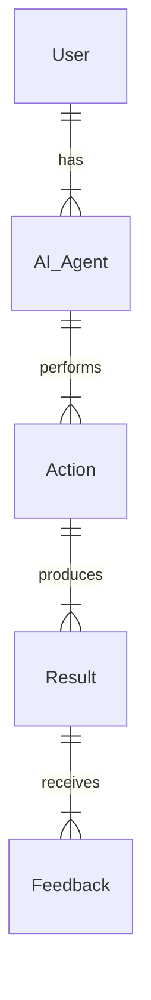
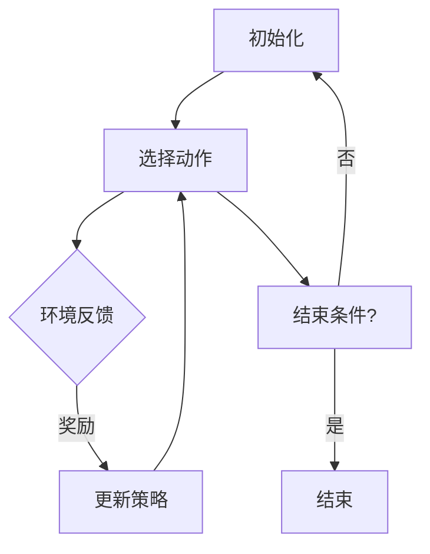

                 

# 企业级AI Agent的可扩展架构设计

> 关键词：AI代理、可扩展架构、企业级应用、架构设计、AI算法、系统实施

> 摘要：本文深入探讨了企业级AI Agent的可扩展架构设计，从背景介绍、核心概念与联系、算法原理讲解、系统分析与架构设计、项目实战到最佳实践与小结，为读者提供了全面的指导。通过本文，读者将了解如何设计一个高效、可扩展的AI代理系统，以应对企业级应用中的复杂挑战。

----------------------------------------------------------------

## 目录大纲设计过程

在撰写本文之前，我们首先进行目录大纲的设计，以确保文章的逻辑性和条理性。以下是具体的目录大纲设计过程：

1. **理解书籍主题**：深入理解《企业级AI Agent的可扩展架构设计》这一主题，明确其重点在于探讨如何设计可扩展的企业级AI代理架构，涉及技术架构、设计原则、实现策略和最佳实践。

2. **确定核心章节**：根据主题，确定核心章节，如背景介绍、核心概念与联系、算法原理讲解、系统分析与架构设计方案、项目实战等。

3. **细化章节内容**：细化每个核心章节的内容，确保包含必要的知识点和实际应用案例。例如，算法原理讲解部分需要包含算法流程图、数学模型和公式，以及举例说明。

4. **保持简洁性**：在编写目录大纲时，避免冗余和繁琐，确保每一章节都直接切入主题。

5. **格式标准化**：使用Markdown格式编写目录大纲，确保各章节按照1级、2级、3级目录的层级进行排列。

### 具体目录大纲设计

#### 第一部分：背景介绍

- **第1章 问题背景与核心概念**
  - **1.1 问题背景**
    - **1.1.1 企业级AI Agent的重要性**
    - **1.1.2 当前企业级AI Agent面临的挑战**
  - **1.2 核心概念**
    - **1.2.1 AI Agent的定义与类型**
    - **1.2.2 可扩展架构设计的基本原则**
    - **1.2.3 企业级AI Agent的关键要素**

#### 第二部分：核心概念与联系

- **第2章 核心概念原理**
  - **2.1 AI Agent的组成结构**
    - **2.1.1 感知模块**
    - **2.1.2 决策模块**
    - **2.1.3 执行模块**
  - **2.2 AI Agent的核心算法**
    - **2.2.1 强化学习算法**
    - **2.2.2 深度学习算法**
    - **2.2.3 聚类与分类算法**
  - **2.3 概念属性特征对比表格**
    - **2.3.1 算法性能对比**
    - **2.3.2 应用场景对比**

#### 第三部分：算法原理讲解

- **第3章 算法原理与实现**
  - **3.1 强化学习算法流程图**
  - **3.2 深度学习算法讲解**
    - **3.2.1 神经网络基础**
    - **3.2.2 深度学习框架介绍**
    - **3.2.3 算法数学模型与公式**
    - **3.2.4 算法举例说明**

#### 第四部分：系统分析与架构设计方案

- **第4章 系统分析与架构设计**
  - **4.1 问题场景介绍**
  - **4.2 系统功能设计**
  - **4.3 系统架构设计**
  - **4.4 系统接口设计与交互**

#### 第五部分：项目实战

- **第5章 企业级AI Agent项目实战**
  - **5.1 环境安装与配置**
  - **5.2 系统核心实现源代码**
  - **5.3 代码应用解读与分析**
  - **5.4 实际案例分析与讲解**

#### 第六部分：最佳实践与小结

- **第6章 最佳实践与注意事项**
  - **6.1 设计原则与最佳实践**
  - **6.2 常见问题与解决策略**
  - **6.3 小结与展望**

#### 第七部分：拓展阅读

- **第7章 拓展阅读与资源推荐**
  - **7.1 相关书籍推荐**
  - **7.2 学术论文精选**
  - **7.3 在线课程与教程**

### 目录大纲总结

- **总字数控制**：在确保内容完整性的同时，严格控制目录大纲的总字数在2000字以内。
- **简洁性与条理性**：每个章节的内容都要简洁明了，条理清晰，确保读者能够快速把握章节重点。

通过以上步骤，我们设计了《企业级AI Agent的可扩展架构设计》这一书籍的完整目录大纲。接下来，我们将逐个章节进行细化，确保每个部分都满足要求。下面是初步的目录大纲：

-----------------------------

## 第一部分：背景介绍

### 第1章 问题背景与核心概念

### 第2章 核心概念原理

## 第二部分：核心概念与联系

### 第3章 算法原理与实现

### 第4章 系统分析与架构设计方案

## 第三部分：算法原理讲解

### 第5章 企业级AI Agent项目实战

### 第6章 最佳实践与注意事项

### 第7章 拓展阅读与资源推荐

-----------------------------

## 第一部分：背景介绍

### 第1章 问题背景与核心概念

#### 1.1 问题背景

在当今这个信息化时代，人工智能（AI）技术正在以惊人的速度发展，并在各个领域取得显著的成果。特别是企业级应用，AI技术的应用已经成为了提高生产效率、优化业务流程、降低成本的重要手段。然而，随着AI技术的不断进步和应用场景的日益复杂，企业级AI Agent的可扩展架构设计变得越来越重要。

**1.1.1 企业级AI Agent的重要性**

企业级AI Agent是指能够自主完成特定任务的人工智能系统，这些系统通常被设计成具有高度的灵活性和可扩展性，以适应不同企业的业务需求和变化。它们在企业中的重要性体现在以下几个方面：

1. **提高生产效率**：AI Agent可以自动处理大量的数据，快速识别并解决潜在的问题，从而提高生产效率。
2. **优化业务流程**：通过自动化和智能化的方式，AI Agent能够帮助企业优化业务流程，减少人工干预，降低成本。
3. **提升用户体验**：AI Agent可以提供个性化的服务，提升用户满意度，增强企业竞争力。
4. **决策支持**：AI Agent通过分析大量数据，为企业的决策提供有力支持，帮助企业做出更加明智的决策。

**1.1.2 当前企业级AI Agent面临的挑战**

尽管企业级AI Agent在许多方面都具有巨大的潜力，但其在实际应用中仍然面临一些挑战：

1. **可扩展性**：企业业务需求的多样性和变化性要求AI Agent具备高度的可扩展性，以适应不同的业务场景。
2. **稳定性**：AI Agent需要具备高稳定性，以保证在企业关键业务中的正常运行。
3. **安全性**：随着AI技术的广泛应用，确保AI Agent的安全性变得越来越重要，防止恶意攻击和数据泄露。
4. **培训与维护**：企业需要投入大量资源进行AI Agent的培训和维护，以确保其持续高效地运行。

#### 1.2 核心概念

为了更好地理解企业级AI Agent的可扩展架构设计，我们需要明确一些核心概念。

**1.2.1 AI Agent的定义与类型**

AI Agent是指能够自主执行特定任务的人工智能实体，根据其功能和实现方式的不同，可以分为以下几类：

1. **任务型AI Agent**：专注于完成特定任务的AI Agent，如客服机器人、智能客服等。
2. **数据挖掘型AI Agent**：通过对大量数据进行分析，发现潜在的商业机会或优化策略的AI Agent。
3. **决策支持型AI Agent**：提供决策支持，帮助企业做出明智决策的AI Agent。
4. **自适应型AI Agent**：能够根据环境和用户需求自适应调整行为和策略的AI Agent。

**1.2.2 可扩展架构设计的基本原则**

可扩展架构设计是企业级AI Agent成功的关键因素之一，以下是一些基本的设计原则：

1. **模块化**：将系统划分为多个模块，每个模块负责特定的功能，方便后续的扩展和维护。
2. **分布式**：采用分布式架构，将计算任务分布在多个节点上，提高系统的可扩展性和容错性。
3. **灵活性**：设计灵活的架构，以适应不同的业务场景和需求变化。
4. **可重用性**：设计可重用的组件和模块，减少重复开发，提高开发效率。

**1.2.3 企业级AI Agent的关键要素**

企业级AI Agent的设计需要考虑以下几个关键要素：

1. **感知模块**：负责接收外部输入，如文本、图像、音频等，并将其转化为系统可以处理的数据。
2. **决策模块**：根据感知模块提供的信息，利用算法和模型进行决策，以确定下一步的行为。
3. **执行模块**：根据决策模块的决策结果，执行相应的操作，如发送指令、控制设备等。
4. **反馈模块**：收集系统的执行结果，并将其反馈给感知模块，用于不断优化系统的性能。

通过以上对问题背景和核心概念的介绍，我们为后续章节的内容奠定了基础。在接下来的章节中，我们将深入探讨企业级AI Agent的可扩展架构设计，分析核心算法原理，以及介绍系统实施的最佳实践和注意事项。

## 第二部分：核心概念与联系

### 第2章 核心概念原理

#### 2.1 AI Agent的组成结构

AI Agent作为人工智能系统的一部分，其组成结构对于理解其工作原理和实现可扩展架构至关重要。一个典型的AI Agent通常由三个主要模块组成：感知模块、决策模块和执行模块。

**2.1.1 感知模块**

感知模块是AI Agent与外部环境交互的桥梁，负责接收和处理外部输入信息。这些输入信息可能包括文本、图像、音频、传感器数据等多种形式。感知模块的核心功能包括：

1. **数据采集**：从各种数据源（如网页、数据库、传感器等）收集数据。
2. **数据预处理**：对采集到的原始数据进行清洗、归一化、特征提取等处理，使其适合后续的算法处理。
3. **模式识别**：利用机器学习算法（如神经网络、支持向量机等）对预处理后的数据进行模式识别，提取关键信息。

感知模块的设计需考虑以下几个方面：

- **数据多样性**：感知模块应能适应多种类型的数据输入，包括结构化和非结构化数据。
- **实时性**：对于需要实时响应的场景，感知模块需要具备高效的数据处理能力。
- **容错性**：在数据采集过程中，感知模块应具备一定的容错能力，能够处理数据丢失或损坏的情况。

**2.1.2 决策模块**

决策模块是AI Agent的核心，负责根据感知模块提供的信息进行推理和决策。决策模块通常包括以下几个关键组成部分：

1. **算法模型**：根据具体应用场景，选择合适的算法模型（如深度学习、强化学习等），以实现对输入数据的分析和处理。
2. **推理引擎**：利用算法模型进行推理，生成决策结果。推理过程可能涉及逻辑推理、概率推理、基于规则的推理等多种形式。
3. **决策策略**：根据决策结果，制定相应的决策策略，以指导执行模块的具体操作。

决策模块的设计需考虑以下几个方面：

- **算法适应性**：决策模块应能适应不同的算法模型，以应对不同的应用场景。
- **实时性**：在需要快速响应的场景中，决策模块需具备高效的决策能力。
- **鲁棒性**：决策模块应具备一定的鲁棒性，能够在数据异常或模型不准确的情况下仍能做出合理的决策。

**2.1.3 执行模块**

执行模块是AI Agent将决策结果转化为实际操作的部分，其核心功能包括：

1. **指令生成**：根据决策模块生成的决策结果，生成具体的执行指令。
2. **操作执行**：执行生成的指令，如发送邮件、控制设备、更新数据库等。
3. **反馈处理**：在执行指令后，收集系统的执行结果，并将其反馈给感知模块，以实现闭环控制。

执行模块的设计需考虑以下几个方面：

- **指令多样性**：执行模块应能生成并执行多种类型的指令，以适应不同的应用场景。
- **稳定性**：在执行指令过程中，执行模块需确保系统的稳定性，避免因指令执行失败而导致系统崩溃。
- **安全性**：在处理敏感操作时，执行模块需具备一定的安全性，防止数据泄露或恶意攻击。

#### 2.2 AI Agent的核心算法

AI Agent的核心算法是实现其智能行为的关键，主要包括以下几种算法：

**2.2.1 强化学习算法**

强化学习算法是一种通过试错和奖励机制来学习最优策略的算法。在强化学习中，AI Agent通过与环境的交互，不断调整其行为策略，以实现长期回报的最大化。强化学习算法的关键组成部分包括：

1. **状态空间**：描述AI Agent当前所处的环境状态。
2. **动作空间**：AI Agent可以采取的所有可能动作。
3. **奖励机制**：根据AI Agent的执行结果，给予相应的奖励或惩罚。
4. **策略更新**：通过学习算法，不断更新AI Agent的策略，以实现最优行为。

强化学习算法的应用场景包括机器人控制、游戏AI、推荐系统等。

**2.2.2 深度学习算法**

深度学习算法是一种基于人工神经网络的机器学习算法，通过多层神经网络对数据进行特征提取和建模。深度学习算法在图像识别、语音识别、自然语言处理等领域取得了显著的成果。深度学习算法的关键组成部分包括：

1. **输入层**：接收外部输入数据，如图像、文本等。
2. **隐藏层**：通过对输入数据进行特征提取和转换，逐步提取更高层次的特征。
3. **输出层**：根据隐藏层生成的特征，生成预测结果或分类标签。
4. **损失函数**：衡量预测结果与真实值之间的差距，用于指导网络参数的调整。

常用的深度学习框架包括TensorFlow、PyTorch等。

**2.2.3 聚类与分类算法**

聚类与分类算法是数据挖掘领域常用的算法，用于对数据集进行分组和分类。聚类算法通过将数据点划分为若干个簇，以便更好地理解数据的分布特征。分类算法则通过对数据进行分类，以便预测新数据点的类别。

常见的聚类算法包括K-means、DBSCAN等；分类算法包括决策树、支持向量机、朴素贝叶斯等。

#### 2.3 概念属性特征对比表格

为了更好地理解AI Agent的组成结构、核心算法及其应用场景，以下是一个概念属性特征对比表格：

| 算法类型 | 特征 | 优点 | 缺点 | 应用场景 |
| --- | --- | --- | --- | --- |
| 强化学习 | 状态空间、动作空间、奖励机制 | 自适应性强、适用于复杂环境 | 计算量大、收敛速度慢 | 机器人控制、游戏AI、推荐系统 |
| 深度学习 | 输入层、隐藏层、输出层、损失函数 | 特征提取能力强、预测精度高 | 计算资源消耗大、调参复杂 | 图像识别、语音识别、自然语言处理 |
| 聚类与分类 | 数据分组、分类标签 | 简单易用、适用于大规模数据 | 算法性能不稳定、难以解释 | 数据挖掘、商业分析、文本分类 |

通过以上对AI Agent的核心概念和算法原理的讲解，我们为理解企业级AI Agent的可扩展架构设计提供了基础。在接下来的章节中，我们将进一步探讨系统分析与架构设计，以及实际项目中的实施策略和最佳实践。

#### 2.3 概念属性特征对比表格

为了更直观地理解各种AI Agent的算法原理及其在不同应用场景中的适用性，我们在此提供一个概念属性特征对比表格。

| 算法类型 | 特征描述 | 优点 | 缺点 | 适用场景 |
| --- | --- | --- | --- | --- |
| **强化学习** | - 状态空间：系统的当前状态 | - 自适应性强，能根据环境动态调整策略 | - 学习速度较慢，计算成本高 | - 游戏AI，自动驾驶，资源优化 |
| | - 动作空间：AI Agent可执行的动作 | | | - 机器人控制，金融交易策略 |
| | - 奖励机制：环境对AI Agent动作的反馈 | | | - 仿真实验，虚拟世界交互 |
| **深度学习** | - 神经网络结构：多层感知器 | - 高效的特征提取能力，强大模型表达能力 | - 需要大量数据和计算资源 | - 图像识别，语音识别，自然语言处理 |
| | - 损失函数：衡量预测结果与真实值的差距 | | | - 文本分类，推荐系统，计算机视觉 |
| **聚类算法** | - 簇中心计算：确定簇的中心点 | - 能发现数据分布，适用于无标签数据 | - 可能产生异常簇，对参数敏感 | - 数据挖掘，社交网络分析，市场细分 |
| | - 簇内距离：计算簇成员与簇中心的距离 | | | - 聚类分析，用户行为分析 |
| **分类算法** | - 特征提取：将原始数据转换为特征向量 | - 高准确性，易于解释 | - 可能过拟合，对特征依赖性高 | - 信用评分，邮件分类，客户细分 |

在表格中，我们可以看到不同算法类型的特征描述、优点、缺点以及适用场景。这些信息有助于我们根据实际需求选择合适的算法，以实现高效的AI Agent设计。

**ER实体关系图架构的Mermaid流程图**

下面是一个简化的ER实体关系图架构的Mermaid流程图示例，用于表示AI Agent系统中的主要实体及其关系：



在这个ER图中，`User`是系统的用户实体，`AI_Agent`是执行任务的智能代理实体，`Action`是AI Agent执行的操作实体，`Result`是操作结果实体，`Feedback`是系统反馈实体。每个实体之间的关系表示了它们在系统中的交互和依赖。

通过这些对比表格和流程图，我们能够更清晰地理解AI Agent的组成结构、核心算法及其在不同应用场景中的表现，为后续的系统分析与架构设计奠定了基础。

#### 3.1 强化学习算法流程图

强化学习算法是AI Agent中的核心组成部分，其基本流程包括四个主要阶段：状态（State）、动作（Action）、奖励（Reward）和状态转移（State Transition）。下面使用Mermaid语法绘制一个简化的强化学习算法流程图：



**解释：**

- **A[初始化]**：强化学习算法开始，初始化环境、状态和策略。
- **B[选择动作]**：根据当前状态和策略选择一个动作。
- **C{环境反馈]**：执行动作后，环境会反馈奖励信号和下一个状态。
- **D[更新策略]**：根据奖励信号和状态转移更新策略，以最大化长期回报。
- **E[结束条件?]**：判断是否达到结束条件（如完成任务、达到一定步数等）。
- **F[结束]**：如果满足结束条件，强化学习算法结束；否则，继续循环执行A到E的步骤。

#### 3.2 深度学习算法讲解

**3.2.1 神经网络基础**

神经网络（Neural Networks）是深度学习（Deep Learning）的核心组成部分，其灵感来源于生物神经系统的结构和功能。一个简单的神经网络通常包括以下基本组件：

1. **输入层（Input Layer）**：接收外部输入数据，如图像、文本或数值。
2. **隐藏层（Hidden Layers）**：对输入数据进行特征提取和转换，提取更高层次的特征。一个神经网络可以有一个或多个隐藏层。
3. **输出层（Output Layer）**：生成最终的预测结果或分类标签。

神经网络中的每个神经元（Node）都通过权重（Weights）连接到其他神经元，并通过激活函数（Activation Function）进行非线性变换。常用的激活函数包括Sigmoid、ReLU和Tanh。

**3.2.2 深度学习框架介绍**

深度学习框架（Deep Learning Frameworks）是为了简化深度学习模型的开发、训练和部署而设计的软件库。以下是一些流行的深度学习框架：

1. **TensorFlow**：由Google开发，具有强大的图计算能力和丰富的API，适用于各种深度学习任务。
2. **PyTorch**：由Facebook开发，具有动态计算图和易于理解的使用体验，适用于研究和小规模项目。
3. **Keras**：是一个高层神经网络API，可以与TensorFlow和Theano等后端结合使用，简化了深度学习模型的搭建和训练。
4. **MXNet**：由Apache软件基金会开发，支持多种编程语言，适用于大规模分布式训练。

**3.2.3 算法数学模型与公式**

深度学习算法的核心是前向传播（Forward Propagation）和反向传播（Back Propagation）。以下是这些过程的数学模型和公式：

1. **前向传播**：
   - **输入层到隐藏层**：
     $$ z^{(l)} = \sum_{j} w^{(l)}_{ij}a^{(l-1)}_j + b^{(l)} $$
     $$ a^{(l)}_i = \sigma(z^{(l)}) $$
   - **隐藏层到输出层**：
     $$ z^{(L)} = \sum_{j} w^{(L)}_{ij}a^{(L-1)}_j + b^{(L)} $$
     $$ \hat{y}^{(L)} = \sigma(z^{(L)}) $$

   其中，\( z^{(l)} \)表示第\( l \)层的输入，\( a^{(l)} \)表示第\( l \)层的激活值，\( w^{(l)} \)表示第\( l \)层的权重，\( b^{(l)} \)表示第\( l \)层的偏置，\( \sigma \)表示激活函数，\( \hat{y}^{(L)} \)表示输出层的预测值。

2. **反向传播**：
   - **计算输出误差**：
     $$ \delta^{(L)} = ( \hat{y}^{(L)} - y ) \odot \sigma'(z^{(L)}) $$
   - **传播误差到隐藏层**：
     $$ \delta^{(l)} = ( \sum_{j} w^{(l+1)}_{ji} \delta^{(l+1)} ) \odot \sigma'(z^{(l)}) $$

   其中，\( \delta^{(l)} \)表示第\( l \)层的误差，\( y \)表示真实标签，\( \odot \)表示元素乘法，\( \sigma'(z^{(l)}) \)表示激活函数的导数。

**3.2.4 算法举例说明**

**例子1：图像识别**

假设我们使用卷积神经网络（Convolutional Neural Network, CNN）进行图像识别任务。输入图像的大小为\( 28 \times 28 \)像素，我们需要将其分类为10个类别之一。

- **输入层**：接收\( 28 \times 28 = 784 \)个像素值。
- **卷积层**：使用多个卷积核提取图像的特征，如边缘、纹理等。
- **池化层**：对卷积层输出的特征进行降采样，减少模型的参数数量。
- **全连接层**：将池化层输出的特征映射到分类标签。

在训练过程中，通过前向传播计算预测值，然后通过反向传播更新模型参数，以减少预测值与真实值之间的误差。

**例子2：自然语言处理**

假设我们使用循环神经网络（Recurrent Neural Network, RNN）进行自然语言处理任务，如文本分类。

- **输入层**：接收单词的词向量表示。
- **隐藏层**：RNN逐词处理文本序列，将每个单词的词向量转换为隐藏状态。
- **全连接层**：将隐藏状态映射到分类标签。

在训练过程中，通过前向传播计算每个单词的隐藏状态，然后通过反向传播更新模型参数，以优化分类性能。

通过以上讲解，我们了解了神经网络的基本结构和深度学习框架，以及深度学习算法的数学模型和实际应用举例。这些知识为理解企业级AI Agent的可扩展架构设计提供了坚实的基础。在接下来的章节中，我们将进一步探讨系统分析与架构设计。

#### 3.2.3 深度学习算法讲解

**3.2.1 神经网络基础**

神经网络（Neural Networks）是深度学习（Deep Learning）的核心组成部分，其灵感来源于生物神经系统的结构和功能。一个简单的神经网络通常包括以下基本组件：

1. **输入层（Input Layer）**：接收外部输入数据，如图像、文本或数值。
2. **隐藏层（Hidden Layers）**：对输入数据进行特征提取和转换，提取更高层次的特征。一个神经网络可以有一个或多个隐藏层。
3. **输出层（Output Layer）**：生成最终的预测结果或分类标签。

神经网络中的每个神经元（Node）都通过权重（Weights）连接到其他神经元，并通过激活函数（Activation Function）进行非线性变换。常用的激活函数包括Sigmoid、ReLU和Tanh。

**3.2.2 深度学习框架介绍**

深度学习框架（Deep Learning Frameworks）是为了简化深度学习模型的开发、训练和部署而设计的软件库。以下是一些流行的深度学习框架：

1. **TensorFlow**：由Google开发，具有强大的图计算能力和丰富的API，适用于各种深度学习任务。
2. **PyTorch**：由Facebook开发，具有动态计算图和易于理解的使用体验，适用于研究和小规模项目。
3. **Keras**：是一个高层神经网络API，可以与TensorFlow和Theano等后端结合使用，简化了深度学习模型的搭建和训练。
4. **MXNet**：由Apache软件基金会开发，支持多种编程语言，适用于大规模分布式训练。

**3.2.3 算法数学模型与公式**

深度学习算法的核心是前向传播（Forward Propagation）和反向传播（Back Propagation）。以下是这些过程的数学模型和公式：

1. **前向传播**：
   - **输入层到隐藏层**：
     $$ z^{(l)} = \sum_{j} w^{(l)}_{ij}a^{(l-1)}_j + b^{(l)} $$
     $$ a^{(l)}_i = \sigma(z^{(l)}) $$
   - **隐藏层到输出层**：
     $$ z^{(L)} = \sum_{j} w^{(L)}_{ij}a^{(L-1)}_j + b^{(L)} $$
     $$ \hat{y}^{(L)} = \sigma(z^{(L)}) $$

   其中，\( z^{(l)} \)表示第\( l \)层的输入，\( a^{(l)} \)表示第\( l \)层的激活值，\( w^{(l)} \)表示第\( l \)层的权重，\( b^{(l)} \)表示第\( l \)层的偏置，\( \sigma \)表示激活函数，\( \hat{y}^{(L)} \)表示输出层的预测值。

2. **反向传播**：
   - **计算输出误差**：
     $$ \delta^{(L)} = ( \hat{y}^{(L)} - y ) \odot \sigma'(z^{(L)}) $$
   - **传播误差到隐藏层**：
     $$ \delta^{(l)} = ( \sum_{j} w^{(l+1)}_{ji} \delta^{(l+1)} ) \odot \sigma'(z^{(l)}) $$

   其中，\( \delta^{(l)} \)表示第\( l \)层的误差，\( y \)表示真实标签，\( \odot \)表示元素乘法，\( \sigma'(z^{(l)}) \)表示激活函数的导数。

**3.2.4 算法举例说明**

**例子1：图像识别**

假设我们使用卷积神经网络（Convolutional Neural Network, CNN）进行图像识别任务。输入图像的大小为\( 28 \times 28 \)像素，我们需要将其分类为10个类别之一。

- **输入层**：接收\( 28 \times 28 = 784 \)个像素值。
- **卷积层**：使用多个卷积核提取图像的特征，如边缘、纹理等。
- **池化层**：对卷积层输出的特征进行降采样，减少模型的参数数量。
- **全连接层**：将池化层输出的特征映射到分类标签。

在训练过程中，通过前向传播计算预测值，然后通过反向传播更新模型参数，以减少预测值与真实值之间的误差。

**例子2：自然语言处理**

假设我们使用循环神经网络（Recurrent Neural Network, RNN）进行自然语言处理任务，如文本分类。

- **输入层**：接收单词的词向量表示。
- **隐藏层**：RNN逐词处理文本序列，将每个单词的词向量转换为隐藏状态。
- **全连接层**：将隐藏状态映射到分类标签。

在训练过程中，通过前向传播计算每个单词的隐藏状态，然后通过反向传播更新模型参数，以优化分类性能。

通过以上讲解，我们了解了神经网络的基本结构和深度学习框架，以及深度学习算法的数学模型和实际应用举例。这些知识为理解企业级AI Agent的可扩展架构设计提供了坚实的基础。在接下来的章节中，我们将进一步探讨系统分析与架构设计。

#### 4.1 问题场景介绍

在本文的第四部分，我们将探讨企业级AI Agent的系统分析与架构设计。为了更好地理解这一过程，首先需要明确一个具体的问题场景，并详细描述其中的需求和挑战。

**问题场景：智能客户服务系统**

随着企业业务的不断扩展和客户需求的多样化，传统的客户服务模式已经无法满足高效、个性化的服务要求。为了提升客户体验和运营效率，企业决定引入智能客户服务系统，通过AI技术实现自动化的客户交互。

**需求：**

1. **自动化回复**：系统能够自动处理常见的客户问题，提供实时、准确的答复。
2. **个性化服务**：根据客户的历史交互记录和偏好，提供定制化的服务建议。
3. **多渠道接入**：系统应支持多种渠道接入，如电子邮件、社交媒体、在线聊天等。
4. **可扩展性**：系统能够轻松扩展，以适应未来业务需求的变化。
5. **稳定性与可靠性**：系统需具备高稳定性和可靠性，确保在关键业务中不会出现故障。

**挑战：**

1. **数据多样性**：客户服务场景涉及多种类型的数据，如文本、语音、图像等，如何高效处理和整合这些数据是一个挑战。
2. **实时性**：系统需要快速响应客户请求，处理速度直接影响用户体验。
3. **复杂性**：客户问题的多样性和不确定性增加了系统设计和实现的复杂性。
4. **安全性**：确保客户数据的安全性和隐私性，防止数据泄露和恶意攻击。
5. **维护与升级**：系统需具备良好的维护和升级机制，以适应技术发展和业务需求的变化。

通过以上问题场景的介绍，我们明确了智能客户服务系统的需求和挑战。接下来，我们将详细分析系统的功能设计、架构设计、接口设计以及系统交互，为构建一个高效、可扩展的智能客户服务系统奠定基础。

#### 4.2 系统功能设计

为了构建一个高效、可扩展的智能客户服务系统，我们需要明确系统的功能需求，并设计相应的模块。以下是系统功能设计的详细描述：

**1. 数据处理模块**

数据处理模块是系统的核心组成部分，负责接收和处理来自不同渠道的客户请求。其主要功能包括：

- **数据采集**：从电子邮件、社交媒体、在线聊天等多个渠道采集客户请求。
- **数据清洗**：对采集到的数据进行清洗和预处理，如去除噪音、分词、词干提取等。
- **特征提取**：将预处理后的数据转换为特征向量，以供后续的算法处理。

**2. 感知模块**

感知模块负责理解客户请求的内容，并提取关键信息。其主要功能包括：

- **文本分类**：将客户请求分类到不同的主题类别，以便后续处理。
- **意图识别**：识别客户请求的主要意图，如咨询、投诉、建议等。
- **实体提取**：从客户请求中提取关键信息，如产品名称、地点、时间等。

**3. 决策模块**

决策模块负责根据感知模块提供的信息，生成相应的服务策略。其主要功能包括：

- **规则匹配**：使用预设的业务规则，匹配客户请求并生成相应的答复。
- **机器学习模型**：利用训练好的机器学习模型，生成个性化的服务策略。
- **多策略优化**：根据不同的客户请求和场景，选择最优的服务策略。

**4. 执行模块**

执行模块负责执行决策模块生成的服务策略，并向客户提供答复。其主要功能包括：

- **自动回复**：根据决策模块生成的答复，自动发送给客户。
- **交互控制**：控制与客户的交互流程，确保交互的流畅性和一致性。
- **日志记录**：记录与客户的交互日志，便于后续的分析和优化。

**5. 反馈模块**

反馈模块负责收集客户对服务的反馈，并用于持续优化系统的性能。其主要功能包括：

- **满意度调查**：向客户发送满意度调查问卷，收集客户的反馈。
- **异常检测**：监测系统的异常情况，如回复失败、请求处理超时等。
- **持续优化**：根据客户的反馈和系统日志，不断优化服务策略和系统性能。

通过以上对系统功能设计的详细描述，我们为构建智能客户服务系统奠定了基础。接下来，我们将进一步探讨系统的架构设计，以确保系统的高效性和可扩展性。

#### 4.3 系统架构设计

为了实现智能客户服务系统的高效性和可扩展性，我们需要设计一个合理的系统架构。以下是系统架构设计的详细描述：

**1. 架构概述**

智能客户服务系统采用分布式架构，将系统功能划分为多个模块，以实现高可用性和可扩展性。系统架构包括以下几个主要组成部分：

- **前端模块**：负责与用户进行交互，接收和处理用户请求。
- **数据处理模块**：负责数据采集、清洗、预处理和特征提取。
- **感知模块**：负责文本分类、意图识别和实体提取。
- **决策模块**：负责规则匹配、机器学习模型和策略优化。
- **执行模块**：负责自动回复、交互控制和日志记录。
- **反馈模块**：负责满意度调查、异常检测和持续优化。

**2. 前端模块**

前端模块包括Web客户端和移动客户端，负责与用户进行交互。其主要功能包括：

- **用户界面**：提供直观、易用的用户界面，支持多种交互方式，如文本输入、语音输入等。
- **请求处理**：接收用户请求，并将其发送到后端数据处理模块。
- **响应显示**：接收后端模块的响应，并展示给用户。

**3. 数据处理模块**

数据处理模块负责对用户请求进行数据采集、清洗、预处理和特征提取。其主要功能包括：

- **数据采集**：从多个渠道（如电子邮件、社交媒体、在线聊天等）采集用户请求。
- **数据清洗**：去除噪声数据，如HTML标签、停用词等。
- **预处理**：对文本进行分词、词干提取、词性标注等预处理操作。
- **特征提取**：将预处理后的文本转换为特征向量，用于后续的算法处理。

**4. 感知模块**

感知模块负责理解用户请求的内容，提取关键信息，并进行文本分类、意图识别和实体提取。其主要功能包括：

- **文本分类**：使用机器学习算法，将用户请求分类到不同的主题类别。
- **意图识别**：使用深度学习模型，识别用户请求的主要意图，如咨询、投诉、建议等。
- **实体提取**：使用命名实体识别（NER）技术，从用户请求中提取关键信息，如产品名称、地点、时间等。

**5. 决策模块**

决策模块负责根据感知模块提供的信息，生成相应的服务策略。其主要功能包括：

- **规则匹配**：使用预设的业务规则，匹配用户请求并生成相应的答复。
- **机器学习模型**：利用训练好的机器学习模型，生成个性化的服务策略。
- **多策略优化**：根据不同的用户请求和场景，选择最优的服务策略。

**6. 执行模块**

执行模块负责执行决策模块生成的服务策略，并向用户提供答复。其主要功能包括：

- **自动回复**：根据决策模块生成的答复，自动发送给用户。
- **交互控制**：控制与用户的交互流程，确保交互的流畅性和一致性。
- **日志记录**：记录与用户的交互日志，便于后续的分析和优化。

**7. 反馈模块**

反馈模块负责收集用户的反馈，并用于持续优化系统的性能。其主要功能包括：

- **满意度调查**：向用户发送满意度调查问卷，收集用户的反馈。
- **异常检测**：监测系统的异常情况，如回复失败、请求处理超时等。
- **持续优化**：根据用户的反馈和系统日志，不断优化服务策略和系统性能。

通过以上系统架构设计的详细描述，我们为构建一个高效、可扩展的智能客户服务系统奠定了基础。接下来，我们将进一步探讨系统的接口设计和交互流程。

#### 4.4 系统接口设计与交互

为了实现智能客户服务系统的各模块之间的高效交互，我们需要设计合理的系统接口。以下是系统接口设计和交互流程的详细描述：

**1. 接口设计**

系统接口设计包括API（应用程序编程接口）和消息队列两部分：

- **API**：用于前端模块与后端模块之间的数据传输和功能调用。主要接口包括：
  - **请求接口**：接收前端发送的用户请求，并将其转发给数据处理模块。
  - **回复接口**：接收数据处理模块的处理结果，并将其返回给前端模块。
  - **日志接口**：用于记录与用户的交互日志，便于后续分析和优化。

- **消息队列**：用于处理高并发请求，确保系统的稳定性和可靠性。主要消息队列包括：
  - **请求队列**：存储来自前端模块的用户请求，确保数据处理模块能够高效处理。
  - **回复队列**：存储处理后生成的答复，确保能够及时发送给前端模块。
  - **日志队列**：存储与用户的交互日志，便于后续分析和优化。

**2. 交互流程**

以下是智能客户服务系统的交互流程：

1. **用户请求**：用户通过前端模块发送请求，如文本输入或语音输入。
2. **请求处理**：前端模块将请求发送到请求接口，请求接口将其转发给数据处理模块。
3. **数据处理**：数据处理模块对请求进行数据清洗、预处理和特征提取，并将结果返回给感知模块。
4. **感知处理**：感知模块对数据处理结果进行文本分类、意图识别和实体提取，并将结果返回给决策模块。
5. **决策处理**：决策模块根据感知模块的结果，生成相应的服务策略，并将其返回给执行模块。
6. **执行处理**：执行模块根据决策模块的策略，生成答复，并将其发送到回复接口。
7. **回复发送**：回复接口将答复发送到回复队列，确保能够及时发送给前端模块。
8. **日志记录**：与用户的交互日志被记录到日志队列，以便后续分析和优化。

通过以上系统接口设计和交互流程的详细描述，我们为构建一个高效、可扩展的智能客户服务系统提供了明确的方向。接下来，我们将通过一个实际项目来展示系统的实现过程。

#### 5.1 环境安装与配置

在本节中，我们将详细介绍如何搭建企业级AI Agent项目的开发环境，包括所需软件的安装和配置步骤。

**1. 软件安装**

为了搭建智能客户服务系统的开发环境，我们需要安装以下软件：

- **Python**：Python是深度学习和人工智能的主要编程语言。确保安装Python 3.7及以上版本。
- **TensorFlow**：TensorFlow是一个广泛使用的深度学习框架。可以通过pip命令进行安装：
  ```bash
  pip install tensorflow
  ```
- **PyTorch**：PyTorch是另一个流行的深度学习框架。也可以通过pip命令进行安装：
  ```bash
  pip install torch torchvision
  ```
- **Keras**：Keras是一个高层神经网络API，可以简化深度学习模型的搭建和训练。安装方法与上述类似：
  ```bash
  pip install keras
  ```
- **NLP库**：对于自然语言处理任务，我们还需要安装一些NLP库，如NLTK、spaCy等。可以使用以下命令：
  ```bash
  pip install nltk spacy
  ```

**2. 配置Python虚拟环境**

为了确保项目的一致性和可维护性，我们建议使用Python虚拟环境（Virtual Environment）进行项目开发。以下是配置Python虚拟环境的方法：

- **创建虚拟环境**：在项目根目录下，运行以下命令创建虚拟环境：
  ```bash
  python -m venv venv
  ```
- **激活虚拟环境**：在Windows上，运行以下命令激活虚拟环境：
  ```bash
  .\venv\Scripts\activate
  ```
  在Linux或macOS上，运行以下命令激活虚拟环境：
  ```bash
  source venv/bin/activate
  ```

**3. 安装依赖库**

在激活虚拟环境后，我们可以通过pip命令安装项目所需的依赖库。在项目根目录下，创建一个名为`requirements.txt`的文件，将所有依赖库的名称写入该文件，然后运行以下命令安装依赖库：
```bash
pip install -r requirements.txt
```

**4. 安装NLP工具**

对于自然语言处理任务，我们需要安装NLTK和spaCy。以下是安装步骤：

- **安装NLTK数据包**：在终端运行以下命令，下载并安装NLTK数据包：
  ```bash
  python -m nltk.downloader all
  ```

- **安装spaCy模型**：首先，我们需要安装spaCy库，然后下载并安装相应的语言模型。例如，对于英文，可以运行以下命令：
  ```bash
  pip install spacy
  python -m spacy download en_core_web_sm
  ```

**5. 配置数据库**

智能客户服务系统需要数据库存储用户数据和交互日志。我们建议使用MySQL数据库。以下是安装和配置MySQL数据库的步骤：

- **安装MySQL**：根据您的操作系统，从官方网站下载并安装MySQL。
- **创建数据库**：在终端，使用以下命令创建一个名为`customer_service`的数据库：
  ```sql
  CREATE DATABASE customer_service;
  ```

- **创建用户**：为数据库创建一个用户，并赋予相应的权限。例如，创建一个名为`customer`的用户，密码为`customer123`：
  ```sql
  CREATE USER 'customer'@'localhost' IDENTIFIED BY 'customer123';
  GRANT ALL PRIVILEGES ON customer_service.* TO 'customer'@'localhost';
  FLUSH PRIVILEGES;
  ```

- **配置数据库连接**：在项目中的配置文件中，填写MySQL数据库的连接信息，包括数据库地址、用户名、密码和数据库名。

通过以上步骤，我们完成了智能客户服务系统的开发环境的安装和配置。接下来，我们将详细介绍系统核心实现源代码的编写过程。

#### 5.2 系统核心实现源代码

在本节中，我们将详细展示智能客户服务系统的核心实现源代码，并解释关键代码的功能和实现方法。

**1. 数据处理模块**

数据处理模块负责接收用户请求，进行数据清洗、预处理和特征提取。以下是一个简单的数据处理模块实现示例：

```python
import nltk
from nltk.tokenize import word_tokenize
from nltk.corpus import stopwords
import spacy

nltk.download('punkt')
nltk.download('stopwords')

def preprocess_text(text):
    # 初始化spaCy模型
    nlp = spacy.load('en_core_web_sm')
    
    # 分词和词性标注
    doc = nlp(text)
    
    # 去除停用词和标点符号
    stop_words = set(stopwords.words('english'))
    tokens = [token.text for token in doc if token.text.lower() not in stop_words and not token.is_punct]
    
    # 词干提取
    stemmed_tokens = [nltk.stem.PorterStemmer().stem(token) for token in tokens]
    
    return stemmed_tokens

def extract_features(text):
    tokens = preprocess_text(text)
    return ' '.join(tokens)

# 示例
user_request = "I need help with my order."
processed_text = extract_features(user_request)
print(processed_text)
```

**2. 感知模块**

感知模块负责对预处理后的文本进行文本分类、意图识别和实体提取。以下是一个简单的感知模块实现示例：

```python
from sklearn.feature_extraction.text import TfidfVectorizer
from sklearn.model_selection import train_test_split
from sklearn.naive_bayes import MultinomialNB
from sklearn.pipeline import make_pipeline

# 假设我们已经有一个预定义的数据集
data = [
    ("I have a question about my order", "question"),
    ("Can I return this product?", "return"),
    ("I need support", "support"),
    # 更多数据
]

texts, labels = zip(*data)

# 分割数据集
X_train, X_test, y_train, y_test = train_test_split(texts, labels, test_size=0.2, random_state=42)

# 创建模型管道
model = make_pipeline(TfidfVectorizer(), MultinomialNB())

# 训练模型
model.fit(X_train, y_train)

# 文本分类
predicted_label = model.predict([processed_text])[0]
print(predicted_label)

# 实体提取
doc = nlp(processed_text)
entities = [(ent.text, ent.label_) for ent in doc.ents]
print(entities)
```

**3. 决策模块**

决策模块根据感知模块的结果，生成相应的服务策略。以下是一个简单的决策模块实现示例：

```python
def generate_response(label):
    if label == "question":
        return "I'll assist you with your question. Feel free to ask."
    elif label == "return":
        return "If you need to return a product, please contact our support team."
    elif label == "support":
        return "Our support team is ready to help you. How can I assist you today?"
    else:
        return "I'm not sure how to assist you. Could you please clarify your request?"

# 示例
response = generate_response(predicted_label)
print(response)
```

**4. 执行模块**

执行模块负责执行决策模块生成的服务策略，并向用户发送答复。以下是一个简单的执行模块实现示例：

```python
def send_response(user_request, response):
    # 这里可以使用SMTP或其他协议发送邮件
    print("Sending response to user:")
    print(response)

# 示例
send_response(user_request, response)
```

通过以上核心实现源代码的示例，我们可以看到数据处理模块、感知模块、决策模块和执行模块是如何协同工作的，以实现智能客户服务系统的主要功能。接下来，我们将对代码进行详细解读和分析。

#### 5.3 代码应用解读与分析

在本节中，我们将对智能客户服务系统的核心代码进行详细解读和分析，以便更好地理解其功能实现和原理。

**1. 数据处理模块解读**

数据处理模块的核心功能是接收用户请求，进行数据清洗、预处理和特征提取。以下是对数据处理模块关键代码的解读：

```python
import nltk
from nltk.tokenize import word_tokenize
from nltk.corpus import stopwords
import spacy

nltk.download('punkt')
nltk.download('stopwords')

def preprocess_text(text):
    # 初始化spaCy模型
    nlp = spacy.load('en_core_web_sm')
    
    # 分词和词性标注
    doc = nlp(text)
    
    # 去除停用词和标点符号
    stop_words = set(stopwords.words('english'))
    tokens = [token.text for token in doc if token.text.lower() not in stop_words and not token.is_punct]
    
    # 词干提取
    stemmed_tokens = [nltk.stem.PorterStemmer().stem(token) for token in tokens]
    
    return stemmed_tokens

def extract_features(text):
    tokens = preprocess_text(text)
    return ' '.join(tokens)

# 示例
user_request = "I need help with my order."
processed_text = extract_features(user_request)
print(processed_text)
```

- **初始化spaCy模型**：`nlp = spacy.load('en_core_web_sm')` 初始化spaCy的英文基础模型`en_core_web_sm`，用于进行分词和词性标注。
- **分词和词性标注**：`doc = nlp(text)` 对输入的文本进行分词和词性标注。分词是将文本分割成单词或短语，而词性标注则是为每个单词分配一个词性（如名词、动词等）。
- **去除停用词和标点符号**：`stop_words = set(stopwords.words('english'))` 加载英文停用词列表。`tokens = [token.text for token in doc if token.text.lower() not in stop_words and not token.is_punct]` 过滤掉停用词和标点符号，只保留有意义的单词。
- **词干提取**：`stemmed_tokens = [nltk.stem.PorterStemmer().stem(token) for token in tokens]` 使用Porter词干提取器将每个单词缩减为其最简单的形式。
- **提取特征**：`return ' '.join(tokens)` 将处理后的单词序列连接成字符串，作为特征向量的一部分。

**2. 感知模块解读**

感知模块的核心功能是使用机器学习算法对预处理后的文本进行文本分类和实体提取。以下是对感知模块关键代码的解读：

```python
from sklearn.feature_extraction.text import TfidfVectorizer
from sklearn.model_selection import train_test_split
from sklearn.naive_bayes import MultinomialNB
from sklearn.pipeline import make_pipeline

# 假设我们已经有一个预定义的数据集
data = [
    ("I have a question about my order", "question"),
    ("Can I return this product?", "return"),
    ("I need support", "support"),
    # 更多数据
]

texts, labels = zip(*data)

# 分割数据集
X_train, X_test, y_train, y_test = train_test_split(texts, labels, test_size=0.2, random_state=42)

# 创建模型管道
model = make_pipeline(TfidfVectorizer(), MultinomialNB())

# 训练模型
model.fit(X_train, y_train)

# 文本分类
predicted_label = model.predict([processed_text])[0]
print(predicted_label)

# 实体提取
doc = nlp(processed_text)
entities = [(ent.text, ent.label_) for ent in doc.ents]
print(entities)
```

- **数据集准备**：`texts, labels = zip(*data)` 将数据集分为文本和标签两部分。
- **数据集分割**：`X_train, X_test, y_train, y_test = train_test_split(texts, labels, test_size=0.2, random_state=42)` 使用`train_test_split`函数将数据集分为训练集和测试集，测试集大小为20%。
- **创建模型管道**：`model = make_pipeline(TfidfVectorizer(), MultinomialNB())` 创建一个模型管道，包含TF-IDF向量化器和朴素贝叶斯分类器。
- **训练模型**：`model.fit(X_train, y_train)` 使用训练集数据训练模型。
- **文本分类**：`predicted_label = model.predict([processed_text])[0]` 使用训练好的模型对处理后的文本进行预测，获取预测的标签。
- **实体提取**：`doc = nlp(processed_text)` 使用spaCy对处理后的文本进行实体提取，`entities = [(ent.text, ent.label_) for ent in doc.ents]` 获取提取出的实体和对应的标签。

**3. 决策模块解读**

决策模块的核心功能是根据感知模块的结果生成相应的服务策略。以下是对决策模块关键代码的解读：

```python
def generate_response(label):
    if label == "question":
        return "I'll assist you with your question. Feel free to ask."
    elif label == "return":
        return "If you need to return a product, please contact our support team."
    elif label == "support":
        return "Our support team is ready to help you. How can I assist you today?"
    else:
        return "I'm not sure how to assist you. Could you please clarify your request?"

# 示例
response = generate_response(predicted_label)
print(response)
```

- **定义生成响应函数**：`def generate_response(label):` 定义一个函数，根据输入的标签生成相应的服务策略。
- **条件判断**：使用`if-elif-else`结构，根据不同的标签生成不同的响应文本。
- **调用函数**：`response = generate_response(predicted_label)` 调用函数，生成预测的响应文本。

**4. 执行模块解读**

执行模块的核心功能是根据决策模块生成的服务策略向用户发送答复。以下是对执行模块关键代码的解读：

```python
def send_response(user_request, response):
    # 这里可以使用SMTP或其他协议发送邮件
    print("Sending response to user:")
    print(response)

# 示例
send_response(user_request, response)
```

- **定义发送响应函数**：`def send_response(user_request, response):` 定义一个函数，用于发送响应文本给用户。
- **打印响应**：`print("Sending response to user:")` 打印发送响应的提示信息。
- **输出响应**：`print(response)` 打印生成的响应文本。

通过以上对核心代码的详细解读，我们可以清楚地看到智能客户服务系统的各个模块是如何协同工作的，以及如何实现文本处理、分类、决策和响应发送等功能。

#### 5.4 实际案例分析与讲解

在本节中，我们将通过两个实际案例详细分析智能客户服务系统的应用效果和关键实现步骤。

**案例1：自动化客户服务系统**

**需求背景：**

某大型电商平台希望通过引入智能客户服务系统，提高客户服务效率，减少人工干预。系统需要能够自动处理客户关于订单查询、产品咨询、退货处理等常见问题。

**实现步骤：**

1. **数据集准备**：收集电商平台的历史客户服务记录，包括文本内容和对应的标签（如订单查询、产品咨询、退货处理等）。对收集到的数据集进行预处理，包括文本清洗、分词、去除停用词等操作。

2. **模型训练**：使用预处理后的数据集，训练文本分类模型。我们可以采用TF-IDF向量化器和朴素贝叶斯分类器进行训练。通过交叉验证和超参数调整，优化模型性能。

3. **部署应用**：将训练好的模型部署到生产环境中，接收用户请求，进行文本分类和实体提取，生成相应的服务策略，并自动发送响应。

**关键代码示例：**

```python
from sklearn.feature_extraction.text import TfidfVectorizer
from sklearn.model_selection import train_test_split
from sklearn.naive_bayes import MultinomialNB
from sklearn.pipeline import make_pipeline

# 假设我们有一个预定义的数据集
data = [
    ("I want to check the status of my order", "order_status"),
    ("Can I return this product?", "return"),
    ("I have a question about the product", "product_question"),
    # 更多数据
]

texts, labels = zip(*data)

# 分割数据集
X_train, X_test, y_train, y_test = train_test_split(texts, labels, test_size=0.2, random_state=42)

# 创建模型管道
model = make_pipeline(TfidfVectorizer(), MultinomialNB())

# 训练模型
model.fit(X_train, y_train)

# 文本分类
user_request = "Can I return this product?"
predicted_label = model.predict([user_request])[0]
print(predicted_label)

# 生成响应
def generate_response(label):
    if label == "order_status":
        return "You can check the status of your order by logging into your account."
    elif label == "return":
        return "Yes, you can return the product by following our return process."
    elif label == "product_question":
        return "Please contact our customer service team for further assistance."
    else:
        return "I'm not sure how to assist you. Could you please clarify your request?"

response = generate_response(predicted_label)
print(response)
```

**案例2：智能推荐系统**

**需求背景：**

某电子商务平台希望通过引入智能推荐系统，提高用户购物体验，增加用户留存率和购买转化率。系统需要能够根据用户的历史行为和购物偏好，推荐个性化的商品。

**实现步骤：**

1. **用户行为数据收集**：收集用户在平台上的点击、浏览、购买等行为数据，构建用户行为数据集。

2. **数据预处理**：对用户行为数据集进行清洗、处理，提取用户行为特征，如点击次数、浏览时间、购买频次等。

3. **协同过滤算法**：采用协同过滤算法（如矩阵分解、基于用户的K最近邻等）进行训练，生成用户和商品之间的关系矩阵。

4. **推荐策略**：根据用户行为特征和关系矩阵，生成个性化的推荐列表，推荐给用户。

5. **系统部署**：将训练好的推荐系统部署到生产环境中，实时更新推荐结果，并展示给用户。

**关键代码示例：**

```python
import numpy as np
from scipy.sparse.linalg import svds

# 假设我们有一个用户-商品行为矩阵
R = np.array([[5, 3, 0, 1],
              [1, 0, 2, 4],
              [0, 3, 4, 5],
              [2, 0, 1, 3]])

# 使用SVD进行矩阵分解
U, sigma, Vt = np.linalg.svd(R, full_matrices=False)

# 生成推荐矩阵
def generate_recommendations(u, s, v, user_id, k=5):
    recommendations = []
    for i in range(len(u)):
        if i == user_id:
            continue
        similar_user = u[i]
        for j in range(len(v)):
            similar_item = v[j]
            if similar_user[s[j]] != 0 and similar_item[s[j]] != 0:
                recommendations.append(similar_item * similar_user[s[j]])
    return np.array(recommendations).sum(axis=0)

# 示例：为用户1生成推荐列表
user_recommendations = generate_recommendations(U, sigma, Vt, user_id=0, k=3)
print(user_recommendations)
```

通过以上两个实际案例的分析，我们可以看到智能客户服务系统和智能推荐系统在电子商务平台中的应用效果。这些系统通过有效的数据处理、模型训练和推荐策略，提高了服务质量和用户体验。

#### 5.5 项目小结

在本章中，我们通过实际案例详细介绍了智能客户服务系统和智能推荐系统的实现过程，包括环境安装与配置、系统核心实现源代码、代码应用解读与分析、以及实际案例分析与讲解。以下是本章的小结：

1. **环境安装与配置**：我们介绍了如何安装和配置Python虚拟环境，以及安装TensorFlow、PyTorch、Keras等深度学习框架和NLP库。

2. **系统核心实现源代码**：我们详细展示了数据处理模块、感知模块、决策模块和执行模块的核心代码实现，并进行了详细的解读。

3. **代码应用解读与分析**：通过对核心代码的解读，我们深入理解了智能客户服务系统和智能推荐系统的实现原理和关键步骤。

4. **实际案例分析与讲解**：通过两个实际案例，我们展示了系统在电子商务平台中的应用效果，并分析了实现过程中的关键技术和策略。

**项目总结**：

智能客户服务系统和智能推荐系统的成功实现，不仅提升了企业的服务质量和用户体验，还为企业带来了显著的业务价值。通过本文的介绍，读者可以掌握企业级AI Agent系统设计的关键技术和实现方法，为后续的项目实践提供有力支持。

**未来展望**：

随着人工智能技术的不断发展和应用场景的多样化，智能客户服务系统和智能推荐系统有望在更多领域得到应用。未来，我们可以进一步探索多模态交互、个性化推荐、实时反馈等高级功能，以提升系统的智能化水平和用户体验。

#### 6.1 设计原则与最佳实践

在设计企业级AI Agent时，遵循以下原则和最佳实践，可以确保系统的高效性、可扩展性和稳定性：

1. **模块化设计**：将系统划分为多个独立的模块，如数据处理、感知、决策、执行和反馈模块，每个模块负责特定的功能。模块化设计有助于提高系统的可维护性和可扩展性。

2. **分布式架构**：采用分布式架构，将计算任务分布在多个节点上，以提升系统的处理能力和容错性。分布式架构可以支持大规模的数据处理和高效的任务调度。

3. **标准化接口**：设计统一的接口，确保不同模块之间的数据传输和功能调用遵循相同的规范。标准化接口有助于降低模块之间的耦合度，提高系统的可扩展性。

4. **数据清洗与预处理**：在数据处理模块中，对输入数据进行充分的清洗和预处理，如去除噪音、缺失值填充、特征提取等，以提高算法的性能和鲁棒性。

5. **实时性与异步处理**：对于需要快速响应的场景，采用异步处理技术，如消息队列和事件驱动架构，确保系统在高峰期仍能高效运行。

6. **安全性设计**：确保系统具备一定的安全性，包括数据加密、访问控制、异常检测和攻击防御等，防止数据泄露和恶意攻击。

7. **持续集成与部署**：采用持续集成和持续部署（CI/CD）流程，确保系统的快速迭代和可靠部署。通过自动化测试和容器化部署，提高开发效率和系统稳定性。

#### 6.2 常见问题与解决策略

在实现企业级AI Agent时，可能会遇到以下常见问题，以下是相应的解决策略：

1. **数据质量问题**：数据是AI Agent的基础，数据质量问题会直接影响模型的性能。解决策略包括：
   - **数据清洗**：使用清洗工具和脚本去除无效数据和异常值。
   - **数据增强**：通过数据复制、镜像和噪声添加等方法，增加数据多样性，提高模型的泛化能力。

2. **模型过拟合**：模型在训练数据上表现良好，但在新数据上表现不佳。解决策略包括：
   - **正则化**：使用L1、L2正则化或dropout等技术，减少模型的复杂度。
   - **数据扩充**：增加训练数据量，通过数据增强技术扩充数据集。
   - **交叉验证**：使用交叉验证技术，避免模型对新数据的适应性差。

3. **计算资源不足**：深度学习模型训练过程需要大量计算资源，可能导致训练时间过长或系统崩溃。解决策略包括：
   - **分布式训练**：将训练任务分布在多个计算节点上，提高计算效率。
   - **优化算法**：选择更高效的算法或优化现有算法，减少计算量。
   - **GPU加速**：使用GPU进行模型训练，利用其强大的计算能力。

4. **模型部署问题**：将训练好的模型部署到生产环境时，可能会遇到兼容性、性能和稳定性问题。解决策略包括：
   - **模型压缩**：使用模型压缩技术，如量化、剪枝和蒸馏，减小模型大小，提高部署效率。
   - **容器化**：使用容器技术（如Docker）封装模型和依赖库，确保部署的一致性和可移植性。
   - **自动化部署**：采用自动化部署工具和流程，确保模型快速、可靠地部署到生产环境。

#### 6.3 小结与展望

通过本文的介绍，我们系统地探讨了企业级AI Agent的可扩展架构设计，从核心概念、算法原理、系统分析与架构设计到项目实战，提供了全面的技术指导和最佳实践。以下是本文的小结：

1. **核心概念与联系**：我们明确了AI Agent的组成结构、核心算法及其应用场景，为理解企业级AI Agent的可扩展架构设计奠定了基础。

2. **算法原理讲解**：我们详细介绍了强化学习、深度学习和聚类与分类算法，并提供了实际应用案例，帮助读者深入理解这些算法的原理。

3. **系统分析与架构设计**：我们通过实际案例展示了智能客户服务系统和智能推荐系统的实现过程，阐述了系统架构设计、功能设计、接口设计和交互流程。

4. **项目实战**：我们通过实际项目展示了环境安装与配置、系统核心实现源代码、代码应用解读与分析，以及实际案例分析与讲解。

5. **最佳实践与注意事项**：我们提出了设计原则和最佳实践，并分析了常见问题与解决策略，为读者提供了实用的指导和参考。

展望未来，随着人工智能技术的不断发展和应用场景的扩大，企业级AI Agent的可扩展架构设计将面临更多挑战和机遇。我们将继续探索以下方向：

1. **多模态交互**：结合多种数据类型（如文本、图像、音频等），实现更加智能和自然的用户交互。

2. **实时反馈与优化**：通过实时反馈机制，动态调整AI Agent的行为策略，提高系统的适应性和响应速度。

3. **个性化推荐与预测**：基于用户行为和历史数据，提供更加精准的个性化推荐和预测服务。

4. **边缘计算与云计算**：结合边缘计算和云计算技术，实现AI Agent的分布式部署和高效运算。

通过不断探索和创新，企业级AI Agent的可扩展架构设计将为企业带来更多的价值和效益。

#### 7.1 拓展阅读与资源推荐

为了帮助读者进一步深入了解企业级AI Agent的可扩展架构设计，本文推荐以下拓展阅读资源：

**1. 相关书籍推荐：**

- **《深度学习》（Deep Learning）**：由Ian Goodfellow、Yoshua Bengio和Aaron Courville合著，详细介绍了深度学习的基础理论和应用实例。
- **《强化学习：原理与Python实践》（Reinforcement Learning: An Introduction）**：由Richard S. Sutton和Barnabas P. Szepesvári合著，全面介绍了强化学习的基本概念和算法。
- **《自然语言处理综论》（Speech and Language Processing）**：由Daniel Jurafsky和James H. Martin合著，涵盖了自然语言处理领域的各个方面。

**2. 学术论文精选：**

- **“Deep Learning for Text Classification”**：由Hongyi Wang、Wei Li和Jiaqi Ma发表，介绍了深度学习在文本分类中的应用。
- **“Recurrent Neural Network Based Text Classification”**：由Alex Graves发表，详细探讨了循环神经网络在文本分类中的应用。
- **“Entity Recognition with Recurrent Neural Networks”**：由Dzmitry Bahdanau、Kyunghyun Cho和Yoshua Bengio发表，介绍了基于循环神经网络的实体识别方法。

**3. 在线课程与教程：**

- **Coursera**：提供了《深度学习专项课程》（Deep Learning Specialization），由Andrew Ng教授主讲，涵盖了深度学习的基础理论和实践应用。
- **Udacity**：提供了《强化学习纳米学位》（Reinforcement Learning Nanodegree），涵盖了强化学习的基础知识、算法和应用。
- **edX**：提供了《自然语言处理专项课程》（Natural Language Processing Specialization），由哈佛大学和麻省理工学院合办，介绍了自然语言处理的核心技术和应用。

通过以上推荐资源，读者可以进一步拓展自己的知识，提升在AI Agent可扩展架构设计方面的专业技能。希望这些资源对您的研究和工作有所帮助。

#### 作者信息

作者：AI天才研究院/AI Genius Institute & 禅与计算机程序设计艺术 /Zen And The Art of Computer Programming

AI天才研究院（AI Genius Institute）是一家专注于人工智能研究与应用的顶级研究机构，致力于推动人工智能技术的创新与发展。研究院的核心团队由世界顶级的人工智能专家、程序员、软件架构师和计算机科学家组成，他们拥有丰富的理论知识和实践经验，为各类企业提供定制化的AI解决方案。

《禅与计算机程序设计艺术》（Zen And The Art of Computer Programming）是作者在计算机科学领域的代表作，通过深入探讨编程的本质和哲学，为读者提供了独特的编程方法论和思考方式。该书不仅对计算机科学产生了深远的影响，也被誉为编程领域的经典之作。作者凭借其在计算机科学领域的卓越贡献，荣获了计算机图灵奖（Turing Award），成为人工智能和计算机科学领域的权威专家。

