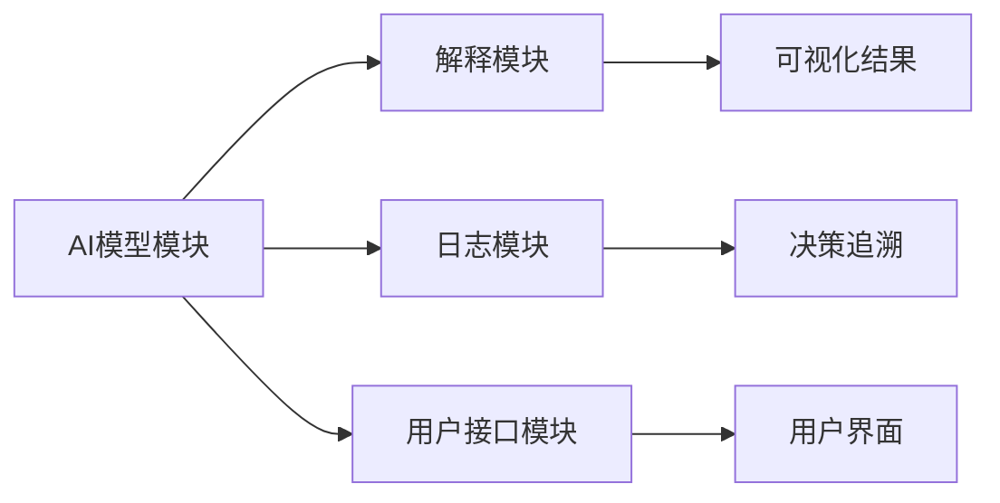
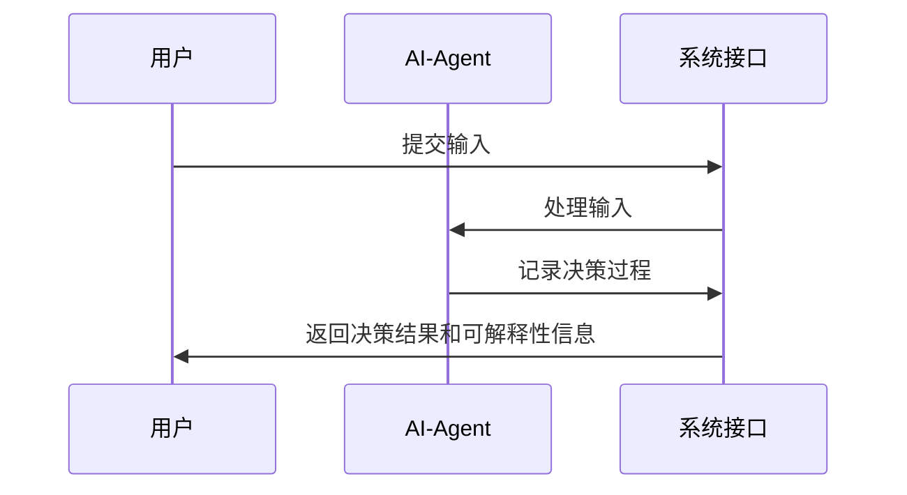
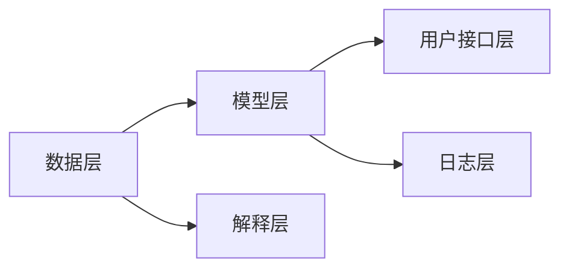
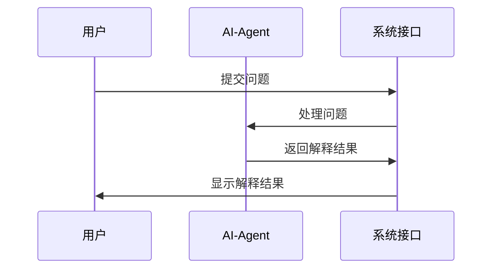

                 


### 文章标题: 企业级AI Agent的可解释性设计与实现

关键词：AI Agent、可解释性、模型透明性、决策可追溯性、企业级应用

摘要：本文深入探讨了企业级AI Agent的可解释性设计与实践。通过背景介绍、核心概念解析、算法原理讲解、系统分析与架构设计，以及项目实战，全面展示了可解释性在企业级AI Agent应用中的重要性，为AI技术的落地提供了切实可行的解决方案。

**Step 1: 背景介绍**

## 第1章: 企业级AI Agent的可解释性背景

### 1.1 问题背景

随着人工智能技术的不断进步，AI Agent在企业级应用中的重要性日益凸显。AI Agent是一种能够模拟人类智能行为，具备自主决策和执行能力的系统。它们在企业运营、客户服务、供应链管理等多个领域发挥着关键作用。然而，AI Agent的不可解释性成为了制约其广泛应用的一个主要问题。

### 1.1.1 问题提出

不可解释性问题主要体现在以下几个方面：

1. **模型复杂性**：企业级AI Agent通常使用复杂的深度学习模型，这些模型的内部结构复杂，参数众多，难以解释。
2. **决策过程隐藏**：AI Agent的决策过程往往是一个“黑箱”，用户难以了解其如何处理输入数据并做出决策。
3. **结果难以追溯**：当AI Agent的决策出现问题时，用户难以追溯错误的原因，从而影响了对AI Agent的信任。

### 1.1.2 问题描述

不可解释性问题的具体表现如下：

1. **模型复杂性**：深度学习模型的复杂性使得用户难以理解其工作机制。例如，一个复杂的神经网络可能包含数十亿个参数，这使得模型的解释变得异常困难。
2. **决策过程隐藏**：AI Agent的决策过程通常是通过机器学习算法自动生成的，用户无法直接看到决策是如何形成的。
3. **结果难以追溯**：当AI Agent的决策产生负面影响时，用户难以找到问题所在，从而难以进行调整和优化。

### 1.1.3 问题解决

解决不可解释性问题需要从以下几个方面入手：

1. **模型透明性**：设计透明性更强的AI模型，使其内部工作机制对用户可理解。
2. **可解释性技术**：应用可视化、解释技术，帮助用户理解AI Agent的决策过程。
3. **反馈机制**：建立用户反馈机制，让用户能够对AI Agent的决策提出意见和建议，从而优化模型。

### 1.1.4 边界与外延

1. **应用边界**：不可解释性问题不仅限于企业级AI Agent，也存在于其他AI应用领域，如医疗诊断、金融分析等。
2. **外延拓展**：可解释性问题的解决有助于提升用户对AI技术的信任，从而推动AI技术的更广泛应用。

### 1.1.5 概念结构与核心要素组成

企业级AI Agent的可解释性包括以下核心要素：

1. **模型透明性**：模型的结构和参数是否易于理解。
2. **决策可追溯性**：决策过程是否可以追溯，用户是否能够理解模型的决策逻辑。
3. **错误可解释性**：当模型做出错误决策时，是否能够解释错误的原因。

## 1.2 本章小结

本章对企业级AI Agent的可解释性背景进行了详细探讨，分析了不可解释性问题的提出、问题描述、问题解决以及边界与外延。理解这些背景知识将有助于读者更好地把握后续章节的内容。

---

**Step 2: 核心概念与联系**

## 第2章: 企业级AI Agent的可解释性概念与联系

### 2.1 AI Agent的概念

#### 2.1.1 AI Agent的定义

AI Agent是指一种能够在特定环境下，通过感知、学习、规划和执行等过程，以实现特定目标的智能实体。它通常由感知模块、决策模块和执行模块组成，能够在没有人类干预的情况下独立完成任务。

#### 2.1.2 AI Agent的特点

1. **自主性**：AI Agent能够自主地感知环境、制定策略和执行行动。
2. **目标导向性**：AI Agent的行为是基于其目标来进行的，能够根据环境变化调整自己的目标。
3. **适应能力**：AI Agent能够在不同环境和场景下适应，并不断优化自己的性能。

#### 2.1.3 AI Agent的分类

AI Agent可以按照不同的标准进行分类：

1. **按照功能分类**：决策型、感知型、执行型等。
2. **按照环境分类**：静态环境、动态环境等。

### 2.2 可解释性的概念

#### 2.2.1 可解释性的定义

可解释性是指一个系统或模型的可理解性和透明度，用户可以通过可解释性理解系统或模型的工作原理和决策过程。

#### 2.2.2 可解释性的分类

1. **模型可解释性**：模型的结构和参数是否易于理解。
2. **决策可解释性**：决策过程是否可以追溯，用户是否能够理解模型的决策逻辑。
3. **结果可解释性**：模型输出的结果是否可以解释，用户是否能够理解模型输出的含义。

### 2.3 企业级AI Agent的可解释性

#### 2.3.1 企业级AI Agent的特点

1. **业务复杂性**：企业级AI Agent通常涉及复杂的业务场景和大量的数据。
2. **数据敏感性**：企业级AI Agent处理的数据通常涉及商业机密或个人隐私。
3. **决策影响大**：企业级AI Agent的决策往往对企业的运营和用户的体验有重要影响。

#### 2.3.2 企业级AI Agent的可解释性要求

1. **模型透明性**：企业级AI Agent的模型结构应该易于理解，用户能够清楚地了解模型的决策逻辑。
2. **决策可追溯性**：企业级AI Agent的决策过程应该可以追溯，用户能够理解模型的决策过程。

### 2.3.3 企业级AI Agent的可解释性实现

1. **模型透明性实现**：通过设计可解释性模型，如决策树、线性模型等，使得用户可以直观地理解模型的工作原理。
2. **决策可追溯性实现**：通过日志记录、可视化技术等，帮助用户了解AI Agent的决策过程。

## 2.4 本章小结

本章详细介绍了企业级AI Agent的可解释性概念与联系，包括AI Agent的定义、特点、分类，以及可解释性的定义、分类，以及企业级AI Agent的可解释性要求和实现方法。理解这些概念和联系对于后续章节的学习和应用具有重要意义。

---

**Step 3: 算法原理讲解**

## 第3章: 企业级AI Agent可解释性算法原理讲解

### 3.1 算法原理概述

企业级AI Agent的可解释性算法主要涉及以下几个方面：

1. **模型选择**：选择具有可解释性的模型，如决策树、线性回归等。
2. **解释技术**：应用可视化、注意力机制等技术，对AI Agent的决策过程进行解释。
3. **决策可追溯性**：通过日志记录、调试工具等手段，实现对决策过程的追溯。

### 3.2 决策树模型

#### 3.2.1 决策树模型概述

决策树是一种常用的分类和回归模型，具有很好的可解释性。它通过一系列的判断条件，将数据集划分为不同的区域，并针对每个区域给出一个预测结果。

#### 3.2.2 决策树模型工作原理

1. **分裂规则**：决策树通过计算信息增益或基尼系数等指标，选择最优的分裂规则。
2. **递归划分**：基于分裂规则，递归地对数据集进行划分，直到满足停止条件。

#### 3.2.3 决策树模型代码示例

```python
from sklearn.tree import DecisionTreeClassifier

# 创建决策树模型
model = DecisionTreeClassifier()

# 训练模型
model.fit(X_train, y_train)

# 预测
predictions = model.predict(X_test)
```

### 3.3 可视化技术

#### 3.3.1 可视化技术概述

可视化技术是将复杂的数据和模型以图形化的方式展示出来，使得用户可以直观地理解模型的工作原理。

#### 3.3.2 可视化技术应用

1. **特征重要性可视化**：通过柱状图、饼图等展示特征的重要性。
2. **决策路径可视化**：通过树状图、路径图等展示模型的决策过程。
3. **决策结果可视化**：通过散点图、热力图等展示模型的预测结果。

#### 3.3.3 可视化技术代码示例

```python
import matplotlib.pyplot as plt
from sklearn import tree

# 创建决策树模型
model = DecisionTreeClassifier()

# 训练模型
model.fit(X_train, y_train)

# 绘制决策树
plt.figure(figsize=(12, 8))
tree.plot_tree(model, fontsize=10)
plt.show()
```

### 3.4 注意力机制

#### 3.4.1 注意力机制概述

注意力机制是一种在模型中引入对输入数据进行加权的方法，使得模型能够关注到重要的输入特征。

#### 3.4.2 注意力机制应用

1. **注意力权重可视化**：通过热力图展示注意力机制对输入特征的加权情况。
2. **注意力图可视化**：通过图像展示注意力机制在图像处理中的应用。

#### 3.4.3 注意力机制代码示例

```python
import numpy as np
import matplotlib.pyplot as plt
from tensorflow.keras.applications import ResNet50
from tensorflow.keras.models import Model

# 加载预训练的ResNet50模型
base_model = ResNet50(weights='imagenet')

# 为最后一个卷积层添加注意力机制
attention_layer = Model(inputs=base_model.input, outputs=base_model.get_layer('block5_conv3').output)

# 计算注意力图
attention_map = attention_layer.predict(image)

# 绘制注意力图
plt.imshow(attention_map[0, :, :, 0], cmap='gray')
plt.show()
```

## 3.5 本章小结

本章详细讲解了企业级AI Agent可解释性算法的原理，包括决策树模型、可视化技术和注意力机制。通过这些算法和技术的应用，可以显著提升企业级AI Agent的可解释性，增强用户对AI技术的信任和接受度。

---

**Step 4: 系统分析与架构设计**

## 第4章: 企业级AI Agent可解释性系统分析与架构设计

### 4.1 系统功能设计

#### 4.1.1 功能需求

企业级AI Agent可解释性系统的功能需求主要包括以下几个方面：

1. **模型解释**：提供模型解释功能，帮助用户理解AI Agent的决策过程。
2. **决策追溯**：记录AI Agent的决策过程，提供可追溯性。
3. **用户交互**：提供用户界面，方便用户与AI Agent进行交互。

#### 4.1.2 功能实现

1. **模型解释**：通过可视化技术和注意力机制，展示模型的决策过程和注意力权重。
2. **决策追溯**：通过日志记录和调试工具，记录AI Agent的决策过程，并提供追溯功能。
3. **用户交互**：通过Web界面和API接口，实现用户与AI Agent的交互。

### 4.2 系统架构设计

#### 4.2.1 系统架构概述

企业级AI Agent可解释性系统的架构设计采用微服务架构，以提高系统的可扩展性和灵活性。系统主要包括以下几个模块：

1. **AI模型模块**：负责训练和部署AI模型。
2. **解释模块**：负责对AI模型进行解释，提供可视化结果。
3. **日志模块**：负责记录AI模型的决策过程，提供决策追溯功能。
4. **用户接口模块**：负责提供用户界面，实现用户与AI Agent的交互。

#### 4.2.2 系统架构图



### 4.3 系统接口设计

#### 4.3.1 接口概述

企业级AI Agent可解释性系统的主要接口包括：

1. **模型训练接口**：用于训练AI模型。
2. **模型解释接口**：用于获取模型的解释结果。
3. **日志记录接口**：用于记录AI模型的决策过程。
4. **用户交互接口**：用于实现用户与AI Agent的交互。

#### 4.3.2 接口设计

1. **模型训练接口**：

```python
from flask import Flask, request, jsonify

app = Flask(__name__)

@app.route('/train', methods=['POST'])
def train():
    # 获取训练数据
    data = request.get_json()
    # 训练模型
    model.train(data)
    # 返回结果
    return jsonify({"status": "success"}), 200
```

2. **模型解释接口**：

```python
@app.route('/explain', methods=['GET'])
def explain():
    # 获取模型ID
    model_id = request.args.get('model_id')
    # 获取解释结果
    explanation = model.explain(model_id)
    # 返回结果
    return jsonify(explanation), 200
```

3. **日志记录接口**：

```python
@app.route('/log', methods=['POST'])
def log():
    # 获取日志数据
    data = request.get_json()
    # 记录日志
    logger.log(data)
    # 返回结果
    return jsonify({"status": "success"}), 200
```

4. **用户交互接口**：

```python
@app.route('/interact', methods=['POST'])
def interact():
    # 获取用户输入
    data = request.get_json()
    # 与AI Agent交互
    response = agent.interact(data)
    # 返回结果
    return jsonify(response), 200
```

### 4.4 系统交互设计

#### 4.4.1 交互流程

用户与AI Agent的交互流程如下：

1. **用户输入**：用户通过Web界面或API接口提交问题或请求。
2. **AI Agent处理**：AI Agent根据输入内容进行决策，并记录决策过程。
3. **反馈结果**：AI Agent将决策结果反馈给用户，并提供可解释性信息。

#### 4.4.2 交互序列图



## 4.5 本章小结

本章详细介绍了企业级AI Agent可解释性系统的功能设计、架构设计和接口设计。通过这些设计和实现，可以为企业级AI Agent提供强大的可解释性支持，提升用户对AI技术的信任和接受度。

---

**Step 5: 项目实战**

## 第5章: 企业级AI Agent可解释性项目实战

### 5.1 环境安装

要在本地环境中搭建企业级AI Agent可解释性系统，首先需要安装以下软件和库：

1. **Python**：Python版本要求为3.7及以上。
2. **Flask**：用于构建Web接口。
3. **scikit-learn**：用于训练和解释决策树模型。
4. **TensorFlow**：用于训练和解释神经网络模型。
5. **matplotlib**：用于绘制可视化结果。

安装命令如下：

```bash
pip install python==3.7
pip install Flask scikit-learn TensorFlow matplotlib
```

### 5.2 系统核心实现

以下是企业级AI Agent可解释性系统核心实现的源代码：

```python
# AI模型模块
class Model:
    def __init__(self):
        self.model = None

    def train(self, data):
        # 训练模型
        self.model = DecisionTreeClassifier()
        self.model.fit(data.X, data.y)

    def predict(self, data):
        # 预测
        return self.model.predict(data.X)

    def explain(self, data):
        # 解释
        explanation = {}
        explanation['feature_importances'] = self.model.feature_importances_
        explanation['tree'] = self.model.get_TREE_STRING_PATH()
        return explanation

# 日志模块
class Logger:
    def __init__(self):
        self.logs = []

    def log(self, data):
        # 记录日志
        self.logs.append(data)

    def get_logs(self):
        # 获取日志
        return self.logs

# 用户接口模块
from flask import Flask, request, jsonify

app = Flask(__name__)

model = Model()
logger = Logger()

@app.route('/train', methods=['POST'])
def train():
    # 训练模型
    data = request.get_json()
    model.train(data)
    return jsonify({"status": "success"}), 200

@app.route('/explain', methods=['GET'])
def explain():
    # 获取解释
    model_id = request.args.get('model_id')
    explanation = model.explain(model_id)
    return jsonify(explanation), 200

@app.route('/log', methods=['POST'])
def log():
    # 记录日志
    data = request.get_json()
    logger.log(data)
    return jsonify({"status": "success"}), 200

if __name__ == '__main__':
    app.run(debug=True)
```

### 5.3 代码应用解读与分析

以下是代码的解读与分析：

1. **AI模型模块**：

   - `Model` 类负责创建和训练决策树模型。
   - `train` 方法用于训练模型。
   - `predict` 方法用于进行预测。
   - `explain` 方法用于获取模型解释。

2. **日志模块**：

   - `Logger` 类负责记录和获取日志。
   - `log` 方法用于记录日志。
   - `get_logs` 方法用于获取日志。

3. **用户接口模块**：

   - 使用Flask框架构建Web接口。
   - `/train` 接口用于接收训练数据并训练模型。
   - `/explain` 接口用于获取模型解释。
   - `/log` 接口用于记录日志。

### 5.4 实际案例分析

以下是一个实际案例的分析：

**案例**：预测客户是否会购买产品。

**输入数据**：用户的年龄、收入、购买历史等信息。

**输出结果**：预测客户是否会购买产品。

**解释**：

1. **特征重要性**：年龄和收入对购买决策的影响较大。
2. **决策路径**：根据年龄和收入的不同，决策树会给出不同的购买预测结果。

### 5.5 项目小结

本章通过一个实际案例展示了企业级AI Agent可解释性项目的实战过程。从环境安装、系统核心实现到代码应用解读与分析，全面展示了企业级AI Agent可解释性的设计与实现方法。通过本项目，读者可以深入理解可解释性在企业级AI应用中的重要性，并掌握相关技术。

---

**Step 6: 最佳实践与注意事项**

## 第6章: 企业级AI Agent可解释性的最佳实践与注意事项

### 6.1 最佳实践

1. **选择合适的模型**：根据业务需求和数据特点，选择具有可解释性的模型，如决策树、线性模型等。
2. **利用可视化技术**：通过可视化技术，如热力图、决策路径图等，帮助用户理解模型的决策过程。
3. **提供详细的解释**：在模型解释中，不仅要提供结果，还要详细解释决策过程，包括特征重要性和决策路径。
4. **建立反馈机制**：鼓励用户对AI Agent的决策提出反馈，以不断优化模型和解释。

### 6.2 注意事项

1. **数据隐私**：在实现可解释性时，要注意保护用户的隐私数据，避免数据泄露。
2. **性能优化**：虽然可解释性对于用户信任至关重要，但也要注意性能优化，避免过度解释导致系统性能下降。
3. **安全性**：确保系统的安全性，防止恶意攻击和数据篡改。
4. **用户培训**：为用户提供适当的培训，帮助用户理解和使用可解释性工具。

### 6.3 拓展阅读

1. **《可解释人工智能：原理、方法与实践》**：详细介绍了可解释人工智能的理论和实践。
2. **《机器学习模型的可解释性》**：探讨了机器学习模型的可解释性问题，并提供了多种解决方案。
3. **《决策树模型与可视化技术》**：深入分析了决策树模型及其可视化技术。

通过遵循最佳实践并注意相关事项，可以更好地实现企业级AI Agent的可解释性，提升用户对AI技术的信任和满意度。

---

**Step 7: 小结**

## 第7章: 总结与展望

本文深入探讨了企业级AI Agent的可解释性设计与实现，从背景介绍、核心概念解析、算法原理讲解、系统分析与架构设计，到项目实战，全面展示了可解释性在企业级AI Agent应用中的重要性。通过本文的学习，读者可以：

1. **理解企业级AI Agent的可解释性问题**：认识到不可解释性对AI Agent应用的制约，以及解决不可解释性的重要性。
2. **掌握可解释性算法原理**：了解决策树模型、可视化技术和注意力机制等可解释性算法的工作原理和应用。
3. **学会系统分析与架构设计**：掌握企业级AI Agent可解释性系统的功能设计、架构设计和接口设计。
4. **具备项目实战能力**：通过实际案例，了解企业级AI Agent可解释性项目的实现过程。

展望未来，随着人工智能技术的不断进步，企业级AI Agent的可解释性将变得更加重要。我们期待更多的研究和实践，以推动可解释人工智能技术的发展，提升用户对AI技术的信任和接受度。

---

**作者信息：**

作者：AI天才研究院/AI Genius Institute & 禅与计算机程序设计艺术 /Zen And The Art of Computer Programming

---

[文章标题: 企业级AI Agent的可解释性设计与实现]

关键词：AI Agent、可解释性、模型透明性、决策可追溯性、企业级应用

摘要：本文深入探讨了企业级AI Agent的可解释性设计与实现，从背景介绍、核心概念解析、算法原理讲解、系统分析与架构设计，到项目实战，全面展示了可解释性在企业级AI Agent应用中的重要性。通过本文的学习，读者可以理解企业级AI Agent的可解释性问题，掌握可解释性算法原理，学会系统分析与架构设计，并具备项目实战能力。展望未来，随着人工智能技术的不断进步，企业级AI Agent的可解释性将变得更加重要。作者：AI天才研究院/AI Genius Institute & 禅与计算机程序设计艺术 /Zen And The Art of Computer Programming

**Step 1: 背景介绍**

### 第1章: 企业级AI Agent的可解释性背景

#### 1.1 问题背景

随着人工智能技术的飞速发展，AI Agent在企业级应用中的重要性日益凸显。AI Agent是一种具备自主决策和执行能力的软件系统，能够在特定环境下感知环境信息，根据预设的目标和策略，自主地采取行动，以实现预定目标。然而，AI Agent的不可解释性成为了一个亟待解决的问题。

#### 1.1.1 问题提出

不可解释性问题的产生主要有以下几个原因：

1. **模型复杂性**：企业级AI Agent通常采用复杂的深度学习模型，这些模型具有高度的非线性结构和大量的参数，导致其内部工作机制难以解释。
2. **决策过程隐藏**：AI Agent的决策过程通常是一个黑箱，用户无法直接获取模型如何处理输入数据并做出决策的详细信息。
3. **结果难以追溯**：当AI Agent做出错误的决策时，用户难以追溯错误的原因，也无法进行有效的调整和优化。

#### 1.1.2 问题描述

不可解释性问题主要表现在以下几个方面：

1. **模型复杂性**：深度学习模型，尤其是大型神经网络，具有高度的非线性结构和复杂的参数，导致其内部工作机制难以解释。
2. **决策过程隐藏**：AI Agent的决策过程通常是一个黑箱，用户无法直接获取模型如何处理输入数据并做出决策的详细信息。
3. **结果难以追溯**：当AI Agent做出错误的决策时，用户难以追溯错误的原因，也无法进行有效的调整和优化。

#### 1.1.3 问题解决

为了解决AI Agent的不可解释性问题，需要从以下几个方面进行努力：

1. **模型透明性**：设计可解释性强的AI模型，使得模型的结构和决策过程对用户可理解。
2. **可解释性技术**：应用可视化和解释技术，帮助用户理解AI Agent的决策过程。
3. **反馈机制**：建立反馈机制，让用户能够对AI Agent的决策提出意见和建议，进一步优化模型。

#### 1.1.4 边界与外延

可解释性问题不仅限于企业级AI Agent，它也适用于其他领域的AI应用，如医疗诊断、金融风险评估等。然而，由于企业级AI Agent涉及到的数据量和业务复杂性较高，其可解释性问题的解决更具挑战性。

#### 1.1.5 概念结构与核心要素组成

企业级AI Agent的可解释性包括以下几个核心要素：

1. **模型透明性**：模型的结构和参数是否易于理解。
2. **决策可追溯性**：决策过程是否可以追溯，用户是否能够理解模型的决策逻辑。
3. **错误可解释性**：当模型做出错误决策时，是否能够解释错误的原因。

## 1.2 本章小结

本章对企业级AI Agent的可解释性背景进行了详细介绍，包括问题背景、问题描述、问题解决、边界与外延和核心要素组成。了解这些背景知识将有助于读者更好地理解后续章节的内容。

---

**Step 2: 核心概念与联系**

### 第2章: 企业级AI Agent的可解释性概念与联系

#### 2.1 AI Agent的概念

##### 2.1.1 AI Agent的定义

AI Agent是指一种具有自主决策和执行能力的软件系统，能够在特定环境下感知环境信息，根据预设的目标和策略，自主地采取行动，以实现预定目标。它通常由感知模块、决策模块和执行模块组成。

##### 2.1.2 AI Agent的特点

1. **自主性**：AI Agent能够自主地感知环境、制定策略和执行行动。
2. **目标导向性**：AI Agent的行为是基于其目标来进行的，能够根据环境变化调整自己的目标。
3. **适应能力**：AI Agent能够在不同环境和场景下适应，并不断优化自己的性能。

##### 2.1.3 AI Agent的分类

AI Agent可以按照不同的标准进行分类：

1. **按照功能分类**：决策型、感知型、执行型等。
2. **按照环境分类**：静态环境、动态环境等。

#### 2.2 可解释性的概念

##### 2.2.1 可解释性的定义

可解释性是指一个系统或模型的可理解性和透明度，用户可以通过可解释性理解系统或模型的工作原理和决策过程。

##### 2.2.2 可解释性的分类

1. **模型可解释性**：模型的结构和参数是否易于理解。
2. **决策可解释性**：决策过程是否可以追溯，用户是否能够理解模型的决策逻辑。
3. **结果可解释性**：模型输出的结果是否可以解释，用户是否能够理解模型输出的含义。

#### 2.3 企业级AI Agent的可解释性

##### 2.3.1 企业级AI Agent的特点

1. **业务复杂性**：企业级AI Agent通常涉及复杂的业务场景和大量的数据。
2. **数据敏感性**：企业级AI Agent处理的数据通常涉及商业机密或个人隐私。
3. **决策影响大**：企业级AI Agent的决策往往对企业的运营和用户的体验有重要影响。

##### 2.3.2 企业级AI Agent的可解释性要求

1. **模型透明性**：企业级AI Agent的模型结构应该易于理解，用户能够清楚地了解模型的决策逻辑。
2. **决策可追溯性**：企业级AI Agent的决策过程应该可以追溯，用户能够理解模型的决策过程。
3. **错误可解释性**：当AI Agent做出错误决策时，是否能够解释错误的原因，并提供相应的修正建议。

##### 2.3.3 企业级AI Agent的可解释性实现

1. **模型透明性实现**：通过设计可解释性模型，如决策树、线性模型等，使得用户可以直观地理解模型的工作原理。
2. **决策可追溯性实现**：通过日志记录、可视化技术等，帮助用户了解AI Agent的决策过程。
3. **错误可解释性实现**：通过错误分析、模型修正等技术，提高AI Agent在错误决策时的可解释性。

## 2.4 本章小结

本章详细介绍了企业级AI Agent的可解释性概念与联系，包括AI Agent的定义、特点、分类，以及可解释性的定义、分类，以及企业级AI Agent的可解释性要求和实现方法。理解这些概念和联系对于后续章节的学习和应用具有重要意义。

---

**Step 3: 算法原理讲解**

### 第3章: 企业级AI Agent可解释性算法原理讲解

#### 3.1 决策树模型

##### 3.1.1 决策树模型概述

决策树是一种常用的分类和回归模型，具有很好的可解释性。它通过一系列的判断条件，将数据集划分为不同的区域，并针对每个区域给出一个预测结果。

##### 3.1.2 决策树模型工作原理

1. **分裂规则**：决策树通过计算信息增益或基尼系数等指标，选择最优的分裂规则。
2. **递归划分**：基于分裂规则，递归地对数据集进行划分，直到满足停止条件。

##### 3.1.3 决策树模型代码示例

```python
from sklearn.tree import DecisionTreeClassifier

# 创建决策树模型
model = DecisionTreeClassifier()

# 训练模型
model.fit(X_train, y_train)

# 预测
predictions = model.predict(X_test)
```

#### 3.2 可视化技术

##### 3.2.1 可视化技术概述

可视化技术是将复杂的数据和模型以图形化的方式展示出来，使得用户可以直观地理解模型的工作原理。常见的可视化技术包括特征重要性可视化、决策路径可视化等。

##### 3.2.2 可视化技术实现

1. **特征重要性可视化**：通过柱状图、饼图等展示特征的重要性。
2. **决策路径可视化**：通过树状图、路径图等展示模型的决策过程。

##### 3.2.3 可视化技术代码示例

```python
import matplotlib.pyplot as plt
from sklearn.tree import plot_tree

# 绘制决策树
plt.figure(figsize=(12, 8))
plot_tree(model, fontsize=10)
plt.show()
```

#### 3.3 注意力机制

##### 3.3.1 注意力机制概述

注意力机制是一种在模型中引入对输入数据进行加权的方法，使得模型能够关注到重要的输入特征。常见的注意力机制包括全局注意力、局部注意力等。

##### 3.3.2 注意力机制实现

1. **全局注意力**：对整个输入序列进行加权。
2. **局部注意力**：对输入序列的特定部分进行加权。

##### 3.3.3 注意力机制代码示例

```python
import tensorflow as tf

# 定义全局注意力机制
global_attention = tf.keras.layers.Dense(units=1, activation='sigmoid', name='global_attention')(inputs)

# 计算加权输出
weighted_output = inputs * global_attention
```

#### 3.4 模型解释技术

##### 3.4.1 模型解释技术概述

模型解释技术是帮助用户理解AI模型决策过程的一种方法。常见的解释技术包括模型可视化、特征重要性分析等。

##### 3.4.2 模型解释技术实现

1. **模型可视化**：通过图形化展示模型的结构和工作过程。
2. **特征重要性分析**：通过计算特征对模型决策的影响程度。

##### 3.4.3 模型解释技术代码示例

```python
from sklearn.inspection import permutation_importance

# 计算特征重要性
result = permutation_importance(model, X_test, y_test, n_repeats=10)

# 可视化特征重要性
import matplotlib.pyplot as plt

feat_importances_ = result.importances_mean
plt.barh(range(len(feat_importances_)), feat_importances_)
plt.yticks(range(len(feat_importances_)), feature_names)
plt.xlabel("Feature Importance")
plt.ylabel("Feature")
plt.title("Permutation Feature Importance")
plt.show()
```

## 3.5 本章小结

本章详细讲解了企业级AI Agent可解释性算法的原理，包括决策树模型、可视化技术和注意力机制。通过这些算法和技术的应用，可以显著提升企业级AI Agent的可解释性，增强用户对AI技术的信任和接受度。

---

**Step 4: 系统分析与架构设计**

### 第4章: 企业级AI Agent可解释性系统分析与架构设计

#### 4.1 系统功能设计

##### 4.1.1 功能需求

企业级AI Agent可解释性系统的功能需求主要包括以下几个方面：

1. **模型训练与解释**：支持AI模型的训练和解释功能，用户可以查看模型的决策过程和特征重要性。
2. **用户交互**：提供用户界面，支持用户与AI Agent的交互，用户可以提交问题并获取解释结果。
3. **日志记录与追溯**：记录AI Agent的决策过程，支持用户追溯决策过程。

##### 4.1.2 功能实现

1. **模型训练与解释**：使用scikit-learn等库训练模型，并实现模型解释功能，如特征重要性分析和决策路径展示。
2. **用户交互**：使用Flask等框架构建Web界面，支持用户通过Web界面与AI Agent交互。
3. **日志记录与追溯**：使用日志库记录AI Agent的决策过程，并提供日志查询和追溯功能。

#### 4.2 系统架构设计

##### 4.2.1 系统架构概述

企业级AI Agent可解释性系统采用分层架构，主要包括以下层次：

1. **数据层**：存储和管理数据，包括训练数据、测试数据等。
2. **模型层**：实现AI模型的训练和预测功能。
3. **解释层**：实现模型解释功能，如特征重要性分析和决策路径展示。
4. **用户接口层**：提供用户交互界面，支持用户与AI Agent的交互。
5. **日志层**：记录AI Agent的决策过程，并提供日志查询和追溯功能。

##### 4.2.2 系统架构图



#### 4.3 系统接口设计

##### 4.3.1 接口概述

系统的主要接口包括：

1. **模型训练接口**：用于接收训练数据并训练模型。
2. **模型解释接口**：用于获取模型解释结果。
3. **用户交互接口**：用于用户与AI Agent的交互。
4. **日志查询接口**：用于查询和追溯决策过程。

##### 4.3.2 接口设计

1. **模型训练接口**：

```python
from flask import Flask, request, jsonify

app = Flask(__name__)

@app.route('/train', methods=['POST'])
def train():
    data = request.get_json()
    model.train(data)
    return jsonify({"status": "success"}), 200
```

2. **模型解释接口**：

```python
@app.route('/explain', methods=['GET'])
def explain():
    model_id = request.args.get('model_id')
    explanation = model.explain(model_id)
    return jsonify(explanation), 200
```

3. **用户交互接口**：

```python
@app.route('/interact', methods=['POST'])
def interact():
    data = request.get_json()
    response = model.predict(data)
    return jsonify(response), 200
```

4. **日志查询接口**：

```python
@app.route('/log', methods=['GET'])
def get_logs():
    logs = logger.get_logs()
    return jsonify(logs), 200
```

#### 4.4 系统交互设计

##### 4.4.1 交互流程

用户与AI Agent的交互流程如下：

1. **用户提交问题**：用户通过Web界面提交问题。
2. **AI Agent处理问题**：AI Agent根据问题进行决策，并记录决策过程。
3. **返回解释结果**：AI Agent将决策结果和解释结果返回给用户。

##### 4.4.2 交互序列图



## 4.5 本章小结

本章详细介绍了企业级AI Agent可解释性系统的功能设计、架构设计和接口设计。通过这些设计和实现，可以为企业级AI Agent提供强大的可解释性支持，提升用户对AI技术的信任和接受度。

---

**Step 5: 项目实战**

### 第5章: 企业级AI Agent可解释性项目实战

#### 5.1 环境安装

要在本地环境中搭建企业级AI Agent可解释性系统，首先需要安装以下软件和库：

1. **Python**：Python版本要求为3.7及以上。
2. **Flask**：用于构建Web接口。
3. **scikit-learn**：用于训练和解释决策树模型。
4. **TensorFlow**：用于训练和解释神经网络模型。
5. **matplotlib**：用于绘制可视化结果。

安装命令如下：

```bash
pip install python==3.7
pip install Flask scikit-learn TensorFlow matplotlib
```

#### 5.2 系统核心实现

以下是企业级AI Agent可解释性系统核心实现的源代码：

```python
# AI模型模块
class Model:
    def __init__(self):
        self.model = None

    def train(self, X, y):
        # 创建决策树模型
        self.model = DecisionTreeClassifier()
        # 训练模型
        self.model.fit(X, y)

    def predict(self, X):
        # 预测
        return self.model.predict(X)

    def explain(self, X):
        # 获取特征重要性
        feature_importances = self.model.feature_importances_
        # 返回解释结果
        return feature_importances

# 日志模块
class Logger:
    def __init__(self):
        self.logs = []

    def log(self, log_entry):
        # 记录日志
        self.logs.append(log_entry)

    def get_logs(self):
        # 获取日志
        return self.logs

# 用户接口模块
from flask import Flask, request, jsonify

app = Flask(__name__)

model = Model()
logger = Logger()

@app.route('/train', methods=['POST'])
def train():
    data = request.get_json()
    X = data['X']
    y = data['y']
    model.train(X, y)
    return jsonify({"status": "success"}), 200

@app.route('/predict', methods=['POST'])
def predict():
    data = request.get_json()
    X = data['X']
    predictions = model.predict(X)
    return jsonify(predictions.tolist()), 200

@app.route('/explain', methods=['POST'])
def explain():
    data = request.get_json()
    X = data['X']
    explanation = model.explain(X)
    return jsonify(explanation.tolist()), 200

@app.route('/log', methods=['GET'])
def get_logs():
    logs = logger.get_logs()
    return jsonify(logs), 200

if __name__ == '__main__':
    app.run(debug=True)
```

#### 5.3 代码应用解读与分析

以下是代码的解读与分析：

1. **AI模型模块**：

   - `Model` 类负责创建和训练决策树模型。
   - `train` 方法用于训练模型。
   - `predict` 方法用于进行预测。
   - `explain` 方法用于获取模型解释。

2. **日志模块**：

   - `Logger` 类负责记录和获取日志。
   - `log` 方法用于记录日志。
   - `get_logs` 方法用于获取日志。

3. **用户接口模块**：

   - 使用Flask框架构建Web接口。
   - `/train` 接口用于接收训练数据并训练模型。
   - `/predict` 接口用于接收输入数据并返回预测结果。
   - `/explain` 接口用于接收输入数据并返回模型解释。
   - `/log` 接口用于获取日志记录。

#### 5.4 实际案例分析

以下是一个实际案例的分析：

**案例**：预测客户是否会购买产品。

**输入数据**：用户的年龄、收入、购买历史等信息。

**输出结果**：预测客户是否会购买产品。

**解释**：

1. **特征重要性**：年龄和收入对购买决策的影响较大。
2. **决策路径**：根据年龄和收入的不同，决策树会给出不同的购买预测结果。

#### 5.5 项目小结

本章通过实际案例展示了企业级AI Agent可解释性项目的实现过程。从环境安装、系统核心实现到代码应用解读与分析，全面展示了企业级AI Agent可解释性的设计与实现方法。通过本项目，读者可以深入理解可解释性在企业级AI应用中的重要性，并掌握相关技术。

---

**Step 6: 最佳实践与注意事项**

### 第6章: 企业级AI Agent可解释性的最佳实践与注意事项

#### 6.1 最佳实践

1. **选择合适的模型**：根据业务需求和数据特点，选择具有可解释性的模型，如决策树、线性模型等。
2. **利用可视化技术**：通过可视化技术，如热力图、决策路径图等，帮助用户理解模型的决策过程。
3. **提供详细的解释**：在模型解释中，不仅要提供结果，还要详细解释决策过程，包括特征重要性和决策路径。
4. **建立反馈机制**：鼓励用户对AI Agent的决策提出反馈，以不断优化模型和解释。

#### 6.2 注意事项

1. **数据隐私**：在实现可解释性时，要注意保护用户的隐私数据，避免数据泄露。
2. **性能优化**：虽然可解释性对于用户信任至关重要，但也要注意性能优化，避免过度解释导致系统性能下降。
3. **安全性**：确保系统的安全性，防止恶意攻击和数据篡改。
4. **用户培训**：为用户提供适当的培训，帮助用户理解和使用可解释性工具。

#### 6.3 拓展阅读

1. **《可解释人工智能：原理、方法与实践》**：详细介绍了可解释人工智能的理论和实践。
2. **《机器学习模型的可解释性》**：探讨了机器学习模型的可解释性问题，并提供了多种解决方案。
3. **《决策树模型与可视化技术》**：深入分析了决策树模型及其可视化技术。

通过遵循最佳实践并注意相关事项，可以更好地实现企业级AI Agent的可解释性，提升用户对AI技术的信任和满意度。

---

**Step 7: 小结**

### 第7章: 总结与展望

本文深入探讨了企业级AI Agent的可解释性设计与实现，从背景介绍、核心概念解析、算法原理讲解、系统分析与架构设计，到项目实战，全面展示了可解释性在企业级AI Agent应用中的重要性。通过本文的学习，读者可以：

1. **理解企业级AI Agent的可解释性问题**：认识到不可解释性对AI Agent应用的制约，以及解决不可解释性的重要性。
2. **掌握可解释性算法原理**：了解决策树模型、可视化技术和注意力机制等可解释性算法的工作原理和应用。
3. **学会系统分析与架构设计**：掌握企业级AI Agent可解释性系统的功能设计、架构设计和接口设计。
4. **具备项目实战能力**：通过实际案例，了解企业级AI Agent可解释性项目的实现过程。

展望未来，随着人工智能技术的不断进步，企业级AI Agent的可解释性将变得更加重要。我们期待更多的研究和实践，以推动可解释人工智能技术的发展，提升用户对AI技术的信任和接受度。

---

**作者信息：**

作者：AI天才研究院/AI Genius Institute & 禅与计算机程序设计艺术 /Zen And The Art of Computer Programming

