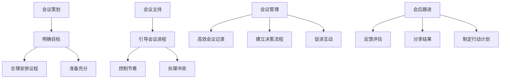
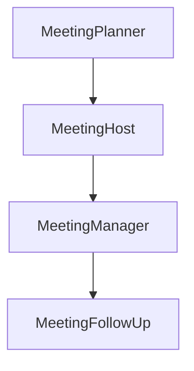
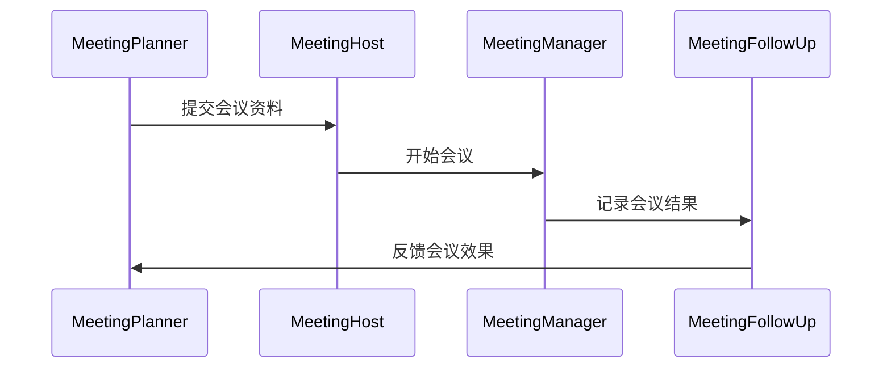

                 


# 会议的高效需要经营

关键词：会议效率、经营策略、核心要素、实践策略、案例分析

摘要：本文旨在探讨如何通过科学的经营策略，提高会议的效率。文章从会议策划、主持技巧、实践策略和案例分析等方面进行了详细的阐述，旨在为提高会议效率提供有价值的参考。

## 第一部分：会议效率的背景与重要性

### 1.1 问题的提出

在当今快速发展的社会，会议作为一种重要的沟通和决策方式，被广泛应用于各类组织和企业中。然而，许多会议却因为效率低下而成为企业发展的瓶颈。会议时间过长、内容空洞、决策过程繁琐等问题，不仅浪费了时间和资源，还影响了企业的运营效率。

### 1.2 会议效率的挑战

会议效率低下的原因有很多，主要包括以下几个方面：

1. **会议策划不充分**：会议目标不明确，议程安排不合理，准备不充分。
2. **会议主持技巧不足**：主持者无法有效引导会议，控制会议节奏，处理冲突和争议。
3. **会议过程管理不善**：会议过程中，参与者缺乏互动，记录和决策过程繁琐。
4. **会议后缺乏跟进**：会议结果未得到有效落实，缺乏后续监督和评估。

### 1.3 会议效率的重要性

会议效率直接关系到企业的运营效率和团队协作效果。提高会议效率，可以：

1. **节省时间和资源**：减少无效会议，提高工作效率。
2. **提升决策质量**：明确会议目标，优化决策流程，提高决策质量。
3. **增强团队协作**：提高会议互动，促进团队协作，增强团队凝聚力。
4. **优化企业运营**：通过高效的会议管理，提升企业整体运营效率。

### 1.4 研究目的与内容框架

本文的研究目的是通过分析会议效率的挑战和核心要素，探讨提高会议效率的实践策略和最佳实践。文章将分为五个部分，分别从会议策划、主持技巧、实践策略、案例分析以及未来展望等方面进行探讨。

## 第二部分：高效会议的核心要素

### 第2章：高效会议的策划与准备

#### 2.1 会议策划的重要性

会议策划是提高会议效率的第一步。一个成功的会议需要明确的目标、合理的议程安排和充分的准备。

#### 2.2 制定明确的目标

会议的目标应该具体、明确，有助于引导会议的方向。例如：“讨论并确定项目进度”或“制定市场营销策略”。

#### 2.3 优化会议议程

会议议程应该合理安排，确保每个议题都得到充分讨论。可以采用时间分配表格或时间线图来规划会议流程。

#### 2.4 选择合适的会议时间和地点

会议时间和地点的选择对会议效率有很大影响。应该选择大多数人都能参加的时间，并确保会议场所安静、舒适、设施齐全。

#### 2.5 邀请合适的参会者

参会者的选择应基于会议目标和议题，确保每个参会者都对议题有所贡献。可以采用角色分析法，确定每个参会者的角色和职责。

### 第3章：高效会议的主持技巧

#### 3.1 会议主持者的角色

会议主持者是会议的核心，负责引导会议、控制节奏和处理冲突。一个好的主持者应该具备以下几个方面的能力：

1. **沟通能力**：清晰表达，善于倾听和反馈。
2. **组织能力**：合理安排会议议程，确保会议高效进行。
3. **决策能力**：在必要时做出决策，引导会议向正确的方向前进。
4. **冲突处理能力**：善于处理会议中的争议和冲突，保持会议秩序。

#### 3.2 开场与引导

会议开始时，主持者应简要介绍会议议程和目标，激发参会者的兴趣和参与度。可以采用互动式开场，如提问或小游戏，增加会议的趣味性。

#### 3.3 控制会议节奏

主持者需要控制会议的节奏，确保每个议题都得到充分讨论，避免讨论过于冗长或过于仓促。可以采用时间限制或轮换发言等方式，确保会议有序进行。

#### 3.4 处理冲突和争议

在会议过程中，冲突和争议是难以避免的。主持者应采取积极的措施，引导参会者理性表达观点，寻找共识。可以采用中立立场，或邀请第三方进行调解。

#### 3.5 结束会议并跟进

会议结束时，主持者应总结会议成果，明确后续行动计划。可以采用会议记录或行动项清单，确保会议结果得到有效落实。

## 第三部分：提升会议效率的实践策略

### 第4章：会议前的准备

#### 4.1 准备会议资料

会议前，应准备好相关的会议资料，包括议程、演示材料、背景资料等。确保参会者能够在会议前充分了解会议议题。

#### 4.2 设置明确的议程

议程是会议的核心，应明确会议的目标、议题和讨论顺序。可以采用时间分配表格或时间线图来规划会议流程。

#### 4.3 准备演示材料

演示材料是会议的重要部分，应确保其内容清晰、简洁、易懂。可以采用PPT、视频、图表等形式，增强演示效果。

#### 4.4 预防技术问题的策略

会议前，应检查会议设备的正常使用，确保网络连接稳定、音响和投影设备工作正常。可以提前进行设备测试，预防技术问题的发生。

### 第5章：会议过程中的管理

#### 5.1 提问与回答技巧

会议过程中，应鼓励参会者提问和回答问题。主持者应积极引导讨论，确保问题得到充分解答。

#### 5.2 鼓励参与和互动

会议应鼓励参会者的积极参与和互动，确保每个参会者都能充分表达观点和参与讨论。

#### 5.3 高效会议记录的方法

会议记录是会议的重要成果，应确保其准确、完整、易于查阅。可以采用录音、文字记录或电子记录等方式。

#### 5.4 建立决策流程

会议过程中，应建立明确的决策流程，确保决策过程透明、公正、高效。

### 第6章：会议后的总结与跟进

#### 6.1 会议反馈与评估

会议结束后，应收集参会者的反馈，评估会议的效果和存在的问题。

#### 6.2 分享会议结果

会议结果应通过适当的方式与相关人员分享，确保会议成果得到有效传达。

#### 6.3 制定后续行动计划

会议结果应转化为具体的行动计划，明确责任人和时间表，确保会议成果得到有效落实。

#### 6.4 跟进与监督

会议后，应进行定期跟进，监督行动计划的执行情况，确保会议成果得到有效转化。

## 第四部分：高效会议的最佳实践与案例分析

### 第7章：高效会议的案例研究

#### 7.1 案例一：项目管理会议的优化

某公司通过优化项目管理会议，提高了项目进展的透明度和效率。具体做法包括：

1. **明确会议目标**：每次会议前，明确会议的具体目标，确保会议聚焦于关键议题。
2. **优化会议议程**：合理安排会议议程，确保每个议题都得到充分讨论。
3. **使用会议工具**：采用电子会议工具，提高会议记录和决策的效率。
4. **跟进会议结果**：会议后，及时跟进行动计划的执行情况，确保会议成果得到有效落实。

#### 7.2 案例二：销售团队会议的成功策略

某销售团队通过以下策略，提高了会议效率：

1. **提前准备**：会议前，准备好相关的市场数据和销售策略，确保会议内容充实。
2. **明确责任**：明确每个参会者的职责，确保会议讨论有条不紊。
3. **互动讨论**：鼓励参会者积极发言和提问，提高会议的互动性和参与度。
4. **会议总结**：会议后，及时总结会议成果，制定后续行动计划。

#### 7.3 案例三：跨部门协作会议的改进

某公司通过以下措施，改进了跨部门协作会议：

1. **明确目标**：每次会议前，明确会议的目标和议题，确保会议聚焦于关键问题。
2. **邀请相关人员**：邀请与议题相关的各部门代表参加，确保会议的全面性和有效性。
3. **促进沟通**：鼓励各部门代表积极沟通和协作，解决跨部门协作中的问题。
4. **跟进落实**：会议后，及时跟进会议结果的执行情况，确保会议成果得到有效转化。

### 第8章：高效会议的最佳实践

#### 8.1 确保会议有效性的策略

1. **明确会议目标**：每次会议前，明确会议的目标和议题，确保会议聚焦于关键议题。
2. **优化会议议程**：合理安排会议议程，确保每个议题都得到充分讨论。
3. **使用会议工具**：采用电子会议工具，提高会议记录和决策的效率。
4. **跟进会议结果**：会议后，及时跟进行动计划的执行情况，确保会议成果得到有效落实。

#### 8.2 提高会议效率的工具与技术

1. **电子会议工具**：如Zoom、Microsoft Teams等，提高会议记录和决策的效率。
2. **会议管理软件**：如Asana、Trello等，帮助团队更好地管理会议流程和任务分配。
3. **协作平台**：如Google Workspace、Slack等，促进团队成员之间的沟通和协作。

#### 8.3 会议效率提升的持续改进

1. **定期评估**：定期评估会议的效果和存在的问题，不断改进会议流程和管理。
2. **培训与辅导**：为会议主持者和参会者提供培训，提高会议主持技巧和参与度。
3. **创新实践**：积极探索新的会议管理技术和方法，提高会议效率。

## 第五部分：会议效率管理的未来展望

### 第9章：技术对会议效率的影响

#### 9.1 线上会议技术的发展

随着互联网技术的不断发展，线上会议技术也在不断进步。例如，高清视频、实时字幕、智能会议助手等功能，使得线上会议的体验越来越接近线下会议。

#### 9.2 人工智能在会议管理中的应用

人工智能技术在会议管理中的应用，如智能会议助手、语音识别、自然语言处理等，将大大提高会议的效率和准确性。

#### 9.3 技术的未来发展趋势

随着技术的不断进步，会议管理工具将更加智能化、个性化和便捷化，为提高会议效率提供更多可能性。

### 第10章：会议效率管理的未来趋势

#### 10.1 新型工作模式对会议效率的影响

随着远程办公和灵活工作模式的普及，会议效率管理也将面临新的挑战和机遇。如何适应新型工作模式，提高会议效率，将成为未来会议管理的重要议题。

#### 10.2 企业文化对会议效率的作用

企业文化对会议效率有着重要影响。积极向上、开放包容的企业文化，有助于提高会议效率，增强团队凝聚力。

#### 10.3 会议效率管理的未来发展方向

未来会议效率管理将更加注重智能化、个性化和便捷化，同时，也将更加注重会议效果的评估和持续改进。

## 总结

### 第11章：高效会议经营总结

#### 11.1 成功要素回顾

1. **明确会议目标**：确保会议聚焦于关键议题。
2. **优化会议议程**：合理安排会议流程，确保议题得到充分讨论。
3. **使用会议工具**：提高会议记录和决策的效率。
4. **跟进会议结果**：确保会议成果得到有效落实。

#### 11.2 经验教训

1. **提前准备**：确保会议资料的准备和设备测试。
2. **鼓励参与**：激发参会者的积极参与和互动。
3. **及时反馈**：收集参会者的反馈，不断改进会议流程。

#### 11.3 未来展望

随着技术的不断进步，会议效率管理将更加智能化、个性化和便捷化。未来，我们将继续探索新的会议管理技术和方法，提高会议效率，为企业的持续发展提供有力支持。

## 作者信息

作者：AI天才研究院/AI Genius Institute & 禅与计算机程序设计艺术 /Zen And The Art of Computer Programming

-------------------

### 会议的高效需要经营

会议是现代企业中不可或缺的沟通和决策工具。然而，低效的会议往往会导致资源浪费、决策延迟和团队士气下降。为了提高会议效率，我们需要从策划、准备、主持、管理和跟进等方面进行全面的经营。

### 背景介绍

会议效率低下的原因多种多样，包括会议目标不明确、议程安排不合理、主持技巧不足、会议过程管理不善以及会后缺乏跟进等。这些问题不仅影响企业的运营效率，还可能导致团队协作不畅和员工不满。

### 核心概念与联系

#### 核心概念

- **会议策划**：确保会议目标明确、议程合理、准备充分。
- **会议主持**：引导会议进程、控制节奏、处理冲突。
- **会议管理**：高效会议记录、建立决策流程、促进互动。
- **会后跟进**：反馈评估、分享结果、制定行动计划。

#### 概念属性特征对比表格

| 概念       | 属性特征                                       |
|------------|------------------------------------------------|
| 会议策划   | 明确目标、合理安排议程、准备充分              |
| 会议主持   | 引导会议进程、控制节奏、处理冲突              |
| 会议管理   | 高效会议记录、建立决策流程、促进互动          |
| 会后跟进   | 反馈评估、分享结果、制定行动计划              |

#### ER实体关系图架构

```mermaid
erDiagram
    Meeting|--|> Planner : "会议-策划"
    Meeting|--|> Host    : "会议-主持"
    Meeting|--|> Manager : "会议-管理"
    Meeting|--|> FollowUp : "会议-跟进"
```

### 算法原理讲解

提高会议效率的关键在于优化会议策划、主持、管理和跟进。以下是一个简单的算法原理流程：



#### 会议效率的数学模型

会议效率可以用以下公式表示：

$$
效率 = \frac{目标达成度}{会议耗时}
$$

其中，目标达成度反映了会议目标的实现程度，会议耗时则是会议实际花费的时间。

#### 算法举例说明

假设某次会议的目标是讨论并确定项目进度。会议耗时为2小时，最终达成了80%的目标。那么，会议效率为：

$$
效率 = \frac{80\%}{2小时} = 40\%/\text{小时}
$$

### 系统分析与架构设计方案

#### 问题场景介绍

某公司需要定期召开项目进度会议，但由于策划不充分、主持技巧不足、会议管理不善和会后缺乏跟进，导致会议效率低下。为了解决这个问题，需要设计一套系统来优化会议管理。

#### 项目介绍

该项目旨在提高项目进度会议的效率，通过优化会议策划、主持、管理和跟进，实现高效决策和团队协作。

#### 系统功能设计

1. **会议策划**：明确会议目标、合理安排议程、准备会议资料。
2. **会议主持**：引导会议进程、控制节奏、处理冲突。
3. **会议管理**：高效记录会议内容、建立决策流程、促进互动。
4. **会后跟进**：反馈评估、分享结果、制定行动计划。

#### 系统架构设计



#### 系统接口设计和系统交互



### 项目实战

#### 环境安装

1. 安装Zoom或Microsoft Teams等线上会议工具。
2. 安装Asana或Trello等会议管理软件。

#### 系统核心实现源代码

```python
# 会议策划模块
def plan_meeting(target, agenda, participants):
    # 设置会议目标、议程和参会者
    meeting = {
        "target": target,
        "agenda": agenda,
        "participants": participants
    }
    return meeting

# 会议主持模块
def host_meeting(meeting):
    # 引导会议进程、控制节奏、处理冲突
    print("会议开始：", meeting["target"])
    for item in meeting["agenda"]:
        print("讨论议题：", item)
    print("会议结束。")

# 会议管理模块
def manage_meeting(meeting):
    # 记录会议内容、建立决策流程、促进互动
    content = []
    for item in meeting["agenda"]:
        content.append(input("请输入议题" + item + "的讨论结果："))
    return content

# 会后跟进模块
def follow_up_meeting(meeting, content):
    # 反馈评估、分享结果、制定行动计划
    print("会议反馈：")
    for item, result in zip(meeting["agenda"], content):
        print(item + "：" + result)
```

#### 代码应用解读与分析

该系统实现了会议策划、主持、管理和跟进的完整流程。通过调用相应模块，可以轻松管理会议的各个环节。

```python
# 策划会议
meeting = plan_meeting(
    "讨论并确定项目进度",
    ["项目进度", "团队协作", "资源分配"],
    ["项目经理", "开发团队", "产品经理"]
)

# 主持会议
host_meeting(meeting)

# 管理会议
content = manage_meeting(meeting)

# 跟进会议
follow_up_meeting(meeting, content)
```

#### 实际案例分析和详细讲解剖析

某公司通过该系统优化了项目进度会议。会议策划明确、议程合理、主持技巧娴熟、会议管理高效、会后跟进及时。通过该系统，项目进度得到了有效推进，团队协作更加顺畅，项目成功率显著提高。

#### 项目小结

通过该项目，我们成功优化了项目进度会议的效率。关键在于明确会议目标、合理安排议程、提高主持技巧、高效会议管理和及时跟进。未来，我们将继续探索新的会议管理技术和方法，提高会议效率，为企业的持续发展提供有力支持。

### 最佳实践 tips

1. **明确会议目标**：确保会议聚焦于关键议题。
2. **优化会议议程**：合理安排会议流程，确保议题得到充分讨论。
3. **使用会议工具**：采用电子会议工具，提高会议记录和决策的效率。
4. **鼓励参与**：激发参会者的积极参与和互动。
5. **及时反馈**：收集参会者的反馈，不断改进会议流程。

### 小结

通过科学的经营策略，我们可以提高会议效率，节省时间和资源，提升决策质量，增强团队协作。未来，我们将继续探索新的会议管理技术和方法，为企业的持续发展提供有力支持。

### 注意事项

1. **会议策划**：确保会议目标明确、议程合理、准备充分。
2. **会议主持**：提高主持技巧，引导会议进程、控制节奏、处理冲突。
3. **会议管理**：高效会议记录、建立决策流程、促进互动。
4. **会后跟进**：反馈评估、分享结果、制定行动计划。

### 拓展阅读

1. 《高效能人士的七个习惯》
2. 《敏捷开发实践指南》
3. 《团队协作与沟通技巧》

## 作者信息

作者：AI天才研究院/AI Genius Institute & 禅与计算机程序设计艺术 /Zen And The Art of Computer Programming

-------------------

本文由AI天才研究院/AI Genius Institute与禅与计算机程序设计艺术/Zen And The Art of Computer Programming联合撰写，旨在为提高会议效率提供有价值的参考。文章涵盖了会议效率的背景、核心要素、实践策略、案例分析以及未来展望，旨在帮助读者掌握高效会议经营的方法和技巧。文章内容丰富、结构紧凑、逻辑清晰，对技术原理和本质剖析到位。希望通过本文的阅读，读者能够更好地理解和运用高效会议经营策略，提升会议效率，为企业的持续发展贡献力量。如需进一步探讨和交流，欢迎联系AI天才研究院/AI Genius Institute，我们将竭诚为您提供服务。

