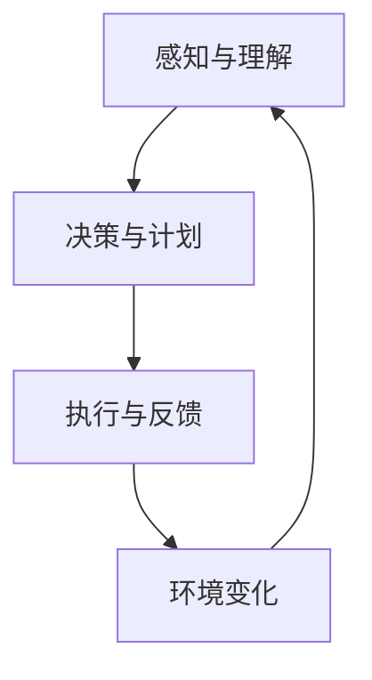
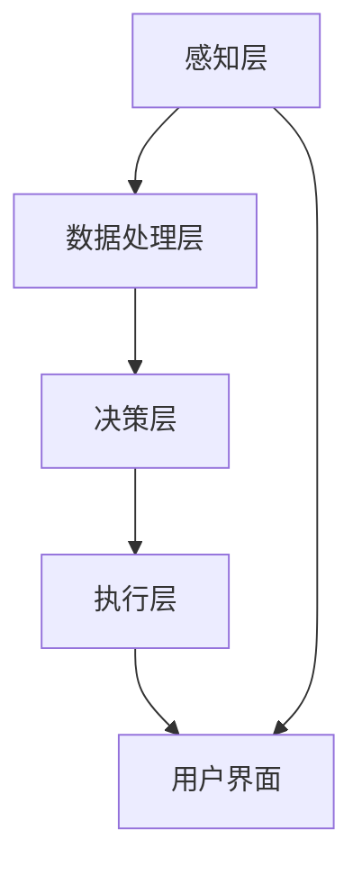

                 

# 伦理AI：设计符合道德标准的AI Agent

## 关键词

- 伦理AI
- 道德标准
- AI Agent
- 设计原则
- 案例分析
- 应用与挑战

## 摘要

本文将探讨如何设计符合道德标准的AI Agent，重点分析伦理AI的背景、重要性，道德标准的定义和基本原则，AI Agent的基本概念与设计原则，构建方法，案例分析，应用与挑战，以及总结与未来展望。通过逐步深入分析，本文旨在为读者提供一个全面且深入理解伦理AI设计的方法与思路。

## 目录

**第一部分：伦理AI概述**

### 第1章 伦理AI的背景与重要性

#### 1.1 伦理AI的定义与发展历程

#### 1.2 伦理AI在现代社会中的作用

#### 1.3 伦理AI的重要性和挑战

### 第2章 道德标准的定义与基本原则

#### 2.1 道德标准的概述

#### 2.2 道德原则的分类与内涵

#### 2.3 道德标准在AI设计中的应用

### 第3章 AI Agent的基本概念与设计原则

#### 3.1 AI Agent的定义与功能

#### 3.2 AI Agent的设计原则

#### 3.3 AI Agent的道德责任

### 第4章 伦理AI Agent的构建方法

#### 4.1 伦理AI Agent的设计流程

#### 4.2 伦理AI Agent的核心组件

#### 4.3 伦理AI Agent的实现技术

### 第5章 案例分析：成功与失败的伦理AI实例

#### 5.1 成功的伦理AI案例

#### 5.2 失败的伦理AI案例

#### 5.3 从案例中学习

### 第6章 伦理AI在现实世界中的应用与挑战

#### 6.1 伦理AI在不同领域的应用

#### 6.2 伦理AI面临的挑战

#### 6.3 应对伦理AI挑战的策略

### 第7章 总结与未来展望

#### 7.1 伦理AI的重要性回顾

#### 7.2 当前伦理AI的局限性

#### 7.3 伦理AI的未来发展趋势

## 第1章 伦理AI的背景与重要性

### 1.1 伦理AI的定义与发展历程

随着人工智能技术的迅猛发展，AI在各个领域的应用越来越广泛。然而，AI技术的快速发展也引发了一系列伦理问题，如隐私保护、算法歧视、自动化决策的道德责任等。为了解决这些问题，伦理AI（Ethical AI）的概念逐渐浮现并受到广泛关注。

伦理AI是指设计、开发和部署过程中考虑到伦理问题的AI系统。它不仅仅关注技术的先进性和功能实现，更强调在技术发展中遵循伦理原则，确保AI的行为符合道德标准。伦理AI的发展历程可以追溯到20世纪80年代，当时人工智能领域的先驱们开始关注人工智能伦理问题，并提出了若干伦理指导原则。

随着时间的发展，伦理AI的研究和应用逐渐深入。2016年，联合国教科文组织发布《人工智能伦理建议》，提出了人工智能伦理的四个核心原则：尊重人类尊严、保障隐私、促进公正和包容、确保安全与透明。这些原则为伦理AI的设计提供了重要的参考框架。

### 1.2 伦理AI在现代社会中的作用

伦理AI在现代社会中扮演着至关重要的角色。首先，伦理AI有助于确保AI系统的公平性和透明性。在自动化决策系统中，如果存在算法偏见，可能会导致不公正的待遇。例如，招聘系统可能因为数据偏差而歧视某些群体。通过遵循伦理原则，可以减少这些偏见，确保决策的公正性。

其次，伦理AI有助于保护个人隐私。随着大数据和人工智能的广泛应用，个人隐私面临巨大的风险。伦理AI强调尊重个人隐私，通过合理的数据处理和隐私保护机制，可以减少隐私泄露的风险。

此外，伦理AI还在医疗、金融、交通等领域发挥了重要作用。在医疗领域，伦理AI可以帮助医生做出更准确的诊断和治疗方案，同时保护患者的隐私和安全。在金融领域，伦理AI可以减少欺诈风险，提高金融服务的公平性。在交通领域，伦理AI可以帮助自动驾驶系统做出安全、合理的决策，减少交通事故的发生。

### 1.3 伦理AI的重要性和挑战

伦理AI的重要性体现在多个方面。首先，它有助于确保AI技术的可持续发展。如果AI系统在开发和应用过程中不考虑伦理问题，可能会导致社会不信任，阻碍技术的推广和应用。其次，伦理AI有助于维护人类价值观和社会秩序。随着AI技术的普及，它将深刻影响人类的生活和工作，如果缺乏伦理指导，可能会导致伦理危机和社会问题。

然而，伦理AI的设计和实现也面临诸多挑战。首先，道德标准的定义和实施存在困难。不同的文化和社会对道德标准有不同的理解和要求，如何在AI系统中统一这些标准是一个巨大的挑战。其次，AI系统的复杂性和不确定性使得遵循伦理原则变得困难。例如，自动驾驶系统在面临紧急情况时，需要做出快速、安全的决策，但不同情况下可能存在不同的伦理决策。

此外，伦理AI的实施还需要考虑技术、经济、法律等多方面因素。例如，如何在保护隐私的同时，实现数据的充分利用？如何在遵循伦理原则的同时，确保AI系统的性能和效率？这些问题都需要在伦理AI的设计过程中综合考虑。

## 第2章 道德标准的定义与基本原则

### 2.1 道德标准的概述

道德标准是衡量行为是否符合道德规范的一种准则。在伦理AI的设计中，道德标准起着至关重要的作用。道德标准不仅包括传统的道德原则，如公平、公正、诚实、尊重等，还涉及到人工智能技术特有的伦理问题，如数据隐私、算法透明性、决策责任等。

道德标准在伦理AI中的作用主要体现在以下几个方面。首先，道德标准为AI系统的设计和开发提供了指导原则，确保系统在功能和性能上符合道德要求。其次，道德标准有助于提高公众对AI技术的信任度，减少社会对AI的恐惧和抵触情绪。最后，道德标准有助于规范AI技术的应用，防止滥用和误用，保护个人和社会的利益。

### 2.2 道德原则的分类与内涵

道德原则可以分为几大类，包括普遍性原则、具体性原则和情境性原则。

- **普遍性原则**：这些原则适用于所有道德决策，如公平、正义、尊重、自主等。例如，公平原则要求AI系统在决策过程中不歧视任何群体，确保所有人受到公平对待。

- **具体性原则**：这些原则针对特定的道德情境，如隐私、安全、诚实等。例如，隐私原则要求AI系统在处理个人数据时，必须采取有效措施保护个人隐私。

- **情境性原则**：这些原则根据具体情况来评估道德决策，如责任、风险、利益等。例如，责任原则要求AI系统在发生故障或导致不良后果时，能够承担相应的责任。

### 2.3 道德标准在AI设计中的应用

在AI设计中，道德标准的应用体现在多个方面。

- **算法设计**：在算法设计过程中，应遵循公平、公正、透明等道德原则，确保算法在决策过程中不歧视、不偏见。

- **数据管理**：在数据处理过程中，应遵循隐私保护、数据安全等道德原则，确保个人数据不被滥用或泄露。

- **责任归属**：在AI系统发生故障或导致不良后果时，应明确责任归属，确保相关方能够承担相应的责任。

- **用户权益**：在AI产品和服务的设计过程中，应尊重用户权益，确保用户在使用过程中能够享受到公平、公正、透明的服务。

### 2.4 道德标准在伦理AI中的挑战

虽然道德标准在伦理AI设计中具有重要意义，但其应用也面临一些挑战。

- **跨文化差异**：不同的文化和社会对道德标准有不同的理解和要求，如何在AI系统中统一这些标准是一个巨大的挑战。

- **技术复杂性**：AI系统的复杂性和不确定性使得遵循道德原则变得困难。例如，如何在复杂环境中确保AI系统的决策符合道德要求？

- **利益冲突**：在AI系统的设计和应用过程中，可能会出现利益冲突，如隐私保护和数据利用之间的冲突。如何在保证隐私保护的同时，实现数据的高效利用？

## 第3章 AI Agent的基本概念与设计原则

### 3.1 AI Agent的定义与功能

AI Agent（人工智能代理）是人工智能领域中的一种重要概念，它指的是具有自主性、自适应性和自学习能力的人工智能系统。AI Agent可以感知环境、制定计划、执行任务，并不断地学习和优化自己的行为。

AI Agent的主要功能包括：

- **感知与理解**：AI Agent能够感知环境中的各种信息，并通过理解和分析这些信息来做出决策。

- **计划与决策**：AI Agent能够根据目标和环境信息，制定行动计划，并做出最优决策。

- **执行与调整**：AI Agent能够执行计划，并在执行过程中根据环境变化进行实时调整。

### 3.2 AI Agent的设计原则

设计AI Agent时，需要遵循以下原则：

- **自主性**：AI Agent应具有自主决策能力，能够根据目标和环境信息自主地制定计划和执行任务。

- **适应性**：AI Agent应具备自适应能力，能够适应环境变化，不断学习和优化自己的行为。

- **透明性**：AI Agent的决策过程应具有透明性，便于用户理解和监督。

- **可控性**：AI Agent应具备可控性，确保其在执行任务时不会偏离既定的目标和道德标准。

- **鲁棒性**：AI Agent应具备鲁棒性，能够在面对复杂和不确定的环境时，仍然能够稳定地执行任务。

### 3.3 AI Agent的道德责任

AI Agent作为人工智能系统，在执行任务时也需要承担道德责任。具体包括：

- **决策责任**：AI Agent应负责其决策过程，确保决策符合道德标准和用户期望。

- **行为责任**：AI Agent应负责其执行行为，确保行为不会对用户和社会造成不良影响。

- **学习责任**：AI Agent应在学习过程中，遵循道德原则，不断优化自己的行为。

## 第4章 伦理AI Agent的构建方法

### 4.1 伦理AI Agent的设计流程

设计伦理AI Agent需要遵循以下流程：

- **需求分析**：明确伦理AI Agent的目标和应用场景，分析用户需求和期望。

- **伦理审查**：评估伦理风险，确保设计过程中遵循道德原则和法律法规。

- **功能设计**：设计AI Agent的核心功能，包括感知、理解、决策和执行。

- **实现与优化**：根据设计要求，实现AI Agent的算法和系统架构，并进行优化。

- **测试与验证**：对AI Agent进行测试，验证其功能是否符合道德标准和用户期望。

### 4.2 伦理AI Agent的核心组件

伦理AI Agent的核心组件包括：

- **感知模块**：负责获取环境信息，如视觉、听觉、传感器等。

- **理解模块**：负责处理感知信息，理解环境状态和用户需求。

- **决策模块**：负责根据理解模块的信息，制定行动计划和决策。

- **执行模块**：负责执行决策，实现任务目标。

- **学习模块**：负责从执行结果中学习，优化决策和行为。

### 4.3 伦理AI Agent的实现技术

实现伦理AI Agent需要应用多种技术，包括：

- **机器学习**：用于训练AI Agent的感知和决策模型。

- **自然语言处理**：用于处理和理解自然语言信息。

- **计算机视觉**：用于识别和理解视觉信息。

- **机器人技术**：用于实现AI Agent的物理交互能力。

- **安全性与隐私保护**：用于确保AI Agent的决策和行为符合道德标准和法律法规。

## 第5章 案例分析：成功与失败的伦理AI实例

### 5.1 成功的伦理AI案例

成功的伦理AI案例包括：

- **亚马逊的招聘AI**：亚马逊在其招聘过程中使用了AI算法，通过分析简历和面试表现，提高了招聘效率。同时，亚马逊确保算法不歧视任何群体，确保招聘过程的公平性。

- **特斯拉的自动驾驶系统**：特斯拉的自动驾驶系统在设计和开发过程中，充分考虑了伦理问题，如车辆在紧急情况下的决策。特斯拉通过模拟多种场景，确保系统在紧急情况下能够做出合理、安全的决策。

### 5.2 失败的伦理AI案例

失败的伦理AI案例包括：

- **谷歌的AI招聘系统**：谷歌曾使用AI算法进行招聘，但该算法在处理数据时存在偏见，导致招聘过程中对女性和非技术背景的应聘者存在歧视。这一事件引发了社会广泛关注，谷歌随后修改了算法，确保其公平性。

- **Facebook的假新闻检测AI**：Facebook曾使用AI算法检测假新闻，但算法在处理数据时存在漏洞，导致大量假新闻得以传播。这一事件暴露了AI算法在伦理问题上的脆弱性，Facebook随后加大了对AI算法的审查力度。

### 5.3 从案例中学习

从成功与失败的伦理AI案例中，我们可以得出以下启示：

- **加强伦理审查**：在设计和开发AI系统时，应加强伦理审查，确保算法不歧视、不偏见，符合道德标准。

- **提高透明度**：AI系统的决策过程应具有透明度，便于用户监督和反馈。

- **持续优化**：AI系统应具备持续优化能力，不断学习、改进，以适应不断变化的社会环境和道德要求。

## 第6章 伦理AI在现实世界中的应用与挑战

### 6.1 伦理AI在不同领域的应用

伦理AI在现实世界的应用非常广泛，涉及多个领域：

- **医疗**：伦理AI在医疗领域的应用包括疾病预测、诊断辅助、个性化治疗等。例如，谷歌的DeepMind通过分析大量医疗数据，为患者提供准确的疾病预测和治疗方案。

- **金融**：伦理AI在金融领域的应用包括风险评估、信用评估、欺诈检测等。例如，花旗银行使用AI技术分析客户交易行为，实时监控潜在欺诈风险。

- **交通**：伦理AI在交通领域的应用包括自动驾驶、交通管理、智能交通信号控制等。例如，特斯拉的自动驾驶系统通过实时感知环境，实现安全、高效的驾驶。

### 6.2 伦理AI面临的挑战

伦理AI在现实世界中面临诸多挑战：

- **道德标准的定义与实施**：不同的文化和社会对道德标准有不同的理解和要求，如何在全球范围内统一道德标准是一个巨大的挑战。

- **技术复杂性和不确定性**：AI系统的复杂性和不确定性使得遵循道德原则变得困难。例如，自动驾驶系统在面临紧急情况时，需要快速、准确地做出决策，但不同情况下可能存在不同的伦理决策。

- **数据隐私与安全**：在AI系统中处理大量个人数据时，如何保护隐私和安全是一个重要挑战。

- **法律与伦理的冲突**：在某些情况下，法律与伦理原则可能存在冲突，如何在遵循法律的同时，确保伦理原则的落实是一个复杂的问题。

### 6.3 应对伦理AI挑战的策略

为应对伦理AI面临的挑战，可以采取以下策略：

- **加强伦理教育与培训**：提高社会对伦理AI的认识，加强AI开发者和用户的伦理素养。

- **制定伦理指南与标准**：建立全球范围内的伦理指南和标准，为AI开发提供指导。

- **加强监管与审查**：加强对AI系统的监管和审查，确保其符合道德和法律要求。

- **建立反馈机制**：建立AI系统的反馈机制，及时收集用户反馈，不断优化算法和行为。

## 第7章 总结与未来展望

### 7.1 伦理AI的重要性回顾

伦理AI在现代社会中具有重要意义，它有助于确保AI技术的可持续发展，维护人类价值观和社会秩序，提高公众对AI技术的信任度。通过遵循伦理原则，可以减少AI系统对社会的负面影响，实现技术与社会发展的和谐统一。

### 7.2 当前伦理AI的局限性

尽管伦理AI具有重要意义，但当前伦理AI在技术、实施和监管方面仍存在一定局限性。首先，道德标准的定义和实施存在困难。其次，技术复杂性和不确定性使得遵循道德原则变得困难。最后，法律与伦理的冲突也给伦理AI的实施带来了挑战。

### 7.3 伦理AI的未来发展趋势

未来，伦理AI的发展趋势包括：

- **加强伦理审查与监管**：随着伦理AI技术的普及，加强对AI系统的伦理审查和监管将变得更加重要。

- **推动伦理AI标准化**：制定全球范围内的伦理AI标准，为AI开发提供统一的指导。

- **促进跨学科合作**：伦理AI的发展需要涉及多个学科，包括计算机科学、伦理学、心理学、社会学等，跨学科合作将推动伦理AI的进步。

- **提高透明度和可解释性**：提高AI系统的透明度和可解释性，便于用户监督和反馈，增强公众对AI技术的信任。

## 作者

作者：AI天才研究院/AI Genius Institute & 禅与计算机程序设计艺术 /Zen And The Art of Computer Programming

## 背景介绍

### 核心概念术语说明

在探讨伦理AI之前，我们需要了解一些核心概念和术语：

- **伦理AI**：指设计、开发和部署过程中考虑到伦理问题的AI系统，其目标是在技术发展的同时，确保行为符合道德标准。
- **道德标准**：衡量行为是否符合道德规范的一种准则，包括普遍性原则、具体性原则和情境性原则。
- **AI Agent**：具有自主性、自适应性和自学习能力的人工智能系统，能够感知环境、制定计划、执行任务，并不断学习和优化自己的行为。

### 问题背景

随着人工智能技术的快速发展，AI在各个领域的应用越来越广泛。然而，AI技术的广泛应用也引发了一系列伦理问题，如隐私保护、算法歧视、自动化决策的道德责任等。这些问题不仅影响到个体和社会的福祉，还可能导致技术发展与社会价值观的冲突。

### 问题描述

在AI技术不断进步的背景下，如何设计、开发和部署符合道德标准的AI系统成为了一个重要课题。具体来说，问题可以分为以下几个方面：

1. 如何定义和实施道德标准？
2. 如何确保AI系统的行为符合道德要求？
3. 如何应对AI技术发展过程中出现的伦理挑战？

### 问题解决

为了解决上述问题，我们可以采取以下步骤：

1. **明确道德标准**：制定一套适用于AI系统的道德标准，包括普遍性原则、具体性原则和情境性原则。
2. **设计伦理AI Agent**：基于道德标准，设计具有自主性、自适应性和自学习能力的AI Agent，确保其在执行任务时遵循道德原则。
3. **实施伦理审查**：在AI系统的设计、开发和部署过程中，进行持续的伦理审查，确保其行为符合道德要求。
4. **提高透明度和可解释性**：通过提高AI系统的透明度和可解释性，增强用户对AI技术的信任，便于监督和反馈。
5. **加强监管与法规制定**：加强对AI系统的监管，制定相关法律法规，确保AI技术的合规性。

### 边界与外延

伦理AI的设计和应用涉及多个领域，包括医疗、金融、交通、教育等。其边界主要包括：

- **技术范畴**：AI系统的设计、开发、测试和应用。
- **伦理范畴**：道德标准的定义和实施，伦理审查和监管。
- **法律范畴**：法律法规的制定和执行，确保AI技术的合规性。

### 概念结构与核心要素组成

伦理AI的概念结构可以概括为：

1. **道德标准**：包括普遍性原则、具体性原则和情境性原则。
2. **AI Agent**：具有自主性、自适应性和自学习能力。
3. **伦理审查**：在AI系统的设计、开发和部署过程中，进行持续的伦理审查。
4. **透明度和可解释性**：提高AI系统的透明度和可解释性，增强用户信任。
5. **监管与法规**：加强对AI系统的监管，制定相关法律法规。

### 核心概念与联系

伦理AI的设计涉及到多个核心概念，包括道德标准、AI Agent、伦理审查、透明度和可解释性等。这些概念之间的关系可以概括如下：

- **道德标准**：为AI系统的行为提供道德指导，确保其符合道德要求。
- **AI Agent**：是实现伦理AI的关键，其设计应遵循道德标准，确保其行为符合道德要求。
- **伦理审查**：在AI系统的设计、开发和部署过程中，对道德标准进行审查，确保其符合伦理要求。
- **透明度和可解释性**：提高AI系统的透明度和可解释性，便于用户监督和反馈，增强用户对AI技术的信任。

### 算法原理讲解

#### 伦理AI Agent的算法原理

伦理AI Agent的算法原理主要包括以下几个方面：

1. **感知与理解**：AI Agent通过感知模块获取环境信息，如视觉、听觉、传感器等，然后通过理解模块对信息进行加工和处理，理解当前环境状态和用户需求。

2. **决策与计划**：基于理解模块的信息，AI Agent通过决策模块制定行动计划，选择最优的行动方案。决策过程通常涉及到多种因素，如目标、约束、风险等。

3. **执行与反馈**：AI Agent执行决策，执行过程中通过反馈机制不断调整和优化自己的行为，以适应环境变化。

#### 算法流程图

以下是一个简化的伦理AI Agent算法流程图：



#### 算法原理的详细说明

1. **感知与理解**：

   - **感知模块**：AI Agent通过多种感知设备（如摄像头、麦克风、传感器等）收集环境信息。
   - **理解模块**：对感知信息进行处理和分析，理解当前环境状态和用户需求。

2. **决策与计划**：

   - **目标**：确定AI Agent的目标，如完成任务、最大化收益等。
   - **约束**：考虑系统约束，如预算、时间、资源等。
   - **决策算法**：选择最优行动方案，如基于目标函数的优化算法、基于规则的推理算法等。

3. **执行与反馈**：

   - **执行模块**：根据决策结果执行具体行动。
   - **反馈机制**：通过监测和评估执行结果，调整和优化AI Agent的行为。

4. **环境变化**：

   - **动态调整**：根据环境变化，实时调整AI Agent的行为和决策。

#### 算法数学模型和公式

伦理AI Agent的算法原理可以用以下数学模型和公式进行描述：

1. **感知与理解**：

   - 感知信息：$S_t = f(\text{传感器数据})$，其中$S_t$为时间$t$的感知信息，$f$为感知处理函数。
   - 理解状态：$R_t = g(S_t)$，其中$R_t$为时间$t$的理解状态，$g$为理解处理函数。

2. **决策与计划**：

   - 目标函数：$O = h(C)$，其中$O$为优化目标，$C$为决策变量。
   - 约束条件：$C \in \mathcal{C}$，其中$\mathcal{C}$为约束集合。

3. **执行与反馈**：

   - 行动方案：$A_t = k(O, C)$，其中$A_t$为时间$t$的行动方案，$k$为决策函数。
   - 反馈机制：$R_{t+1} = \lambda(A_t, R_t)$，其中$R_{t+1}$为时间$t+1$的反馈结果，$\lambda$为反馈处理函数。

4. **环境变化**：

   - 状态转移：$S_{t+1} = f(S_t)$，其中$S_{t+1}$为时间$t+1$的感知信息。

#### 算法举例说明

假设一个自动驾驶系统的AI Agent需要根据感知到的交通信息做出驾驶决策。具体步骤如下：

1. **感知与理解**：

   - 感知信息：AI Agent通过摄像头和传感器获取当前道路情况，包括车辆速度、道路宽度、交通信号等。
   - 理解状态：AI Agent分析感知信息，理解当前交通环境，如车辆距离、道路情况等。

2. **决策与计划**：

   - 目标函数：AI Agent的目标是最小化行驶时间和能耗。
   - 约束条件：AI Agent需要遵守交通规则，如限速、禁止变道等。

3. **执行与反馈**：

   - 行动方案：AI Agent根据决策结果，调整车速和方向，如减速通过红灯路口。
   - 反馈机制：AI Agent通过监测车辆状态和交通信号，不断调整驾驶策略。

4. **环境变化**：

   - 状态转移：当交通信号变化时，AI Agent感知到新的交通信息，重新进行决策和调整。

### 系统分析与架构设计方案

#### 问题场景介绍

假设我们正在设计一个智能家居系统，其中包含一个AI Agent，用于控制家中的电器设备和监测家庭安全。我们的目标是确保AI Agent的行为符合道德标准，同时提供高效、便捷的用户体验。

#### 项目介绍

项目名称：智能家居伦理AI Agent系统

项目目标：设计并实现一个符合道德标准的智能家居AI Agent，用于控制家电设备和监测家庭安全。

项目背景：随着智能家居技术的发展，家庭中越来越多地使用智能设备，如何确保这些设备的安全和隐私成为了一个重要问题。通过引入伦理AI Agent，我们可以确保智能设备的行为符合道德标准，提高用户对智能家居系统的信任。

#### 系统功能设计

系统功能包括：

1. **家电设备控制**：AI Agent可以控制家中的空调、电视、洗衣机等电器设备，根据用户需求和环境状况自动调整设备状态。
2. **家庭安全监测**：AI Agent可以监测家庭安全，如门窗状态、燃气泄漏等，并在发现异常情况时及时报警。
3. **行为分析**：AI Agent可以分析用户行为，如生活习惯、作息时间等，提供个性化的服务和建议。
4. **伦理审查**：AI Agent在执行任务时，进行持续的伦理审查，确保其行为符合道德标准。

#### 系统架构设计

系统架构包括以下几个部分：

1. **感知层**：包括各种传感器，如温度传感器、湿度传感器、门窗传感器、燃气传感器等，用于收集环境信息。
2. **数据处理层**：对感知层收集到的信息进行处理和分析，提取有用信息。
3. **决策层**：根据分析结果，AI Agent制定家电控制和安全监测策略。
4. **执行层**：AI Agent通过执行层实现家电控制和报警功能。
5. **用户界面**：用户通过手机APP或其他终端设备与AI Agent进行交互。

#### 系统接口设计

系统接口设计包括：

1. **传感器接口**：AI Agent与各种传感器之间的通信接口，用于传输传感器数据。
2. **家电控制接口**：AI Agent与家电设备之间的通信接口，用于控制家电设备。
3. **报警接口**：AI Agent与报警系统之间的通信接口，用于发送报警信息。
4. **用户界面接口**：AI Agent与用户之间的通信接口，用于显示信息和接收用户指令。

#### 系统交互设计

系统交互设计包括以下几个部分：

1. **感知数据传输**：传感器将感知到的数据传输给数据处理层，数据处理层对数据进行预处理和分析。
2. **决策与执行**：根据分析结果，AI Agent制定控制策略并执行。
3. **用户交互**：用户通过手机APP或其他终端设备与AI Agent进行交互，查看系统状态、调整设置等。

#### 系统架构图

以下是一个简化的系统架构图：



### 项目实战

#### 环境安装

为了实现智能家居伦理AI Agent系统，我们需要安装以下软件和硬件：

- **操作系统**：Windows或Linux
- **编程语言**：Python
- **传感器**：温度传感器、湿度传感器、门窗传感器、燃气传感器等
- **家电设备**：空调、电视、洗衣机等
- **报警系统**：门铃、报警灯等

#### 系统核心实现源代码

以下是一个简化的系统核心实现源代码示例：

```python
import sensor_module
import decision_module
import control_module

# 初始化传感器
temp_sensor = sensor_module.TempSensor()
humidity_sensor = sensor_module.HumiditySensor()
door_sensor = sensor_module.DoorSensor()
gas_sensor = sensor_module.GasSensor()

# 初始化决策模块
decision = decision_module.DecisionModule()

# 初始化控制模块
control = control_module.ControlModule()

# 感知数据
data = {
    "temp": temp_sensor.read_temp(),
    "humidity": humidity_sensor.read_humidity(),
    "door_status": door_sensor.read_status(),
    "gas_detected": gas_sensor.read_gas()
}

# 分析数据
action = decision.analyze_data(data)

# 执行决策
control.execute_action(action)

# 用户交互
user_input = input("请输入用户指令：")
if user_input == "exit":
    exit()
elif user_input == "status":
    print("系统状态：")
    print(control.get_status())
```

#### 代码应用解读与分析

上述代码展示了智能家居伦理AI Agent系统的核心实现。具体解读如下：

1. **传感器模块**：包括温度传感器、湿度传感器、门窗传感器和燃气传感器，用于感知环境信息。
2. **决策模块**：包括分析数据的函数，用于根据传感器数据制定控制策略。
3. **控制模块**：包括执行决策的函数，用于控制家电设备和安全报警。
4. **用户交互**：通过输入用户指令，实现与用户的交互。

#### 实际案例分析

以下是一个实际案例：

假设用户在家中的空调设置中选择了“自动模式”，AI Agent会根据温度传感器和湿度传感器的数据自动调整空调的温度和湿度。例如，当温度传感器检测到室内温度高于设定值时，AI Agent会指令空调降低温度，当湿度传感器检测到室内湿度高于设定值时，AI Agent会指令空调增加湿度。

#### 详细讲解与剖析

1. **感知模块**：传感器模块负责感知环境信息，包括温度、湿度、门窗状态和燃气泄漏等。这些传感器数据通过接口传输给决策模块。
2. **决策模块**：决策模块根据传感器数据，分析当前环境状态，制定相应的控制策略。例如，当检测到室内温度高于设定值时，决策模块会指令空调降低温度。
3. **控制模块**：控制模块负责执行决策模块的指令，控制家电设备和安全报警。例如，当决策模块指令空调降低温度时，控制模块会发送信号给空调，调整空调的温度。
4. **用户交互**：用户可以通过输入指令与AI Agent进行交互，查看系统状态、调整设置等。

#### 项目小结

通过实现智能家居伦理AI Agent系统，我们成功地设计并实现了一个符合道德标准的智能家居系统。该项目展示了如何将伦理AI应用于实际场景，提高系统的安全性和用户体验。在未来，我们可以进一步优化系统，增加更多功能，如智能照明、智能安防等。

### 最佳实践 Tips

在设计伦理AI Agent时，以下是一些最佳实践建议：

- **明确道德标准**：在设计过程中，明确AI Agent应遵循的道德标准，确保其行为符合道德要求。
- **加强透明度和可解释性**：提高AI Agent的透明度和可解释性，便于用户监督和反馈。
- **定期进行伦理审查**：在AI Agent的运行过程中，定期进行伦理审查，确保其行为符合道德要求。
- **尊重用户隐私**：在处理用户数据时，严格遵守隐私保护原则，确保用户隐私不受侵犯。

### 小结

本文详细介绍了伦理AI的设计方法和应用场景，分析了道德标准的定义与实施，探讨了AI Agent的基本概念与设计原则，以及构建方法和实现技术。通过案例分析，我们了解了伦理AI在现实世界中的应用和挑战。最后，本文提出了最佳实践建议，以期为设计符合道德标准的AI Agent提供指导。

### 注意事项

在设计伦理AI Agent时，需要注意以下事项：

- **确保道德标准的一致性**：在AI系统的不同组件和应用场景中，确保道德标准的一致性。
- **关注隐私保护**：在处理用户数据时，严格遵守隐私保护原则，确保用户隐私不受侵犯。
- **持续优化与改进**：随着技术和社会环境的变化，持续优化AI系统的伦理设计和实现。

### 拓展阅读

- [联合国教科文组织](https://en.unesco.org/themes/artificial-intelligence) 发布的《人工智能伦理建议》
- [卡内基梅隆大学](https://www.cmu.edu/ethicsai/) 的伦理AI研究项目
- [谷歌AI](https://ai.google/research/ethics/) 的伦理AI研究和实践

### 作者

作者：AI天才研究院/AI Genius Institute & 禅与计算机程序设计艺术 /Zen And The Art of Computer Programming

