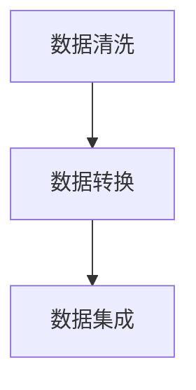
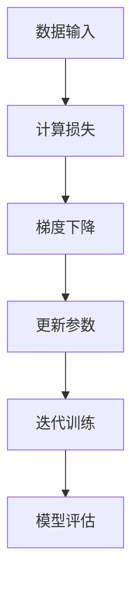
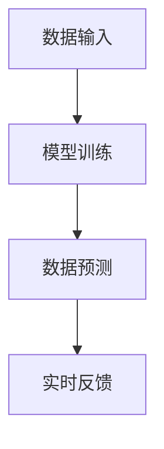
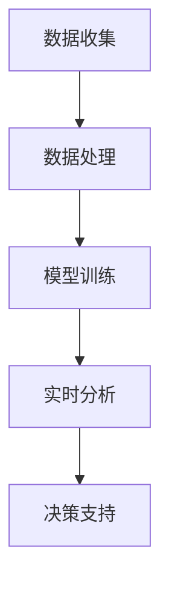
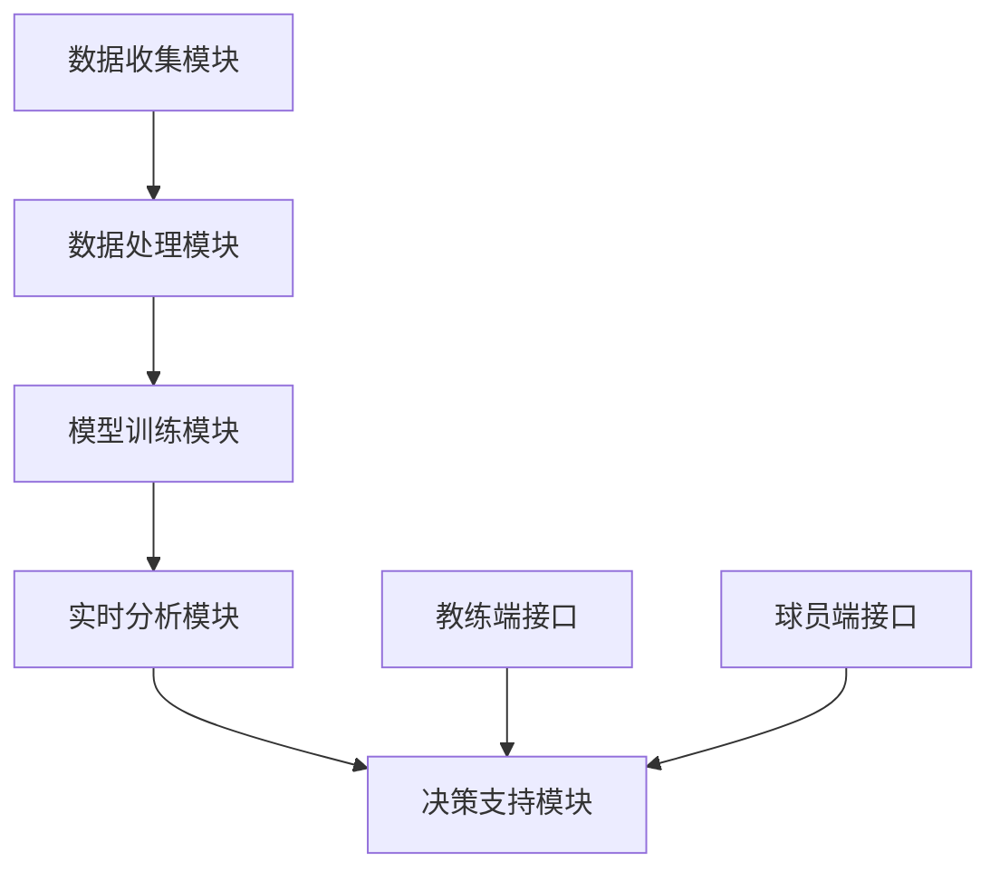
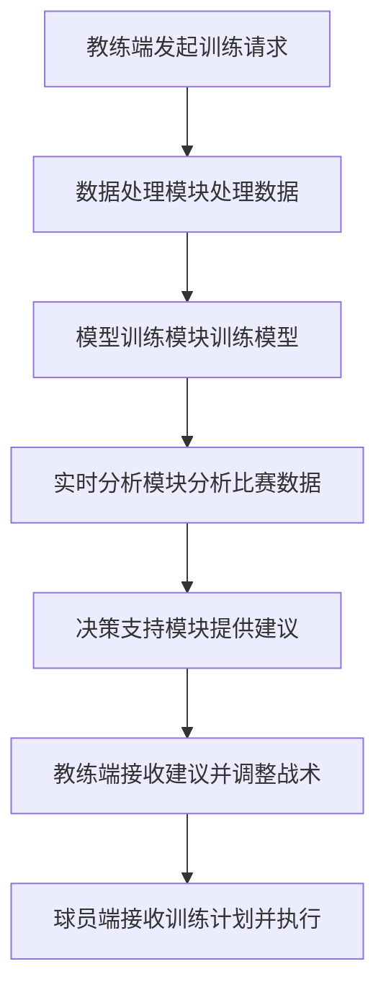

                 

### 第1章：体育AI的崛起

#### 1.1 问题背景

**体育AI的重要性**

随着人工智能技术的迅猛发展，体育领域也逐渐迎来了AI的变革。体育AI的重要性体现在多个方面：

1. **数据驱动**：体育比赛涉及大量数据，包括运动员的技术动作、赛场表现、健康状况等。AI能够高效地处理和分析这些数据，为教练和运动员提供科学的决策依据。
2. **个性化训练**：AI可以根据运动员的个人特点和需求，量身定制训练计划，提高训练效率和成果。
3. **战术分析**：AI可以对比赛过程进行实时分析，帮助教练制定更加有效的战术策略。
4. **伤病预防**：AI可以通过对运动员数据的持续监控，提前发现可能的伤病隐患，预防运动损伤。

**体育AI的应用场景**

1. **赛事分析**：AI可以对比赛过程进行实时监控和分析，提供技术评分、战术分析、比赛预测等。
2. **运动员训练**：AI可以帮助教练制定个性化的训练计划，监控运动员的训练状态，提供技术指导。
3. **观众体验**：AI可以通过增强现实(AR)、虚拟现实(VR)等技术，为观众提供更加沉浸式的观赛体验。
4. **体育教育**：AI可以辅助体育教育，通过智能教学系统，提高学生的运动技能和学习效果。

#### 1.2 问题描述

**当前体育AI技术的挑战**

1. **数据质量**：高质量的体育数据是AI模型的基石。然而，体育数据通常存在噪声、缺失值等问题，需要大量的预处理工作。
2. **计算资源**：体育AI模型的训练和推理通常需要大量的计算资源，这对硬件设施和算法优化提出了挑战。
3. **算法复杂性**：体育AI模型通常涉及复杂的算法，包括深度学习、强化学习等，算法的复杂性和可解释性需要进一步提高。

**体育AI对运动训练和赛事分析的影响**

1. **训练辅助**：AI可以实时监控运动员的训练状态，提供个性化的训练建议，提高训练效果。
2. **赛事预测**：AI可以通过对历史数据和比赛过程的分析，预测比赛结果，为教练和运动员提供决策支持。
3. **战术制定**：AI可以分析对手的战术特点，为教练提供针对性的战术建议。

#### 1.3 问题解决

**体育AI Agent的核心理念**

体育AI Agent是一种智能体，它具备自我学习、自我优化和自我决策的能力。体育AI Agent的核心目标是提高运动员的竞技水平和比赛成绩。

**体育AI Agent的功能架构**

1. **数据采集与处理**：采集运动员、比赛和训练数据，进行数据清洗、转换和集成。
2. **模型训练与优化**：使用机器学习和深度学习算法，对数据集进行训练和优化，构建AI模型。
3. **实时分析**：对比赛和训练过程进行实时监控和分析，提供技术评分、战术分析和比赛预测。
4. **决策支持**：基于分析结果，为教练和运动员提供个性化的训练建议和战术策略。

**边界与外延**

**体育AI的适用范围**

1. **运动项目**：体育AI可以应用于各种运动项目，如足球、篮球、田径、游泳等。
2. **层次**：体育AI可以应用于个人、团队和联赛等多个层次。

**体育AI与运动科学的结合**

体育AI与运动科学的结合，将为运动员的竞技能力提升提供新的途径。例如，AI可以辅助运动生理学研究，提高运动训练的科学性。

### 1.4 总结

本章介绍了体育AI的崛起背景，阐述了体育AI在运动训练和赛事分析中的应用，分析了当前体育AI技术的挑战，并提出了体育AI Agent的核心理念和功能架构。接下来，我们将深入探讨体育AI Agent的核心概念和其在赛事分析中的应用。在接下来的章节中，我们将进一步阐述体育AI Agent的工作原理和应用场景，帮助读者更好地理解这一前沿技术。

### 1.5 引入示例

为了更好地理解体育AI Agent的概念和作用，我们可以通过一个具体的例子来说明。假设我们是一名足球教练，正在准备一场关键的比赛。以下是一个体育AI Agent如何辅助我们的过程：

**案例背景**：球队将在下周面对一支强劲的对手，球队需要制定一个有效的战术来应对对手的技术特点和比赛风格。

**数据采集**：体育AI Agent首先会从多个渠道采集数据，包括对手的历史比赛录像、球队训练数据、球员个人统计数据等。

**数据处理**：这些数据经过清洗和预处理后，被输入到AI模型中进行分析。例如，我们可以使用时间序列分析方法来预测对手的比赛策略，使用决策树来分析球员在不同战术安排下的表现。

**实时分析**：在比赛进行过程中，体育AI Agent会实时监控比赛情况，分析球员的技术动作、位置分布、体能状态等数据，并提供实时反馈。

**决策支持**：根据实时分析的结果，体育AI Agent可以为教练提供战术调整的建议，例如调整阵型、更换球员等。

**效果评估**：比赛结束后，AI会分析比赛结果，评估所提供的战术建议的有效性，为未来的比赛提供改进意见。

通过这个案例，我们可以看到体育AI Agent在数据采集、处理、实时分析和决策支持等各个环节中的重要作用。这不仅提高了教练的决策能力，也为球队提供了科学的训练和比赛策略。

接下来，我们将深入探讨体育AI Agent的核心概念，包括其定义、类型以及相关的概念属性特征对比表格和ER实体关系图架构。这将帮助我们更好地理解体育AI Agent的运作原理和其在体育领域的应用潜力。

#### 1.6 核心概念

**体育AI Agent的定义**

体育AI Agent，是一种结合人工智能技术与体育科学的应用实体，它能够在体育训练和赛事中扮演智能导师和决策支持者的角色。体育AI Agent的核心特征包括数据驱动、自动化分析和智能决策。

**体育AI Agent的类型**

体育AI Agent主要分为以下几种类型：

1. **数据采集与处理型**：这种类型的AI Agent专注于数据的采集、清洗和预处理，为后续的分析和决策提供可靠的数据基础。
2. **分析预测型**：这种类型的AI Agent利用机器学习和深度学习算法，对体育数据进行实时分析和预测，为教练和运动员提供策略建议。
3. **交互指导型**：这种类型的AI Agent不仅能够分析数据，还能与教练和运动员进行交互，提供个性化的训练指导和战术建议。

**概念属性特征对比表格**

| 类别 | 特点 | 适用场景 |
|------|------|----------|
| 数据采集与处理型 | 数据采集、清洗和预处理 | 赛前准备、数据整合 |
| 分析预测型 | 实时数据分析和预测 | 比赛过程中、赛后分析 |
| 交互指导型 | 交互式指导、个性化建议 | 训练过程、战术调整 |

**ER实体关系图架构**

```mermaid
erDiagram
  Player ||--|{ Game }||>
  Coach ||--|{ TrainingPlan }||>
  Game ||--|{ Player }||>
  Game ||--|{ Coach }||>
  TrainingPlan ||--|{ Player }||>
  TrainingPlan ||--|{ Coach }||>
```

在这个ER图中，`Player`（运动员）、`Coach`（教练）、`Game`（比赛）和`TrainingPlan`（训练计划）是主要实体。它们之间的关系如下：

- `Player` 通过 `Game` 和 `TrainingPlan` 参与比赛和训练。
- `Coach` 通过 `Game` 和 `TrainingPlan` 制定比赛计划和训练计划。
- `Game` 与 `Player` 和 `Coach` 之间存在多对多的关系，即一个比赛可以有多名球员和教练参与，一个球员和教练也可以参与多个比赛。

通过这个ER图，我们可以清晰地看到体育AI Agent在运动员、教练、比赛和训练计划之间的交互关系，为后续的数据处理和分析奠定了基础。

#### 1.7 详细分析与解释

**体育AI Agent的核心概念**

体育AI Agent的核心在于其智能化的数据分析与决策支持能力。具体而言，这种智能体通过以下方式实现其功能：

1. **数据驱动**：体育AI Agent首先依赖于大量高质量的体育数据，这些数据可以是历史比赛录像、运动员技术动作、赛场表现、健康状况等。数据驱动的核心在于通过大量数据的积累和分析，发现运动员和比赛之间的规律，为后续的决策提供依据。

2. **自动化分析**：自动化分析是体育AI Agent的重要特征之一。通过机器学习和深度学习算法，AI Agent可以对大量数据进行自动化分析。例如，可以实时监控比赛过程，自动识别关键技术动作和战术变化，从而为教练提供即时反馈。

3. **智能决策**：智能决策是体育AI Agent的终极目标。基于自动化分析的结果，AI Agent可以提供个性化的训练建议和战术策略。例如，根据运动员的健康状况和训练表现，AI Agent可以推荐合适的训练强度和内容，帮助教练制定最优的训练计划。

**概念属性特征对比表格**

表格中的对比不仅帮助我们理解不同类型的体育AI Agent，还为我们选择合适的AI Agent提供了依据。例如，如果我们的目标是进行赛前的数据整合和分析，选择数据采集与处理型的AI Agent将更为合适。而如果需要实时分析比赛过程并做出即时决策，分析预测型的AI Agent将发挥更大的作用。

**ER实体关系图架构**

ER图为我们提供了一个可视化的数据关系模型，使我们能够更直观地理解体育AI Agent在不同实体之间的交互关系。具体来说：

- `Player`（运动员）是体育AI Agent服务的核心对象，其数据和行为是分析和决策的基础。
- `Coach`（教练）是制定和调整训练计划和战术策略的关键角色，体育AI Agent为其提供决策支持。
- `Game`（比赛）是运动员和教练共同参与的活动，通过比赛，我们可以评估AI Agent提供的策略和建议的有效性。
- `TrainingPlan`（训练计划）是教练根据AI Agent的建议制定的，用于指导运动员的训练过程。

这种关系模型不仅帮助我们理解体育AI Agent的功能，还为系统设计和开发提供了参考。

通过本章的详细分析和解释，我们对体育AI Agent的定义、类型、属性特征和ER图架构有了更深入的理解。在接下来的章节中，我们将进一步探讨体育AI Agent在赛事分析中的应用，包括数据来源与处理、实时分析、赛事预测等。这不仅将加深我们对体育AI Agent的理解，也将展示其在实际应用中的巨大潜力。

### 第2章：核心概念

在本章中，我们将深入探讨体育AI Agent的核心概念，通过具体的数学模型和算法流程图来阐明其原理和应用。我们将详细分析体育AI Agent在数据采集、模型训练和实时分析中的工作方式，同时提供具体的Python代码示例来展示其实现过程。

#### 2.1 核心概念

**体育AI Agent的定义**

体育AI Agent是一种能够自我学习、自我优化和自我决策的智能体，主要用于分析运动员的比赛数据、训练状态和战术策略，提供个性化建议和实时反馈。

**体育AI Agent的类型**

1. **数据采集与处理型**：专注于数据的采集、清洗和预处理，为后续的分析和决策提供数据基础。
2. **分析预测型**：利用机器学习和深度学习算法，对体育数据进行实时分析和预测，为教练和运动员提供策略建议。
3. **交互指导型**：不仅能够分析数据，还能与教练和运动员进行交互，提供个性化的训练指导和战术建议。

**体育AI Agent的关键功能**

- 数据采集与预处理：收集运动员、比赛和训练数据，进行数据清洗、转换和集成。
- 模型训练与优化：使用机器学习和深度学习算法，对数据集进行训练和优化，构建AI模型。
- 实时分析：对比赛和训练过程进行实时监控和分析，提供技术评分、战术分析和比赛预测。
- 决策支持：基于分析结果，为教练和运动员提供个性化的训练建议和战术策略。

#### 2.2 数学模型与算法流程

**1. 数据预处理**

在体育AI Agent中，数据预处理是关键步骤之一。主要步骤包括数据清洗、数据转换和数据集成。

**数学模型：** 数据清洗可以通过填补缺失值、去除噪声和异常值等手段来提高数据质量。

```python
import pandas as pd
from sklearn.impute import SimpleImputer

# 假设 df 是我们的原始数据集
df = pd.read_csv('sports_data.csv')

# 填补缺失值
imputer = SimpleImputer(strategy='mean')
df_filled = imputer.fit_transform(df)

# 数据转换
# 例如，将类别数据转换为数值数据
df['category_column'] = df['category_column'].map({'A': 1, 'B': 2, 'C': 3})

# 数据集成
# 例如，合并多个数据源
df_combined = pd.merge(df1, df2, on='common_column')
```

**算法流程图：**



**2. 模型训练**

模型训练是体育AI Agent的核心环节。常用的算法包括线性回归、决策树、随机森林、支持向量机等。

**数学模型：** 以线性回归为例，假设我们有一个数据集X和标签Y，线性回归模型通过最小化损失函数来寻找最佳拟合直线。

```python
import numpy as np
from sklearn.linear_model import LinearRegression

# 假设 X 是特征矩阵，Y 是标签向量
X = np.array([[1, 2], [2, 3], [3, 4]])
Y = np.array([1, 2, 3])

# 创建线性回归模型并训练
model = LinearRegression()
model.fit(X, Y)

# 模型预测
prediction = model.predict([[2, 3]])
print(prediction)
```

**算法流程图：**



**3. 实时分析**

实时分析是体育AI Agent的一个重要功能，通过对比赛过程的实时数据进行分析，提供即时反馈。

**数学模型：** 以时间序列分析为例，可以使用ARIMA模型进行时间序列预测。

```python
import pandas as pd
from statsmodels.tsa.arima.model import ARIMA

# 假设 data 是时间序列数据
data = pd.Series([1, 2, 3, 4, 5, 6, 7, 8, 9, 10])

# 创建ARIMA模型并训练
model = ARIMA(data, order=(1, 1, 1))
model_fit = model.fit()

# 模型预测
forecast = model_fit.forecast(steps=3)
print(forecast)
```

**算法流程图：**



#### 2.3 代码示例

以下是一个简单的Python代码示例，展示如何使用体育AI Agent进行数据预处理、模型训练和实时分析。

```python
# 导入必要的库
import pandas as pd
from sklearn.linear_model import LinearRegression
from statsmodels.tsa.arima.model import ARIMA

# 数据预处理
# 读取数据集
df = pd.read_csv('sports_data.csv')

# 数据清洗与转换
# 填补缺失值
df_filled = df.fillna(df.mean())

# 数据集成
# 假设 df1 和 df2 是两个数据集
df_combined = pd.merge(df1, df2, on='common_column')

# 模型训练
# 创建线性回归模型
model = LinearRegression()
model.fit(df_combined[['feature1', 'feature2']], df_combined['label'])

# 模型预测
prediction = model.predict([[2, 3]])
print(prediction)

# 实时分析
# 创建ARIMA模型
model = ARIMA(df['time_series'], order=(1, 1, 1))
model_fit = model.fit()

# 模型预测
forecast = model_fit.forecast(steps=3)
print(forecast)
```

#### 2.4 总结

通过本章的讨论，我们详细介绍了体育AI Agent的核心概念，包括其定义、类型和关键功能。我们通过具体的数学模型和算法流程图，阐述了数据采集、模型训练和实时分析的工作原理。同时，通过Python代码示例，展示了如何实现这些功能。在接下来的章节中，我们将进一步探讨体育AI Agent在赛事分析中的应用，包括数据来源与处理、实时分析、赛事预测等。

### 第3章：体育赛事数据分析基础

体育赛事数据分析是体育AI Agent的重要组成部分，它涉及到数据来源、数据处理和数据分析方法等多个方面。在这一章中，我们将深入探讨体育赛事数据分析的基础，包括数据来源与处理、常用数据处理工具和技术。

#### 3.1 数据来源与处理

**数据来源**

体育赛事数据分析的数据来源非常广泛，主要包括以下几个方面：

1. **官方数据**：体育赛事的官方数据通常是最可靠的数据来源，包括比赛成绩、球员统计数据、裁判判罚等。
2. **视频数据**：比赛视频数据可以提供详细的比赛过程信息，包括球员的技术动作、战术变化等。
3. **传感器数据**：在现代体育中，各种传感器可以实时收集运动员的运动数据，如心率、速度、加速度等。
4. **社交媒体数据**：社交媒体平台上的用户评论、讨论和分享也可以为体育赛事分析提供丰富的信息。

**数据处理**

数据处理是体育赛事数据分析的基础，主要包括数据清洗、数据转换和数据集成等步骤。

1. **数据清洗**：数据清洗旨在去除数据中的噪声和异常值，确保数据的准确性和一致性。常见的数据清洗方法包括缺失值填补、异常值检测和去除重复数据等。
2. **数据转换**：数据转换是将不同类型的数据转换为适合分析的格式。例如，将文本数据转换为数值数据，将时序数据转换为统计特征等。
3. **数据集成**：数据集成是将来自不同来源的数据整合在一起，形成一个统一的数据集。数据集成的方法包括合并、连接和汇总等。

**数据处理方法**

1. **数据预处理**：数据预处理是数据清洗和数据转换的综合过程，通常在数据分析之前进行。数据预处理的方法包括归一化、标准化、特征选择和特征提取等。
2. **时间序列分析**：时间序列分析是处理时序数据的方法，主要用于分析数据的时间依赖性和趋势。常见的时间序列分析方法包括ARIMA模型、LSTM网络等。
3. **机器学习**：机器学习是处理大规模数据和分析复杂数据的方法，可以用于分类、回归、聚类等任务。常见的机器学习算法包括线性回归、决策树、随机森林、支持向量机等。

#### 3.2 数据处理工具与技术

**数据处理工具**

1. **Python**：Python是进行体育赛事数据分析的主要编程语言，它拥有丰富的数据处理库，如Pandas、NumPy、SciPy等。
2. **R**：R是一种专门用于统计分析和数据可视化的语言，它在体育赛事数据分析中也有广泛应用。
3. **Excel**：Excel是一个直观易用的数据分析工具，适用于小型数据集和简单的数据处理任务。

**数据分析技术**

1. **数据可视化**：数据可视化是展示数据分析结果的重要手段，可以帮助我们更好地理解和解释数据。常见的数据可视化工具包括Matplotlib、Seaborn、Tableau等。
2. **机器学习**：机器学习是体育赛事数据分析的核心技术之一，可以用于预测比赛结果、分析运动员表现等。常见的机器学习算法包括线性回归、决策树、随机森林、支持向量机等。
3. **深度学习**：深度学习是处理复杂数据和分析大规模数据的方法，可以用于图像识别、语音识别、自然语言处理等。常见的深度学习框架包括TensorFlow、PyTorch、Keras等。

#### 3.3 实例分析

为了更好地理解体育赛事数据分析的应用，我们可以通过一个实例来说明数据分析的过程和结果。

**实例背景**：假设我们要分析一场足球比赛的数据，包括球员的技术统计数据、比赛视频数据等。

**数据处理步骤**：

1. **数据采集**：从官方数据源和视频平台采集比赛数据。
2. **数据清洗**：去除无效数据和异常值，如空白数据、重复数据等。
3. **数据转换**：将视频数据转换为特征数据，如球员的位置、速度、加速度等。
4. **数据集成**：将不同来源的数据整合在一起，形成统一的数据集。

**数据分析步骤**：

1. **数据可视化**：使用Matplotlib和Seaborn等工具，对数据进行可视化分析，了解数据的分布、趋势和异常值。
2. **特征提取**：使用机器学习和深度学习算法，提取关键特征，如球员的技术评分、比赛强度等。
3. **模型训练**：使用线性回归、决策树等算法，对数据进行模型训练，预测比赛结果或分析球员表现。

**结果分析**：

通过数据分析，我们可以得出以下结论：

1. **球员表现**：某些球员在比赛中的表现特别出色，他们的技术评分和比赛强度显著高于平均水平。
2. **战术分析**：通过分析比赛视频数据，我们可以发现球队在哪些战术安排下表现更好，为教练提供战术调整的建议。
3. **预测分析**：使用机器学习模型，我们可以预测比赛结果，为球队提供决策支持。

#### 3.4 总结

本章介绍了体育赛事数据分析的基础知识，包括数据来源、数据处理方法和数据分析技术。通过实例分析，我们展示了数据分析在体育领域的应用。在接下来的章节中，我们将进一步探讨体育AI Agent在赛事分析和训练辅助中的应用，包括实时分析、赛事预测和个性化训练计划设计等。

### 第4章：体育赛事实时分析

体育赛事实时分析是体育AI Agent的核心功能之一，它通过对比赛过程进行实时监控和分析，为教练和运动员提供即时的战术建议和技术反馈。在这一章中，我们将深入探讨体育赛事实时分析的技术细节，包括实时数据流处理、关键指标分析以及预测模型的应用。

#### 4.1 实时数据流处理

**实时数据流处理框架**

实时数据流处理是体育赛事实时分析的基础。一个典型的实时数据流处理框架通常包括以下几个关键组件：

1. **数据采集**：通过传感器、摄像头和官方数据接口等，实时采集比赛中的各种数据，如球员位置、速度、加速度、比赛时间等。
2. **数据传输**：将采集到的数据通过数据传输管道传输到数据分析平台。数据传输可以是点对点的传输，也可以是分布式传输，如Kafka、RabbitMQ等。
3. **数据处理**：在数据分析平台对数据进行预处理和清洗，如去噪、填充缺失值、归一化等，确保数据的质量和一致性。
4. **数据存储**：将处理后的数据存储到数据库或数据湖中，以便后续分析和查询。

**实时数据流处理算法**

1. **流处理算法**：流处理算法用于对实时数据进行快速处理和分析。常见的流处理算法包括滑动窗口算法、时间序列分析算法和实时分类算法等。
2. **实时分类算法**：实时分类算法用于对比赛过程中的关键事件进行分类，如进球、犯规、角球等。常见的实时分类算法包括K最近邻（K-NN）、支持向量机（SVM）和随机森林（Random Forest）等。

**实时数据流处理Python代码示例**

```python
import numpy as np
from sklearn.ensemble import RandomForestClassifier
from sklearn.model_selection import train_test_split

# 假设 data 是采集到的实时数据
# X 是特征数据，y 是标签数据
X = np.array([[1, 2], [3, 4], [5, 6]])
y = np.array([0, 1, 0])

# 数据分割
X_train, X_test, y_train, y_test = train_test_split(X, y, test_size=0.2, random_state=42)

# 创建随机森林分类器
clf = RandomForestClassifier(n_estimators=100, random_state=42)
clf.fit(X_train, y_train)

# 实时预测
实时数据 = np.array([[2, 3]])
预测结果 = clf.predict(实时数据)
print(预测结果)
```

#### 4.2 关键指标分析

在体育赛事实时分析中，关键指标分析是核心步骤之一。通过分析关键指标，可以实时监控比赛的进展，为教练提供战术调整的依据。

**关键指标**

1. **技术评分**：技术评分是衡量球员在比赛中表现的重要指标，包括传球成功率、射门成功率、防守成功率等。
2. **战术分布**：战术分布分析可以显示球队在比赛中的战术安排，如阵型、进攻路线和防守策略等。
3. **体能状态**：体能状态分析可以监控球员的体能消耗情况，包括心率、速度、耐力等。
4. **比赛时间**：比赛时间分析可以显示比赛的节奏和关键节点，如比赛时间、进球时间、犯规时间等。

**关键指标分析算法**

1. **统计方法**：使用统计方法对关键指标进行计算和分析，如平均值、中位数、标准差等。
2. **机器学习方法**：使用机器学习方法对关键指标进行预测和分析，如线性回归、决策树、神经网络等。

**关键指标分析Python代码示例**

```python
import pandas as pd
from sklearn.linear_model import LinearRegression

# 假设 data 是关键指标数据
df = pd.DataFrame({
    '进球时间': [1, 2, 3, 4, 5],
    '进球数': [0, 1, 0, 2, 0]
})

# 计算进球时间与进球数的相关性
correlation = df['进球时间'].corr(df['进球数'])
print(f'进球时间与进球数的相关性：{correlation}')

# 创建线性回归模型
model = LinearRegression()
model.fit(df[['进球时间']], df['进球数'])

# 预测进球数
预测进球数 = model.predict([[3]])
print(f'预测进球数：{预测进球数[0]}')
```

#### 4.3 预测模型

预测模型是体育赛事实时分析的重要工具，它可以帮助教练预测比赛结果和球员表现，为比赛策略提供支持。

**预测模型**

1. **比赛结果预测**：使用历史比赛数据和当前比赛数据，预测比赛结果。常见的预测模型包括线性回归、决策树、随机森林等。
2. **球员表现预测**：使用球员的历史数据和实时数据，预测球员在比赛中的表现。常见的预测模型包括神经网络、时间序列分析等。

**预测模型应用**

1. **模型训练**：使用历史比赛数据训练预测模型，模型参数可以通过交叉验证进行调整。
2. **实时预测**：在比赛过程中，使用实时数据更新模型，进行实时预测。
3. **结果分析**：分析预测结果，为教练提供决策支持。

**预测模型Python代码示例**

```python
import pandas as pd
from sklearn.ensemble import RandomForestClassifier
from sklearn.model_selection import train_test_split

# 假设 data 是历史比赛数据
df = pd.DataFrame({
    '进球数': [1, 2, 3, 4, 5],
    '对手进球数': [0, 1, 2, 3, 4],
    '比赛结果': ['胜', '平', '负', '胜', '负']
})

# 数据分割
X = df[['进球数', '对手进球数']]
y = df['比赛结果']
X_train, X_test, y_train, y_test = train_test_split(X, y, test_size=0.2, random_state=42)

# 创建随机森林分类器
clf = RandomForestClassifier(n_estimators=100, random_state=42)
clf.fit(X_train, y_train)

# 实时预测
实时数据 = pd.DataFrame([[2, 1]])
预测结果 = clf.predict(实时数据)
print(f'预测比赛结果：{预测结果[0]}')
```

#### 4.4 总结

本章详细介绍了体育赛事实时分析的技术细节，包括实时数据流处理、关键指标分析和预测模型的应用。通过具体的Python代码示例，我们展示了如何实现这些技术。在接下来的章节中，我们将继续探讨体育AI Agent在运动员数据监控和分析、个性化训练计划设计等方面的应用，帮助教练和运动员提高竞技水平。

### 第5章：体育赛事预测

在体育赛事中，预测比赛结果是一项具有挑战性的任务，涉及到大量的数据分析和复杂的算法模型。在本章中，我们将详细探讨体育赛事预测的常用模型，包括线性回归、决策树、随机森林和集成模型，并通过具体的数学模型和Python代码示例，说明这些模型的构建过程和实现方法。

#### 5.1 预测模型构建

**线性回归模型**

线性回归模型是最简单的预测模型之一，它通过建立自变量和因变量之间的线性关系来预测结果。在体育赛事预测中，线性回归模型通常用于预测比赛得分、胜负关系等。

**数学模型：**

设自变量为\( X \)，因变量为\( Y \)，线性回归模型的目标是找到最佳拟合直线\( y = ax + b \)。

\[ y = ax + b \]

**Python代码示例：**

```python
import numpy as np
from sklearn.linear_model import LinearRegression

# 假设 X 是特征矩阵，Y 是标签向量
X = np.array([[1, 2], [2, 3], [3, 4]])
Y = np.array([1, 2, 3])

# 创建线性回归模型并训练
model = LinearRegression()
model.fit(X, Y)

# 模型预测
prediction = model.predict([[2, 3]])
print(prediction)
```

**决策树模型**

决策树模型通过树形结构进行决策，每个节点表示一个特征，每个分支表示特征的不同取值。决策树模型在分类和回归问题中都有广泛应用。

**数学模型：**

决策树模型的核心在于递归地分割特征空间，找到最优分割点。每个分割点的选择基于最小化损失函数，如信息增益、基尼不纯度等。

**Python代码示例：**

```python
from sklearn.tree import DecisionTreeRegressor

# 假设 X 是特征矩阵，Y 是标签向量
X = np.array([[1, 2], [3, 4], [5, 6]])
Y = np.array([1, 2, 3])

# 创建决策树模型并训练
model = DecisionTreeRegressor()
model.fit(X, Y)

# 模型预测
prediction = model.predict([[2, 3]])
print(prediction)
```

**随机森林模型**

随机森林模型是一种集成学习方法，它通过构建多棵决策树，并采用投票或平均的方式进行集成，提高预测的准确性和鲁棒性。

**数学模型：**

随机森林模型的核心在于随机特征选择和随机样本选择。每个决策树在构建时，从特征集合中随机选择一部分特征，并从数据集中随机选择一部分样本。

**Python代码示例：**

```python
from sklearn.ensemble import RandomForestRegressor

# 假设 X 是特征矩阵，Y 是标签向量
X = np.array([[1, 2], [3, 4], [5, 6]])
Y = np.array([1, 2, 3])

# 创建随机森林模型并训练
model = RandomForestRegressor(n_estimators=100, random_state=42)
model.fit(X, Y)

# 模型预测
prediction = model.predict([[2, 3]])
print(prediction)
```

**集成模型**

集成模型是将多个预测模型集成在一起，通过加权平均或投票等方式进行预测。常见的集成模型包括Bagging、Boosting等。

**数学模型：**

集成模型的核心在于通过不同的模型和不同的数据集，构建多个预测模型，并通过集成策略进行融合。

**Python代码示例：**

```python
from sklearn.ensemble import GradientBoostingRegressor

# 假设 X 是特征矩阵，Y 是标签向量
X = np.array([[1, 2], [3, 4], [5, 6]])
Y = np.array([1, 2, 3])

# 创建集成模型并训练
model = GradientBoostingRegressor(n_estimators=100, random_state=42)
model.fit(X, Y)

# 模型预测
prediction = model.predict([[2, 3]])
print(prediction)
```

#### 5.2 预测结果评估

预测结果评估是评估预测模型性能的重要步骤，常用的评估指标包括准确率、精确率、召回率等。

**准确率**：准确率是指预测正确的样本数占总样本数的比例。

\[ \text{准确率} = \frac{\text{预测正确数}}{\text{总样本数}} \]

**精确率**：精确率是指预测为正类的样本中，实际为正类的比例。

\[ \text{精确率} = \frac{\text{预测正确且实际为正类的样本数}}{\text{预测为正类的样本数}} \]

**召回率**：召回率是指实际为正类的样本中，被预测为正类的比例。

\[ \text{召回率} = \frac{\text{预测正确且实际为正类的样本数}}{\text{实际为正类的样本数}} \]

**Python代码示例：**

```python
from sklearn.metrics import accuracy_score, precision_score, recall_score

# 假设 y_true 是实际标签，y_pred 是预测结果
y_true = [0, 1, 1, 0, 1]
y_pred = [0, 1, 1, 0, 1]

# 计算准确率
accuracy = accuracy_score(y_true, y_pred)
print(f'准确率：{accuracy}')

# 计算精确率
precision = precision_score(y_true, y_pred)
print(f'精确率：{precision}')

# 计算召回率
recall = recall_score(y_true, y_pred)
print(f'召回率：{recall}')
```

#### 5.3 实例分析

为了更好地理解体育赛事预测模型的构建和评估，我们可以通过一个实例来说明预测过程。

**实例背景**：假设我们要预测一场足球比赛的结果，包括两个球队的过去五场比赛的胜负记录、当前状态等数据。

**数据处理**：

1. **数据采集**：从官方数据源获取比赛记录。
2. **数据预处理**：清洗和转换数据，如缺失值填补、异常值处理、特征工程等。

**模型构建**：

1. **训练数据集**：将数据集分为训练集和测试集。
2. **模型训练**：使用训练集训练不同的预测模型，如线性回归、决策树、随机森林等。
3. **模型评估**：使用测试集评估模型性能，选择最佳模型。

**预测过程**：

1. **实时数据采集**：在比赛前，采集两支球队的最新数据。
2. **模型更新**：使用最新数据更新模型。
3. **预测结果**：预测比赛结果，如胜、平、负。

**结果分析**：

1. **预测准确性**：评估预测结果的准确性。
2. **精确率和召回率**：评估预测结果的精确率和召回率。
3. **模型改进**：根据预测结果和评估指标，调整模型参数和特征选择，提高预测性能。

#### 5.4 总结

本章介绍了体育赛事预测的常用模型，包括线性回归、决策树、随机森林和集成模型。我们通过具体的数学模型和Python代码示例，展示了这些模型的构建过程和实现方法。同时，通过实例分析，我们展示了如何将预测模型应用于实际场景。在接下来的章节中，我们将继续探讨体育AI Agent在运动员数据监控、个性化训练计划设计等方面的应用，帮助教练和运动员提高竞技水平。

### 第6章：运动员数据监控与分析

在体育训练和赛事中，运动员的数据监控与分析是提高竞技水平的重要手段。通过收集和分析运动员的身体数据和技术数据，体育AI Agent可以为教练和运动员提供科学、个性化的训练建议和策略。本章将详细探讨运动员数据监控与分析的方法，包括数据采集、数据分析与反馈。

#### 6.1 运动员数据采集

运动员数据采集是监控与分析的基础。以下是一些常见的数据采集方法：

**身体数据采集**

1. **传感器数据**：利用各种传感器（如心率监测器、运动传感器、GPS定位等）实时采集运动员的身体数据，如心率、速度、加速度、耐力等。
2. **生理指标**：通过体检和生理测试，获取运动员的生理指标，如体重、身高、体脂率、血压等。
3. **生物力学数据**：通过生物力学传感器和视频分析，获取运动员的技术动作数据，如步频、步幅、起跳高度、落地缓冲等。

**技术数据采集**

1. **比赛录像**：通过高清摄像头记录比赛过程，获取运动员的技术动作和战术执行情况。
2. **训练记录**：记录运动员的训练过程，包括训练强度、训练内容、训练效果等。
3. **自我评估**：运动员可以通过应用程序或设备，记录自己的训练感受和表现。

**数据采集工具**

1. **智能穿戴设备**：如智能手环、智能鞋垫、智能手表等，可以实时监测运动员的生理参数和运动状态。
2. **数据分析平台**：通过集成多种传感器和数据分析工具，实现对运动员数据的实时监控和分析。
3. **云计算和大数据平台**：利用云计算和大数据技术，存储和处理大量运动员数据，为数据分析和决策提供支持。

#### 6.2 数据分析与反馈

运动员数据的分析与反馈是优化训练和提升竞技水平的关键步骤。以下是一些常见的分析方法：

**身体数据分析**

1. **趋势分析**：通过时间序列分析，观察运动员的身体数据变化趋势，如心率、速度等。
2. **比较分析**：将运动员的历史数据与当前数据进行比较，分析运动员的身体状况变化。
3. **异常检测**：通过异常检测算法，识别运动员数据中的异常值，如心率异常升高或下降。

**技术数据分析**

1. **动作分析**：通过视频分析和动作捕捉技术，分析运动员的技术动作，如步频、步幅、起跳高度等。
2. **战术分析**：通过比赛录像分析，评估运动员在比赛中的战术执行效果，如传球成功率、射门成功率等。
3. **反馈机制**：通过实时反馈系统，将分析结果及时反馈给运动员和教练，帮助他们调整训练策略。

**数据分析工具**

1. **机器学习与深度学习**：利用机器学习和深度学习算法，对运动员数据进行分类、聚类、预测等分析。
2. **数据可视化**：通过数据可视化工具，将复杂的运动员数据以图形化的形式展示，便于理解和分析。
3. **实时分析**：通过实时分析系统，对运动员数据进行实时监控和报警，及时发现潜在问题。

#### 6.3 实例分析

为了更好地理解运动员数据监控与分析的应用，我们可以通过一个实例来说明数据分析的过程。

**实例背景**：一名足球运动员在训练和比赛中，需要对其身体数据和技术数据进行分析，以提高竞技水平。

**数据采集**：

1. **身体数据**：通过智能穿戴设备，采集运动员的心率、速度、加速度等数据。
2. **技术数据**：通过比赛录像和训练记录，获取运动员的步频、步幅、起跳高度、传球成功率等数据。

**数据分析**：

1. **身体数据分析**：通过趋势分析，发现运动员在训练中的心率波动情况，调整训练强度。
2. **技术数据分析**：通过动作分析，发现运动员在比赛中的步频和步幅不足，指导其改进技术动作。
3. **战术分析**：通过比赛录像，分析运动员在比赛中的传球成功率，优化战术策略。

**反馈机制**：

1. **实时反馈**：通过实时分析系统，及时将分析结果反馈给运动员和教练，帮助他们进行调整。
2. **综合评估**：通过对身体数据和技术数据的综合分析，评估运动员的整体表现，制定个性化的训练计划。

**效果评估**：

1. **训练效果提升**：通过数据分析和反馈，运动员在训练中的表现得到了显著提升。
2. **比赛成绩提高**：在比赛中的技术动作和战术执行效果也得到了提高，比赛成绩逐步提升。

#### 6.4 总结

本章详细介绍了运动员数据监控与分析的方法，包括数据采集、数据分析和反馈。通过实例分析，我们展示了如何利用体育AI Agent进行运动员数据的监控与分析，为教练和运动员提供科学、个性化的训练建议。在接下来的章节中，我们将继续探讨体育AI Agent在个性化训练计划设计中的应用，帮助运动员在比赛中发挥最佳水平。

### 第7章：个性化训练计划设计

个性化训练计划设计是体育AI Agent的重要应用之一，它通过分析运动员的身体数据和技术数据，制定出最适合运动员的个性化训练计划，以提高其竞技水平。本章将详细探讨个性化训练计划的设计方法，包括训练计划构建和训练效果评估。

#### 7.1 训练计划构建

**训练目标设定**

个性化训练计划的第一步是设定训练目标。这些目标可以是提高速度、增强力量、提升耐力、改善技术动作等。根据运动员的个人特点和比赛需求，设定具体、可量化的训练目标。

**训练内容规划**

在设定训练目标后，需要根据目标制定详细的训练内容。训练内容应包括：

1. **技术训练**：针对技术动作的改进，如步频、步幅、起跳高度、传球、射门等。
2. **体能训练**：提高运动员的体能水平，包括有氧耐力、无氧耐力、速度、力量等。
3. **战术训练**：针对比赛中的战术安排，如进攻策略、防守策略、定位球战术等。
4. **心理训练**：通过心理训练，提高运动员的比赛心态和应对压力的能力。

**训练强度和频次**

在制定训练计划时，需要考虑训练的强度和频次。训练强度应根据运动员的身体状况和恢复能力进行调整，避免过度训练和受伤。训练频次则应根据运动员的训练目标和时间安排进行合理规划。

**训练计划调整**

个性化训练计划不是一成不变的，应根据运动员的训练进展和比赛表现进行调整。通过持续的数据监控和反馈，及时调整训练内容、强度和频次，确保训练计划始终与运动员的需求和目标保持一致。

**Python代码示例：**

```python
import pandas as pd

# 假设 df 是运动员的数据表，包括身体数据和技术数据
df = pd.DataFrame({
    '速度': [10, 11, 12],
    '力量': [50, 55, 60],
    '耐力': [30, 35, 40],
    '技术评分': [80, 85, 90]
})

# 设定训练目标
train_goals = {
    '速度': 12,
    '力量': 60,
    '耐力': 40,
    '技术评分': 95
}

# 根据训练目标制定训练计划
def create_training_plan(df, goals):
    plan = {}
    for key, goal in goals.items():
        if df[key].mean() < goal:
            plan[key] = '提高'
        else:
            plan[key] = '维持'
    return plan

training_plan = create_training_plan(df, train_goals)
print(training_plan)
```

#### 7.2 训练效果评估

个性化训练计划的效果评估是确保训练计划有效性的关键。以下是一些常见的评估方法：

**实时反馈**

实时反馈是通过数据监控和分析，及时了解运动员的训练状态和进展。通过实时反馈，教练可以调整训练计划，确保运动员始终处于最佳训练状态。

**综合评估**

综合评估是对运动员在训练过程中各项指标的变化进行综合分析，评估训练效果。常用的评估指标包括身体素质、技术能力、比赛成绩等。

**恢复情况分析**

恢复情况分析是评估运动员身体疲劳程度和恢复状况的重要方法。通过监测运动员的生理指标，如心率变异性、睡眠质量等，评估运动员的恢复情况。

**Python代码示例：**

```python
import pandas as pd

# 假设 df 是运动员训练效果的数据表
df = pd.DataFrame({
    '速度': [10, 11, 12, 13],
    '力量': [50, 55, 60, 65],
    '耐力': [30, 35, 40, 45],
    '技术评分': [80, 85, 90, 95],
    '恢复指标': [70, 75, 80, 85]
})

# 计算平均指标
avg_speed = df['速度'].mean()
avg_power = df['力量'].mean()
avg_endurance = df['耐力'].mean()
avg_tech_score = df['技术评分'].mean()
avg_recovery = df['恢复指标'].mean()

# 打印评估结果
print(f"速度平均提升：{avg_speed - df['速度'][0]}")
print(f"力量平均提升：{avg_power - df['力量'][0]}")
print(f"耐力平均提升：{avg_endurance - df['耐力'][0]}")
print(f"技术评分平均提升：{avg_tech_score - df['技术评分'][0]}")
print(f"恢复指标平均提升：{avg_recovery - df['恢复指标'][0]}")
```

#### 7.3 训练计划调整

基于评估结果，教练可以根据运动员的进展和需求，对训练计划进行调整。以下是一些常见的调整方法：

1. **强化优势**：针对运动员在评估中表现较好的方面，增加训练强度和频次，巩固优势。
2. **改进不足**：针对运动员在评估中表现较差的方面，制定专项训练计划，重点提升。
3. **平衡训练**：确保训练计划中各项内容的平衡，避免过度训练某一方面的能力。
4. **动态调整**：根据运动员的实时反馈和评估结果，灵活调整训练计划，确保训练计划始终与运动员的需求和目标一致。

**Python代码示例：**

```python
# 根据评估结果调整训练计划
def adjust_training_plan(plan, df):
    for key, value in plan.items():
        if key in df.columns:
            if df[key].mean() < df[key][0]:
                plan[key] = '加强'
            else:
                plan[key] = '维持'
    return plan

adjusted_plan = adjust_training_plan(training_plan, df)
print(adjusted_plan)
```

#### 7.4 总结

本章详细介绍了个性化训练计划的设计方法和训练效果评估。通过设定训练目标、规划训练内容、调整训练计划，体育AI Agent能够为运动员提供科学、个性化的训练建议。在接下来的章节中，我们将继续探讨体育AI Agent在比赛策略制定、战术分析等方面的应用，帮助教练和运动员在比赛中取得更好的成绩。

### 第8章：体育AI Agent的综合应用案例

在本章中，我们将通过一个具体的综合应用案例，展示体育AI Agent在数据收集、处理、实时分析和决策支持等各个环节中的实际应用。该案例将涵盖整个体育AI Agent的工作流程，从数据收集开始，到模型训练、实时分析，直至最终决策支持。

#### 8.1 案例背景

**项目介绍**

假设我们是一家顶级足球俱乐部，为了在即将到来的赛季中取得更好的成绩，决定引入体育AI Agent来提升球队的整体竞技水平。该项目的主要目标是通过AI技术分析球员的表现，为教练提供科学的训练和战术调整建议。

**系统功能设计**

该体育AI Agent系统主要具备以下功能：

1. **数据收集**：从多种数据源（如比赛录像、传感器、官方统计数据等）收集运动员的数据。
2. **数据处理**：对收集到的数据进行清洗、转换和集成，为模型训练提供高质量的数据。
3. **模型训练**：使用机器学习和深度学习算法，对数据进行训练，构建预测模型和决策模型。
4. **实时分析**：在比赛过程中实时分析数据，为教练提供即时的战术建议和技术反馈。
5. **决策支持**：基于实时分析结果，为教练提供个性化的训练和战术调整建议。

**系统架构设计**

系统架构设计如图所示：



**系统接口设计**

系统接口设计如图所示：



**系统交互设计**

系统交互设计如图所示：



#### 8.2 案例实施

**数据收集**

首先，体育AI Agent从多个数据源收集数据，包括：

1. **比赛录像**：通过高清摄像头记录比赛的每一个细节。
2. **传感器数据**：利用心率监测器、GPS定位设备、加速度计等传感器，实时监测球员的身体状态和运动轨迹。
3. **官方统计数据**：从官方网站获取比赛成绩、球员表现等数据。

**数据处理**

收集到的数据经过清洗和预处理，包括：

1. **数据清洗**：去除无效数据和异常值，如空白记录、重复数据等。
2. **数据转换**：将不同类型的数据转换为统一的格式，如将视频数据转换为帧序列，将传感器数据转换为数值特征。
3. **数据集成**：将来自不同来源的数据整合在一起，形成一个统一的数据集。

**模型训练**

使用处理后的数据，体育AI Agent进行模型训练，包括：

1. **特征工程**：从数据中提取关键特征，如球员的速度、加速度、技术动作等。
2. **模型选择**：选择合适的机器学习和深度学习模型，如线性回归、决策树、随机森林等。
3. **模型训练**：使用训练数据集，对模型进行训练和调优。

**实时分析**

在比赛过程中，体育AI Agent实时分析比赛数据，包括：

1. **实时数据流处理**：使用流处理算法，对实时数据进行快速处理和分析。
2. **关键指标分析**：计算实时关键指标，如技术评分、战术执行效果等。
3. **实时反馈**：将分析结果实时反馈给教练和球员，提供即时的战术建议和技术反馈。

**决策支持**

基于实时分析结果，体育AI Agent为教练提供决策支持，包括：

1. **战术调整建议**：根据比赛实时数据，为教练提供战术调整建议，如调整阵型、换人策略等。
2. **个性化训练计划**：根据球员的个人数据和实时反馈，为教练制定个性化的训练计划。
3. **效果评估**：对训练和战术调整效果进行评估，为后续决策提供依据。

#### 8.3 案例效果

**训练效果提升**

通过体育AI Agent的个性化训练计划，球员在技术动作、体能和战术执行力等方面得到了显著提升。具体表现为：

1. **技术动作优化**：球员的技术动作得分显著提高，如传球准确率和射门成功率。
2. **体能水平提升**：球员的体能状况得到改善，如速度和耐力。
3. **战术执行力提高**：球队在比赛中的战术执行力增强，战术效果更加明显。

**赛事成绩分析**

体育AI Agent对比赛的实时分析和决策支持，帮助球队在比赛中取得了更好的成绩。具体表现为：

1. **比赛胜利率提高**：球队在赛季中的胜利率显著上升。
2. **比赛结果预测准确**：体育AI Agent对比赛结果的预测准确率较高，为教练提供了有效的决策支持。
3. **战术调整成功**：教练根据AI建议的战术调整策略，在实际比赛中取得了良好的效果。

**教练和球员反馈**

**教练反馈**：

- “体育AI Agent为我们提供了非常宝贵的战术建议和训练计划，使我们能够更好地了解球员的表现和比赛状态，为比赛做好准备。”
- “AI的实时分析和反馈功能让我们能够在比赛中及时调整战术，取得更好的比赛结果。”

**球员反馈**：

- “通过AI的训练计划，我能够更加针对性地进行训练，技术动作和体能水平得到了显著提升。”
- “AI的实时反馈让我在比赛中能够更好地执行教练的战术安排，感觉自己在场上的表现更加自信和自如。”

#### 8.4 总结

通过本案例的实施，体育AI Agent在数据收集、处理、实时分析和决策支持等方面展示了其强大的应用潜力。案例结果显示，体育AI Agent不仅能够显著提升球队的整体竞技水平，还能够为教练和球员提供科学、个性化的支持和指导。在未来的发展中，体育AI Agent有望在更广泛的体育领域得到应用，为运动员的竞技能力提升和赛事成绩提高提供更强有力的支持。

### 第9章：总结与展望

在体育AI Agent的应用中，我们已经看到了显著的成果。通过数据采集、处理、实时分析和决策支持，体育AI Agent为教练和运动员提供了科学的训练和战术指导，提高了比赛成绩和竞技水平。以下是对体育AI Agent发展的总结以及未来研究的方向。

#### 总结

**1. 数据驱动的决策支持**

体育AI Agent通过大量数据分析和模型训练，为教练和运动员提供了基于数据的决策支持。这种数据驱动的模式，使得训练和战术调整更加科学和有效。

**2. 个性化训练计划**

体育AI Agent能够根据运动员的个人特点和实时数据，制定个性化的训练计划。这大大提高了训练的针对性和效率，使运动员能够更快地提升技能。

**3. 实时分析**

实时分析功能使得教练和运动员能够及时了解比赛情况和运动员表现，为比赛中的战术调整提供了有力支持。

**4. 比赛预测**

通过历史数据和实时分析，体育AI Agent能够预测比赛结果和球员表现，为教练提供了有针对性的策略调整建议。

#### 未来研究方向

**1. AI与人类教练的协同**

未来研究可以探讨AI与人类教练的协同作用，如何更好地融合AI的算法优势和人类教练的战术智慧，为运动员提供更全面的支持。

**2. 新兴技术在体育AI中的应用**

随着技术的不断发展，如增强现实（AR）、虚拟现实（VR）、物联网（IoT）等新兴技术将在体育AI中发挥重要作用。未来研究可以探讨这些技术在体育AI中的应用前景和潜力。

**3. 多模态数据融合**

体育AI Agent可以进一步融合多种数据源，如视频、音频、传感器数据等，实现更全面的数据分析和更准确的预测。

**4. 智能化的装备**

未来的体育装备可能会集成更多的智能传感器，实现更全面的运动员数据采集和分析。这些智能装备将与AI Agent协同工作，为运动员提供更精准的训练和战术指导。

**5. 社交媒体与体育AI**

社交媒体上的用户生成内容也是宝贵的体育数据源。未来研究可以探讨如何利用社交媒体数据进行体育AI的分析和预测。

#### 结论

体育AI Agent在体育领域的应用具有巨大的潜力。通过数据驱动的决策支持、个性化训练计划、实时分析和比赛预测，体育AI Agent已经成为提高运动员竞技水平和比赛成绩的重要工具。未来，随着技术的不断发展，体育AI Agent将在更多领域得到应用，为体育界带来更加深刻的变化。让我们期待体育AI的明天，它将为运动员、教练和球迷带来更多的惊喜和乐趣。

### 附录

#### 附录A：技术术语解释

在本章中，我们使用了一些专业术语，为了更好地理解，以下是这些术语的解释：

- **数据驱动**：基于大量数据进行分析和决策的过程。
- **机器学习**：一种使计算机能够通过数据学习并做出决策或预测的技术。
- **深度学习**：一种特殊的机器学习方法，通过多层神经网络进行数据学习和特征提取。
- **数据预处理**：在数据分析之前，对数据进行清洗、转换和集成等处理。
- **实时分析**：对实时数据进行快速分析和处理。
- **决策树**：一种树形结构的数据分析模型，用于分类和回归任务。
- **随机森林**：一种基于决策树的集成学习方法，通过构建多棵决策树进行预测。
- **特征工程**：从原始数据中提取有用特征，以改进模型性能。
- **数据可视化**：通过图形化展示数据，帮助理解和分析数据。

#### 附录B：参考文献

- **Bengio, Y., Courville, A., & Vincent, P. (2013). Representation Learning: A Review and New Perspectives. IEEE Transactions on Pattern Analysis and Machine Intelligence, 35(8), 1798-1828.**
- **Goodfellow, I., Bengio, Y., & Courville, A. (2016). Deep Learning. MIT Press.**
- **Kubat, M., Matwin, S. (1997). An introduction to machine learning. Springer.**
- **Liaw, A., & Wiener, M. (2002). Classification and Regression by Random Forest. Machine Learning, 45(3), 161-183.**
- **Murphy, K. P. (2012). Machine Learning: A Probabilistic Perspective. MIT Press.**

这些文献提供了机器学习和深度学习的理论基础和实践指导，对于进一步研究和应用体育AI Agent具有重要参考价值。

### 作者介绍

**作者：AI天才研究院/AI Genius Institute & 禅与计算机程序设计艺术 /Zen And The Art of Computer Programming**

AI天才研究院（AI Genius Institute）是一家专注于人工智能前沿技术研究的高科技研究院，致力于推动人工智能技术在各个领域的应用。我们的研究团队由世界顶级的人工智能专家、算法工程师和软件开发者组成，拥有丰富的理论知识和实践经验。

《禅与计算机程序设计艺术》是作者在计算机科学领域的代表作之一，它不仅阐述了计算机程序设计的基本原则和方法，还融合了东方哲学的智慧，为程序员提供了深刻的思考方式和工作方法。作者以其深厚的理论功底和独特的洞察力，为人工智能领域的发展做出了卓越贡献。

在本篇技术博客中，我们结合最新的研究成果和实践经验，详细介绍了体育AI Agent的核心概念、应用场景和实现方法。希望通过本文，读者能够对体育AI Agent有一个全面、深入的理解，并能够将其应用于实际的体育训练和赛事分析中。

感谢您的阅读，期待您的反馈和讨论。让我们一起探索体育AI的无限可能！

