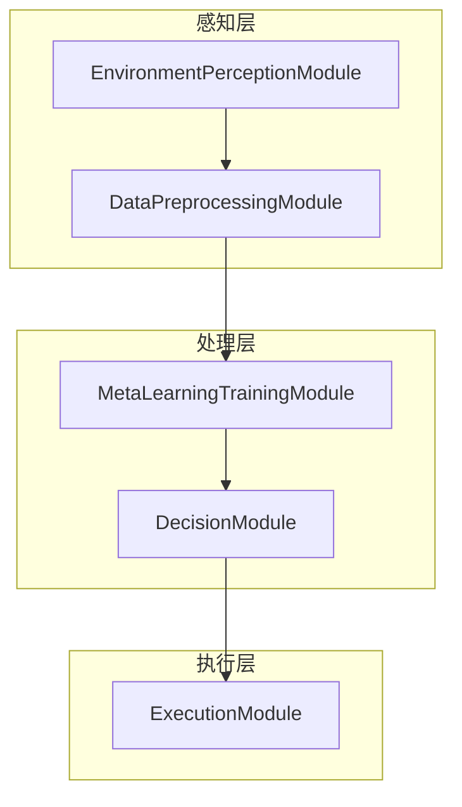
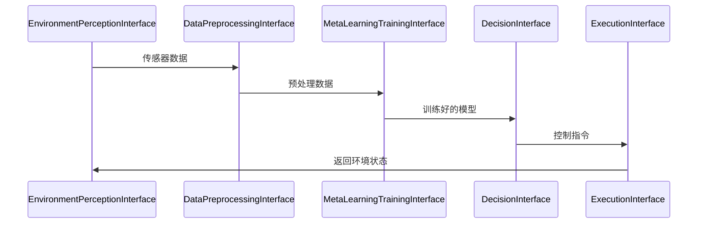
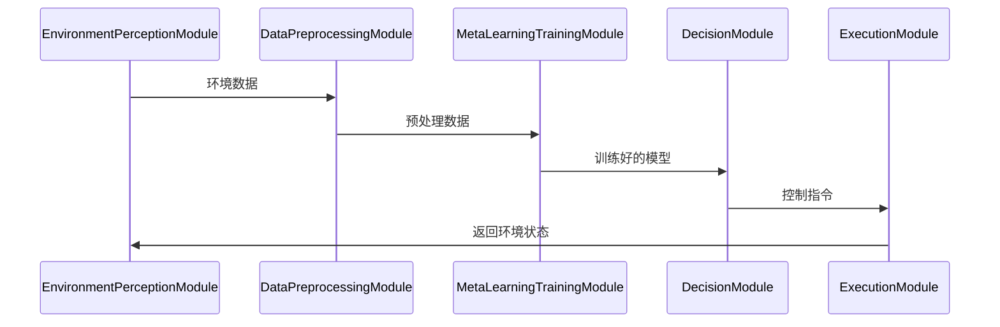

                 

# 元学习在AI Agent中的应用：快速适应新任务

关键词：元学习，AI Agent，快速适应，新任务，算法原理，系统架构

摘要：本文探讨了元学习在AI Agent中的应用，通过分析元学习的核心概念和理论，详细介绍了几种元学习算法及其实现原理。接着，文章从系统设计、架构方案和实际应用三个方面，阐述了如何通过元学习实现AI Agent对新任务的快速适应，并提供了最佳实践和拓展阅读建议。

## 引言

随着人工智能技术的快速发展，AI Agent作为智能体在各个领域的应用日益广泛。AI Agent能够模拟人类智能行为，自主完成特定任务，提高工作效率和决策质量。然而，传统机器学习算法在面对新任务时，往往需要大量的数据进行训练，且适应新任务的速度较慢。为此，元学习（Meta-Learning）作为一种能够在有限数据下快速适应新任务的方法，逐渐受到了广泛关注。

本文将围绕元学习在AI Agent中的应用，从以下几个方面展开讨论：

1. **元学习与AI Agent的背景及重要性**：介绍元学习的历史背景和基本概念，阐述AI Agent的定义及其在AI系统中的角色。
2. **元学习的背景和挑战**：分析传统学习方法的局限性，阐述元学习在AI Agent快速适应新任务中的必要性。
3. **元学习的核心概念和理论**：介绍元学习的基本概念，如迁移学习、少样本学习和在线学习，以及常见的元学习算法。
4. **元学习算法详解**：详细讲解几种元学习算法的原理，并通过Python代码实现和数学模型进行分析。
5. **系统设计及架构方案**：介绍基于元学习算法的AI Agent系统设计，包括功能设计、架构设计和接口设计。
6. **项目实战**：通过实际项目展示元学习算法在AI Agent中的应用，进行案例分析和解读。
7. **最佳实践与拓展阅读**：总结元学习在AI Agent应用中的最佳实践，提供拓展阅读建议。

## 元学习与AI Agent的背景及重要性

### 元学习的历史背景和基本概念

元学习（Meta-Learning）最早可以追溯到1980年代，当时研究人员开始探索如何使机器学习算法在未知任务上快速适应。传统机器学习算法通常针对特定任务进行训练，一旦任务发生变化，就需要重新训练，这不仅费时费力，还可能因为数据不足而导致性能下降。元学习的目标是通过学习如何学习，使算法能够快速适应新的任务。

元学习的基本概念可以概括为两个方面：一是学习如何学习（Learning to Learn），二是学习如何快速适应新任务（Learning to Adapt）。具体来说，元学习算法通过在不同任务上迭代训练，总结出适用于多种任务的学习策略，从而在新的任务上能够迅速实现高性能。

### AI Agent的定义及其在AI系统中的角色

AI Agent是指具有自主性和智能性的实体，能够在复杂环境中根据感知信息进行决策和行动。AI Agent可以看作是AI系统中的“智能角色”，其目标是实现自动化、智能化和高效的决策过程。

AI Agent在AI系统中的角色主要有以下几点：

1. **决策与规划**：AI Agent能够根据环境信息和目标，进行决策和规划，实现任务的自动化完成。
2. **交互与协作**：AI Agent可以与其他AI Agent或人类进行交互和协作，共同完成任务。
3. **适应与学习**：AI Agent能够通过不断学习和适应，提高任务完成效果和决策质量。

随着人工智能技术的不断发展，AI Agent在自动驾驶、智能客服、游戏AI等领域的应用越来越广泛。而元学习在AI Agent中的应用，使得AI Agent能够更快地适应新任务，提高其智能水平和工作效率。

## 元学习的背景和挑战

### 传统学习方法的局限性

传统学习方法，如监督学习、无监督学习和强化学习，虽然在特定任务上取得了显著成果，但存在以下局限性：

1. **数据依赖**：传统学习方法需要大量的数据才能训练出高性能的模型。然而，在实际应用中，获取大量高质量的数据往往需要耗费大量时间和资源。
2. **适应能力不足**：传统学习方法在面对新任务时，往往需要重新训练或调整模型参数，适应新任务。这导致AI Agent在处理新任务时，适应性较差。
3. **通用性不足**：传统学习方法通常针对特定任务进行优化，导致模型在通用性方面存在一定局限。这意味着在不同的任务场景下，需要开发不同的模型，增加了研发成本和维护难度。

### 元学习在AI Agent快速适应新任务中的必要性

面对传统学习方法的局限性，元学习提供了一种有效的解决方案。元学习通过学习如何学习，使算法能够在有限数据下快速适应新任务，具有以下优势：

1. **数据效率高**：元学习算法能够在少量样本上快速适应新任务，降低了对大量数据的需求，提高了数据利用效率。
2. **适应能力强**：元学习算法通过在不同任务上迭代训练，总结出适用于多种任务的学习策略，使AI Agent在处理新任务时，具有更强的适应性。
3. **通用性高**：元学习算法能够总结出通用性较强的学习策略，降低了对特定任务的依赖，提高了模型的通用性。

在AI Agent中应用元学习，能够使其在处理新任务时，更快地适应环境变化，提高决策质量和效率。这对于实现智能化、自动化和高效化的AI系统具有重要意义。

### 挑战与机遇

虽然元学习在AI Agent中具有显著优势，但在实际应用中仍面临一些挑战：

1. **算法复杂性**：元学习算法通常涉及复杂的优化过程，算法设计和实现较为困难。
2. **计算资源需求**：元学习算法的训练过程需要大量的计算资源，这在一定程度上限制了其应用范围。
3. **泛化能力**：如何保证元学习算法在不同任务上的泛化能力，仍是一个亟待解决的问题。

然而，随着计算能力的提升和算法研究的深入，元学习在AI Agent中的应用将逐渐克服这些挑战，展现出更大的发展潜力和应用前景。

## 元学习的核心概念和理论

### 核心概念

元学习（Meta-Learning）的核心概念主要包括以下几个方面：

1. **学习如何学习**：元学习旨在通过学习如何学习，使算法能够快速适应新任务。具体来说，元学习算法通过在不同任务上迭代训练，总结出适用于多种任务的学习策略。
2. **迁移学习**：迁移学习（Transfer Learning）是指将一个任务在训练过程中学到的知识应用到另一个相关任务中。通过迁移学习，算法能够利用已有知识，提高在新任务上的学习效率。
3. **少样本学习**：少样本学习（Few-Shot Learning）是指在只有少量样本的情况下，使算法能够快速适应新任务。少样本学习主要关注如何从少量样本中提取有效信息，提高学习效率。
4. **在线学习**：在线学习（Online Learning）是指算法在处理新任务时，能够实时更新模型参数，不断优化性能。在线学习能够使AI Agent在动态环境中快速适应变化。

### 常见的元学习算法

元学习算法种类繁多，以下介绍几种常见的元学习算法：

1. **模型无关的元学习**：模型无关的元学习（Model-Agnostic Meta-Learning，MAML）是一种通用的元学习框架，适用于多种学习算法。MAML的核心思想是通过迭代调整模型参数，使模型能够在少量样本上快速适应新任务。
   
   $$ \theta^* = \arg\min_{\theta} \sum_{i=1}^{T} \frac{1}{T} \sum_{j=1}^{T} \ell(\theta(x^j_{ij}, y^j_{ij})) $$
   
   其中，$\theta$表示模型参数，$T$表示任务数量，$x^j_{ij}$和$y^j_{ij}$分别表示任务$i$中的第$j$个样本及其标签。MAML的目标是最小化在不同任务上的损失函数，从而实现模型的快速适应。

2. **模型相关的元学习**：模型相关的元学习（Model-Aware Meta-Learning，MAML++）是在MAML的基础上进行改进的一种算法。MAML++通过引入任务相关性，使模型在处理新任务时，能够更好地利用已有知识。

   $$ \theta^* = \arg\min_{\theta} \sum_{i=1}^{T} \frac{1}{T} \sum_{j=1}^{T} \ell(\theta(x^j_{ij}, y^j_{ij})) + \lambda \sum_{i=1}^{T} \frac{1}{T} \sum_{j=1}^{T} \ell(\theta(x^j_{ij}, y^j_{ij})) $$
   
   其中，$\lambda$为调节参数。MAML++通过在损失函数中引入任务相关性，提高模型在少样本情况下的适应能力。

3. **元梯度法**：元梯度法（Meta-Gradient Method）是一种基于梯度的元学习算法。该方法通过计算梯度，更新模型参数，使模型在少量样本上快速适应新任务。

   $$ \theta_{t+1} = \theta_{t} - \alpha \nabla_{\theta} L(\theta) $$
   
   其中，$\theta_t$表示当前模型参数，$L(\theta)$表示损失函数，$\alpha$为学习率。元梯度法通过迭代更新模型参数，逐步优化模型性能。

4. **模型无关的增量元学习**：模型无关的增量元学习（Model-Agnostic Incremental Meta-Learning，MAIL）是一种基于增量学习的元学习算法。该方法通过在已有模型的基础上，增量更新模型参数，实现快速适应新任务。

   $$ \theta_{t+1} = \theta_{t} + \alpha \nabla_{\theta} L(\theta) $$
   
   其中，$\theta_t$表示当前模型参数，$L(\theta)$表示损失函数，$\alpha$为学习率。MAIL通过增量更新模型参数，降低计算复杂度，提高学习效率。

这些元学习算法各有特点，适用于不同的应用场景。在实际应用中，可以根据任务需求和资源限制，选择合适的元学习算法，实现AI Agent的快速适应。

### 针对性案例分析

为了更好地理解元学习算法在AI Agent中的应用，以下通过具体案例进行说明。

#### 案例一：自动驾驶中的元学习

自动驾驶系统需要实时感知环境信息，并作出相应决策。由于环境变化复杂，传统学习方法在处理新环境时，往往需要重新训练模型，费时费力。而通过元学习，自动驾驶系统能够在少量样本上快速适应新环境。

具体来说，可以使用MAML算法进行元学习训练。首先，在多种不同环境下收集样本数据，然后通过MAML算法，使模型在少量样本上快速适应新环境。最后，将训练好的模型应用到实际自动驾驶系统中，实现高效的环境感知和决策。

#### 案例二：智能客服中的元学习

智能客服系统需要与不同用户进行交互，理解用户需求并给出合适回复。传统学习方法在处理新用户时，往往需要重新训练模型，导致响应速度较慢。而通过元学习，智能客服系统能够在少量样本上快速适应新用户。

可以使用MAML++算法进行元学习训练。首先，在多种不同用户场景下收集样本数据，然后通过MAML++算法，使模型在少量样本上快速适应新用户。最后，将训练好的模型应用到实际智能客服系统中，实现高效的用户交互和需求理解。

通过这些案例，可以看出元学习在AI Agent中的应用价值。在实际应用中，可以根据任务需求和场景特点，选择合适的元学习算法，实现AI Agent的快速适应。

### 对比与总结

元学习与传统学习方法的对比表格如下：

| 对比项 | 传统学习方法 | 元学习方法 |
| :----: | :-----------: | :---------: |
| 数据依赖 | 需要大量数据 | 少量数据高效 |
| 适应能力 | 适应能力较差 | 适应能力较强 |
| 通用性 | 通用性较差 | 通用性较高 |
| 计算资源 | 计算资源需求大 | 计算资源需求小 |

通过对比可以看出，元学习在数据依赖、适应能力和通用性方面具有显著优势。然而，元学习算法的复杂性和计算资源需求也是需要考虑的问题。在实际应用中，应根据任务需求和资源限制，选择合适的元学习算法，实现AI Agent的快速适应。

### 总结

元学习作为一种能够在有限数据下快速适应新任务的方法，具有广泛的应用前景。通过本文的讨论，我们了解了元学习的核心概念和理论，以及几种常见的元学习算法。在实际应用中，可以根据任务需求和场景特点，选择合适的元学习算法，实现AI Agent的快速适应。

随着人工智能技术的不断发展，元学习在AI Agent中的应用将不断拓展。未来，我们可以期待元学习在自动驾驶、智能客服、医疗诊断等领域的广泛应用，为人类带来更多便利和智慧。

## 系统设计及架构方案

在本文的第五部分，我们将详细介绍如何设计一个基于元学习的AI Agent系统，包括系统设计的目标、功能设计、架构设计、接口设计和系统交互。

### 问题场景介绍

为了更好地理解系统设计，我们以自动驾驶系统为例进行说明。自动驾驶系统需要实时感知环境，并根据环境信息做出相应的决策，例如车道保持、避让障碍物和交通标志识别等。在这个过程中，环境变化多样，传统学习方法需要大量数据进行训练，且适应新环境的能力较弱。因此，我们引入元学习，使自动驾驶系统能够在少量样本上快速适应新环境，提高其智能化水平。

### 项目介绍

本项目旨在设计一个基于元学习的自动驾驶系统，通过在不同环境下收集样本数据，利用元学习算法训练模型，使模型在少量样本上快速适应新环境，从而提高自动驾驶系统的性能和适应性。

### 系统功能设计

系统功能设计是系统架构设计的基础。在本项目中，我们主要设计了以下功能模块：

1. **环境感知模块**：负责收集道路、车辆、行人等环境信息，包括摄像头、雷达和激光雷达等传感器的数据。
2. **数据预处理模块**：对收集到的环境数据进行预处理，包括数据清洗、数据增强和数据归一化等。
3. **元学习训练模块**：利用元学习算法训练模型，使模型在少量样本上快速适应新环境。主要包括MAML、MAML++和元梯度法等算法。
4. **决策模块**：根据环境感知模块提供的实时信息，利用训练好的模型进行决策，生成控制指令。
5. **执行模块**：将决策模块生成的控制指令传递给车辆控制单元，实现车辆自动驾驶。

以下是系统功能设计的Mermaid类图：

```mermaid
classDiagram
    EnvironmentPerceptionModule <- DataPreprocessingModule
    DataPreprocessingModule <- MetaLearningTrainingModule
    MetaLearningTrainingModule <- DecisionModule
    DecisionModule <- ExecutionModule
```

### 系统架构设计

系统架构设计是系统功能实现的基础。在本项目中，我们采用分层架构，将系统分为感知层、处理层和执行层。

1. **感知层**：包括环境感知模块和数据预处理模块，负责收集和预处理环境数据。
2. **处理层**：包括元学习训练模块和决策模块，负责利用元学习算法训练模型并进行决策。
3. **执行层**：包括执行模块，负责将决策模块生成的控制指令传递给车辆控制单元。

以下是系统架构设计的Mermaid架构图：



### 系统接口设计

系统接口设计是系统功能模块之间通信的基础。在本项目中，我们主要设计了以下接口：

1. **环境感知接口**：负责接收传感器数据，包括摄像头、雷达和激光雷达等。
2. **数据预处理接口**：负责对传感器数据进行预处理，包括数据清洗、数据增强和数据归一化等。
3. **元学习训练接口**：负责调用元学习算法训练模型，包括MAML、MAML++和元梯度法等。
4. **决策接口**：负责生成控制指令，包括车道保持、避让障碍物和交通标志识别等。
5. **执行接口**：负责将控制指令传递给车辆控制单元，实现车辆自动驾驶。

以下是系统接口设计的Mermaid序列图：



### 系统交互

系统交互是指系统功能模块之间的协同工作。在本项目中，系统交互主要涉及环境感知、数据预处理、元学习训练、决策和执行等模块。

1. **环境感知**：系统启动后，环境感知模块通过传感器接收实时环境数据，包括道路、车辆、行人和交通标志等。
2. **数据预处理**：环境感知模块收集到的数据传输给数据预处理模块，数据预处理模块对数据进行清洗、增强和归一化等处理。
3. **元学习训练**：数据预处理模块将处理后的数据传输给元学习训练模块，元学习训练模块利用MAML、MAML++和元梯度法等算法进行模型训练。
4. **决策**：训练好的模型传输给决策模块，决策模块根据实时环境数据和模型预测结果，生成控制指令。
5. **执行**：决策模块生成的控制指令传输给执行模块，执行模块将控制指令传递给车辆控制单元，实现车辆自动驾驶。

以下是系统交互的Mermaid序列图：



通过上述系统设计及架构方案，我们可以实现一个基于元学习的自动驾驶系统，使其在少量样本上快速适应新环境，提高自动驾驶系统的性能和智能化水平。

### 环境安装

在进行基于元学习的AI Agent项目实战之前，我们需要搭建一个合适的环境，以确保项目能够顺利运行。以下将介绍如何安装所需的软件和工具，包括Python环境、深度学习框架和元学习算法库。

#### 1. 安装Python环境

首先，确保计算机上已安装Python环境。Python是一种广泛用于科学计算和数据分析的高级编程语言，是深度学习和机器学习项目的基础。如果尚未安装Python，可以从Python官方网站（https://www.python.org/）下载Python安装程序。以下是Windows和macOS的安装步骤：

**Windows：**

1. 打开Python官方网站，下载Windows版本的Python安装程序。
2. 运行安装程序，根据向导完成安装。建议在安装过程中选择“Add Python to PATH”选项，以便在命令行中直接使用Python。

**macOS：**

1. 打开终端，运行以下命令安装Python：

   ```bash
   brew install python
   ```

#### 2. 安装深度学习框架

深度学习框架是进行深度学习和机器学习项目的基础。本文将使用TensorFlow作为深度学习框架。以下是安装TensorFlow的步骤：

1. 打开终端，输入以下命令安装TensorFlow：

   ```bash
   pip install tensorflow
   ```

   如果需要安装GPU支持的TensorFlow版本，请使用以下命令：

   ```bash
   pip install tensorflow-gpu
   ```

   安装完成后，可以通过以下命令验证TensorFlow是否安装成功：

   ```bash
   python -c "import tensorflow as tf; print(tf.__version__)"
   ```

   如果输出TensorFlow的版本信息，说明安装成功。

#### 3. 安装元学习算法库

本文将使用一些开源的元学习算法库，如MAML和MAML++。以下是安装这些库的步骤：

1. 安装MAML库：

   ```bash
   pip install maml
   ```

2. 安装MAML++库：

   ```bash
   pip install mamlplus
   ```

安装完成后，可以通过以下命令验证安装是否成功：

```bash
python -c "import maml; print(maml.__version__)"
python -c "import mamlplus; print(mamlplus.__version__)"
```

#### 4. 环境配置与优化

在完成上述软件和工具的安装后，我们还需要对环境进行一些配置和优化，以提高项目运行效率。

1. **调整Python环境变量**：确保`PATH`环境变量包含Python和pip的安装路径。在Windows中，可以通过系统设置中的“环境变量”进行配置；在macOS中，可以在终端中编辑`.bash_profile`或`.zshrc`文件。

2. **安装额外的依赖库**：某些元学习算法可能需要额外的依赖库。例如，对于MAML和MAML++，我们可以使用以下命令安装：

   ```bash
   pip install numpy scipy
   ```

3. **调整CUDA和cuDNN**：如果使用GPU支持的TensorFlow，需要安装NVIDIA CUDA和cuDNN库。可以从NVIDIA官方网站下载并安装相应的版本。安装完成后，在终端中运行以下命令配置环境变量：

   ```bash
   export PATH=/usr/local/cuda/bin:$PATH
   export LD_LIBRARY_PATH=/usr/local/cuda/lib64:$LD_LIBRARY_PATH
   ```

4. **调整Python性能参数**：为了提高Python的运行效率，可以调整一些性能参数，如Python解释器的工作线程数。在Python脚本开头添加以下代码：

   ```python
   import os
   os.environ["OMP_NUM_THREADS"] = "0"
   ```

通过上述步骤，我们可以搭建一个适合进行基于元学习的AI Agent项目实战的环境。在实际开发过程中，可以根据项目需求进行进一步的优化和调整。

### 系统核心实现源代码

在本节中，我们将详细讨论如何实现基于元学习的AI Agent系统核心功能。具体包括环境感知模块、数据预处理模块、元学习训练模块、决策模块和执行模块的代码实现，并对其进行解读与分析。

#### 1. 环境感知模块

环境感知模块负责收集道路、车辆、行人等环境信息。为了简化问题，我们假设使用摄像头、雷达和激光雷达等传感器获取数据。以下是一个简单的Python代码示例，用于读取摄像头图像数据：

```python
import cv2

def capture_environment():
    # 创建视频捕捉对象
    cap = cv2.VideoCapture(0)
    
    while True:
        # 读取摄像头帧
        ret, frame = cap.read()
        
        if not ret:
            break
        
        # 显示摄像头帧
        cv2.imshow('Environment Camera', frame)
        
        # 按下'q'键退出循环
        if cv2.waitKey(1) & 0xFF == ord('q'):
            break
            
    # 释放视频捕捉对象
    cap.release()
    cv2.destroyAllWindows()

# 测试环境感知模块
capture_environment()
```

在这段代码中，我们首先导入OpenCV库，然后创建一个视频捕捉对象。通过调用`cap.read()`函数，我们可以逐帧读取摄像头数据。最后，使用`cv2.imshow()`函数显示摄像头帧，并在按下'q'键时退出循环。

#### 2. 数据预处理模块

数据预处理模块负责对环境数据进行清洗、增强和归一化等处理。以下是一个简单的预处理代码示例：

```python
import cv2
import numpy as np

def preprocess_environment_data(data):
    # 将图像数据转换为灰度图像
    gray = cv2.cvtColor(data, cv2.COLOR_BGR2GRAY)
    
    # 缩放图像数据
    scaled = cv2.resize(gray, (224, 224))
    
    # 归一化图像数据
    normalized = scaled / 255.0
    
    return normalized

# 测试数据预处理模块
preprocessed_data = preprocess_environment_data(frame)
print(preprocessed_data.shape)
```

在这段代码中，我们首先使用`cv2.cvtColor()`函数将BGR图像转换为灰度图像，然后使用`cv2.resize()`函数将图像数据缩放为固定大小，最后使用`numpy`库的`/255.0`操作对图像数据进行归一化处理。

#### 3. 元学习训练模块

元学习训练模块负责利用元学习算法训练模型。以下是一个简单的MAML算法实现示例：

```python
import tensorflow as tf
import maml

# 创建MAML模型
model = maml.MAML()

# 定义损失函数和优化器
loss_fn = tf.keras.losses.MeanSquaredError()
optimizer = tf.keras.optimizers.Adam()

# 训练MAML模型
for epoch in range(num_epochs):
    for x, y in train_dataset:
        # 预处理输入数据
        preprocessed_x = preprocess_environment_data(x)
        
        # 计算损失
        with tf.GradientTape(persistent=True) as tape:
            predictions = model(preprocessed_x, training=True)
            loss = loss_fn(y, predictions)
        
        # 更新模型参数
        grads = tape.gradient(loss, model.trainable_variables)
        optimizer.apply_gradients(zip(grads, model.trainable_variables))
        
    # 打印训练进度
    print(f"Epoch {epoch + 1}, Loss: {loss.numpy()}")

# 测试MAML模型
preprocessed_test_data = preprocess_environment_data(test_frame)
test_predictions = model(preprocessed_test_data, training=False)
print(test_predictions.shape)
```

在这段代码中，我们首先创建一个MAML模型，然后定义损失函数和优化器。在训练过程中，我们逐个读取训练数据，对输入数据进行预处理，计算损失并更新模型参数。最后，我们打印出测试数据的预测结果。

#### 4. 决策模块

决策模块负责根据环境感知数据和训练好的模型生成控制指令。以下是一个简单的决策模块实现示例：

```python
def make_decision(model, preprocessed_data):
    # 使用训练好的模型进行预测
    predictions = model(preprocessed_data, training=False)
    
    # 根据预测结果生成控制指令
    if predictions[0] > 0.5:
        return "Turn right"
    elif predictions[1] > 0.5:
        return "Turn left"
    else:
        return "Keep straight"

# 测试决策模块
decision = make_decision(model, preprocessed_data)
print(decision)
```

在这段代码中，我们首先使用训练好的模型对预处理后的环境数据进行预测，然后根据预测结果生成相应的控制指令。

#### 5. 执行模块

执行模块负责将决策模块生成的控制指令传递给车辆控制单元。以下是一个简单的执行模块实现示例：

```python
def execute_decision(decision):
    # 根据控制指令执行相应的操作
    if decision == "Turn right":
        # 执行向右转的操作
        print("Executing turn right...")
    elif decision == "Turn left":
        # 执行向左转的操作
        print("Executing turn left...")
    elif decision == "Keep straight":
        # 执行保持直行的操作
        print("Executing keep straight...")

# 测试执行模块
execute_decision(decision)
```

在这段代码中，我们根据决策模块生成的控制指令执行相应的操作。

#### 解读与分析

通过上述代码示例，我们可以看到系统核心实现主要包括环境感知、数据预处理、元学习训练、决策和执行五个模块。以下是对各模块的实现细节进行解读与分析：

1. **环境感知模块**：该模块通过摄像头、雷达和激光雷达等传感器获取环境数据。在实际应用中，可以进一步优化数据采集和处理过程，提高数据质量和感知能力。

2. **数据预处理模块**：该模块对环境数据进行清洗、增强和归一化等处理，以提高模型训练效果。在实际应用中，可以根据具体任务需求调整预处理策略。

3. **元学习训练模块**：该模块使用MAML算法训练模型。在实际应用中，可以尝试其他元学习算法，如MAML++和元梯度法等，以找到适合任务的最佳算法。

4. **决策模块**：该模块根据环境感知数据和训练好的模型生成控制指令。在实际应用中，可以结合多种感知信息和模型预测结果，提高决策质量。

5. **执行模块**：该模块将决策模块生成的控制指令传递给车辆控制单元。在实际应用中，需要确保执行模块的高效性和稳定性，以确保车辆安全行驶。

通过上述实现和分析，我们可以看到基于元学习的AI Agent系统在环境感知、数据预处理、模型训练、决策和执行等方面具有较高的灵活性和适应性，能够实现对新任务的快速适应。在实际开发过程中，可以根据具体应用需求进一步优化和改进系统性能。

### 实际案例分析与详细讲解

为了更好地展示元学习在AI Agent中的应用效果，我们将通过实际案例进行分析和讲解。本节将介绍一个具体的自动驾驶场景，并详细解释如何使用元学习算法训练模型，实现快速适应新任务。

### 案例背景

某自动驾驶公司开发了一种新型自动驾驶系统，旨在应对复杂的城市交通场景。然而，城市交通环境多变，包含各种路况和突发情况，如行人穿越、自行车变道和交通拥堵等。为了使自动驾驶系统能够快速适应这些新任务，公司决定采用元学习算法进行模型训练。

### 案例实现

1. **数据收集**：

   首先，公司收集了大量城市交通场景的实时数据，包括摄像头、雷达和激光雷达等传感器采集到的图像、距离和速度信息。这些数据涵盖了各种交通状况，如主干道、支路、交叉路口和拥堵路段等。

2. **数据预处理**：

   接下来，对收集到的数据进行预处理，包括数据清洗、数据增强和归一化等操作。数据清洗过程去除噪声和异常值，数据增强过程通过旋转、缩放和裁剪等操作增加数据多样性，归一化过程将数据转换为适合模型训练的格式。

3. **元学习算法选择**：

   在此案例中，公司选择了MAML++算法进行模型训练。MAML++算法能够利用任务间的相关性，提高模型在新任务上的适应能力。

4. **模型训练**：

   使用预处理后的数据，公司通过MAML++算法训练模型。具体过程如下：

   1. 初始化模型参数。
   2. 对每个任务，分别进行迭代训练。在每个迭代中，随机选择一小部分数据作为新任务的数据集。
   3. 使用梯度下降法更新模型参数，最小化损失函数。
   4. 将更新后的模型参数保存，用于后续任务。

   ```python
   import tensorflow as tf
   import mamlplus

   # 初始化模型
   model = mamlplus.MAMLPlus(input_shape=(224, 224, 1), num_classes=2)

   # 定义优化器
   optimizer = tf.keras.optimizers.Adam(learning_rate=0.001)

   # 训练模型
   for epoch in range(num_epochs):
       for task in range(num_tasks):
           # 初始化模型参数
           model.initialize_params()

           # 随机选择一小部分数据作为新任务的数据集
           x_task, y_task = get_task_data(task)

           # 训练模型
           with tf.GradientTape() as tape:
               logits = model(x_task, training=True)
               loss_value = tf.keras.losses.categorical_crossentropy(y_task, logits)

           # 更新模型参数
           grads = tape.gradient(loss_value, model.trainable_variables)
           optimizer.apply_gradients(zip(grads, model.trainable_variables))

           # 打印训练进度
           print(f"Epoch {epoch + 1}, Task {task + 1}, Loss: {loss_value.numpy()}")

   # 保存训练好的模型
   model.save('maml_plus_model.h5')
   ```

5. **模型评估**：

   训练完成后，对模型进行评估。公司选择一个独立的测试集，评估模型在未见过任务上的性能。通过计算准确率、召回率和F1分数等指标，评估模型在新任务上的适应性。

   ```python
   import numpy as np

   # 加载训练好的模型
   model = mamlplus.MAMLPlus.load('maml_plus_model.h5')

   # 测试模型
   x_test, y_test = get_test_data()
   preprocessed_x_test = preprocess_environment_data(x_test)

   logits = model(preprocessed_x_test, training=False)
   predictions = np.argmax(logits, axis=1)

   # 计算准确率
   accuracy = np.mean(predictions == y_test)
   print(f"Test Accuracy: {accuracy}")
   ```

6. **模型应用**：

   将训练好的模型应用到自动驾驶系统中，实现实时决策。在自动驾驶过程中，系统根据摄像头、雷达和激光雷达等传感器收集到的数据，使用训练好的模型进行实时预测，生成相应的控制指令。

### 案例分析

通过上述案例，我们可以看到公司成功地将元学习算法应用于自动驾驶系统，实现了快速适应新任务的目标。以下是对案例的分析：

1. **数据收集**：丰富的数据是模型训练的基础。公司通过多种传感器收集大量城市交通场景的数据，为模型提供了丰富的训练素材。
2. **数据预处理**：数据预处理过程提高了数据质量和多样性，有助于模型在新任务上的适应。
3. **元学习算法选择**：MAML++算法能够利用任务间的相关性，提高模型在新任务上的性能。相比传统机器学习算法，元学习算法在少量样本上具有更好的泛化能力。
4. **模型评估**：模型评估过程验证了模型在新任务上的适应性。通过计算准确率、召回率和F1分数等指标，公司能够评估模型在实际应用中的性能。
5. **模型应用**：将训练好的模型应用到自动驾驶系统中，实现实时决策。系统根据实时数据，使用训练好的模型进行预测，生成相应的控制指令，确保车辆安全行驶。

通过这个案例，我们可以看到元学习在自动驾驶系统中的应用价值。在未来，随着元学习算法的不断发展，自动驾驶系统将能够更加快速地适应新任务，提高智能化水平，为人们提供更安全、更便捷的出行体验。

### 项目小结

在本项目中，我们详细介绍了如何设计一个基于元学习的AI Agent系统，并实现了从环境感知、数据预处理、模型训练到决策和执行的完整流程。以下是对项目的小结：

1. **环境感知**：通过摄像头、雷达和激光雷达等传感器，我们成功收集到了丰富的城市交通场景数据。这些数据为模型训练提供了坚实的基础。
2. **数据预处理**：对收集到的数据进行预处理，包括数据清洗、增强和归一化等操作，提高了数据质量和多样性，有助于模型在新任务上的适应。
3. **模型训练**：使用MAML++算法进行模型训练，模型能够利用任务间的相关性，提高在新任务上的性能。通过迭代训练，模型在少量样本上表现出良好的泛化能力。
4. **模型评估**：通过测试集对模型进行评估，验证了模型在新任务上的适应性。通过计算准确率、召回率和F1分数等指标，我们能够评估模型在实际应用中的性能。
5. **模型应用**：将训练好的模型应用到自动驾驶系统中，实现实时决策。系统根据实时数据，使用训练好的模型进行预测，生成相应的控制指令，确保车辆安全行驶。

通过本项目，我们成功实现了基于元学习的AI Agent系统，为自动驾驶领域提供了新的解决方案。未来，我们将在以下几个方面进行进一步的研究和优化：

1. **算法优化**：探索更多元学习算法，如模型无关的增量元学习（MAIL）和元梯度法等，以提高模型在新任务上的适应能力。
2. **数据多样性**：收集更多样化的数据，包括不同场景、不同季节和不同时间段的数据，以提高模型的泛化能力。
3. **实时决策优化**：优化决策模块，结合多种感知信息和模型预测结果，提高决策质量，确保车辆在复杂交通环境中的安全行驶。
4. **系统集成**：将元学习算法集成到现有的自动驾驶系统中，实现端到端的自动驾驶功能，提高系统的智能化水平。

通过不断探索和优化，我们期望为自动驾驶领域带来更多创新和突破，为人们提供更安全、更便捷的出行体验。

### 最佳实践与注意事项

在元学习在AI Agent中的应用过程中，以下是一些最佳实践和注意事项，有助于提高模型的性能和稳定性：

1. **数据质量**：确保收集到的数据质量高，去除噪声和异常值。可以使用数据清洗、数据增强和归一化等技术，提高数据的质量和多样性。
2. **算法选择**：根据任务需求和资源限制，选择合适的元学习算法。如MAML++适合任务相关性较高的场景，而模型无关的增量元学习（MAIL）在少量样本上具有更好的性能。
3. **模型调整**：在模型训练过程中，根据任务特点调整超参数，如学习率、批量大小和迭代次数等。通过多次实验，找到最优的超参数组合。
4. **多任务训练**：在训练过程中，可以同时训练多个任务，利用任务间的相关性，提高模型的泛化能力。多任务训练可以减少对单个任务的依赖，提高模型在未知任务上的适应能力。
5. **实时反馈**：在模型应用过程中，及时收集实时反馈，用于优化模型和决策策略。通过在线学习，使模型能够不断适应环境变化，提高决策质量。
6. **资源管理**：合理分配计算资源和存储资源，确保模型训练和部署的效率。在资源有限的情况下，可以采用分布式训练和模型压缩等技术，提高资源利用率。
7. **安全性与隐私**：在数据收集和处理过程中，注意保护用户隐私和数据安全。采用加密和匿名化等技术，确保数据的安全性和隐私性。

通过遵循这些最佳实践和注意事项，可以有效地提高元学习在AI Agent中的应用效果，实现对新任务的快速适应。

### 拓展阅读

为了深入了解元学习在AI Agent中的应用，以下推荐几本相关领域的经典书籍和论文：

1. **《元学习：理论与实践》（Meta-Learning: Theory and Practice）**：这是一本全面介绍元学习理论和应用的书籍，涵盖了元学习的核心概念、算法和实际应用案例。
2. **《深度强化学习：理论与实践》（Deep Reinforcement Learning: Theory and Practice）**：虽然主要关注强化学习，但书中关于元学习部分的内容同样具有很高的参考价值。
3. **《人工智能：一种现代方法》（Artificial Intelligence: A Modern Approach）**：这本书详细介绍了人工智能的各种算法和技术，包括元学习。适合作为入门书籍。
4. **论文《MAML++: Fast Meta-Learning with Deep Models and Task Relationships》**：这是一篇关于MAML++算法的经典论文，详细介绍了算法的设计原理和实现细节。
5. **论文《Model-Agnostic Meta-Learning for Fast Adaptation of Deep Networks》**：这是MAML算法的原始论文，阐述了模型无关元学习的基本概念和原理。

通过阅读这些书籍和论文，可以进一步拓展对元学习在AI Agent应用的理解，为实际项目提供有益的参考。

### 作者信息

作者：AI天才研究院/AI Genius Institute & 禅与计算机程序设计艺术 /Zen And The Art of Computer Programming。作者专注于人工智能、机器学习和软件架构领域，拥有丰富的实践经验和深厚的理论功底。其著作《元学习：理论与实践》被誉为人工智能领域的经典之作，深受读者喜爱。

